<!-- page: 1 -->

Slide 5.1.2

## Slide 5.1.1

The learning algorithm for DNF that we saw last time is a bit complicated and can be inefficient. It's also not clear that we're making good decisions about which attributes to add to a rule, especially when there's noise.

So now we're going to look at an algorithm for learning decision trees. We'll be changing our hypothesis class (sort of), our bias, and our algorithm. We'll continue to assume, for now, that the input features and the output class are boolean. We'll see later that this algorithm can be applied much more broadly.

## Decision Trees

• DNF learning algorithm is a bit cumbersome and inefficient. Also, the exact effect of the heuristic is unclear.

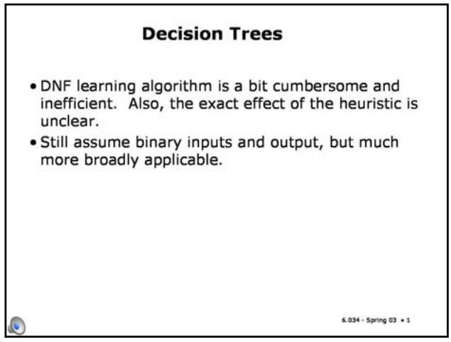

• Still assume binary inputs and output, but much more broadly applicable.

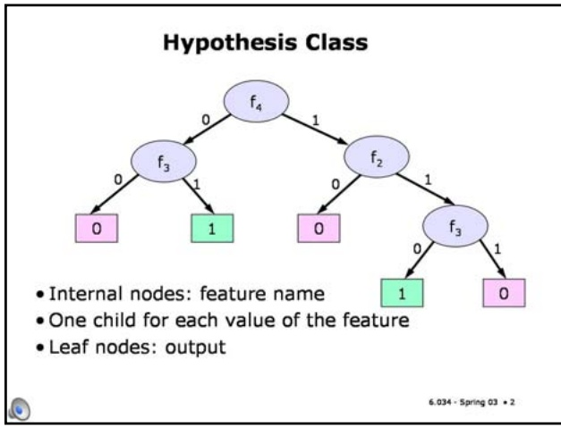

Our hypothesis class is going to be decision trees. A decision tree is a tree (big surprise!). At each internal (non-leaf) node, there is the name of a feature. There are two arcs coming out of each node, labeled 0 and 1, standing for the two possible values that the feature can take on.

Leaf nodes are labeled with decisions, or outputs. Since our y's are Boolean, the leaves are labeled with 0 or 1.

• Internal nodes: feature name

• One child for each value of the feature

• Leaf nodes: output

Slide 5.1.3

Trees represent Boolean functions from x's (vectors of feature values) to Booleans. To compute the output for a given input vector xi, we start at the root of the tree. We look at the feature there, let's say it's feature j, and then look to see what the value of xij is. Then we go down the arc corresponding to that value. If we arrive at another internal node, we look up that feature value, follow the correct arc, and so on. When we arrive at a leaf node, we take the label we find there and generate that as an output.

So, in this example, input [0 1 1 0] would generate an output of 0 (because the third element of the input has value 1 and the first has value 0, which takes to a leaf labeled 0).

## Hypothesis Class

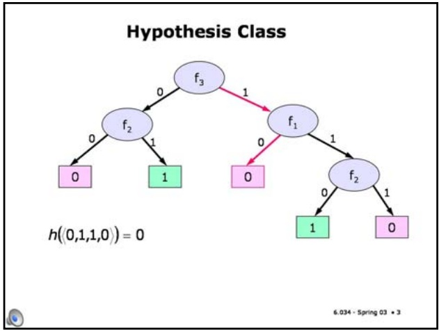

<!-- page: 2 -->

## Tree Bias

## Slide 5.1.6

• Both decision trees and DNF with negation can represent any Boolean function. So why bother with trees?

• Because we have a nice algorithm for growing trees that is consistent with a bias for simple trees (few nodes)

• Too hard to find the smallest good tree, so we'll be greedy again

• Have to watch out for overfitting

Application of Ockham's razor will lead us to prefer trees that are small, measured by the number of nodes. As before, it will be computationally intractable to find the minimum-sized tree that satisfies our error criteria. So, as before, we will be greedy, growing the tree in a way that seems like it will make it best on each step.

We'll consider a couple of methods for making sure that our resulting trees are not too large, so we can guard against overfitting.

Slide 5.1.7

## Trees vs DNF

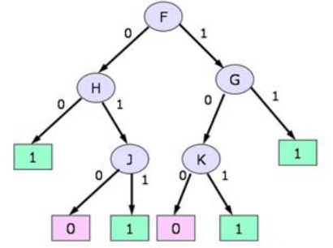

$$
(\neg F \land \neg H) \lor (\neg F \land H \land J) \lor (F \land \neg G \land K) \lor (F \land G)
$$

<!-- page: 3 -->

## Trees vs DNF

## Slide 5.1.8

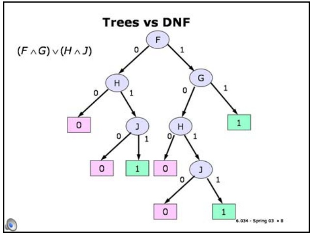

Slide 5.1.9

The idea of learning decision trees and the algorithm for doing so was, interestingly, developed independently by researchers in statistics and researchers in AI at about the same time around 1980.

But here's a case with a very simple DNF expression that requires a large tree to represent it. There's no particular reason to prefer trees over DNF or DNF over trees as a hypothesis class. But the treegrowing algorithm is simple and elegant, so we'll study it.

## Algorithm

• Developed in parallel in AI by Quinlan and in statistics by Breiman, Friedman, Olsen and Stone

## Algorithm

• Developed in parallel in AI by Quinlan and in statistics by Breiman, Friedman, Olsen and Stone

## Slide 5.1.10

BuildTree (Data)

We will build the tree from the top down. Here is pseudocode for the algorithm. It will take as input a data set, and return a tree.

Slide 5.1.11

We first test to see if all the data elements have the same y value. If so, we simply make a leaf node with that y value and we're done. This is the base case of our recursive algorithm.

## Algorithm

• Developed in parallel in AI by Quinlan and in statistics by Breiman, Friedman, Olsen and Stone

## BuildTree (Data)

if all elements of Data have the same y value, then MakeLeafNode(y)

<!-- page: 4 -->

## Algorithm

## Slide 5.1.12

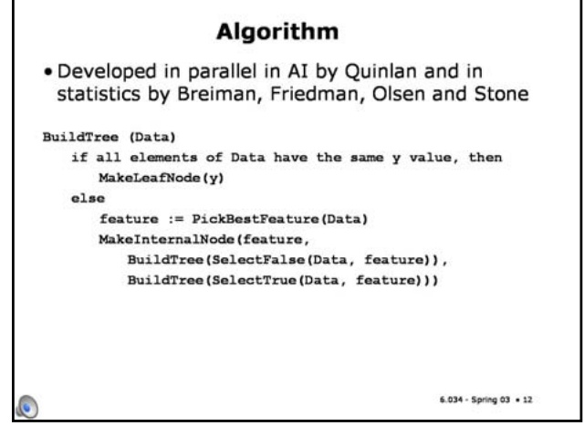

Slide 5.1.13

So, how should we choose a feature to split the data? Our goal, in building this tree, is to separate the negative instances from the positive instances with the fewest possible tests. So, for instance, if there's a feature we could pick that has value 0 for all the positive instances and 1 for all the negative instances, then we'd be delighted, because that would be the last split we'd have to make. On the other hand, a feature that divides the data into two groups that have the same proportion of positive and negative instances as we started with wouldn't seem to have helped much.

Slide 5.1.14

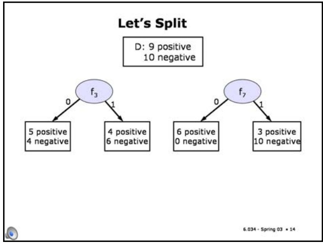

Slide 5.1.15

We'll start by looking at a standard measure of disorder, used in physics and information theory, called **entropy**. We'll just consider it in the binary case, for now. Let p be the proportion of positive examples in a data set (that is, the number of positive examples divided by the total number of examples). Then the entropy of that data set is

$$
- p \log_ {2} p - (1 - p) \log_ {2} (1 - p)
$$

If we have a mixture of different y values, we choose a feature to use to make a new internal node. Then we divide the data into two sets, those for which the value of the feature is 0 and those for which the value is 1. Finally, we call the algorithm recursively on each of these data sets. We use the selected feature and the two recursively created subtrees to build our new internal node.

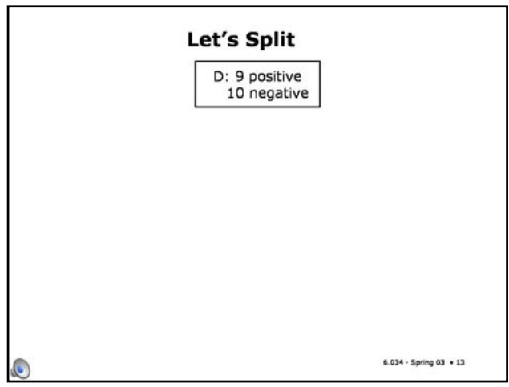

In this example, it looks like the split based on $\mathbf { f } _ { 7 }$ will be more helpful. To formalize that intuition, we need to develop a measure of the degree of uniformity of the subsets of the data we'd get by splitting on a feature.

## Entropy

p : proportion of positive examples in a data set

$$
H = - p \log_ {2} p - (1 - p) \log_ {2} (1 - p)
$$

<!-- page: 5 -->

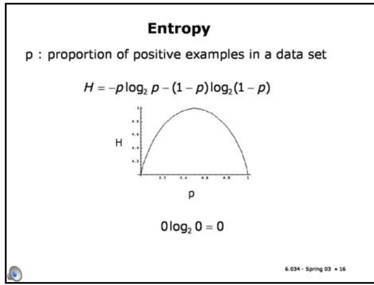

Slide 5.1.16

Slide 5.1.17

When we split the data on feature j, we get two data sets. We'll call the set of examples for which feature j has value 1 D+j and those for which j has value 0 D-j.

Slide 5.1.18

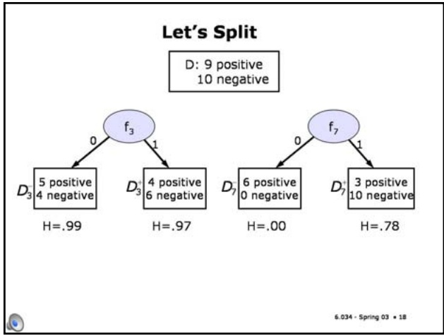

Here's a plot of the entropy as a function of p. When p is 0 or 1, then the entropy is 0. We have to be a little bit careful here. When p is 1, then 1 log 1 is clearly 0. But what about when p is 0? Log 0 is negative infinity. But 0 wins the battle, so 0 log 0 is also 0.

So, when all the elements of the set have the same value, either 0 or 1, then the entropy is 0. There is no disorder (unlike in my office!).

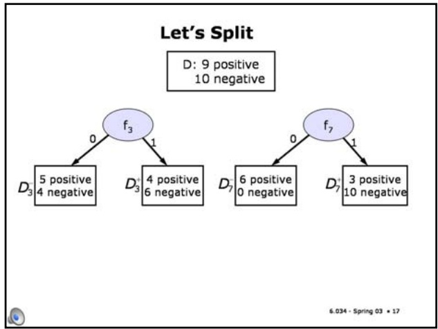

We can compute the entropy for each of these subsets. For some crazy reason, people usually use the letter H to stand for entropy. We'll follow suit.

Slide 5.1.19

The entropy function is maximized when p = 0.5. When p is one half, the set is as disordered as it can be. There's no basis for guessing what the answer might be.

Now, we have to figure out how to combine these two entropy values into a measure of how good splitting on feature j is. We could just add them together, or average them. But what if have this situation, in which there's one positive example in one data set and 100 each of positive and negative examples in the other? It doesn't really seem like we've done much good with this split, but if we averaged the entropies, we'd get a value of 1/4.

So, to keep things fair, we'll use a weighted average to combine the entropies of the two sets. Let pj be the proportion of examples in the data set D for which feature j has value 1. We'll compute a weighted **average entropy** for splitting on feature j as $\mathrm { A E ( j ) = p _ { j } \Delta H ( D _ { \Delta j } ^ { + } ) + ( 1 - p _ { j } ) H ( D _ { \Delta j } ^ { - } ) }$

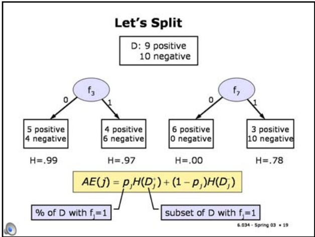

<!-- page: 6 -->

## Stopping Image removed due to copyright restrictions.

• Stop recursion if data contains only multiple instances of the same x with different y values

## Slide 5.1.22

As usual, when there is noise in the data, it's easy to overfit. We could conceivably grow the tree down to the point where there's a single data point in each leaf node. (Or maybe not: in fact, if have two data points with the same x values but different y values, our current algorithm will never terminate, which is certainly a problem). So, at the very least, we have to include a test to be sure that there's a split that makes both of the data subsets non-empty. If there is not, we have no choice but to stop and make a leaf node.

Slide 5.1.23

What should we do if we have to stop and make a leaf node when the data points at that node have different y values? Choosing the majority y value is the best strategy. If there are equal numbers of positive and negative points here, then you can just pick a y arbitrarily.

## Stopping Image removed due to copyright restrictions.

• Stop recursion if data contains only multiple instances of the same x with different y values • Make leaf node with output equal to the y value that occurs in the majority of the cases in the data

<!-- page: 7 -->

## Stopping Image removed due to copyright restrictions.

## Slide 5.1.26

Another simple solution is to have a threshold on the size of your leaves; if the data set at some leaf has fewer than that number of elements, then don't split it further.

• Stop recursion if data contains only multiple instances of the same x with different y values • Make leaf node with output equal to the y value that occurs in the majority of the cases in the data

• Consider stopping to avoid overfitting when:

• entropy of a data set is below some threshold

• number elements in a data set is below threshold

## Slide 5.1.27

## Stopping

• Stop recursion if data contains only multiple

instances of the same x with different y values • Make leaf node with output equal to the y value that occurs in the majority of the cases in the data

• Consider stopping to avoid overfitting when:

• entropy of a data set is below some threshold

• number elements in a data set is below threshold • best next split doesn't decrease average entropy (but this can get us into trouble)

<!-- page: 8 -->

## Simulation

| $f_1$ | $f_2$ | $f_3$ | $f_4$ | y |
| --- | --- | --- | --- | --- |
| 0 | 1 | 1 | 0 | 0 |
| 1 | 0 | 1 | 1 | 1 |
| 1 | 1 | 1 | 0 | 1 |
| 0 | 0 | 1 | 1 | 1 |
| 1 | 0 | 0 | 1 | 0 |
| 0 | 1 | 1 | 1 | 0 |

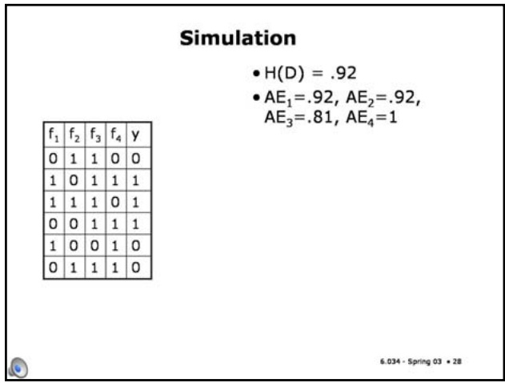

Slide 5.1.29

So, if we make that split, we have these two data sets. The one on the left has only a single output (in fact, only a single point).

Let's see how our tree-learning algorithm behaves on the example we used to demonstrate the DNF-learning algorithm. Our data set has a starting entropy of .92. Then, we can compute, for each feature, what the average entropy of the children would be if we were to split on that feature.

In this case, the best feature to split on is f3.

## Simulation

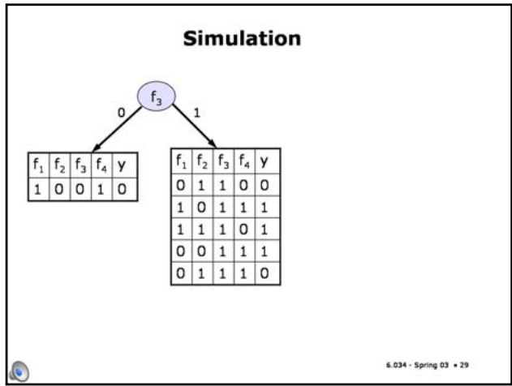

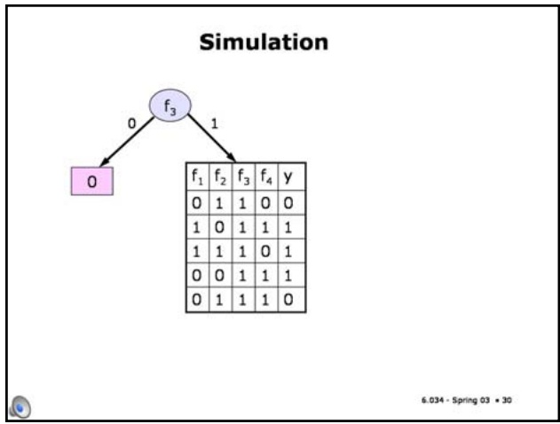

Slide 5.1.30

Slide 5.1.31

The average entropies of the possible splits are shown here. Features 1 and 2 are equally useful, and feature 4 is basically no help at all.

So we make it into a leaf with output 0 and consider splitting the data set in the right child.

## Simulation

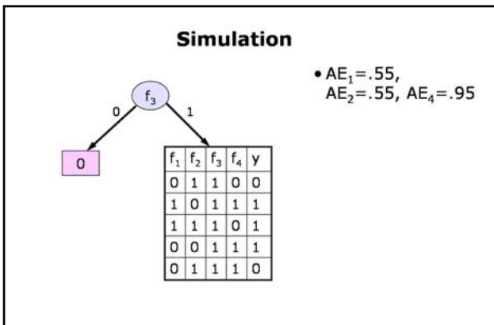

<!-- page: 9 -->

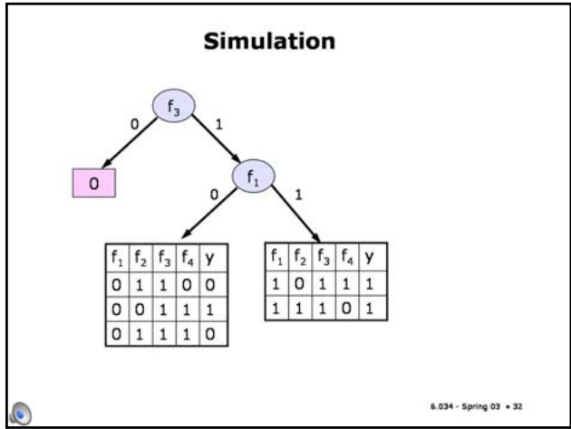

Slide 5.1.33 So we can turn it into a leaf with output 1. In the left child, feature 2 will be the most useful.

Slide 5.1.32

So, we decide, arbitrarily, to split on feature 1, yielding these sub-problems. All of the examples in the right-hand child have the same output.

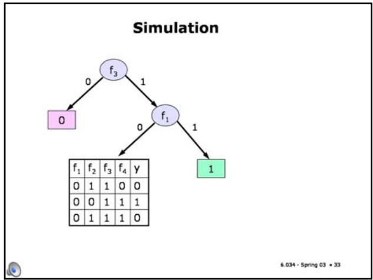

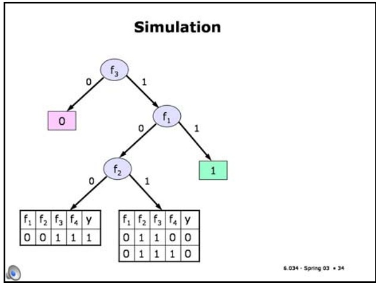

Slide 5.1.35 So we make the leaves and we're done!

Slide 5.1.34 So we split on it, and now both children are homogeneous (all data points have the same output).

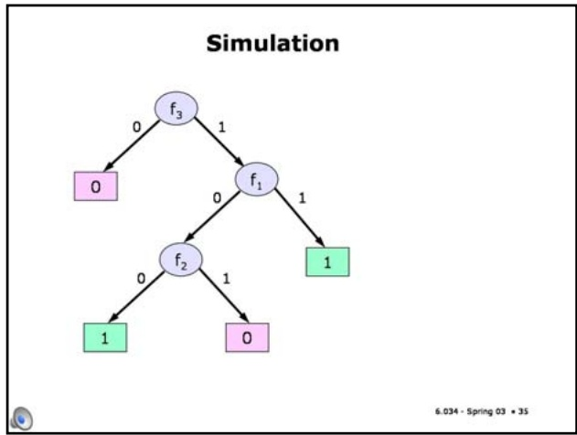

<!-- page: 10 -->

## Slide 5.1.36

6.034 Artificial Intelligence. Copyright © 2004 by Massachusetts Institute of Technology.

Slide 5.1.38

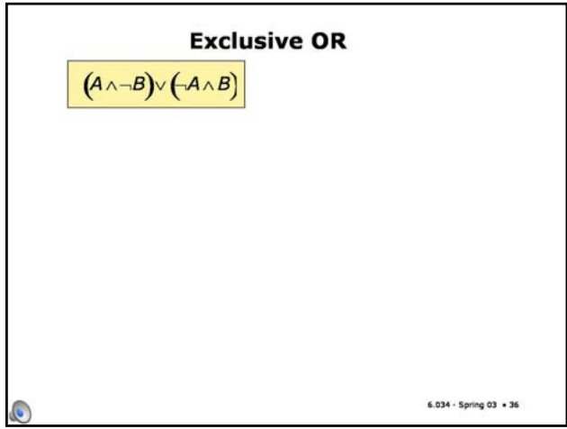

Slide 5.1.37

Let's look at a somewhat tricky data set. The data set has entropy .92. Furthermore, no matter what attribute we split on, the average entropy is .92. If we were using the stopping criterion that says we should stop when there is no split that improves the average entropy, we'd stop now.

One class of functions that often haunts us in machine learning are those that are based on the "exclusive OR". Exclusive OR is the two-input boolean function that has value 1 if one input has value 1 and the other has value 0. If both inputs are 1 or both are 0, then the output is 0. This function is hard to deal with, because neither input feature is, by itself, detectably related to the output. So, local methods that try to add one feature at a time can be easily misled by xor.

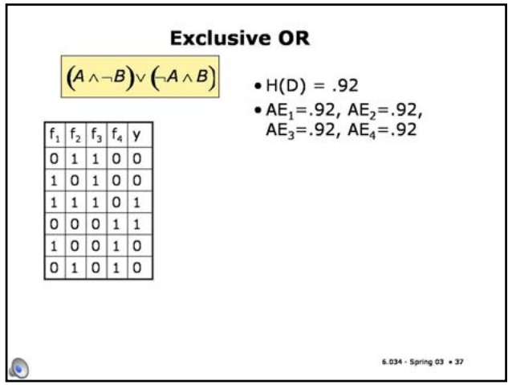

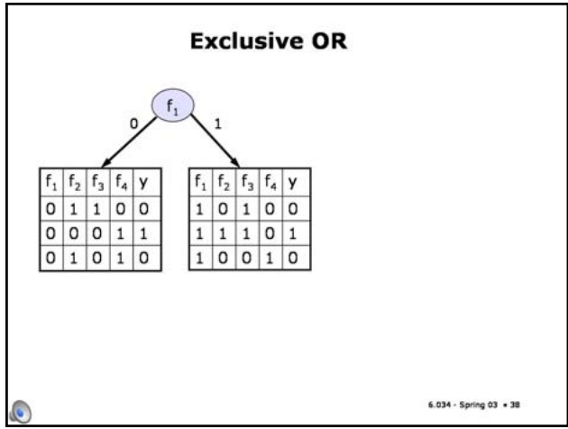

Slide 5.1.39 So we split on it, and get homogenous children,

But let's go ahead and split on feature 1. Now, if we look at the left-hand data set, we'll see that feature 2 will have an average entropy of 0.

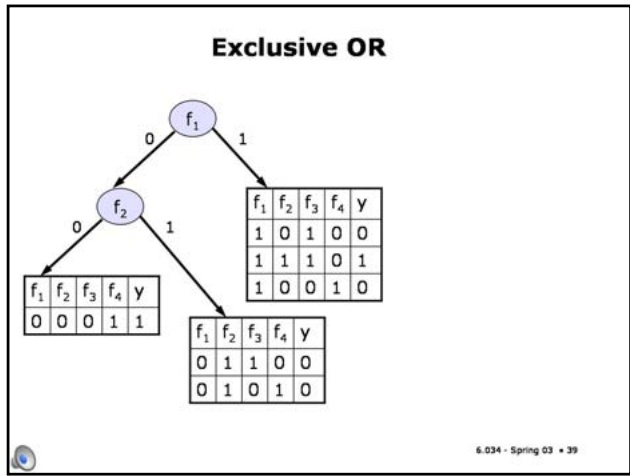

<!-- page: 11 -->

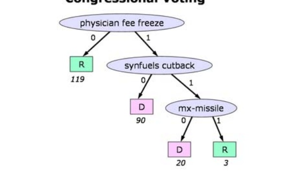

Slide 5.1.40

Slide 5.1.43

## Exclusive OR

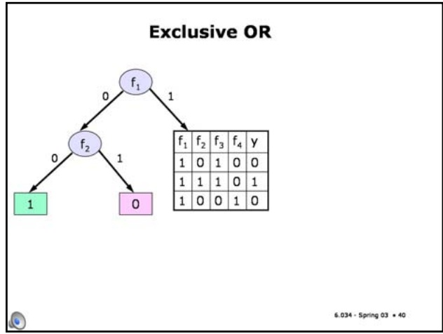

Slide 5.1.41

And we go straight to leaves on this side.

Which we can replace with leaves.

Now, it's also easy to see that feature 2 will again be useful here,

So we can see that, although no single feature could reduce the average entropy of the child data sets, features 1 and 2 were useful in combination.

## Exclusive OR

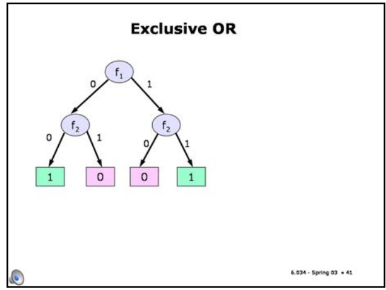

## Pruning

## Slide 5.1.42

• Best way to avoid overfitting and not get tricked by short-term lack of progress

• Grow tree as far as possible

Most real decision-tree building systems avoid this problem by building the tree down significantly deeper than will probably be useful (using something like an entropy cut-off or even getting down to a single data-point per leaf). Then, they prune the tree, using cross-validation to decide what an appropriate pruning depth is.

-leaves are uniform or contain a single X • Prune the tree until it performs well on held-out data

• Amount of pruning is like epsilon in the DNF algorithm

We ran a simple version of the tree-learning program on the congressional voting database. Instead of pruning, it has a parameter on the minimum leaf size. If it reaches a node with fewer than that number of examples, it stops and makes a leaf with the majority output.

Here's the tree we get when the minimum leaf size of 20. This problem is pretty easy, so this small tree works very well. If we grow bigger trees, we don't get any real increase in accuracy.

## Congressional Voting

<!-- page: 12 -->

## 6.034 Notes: Section 5.2

## Slide 5.2.1

Let's look at one more algorithm, which is called naive Bayes. It's named after the Reverend Thomas Bayes, who developed a very important theory of probabilistic reasoning.

## Naive Bayes

• Founded on Bayes' rule for probabilistic inference

Image of Rev. Thomas

Bayes removed due to copyright restrictions. based on evidence

• Choose hypothesis with the maximum probability after the evidence has been incorporated

Rev. Thomas Bayes

6.034 - Spring 03 • 1

## Naïve Bayes

• Founded on Bayes' rule for probabilistic inference

Image of Rev. Thomas Bayes removed due to

• Update probability of hypotheses based on evidence

• Choose hypothesis with the maximum probability after the evidence has been incorporated

Rev. Thomas Bayes

• Algorithm is particularly useful for domains with lots of features

## Slide 5.2.2

It's widely used in applications with lots of features. It was derived using a somewhat different set of justifications than the ones we've given you. We'll start by going through the algorithm, and at the end I'll go through its probabilistic background. Don't worry if you don't follow it exactly. It's just motivational, but it should make sense to anyone who has studied basic probability.

<!-- page: 13 -->

Slide 5.2.5

We can compute these values, as shown here, for each of the other features, as well.

## Prediction

$$
\mathrm{R} _ {1} (1, 1) = 1 / 5 \quad \mathrm{R} _ {1} (0, 1) = 4 / 5
$$

$$
\mathrm{R} _ {1} (1, 0) = 5 / 5 \quad \mathrm{R} _ {1} (0, 0) = 0 / 5
$$

$$
\mathrm{R} _ {2} (1, 1) = 1 / 5 \quad \mathrm{R} _ {2} (0, 1) = 4 / 5
$$

$$
\mathrm{R} _ {2} (1, 0) = 2 / 5 \quad \mathrm{R} _ {2} (0, 0) = 3 / 5
$$

$$
\mathrm{R} _ {3} (1, 1) = 4 / 5 \quad \mathrm{R} _ {3} (0, 1) = 1 / 5
$$

$$
\mathrm{R} _ {3} (1, 0) = 1 / 5 \quad \mathrm{R} _ {3} (0, 0) = 4 / 5
$$

$$
\mathrm{R} _ {4} (1, 1) = 2 / 5 \quad \mathrm{R} _ {4} (0, 1) = 3 / 5
$$

$$
\mathrm{R} _ {4} (1, 0) = 4 / 5 \quad \mathrm{R} _ {4} (0, 0) = 1 / 5
$$

## Example

$$
\mathrm{R} _ {1} (1, 1) = 1 / 5
$$

$$
\mathrm{R} _ {1} (1, 0) = 5 / 5
$$

$$
R _ {1} (0, 1) = 4 / 5
$$

Slide 5.2.6

| $f_{1}$ | $f_{2}$ | $f_{3}$ | $f_{4}$ | y |
| --- | --- | --- | --- | --- |
| 0 | 1 | 1 | 0 | 1 |
| 0 | 0 | 1 | 1 | 1 |
| 1 | 0 | 1 | 0 | 1 |
| 0 | 0 | 1 | 1 | 1 |
| 0 | 0 | 0 | 0 | 1 |
| 1 | 0 | 0 | 1 | 0 |
| 1 | 1 | 0 | 1 | 0 |
| 1 | 0 | 0 | 0 | 0 |
| 1 | 1 | 0 | 1 | 0 |
| 1 | 0 | 1 | 1 | 0 |

$$
R _ {1} (0, 0) = 0 / 5
$$

$$
R _ {2} (1, 1) = 1 / 5
$$

$$
R _ {2} (1, 0) = 2 / 5
$$

$$
R _ {3} (1, 1) = 4 / 5
$$

$$
R _ {2} (0, 1) = 4 / 5
$$

$$
R _ {3} (1, 0) = 1 / 5
$$

$$
R _ {2} (0, 0) = 3 / 5
$$

$$
R _ {3} (0, 1) = 1 / 5
$$

$$
R _ {3} (0, 0) = 4 / 5
$$

$$
R _ {4} (1, 1) = 2 / 5
$$

$$
R _ {4} (1, 0) = 4 / 5
$$

$$
R _ {4} (0, 1) = 3 / 5
$$

<!-- page: 14 -->

$$
\mathrm{R} _ {1} (1, 1) = 1 / 5 \quad \mathrm{R} _ {1} (0, 1) = 4 / 5
$$

$$
\mathrm{R} _ {1} (1, 0) = 5 / 5 \quad \mathrm{R} _ {1} (0, 0) = 0 / 5
$$

$$
\mathrm{R} _ {2} (1, 1) = 1 / 5 \quad \mathrm{R} _ {2} (0, 1) = 4 / 5
$$

$$
\mathrm{R} _ {2} (1, 0) = 2 / 5 \quad \mathrm{R} _ {2} (0, 0) = 3 / 5
$$

$$
\mathrm{R} _ {3} (1, 1) = 4 / 5 \quad \mathrm{R} _ {3} (0, 1) = 1 / 5
$$

$$
\mathrm{R} _ {3} (1, 0) = 1 / 5 \quad \mathrm{R} _ {3} (0, 0) = 4 / 5
$$

$$
\mathrm{R} _ {4} (1, 1) = 2 / 5 \quad \mathrm{R} _ {4} (0, 1) = 3 / 5
$$

$$
\mathrm{R} _ {4} (1, 0) = 4 / 5 \quad \mathrm{R} _ {4} (0, 0) = 1 / 5
$$

$$
\text {   New   } x = <   0, 0, 1, 1 >
$$

$$
\bullet S (1) = R _ {1} (0, 1) * R _ {2} (0, 1) * R _ {3} (1, 1) * R _ {4} (1, 1) = . 2 0 5
$$

$$
\bullet S (0) = R _ {1} (0, 0) ^ {*} R _ {2} (0, 0) ^ {*} R _ {3} (1, 0) ^ {*} R _ {4} (1, 0) = 0
$$

$$
\mathrm{R} _ {1} (1, 1) = 1 / 5 \quad \mathrm{R} _ {1} (0, 1) = 4 / 5
$$

$$
\mathrm{R} _ {1} (1, 0) = 5 / 5 \quad \mathrm{R} _ {1} (0, 0) = 0 / 5
$$

$$
\mathrm{R} _ {2} (1, 1) = 1 / 5 \quad \mathrm{R} _ {2} (0, 1) = 4 / 5
$$

$$
\mathrm{R} _ {2} (1, 0) = 2 / 5 \quad \mathrm{R} _ {2} (0, 0) = 3 / 5
$$

$$
\mathrm{R} _ {3} (1, 0) = 1 / 5 \quad \mathrm{R} _ {3} (0, 0) = 4 / 5
$$

$$
\mathrm{R} _ {3} (1, 1) = 4 / 5 \quad \mathrm{R} _ {3} (0, 1) = 1 / 5
$$

$$
\mathrm{R} _ {4} (1, 1) = 2 / 5 \quad \mathrm{R} _ {4} (0, 1) = 3 / 5
$$

$$
\mathrm{R} _ {4} (1, 0) = 4 / 5 \quad \mathrm{R} _ {4} (0, 0) = 1 / 5
$$

$$
\text {   New   } x = <   0, 0, 1, 1 >
$$

Finally, we compare score 1 to score 0, and generate output 1 because score 1 is larger than score 0.

Slide 5.2.9

$$
\bullet S (1) = R _ {1} (0, 1) ^ {*} R _ {2} (0, 1) ^ {*} R _ {3} (1, 1) ^ {*} R _ {4} (1, 1) = . 2 0 5
$$

## Prediction

$$
\bullet \quad R _ {1} (1, 1) = 1 / 5 \quad R _ {1} (0, 1) = 4 / 5
$$

$$
\bullet \mathrm{R} _ {1} (1, 0) = 5 / 5 \quad \mathrm{R} _ {1} (0, 0) = 0 / 5
$$

$$
\bullet \mathrm{R} _ {2} (1, 1) = 1 / 5 \quad \mathrm{R} _ {2} (0, 1) = 4 / 5
$$

$$
\cdot R _ {2} (1, 0) = 2 / 5 \quad R _ {2} (0, 0) = 3 / 5
$$

$$
\cdot R _ {3} (1, 1) = 4 / 5 \quad R _ {3} (0, 1) = 1 / 5
$$

$$
\bullet \mathrm{R} _ {3} (1, 0) = 1 / 5 \quad \mathrm{R} _ {3} (0, 0) = 4 / 5
$$

$$
\bullet \mathrm{R} _ {4} (1, 1) = 2 / 5 \quad \mathrm{R} _ {4} (0, 1) = 3 / 5
$$

$$
\bullet \quad R _ {4} (1, 0) = 4 / 5 \quad R _ {4} (0, 0) = 1 / 5
$$

$$
\text {   New   } x = <   0, 0, 1, 1 >
$$

$$
\bullet S (1) = R _ {1} (0, 1) ^ {*} R _ {2} (0, 1) ^ {*} R _ {3} (1, 1) ^ {*} R _ {4} (1, 1) = . 2 0 5
$$

$$
\bullet S (0) = R _ {1} (0, 0) * R _ {2} (0, 0) * R _ {3} (1, 0) * R _ {4} (1, 0) = 0
$$

$$
\bullet \mathrm{S} (1) > \mathrm{S} (0), \text {so predict class 1}
$$

## Learning Algorithm

• Estimate from the data, for all j:

$$
R _ {j} (1, 1) = \frac {\# (x _ {j} ^ {i} = 1 \land y ^ {i} = 1)}{\# (y ^ {i} = 1)}
$$

## Slide 5.2.10

<!-- page: 15 -->

$$
R _ {j} (1, 1) = \frac {\# (x _ {j} ^ {i} = 1 \land y ^ {i} = 1)}{\# (y ^ {i} = 1)}
$$

$$
R _ {j} (0, 1) = 1 - R _ {j} (1, 1)
$$

$$
R _ {j} (1, 1) = \frac {\# (x _ {j} ^ {i} = 1 \land y ^ {i} = 1)}{\# (y ^ {i} = 1)}
$$

$$
R _ {j} (0, 1) = 1 - R _ {j} (1, 1)
$$

$$
R _ {j} (1, 0) = \frac {\# (x _ {j} ^ {i} = 1 \land y ^ {i} = 0)}{\# (y ^ {i} = 0)}
$$

$$
R _ {j} (0, 0) = 1 - R _ {j} (1, 0)
$$

Now, given a new example, x, let the score for class 1, S(1), be the product, over all j, of $\mathtt { R _ { j } }$ of 1,1 if $\mathbf { x _ { j } } = 1$ and $\mathtt { R _ { j } }$ of 0, 1 otherwise.

## Prediction Algorithm

• Given a new $\mathbf{x},$

$$
S (1) = \prod_ {j} \left\{ \begin{array}{l l} R _ {j} (1, 1) & \text { if } x _ {j} = 1 \\ R _ {j} (0, 1) & \text { otherwise } \end{array} \right.
$$

$$
S (0) = \prod_ {j} \left\{ \begin{array}{l l} R _ {j} (1, 0) & \text {if} x _ {j} = 1 \\ R _ {j} (0, 0) & \text {otherwise} \end{array} \right.
$$

## Prediction Algorithm

• Given a new x,

$$
S (1) = \prod_ {j} \left\{ \begin{array}{l} R _ {j} (1, 1) \\ R _ {j} (0, 1) \end{array} \right.
$$

$$
\text {if} x _ {j} = 1
$$

otherwise

## Slide 5.2.14

<!-- page: 16 -->

$$
\log R _ {j} (1, 1)
$$

$$
f x _ {j} = 1
$$

$$
\log R _ {j} (0, 1)
$$

Slide 5.2.17

In our example, we saw that if we had never seen a feature take value 1 in a positive example, our estimate for how likely that would be to happen in the future was 0. That seems pretty radical, especially when we only have had a few examples to learn from. There's a standard hack to fix this problem, called the "Laplace correction". When counting up events, we add a 1 to the numerator and a 2 to the denominator.

If we've never seen any positive instances, for example, our R (1,1) values would be 1/2, which seems sort of reasonable in the absence of any information. And if we see lots and lots of examples, this 1 and 2 will be washed out, and we'll converge to the same estimate that we would have gotten without the correction.

There's a beautiful probabilistic justification for what looks like an obvious hack. But, sadly, it's beyond the scope of this class.

## Example with Correction

## Slide 5.2.18

$$
\bullet R _ {1} (1, 1) = 2 / 7
$$

$$
R _ {1} (0, 1) = 5 / 7
$$

$$
\bullet R _ {1} (1, 0) = 6 / 7
$$

| $f_{1}$ | $f_{2}$ | $f_{3}$ | $f_{4}$ | y |
| --- | --- | --- | --- | --- |
| 0 | 1 | 1 | 0 | 1 |
| 0 | 0 | 1 | 1 | 1 |
| 1 | 0 | 1 | 0 | 1 |
| 0 | 0 | 1 | 1 | 1 |
| 0 | 0 | 0 | 0 | 1 |
| 1 | 0 | 0 | 1 | 0 |
| 1 | 1 | 0 | 1 | 0 |
| 1 | 0 | 0 | 0 | 0 |
| 1 | 1 | 0 | 1 | 0 |
| 1 | 0 | 1 | 1 | 0 |

$$
\mathrm{R} _ {1} (0, 0) = 1 / 7
$$

$$
\bullet R _ {2} (1, 1) = 2 / 7
$$

$$
R _ {2} (0, 1) = 5 / 7
$$

$$
\bullet R _ {2} (1, 0) = 3 / 7
$$

$$
\bullet R _ {3} (1, 1) = 5 / 7
$$

$$
R _ {2} (0, 0) = 4 / 7
$$

$$
\bullet R _ {3} (1, 0) = 2 / 7
$$

$$
R _ {3} (0, 1) = 2 / 7
$$

$$
\bullet \mathrm{R} _ {4} (1, 1) = 3 / 7
$$

$$
R _ {3} (0, 0) = 5 / 7
$$

$$
R _ {4} (0, 1) = 4 / 7
$$

$$
\bullet \mathrm{R} _ {4} (1, 0) = 5 / 7 \quad \mathrm{R} _ {4} (0, 0) = 2 / 7
$$

$$
R _ {j} (1, 1)
$$

$$
\text {if} x _ {j} = 1
$$

$$
\left\lfloor R _ {j} (0, 1) \right.
$$

$$
\left| R _ {j} (1, 0) \right.
$$

$$
\text {if} x _ {j} = 1
$$

$$
\left\lfloor R _ {j} (0, 0) \right.
$$

## Laplace Correction

• Avoid getting 0 or 1 as an answer:

$$
R _ {j} (1, 1) = \frac {\# (x _ {j} ^ {\prime} = 1 \land y ^ {\prime} = 1) + 1}{\# (y ^ {\prime} = 1) + 2}
$$

$$
R _ {j} (0, 1) = 1 - R _ {j} (1, 1)
$$

$$
R _ {j} (1, 0) = \frac {\# (x _ {j} ^ {i} = 1 \land y ^ {i} = 0) + 1}{\# (y ^ {i} = 0) + 2}
$$

$$
R _ {j} (0, 0) = 1 - R _ {j} (1, 0)
$$

<!-- page: 17 -->

$$
\cdot R _ {1} (1, 1) = 2 / 7 \quad R _ {1} (0, 1) = 5 / 7
$$

$$
\bullet R _ {1} (1, 0) = 6 / 7 R _ {1} (0, 0) = 1 / 7
$$

$$
\bullet \mathrm{R} _ {2} (1, 1) = 2 / 7 \quad \mathrm{R} _ {2} (0, 1) = 5 / 7
$$

$$
\cdot R _ {2} (1, 0) = 3 / 7 \quad R _ {2} (0, 0) = 4 / 7
$$

$$
\bullet \mathrm{R} _ {3} (1, 1) = 5 / 7 \quad \mathrm{R} _ {3} (0, 1) = 2 / 7
$$

$$
\cdot R _ {3} (1, 0) = 2 / 7 \quad R _ {3} (0, 0) = 5 / 7
$$

$$
\bullet \mathrm{R} _ {4} (1, 1) = 3 / 7 \quad \mathrm{R} _ {4} (0, 1) = 4 / 7
$$

$$
\cdot R _ {4} (1, 0) = 5 / 7 \quad R _ {4} (0, 0) = 2 / 7
$$

$$
\bullet \text {New} x = <   0, 0, 1, 1 >
$$

$$
\bullet S (1) = R _ {1} (0, 1) * R _ {2} (0, 1) * R _ {3} (1, 1) * R _ {4} (1, 1) = . 1 5 6
$$

$$
\bullet S (0) = R _ {1} (0, 0) * R _ {2} (0, 0) * R _ {3} (1, 0) * R _ {4} (1, 0) = . 0 1 7
$$

$$
\bullet \mathrm{S} (1) > \mathrm{S} (0), \text {so predict class 1}
$$

$$
\prod_ {j} \alpha_ {j} x _ {j} + (1 - \alpha_ {j}) (1 - x _ {j}) > \prod_ {j} \beta_ {j} x _ {j} + (1 - \beta_ {j}) (1 - x _ {j})
$$

## Slide 5.2.21

All of our bias is in the form of the hypothesis. We've restricted it significantly, so we would now like to choose the alpha's and beta's in such a way as to minimize the error on the training set. For somewhat subtle technical reasons (ask me and I'll tell you), our choice of the R scores for the alpha's and beta's doesn't exactly minimize error on the training set. But it usually works pretty well.

The main reason we like this algorithm is that it's easy to train. One pass through the data and we can compute all the parameters. It's especially useful in things like text categorization, where there are huge numbers of attributes and we can't possibly look at them many times.

## Hypothesis Space

## • Output 1 if

$$
\prod_ {j} \alpha_ {j} x _ {j} + (1 - \alpha_ {j}) (1 - x _ {j}) > \prod_ {j} \beta_ {j} x _ {j} + (1 - \beta_ {j}) (1 - x _ {j})
$$

• Depends on parameters (which we set to be the $\begin{array}{l}\alpha_{1} \ldots \alpha_{n}, \beta_{1} \ldots \beta_{n} \\\mathsf{R}_{\mathsf{j}} \vee \mathsf{all} \vee \mathsf{es})\end{array}$

## Slide 5.2.22

• Our method of computing parameters doesn't minimize training set error, but it's fast!

• Weight of feature j's "vote" in favor of output 1:

$$
\log \frac {\alpha_ {j}}{1 - \alpha_ {j}} - \log \frac {\beta_ {j}}{1 - \beta_ {j}}
$$

## Hypothesis Space

• Output 1 if

$$
\prod \alpha_ {j} x _ {j} + (1 - \alpha_ {j}) (1 - x _ {j}) > \prod \beta_ {j} x _ {j} + (1 - \beta_ {j}) (1 - x _ {j})
$$

• Depends on parameters $\alpha_{1} \cdots \alpha_{n}, \beta_{1} \cdots \beta_{n}$ (which we set to be the $\dot{\mathsf{R}}_{\mathrm{j}}^{\mathrm{~*}}$ values)

• Our method of computing parameters doesn't minimize training set error, but it's fast!

<!-- page: 18 -->

$$
\cdot R _ {4} (1, 1) = 2 / 4 \quad R _ {4} (0, 1) = 2 / 4
$$

$$
\bullet \quad R _ {4} (1, 0) = 3 / 6 \quad R _ {4} (0, 0) = 3 / 6
$$

Sure enough, when we compute the scores for any new example, we get the same result, giving us no basis at all for predicting the output.

Slide 5.2.25

| $f_1$ | $f_2$ | $f_3$ | $f_4$ | y |
| --- | --- | --- | --- | --- |
| 0 | 1 | 1 | 0 | 0 |
| 1 | 0 | 1 | 0 | 0 |
| 1 | 0 | 0 | 1 | 0 |
| 0 | 1 | 0 | 1 | 0 |
| 1 | 1 | 1 | 0 | 1 |
| 0 | 0 | 0 | 1 | 1 |

## Exclusive Or

$$
\bullet \mathrm{R} _ {1} (1, 1) = 2 / 4 \mathrm{R} _ {1} (0, 1) = 2 / 4
$$

• R₁}(1,0)=3/6 R1}(0,0)=3/6

• R₂(1,1)=2/4 R₂(0,1)=2/4

• R₂(1,0)=3/6 R₂(0,0)=3/6

• R3(1,1)=2/4 R₃(0,1)=2/4

• R₃(1,0)=3/6 R₃(0,0)=3/6

• R4(1,1)=2/4 R4(0,1)=2/4

• R4(1,0)=3/6 R4(0,0)=3/6

• For any new x

●S(1) =.5\*.5\*.5\*.5 =.0625

●S(0) =.5\*.5\*.5\*.5=.0625

• We're indifferent between classes

## Congressional Voting

## Slide 5.2.26

<!-- page: 19 -->

## Slide 5.2.29

It's interesting to look at the weights found for the various attributes. Here, I've sorted the attributes according to magnitude of the weight assigned to them by naive Bayes. The positive ones (colored black) vote in favor of the output being 1 (republican); the negative ones (colored red) vote against the the output being 1 (and therefore in favor of democrat).

The results are consistent with the answers we've gotten from the other algorithms. The most diagnostic single issue seems to be voting on whether physician fees should be frozen; that is a strong indicator of being a democrat. The strongest indicators of being republican are accepting the budget, aid to the contras, and support of the mx missile.

## Congressional Voting

-6.82 physician-fee-freeze

-4.20 el-salvador-aid

-4.20 crime

-3.56 education-spending

republican democrat

3.36 adoption-of-the-budget-resolution

3.25 aid-to-nicaraguan-contras

3.07 mx-missile

superfund-right-to-sue

2.40 duty-free-exports

2.14 anti-satellite-test-ban

-2.07 religious-groups-in-schools

2.01 export-administration-act-south-africa

1.66 synfuels-corporation-cutback

1.63 handicapped-infants

immigration

-0.08 water-project-cost-sharing

## Probabilistic Inference

## Slide 5.2.30

<!-- page: 20 -->

## Bayes' Rule

• Generically:

$$
\Pr (A \mid B) = \Pr (B \mid A) \frac {\Pr (A)}{\Pr (B)}
$$

Slide 5.2.33

$$
\text {Applying it to our problem, we get} \Pr (\mathrm{Y} = 1 \mid \mathrm{f} _ {1} \dots \mathrm{f} _ {\mathrm{n}}) = \Pr (\mathrm{f} _ {1} \dots \mathrm{f} _ {\mathrm{n}} \mid \mathrm{Y} = 1) \Pr (\mathrm{Y} = 1) / \Pr (\mathrm{f} _ {1} \dots \mathrm{f} _ {\mathrm{n}})
$$

## Slide 5.2.32

• Generically:

## Bayes' Rule

## Slide 5.2.34

$$
\Pr (A \mid B) = \Pr (B \mid A) \frac {\Pr (A)}{\Pr (B)}
$$

• Specifically:

$$
\Pr (Y = 1 \mid f _ {1} \dots f _ {n}) = \Pr (f _ {1} \dots f _ {n} \mid Y = 1) \frac {\Pr (Y = 1)}{\Pr (f _ {1} \dots f _ {n})}
$$

independent of Y

Bayes' rule gives us a way to take the conditional probability Pr(A|B) and express it in terms of Pr(B| A) and the marginals Pr(A) and Pr(B).

$$
\Pr (Y = 1 | f _ {1}, \dots , f _ {n})
$$

## Bayes' Rule

• Generically:

$$
\Pr (A \mid B) = \Pr (B \mid A) \frac {\Pr (A)}{\Pr (B)}
$$

• Specifically:

$$
\Pr (Y = 1 \mid f _ {1} \dots f _ {n}) = \Pr (f _ {1} \dots f _ {n} \mid Y = 1) \frac {\Pr (Y = 1)}{\Pr (f _ {1} \dots f _ {n})}
$$

<!-- page: 21 -->

$$
\Pr (A \mid B) = \Pr (B \mid A) \frac {\Pr (A)}{\Pr (B)}
$$

$$
\Pr (Y = 1 \mid f _ {1} \dots f _ {n}) = \Pr (f _ {1} \dots f _ {n} \mid Y = 1) \frac {\Pr (Y = 1)}{\Pr (f _ {1} \dots f _ {n})}
$$

$$
\Pr (A \mid B) = \Pr (B \mid A) \frac {\Pr (A)}{\Pr (B)}
$$

$$
\Pr (Y = 1 \mid f _ {1} \dots f _ {n}) = \Pr (f _ {1} \dots f _ {n} \mid Y = 1) \frac {\Pr (Y = 1)}{\Pr (f _ {1} \dots f _ {n})}
$$

$$
\Pr (f _ {1} \dots f _ {n} \mid Y = 1)
$$

## Slide 5.2.37

The algorithm is called **naive** Bayes because it makes a big assumption, which is that it can be broken down into a product like this. A probabilist would say that we are assuming that the features are conditionally independent given the class.

So, we're assuming that $\operatorname* { P r } ( \mathbf { f } _ { 1 } \dots \mathbf { f } _ { \mathfrak { n } } \mid \mathbf { Y } = 1 )$ is the product of all the individual conditional probabilities, $\operatorname* { P r } ( \mathbf { f } _ { \mathbf { j } } \mid \mathbf { Y } = 1 )$

## Why is Bayes Naïve?

• Make a big independence assumption

$$
\Pr (f _ {1} \dots f _ {n} \mid Y = 1) = \prod_ {j} \Pr (f _ {j} \mid Y = 1)
$$

## Learning Algorithm

• Estimate from the data, for all j:

$$
R (f _ {j} = 1 \mid Y = 1) = \frac {\# (x _ {j} ^ {i} = 1 \land y ^ {i} = 1)}{\# (y ^ {i} = 1)}
$$

## Slide 5.2.38

$$
R (f _ {j} = 1 \mid Y = 0) = \frac {\# (x _ {j} ^ {i} = 1 \land y ^ {i} = 0)}{\# (y ^ {i} = 0)}
$$

$$
R (f _ {j} = 0 \mid Y = 1) = 1 - R (f _ {j} = 1 \mid Y = 1)
$$

$$
R (f _ {j} = 0 \mid Y = 0) = 1 - R (f _ {j} = 1 \mid Y = 0)
$$

<!-- page: 22 -->

$$
S (x _ {1} \dots x _ {n} \mid Y = 1) = \prod_ {j} \left\{ \begin{array}{l l} R (f _ {j} = 1 \mid Y = 1) & \text {if} x _ {j} = 1 \\ R (f _ {j} = 0 \mid Y = 1) & \text {otherwise} \end{array} \right.
$$

$$
S (x _ {1} \dots x _ {n} \mid Y = 0) = \prod_ {j} \left\{ \begin{array}{l l} R (f _ {j} = 1 \mid Y = 0) & \text {if} x _ {j} = 1 \\ R (f _ {j} = 0 \mid Y = 0) & \text {otherwise} \end{array} \right.
$$

$$
S (x _ {1} \dots x _ {n} \mid Y = 1) > S (x _ {1} \dots x _ {n} \mid Y = 0)
$$
