<!-- page: 1 -->

## Slide 8.1.1

There is no easy way to characterize which particular separator the perceptron algorithm will end up with. In general, there can be many separators for a data set. Even in the tightly constrained bankruptcy data set, we saw two runs of the algorithm with different starting points ended up with slightly different hypotheses. Is there any reason to prefer one separator over the others?

Slide 8.1.2

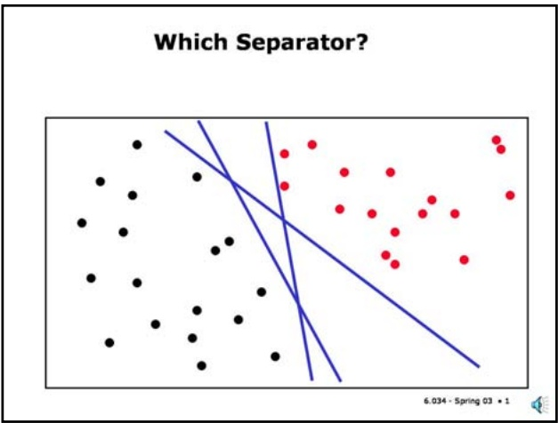

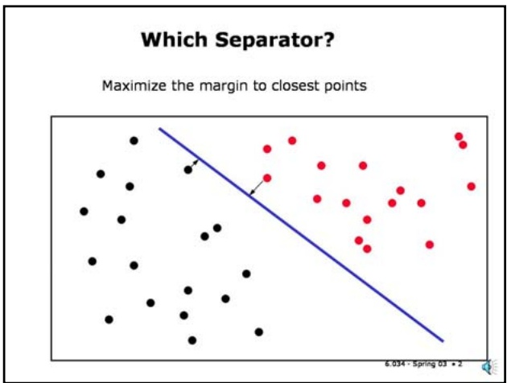

Slide 8.1.3

This one seems safer, no?

Yes. One natural choice is to pick the separator that has the maximal margin to its closest points on either side. This is the separator that seems most conservative. Any other separator will be "closer" to one class than to the other. The one shown in this figure, for example, seems like it's closer to the black points on the lower left than to the red ones.

Another way to motivate the choice of the maximal margin separator is to see that it reduces the "variance" of the hypothesis class. Recall that a hypothesis has large variance if small changes in the data result in a very different hypothesis. With a maximal margin separator, we can wiggle the data quite a bit without affecting the separator. Placing the separator very close to positive or negative points is a kind of overfitting; it makes your hypothesis very dependent on details of the input data.

Let's see if we can figure out how to find the separator with maximal margin as suggested by this picture.

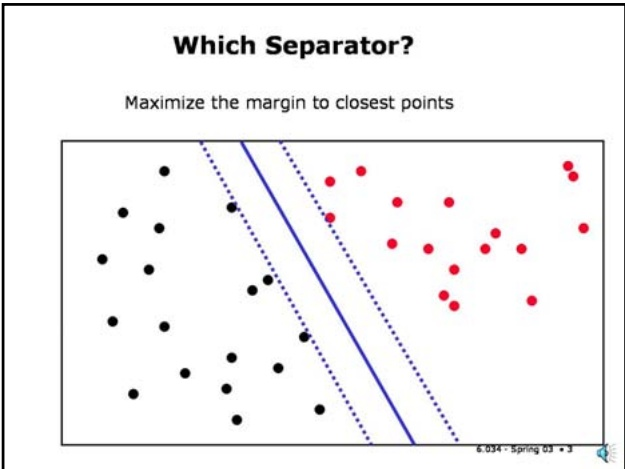

<!-- page: 2 -->

$$
\gamma^ {i} \equiv y ^ {i} (\mathbf {w} \cdot \mathbf {x} ^ {i} + b)
$$

$$
\gamma^ {i} \equiv y ^ {i} (\mathbf {w} \cdot \mathbf {x} ^ {i} + b)
$$

## Margin

## Slide 8.1.6

$$
\gamma^ {i} \equiv y ^ {i} (\mathbf {w} \cdot \mathbf {x} ^ {i} + b)
$$

• Scaling w changes value of margin but not actual distances to separator (geometric margin)

• Pick the margin to closest positive and negative points to be 1

$$
+ 1 (\mathbf {w} \cdot \mathbf {x} ^ {1} + b) = 1
$$

$$
- 1 (\mathbf {w} \cdot \mathbf {x} ^ {2} + b) = 1
$$

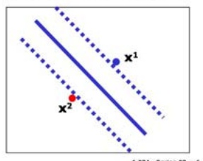

## Slide 8.1.7

The next issue is that the we have defined the margin for a point relative to a separator but we don't want to just maximize the margin of some particular single point. We want to focus on one point on each side of the separator, each of which is closest to the separator. And we want to place the separator so that the it is as far from these two points as possible. Then we will have the maximal margin between the two classes.

Since we have a degree of freedom in the magnitude of w we're going to just define the margin for each of these points to be 1. (You can think of this 1 as having arbitrary units given by the magnitude of w.)

You might be worried that we can't possibly know which will be the two closest points until we know what the separator is. It's a reasonable worry, and we'll sort it out in a couple of slides.

## Margin

• Pick the margin to closest positive and negative points to be 1

$$
+ 1 (\mathbf {w} \cdot \mathbf {x} ^ {1} + b) = 1
$$

$$
- 1 (\mathbf {w} \cdot \mathbf {x} ^ {2} + b) = 1
$$

• Combining these

$$
\mathbf {w} \cdot (\mathbf {x} ^ {1} - \mathbf {x} ^ {2}) = 2
$$

• Dividing by length of w gives perpendicular distance between dashed lines (2 x geometric margin)

$$
\frac {\mathbf {w}}{\| \mathbf {w} \|} \cdot (\mathbf {x} ^ {1} - \mathbf {x} ^ {2}) = \frac {2}{\| \mathbf {w} \|}
$$

<!-- page: 3 -->

$$
\frac {2}{\| \mathbf {w} \|}
$$

$$
\left\| \mathbf {w} \right\| = \sqrt {\mathbf {w} \cdot \mathbf {w}}
$$

$$
\frac {1}{2} \left\| \mathbf {w} \right\| ^ {2} = \frac {1}{2} \mathbf {w} \cdot \mathbf {w} = \frac {1}{2} \sum_ {j} w _ {j} ^ {2}
$$

$$
\frac {1}{2} \left\| \mathbf {w} \right\| ^ {2} = \frac {1}{2} \mathbf {w} \cdot \mathbf {w} = \frac {1}{2} \sum_ {j} w _ {j} ^ {2}
$$

$$
y ^ {i} (\mathbf {w} \cdot \mathbf {x} ^ {i} + b) \geq 1
$$

$$
y ^ {i} (\mathbf {w} \cdot \mathbf {x} ^ {i} + b) - 1 \geq 0
$$

## Constrained Optimization

$\min_{\mathbf{w}} \frac{1}{2} \|\mathbf{w}\|^2$ subject to $y ^ { \prime } ( \boldsymbol { w } \cdot \boldsymbol { x } ^ { \prime } + b ) - 1 \geq 0 , \forall$

## Slide 8.1.10

So, to summarize, we have defined a constrained optimization problem as shown here. It involves minimizing a quadratic function subject to a set of linear constraints. These kinds of optimization problems are very well studied. When the function to be minimized is linear, it is a particularly easy case that can be solved by a "linear programming" algorithm. In our case, it's a bit more complicated.

## Slide 8.1.8

## Picking w to Maximize Margin

• Pick w to maximize geometric margin

$$
\frac {2}{\| \mathbf {w} \|}
$$

$\mathbf{o}\mathbf{r},$ equivalently, minimize

$$
\left\| \mathbf {w} \right\| = \sqrt {\mathbf {w} \cdot \mathbf {w}}
$$

• or, equivalently, minimize

$$
\frac {1}{2} \left\| \mathbf {w} \right\| ^ {2} = \frac {1}{2} \mathbf {w} \cdot \mathbf {w} = \frac {1}{2} \sum_ {j} w _ {j} ^ {2}
$$

<!-- page: 4 -->

$$
\min _ {\mathbf {w}} \frac {1}{2} \| \mathbf {w} \| ^ {2} \text {subject to} y ^ {\prime} (\mathbf {w} \cdot \mathbf {x} ^ {\prime} + b) - 1 \geq 0, \forall ,
$$

$$
\min _ {\mathbf {w}} \left(\frac {1}{2} \| \mathbf {w} \| ^ {2} - \sum_ {i} \alpha_ {i} \left[ \mathbf {y} ^ {i} (\mathbf {w} \cdot \mathbf {x} ^ {i} + b) - 1 \right]\right) \quad \alpha_ {i} \geq 0, \forall_ {i}
$$

$$
\min _ {\mathbf {w}} \left(\frac {1}{2} \| \mathbf {w} \| ^ {2} - \sum_ {i} \alpha_ {i} \left[ \mathbf {y} ^ {i} (\mathbf {w} \cdot \mathbf {x} ^ {i} + \mathbf {b}) - 1 \right]\right) \quad \alpha_ {i} \geq 0, \forall_ {i}
$$

## 6.034 Notes: Section 8.2

## Slide 8.2.1

The details of solving a Lagrange multiplier problem are a little bit complicated. But we are going to go through the derivation at a somewhat abstract level here, because it gives us some insights and intuitions about the resulting solution.

We have an expression, L(w,b), that also involves parameters alpha. If we knew what the values of alpha should be, we could just fix them, minimize L with respect to w and b, and be done. The big problem is that we don't know what the alphas are supposed to be.

## Maximizing the Margin

$$
L (\mathbf {w}, b) = \frac {1}{2} \| \mathbf {w} \| ^ {2} - \sum_ {i} \alpha_ {i} [ \mathbf {y} ^ {i} (\mathbf {w} \cdot \mathbf {x} ^ {i} + b) - 1 ]
$$

<!-- page: 5 -->

## Maximizing the Margin

## Slide 8.2.2

$$
L (\mathbf {w}, b) = \frac {1}{2} \| \mathbf {w} \| ^ {2} - \sum_ {i} \alpha_ {i} \left[ \mathbf {y} ^ {i} (\mathbf {w} \cdot \mathbf {x} ^ {i} + b) - 1 \right]
$$

Minimized when:

$$
\mathbf {w} ^ {*} = \sum_ {i} \alpha_ {i} \mathbf {y} ^ {i} \mathbf {x} ^ {i}
$$

$$
\sum_ {i} \alpha_ {i} \mathbf {y} ^ {i} = 0
$$

Slide 8.2.3

We can substitute this expression for the optimal w's back into our original expression for L, getting L as a function of alpha. Now we have an expression involving only alphas, which we don't know, and x's and y's, which we do know. This function is known as the dual Lagrangian. One of the most important things about it, from our perspective, is that the feature vectors only appear in dot products with other feature vectors. We'll come back to this point later on.

## Dual Lagrangian

maxL(α) subject to $\sum \alpha_{i} y^{i} = 0$ and $\alpha_{i} \geq 0, \forall i$ a 1

So, we're going to start by imagining that we know what we want the alphas to be. We'll hold them constant for now, and figure out what values of w and b would optimize L for those fixed alphas. We can do this by taking the partial derivatives of L with respect to w and b and setting them to zero, getting two constraints. We find that the best value of $\mathbf { w } ,   \mathbf { w } ^ { * }$ is a weighted sum of the input points (in the same form as the dual perceptron); and we get an extra constraint that the sum of the alphas for the positive points has to equal the sum of the alphas for the negative points.

## Maximizing the Margin

$$
L (\mathbf {w}, b) = \frac {1}{2} \| \mathbf {w} \| ^ {2} - \sum_ {i} \alpha_ {i} \left[ \mathbf {y} ^ {i} (\mathbf {w} \cdot \mathbf {x} ^ {i} + b) - 1 \right]
$$

Minimized when:

$$
L (\alpha) = \sum_ {i = 1} ^ {m} \alpha_ {i} - \frac {1}{2} \sum_ {i = 1} ^ {m} \sum_ {k = 1} ^ {m} \alpha_ {i} \alpha_ {k} y _ {i} y _ {k} x _ {i} x _ {k}
$$

Only dot products of the feature vectors appear

$$
\mathbf {w} ^ {*} = \sum_ {i} \alpha_ {i} \mathbf {y} ^ {i} \mathbf {x} ^ {i}
$$

$$
\sum_ {i} \alpha_ {i} \mathbf {y} ^ {i} = 0
$$

Substituting w\* into L yields dual Lagrangian:

6.034 - Spring 03 • 3

## Slide 8.2.4

Now, it's time to pick the best values for the alphas. We do so (for reasons that you'll have to learn in a math class) by choosing the alpha values that maximize this expression. We will retain the constraints that the sum of the alpha values for positive points is equal to the sum of the alpha values for negative points, and that the alphas must be positive.

Note that we will be solving for m alphas. We started with n+1 (the number of features, plus one) variables in the original Lagrangian and now we have m (the number of data points) variables in the dual Lagrangian. For the low-dimensional examples we have been dealing with this seems like a horrible tradeoff. We will see later that this can be a very good tradeoff in some circumstances.

We have two constraints, but they are much simpler. One constraint is simply that the alphas be non-negative---this is required because our original constraints were >= inequalities. The constraint on the alphas comes from the setting to zero the derivative of the Lagrangian with respect to the offset b.

This problem is not trivial to solve in general; we'll talk more about this later. For now, let us assume that we can solve it and get the optimal values of alphas.

## Slide 8.2.5

## Dual Lagrangian

maxL(α) subject to $\sum \alpha_{i} y^{i} = 0$ and $\alpha_{i} \geq 0, \forall i$ 1

In general, since $a_{i} > = 0,$ either

$a_{i} = 0;$ constraint is satisfied with no distortion at optimum w or

$a_{1} > 0 :$ constraint is satisfied with equality (in this case x is known as a support vector)

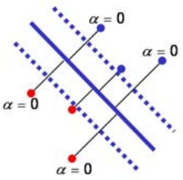

<!-- page: 6 -->

$$
\mathbf {w} ^ {*} = \sum_ {i} \alpha_ {i} \mathbf {y} ^ {i} \mathbf {x} ^ {i}
$$

$$
b = 1 / y ^ {\prime} - \mathbf {w} ^ {*} \mathbf {x} ^ {\prime}
$$

$$
\alpha_ {i} = 0:
$$

$$
\mathbf {w} ^ {*} = \sum_ {i} \alpha_ {i} \mathbf {y} ^ {i} \mathbf {x} ^ {i}
$$

• The sum is over k support vectors

## SVM Classifier

$$
b = 1 / y ^ {\prime} - \mathbf {w} ^ {*} \mathbf {x} ^ {\prime}
$$

$$
h (\mathbf {u}) = \text {sign} \left(\sum_ {i = 1} ^ {k} \alpha_ {i} \mathbf {y} ^ {i} \mathbf {x} ^ {i} \cdot \mathbf {u} + b\right)
$$

• Given unknown vector $\mathbf { u } ,$ predict class (1 or -1) as follows:

## Slide 8.2.8

With the values of the optimal alphai's and b in hand, and the knowledge of how w is defined, we now have a classifier that we can use on unknown points. Crucially, notice that once again, the only thing we care about are the dot products of the unknown vector with the data points.

## Slide 8.2.9

## Bankruptcy Example

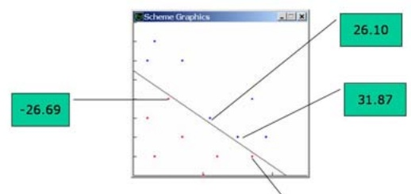

αy for support vectors are non-zero, all others are zero.

<!-- page: 7 -->

$$
h (\mathbf {u}) = \text {sign} \left(\sum_ {i = 1} ^ {k} \alpha_ {i} \mathbf {y} ^ {i} \mathbf {x} ^ {i} \cdot \mathbf {u} + b\right)
$$

## Key Points

• Learning depends only on dot products of sample pairs. Recognition depends only on dot products of unknown with samples.

## Slide 8.2.12

• Exclusive reliance on dot products enables approach to non-linearly-separable problems.

• The classifier depends only on the support vectors, not on all the training points.

Another point to remember is that the resulting classifier does not (in general) depend on all the training points but only on the ones "near the margin", that is, those that help define the boundary between the two classes.

## Slide 8.2.13

## Key Points

• Learning depends only on dot products of sample pairs. Recognition depends only on dot products of unknown with samples.

• Exclusive reliance on dot products enables approach to non-linearly-separable problems.

• The classifier depends only on the support vectors, not on all the training points.

• Max margin lowers hypothesis variance.

<!-- page: 8 -->

## 6.034 Notes: Section 8.3

## Slide 8.3.1

Thus far, we have only been talking about the linearly separable case. What happens for the case in which we have a "nearly separable" problem? That is, some "noise points" that are bound to be misclassified by a linear separator.

It is useful to think about the behavior of the dual perceptron on this type of problem. In that algorithm, the value of the alphai for a point is incremented proportionally to its distance to the separator. In fact, if the point is classified correctly, no change is made to the multiplier. We can see that if point i stubbornly resists being classified, then the value of alphai will continue to grow without bounds.

The alpha's in the dual perceptron are analogous to the values of the Lagrange multipliers in the SVM. In both cases, the separator is defined as a linear combination of the input points, with the alphas being the weights.

So, one strategy for dealing with these noise points in an SVM is to limit the maximal value of any of the alphai's (the Lagrange multipliers) to some C. And, furthermore, to ignore the points with this

## Not Linearly Separable?

• Require $0 \leq \alpha_{i} \leq C$

• C specified by user; controls tradeoff between size of margin and classification errors

• C = ∞ for separable case

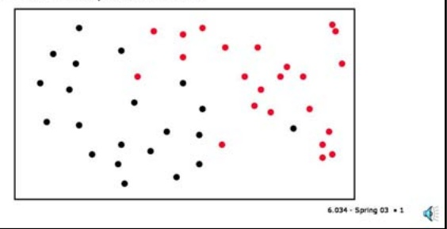

back to a linearly separable problem. By choosing a large value of C, we will work very hard at correctly classifying all the points, a low value of C will allow us to give up more easily on many of the points so as to achieve a better margin.

C Change

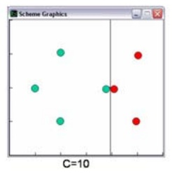

## Slide 8.3.2

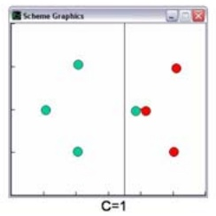

This simple example shows how changing C causes the geometric margin to change. High values of C penalize misclassifications more. Low values may permit misclassifications to achieve better margin.

<!-- page: 9 -->

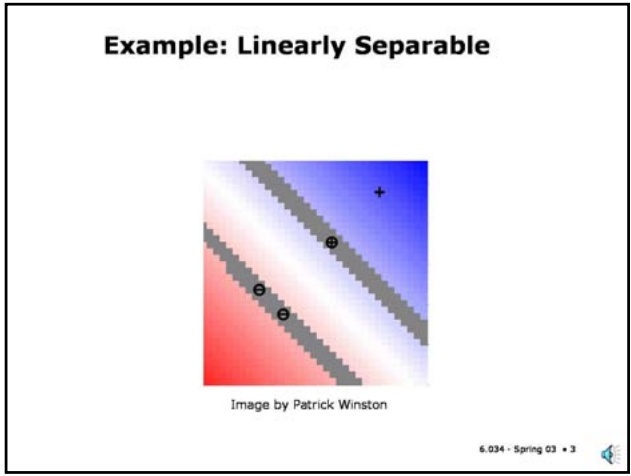

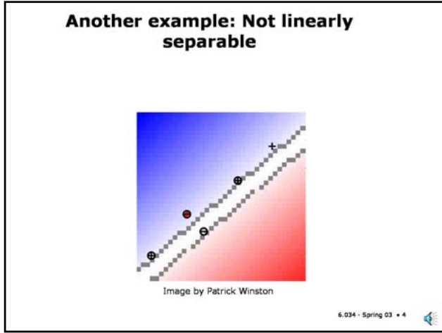

## Slide 8.3.4

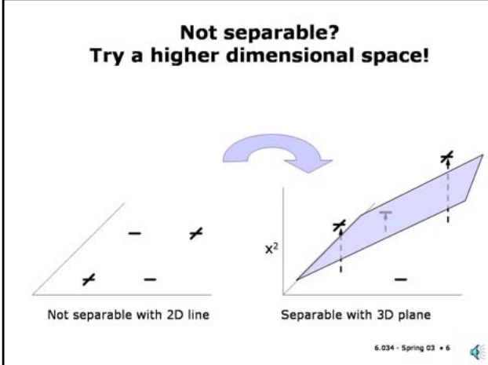

The next example is the same as the previous example, but with the addition of another plus sample in the lower left corner. There are several points of interest.

First, the optimization has failed to find a separating line, as indicated by the minus sample surrounded by a red disk. The alphas were bounded and so the contribution of this misclassified point is limited and the algorithm converges to a global optimum.

Second, the added point produced quite a different solution. The algorithm is looking for best possible dividing line; a tradeoff between margin and classification error defined by C. If we had kept a solution close to the one in the previous slide, the rogue plus point would have been misclassified by a lot, while with this solution we have reduced the misclassification margin substantially.

## Slide 8.3.5

However, even if we provide a mechanism for ignoring noise points, aren't we really limited by a linear classifier? Well, yes.

However, in many cases, if we transform the feature values in a non-linear way, we can transform a problem that was not linearly separable into one that is. This example, shows that we can create a circular separator by finding a linear classifier in a feature space defined by the squares of the original feature values. That is, we can obtain a non-linear classifier in the original space by finding a linear classifier in a transformed space.

Hold that thought.

Isn't a linear classifier very limiting?

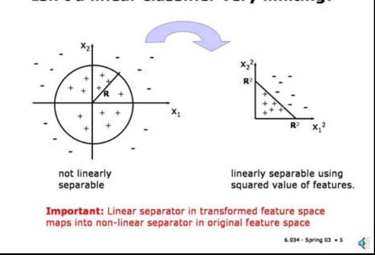

## Slide 8.3.6

Furthermore, when training samples are not separable in the original space they may be separable if you perform a transformation into a higher dimensional space, especially one that is a non-linear transformation of the input space.

For the example shown here, in the original feature space, the samples all lie in a plane, and are not separable by a straight line. In the new space, the samples lie in a three dimensional space, and happen to be separable by a plane.

The heuristic of moving to a higher dimensional space is general, and does not depend on using SVMs.

However, we will see that the support vector approach lends itself to movement into higher dimensional spaces because of the exclusive dependence of the support vector approach on dot products for learning and subsequent classification.

<!-- page: 10 -->

## Slide 8.3.9

Let's assume that we have a function that allows us to compute the dot products of the transformed vectors in a way that depends only on the original feature vectors and not directly on the transformed vectors. We will call this the **kernel function**. (This usage of the term "kernel" is related to kernel functions we saw in regression; they are both about measuring effective distances between points in different spaces.)

Then you do not need to know how to do the transformations themselves! This is why the supportvector approach is so appealing. The actual transformations may be computationally intractable, or you may not even know how to do the transformations at all, but you can still learn and classify without ever moving explicitly up into the high-dimensional space.

## The "Kernel Trick"

• If dot products can be efficiently computed by $\Phi(\mathbf{x}') \cdot \Phi(\mathbf{x}^k) = K(\mathbf{x}', \mathbf{x}^k)$

• Then, all you need is a function on low-dim inputs $K(\mathbf{x}^{i},\mathbf{x}^{k})$

• You don't need ever to construct high-dimensional Φ(x′)

## Standard Choices For Kernels

• No change (linear kernel)

$$
\Phi (\mathbf {x} ^ {i}) \cdot \Phi (\mathbf {x} ^ {k}) = K (\mathbf {x} ^ {i}, \mathbf {x} ^ {k}) = \mathbf {x} ^ {i} \cdot \mathbf {x} ^ {k}
$$

## Slide 8.3.10

<!-- page: 11 -->

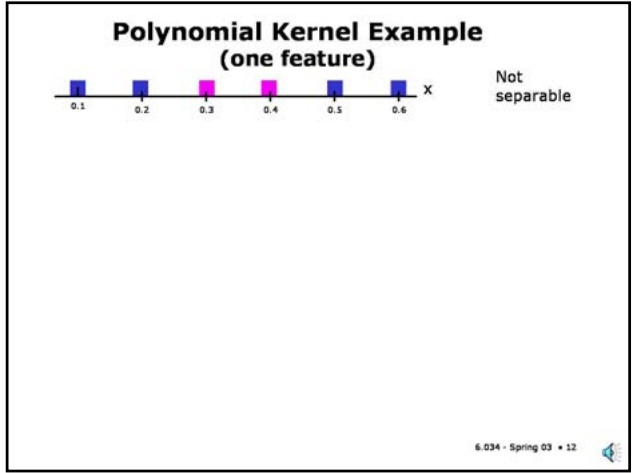

## Slide 8.3.12

Let's look at a simple example of using a polynomial kernel. Consider the one dimensional problem shown here, which is clearly not separable. Let's map it into a higher dimensional feature space using the polynomial kernel of second degree (n=2).

## Slide 8.3.13

Note that a second degree polynomial kernel is equivalent to mapping the single feature value x to a three dimensional space with feature values x2, sqrt(2)x, and 1. You can see that the dot product of two of these feature vectors is exactly the value computed by the polynomial kernel function.

If we plot the original points in the transformed feature space (using just the first two features), we see in fact that the two classes are linearly separable. Clearly, the third feature value (equal to 1) will be irrelevant in finding a separator.

The important aspect of all of this is that we can find and use such a separator without ever explicitly computing the transformed feature vectors - only the kernel function values are required.

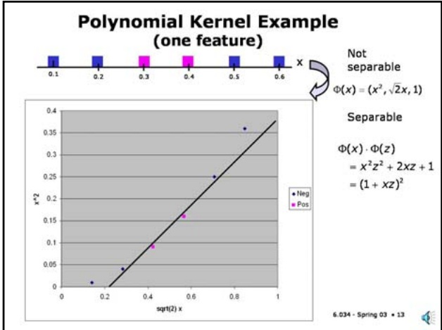

## Polynomial Kernel

## Slide 8.3.14

• Polynomial kernel for n=2 and features $\boldsymbol{x} = \left[ \boldsymbol{x}_{1} \times \boldsymbol{x}_{2} \right]$

$$
K (\mathbf {x}, \mathbf {z}) = (1 + \mathbf {x} \cdot \mathbf {z}) ^ {2}
$$

is equivalent to the following feature mapping:

$$
\Phi (\mathbf {x}) = [ x _ {1} ^ {2} x _ {2} ^ {2} \sqrt {2} x _ {1} x _ {2} \sqrt {2} x _ {1} \sqrt {2} x _ {2} 1 ]
$$

• We can verify that:

$$
\begin{array}{r l} \Phi (\mathbf {x}) \cdot \Phi (\mathbf {z}) & = x _ {1} ^ {2} z _ {1} ^ {2} + x _ {2} ^ {2} z _ {2} ^ {2} + 2 x _ {1} x _ {2} z _ {1} z _ {2} + 2 x _ {1} z _ {1} + 2 x _ {2} z _ {2} + 1 \\ & = (1 + x _ {1} z _ {1} + x _ {2} z _ {2}) ^ {2} \\ & = (1 + \mathbf {x} \cdot \mathbf {z}) ^ {2} \\ & = K (\mathbf {x}, \mathbf {z}) \end{array}
$$

Here is a similar transformation for a two dimensional feature vector. Note that the dimension of the transformed feature vector is now 6. In general, the dimension of the transformed feature vector will grow very rapidly with the dimension of the input vector and the degree of the polynomial.

<!-- page: 12 -->

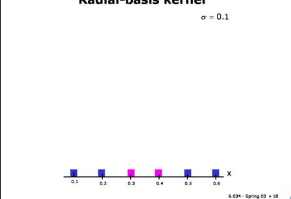

$$
\Phi (\mathbf {x} ^ {i}) \cdot \Phi (\mathbf {x} ^ {k}) = K (\mathbf {x} ^ {i}, \mathbf {x} ^ {k}) = \mathbf {x} ^ {i} \cdot \mathbf {x} ^ {k}
$$

$$
K (\mathbf {x} ^ {i}, \mathbf {x} ^ {k}) = (1 + \mathbf {x} ^ {i} \cdot \mathbf {x} ^ {k}) ^ {n}
$$

$$
K (\mathbf {x} ^ {i}, \mathbf {x} ^ {k}) = e \frac {- | \mathbf {x} ^ {i} - \mathbf {x} ^ {k} | ^ {2}}{2 \sigma^ {2}} = e \frac {- (\mathbf {x} ^ {i} - \mathbf {x} ^ {k}) \cdot (\mathbf {x} ^ {i} - \mathbf {x} ^ {k})}{2 \sigma^ {2}}
$$

## Slide 8.3.17

You can get a curved separator if you use radial basis functions, which give us a classifier that is a sum of the values of several Gaussian functions.

Let's pause a minute to observe something that should strike you as a bit weird. When we used the polynomial kernels, we could see that each input feature vector was being mapped into a higherdimensional, possibly very high dimensional, feature vector. With the radial-basis kernel each input feature vector is being mapped into a **function** that is defined over the whole feature space! In fact, each input feature point is being mapped into a point in an infinite-dimensional feature space (known as a Hilbert space). We then build the classifier as sum of these functions. Whew!

The actual operation of the process is less mysterious than this "infinite-dimensional" mapping view, as we will see by a very simple example.

Radial-basis kernel

## Slide 8.3.18

## Radial-basis kernel

• Classifier based on sum of Gaussian bumps with standard deviation $\sigma _ { r }$ centered on support vectors.

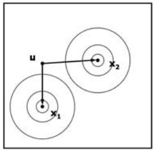

$$
h (\mathbf {u}) = \text { sign } [ h ^ {\prime} (\mathbf {u}) ]
$$

$$
h ^ {\prime} (\mathbf {u}) = \sum_ {i = 1} ^ {k} \alpha_ {i} y ^ {i} K (\mathbf {x} ^ {i}, \mathbf {u}) + b
$$

$$
K (\mathbf {x} ^ {i}, \mathbf {u}) = e \frac {- | \mathbf {x} ^ {i} - \mathbf {u} | ^ {2}}{2 \sigma^ {2}}
$$

<!-- page: 13 -->

## Slide 8.3.19

Here is the solution obtained from an SVM quadratic optimization algorithm. Note that four points are support vectors, as expected, the points near where the decision boundary has to be. The farther positive points receive alpha=0. The value of the offset, b is also shown.

The blue and pink Gaussian bumps correspond to copies of a Gaussian with standard deviation of 0.1 scaled by the corresponding alpha values.

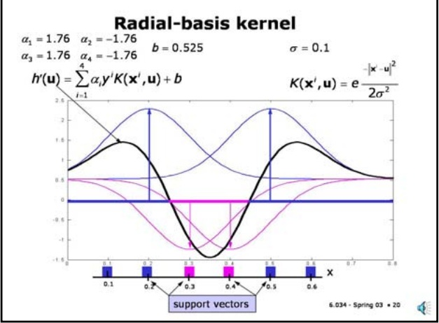

Slide 8.3.21

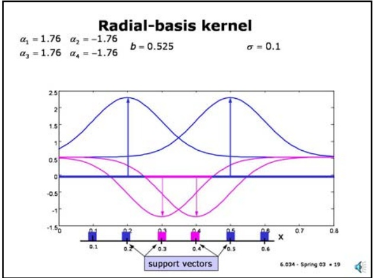

Slide 8.3.20

The black line corresponds to the sum of the four bumps (and the offset). The important point is to notice where this line crosses zero since that's the decision surface (in one dimension). Notice that, as required, it succeeds in separating the positive from the negative points.

Here we see a separator for our simple five point example computed using radial basis kernels. The solution on the left, for reference, is the original dot product. The solution on the right is for a radial basis function with a sigma of one. Note that all the points are now support vectors.

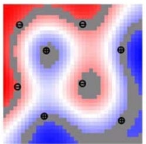

## Another radial-basis example (small σ)

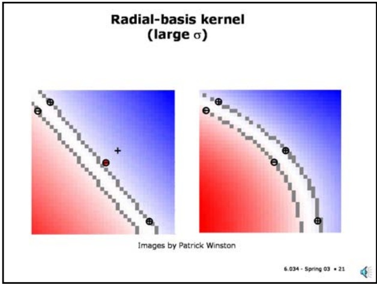

Image by Patrick Winston

## Slide 8.3.22

If a space is truly convoluted, you can always cover it with a radial basis solution with small-enough sigma. In extreme cases, like this one, each of the four plus and four minus samples has become a support vector, each specialized to the small part of the total space in its vicinity. This is basically similar to 1-nearest neighbor and is just as powerful and subject to overfitting.

<!-- page: 14 -->

## Slide 8.3.25

So, let's summarize the SVM story. One key point is that SVMs have a training method that guarantees a unique global optimum. This eliminate many headaches in other approaches to machine learning.

We shouldn't take this bound too seriously; it is not actually very predictive of generalization performance in practice but it does point out an important property of SVMs - that generalization performance is more related to expected number of support vectors than to dimensionality of the transformed feature space.

## Summary

• A single global optimum

• Quadratic programming or gradient descent

## Summary

• A single global maximum

• Quadratic programming or gradient descent

• Fewer parameters

• C and kernel parameters (n for polynomial, σ for radial basis kernel)

## Slide 8.3.26

<!-- page: 15 -->

## Slide 8.3.29

SVMs have proved useful in a wide variety of applications, particularly those with large numbers of features, such as image and text recognition problems. They are the method of choice in text classification problems, such as categorization of news articles by topic, or spam detection, because they can work in a huge feature space (typically with a linear kernel) without too much fear of overfitting.

## Success Stories

## • Gene microarray data

• outperformed all other classifiers

• specially designed kernel

## • Text categorization

• linear kernel in >10,000 D input space

• best prediction performance

• 35 times faster to train than next best classifier (decision trees)

## • Many others:

http://www.clopinet.com/isabelle/Projects/SVM/applist.html

<!-- page: 16 -->

## Slide 8.4.1

In many machine-learning applications, there are huge numbers of features. In text classification, you often have as many features as there are words in the dictionary. Gene expression arrays have five to fifty thousand elements. Images can have as many as 512 by 512 pixels.

• In many machine learning applications, there are huge numbers of features

• text classification (# words)

## Feature Selection

• gene arrays $(5,000-50,000)$

• images (512 x 512 pixels)

• Too many features

• make algorithms run slowly

• risk overfitting

## Feature Selection

• In many machine learning applications, there are huge numbers of features

• gene arrays (5,000 – 50,000)

• text classification (# words)

• images (512 x 512 pixels)

## Slide 8.4.2

When there are lots of features in a domain, it can make some machine learning algorithms run much too slowly. Worse, it often causes overfitting problems: most classifiers have a complexity related to the number of features, and in many of these cases we can have many more features than training examples, which doesn't give us much confidence in our parameter estimates.

## Slide 8.4.3

## Feature Selection

• In many machine learning applications, there are huge numbers of features

• text classification (# words)

• gene arrays (5,000 – 50,000)

• images (512 x 512 pixels)

• Too many features

• make algorithms run slowly

• risk overfitting

• Find a smaller feature space

• subset of existing features

• new features constructed from old ones

## Feature Ranking

## Slide 8.4.4

• Choose the k features with the highest rankings

• Correlation between feature j and output

$$
R (j) = \frac {\sum_ {i} (x _ {j} ^ {i} - \bar {x} _ {j}) (y ^ {i} - \bar {y})}{\sqrt {\sum_ {i} (x _ {j} ^ {i} - \bar {x} _ {j}) ^ {2} \sum_ {i} (y ^ {i} - \bar {y}) ^ {2}}}
$$

$$
\bar {x} _ {j} = \frac {1}{n} \sum_ {i} x _ {j} ^ {i}
$$

$$
\bar {y} = \frac {1}{n} \sum_ {i} y ^ {i}
$$

• Correlation measures how much x tends to deviate from its mean on the same examples on which y deviates from its mean

The simplest feature-selection strategy is to compute some score for each feature, and then select the k features with the highest rankings.

A popular feature score is the correlation between a feature and the output variable. It measures the degree to which a feature varies with the output, and is usable when the output is discrete or continuous.

<!-- page: 17 -->

## Slide 8.4.5

We computed the correlations of each of the features in the heart disease data set with the output. They are shown here in sorted order, with reference to the decision tree we learned on this data.

We can see that most of the features used in the tree show up among the top features, ranked according to correlation. You can see the features with a positive correlation score indicate that heart disease is more likely, and those with a negative score indicate that it is less likely.

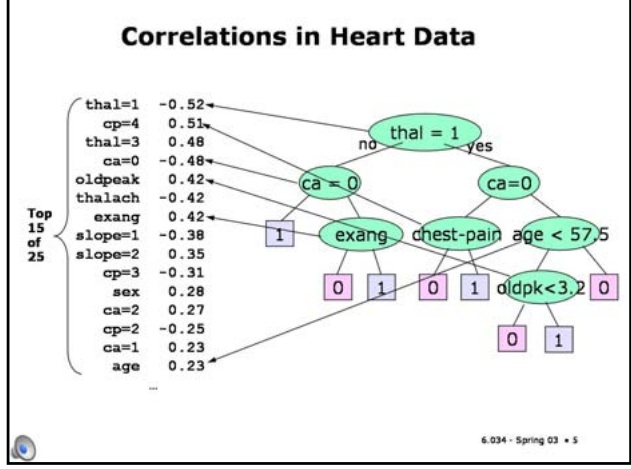

## Correlations in MPG > 22 data

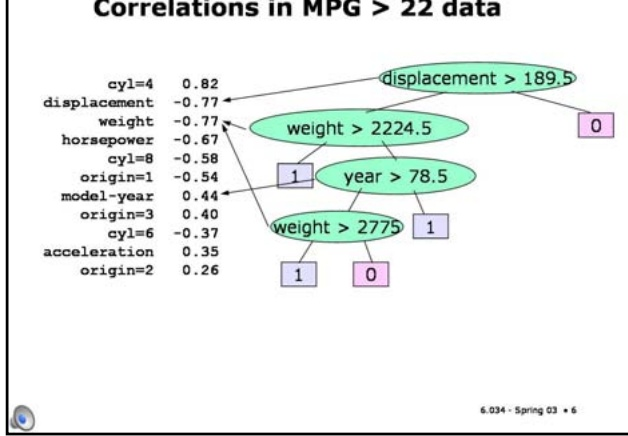

## Slide 8.4.7

As usual, XOR will cause us trouble if we do scoring of single features. In an XOR problem, each feature will, individually, have a correlation of 0 with the output.

## Subset Selection

• Consider subsets of variables

To solve xor problems, we need to look at groups of features together.

• too hard to consider all possible subsets

## Slide 8.4.6

• wrapper methods: use training set or cross-validation error to measure the goodness of using different feature subsets with your classifier

Here's a similar figure for the auto fuel efficiency data. It's interesting to see that the highestcorrelation feature is binary choice about whether there are 4 cylinders. It looks like binary features have a tendency to be preferred (since the output is binary, as well, and so they often match up perfectly). But displacement is also very highly ranked, and probably contains more information than the number of cylinders.

• greedily construct a good subset by adding or subtracting features one by one

## XOR Bites Back

• As usual, functions with XOR in them will cause us trouble

• Each feature will, individually, have a correlation of 0 (it occurs positively as much as negatively for positive outputs)

• To solve XOR, we need to look at groups of features together

## Slide 8.4.8

<!-- page: 18 -->

## Slide 8.4.11

Even if we do forward selection, XOR can cause us trouble. Because we only consider adding features one by one, neither of the features will look particularly attractive individually, and so we would be unlikely to add them until the very end.

## Backward Elimination

## Slide 8.4.12

Given a particular classifier you want to use

F = all features

For each $\mathbf{f}_{z}$

Train classifier with inputs F - {f,}

Remove f, that results in lowest-error classifier from F

Continue until F is the right size, or error increases too much

## Forward Selection

Given a particular classifier you want to use

F = {}

For each $\mathbf { f } _ { z }$

Train classifier with inputs F + {f,}

Add f, that results in lowest-error classifier to F

Continue until F is the right size, or error has quit decreasing

• Decision trees, by themselves, do something similar to this

• Trouble with XOR

<!-- page: 19 -->

Backward Elimination on Auto Data

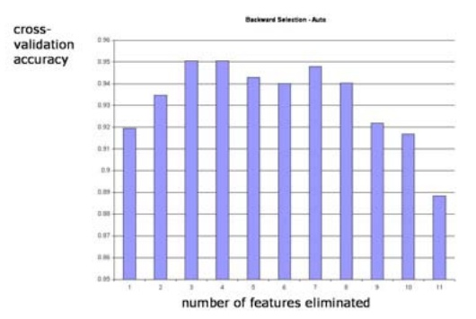

Slide 8.4.15

On the heart data, we need about 8 features before we're getting reasonably good performance. The accuracies are pretty erratic after that; it's probably an indication of overall variance in the performance estimates.

## Slide 8.4.14

The picture for backward elimination is similar. But notice that it seems to work a bit better, even when we are eliminating a lot of features. This may be because it can decide which features to eliminate in the context of all the other features. Forward selection, especially in the early phases, picks features without much context.

## Backward Elimination on Heart Data

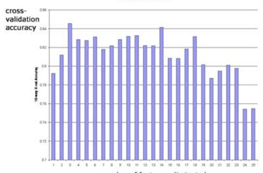

Forward Selection on Heart Data

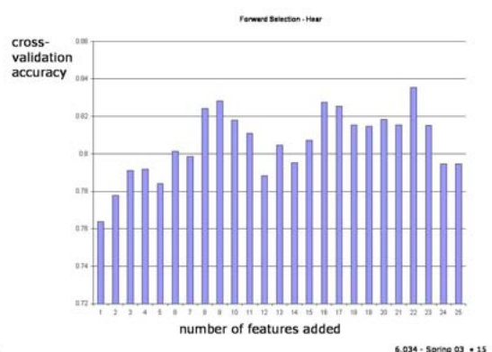

## Slide 8.4.16

We can see similar performance with backward elimination. It's possible to get rid of a lot of features before performance suffers dramatically. And, it really seems to be worthwhile to eliminate some of the features, from a performance perspective.

<!-- page: 20 -->

6.034 Artificial Intelligence. Copyright © 2005 by Massachusetts Institute of Technology.

## Slide 8.4.17

Backward elimination and forward selection can be computationally quite expensive, because they require you, on each iteration, to train approximately as many classifiers as you have features.

In some classifiers, such as linear support-vector machines and linear neural networks, it's possible to do backward elimination more efficiently. You train the classifier once, and then remove the feature that has the smallest input weight.

These methods can be extended to non-linear SVMs and neural networks, but it gets somewhat more complicated there.

## Recursive Feature Elimination

Train a linear SVM or neural network Remove the feature with the smallest weight Repeat

• More efficient than regular backward elimination

• Requires only one training phase per feature

## Clustering

## Slide 8.4.18

• Form clusters of inputs

• Map the clusters into outputs • Given a new example, find its cluster, and generate the associated output

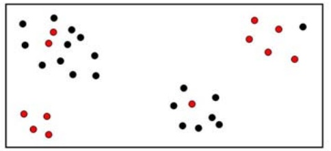

Slide 8.4.19

So, in this case, we might divide the input points into 4 clusters. The stars indicate the cluster centers.

## Clustering

• Form clusters of inputs

• Map the clusters into outputs • Given a new example, find its cluster, and generate the associated output

## Slide 8.4.20

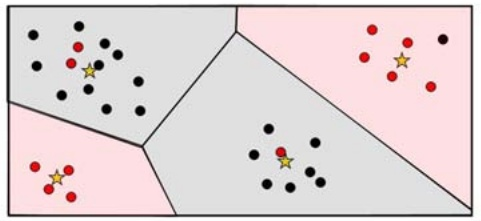

6.034 - Spring 03 • 17

Another whole strategy for feature selection is to make new features. One very drastic method is to try to cluster all of the inputs in your data set into a relatively small number of groups, and then learn a mapping from each group into an output.

## Clustering

• Form clusters of inputs

• Map the clusters into outputs • Given a new example, find its cluster, and generate the associated output

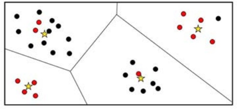

Then, for each cluster, we would assign the majority class. Now, to predict the value of a new point, we would see which region it would land in, and predict the associated class.

This is different from nearest neighbors in that we actually discard all the data except the cluster centers. This has the advantage of increasing interpretability, since the cluster centers represent "typical" inputs.

<!-- page: 21 -->

## Slide 8.4.21

So, what makes a good clustering? There are lots and lots of different technical choices. The basic idea is usually that you want to have clusters in which the distance between points in the same group is small and the distance between points in different groups is large.

Clustering, like nearest neighbor, requires a distance metric, and the results you get are as scalesensitive as they are in nearest-neighbor.

## Clustering Criteria

• small distances between points within a cluster

• large distances between clusters

• Need a distance measure, as in nearest neighbor

## K-Means Clustering

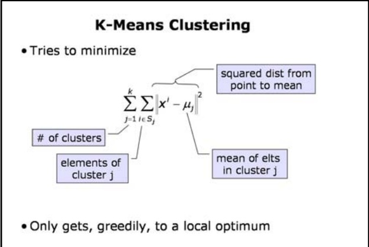

## Slide 8.4.22

• Only gets, greedily, to a local optimum

## Slide 8.4.23

## K-means Algorithm

Here is the code for the k-means clustering algorithm. You start by choosing k, your desired number of clusters. Then, you can randomly choose k of your data points to serve as the initial cluster centers.

## Choose k

## Slide 8.4.24

Randomly choose k points Cj to be cluster centers Loop

One of the simplest and most popular clustering methods is K-means clustering. It tries to minimize the sum, over all the clusters, of the variance of the points within the cluster (the distances of the points to the geometric center of the cluster).

Partition the data into k classes Sj according to which of the Cj they're closest to

Unfortunately, it only manages to get to a local optimum of this measure, but it's usually fairly reasonable.

For each Sj, compute the mean of its elements and let that be the new cluster center

## K-means Algorithm

## Choose k

Randomly choose k points Cj to be cluster centers

<!-- page: 22 -->

Slide 8.4.27

## K-Means Example

Here's a running example simulation of the k-means algorithm. We start with this set of input points.

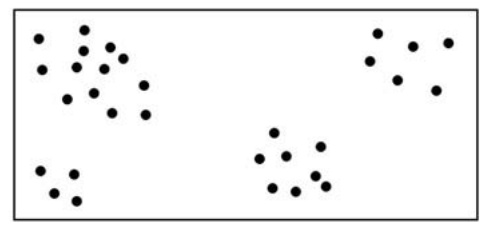

## K-Means Example

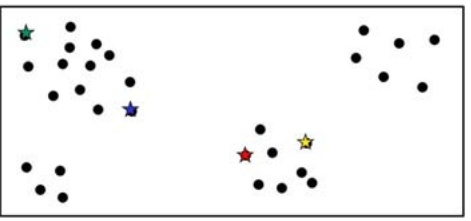

## Slide 8.4.28

And randomly pick 4 of them to be our cluster centers.

<!-- page: 23 -->

Now we partition the data, assigning each point to the center to which it is closest.

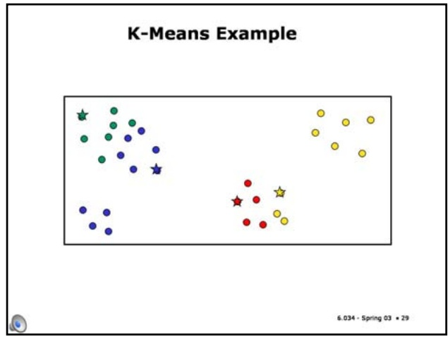

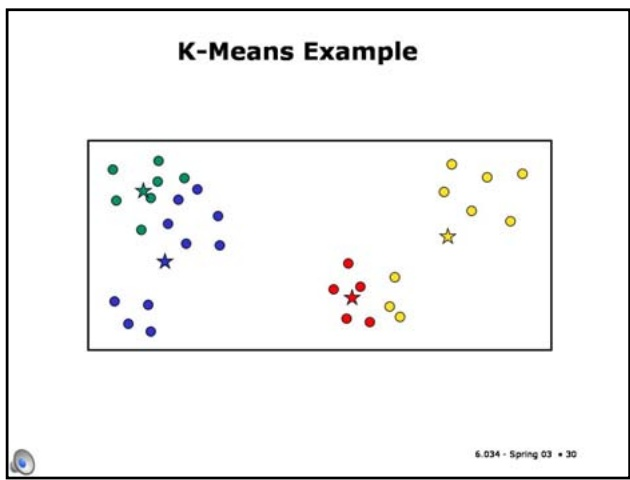

Slide 8.4.30 We move each center to the mean of the points that belong to it.

Slide 8.4.31

Having moved the means, we can now do a new reassignment of points.

## K-Means Example

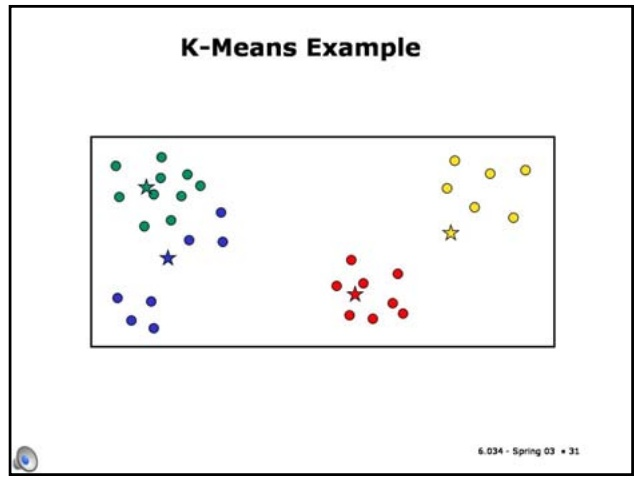

## K-Means Example

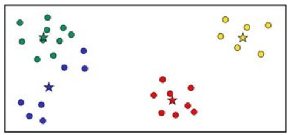

Slide 8.4.32 And recompute the centers.

<!-- page: 24 -->

## Slide 8.4.33

Here we reassign one more point to the green cluster,

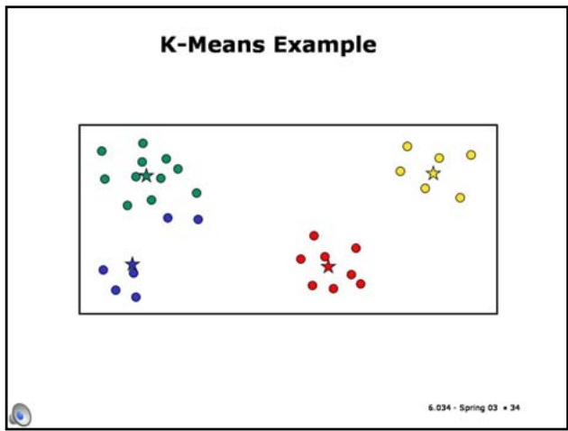

Slide 8.4.35

Now two more points get reassigned to green,

## K-Means Example

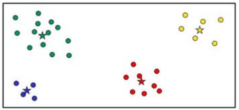

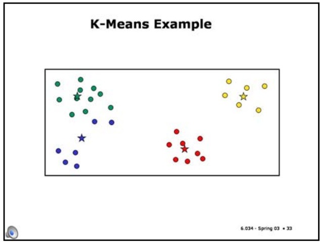

Slide 8.4.34

Which causes the green and blue centers to move a bit. At this point, the red and yellow clusters are stable.

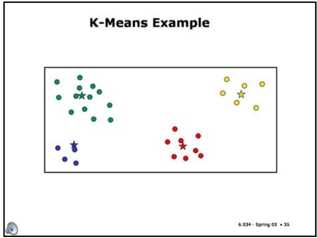

## Slide 8.4.36

And we recompute the centers, to get a clustering that is stable, and will not change under further iterations.

<!-- page: 25 -->

## Slide 8.4.39

It's harder to see in three dimensions, but here's a data set that might be effectively described using only two dimensions.

## Principal Components Analysis

• Given an n-dimensional real-valued space, data are often nearly restricted to a lower-dimensional subspace

• PCA helps us find such a subspace whose coordinates are linear functions of the originals

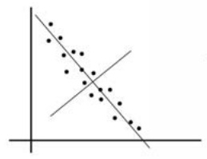

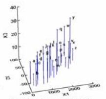

http://www.okstate.edu/artsci/botany/ordinate/PCA.htm

## Cartoon of algorithm

• Normalize the data (subtract mean, divide by stdev)

## Slide 8.4.40

To really understand what's going on in this algorithm, you need to have had linear algebra. We'll just give you a "cartoon" idea of how it works.

We start out by normalizing the data (subtracting the mean and dividing by the standard deviation). The new set of coordinates we construct will have its origin at the centroid of the data.

<!-- page: 26 -->

## Slide 8.4.43

The result of this process is a new set of orthogonal axes. The first k of them give a lower-dimensional space that represents the variability of the data as well as possible.

## Cartoon of algorithm

## Slide 8.4.44

• Normalize the data (subtract mean, divide by stdev)

• Find the line along which the data has the most variability: that's the first principal component

• Project the data into the n-1 dimensional space orthogonal to the line

• Repeat

• Result is a new orthogonal set of axes

• First k give a lower-D space that represents the variability of the data as well as possible

• Really: find the eigenvectors of the covariance matrix with the k largest eigenvalues

## Cartoon of algorithm

• Normalize the data (subtract mean, divide by stdev)

• Find the line along which the data has the most variability: that's the first principal component • Project the data into the n-1 dimensional space orthogonal to the line

• Repeat

• Result is a new orthogonal set of axes

• First k give a lower-D space that represents the variability of the data as well as possible

<!-- page: 27 -->

## Slide 8.4.45

One problem with PCA (as it's called by its friends) is that it can only produce a set of coordinates that's a linear transformation of the originals. But here's a data set that seems to have a fundamentally one-dimensional structure. Unfortunately, we can't express its axis as a linear combination of the original ones. There are some other cool dimensionality reduction techniques that can actually find this structure!

## Linear Transformations Only

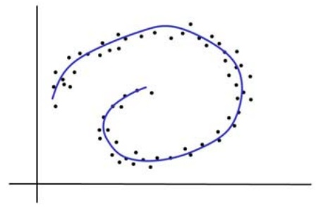

## Insensitive to Classification Task

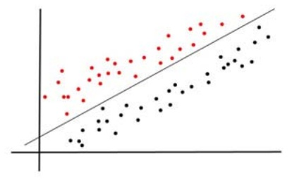

## Slide 8.4.46

Another problem with PCA is that it (like k-Means clustering) ignores the classes of the points. So, in this example, the principal component is the line that goes between the two classes (it's a great separator, but that's not what we're looking for right now).

## Slide 8.4.47

Now, if we project the data onto that line (which is what would happen if we wanted to reduce the dimensionality of our data set to 1), the positive and negative points are completely intermingled, and we can never get a separator.

There are dimensionality-reduction techniques, also, sadly beyond our scope, that try to optimize the discriminability of the data rather than its variability, which don't suffer from this problem.

## Insensitive to Classification Task

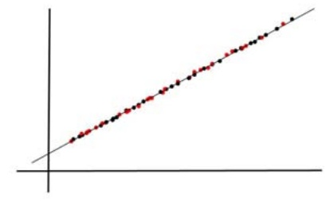

## Validating a Classifier

## Slide 8.4.48

We're just going to tack one additional topic onto the end of this section. It has to do with understanding how well a classifier works. So far, we've been thinking about optimizing training error or cross-validation error, where "error" is measured as the number of examples we get wrong. Let's examine this a little more carefully.

In a binary classification problem, on a single example, there are 4 possible outcomes, depending on the true output value for the input and the predicted output value. In this table, we'll assign values A through D to be the number of times each of these outcomes happens on a data set.

<!-- page: 28 -->

## Slide 8.4.49

Case B, in which the answer was supposed to be 0 but the classifier predicted 1 is called a "false positive" or a type 1 error.

Slide 8.4.50

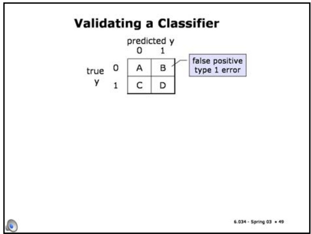

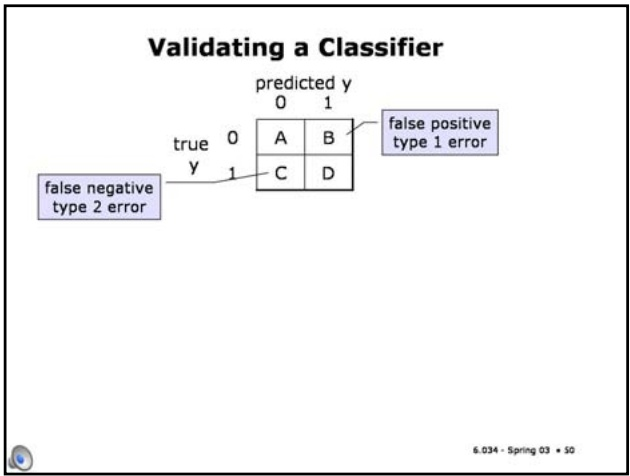

Case C, in which the answer was supposed to be 1 but the classifier predicted 0 is called a "false negative" or a type 2 error.

Slide 8.4.51

Given these 4 numbers, we can define different characterizations of the classifier's performance. The sensitivity is the probability of predicting a 1 when the actual output is 1. This is also called the true positive rate, or TP.

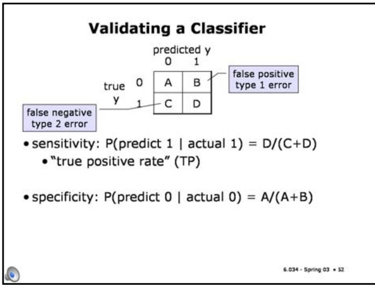

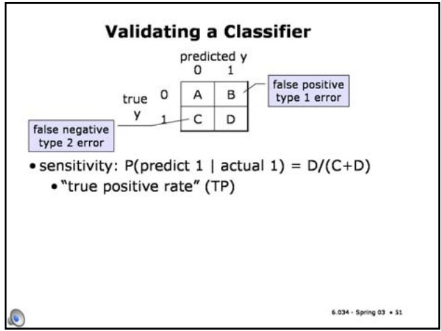

<!-- page: 29 -->

## Cost Sensitivity

• Disease is often fatal if left untreated • Predict whether a patient has pseuditis based on blood tests

• Treatment is cheap and side-effect free

## Slide 8.4.54

Imagine that you're a physician and you need to predict whether a patient has pseuditis based on the results of some blood tests. The disease is often fatal if it's left untreated, and the treatment is cheap and relatively side-effect free.

## Slide 8.4.55

You have two different classifiers that you could use to make the decision. The first has a true-positive rate of 0.9 and a false-positive rate of 0.4. That means that it will diagnose the disease in 90 percent of the people who actually have it; and also diagnose it in 40 percent of people who don't have it.

## Cost Sensitivity

• Predict whether a patient has pseuditis based on blood tests

• Disease is often fatal if left untreated

• Treatment is cheap and side-effect free

• Which classifier to use?

• Classifier1: TP = 0.9, FP = 0.4

## Cost Sensitivity

• Classifier 2: TP = 0.7, FP = 0.1 • Predict whether a patient has pseuditis based on blood tests

• Disease is often fatal if left untreated

• Treatment is cheap and side-effect free

• Which classifier to use?

• Classifier 1: TP = 0.9, FP = 0.4

## Slide 8.4.56

<!-- page: 30 -->

## Tunable Classifiers

• Classifiers that have a threshold (naïve Bayes, neural nets, SVMs) can be adjusted, post learning, by changing the threshold, to make different tradeoffs between type 1 and type 2 errors

## Slide 8.4.58

Often it's useful to deliver a classifier that is tunable. That is, a classifier that has a parameter in it that can be used, at application time, to change the trade-offs made between type 1 and type 2 errors. Most classifers that have a threshold (such as naive Bayes, neural nets, or SVMs), can be tuned by changing the threshold. At different values of the threshold the classifier will tend to make more errors of one type versus the other.

## Slide 8.4.59

In a particular application, we can choose a threshold as follows.

Let c1 and c2 be the costs of the two different types of errors; let p be the percentage of positive examples, let x be the threshold parameter that we are allowed to tune, and let TP(x) and FP(x) be the true-positive and false-positive rates, respectively, of the classifier when the threshold is set to have value x.

Then, we can characterize the average, or expected, cost based on this formula, as a function of x. We should choose the value of x that will minimize expected cost.

ROC Curves

• "receiver operating characteristics"

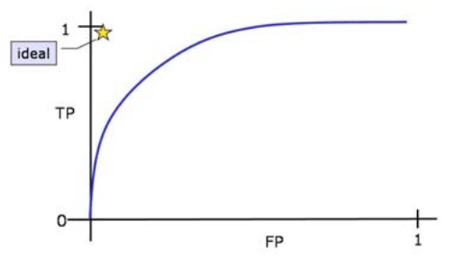

## Tunable Classifiers

• Classifiers that have a threshold (naïve Bayes, neural nets, SVMs) can be adjusted, post learning, by changing the threshold, to make different tradeoffs between type 1 and type 2 errors

$C_{1},C_{2};$ costs of errors

• P: percentage of positive examples

• x: tunable threshold

• TP(x): true positive rate at threshold x

• FP(x): false positive rate at threshold x

• Expected Cost = C1P(1-TP(x)) + C2(1-P)FP(x)

• choose x to minimize expected cost

## Slide 8.4.60

<!-- page: 31 -->

## Slide 8.4.61

In reality, as we adjust the parameter in the classifier, we typically go from a situation in which the classifier always outputs 0, which generates no false positives and no true positives, to a situation in which the classifier always outputs 1, in which case we have both false positive and true positive rates of 1.

## Slide 8.4.62

The ROC curve itself is a parametric curve; for each value of x, we plot the pair FP(x), TP(x). The curve shows the range of possible behaviors of the classifier. It is typically shaped something like this blue curve; the higher the false positive rate we can stand, the higher the rate of detecting true positives we can achieve.

## Slide 8.4.63

Often it is useful to compare two different classifiers by comparing their ROC curves. If we're lucky, then one curve is always higher than the other. In such a situation, we'd say that the blue curve **dominates** the red curve. That means that, no matter what costs apply in our domain, it will be better to use the blue classifier (because, for any fixed rate of false positives, the blue classifier can achieve more true positives; or for any fixed rate of true positives, the blue classifier can always achieve fewer false positives).

If the curves cross, then it will be better to use one classifier in some cost situations and the other classifier in other situations.

## Many more issues!

• Missing data

• Many examples in one class, few in other (fraud detection)

• Expensive data (active learning)

• ...

## Slide 8.4.64

Machine learning is a huge field that we have just begun to cover. Even in the context of supervised learning, there are a variety of other issues, including how to handle missing data, what to do when you have very many negative examples and just a few positives (such as when you're trying to detect fraud), what to do when getting y values for your x's is very expensive (you might actively choose which y's you'd like to have labeled), and many others.

If you like this topic, take a probability course, and then take the graduate machine learning course.
