<!-- page: 1 -->

Slide 9.1.1

What is a logic? A logic is a formal language. And what does that mean? It has a syntax and a semantics, and a way of manipulating expressions in the language. We'll talk about each of these in turn.

## What is a logic?

• A formal language

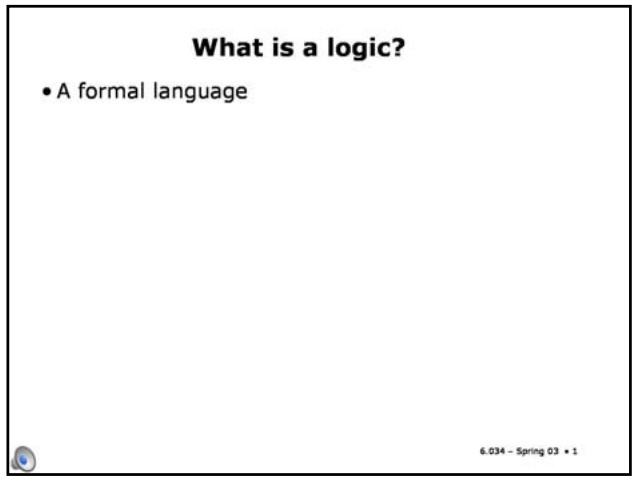

## What is a logic?

• A formal language

• Syntax – what expressions are legal

## Slide 9.1.2

The syntax is a description of what you're allowed to write down; what the expressions are that are legal in a language. We'll define the syntax of a propositional logic in complete detail later in this section.

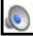

Slide 9.1.3

The semantics is a story about what the syntactic expressions mean. Syntax is form and semantics is content.

## What is a logic?

• A formal language

• Syntax – what expressions are legal

• Semantics – what legal expressions mean

<!-- page: 2 -->

## Slide 9.1.4

## What is a logic?

• A formal language

• Syntax – what expressions are legal

• Semantics – what legal expressions mean • Proof system – a way of manipulating syntactic expressions to get other syntactic expressions (which will tell us something new)

Slide 9.1.5

So, why would we want to do proofs? There are lots of situations.

A logic usually comes with a proof system, which is a way of manipulating syntactic expressions to get other syntactic expressions. And, why are we interested in manipulating syntactic expressions? The idea is that if we use a proof system with the right kinds of properties, then the new syntactic expressions we create will have semantics or meanings that tell us something "new" about the world.

## What is a logic?

• A formal language

• Syntax – what expressions are legal

• Semantics – what legal expressions mean

• Proof system – a way of manipulating syntactic expressions to get other syntactic expressions (which will tell us something new)

• Why proofs? Two kinds of inferences an agent might want to make:

## What is a logic?

• A formal language

## Slide 9.1.6

• Syntax – what expressions are legal

• Semantics – what legal expressions mean • Proof system – a way of manipulating syntactic expressions to get other syntactic expressions (which will tell us something new)

• Why proofs? Two kinds of inferences an agent might want to make:

Multiple percepts => conclusions about the world

In the context of an agent trying to reason about its world, think about a situation where we have a bunch of percepts. Let's say we saw somebody come in with a dripping umbrella, we saw muddy tracks in the hallway, we see that there's not much light coming in the windows, we hear pitter-pitterpatter. We have all these percepts, and we'd like to draw some conclusion from them, meaning that we'd like to figure out something about what's going on in the world. We'd like to take all these percepts together and draw some conclusion about the world. We could use logic to do that.

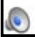

## Slide 9.1.7

Another use of logic is when you know something about the current state of the world and you know something about the effects of an action that you're considering doing. You wonder what will happen if you take that action. You have a formal description of what that action does in the world. You might want to take those things together and infer something about the next state of the world. So these are two kinds of inferences that an agent might want to do. We could come up with a lot of other ones, but those are two good examples to keep in mind.

## What is a logic?

## • A formal language

• Syntax – what expressions are legal

• Semantics – what legal expressions mean

• Proof system – a way of manipulating syntactic expressions to get other syntactic expressions (which will tell us something new)

• Why proofs? Two kinds of inferences an agent might want to make:

• Multiple percepts => conclusions about the world

• Current state & operator => properties of next state

<!-- page: 3 -->

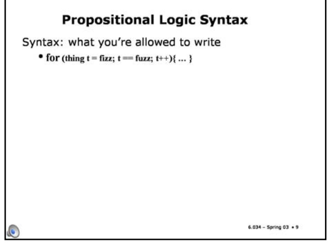

## Propositional Logic Syntax

## Slide 9.1.8

We'll look at two kinds of logic: propositional logic, which is relatively simple, and first-order logic, which is more complicated. We're just going to dive right into propositional logic, learn something about how that works, and then try to generalize later on. We'll start by talking about the syntax of propositional logic. Syntax is what you're allowed to write on your paper.

Slide 9.1.9

You're all used to rules of syntax from programming languages, right? In Java you can write a for loop. There are rules of syntax given by a formal grammar. They tell you there has to be a semicolon after fizz; that the parentheses have to match, and so on. You can't make random changes to the characters in your program and expect the compiler to be able to interpret it. So, the syntax is what symbols you're allowed to write down in what order. Not what they mean, not what computation they symbolize, but just what symbols you can write down.

## Propositional Logic Syntax

Syntax: what you're allowed to write

• for (thing t = fizz; t == fuzz; t++){ ... }

## Propositional Logic Syntax

Syntax: what you're allowed to write

## Slide 9.1.10

• for (thing t = fizz; t == fuzz; t++){ . }

• Colorless green ideas sleep furiously.

Another famous illustration of syntax is this one, due to the linguist Noam Chomsky: "Colorless green ideas sleep furiously". The idea is that it doesn't mean anything really, but it's syntactically wellformed. It's got the nouns, the verbs, and the adjectives in the right places. If you scrambled the words up, you wouldn't get a sentence, right? You'd just get a string of words that didn't obey the rules of syntax. So, "furiously ideas green sleep colorless" is not syntactically okay.

Slide 9.1.11

Let's define the syntax of propositional logic. We'll call the legal things to write down "sentences". So if something is a sentence, it is a syntactically okay thing in our language. Sometimes sentences are called "WFFs" (which stands for "well-formed formulas") in other books.

## Propositional Logic Syntax

Syntax: what you're allowed to write

• for (thing t = fizz; t == fuzz; t++){ ... }

• Colorless green ideas sleep furiously.

Sentences (wffs: well formed formulas)

<!-- page: 4 -->

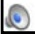

Slide 9.1.13

## Slide 9.1.12

## Propositional Logic Syntax

Syntax: what you're allowed to write

We're going to define the set of legal sentences recursively. So here are two base cases: The words, "true" and "false", are sentences.

• for (thing t = fizz; t == fuzz; t++){ ... }

• Colorless green ideas sleep furiously.

Sentences (wffs: well formed formulas)

• true and false are sentences

Propositional variables are sentences. I'll give you some examples. P, Q, R, Z. We're not, for right now, defining a language that a computer is going to read. And so we don't have to be absolutely rigorous about what characters are allowed in the name of a variable. But there are going to be things called variables, and we'll just use uppercase letters for them. Those are sentences. It's OK to say "P" -- that's a sentence.

## Propositional Logic Syntax

Syntax: what you're allowed to write

• for (thing t = fizz; t == fuzz; t++){ .. }

• Colorless green ideas sleep furiously.

Sentences (wffs: well formed formulas)

• true and false are sentences

• Propositional variables are sentences: $\mathsf{P},\mathsf{Q},\mathsf{R},\mathsf{Z}$

## Propositional Logic Syntax

## Slide 9.1.14

Syntax: what you're allowed to write

• for (thing t = fizz; t == fuzz; t++){... }

• Colorless green ideas sleep furiously.

Sentences (wffs: well formed formulas)

• true and false are sentences

• Propositional variables are sentences: P,Q,R,Z

• If φ and yψ are sentences, then so are

(φ), ¬φ, φ∨ψ, φ∧ψ, φ→ψ, φ←→ψ

Now, here's the recursive part. If Phi and Psi are sentences, then so are -- Wait! What, exactly, are Phi and Psi? They're called metavariables, and they range over expressions. This rule says that if Phi and Psi are things that you already know are sentences because of one of these rules, then you can make more sentences out of them. Phi with parentheses around it is a sentence. Not Phi is a sentence (that little bent thing is our "not" symbol (but we're not really supposed to know that yet, because we're just doing syntax right now)). Phi "vee" Psi is a sentence. Phi "wedge" Psi is a sentence. Phi "arrow" Psi is a sentence. Phi "two-headed arrow" Psi is a sentence.

## Slide 9.1.15

## Propositional Logic Syntax

Syntax: what you're allowed to write

• for (thing t = fizz; t == fuzz; t++){... }

• Colorless green ideas sleep furiously.

Sentences (wffs: well formed formulas)

• true and false are sentences

• Propositional variables are sentences: P,Q,R,Z

• If φ and ψ are sentences, then so are

(φ), →, φ∨ψ, φ∧ψ, φ→ψ, φ↔

• Nothing else is a sentence

<!-- page: 5 -->

## 6.034 Notes: Section 9.2

## Slide 9.2.1

Let's talk about semantics. The semantics of a sentence is its meaning. What does it say about the world? We could just write symbols on the board and play with them all day long, and it could be fun; it could be like doing puzzles. But ultimately the reason that we want to be doing something with these kinds of logical sentences is because they somehow say something about the world. And it's really important to be clear about the connections between the things that we write on the board and what we think of them as meaning in the world, what they stand for. And it's going to be something different every day. I remember once when I was a little kid, I was on the school bus. And somebody's big sister or brother had started taking algebra and this kid told me, "You know what? My big sister's taking algebra and A equals 3!" The reason that sounds so silly is that A is a variable. Our variables are going to be the same. They'll have different interpretations in different situations. So, in our study of logic, we're not going to assign particular values or meanings to the variables; rather, we're going to study the general properties of symbols and their potential meanings.

## Semantics

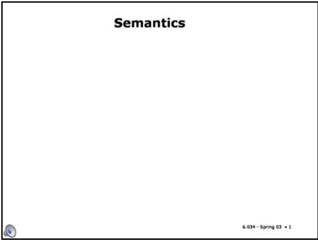

Slide 9.2.2

## Semantics

• Meaning of a sentence is truth value {t, f}

Ultimately, the meaning of every sentence, in a situation, will be a truth value, t or f. Just as, in highschool algebra, the meaning of every expression is a numeric value. Note that there's already a really important difference between underlined true and false, which are syntactic entities that we can write on the board, and the truth values t and f which stand for the abstract philosophical ideals of truth and falsity.

<!-- page: 6 -->

## Slide 9.2.3

How can we decide whether A "wedge" B "wedge" C is true or not? Well, it has to do with what A and B and C stand for in the world. What A and B and C stand for in the world will be given by an object called an "interpretation". An interpretation is an assignment of truth values to the propositional variables. You can think of it as a possible way the world could be. So if our set of variables is P, Q, R, and V, then P true, Q false, R true, V true, that would be an interpretation. So then, given an interpretation, we can ask the question, is this sentence true in that interpretation? We will write "holds Phi comma i" to mean "sentence Phi is true in interpretation i". The "holds" symbol is not part of our language. It's part of the way logicians write things on the board when they're talking about what they're doing. This is a really important distinction. If you can think of our sentences like expressions in a programming language, then you can think of these expressions with "holds" as being about whether programs work in a certain way or not. In order to even think about whether Phi is true in interpretation I, Phi has to be a sentence. If it's not a well-formed sentence, then it doesn't even make sense to ask whether it's true or false.

## Semantics

• Meaning of a sentence is truth value {t, f}

• Interpretation is an assignment of truth values to the propositional variables

ho/ds(φ, i) [Sentence φ is t in interpretation i ]

fai/s(φ, i) [Sentence φ is f in interpretation i ]

## Semantics

## Slide 9.2.4

• Meaning of a sentence is truth value {t, f} • Interpretation is an assignment of truth values to the propositional variables holds(φ,i) [Sentence φ is t in interpretation i ]

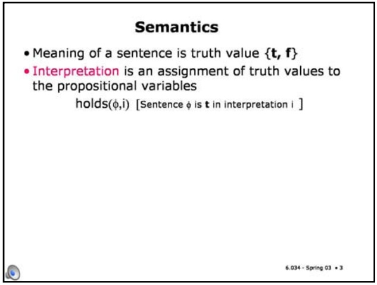

6.034 - Spring 03 • 3

Similarly, we'll use "fails" to say that a sentence is not true in an interpretation. And since the meaning of every sentence is a truth value and there are only two truth values, then if a sentence Phi is not true (does not have the truth value t) in an interpretation, then it has truth value f in that interpretation and we'll say it's false in that interpretation.

Slide 9.2.5

So now we can write down the rules of the semantics. We can write down rules that specify when sentence Phi is true in interpretation i. We are going to specify the semantics of sentences recursively, based on their syntax. The definition of a semantics should look familiar to most of you, since it's very much like the specification of an evaluator for a functional programming language, such as Scheme.

## Semantic Rules

## Semantic Rules

• holds(true, i) for all i

## Slide 9.2.6

First, the sentence consisting of the symbol "true" is true in all interpretations.

<!-- page: 7 -->

## Slide 9.2.9

When is Phi "wedge" Psi true in an interpretation i? Whenever both Phi and Psi are true in i. This is called "conjunction". And we'll start calling that symbol "and" instead of "wedge", now that we know what it means.

• fails(false, i) for all i

• holds(true, i) for all i

• holds(→φ, i) if and only if fails(φ, i) (negation) (negation)

## Semantic Rules

(conjunction)

• holds(φ ∧ ψ, i) iff holds(φ, i) and holds(ψ,i)

## Semantic Rules

• holds(φ ∨ Ψ, i) iff holds(φ, i) or holds(Ψ,i)

(disjunction)

• holds(true, i) for all i

• fails(false, i) for all i

• holds(→φ, i) if and only if fails(φ, i)

(negation)

• holds(φ ∧ ψ, i) iff holds(φ, i) and holds(ψ,i)

(conjunction)

## Slide 9.2.10

<!-- page: 8 -->

6.034 Artificial Intelligence. Copyright © 2004 by Massachusetts Institute of Technology.

## Slide 9.2.11

Now we have one more clause in our definition. I'm going to do it by example. Imagine that we have a sentence P. P is one of our propositional variables. How do we know whether it is true in interpretation i? Well, since i is a mapping from variables to truth values, I can simply look P up in i and return whatever truth value was assigned to P by i.

## Semantic Rules

• holds(true, i) for all i

• fails(false, i) for all i • holds(¬φ, i) if and only if fails(φ, i) (negation)

• holds(φ ∧ ψ, i)iff holds(φ, i) and holds(ψ,i)

• holds(φ ∨ Ψ, i) iff holds(φ, i) or holds(Ψ,i) (disjunction)

• holds(P, i) iff i(P) = t

• fails(P, i) iff i(P) = f

6.034 - Spring 03 • 11

## Some important shorthand

## Slide 9.2.12

It seems like we left out the arrows in the semantic definitions of the previous slide. But the arrows are not strictly necessary; that is, it's going to turn out that you can say anything you want to without them, but they're a convenient shorthand. (In fact, you can also do without either "or" or "and", but we'll see that later).

## Slide 9.2.13

So, we can define Phi "arrow" Psi as being equivalent to not Phi or Psi. That is, no matter what Phi and Psi are, and in every interpretation, (Phi "arrow" Psi) will have the same truth value as (not Phi or Psi). We will now call this arrow relationship "implication". We'll say that Phi implies Psi. We may also call this a conditional expression: Psi is true if Phi is true. In such a statement, Phi is referred to as the antecedent and Psi as the consequent.

## Some important shorthand

• φ → ψ ≡ ¬ φ ∨ ψ (conditional, implication) antecedent → consequent

## Slide 9.2.14

• φ ↔ ψ ≡ (φ → ψ) ∧ (ψ → φ) (biconditional, equivalence)

## Some important shorthand

• φ → ψ ≡ ¬ φ ∨ ψ (conditional, implication) antecedent → consequent

<!-- page: 9 -->

Slide 9.2.17

Now we'll define some terminology on this slide and the next, then do a lot of examples.

## Terminology

• A sentence is valid iff its truth value is t in all interpretations

Valid sentences: true, ¬ false, P V ¬ P

## Terminology

## Slide 9.2.18

A sentence is **valid** if and only if it is true in all interpretations. We have already seen one example of a valid sentence. What was it? True. Another one is "not false". A more interesting one is "P or not P". No matter what truth value is assigned to P by the interpretation, "P or not P" is true.

<!-- page: 10 -->

## Terminology

• A sentence is valid iff its truth value is t in all interpretations Valid sentences: true, ¬ false, P V ¬ P

• A sentence is satisfiable iff its truth value is t in at least one interpretation Satisfiable sentences: P, true, ¬ P

## Slide 9.2.20

• A sentence is unsatisfiable iff its truth value is f in all interpretations

Unsatisfiable sentences: P ∧ ¬ P, false, ¬ true

A sentence is unsatisfiable if and only if it's false in every interpretation. Some unsatisfiable sentences are: false, not true, P and not P.

## Slide 9.2.21

6.034 - Spring 03  20

We can use the method of truth tables to check these things. If I wanted to know whether a particular sentence was valid, or if I wanted to know if it was satisfiable or unsatisfiable, I could just make a truth table. I'd write down all the interpretations, figure out the value of the sentence in each interpretation, and if they're all true, it's valid. If they're all false, it's unsatisfiable. If it's somewhere in between, it's satisfiable. So there's a reliable way; there's a completely dopey, tedious, mechanical way to figure out if a sentence is has one of these properties. That's not true in all logics. This is a useful, special property of propositional logic. It might take you a lot of time, but it's a finite amount of time and you can decide any of these questions.

## Terminology

• A sentence is valid iff its truth value is t in all interpretations Valid sentences: true, ¬ false, P V ¬ P

• A sentence is satisfiable iff its truth value is t in at least one interpretation Satisfiable sentences: P, true, ¬ P

• A sentence is unsatisfiable iff its truth value is f in all interpretations Unsatisfiable sentences: P ∧ ¬ P, false, ¬ true

All are finitely decidable.

## Examples

## Slide 9.2.22

<!-- page: 11 -->

## Slide 9.2.23

What about "smoke implies smoke"? Rather than doing a whole truth table it might be easier if we can convert it into smoke or not smoke, right? The definition of A implies B is not A or B. And we said that smoke or not smoke was valid already.

Slide 9.2.26

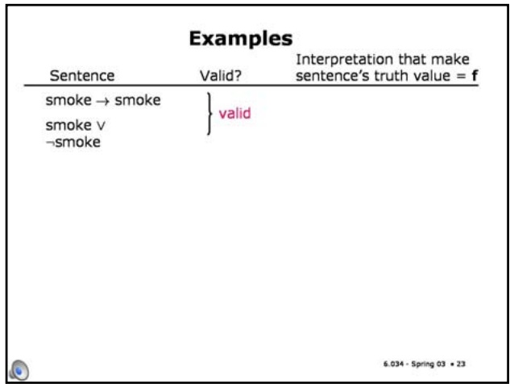

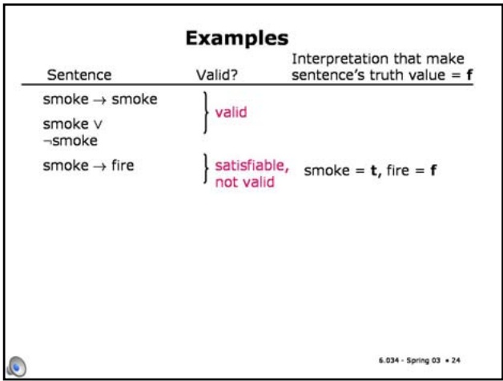

Slide 9.2.24

What about "smoke implies fire"? It's satisfiable, because there's an interpretation of these two symbols that makes it true. There are other interpretations that make it false. I should say, everything that's valid is also satisfiable.

Slide 9.2.25

Here is a form of reasoning that you hear people do a lot, but the question is, is it okay? "Smoke implies fire implies not smoke implies not fire." It's invalid. We could show that by drawing out the truth table (and you should do it as an exercise if the answer is not obvious to you). Another way to show that a sentence is not valid is to give an interpretation that makes the sentence have the truth value f. In this case, if we give "smoke" the truth value f and and "fire" the truth value t, then the whole sentence has truth value f.

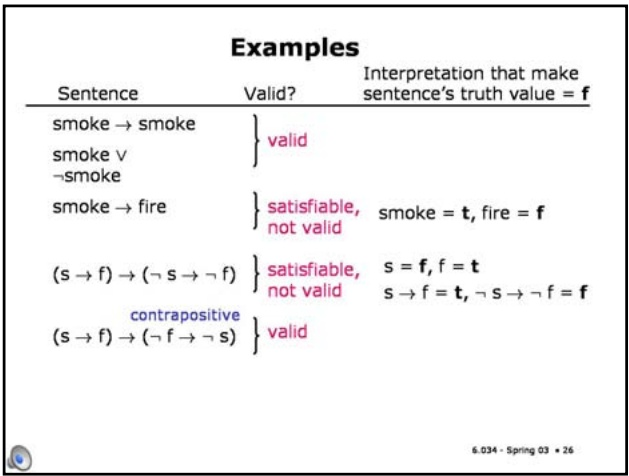

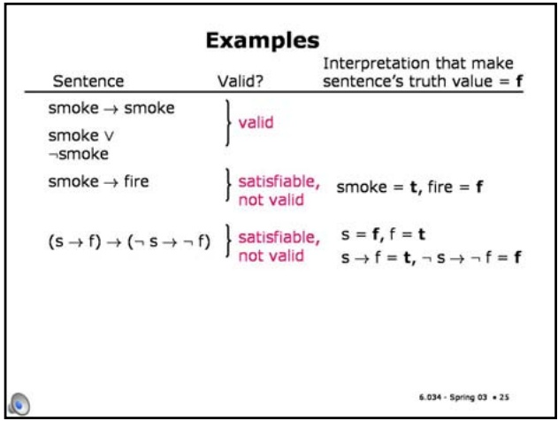

Reasoning in the other direction is okay, though. So the sentence "smoke implies fire implies not fire implies not smoke" is valid. And for those of you who love terminology, this thing is called the contrapositive. So, if there's no fire, then there's no smoke.

<!-- page: 12 -->

$$
\text { smoke } \rightarrow \text { fire }
$$

$$
(s \to f) \to (\neg s \to \neg f)
$$

$$
\text { not   valid } \quad \mathbf {s} \rightarrow \mathbf {f} = \mathbf {t}, \neg \mathbf {s} \rightarrow \neg \mathbf {f} = \mathbf {f}
$$

$$
(\mathsf {s} \to \mathsf {f}) \to (\neg \mathsf {f} \to \neg \mathsf {s})
$$

$$
b \lor d \lor (b \rightarrow d)
$$

$$
\text {b v d v} \neg \text {b v d}
$$

Slide 9.2.29

We could try to solve these problems using the brute-force method of enumerating all possible interpretations, then looking for one that makes the sentence true.

## Satisfiability

## Slide 9.2.30

• Related to constraint satisfaction

• Given a sentence S, try to find an interpretation i such that holds(S,i)

• Analogous to finding an assignment of values to variables such that the constraints hold

• Brute force method: enumerate all interpretations and check

• Better methods:

• heuristic search

• constraint propagation

• stochastic search

## Satisfiability

• Related to constraint satisfaction

• Given a sentence S, try to find an interpretation i such that holds(S,i)

• Analogous to finding an assignment of values to variables such that the constraints hold

• Brute force method: enumerate all interpretations and check

<!-- page: 13 -->

## Slide 9.2.31

There are lots of satisfiability problems in the real world. They end up being expressed essentially as lists of boolean logic expressions, where you're trying to find some assignment of values to variables that makes the sentence true.

## Satisfiability problems

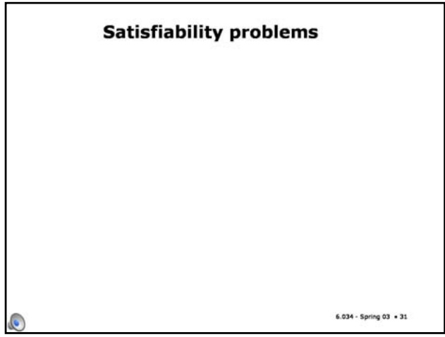

## Satisfiability problems

• Scheduling nurses to work in a hospital

• propositional variables represent, for example, that Pat is working on Tuesday at 2

• constraints on the schedule are represented using logical expressions over the variables

## Slide 9.2.32

One example is scheduling nurses to work shifts in a hospital. Different people have different constraints, some don't want to work at night, no individual can work more than this many hours out of that many hours, these two people don't want to be on the same shift, you have to have at least this many per shift and so on. So you can often describe a setting like that as a bunch of constraints on a set of variables.

## Slide 9.2.33

There's an interesting application of satisfiability that's going on here at MIT in the Lab for Computer Science. Professor Daniel Jackson's interested in trying to find bugs in programs. That's a good thing to do, but (as you know!) it's hard for humans to do reliably, so he wants to get the computer to do it automatically.

One way to do it is to essentially make a small example instance of a program. So an example of a kind of program that he might want to try to find a bug in would be an air traffic controller. The air traffic controller has rules that specify how it works. So you could write down the logical specification of how the air traffic control protocol works, and then you could write down another sentence that says, "and there are two airplanes on the same runway at the same time." And then you could see if there is a satisfying assignment; whether there is a configuration of airplanes and things that actually satisfies the specifications of the air traffic control protocol and also has two airplanes on the same runway at the same time. And if you can find one -- if that whole sentence is satisfiable, then you have a problem in your air traffic control protocol.

## Satisfiability problems

• Scheduling nurses to work in a hospital

• propositional variables represent, for example, that Pat is working on Tuesday at 2

• constraints on the schedule are represented using logical expressions over the variables

• Finding bugs in software

• propositional variables represent state of the program

• use logic to describe how the program works and to assert there is a bug

• if the sentence is satisfiable, you've found a bug!

<!-- page: 14 -->

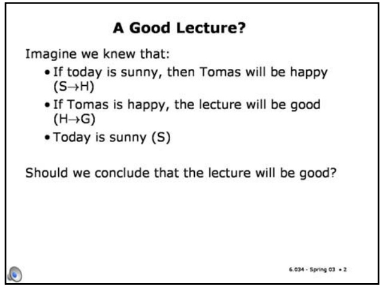

## Slide 9.3.1

One reason for writing down logical descriptions of situations is that they will allow us to draw conclusions about other aspects of the situation we've described.

## A Good Lecture?

Imagine we knew that:

• If today is sunny, then Tomas will be happy (S→H)

• If Tomas is happy, the lecture will be good (H→G)

• Today is sunny (S)

Should we conclude that the lecture will be good?

## A Good Lecture?

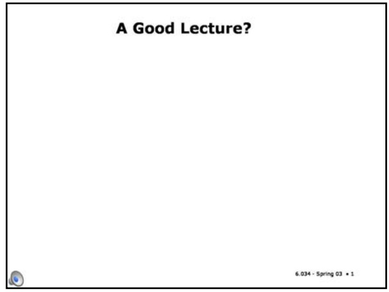

## Slide 9.3.2

Imagine that we knew the following things to be true: If today is sunny, Tomas will be happy; if Tomas is happy, the lecture will be good; and today is sunny.

Does this mean that the lecture will be good?

Slide 9.3.3

One way to think about this is to start by figuring out what set of interpretations make our original sentences true. Then, if G is true in all those interpretations, it must be okay to conclude it from the sentences we started out with (sometimes called our knowledge base).

## Checking Interpretations

## Checking Interpretations

| S | H | G |
| --- | --- | --- |
| t | t | t |
| t | t | f |
| t | f | t |
| t | f | f |
| f | t | t |
| f | t | f |
| f | f | t |
| f | f | f |

## Slide 9.3.4

In a universe with only three variables, there are 8 possible interpretations in total.

<!-- page: 15 -->

## Slide 9.3.7

If we added another variable to our domain, say whether Leslie is happy (L), then we'd have two interpretations that satisfy the KB: S = true, H = true, G = true, L = true; and S = true, H = true, G = true, L = false.

G is true in both of these interpretations, so, again, if the KB is true, then G must also be true.

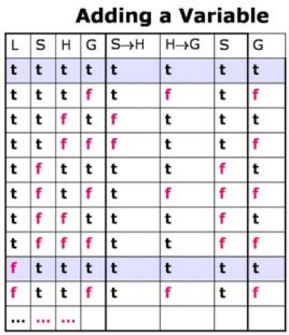

## Entailment

A knowledge base (KB) entails a sentence S iff every interpretation that makes KB true also makes S true

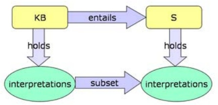

## Slide 9.3.8

<!-- page: 16 -->

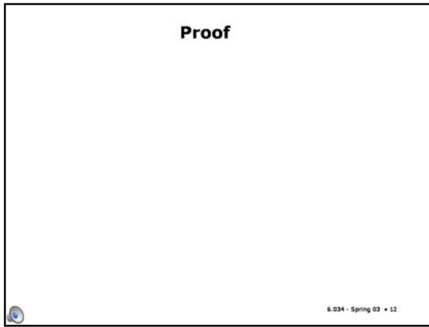

## Slide 9.3.9

The method of enumerating all the interpretations that satisfy the KB, and then checking to see if the conclusion is true in all of them is a correct way to test entailment.

## Computing Entailment

• enumerate all interpretations

• select those in which all elements of KB are true

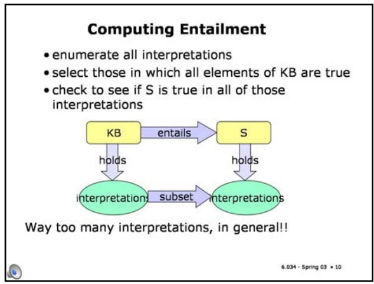

## Slide 9.3.10

• check to see if S is true in all of those interpretations

## Slide 9.3.11

So what we'd really like is a way to figure out whether a KB entails a conclusion without enumerating all of the possible interpretations.

## Computing Entailment

But now, what if we were to add 6 more propositional variables to our domain? Then we'd have 2^10 = 1024 interpretations to check, which is way too much work to do (and, in the first order case, we'll find that we might have infinitely many intepretations, which is definitely too much work to enumerate!!).

## Proof

A proof is a way to test whether a KB entails a sentence, without enumerating all possible interpretations. You can think of it as a kind of shortcut arrow that works directly with the syntactic representations of the KB and the conclusion, without going into the semantic world of interpretations.

• select those in which all elements of KB are true

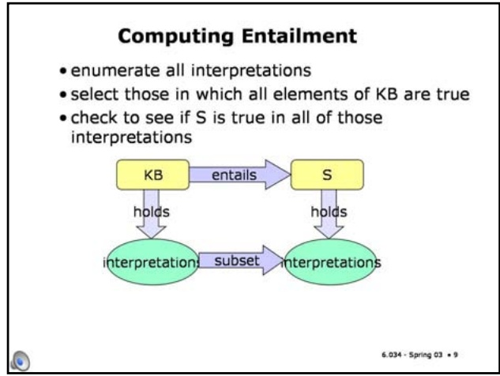

## Entailment and Proof

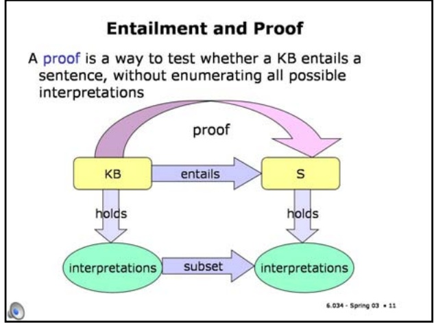

## Slide 9.3.12

So what is a proof system? Well, presumably all of you have studied high-school geometry; that's often people's only exposure to formal proof. Remember that? You knew some things about the sides and angles of two triangles and then you applied the side-angle-side theorem to conclude -- at least people in American high schools were familiar with side-angle-side -- The side-angle-side theorem allowed you to conclude that the two triangles were similar, right?

That is formal proof. You've got some set of rules that you can apply. You've got some things written down on your page, and you grind through, applying the rules that you have to the things that are written down, to write some more stuff down until finally you've written down the things that you wanted to, and then you get to declare victory. That's a proof. There are (at least) two styles of proof system; we're going to talk about one briefly here and then go on to the other one at some length in the next two sections.

Natural deduction refers to a set of proof systems that are very similar to the kind of system you used in high-school geometry. We'll talk a little bit about natural deduction just to give you a flavor of how it goes in propositional logic, but it's going to turn out that it's not very good as a general strategy for computers. It's a proof system that humans like, and then we'll talk about a proof system that computers like, to the extent that computers can like anything.

<!-- page: 17 -->

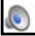

## Slide 9.3.15

Then, you can write down on a new line of your proof the results of applying an inference rule to the previous lines.

## Proof

• Proof is a sequence of sentences

• First ones are premises (KB)

• Then, you can write down on the next line the result of appíying an inference rule to previous lines

## Proof

• Proof is a sequence of sentences

• First ones are premises (KB)

• Then, you can write down on the next line the result of appíying an inference rule to previous lines

• When S is on a line, you have proved S from KB

## Slide 9.3.16

Then, when a sentence S is on some line, you have proved S from KB.

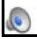

<!-- page: 18 -->

Slide 9.3.19

So let's look at inference rules, and learn how they work by example. We'll look at natural-deduction rules first, because they're easiest to understand.

## Natural Deduction

Some inference rules:

## Natural Deduction

Some inference rules:

Modus ponens

## Slide 9.3.20

Here's a famous one (first written down by Aristotle); it has the great Latin name, "modus ponens", which means "affirming method".

It says that if you have "Alpha implies Beta" written down somewhere on your page, and you have Alpha written down somewhere on your page, then you can write beta down on a new line. (Alpha and Beta here are metavariables, like Phi and Psi, ranging over whole complicated sentences). It's important to remember that inference rules are just about ink on paper, or bits on your computer screen. They're not about anything in the world. Proof is just about writing stuff on a page, just syntax. But if you're careful in your proof rules and they're all sound, then at the end when you have some bit of syntax written down on your page, you can go back via the interpretation to some semantics. So you start out by writing down some facts about the world formally as your knowledge base. You do stuff with ink and paper for a while and now you have some other symbols written down on your page. You can go look them up in the world and say, "Oh, I see. That's what they mean."

<!-- page: 19 -->

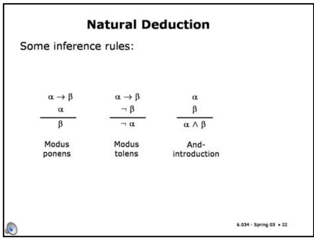

Slide 9.3.23

Conversely, and-elimination says that from "Alpha and Beta" you can conclude "Alpha".

## Natural deduction example

Prove S

Slide 9.3.24

| Step | Formula | Derivation |
| --- | --- | --- |
|  |  |  |
|  |  |  |
|  |  |  |
|  |  |  |
|  |  |  |
|  |  |  |
|  |  |  |

## Natural Deduction

Some inference rules:

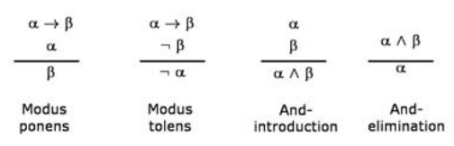

<!-- page: 20 -->

We'll start with 3 sentences in our knowledge base, and we'll write them on the first three lines of our proof: (P and Q), (P implies R), and (Q and R imply S).

Natural deduction example Prove S

Natural deduction example

Prove S

| Step | Formula | Derivation |
| --- | --- | --- |
| 1 | P ∧ Q | Given |
| 2 | P → R | Given |
| 3 | (Q ∧ R) → S | Given |
| 4 | P | 1 And-Elim |
|  |  |  |
|  |  |  |
|  |  |  |
|  |  |  |

6.034 - Spring 03 • 26

Slide 9.3.26

From line 1, using the and-elimination rule, we can conclude P, and write it down on line 4 (together with a reminder of how we derived it).

Slide 9.3.27

From lines 4 and 2, using modus ponens, we can conclude R.

| Step | Formula | Derivation |
| --- | --- | --- |
| 1 | P ∧ Q | Given |
| 2 | P → R | Given |
| 3 | (Q ∧ R) → S | Given |
| 4 | P | 1 And-Elim |
| 5 | R | 4,2 Modus Ponens |
| 6 | Q | 1 And-Elim |
|  |  |  |
|  |  |  |

## Natural deduction example

| Step | Formula | Derivation |
| --- | --- | --- |
| 1 | P ∧ Q | Given |
| 2 | P → R | Given |
| 3 | (Q ∧ R) → S | Given |
|  |  |  |
|  |  |  |
|  |  |  |
|  |  |  |
|  |  |  |

6.034 - Spring 03  25

Prove S

Natural deduction example

Prove S

| Step | Formula | Derivation |
| --- | --- | --- |
| 1 | P ∧ Q | Given |
| 2 | P → R | Given |
| 3 | (Q ∧ R) → S | Given |
| 4 | P | 1 And-Elim |
| 5 | R | 4,2 Modus Ponens |
|  |  |  |
|  |  |  |
|  |  |  |

6.034 - Spring 03 • 27

Slide 9.3.28

<!-- page: 21 -->

Slide 9.3.31

The process of formal proof seems pretty mechanical. So why can't computers do it?

They can. For natural deduction systems, there are a lot of "proof checkers", in which you tell the system what conclusion it should try to draw from what premises. They're always sound, but nowhere near complete. You typically have to ask them to do the proof in baby steps, if you're trying to prove anything at all interesting.

## Proof systems

• There are many natural deduction systems; they are typically "proof checkers", sound but not complete

## Proof systems

• There are many natural deduction systems; they are typically "proof checkers", sound but not complete

• Natural deduction uses lots of inference rules which introduces a large branching factor in the search for a proof.

## Slide 9.3.32

<!-- page: 22 -->

$$
\boxed {1} \quad P \lor Q
$$

$$
\left| 2 \right| Q \rightarrow R
$$

$$
\left| 3 \right| P \rightarrow R
$$

$$
\alpha \lor \beta
$$

$$
\neg \beta \lor \gamma
$$

$$
\alpha \lor \gamma
$$

## 6.034 Notes: Section 9.4

## Slide 9.4.1

Now we're going to start talking about first-order logic, which extends propositional logic so that we can talk about things.

## First-Order Logic

<!-- page: 23 -->

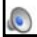

6.034 Artificial Intelligence. Copyright © 2004 by Massachusetts Institute of Technology.

## Slide 9.4.2

## First-Order Logic

• Propositional logic only deals with "facts", statements that may or may not be true of the world, e.g., "It is raining". But, one cannot have variables that stand for books or tables.

In propositional logic, all we had were variables that stood, not for things in the world or even quantities, but just facts, Boolean statements that might or might not be true about the world, like whether it's raining, or greater than 67 degrees; but you couldn't have variables that stood for tables or books, or the temperature, or anything like that. And as it turns out, that's an enormously limiting kind of representation.

## Slide 9.4.3

In first-order logic, variables refer to things in the world and you can quantify over them. That is, you can talk about all or some of them without having to name them explicitly.

## First-Order Logic

• Propositional logic only deals with "facts", statements that may or may not be true of the world, e.g., "It is raining". But, one cannot have variables that stand for books or tables.

• In first-order logic, variables refer to things in the world and, furthermore, you can quantify over them: talk about all of them or some of them without having to name them explicitly.

## FOL motivation

• Statements that cannot be made in propositional logic but can be made in FOL

## Slide 9.4.4

There are lots of examples that show how propositional logic is inadequate to characterize even moderately complex domains. Here are some more examples of the kinds of things that you can say in first-order logic, but not in propositional logic.

## Slide 9.4.5

"When you paint the block, it becomes green." You might have a proposition for every single aspect of the situation, like "if this block is black and I paint it, it becomes green" and "if that block is red and I paint it, it becomes green" and "if block #5 is green and I paint it, it becomes green". But you'd have to have one of those propositions for every single initial block color, or every single block, or every single object (if you have non-blocks, too) in the world. You couldn't say that, as a general fact, "after you paint something if becomes green."

## FOL motivation

Statements that cannot be made in propositional logic but can be made in FOL

• When youpaint a block with green paint, it becomes green.

\- In propositional logic, one would need a statement about every single block, one cannot make the general statement about all blocks.

<!-- page: 24 -->

## FOL syntax

## Slide 9.4.8

First-order logic lets us talk about things in the world. It's a logic like propositional logic, but somewhat richer and more complex. We'll go through the material in the same way that we did propositional logic: we'll start with syntax and semantics, and then do some practice with writing down statements in first-order logic.

## Slide 9.4.9

The big difference between propositional logic and first-order logic is that we can talk about things, and so there's a new kind of syntactic element called a term. And the term, as we'll see when we do the semantics, is a name for a thing. It's an expression that somehow names a thing in the world. There are three kinds of terms:

## FOL syntax

<!-- page: 25 -->

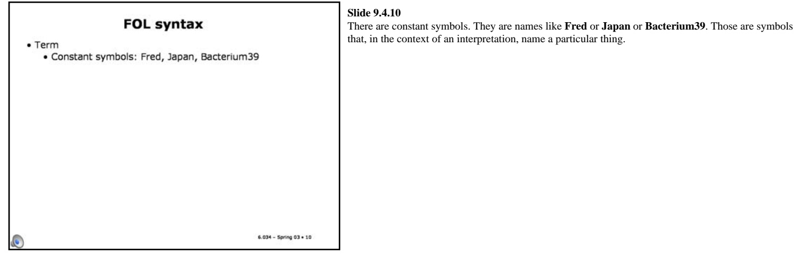

6.034 Artificial Intelligence. Copyright © 2004 by Massachusetts Institute of Technology.

## FOL syntax

Term • Constant symbols: Fred, Japan, Bacterium39

## Slide 9.4.10

## Slide 9.4.11

There are constant symbols. They are names like **Fred** or **Japan** or **Bacterium39**. Those are symbols that, in the context of an interpretation, name a particular thing.

Then there are variables, which are not really syntactically differentiated from constant symbols. We'll use capital letters to start constant symbols (think of them as proper names), and lower-case letters for term variables. (It's important to note, though, that this convention is not standard, and in some logic contexts, such as the programming language Prolog, they adopt the exact opposite convention).

## FOL syntax

• Term Term

• Constant symbols: Fred, Japan, Bacterium39 • Variables: x, y, a

## FOL syntax

• Term

• Constant symbols: Fred, Japan, Bacterium39

• Variables: x, y, a

• Function symbol applied to one or more terms: f(x), f(f(x)), mother-of(John)

## Slide 9.4.12

The last kind of term is a function symbol, applied to one or more terms. We'll use lower-case for function symbols as well. So another way to make a name for something is to say something like **f(x)**. If f is a function, you can give it a term and then **f(x)** names something. So, you might have **mother-of (John)** or **f(f(x))**. Note that a function with no terms would be a constant.

These three kinds of terms are our ways to name things in the world.

## Slide 9.4.13

• Term

## FOL syntax

• Constant symbols: Fred, Japan, Bacterium39

• Variables: x, y, a

• Function symbol applied to one or more terms: f(x), f(f(x)), mother-of(John)

• Sentence

• A predicate symbol applied to zero or more terms: On(a,b), Sister(Jane, Joan), Sister(mother-of(John), Jane)

<!-- page: 26 -->

## FOL syntax

## • Term

• Constant symbols: Fred, Japan, Bacterium39

• Variables: x, y, a

• Function symbol applied to one or more terms: f(x), f(f(x)), mother-of(John)

## • Sentence

• A predicate symbol applied to zero or more terms: Jor appi

On(a,b), Sister(Jane, Joan), Sister(mother-of(John), Jane)

•t1=t2

• If v is a variable and Φ is a sentence, then W.Φ and ∃v.Φ are sentences.

• Closure under sentential operators: ^ v ¬→ ↔ ()

## Slide 9.4.16

Finally we have closure under the sentential operators that we had before, so you can make complex sentences out of other sentences using and, or, not, implies, equivalence (also called biconditional), and parentheses, just as before in propositional logic. All that basic connective structure is still the same, but the things that we can say on either side have gotten a little bit more complicated.

All right, that's our syntax. That's what we get to write down on our page.
