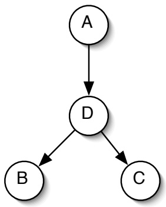

<!-- page: 1 -->

# 6.825 Homework 3

## Not to be handed in

## 1 Easy EM

You are given the network structure shown in Figure 1 and the data in the following table, with actual observed values for A, B, and C, and expected counts for D.

| A | B | C | Pr(D\|A,B,C) |
| --- | --- | --- | --- |
| 1 | 1 | 1 | .6 |
| 0 | 0 | 0 | .3 |
| 0 | 0 | 1 | .7 |
| 0 | 1 | 1 | .9 |
| 1 | 1 | 1 | .6 |
| 0 | 0 | 0 | .3 |
| 1 | 0 | 1 | .5 |
| 1 | 1 | 0 | .4 |
| 0 | 1 | 1 | .9 |
| 0 | 0 | 1 | .7 |
| 0 | 0 | 1 | .7 |
| 0 | 1 | 0 | .1 |
| 0 | 1 | 1 | .9 |
| 0 | 1 | 1 | .9 |
| 1 | 0 | 0 | .2 |
| 1 | 0 | 1 | .5 |
| 1 | 1 | 1 | .6 |

Figure 1: Network Structure

<!-- page: 2 -->

Figure 2: Network Structure

1. What are the maximum likelihood estimates for Pr(A), Pr(D|A), Pr(B|D), and $\mathrm { P r ( C | D ) ? }$

2. What’s another way to represent this data in a table with only 8 entries?

## 2 Harder EM

Consider the Bayesian network structure shown in Figure 2.

1. Write down an expression for $\operatorname* { P r } ( \mathtt { a } , \mathtt { b } , \mathtt { c } , \mathtt { d } , \mathtt { e } , \mathtt { f } , \mathtt { g } )$ using only conditional probabilities that would be stored in that network structure.

2. We’d like to use variable elimination to compute $\operatorname* { P r } ( \mathsf { d } | \mathsf { b } )$ . Which variables are irrelevant?

3. Using elimination order A, B, C, D, E, F, G, what factors get created?

4. Assume variables F and C are hidden. You have a data set consisting of vectors of values of the other variables: $\langle \mathsf { a } , \mathsf { b } , \mathsf { d } , e , \mathsf { g } \rangle$ . You start with an initial set of parameters, $\theta _ { 0 } ,$ that contains CPTs for the whole network. You decide to estimate $\operatorname* { P r } ( \mathsf { f } | \mathsf { a } , \mathsf { b } , \mathsf { d } , e , \mathsf { g } )$ and $\operatorname* { P r } ( \mathsf { c } | \mathsf { a } , \mathsf { b } , \mathsf { d } , e , \mathfrak { g } )$ separately, for each row of the table, as shown.

| A B D E G | Pr(F\|a,b,d,e,g) | Pr(C\|a,b,d,e,g) |
| --- | --- | --- |
| 0 1 0 1 10 0 0 1 10 0 0 0 10 1 0 1 10 0 0 0 1... |  |  |

Is this justified? Why or why not?

5. Now you think of another shortcut: You decide to estimate $\operatorname* { P r } ( \mathsf { G } | \mathsf { d } , e )$ directly from the data and leave G out of the EM computations all together. Is this justified?

<!-- page: 3 -->

## 3 Markov Chain

Consider a 3-state Markov chain, where $\mathbb{R}(s_1) = 1, \mathbb{R}(s_2) = 3$ , and $\mathsf { R } ( \mathsf { s } _ { 3 } ) = - 1$ . The transition probabilities are given by the table below, where the entry in row i, column j, is the probability of making a transition from $s _ { \mathrm { i } }$ to sj.

|  | s1 | s2 | s3 |
| --- | --- | --- | --- |
| s1 | 0.8 | 0.1 | 0.1 |
| s2 | 0.2 | 0.1 | 0.7 |
| s3 | 0.9 | 0.1 | 0.0 |

1. Compute the values of each state, assuming a discount factor of $\gamma = 0 . 9$

2. Compute the values with a discount factor of $\gamma = 0 . 1$

## 4 Markov Decision Process

Now, consider a Markov decision process with the same states and rewards as in the previous problem. It has two actions. The first action is described by the transition matrix given above. The second action is described by the following transition matrix:

|  | s1 | s2 | s3 |
| --- | --- | --- | --- |
| s1 | 0.1 | 0.1 | 0.8 |
| s2 | 0.7 | 0.1 | 0.2 |
| s3 | 0.9 | 0.0 | 0.1 |

Starting with a value function that is 0 for all states, perform value iteration for 10 iterations for $\gamma = 0 . 9$ . Do it again for $\gamma = 0 . 1$ . Can you see it converging faster in one case? If so, why? Can you see what the optimal policy is? How could you compute the values of the states under the optimal policy?

## 5 At the Races, again

You go to the horse races, hoping to win some money. Your options are to:

• Bet \$2 on Moon. You think that he’ll win with probability 0.7. If he wins, you’ll get back \$4. If he loses, you’ll get back nothing.

• Bet \$2 on Jeb. You think that he’ll win with probability 0.2. If he wins, you’ll get back \$22. If he loses, you’ll get back nothing.

• Bet \$1 on Moon and \$1 on Jeb. With probability 0.7, Moon will win and you’ll get back \$2. With probability 0.2, Jeb will win, and you’ll get back \$11. If they both lose, you’ll get back nothing.

1. What’s the expected value of each bet? What action would a risk-neutral bettor choose?

<!-- page: 4 -->

2. Now, consider a risk-averse bettor, whose utility function for money is

$$
U (x) = \sqrt {x + 2 0}.
$$

What are the expected utilities of each bet? What action would that person choose?

3. How do the outcomes of the previous parts relate to investment strategy?
