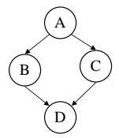
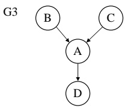
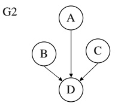
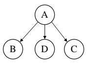
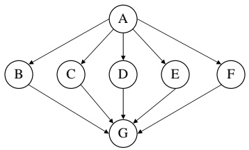
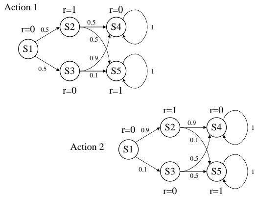

<!-- page: 1 -->

There are 130 points total. Points for individual problems are indicated in bold.

## 1 Search

(10) You’re a taxi driver. Your taxi can hold 4 passengers. Passengers pay a flat fee for a ride to the airport, so goal is to pick up 4 passengers and take them to the airport in the smallest number of miles. Your world can be modeled as a graph of locations with distances between them. Some, but not all, of the locations have passengers that you can pick up.

a. Describe the state space of this search problem.

b. What would be a good cost function for this search problem?

c. Now, consider a case where passengers have to pay according to how far away they are from the airport when they’re picked up (note: they don’t pay according to how long a ride they take in your taxi, but according to the length of the shortest path from their pickup-point to the airport).

Describe the state space of this search problem.

d. What would be a good cost function for this version of the problem? You still have a desire to save gas.

e. Is uniform cost search guaranteed to find the optimal solution in either or both versions of the problem? Why or why not?

## 2 FOL Semantics

(6) Consider a world with objects A, B, and C. We’ll look at a logical languge with constant symbols X, Y , and Z, function symbols f and g, and predicate symbols $p ,   q ,$ and r. Consider the following interpretation:

$$
\bullet I (X) = \mathbf {A}, I (Y) = \mathbf {A}, I (Z) = \mathbf {B}
$$

$$
\bullet I (f) = \{\langle \mathbf {A}, \mathbf {B} \rangle , \langle \mathbf {B}, \mathbf {C} \rangle , \langle \mathbf {C}, \mathbf {C} \rangle \}
$$

$$
\bullet I (p) = \{\mathbf {A}, \mathbf {B} \}
$$

<!-- page: 2 -->

$I ( q ) = \{ \mathbf { C } \}$

• I(r) = {hB, Ai, hC, Bi, hC, Ci}

For each of the following sentences, say whether it is true or false in the given interpretation I:

a. $q ( f ( Z ) )$

b. $r ( X , Y )$

c. $\exists w . f ( w ) = Y$

d. $\forall w . r ( f ( w ) , w )$

e. $\forall u , v . r ( u , v ) \to ( \forall w . r ( u , w ) \to v = w )$

f. $\forall u , v . r ( u , v ) \to ( \forall w . r ( w , v ) \to u = w )$

## 3 Interpretations

(6) Using the same set of symbols as in the previous problem, for each group of sentences below, provide an interpretation that makes the sentences true, or show that it’s impossible.

a. $\exists w . p ( w ) \land \exists w . q ( w )$

$\neg \exists w . p ( w ) \land q ( w )$

$\forall u . p ( u ) \rightarrow \exists v . r ( u , v )$

b. $\forall u . \exists v . r ( u , v )$

$\exists u , v . \neg r ( u , v )$

$\forall v . ( \exists u . r ( u , v ) ) \leftrightarrow p ( v ) )$

c. $\forall u , v . ( p ( v ) \to r ( u , v ) )$

$\exists u , v . \neg r ( u , v )$

$\exists v . p ( v )$

## 4 Unification

(6) For each pair of literals below, specify a most general unifier, or indicate that they are not unifiable.

a. $r ( f ( x ) , y )$ and $r ( z , g ( w ) )$

b. $r(f(x),x)$ and $r ( y , g ( y ) )$

c. $r(a,C,a)$ and $r(f(x),x,y)$

<!-- page: 3 -->

## 5 Clausal form

(6) Convert each sentence below to clausal form.

a. $\forall y . \exists x . r ( x , y ) \lor s ( x , y )$

b. $\forall y . ( \exists x . r ( x , y ) ) \rightarrow p ( y )$

c. $\forall y . \exists x . ( r ( x , y ) \rightarrow p ( x ) )$

## 6 Operator descriptions

(6) Consider a world with a push-button light switch. Pushing the button changes the state of the light from on to off, or from off to on.

a. Describe this domain in situation calculus.

b. Describe this domain using one or more strips operators.

## 7 GraphPlan

(13) Draw the graphplan graph for a depth-two plan given the following operator descriptions. Starting state is: not have-keys, not open, not painted. Goal state is: open, painted. Show all mutexes.

• Get Keys: (Pre: ) (Eff: have-keys)

• Open Door: (Pre: not open) (Eff: open)

• Paint Door: (Pre: not open) (Eff: painted)

## 8 Conditional Probability

(8) We would like to compute $\operatorname* { P r } ( a , b | c , d )$ but we only have available to us the following quantities: $\operatorname* { P r } ( a ) ,   \operatorname* { P r } ( b ) ,   \operatorname* { P r } ( c ) ,   \operatorname* { P r } ( a | d ) ,   \operatorname* { P r } ( b | d ) ,   \operatorname* { P r } ( c | d ) ,   \operatorname* { P r } ( d | a )$ , $\operatorname* { P r } ( a , b ) ,   \operatorname* { P r } ( c , d ) ,   \operatorname* { P r } ( a | c , d ) ,   \operatorname* { P r } ( b | c , d ) ,   \operatorname* { P r } ( c | a , b ) ,   \operatorname* { P r } ( d | a , b )$

For each of the assumptions below, give a set of terms that is sufficient to compute the desired probability, or “none” if it can’t be determined from the given quantities.

a. A and B are conditionally independent given C and D

b. C and D are conditionally independent given A and B

c. A and B are independent

d. A, B, and C are all conditionally independent given D

<!-- page: 4 -->

## Network Structures

G2

(12) Following is a list of conditional independence statements. For each statement, name all of the graph structures, G1 – G4, or “none” that imply it.

a. A is conditionally independent of B given C

b. A is conditionally independent of B given D

c. B is conditionally independent of D given A

d. B is conditionally independent of D given C

e. B is independent of C

f. B is conditionally independent of C given A

## 10 Counting Parameters

(4) How many independent parameters are required to specify a Bayesian network given each of the graph structures G1 – G4? Assume the nodes are binary.

## 11 Variable Elimination

(5)

<!-- page: 5 -->

a. In this network, what is the size of the biggest factor that gets generated if we do variable elimination with elimination order A,B,C,D,E, F, G?

b. Give an elimination order that has a smaller largest factor.

## 12 Parameter Estimation

(2)

a. Given the following data set, what is the maximum likelihood estimate for Pr(A|B)?

b. What result do you get with the Bayesian correction?

| A | B | C |
| --- | --- | --- |
| 0 | 1 | 0 |
| 0 | 0 | 0 |
| 1 | 1 | 0 |
| 1 | 1 | 1 |

## 13 Decision Theory

(13) You’re an olympic skier. In practice today, you fell down and hurt your ankle. Based on the results of an x-ray, the doctor thinks that it’s broken with probability 0.2. So, the question is, should you ski in the race tomorrow?

If you ski, you think you’ll win with probability 0.1. If your leg is broken and you ski on it, then you’ll damage it further. So, your utilities are as follows: if you win the race and your leg isn’t broken, +100; if you win and your leg is broken, +50; if you lose and your leg isn’t broken 0; if you lose and your leg is broken -50.

If you don’t ski, then if your leg is broken your utility is -10, and if it isn’t, it’s 0.

<!-- page: 6 -->

a. Draw the decision tree for this problem.

b. Evaluate the tree, indicating the best action choice and its expected utility.

You might be able to gather some more information about the state of your leg by having more tests. You might be able to gather more information about whether you’ll win the race by talking to your coach or the TV sports commentators.

c. Compute the expected value of perfect information about the state of your leg.

d. Compute the expected value of perfect information about whether you’ll win the race.

In the original statement of the problem, the probability that your leg is broken and the probability that you’ll win the race are independent. That’s a pretty unreasonable assumption.

f. Is it possible to use a decision tree in the case that the probability that you’ll win the race depends on whether your leg is broken?

## 14 Markov Decision Processes

(10) What are the values of the states in the following MDP, assuming $\gamma =$ 0.9? In order to keep the diagram for being too complicated, we’ve drawn the transition probabilities for action 1 in one figure and the transition probabilities for action 2 in another. The rewards for the states are the same in both cases.

## 15 Neural networks

(9) I have a collection of data, $d _ { i } ,$ each element of which is a number between 0 and 1. I want to fit a parameter p to the data by minimizing mean squared

<!-- page: 7 -->

error. $\mathrm { S o } ,$ the error for parameter $p$ is the sum, over all the data, of the squared difference between p and the data point:

$$
\mathrm{err} (p) = \sum_ {i} (p - d _ {i}) ^ {2}.
$$

Which, if any, of the following are gradient descent rules for updating p based on data?

a. $p \gets p + . 1 ( p - d _ { i } )$

b. $p \gets p - . 1 ( p - d _ { i } )$

c. $\textstyle p \leftarrow p + . 1 \sum _ { i } ( p - d _ { i } )$

d. $\textstyle p \leftarrow p - . 1 \sum _ { i } ( p - d _ { i } )$

e. $\textstyle p \leftarrow p + . 1 \sum _ { i } d _ { i }$

f. $\textstyle p \leftarrow p - . 1 \sum _ { i } d _ { i }$

g. $p \gets p + . 1 ( p - d _ { i } ) ^ { 2 }$

h. $p \gets p - . 1 ( p - d _ { i } ) ^ { 2 }$

i. $\textstyle p \leftarrow \sum _ { i } ( p - d _ { i } ) ^ { 2 }$

## 16 Misc. True or False

(14)

a. Walksat sometimes moves to a worse assignment.

b. $\mathrm { A } ^ { * }$ finds better solutions than uniform cost search.

c. If sentence $\phi$ entails sentence $\psi ,$ then $\phi$ is true in only a (possibly proper) subset of the interpretations in which $\psi$ is true.

d. If the premises are consistent, first-order resolution terminates without a contradiction.

e. If first-order resolution terminates without a contradiction, the premises are consistent.

f. The GraphPlan graph can have size exponential in the size of the domain description.

g. The GraphPlan algorithm runs in time exponential in the size of the domain description.

h. If A and B are independent, then A and B are conditionally independent given C.

<!-- page: 8 -->

i. The variable elimination algorithm runs in time polynomial in the size of the CPTs in the network.

j. The EM algorithm assigns hidden variables their optimal values.

k. Using the Bayesian correction in parameter estimation means that we no longer get the model that maximizes the likelihood of the data.

l. It is rational to buy insurance if you’re risk-seeking in the domain of losses.

m. The discounted model of optimality in MDPs is inappropriate for agents that have a known finite lifetime.

n. In reinforcement learning, the agent needs to know the reward function in advance.
