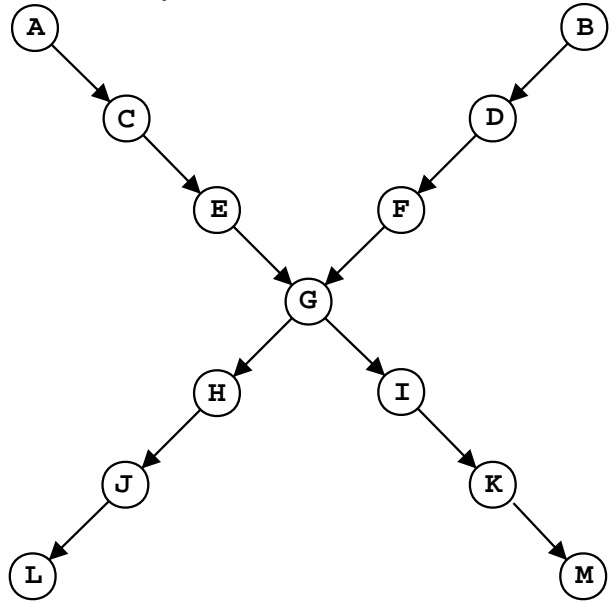

<!-- page: 1 -->

# 6.891 Final Examination

## 5/23/01

## 1 Gaussian Units

Consider a different kind of computing unit for a neural network. Rather than a sigmoid function, it will use a Gaussian. That is, given an input vector x (augmented with a 1 to add the threshold) and a weight vector w the output of the unit will be:

$$
o = g (x \cdot w)
$$

where

$$
g (z) = e ^ {- z ^ {2}}.
$$

1. Derive a gradient-descent training rule for a single Gaussian unit (remember that $\begin{array} { r } { \frac { d ( e ^ { f ( x ) } ) } { d x } = e ^ { f ( x ) } \frac { d ( f ( x ) ) } { d x } ) } \end{array}$

<!-- page: 2 -->

2. Assume that we assign any x for which the output of the unit is greater than or equal to $\frac { g ( 0 ) } { 2 }$ to class 1 and for which the output is less than $\frac { g ( 0 ) } { 2 }$ to class 2. What kind of separator do we get?

## 2 Network Structure

Show a Bayesian network structure that encodes the following relationships:

• A is independent of B

• A is dependent on B given C

• A is dependent on D

• A is independent of D given C.

<!-- page: 3 -->

## 3 At The Races

You go to the racetrack. You can:

• Decline to place any bets at all.

• Bet on Belle. It costs \$1 to place a bet; you will be paid \$2 if she wins (for a net profit of \$1).

• Bet on Jeb. It costs \$1 to place a bet; you will be paid \$11 if he wins (for a net profit of \$10).

You believe that Belle has probability 0.7 of winning and that Jeb has probability 0.1 of winning.

1. Your goal is to maximize the expected value of your actions. What, if any, bet should you place, and what is your expected value?

2. Someone comes and offers you gambler’s anti-insurance. If you agree to it,

• they play you \$2 up front

• you agree to pay 50% of any winnings.

How would it affect the expected value of each of your courses of action? What would be the best action to take now?

<!-- page: 4 -->

## 4 Still At The Races

A shady character comes to offer you a free tip (a tip is a piece of information): he says Belle did not eat her breakfast. Assume that:

• The probability that a horse will win is dependent on the horse’s health and its speed.

• A horse’s health and its speed are independent.

• A healthy horse has a higher probability of eating breakfast than does a sick horse.

• Your informant is known to be accurate 80% of the time.

Draw a Bayesian network with 5 variables (T = you got this tip; $\mathrm { ~ B ~ } { = }$ Belle ate her breakfast; H = Belle is healthy; W = Belle will win; F = Belle is fast). The relationships between the variables should reflect the problem description.

What is $P ( W )$ (in terms of values stored in the network’s conditional probability tables)?

<!-- page: 5 -->

What is $P ( W | T )$ (in terms of values stored in the network’s conditional probability tables)?

## 5 Logic

Write the following sentences in first-order logic, using $\mathrm { S } ( \mathbf { x } )$ for slow, $\mathrm { S ( x , } \mathrm { y ) }$ to mean that x is slower than $\mathrm { y ,   H ( x ) }$ for horse $\mathrm { B } ( \mathbf { x } )$ for brown, and $\mathrm { W ( x , } \mathrm { r ) }$ for horse x winning race r.

1. All brown horses are slow.

2. All slow horses are brown.

3. All slow things are brown horses.

4. Some slow horses are brown.

5. The slowest horse is brown.

6. There is a winner in every race.

<!-- page: 6 -->

## 6 Clausal Form

Given the following sentence in first-order logic, convert it to clausal form:

$$
\forall r. o (r) \rightarrow \exists x. w (x)
$$

## 7 Logic

$$
(\exists x. P (x)) \to P (b)
$$

$$
\exists x. (P (x)) \to P (b)\left. \right)
$$

In a domain with only three objects, named by constants $$\mathrm { a , ~ b , }$$ and $\mathrm { c } ,$ give values for $P(a) ,  P(b)$ , and $\mathrm { P ( c ) }$ that makes one of these sentences true and the other false.

<!-- page: 7 -->

## 8 Bayesian Network Structure

Consider a Bayesian network with the following structure:

Does computing P(M|A) depend on:

$P ( L | J ) ?$

$P ( K | I ) ?$

$P ( D | B ) ?$

$P ( H | G ) ?$

In the network above, if we decided not to include G in our network, but still wanted to model the joint distribution of all the other variables, what is the smallest network structure we could use?

<!-- page: 8 -->

## 9 True and False

1. It is sometimes worth paying for a test even if you will choose the same alternative no matter what the test results are.

2. A person for whom it is rational to play the lottery has a convex utility function.

3. If a dataset of dimension n is not linearly separable, it can be made linearly separable by adding extra features.

4. A network of perceptrons with step-function outputs induces a linear separator.

5. Inference in first-order logic is NP-complete.

6. A logical sentence is valid if it is true in some interpretation.

7. Iterative deepening search requires time exponential in the depth of the solution.

8. Iterative deepening search requires space exponential in the depth of the solution.
