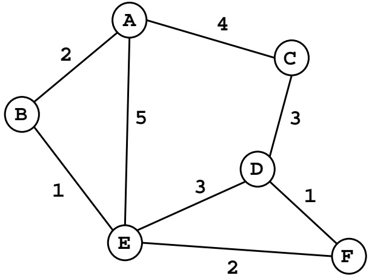
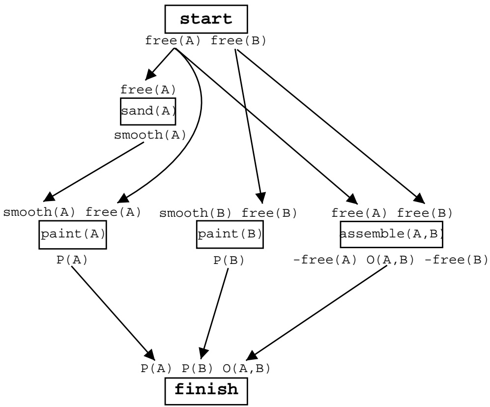

<!-- page: 1 -->

# 6.891 Midterm Examination

## 3/21/01

## 1 Search

10 points Consider the following graph, in which A is the start node and F is the goal node. Assume that nodes are visited at most once.

1. In what order does uniform-cost search visit the nodes? 3 points A, B, E, C, F

<!-- page: 2 -->

Let the heuristic function  $h(n)$  be the minimum number of arcs between node n and the goal node.

2. Is this an admissible heuristic? Why or why not? 3 points

Yes, it is admissible because it is a conservative estimate of the distance.

3. In what order does $A^{*}$ search visit the nodes? What are their estimated values when they are visited? order - 2 points, values - 2 points  
A(2), B(4), E(4), F(5)

## 2 Clausal Normal Form

8 points Convert the following sentence to CNF.

$$
(A \land B) \lor \neg (C \to D)
$$

$$
(A \lor C) \land (A \lor \neg D) \land (B \lor C) \land (B \lor \neg D)
$$

## 3 True or False

10 points (2 points per answer)

1. All sentences are either valid or unsatisfiable. False

<!-- page: 3 -->

2. Iterative-deepening search requires space linear in the depth of the solution. True

3. If $A \models B$, then $A$ is true in all interpretations in which $B$ is true. False

4. Testing the validity of a sentence in first-order logic can be done in time exponential in the size of the sentence. False

5. DPLL runs in worst-case polynomial time in the length of the sentence.
False

## 4 First Order Logic

12 points (2 points per answer) Match the formula to the English sentence it encodes (note that there are more English sentences than formulas). Let Big(x) mean “x is big” (so  $\neg Big(x)$  means “x is small”) and let Cat(x) mean “x is a cat.”

1. (F) $\exists x.Big(x)\wedge Cat(x)$ A. All cats are big.

2. (B) $\exists x.Big(x)\to Cat(x)$ B. There is a small thing or a cat.

3. (H)  $\exists x. Big(x) \lor Cat(x)$  C. All big things are cats.

4. (D) $\forall x.Big(x)\wedge Cat(x)$ D. Everything is a big cat.

5. (C) $\forall x.Big(x)\to Cat(x)$ E. All cats are small.

6. (G) $\forall x.Big(x)\lor Cat(x)$ F. There is a big cat.

G. All small things are cats.

H. There is a big thing or a cat.

## 5 Resolution-Refutation 1

## 10 points

Use resolution-refutation to show that the following sentence is valid.

$$
(P \to Q) \lor (Q \to P)
$$

$$
\neg ((P \to Q) \lor (Q \to P))
$$

$$
\neg (\neg P \lor Q) \land \neg (\neg Q \lor P)
$$

$$
P \land \neg Q \land Q \land \neg P
$$

<!-- page: 4 -->

1. $P$  
2. $\neg Q$  
3. $Q$  
4. $\neg P$  
5. False (1,4)

## 6 Unification

10 points, 5 points per example (3 for MGU, 2 for unification)

Show the most general unifier (MGU) for each pair of sentences below. Also show the result of applying the MGU to the sentences. (Capital letters are constants, lowercase are variables.)

1. $P(x,x,A)$ and $P(z,B,y)$. $\{B / x,B / z,A / y\}$ $P(B,B,A)$

2. $P(F(x),A,G(x))$ and $P(F(z),z,w)$ $\{A / x,A / z,G(A) / w\}$ $P(F(A),A,G(A))$

## 7 First Order Clausal Form

12 points, 3 points per example Convert the following sentences to clausal form.

1. $\exists x.\forall y.K(y,x)\to D(y)$ $\neg K(y,\mathrm{Bozo})\lor \mathrm{D}(\mathbf{y})$   
2. $\neg \exists x.H(x)\land C(x)$ $\neg H(x)\lor \neg C(x)$

<!-- page: 5 -->

3. $\exists x.H(x)\wedge C(x)$

$H(\mathrm{Bozo})\wedge \mathrm{C}(\mathrm{Bozo})$

4.  $\neg\exists x.\forall y.L(y,x)$

$\neg L(\mathrm{foo}(\mathrm{x}),\mathrm{x})$

## 8 Resolution-Refutation 2

10 points Use resolution-refutation to prove a contradiction from the following sentences. Show the two lines you are resolving and the MGU at each step.

1. $P(x)\lor Q(F(x),x)$

2. $R(y) \lor \neg Q(y, z)$

3.  $\neg R(F(A))$

4.  $\neg P(A)$

5. $Q(F(A), A)$ (1, 4) $\{A / x\}$

6. $R(F(A))(2,5)\{F(A) / y,A / z\}$

7. False (3, 6) {}

## 9 The Frame Problem

8 points Why don't we need the equivalent of frame axioms in the STRIPS planning representation?

We do not need frame axioms because STRIPS planners assume that the world is static except for the effects explicitly specified by the action descriptions.

<!-- page: 6 -->

## 10 Partially Ordered Plans

10 points Here's a partially-ordered plan. Give three reasons why it is not yet correct. If any action is responsible for multiple threats, each threat counts separately.

1. One of paint(B)'s preconditions (smooth(B)) is unsatisfied.

2. Assemble(A,B) threatens paint(A) by its effect -free(A).

3. Assemble(A,B) threatens paint(B) by its effect -free(B).

4. Assemble(A,B) threatens sand(A) by its effect -free(A).
