<!-- page: 1 -->

## 6.825 Techniques in Artificial Intelligence

## Graph Plan

• Overview

• PO Planning – “human-like” but very slow

Lecture 12 • 1

We’ve been talking about planning. We started with situation calculus, which, because of its basis in full first-order logic is completely intractable.

So we moved to highly restricted operator representations, and then the partial order planner, which seemed like a good idea because it would let you do non-linear planning; to put in planned steps in whatever order you wanted to and hook them up. And there's something attractive about the partial- order planners. They seem almost like you might imagine that a person would go about planning, right? You put these steps in and then try to fix up the problems, and it seems kind of appealing and intuitive, and so, attractive to people, but they're really awfully slow. The structure of the search space is kind of hard to understand. It's not at all clear how to apply the things that we learned, say, in the SAT stuff to partial order planning. It's not clear how to prune the state space, how to recognize failures early, all those kinds of things.

<!-- page: 2 -->

## 6.825 Techniques in Artificial Intelligence

## Graph Plan

• Overview

• PO Planning – “human-like” but very slow

• Graph Plan

• Simplified planning model

• Efficient algorithm

Lecture 12 • 2

So, in what appears to be a sort of a retrogressive move, the planning community about maybe ten years ago kind of quit doing partial-order planning and said no, wait a minute, maybe we can do better by looking at these planning problems in some sense in a simpler and more primitive way. What we're going to do today is talk about GraphPlan, which is described in the paper by Weld that we have linked into the web.

<!-- page: 3 -->

Graphplan was invented by a couple of theoreticians, who said "Oh, these planning people; they play around with algorithms, but what do they know? We know about algorithms, so let's just try to take this planning problem they have and get at it somehow more directly.”

<!-- page: 4 -->

# Graph Plan

A propositional planner, that is, there are no variables

Lecture 12 • 4

The first big thing about Graphplan is that it’s a propositional planner. So that means that there are no variables around in the course of planning. When we did the partial order planning examples, we were doing the blocks world and we had operator descriptions with variables that let us speak generally about moving blocks, rather than naming particular ones. In GraphPlan, we're not going to be able to have any variables floating around during the planning process.

<!-- page: 5 -->

Not having any variables makes your life simpler in the sense that you don't have to worry about unification or variable matching or any of that stuff.

<!-- page: 6 -->

## Graph Plan

A propositional planner, that is, there are no variables

Simpler – don’t have to worry about matching

• Bigger – if you have six blocks, you need 36 propositions to represent all On(x,y) assertions

Lecture 12 • 6

But it may make it harder in that if you really do have six blocks and an on (A, B) relation, then you'll have to make 36 propositions, one for every possible instantiation of the variables in that relationship. So if you need to talk about six different blocks and how they could be on each other, then that might be a lot of propositions. But at least in this work, it's going to turn out that it's worth having a big representation that's fairly easy to deal with; that it's going to be more efficient to do that than to have a very concise but kind of complicated representation as we have when we have variables. So that's the tradeoff, and so in this case we're going to go for big but simple, the propositional planner.

<!-- page: 7 -->

```txt
Graph Plan
• A propositional planner, that is, there are no variables
• Simpler – don’t have to worry about matching
• Bigger – if you have six blocks, you need 36 propositions to represent all On(x,y) assertions
1. Make a plan graph of depth k
2. Search for a solution
3. If succeed, return a plan
4. Else k=k+1
5. Go to 1.
Lecture 12 • 7
```

The graphplan algorithm has the following structure. This isn't really going to make too much sense until we look at the pieces in detail, but the idea is that you make a plan graph of depth k, and then you search for a solution, and if you succeed you return a plan. Otherwise, you increment K and try again. So that's the basic scheme.

<!-- page: 8 -->

## Plan Depth

A plan of depth k

• has k times steps

• may have multiple parallel actions per time step

Lecture 12 • 8

Note that I wrote "make a plan graph of depth K." We're going to look for plans of depth K, so if we look for a depth two plan, it will have two time steps, but it will be partially ordered in the sense that multiple actions might possibly take place in a single time step. Maybe you can or can not actually execute them in parallel, but there will be some actions where you don't care what order they occur in.

<!-- page: 9 -->

## Plan Depth

A plan of depth k

• has k times steps

• may have multiple parallel actions per time step

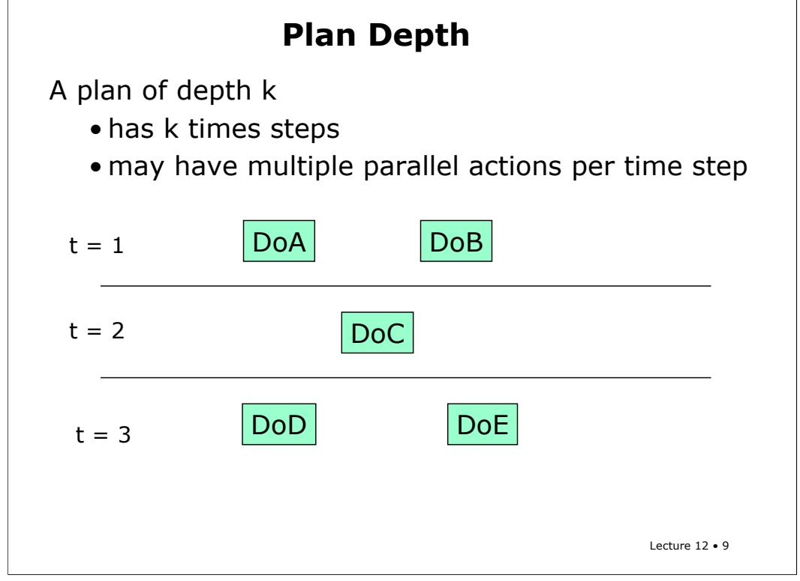

<u>DoA</u>

<u>DoB</u>

<u>DoC</u>

<u>DoD</u>

<u>DoE</u>

And so what you might get out of GraphPlan is a plan that looks like this and say this is a depth three five-step plan. All right? So if you could actually execute these things in parallel, then it would only take you three time steps. If you have to linearize them, it's OK, and you could put DoA and DoB in any order and DoD and DoE in any order. So the algorithm will search for a depth one plan and then a depth two plan and then a depth three plan and so on, until we find the answer. It’s a little like iterative deepening. Some of the motivations for doing that are the same.

<!-- page: 10 -->

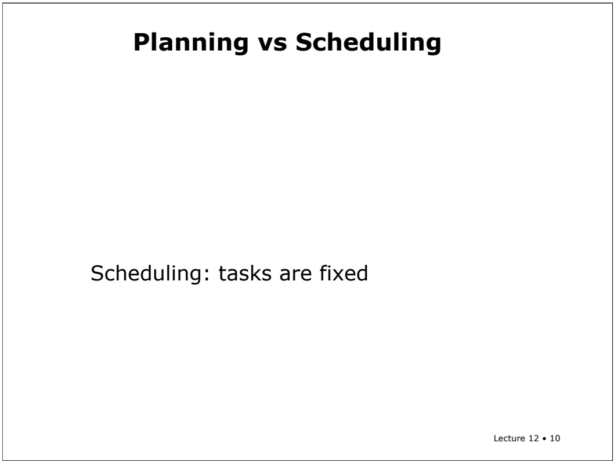

# Planning vs Scheduling

Scheduling: tasks are fixed

There are really two different, but highly related, problems. If you read the book, they sometimes talk about planning versus scheduling. In scheduling, the tasks are fixed. A scheduling problem might be that we have to figure out how to fit all your classes into your schedule, or all the exams into the exam period. There may be constraints on aspects of the schedule, but you don't have to figure out which particular tasks you need to do. Typically, that's specified, and all you have to do is find an ordering for them.

<!-- page: 11 -->

In planning, you have to decide which set of tasks or steps you need to do, as well as to schedule them.

<!-- page: 12 -->

I think of GraphPlan as sitting in here somewhere in the middle. It iteratively commits to a particular depth and then searches for a plan within that depth. It circumscribes the set of tasks, or the set of steps that it's going to try to fit together into a plan. So it tries to say, all right, I'm just going to look in the space of two-step plans, that limits my options in some sense, and I can do that somewhat more efficiently.

<!-- page: 13 -->

## Planning vs Scheduling

Planning: find steps and schedule PSPACE-complete

Graph Plan: find plans of a given depth

Scheduling: tasks are fixed

NP-Complete

Lecture 12 • 13

For those of you who are interested in complexity stuff, scheduling is, in most formulations, NP complete. There are basically exponentially many schedules, and in the worst case you have to try them all. But planning is worse. Planning is P-space complete because sometimes you might have a very small description of your problem so there are just a few very general- purpose operators, but the plan itself might be quite long, so there's variability in the length of a plan as well as in all the different operations that you might have to put in, so planning, where you have to have to think about what all the different operations are, is more complicated because you don't know the length of the plan.

<!-- page: 14 -->

Lecture 12 • 14

## Planning vs Scheduling

Planning: find steps and schedule PSPACE-complete

Graph Plan: find plans of a given depth

Scheduling: tasks are fixed

NP-Complete

<small><span class="docvortex-page-footnote" data-block-type="page_footnote" style="color:#6b7280">So GraphPlan tries to take good advantage of this fact and say, "Well, I'm going to do something that's more like scheduling and I'm going to keep increasing my horizon." Now, because it's doing planning in the worst case, it may have to increase its horizon out pretty darned far and so it's still a hard problem, but it's trying to leverage this idea of trying to work in a very limited space and just increasing the size of the space it's thinking about as it goes.</span></small>

<!-- page: 15 -->

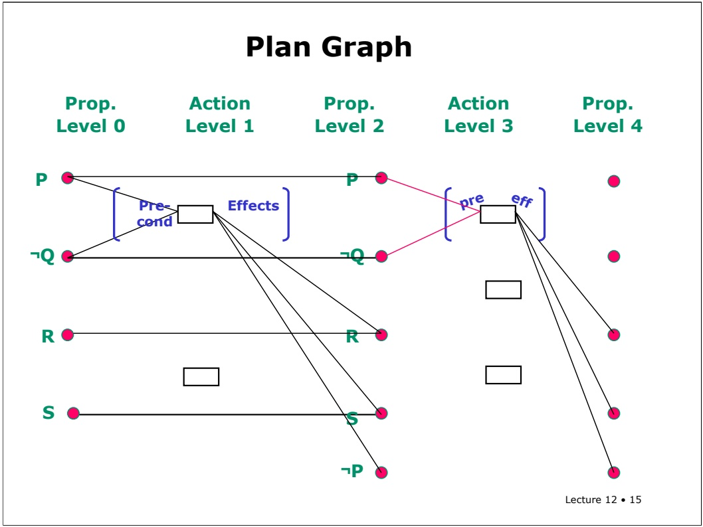

Not surprisingly, given its name, GraphPlan centers its work on a data structure called a plan graph. A plan graph looks like this. You have a bunch of levels. You start with level zero, level one, level two.

<!-- page: 16 -->

Plan Graph

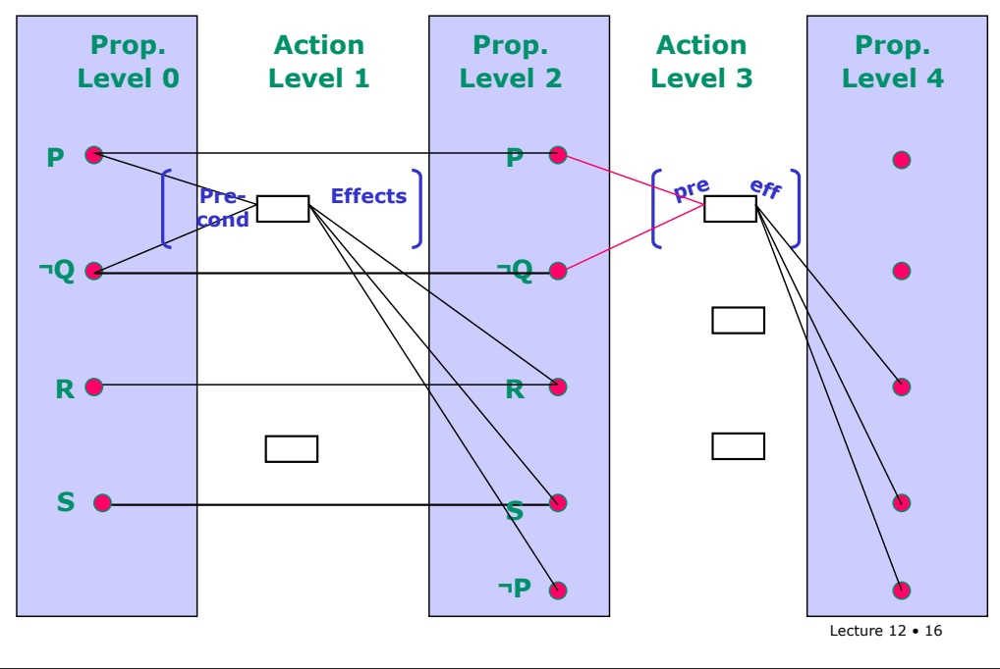

At the even- numbered levels you have propositions, which they draw as a little dot.

<!-- page: 17 -->

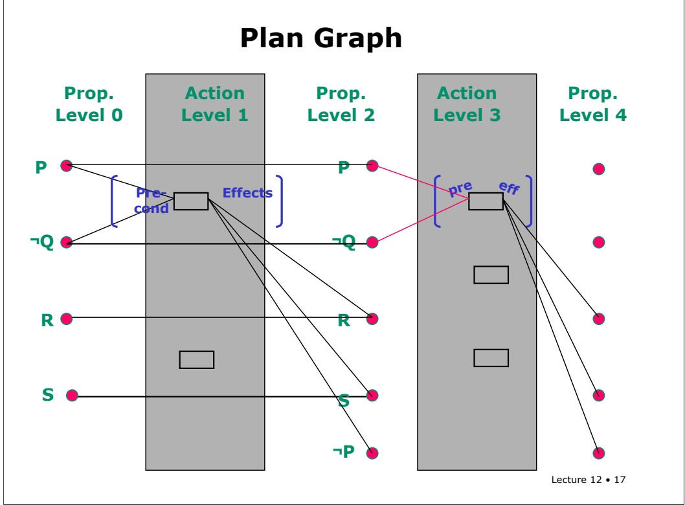

At the odd-numbered levels, you have actions, shown as boxes.

<!-- page: 18 -->

Plan Graph

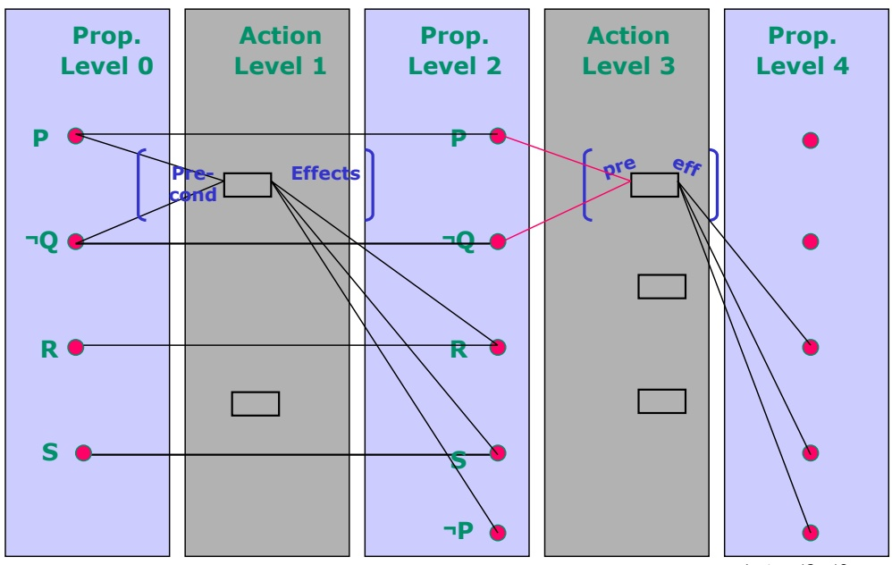

In this picture we have three proposition levels (levels 0, 2, and 4) and two action levels (levels 1 and 3). In this graph, we are able to encode depth-two plans (because there are two layers of actions). Action level 1 has the actions that we might choose to do on the first step, and action level 3 has the actions we might choose to do on the second step.

<!-- page: 19 -->

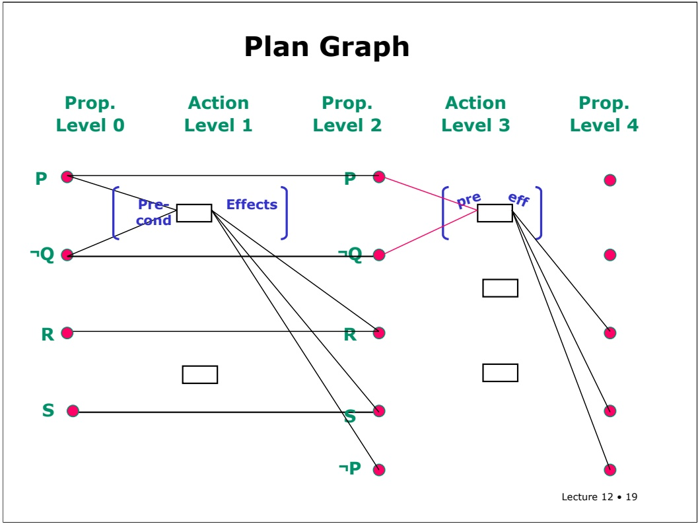

And then it's within this structure that we’re going to try to look for a plan. So we start by making a graph with levels 0 through 2, corresponding to a depth 1 plan, and search for a satisfactory plan within that graph. If we can’t find one, we extend the graph out by two more layers (an action layer and a proposition layer), and then try to find a depth 2 plan. Etcetera.

<!-- page: 20 -->

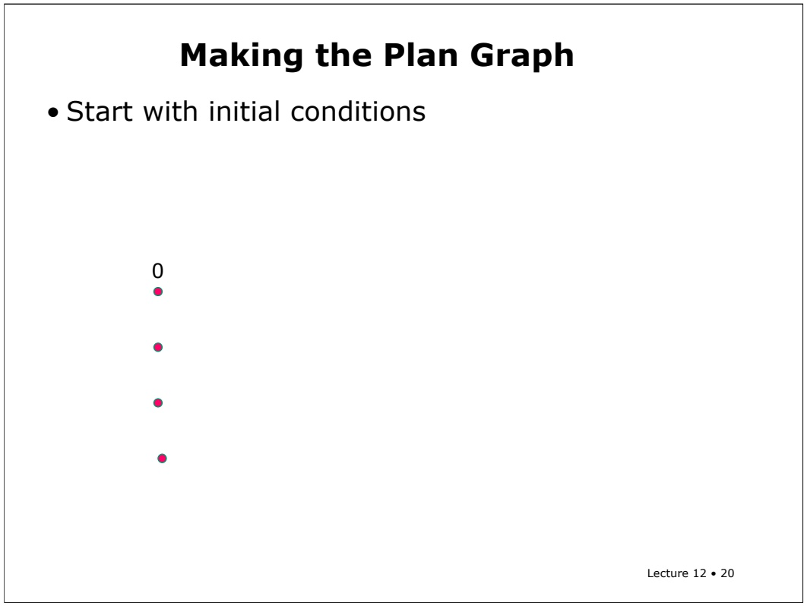

So to make the plan graph, you start with the initial conditions, putting each one in proposition layer 0.

<!-- page: 21 -->

Then, you add to layer 1 all the actions that have their preconditions satisfied in layer 0.

<!-- page: 22 -->

Then, you add to proposition layer 2 all the propositions that are effects of actions in layer 1.

<!-- page: 23 -->

## Making the Plan Graph

• Start with initial conditions

• Add actions with satisfied preconditions

• Add all effects of actions at previous levels

• Add maintenance actions

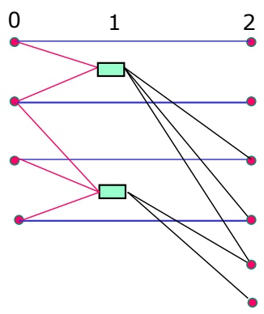

Lecture 12 • 23

And you also add to proposition layer 2 all of the propositions that you had in layer 0, and connect them with **maintenance actions**, shown here as blue lines connecting propositions from layer n to layer n + 2. These maintenance actions represent the possibility of having some proposition be true at step n because it was true at step n – 2, and we didn’t do anything to make it false; that is, that we maintained its truth value.

<!-- page: 24 -->

Then, when it’s time to grow the graph out another layer, you repeat the same process:

<!-- page: 25 -->

Add actions to level 3 with satisfied precondition in level 2.

<!-- page: 26 -->

## Making the Plan Graph

• Start with initial conditions

• Add actions with satisfied preconditions

• Add all effects of actions at previous levels

• Add maintenance actions

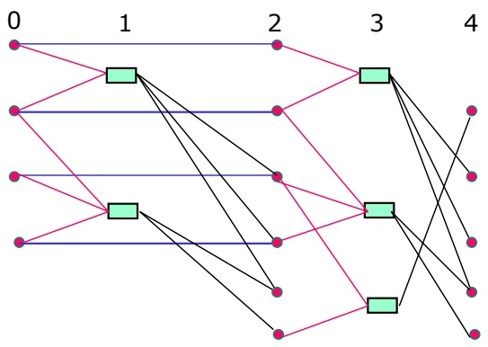

Lecture 12 • 26

Add the effects of those actions to level4.

<!-- page: 27 -->

## Making the Plan Graph

• Start with initial conditions

• Add actions with satisfied preconditions

• Add all effects of actions at previous levels

• Add maintenance actions

Lecture 12 • 27

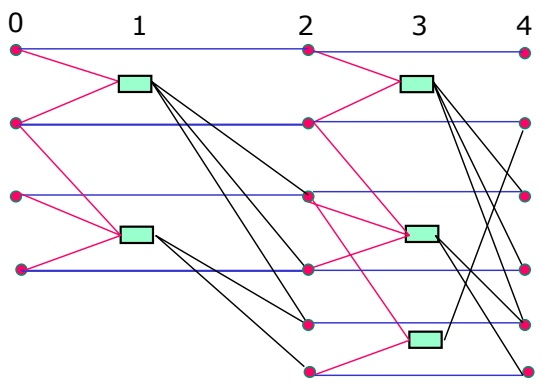

Add maintenance actions between level 2 and level 4. And now we have a 5-level graph.

<!-- page: 28 -->

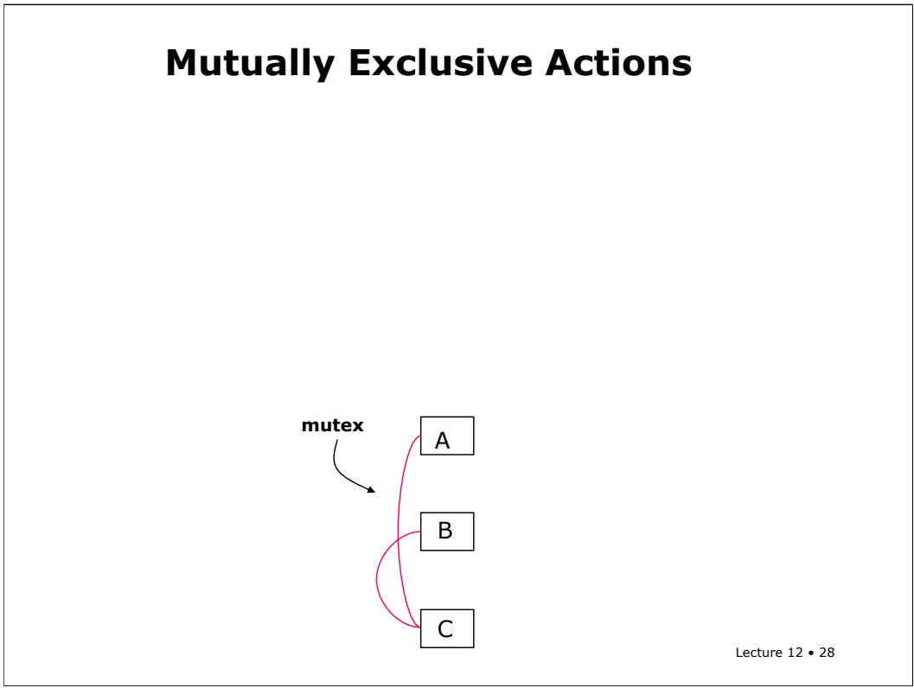

# Mutually Exclusive Actions

If we just leave it as it is, this graph is essentially a representation of the complete search tree, down to a fixed depth. But what it enables us to do is a pruning phase, in which we find and mark pairs of actions that are mutually exclusive. That is, they can’t both be done on the same step; they can’t be done in parallel. When two actions are mutex, we’ll show it in our graph by drawing an arc between them, as shown in red here. Actions A and C are mutex, and actions B and C are mutex. This means that we could execute both A and B in parallel, but if we do C, we can’t do either of the others.

<!-- page: 29 -->

# Mutually Exclusive Actions

Two action instances at level i are mutex if:

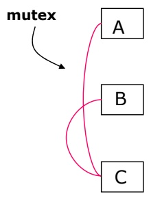

If two actions can’t be done in parallel we’ll say they’re mutually exclusive or mutex. The mutex relations will vary from layer to layer, so we’ll look at the question of when two actions are mutex at level i. This can be true in three possible circumstances.

<!-- page: 30 -->

## Mutually Exclusive Actions

Two action instances at level i are mutex if: • <u>Inconsistent effects</u>: effect of one action is negation of effect of another

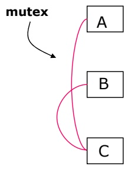

The first case is called **inconsistent effects**. If the effect of one action is the negation of the effect of another, then those two actions are mutex. So if one action causes P to be true and another action causes P to be false, you can't execute them both at the same time.

<!-- page: 31 -->

Lecture 12 • 31

## Mutually Exclusive Actions

Two action instances at level i are mutex if:

• <u>Inconsistent effects</u>: effect of one action is negation of effect of another

• Interference: one action deletes the precondition of the other


The next case is called **interference**. If one action deletes the preconditions of another – then that’s also a case where you can't execute the two actions at the same time. Because remember, we said that when we had one of these plans that had two action steps at the same point in time, our assumption was that you could linearize them in either order, and clearly, if one deletes a precondition of the other then you can't linearize them in any order, so that's not OK.

<!-- page: 32 -->

Lecture 12 • 32

## Mutually Exclusive Actions

Two action instances at level i are mutex if:

• <u>Inconsistent effects</u>: effect of one action is negation of effect of another

• Interference: one action deletes the precondition of the other

• <u>Competing needs</u>: the actions have preconditions that are mutex at level i-1


The third case is called: **competing needs**. If two actions have preconditions that are mutually exclusive at the previous level, then the actions are mutex. So one thing that can make actions mutually exclusive is essentially if their preconditions can't possibly both be satisfied during this time step, then there's no way you could execute these two actions now at the next time step.

<!-- page: 33 -->

## Mutually Exclusive Actions

Two action instances at level i are mutex if:

• <u>Inconsistent effects</u>: effect of one action is negation of effect of another

• Interference: one action deletes the precondition of the other

• <u>Competing needs</u>: the actions have preconditions that are mutex at level i-1


So that's how you decide if actions are mutually exclusive, and you do it making reference only to properties of the actions and to mutual exlusion relationships between the preconditions of the previous step. Next we'll give a definition of what makes two propositions be mutually exclusive, and you'll see that you are able to just sweep forward through a graph calculating which things are mutually exclusive with which other ones, one layer at a time.

<!-- page: 34 -->

# Mutually Exclusive Propositions

Now, so what makes propositions mutually exclusive?

<!-- page: 35 -->

We're going to say two propositions at level I are mutex if they're negations of one another. It's pretty clear you can't have P and !P true in the same step.

<!-- page: 36 -->

Another thing that makes two propositons mutually exclusive is if all the ways of achieving a proposition at the previous level are pair-wise mutually exclusive.

<!-- page: 37 -->

## Mutually Exclusive Propositions

Two propositions at level i are mutex if:

• <u>Negation</u>: they are negations of one another

• Inconsistent support: all ways of achieving the propositions at level i-1 are pairwise mutex.

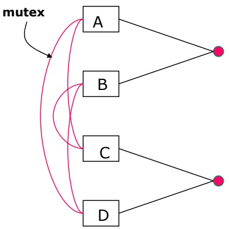

Inconsistent support

So, for example, consider a case in which you have two propositions, each of which can be made true by two actions in the previous layer. But it just happens that action A is mutex with actions C and D, and that action B is mutex with actions C and D. Then there’s no way to make both of our propositions true on this step.

<!-- page: 38 -->

So, we show in our figure that they’re mutex by drawing an arc between the propositions.

<!-- page: 39 -->

Once we’ve grown our graph out to an odd level, we look to see if it could possibly contain a solution.

<!-- page: 40 -->

# Solution Extraction

• If all the literals in the goal appear at the deepest level and not mutex, then search for a solution for each subgoal at level i

Lecture 12 • 40

First, we look to see if all the literals in the goal appear at the deepest level and are **not** mutually exclusive. If so, there’s a chance that this plan graph contains a solution, and we have to search for it. If not, we have to grow the graph out another level and try again.

<!-- page: 41 -->

## Solution Extraction

• If all the literals in the goal appear at the deepest level and not mutex, then search for a solution for each subgoal at level i

Lecture 12 • 41

Okay. If all of our subgoals exist at the deepest level (that means, if our goal is P and not Q, then both P and not Q are in the last proposition level) and they’re not mutex, we look for a plan. We can describe our search method using nondeterministic choice via the choose and fail mechanism.

<!-- page: 42 -->

## Solution Extraction

• If all the literals in the goal appear at the deepest level and not mutex, then search for a solution for each subgoal at level i

• For each subgoal at level i

–<u>Choose</u> an action to achieve it

– If it’s mutex with another action, Fail

Lecture 12 • 42

Let I be the deepest level in the graph. For each of our subgoals, we have to pick an action that can achieve it. So, we start by picking an action at level I – 1 to achieve P. Then, we pick one of the actions at level I – 1 to achieve not Q. If they are mutex, then we fail. Failing will cause us to go back and pick a different way to satisfy P. We search within this level until we find a set of level I- 1 actions, one for each of our level I subgoals, such that the level I-1 actions are not mutex. If we can’t find such a set, then we fail.

<!-- page: 43 -->

## Solution Extraction

• If all the literals in the goal appear at the deepest level and not mutex, then search for a solution for each subgoal at level i

• For each subgoal at level i

–<u>Choose</u> an action to achieve it

– If it’s mutex with another action, Fail

• Repeat for preconditions at level i-2

Lecture 12 • 43

Now, we figure out what the level I-2 preconditions are of the level I-1 actions, and we make that set of propositions our new set of subgoals. Now we search for a non mutex set of actions at level I-3 that can make the I-2 subgoals true, and so on. If we fail at any level, we go back and try to find a different way of satisfying the preconditions at the previous level.

<!-- page: 44 -->

We’ll illustrate this algorithm in detail in the example we’re about to work out.

<!-- page: 45 -->

So here's a really simple planning domain. It's completely propositional and very, very simple. It's the one from the paper. The idea is that we’re getting a birthday dinner ready for someone who is at home and asleep.

<!-- page: 46 -->

# Birthday Dinner Example

• Goal: ¬ garb Æ dinner Æ present

Lecture 12 • 46

So our goal is to not have garbage in the kitchen, and to have dinner cooked, and to have a present

<!-- page: 47 -->

In our initial state, there is garbage all around, our hands are clean, and it's quiet.

<!-- page: 48 -->

And here are the operators.

<!-- page: 49 -->

There's a Cook operator. The precondition is that we have to have clean hands (that’s nice!) and the effect is that dinner is ready.

<!-- page: 50 -->

There’s a **wrap** operator. Its effect is to get the present ready. It needs to be quiet while we wrap the present so that the guest doesn’t wake up and see the present before it’s wrapped. (This isn’t a very sensible example, really, but it’s simple enough to do completely).

<!-- page: 51 -->

There’s a **carry** operator, which takes out the garbage, but it also makes our hands dirty.

<!-- page: 52 -->

## Birthday Dinner Example

• Goal: ¬ garb Æ dinner Æ present • Init: garb Æ clean Æ quiet • Actions: • Cook – Pre: clean – Effect:dinner • Wrap – Pre: quiet – Effect: present • Carry – Pre: garb – Effect: ¬ garb Æ ¬ clean • Dolly – Pre: garb – Effect: ¬ garb Æ ¬ quiet

Lecture 12 • 52

And there’s a **dolly** operator, which takes out the garbage using a dolly (a kind of a hand-cart). It doesn’t make our hands dirty, but it makes a lot of noise. (I should note that, in the paper, the carry and dolly operators don’t have garbage as a precondition (I guess you can pretend to take out the garbage if you want to). We have added it in our example, but it doesn’t really change anything).

<!-- page: 53 -->

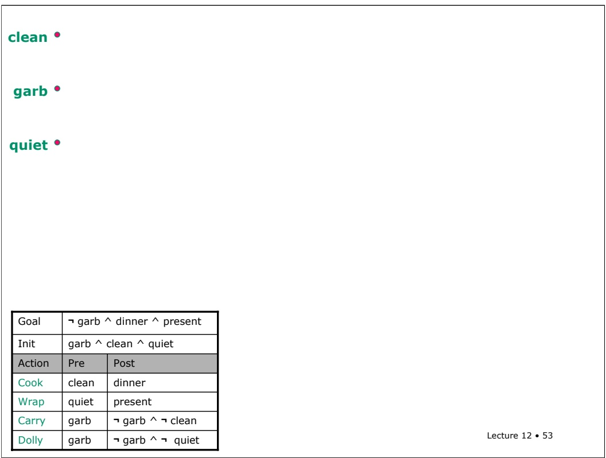

<table><tbody><tr><td>Goal</td><td colspan="2">¬ garb ^ dinner ^ present</td></tr><tr><td>Init</td><td colspan="2">garb ^ clean ^ quiet</td></tr><tr><td>Action</td><td>Pre</td><td>Post</td></tr><tr><td>Cook</td><td>clean</td><td>dinner</td></tr><tr><td>Wrap</td><td>quiet</td><td>present</td></tr><tr><td>Carry</td><td>garb</td><td>¬ garb ^ ¬ clean</td></tr><tr><td>Dolly</td><td>garb</td><td>¬ garb ^ ¬ quiet</td></tr></tbody></table>

Let’s make the plan graph. We start by putting in the initial conditions.

<!-- page: 54 -->

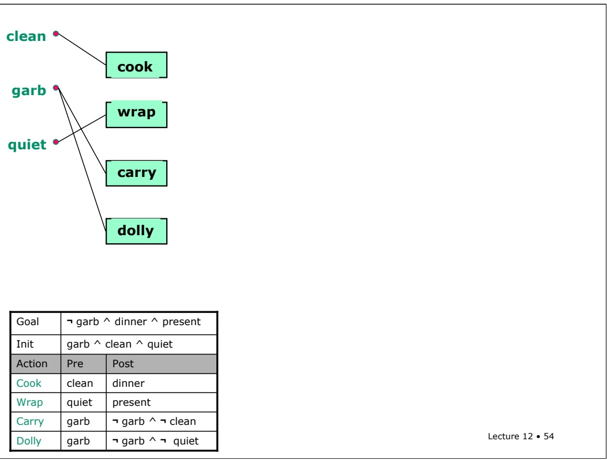

<table><tbody><tr><td>Goal</td><td colspan="2">¬ garb ^ dinner ^ present</td></tr><tr><td>Init</td><td colspan="2">garb ^ clean ^ quiet</td></tr><tr><td>Action</td><td>Pre</td><td>Post</td></tr><tr><td>Cook</td><td>clean</td><td>dinner</td></tr><tr><td>Wrap</td><td>quiet</td><td>present</td></tr><tr><td>Carry</td><td>garb</td><td>¬ garb ^ ¬ clean</td></tr><tr><td>Dolly</td><td>garb</td><td>¬ garb ^ ¬ quiet</td></tr></tbody></table>

Given those initial conditions, all four of our actions could possibly be executed on the first step, so we add them to the graph.

<!-- page: 55 -->


<table><tbody><tr><td>Goal</td><td colspan="2">¬ garb ^ dinner ^ present</td></tr><tr><td>Init</td><td colspan="2">garb ^ clean ^ quiet</td></tr><tr><td>Action</td><td>Pre</td><td>Post</td></tr><tr><td>Cook</td><td>clean</td><td>dinner</td></tr><tr><td>Wrap</td><td>quiet</td><td>present</td></tr><tr><td>Carry</td><td>garb</td><td>¬ garb ^ ¬ clean</td></tr><tr><td>Dolly</td><td>garb</td><td>¬ garb ^ ¬ quiet</td></tr></tbody></table>

Now we add all of our old propositions to the next layer, as well as all the propositions that could be effects of the actions. And we draw in the maintenance actions, as well.

<!-- page: 56 -->


Now it’s time to do the mutexes. None of the initial propositions are mutex (or we’re starting in an impossible state). So, let’s look at the actions in layer 1.

<!-- page: 57 -->

<table><tbody><tr><td>Goal</td><td colspan="2">¬ garb ^ dinner ^ present</td></tr><tr><td>Init</td><td colspan="2">garb ^ clean ^ quiet</td></tr><tr><td>Action</td><td>Pre</td><td>Post</td></tr><tr><td>Cook</td><td>clean</td><td>dinner</td></tr><tr><td>Wrap</td><td>quiet</td><td>present</td></tr><tr><td>Carry</td><td>garb</td><td>¬ garb ^ ¬ clean</td></tr><tr><td>Dolly</td><td>garb</td><td>¬ garb ^ ¬ quiet</td></tr></tbody></table>

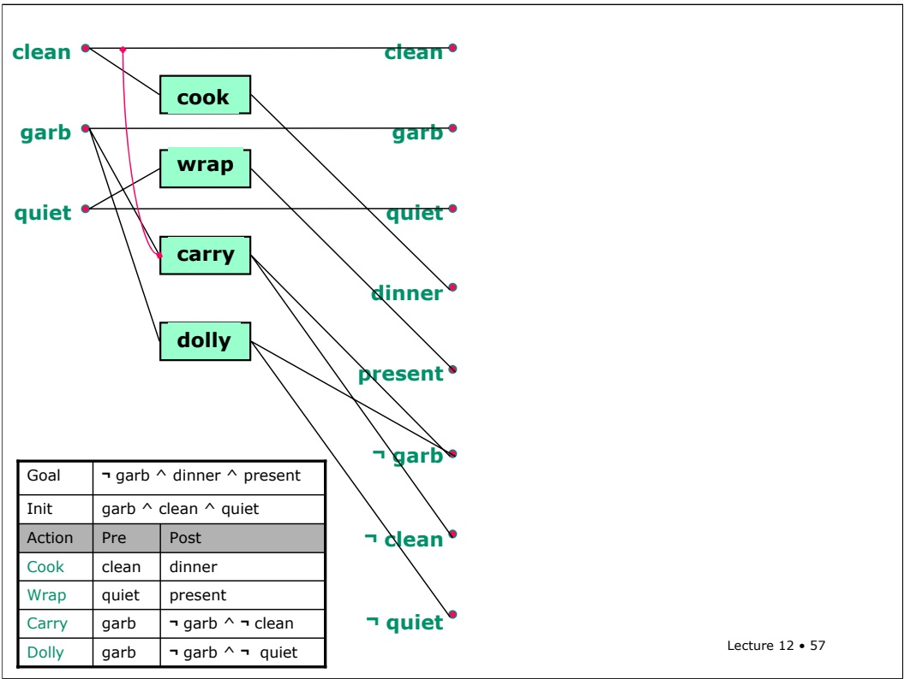

The first reason that actions can be mutex is due to inconsistent effects. So, carry and maintaining clean have inconsistent effects (because carry makes clean false).

<!-- page: 58 -->

<table><tbody><tr><td>Goal</td><td colspan="2">¬ garb ^ dinner ^ present</td></tr><tr><td>Init</td><td colspan="2">garb ^ clean ^ quiet</td></tr><tr><td>Action</td><td>Pre</td><td>Post</td></tr><tr><td>Cook</td><td>clean</td><td>dinner</td></tr><tr><td>Wrap</td><td>quiet</td><td>present</td></tr><tr><td>Carry</td><td>garb</td><td>¬ garb ^ ¬ clean</td></tr><tr><td>Dolly</td><td>garb</td><td>¬ garb ^ ¬ quiet</td></tr></tbody></table>

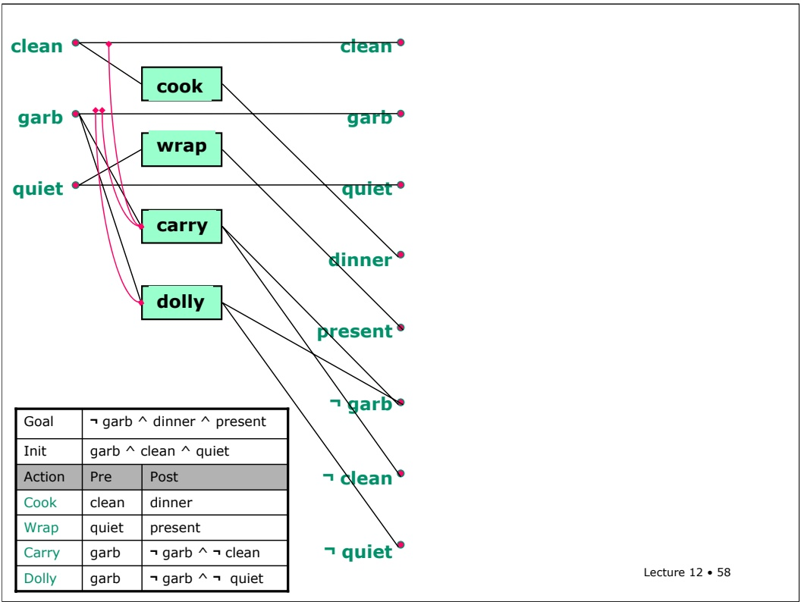

And maintaining garb has inconsistent effects with both carry and dolly (which make garb false).

<!-- page: 59 -->

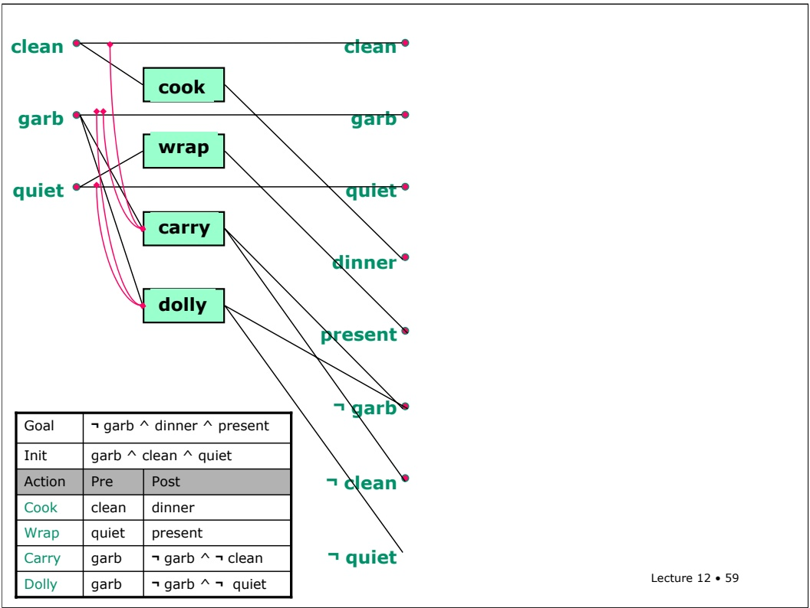

And maintaining quiet has inconsistent effects with dolly (which makes quiet false).

<!-- page: 60 -->

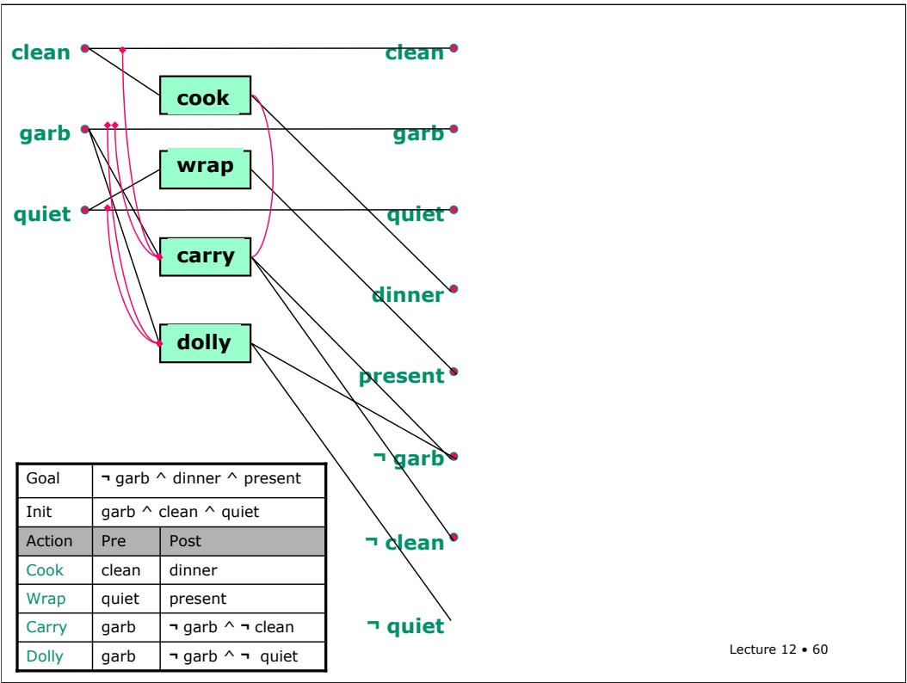

<table><tbody><tr><td>Goal</td><td colspan="2">¬ garb ^ dinner ^ present</td></tr><tr><td>Init</td><td colspan="2">garb ^ clean ^ quiet</td></tr><tr><td>Action</td><td>Pre</td><td>Post</td></tr><tr><td>Cook</td><td>clean</td><td>dinner</td></tr><tr><td>Wrap</td><td>quiet</td><td>present</td></tr><tr><td>Carry</td><td>garb</td><td>¬ garb ^ ¬ clean</td></tr><tr><td>Dolly</td><td>garb</td><td>¬ garb ^ ¬ quiet</td></tr></tbody></table>

Another kind of mutex is due to interference: one action negates the precondition of another. Here we have interference between cook and carry (carry makes clean false, which is required for cook).

<!-- page: 61 -->

<table><tbody><tr><td>Goal</td><td colspan="2">¬ garb ^ dinner ^ present</td></tr><tr><td>Init</td><td colspan="2">garb ^ clean ^ quiet</td></tr><tr><td>Action</td><td>Pre</td><td>Post</td></tr><tr><td>Cook</td><td>clean</td><td>dinner</td></tr><tr><td>Wrap</td><td>quiet</td><td>present</td></tr><tr><td>Carry</td><td>garb</td><td>¬ garb ^ ¬ clean</td></tr><tr><td>Dolly</td><td>garb</td><td>¬ garb ^ ¬ quiet</td></tr></tbody></table>


And we also have interference between wrap and dolly (dolly makes quiet false, which is required for wrap.)

<!-- page: 62 -->

<table><tbody><tr><td>Goal</td><td colspan="2">¬ garb ^ dinner ^ present</td></tr><tr><td>Init</td><td colspan="2">garb ^ clean ^ quiet</td></tr><tr><td>Action</td><td>Pre</td><td>Post</td></tr><tr><td>Cook</td><td>clean</td><td>dinner</td></tr><tr><td>Wrap</td><td>quiet</td><td>present</td></tr><tr><td>Carry</td><td>garb</td><td>¬ garb ^ ¬ clean</td></tr><tr><td>Dolly</td><td>garb</td><td>¬ garb ^ ¬ quiet</td></tr></tbody></table>

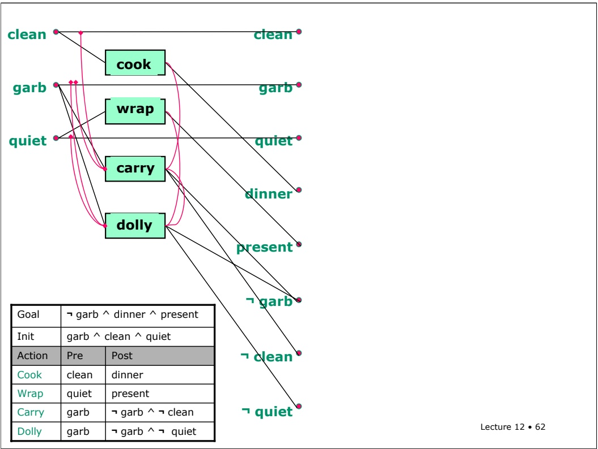

Finally, we have interference between carry and dolly, because they each require that garbage be present, and they each remove it. There are two other situations in which we could have action mutexes, but they don’t apply here.

<!-- page: 63 -->

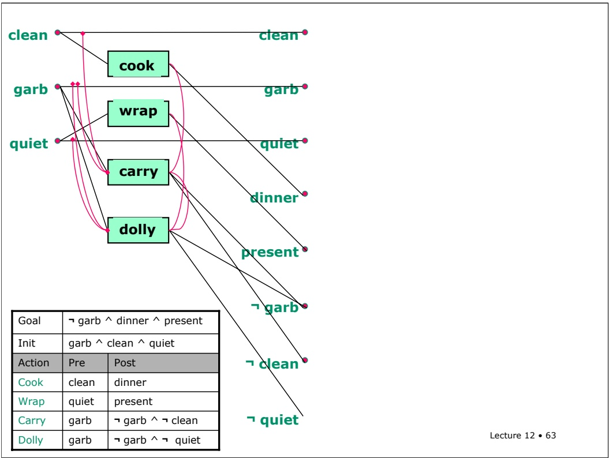

Okay. Now let’s do the mutexes on the propositions in layer 2.

<!-- page: 64 -->

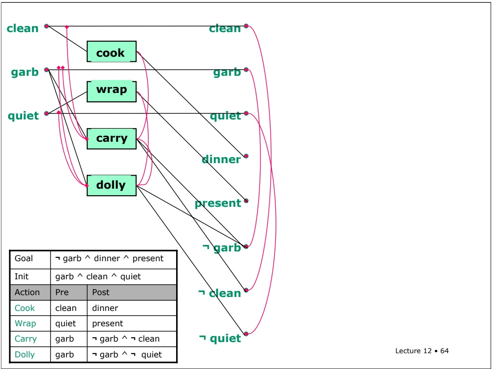

First of all, every proposition is mutex with its negation.

<!-- page: 65 -->

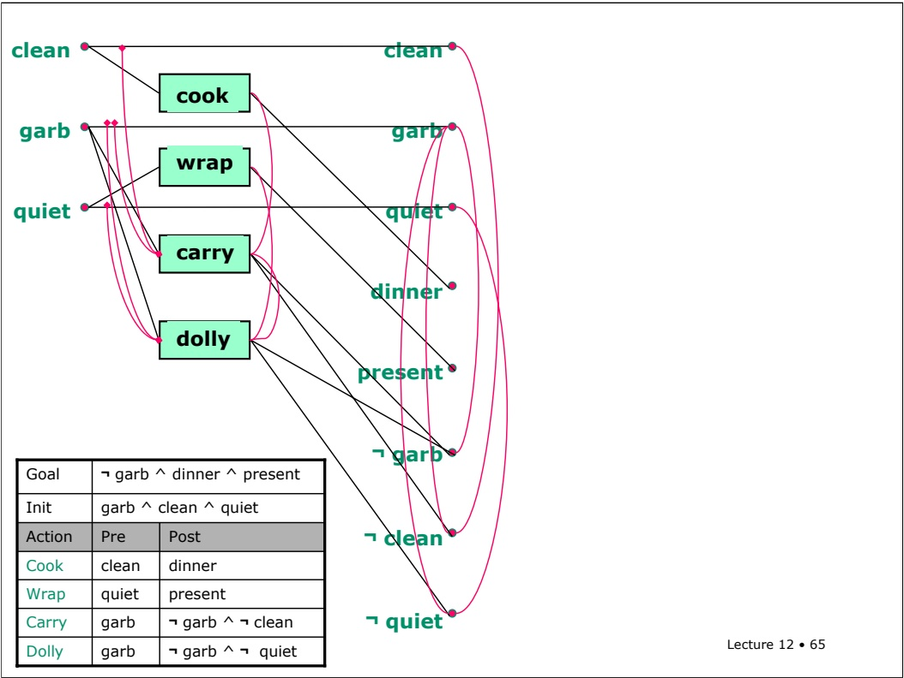

<table><tbody><tr><td>Goal</td><td colspan="2">¬ garb ^ dinner ^ present</td></tr><tr><td>Init</td><td colspan="2">garb ^ clean ^ quiet</td></tr><tr><td>Action</td><td>Pre</td><td>Post</td></tr><tr><td>Cook</td><td>clean</td><td>dinner</td></tr><tr><td>Wrap</td><td>quiet</td><td>present</td></tr><tr><td>Carry</td><td>garb</td><td>¬ garb ^ ¬ clean</td></tr><tr><td>Dolly</td><td>garb</td><td>¬ garb ^ ¬ quiet</td></tr></tbody></table>

Then, the other reason we might have mutexes is because of inconsistent support (all ways of achieving the propositions are pairwise mutex). So, here we have that garbage is mutex with not clean and with not quiet (the only way to make garbage true is to maintain it, which is mutex with carry and with dolly).

<!-- page: 66 -->


<table><tbody><tr><td>Goal</td><td colspan="2">¬ garb ^ dinner ^ present</td></tr><tr><td>Init</td><td colspan="2">garb ^ clean ^ quiet</td></tr><tr><td>Action</td><td>Pre</td><td>Post</td></tr><tr><td>Cook</td><td>clean</td><td>dinner</td></tr><tr><td>Wrap</td><td>quiet</td><td>present</td></tr><tr><td>Carry</td><td>garb</td><td>¬ garb ^ ¬ clean</td></tr><tr><td>Dolly</td><td>garb</td><td>¬ garb ^ ¬ quiet</td></tr></tbody></table>

Dinner is mutex with not clean because cook and carry, the only way of achieving these propositions, are mutex at the previous level.

<!-- page: 67 -->


<table><tbody><tr><td>Goal</td><td colspan="2">¬ garb ^ dinner ^ present</td></tr><tr><td>Init</td><td colspan="2">garb ^ clean ^ quiet</td></tr><tr><td>Action</td><td>Pre</td><td>Post</td></tr><tr><td>Cook</td><td>clean</td><td>dinner</td></tr><tr><td>Wrap</td><td>quiet</td><td>present</td></tr><tr><td>Carry</td><td>garb</td><td>¬ garb ^ ¬ clean</td></tr><tr><td>Dolly</td><td>garb</td><td>¬ garb ^ ¬ quiet</td></tr></tbody></table>

And present is mutex with not quiet because wrap and dolly are mutex at the previous level.

<!-- page: 68 -->

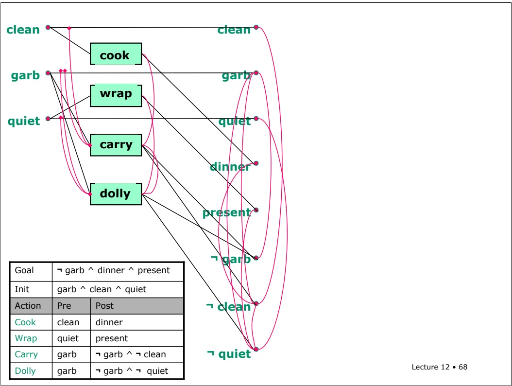

<table><tbody><tr><td>Goal</td><td colspan="2">¬ garb ^ dinner ^ present</td></tr><tr><td>Init</td><td colspan="2">garb ^ clean ^ quiet</td></tr><tr><td>Action</td><td>Pre</td><td>Post</td></tr><tr><td>Cook</td><td>clean</td><td>dinner</td></tr><tr><td>Wrap</td><td>quiet</td><td>present</td></tr><tr><td>Carry</td><td>garb</td><td>¬ garb ^ ¬ clean</td></tr><tr><td>Dolly</td><td>garb</td><td>¬ garb ^ ¬ quiet</td></tr></tbody></table>

Finally not clean is mutex with not quiet because carry and dolly are mutex at the previous level. Whew. That’s all the mutexes.

<!-- page: 69 -->

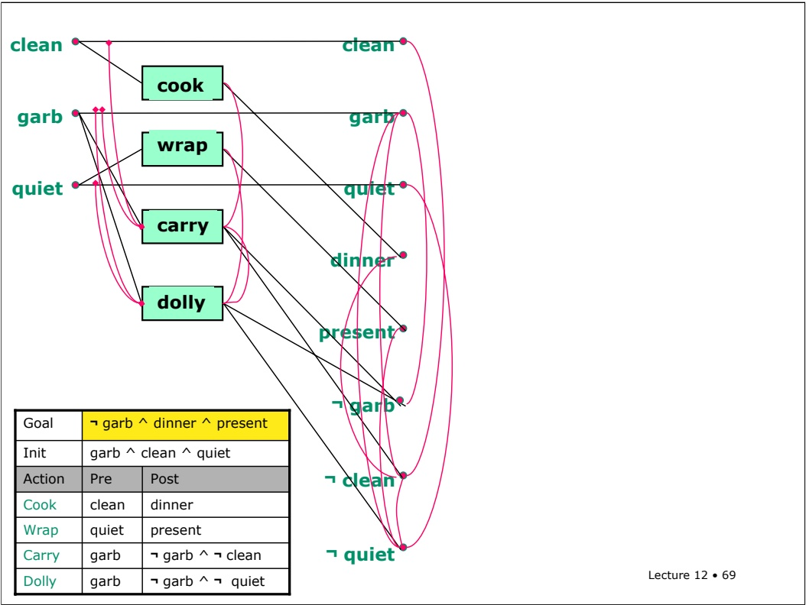

<table><tbody><tr><td>Goal</td><td colspan="2">¬ garb ^ dinner ^ present</td></tr><tr><td>Init</td><td colspan="2">garb ^ clean ^ quiet</td></tr><tr><td>Action</td><td>Pre</td><td>Post</td></tr><tr><td>Cook</td><td>clean</td><td>dinner</td></tr><tr><td>Wrap</td><td>quiet</td><td>present</td></tr><tr><td>Carry</td><td>garb</td><td>¬ garb ^ ¬ clean</td></tr><tr><td>Dolly</td><td>garb</td><td>¬ garb ^ ¬ quiet</td></tr></tbody></table>

So first of all, let's try to ask the question, could the goal conceivably be true? Our goal is !garbage and dinner and present. Layer 2 contains !garbage and dinner and present. So it looks like these could possibly be true. They're not obviously inconsistent.

<!-- page: 70 -->

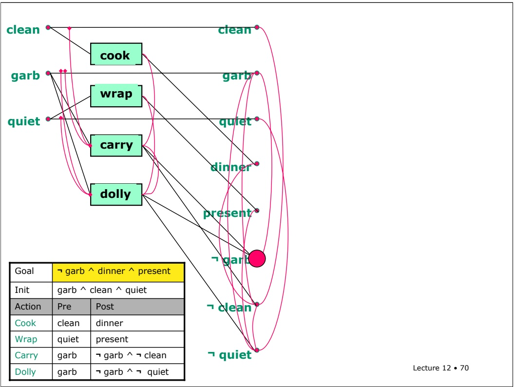

So, we’ll start looking for a plan by finding a way to make not garbage true.

<!-- page: 71 -->

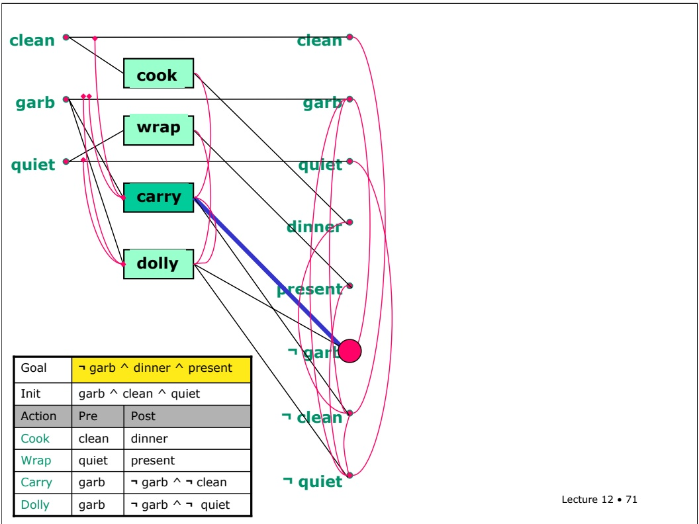

We’ll try using the carry action.

<!-- page: 72 -->


Now, we’ll try to make dinner true the only way we can, with the cook action.

<!-- page: 73 -->

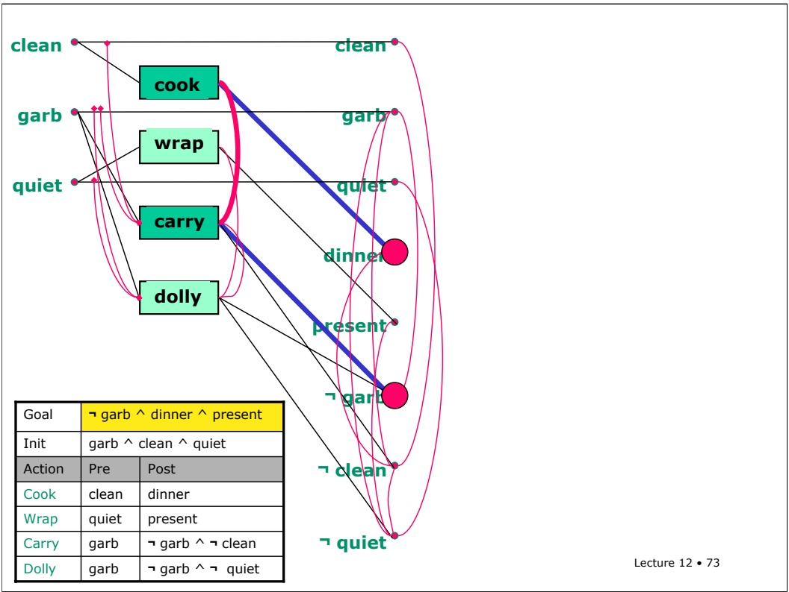

But cook and carry are mutex, so this won’t work.

<!-- page: 74 -->

<table><tbody><tr><td>Goal</td><td colspan="2">¬ garb ^ dinner ^ present</td></tr><tr><td>Init</td><td colspan="2">garb ^ clean ^ quiet</td></tr><tr><td>Action</td><td>Pre</td><td>Post</td></tr><tr><td>Cook</td><td>clean</td><td>dinner</td></tr><tr><td>Wrap</td><td>quiet</td><td>present</td></tr><tr><td>Carry</td><td>garb</td><td>¬ garb ^ ¬ clean</td></tr><tr><td>Dolly</td><td>garb</td><td>¬ garb ^ ¬ quiet</td></tr></tbody></table>

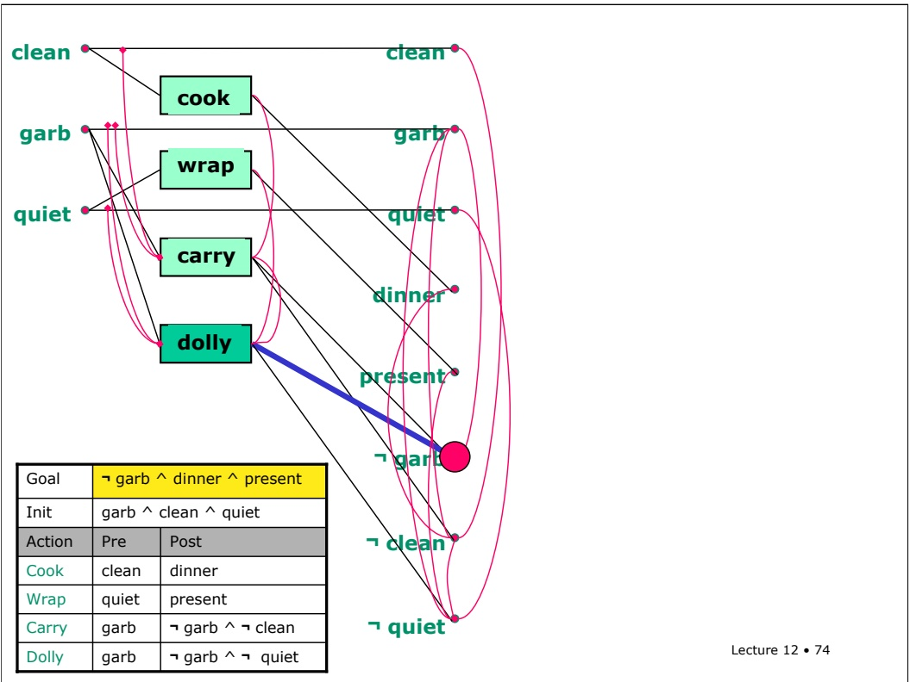

Because there aren’t any other ways to make dinner, we fail, and have to try a different way of making not garbage true. This time, we’ll try dolly.

<!-- page: 75 -->

<table><tbody><tr><td>Goal</td><td colspan="2">¬ garb ^ dinner ^ present</td></tr><tr><td>Init</td><td colspan="2">garb ^ clean ^ quiet</td></tr><tr><td>Action</td><td>Pre</td><td>Post</td></tr><tr><td>Cook</td><td>clean</td><td>dinner</td></tr><tr><td>Wrap</td><td>quiet</td><td>present</td></tr><tr><td>Carry</td><td>garb</td><td>¬ garb ^ ¬ clean</td></tr><tr><td>Dolly</td><td>garb</td><td>¬ garb ^ ¬ quiet</td></tr></tbody></table>

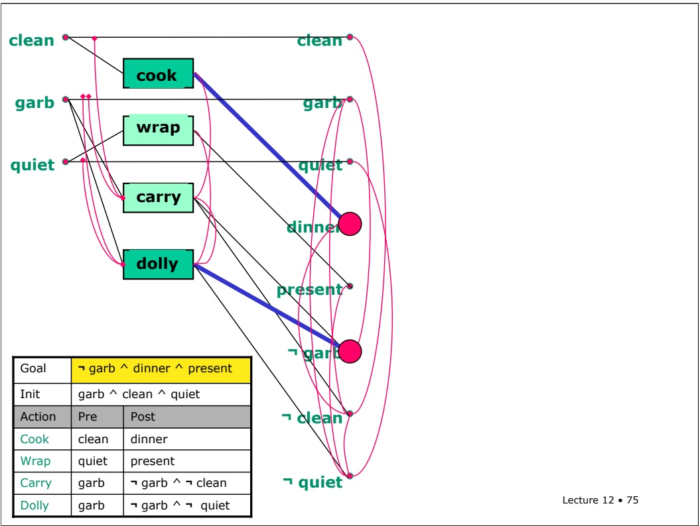

Now, we can cook dinner, and we don’t have any mutex problems with dolly.

<!-- page: 76 -->

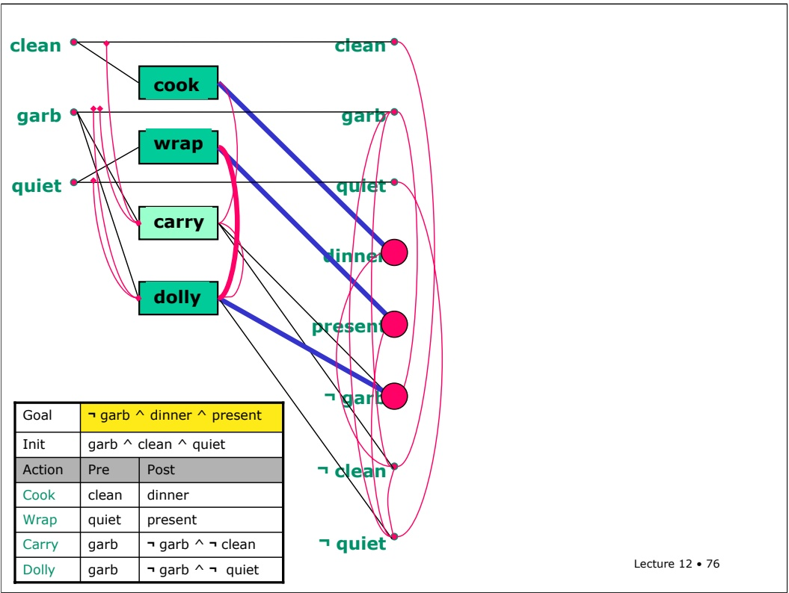

<table><tbody><tr><td>Goal</td><td colspan="2">¬ garb ^ dinner ^ present</td></tr><tr><td>Init</td><td colspan="2">garb ^ clean ^ quiet</td></tr><tr><td>Action</td><td>Pre</td><td>Post</td></tr><tr><td>Cook</td><td>clean</td><td>dinner</td></tr><tr><td>Wrap</td><td>quiet</td><td>present</td></tr><tr><td>Carry</td><td>garb</td><td>¬ garb ^ ¬ clean</td></tr><tr><td>Dolly</td><td>garb</td><td>¬ garb ^ ¬ quiet</td></tr></tbody></table>

We have to make present true as well. The only way of doing that is with wrap, but wrap is mutex with dolly. So, we fail completely. Sigh.

<!-- page: 77 -->

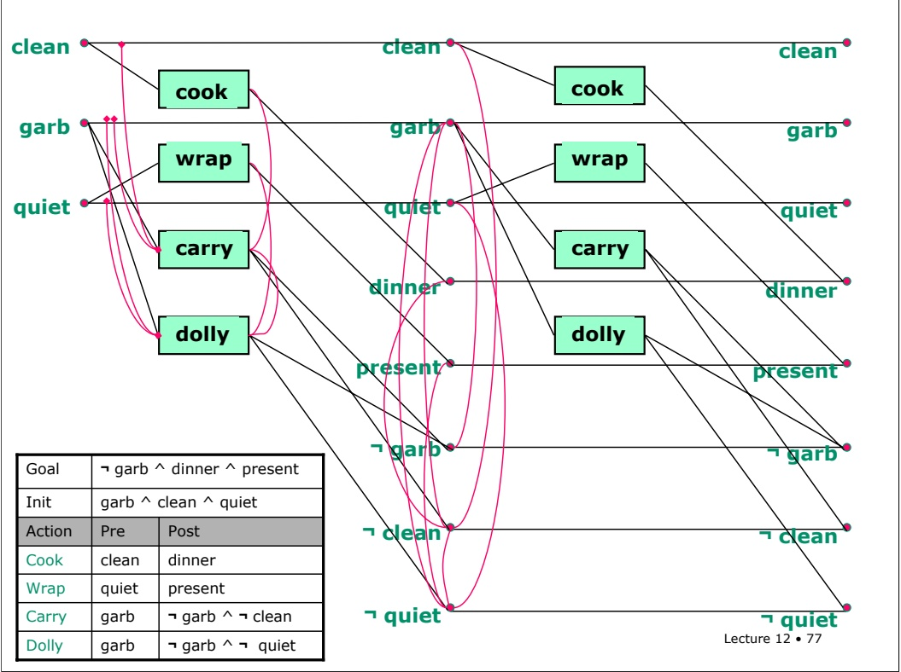

There’s no way to achieve all of these goals in parallel. So we have to consider a depth two plan. We start by adding another layer to the plan graph.

<!-- page: 78 -->

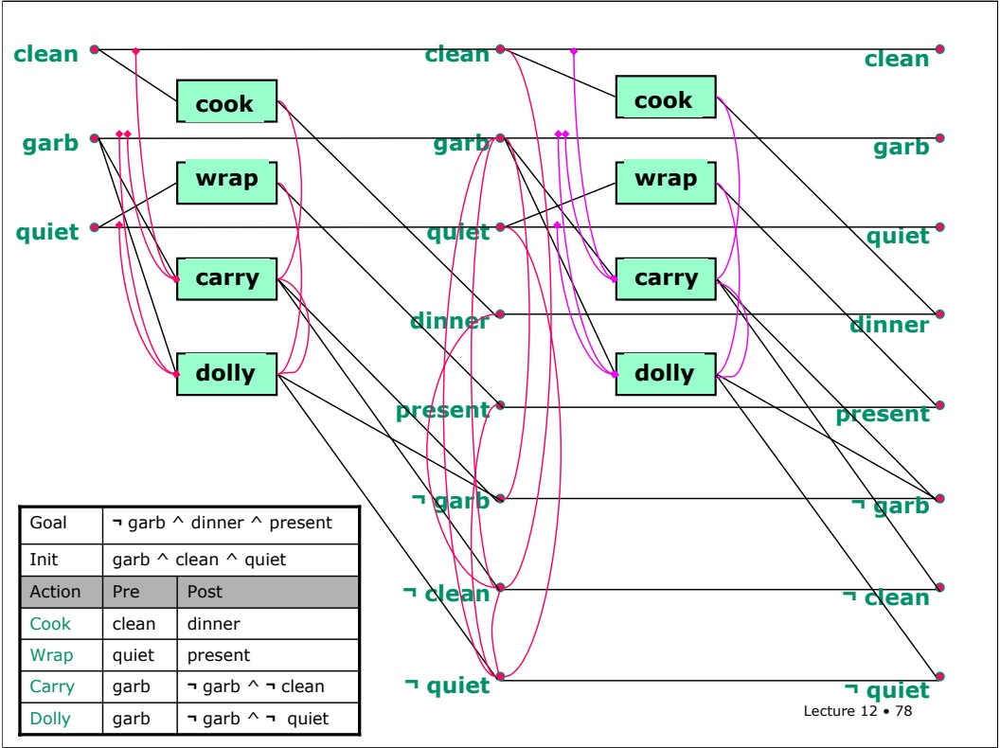

We have the same set of mutexes on actions that we had before.

<!-- page: 79 -->

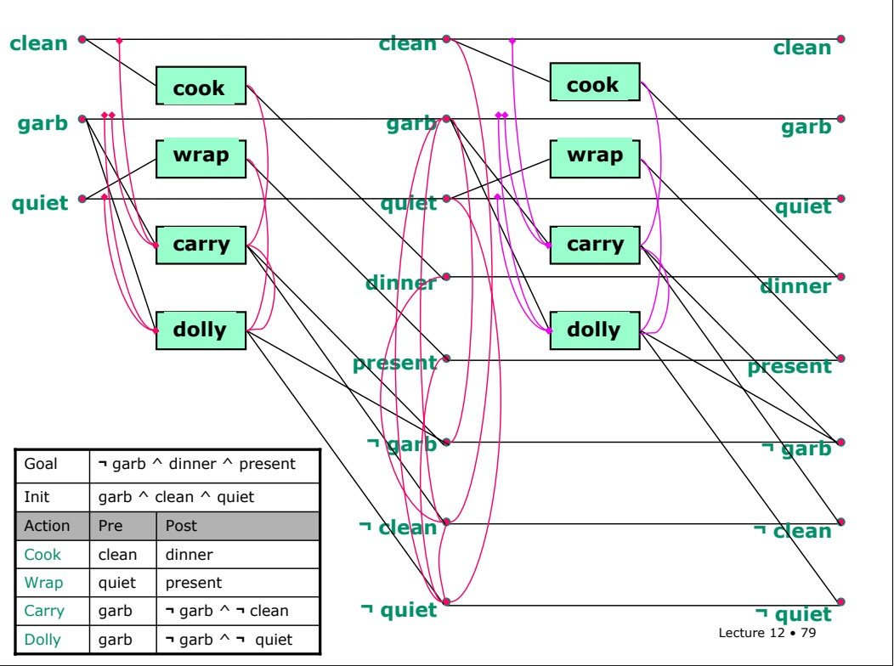

<table><tbody><tr><td>Goal</td><td colspan="2">¬ garb ^ dinner ^ present</td></tr><tr><td>Init</td><td colspan="2">garb ^ clean ^ quiet</td></tr><tr><td>Action</td><td>Pre</td><td>Post</td></tr><tr><td>Cook</td><td>clean</td><td>dinner</td></tr><tr><td>Wrap</td><td>quiet</td><td>present</td></tr><tr><td>Carry</td><td>garb</td><td>¬ garb ^ ¬ clean</td></tr><tr><td>Dolly</td><td>garb</td><td>¬ garb ^ ¬ quiet</td></tr></tbody></table>

There is also a large set of additional mutexes between maintenance actions for not garbage, not clean, and not quiet. I’m going to leave them out of this graph, in the interests of making it readable (and they’re not going to affect the planning process in this example).

<!-- page: 80 -->

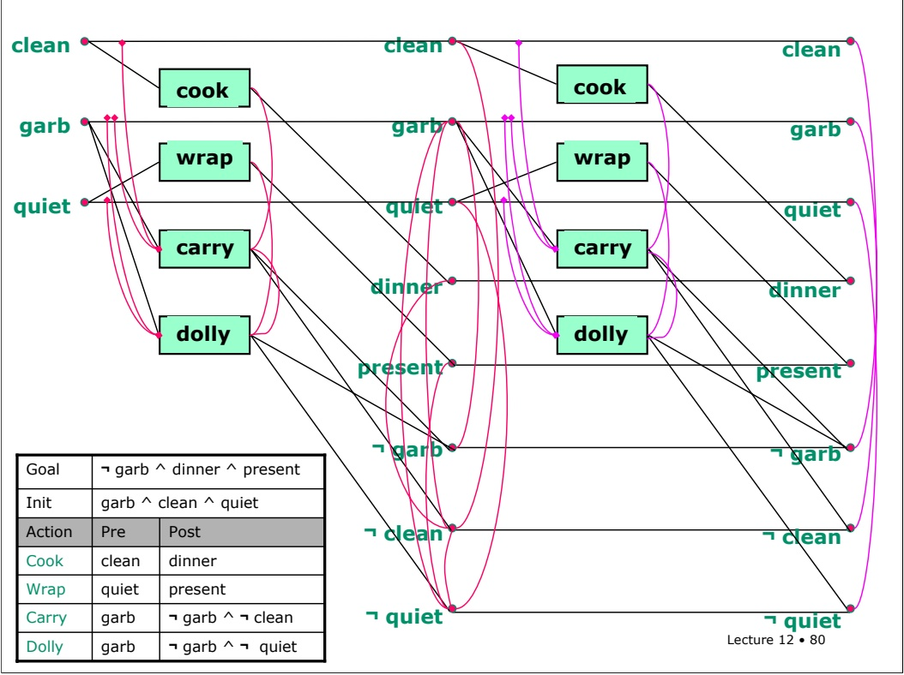

<table><tbody><tr><td>Goal</td><td colspan="2">¬ garb ^ dinner ^ present</td></tr><tr><td>Init</td><td colspan="2">garb ^ clean ^ quiet</td></tr><tr><td>Action</td><td>Pre</td><td>Post</td></tr><tr><td>Cook</td><td>clean</td><td>dinner</td></tr><tr><td>Wrap</td><td>quiet</td><td>present</td></tr><tr><td>Carry</td><td>garb</td><td>¬ garb ^ ¬ clean</td></tr><tr><td>Dolly</td><td>garb</td><td>¬ garb ^ ¬ quiet</td></tr></tbody></table>

So let’s look at the proposition mutexes in layer 4. We still have that every proposition is mutex with its negation.

<!-- page: 81 -->

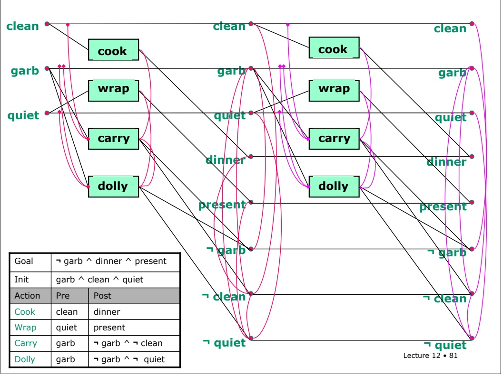

<table><tbody><tr><td>Goal</td><td colspan="2">¬ garb ^ dinner ^ present</td></tr><tr><td>Init</td><td colspan="2">garb ^ clean ^ quiet</td></tr><tr><td>Action</td><td>Pre</td><td>Post</td></tr><tr><td>Cook</td><td>clean</td><td>dinner</td></tr><tr><td>Wrap</td><td>quiet</td><td>present</td></tr><tr><td>Carry</td><td>garb</td><td>¬ garb ^ ¬ clean</td></tr><tr><td>Dolly</td><td>garb</td><td>¬ garb ^ ¬ quiet</td></tr></tbody></table>

And we get some of the same mutexes that we had in the previous proposition layer.

<!-- page: 82 -->

<table><tbody><tr><td>Goal</td><td colspan="2">¬ garb ^ dinner ^ present</td></tr><tr><td>Init</td><td colspan="2">garb ^ clean ^ quiet</td></tr><tr><td>Action</td><td>Pre</td><td>Post</td></tr><tr><td>Cook</td><td>clean</td><td>dinner</td></tr><tr><td>Wrap</td><td>quiet</td><td>present</td></tr><tr><td>Carry</td><td>garb</td><td>¬ garb ^ ¬ clean</td></tr><tr><td>Dolly</td><td>garb</td><td>¬ garb ^ ¬ quiet</td></tr></tbody></table>

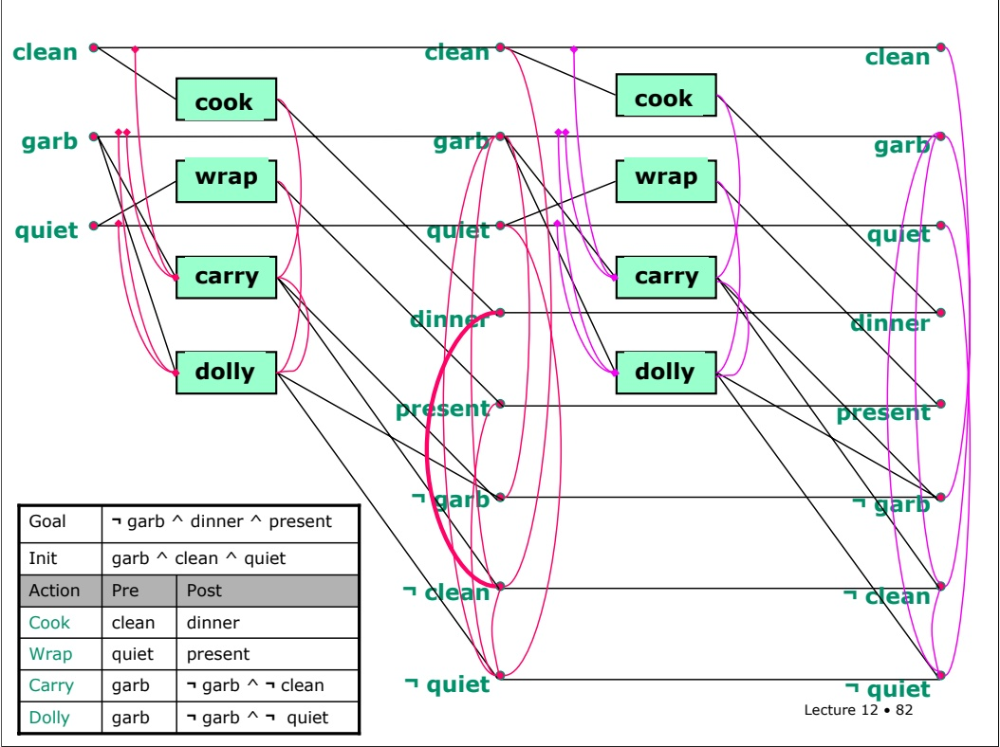

In layer 2, we had a mutex between dinner and not clean. But we don’t have it in layer 4, because it’s possible to make dinner true by maintaining it, and making not clean true by carry. And those two actions are consistent with one another at level 3.

<!-- page: 83 -->

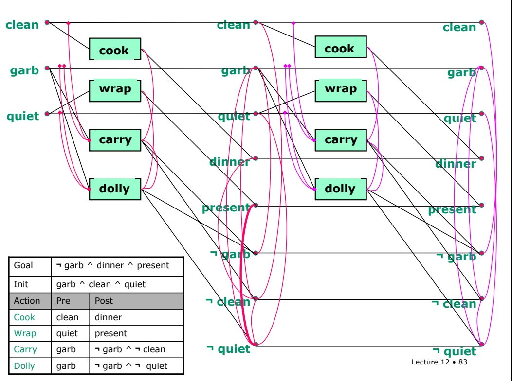

<table><tbody><tr><td>Goal</td><td colspan="2">¬ garb ^ dinner ^ present</td></tr><tr><td>Init</td><td colspan="2">garb ^ clean ^ quiet</td></tr><tr><td>Action</td><td>Pre</td><td>Post</td></tr><tr><td>Cook</td><td>clean</td><td>dinner</td></tr><tr><td>Wrap</td><td>quiet</td><td>present</td></tr><tr><td>Carry</td><td>garb</td><td>¬ garb ^ ¬ clean</td></tr><tr><td>Dolly</td><td>garb</td><td>¬ garb ^ ¬ quiet</td></tr></tbody></table>

Similarly, in layer 2 we had a mutex between present and not quiet. But we don’t have it here because we can make present true by maintaining it and make not quiet true by dolly.

<!-- page: 84 -->


<table><tbody><tr><td>Goal</td><td colspan="2">¬ garb ^ dinner ^ present</td></tr><tr><td>Init</td><td colspan="2">garb ^ clean ^ quiet</td></tr><tr><td>Action</td><td>Pre</td><td>Post</td></tr><tr><td>Cook</td><td>clean</td><td>dinner</td></tr><tr><td>Wrap</td><td>quiet</td><td>present</td></tr><tr><td>Carry</td><td>garb</td><td>¬ garb ^ ¬ clean</td></tr><tr><td>Dolly</td><td>garb</td><td>¬ garb ^ ¬ quiet</td></tr></tbody></table>

It’s important to see that, by giving ourselves an added time step, there are fewer mutexes, and so more things we can accomplish.

<!-- page: 85 -->

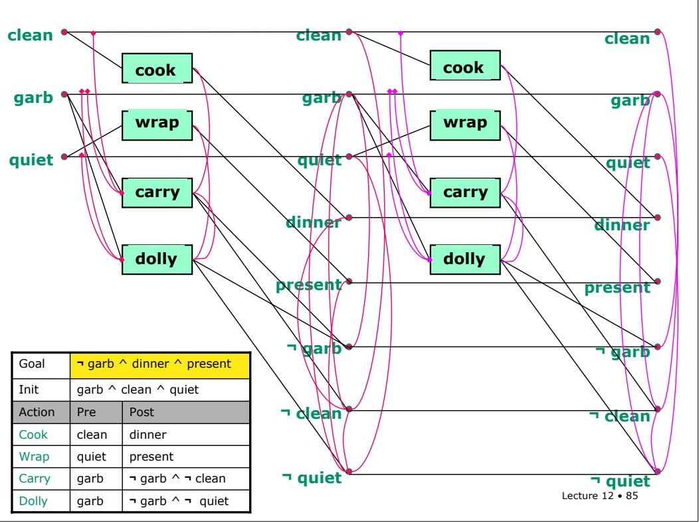

<table><tbody><tr><td>Goal</td><td colspan="2">¬ garb ^ dinner ^ present</td></tr><tr><td>Init</td><td colspan="2">garb ^ clean ^ quiet</td></tr><tr><td>Action</td><td>Pre</td><td>Post</td></tr><tr><td>Cook</td><td>clean</td><td>dinner</td></tr><tr><td>Wrap</td><td>quiet</td><td>present</td></tr><tr><td>Carry</td><td>garb</td><td>¬ garb ^ ¬ clean</td></tr><tr><td>Dolly</td><td>garb</td><td>¬ garb ^ ¬ quiet</td></tr></tbody></table>

Now it’s time to try to find a plan again. All of our goal conditions are present in the last layer, so let’s start searching.

<!-- page: 86 -->

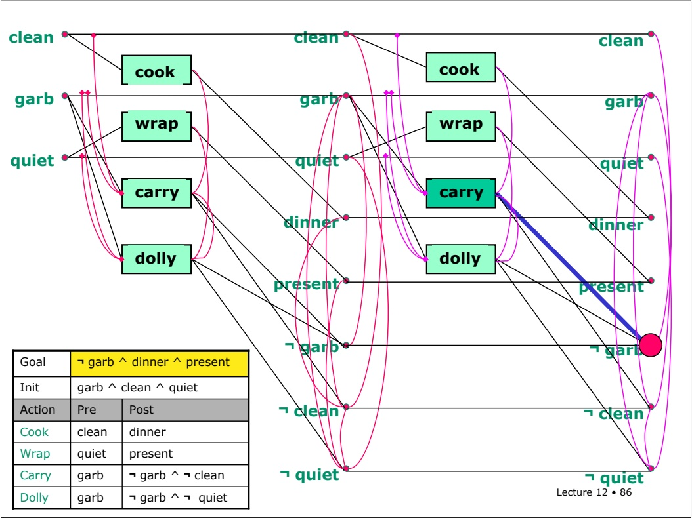

Starting with not garbage, let’s try to satisfy it with carry.

<!-- page: 87 -->

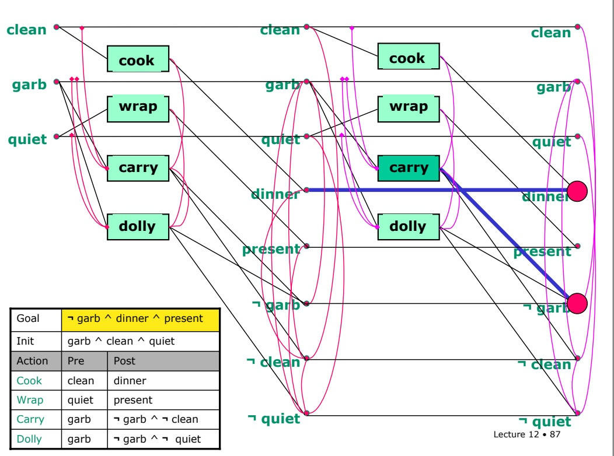

<table><tbody><tr><td>Goal</td><td colspan="2">¬ garb ^ dinner ^ present</td></tr><tr><td>Init</td><td colspan="2">garb ^ clean ^ quiet</td></tr><tr><td>Action</td><td>Pre</td><td>Post</td></tr><tr><td>Cook</td><td>clean</td><td>dinner</td></tr><tr><td>Wrap</td><td>quiet</td><td>present</td></tr><tr><td>Carry</td><td>garb</td><td>¬ garb ^ ¬ clean</td></tr><tr><td>Dolly</td><td>garb</td><td>¬ garb ^ ¬ quiet</td></tr></tbody></table>

Now we need to satisfy dinner. Since we already know that cook won’t be compatible with carry at this level, let’s try maintaining dinner from the previous time step. (Of course, it’s hard to make a computer as clever as we are, but these are the kinds of tricks that people do when they’re making a planner really work efficiently).

<!-- page: 88 -->

<table><tbody><tr><td>Goal</td><td colspan="2">¬ garb ^ dinner ^ present</td></tr><tr><td>Init</td><td colspan="2">garb ^ clean ^ quiet</td></tr><tr><td>Action</td><td>Pre</td><td>Post</td></tr><tr><td>Cook</td><td>clean</td><td>dinner</td></tr><tr><td>Wrap</td><td>quiet</td><td>present</td></tr><tr><td>Carry</td><td>garb</td><td>¬ garb ^ ¬ clean</td></tr><tr><td>Dolly</td><td>garb</td><td>¬ garb ^ ¬ quiet</td></tr></tbody></table>

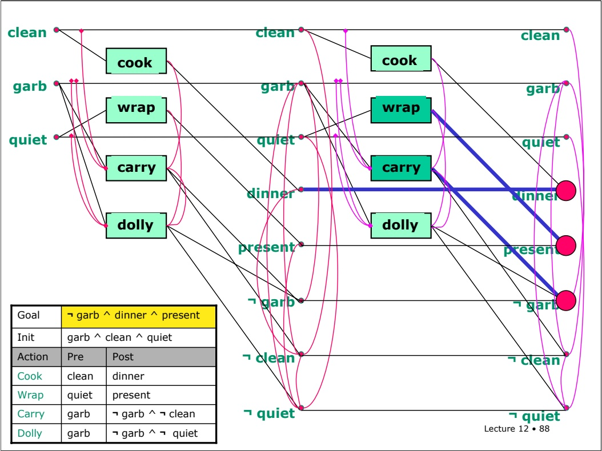

Last, we need to satisfy present. Let’s try doing it with wrap.

<!-- page: 89 -->

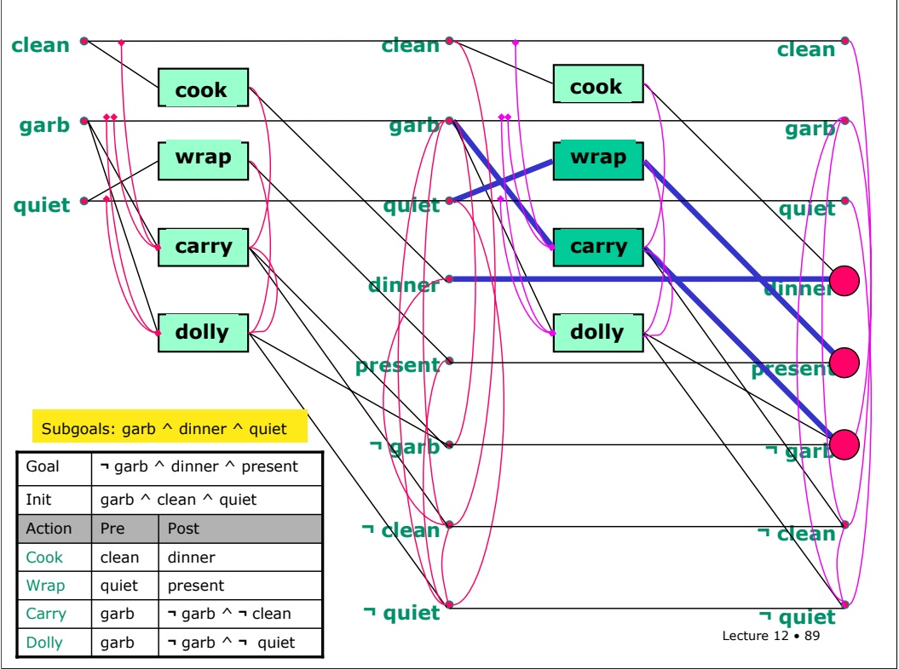

We found a way to satisfy all of our conditions at level 4. So now we have to take all the preconditions of the actions we picked and see if we can satisfy them at level 2. Now our subgoals are garbage and dinner and quiet.

<!-- page: 90 -->

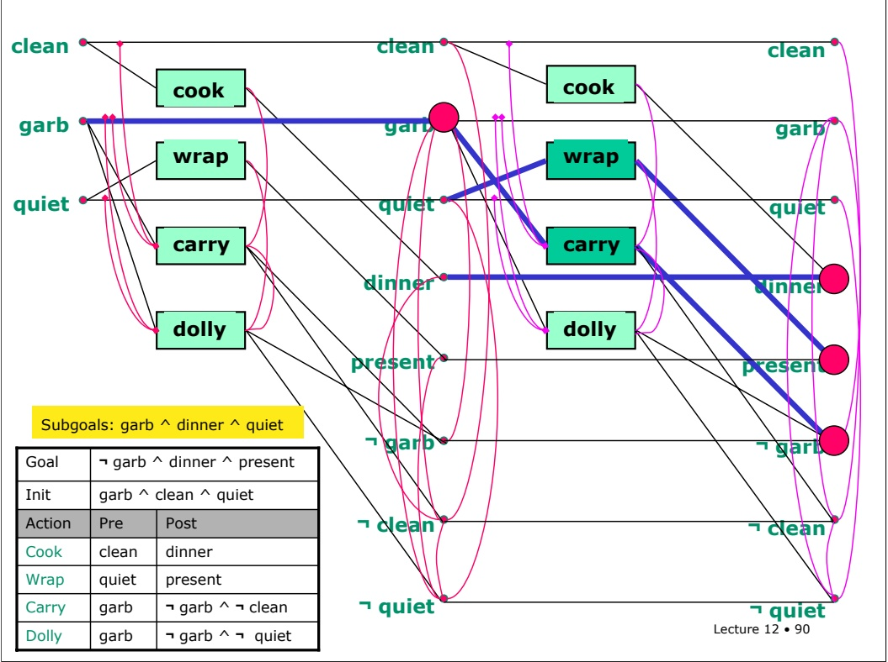

Let’s start by satisfying garbage by maintaining it. (We don’t have any way to make garbage. Though usually when I cook, it makes garbage!).

<!-- page: 91 -->

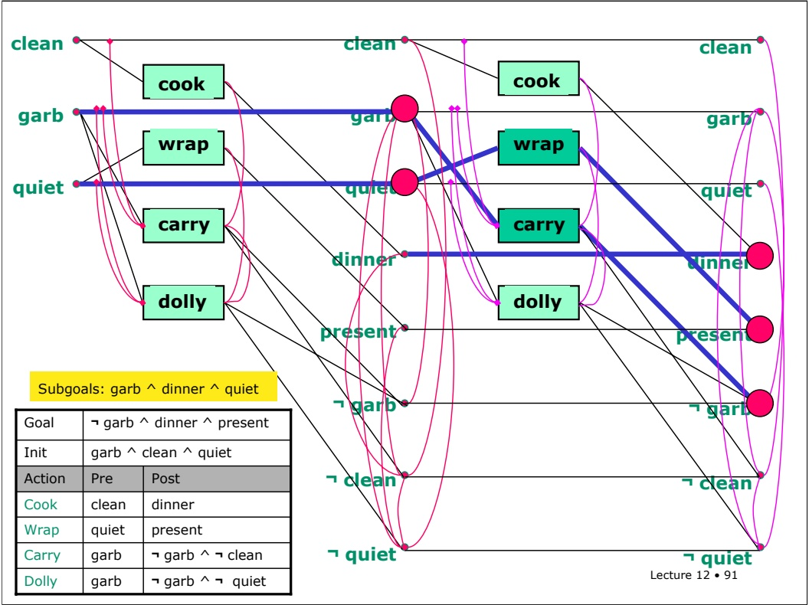

We can also easily satisfy quiet by maintaining it.

<!-- page: 92 -->

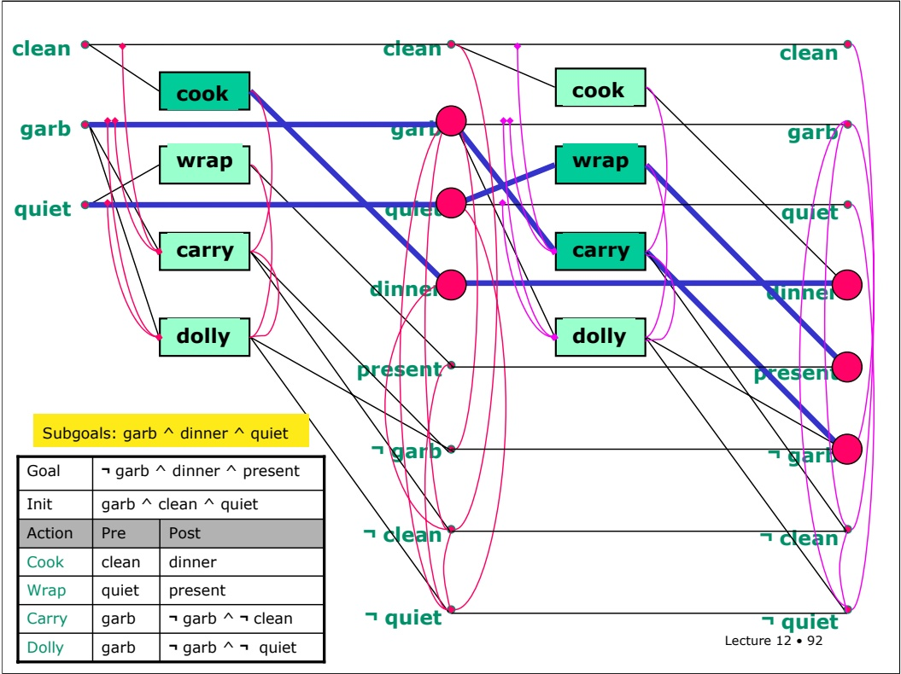

And we can satisfy dinner with the cook action.

<!-- page: 93 -->

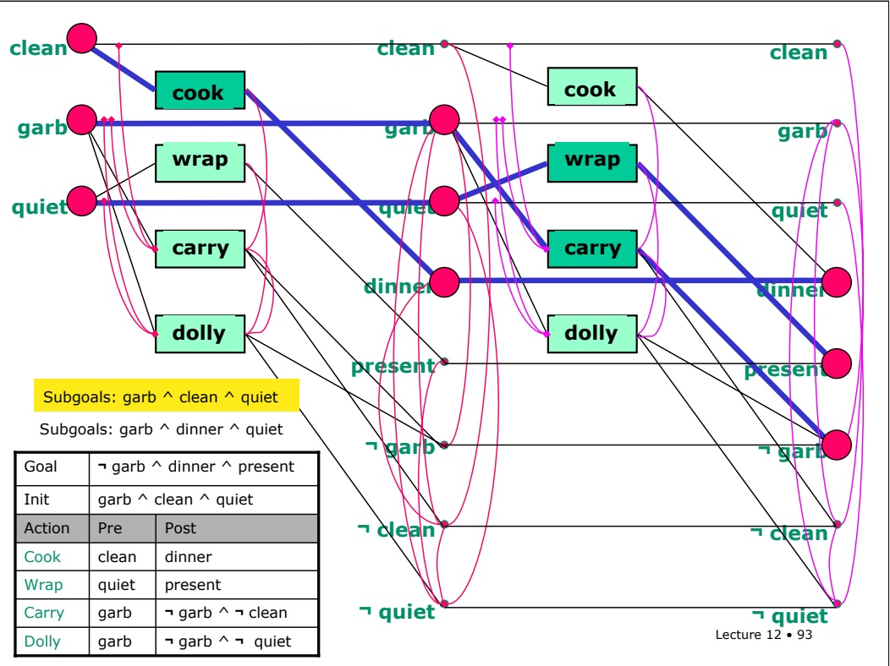

Now we have to be sure that we can satisfy all of these preconditions at level 0. Our subgoals now are garbage, clean, and wrap. They’re all true at level 0, so we’re done! There were actually a lot of plans that would have worked, but here’s one of them. If we’re going to do actions in order, this plan will allow us to do cook then wrap then carry, or cook then carry, then wrap. The crucial thing is that it forces us to do cook before carry, which we couldn’t enforce in a depth 1 plan.

<!-- page: 94 -->

# Extensions

So the thing is, you can take a planning problem and even a pretty big planning problem, even some of these blocks-world planning problems where the operating descriptions have variables in them, and feed it into GraphPlan. All you have to do is say, "Here's my limited domain of discourse: I have these six blocks or these five blocks or these twelve blocks." Then you just turn a crank and generate all the propositions and you generate these graphs that are really big. I mean, you still at every level, you just have all the possible propositions. Now, the place where something exponential happens is in the search for a solution within the graph. That might turn out to be fairly complicated. Even so, optimized versions of GraphPlan have been very successful in planning competitions.

<!-- page: 95 -->

## Extensions

• Lots of time optimizations

Lecture 12 • 95

There are lots of possible extensions to graphplan, which are discussed in detail in the Weld paper. In particular, we’ve talked about a pretty naïve way of implementing the algorithm. there are a lot of computational optimizations possible, that will really make it work much faster.

<!-- page: 96 -->

## Extensions

• Lots of time optimizations

• Disjunctive preconditions

• Universally quantified (sort of) preconditions and effects

Lecture 12 • 96

In addition, people have extended graphplan to deal with disjuctive preconditions and with a kind of universally quantified preconditions and effects. The universal quantification is really just a kind of finite quantification over all objects in the domain of discourse.

<!-- page: 97 -->

Finally, there are extensions to conditional planning, which we’ll talk about at least a little bit in the next lecture.
