<!-- page: 1 -->

Last time, we talked about probability, in general, and conditional probability. This time, I want to give you an introduction to Bayesian networks and then we'll talk about doing inference on them and then we'll talk about learning in them in later lectures.

<!-- page: 2 -->

The idea is that if you have a complicated domain, with many different propositional variables, then to really know everything about what's going on, you need to know the joint probability distribution over all those variables.

<!-- page: 3 -->

But if you have N binary variables, then there are $2  { \mathbb { n } }$ possible assignments, and the joint probability distribution requires a number for each one of those possible assignments.

<!-- page: 4 -->

The intuition is that there's almost always some separability between the variables, some independence, so that you don't actually have to know all of those $2  { \mathbb { n } }$ numbers in order to know what's going on in the world. That's the idea behind Bayesian networks.

<!-- page: 5 -->

## 6.825 Techniques in Artificial Intelligence

## Bayesian Networks

• To do probabilistic reasoning, you need to know the joint probability distribution

• But, in a domain with N propositional variables, one needs 2N numbers to specify the joint probability distribution

• We want to exploit independences in the domain

• Two components: structure and numerical parameters

Lecture 15 • 5

Bayesian networks have two components. The first component is called the "causal component." It describes the structure of the domain in terms of dependencies between variables, and then the second part is the actual numbers, the quantitative part. So we'll start looking at the structural part and then we'll look at the quantitative part.

<!-- page: 6 -->

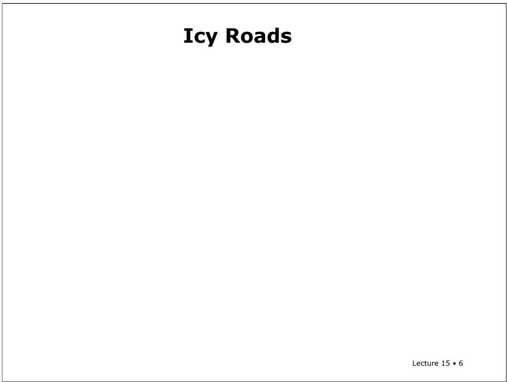

Let’s start by going through a couple of examples. Consider the following case:

<!-- page: 7 -->

# Icy Roads

Inspector Smith is waiting for Holmes and Watson, who are driving (separately) to meet him. It is winter. His secretary tells him that Watson has had an accident. He says, “It must be that the roads are icy. I bet that Holmes will have an accident too. I should go to lunch.” But, his secretary says, “No, the roads are not icy, look at the window.” So, he says, “I guess I better wait for Holmes.”

Lecture 15 • 7

Inspector Smith is sitting in his study, waiting for Holmes and Watson to show up in order to talk to them about something, and it's winter and he's wondering if the roads are icy. He's worried that they might crash. Then his secretary comes in and tells him that Watson has had an accident. He says, "Hmm, Watson had an accident. Gosh, it must be that the roads really are icy. Ha! I bet Holmes is going to have an accident, too. They're never going to get here. I'll go have my lunch."

Then the secretary says to him, "No, no. The roads aren't icy. Look out the window. It's not freezing and they'd put sand on the roads anyway." So he says, "Oh, OK. I guess I better wait for Holmes to show up."

<!-- page: 8 -->

## Icy Roads

Inspector Smith is waiting for Holmes and Watson, who are driving (separately) to meet him. It is winter. His secretary tells him that Watson has had an accident. He says, “It must be that the roads are icy. I bet that Holmes will have an accident too. I should go to lunch.” But, his secretary says, “No, the roads are not icy, look at the window.” So, he says, “I guess I better wait for Holmes.”

“Causal” Component

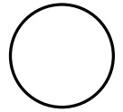

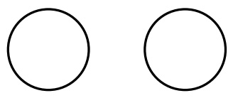

Lecture 15 • 8

How could we model that using a little Bayesian network? The idea is that we have three propositions.

<!-- page: 9 -->

We have Are the roads icy? which we’ll represent with the node labeled "Icy." We have "Holmes Crash." And we have "Watson Crash."

<!-- page: 10 -->

# Icy Roads

Inspector Smith is waiting for Holmes and Watson, who are driving (separately) to meet him. It is winter. His secretary tells him that Watson has had an accident. He says, “It must be that the roads are icy. I bet that Holmes will have an accident too. I should go to lunch.” But, his secretary says, “No, the roads are not icy, look at the window.” So, he says, “I guess I better wait for Holmes.”

“Causal” Component

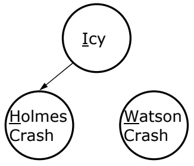

Lecture 15 • 10

The inspector is thinking about the relationships between these variables, and he's got sort of a causal model of what's going on in the world. He thinks that if it's icy, it's more likely that Holmes is going to crash.

<!-- page: 11 -->

Lecture 15 • 11

# Icy Roads

Inspector Smith is waiting for Holmes and Watson, who are driving (separately) to meet him. It is winter. His secretary tells him that Watson has had an accident. He says, “It must be that the roads are icy. I bet that Holmes will have an accident too. I should go to lunch.” But, his secretary says, “No, the roads are not icy, look at the window.” So, he says, “I guess I better wait for Holmes.”

“Causal” Component

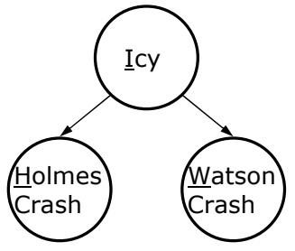

And also, if it's icy, it's more likely that Watson is going to crash.

<!-- page: 12 -->

# Icy Roads

Inspector Smith is waiting for Holmes and Watson, who are driving (separately) to meet him. It is winter. His secretary tells him that Watson has had an accident. He says, “It must be that the roads are icy. I bet that Holmes will have an accident too. I should go to lunch.” But, his secretary says, “No, the roads are not icy, look at the window.” So, he says, “I guess I better wait for Holmes.”

“Causal” Component

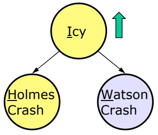

Lecture 15 • 12

The inspector starts out with some initial beliefs about what's going on. Then, the secretary tells him that Watson crashed. And then he does some reasoning that says, "Well, if Icy is the cause of Watson crashing, and Watson really did crash, then it’s more likely that it really is Icy outside.”

<!-- page: 13 -->

# Icy Roads

Inspector Smith is waiting for Holmes and Watson, who are driving (separately) to meet him. It is winter. His secretary tells him that Watson has had an accident. He says, “It must be that the roads are icy. I bet that Holmes will have an accident too. I should go to lunch.” But, his secretary says, “No, the roads are not icy, look at the window.” So, he says, “I guess I better wait for Holmes.”

“Causal” Component

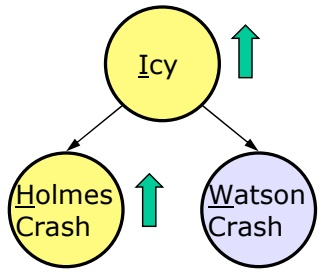

Lecture 15 • 13

And, therefore, it’s also more likely that Holmes will crash, too.

<!-- page: 14 -->

So even though we had this picture with some sort of causal arrows going down from I to H and W, it seems like information can flow back up through the arrows in the other direction.

<!-- page: 15 -->

Now, when the secretary says "No, the roads aren't icy," then knowing that Watson crashed, doesn’t really have any influence on our belief that Holmes will crash, and our belief that it’s true goes back down.

<!-- page: 16 -->

Using the concepts of last lecture, we can say that all of these variables are individually dependent on one another, but that H and W are conditionally independent given I. Once we know the value for I, W doesn’t tell us anything about H.

<!-- page: 17 -->

# Holmes and Watson in LA

Holmes and Watson have moved to LA. He wakes up to find his lawn wet. He wonders if it has rained or if he left his sprinkler on. He looks at his neighbor Watson’s lawn and he sees it is wet too. So, he concludes it must have rained.

Lecture 15 • 17

Let's do another one. Holmes has moved to Los Angeles, and his grass is wet, which is a real surprise in L.A. And he wonders if it's because it rained or because he left the sprinkler on. Then he goes and he looks and he sees that his neighbor Watson's grass is also wet. So that makes him think it's been raining, because rain would cause them both to be wet. And it, then, decreases his belief that the sprinkler was on.

<!-- page: 18 -->

Lecture 15 • 18

# Holmes and Watson in LA

Holmes and Watson have moved to LA. He wakes up to find his lawn wet. He wonders if it has rained or if he left his sprinkler on. He looks at his neighbor Watson’s lawn and he sees it is wet too. So, he concludes it must have rained.

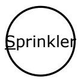

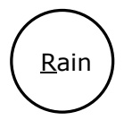

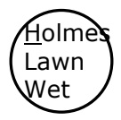

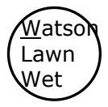

Now we can draw a picture of that. You might have nodes for the 4 propositional random variables for: "Sprinkler on." "Rain". "Holmes' lawn wet." and “Watson lawn wet.”

<!-- page: 19 -->

# Holmes and Watson in LA

Holmes and Watson have moved to LA. He wakes up to find his lawn wet. He wonders if it has rained or if he left his sprinkler on. He looks at his neighbor Watson’s lawn and he sees it is wet too. So, he concludes it must have rained.

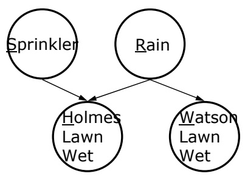

Lecture 15 • 19

We can connect them together to reflect the causal dependencies in the world. Both sprinkler and rain would cause Holmeses lawn to be wet. Just rain (or maybe some other un-modeled cause) would cause Watson’s lawn to be wet.

<!-- page: 20 -->

# Holmes and Watson in LA

Holmes and Watson have moved to LA. He wakes up to find his lawn wet. He wonders if it has rained or if he left his sprinkler on. He looks at his neighbor Watson’s lawn and he sees it is wet too. So, he concludes it must have rained.

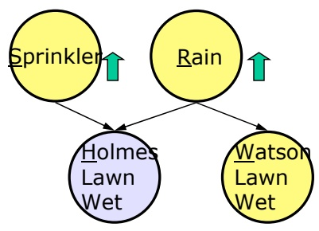

Lecture 15 • 20

Now, the way that this story goes is, we observe that Holmeses lawn is wet. We come out and we see that the lawn is wet and so from that, we believe that Sprinkler and Rain are both more likely.

<!-- page: 21 -->

# Holmes and Watson in LA

Holmes and Watson have moved to LA. He wakes up to find his lawn wet. He wonders if it has rained or if he left his sprinkler on. He looks at his neighbor Watson’s lawn and he sees it is wet too. So, he concludes it must have rained.

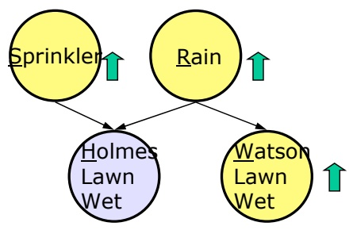

Lecture 15 • 21

Now, it also is true that without observing Watson's lawn, if Holmes sees that his own lawn is wet, he's going to believe that it's more likely that Watson's lawn is wet, too. That’s because the cause, Rain, becomes more likely and, therefore, this symptom, Watson’s lawn being wet, becomes more likely too.

<!-- page: 22 -->

# Holmes and Watson in LA

Holmes and Watson have moved to LA. He wakes up to find his lawn wet. He wonders if it has rained or if he left his sprinkler on. He looks at his neighbor Watson’s lawn and he sees it is wet too. So, he concludes it must have rained.

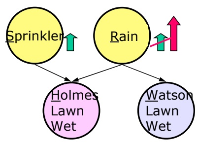

Given W, P(R) goes up

Lecture 15 • 22

Now when he goes and observes Watson's lawn and sees that it is wet also, the probability of rain goes way up because, notice, there are two pieces of corroborating evidence.

<!-- page: 23 -->

# Holmes and Watson in LA

Holmes and Watson have moved to LA. He wakes up to find his lawn wet. He wonders if it has rained or if he left his sprinkler on. He looks at his neighbor Watson’s lawn and he sees it is wet too. So, he concludes it must have rained.

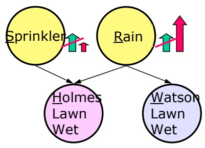

Given W, P(R) goes up and P(S) goes down – “explaining away”

Lecture 15 • 23

And, interestingly enough, the probability that the sprinkler was on comes down. This is a phenomenon called "explaining away." Later on we’ll do this example with the numbers, so you can see how it comes out mathematically. But it's sort of intuitive because you have two potential causes, each of which becomes more likely when you see the symptom; but once you pick a cause, then the other cause's probability goes back down.

<!-- page: 24 -->

# Forward Serial Connection

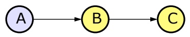

• Transmit evidence from A to C through unless B is instantiated (its truth value is known)

• Knowing about A will tell us something about C

Lecture 15 • 24

Now we’ll go through all the ways three nodes can be connected and see how evidence can be transmitted through them. First, let’s think about a serial connection, in which a points to b which points to c. And let’s assume that b is uninstantiated. Then, when we get evidence about A (either by instantiating it, or having it flow to A from some other node), it flows through B to C.

(In this and other slides in this lecture, I’ll color a node light blue/gray if it’s the one where evidence is arriving, and color other nodes yellow to show where that evidence propagates. As we’ll see in a minute, I’ll use pink for a node that is instantiated, or that has a child that is instantiated.)

<!-- page: 25 -->

# Forward Serial Connection

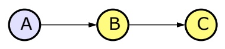

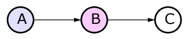

• Transmit evidence from A to C through unless B is instantiated (its truth value is known)

• Knowing about A will tell us something about C • But, if we know B, then knowing about A will not tell us anything new about C.

Lecture 15 • 25

If B is instantiated, then evidence does not propagate through from A to C.

<!-- page: 26 -->

# Forward Serial Connection

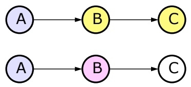

• Transmit evidence from A to C through unless B is instantiated (its truth value is known)

• A = battery dead

• B = car won’t start

• C = car won’t move

• Knowing about A will tell us something about C

• But, if we know B, then knowing about A will not tell us anything new about C.

Lecture 15 • 26

So what's an example of this? Well, the battery's dead, so the car won't start, so the car won't move. So finding out that the battery's dead gives you information about whether the car will move or not. But if you know the car won’t start, then knowing about the battery doesn’t give you any information about whether it will move or not.

<!-- page: 27 -->

# Backward Serial Connection

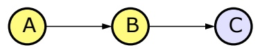

• Transmit evidence from C to A through unless B is instantiated (its truth value is known)

• Knowing about C will tell us something about A

Lecture 15 • 27

What if we have the same set of connections, but our evidence arrives at node C rather than node A? The evidence propagates backward up serial links as long as the intermediate node is not instantiated.

<!-- page: 28 -->

# Backward Serial Connection

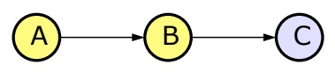

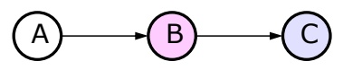

• Transmit evidence from C to A through unless B is instantiated (its truth value is known)

• Knowing about C will tell us something about A • But, if we know B, then knowing about C will not tell us anything new about A

Lecture 15 • 28

If the intermediate node is instantiated, then evidence does not propagate.

<!-- page: 29 -->

## Backward Serial Connection

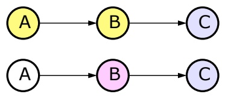

• Transmit evidence from C to A through unless B is instantiated (its truth value is known)

• A = battery dead

• B = car won’t start

• C = car won’t move

• Knowing about C will tell us something about A

• But, if we know B, then knowing about C will not tell us anything new about A

Lecture 15 • 29

So, finding out that the car won’t move tells you something about whether it will start, which tells you something about the battery. But if you know the car won’t start, then finding out that it won’t move, doesn’t give you any information about the battery.

<!-- page: 30 -->

In a diverging connection, there are arrows going from B to A and from B to C. Now, the question is, if we get evidence at A, what other nodes does it effect? If B isn’t instantiated, it propagates through to C.

<!-- page: 31 -->

But if B is instantiated, as before, then the propagation is blocked.

<!-- page: 32 -->

## Diverging Connection

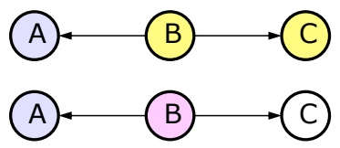

• Transmit evidence through B unless it is instantiated

• A = Watson crash

• B = Icy

• C = Holmes crash

• Knowing about A will tell us something about C

• Knowing about C will tell us something about A

• But, if we know B, then knowing about A will not tell us anything new about C, or vice versa

Lecture 15 • 32

This is exactly the form of the icy roads example. Before we know whether the roads are icy, knowing that Watson crashed tells us something about whether Holmes will crash. But once we know the value of Icy, the information doesn’t propagate.

<!-- page: 33 -->

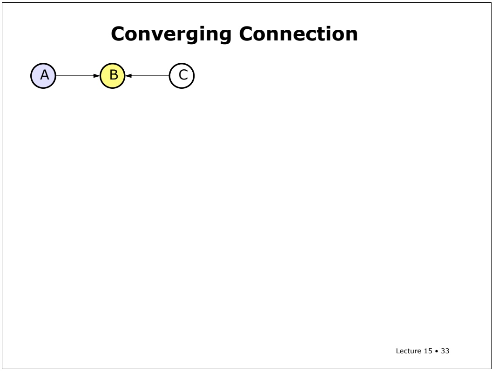

The tricky case is when we have a converging connection: A points to B and C points to B.

<!-- page: 34 -->

# Converging Connection

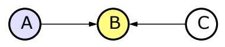

• Transmit evidence from A to C only if B or a descendant of B is instantiated

• Without knowing B, finding A does not tell us anything about B

Lecture 15 • 34

Let’s first think about the case when neither B nor any of its descendants is instantiated. In that case, evidence does not propagate from A to C.

<!-- page: 35 -->

## Converging Connection

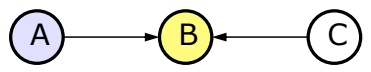

• Transmit evidence from A to C only if B or a descendant of B is instantiated

• A = Bacterial infection

• B = Sore throat

• C = Viral Infection

• Without knowing B, finding A does not tell us anything about B

Lecture 15 • 35

This network structure arises when, for example, you have one symptom, say “sore throat”, which could have multiple causes, for example, a bacterial infection or a viral infection. If you find that someone has a bacterial infection, it gives you information about whether they have a sore throat, but it doesn’t affect the probability that they have a viral infection also.

<!-- page: 36 -->

## Converging Connection

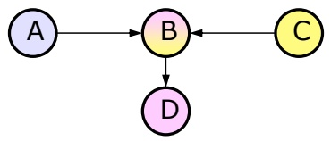

• Transmit evidence from A to C only if B or a descendant of B is instantiated

• A = Bacterial infection

• B = Sore throat

• C = Viral Infection

• Without knowing B, finding A does not tell us anything about B

• If we see evidence for B, then A and C become dependent (potential for “explaining away”).

Lecture 15 • 36

But when either node B is instantiated, or one of its descendants is, then we know something about whether B is true. And in that case, information **does** propagate through from A to C. I colored node B partly pink here to indicate that, although it’s not instantiated, one of its descendants is.

<!-- page: 37 -->

## Converging Connection

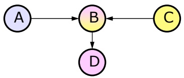

• Transmit evidence from A to C only if B or a descendant of B is instantiated

• A = Bacterial infection

• B = Sore throat

• C = Viral Infection

• Without knowing B, finding A does not tell us anything about B

• If we see evidence for B, then A and C become dependent (potential for “explaining away”). If we find bacteria in patient with a sore throat, then viral infection is less likely.

Lecture 15 • 37

So, if we know that you have a sore throat, then finding out that you have a bacterial infection causes us to think it’s less likely that you have a viral infection. This is the same sort of reasoning as we had in the wet lawn example, as well. We had a converging connection from Rain to Holmeses lawn to Sprinkler. We saw that Holmes’s lawn was wet. So, then, when we saw that Watson’s lawn was wet, the information propagated through the diverging connection through Rain to Holmes, and then through the converging connection through Holmes to Sprinkler. If we hadn’t had evidence about Holmeses lawn, then seeing that Watson’s lawn was wet wouldn’t have affected our belief in the sprinkler’s having been on.

<!-- page: 38 -->

## Converging Connection

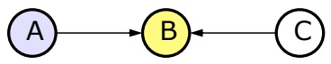

• Transmit evidence from A to C only if B or a descendant of B is instantiated

• A = Bacterial infection

• B = Sore throat

• C = Viral Infection

• Without knowing B, finding A does not tell us anything about B

• If we see evidence for B, then A and C become dependent (potential for “explaining away”). If we find bacteria in patient with a sore throat, then viral infection is less likely.

Lecture 15 • 38

So, serial connections and diverging connections are essentially the same, in terms of evidence propagation, and you can generally turn the arrows around in a Bayesian network, as long as you never create or destroy any converging connections.

<!-- page: 39 -->

## Converging Connection

• Transmit evidence from A to C only if B or a descendant of B is instantiated

• A = Bacterial infection

• B = Sore throat

• C = Viral Infection

• Without knowing B, finding A does not tell us anything about B

• If we see evidence for B, then A and C become dependent (potential for “explaining away”). If we find bacteria in patient with a sore throat, then viral infection is less likely.

Lecture 15 • 39

I’ve been using this language of causes and effects, of causes and symptoms. It gives us an interpretation of these arrows that makes them more intuitive for humans to specify. You can use these nodes and arrows to specify relationships that aren't causal but, a very intuitive way to use this notation is to try to make the arrows kind of correspond to causation.

<!-- page: 40 -->

# D-separation

Now we’re ready to define, based on these three cases, a general notion of how information can propagate or be blocked from propagation through a network. If two variables are d-separated, then changing the uncertainty on one does not change the uncertainty on the other.

<!-- page: 41 -->

Two variables a and b are -"d-separated" if and only if for every path between them, there is an intermediate variable V such that either: the connection is (serial or diverging) and v is known; or the connection is converging and neither v nor any descendant has evidence.

<!-- page: 42 -->

The opposite of "d-separated," not d-separated, we'll call "d-connected."

<!-- page: 43 -->

## D-separation

• Two variables A and B are d-separated iff for every path between them, there is an intermediate variable V such that either

• The connection is serial or diverging and V is known

• The connection is converging and neither V nor any descendant is instantiated

• Two variables are d-connected iff they are not d-separated

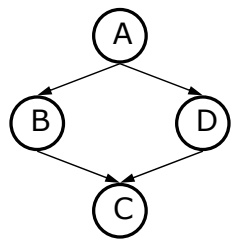

Lecture 15 • 43

We’ll spend some time understanding the d-separation relations in this network.

<!-- page: 44 -->

The connection ABC is serial. It’s blocked when B is known and connected otherwise. When it’s connected, information can flow from A to C or from C to A.

<!-- page: 45 -->

## D-separation

• Two variables A and B are d-separated iff for every path between them, there is an intermediate variable V such that either

• The connection is serial or diverging and V is known

• The connection is converging and neither V nor any descendant is instantiated

• Two variables are d-connected iff they are not d-separated

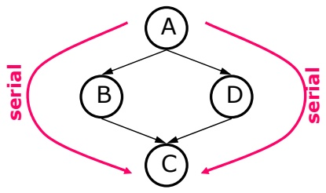

• A-B-C: serial, blocked when B is known, connected otherwise

• A-D-C: serial, blocked when D is known, connected otherwise

Lecture 15 • 45

The connection ADC is the same.

<!-- page: 46 -->

## D-separation

• Two variables A and B are d-separated iff for every path between them, there is an intermediate variable V such that either

• The connection is serial or diverging and V is known

• The connection is converging and neither V nor any descendant is instantiated

• Two variables are d-connected iff they are not d-separated

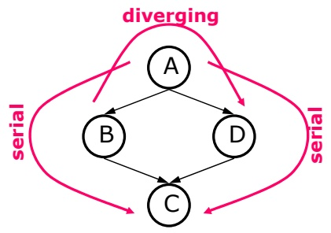

• A-B-C: serial, blocked when B is known, connected otherwise

• A-D-C: serial, blocked when D is known, connected otherwise

• B-A-D: diverging, blocked when A is known, connected otherwise

Lecture 15 • 46

The connection BAD is diverging. It’s blocked when A is known and connected otherwise.

<!-- page: 47 -->

## D-separation

• Two variables A and B are d-separated iff for every path between them, there is an intermediate variable V such that either

• The connection is serial or diverging and V is known

• The connection is converging and neither V nor any descendant is instantiated

• Two variables are d-connected iff they are not d-separated

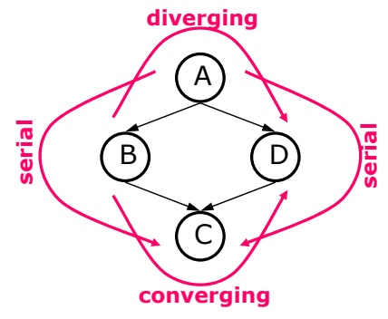

• A-B-C: serial, blocked when B is known, connected otherwise

• A-D-C: serial, blocked when D is known, connected otherwise

• B-A-D: diverging, blocked when A is known, connected otherwise

• B-C-D: converging, blocked when C has no evidence, connected otherwise

Lecture 15 • 47

The connection BCD is converging. Remember, this is the case that’s different. It’s blocked when C has no evidence, but connected otherwise.

<!-- page: 48 -->

# D-Separation Detail

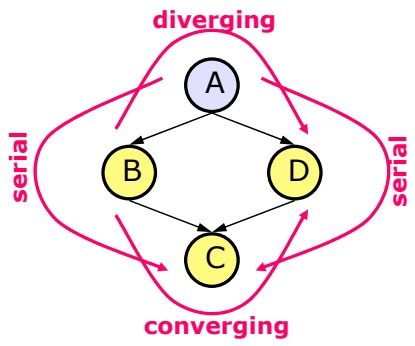

• A-B-C: serial, blocked when B is known, connected otherwise

• A-D-C: serial, blocked when D is known, connected otherwise

• B-A-D: diverging, blocked when A is known, connected otherwise

• B-C-D: converging, blocked when C has no evidence, connected otherwise

Lecture 15 • 48

The next few slides have a lot of detailed examples of d-separation. If you understand the concept well, you can just skip over them. Remember that we’re using pink to mean a node is instantiated. The node where information is entering is colored blue, and the nodes to which it propagates are colored yellow.

<!-- page: 49 -->

What happens when none of the nodes are instantiated? Information at A flows through B to C and through D to C.

<!-- page: 50 -->

Information at B flows through A to D, but it does not flow through C to D (though it does give us information about C).

<!-- page: 51 -->

## D-Separation Detail

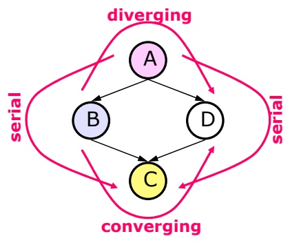

• A-B-C: serial, blocked when B is known, connected otherwise

• A-D-C: serial, blocked when D is known, connected otherwise

• B-A-D: diverging, blocked when A is known, connected otherwise

• B-C-D: converging, blocked when C has no evidence, connected otherwise • A, C are d-connected (A-B-C connected, A-D-C connected)

• B, D are d-connected (B-A-D connected, B-C-D blocked)

• A instantiated

• B, D are d-separated (B-A-D blocked, B-C-D blocked)

Lecture 15 • 51

Now, let’s think about what happens when A is instantiated. B and D are dseparated. Information at B doesn’t flow through A, because it’s instantiated and it’s a diverging connection. And it doesn’t flow through C because it’s not instantiated and it’s a converging connection. So information about B gives us information about C, but it doesn’t flow through to D.

<!-- page: 52 -->

## D-Separation Detail

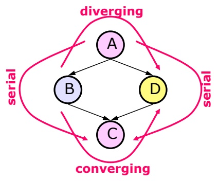

• A-B-C: serial, blocked when B is known, connected otherwise

• A-D-C: serial, blocked when D is known, connected otherwise

• B-A-D: diverging, blocked when A is known, connected otherwise

• B-C-D: converging, blocked when C has no evidence, connected otherwise

• No instantiation

• A, C are d-connected (A-B-C connected, A-D-C connected)

• B, D are d-connected (B-A-D connected, B-C-D blocked)

• A instantiated

• B, D are d-separated (B-A-D blocked, B-C-D blocked)

• A and C instantiated

• B, D are d-connected (B-A-D blocked, B-C-D connected)

Lecture 15 • 52

When both A and C are instantiated, B and D become d-connected, because now information can flow through C.

<!-- page: 53 -->

## D-Separation Detail

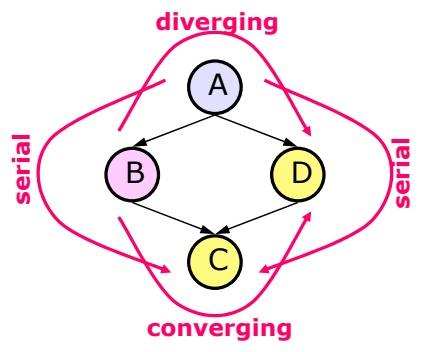

• A-B-C: serial, blocked when B is known, connected otherwise

• A-D-C: serial, blocked when D is known, connected otherwise

• B-A-D: diverging, blocked when A is known, connected otherwise

• B-C-D: converging, blocked when C has no evidence, connected otherwise

## • No instantiation

• A, C are d-connected (A-B-C connected, A-D-C connected)

• B, D are d-connected (B-A-D connected, B-C-D blocked)

• A instantiated

• B, D are d-separated (B-A-D blocked, B-C-D blocked)

• A and C instantiated • B, D are d-connected (B-A-D blocked, B-C-D connected)

• B instantiated

• A, C are d-connected (A-B-C blocked, A-D-C connected)

Lecture 15 • 53

When just B is instantiated, then evidence at A flows through D to C (and, of course, backwards from C through D to A).

<!-- page: 54 -->

## D-Separation Detail

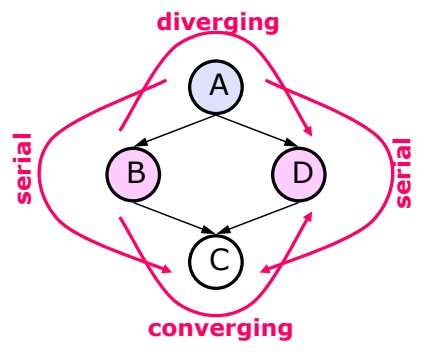

• A-B-C: serial, blocked when B is known, connected otherwise

• A-D-C: serial, blocked when D is known, connected otherwise

• B-A-D: diverging, blocked when A is known, connected otherwise

• B-C-D: converging, blocked when C has no evidence, connected otherwise

• No instantiation

• A, C are d-connected (A-B-C connected, A-D-C connected)

• B, D are d-connected (B-A-D connected, B-C-D blocked)

• A instantiated

• B, D are d-separated (B-A-D blocked, B-C-D blocked)

• A and C instantiated

• B, D are d-connected (B-A-D blocked, B-C-D connected)

• B instantiated

$\mathbb { A } _ { r }$ C are d-connected (A-B-C blocked, A-D-C connected)

• B and D instantiated

• A, C are d-separated (A-B-C blocked, A-D-C blocked)

Lecture 15 • 54

Finally, if B and D are both instantiated, then A and C are d-separated. There are two paths from A to C, but they’re both blocked.

<!-- page: 55 -->

D-Separation Example

Given M is known, is A d-separated from E?

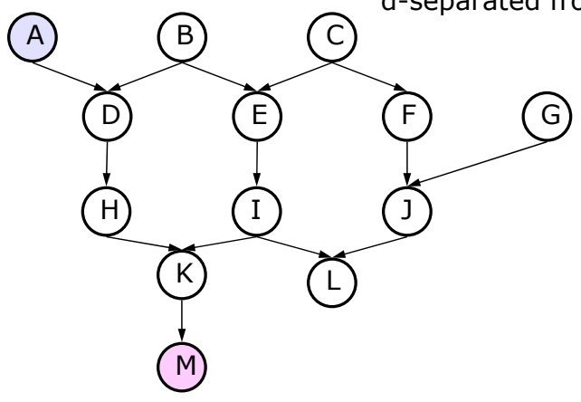

Okay. Here’s a bigger Bayesian network. Let’s consider a case in which M is known. Is A d-separated from E?

<!-- page: 56 -->

D-Separation Example

Given M is known, is A d-separated from E?

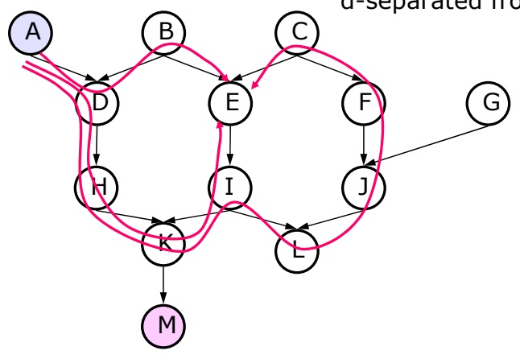

Remember, they are d-separated if all the paths between A and E are blocked. So, let’s start by finding all the paths from A to E. There are three possible paths.

<!-- page: 57 -->

Now, let’s remind ourselves which nodes have a descendent that’s instantiated, by coloring them half pink.

<!-- page: 58 -->

So, what about the path ADHKILJFCE. Is it blocked? Yes, because ILJ is a converging connection and L is has no evidence.

<!-- page: 59 -->

## D-Separation Example

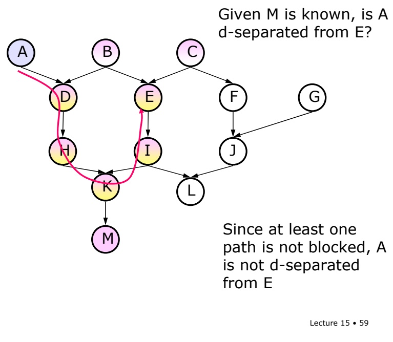

Okay. Now, what about path ADHKIE? Is it blocked? No. ADHK is all serial connections, and although those nodes have received some evidence from M, they are not instantiated, so information propagates. HKI is a converging connection, but because K has evidence, then information propagates to I. Finally, KIE is a (backward) serial connection, so information propagates all the way around. Once we find one non-blocked path from A to E, then we know they’re d-connected.

<!-- page: 60 -->

## D-Separation Example

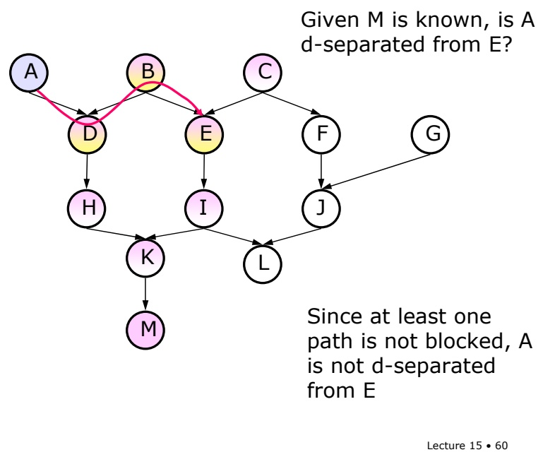

Lecture 15 • 60

For completeness’ sake, let’s look at the last path, ADBE. It is also not blocked. ADB is a converging connection, but because there’s evidence at D, information goes through. And it goes through the diverging connection DBE because, although there’s evidence at B, it’s not instantiated.

<!-- page: 61 -->

Here are some practice problems on d-separation in the network from the previous slides.

<!-- page: 62 -->

Now we can describe a formal class of objects, called Bayesian Networks. They’re also sometimes called belief networks or Bayesian belief networks. A Bayes net is made up of three components.

<!-- page: 63 -->

There’s a finite set of variables, each of which has a finite domain (actually, it’s possible to have continuous-valued variables, but we’re not going to consider that case).

<!-- page: 64 -->

There’s a set of directed arcs between the nodes, forming an acyclic graph.

<!-- page: 65 -->

And every node A, with parents B1 through Bn has a conditional probability distribution, P(A | B1…Bn) specified (typically in a table indexed by values of the B variables, but sometimes stored in a more compact form, such as a tree).

<!-- page: 66 -->

Bayesian (Belief) Networks
- Set of variables, each has a finite set of values
- Set of directed arcs between them forming acyclic graph
- Every node A, with parents $B_1, ..., B_n$, has $P(A \mid B_1, ..., B_n)$ specified
Theorem: If A and B are d-separated given evidence e, then $P(A \mid e) = P(A \mid B, e)$
Lecture 15 • 66

The crucial theorem about Bayesian networks is that if A and B are d-separated given some evidence e, then A and B are conditionally independent given e; that is, then $\mathrm{P}(\mathrm{A} \mid \mathrm{B}, \mathrm{e})=\mathrm{P}(\mathrm{A} \mid \mathrm{e})$ . We’ll be able to exploit these conditional independence relationships to make inference efficient.

<!-- page: 67 -->

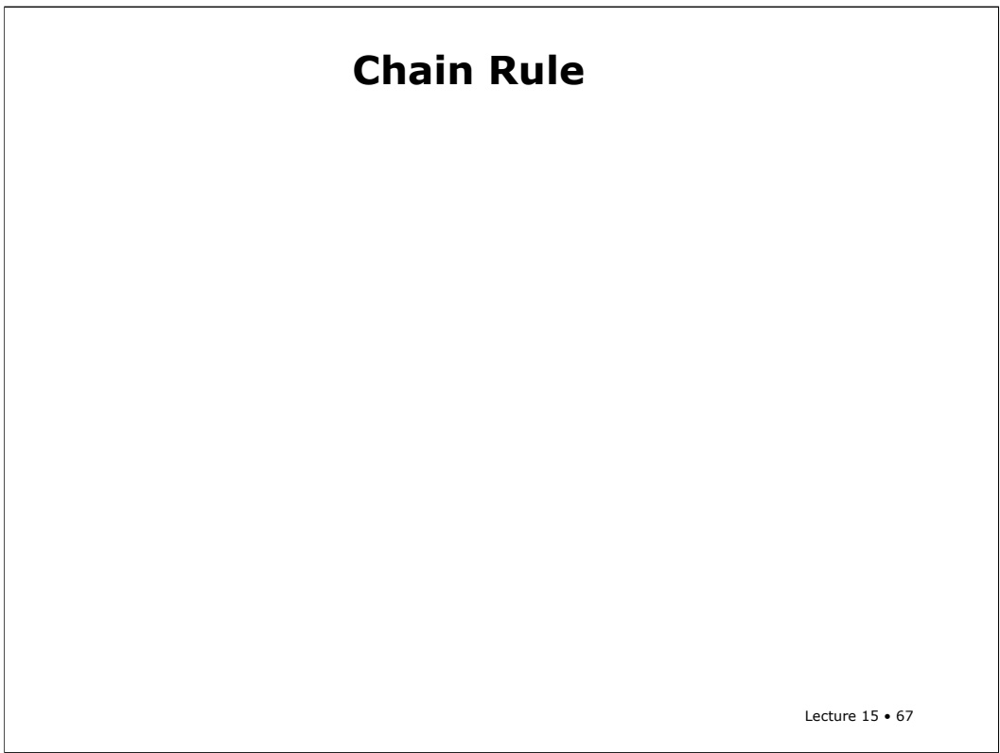

# Chain Rule

Here's another important theorem, the chain rule of probabilities.

<!-- page: 68 -->

Let's say we have a whole bunch of variables, v1 through vn. I use big letters to stand for variables and little letters to stand for their values. I'm first going to write this out in complete detail and then I'll show you the shorthand I typically use.

<!-- page: 69 -->

## Chain Rule

• Variables: $\mathsf { V } _ { 1 } ,   . . . ,   \mathsf { V } _ { \mathsf { n } }$

• Values: $\mathsf { V } _ { 1 } ,   \dots ,   \mathsf { V } _ { \mathsf { n } }$

$$
\bullet \quad P (V _ {1} = v _ {1}, V _ {2} = v _ {2}, \dots , V _ {n} = v _ {n}) = \Pi_ {i} P (V _ {i} = v _ {i} \mid \text {parents} (V _ {i}))
$$

Lecture 15 • 69

Let's assume that our $\mathrm { { \bf V } ^ { \circ } s }$ are Boolean variables, OK? The probability of $\mathbf { V } 1 = \mathbf { v } 1$ and $\mathbf { V } 2 = \mathbf { v } 2$ and, etc., and $\mathbf { V n } = \mathbf { v n } ,$ , is equal to the product over all these variables, of the probability of $\mathbf { V } \dot { \mathbf { i } }   =   \mathbf { v } \dot { \mathbf { i } }$ given the values of the parents of vi. OK. So this is actually pretty cool and pretty important We're saying that the joint probability distribution is the product of all the individual probability distributions that are stored in the nodes of the graph. The parents of vi are just the nodes that have arcs into vi. This gives us a way to compute the probability of any possible assignment of values to variables; it lets us compute the value in any cell of the huge joint probability distribution.

<!-- page: 70 -->

Let's illustrate this using an example. Here's a graph. We’ll have local probability tables that have P(A), P(B), P(C|A,B), and P(D|C).

<!-- page: 71 -->

$$
\begin{array}{r l} \mathrm{P(ABCD)} & = \mathrm{P(A=true, B=true,} \\ & \quad \mathrm{C=true, D=true)} \end{array}
$$

Now, we’d like to compute the probability that A,B,C,and D are all true. I’ll write it using the shorthand P(ABCD).

<!-- page: 72 -->

$$
\bullet \mathrm{P} (\mathrm{V} _ {1} = \mathrm{v} _ {1}, \mathrm{V} _ {2} = \mathrm{v} _ {2}, \dots , \mathrm{V} _ {\mathrm{n}} = \mathrm{v} _ {\mathrm{n}}) = \Pi_ {\mathrm{i}} \mathrm{P} (\mathrm{V} _ {\mathrm{i}} = \mathrm{v} _ {\mathrm{i}} \mid \text {parents} (\mathrm{V} _ {\mathrm{i}}))
$$

$$
\begin{array}{r l} \mathrm{P(ABCD)} & = \mathrm{P(A=true, B=true,} \\ & \quad \mathrm{C=true, D=true)} \end{array}
$$

$$
\mathrm{P(ABCD)} =
$$

$$
\mathrm{P} (\mathrm{D} | \mathrm{ABC}) \mathrm{P} (\mathrm{ABC})
$$

We can use conditioning to write that as the product of P(D|ABC) and P(ABC).

<!-- page: 73 -->

## Chain Rule

• Variables: $\mathsf { V } _ { 1 } ,   . . . ,   \mathsf { V } _ { \mathsf { n } }$

• Values: $\mathsf { V } _ { 1 } ,   \dots ,   \mathsf { V } _ { \mathsf { n } }$

$$
\bullet \mathrm{P} (\mathrm{V} _ {1} = \mathrm{v} _ {1}, \mathrm{V} _ {2} = \mathrm{v} _ {2}, \dots , \mathrm{V} _ {\mathrm{n}} = \mathrm{v} _ {\mathrm{n}}) = \Pi_ {\mathrm{i}} \mathrm{P} (\mathrm{V} _ {\mathrm{i}} = \mathrm{v} _ {\mathrm{i}} \mid \text {parents} (\mathrm{V} _ {\mathrm{i}}))
$$

$$
\begin{array}{r l} \mathrm{P(ABCD)} = \mathrm{P(A=true, B=true,} \\ & \quad \mathrm{C=true, D=true)} \end{array}
$$

P(ABCD) =

$$
\int P (D | A B C) P (A B C) =
$$

$$
\mathrm{P} (\mathrm{D} | \mathrm{C}) \quad \mathrm{P} (\mathrm{ABC}) =
$$

A d-separated from D given C

B d-separated from D given C

Lecture 15 • 73

Now, we can simplify P(D|ABC) to P(D|C), because, given C, D is d-separated from A and B. And we have P(D|C) stored directly in a local probability table, so we’re done with this term.

<!-- page: 74 -->

## Chain Rule

• Variables: $\mathsf { V } _ { 1 } ,   . . . ,   \mathsf { V } _ { \mathsf { n } }$

• Values: $\mathsf { V } _ { 1 } ,   \dots ,   \mathsf { V } _ { \mathsf { n } }$

$$
\bullet \quad P (V _ {1} = v _ {1}, V _ {2} = v _ {2}, \dots , V _ {n} = v _ {n}) = \Pi_ {i} P (V _ {i} = v _ {i} \mid p a r e n t s (V _ {i}))
$$

$$
\begin{array}{r l} \mathrm{P(ABCD)} & = \mathrm{P(A=true, B=true,} \\ & \quad \mathrm{C=true, D=true)} \end{array}
$$

P(ABCD) =

$$
\int P (D | A B C) P (A B C) =
$$

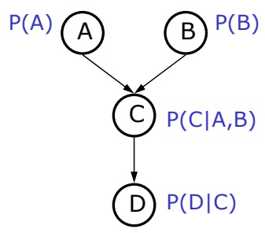

$$
\mathrm{P} (\mathrm{D} | \mathrm{C}) \quad \mathrm{P} (\mathrm{ABC}) =
$$

P(D|C) P(C|AB) P(AB) =

A d-separated from D given C

B d-separated from D given C

Lecture 15 • 74

Now, we can use conditioning to write P(ABC) as P(C|AB) times P(AB). We have P(C|AB) in our table, so that’s done.

<!-- page: 75 -->

## Chain Rule

• Variables: $\mathsf { V } _ { 1 } ,   . . . ,   \mathsf { V } _ { \mathsf { n } }$

• Values: $\mathsf { V } _ { 1 } ,   \dots ,   \mathsf { V } _ { \mathsf { n } }$

$\mathsf { P } ( \mathsf { V } _ { \mathsf { 1 } } { = } \mathsf { v } _ { \mathsf { 1 } } ,   \mathsf { V } _ { \mathsf { 2 } } { = } \mathsf { v } _ { \mathsf { 2 } } ,   . . . ,   \mathsf { V } _ { \mathsf { n } } { = } \mathsf { v } _ { \mathsf { n } } ) = \Pi _ { \mathsf { i } }   \mathsf { P } ( \mathsf { V } _ { \mathsf { i } } { = } \mathsf { v } _ { \mathsf { i } } \mid$ parents(Vi))

$$
\begin{array}{r l} \mathrm{P(ABCD)} = \mathrm{P(A=true, B=true,} \\ & \quad \mathrm{C=true, D=true)} \end{array}
$$

P(ABCD) =

$$
\int P (D | A B C) P (A B C) =
$$

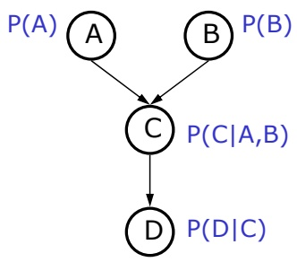

P(D|C) P(ABC) =

$$
\mathrm{P} (\mathrm{D} | \mathrm{C}) \quad \mathrm{P} (\mathrm{C} | \mathrm{AB}) \mathrm{P} (\mathrm{AB}) =
$$

$$
\mathrm{P} (\mathrm{D} | \mathrm{C}) \quad \mathrm{P} (\mathrm{C} | \mathrm{AB}) \mathrm{P} (\mathrm{A}) \mathrm{P} (\mathrm{B})
$$

A d-separated from D given C

B d-separated from D given C

A d-separated from B

Lecture 15 • 75

All that’s left to deal with is P(AB). We can write this as P(A) times P(B) because A and B are independent (they are d-separated given nothing).

<!-- page: 76 -->

## Chain Rule

• Variables: $\mathsf { V } _ { 1 } ,   . . . ,   \mathsf { V } _ { \mathsf { n } }$

• Values: $\mathsf { V } _ { 1 } ,   \dots ,   \mathsf { V } _ { \mathsf { n } }$

$\mathsf { P } ( \mathsf { V } _ { \mathsf { 1 } } { = } \mathsf { v } _ { \mathsf { 1 } } ,   \mathsf { V } _ { \mathsf { 2 } } { = } \mathsf { v } _ { \mathsf { 2 } } ,   . . . ,   \mathsf { V } _ { \mathsf { n } } { = } \mathsf { v } _ { \mathsf { n } } ) = \Pi _ { \mathsf { i } }   \mathsf { P } ( \mathsf { V } _ { \mathsf { i } } { = } \mathsf { v } _ { \mathsf { i } } \mid$ parents(Vi))

$$
\begin{array}{r l} \mathrm{P(ABCD)} & = \mathrm{P(A=true, B=true,} \\ & \quad \mathrm{C=true, D=true)} \end{array}
$$

$$
\mathrm{P(ABCD)} =
$$

$$
\int P (D | A B C) P (A B C) =
$$

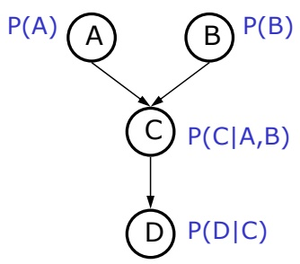

P(D|C) P(ABC) =

$$
\mathrm{P} (\mathrm{D} | \mathrm{C}) \quad \mathrm{P} (\mathrm{C} | \mathrm{AB}) \mathrm{P} (\mathrm{AB}) =
$$

$$
\mathrm{P} (\mathrm{D} | \mathrm{C}) \quad \mathrm{P} (\mathrm{C} | \mathrm{AB}) \mathrm{P} (\mathrm{A}) \mathrm{P} (\mathrm{B})
$$

A d-separated from D given C

B d-separated from D given C

A d-separated from B

$$
\text {Lecture} 15 \cdot 76
$$

So, this element of the joint distribution is a product of terms, one for each node, expressing the probability it takes on that value given the values of the parents.

<!-- page: 77 -->

# Key Advantage

• The conditional independencies (missing arrows) mean that we can store and compute the joint probability distribution more efficiently

Lecture 15 • 77

For each variable, we just have to condition on its parents. And we multiply those together and we get the joint. So what that means is that if you have any independencies -- if you have anything other than all the arrows in your graph, in some sense, then you have to do less work to compute the joint distribution. You have to store fewer number in your table, you have to do less work. Now, it's true that there are some probability distributions for which you have to have all the arrows in there, there's no other way to represent them. But there are plenty of other ones that do have some amount of d-separation and therefore give us some efficiency in calculation.

<!-- page: 78 -->

# Icy Roads with Numbers

Let’s finish by doing the numerical calculations that go with the examples.

<!-- page: 79 -->

Lecture 15 • 79

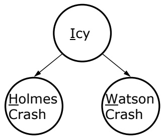

Here’s the Bayesian Network for the icy roads problem.

<!-- page: 80 -->

Lecture 15 • 80

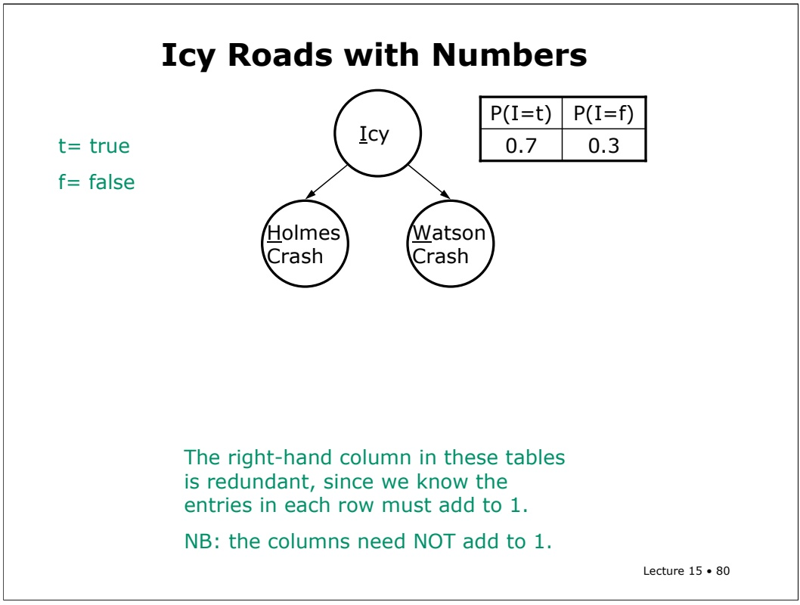

The right-hand column in these tables is redundant, since we know the entries in each row must add to 1. NB: the columns need NOT add to 1.

The node Icy has no parents, so it’s conditional probability table is really just the probability that Icy is true. Let’s say it’s 0.7.

<!-- page: 81 -->

|  | P(W=t \| I) | P(W=f \| I) |
| --- | --- | --- |
| I=t | 0.8 | 0.2 |
| I=f | 0.1 | 0.9 |

Now, the variable W depends on I, so it’s going to have to have a more complicated table. For each possible value of I, we’re going to have to give the probability of W given I. Note that the rows add up to 1, because, for a given value for I, they specify the probabilities of W being true and false. But there’s no need for the columns to add up (or have any other relationship to one another). When I is true, W has one distribution. When I is false, it can have a completely different distribution. (If I and W are independent, then both rows of the table will be the same). Watson is really a terrible driver!

<!-- page: 82 -->

|  | P(H=t \| I) | P(H=f \| I) |
| --- | --- | --- |
| I=t | 0.8 | 0.2 |
| I=f | 0.1 | 0.9 |

|  | P(W=t \| I) | P(W=f \| I) |
| --- | --- | --- |
| I=t | 0.8 | 0.2 |
| I=f | 0.1 | 0.9 |

Lecture 15 • 82

We're going to assume that Holmes and Watson are indistinguishable in their bad driving skills. And so we’ll use the same probabilities for the H node (though it’s in no way necessary).

<!-- page: 83 -->

Numerical Example: Shorthand

|  | P(H\| I) |
| --- | --- |
| I | 0.8 |
| ¬I | 0.1 |

|  | P(W\| I) |
| --- | --- |
| I | 0.8 |
| ¬I | 0.1 |

Here’s a more compact way of saying what we wrote out in complete detail on the previous slide. We don’t need to provide P(not icy), for example, because we know it’s 1 – P(icy).

<!-- page: 84 -->

Probability that Watson Crashes

|  | P(H\| I) |
| --- | --- |
| I | 0.8 |
| ¬I | 0.1 |

|  | P(W\| I) |
| --- | --- |
| I | 0.8 |
| ¬I | 0.1 |

Okay. Now let’s compute the probability that Watson crashes. This is before we have any evidence at all; this is our **prior** probability of Watson crashing.

<!-- page: 85 -->

Probability that Watson Crashes

|  | P(H\| I) |
| --- | --- |
| I | 0.8 |
| ¬I | 0.1 |

$$
P (W) = P (W | I) P (I) + P (W | \neg I) P (\neg I)
$$

|  | P(W\| I) |
| --- | --- |
| I | 0.8 |
| ¬I | 0.1 |

We don’t know anything directly about P(W), but we do know P(W|I). So, let’s use conditioning to write P(W) as P(W|I) P(I) + P(W|not I) P(not I).

<!-- page: 86 -->

$$
\begin{array}{r l} \mathrm{P(W)} & = \mathrm{P(W|I)P(I)} + \mathrm{P(W|} \neg \mathrm{I}) \mathrm{P(} \neg \mathrm{I}) \\ & = 0. 8 \cdot 0. 7 + 0. 1 \cdot 0. 3 \\ & = 0. 5 6 + 0. 0 3 \\ & = 0. 5 9 \end{array}
$$

Now, we have all of those quantities directly in our tables and we can do the arithmetic to get 0.59. So, Watson is such a bad driver, that, even without any evidence, we think there’s almost a .6 chance that he’s going to crash.

<!-- page: 87 -->

Probability of Icy given Watson

|  | P(H\| I) |
| --- | --- |
| I | 0.8 |
| ¬I | 0.1 |

P(I | W) =

|  | P(W\| I) |
| --- | --- |
| I | 0.8 |
| ¬I | 0.1 |

Now we find out that W is true. Watson has crashed. So let's figure out what that tells us about whether it's icy, and what that tells us about Holmes's situation. So we want to know what's the probability that it's icy, given that Watson crashed.

<!-- page: 88 -->

## Probability of Icy given Watson

|  | P(H\| I) |
| --- | --- |
| I | 0.8 |
| ¬I | 0.1 |

|  | P(W\| I) |
| --- | --- |
| I | 0.8 |
| ¬I | 0.1 |

Well, our arrows don't go in that direction, and so we don't have tables that tell us the probabilities in that direction. So what do you do when you have conditional probability that doesn't go in the direction you want to be going? Bayes' Rule.

<!-- page: 89 -->

$$
\mathrm{P} (\mathrm{I} \mid \mathrm{W}) = \mathrm{P} (\mathrm{W} \mid \mathrm{I}) \mathrm{P} (\mathrm{I}) / \mathrm{P} (\mathrm{W})
$$

So, P(I | W) is P(W | I) P(I) / P(W). Now we’re in good shape, because P(W|I) is in our table, as is P(I). And we just computed P(W).

<!-- page: 90 -->

## Probability of Icy given Watson

|  | P(H\| I) |
| --- | --- |
| I | 0.8 |
| ¬I | 0.1 |

|  | P(W\| I) |
| --- | --- |
| I | 0.8 |
| ¬I | 0.1 |

$$
\begin{array}{r l} \mathrm{P(I|W)} & = \mathrm{P(W|I)P(I)/P(W)} \\ & = 0. 8 \cdot 0. 7 / 0. 5 9 \\ & = 0. 9 5 \end{array}
$$

We started with P(I) = 0.7; knowing that Watson crashed raised the probability to 0.95

Lecture 15 • 90

Now we can do the arithmetic to get 0.95. So, we started out thinking that it was icy with probability 0.7, but now that we know that Watson crashed, we think it’s 0.95 likely that it’s icy.

<!-- page: 91 -->

Probability of Holmes given Watson

|  | P(H\| I) |
| --- | --- |
| I | 0.8 |
| ¬I | 0.1 |

|  | P(W\| I) |
| --- | --- |
| I | 0.8 |
| ¬I | 0.1 |

Now let's see what we think about Holmes, given only that we know that Watson crashed. We need P(H | W), but Bayes’ rule won’t help us directly here. We’re going to have to do conditioning again, summing over all possible values of I.

<!-- page: 92 -->

Probability of Holmes given Watson

|  | P(H\| I) |
| --- | --- |
| I | 0.8 |
| ¬I | 0.1 |

|  | P(W\| I) |
| --- | --- |
| I | 0.8 |
| ¬I | 0.1 |

P(H|W) = P(H|W,I)P(I|W) + P(H|W,¬I) P(¬I| W)

Lecture 15 • 92

So, we have P(H|W,I) times $\mathrm{P}(\mathrm{I} | \mathrm{W}) + \mathrm{P}(\mathrm{H} | \mathrm{W}, \sim \mathrm{I})$ times P(\~I | W). This is a version of conditioning that applies when you already have one variable on the right side of the bar. You can verify it as an exercise.

<!-- page: 93 -->

Probability of Holmes given Watson

|  | P(H\| I) |
| --- | --- |
| I | 0.8 |
| ¬I | 0.1 |

|  | P(W\| I) |
| --- | --- |
| I | 0.8 |
| ¬I | 0.1 |

P(H|W) = P(H|W,I)P(I|W) + P(H|W,¬I) P(¬I| W) = P(H|I)P(I|W) + P(H|¬I) P(¬I| W)

Lecture 15 • 93

Now, because H is conditionally independent of W given I (which is true because H is d-separated from W given I), we can simplify P(H|W,I) to P(H|I). And the same for P(H|\~I).

<!-- page: 94 -->

Probability of Holmes given Watson

|  | P(H\| I) |
| --- | --- |
| I | 0.8 |
| ¬I | 0.1 |

|  | P(W\| I) |
| --- | --- |
| I | 0.8 |
| ¬I | 0.1 |

$$
\begin{array}{r l} \mathrm{P(H|W)} & = \mathrm{P(H|W,I)P(I|W)} + \mathrm{P(H|W,} \neg \mathrm{I}) \mathrm{P(} \neg \mathrm{I|W)} \\ & = \mathrm{P(H|I)P(I|W)} + \mathrm{P(H|} \neg \mathrm{I}) \mathrm{P(} \neg \mathrm{I|W)} \\ & = 0. 8 \cdot 0. 9 5 + 0. 1 \cdot 0. 0 5 \\ & = 0. 7 6 5 \end{array}
$$

Now, we know all of these values. P(H|I) is in the table, and P(I|W) we just computed in the previous exercise. So, doing the arithmetic, we get 0.765. So, we started with P(H) = 0.59, but knowing that Watson crashed has increased the probability that Holmes has crashed to 0.765.

<!-- page: 95 -->

Prob of Holmes given Icy and Watson

|  | P(H\| I) |
| --- | --- |
| I | 0.8 |
| ¬I | 0.1 |

$$
\mathrm{P} (\mathrm{H} | \mathrm{W}, \neg \mathrm{I}) = \mathrm{P} (\mathrm{H} | \neg \mathrm{I})
$$

|  | P(W\| I) |
| --- | --- |
| I | 0.8 |
| ¬I | 0.1 |

Now we want to compute one more thing. Now the secretary -- the voice of reason, says "Look out the window. It's not icy." So now we know not I. So now we're interested in, one more time, trying to decide whether Holmes is going to come or whether we can sneak out and go have lunch. So we want to know the probability of Holmes coming given that Watson crashed and it's not icy. So this is just the probability of H given not I. Why is that? Because H and W are d-separated, given knowledge of I. So for that reason, they're conditionally independent, and for that reason, we can leave the W out here.

<!-- page: 96 -->

$$
\mathsf {P} (\mathsf {H} | \mathsf {W}, \neg \mathsf {I}) = \mathsf {P} (\mathsf {H} | \neg \mathsf {I}) = 0. 1
$$

So probability H given not I is 0.1. We cut off that whole line of reasoning from Watson to Holmes and all that matters is that it’s not icy.

<!-- page: 97 -->

## Recitation Problems II

In the Watson and Holmes visit LA network, use the following conditional probability tables.

$$
\mathrm{P} (\mathsf {R}) = 0. 2
$$

$$
\mathsf {P} (\mathsf {S}) = 0. 1
$$

|  | P(W\| R) |
| --- | --- |
| R | 1.0 |
| ¬R | 0.2 |

|  | P(H\| R,S) |
| --- | --- |
| R,S | 1.0 |
| R,¬S | 1.0 |
| ¬ R,S | 0.9 |
| ¬ R,¬S | 0.1 |

## Calculate:

$$
\mathrm{P} (\mathrm{H}), \mathrm{P} (\mathrm{R} | \mathrm{H}), \mathrm{P} (\mathrm{S} | \mathrm{H}), \mathrm{P} (\mathrm{W} | \mathrm{H}), \mathrm{P} (\mathrm{R} | \mathrm{W}, \mathrm{H}), \mathrm{P} (\mathrm{S} | \mathrm{W}, \mathrm{H})
$$

Lecture 15 • 97

Use the following conditional probabilities in the network about Holmes and Watson in LA. Compute the following probabilities, as specified by the network.
