<!-- page: 1 -->

Now that we know what the semantics of Bayes nets are; what it means when we have one, we need to understand how to use it. Typically, we’ll be in a situation in which we have some evidence, that is, some of the variables are instantiated, and we want to infer something about the probability distribution of some other variables.

<!-- page: 2 -->

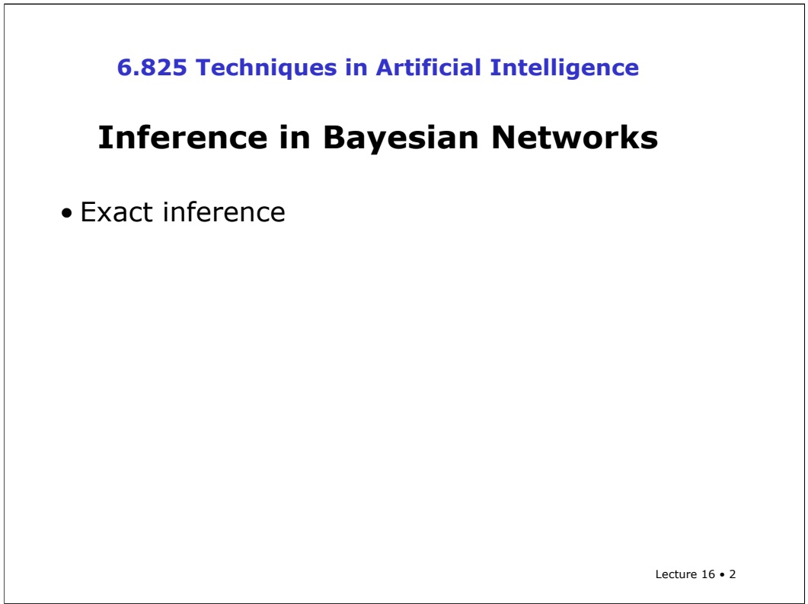

In exact inference, we analytically compute the conditional probability distribution over the variables of interest.

<!-- page: 3 -->

But sometimes, that’s too hard to do, in which case we can use approximation techniques based on statistical sampling.

<!-- page: 4 -->

Given a Bayesian network, what kinds of questions might we want to ask?

<!-- page: 5 -->

The most usual is a conditional probability query. Given instantiations for some of the variables (we’ll use e here to stand for the values of all the instantiated variables; it doesn’t have to be just one), what is the probability that node X has a particular value x?

<!-- page: 6 -->

Another interesting question you might ask is, what is the most likely explanation for some evidence? We can think of that as the value of node X (or of some group of nodes) that maximizes the probability that you would have seen the evidence you did. This is called the maximum a posteriori probability or MAP query.

<!-- page: 7 -->

```txt
Query Types
Given a Bayesian network, what questions might we want to ask?
• Conditional probability query: P(x | e)
• Maximum a posteriori probability:
What value of x maximizes P(x|e) ?
General question: What's the whole probability distribution over variable X given evidence e, P(X | e)?
Lecture 16 • 7
```

In our discrete probability situation, the only way to answer a MAP query is to compute the probability of x given e for all possible values of x and see which one is greatest.

<!-- page: 8 -->

```txt
Query Types
Given a Bayesian network, what questions might we want to ask?
• Conditional probability query: P(x | e)
• Maximum a posteriori probability:
What value of x maximizes P(x|e) ?
General question: What's the whole probability distribution over variable X given evidence e, P(X | e)?
Lecture 16 • 8
```

So, in general, we’d like to be able to compute a whole probability distribution over some variable or variables X, given instantiations of a set of variables e.

<!-- page: 9 -->

Given the joint distribution over the variables, we can easily answer any question about the value of a single variable by summing (or marginalizing) over the other variables.

<!-- page: 10 -->

## Using the joint distribution

To answer any query involving a conjunction of variables, sum over the variables not involved in the query.

$$
\begin{array}{l} \Pr (d) = \sum_ {A B C} \Pr (a, b, c, d) \\ \quad = \sum_ {a \in \operatorname{dom} (A)} \sum_ {b \in \operatorname{dom} (B)} \sum_ {c \in \operatorname{dom} (C)} \Pr (A = a \land B = b \land C = c) \end{array}
$$

Lecture 16 • 10

So, in a domain with four variables, A, B, C, and D, the probability that variable D has value d is the sum over all possible combinations of values of the other three variables of the joint probability of all four values. This is exactly the same as the procedure we went through in the last lecture, where to compute the probability of cavity, we added up the probability of cavity and toothache and the probability of cavity and not toothache.

<!-- page: 11 -->

$$
\begin{array}{l} \Pr (d) = \sum_ {A B C} \Pr (a, b, c, d) \\ \quad = \sum_ {a \in \operatorname{dom} (A)} \sum_ {b \in \operatorname{dom} (B)} \sum_ {c \in \operatorname{dom} (C)} \Pr (A = a \land B = b \land C = c) \end{array}
$$

In general, we’ll use the first notation, with a single summation indexed by a list of variable names, and a joint probability expression that mentions values of those variables. But here we can see the completely written-out definition, just so we all know what the shorthand is supposed to mean.

<!-- page: 12 -->

## Using the joint distribution

To answer any query involving a conjunction of variables, sum over the variables not involved in the query.

$$
\begin{array}{l} \Pr (d) = \sum_ {A B C} \Pr (a, b, c, d) \\ \quad = \sum_ {a \in \operatorname{dom} (A)} \sum_ {b \in \operatorname{dom} (B)} \sum_ {c \in \operatorname{dom} (C)} \Pr (A = a \land B = b \land C = c) \end{array}
$$

$$
\Pr (d \mid b) = \frac {\Pr (b , d)}{\Pr (b)} = \frac {\sum_ {A C} \Pr (a , b , c , d)}{\sum_ {A C D} \Pr (a , b , c , d)}
$$

Lecture 16 • 12

To compute a conditional probability, we reduce it to a ratio of conjunctive queries using the definition of conditional probability, and then answer each of those queries by marginalizing out the variables not mentioned.

<!-- page: 13 -->

## Using the joint distribution

To answer any query involving a conjunction of variables, sum over the variables not involved in the query.

$$
\begin{array}{l} \Pr (d) = \sum_ {A B C} \Pr (a, b, c, d) \\ \quad = \sum_ {a \in \operatorname{dom} (A)} \sum_ {b \in \operatorname{dom} (B)} \sum_ {c \in \operatorname{dom} (C)} \Pr (A = a \land B = b \land C = c) \end{array}
$$

$$
\Pr (d \mid b) = \frac {\Pr (b , d)}{\Pr (b)} = \frac {\sum_ {A C} \Pr (a , b , c , d)}{\sum_ {A C D} \Pr (a , b , c , d)}
$$

Lecture 16 • 13

In the numerator, here, you can see that $\mathbf { W } \mathbf { e } ^ { \flat }$ re only summing over variables A and C, because b and d are instantiated in the query.

<!-- page: 14 -->

We’re going to learn a general purpose algorithm for answering these joint queries fairly efficiently. We’ll start by looking at a very simple case to build up our intuitions, then we’ll write down the algorithm, then we’ll apply it to a more complex case.

<!-- page: 15 -->

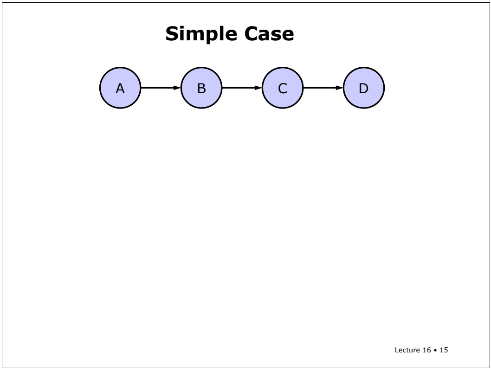

Okay. Here’s our very simple case. It’s a bayes net with four nodes, arranged in a chain.

<!-- page: 16 -->

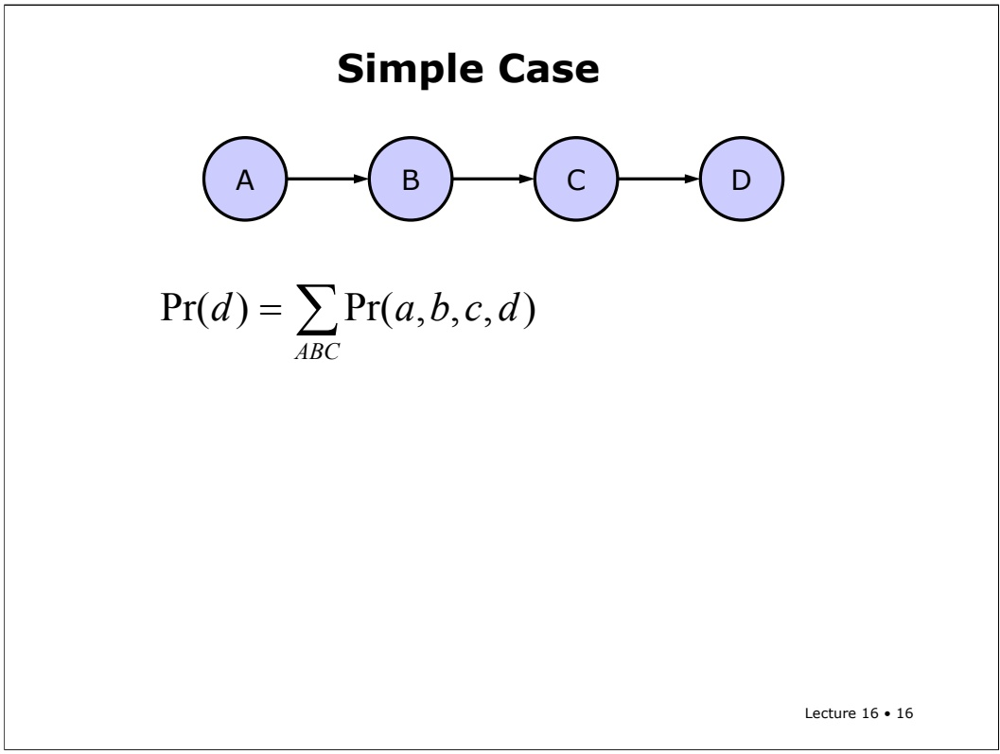

So, we know from before that the probability that variable D has some value little d is the sum over A, B, and C of the joint distribution, with d fixed.

<!-- page: 17 -->

$$
\begin{array}{r l} \operatorname * {P r} (d) & = \sum_ {A B C} \operatorname * {P r} (a, b, c, d) \\ & = \sum_ {A B C} \operatorname * {P r} (d \mid c) \operatorname * {P r} (c \mid b) \operatorname * {P r} (b \mid a) \operatorname * {P r} (a) \end{array}
$$

Now, using the chain rule of Bayesian networks, we can write down the joint probability as a product over the nodes of the probability of each node’s value given the values of its parents. So, in this case, we get $\mathrm { P ( d | c ) }$ times P(c|b) times $\mathrm { P ( b | a ) }$ times P(a).

<!-- page: 18 -->

## Simple Case

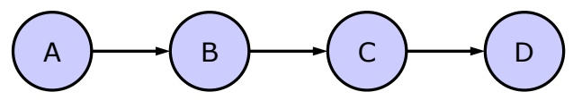

$$
\begin{array}{r l} \operatorname * {P r} (d) & = \sum_ {A B C} \operatorname * {P r} (a, b, c, d) \\ & = \sum_ {A B C} \operatorname * {P r} (d \mid c) \operatorname * {P r} (c \mid b) \operatorname * {P r} (b \mid a) \operatorname * {P r} (a) \end{array}
$$

This expression gives us a method for answering the query, given the conditional probabilities that are stored in the net. And this method can be applied directly to any other bayes net. But there’s a problem with it: it requires enumerating all possible combinations of assignments to A, B, and C, and then, for each one, multiplying the factors for each node. That’s an enormous amount of work and we’d like to avoid it if at all possible.

<!-- page: 19 -->

## Simple Case

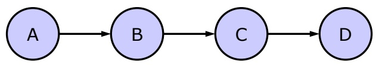

$$
\begin{array}{r l} \operatorname * {P r} (d) & = \sum_ {A B C} \operatorname * {P r} (a, b, c, d) \\ & = \sum_ {A B C} \operatorname * {P r} (d \mid c) \operatorname * {P r} (c \mid b) \operatorname * {P r} (b \mid a) \operatorname * {P r} (a) \\ & = \sum_ {C} \sum_ {B} \sum_ {A} \operatorname * {P r} (d \mid c) \operatorname * {P r} (c \mid b) \operatorname * {P r} (b \mid a) \operatorname * {P r} (a) \end{array}
$$

Lecture 16 • 19

So, we’ll try rewriting the expression into something that might be more efficient to evaluate. First, we can make our summation into three separate summations, one over each variable.

<!-- page: 20 -->

## Simple Case

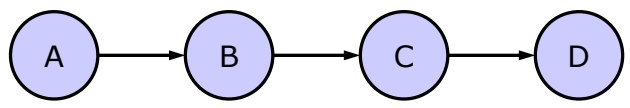

$$
\begin{array}{r l} \operatorname * {P r} (d) & = \sum_ {A B C} \operatorname * {P r} (a, b, c, d) \\ & = \sum_ {A B C} \operatorname * {P r} (d \mid c) \operatorname * {P r} (c \mid b) \operatorname * {P r} (b \mid a) \operatorname * {P r} (a) \\ & = \sum_ {C} \sum_ {B} \sum_ {A} \operatorname * {P r} (d \mid c) \operatorname * {P r} (c \mid b) \operatorname * {P r} (b \mid a) \operatorname * {P r} (a) \\ & = \sum_ {C} \operatorname * {P r} (d \mid c) \sum_ {B} \operatorname * {P r} (c \mid b) \sum_ {A} \operatorname * {P r} (b \mid a) \operatorname * {P r} (a) \end{array} \tag {$Lecture16\cdot20$}
$$

Then, by distributivity of addition over multiplication, we can push the summations in, so that the sum over A includes all the terms that mention A, but no others, and so on. It’s pretty clear that this expression is the same as the previous one in value, but it can be evaluated more efficiently. We’re still, eventually, enumerating all assignments to the three variables, but we’re doing somewhat fewer multiplications than before. So this is still not completely satisfactory.

<!-- page: 21 -->

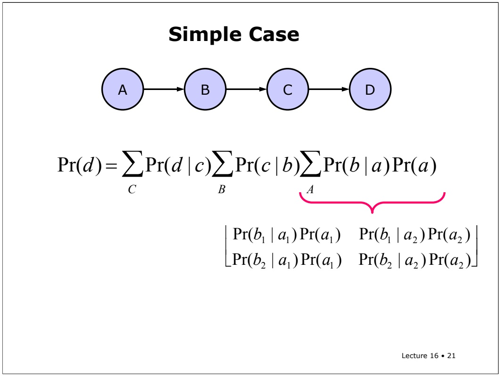

If you look, for a minute, at the terms inside the summation over A, you’ll see that we’re doing these multiplications over for each value of C, which isn’t necessary, because they’re independent of C. Our idea, here, is to do the multiplications once and store them for later use. So, first, for each value of A and B, we can compute the product, generating a two dimensional matrix.

<!-- page: 22 -->

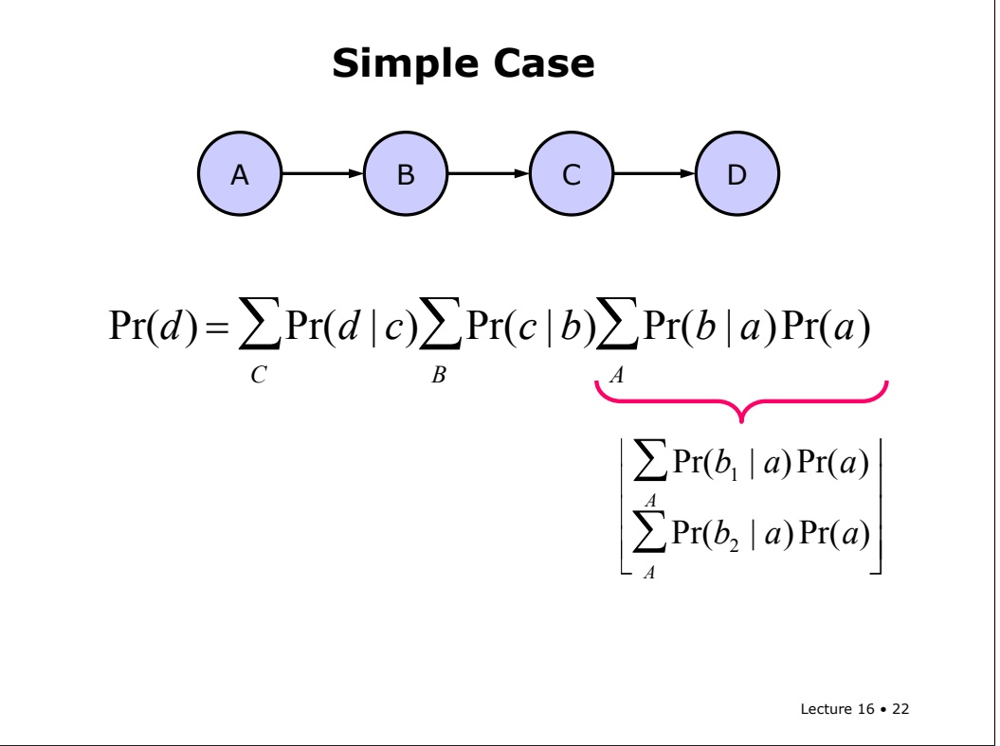

Then, we can sum over the rows of the matrix, yielding one value of the sum for each possible value of b.

<!-- page: 23 -->

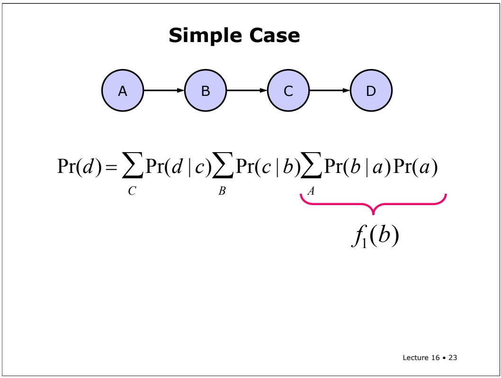

f1(b)

We’ll call this set of values, which depends on b, f1 of b.

<!-- page: 24 -->

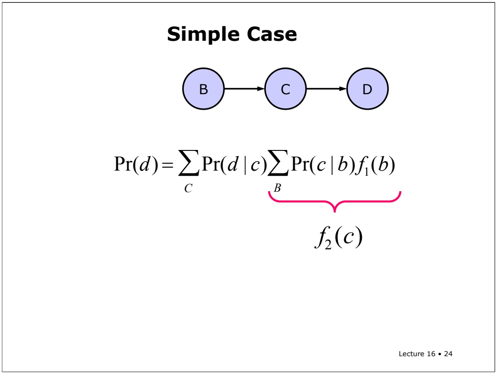

Now, we can substitute f1 of b in for the sum over A in our previous expression. And, effectively, we can remove node A from our diagram. Now, we express the contribution of b, which takes the contribution of a into account, as f\_1 of b.

<!-- page: 25 -->


We can continue the process in basically the same way. We can look at the summation over b and see that the only other variable it involves is c. We can summarize those products as a set of factors, one for each value of c. We’ll call those factors f\_2 of c.

<!-- page: 26 -->

$$
\Pr (d) = \sum_ {c} \Pr (d \mid c) f _ {2} (c)
$$

We substitute $\stackrel { \mathrm { ~ f ~ } 2 } { - }$ of c into the formula, remove node b from the diagram, and now we’re down to a simple expression in which d is known and we have to sum over values of c.

<!-- page: 27 -->

## Variable Elimination Algorithm

Given a Bayesian network, and an elimination order for the non-query variables

Lecture 16 • 27

That was a simple special case. Now we can look at the algorithm in the general case. Let’s assume that we’re given a Bayesian network and an ordering on the variables that aren’t fixed in the query. We’ll come back later to the question of the influence of the order, and how we might find a good one.

<!-- page: 28 -->

$$
\sum_ {X _ {1}} \sum_ {X _ {2}} \mathsf {K} \sum_ {X _ {m}} \prod_ {j} \Pr (x _ {j} \mid P a (x _ {j}))
$$

We can express the probability of the query variables as a sum over each value of each of the non-query variables of a product over each node in the network, of the probability that that variable has the given value given the values of its parents.

<!-- page: 29 -->

$$
\sum_ {X _ {1}} \sum_ {X _ {2}} \mathsf {K} \sum_ {X _ {m}} \prod_ {j} \Pr (x _ {j} \mid P a (x _ {j}))
$$

So, we’ll eliminate the variables from the inside out. Starting with variable Xm and finishing with variable X1.

<!-- page: 30 -->

$$
\sum_ {X _ {1}} \sum_ {X _ {2}} \mathsf {K} \sum_ {X _ {m}} \prod_ {j} \Pr (x _ {j} \mid P a (x _ {j}))
$$

To eliminate variable Xi, we start by gathering up all of the factors that mention Xi, and removing them from our set of factors. Let’s say there are k such factors.

<!-- page: 31 -->

$$
\sum_ {X _ {1}} \sum_ {X _ {2}} \mathsf {K} \sum_ {X _ {m}} \prod_ {j} \Pr (x _ {j} \mid P a (x _ {j}))
$$

Now, we make a k+1 dimensional table, indexed by $\mathrm { X i }$ as well as each of the other variables that is mentioned in our set of factors.

<!-- page: 32 -->

$$
\sum \sum \mathsf {K} \sum \prod \Pr (x _ {j} \mid P a (x _ {j}))
$$

$$
X _ {1} \quad X _ {2} \qquad X _ {m} \quad j
$$

We then sum the table over the Xi dimension, resulting in a k-dimensional table.

<!-- page: 33 -->

$$
\sum_ {X _ {1}} \sum_ {X _ {2}} \mathsf {K} \sum_ {X _ {m}} \prod_ {j} \Pr (x _ {j} \mid P a (x _ {j}))
$$

This table is our new factor, and we put a term for it back into our set of factors.

<!-- page: 34 -->

$$
\sum_ {X _ {1}} \sum_ {X _ {2}} \mathsf {K} \sum_ {X _ {m}} \prod_ {j} \Pr (x _ {j} \mid P a (x _ {j}))
$$

Once we’ve eliminated all the summations, we have the desired value.

<!-- page: 35 -->

One more example

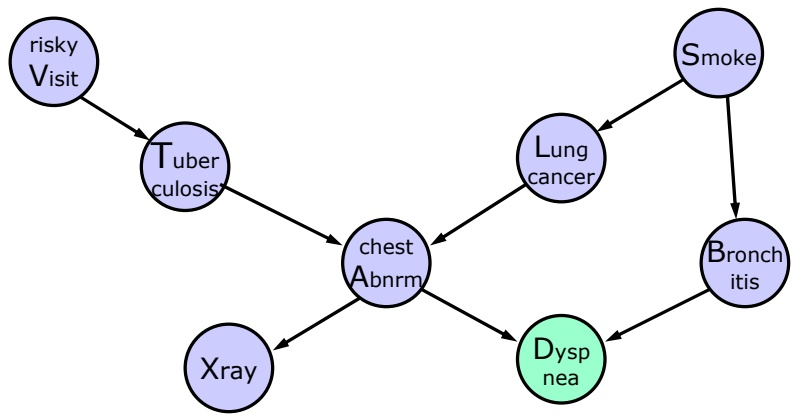

Here’s a more complicated example, to illustrate the variable elimination algorithm in a more general case. We have this big network that encodes a domain for diagnosing lung disease. (Dyspnea, as I understand it, is shortness of breath).

<!-- page: 36 -->

$$
\Pr (d) = \sum_ {A, B, L, T, S, X, V} \begin{array}{l} \Pr (d \mid a, b) \Pr (a \mid t, l) \Pr (b \mid s) \Pr (l \mid s) \Pr (s) \\ \Pr (x \mid a) \Pr (t \mid v) \Pr (v) \end{array}
$$

We’ll do variable elimination on this graph using elimination order A, B, L, T, S, X, V.

<!-- page: 37 -->

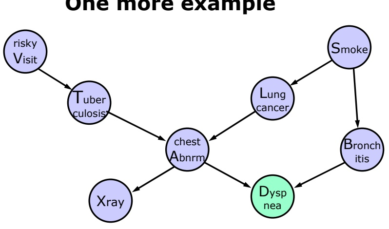

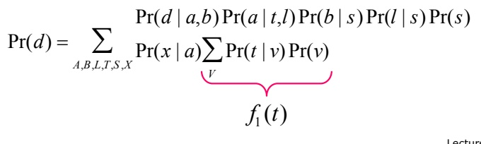

So, we start by eliminating V. We gather the two terms that mention V and see that they also involve variable T. So, we compute the product for each value of T, and summarize those in the factor f1 of T.

<!-- page: 38 -->

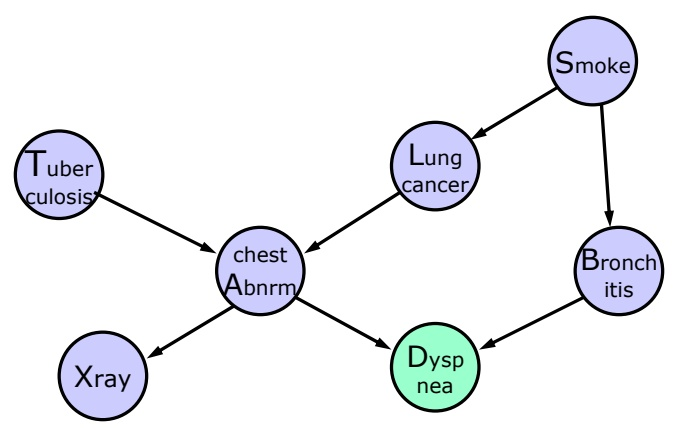

$$
\Pr (d) = \sum_ {A, B, L, T, S, X} \frac {\Pr (d \mid a , b) \Pr (a \mid t , l) \Pr (b \mid s) \Pr (l \mid s) \Pr (s)}{\Pr (x \mid a) f _ {1} (t)}
$$

Now we can substitute that factor in for the summation, and remove the node from the network.

<!-- page: 39 -->

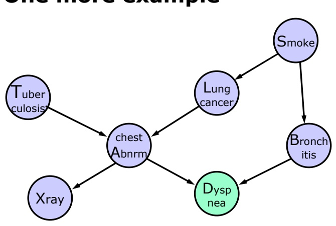

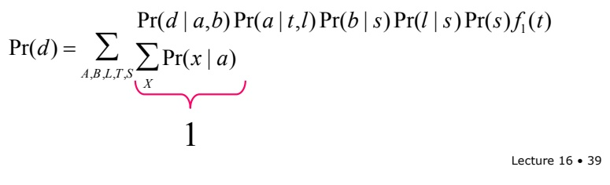

The next variable to be eliminated is X. There is actually only one term involving X, and it also involves variable A. So, for each value of A, we compute the sum over X of $\mathbf { P } ( \mathbf { x } | \mathbf { a } )$ . But wait! We know what this value is! If we fix a and sum over x, these probabilities have to add up to 1.

<!-- page: 40 -->

One more example


$$
\Pr (d) = \sum_ {A, B, L, T, S} \Pr (d \mid a, b) \Pr (a \mid t, l) \Pr (b \mid s) \Pr (l \mid s) \Pr (s) f _ {1} (t)
$$

Lecture 16 • 40

So, rather than adding another factor to our expression, we can just remove the whole sum. In general, the only nodes that will have an influence on the probability of D are its ancestors.

<!-- page: 41 -->

One more example

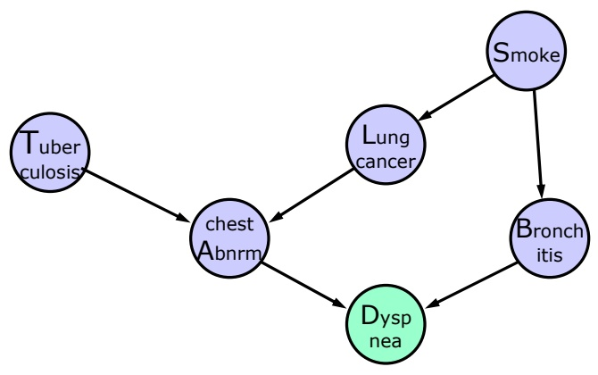

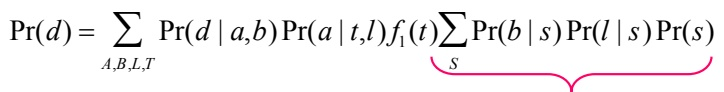

Now, it’s time to eliminate S. We find that there are three terms involving S, and we gather them into the sum. These three terms involve two other variables, B and L. So we have to make a factor that specifies, for each value of B and L, the value of the sum of products.

<!-- page: 42 -->


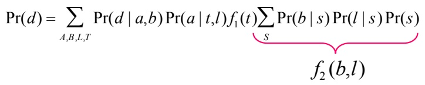

We’ll call that factor $\stackrel { \mathrm { ~ f ~ } 2 } { - }$ of b and l.

<!-- page: 43 -->

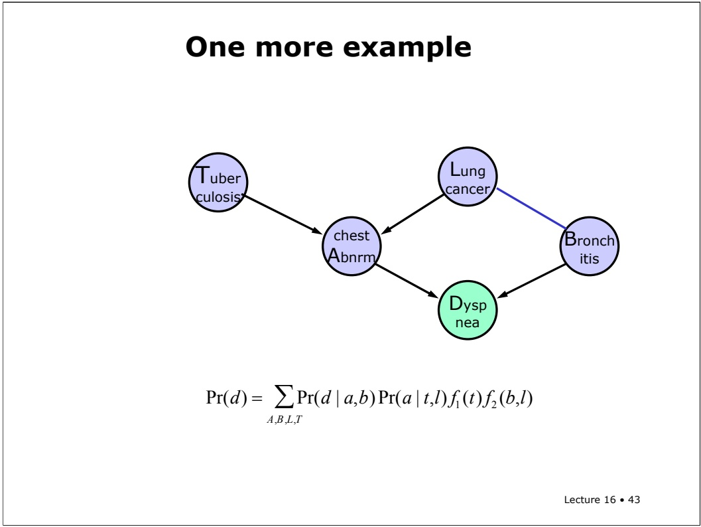

# One more example

Now we can substitute that factor back into our expression. We can also eliminate node S. But in eliminating S, we’ve added a direct dependency between L and B (they used to be dependent via S, but now the dependency is encoded explicitly in f2(b). We’ll show that in the graph by drawing a line between the two nodes. It’s not exactly a standard directed conditional dependence, but it’s still useful to show that they’re coupled.

<!-- page: 44 -->

**One more example**

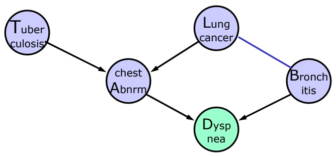

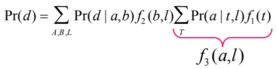

Now we eliminate T. It involves two terms, which themselves involve variables A and L. So we make a new factor f3 of A and L.

<!-- page: 45 -->

# One more example

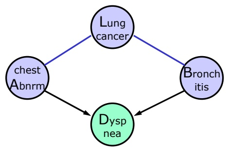

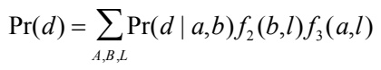

We can substitute in that factor and eliminate T. We’re getting close!

<!-- page: 46 -->

# One more example

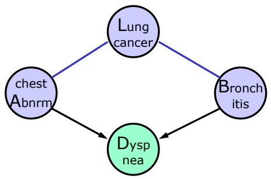

$$
\Pr (d) = \sum_ {A, B} \Pr (d \mid a, b) \underbrace {\sum_ {L} f _ {2} (b , l) f _ {3} (a , l)} _ {f _ {4} (a, b)}
$$

Lecture 16 • 46

Next we eliminate L. It involves these two factors, which depend on variables A and B. So we make a new factor, f4 of A and B, and substitute it in. We remove node L, but couple A and B.

<!-- page: 47 -->

# One more example

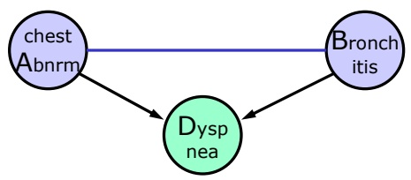

$$
\Pr (d) = \sum_ {A, B} \Pr (d \mid a, b) f _ {4} (a, b)
$$

Lecture 16 • 47

At this point, we could just do the summations over A and B and be done. But to finish out the algorithm the way a computer would, it’s time to eliminate variable B.

<!-- page: 48 -->

# One more example

Lecture 16 • 48


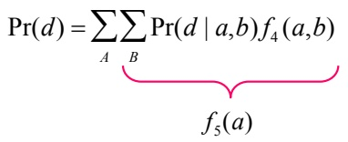

It involves both of our remaining terms, and it seems to depend on variables A and D. However, in this case, we’re interested in the probability of a particular value, little d of D, and so the variable d is instantiated. Thus, we can treat it as a constant in this expression, and we only need to generate a factor over a, which we’ll call f5 of a. And we can now, in some sense, remove D from our network as well (because we’ve already factored it into our answer).

<!-- page: 49 -->

$$
\Pr (d) = \sum_ {A} f _ {5} (a)
$$

Finally, to get the probability that variable D has value little d, we simply sum factor f5 over all values of a. Yay! We did it.

<!-- page: 50 -->

Let’s see how the variable elimination algorithm performs, both in theory and in practice.

<!-- page: 51 -->

# Properties of Variable Elimination

• Time is exponential in size of largest factor

First of all, it’s pretty easy to see that it runs in time exponential in the number of variables involved in the largest factor. Creating a factor with k variables involves making a k+1 dimensional table. If you have b values per variable, that’s a table of size b^(k+1). To make each entry, you have to multiply at most n numbers, where n is the number of nodes. We have to do this for each variable to be eliminated (which is usually close to n). So we have something like time $= \mathrm{O}(\mathrm{n} \land 2 \mathrm{b} \land \mathrm{k})$

<!-- page: 52 -->

How big the factors are depends on the elimination order. You’ll see in one of the recitation exercises just how dramatic the difference in factor sizes can be. A bad elimination order can generate huge factors.

<!-- page: 53 -->

So, we’d like to use the elimination order that generates the smallest factors. Unfortunately, it turns out to be NP hard to find the best elimination order.

<!-- page: 54 -->

At least, there are some fairly reasonable heuristics for choosing an elimination order. It’s usually done dynamically. So, rather than fixing the elimination order in advance, as we suggested in the algorithm description, you can pick the next variable to be eliminated depending on the situation. In particular, one reasonable heuristic is to pick the variable to eliminate next that will result in the smallest factor. This greedy approach won’t always be optimal, but it’s not usually too bad.

<!-- page: 55 -->

## Properties of Variable Elimination

• Time is exponential in size of largest factor

• Bad elimination order can generate huge factors

• NP Hard to find the best elimination order

• Even the best elimination order may generate large factors

• There are reasonable heuristics for picking an elimination order (such as choosing the variable that results in the smallest next factor)

• Inference in polytrees (nets with no cycles) is linear in size of the network (the largest CPT)

Lecture 16 • 55

There is one case where Bayes net inference in general, and the variable elimination algorithm in particular is fairly efficient, and that’s when the network is a polytree. A polytree is a network with no cycles. That is, a network in which, for any two nodes, there is only one path between them. In a polytree, inference is linear in the size of the network, where the size of the network is defined to be the size of the largest conditional probability table (or exponential in the maximum number of parents of any node). In a polytree, the optimal elimination order is to start at the root nodes, and work downwards, always eliminating a variable that no longer has any parents. In doing so, we never introduce additional connections into the network.

<!-- page: 56 -->

So, inference in polytrees is efficient, and even in many large non-polytree networks, it’s possible to keep the factors small, and therefore to do inference relatively efficiently.

<!-- page: 57 -->

## Properties of Variable Elimination

• Time is exponential in size of largest factor

• Bad elimination order can generate huge factors

• NP Hard to find the best elimination order

• Even the best elimination order may generate large factors

• There are reasonable heuristics for picking an elimination order (such as choosing the variable that results in the smallest next factor)

• Inference in polytrees (nets with no cycles) is linear in size of the network (the largest CPT)

• Many problems with very large nets have only small factors, and thus efficient inference

Lecture 16 • 57

When the network is such that the factors are, of necessity, large, we’ll have to turn to a different class of methods.

<!-- page: 58 -->

# Sampling

Another strategy, which is a theme that comes up also more and more in AI actually, is to say, well, we didn't really want the right answer anyway. Let's try to do an approximation. And you can also show that it's computationally hard to get an approximation that's within epsilon of the answer that you want, but again that doesn't keep us from trying.

<!-- page: 59 -->

So, the other thing that we can do is the stochastic simulation or sampling. In sampling, what we do is we look at the root nodes of our graph, and attached to this root node is some probability that A is going to be true, right? Maybe it's.4. So we flip a coin that comes up heads with probability .4 and see if we get true or false.

<!-- page: 60 -->

## Sampling

To get approximate answer we can do stochastic simulation (sampling).

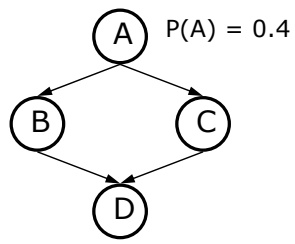

| A | B | C | D |
| --- | --- | --- | --- |
| T | F | T | T |
| … |  |  |  |
|  |  |  |  |

•Flip a coin where $\mathsf { P } ( \mathsf { T } ) { = } 0 . 4 ,$ assume we get T, use that value for A

We flip our coin, let's say, and we get true for A -- this time. And now, given the assignment of true to A, we look in the conditional probability table for B given A = true, and that gives us a probability for B.

Lecture 16 • 60

<!-- page: 61 -->

Now, we flip a coin with that probability. Say we get False. We enter that into the table.

<!-- page: 62 -->

## Sampling

To get approximate answer we can do stochastic simulation (sampling).


| A | B | C | D |
| --- | --- | --- | --- |
| T | F | T | T |
| … |  |  |  |
|  |  |  |  |

•Flip a coin where P(T)=0.4, assume we get T, use that value for A •Given A=T, lookup P(B|A=T) and flip a coin with that prob., assume we get F

•Similarly for C and D

Lecture 16 • 62

We do the same thing for C, and let’s say we get True.

<!-- page: 63 -->

## Sampling

To get approximate answer we can do stochastic simulation (sampling).


| A | B | C | D |
| --- | --- | --- | --- |
| T | F | T | T |
| … |  |  |  |
|  |  |  |  |

•Flip a coin where P(T)=0.4, assume we get T, use that value for A •Given A=T, lookup P(B|A=T) and flip a coin with that prob., assume we get F

•Similarly for C and D

Lecture 16 • 63

Now, we look in the CPT for D given B and C, for the case where B is false and C is true, and we flip a coin with that probability, in order to get a value for D.

<!-- page: 64 -->

## Sampling

To get approximate answer we can do stochastic simulation (sampling).

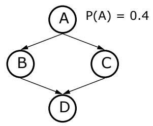

| A | B | C | D |
| --- | --- | --- | --- |
| T | F | T | T |
| … |  |  |  |
|  |  |  |  |

•Flip a coin where P(T)=0.4, assume we get T, use that value for A

•Given A=T, lookup P(B|A=T) and flip a coin with that prob., assume we get F

•Similarly for C and D

•We get one sample from joint distribution of these four vars

Lecture 16 • 64

So, there's one sample from the joint distribution of these four variables. And you can just keep doing this, all day and all night, and generate a big pile of samples, using that algorithm. And now you can ask various questions.

<!-- page: 65 -->

## Sampling

To get approximate answer we can do stochastic simulation (sampling).

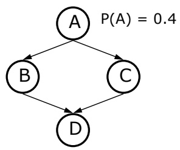

| A | B | C | D |
| --- | --- | --- | --- |
| T | F | T | T |
| … |  |  |  |
|  |  |  |  |

Estimate:

•Flip a coin where P(T)=0.4, assume we get T, use that value for A

P\*(D|A) = #D,A / #A •Given A=T, lookup P(B|A=T) and flip a coin with that prob., assume we get F

•Similarly for C and D

•We get one sample from joint distribution of these four vars

Lecture 16 • 65

Let's say you want to know the probability of D given A. How would you answer - - given all the examples -- what would you do to compute the probability of D given A? You would just count. You’d count the number of cases in which A and D were true, and you’d divide that by the number of cases in which A was true, and that would give you an unbiased estimate of the probability of D given A. The more samples, the more confidence you’d have that the estimated probability is close to the true one.

<!-- page: 66 -->

It's going to turn out that some probabilities are easier than other ones to estimate.

<!-- page: 67 -->

## Estimation

• Some probabilities are easier than others to estimate

• In generating the table, the rare events will not be well represented

Lecture 16 • 67

Exactly because of the process we’re using to generate the samples, the majority of them will be the typical cases. Oh, it's someone with a cold, someone with a cold, someone with a cold, someone with a cold, someone with a cold, someone with malaria, someone with a cold, someone with a cold. So the rare results are not going to come up very often. And so doing this sampling naively can make it really hard to estimate the probability of a rare event. If it's something that happens one in ten thousand times, well, you know for sure you're going to need, some number of tens of thousands of samples to get even a reasonable estimate of that probability.

<!-- page: 68 -->

Imagine that you want to estimate the probability of some disease given -- oh, I don't know -- spots on your tongue and a sore toe. Somebody walks in and they have a really peculiar set of symptoms, and you want to know what's the probability that they have some disease.

<!-- page: 69 -->

## Estimation

• Some probabilities are easier than others to estimate

• In generating the table, the rare events will not be well represented

• P(Disease| spots-on-your-tongue, sore toe)

• If spots-on-your-tongue and sore toe are not root nodes, you would generate a huge table but the cases of interest would be very sparse in the table

Lecture 16 • 69

Well, if the symptoms are root nodes, it's easy. If the symptoms were root nodes, you could just assign the root nodes to have their observed values and then simulate the rest of the network as before.

<!-- page: 70 -->

## Estimation

• Some probabilities are easier than others to estimate

• In generating the table, the rare events will not be well represented

• P(Disease| spots-on-your-tongue, sore toe)

• If spots-on-your-tongue and sore toe are not root nodes, you would generate a huge table but the cases of interest would be very sparse in the table

Lecture 16 • 70

But if the symptoms aren't root nodes then if you do naïve sampling, you would generate a giant table of samples, and you'd have to go and look and say, gosh, how many cases do I have where somebody has spots on their tongue and a sore toe; and the answer would be, well, maybe zero or not very many.

<!-- page: 71 -->

## Estimation

• Some probabilities are easier than others to estimate

• In generating the table, the rare events will not be well represented

• P(Disease| spots-on-your-tongue, sore toe)

• If spots-on-your-tongue and sore toe are not root nodes, you would generate a huge table but the cases of interest would be very sparse in the table

• Importance sampling lets you focus on the set of cases that are important to answering your question

Lecture 16 • 71

There’s a technique called importance sampling, which allows you to draw examples from a distribution that’s going to be more helpful and then reweight them so that you can still get an unbiased estimate of the desired conditional probability. It’s a bit beyond the scope of this class to get into the details, but it’s an important and effective idea.

<!-- page: 72 -->

# Recitation Problem

• Do the variable elimination algorithm on the net below using the elimination order A,B,C (that is, eliminate node C first). In computing P(D=d), what factors do you get?

• What if you wanted to compute the whole marginal distribution P(D)?

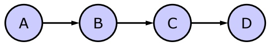

Lecture 16 • 72

Here’s the network we started with. We used elimination order C, B, A (we eliminated A first). Now we’re going to explore what happens when we eliminate the variables in the opposite order. First, work on the case we did, where we’re trying to calculate the probability that node D takes on a particular value, little d. Remember that little d is a constant in this case. Now, do the case where we’re trying to find the whole distribution over D, so we don’t know a particular value for little d.

<!-- page: 73 -->

# Another Recitation Problem

Find an elimination order that keeps the factors small for the net below, or show that there is no such order.

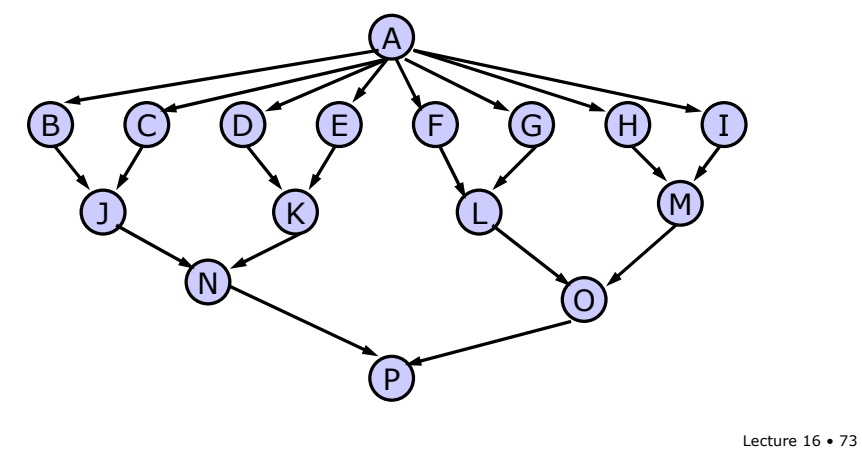

Here’s a pretty complicated graph. But notice that no node has more than 2 parents, so none of the CPTs are huge. The question is, is this graph hard for variable elimination? More concretely, can you find an elimination order that results only in fairly small factors? Is there an elimination order that generates a huge factor?

<!-- page: 74 -->
