<!-- page: 1 -->

**6.825 Techniques in Artificial Intelligence**

# Where do Bayesian Networks Come From?

Lecture 17 • 1

So now we know what to do with a network if we have one; that is, how to answer queries about the probability of some variables given observations of others. But where do we get the networks in the first place?

<!-- page: 2 -->

# 6.825 Techniques in Artificial Intelligence

## Where do Bayesian Networks Come From?

• Human experts

Lecture 17 • 2

When Bayesian networks were first developed for applications, it was in the context of expert systems. The idea was that “knowledge engineers”, who were familiar with the technology, would go and interview experts and elicit from them their expert knowledge about the domain they worked in. So the knowledge engineer would go talk to a physician about diagnosing diseases, or an engineer about building bridges, and together they would build a Bayes net.

<!-- page: 3 -->

# 6.825 Techniques in Artificial Intelligence

## Where do Bayesian Networks Come From?

• Human experts

Lecture 17 • 3

It turned out that this was pretty hard. We’ve already seen that humans aren’t very good at probabilistic reasoning. It turns out that it’s also hard for them to come up with good probabilistic descriptions of what they know and do. One way to make the problem easier for humans is to give them some fixed structures for the kinds of relationships they can express among the variables. We’ll talk a little bit about that in this lecture.

<!-- page: 4 -->

But the big thing that has happened recently in the Bayes net world is a move toward learning from data. Given example cases in a domain: patients or loan applications or bridge designs, we can use learning techniques to build Bayesian networks that are good models of the domain.

<!-- page: 5 -->

Of course, there are other learning algorithms available. But one of the great strengths of Bayesian networks is that they give us a principled way to integrate human knowledge about the domain, when it’s present and easy to articulate, with knowledge extracted from data.

<!-- page: 6 -->

Interviewing humans and trying to extract their expert knowledge is very difficult. Even though we may be experts at a variety of tasks, it’s often hard to articulate the knowledge we have.

<!-- page: 7 -->

Humans are reasonably good at specifying the dependency structure of a network, but they are particularly bad at specifying the probability distributions.

<!-- page: 8 -->

Sometimes the relationships between nodes are really easy to articulate. One example is a deterministic form. So, whether someone can drink alcohol legally is a deterministic function of the person’s age (and perhaps their country or state of residence).

<!-- page: 9 -->

## Human Experts

• Encoding rules obtained from experts, e.g. physicians for PathFinder

• Extracting these rules are very difficult, especially getting reliable probability estimates

• Some rules have a simple deterministic form:

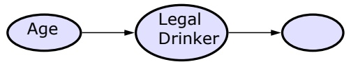

• But, more commonly, we have many potential causes for a symptom and any one of these causes are sufficient for a symptom to be true

Lecture 17 • 9

There are other structured relationships that are relatively easy to specify. One is when there are many possible causes for a symptom, and it is sufficient for at least one of the causes to be true in order for the symptom to be true.

<!-- page: 10 -->

Imagine that there are three possible causes for having a fever: flu, cold, and malaria. This network encodes the fact that flu, cold, and malaria are mutually independent of one another.

<!-- page: 11 -->

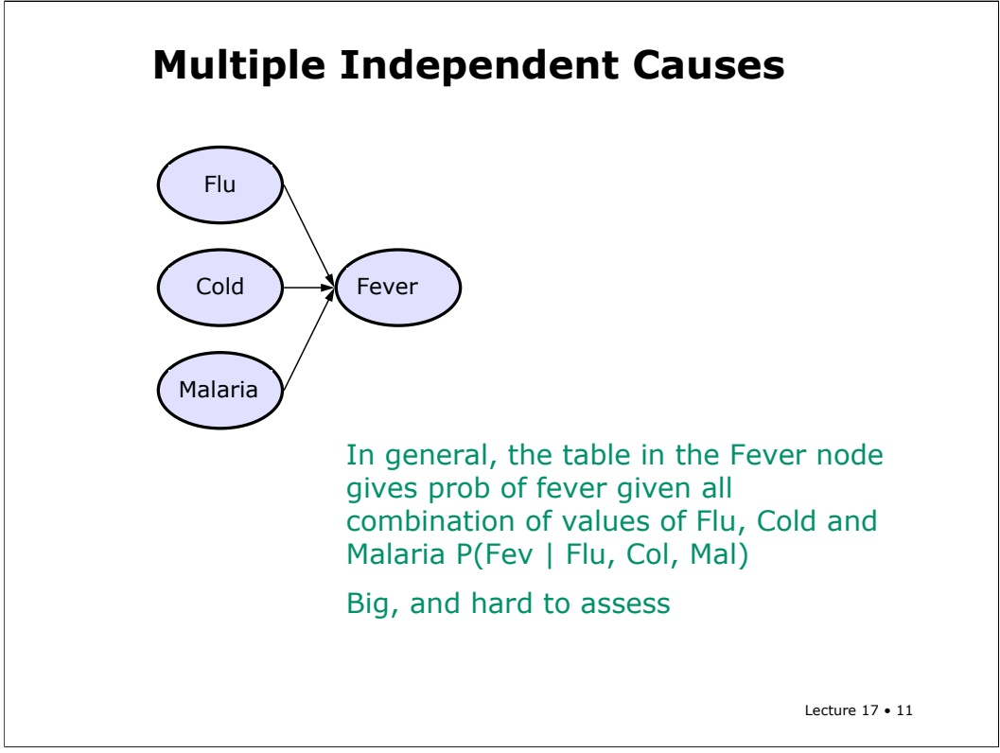

In general, the conditional probability table for fever will have to specify the probability of fever for all possible combinations of values of flu, cold, and malaria. This is a big table, and it’s hard to assess. Physicians, for example, probably don’t think very well about combinations of diseases.

<!-- page: 12 -->

## Multiple Independent Causes

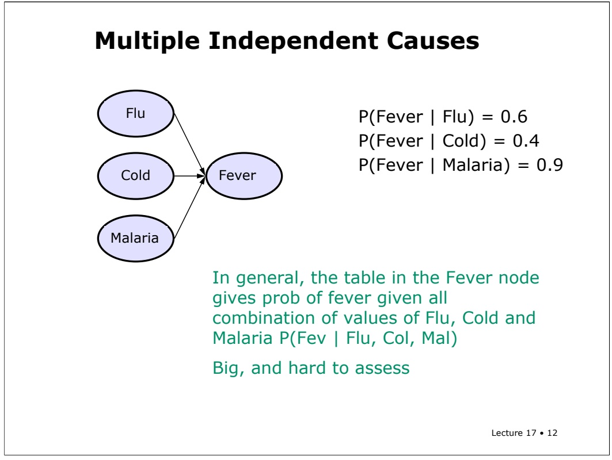

In general, the table in the Fever node gives prob of fever given all combination of values of Flu, Cold and Malaria P(Fev | Flu, Col, Mal)

It’s more natural to ask them individual conditional probabilities: what’s the probability that someone has a fever if they have the flu? We’re essentially ignoring the influence of Cold and Malaria while we think about the flu. The same goes for the other conditional probabilities. We can ask about P(fever | cold) and P(fever | malaria) separately.

<!-- page: 13 -->

$$
\mathrm{P} (\text {Fever} \mid \text {Flu}) = 0. 6
$$

$$
\mathrm{P} (\text {Fever} \mid \text {Cold}) = 0. 4
$$

$$
\mathrm{P} (\text {Fever} \mid \text {Malaria}) = 0. 9
$$

Now, the question is, what can we do with those independently specified conditional probabilities? They don’t by themselves, specify the whole CPT for the fever node.

<!-- page: 14 -->

## Noisy Or Example

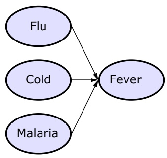

P(Fever | Flu) = 0.6

$$
\mathrm{P} (\text {Fever} \mid \text {Malaria}) = 0. 9
$$

We are assuming that the causes act independently, which reduces the set of numbers that we need to acquire

One way to think about this is that P(fever | flu) is a probability that describes an unreliable connection between flu and fever. If the patient has flu, and the connection is on, then he will certainly have fever. Thus it is sufficient for one connection to be made from a positive variable into fever, from any of its causes. If none of the causes are true, then the probability of fever is assumed to be zero (though it’s always possible to add an extra cause that’s always true, but which has a weak connection, to model the possibility of getting a fever “for no reason”).

<!-- page: 15 -->

$$
\mathrm{P} (\text {Fever} \mid \text {Malaria}) = 0. 9
$$

So, how can we compute the probability of fever given that a patient has the flu and malaria, but not a cold. First of all, we’ve assumed that false variables play no role in this probability, so we can ignore cold.

<!-- page: 16 -->

$$
\mathrm{P} (\text {Fever} \mid \text {Flu}) = 0. 6
$$

$$
\mathrm{P} (\text {Fever} \mid \text {Cold}) = 0. 4
$$

$$
\mathrm{P} (\text {Fever} \mid \text {Malaria}) = 0. 9
$$

$$
P (F e v \mid F l u, \neg C o l, M a l) = 1 - P (\neg F e v \mid F l u, M a l)
$$

Now, we’re going to think about the probability of fever, given flu and malaria. It’s easier to think about it in the negative.

<!-- page: 17 -->

## Noisy Or Example

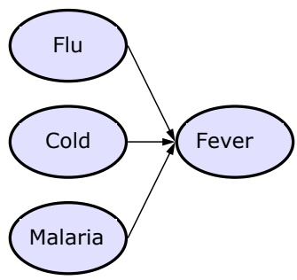

$$
\begin{array}{l} \mathrm{P(Fever|Flu)=0.6} \\ \mathrm{P(Fever|Cold)=0.4} \\ \mathrm{P(Fever|Malaria)=0.9} \end{array}
$$

We are assuming that the causes act independentl $\vee ,$ which reduces the set of numbers that we need to acquire

Look only at the causes that are true:

$$
P (F e v \mid F l u, \neg C o l, M a l) = 1 - P (\neg F e v \mid F l u, M a l)
$$

$$
P (\neg F e v \mid F l u, M a l) = P (\neg F e v \mid F l u) P (\neg F e v, M a l)
$$

Lecture 17 • 17

The probability that a patient won’t have a fever given that he has flu and malaria, is the probability that both of those connections are broken. In order to get this from the information we know, we’ll also have to assume that whether one connection is broken is independent of whether the others are broken.

<!-- page: 18 -->

## Noisy Or Example

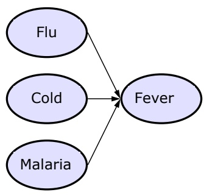

$$
\begin{array}{l} \mathrm{P(Fever|Flu)=0.6} \\ \mathrm{P(Fever|Cold)=0.4} \\ \mathrm{P(Fever|Malaria)=0.9} \end{array}
$$

We are assuming that the causes act independentl $\vee ,$ which reduces the set of numbers that we need to acquire

Look only at the causes that are true:

$$
P (F e v \mid F l u, \neg C o l, M a l) = 1 - P (\neg F e v \mid F l u, M a l)
$$

$$
P (\neg F e v \mid F l u, M a l) = P (\neg F e v \mid F l u) P (\neg F e v, M a l)
$$

Lecture 17 • 18

So, in this special case, the probability of not fever given flu and malaria, is the probability of not fever given flu times the probability of not fever given malaria.

<!-- page: 19 -->

## Noisy Or Example

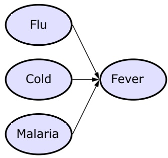

$$
\begin{array}{l} \mathrm{P(Fever|Flu)=0.6} \\ \mathrm{P(Fever|Cold)=0.4} \\ \mathrm{P(Fever|Malaria)=0.9} \end{array}
$$

We are assuming that the causes act independentl $\vee ,$ which reduces the set of numbers that we need to acquire

Look only at the causes that are true:

$$
P (F e v \mid F l u, \neg C o l, M a l) = 1 - P (\neg F e v \mid F l u, M a l)
$$

$$
\begin{array}{c} P (\neg F e v \mid F l u, M a l) = P (\neg F e v \mid F l u) P (\neg F e v, M a l) \\ = (0. 4) (0. 1) = 0. 0 4 \end{array}
$$

Lecture 17 • 19

The probability of not fever given flu is 1 minus the probability of fever given flu, which we know. The same thing applies for not fever given malaria, so we can compute that P not fever given flu and malaria is .96.

<!-- page: 20 -->

Here’s the general formula for noisy or. Assume we know P(effect | cause) for each possible cause. And we’re given a set, CT, of causes that are true for a particular case.

<!-- page: 21 -->

$$
\Pr (E | C) = 1 - \Pr (\neg E | C)
$$

Then to compute probability of E given C, we approach it by computing probability of not E given C.

<!-- page: 22 -->

## Noisy Or

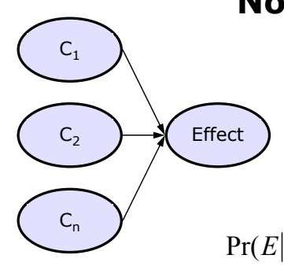

• Store $\mathsf { P } ( \mathsf { E } | \mathsf { C } _ { \mathsf { i } } )$ for all $C _ { \mathrm { i } }$

• Given a set, $C _ { \mathrm { { T r } } }$ of true causes

$$
\Pr (E | C) = 1 - \Pr (\neg E | C)
$$

$$
= 1 - \Pr (\neg E | C _ {T})
$$

That’s equal to the probability of not E just given the causes that are true in this case, CT.

<!-- page: 23 -->

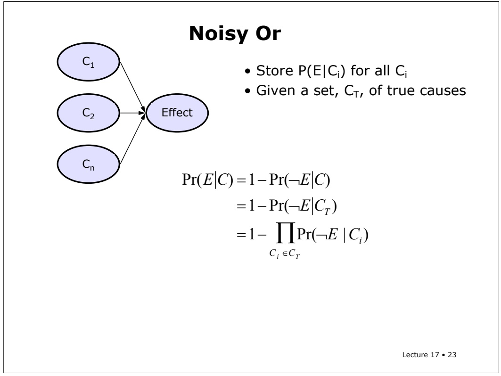

## Noisy Or

• Store P(E|Ci) for all $C _ { \mathrm { i } }$

• Given a set, $\mathsf { C } _ { \mathsf { T } } ,$ of true causes

Now, because of the assumption that the causes operate independently (that, is, whether one is in effect is independent of whether another is in effect), we can take the product over the causes of the probability of the effect being absent given the cause.

<!-- page: 24 -->

$$
\begin{array}{r l} \operatorname * {P r} (E | C) & = 1 - \operatorname * {P r} (\neg E | C) \\ & = 1 - \operatorname * {P r} (\neg E | C _ {T}) \\ & = 1 - \prod_ {C _ {i} \in C _ {T}} \operatorname * {P r} (\neg E \mid C _ {i}) \\ & = 1 - \prod_ {C _ {i} \in C _ {T}} (1 - \operatorname * {P r} (E \mid C _ {i})) \end{array}
$$

Finally, we can easily convert the probabilities of not E given C, into 1 – probability of E given C.

<!-- page: 25 -->

Using the numbers from the previous example, fill in the whole CPT for fever given flu, malaria, and cold.

<!-- page: 26 -->

Lecture 17 • 26

## Learning Bayesian Networks

• Instance of the general problem of probability density estimation

• discrete space

• interesting structure

Another way to get a Bayesian network is to learn it from data. It’s an instance of the problem, known in the statistics literature as density estimation. We’re trying to estimate a probability density (that is, a joint probability distribution) from data. What makes the problem of learning bayes nets different from the ones that statisticians typically consider is that our problem is in a discrete space, and that we’re looking for models that encode the underlying conditional independences in the data.

<!-- page: 27 -->

## Learning Bayesian Networks

• Instance of the general problem of probability density estimation

• discrete space

• interesting structure

• Four cases

• structure known or unknown

• all variables observable or some unobservable

Lecture 17 • 27

There are really four different cases in which you could try to learn bayes nets. We’ll look at two today, and the other two next time. One question is whether you are trying to learn the structure of the domain, or just the values in the CPTs. The problem of learning values given structure is **much** easier. And often a human can provide a reasonable structure. But sometimes we’ll want to try to learn the structure as well.

<!-- page: 28 -->

## Learning Bayesian Networks

• Instance of the general problem of probability density estimation

• discrete space

• interesting structure

• Four cases

• structure known or unknown

• all variables observable or some unobservable

This lecture: all variables observable, structure known or unknown

Lecture 17 • 28

The other question is whether all the variables are observable or not. Today, we’ll focus on the case in which all of the variables in the network are observable. This makes sense in some domains, but not in all of them. So, we’ll assume that the data we are learning from contains samples of values from all the variables in the net.

<!-- page: 29 -->

First, we’ll think about the case in which the structure of the network is given. That is, we know exactly what nodes it has, and we have a set of directed arcs between them.

<!-- page: 30 -->

We’re given a data set D. D is made up of a set of **cases** or **samples**, each of which is a vector of values, one for each variable. So v with a superscript k refers to data case k, and the subscript I indexes over variables.

<!-- page: 31 -->

In a medical example, you might imagine that each case or sample is a description of a person that walked into the emergency room. The cases are assumed to be drawn independently from some distribution that is specified by M. That means, for instance, that there’s no information in the order in which they arrive.

<!-- page: 32 -->

## Known Structure

• Given nodes and arcs of a Bayesian network with m nodes

• Given a data set $\mathsf { D }   =   \{ \scriptstyle < \mathsf { v _ { 1 } } ^ { 1 } , \dots , \mathsf { v _ { m } } ^ { 1 } > , \dots , \{ \scriptstyle < \mathsf { v _ { 1 } } ^ { \mathsf { k } } , \dots , \mathsf { v _ { m } } ^ { \mathsf { k } } > \} }$

values of nodes values of nodes in sample 1 in sample k

• Elements of D are assumed to be independent given M

• Find the model M (in this case, CPTs) that maximizes Pr(D|M)

Lecture 17 • 32

Our goal will be to find the model M that maximizes the probability of the data given the model. In this case, a model is just all the CPTs required by the specified network structure. We’d like to find the model that makes this data set as likely as possible.

<!-- page: 33 -->

## Known Structure

• Given nodes and arcs of a Bayesian network with m nodes

• Given a data set $\mathsf { D }   =   \{ \scriptstyle < \mathsf { v _ { 1 } } ^ { 1 } , \dots , \mathsf { v _ { m } } ^ { 1 } > , \dots , \{ \scriptstyle < \mathsf { v _ { 1 } } ^ { \mathsf { k } } , \dots , \mathsf { v _ { m } } ^ { \mathsf { k } } > \} }$

values of nodes values of nodes in sample 1 in sample k

• Elements of D are assumed to be independent given M

• Find the model M (in this case, CPTs) that maximizes Pr(D|M)

• Known as the maximum likelihood model

Lecture 17 • 33

There are other possible criteria for fitting models to data, but this is a simple, standard one. It is often said that we are looking for the **maximum likelihood** model.

<!-- page: 34 -->

## Known Structure

• Given nodes and arcs of a Bayesian network with m nodes

• Given a data set $\mathsf { D }   =   \{ \scriptstyle < \mathsf { v _ { 1 } } ^ { 1 } , \dots , \mathsf { v _ { m } } ^ { 1 } > , \dots , \{ \scriptstyle < \mathsf { v _ { 1 } } ^ { \mathsf { k } } , \dots , \mathsf { v _ { m } } ^ { \mathsf { k } } > \} }$

values of nodes values of nodes in sample 1 in sample k

• Elements of D are assumed to be independent given M

• Find the model M (in this case, CPTs) that maximizes Pr(D|M)

• Known as the maximum likelihood model

• Humans are good at providing structure, data is good at providing numbers

Lecture 17 • 34

This particular setting of the bayes net learning problem, is relatively easy from a technical perspective, but also very important from a practical one. Humans tend to be good at providing the network structure, but bad at specifying the conditional probabilities. Computers, on the other hand, have a much harder time figuring out the structure, but are great at estimating probabilities from data, as we’ll see.

<!-- page: 35 -->

# Estimating Conditional Probabilities

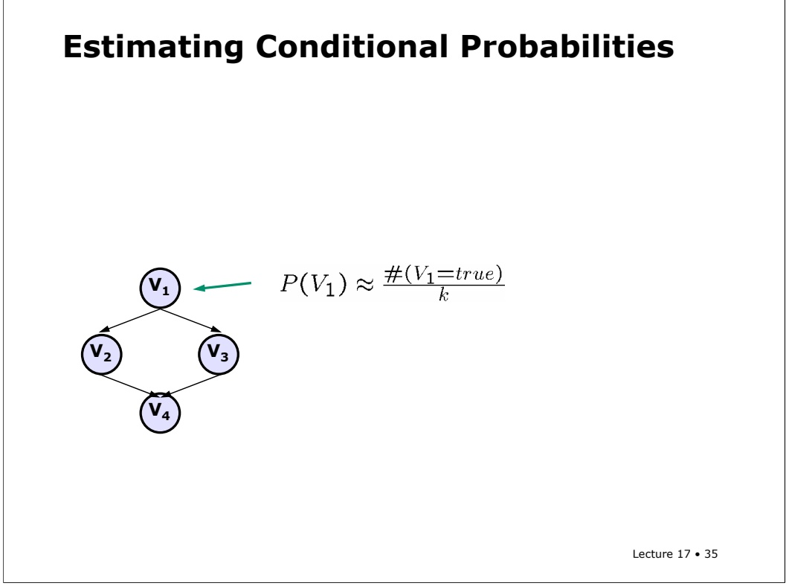

So, given a data set, how can we estimate the probability values in our network? Let’s start with the easiest case, the probability that V1 is true. All we have to do is count how many times v1 was true in our data set and divide by k, the total number of cases in the data set.

<!-- page: 36 -->

# Estimating Conditional Probabilities

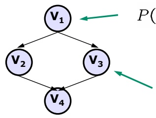

$$
P (V _ {1}) \approx \frac {\# (V _ {1} = t r u e)}{k}
$$

$$
P (V _ {3} | V _ {1}) \approx \frac {\# (V _ {3} = t r u e \land V _ {1} = t r u e)}{\# (V _ {1} = t r u e)}
$$

Lecture 17 • 36

That was easy! And the conditional probabilities are not much harder. To get an estimate of the probability that v3 is true given that v1 is true, we just count the number of cases in which v1 and v3 are both true, and divide by the number of cases in which v1 is true.

<!-- page: 37 -->

$$
P (V _ {1}) \approx \frac {\# (V _ {1} = t r u e)}{k}
$$

$$
P (V _ {3} | V _ {1}) \approx \frac {\# (V _ {3} = t r u e \land V _ {1} = t r u e)}{\# (V _ {1} = t r u e)}
$$

$$
P (V _ {3} | \neg V _ {1}) \approx \frac {\# (V _ {3} = t r u e \land V _ {1} = f a l s e)}{\# (V _ {1} = f a l s e)}
$$

The probability of V3 given not v1 is similar, as are all the elements of all the CPTs in the network.

<!-- page: 38 -->

# Estimating Conditional Probabilities

• Use counts and definition of conditional probability

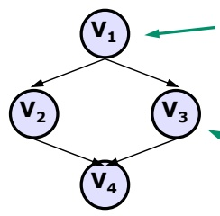

$$
P (V _ {1}) \approx \frac {\# (V _ {1} = t r u e)}{k}
$$

$$
P (V _ {3} | V _ {1}) \approx \frac {\# (V _ {3} = t r u e \land V _ {1} = t r u e)}{\# (V _ {1} = t r u e)}
$$

$$
P (V _ {3} | \neg V _ {1}) \approx \frac {\# (V _ {3} = t r u e \land V _ {1} = f a l s e)}{\# (V _ {1} = f a l s e)}
$$

Lecture 17 • 38

What’s interesting about this is that this very simple estimation procedure is guaranteed to give us the model that maximizes the probability of the data. Proving that is a little bit complicated, but as long as we trust the statisticians, then we can feel comfortable that by using these ratios to estimate our probabilities, we are getting the maximum likelihood model.

<!-- page: 39 -->

# Estimating Conditional Probabilities

• Use counts and definition of conditional probability

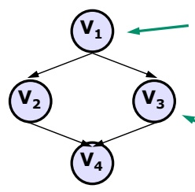

$$
P (V _ {1}) \approx \frac {\# (V _ {1} = t r u e)}{k}
$$

$$
P (V _ {3} | V _ {1}) \approx \frac {\# (V _ {3} = t r u e \land V _ {1} = t r u e)}{\# (V _ {1} = t r u e)}
$$

$$
P (V _ {3} | \neg V _ {1}) \approx \frac {\# (V _ {3} = t r u e \land V _ {1} = f a l s e)}{\# (V _ {1} = f a l s e)}
$$

Lecture 17 • 39

There is still a bit of a problem with this approach though. What happens when we’re trying to estimate the probability of v3 given v1, but there are no cases of v3 and v1 being true? We’ll get an estimate of 0 for that probability. That may not be terrible, but if we haven’t seen a whole lot of data yet, it might seem a bit hasty to conclude that something is impossible, just because you haven’t yet seen an example of it. In general, putting 0s and 1s in a CPT is a very strong thing to do: it means you’re absolutely sure that something is impossible.

<!-- page: 40 -->

$$
P (V _ {1}) \approx \frac {\# (V _ {1} = t r u e) + 1}{k + 2}
$$

$$
P (V _ {3} | V _ {1}) \approx \frac {\# (V _ {3} = t r u e \land V _ {1} = t r u e) + 1}{\# (V _ {1} = t r u e) + 2}
$$

$$
P (V _ {3} | \neg V _ {1}) \approx \frac {\# (V _ {3} = t r u e \land V _ {1} = f a l s e) + 1}{\# (V _ {1} = f a l s e) + 2}
$$

To guard against this, and also to keep out of trouble when we haven’t seen any cases at all when v1 is true, we’ll apply a “Bayesian correction” to our estimates. This means, essentially, initializing our counts at 1 rather than at 0. So, we add a 1 to the count in the numerator, and a value m to the denominator, where m is the number of possible different values the variable whose probability we are estimating can take on. In this case, assuming binary variables, we add a 2 in the denominator.

<!-- page: 41 -->

$$
P (V _ {1}) \approx \frac {\# (V _ {1} = t r u e) + 1}{k + 2}
$$

$$
P (V _ {3} | V _ {1}) \approx \frac {\# (V _ {3} = t r u e \land V _ {1} = t r u e) + 1}{\# (V _ {1} = t r u e) + 2}
$$

$$
P (V _ {3} | \neg V _ {1}) \approx \frac {\# (V _ {3} = t r u e \land V _ {1} = f a l s e) + 1}{\# (V _ {1} = f a l s e) + 2}
$$

This correction has the effect that if we haven’t seen any examples at all of v1, for instance, we estimate the probability of v3 given v1 to be 0.5. That seems reasonable, and certainly better than 0 or undefined!

<!-- page: 42 -->

$$
\textcircled {V} _ {1} \leftarrow P (V _ {1}) \approx \frac {\# (V _ {1} = t r u e) + 1}{k + 2}
$$

$$
P (V _ {3} | V _ {1}) \approx \frac {\# (V _ {3} = t r u e \land V _ {1} = t r u e) + 1}{\# (V _ {1} = t r u e) + 2}
$$

$$
P (V _ {3} | \neg V _ {1}) \approx \frac {\# (V _ {3} = t r u e \land V _ {1} = f a l s e) + 1}{\# (V _ {1} = f a l s e) + 2}
$$

Of course, once we add this correction in, we will no longer be getting the maximum likelihood model. But we might be getting one that has slightly better generalization properties. And in the long run, as we get more data, the correction will have less and less effect. So, in the limit of large data, we will get the maximum likelihood model.

<!-- page: 43 -->

## Goodness of Fit

• Given data set D and model M, measure goodness of fit using log likelihood

Lecture 17 • 43

One thing we can do with a model and a data set is to measure the **goodness of fit** of the model to the data. How well does this model account for the data? As our measure of goodness of fit, we will use the log likelihood.

<!-- page: 44 -->

$$
\Pr (D | M) = \prod_ {j} \Pr (v ^ {j} | M)
$$

We’ll start by computing the probability that this data would have been generated by the model. Under the assumption that the cases within the data set are generated independently given the model, the probability of the whole data set given the model is the product of the probabilities of the individual cases, given the model.

<!-- page: 45 -->

$$
\begin{array}{l} \Pr (D | M) = \prod_ {j} \Pr (v ^ {j} | M) \\ \qquad = \prod_ {j} \prod_ {i} \Pr (N _ {i} = v _ {i} ^ {j} | P a r e n t s (N _ {i}), M) \end{array}
$$

Then, using the chain rule of bayes nets, we can break the probability of a case down into a product of the probabilities of each node having the value it has in this case, given the model and the values of its parents in this case.

<!-- page: 46 -->

$$
\begin{array}{l} \Pr (D | M) = \prod_ {j} \Pr (v ^ {j} | M) \\ \qquad = \prod_ {j} \prod_ {i} \Pr (N _ {i} = v _ {i} ^ {j} | P a r e n t s (N _ {i}), M) \end{array}
$$

Now, if we actually tried to compute this product in a computer, we’d run into trouble before very long. We’re multiplying together a bunch of small numbers and we’ll run into numeric underflow problems. So, rather than working directly with the likelihood, we’ll work with its log. Because the log function is monotonic, the same model that maximizes the likelihood will maximize the log likelihood.

<!-- page: 47 -->

## Goodness of Fit

• Given data set D and model $M ,$ measure goodness of fit using log likelihood

• Assume each data sample generated independently

$$
\begin{array}{l} \Pr (D | M) = \prod_ {j} \Pr (v ^ {j} | M) \\ \qquad = \prod_ {j} \prod_ {i} \Pr (N _ {i} = v _ {i} ^ {j} | P a r e n t s (N _ {i}), M) \end{array}
$$

• Easier to compute the log; monotonic

$$
\begin{array}{l} \log \Pr (D | M) = \log \prod_ {j} \prod_ {i} \Pr (N _ {i} = v _ {i} ^ {j} | P a r e n t s (N _ {i}), M) \\ \qquad = \sum_ {j} \sum_ {i} \log \Pr (N _ {i} = v _ {i} ^ {j} | P a r e n t s (N _ {i}), M) \end{array}
$$

Lecture 17 • 47

The log also has the nice property that it turns all of our multiplications into additions, which are typically more efficient to compute.

<!-- page: 48 -->

## Goodness of Fit

• Given data set D and model $M ,$ measure goodness of fit using log likelihood

• Assume each data sample generated independently

$$
\begin{array}{l} \Pr (D | M) = \prod_ {j} \Pr (v ^ {j} | M) \\ \qquad = \prod_ {j} \prod_ {i} \Pr (N _ {i} = v _ {i} ^ {j} | P a r e n t s (N _ {i}), M) \end{array}
$$

• Easier to compute the log; monotonic

$$
\begin{array}{l} \log \Pr (D | M) = \log \prod_ {j} \prod_ {i} \Pr (N _ {i} = v _ {i} ^ {j} | P a r e n t s (N _ {i}), M) \\ \qquad = \sum_ {j} \sum_ {i} \log \Pr (N _ {i} = v _ {i} ^ {j} | P a r e n t s (N _ {i}), M) \end{array}
$$

Lecture 17 • 48

So, given a model and a dataset, we can measure the goodness of fit effectively using the log likelihood.

<!-- page: 49 -->

Now we know how to find the parameter values to make the maximum likelihood model, if we’ve already been given the structure.

<!-- page: 50 -->

What if we get to pick the structure as well? It seems to make sense to keep the same criterion: we want to maximize the likelihood of the data given the model.

<!-- page: 51 -->

## Learning the Structure

• For a fixed structure, our counting estimates of the CPT converge to the maximum likelihood model

• What if we get to pick the structure as well?

• In general, the best model will have no conditional independence relationships

Lecture 17 • 51

Unfortunately, it will almost always be the case that the maximum likelihood structural model will have no conditional independence relationships. Even if we have two variables that are completely independent, when we examine a data set generated from those variables, they will look every-so-slightly dependent, and by making them dependent in our model, we’ll be able to increase the likelihood.

<!-- page: 52 -->

Unfortunately, these aren’t really the models we want. We’d like to be able to find models that reveal the conditional independence relationships that are present in the world. We’d also like to be able to find models that are relatively small and easy to work with. Additionally, these models suffer from a problem called overfitting, which is easiest to illustrate first in a slightly different context.

<!-- page: 53 -->

• Given a set of data points

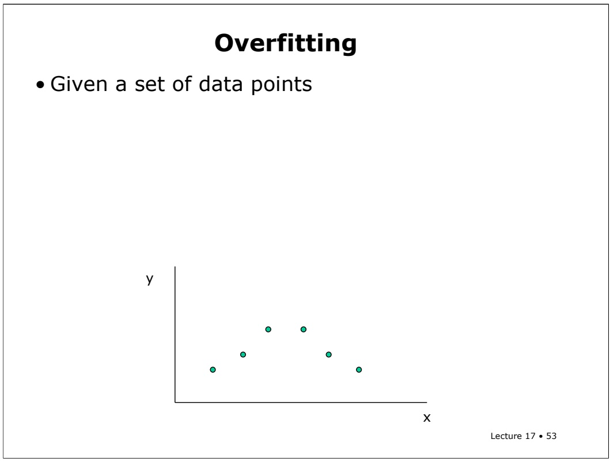

Imagine you were given the following set of points in the X-Y plane, and I asked you to make a model of them in the form of a function from x to y.

<!-- page: 54 -->

## Overfitting

• Given a set of data points, you could • fit them with a line, with a lot of error

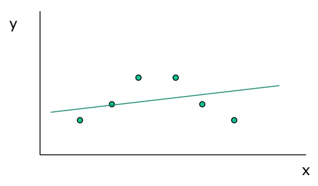

You might fit them with a straight line, with a large amount of error.

<!-- page: 55 -->

Lecture 17 • 55

## Overfitting

• Given a set of data points, you could • fit them with a line, with a lot of error • fit with a parabola, with a little error

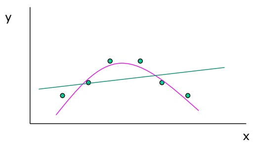

You might get a better fit by moving to a parabola, a polynomial of degree two, by making your class of models more complex.

<!-- page: 56 -->

## Overfitting

• Given a set of data points, you could

• fit them with a line, with a lot of error

• fit with a parabola, with a little error

• fit with 10th order polynomial, with no error

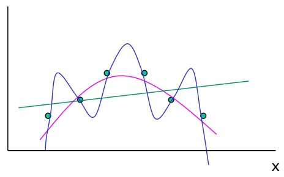

Lecture 17 • 56

You could even fit them with a 10-th order polynomial, with no error at all.

<!-- page: 57 -->

## Overfitting

• Given a set of data points, you could

• fit them with a line, with a lot of error

• fit with a parabola, with a little error

• fit with 10th order polynomial, with no error

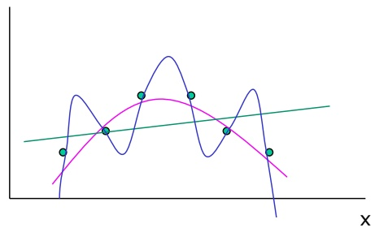

Lecture 17 • 57

Which of these models, or explanations of the data, is best? It’s really hard to answer that question without knowing something about the world that you’re living in; something about the process that generated your data.

<!-- page: 58 -->

## Overfitting

• Given a set of data points, you could

• fit them with a line, with a lot of error

• fit with a parabola, with a little error

• fit with 10th order polynomial, with no error

• 10th order polynomial over fits

• less robust to variations in data

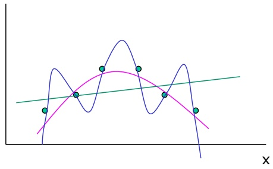

Lecture 17 • 58

Intuitively, though, we all feel like the 10th order polynomial is not a very good model. A machine learning person would say that it **overfits** the data. That means that it is too sensitive to this particular data set. If you were to get slightly different data points, the linear model wouldn’t change much at all, the parabola might change a little bit, but the high-order model might change dramatically, with the loops moving way up and down.

<!-- page: 59 -->

## Overfitting

• Given a set of data points, you could

• fit them with a line, with a lot of error

• fit with a parabola, with a little error

• fit with 10th order polynomial, with no error

• 10th order polynomial over fits

• less robust to variations in data

• less likely to generalize well


Because of this lack of robustness to variations in the data, we expect that the model won’t do a very good job of predicting the y values for x values that we haven’t seen before, which is one of the goals of learning.

<!-- page: 60 -->

## Overfitting

• Given a set of data points, you could

• fit them with a line, with a lot of error

• fit with a parabola, with a little error

• fit with 10th order polynomial, with no error

• 10th order polynomial over fits

• less robust to variations in data

• less likely to generalize well

Lecture 17 • 60


In general, the more data you have, the more complex a model you can use robustly. But there’s always a tradeoff between getting a model that’s simple versus a model that perfectly captures the particular data that you have at the moment. This tradeoff is pervasive in statistics and machine learning, and is the subject of much of the theoretical and foundational research.

<!-- page: 61 -->

So, to guard against overfitting, we are going to use something a bit more complex than maximum likelihood to select the model that we most want. It becomes crucial to address this point when we want to compare models with different structures.

<!-- page: 62 -->

In particular, we want models that fit the data well.

<!-- page: 63 -->

## Scoring Metric

• What if we want to vary the structure?

• We want a network that has conflicting properties • good fit to data: log likelihood

• low complexity: total number of parameters

Lecture 17 • 63

But we also want models with low complexity. We will characterize the complexity of a network structure by the total number of parameters in the conditional probability tables. For a binary node with no parents, one parameter is required (because the probability that the variable takes on the other value is 1 minus the specified probability). In general, for a binary node with k parents, 2^k parameters are required. For a node that can take on n values, with k parents, each of which can take on m values, (n-1) m^k parameters are required.

<!-- page: 64 -->

$$
\log \Pr (D | M) - \alpha \# M
$$

So, we’ll use as our metric a function with two terms: the first will be the log likelihood of the data given the model, and the second will be a penalty term that is linear in the number of parameters in the model.

<!-- page: 65 -->

## Scoring Metric

• What if we want to vary the structure?

• We want a network that has conflicting properties • good fit to data: log likelihood • low complexity: total number of parameters

• Try to maximize scoring metric, by varying M (structure and parameters) given D

$$
\log \Pr (D | M) - \alpha \# M
$$

• Parameter α controls the tradeoff between fit and complexity

Lecture 17 • 65

The parameter alpha is a knob that we can adjust, which controls the tradeoff between how much we emphasize goodness of fit to the data and how much we emphasize complexity. There are theoretical analyses that might help us set alpha (particularly as a function of the amount of data we have), but we won’t go into them in this class.

<!-- page: 66 -->

Now we know what we’re looking for: the network structure and parameters that maximizes the scoring metric. But how do we find it? Unfortunately, there’s no way to find the best structure directly.

<!-- page: 67 -->

And there are, in general, way too many possible structures to enumerate them all (except in some small problems).

<!-- page: 68 -->

So, we come back to a technique that we started with: local search in the space of structures. We really only need to search structure space, because for any given structure, we can find the best parameters.

<!-- page: 69 -->

To do local search, we need to start with some initial structure.

<!-- page: 70 -->

Then, we move through the space of structures, trying to improve the score of our model.

<!-- page: 71 -->

<small><span class="docvortex-page-footnote" data-block-type="page_footnote" style="color:#6b7280">There are lots of possible search strategies, but a typical one considers that the neighbors of a given structure are those structures that can be reached by adding a single arc, deleting an arc, or reversing an arc. Reversing an arc is not strictly necessary, since it can be accomplished by deleting an arc, and then adding it back in in the other direction. However, deleting the arc often causes a decrease in the score, making it an unappealing move.</span></small>

<!-- page: 72 -->

Throughout the course of the search, including during the initialization process, it’s crucial to be sure that your network doesn’t have any directed cycles.

<!-- page: 73 -->

Once you pick a structure, you can use the counting methods to compute the maximum-likelihood values for the parameters. Now you have a complete model that you can score using the scoring metric.

<!-- page: 74 -->

## Search in Structure Space

• No direct way to find the best structure

• Too many to enumerate them all

• Start with some initial structure

• Do local search in structure space

• neighborhood: add, delete, or reverse an arc

• maintain no directed cycles

• once you pick a structure, compute maximumlikelihood parameters, and then calculate the score of the model

• increase score (or decrease sometimes, as in walkSAT or simulated annealing)

Lecture 17 • 74

There are also options about what moves to accept. In the most straightforward implementations, you propose moves at random, and take them if they improve the score. You might also consider all possible moves and take the best (though it might be pretty expensive computationally), or even do simulated annealing. There are often serious problems with local minima, which might also mean that you should restart multiple times with different initial structures.

<!-- page: 75 -->

# Initialization

Lots of choices!

Lecture 17 • 75

There are lots of ways to generate an initial network.

<!-- page: 76 -->

# Initialization

Lots of choices!

• no arcs

One obvious one is to start with no arcs at all.

<!-- page: 77 -->

Another alternative is to choose a random ordering on the nodes, and then either make a completely connected network, in which each variable Vi has all parents V1 through Vi-1,

<!-- page: 78 -->

Or, if you want to start with a sparser network (which you **have** to do if you have a lot of variables), you can just select parents randomly from the preceding variables.

<!-- page: 79 -->

Another initialization method, which is very appealing, is to find the best treestructured network. It turns out that it’s possible to find the best tree-structured network in polynomial time in the number of nodes, using an algorithm due to Chow and Liu.

<!-- page: 80 -->

The rough idea is that you compute the mutual information between every pair of variables. Mutual information is a statistic that measures the degree to which two variables are dependent.

<!-- page: 81 -->

Then, you find a spanning tree (that is, a tree that connects all the nodes) whose edges have maximum total weight, where the edge weights are the mutual information values.

<!-- page: 82 -->

## Initialization

Lots of choices!

• no arcs

• choose random ordering $\mathsf { V } _ { 1 } \dots \mathsf { V } _ { \mathsf { n } }$

–variable $\mathsf { V } _ { \mathrm { i } }$ has all parents $\mathsf { V } _ { 1 } \dots \mathsf { V } _ { \mathsf { n } - 1 }$

–variable $\mathsf { V } _ { \mathrm { i } }$ has parents randomly chosen from $\mathsf { V } _ { 1 } \dots \mathsf { V } _ { \mathsf { n } - 1 }$

• best tree network (can be computed in polynomial time)

– compute pairwise mutual information between every pair of variables – find maximum-weight spanning tree

Lecture 17 • 82

Now you have all the pieces you need to implement a basic Bayesian-network learning algorithm, even without being given the structure in advance. Next time, we’ll consider what to do when some of the variables are not observable in the data set.

<!-- page: 83 -->

## Recitation problem

Consider a domain with three binary nodes: A, B, and C

1. How many possible network structures are there over three nodes?

```javascript
Data set: {<0,1,1>, <0, 1, 1>, <1,0,0>}
```

2. What parameter estimates would you get for the CPTs in each of the network structures on the following slide?

3. What is the log likelihood of the data given each of the models (given the estimates from the previous part)?

4. Do parts 2 and 3 again without the Bayesian correction (or with it, if you didn’t use it the first time)

5. How many parameters are there in each of the models? (Don’t count p and 1-p as separate parameters)

There are too many network structures for everyone to do every problem. So, if the day of your birthday is 0 mod 3, then do structures s1 and s2. If it’s 1 mod 3, then do structures s3 and s4. And if it’s 2 mod 3, then do structures s5 and s6.

Lecture 17 • 83

Here is a fairly complex recitation problem. There are too many network structures for everyone to do every problem. So, if the day of your birthday is 0 mod 3, then do structures s1 and s2. If it’s 1 mod 3, then do structures s3 and s4. And if it’s 2 mod 3, then do structures s5 and s6.

<!-- page: 84 -->

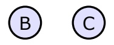

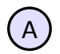

## Recitation Problem

S1

S2

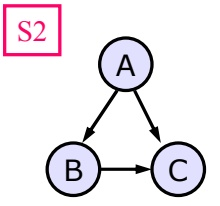

S5

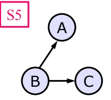

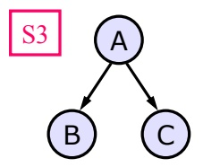

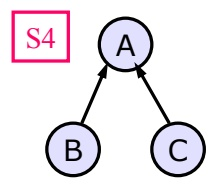

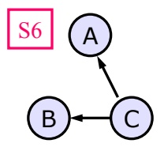

Lecture 17 • 84
