<!-- page: 1 -->

In this lecture, we’ll think about how to learn Bayes Nets with hidden variables. We’ll start out by looking at why you’d want to have models with hidden variables.

<!-- page: 2 -->

Then, because the technique we’ll use for working with hidden variables is a bit complicated. we’ll start by looking at a simpler problem, of estimating probabilities when some of the data are missing.

<!-- page: 3 -->

That will lead us to the EM algorithm, in general,

<!-- page: 4 -->

And we’ll finish by seeing how to apply it to bayes nets with hidden nodes, and we’ll work a simple example of that in great detail.

<!-- page: 5 -->

Why would we ever want to learn a Bayesian network with hidden variables? One answer is: because we might be able to learn lower-complexity networks that way. Another is that sometimes such networks reveal interesting structure in our data.

<!-- page: 6 -->

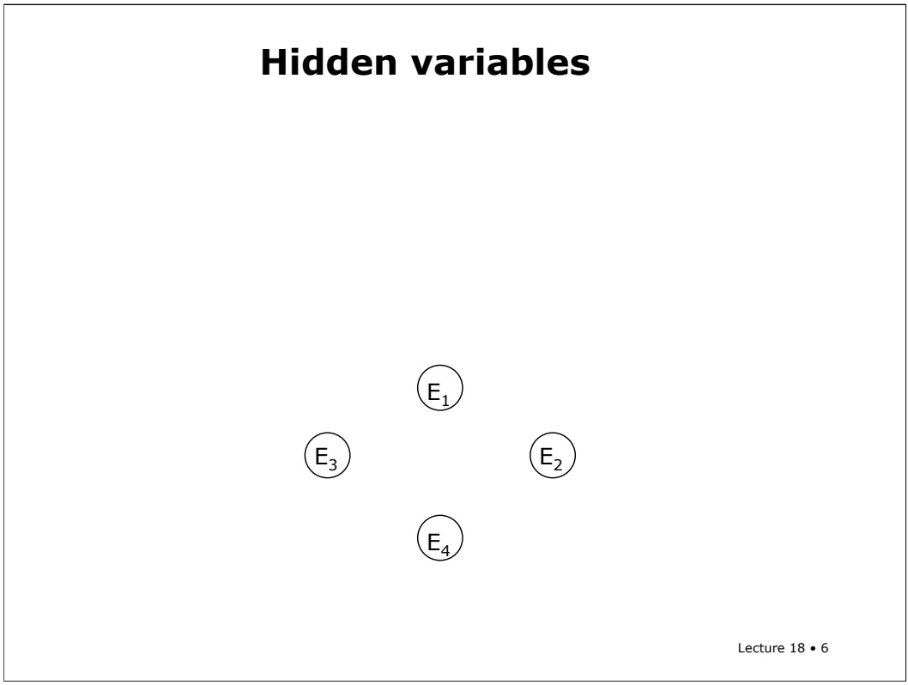

Consider a situation in which you can observe a whole bunch of different evidence variables, E1 through En. Maybe they’re all the different symptoms that a patient might have. Or maybe they represent different movies and whether someone likes them.

<!-- page: 7 -->

# Hidden variables

Without the cause, all the evidence is dependent on each other

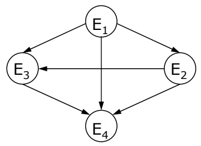

O(2n) parameters

Lecture 18 • 7

If those variables are all conditionally dependent on one another, then we’d need a highly connected graph that’s capable of representing the entire joint distribution between the variables. Because the last node has n-1 parents, it will take on the order of $2 \mathrm {  ~ \hat { n } ~ }$ parameters to specify the conditional probability tables in this network.

<!-- page: 8 -->

Cause is unobservable

## Hidden variables

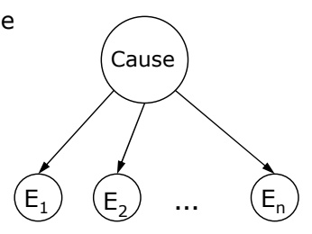

Without the cause, all the evidence is dependent on each other

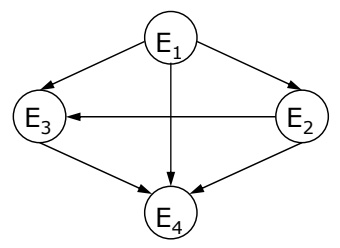

O(2n) parameters

Lecture 18 • 8

But, in some cases, we can get a considerably simpler model by introducing an additional “cause” node. It might represent the underlying disease state that was causing the patients’ symptoms or some division of people into those who like westerns and those who like comedies.

<!-- page: 9 -->

## Hidden variables

Cause is unobservable

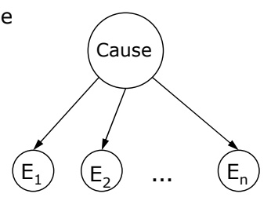

O(n) parameters

Without the cause, all the evidence is dependent on each other

O(2n) parameters

Lecture 18 • 9

In the simpler model, the evidence variables are conditionally independent given the causes. That means that it would only require on the order of n parameters to describe all the CPTs in the network, because at each node, we just need a table of size 2 (if the cause is binary; or k if the cause can take on k values), and one (or k-1) parameter to specify the probability of the cause.

<!-- page: 10 -->

## Hidden variables

Cause is unobservable

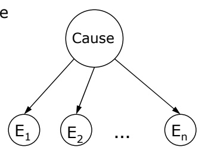

Without the cause, all the evidence is dependent on each other

O(n) parameters

O(2n) parameters

Lecture 18 • 10

So, what if you think there’s a hidden cause? How can you learn a network with unobservable variables?

<!-- page: 11 -->

| A | B |
| --- | --- |
| 1 | 1 |
| 1 | 1 |
| 0 | 0 |
| 0 | 0 |
| 0 | 0 |
| 0 | H |
| 0 | 1 |
| 1 | 0 |

## Missing Data

• Given two variables, no independence relations

Lecture 18 • 11

We’ll start out by looking at a very simple case. Imagine that you have two binary variables A and B, and you know they’re not independent. So you’re just trying to estimate their joint distribution. Ordinarily, you’d just count up how many were true, true; how many were false, false; and so on, and divide by the total number of data cases to get your maximum likelihood probability estimates.

<!-- page: 12 -->

| A | B |
| --- | --- |
| 1 | 1 |
| 1 | 1 |
| 0 | 0 |
| 0 | 0 |
| 0 | 0 |
| 0 | H |
| 0 | 1 |
| 1 | 0 |

## Missing Data

• Given two variables, no independence relations

• Some data are missing

Lecture 18 • 12

But in our case, some of the data are missing. If a whole case were missing, there wouldn’t be much we could do about it; there’s no real way to guess what it might have been that will help us in our estimation process. But if some variables in a case are filled in, and others are missing, then we’ll see how to make use of the variables that are filled in and how to get a probability distribution on the missing data.

<!-- page: 13 -->

Here, in our example, we have 8 data points, but one of them is missing a value for B.

<!-- page: 14 -->

| A | B |
| --- | --- |
| 1 | 1 |
| 1 | 1 |
| 0 | 0 |
| 0 | 0 |
| 0 | 0 |
| 0 | H |
| 0 | 1 |
| 1 | 0 |

## Missing Data

• Given two variables, no independence relations

• Some data are missing

• Estimate parameters in joint distribution

• Data must be missing at random

Lecture 18 • 14

In order for the methods we’ll talk about here to be of use, the data have to be missing at random. That means that the fact that a data item is missing is independent of the value it would have had. So, for instance, if you didn’t take somebody’s blood pressure because he was already dead, then that reading would not be missing at random! But if the blood-pressure instrument had random failures, unrelated to the actual blood pressure, then that data would be missing at random.

<!-- page: 15 -->

| A | B |
| --- | --- |
| 1 | 1 |
| 1 | 1 |
| 0 | 0 |
| 0 | 0 |
| 0 | 0 |
| 0 | H |
| 0 | 1 |
| 1 | 0 |

Ignore it

Estimated Parameters

|  | ~A | A |
| --- | --- | --- |
| ~B | 3/7 | 1/7 |
| B | 1/7 | 2/7 |

|  | ~A | A |
| --- | --- | --- |
| ~B | .429 | .143 |
| B | .143 | .285 |

The simplest strategy of all is to just ignore any cases that have missing values. In our example, we’d count the number of cases in each bin and divide by 7 (the number of complete cases).

Lecture 18 • 15

<!-- page: 16 -->

| A | B |
| --- | --- |
| 1 | 1 |
| 1 | 1 |
| 0 | 0 |
| 0 | 0 |
| 0 | 0 |
| 0 | H |
| 0 | 1 |
| 1 | 0 |

## Ignore it

Estimated Parameters

|  | ~A | A |
| --- | --- | --- |
| ~B | 3/7 | 1/7 |
| B | 1/7 | 2/7 |

|  | ~A | A |
| --- | --- | --- |
| ~B | .429 | .143 |
| B | .143 | .285 |

$$
\begin{array}{r l} \log \mathrm{Pr} (D | M) & = \log (\mathrm{Pr} (D, H = 0 \mid M) + \mathrm{Pr} (D, H = 1 \mid M)) \\ & = 3 \log . 4 2 9 + 2 \log . 1 4 3 + 2 \log . 2 8 5 + \log (. 4 2 9 +. 1 4 3) \\ & = - 9. 4 9 8 \end{array}
$$

Lecture 18 • 16

It’s easy, and it gives us a log likelihood score of –9.498. Whether that’s good or not remains to be seen. We’ll have to see what results we get with other methods.

<!-- page: 17 -->

$$
\begin{array}{r l} \log \mathrm{Pr} (D | M) & = \log (\mathrm{Pr} (D, H = 0 \mid M) + \mathrm{Pr} (D, H = 1 \mid M)) \\ & = 3 \log . 4 2 9 + 2 \log . 1 4 3 + 2 \log . 2 8 5 + \log (. 4 2 9 +. 1 4 3) \\ & = - 9. 4 9 8 \end{array}
$$

Note that, in order to compute the log likelihood of the actual data (which is what we’re trying to maximize), we’ll need to marginalize out the hidden variable H. We accomplish that by summing over both of its values.

<!-- page: 18 -->

$$
\log \Pr (D | M) = \log (\Pr (D, H = 0 \mid M) + \Pr (D, H = 1 \mid M))
$$

I skipped a couple of steps in showing you my computation of the log likelihood on the previous slide. Please fill them in and show what assumptions have to be made along the way.

<!-- page: 19 -->

Another strategy would be to fill in the missing value with the value that makes the log likelihood (of the actual data) biggest.

<!-- page: 20 -->

In this case, that value is 0. Once you fill in the missing value, you can estimate the probabilities using the standard counting procedure.

<!-- page: 21 -->

$$
\begin{array}{r l} \log \Pr (D | M) & = \log (\Pr (D, H = 0 \mid M) + \Pr (D, H = 1 \mid M) \\ & = 3 \log . 5 + 2 \log . 1 2 5 + 2 \log . 2 5 + \log (. 5 +. 1 2 5) \\ & = - 9. 4 8 1 \end{array}
$$

That gives us a model with a log likelihood of –9.481, which is an improvement over –9.498, which was the value of the previous model.

<!-- page: 22 -->

# Fill in With Distribution

| A | B |
| --- | --- |
| 1 | 1 |
| 1 | 1 |
| 0 | 0 |
| 0 | 0 |
| 0 | 0 |
| 0 | H |
| 0 | 1 |
| 1 | 0 |

Lecture 18 • 22

Filling in the missing data point with a particular value might be a bit too extreme. After all, we can’t usually tell from the data exactly what that value should be, so it makes sense to fill in a “soft” assignment for that value, somehow.

<!-- page: 23 -->

Ideally, we’d like to fill in that value using our knowledge of the joint distribution of the variables. But we were hoping to use the filled-in value to compute the joint distribution! So what do we do?

<!-- page: 24 -->

We’ll look at an iterative procedure that alternates between filling in the missing data with a distribution and estimating a new joint probability distribution.

<!-- page: 25 -->

$$
\theta_ {0}
$$

So, let’s just start by initializing our joint to the uniform 0.25 distribution.

<!-- page: 26 -->

$$
\theta_ {0}
$$

$$
\Pr (H | D, \theta_ {0})
$$

Then, we can compute a probability distribution over the missing variable H.

<!-- page: 27 -->

$$
\theta_ {0}
$$

$$
\Pr (H | D, \theta_ {0}) = \Pr (H \mid D ^ {6}, \theta_ {0})
$$

First, we note that, under the assumption that the data cases are independent given the model, the value of a missing variable can only depend on observed data in the same case, case 6.

<!-- page: 28 -->

$$
\theta_ {0}
$$

$$
\begin{array}{c} \operatorname * {P r} (H | D, \theta_ {0}) = \operatorname * {P r} (H \mid D ^ {6}, \theta_ {0}) \\ = \operatorname * {P r} (B \mid \neg A, \theta_ {0}) \end{array}
$$

Since the missing variable is B and the observed one is not A, we just need the probability of B given not A,

<!-- page: 29 -->

$$
\theta_ {0}
$$

$$
\begin{array}{r l} \operatorname * {P r} (H | D, \theta_ {0}) & = \operatorname * {P r} (H \mid D ^ {6}, \theta_ {0}) \\ & = \operatorname * {P r} (B \mid \neg A, \theta_ {0}) \\ & = \operatorname * {P r} (\neg A, B \mid \theta_ {0}) / \operatorname * {P r} (\neg A \mid \theta_ {0}) \\ & = . 2 5 / 0. 5 \\ & = 0. 5 \end{array}
$$

which we can calculate easily from the distribution.

<!-- page: 30 -->

Now we can fill in our missing data with a distribution: it has value 0 with probability 0.5 and value 1 with probability 0.5.

<!-- page: 31 -->

## Fill in With Distribution

| A | B |
| --- | --- |
| 1 | 1 |
| 1 | 1 |
| 0 | 0 |
| 0 | 0 |
| 0 | 0 |
| 0 | 0, 0.51, 0.5 |
| 0 | 1 |
| 1 | 0 |

Use distribution over H to compute better distribution over A,B Maximum likelihood estimation using expected counts

Lecture 18 • 31

Given those values we can re-estimate the parameters in our model. We’ll do counting, as before, but this time, the 6th data case will be counted as 1/2 an instance of 00 and 1/2 an instance of 01. You can think of these counts as expected values of the true count, based on the uncertainty in the actual value of H.

<!-- page: 32 -->

Given the expected counts, we can calculate a new model, theta 1.

<!-- page: 33 -->

$$
\theta_ {1}
$$

$$
\begin{array}{r l} \operatorname * {P r} (H | D, \theta_ {1}) & = \operatorname * {P r} (\neg A, B \mid \theta_ {1}) / \operatorname * {P r} (\neg A \mid \theta_ {1}) \\ & = . 1 8 7 5 /. 6 2 5 \\ & = 0. 3 \end{array}
$$

Now, given our new distribution theta 1, we can do a better job of estimating a probability distribution over H. Our new estimate is that H is true with probability 0.3.

<!-- page: 34 -->

## Fill in With Distribution

| A | B |
| --- | --- |
| 1 | 1 |
| 1 | 1 |
| 0 | 0 |
| 0 | 0 |
| 0 | 0 |
| 0 | 0, 0.71, 0.3 |
| 0 | 1 |
| 1 | 0 |

Use distribution over H to compute better distribution over A,B

|  | ~A | A |
| --- | --- | --- |
| ~B | 3.7/8 | 1/8 |
| B | 1.3/8 | 2/8 |

|  | ~A | A |
| --- | --- | --- |
| ~B | .4625 | .125 |
| B | .1625 | .25 |

Lecture 18 • 34

We plug the new estimate into the data set, compute new expected counts, and get a new model, theta 2.

<!-- page: 35 -->

$$
\theta_ {2}
$$

$$
\begin{array}{r l} \operatorname * {P r} (H | D, \theta_ {2}) & = \operatorname * {P r} (\neg A, B \mid \theta_ {2}) / \operatorname * {P r} (\neg A \mid \theta_ {2}) \\ & = . 1 6 2 5 /. 6 2 5 \\ & = 0. 2 6 \end{array}
$$

Given theta 2, we now estimate the probability of H being true to be 0.26.

<!-- page: 36 -->

And that estimate leads us to a new theta 3.

<!-- page: 37 -->

## Increasing Log-Likelihood

|  | ~A | A |
| --- | --- | --- |
| ~B | .25 | .25 |
| B | .25 | .25 |

$$
\log \Pr (D \mid \theta_ {0}) = - 1 0. 3 9 7 2
$$

$$
\begin{array}{c c c} \hline & \sim \mathrm{A} & \mathrm{A} \\ \hline \sim \mathrm{B} & . 4 3 7 5 & . 1 2 5 \\ \hline \mathrm{B} & . 1 8 7 5 & . 2 5 \\ \hline \end{array}
$$

$$
\log \Pr (D \mid \theta_ {1}) = - 9. 4 7 6 0
$$

$$
\begin{array}{c c c} \theta_ {2} & \sim \mathrm{A} & \mathrm{A} \\ \hline \sim \mathrm{B} & . 4 6 2 5 & . 1 2 5 \\ \hline \mathrm{B} & . 1 6 2 5 & . 2 5 \end{array}
$$

$$
\log \Pr (D \mid \theta_ {2}) = - 9. 4 5 2 4
$$

<table><tr><td rowspan="3"> $\theta_3$ </td><td></td><td>~A</td><td>A</td></tr><tr><td>~B</td><td>.4675</td><td>.125</td></tr><tr><td>B</td><td>.1575</td><td>.25</td></tr></table>

$$
\log \Pr (D \mid \theta_ {3}) = - 9. 4 5 1 4
$$

Lecture 18 • 37

We can iterate this process until it converges or we get tired, or something. One important thing to notice is that the log-likelihood is increasing on each iteration.

<!-- page: 38 -->

## Increasing Log-Likelihood

<table><tr><td rowspan="3"> $\theta_0$ </td><td></td><td>~A</td><td>A</td></tr><tr><td>~B</td><td>.25</td><td>.25</td></tr><tr><td>B</td><td>.25</td><td>.25</td></tr></table>

$$
\log \Pr (D \mid \theta_ {0}) = - 1 0. 3 9 7 2
$$

$$
\begin{array}{c} \text {ignore: -9.498} \\ \text {best val: -9.481} \end{array}
$$

$$
\begin{array}{c c c} \theta_ {1} & \sim \mathrm{A} & \mathrm{A} \\ \hline \sim \mathrm{B} & . 4 3 7 5 & . 1 2 5 \\ \hline \mathrm{B} & . 1 8 7 5 & . 2 5 \end{array}
$$

$$
\log \Pr (D \mid \theta_ {1}) = - 9. 4 7 6 0
$$

<table><tr><td rowspan="3"> $\theta_{2}$ </td><td></td><td> $\sim A$ </td><td>A</td></tr><tr><td> $\sim B$ </td><td>.4625</td><td>.125</td></tr><tr><td>B</td><td>.1625</td><td>.25</td></tr></table>

$$
\log \Pr (D \mid \theta_ {2}) = - 9. 4 5 2 4
$$

$$
\begin{array}{c c c} \theta_ {3} & \sim \mathrm{A} & \mathrm{A} \\ \hline \sim \mathrm{B} & . 4 6 7 5 & . 1 2 5 \\ \hline \mathrm{B} & . 1 5 7 5 & . 2 5 \end{array}
$$

$$
\log \Pr (D \mid \theta_ {3}) = - 9. 4 5 1 4
$$

Lecture 18 • 38

And even after one iteration, our model is better than the ones we derived by ignoring case 6 or by plugging in the best value for H.

<!-- page: 39 -->

That iterative process that we just did is an instance of a general procedure, called the EM algorithm. It’s called EM for “expectation-maximization”, though the way we’ll look at it, it’s more like “maximization-maximization”.

<!-- page: 40 -->

So, our goal is to find the theta that maximizes the probability of data given theta.

<!-- page: 41 -->

$$
\begin{array}{c} g (\theta , \tilde {P}) = \sum_ {H} \tilde {P} (H) \log (\operatorname * {P r} (D, H \mid \theta) / \tilde {P} (H)) \\ = E _ {\tilde {P}} \log \operatorname * {P r} (D, H \mid \theta) - \log \tilde {P} (H) \end{array}
$$

The problem is that it’s hard to maximize that directly. Instead, some clever statistician found this expression, g of theta and P tilde. We’re going to try to maximize it instead.

<!-- page: 42 -->

$$
\begin{array}{c} g (\theta , \tilde {P}) = \sum_ {H} \tilde {P} (H) \log (\operatorname * {P r} (D, H \mid \theta) / \tilde {P} (H)) \\ = E _ {\tilde {P}} \log \operatorname * {P r} (D, H \mid \theta) - \log \tilde {P} (H) \end{array}
$$

P tilde is a probability distribution over the hidden variables.

<!-- page: 43 -->

$$
\begin{array}{c} g (\theta , \tilde {P}) = \sum_ {H} \tilde {P} (H) \log (\operatorname * {P r} (D, H \mid \theta) / \tilde {P} (H)) \\ = E _ {\tilde {P}} \log \operatorname * {P r} (D, H \mid \theta) - \log \tilde {P} (H) \end{array}
$$

So, how are we going to find an optimum of $\mathbf { g } ^ { \ell }$ We can do that by holding one argument fixed and finding an optimum with respect to the other, and repeating that procedure over and over.

<!-- page: 44 -->

$$
g (\theta , \tilde {P}) = \sum_ {H} \tilde {P} (H) \log (\Pr (D, H \mid \theta) / \tilde {P} (H))
$$

$$
= E _ {\tilde {P}} \log \Pr (D, H \mid \theta) - \log \tilde {P} (H)
$$

So, in our algorithm, we’ll hold theta (the model) fixed and find the best distribution over the hidden variables. Then we’ll hold the distribution over the hidden variables fixed and find the best model.

<!-- page: 45 -->

$$
g (\theta , \tilde {P}) = \sum_ {H} \tilde {P} (H) \log (\Pr (D, H \mid \theta) / \tilde {P} (H))
$$

$$
= E _ {\tilde {P}} \log \Pr (D, H \mid \theta) - \log \tilde {P} (H)
$$

The clever statisticians that invented the g function proved that it has the same local and global optima with respect to theta as the likelihood function that we really want to optimize. So, working with g should get us the answer we need, and it’s easier to work with than the straight likelihood.

<!-- page: 46 -->

So, here’s the algorithm in a bit more detail. We start by picking some initial model, theta 0.

<!-- page: 47 -->

Then, we loop until we think the process has converged, alternating between two steps.

<!-- page: 48 -->

In the first step, we set our distribution over the hidden variables to be the probability of the hidden variables given the observed data and the current model.

<!-- page: 49 -->

$$
\theta_ {t + 1} = \underset {\theta} {\arg \max} E _ {\tilde {P} _ {t + 1}} \log \Pr (D, H \mid \theta)
$$

In the second step, we find the maximum likelihood model for the “expected data”, using the distribution over H to generate expected counts for the different cases.

<!-- page: 50 -->

$$
\theta_ {t + 1} = \underset {\theta} {\arg \max} E _ {\tilde {P} _ {t + 1}} \log \Pr (D, H \mid \theta)
$$

It’s possible to prove that this algorithm generates models with monotonically increasing likelihood. So, things always get better.

<!-- page: 51 -->

## EM Algorithm

• Pick initial $\theta _ { 0 }$

• Loop until apparently converged

$\tilde { P } _ { t + 1 } ( H ) = \Pr ( H \mid D , \theta _ { t } )$

$$
\theta_ {t + 1} = \underset {\theta} {\arg \max} E _ {\tilde {P} _ {t + 1}} \log \Pr (D, H \mid \theta)
$$

• Monotonically increasing likelihood

• Convergence is hard to determine due to plateaus

Lecture 18 • 51

It can be hard to tell when EM has converged, though. Sometimes, the models just get a tiny bit better for a long time, and you think the process is done, and there’s a sudden increase in likelihood. There’s no real way to know whether that’s going to happen or not.

<!-- page: 52 -->

## EM Algorithm

• Pick initial $\theta _ { 0 }$

• Loop until apparently converged

$\tilde { P } _ { t + 1 } ( H ) = \Pr ( H \mid D , \theta _ { t } )$

$\theta_{t + 1} = \underset{\theta}{\arg\max} E_{\tilde{P}_{t + 1}} \log \Pr(D, H \mid \theta)$

• Monotonically increasing likelihood

• Convergence is hard to determine due to plateaus

• Problems with local optima

Lecture 18 • 52

Another problem with EM is that it is subject to local minima. Sometimes it converges quite effectively to the maximum model that’s near the one it started with, but there’s a much better model somewhere else in the space. For this reason, it can be important either to start from multiple different initial models, or to initialize your model based on some insight into the domain.

<!-- page: 53 -->

Okay, so now let’s look at how to apply EM to Bayesian networks. Our data will be a set of cases of observations of some observable variables, D.

<!-- page: 54 -->

Our hidden variables will actually be the values of the hidden nodes in each case. (So, if we have 10 data cases and a network with one hidden node, we’ll really have 10 hidden variables, or missing pieces of data).

<!-- page: 55 -->

We’ll assume that the structure is known.

<!-- page: 56 -->

And we want to find the CPTs that maximize the probability of the observed data D.

<!-- page: 57 -->

So, we’ll initialize the CPTs to have any values we want (without any zeros, unless we’re absolutely certain that they are true in our domain).

<!-- page: 58 -->

We can fill in the data set with distributions over values for the hidden variables.

<!-- page: 59 -->

And then estimate the CPTs using expected counts.

<!-- page: 60 -->

$$
\begin{array}{c} \tilde {P} _ {t + 1} (H) = \Pr (H \mid D, \theta_ {t}) \\ = \prod_ {m} \Pr (H ^ {m} \mid D ^ {m}, \theta_ {t}) \end{array}
$$

When it’s time to compute the probability distribution over H given D and theta, it seems hard, because we’ll have m different hidden variables: one for the value of node H in each of the m data cases.

<!-- page: 61 -->

$$
\begin{array}{c} \tilde {P} _ {t + 1} (H) = \Pr (H \mid D, \theta_ {t}) \\ = \prod_ {m} \Pr (H ^ {m} \mid D ^ {m}, \theta_ {t}) \end{array}
$$

Luckily, this distribution factors out. Each hidden variable depends only on the observed variables in its case, given the model. So, we really only have to worry about coming up with the individual distributions over each hidden variable in each case.

<!-- page: 62 -->

## Filling in the data

• Distribution over H factors over the M data cases

$$
\begin{array}{c} \tilde {P} _ {t + 1} (H) = \Pr (H \mid D, \theta_ {t}) \\ = \prod_ {m} \Pr (H ^ {m} \mid D ^ {m}, \theta_ {t}) \end{array}
$$

• We really just need to compute a distribution over each individual hidden variable

• Each factor is a call to Bayes net inference

Lecture 18 • 62

Now, how can we compute Pr(Hm | dm, theta)? That’s just a call to a bayes net inference procedure. We’re given all the parameters of the network, and an assignment to some of the variables, D. We need to find a probability distribution over the other variables, H. We can use variable elimination, or any other technique available to us.

<!-- page: 63 -->

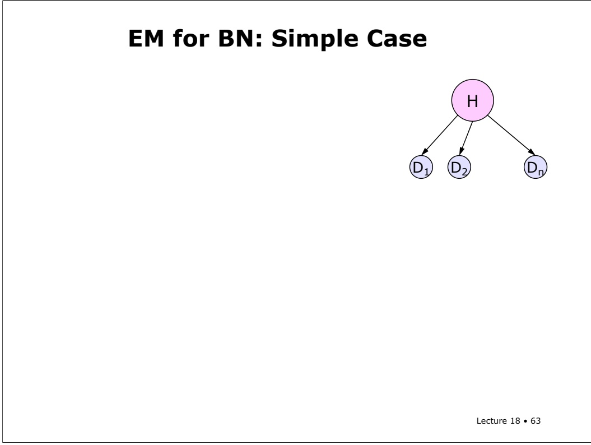

Let’s just consider a simple case with a single hidden node (things get a bit more complicated when we have more than one; but not qualitatively different). We’ll use the same network structure we talked about at the beginning of this lecture: one hidden cause directly controlling a whole set of possible effects. And for further simplicity, we’ll assume all the nodes are binary.

<!-- page: 64 -->

| $D_1$ | $D_2$ | ... | $D_n$ | $\Pr(H^m \mid D^m, \theta_t)$ |
| --- | --- | --- | --- | --- |
| 1 | 1 |  | 0 | .9 |
| 0 | 1 |  | 0 | .2 |
| 0 | 0 |  | 1 | .1 |
| 1 | 0 |  | 1 | .6 |
| 1 | 1 |  | 1 | .2 |
| 1 | 1 |  | 1 | .5 |
| 0 | 1 |  | 0 | .3 |
| 0 | 0 |  | 0 | .7 |
| 1 | 1 |  | 0 | .2 |

EM for BN: Simple Case

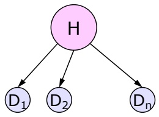

So, given a model, theta, we can use bayes net inference to compute, for each case in our data set, the probability that H would be true, given the values of the observed variables.

<!-- page: 65 -->

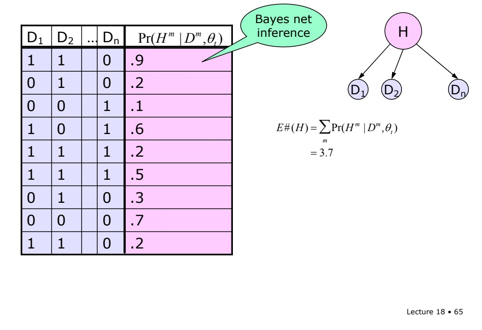

EM for BN: Simple Case

| D1 | D2 | … | Dn | Pr(Hm \|Dm,θt) |
| --- | --- | --- | --- | --- |
| 1 | 1 |  | 0 | .9 |
| 0 | 1 |  | 0 | .2 |
| 0 | 0 |  | 1 | .1 |
| 1 | 0 |  | 1 | .6 |
| 1 | 1 |  | 1 | .2 |
| 1 | 1 |  | 1 | .5 |
| 0 | 1 |  | 0 | .3 |
| 0 | 0 |  | 0 | .7 |
| 1 | 1 |  | 0 | .2 |

Then, we can use these distributions to compute expected counts. So, for instance, to get the expected number of times H is true, we’d just add up with probabilities of H being true in each case.

<!-- page: 66 -->

$$
\begin{array}{c} E \# (H) = \sum_ {m} \Pr (H ^ {m} \mid D ^ {m}, \theta_ {t}) \\ = 3. 7 \end{array}
$$

$$
\begin{array}{r l} E \# (H \wedge D _ {2}) & = \sum_ {m} \Pr (H ^ {m} \mid D ^ {m}, \theta_ {t}) I (D _ {2} ^ {m}) \\ & = . 9 +. 2 +. 2 +. 5 +. 3 +. 2 \\ & = 2. 3 \end{array}
$$

To get the expected number of times that H and D2 are true, we find all the cases in which D2 is true, and add up their probabilities of H being true.

<!-- page: 67 -->

EM for BN: Simple Case

Bayes net inference

| D1 | D2 | … | Dn | Pr(Hm \|Dm,θt) |
| --- | --- | --- | --- | --- |
| 1 | 1 |  | 0 | .9 |
| 0 | 1 |  | 0 | .2 |
| 0 | 0 |  | 1 | .1 |
| 1 | 0 |  | 1 | .6 |
| 1 | 1 |  | 1 | .2 |
| 1 | 1 |  | 1 | .5 |
| 0 | 1 |  | 0 | .3 |
| 0 | 0 |  | 0 | .7 |
| 1 | 1 |  | 0 | .2 |

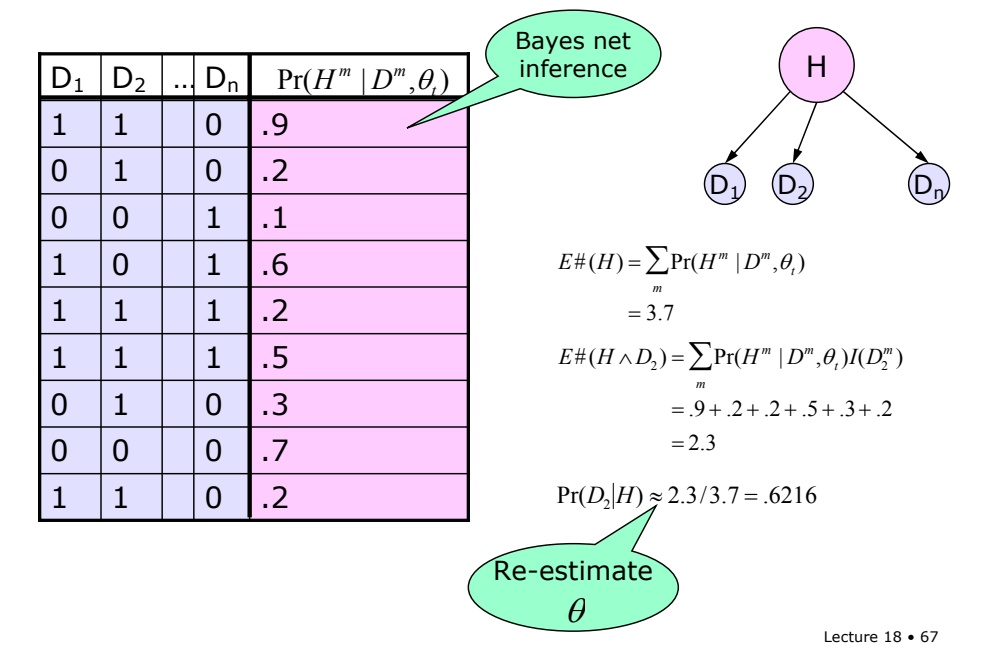

Those two expected counts will let us re-estimate theta. The component of theta that represents the probability of D2 given H will be estimated by dividing the two counts we just computed.

<!-- page: 68 -->

Now, to make everything concrete, we’ll go all the way through a very simple example. Let’s assume there’s a hidden cause, H, and two observable variables, A and B.

<!-- page: 69 -->

## EM for BN: Worked Example

| A | B | # | Pr(Hm \|Dm,θt) |
| --- | --- | --- | --- |
| 0 | 0 | 6 |  |
| 0 | 1 | 1 |  |
| 1 | 0 | 1 |  |
| 1 | 1 | 4 |  |

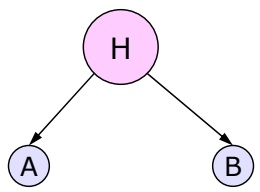

I’ve summarized our data set in this table, indicating that we saw the combination 0,0 6 times, the combination 0,1 once, etc. If we have a domain with more data cases than possible assignments to the observable variables, it’s usually more efficient to store the data this way. But quite typically we never see the same data case more than once, and most of them we never see at all!

<!-- page: 70 -->

$$
\theta_ {1} = \Pr (H)
$$

$$
\theta_ {2} = \Pr (A \mid H)
$$

$$
\theta_ {3} = \Pr (A \mid \neg H)
$$

$$
\theta_ {4} = \Pr (B \mid H)
$$

$$
\theta_ {5} = \Pr (B \mid \neg H)
$$

We’ll let the thetas be these probabilities, which make up all the CPTs for our simple network.

<!-- page: 71 -->

## EM for BN: Worked Example

| A | B | # | Pr(Hm \|Dm,θt) |
| --- | --- | --- | --- |
| 0 | 0 | 6 |  |
| 0 | 1 | 1 |  |
| 1 | 0 | 1 |  |
| 1 | 1 | 4 |  |

$$
\theta_ {1} = \Pr (H)
$$

$$
\theta_ {2} = \Pr (A \mid H)
$$

$$
\theta_ {3} = \Pr (A \mid \neg H)
$$

$$
\theta_ {4} = \Pr (B \mid H)
$$

$$
\theta_ {5} = \Pr (B \mid \neg H)
$$

Lecture 18 • 71

Note that we have a lot of cases of 00 and of 11, but not many with 01 or 10. We can guess that the hidden node is going to play the role of choosing whether we output a 00 or a 11. And that there are roughly two reasonable solutions: A and B are both on when H is off, or A and B are both on when H is on. Let’s see what learning does for us.

<!-- page: 72 -->

$$
\Pr (H) = 0. 4
$$

$$
\Pr (A | H) = 0. 5 5
$$

$$
\Pr (A \mid \neg H) = 0. 6 1
$$

$$
\Pr (B | H) = 0. 4 3
$$

$$
\Pr (B \mid \neg H) = 0. 5 2
$$

I picked an initial model to be this set of probabilities, which are sort of near, but not equal to 0.5. We’ll see why I did this, later on.

<!-- page: 73 -->

## Iteration 1: Fill in data

| A | B | # | Pr(Hm \|Dm,θt) |
| --- | --- | --- | --- |
| 0 | 0 | 6 | .48 |
| 0 | 1 | 1 | .39 |
| 1 | 0 | 1 | .42 |
| 1 | 1 | 4 | .33 |

$$
\Pr (H) = 0. 4
$$

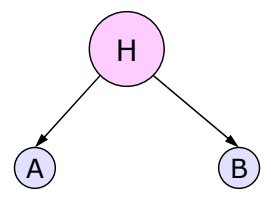

$$
\Pr (A | H) = 0. 5 5
$$

$$
\Pr (A \mid \neg H) = 0. 6 1
$$

$$
\Pr (B | H) = 0. 4 3
$$

$$
\Pr (B \mid \neg H) = 0. 5 2
$$

Lecture 18 • 73

Given that initial model, we can compute the probability of H given A and B, for every combination of A and B, and put those probabilities into our table.

<!-- page: 74 -->

$$
\Pr (H) = 0. 4 2
$$

$$
\Pr (A | H) = 0. 3 5
$$

$$
\Pr (A \mid \neg H) = 0. 4 6
$$

$$
\Pr (B | H) = 0. 3 4
$$

$$
\Pr (B \mid \neg H) = 0. 4 7
$$

Now we can re-estimate the parameters of the model using the expected values of H. Here’s what we get (I used a computer program to do this, so it’s probably right; but I wrote the program, so maybe not…)

<!-- page: 75 -->

## Iteration 2: Fill in Data

| A | B | # | Pr(Hm \|Dm,θt) |
| --- | --- | --- | --- |
| 0 | 0 | 6 | .52 |
| 0 | 1 | 1 | .39 |
| 1 | 0 | 1 | .39 |
| 1 | 1 | 4 | .28 |

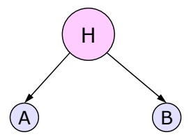

$$
\Pr (H) = 0. 4 2
$$

$$
\Pr (A | H) = 0. 3 5
$$

$$
\Pr (A \mid \neg H) = 0. 4 6
$$

$$
\Pr (B | H) = 0. 3 4
$$

$$
\Pr (B \mid \neg H) = 0. 4 7
$$

Lecture 18 • 75

Now we can fill in new values of the data. We can start to see a tendency for H to want to be on when A and B are off, and vice versa.

<!-- page: 76 -->

$$
\Pr (H) = 0. 4 2
$$

$$
\Pr (A | H) = 0. 3 1
$$

$$
\Pr (A \mid \neg H) = 0. 5 0
$$

$$
\Pr (B | H) = 0. 3 0
$$

$$
\Pr (B \mid \neg H) = 0. 5 0
$$

Now we recomputed the probabilities in the model. They’re moving away from their initial values.

<!-- page: 77 -->

Iteration 5

| A | B | # | Pr(Hm \|Dm,θt) |
| --- | --- | --- | --- |
| 0 | 0 | 6 | .79 |
| 0 | 1 | 1 | .31 |
| 1 | 0 | 1 | .31 |
| 1 | 1 | 4 | .05 |

$$
\Pr (H) = 0. 4 6
$$

$$
\Pr (A | H) = 0. 0 9
$$

$$
\Pr (A \mid \neg H) = 0. 6 9
$$

$$
\Pr (B | H) = 0. 0 9
$$

$$
\Pr (B \mid \neg H) = 0. 6 9
$$

Now we skip ahead to iteration 5. Here are the missing-data distributions and the model. The tendency for H to be on when A and B are off, and for it to be off when they are on is considerably strengthened, as we can see in both distributions.

<!-- page: 78 -->

$$
\Pr (H) = 0. 5 2
$$

$$
\Pr (A | H) = 0. 0 3
$$

$$
\Pr (A \mid \neg H) = 0. 8 3
$$

$$
\Pr (B | H) = 0. 0 3
$$

$$
\Pr (B \mid \neg H) = 0. 8 3
$$

After 10 iterations, the process is pretty well converged. The prior probability of H is just over 50 percent (which makes sense, since about half of the data cases are 00, when it is almost certainly on, and it has some chance of being on in a couple of the other cases).

<!-- page: 79 -->

## Iteration 10

| A | B | # | Pr(Hm \|Dm,θt) |
| --- | --- | --- | --- |
| 0 | 0 | 6 | .971 |
| 0 | 1 | 1 | .183 |
| 1 | 0 | 1 | .183 |
| 1 | 1 | 4 | .001 |

$$
\Pr (H) = 0. 5 2
$$

$$
\Pr (A | H) = 0. 0 3
$$

$$
\Pr (A \mid \neg H) = 0. 8 3
$$

$$
\Pr (B | H) = 0. 0 3
$$

$$
\Pr (B \mid \neg H) = 0. 8 3
$$

Lecture 18 • 79

The CPTs for A and B are the same, which also makes sense, since the data is completely symmetric for A and B. When H is on, A and B are almost certainly off. When H is off, A and B have a moderately high probability of being on.

<!-- page: 80 -->

Increasing Log Likelihood

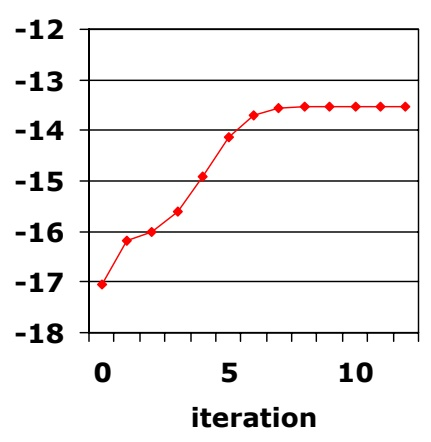

If we plot the log likelihood of the observed data given the model as a function of the iteration, we can see that it increases monotonically. It flattens out somewhere around iteration 8, and I don’t think it’s going to improve much after that.

<!-- page: 81 -->

You can see that, although it’s always improving, the amount of improvement per iteration is variable.

<!-- page: 82 -->

Increasing Log Likelihood

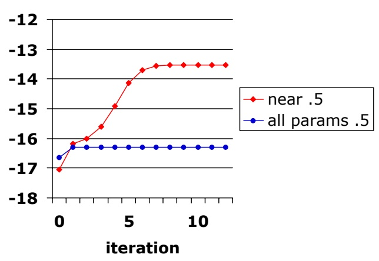

To illustrate the problems with local optima, even with such a simple model as this, I tried to solve the same problem, with the same data set, but initializing all of the parameters in the model to 0.5. Because of the symmetry in the parameters and the symmetry in the data set, parameters theta 2 through theta 5 remain at 0.5 forever. It takes just a little bit of asymmetry to tip the iterative process toward one or the other reasonable solution. This is an unstable equilibrium, which is unlikely to arise in practice. But just to be safe, it’s often wise to initialize your parameters to be nearly, but not quite uniform.

<!-- page: 83 -->

Increasing Log Likelihood

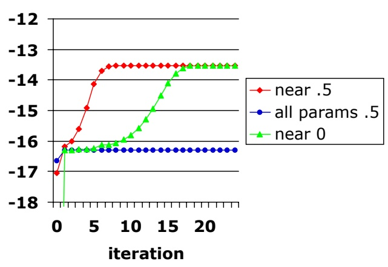

Finally, just for fun, I tried initializing all the parameters near (but not equal to 0). The log likelihood of that model is terrible (something like –35), but then it jumps up to around –16, which is where the completely symmetric model was. Eventually, it manages to break the symmetry, and come up to the same asymptote as the first run.

<!-- page: 84 -->

When you have multiple hidden nodes, it’s important to take advantage of conditional independencies among the hidden nodes given the observables, to avoid having to compute joint distributions over many hidden variables.

<!-- page: 85 -->

The way we described this algorithm, including filling in all of the partial counts, is very inefficient. There are lots of methods, and a fair amount of current research, devoted to making that process much more efficient.

<!-- page: 86 -->

What if the structure of the network is unknown? Then we can do structure search, but add to our repertoire of search steps the option of adding or deleting hidden nodes. Then, given a structure, we can use EM to estimate the parameters, and use them to compute a score on the final model.

<!-- page: 87 -->

Another topic of current research is how to make search with both unknown structure and hidden nodes more efficient by considering them both simultaneously.
