<!-- page: 1 -->

In the next two lectures, we’ll look at the question of how to make decisions, to choose actions, when there’s uncertainty about what their outcomes will be.

<!-- page: 2 -->

When we were looking at deterministic, logical representations of world dynamics, it was easy to figure out how to make a single decision: you would just look at the outcome of each action and see which is best.

<!-- page: 3 -->

What made planning hard, was that we had to consider long sequences of actions, and we tried to be clever in order to avoid considering all of the exponentially many possible sequences of actions.

<!-- page: 4 -->

When there’s substantial uncertainty in the world, we are not even sure how to make one decision. How do you weigh two possible actions when you’re not sure what their results will be?

<!-- page: 5 -->

## 6.825 Techniques in Artificial Intelligence

## Decision Making under Uncertainty

• How to make one decision in the face of uncertainty

• In a deterministic problem, making one decision is easy

• Planning is hard because we considered long sequences of actions

• Given uncertainty, even making one decision is difficult

Lecture 19 • 5

In this lecture, we’ll look at the foundational assumptions of decision theory, and then see how to apply it to making single (or a very small number of) decisions. We’ll see that this theory doesn’t really describe human decision making, but it might still be a good basis for building intelligent agents.

<!-- page: 6 -->

## A short survey

1. Which alternative would you prefer:

A. A sure gain of \$240

B. A 25% chance of winning \$1000 and a 75% chance of winning nothing

2. Which alternative would you prefer:

C. A sure loss of \$750

D. A 75% chance of losing \$1000 and a 25% chance of losing nothing

3. How much would you pay to play the following game: We flip a coin. If it comes up heads, I’ll pay you \$2. If it comes up tails, we’ll flip again, and if it comes up heads, I’ll pay you \$4. If it comes up tails, we’ll flip again, and if it comes up heads, I’ll pay you \$8. And so on, out to infinity.

Lecture 19 • 6

Please stop and answer these questions. Don’t try to think about the “right” answer. Just say what you would really prefer.

<!-- page: 7 -->

Decision theory is a calculus for decision-making under uncertainty. It’s a little bit like the view we took of probability: it doesn’t tell you what your basic preferences ought to be, but it does tell you what decisions to make in complex situations, based on your primitive preferences.

<!-- page: 8 -->

So, it starts by assuming that there is some set of primitive outcomes in the domain of interest. They could be winning or losing amounts of money, or having some disease, or passing a test, or having a car accident, or anything else that is appropriately viewed as a possible outcome in a domain.

<!-- page: 9 -->

Then, we assume that you, the user, have a set of preferences on primitive outcomes. We use this funny curvy greater-than sign to mean that you would prefer to have outcome A happen than outcome B.

<!-- page: 10 -->

## Decision Theory

• A calculus for decision-making under uncertainty

• Set of primitive outcomes

• Preferences on primitive outcomes: A f B

• Subjective degrees of belief (probabilities)

Lecture 19 • 10

We also assume that you have a set of subjective degrees of belief (which we’ll call probabilities) about the likelihood of different outcomes actually happening in various situations.

<!-- page: 11 -->

## Decision Theory

• A calculus for decision-making under uncertainty

• Set of primitive outcomes

• Preferences on primitive outcomes: A f B

• Subjective degrees of belief (probabilities)

• Lotteries: uncertain outcomes

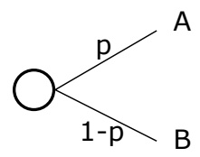

With probability p,

outcome A occurs; with

B occurs.

probability 1 - p; outcome

Lecture 19 • 11

Then, we’ll model uncertain outcomes as lotteries. We’ll draw a lottery like this, with a circle indicating a “chance” node, in which, with probability p, outcome A will happen, and with probability 1-p, outcome B will happen.

<!-- page: 12 -->

# Axioms of Decision Theory

If you accept these conditions on your preferences, then decision theory should apply to you!

Lecture 19 • 12

Decision theory is characterized by a set of six axioms. If your preferences (or your robot’s preferences!) meet the requirements in the axioms, then decision theory will tell you how to make your decisions. If you disagree with the axioms, then you have to find another way of choosing actions.

<!-- page: 13 -->

The first axiom is orderability. It says that for every pair of primitive outcomes, either you prefer A to B, you prefer B to A, or you think A and B are equally preferable. Basically, this means that if I ask you about two different outcomes, you don’t just say you have no idea which one you prefer.

<!-- page: 14 -->

Transitivity says that if you like A better than B, and you like B better than C, then you like A better than C.

<!-- page: 15 -->

## Axioms of Decision Theory

If you accept these conditions on your preferences, then decision theory should apply to you!

• Orderability: or or A f B B f A A ≈ B

• Transitivity: If and then A f B B f C A f C

• Continuity: If then there exists p suchA f B f C that $L _ { 1 } \approx L _ { 2 }$

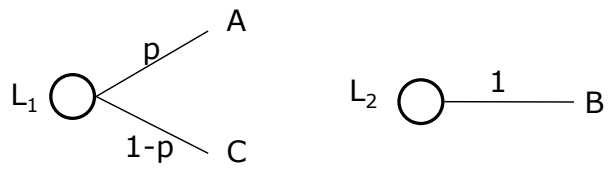

Continuity says that if you prefer A to B and you prefer B to C, then there’s some probability that makes the following lotteries equivalently preferable for you. In the first lottery, you get your best outcome, A, with probability p, and your worst outcome, C, with probability 1-p. In the second lottery, you get your medium-good outcome, B, with certainty. So, the idea is that, by adjusting p, you can make these lotteries equivalently attractive, for any combination of A, B, and C.

<!-- page: 16 -->

Substitutability says that if you prefer A to B, then given two lotteries that are exactly the same, except that one has A in a particular position and the other has B, you should prefer the lottery that contains A.

<!-- page: 17 -->

Monotonicity says that if you prefer A to B, and if p is greater than q, then you should prefer a lottery that gives A over B with higher probability.

<!-- page: 18 -->

## Last Axiom of Decision Theory

• Decomposibility: $L _ { 1 } \approx L _ { 2 }$

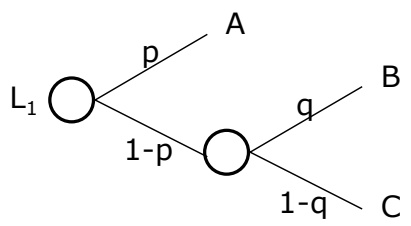

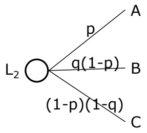

Lecture 19 • 18

The last axiom of decision theory is decomposability. It, in some sense, defines compound lotteries. It says that a two-stage lottery, where in the first stage you get A with probability p, and in the second stage you get B withprobability q and C with probability 1-q is equivalent to a single-stage lottery with three possible outcomes: A with probability p, B with probability $( 1 - p ) ^ { k } q$ , and C with probability $( 1 - p ) ^ { x } ( 1 - q )$

<!-- page: 19 -->

## Main Theorem

If preferences satisfy these six assumptions, then there exists U (a real valued function) such that:

• If , then U(A) > U(B)A f B

• If , then U(A) = U(B)A ≈ B

Lecture 19 • 19

So, if your preferences satisfy these six axioms, then there exists a realvalued function U such that if you prefer A to B, then U(A) is greater than U(B), and if you prefer A and B equally, then U(A) is equal to U(B). Basically, this says that all possible outcomes can be mapped onto a single utility scale, and we can work directly with utilities rather than collections of preferences.

<!-- page: 20 -->

## Main Theorem

If preferences satisfy these six assumptions, then there exists U (a real valued function) such that:

• If , thenA f B $\mathsf { U } ( \mathsf { A } ) > \mathsf { U } ( \mathsf { B } )$

• If $A \approx B$ , then $\mathsf{U}(\mathsf{A}) = \mathsf{U}(\mathsf{B})$

Utility of a lottery = expected utility of the outcomes

$$
U (L) = p \cdot U (A) + (1 - p) \cdot U (B)
$$

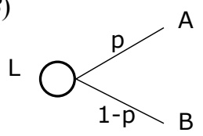

Lecture 19 • 20

One direct consequence of this is that the utility of a lottery is the expected utility of the outcomes. So, the utility of our standard simple lottery L is p times the utility of A plus (1-p) times the utility of B. Once we know how to compute the utility of a simple lottery like this, we can also compute the utility of very complex lotteries.

<!-- page: 21 -->

## Main Theorem

If preferences satisfy these six assumptions, then there exists U (a real valued function) such that:

• If , thenA f B $\mathsf { U } ( \mathsf { A } ) > \mathsf { U } ( \mathsf { B } )$

• If $A \approx B$ , then $\mathsf{U}(\mathsf{A}) = \mathsf{U}(\mathsf{B})$

Utility of a lottery = expected utility of the outcomes

$$
U (L) = p \cdot U (A) + (1 - p) \cdot U (B)
$$

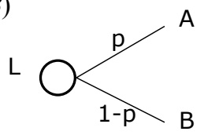

Lecture 19 • 21

Interestingly enough, if we make no assumptions on the behavior of probabilities other than that they have to satisfy the properties described in these axioms, then we can show that probabilities actually have to satisfy the standard axioms of probability.

<!-- page: 22 -->

We’re going to use the survey questions to motivate a discussion of utility functions and, in particular, the utility of money.

<!-- page: 23 -->

So, the first survey question was whether you’d prefer option A, a sure gain of \$240, or option B, a 25% chance of winning \$1000 and a 75% chance of winning nothing.

<!-- page: 24 -->

When I polled one class of students, 85% preferred option A. This is consistent with results obtained in experiments published in the psychology literature.

<!-- page: 25 -->

So, what do we know about the utility function of a person who prefers A to B? We know that the utility of B is .25 times the utility of \$1000 plus .75 times the utility of \$0. (We’re not going to make any particular assumptions about the utility scale; so we don’t know, for example, that the utility of \$0 is 0). We know that the utility of A is the utility of \$240. And we know that the utility of A is greater than the utility of B.

<!-- page: 26 -->

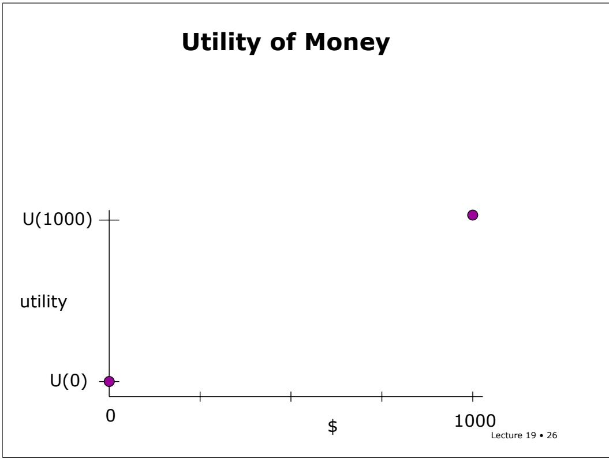

Let’s look in detail at how utility varies as a function of money. So, here’s a graph with money on the x axis and utility on the y axis. We’ve put in two points representing \$0 and \$1000, and their respective utilities.

<!-- page: 27 -->

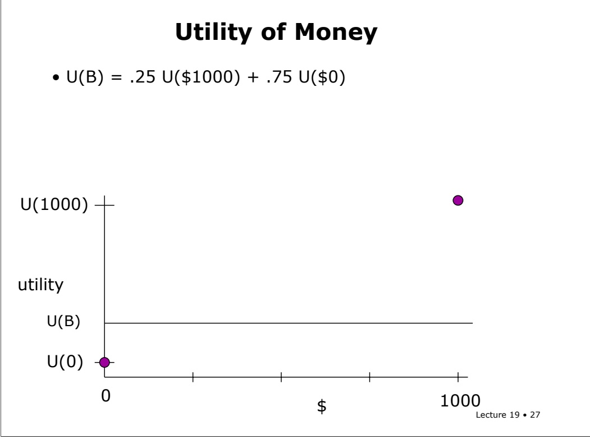

Now, let’s think about the utility of option B. It’s an amount that is 1/4 of the way up the y axis between the utility of \$0 and the utility of \$1000.

<!-- page: 28 -->

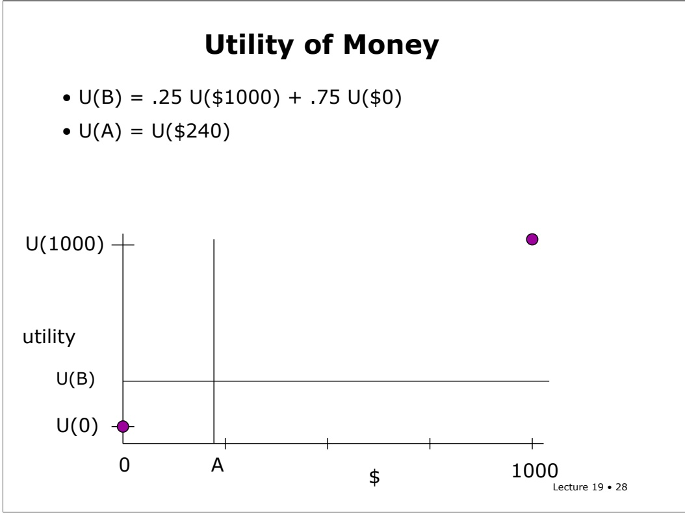

The utility of A is the utility of \$240; we don’t know exactly what its value is, but it will be plotted somewhere on this vertical line (with x coordinate 240).

<!-- page: 29 -->

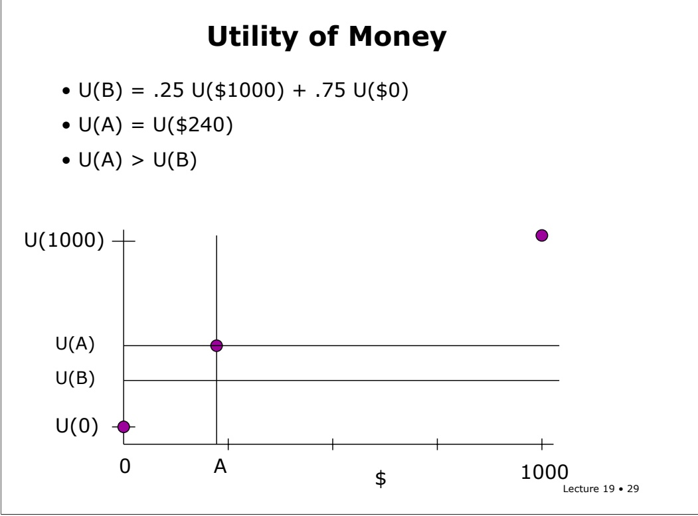

Now, since we know that the utility of A is greater than the utility of B, we just pick a y value for the utility of A that’s above the utility of B, and that lets us add a point to the graph at coordinates A, U(A).

<!-- page: 30 -->

## Utility of Money

$$
\bullet \mathrm{U} (\mathrm{B}) = . 2 5 \mathrm{U} (\$ 1000) +. 7 5 \mathrm{U} (\$ 0)
$$

• U(A) = U(\$240)

concave utility function risk averse


If we plot a curve through these three points, we see that the utility function is concave. This kind of a utility curve is frequently referred to as “risk averse”. This describes a person who would in general prefers a smaller amount of money for sure, rather than lotteries with a larger expected amount of money (but not expected utility). Most people are risk averse in this way.

<!-- page: 31 -->

## Utility of Money

$$
\bullet \mathrm{U} (\mathrm{B}) = . 2 5 \mathrm{U} (\$ 1000) +. 7 5 \mathrm{U} (\$ 0)
$$

• U(A) = U(\$240)

concave utility function risk averse

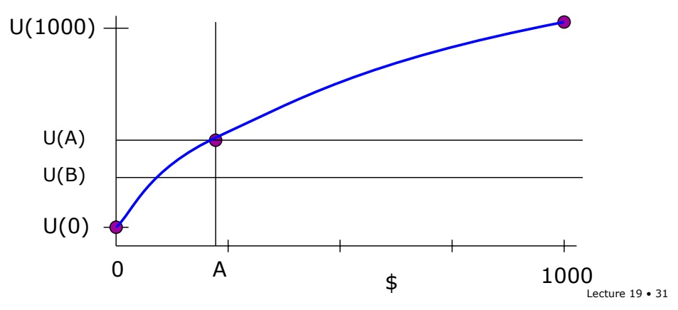

It’s important to remember that decision theory applies in any case. It’s not necessary to have a utility curve of any particular shape (in fact, you could even prefer less money to more!) in order for decision theory to apply to you. You just have to agree to the 6 axioms.

<!-- page: 32 -->

Risk neutrality

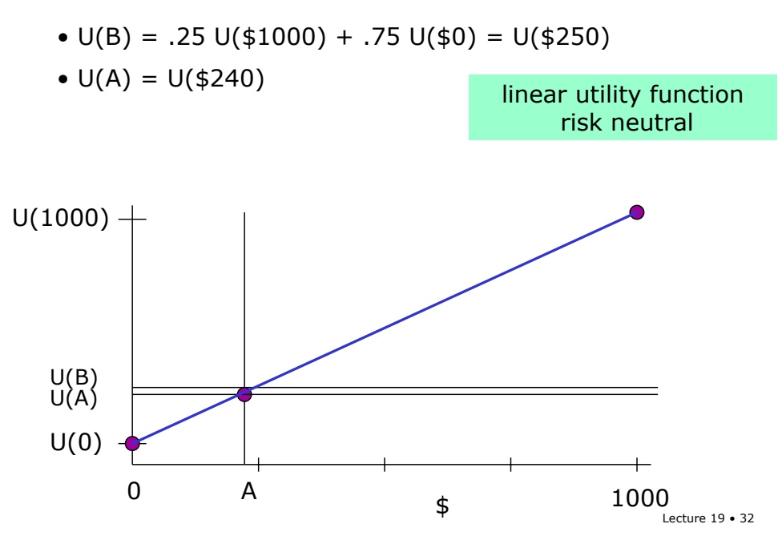

In contrast to the risk averse attitude described in the previous graph, another attitude is risk neutrality. If you are “risk neutral”, then your utility function over money is linear. In that case, your expected utility for a lottery is exactly proportional to the expected amount of money you’ll make. So, in our example, the utility of B would be exactly equal to the utility of \$250. And so it would be greater than the utility of A, but not a lot.

<!-- page: 33 -->

Risk neutrality


People who are risk neutral are often described as “expected value” decision makers.

<!-- page: 34 -->

Do you think that decision theory would ever recommend to someone that they should play the lottery?

<!-- page: 35 -->

In any real lottery, the expected amount of money you’ll win is always less than the price. I once calculated the expected value of a \$1 Massachusetts lottery ticket, and it was about 67 cents.

<!-- page: 36 -->

To stay consistent with our previous example, imagine that I offer you either a sure gain of \$260, or a 25% chance of winning \$1000 and a 75% chance of winning nothing.

<!-- page: 37 -->

Wanting to buy a lottery ticket is like preferring B to A. B is a smaller expected value (\$250) than A, but it has the prospect of a high payoff with low probability (though in this example the payoff is a lot lower and the probability a lot higher than it is in a typical real lottery).

<!-- page: 38 -->

We can describe the situation in terms of your utility function. The utility of B is .25 times the utility of \$1000 plus .75 times the utility of \$0. The utility of A is the utility of \$260. And the utility of A is less than the utility of B.

<!-- page: 39 -->

Risk seeking

$$
\bullet \mathrm{U} (\mathrm{B}) = . 2 5 \mathrm{U} (\$ 1000) +. 7 5 \mathrm{U} (\$ 0)
$$

convex utility function risk seeking

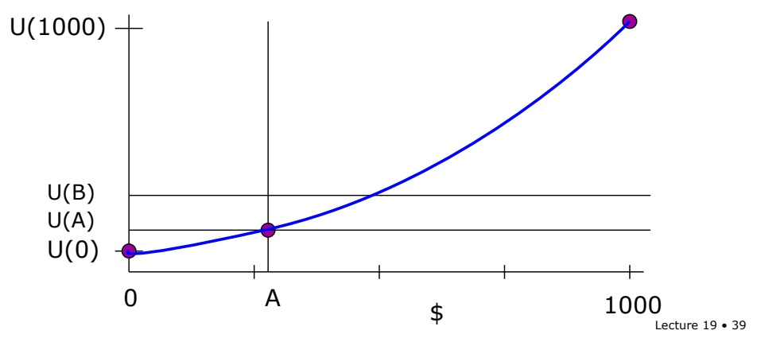

We can show the situation on a graph as before. The utility of B remains one quarter of the way between the utility of \$0 and the utility of \$1000. But now, A is slightly more than \$250, and its utility is lower than that of B. We can see that this forces our utility function to be convex. In general, we’ll prefer a somewhat riskier situation to a sure one. Such a preference curve is called “risk seeking”.

<!-- page: 40 -->

Risk seeking

$$
\bullet \mathrm{U} (\mathrm{B}) = . 2 5 \mathrm{U} (\$ 1000) +. 7 5 \mathrm{U} (\$ 0)
$$

convex utility function risk seeking

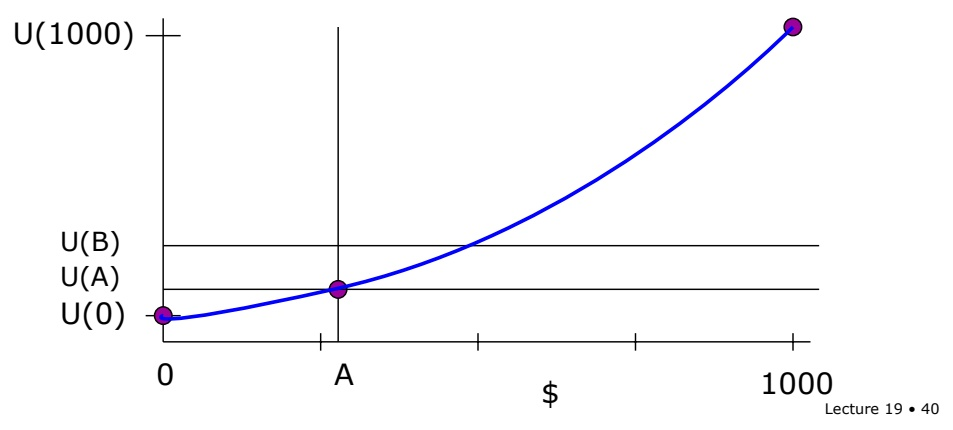

It’s possible to argue that people play the lottery for a variety of reasons, including the excitement of the game, etc. But here we’ve argued that there are utility functions under which it’s completely rational to play the lottery, for monetary concerns alone. You could think of this utility function applying, in particular, to people who are currently in very bad circumstances. For such a person, the prospect of winning \$10,000 or more might be so dramatically better than their current circumstances, that even though they’re almost certain to lose, it’s worth \$1 to them to have a chance at a great outcome.

<!-- page: 41 -->

Now, let’s look at survey question 2. It asks whether you’d prefer a sure loss of \$750 or a 75% chance of losing \$1000 and a 25% chance of losing nothing.

<!-- page: 42 -->

The vast majority of students in a class I polled preferred option D to option C. This is also consistent with results published in the psychology literature. People generally hate the idea of accepting a sure loss, and would rather take a risk in order to have a chance of losing nothing.

<!-- page: 43 -->

If you prefer option D to option C, we can characterize the utility function as follows. The utility of D is .75 times the utility of -\$1000 plus .25 times the utility of \$0. The utility of C is the utility of -\$750. And the utility of D is greater than the utility of C.

<!-- page: 44 -->

## Risk seeking in losses

• U(D) = .75 U(-\$1000) + .25 U(\$0)

• U(C) = U(-\$750)

• U(D) > U(C)

convex utility function risk seeking


By the same arguments as last time, we can see that these preferences imply a convex utility function, which induces risk seeking behavior. It is generally found that people are risk seeking in the domain of losses. Or, at least, in the domain of small losses.

<!-- page: 45 -->

## Risk seeking in losses

• U(D) = .75 U(-\$1000) + .25 U(\$0)

• U(C) = U(-\$750)

• U(D) > U(C)

convex utility function risk seeking


An interesting case to consider here is that of insurance. You can think of insurance as accepting a small guaranteed loss (the insurance premium) rather than accepting a lottery in which, with a very small chance, a terrible thing happens to you. So, perhaps, in the domain of large losses, people’s utility functions tend to change curvature and become concave again.

<!-- page: 46 -->

## Risk seeking in losses

• U(D) = .75 U(-\$1000) + .25 U(\$0)

• U(C) = U(-\$750)

• U(D) > U(C)

convex utility function risk seeking

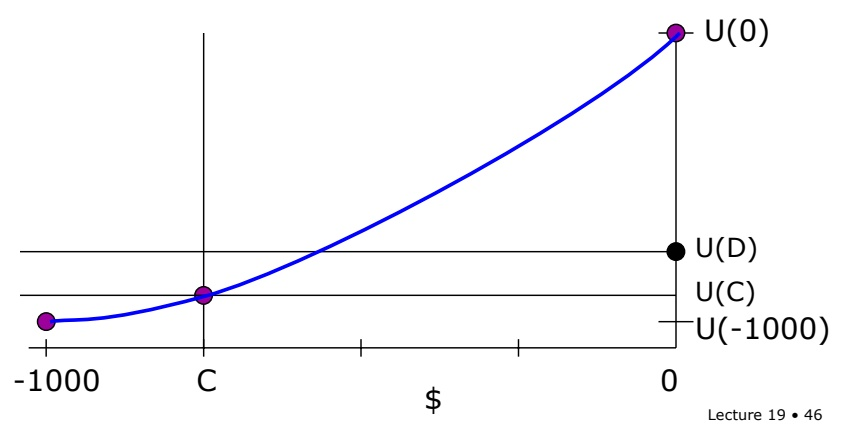

It’s often possible to cause people to reverse their preferences just by changing the wording in a question. If I were selling insurance, I would have asked whether you’d rather accept the possibility of losing \$1000, or pay an insurance premium of \$750 that guarantees you’ll never have such a bad loss. That change in wording might make option C more attractive than D.

<!-- page: 47 -->

We’ve seen that decision theory can accommodate people who prefer option A to B, and people who prefer option D to C. In fact, most people prefer A and D. But we can show that it’s not so good to both prefer A to B and D to C.

<!-- page: 48 -->

The easiest way to see it is to examine the total outcomes and probabilities of option A and D versus B and C.

<!-- page: 49 -->

If you pick A and D, then with probability .75 you have a net loss of \$760 and with probability .25 you have a net gain of \$240.

<!-- page: 50 -->

## Human irrationality

Most people prefer A in question 1 and D in question 2.

A and D

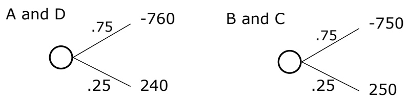

B and C

240.25

-750

250.25

Lecture 19 • 50

On the other hand, if you pick B and C, then with probability .75 you have a net loss of \$750 and with probability .25, you have a net gain of \$250.

<!-- page: 51 -->

So, with B and C, it’s like getting an extra \$10, no matter what happens. So it seems like it’s just irrational to prefer A and D.

<!-- page: 52 -->

One student in my class made a convincing argument that it isn’t irrational at all. That being given each single choice, it’s okay to pick A in one and D in the other. But if you know you’re going to be given **both** choices, then it would be unreasonable to pick both A and D.

<!-- page: 53 -->

Just for fun, I asked how much you would pay to play this game, in which you get \$2 with probability 1/2, \$4 with probability 1/4, etc. This is called the St. Petersburg Paradox.

<!-- page: 54 -->

It’s a paradox because the game has an expected dollar amount of infinity $( 1 / 2 ^ { \star } 2$ is 1; $1 / 4 \; ^ { \star } 4$ is 1; etc). However, most people don’t want to pay more than about \$4 to play it. That’s a pretty big discrepancy.

<!-- page: 55 -->

$$
\text {Expected value} = 1 + 1 + 1 + \ldots = \infty
$$

It was this paradox that drove Bernoulli to think about concave, risk averse, utility curves, which you can use to show that although the game has an infinite expected dollar value, it will only have a finite expected utility for a risk averse person.

<!-- page: 56 -->

Okay. Now we’re going to switch gears a little bit, and see how utility theory might be used in a (somewhat) practical example.

<!-- page: 57 -->

Imagine that you have the opportunity to buy a used car for \$1000. You think you can repair it and sell it for \$1100, making a \$100 profit.

<!-- page: 58 -->

You have some uncertainty, though, about the state of the car. It might be a lemon (a fundamentally bad car) or a peach (a good one). You think that 20% of cars are lemons. It costs \$40 to repair a peach, and \$200 to repair a lemon.

<!-- page: 59 -->

Let’s further assume that, for this whole example, that you’re risk neutral, so that the utility of \$100 is 100. This isn’t at all necessary to the example, but it will simplify our discussion and notation.

<!-- page: 60 -->

## Buying a Used Car

• Costs \$1000

• Can sell it for \$1100, \$100 profit

• Every car is a lemon or a peach

• 20% are lemons

• Costs \$40 to repair a peach, \$200 to repair a lemon

• Risk neutral

decision tree

Lecture 19 • 60

We can describe this decision problem using a decision tree. Note that we also talk about decision trees in supervised learning; these decision trees are almost completely different from those other ones; don’t confuse them, despite the same name!

<!-- page: 61 -->

## Buying a Used Car

• Costs \$1000

• Can sell it for \$1100, \$100 profit

• Every car is a lemon or a peach

• 20% are lemons

• Costs \$40 to repair a peach, \$200 to repair a lemon

• Risk neutral

Choice

decision tree

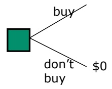

Lecture 19 • 61

We start the decision tree with a “choice” node, shown as a green square: we have the choice of either buying the car or not buying it. If we don’t buy it, then the outcome is \$0.

<!-- page: 62 -->

## Buying a Used Car

• Costs \$1000

• Can sell it for \$1100, \$100 profit

• Every car is a lemon or a peach

• 20% are lemons

• Costs \$40 to repair a peach, \$200 to repair a lemon

• Risk neutral

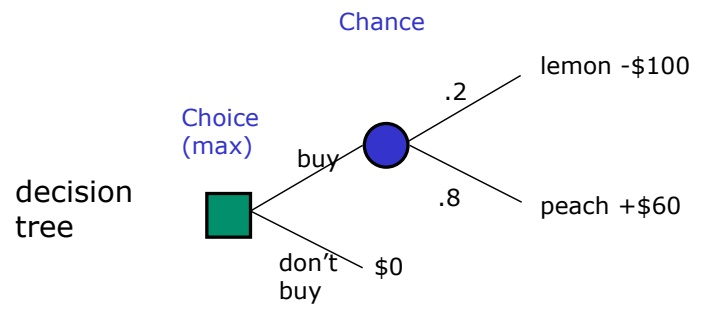

If we do buy the car, then the outcome is a lottery. We’ll represent the lottery as a “chance” node, shown as a blue circle. With probability 0.2, the car will be a lemon and we’ll have the outcome of losing \$100 (\$100 in profit minus \$200 for repairs). With probability 0.8, the car will be a peach, and we’ll have the outcome of gaining \$60 (\$100 in profit minus \$40 for repairs).

<!-- page: 63 -->

## Buying a Used Car

• Costs \$1000

• Can sell it for \$1100, \$100 profit

• Every car is a lemon or a peach

• 20% are lemons

• Costs \$40 to repair a peach, \$200 to repair a lemon

• Risk neutral

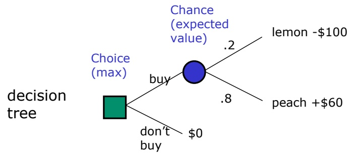

Now, we can use this tree to figure out what to do. We will evaluate it; that is, assign a value to each node. Starting from the leaves and working back toward the root, we compute a value for each node. At chance nodes, we compute the expected value for each leaf (it’s nature who is making the choice here, so we just have to take the average outcome). At choice nodes, we have complete control, so the value is the maximum of the values of all the leaves.

<!-- page: 64 -->

## Buying a Used Car

• Costs \$1000

• Can sell it for \$1100, \$100 profit

• Every car is a lemon or a peach

• 20% are lemons

• Costs \$40 to repair a peach, \$200 to repair a lemon

• Risk neutral

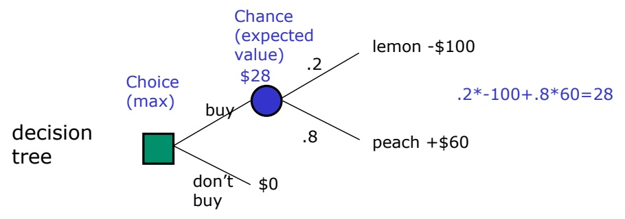

So, we start by evaluating the chance node. The expected value of this lottery is \$28, so we assign that value to the chance node.

<!-- page: 65 -->

## Buying a Used Car

• Costs \$1000

• Can sell it for \$1100, \$100 profit

• Every car is a lemon or a peach

• 20% are lemons

• Costs \$40 to repair a peach, \$200 to repair a lemon

• Risk neutral

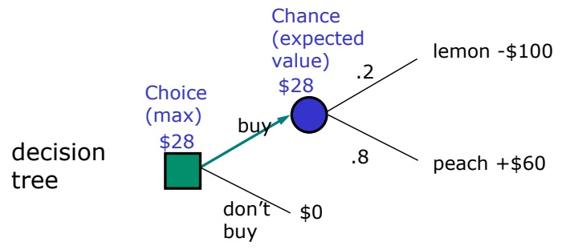

Now, we evaluate the choice node. We’ll make \$28 if we buy the car and nothing if we don’t. So, we choose to buy the car (which we show by putting an arrow down that branch), and we assign value 28 to the choice node.

<!-- page: 66 -->

# Expected Value of Perfect Info

How much should you pay for information of what type of car it is (before you buy it)?

Lecture 19 • 66

Now, while we’re sitting at the used car lot, thinking about whether to buy this car, an unhappy employee comes out and offers to sell us perfect information about whether the car is really a lemon or a peach. He’s been working on the car and he knows for sure which it is. So, the question is, what is the maximum amount of money that we should be willing to pay him for this information?

<!-- page: 67 -->

# Expected Value of Perfect Info

How much should you pay for information of what type of car it is (before you buy it)?

• Reverse the order of the chance and action nodes. The chance node represents uncertainty on what the information will be, once we get it.

Lecture 19 • 67

We’ll draw a decision tree to help us figure this out. We need to draw the nodes in a different order from left to right. In this scenario, the idea is that we first get the information about whether the car is a lemon or a peach, and then we get to make our decision (and the important point is that it can possibly be different in the two different cases).

<!-- page: 68 -->

## Expected Value of Perfect Info

How much should you pay for information of what type of car it is (before you buy it)?

• Reverse the order of the chance and action nodes. The chance node represents uncertainty on what the information will be, once we get it.

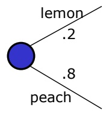

Lecture 19 • 68

So, we start with a chance node, to describe the chance that the car is a lemon or a peach.

<!-- page: 69 -->

Lecture 19 • 69

## Expected Value of Perfect Info

How much should you pay for information of what type of car it is (before you buy it)?

• Reverse the order of the chance and action nodes. The chance node represents uncertainty on what the information will be, once we get it.

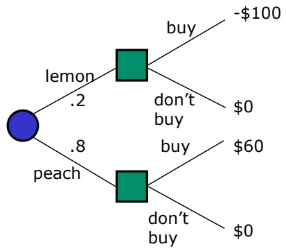

Now, for each of those pieces of information, we include a choice node about whether or not to buy the car.

<!-- page: 70 -->

Lecture 19 • 70

## Expected Value of Perfect Info

How much should you pay for information of what type of car it is (before you buy it)?

• Reverse the order of the chance and action nodes. The chance node represents uncertainty on what the information will be, once we get it.

• C is cost you have to pay for information

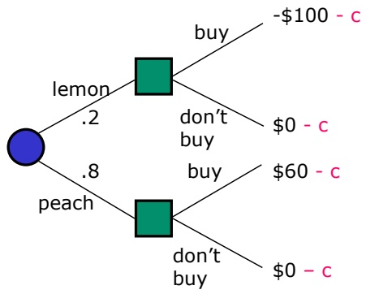

Let’s let c be the amount of money we have to pay for this information. When we calculate the outcomes for the leaves, we have to subtract c from the outcomes we calculated before (-100 for buying a lemon, 0 for not buying anything, and +60 for buying a peach).

<!-- page: 71 -->

# Expected Value of Perfect Info

How much should you pay for information of what type of car it is (before you take it to be repaired)?

• Reverse the order of the chance and action nodes. The chance node represents uncertainty on what the information will be, once we get it.

• C is cost you have to pay for information

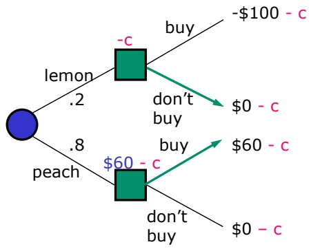

We evaluate the tree as before, working back from the leaves toward the root. We first hit these two choice nodes. In the top choice node, it’s clearly better not to buy the car, for a total loss of c dollars. In the bottom choice node, it’s better to buy the car, for a net of 60 – c dollars.

<!-- page: 72 -->

# Expected Value of Perfect Info

How much should you pay for information of what type of car it is (before you take it to be repaired)?

• Reverse the order of the chance and action nodes. The chance node represents uncertainty on what the information will be, once we get it.

• C is cost you have to pay for information

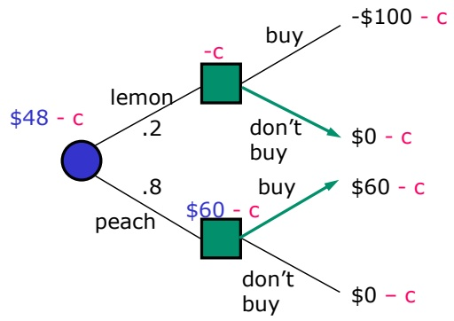

Now, we arrive at the chance node, where we take the expected value of the leaves. In this case, we get 48 – c dollars.

<!-- page: 73 -->

# Expected Value of Perfect Info

How much should you pay for information of what type of car it is (before you take it to be repaired)?

• Reverse the order of the chance and action nodes. The chance node represents uncertainty on what the information will be, once we get it.

• C is cost you have to pay for information

## c = \$20 [EVPI]

ties the expected value with no information

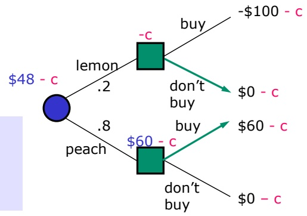

Lecture 19 • 73

Since the original car-buying deal was worth \$28 in the case without any extra information, then we shouldn’t pay any more than \$20 for perfect information. If we pay that much, then this deal is equivalent to the original one. If we pay less than \$20, then this deal is better. We’ll say that \$20 is the expected value of perfect information.

<!-- page: 74 -->

Now let’s consider a different scenario. Nobody comes out to offer us information. Instead, a sleazy guy comes out of the office and says he has a special deal, just for us. He’ll sell us a guarantee on this car for \$60. It will cover %50 of all repair costs, if the repairs cost less than \$100. But if the repairs are more than \$100, it will cover them all.

<!-- page: 75 -->

So, should we buy the guarantee? Let’s make a decision tree. Now we have three choices. We can buy both the car and the guarantee, we can buy the car only, or we can buy nothing (it’s completely unreasonable to buy just the guarantee!).

<!-- page: 76 -->

If we buy the car and the guarantee, then we have to consider what the outcomes will be depending on whether or not it’s a lemon.

<!-- page: 77 -->

If it’s a lemon, we make \$40. That’s because the guarantee covers all the repairs. So we make \$100 profit on the sale of the car, but we have to pay \$60 for the guarantee.

<!-- page: 78 -->

If it’s a peach, we make \$20. We start with \$100 in profit, but we have to pay \$60 for the guarantee and \$20 for repairs (at least we only have to pay for half of the repairs!).

<!-- page: 79 -->

Now, if we decide to buy the car, we can substitute in the chance node and outcomes that we already calculated for buying the car in the first example. I put in a red triangle to stand for the summarization of some other decision tree, with a result of \$28.

<!-- page: 80 -->

Finally, if we don’t buy the car, we have a guaranteed zero.

<!-- page: 81 -->

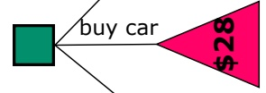

## Guarantee?

• Costs \$60

• Covers 50% of repair costs

• If repairs > \$100, covers them all

lemon \$40

(\$100 profit -

buy car &

\$60 guarantee)

guarantee

$$
2 ^ {*} 4 0 +. 8 ^ {*} 2 0 = 2 4
$$

peach \$20

(\$100 profit –

\$60 guarantee –

\$20 repair)

Lecture 19 • 81

So, we start by figuring out the value of the new chance node. The expected value is \$24.

<!-- page: 82 -->

Now, at the choice node, we pick the maximum value course of action, which is to buy the car but not the guarantee. And so, this whole deal still has a value of \$28.

<!-- page: 83 -->

Most people would buy the guarantee in this situation, due to risk aversion.

Interestingly, most people would buy the guarantee in this situation, If you buy the guarantee, you are sure to make at least some profit. If you don’t, you could possibly lose \$100.

<!-- page: 84 -->

# Inspection?

We can have the car inspected for \$9

Lecture 19 • 84

Just for some practice with Bayes’ rule, and another example, let’s think about one more case. This time there’s no offer of perfect information or of a guarantee. But there is a garage across the street that offers to inspect the car for \$9. It can’t tell for sure whether the car is a lemon or a peach. It will perform a set of tests and tell you whether the car passes or fails.

<!-- page: 85 -->

$$
\mathrm{P} (\text {``pass''} \mid \text {peach}) = 0. 9
$$

$$
\mathrm{P} (\text {``pass''} \mid \text {lemon}) = 0. 4
$$

$$
\mathrm{P} \left(\text {``fail''} \mid \text {peach}\right) = 0. 1
$$

$$
\mathrm{P} (\text {fail}" \mid \text {lemon}) = 0. 6
$$

The tests aren’t completely reliable. So, the probability that it passes if it’s a peach is 0.9. But the probability that it passes if it’s a lemon is 0.4.

<!-- page: 86 -->

```matlab
Inspection?
We can have the car inspected for $9
P("pass" | peach) = 0.9      P("fail" | peach) = 0.1
P("pass" | lemon) = 0.4      P("fail" | lemon) = 0.6

P("pass") =
    P("pass" | lemon)P(lemon) + P("pass" | peach)P(peach)
P("pass") = 0.4*0.2 + 0.9*0.8 = 0.8
P("fail") = 0.2
```

We’re going to need to have some related probabilities for use in our decision tree, so let’s do it now. We’ll need the probability of the car passing the test, which is 0.8. Note that it’s only a coincidence that this is also the probability that the car is a peach.

<!-- page: 87 -->

```txt
Inspection?
We can have the car inspected for $9
P("pass" | peach) = 0.9      P("fail" | peach) = 0.1
P("pass" | lemon) = 0.4      P("fail" | lemon) = 0.6

P("pass") =
    P("pass" | lemon)P(lemon) + P("pass" | peach)P(peach)
P("pass") = 0.4*0.2 + 0.9*0.8 = 0.8
P("fail") = 0.2

P(lemon | "pass") = P("pass" | lemon) P(lemon)/P("pass")
P(lemon | "pass") = 0.4 * (0.2 / 0.8) = 0.1
P(lemon | "fail") = P("fail" | lemon) P(lemon)/P("fail")
P(lemon | "fail") = 0.6 * (0.2 / 0.2) = 0.6
```

We’ll also need the probability of lemon given pass, which turns out to be 0.1, and the probability of lemon given fail, which turns out to be 0.6.

<!-- page: 88 -->

Let’s build the decision tree for the inspection problem, so we can decide whether we should pay for the inspection or not.

<!-- page: 89 -->

# Inspection Tree

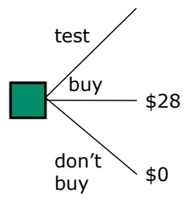

We start with a choice node, with three options: test (which means, we pay for the car to be inspected, and then perhaps buy it or not, depending on the results), buy, which means we just buy the car, which as we’ve calculated already has a value of \$28, and don’t buy, which has a value of \$0.

<!-- page: 90 -->

# Inspection Tree

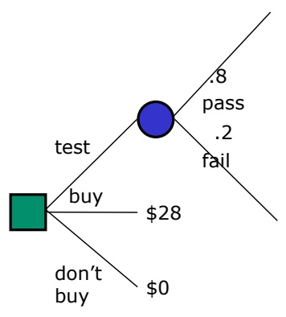

Now, if we decide to test the car, the next thing that happens is that we find out whether it passed or not. We just computed the probability of pass, which is 0.8, so that’s the probability we put on this arc (and 0.2 on the fail arc).

<!-- page: 91 -->

Once we have the information from the garage about whether the car passed or failed, we can decide whether to buy it or not. That results in these two decision nodes.

<!-- page: 92 -->

Lecture 19 • 92

Inspection Tree

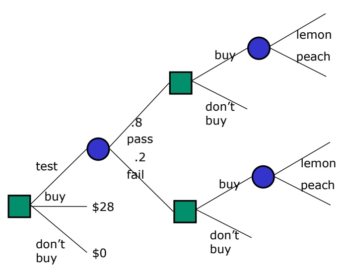

And finally, in each of the cases in which we buy the car, we have to add a chance node to take into account whether the car really is a lemon or not.

<!-- page: 93 -->

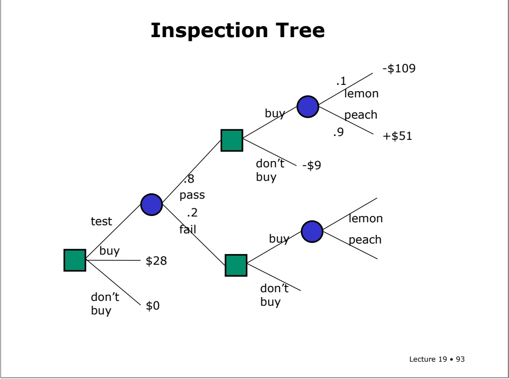

In the top node, we know that the car passed, and so when we put probabilities on the branches, we condition on the information we already know from having come down this path in the tree. So, on the “lemon” branch, we put the probability of lemon given pass, which is 0.1. And, of course we put 0.9 on the other branch. Then we can fill in the outcomes. We have to subtract \$9 in every case, because in this whole branch of the tree, we’re assuming that we paid for the test.

<!-- page: 94 -->

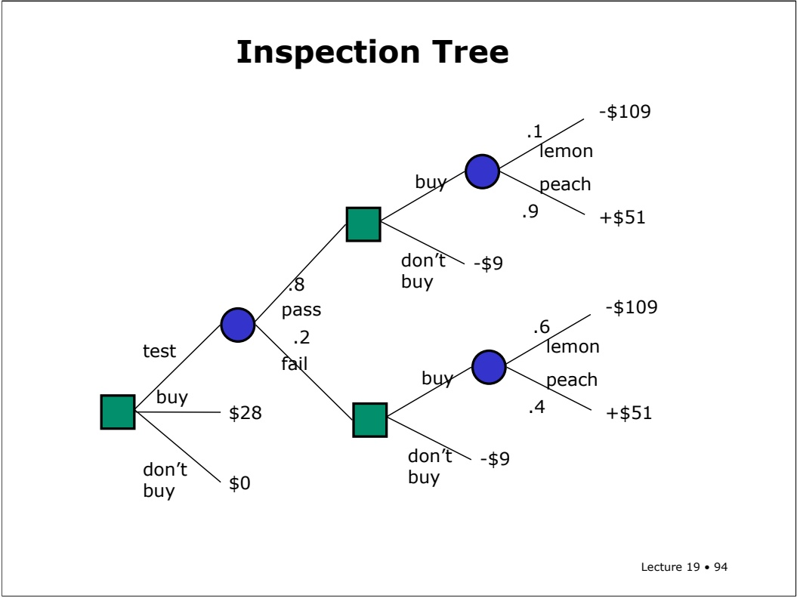

In the bottom choice node, we know that the car failed the test, so we label the lemon branch with the probability of lemon given fail, which is .6, and the other branch with .4. The outcomes are the same.

<!-- page: 95 -->

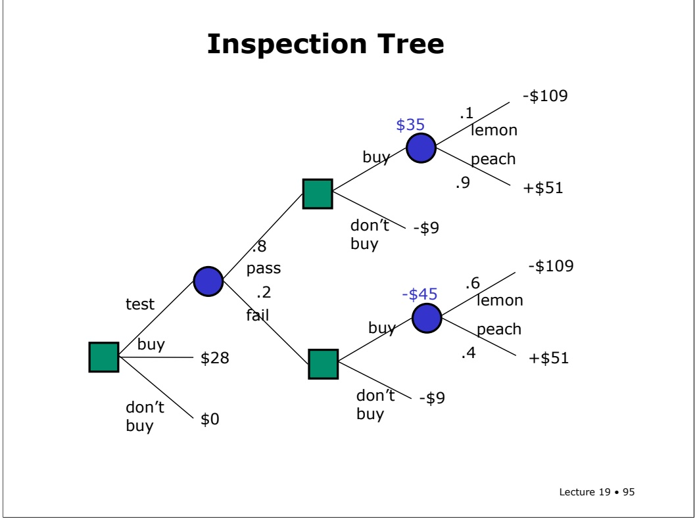

Whew! Now it’s time to evaluate this tree. We start by evaluating the chance nodes nearest the leaves. We compute expected values, and get +\$35 for the top one and -\$45 for the bottom one.

<!-- page: 96 -->

Inspection Tree

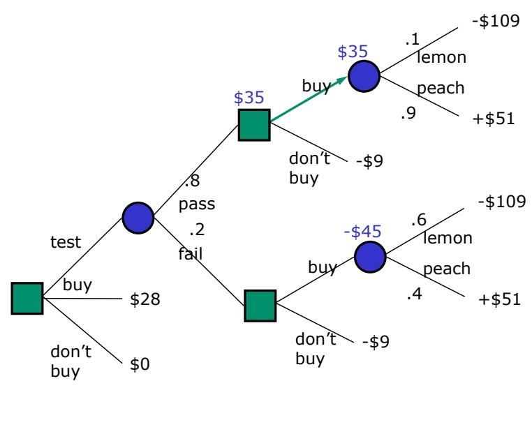

Now, we can do the choice nodes. In the top choice node, it’s much better to buy the car, and the node gets value +\$35.

<!-- page: 97 -->

Inspection Tree

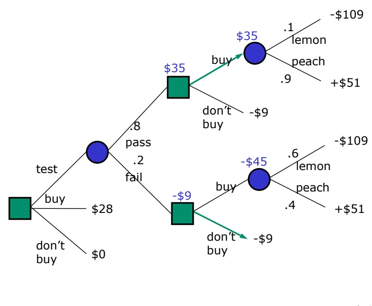

In the bottom choice node, buying the car is a bad idea, so we just end up with -\$9, for having paid for the test.

<!-- page: 98 -->

Inspection Tree

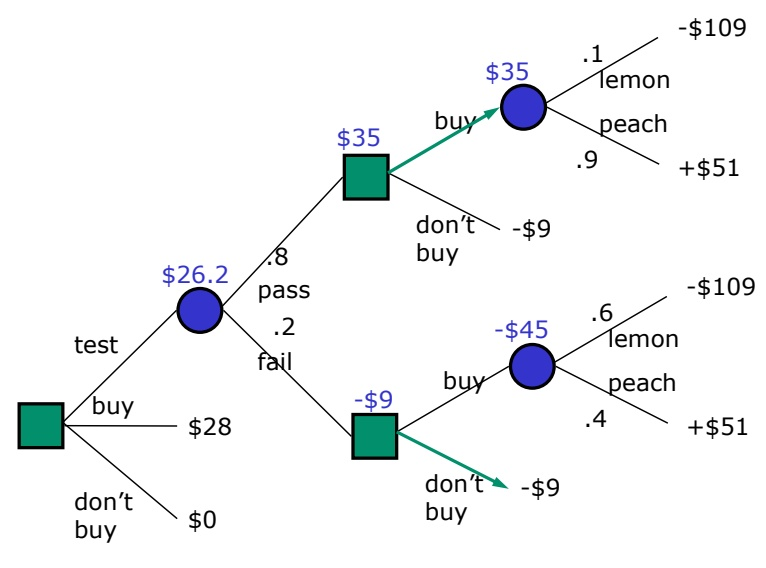

Now we’re ready to evaluate the first chance node, by taking the expected value of its children. We get +\$26.2.

<!-- page: 99 -->

Inspection Tree

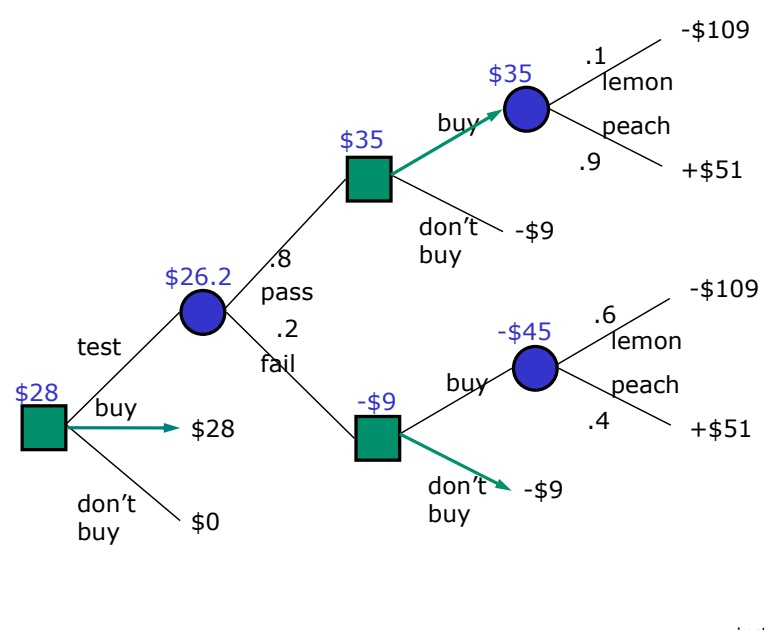

Finally, we can decide what action to take on the first step: we’ll just buy the car directly, without having it inspected.

<!-- page: 100 -->

Inspection Tree

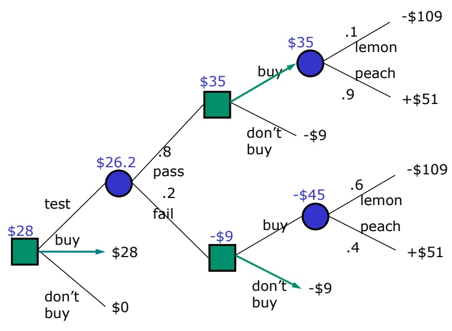

Again, this is probably a case in which a typical, somewhat risk averse person would pay for the test. The worst outcome on the test branch is losing \$9, whereas the worst outcome on the buy branch is losing \$100.

<!-- page: 101 -->

Here’s one more car buying scenario. You can have the car inspected first, and then decide, based on the result, to buy the car with or without a guarantee, or not at all. What should you do?

<!-- page: 102 -->
