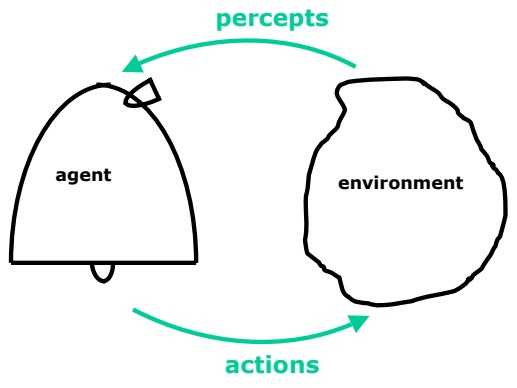
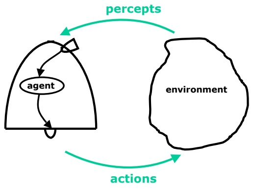
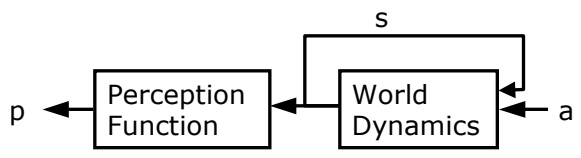
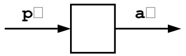
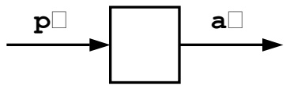
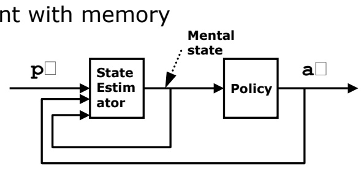
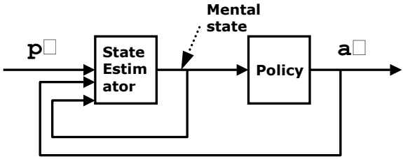
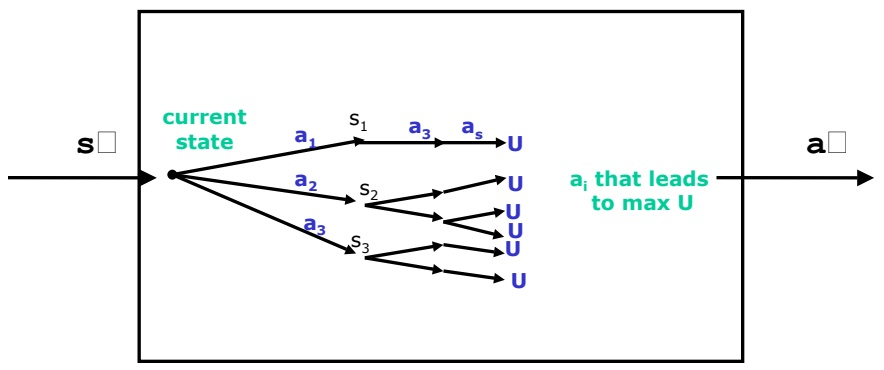
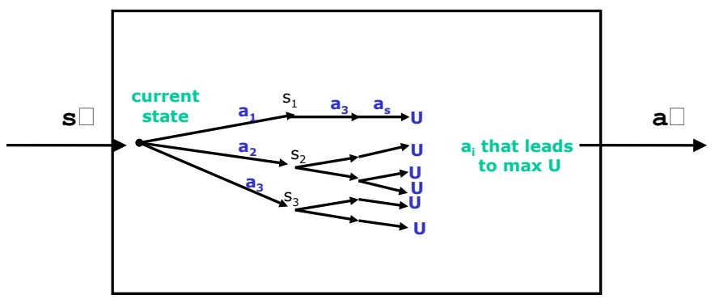

<!-- page: 1 -->

**6.825 Techniques in Artificial Intelligence**

# What is Artificial Intelligence (AI)?

If you're going to teach or take an AI course, it's useful to ask: "What's AI?"

It's a lot of different things to a lot of different people. Let's go through a few things that AI is thought to be and situate them within the broader picture of AI.

<!-- page: 2 -->

One thing it could be is "Making computational models of human behavior". Since we believe that humans are intelligent, therefore models of intelligent behavior must be AI. There's a great paper by Turing who really set up this idea of AI as making models of human behavior (link). In this way of thinking of AI, how would you proceed as an AI scientist? One way, which would be a kind of cognitive science, is to do experiments on humans, see how they behave in certain situations and see if you could make computers behave in that same way. Imagine that you wanted to make a program that played poker. Instead of making the best possible poker-playing program, you would make one that played poker like people do.

<!-- page: 3 -->

## 6.825 Techniques in Artificial Intelligence

## What is Artificial Intelligence (AI)?

• Computational models of human behavior? • Programs that behave (externally) like humans

• Computational models of human “thought” processes?

• Programs that operate (internally) the way humans do

Lecture 1 • 3

Another way is to make computational models of human thought processes. This is a stronger and more constrained view of what the enterprise is. It is not enough to make a program that seems to behave the way humans do; you want to make a program that does it the way humans do it. A lot of people have worked on this in cognitive science and in an area called cognitive neuroscience. The research strategy is to affiliate with someone who does experiments that reveal something about what goes on inside people's heads and then build computational models that mirror those kind of processes.

A crucial question is to decide at what level to mirror what goes on inside people's heads. Someone might try to model it a very high-level, for example, dividing processing into high-level vision, memory, and cognition modules; they try to get the modularity to be accurate but they don't worry too much about the details of how the modules are implemented. Other people might pick the neuron as a kind of computational unit that feels like it's justified in terms of neurophysiology, and then take that abstract neuron and make computational mechanisms out of it. It seems justified because we know that brains are made out of neurons. But then, if you talk to people that study neurons, you find that they argue a lot about what neurons can and can't do computationally and whether they are a good abstraction so maybe you might want to make your models at a lower level. So, it’s hard to know how to match up what we know about brains with computational models.

<!-- page: 4 -->

Another thing that we could do is build computational systems that behave intelligently. What do we mean here? When we talked about human behavior, we said that it was intelligent because humans are intelligent (sort of by definition), so what humans do has to be intelligent. In this view, we say that there might be other ways of being intelligent besides the way humans do it. And so what we might want to do is make computational systems drawn from this larger class. But then you get into terrible trouble because you have to say what it means to behave intelligently. We might feel that although we can't define what it is to be intelligent, we can recognize it when we see it. We'll give up on trying to decide what intelligence is and spend our time thinking about rationality. What might it mean to behave rationally? We'll get into that in more detail later.

<!-- page: 5 -->

So, the perspective of this course is that we are going to build systems that behave rationally - that do a good job of doing what they're supposed to do in the world. But, we're not going to feel particularly bound to respect what is known about how humans behave or function. Although we're certainly quite happy to take inspiration from what we know.

<!-- page: 6 -->

## 6.825 Techniques in Artificial Intelligence

## What is Artificial Intelligence (AI)?

• Computational models of human behavior? • Programs that behave (externally) like humans

• Computational models of human “thought” processes?

• Programs that operate (internally) the way humans do

• Computational systems that behave intelligently? • What does it mean to behave intelligently?

• !Computational systems that behave rationally • More on this later

• AI applications

• Monitor trades, detect fraud, schedule shuttle loading, etc.

Lecture 1 • 6

There's another part of AI that we will talk about in this class that's fundamentally about applications. Some of these applications you might not want to call "intelligent" or "rational" but it is work that has traditionally been done in the field of AI. Usually, they are problems in computer science that don't feel well specified enough for the rest of the computer science community to want to work on. For instance, compilers used to be considered AI, because you were writing down statements in a high-level language; and how could a computer possibly understand that stuff? Well, you had to do work to make a computer understand the high-level language and that was taken to be AI. Now that we understand compilers and there's a theory of how to build compilers and lots of compilers are out there, well, it's not AI any more. So, AI people have a chip on their shoulders that when they finally get something working it gets co-opted by some other part of the field. So, by definition, no AI ever works; if it works, it's not AI.

But, there are all kinds of applications of AI. Many of these are applications of learning, which is my field of research and for which I have a soft spot in my heart. For example, NASDAQ, the stock exchange, now monitors trades to see if insider trading is going on, Visa now runs some kind of neural network program to detect fraudulent transactions, people do cell-phone fraud detection through AI programs, scheduling is something that used to be AI and is now evolving out of AI (and so it doesn't really count). It includes things like scheduling operations in big manufacturing plants; NASA uses all kind of AI methods (similar to the ones we're going to explore in the first homework) to schedule payload bay operations: getting the space shuttle ready to go is a big and complicated process and they have to figure out what order to do all the steps. There are all kinds of applications in medicine. For example, in managing a ventilator, a machine that is breathing for a patient, there are all kinds of issues of how to adjust various levels of gases, monitor pressure, etc. Obviously, you could get that very badly wrong and so you want a system that's good and reliable. There are long lists of examples; AI applications are very viable.

We're going to spend most of our time thinking, or at least feeling motivated, by computational systems that behave rationally. But a lot of the techniques that we will be talking about will end up serving a wide variety of application goals as well.

That's my story about what we're up to in this course.

<!-- page: 7 -->

We're going to be talking about agents. This word used to mean “something that acts.” Now, people talk about Web agents that do things for you, or human publicity agents. When I talk about agents, I mean something that acts. So, it could be anything from a robot, to a piece of software that runs in the world and gathers information and takes action based on that information, to a factory, to all the airplanes belonging to United Airlines. So, I will use that term very generically. When I talk about computational agents that behave autonomously, I'll use agent as a shorthand for that.

<!-- page: 8 -->

## The Agent and the Environment

How do we begin to formalize the problem of building an agent?

• Make a dichotomy between the agent and its environment

• Not everyone believes that making this dichotomy is a good idea, but we need the leverage it gives us.

So, how do we think about agents? How can we begin to formalize the problem of building an agent? Well, the first thing that we're going to do, which some people object to fairly violently, is to make a dichotomy between an agent and its environment. There are people in AI that want to argue that this is exactly the wrong thing to do; that I shouldn't try to give an account of how an agent works by separating it from the world it works in, because the interface is so big and so complicated. And that may be right. That I can't get exactly right a description of how the agent needs to operate in the world by separating it from the world. But, it gives me a kind of leverage in designing the system that I need right now because I, as the designer of the system, am not smart enough to consider the system as a whole.

<!-- page: 9 -->

Lecture 1 • 9

## The Agent and the Environment

How do we begin to formalize the problem of building an agent?

• Make a dichotomy between the agent and its environment

• Not everyone believes that making this dichotomy is a good idea, but we need the leverage it gives us.

Here's a robot and the world it lives in. The robot is going to take actions that affect the state of the environment and it's going to receive percepts somehow that tell it about what's going on in the environment. There is a loop where the agent does something that changes the state of the environment, then it perceives some new information about the state of the environment. There's a hard question of where to draw the line between the agent and the environment. In this class, we'll spend our entire time thinking about the agent as a computational entity. So, I should really draw this cartoon differently. Since we're going to be thinking about what is going on in the agent’s head and so the actions, instead of going from the body to the environment, are going to be going from the agent's head to its wheels and the percepts are coming from the camera into its brain.

<!-- page: 10 -->

## The Agent and the Environment

How do we begin to formalize the problem of building an agent?

• Make a dichotomy between the agent and its environment

• Not everyone believes that making this dichotomy is a good idea, but we need the leverage it gives us.

And, so, here's another view of the world. We're going to be thinking about the agent as the software that runs some big hardware system. That is not to make light of or say that it's easy to design the hardware part, and depending on how the hardware part has been designed your problem could be made arbitrarily easier or harder.

An example of this is making a walking robot. How hard that job is depends on the design of the hardware. There are these great walking robots, called "compass walkers", that are just two legs hinged together and when you set them on an inclined plane they will walk down the hill (if you get it balanced right); so you don't need any computation at all to do that walking. So, the computation, or intelligence or whatever, is in the design of the hardware. On the other hand, you could build a great big contraption, as some researchers have, with six or eight legs that is taller than this room and it runs a whole complicated planning algorithm to decide where to place each foot. That's the opposite extreme of putting all the intelligence in the brain, instead of in the hardware.

We're going to try to be agnostic about the design of the hardware and work with people who do a good job of that, and take as given the computational problems it generates. How can we formalize a computational problem of building an agent?

<!-- page: 11 -->

What do we need to write down when we talk about the problem of making an agent? How can we specify it really carefully?

<!-- page: 12 -->

First, we're going to need an action interface. These all the things that my agent can do. The space of actions might be continuous, or it might be very high dimensional, but there's some space of possible actions that the agent can take in the world.

<!-- page: 13 -->

## World Model

• A – the action space

• P – the percept space

Next, we need a percept space: what are all the things that the agent can perceive in the world? These spaces can be continuous; you can imagine that the agent can perceive how high its arm is raised or the temperature in some reaction vessel.

We're going to assume a model in which the turn-taking between agent and environment takes place in discrete time. I drew this picture of the interaction between the agent and its environment and I said that the agent takes an action and the environment updates its state and then the agent observes. You could imagine modeling this as a set of coupled differential equations, and there are people who do that for fairly simple and low-level systems; but we're going to think of things rather more discretely and so we're going to model the interaction between the agent and the environment in discrete time, with a cycle taking place every one second or two seconds or ten seconds or ten minutes. Time won't enter too much in the methods we'll talk about, but it will a bit and it's something that's really important to keep in the back of our minds.

<!-- page: 14 -->

## World Model

• A – the action space

• P – the percept space

• E – the environment: $\mathsf { A } ^ { * } \to \mathsf { P }$

Now, we have a set of actions and a set of percepts and we need the environment. We need, in order to say what the problem is for our agent, to describe the world that the agent lives in. At the most detailed level, we can think of the environment as being a mapping of strings of actions into percepts. You could say, what does the environment do? Well, there's some history of actions that the agent has done to it and every time the agent does a new action, the environment generates a percept. That's not a very helpful way of thinking about it.

<!-- page: 15 -->

## World Model

• A – the action space

• P – the percept space

• E – the environment: $\mathsf { A } ^ { * } \to \mathsf { P }$

• Alternatively, define

• S – internal state [may not be visible to agent]

• Perception function: $\dot { S } \rightarrow \mathsf { P }$

• World dynamics: ${ \mathsf { S } } \times \mathsf { I A } \to { \mathsf { S } }$

Lecture 1 • 15

Usually we'll think of the environment as having some internal state, which may not be visible to the agent. We can describe how the environment works by specifying two functions. The perception function says what percepts the agent will receive as a function of the current state of the environment. And the world dynamics or state transition function says what the next world state will be, given the previous world state and the action taken by the agent.

Later on we'll talk in detail about the fact that these functions may not be deterministic and they may not really be known. Suppose you wanted to make a robot that could vacuum the hallways or something in this building. You'd like not to have to completely specify how this building is laid out and where the chairs are and who has a backpack on the floor today. So, in fact, rather than giving a complete, perfectly nailed-down description of how the environment works, in general when we specify the problem of designing an agent, we'll give some constraints, just parts of a specification of how the environment works; and we’ll leave the agent to fill in the details through perception and learning.

<!-- page: 16 -->

# Agent Design

• → R \* → R)U – utility function: S (or S

So far, we have no value judgments. We're describing a set of worlds that the agent has to work in. And we also have to say what we want the agent to do; what constitutes good or bad behavior of the agent in the environment. We need a utility function. It’s typically thought of as a mapping from states in the world to real values, or maybe sequences of states into real values. It is meant to say, "Agent, these are the states of the world and this is how valuable they are from your perspective." So that indirectly tells the agent what you want it to do.

<!-- page: 17 -->

## Agent Design

• U – utility function: ${ \mathsf { S } } \to \mathbb { R } { \mathsf { U } } { \mathsf { o r } } \; { \mathsf { S } } ^ { * } \to \mathbb { R } )$

• The agent design problem: Find $\mathsf { P } ^ { * } \to \mathsf { A }$

• mapping of sequences of percepts to actions

• maximizes the utility of the resulting sequence of states (each action maps from one state to next state).

Lecture 1 • 17

Now, our problem, as people who want to design AI systems, is to build the agent (the software) in such a way as to get a lot of utility. So, now we just have an optimization problem: that doesn't seem so hard. Well, it's going to turn out to be really quite hard. But, at this level of abstraction, it's straightforward what we want to do. We want to put the program in the head of the agent that does as well as it can, subject to this specification of how the world works and what we want in the world.

<!-- page: 18 -->

## Rationality

• A rationa it <u>believes</u> willl agent takes actions.achieve its <u>goals</u>

• Assume I don’t like to get wet, so I bring an umbrella. Is that rational?

• Depends on the weather forecast and whether I’ve heard it. If I’ve heard the forecast for rain (and I believe it) then bringing the umbrella is rational.

Lecture 1 • 18

Let's talk about rationality, since I said that what we wanted to do was to make rational agents. So, what do I mean by that? The standard definition of rationality is: A rational agent takes actions it believes will enable it to achieve its goals. This is all in high-level pseudo-psychological talk that makes some people nervous. We can cache it out into something more concrete in a minute but the idea is that you're rational if you take actions that are consistent with what you are trying to achieve in the grand scheme of things.

Let's say that I don't like to be wet and so when I come out of my office in the morning, I bring an umbrella. Is that rational? Depends on the weather forecast, and whether I've heard the weather forecast. If I heard the weather forecast and I'm disposed to believe it, and I think it's going to rain, then it's rational to bring my umbrella. Whether it's going to rain or not, whether you think it's dumb for me to want to stay dry, given what I'm trying to do and given what I know, we'll say an action is rational if it would lead to doing a good job of what I'm trying to do.

<!-- page: 19 -->

## Rationality

• A rationa it <u>believes</u> willl agent takes actions.achieve its <u>goals</u>

• Assume I don’t like to get wet, so I bring an umbrella. Is that rational?

• Depends on the weather forecast and whether I’ve heard it. If I’ve heard the forecast for rain (and I believe it) then bringing the umbrella is rational.

## • ≠Rationality omniscience

• Assume the most recent forecast is for rain but I did not listen to it and I did not bring my umbrella. Is that rational?

• Yes, since I did not know about the recent forecast!

Lecture 1 • 19

Rationality is not omniscience. For example, some time ago I rode my bike in to work, not knowing that it was going to snow like crazy and I was going to run into a car on the way home. You can still argue that it was rational for me to ride my bike, maybe at some grander level it was irrational not to have watched the weather forecast the night before. But, given what I knew it was ok to ride my bike, even though it turned out be dumb at some level, because I didn't know what was happening.

<!-- page: 20 -->

## Rationality

• A rationa it <u>believes</u> willl agent takes actions.achieve its <u>goals</u>

• Assume I don’t like to get wet, so I bring an umbrella. Is that rational?

• Depends on the weather forecast and whether I’ve heard it. If I’ve heard the forecast for rain (and I believe it) then bringing the umbrella is rational.

• ≠Rationality omniscience

• Assume the most recent forecast is for rain but I did not listen to it and I did not bring my umbrella. Is that rational?

• Yes, since I did not know about the recent forecast!

• ≠Rationality success

• Suppose the forecast is for no rain but I bring my umbrella and I use it to defend myself against an attack. Is that rational?

• No, although successful, it was done for the wrong reason. Lecture 1 • 20

Also, rationality is not the same as success. Imagine that I take my umbrella, I know that it's nice and sunny out and I take the umbrella anyway, which seems to be irrational of me. But, then, I use the umbrella to fend off a rabid dog attack. You might say, well it was rational of her to take the umbrella because it saved her from the rabid dog. But that wouldn't be right because it was done for the wrong reason. Even though it was successful and useful; we would not have said that was rational. So this limits the scope of what we want our agents to do. They don't have to be successful and they don't have to know everything, they just have to do a good job given what they know and what they want.

<!-- page: 21 -->

This is still not a good enough notion to decide what should go in the head of our agent or our robot. Do you see any potential problem with this as a criterion for behavior in real systems?

<!-- page: 22 -->

You might not be able to compute the best thing to do.

<!-- page: 23 -->

## Limited Rationality

• There is a big problem with our definition of rationality…

• The agent might not be able to compute the best action (subject to its beliefs and goals).

• limited rationality: “acting inSo, we want to use the best way you can subject to the computational constraints that you have”

Lecture 1 • 23

There's a notion that the philosophers have pursued, and so have AI people. Instead of complete or perfect rationality, they talk of limited rationality. And that means exactly "acting in the best way you can subject to the computational constraints that you have." Here we are with soft squishy slow brains that can't compute very well or very fast and so, for instance, humans are irrational because they're bad at doing a variety of tasks; they just can't compute the optimal response in certain circumstances. That we know; there's no question; but yet, you might be able to argue that given our squishy brains that's the best we can do.

In addition, for this idea of limited rationality, you need to put a program in the agent's head that's going to last for the agent's whole range of things it has to do and life it has to live. And it might be that, although the brain could conceivably compute the optimal action in one circumstance, it may not in another. So, we might be able to make a robot that's the best possible chess player, but it might not be able to cross the street. If our robot needs to be able to cross the street, its aggregate behavior is not rational. So, when we think about rationality we may we want to think about it in a much broader context: given all the things that you have to do, given all the circumstances that you're likely to be faced with in the environment that you’ve been put in, how can you respond best in the aggregate? Any individual response may not be the best response, even given your hardware, but it may still be that the program you're running is the best possible program when measured in aggregate over all the things that you have to do.

<!-- page: 24 -->

# Limited Rationality

• There is a big problem with our definition of rationality…

• The agent might not be able to compute the best action (subject to its beliefs and goals).

• limited rationality: “acting inSo, we want to use the best way you can subject to the computational constraints that you have”

• The (limited rational) agent design problem: Find $\mathsf { \hat { P } } ^ { * } \to \mathsf { A }$

• mapping of sequences of percepts to actions

• maximizes the utility of the resulting sequence of states

• subject to our computational constraints

Lecture 1 • 24

Ultimately, what we need to do is make is an agent program. Given the specification of an environment, we want to find the best possible mapping from P\* to A (sequences of percepts to actions) that, subject to our computational constraints, does the best job it can as measured by our utility function.

<!-- page: 25 -->

## Issues

• How could we possibly specify completely the domain the agent is going to work in?

• If you expect a problem to be solved, you have to say what the problem is!

• Specification is usually iterative: Build agent, test, modify specification

Let's imagine that someone was given the job of writing a specification of the environment that we want our agent to work in. You could say: "Oh, but you can't do that. This whole approach seems pretty silly because how is it that anyone could specify the domain that the agent is going to work in?" It does seem hard to write down a specification of the environment, but it’s necessary because if you ask me to solve a problem then you have to tell me what problem you want me to solve. So, you might imagine that this whole process is going to operate in a much larger context that's iterative. You give me a specification of the environment you want the robot to work in; I work away to give you the maximally rational robot given your specification; then we start running it and you tell me "Darn, I forgot to tell you about not vacuuming the cat." Then you would have to go back and redesign the robot software. In any real application you have this cycle at a high level. But, I don't think you can get out of saying: "Here's what I want the system to do."

<!-- page: 26 -->

## Issues

• How could we possibly specify completely the domain the agent is going to work in?

• If you expect a problem to be solved, you have to say what the problem is!

• Specification is usually iterative: Build agent, test, modify specification

• Why isn’t this “just” software engineering?

• There is a huge gap between specification and the program

Lecture 1 • 26

Given a specification for the environment and the utility function, it seems like our problem is "just" one of coming up with a program that satisfies some specifications. It seems like you could go study that in software engineering. But, why not? Why is this not just software engineering? Any of us would be hard-pressed, given all the pieces of the space shuttle and constraints on how they go together, to sit in a chair and write the program that is optimal given all those constraints. The problem is that, although information theoretically this is a specification for the correct program, it is not an effective specification. It's not a specification that the computer can use. There is a huge gap between the specification for what you want the agent to do and what you can write down in a program and actually have run. How do we bridge this gap?

<!-- page: 27 -->

## Issues

• How could we possibly specify completely the domain the agent is going to work in?

• If you expect a problem to be solved, you have to say what the problem is!

• Specification is usually iterative: Build agent, test, modify specification

• Why isn’t this “just” software engineering? • There is a huge gap between specification and the program

• Isn’t this automatic programming?

• It could be, but AP is so hard most people have given up

• We’re not going to construct programs automatically!

• We’re going to map classes of environments and utilities to structures of programs that solve that class of problem

Lecture 1 • 27

There is a part of AI that still goes on (in some places) but people don't talk about much, called "automatic programming". In fact, quite a while ago there was a project going on here in the AI Lab called "The programmer's assistant". It was supposed to enable you to say "I need a linked list of records..." or "Put these things in a hash table..." You would give it instructions at a very high level and it was supposed to write the code for you. The idea in automatic programming was that you would go from some declarative specification of what you wanted the system to do to actual code to do it. But, it's a really hard problem and most people have given up on it. Unfortunately, it seems that's the problem we are faced with here. But, we're not going to do this automatically. So, what's the enterprise that we're going to be engaged in? We're going to look at classes of environment specifications and utility functions and try to map from classes of environments to structures of programs. To try to say that "if you need an agent to try to solve this class of problem in that kind of environment, then here is a good way to structure the computation."

<!-- page: 28 -->

This doesn't feel a lot like AI. We tend to have the idea that AI is about agents thinking in their heads figuring out what they're supposed to do. The approach I’ve described so far is entirely off-line. Someone is “playing God,” doing all the figuring and blasting the program into the head of the robot.

<!-- page: 29 -->

## Thinking

• Is all this off-line work AI? Aren’t the agents supposed to think?

• Why is it ever useful to think? If you can be endowed with an \*→ optimal table of reactions/reflexes (P A) why do you need to think?

Lecture 1 • 29

The question we want to ask ourselves is "Why is it ever useful to think?" If all these thought processes could happen off-line and you could just be endowed with the optimal set of reflexes, then who needs cogitation? Why can't we (for you or a big complicated factory) compile a whole table of reactions? One problem could be that the environment is changing. But even if it isn’t…

<!-- page: 30 -->

The problem is that the table is too big. If P is any size at all or if you live for very long, the table is way too big. Way, way too big. There are too many ways the world could be, there are too many sequences of percepts that you could have of the world. There is no way that you could, off-line, anticipate them.

<!-- page: 31 -->

## Thinking

• Is all this off-line work AI? Aren’t the agents supposed to think?

• Why is it ever useful to think? If you can be endowed with an \*→ optimal table of reactions/reflexes (P A) why do you need to think?

• The table is too big! There are too many world states and too many sequences of percepts.

• In some domains, the required reaction table can be specified compactly in a program (written by a human). These are the domains that are the target of the “Embodied AI” approach.

Lecture 1 • 31

Actually, for some domains you can write a program that compactly implements the same function as the table of reactions. Such domains are targets of the “Embodied AI” approach.

There are really two fundamental differences between their approach and ours. One is that the Embodied AI people actually take as one of their constraints that the mechanisms that they develop be related to the mechanisms that go on in nature. Another difference is that they entertain a different class of problems and the class of problems that they entertain is amenable to direct programming of reactions. It's not approached quite so formally, but the way it works is that a human thinks about a problem, figures out how the program ought to be structured, and writes the program. But that program, when it runs, is pretty direct; it gets the percepts and computes an action. It doesn't seem like it “thinks” (whatever that might mean to us); it doesn't entertain alternative realities. There is certainly a class of problems for which you can't make a table but you can write a fairly compact program that would do the job of being the table. But there are other domains in which you quite clearly can't do that and those are the domains that we are going to focus on.

<!-- page: 32 -->

## Thinking

• Is all this off-line work AI? Aren’t the agents supposed to think?

• Why is it ever useful to think? If you can be endowed with an \*→ optimal table of reactions/reflexes (P A) why do you need to think?

• The table is too big! There are too many world states and too many sequences of percepts.

• In some domains, the required reaction table can be specified compactly in a program (written by a human). These are the domains that are the target of the “Embodied AI” approach.

• In other domains, we’ll take advantage of the fact that most things that could happen – don’t. There’s no reason to pre-compute reactions to an elephant flying in the window.

Lecture 1 • 32

In domains where you can't think of a compact way to write this program down, this mapping from strings of perceptions to actions, we'll have to think of other ways to construct this program. The other ways of constructing this program are going to take advantage of the fact that the vast majority of the things that could happen, don't. Think of all the ways the world could be, there are a lot of percept sequences that you could conceivably have and no matter how long you live you are going to have only the most minuscule fraction of all the percepts you could possibly have. Given that, there's no reason to have precomputed and stored reactions for every possible situation. So, you probably don't have precompiled reactions for what to do if an elephant flies in through the window; on the other hand, if one did ,you wouldn't be totally incapacitated (like you would be if you were under the elephant). You'd say "oh, my gosh" and then your brain would kick in and you'd start figuring out what to do about it. So, you could respond very flexibly to a very broad range of stimuli but there's no way that you could have stored your responses to them.

<!-- page: 33 -->

## Learning

• What if you don’t know much about the environment when you start or if the environment changes?

• Learn!

• We’re sending a robot to Mars but we don’t know the coefficient of friction of the dust on the Martian surface.

• I know a lot about the world dynamics but I have to leave a free parameter representing this coefficient of friction.

Lecture 1 • 33

Let me talk a bit about learning; we're going to talk about learning towards the end of this class. So, what happens when the environment changes? When I talk to people about why it's important to build systems that learn, I say "maybe you don't know very much about the environment when you start out or maybe the environment changes" and so you have to do learning. And it seems that I haven't accounted for that in this framework for specifying environments and utility functions.

But I have accounted for it, because I've said so very little about what this kind of specification might be. So, let's take a very simple case. Imagine that we're sending a robot to Mars and we don't know the coefficient of friction of the dust it's going to land on; they don't know what it feels like to drive around in that stuff. I could still say: "Look, I know something about this place we're going to send the vehicle to. It's going to have gravity, I know what the gravity is going to be like, I know what's going to go on there; I know a lot about the vehicle; but I don't know the coefficient of friction of the dust.

<!-- page: 34 -->

## Learning

• What if you don’t know much about the environment when you start or if the environment changes?

• Learn!

• We’re sending a robot to Mars but we don’t know the coefficient of friction of the dust on the Martian surface.

• I know a lot about the world dynamics but I have to leave a free parameter representing this coefficient of friction.

• Part of the agent’s job is to use sequences of percepts to estimate the missing details in the world dynamics.

Lecture 1 • 34

Instead of giving the complete world dynamics; I'm going to have to leave a free parameter or some disjunction (the world is either going to be like this or like that and I don't know which). And then part of the job of the agent is, based on the sequence of percepts that it has, to estimate or to learn or to gather information about the dynamics of the world. If the domain specification doesn't have to be complete, then the agent is allowed to learn something about how the world works. Similarly, I can build into this specification that there is a coefficient of friction that changes over time but I don't know how it changes. So, learning can fit into our framework, too.

<!-- page: 35 -->

## Learning

• What if you don’t know much about the environment when you start or if the environment changes?

• Learn!

• We’re sending a robot to Mars but we don’t know the coefficient of friction of the dust on the Martian surface.

• I know a lot about the world dynamics but I have to leave a free parameter representing this coefficient of friction.

• Part of the agent’s job is to use sequences of percepts to estimate the missing details in the world dynamics.

• Learning is not very different from perception, they both find out about the world based on experience.

• Perception = short time scale (where am I?)

• Learning = long time scale (what’s the coefficient of friction?)

Lecture 1 • 35

In some sense, learning isn't very different from perception: they both require gaining information about the world by virtue of your experience. We tend to call "learning" things that happen on larger time-scales; things that seem more permanent. And we tend to call perception, things like noticing where I am with respect to a wall; things that are on a shorter time scale; things that don't seem so built-in. But there is no hard and fast distinction between learning and perceiving.

<!-- page: 36 -->

# Classes of Environments

Let's think about environments and the different kinds of environments that our agents might need to work in. Now, a large part of this course will involve thinking about particular properties of the environment that we know hold, and what consequences they might have on how it is that we would design an agent to perform well in that environment. There is a nice list that comes out of Russell & Norvig ( our textbook) of dimensions for characterizing environments.

<!-- page: 37 -->

One dimension along which it is useful to categorize environments is whether they are "accessible". The question is "Can you see the state of the world directly?". Most real environments are inaccessible; I can see some aspects of the state of the world, but I don't know what's happening outside this room or inside your room. So, our world is not accessible, but some kinds of toy worlds are accessible and maybe some kinds of applications. Imagine I am thinking of where to route all the airplanes for United Airlines. I like to think that they know where all the airplanes are all the time, so maybe that's an accessible domain.

<!-- page: 38 -->

## Classes of Environments

• Accessible (vs. Inaccessible)

• Can you see the state of the world directly?

• Deterministic (vs. Non-Deterministic)

• Does an action map one state into a single other state?

Lecture 1 • 38

Another dimension is "deterministic" versus "non-deterministic". Earlier I talked about world dynamics, the mapping between a current state of the world and the action that an agent takes, into another state of the world. In some domains that's usefully thought of as being deterministic. The only domains that are really deterministic are artificial ones, like games. Even clicking on a link and going to a Web page, you know that doesn't always work. Most things are not entirely deterministic, but some are reasonably well-modeled as being deterministic. In the first half of this course, we'll think about deterministic models of the environment, really as an abstraction, and in the second half we'll think about probabilistic models.

<!-- page: 39 -->

## Classes of Environments

• Accessible (vs. Inaccessible)

• Can you see the state of the world directly?

• Deterministic (vs. Non-Deterministic)

• Does an action map one state into a single other state?

• Static (vs. Dynamic)

• Can the world change while you are thinking?

Lecture 1 • 39

Another dimension for describing environments is static versus dynamic. Again, one can argue that everything is dynamic but let's talk about it. It has to do with whether the world can change while you're thinking. If the world can't change while you're thinking, then the whole limited rationality thing does not matter as much, because you can think and think until you come up with the best possible thing to do. But, usually the world is changing. If you compute the optimal trajectory for avoiding the truck but you're a little late, it's no good. You have to really worry about the dynamic property of the environment.

<!-- page: 40 -->

And then there's "discrete" versus "continuous". This is not really an intrinsic property of the environment, but more a property of how we choose to model the environment. So, you can think of your perceptions of the world or your actions as being discrete or continuous.

<!-- page: 41 -->

Let's talk about some environments. What about playing backgammon? Here’s a very brief introduction to backgammon for those of you who are unfamiliar with the game.

<!-- page: 42 -->

## Backgammon-Playing Agent

• Action space – A

• The backgammon moves

– Motor voltages of the robot arm moving the stones?

– Change the (x,y) location of stones?

– Change which point a stone is on? [“Logical” actions]

Lecture 1 • 42

For an agent playing backgammon, what's the action space? The action space is the set of backgammon moves, such as putting a piece on point number 7. It’s easiest to think of the moves in some fairly logical way. You probably don't want to think of the move as the x-y location of the stone on the board. You could. But, that doesn't seem so useful. If you were building the robot to move the pieces, you would have to think of the x-y location; you would have to think of the motor voltages that you send to the joints in order for the arm to move where it needs to go in order to put the stone where it goes on the point on the board.

<!-- page: 43 -->

## Backgammon-Playing Agent

• Action space – A

• The backgammon moves

– Motor voltages of the robot arm moving the stones?

– Change the (x,y) location of stones?

– Change which point a stone is on? [“Logical” actions]

• Percepts – P

• The state of the board

– Images of the board?

– (x,y) locations of the stones?

– Listing of stones on each point? [“Logical” percepts]

Lecture 1 • 43

Similarly, there are a variety of descriptions of the percepts. Your percepts might be images of the backgammon board, they might be x-y locations of the stones, they might be the facial expression of your oponent or they might be a logical description of where the stones are. For any one of those levels of description of the environment and of the problem you're supposed to solve, you'd write the software differently.

Let's take for now the very abstracted view of playing backgammon, the view that backgammon books take. Which is, the moves are putting the stones on points, and the percepts are where (again at a logical level) the stones are.

<!-- page: 44 -->

Backgammon is one of those few domains that is accessible; you can see everything there is to know about the state of a backgammon board.

<!-- page: 45 -->

# Backgammon Environment

• Accessible?

• Yes!

• Deterministic?

• No! Two sources of non-determinism: the dice and the opponent

Is it deterministic? No. There are two issues about backgammon that make it nondeterministic. One is the dice. The other is your opponent. Actually, games are an interesting special case of the model we’ve been exploring. There is a nice chapter in the book on games; but we're not going to cover it, just because there’s too much material to cover it all. Certainly, there is no way to predict what your opponent will do. In game theory, it is typical to assume that your opponent is infinitely smart and predict what he's going to do on that basis. But, there are problems with that. He might not be so smart after all. So, instead, you could try to learn how your opponent behaves, and generate optimal reactions to his apparent behavior. But then, he could change his behavior suddenly and cause a lot of trouble!

<!-- page: 46 -->

Is backgammon static or dynamic? Static unless you have a time limit.

<!-- page: 47 -->

Is it discrete or continuous? Depends on how you choose to model the percepts and the actions. Logical moves and actions are discrete; x-y coordinates and motor voltages are continuous; images are discrete, but it is sometimes useful to treat them partially as continuous.

<!-- page: 48 -->

As an exercise for our next recitation, think about how you might model the problem of designing an automatic taxi driver. What would be an appropriate way to describe the action and percept spaces? What kinds of specifications might you be able to make of the environment? Is it accessible? Discrete? Static? Deterministic?

<!-- page: 49 -->

## Structures of Agents

• Reflex (“reactive”) agent • No memory

Let me go through a couple of structures of agents. We talked about a table-based agent. We'll talk a bit more about what the book calls a simple reflex agent (sometimes called a "reactive" agent). There’s a huge amount of literature on things called reactive - reactive robots, reactive planning, and it's gotten to the point that this word means so many things to so many people that it does not mean anything. The most coherent interpretation is that the agent gets percepts in and it generates actions and it only ever maps a single percept to an action and so it has no memory. So, reactive agents have no memory. Remember that we've said that, in general, an agent maps strings of percepts into actions, allowing it to integrate information over time.

<!-- page: 50 -->

## Structures of Agents

• Reflex (“reactive”) agent • No memory

• What can you solve this way?

• Accessible environments

– Backgammon

– Navigating down a hallway

There are some problems that you can solve with pure reflex agents. You can solve backgammon in this way; maybe you can even solve the problem of driving down the hallway and not running into the wall this way. You look and you see that wall too close and you move away from it, etc. So, there are a some things you can do reactively. Clearly if the world is accessible (you can see everything there is to see in one shot) this means that you don't need any memory; you can just react based on your current percepts.

For example, consider the amount of gasoline in your car. There are (at least) two ways of knowing how much gas you have: one is to remember how much driving you've done since you filled the tank, and the other is to look at the gas gauge. If you have a gas gauge, then the state of the tank is accessible to you and you don't need to remember how long you've been driving.

Accessible and predictable are not the same. You can read the gas gauge but have no idea an hour from now what the gauge will say. In that case, we would still say that the environment is accessible.

<!-- page: 51 -->

Structures of Agents

• Agent with memory

Here's an agent with memory. Everybody who has taken theory of computation is familiar with this picture. You can take any finite state machine and decompose it like this.

<!-- page: 52 -->

## Structures of Agents

• Agent with memory

• State estimator/Memory

• What we’ve chosen to remember from the history of percepts

• Maps what you knew before, what you just perceived and what you just did, into what you know now.

Lecture 1 • 52

It is divided into two components. The first part, often called the state estimator, has the job of synthesizing the agent’s memory about the history of its percepts and actions. One way to think about its memory is that it is some kind of an estimate of the true hidden state of the environment. The state estimator takes as input the old state estimate, the last action, and the current perception, and generates as output a new estimate of the state of the world.

<!-- page: 53 -->

## Structures of Agents

• Agent with memory

## • State estimator/Memory

• What we’ve chosen to remember from the history of percepts

• Maps what you knew before, what you just perceived and what you just did, into what you know now.

• Problem of behavior: Given my mental state, what action should I take?

Lecture 1 • 53

The second component is called the policy. You can think of it as a reflex agent, but rather than taking raw percepts from the world as input, it takes the agent’s memory as input. Then it must select the best action it can based on the current state of the agent’s memory.

<!-- page: 54 -->

# Planning Agent Policy

Planning is explicitly considering future consequences of actions in order to choose the best one.

Lecture 1 • 54

Let's talk about planning for a minute. Consider the problem of deciding whether you should stop for gas, given that you’re in front of a particular gas station.

Assuming that you have an accurate gas gauge, does this problem require memory? No. Your choice of actions depend not just on what's going on right now but what's going to happen in the future. Whether you stop now or not depends on what future events (like running out of gas, or running out of money) might be caused by your choice of action now.

Let's look at what I would call a planning agent. Either it is in a completely accessible world or there is still, off-screen, a state estimator. We are looking at the policy component of the agent, which must, as before, map the available information into actions. But rather than having the policy stored as a simple lookup table or a compact piece of code, it involves a search.

<!-- page: 55 -->

# Planning Agent Policy

Planning is explicitly considering future consequences of actions in order to choose the best one.

Lecture 1 • 55

We take the state from the state estimator and imagine "what will happen if we take action1; what if we take action2”. Then, after we take action1, what if we take action2, etc. I just had a flat tire, what if I call AAA - then wait 6 hours. What if I fix it myself, probably get fixed in 1/2 hour but I'd get covered in mud. So, there are different consequence that result from different ways of doing things. And, how do you evaluate these consequences? With U; you take your utility function and apply it to the predicted results of your actions.

So, planning is the process of generating possible sequences of actions, simulating their consequences, picking which is the best and committing to one of these actions. You pick the immediate action that's on the path that looks best. This computation isn’t all that special; it's just a particular way to organize a computation for choosing an action to take next. It’s particularly appropriate when there are a lot of different possible states you could find yourself in, too many to plan for in advance, and when you are not under so much time pressure that you must have an immediate reaction.

<!-- page: 56 -->

# Planning Agent Policy

Planning is explicitly considering future consequences of actions in order to choose the best one.

• “Let your hypotheses die in your stead.” – Karl Popper

Lecture 1 • 56

Karl Popper was a philosopher of science who thought about falsification of theories. He said that an advantage of being human (I would say of being a planning agent) is that you can let your hypotheses die in your stead. Rather than jumping off the cliff, you can think about what it would be like and decide not to do it.
