<!-- page: 1 -->

Now we’re going to think about how to do planning in uncertain domains. It’s an extension of decision theory, but focused on making long-term plans of action. We’ll start by laying out the basic framework, then look at Markov chains, which are a simple case. Then we’ll explore what it means to have an optimal plan for an MDP, and look at an algorithm, called value iteration, for finding optimal plans. We’ll finish by looking at some of the major weaknesses of this approach and seeing how they can be addressed.

<!-- page: 2 -->

A Markov decision process (known as an MDP) is a discrete-time statetransition system. It can be described formally with 4 components.

<!-- page: 3 -->

First, it has a set of states. These states will play the role of outcomes in the decision theoretic approach we saw last time, as well as providing whatever information is necessary for choosing actions. For a robot navigating through a building, the state might be the room it’s in, or the x,y coordinates. For a factory controller, it might be the temperature and pressure in the boiler. In most of our discussion, we’ll assume that the set of states is finite and not too big to enumerate in our computer.

<!-- page: 4 -->

Next, we have a set of actions. These are chosen, in the simple case, from a small finite set.

<!-- page: 5 -->

The transition probabilities describe the dynamics of the world. They play the role of the next-state function in a problem-solving search, except that every state is thought to be a possible consequence of taking an action in a state. So, we specify, for each state s\_t and action a\_t, the probability that the next state will be s\_t+1. You can think of this as being represented as a set of matrices, one for each action. Each matrix is square, indexed in both dimensions by states. If you sum over all states s\_I, then the sum of the probabilities that S\_I is the next state, given a particular previous state and action is 1.

<!-- page: 6 -->

These processes are called Markov, because they have what is known as the Markov property. that is, that given the current state and action, the next state is independent of all the previous states and actions. The current state captures all that is relevant about the world in order to predict what the next state will be.

<!-- page: 7 -->

Finally, there is a real-valued reward function on states. You can think of this is as a short-term utility function. How good is it, from the agent’s perspective to be in state s? That’s R(s).

<!-- page: 8 -->

## MDP Framework

• S : states

• A : actions

$\mathsf { P r } ( \mathsf { s } _ { \mathsf { t } + 1 } \mid \mathsf { s } _ { \mathsf { t } } ,   \mathsf { a } _ { \mathsf { t } } )$ : transition probabilities

$= \mathsf { P r } ( \mathsf { s } _ { \mathsf { t } + 1 } \mid \mathsf { s } _ { \mathsf { 0 } } \dots \mathsf { s } _ { \mathsf { t } } ,   \mathsf { a } _ { \mathsf { 0 } } \dots \mathsf { a } _ { \mathsf { t } } )$ Markov property

• R(s) : real-valued reward

Find a policy: ∏: S → A

Lecture 20 • 8

The result of classical planning was a plan. A plan was either an ordered list of actions, or a partially ordered set of actions, meant to be executed without reference to the state of the environment. When we looked at conditional planning, we considered building plans with branches in them, that observed something about the state of the world and acted differently depending on the observation. In an MDP, the assumption is that you could potentially go from any state to any other state in one step. And so, to be prepared, it is typical to compute a whole **policy**, rather than a simple plan. A policy is a mapping from states to actions. It says, no matter what state you happen to find yourself in, here is the action that it’s best to take now. Because of the Markov property, we’ll find that the choice of action only needs to depend on the current state (and possibly the current time), but not on any of the previous states.

<!-- page: 9 -->

<div class="docvortex-algorithm" style="white-space: pre-wrap; font-family:monospace;">
MDP Framework
• S : states
• A : actions
• Pr(s_{t+1} | s_t, a_t) : transition probabilities
    = Pr(s_{t+1} | s_0 ... s_t, a_0 ... a_t) Markov property
• R(s) : real-valued reward

Find a policy: $\Pi$: S $\to$ A
Maximize
• Myopic: E[r_t | $\Pi$, s_t] for all s

Lecture 20 • 9
</div>

So, what is our criterion for finding a good policy? In the simplest case, we’ll try to find the policy that maximizes, for each state, the expected reward of executing that policy in the state. This is a particularly easy problem, because it completely decomposes into a set of decision problems: for each state, find the single action that maximizes expected reward. This is exactly the single-action decision theory problem that we discussed before.

<!-- page: 10 -->

<div class="docvortex-algorithm" style="white-space: pre-wrap; font-family:monospace;">
MDP Framework
• S : states
• A : actions
• Pr(s_{t+1} | s_t, a_t) : transition probabilities
    = Pr(s_{t+1} | s_0 ... s_t, a_0 ... a_t) Markov property
• R(s) : real-valued reward

Find a policy: $\Pi$: S → A
Maximize
• Myopic: E[r_t | $\Pi$, s_t] for all s
• Finite horizon: E[$\sum_{t=0}^{k} r_t$ | $\Pi$, s_0]

Lecture 20 • 10
</div>

It’s not usually good to be so short sighted, though! Let’s think a little bit farther ahead. We can consider policies that are “finite-horizon optimal” for a particular horizon k. That means, that we should find a policy that, for every initial state s0, results in the maximal expected sum of rewards from times 0 to k.

<!-- page: 11 -->

<div class="docvortex-algorithm" style="white-space: pre-wrap; font-family:monospace;">
MDP Framework
• S : states
• A : actions
• Pr($s_{t+1}$ | $s_t$, $a_t$) : transition probabilities
    = Pr($s_{t+1}$ | $s_0$ ... $s_t$, $a_0$ ... $a_t$) Markov property
• R(s) : real-valued reward

Find a policy: $\Pi$: S → A
Maximize
• Myopic: E[$r_t$ | $\Pi$, $s_t$] for all s
• Finite horizon: E[$\sum_{t=0}^{k} r_t$ | $\Pi$, $s_0$]
    – Non-stationary policy: depends on time

Lecture 20 • 11
</div>

So, if the horizon is 2, we’re maximizing over our reward today and tomorrow. If it’s 300, then we’re looking a lot farther ahead. We might start out by doing some actions that have very low rewards initially, because by doing them we are likely to be taken to states that will ultimately result in high reward. (Students are often familiar with the necessity of passing through low-reward states in order to get to states with higher reward!). Because we will, in general, want to choose actions differently at the very end of our lives (when the horizon is short) than early in our lives, it will be necessary to have a non-stationary policy in the finite-horizon case. That is, we’ll need a different policy for each number of time steps remaining in our life.

<!-- page: 12 -->

<div class="docvortex-algorithm" style="white-space: pre-wrap; font-family:monospace;">
MDP Framework
• S : states
• A : actions
• Pr(s_{t+1} | s_t, a_t) : transition probabilities
    = Pr(s_{t+1} | s_0 ... s_t, a_0 ... a_t) Markov property
• R(s) : real-valued reward

Find a policy: $\Pi$: S $\rightarrow$ A
Maximize
• Myopic: E[r_t | $\Pi$, s_t] for all s
• Finite horizon: E[$\sum_{t=0}^{k} r_t$ | $\Pi$, s_0]
    – Non-stationary policy: depends on time
• Infinite horizon: E[$\sum_{t=0}^{\infty} r_t$ | $\Pi$, s_0]

Lecture 20 • 12
</div>

Because in many cases it’s not clear how long the process is going to run (consider designing a robot sentry, or a factory controller), it’s popular to consider infinite horizon models of optimality.

<!-- page: 13 -->

<div class="docvortex-algorithm" style="white-space: pre-wrap; font-family:monospace;">
MDP Framework
• S : states
• A : actions
• Pr($s_{t+1}$ | $s_t$, $a_t$) : transition probabilities
    = Pr($s_{t+1}$ | $s_0$ ... $s_t$, $a_0$ ... $a_t$) Markov property
• R(s) : real-valued reward

Find a policy: $\Pi$: S → A
Maximize
• Myopic: E[$r_t$ | $\Pi$, $s_t$] for all s
• Finite horizon: E[$\sum_{t=0}^{k} r_t$ | $\Pi$, $s_0$]
    - Non-stationary policy: depends on time
• Infinite horizon: E[$\sum_{t=0}^{\infty} \gamma^t r_t$ | $\Pi$, $s_0$]
    - 0 &lt; $\gamma$ &lt; 1 is discount factor

Lecture 20 • 13
</div>

But if we add up all the rewards out into infinity, then the sums will be infinite in general. To keep the math nice, and to put some pressure on the agent to get rewards sooner rather than later, we use a discount factor. The discount factor gamma is a number between 0 and 1, which has to be strictly less than 1. Usually it’s somewhere near 0.9 or 0.99 . So, we want to maximize our sum of rewards, but rewards that happen tomorrow are only worth .9 of what they would be worth today. You can think of this as a model of the present value of money, as in economics. Or, that your life is going to end with probability 1-gamma on each step, but you don’t when.

<!-- page: 14 -->

<div class="docvortex-algorithm" style="white-space: pre-wrap; font-family:monospace;">
MDP Framework
• S : states
• A : actions
• Pr(s_{t+1} | s_t, a_t) : transition probabilities
    = Pr(s_{t+1} | s_0 ... s_t, a_0 ... a_t) Markov property
• R(s) : real-valued reward

Find a policy: $\Pi$: S $\to$ A
Maximize
• Myopic: E[r_t | $\Pi$, s_t] for all s
• Finite horizon: E[Σ^{k}_{t=0} r_t | $\Pi$, s_0]
    - Non-stationary policy: depends on time
• Infinite horizon: E[Σ^{∞}_{t=0} γ^t r_t | $\Pi$, s_0]
    - 0 &lt; γ &lt; 1 is discount factor
    - Optimal policy is stationary

Lecture 20 • 14
</div>

This model has the very convenient property that the optimal policy is stationary. It’s independent of how long the agent has run or will run in the future (since nobody knows that exactly). Once you’ve survived to live another day, in this model, the expected length of your life is the same as it was on the previous step, and so your behavior is the same, as well.

<!-- page: 15 -->

To build up some intuitions about how MDPs work, let’s look at a simpler structure called a Markov chain. A Markov chain is like an MDP with no actions, and a fixed, probabilistic transition function from state to state.

<!-- page: 16 -->

## Markov Chain

• Markov Chain

• states

• transitions

• rewards

• no actions

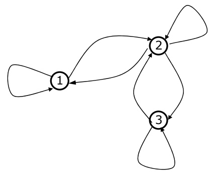

Here’s a tiny example of a Markov chain. It has three states.

<!-- page: 17 -->

Lecture 20 • 17

## Markov Chain

• Markov Chain

• states

• transitions

• rewards

• no actions

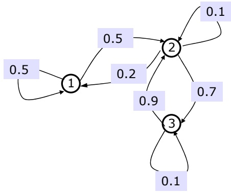

The transition probabilities are shown on the arcs between states. Note that the probabilities on all the outgoing arcs of each state sum to 1.

<!-- page: 18 -->

Lecture 20 • 18

## Markov Chain

• Markov Chain

• states

• transitions

• rewards

• no actions


Markov chains don’t always have reward values associated with them, but we’re going to add rewards to ours. We’ll make states 1 and 3 have an immediate reward of 0, and state 2 have immediate reward of 10.

<!-- page: 19 -->

## Markov Chain

• Markov Chain

• states

• transitions

• rewards

• no actions

• Value of a state, using infinite discounted horizon

V(s)

Now, we can define the infinite horizon expected discounted reward as a function of the starting state. We’ll abbreviate this as the **value** of a state.

Lecture 20 • 19


<!-- page: 20 -->

## Markov Chain

• Markov Chain

• states

• transitions

• rewards

• no actions

• Value of a state, using infinite discounted horizon

$$
V (s) = R (s)
$$

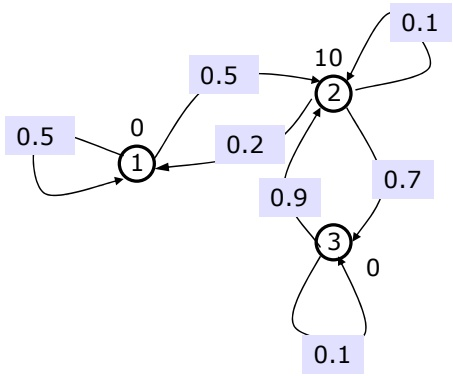

Lecture 20 • 20

So, how much total reward do we expect to get if we start in state s? Well, we know that we’ll immediately get a reward of R(s).

<!-- page: 21 -->

## Markov Chain

• Markov Chain

• states

• transitions

• rewards

• no actions

• Value of a state, using infinite discounted horizon

$$
V (s) = R (s) + \gamma ()
$$


But then, we’ll get some reward in the future. The reward we get in the future is not worth as much to us as reward in the present, so we multiply by discount factor gamma.

<!-- page: 22 -->

## Markov Chain

• Markov Chain

• states

• transitions

• rewards

• no actions

• Value of a state, using infinite discounted horizon

$$
\mathrm{V} (s) = \mathrm{R} (s) + \gamma \sum_ {s ^ {\prime}} \mathrm{P} (s ^ {\prime} | s) \mathrm{V} (s ^ {\prime})
$$

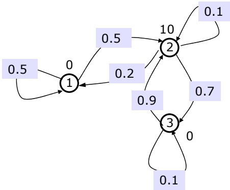

Lecture 20 • 22

Now, we consider what the future might be like. We’ll compute the expected long-term value of the next state by summing over all possible next states, $\mathbf { s } ^ { \prime }$ , the product of the probability of making a transition from s to $\mathbf { s } ^ { \prime }$ and the infinite horizon expected discounted reward, or **value** of $\mathbf { s } ^ { \prime }$

<!-- page: 23 -->

## Markov Chain

• Markov Chain

• states

• transitions

• rewards

• no actions

• Value of a state, using infinite discounted horizon

$$
\mathrm{V} (s) = \mathrm{R} (s) + \gamma \sum_ {s ^ {\prime}} \mathrm{P} (s ^ {\prime} | s) \mathrm{V} (s ^ {\prime})
$$


Lecture 20 • 23

Since we know R and P (those are given in the specification of the Markov chain), we’d like to compute V. If n is the number of states in the domain, then we have a set of n equations in n unknowns (the values of each state). Luckily, they’re easy to solve.

<!-- page: 24 -->

$$
V (s) = R (s) + \gamma \sum_ {s ^ {\prime}} P (s ^ {\prime} | s) V (s ^ {\prime})
$$

$$
V (1) = 0 +. 9 (. 5 V (1) +. 5 V (2))
$$

$$
\mathrm{V} (2) = 1 0 +. 9 (. 2 \mathrm{V} (1) +. 1 \mathrm{V} (2) +. 7 \mathrm{V} (3))
$$

$$
\mathrm{V} (3) = 0 +. 9 (\quad . 9 \mathrm{V} (2) +. 1 \mathrm{V} (3))
$$

So, here are the equations for the values of the states in our example, assuming a discount factor of 0.9.

<!-- page: 25 -->

## Markov Chain

• Markov Chain

• states

• transitions

• rewards

• no actions

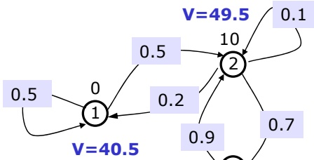

• Value of a state, using infinite discounted horizon

$$
V (s) = R (s) + \gamma \sum_ {s ^ {\prime}} P (s ^ {\prime} | s) V (s ^ {\prime})
$$

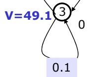

• Assume γ=0.9

$$
\mathrm{V(1)} = 0 +. 9 (. 5 \mathrm{V(1)} +. 5 \mathrm{V(2)})
$$

$$
\mathrm{V} (2) = 1 0 +. 9 (. 2 \mathrm{V} (1) +. 1 \mathrm{V} (2) +. 7 \mathrm{V} (3))
$$

$$
V (3) = 0 +. 9 (\quad . 9 V (2) +. 1 V (3))
$$

Lecture 20 • 25

Now, if we solve for the values of the states, we get that V(1) is 40.5, V(2) is 49.5, and V(3) is 49.1. This seems at least intuitively plausible. State 1 is worth the least, because it’s kind of hard to get from there to state 2, where the reward is. State 2 is worth the most; it has a large reward and it usually goes to state 3, which usually comes right back again for another large reward. State 3 is close to state 2 in value, because it usually takes only one step to get from 3 back to 2.

<!-- page: 26 -->

$$
V (s) = R (s) + \gamma \sum_ {s ^ {\prime}} P (s ^ {\prime} | s) V (s ^ {\prime})
$$

$$
V (1) = 0 +. 9 (. 5 V (1) +. 5 V (2))
$$

$$
\mathrm{V} (2) = 1 0 +. 9 (. 2 \mathrm{V} (1) +. 1 \mathrm{V} (2) +. 7 \mathrm{V} (3))
$$

$$
\mathrm{V} (3) = 0 +. 9 (\quad . 9 \mathrm{V} (2) +. 1 \mathrm{V} (3))
$$

If we set gamma to 0, then the values of the nodes would be the same as their rewards. If gamma were small but non-zero, then the values would be smaller than in this case and their differences more pronounced.

<!-- page: 27 -->

Now, we’ll go back to thinking about Markov Decision Processes. If you take an MDP and fix the policy, then all of the actions are chosen and what you have left is a Markov chain. So, given a policy, it’s easy to evaluate it, in the sense that you can compute what value the agent can expect to get from each possible starting state, if it executes that policy.

<!-- page: 28 -->

## Finding the Best Policy

• MDP + Policy = Markov Chain

• MDP = the way the world works

• Policy = the way the agent works

$$
\bullet \mathrm{V} ^ {*} (s) = \mathrm{R} (s) + \max _ {a} [ \gamma \sum_ {s ^ {\prime}} \mathrm{P} (s ^ {\prime} \mid s, a) \mathrm{V} ^ {*} (s ^ {\prime}) ]
$$

We want to find the best possible policy. We’ll approach this problem by thinking about $V ^ { \star }$ , the optimal value function. $V ^ { \star }$ is defined using the following set of recursive equations. The optimal value of a state s is the reward that we get in s, plus the maximum over all actions we could take in s, of the discounted expected optimal value of the next state. The idea is that in every state, we want to choose the action that maximizes the value of the future.

<!-- page: 29 -->

## Finding the Best Policy

• MDP + Policy = Markov Chain

• MDP = the way the world works

• Policy = the way the agent works

$$
\bullet \mathrm{V} ^ {*} (s) = \mathrm{R} (s) + \max _ {a} [ \gamma \sum_ {s ^ {\prime}} \mathrm{P} (s ^ {\prime} \mid s, a) \mathrm{V} ^ {*} (s ^ {\prime}) ]
$$

• Theorem: There is a unique V\* satisfying these equations

Lecture 20 • 29

This is sort of like the set of equations we had for the Markov chain. We have n equations in n unknowns. The problem is that now we have these annoying “max” operators in our equations, which makes them non-linear, and therefore non-trivial to solve. Nonetheless, there is a theorem that says, given R and P, there is a unique function V\* that satisfies these equations.

<!-- page: 30 -->

```python
Finding the Best Policy
• MDP + Policy = Markov Chain
    • MDP = the way the world works
    • Policy = the way the agent works
• V*(s)=R(s) + max_a[γ Σ_s, P(s' | s, a) V*(s')]
• Theorem: There is a unique V* satisfying these equations
• Π*(s)=argmax_a Σ_s, P(s' | s, a) V*(s')]
Lecture 20 • 30
```

If we know V\*, then it’s easy to find the optimal policy. The optimal policy, pi\*, guarantees that we’ll get the biggest possible infinite-horizon expected discounted reward in every state. So, if we find ourselves in a state s, we can pick the best action by considering, for each action, the average the V\* value of the next state according to how likely it is to occur given the current state s and the action under consideration. Then, we pick the action that maximizes the expected V\* on the next step.

<!-- page: 31 -->

So, we’ve seen that if we know V\*, then we know how to act optimally. So, can we compute V\*? It turns out that it’s not too hard to compute V\*. There are three fairly standard approaches to it. We’ll just cover the first one, value iteraton.

<!-- page: 32 -->

Here’s the value iteration algorithm. We are going to compute $\nabla ^ { \star } ( \mathbf { s } )$ for all s, by doing an iterative procedure, in which our current estimate for V\* gets closer to the true value over time. We start by initializing $\nabla ( \mathbf { s } )$ to 0, for all states. We could actually initialize to any values we wanted to, but it’s easiest to just start at 0.

<!-- page: 33 -->

Now, we loop for a while (we’ll come back to the question of how long).

<!-- page: 34 -->

$$
\dot {V} ^ {t + 1} (s) = R (s) + \max _ {a} \gamma \sum_ {s ^ {\prime}} P (s ^ {\prime} \mid s, a) V ^ {t} (s)
$$

Now, for every s, we compute a new value, V\_t+1 (s) using the equation that defines $V ^ { \star }$ as an assignment, based on the previous values $\nabla _ { \perp } \mathbf { t }$ of V. So, on each iteration, we compute a whole new value function given the previous one.

<!-- page: 35 -->

## Value Iteration

Initialize $\mathsf { V } ^ { 0 } ( \mathsf { s } ) { = } 0 ,$ , for all s

Loop for a while

Loop for all s

$$
V ^ {t + 1} (s) = R (s) + \max _ {a} \gamma \sum_ {s ^ {\prime}} P (s ^ {\prime} \mid s, a) V ^ {t} (s)
$$

• Converges to $V ^ { * }$

Lecture 20 • 35

This algorithm is guaranteed to converge to V\*. It might seem sort of surprising. We’re starting with completely bogus estimates of V, and using them to make new estimates of V. So why does this work? It’s possible to show that the influence of R and P, which we know, drives the successive Vs to get closer and closer to V\*.

<!-- page: 36 -->

$$
V ^ {t + 1} (s) = R (s) + \max _ {a} \gamma \sum_ {s ^ {\prime}} P (s ^ {\prime} \mid s, a) V ^ {t} (s)
$$

Not only does this algorithm converge to $V ^ { \star }$ , we can simplify it a lot and still retain convergence. First of all, we can get rid of the different Vt functions in the algorithm and just use a single V, in both the left and right hand sides of the update statement.

<!-- page: 37 -->

$$
V ^ {t + 1} (s) = R (s) + \max _ {a} \gamma \sum_ {s ^ {\prime}} P (s ^ {\prime} \mid s, a) V ^ {t} (s)
$$

In addition, we can execute this algorithm asynchronously. That is, we can do these state-update assignments to the states in any order we want to. In fact, we can even do them by picking states at random to update, as long as we update all the states sufficiently often.

<!-- page: 38 -->

## Value Iteration

Initialize $\mathsf { V } ^ { 0 } ( \mathsf { s } ) { = } 0 ,$ , for all s

Loop for a while

Loop for all s

$$
V ^ {t + 1} (s) = R (s) + \max _ {a} \gamma \sum_ {s ^ {\prime}} P (s ^ {\prime} \mid s, a) V ^ {t} (s)
$$

• Converges to $V ^ { * }$

• No need to keep Vt vs $\mathsf { V } ^ { \mathsf { t } + 1 }$

• Asynchronous (can do random state updates)

• Assume we want $\left\| V^{t} - V^{*} \right\| = \max_{s} \left| V^{t}(s) - V^{*}(s) \right| < \varepsilon$

Lecture 20 • 38

Now, let’s go back to the “loop for a while” statement, and make it a little bit more precise. Let’s say we want to guarantee that when we terminate, the current value function differs from $V ^ { \star }$ by at most epsilon (the double bars indicate the max norm, which is just the biggest difference between the two functions, at any argument s).

<!-- page: 39 -->

$$
\dot {V} ^ {t + 1} (s) = R (s) + \max _ {a} \gamma \sum_ {s ^ {\prime}} P (s ^ {\prime} \mid s, a) V ^ {t} (s)
$$

In order to guarantee this condition, it is sufficient to examine the maximum difference between Vt and Vt+1. As soon as it is below epsilon times (1 – gamma) / gamma, we know that Vt is within epsilon of V\*.

<!-- page: 40 -->

## Value Iteration

Initialize $V ^ { 0 } ( s ) { = } 0 ,$ , for all s

Loop for a while [until $\| V ^ { \mathrm { t } } - V ^ { \mathrm { t } + 1 } \| < \varepsilon ( 1 - \gamma ) / \gamma ]$

Loop for all s

$$
\dot {V} ^ {t + 1} (s) = R (s) + \max _ {a} \gamma \sum_ {s ^ {\prime}} P (s ^ {\prime} \mid s, a) V ^ {t} (s)
$$

• Converges to $V ^ { * }$

• No need to keep Vt vs $\mathsf { V } ^ { \mathsf { t } + 1 }$

• Asynchronous (can do random state updates)

• Assume we want $\left\| V^{t} - V^{*} \right\| = \max_{s} \left| V^{t}(s) - V^{*}(s) \right| < \varepsilon$

• Gets to optimal policy in time polynomial in $| A | .$ , |S|, $1 / ( 1 { \dot { - } } \gamma )$

Lecture 20 • 40

Now, although we may never converge to the exact, analytically correct $V ^ { \star }$ in a finite number of iterations, it’s guaranteed that we can get close enough to $V ^ { \star }$ so that using V to choose our actions will yield the optimal policy within a finite number of iterations. In fact, using value iteration, we can find the optimal policy in time that is polynomial in the size of the state and action spaces, the magnitude of the largest reward, and in 1/1-gamma.

<!-- page: 41 -->

$$
\dot {V} ^ {t + 1} (s) = R (s) + \max _ {a} \gamma \sum_ {s ^ {\prime}} P (s ^ {\prime} \mid s, a) V ^ {t} (s)
$$

MDPs and value iteration are great as far as they go. But to model real problems, we have to make a number of extensions and compromises, as we’ll see in the next few slides.

<!-- page: 42 -->

# Big state spaces

Lecture 20 • 42

Of course, the theorems only hold when we can store V in a table of values, one for each state. And in large state spaces, even running in polynomial time in the size of the state spaces is nowhere efficient enough.

<!-- page: 43 -->

The usual approach to dealing with big state spaces is to use value iteration, but to store the value function only approximately, using some kind of function-approximation method. Then, the value iteration uses the previous approximation of the value function to compute a new, better, approximation, still stored in some sort of a compact way. The convergence theorems only apply to very limited types of function approximation.

<!-- page: 44 -->

Function approximation can be done in a variety of ways. It’s very much a topic of current research to understand which methods are most appropriate in which circumstances.

<!-- page: 45 -->

Basic techniques from machine learning, such as neural nets and regression trees, can be used to compute and store approximations to V from example points.

<!-- page: 46 -->

An interesting new method uses Bayesian networks to compactly represent the state transition probability distributions. Then the value function is approximated using factors that are related to groups of highly connected variables in the bayes net.

<!-- page: 47 -->

Another big issue is partial observability. MDPs assume that any crazy thing can happen to you, but when it does, you’ll know exactly what state you’re in. This is an incredibly strong assumption that only very rarely holds. Generally, you can just see a small part of the whole state of the world, and you don’t necessarily even observe that reliably.

<!-- page: 48 -->

There’s a much richer class of models, called partially observable Markov decision processes, or POMDPs, that account for partial observability.

<!-- page: 49 -->

We augment the MDP model with a set of observations, O, and a probability distribution over observations given state and action.

<!-- page: 50 -->

Now, the agent’s interaction with the world is that it makes an observation o, chooses an action a, makes another observation o, chooses another action a, and so on.

<!-- page: 51 -->

In general, for optimal behavior, the agent’s choice of actions will now have to depend on the complete history of previous actions and observations. One way of knowing more about the current state of the world is remembering what you knew about it previously.

<!-- page: 52 -->

## Partial Observability

• MDPs assume complete observability (can always tell what state you’re in)

• POMDP (Partially Observable MDP)

• Observation: Pr(O|s,a) [O is observation]

• o, a, o, a, o, a

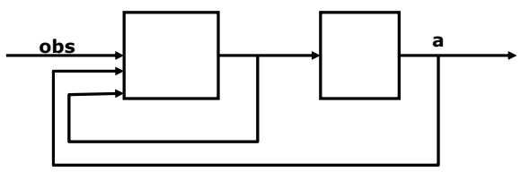

Lecture 20 • 52

Here’s a block diagram for an optimal POMDP controller. It’s divided into two parts.

<!-- page: 53 -->

## Partial Observability

• MDPs assume complete observability (can always tell what state you’re in)

• POMDP (Partially Observable MDP)

• Observation: Pr(O|s,a) [O is observation]

• o, a, o, a, o, a

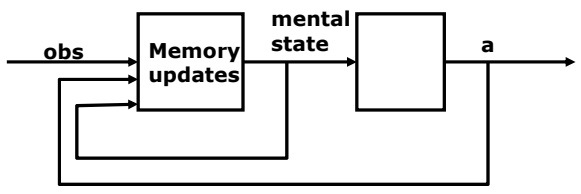

Lecture 20 • 53

The first box is in charge of memory updates. It takes in as input the current observation, the last action, and the last “mental state” and generates a new mental state.

<!-- page: 54 -->

## Partial Observability

• MDPs assume complete observability (can always tell what state you’re in)

• POMDP (Partially Observable MDP)

• Observation: Pr(O|s,a) [O is observation]

• o, a, o, a, o, a

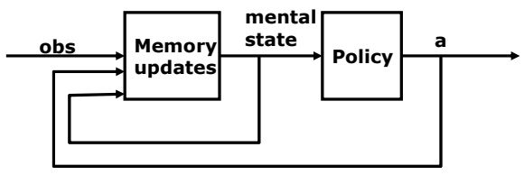

Lecture 20 • 54

The second box is a policy, as in an MDP. Except in this case, the policy takes the mental state as input, rather than the true state of the world (or simply the current observation). The policy still has the job of generating actions.

<!-- page: 55 -->

## Partial Observability

• MDPs assume complete observability (can always tell what state you’re in)

• POMDP (Partially Observable MDP)

• Observation: Pr(O|s,a) [O is observation]

• o, a, o, a, o, a

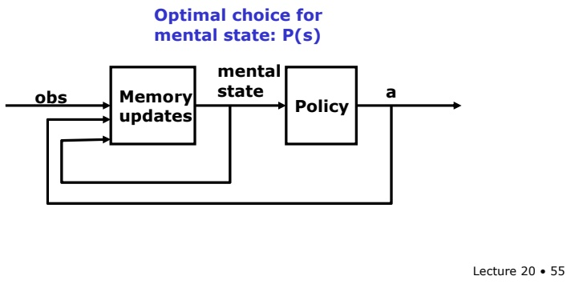

So, what are we supposed to remember? This is really a hard question. Given all the things you’ve ever seen and done, what should you remember? It’s especially difficult if you have a fixed-sized memory. The theory of POMDPs tells us that the best thing to “remember” is a probability distribution over the current, true, hidden state s of the world. It’s actually relatively easy to build the memory update box so that it takes an old distribution over world states, a new action, and a new observation, and generates a new distribution over world states, taking into account the state transition probabilities and the observation probabilities.

<!-- page: 56 -->

# Partial Observability

• MDPs assume complete observability (can always tell what state you’re in)

• POMDP (Partially Observable MDP)

• Observation: Pr(O|s,a) [O is observation]

• o, a, o, a, o, a

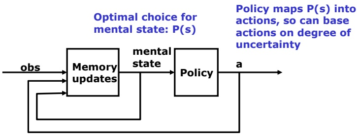

Now, the job of the policy is interesting. It gets to map probability distributions over the current state into actions. This is an interesting job, because it allows the agent to take different actions depending on its degree of uncertainty. So, a robot that is trying to deliver a package to some office might drive directly toward that office if it knows where it is; but if the robot is lost (expressed as having a very spread-out distribution over possible states), the optimal action might be to ask someone for directions or to go and buy a map. The POMDP framework very elegantly combines taking actions because of their effects on the world with taking actions because of their effects on the agent’s mental state.

<!-- page: 57 -->

## Partial Observability

• MDPs assume complete observability (can always tell what state you’re in)

• POMDP (Partially Observable MDP)

• Observation: Pr(O|s,a) [O is observation]

• o, a, o, a, o, a

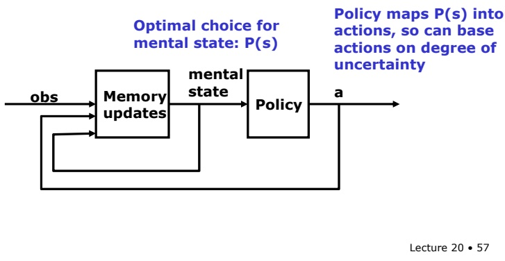

Unfortunately, although it’s beautiful mathematically, it’s completely, hopelessly, intractable computationally. So, a major current research topic is how to approximately solve POMDPs, or to discover special cases in which they can be solved relatively efficiently.

<!-- page: 58 -->

## Worrying too much

• Assumption that every possible eventuality should be taken into account

Lecture 20 • 58

Finally, the MDP view that every possible state has a non-zero chance of happening as a result of taking an action in a particular state is really too paranoid in most domains.

<!-- page: 59 -->

So, what can we do when the state-transition function is sparse (contains a lot of zeros) or approximately sparse (contains a lot of small numbers)?

<!-- page: 60 -->

## Worrying too much

• Assumption that every possible eventuality should be taken into account

When the horizon, or the effective horizon (1/1-gamma) is large with respect to the size of the state space, then it makes sense to compute a whole policy, since your search through the space for a good course of action is likely to keep hitting the same states over and over (this is, essentially, the principle of dynamic programming).

Lecture 20 • 60

<!-- page: 61 -->

In many domains, though, the state space is truly enormous, but the agent is trying to achieve a goal that is not too far removed from the current state. In such situations, it makes sense to do something that looks a lot more like regular planning, searching forward from the current state.

<!-- page: 62 -->

If the transition function is truly sparse, then each state will have only a small number of successor states under each action, and it’s possible to build up a huge decision tree, and then evaluate it from leaf to root to decide which action to take next.

<!-- page: 63 -->

If the transition function isn’t too sparse, it may be possible to get an approximately optimal action by just drawing samples from the next-state distribution and acting as if those are the only possible resulting states.

<!-- page: 64 -->

## Worrying too much

• Assumption that every possible eventuality should be taken into account

• sample-based planning: with short horizon in large state space, planning should be independent of state-space size

Lecture 20 • 64

Once the search out to a finite horizon is done, the agent chooses the first action, executes it, and looks to see what state it’s in. Then, it searches again. Thus, most of the computational work is done on-line rather than offline, but it’s much more sensitive to the actual states, and doesn’t worry about every possible thing that could happen. Thus, these methods are usually exponential in the horizon, but completely independent of the size of the state space.

<!-- page: 65 -->

Markov Decision Processes and value iteration are an important foundation of reinforcement learning, which we’ll talk about next time.
