<!-- page: 1 -->

# 6.825 Techniques in Artificial Intelligence

Today we're going to start talking about logic. Now, my guess is that almost everybody's been exposed to basic propositional logic in the context of machine architecture or something like that. But, it turns out that that exposure to logic was just a little tiny piece of an enormous iceberg that we'll uncover a little bit more. We're not going to go crazy with logic in this course, but we're going to do a fair amount of it, partly because it's relevant - - it's certainly of great historical relevance in AI. And partly because it's making a resurgence, in real applications. So, for example, the web consortium now is interested in the idea of annotating web pages with logical descriptions of the content of what's on the web pages. We'll use some of those ideas to motivate our second assignment.

We're going to start right now with a simpler logic than they're using. We're going to try to introduce the basic and important ideas of logic in the context of a simple logic called propositional logic. And then we'll move on to firstorder logic, which is a little more complicated.

<!-- page: 2 -->

# 6.825 Techniques in Artificial Intelligence

# Logic

• When we have too many states, we want a convenient way of dealing with sets of states.

Lecture 3 • 2

OK, so why do we need logic? Well, last time we talked about problem solving. We assumed that there were few enough states in the world that we could easily enumerate them, or make an array of them in our computer. But most domains we care about have way too many states to do that. In really big domains, you don't want to talk about individual states in particular, you'd like to talk about them in terms of sets. You'd like to have a convenient way to name sets of states, and you'd like not even to have to think about the individual states

<!-- page: 3 -->

What if I say "It's raining."? One way to think about what it means -- what that assertion means, that it's raining -- is to say that it stands for all those states of the world in which it's really raining. So there's a very short name for an enormous set of states.

<!-- page: 4 -->

And logic is going to be a way to do that. To deal with little names for big collections of things, and to manipulate the big collections absolutely implicitly by manipulating the descriptions instead. So that's the enterprise -- short names for big things.

<!-- page: 5 -->

Instead of thinking about all the ways that the world could be, we're going to instead work in this language of names. We’ll use a language of expressions that describe those sets of states, and not worry about the sets.

<!-- page: 6 -->

So, what is a logic? Well, a logic is a formal language. And what does that mean? It has a syntax and a semantics, and a way of manipulating expressions in the language. We’ll talk about each of these.

<!-- page: 7 -->

The syntax is a description of what you're allowed to write down, what the expressions are that are legal in a language. We’ll define the syntax of a propositional logic in complete detail later in this lecture.

<!-- page: 8 -->

There's the semantics -- which is some story about what those expressions mean. Syntax is form and semantics is content.

<!-- page: 9 -->

A logic usually comes with a proof system, which is a way of manipulating syntactic expressions to get other syntactic expressions.

And, why are we interested in manipulating syntactic expressions? The idea is that if we use a proof system with the right kinds of properties, then the new syntactic expressions we create will have semantics or meanings that tell us something “new” about the world.

<!-- page: 10 -->

So, why do we want to do proofs? There are lots of situations.

<!-- page: 11 -->

## What is a logic?

• A formal language

• Syntax – what expressions are legal

• Semantics – what legal expressions mean

• Proof system – a way of manipulating syntactic expressions to get other syntactic expressions (which will tell us something new)

• Why proofs? of inferences an agentTwo kinds might want to make:

• Multiple percepts => conclusions about the world

Lecture 3 • 11

In the context of an agent trying to reason about its world, think about a situation where we have a bunch of percepts. You know, we found somebody come in with a dripping umbrella, we saw muddy tracks in the hallway, we see that there's not much light coming in the windows, we hear pitter-pitter-patter. We have all these percepts, and we'd like to draw some conclusion from them, meaning that we’d like to figure out something about what's going on in the world. We'd like to take all these percepts together and draw some conclusion about the world. And we might use logic to do it.

<!-- page: 12 -->

## What is a logic?

• A formal language

• Syntax – what expressions are legal

• Semantics – what legal expressions mean

• Proof system – a way of manipulating syntactic expressions to get other syntactic expressions (which will tell us something new)

• Why proofs? of inferences an agentTwo kinds might want to make:

• Multiple percepts => conclusions about the world

• Current state & operator => properties of next state

Lecture 3 • 12

Another use of logic would be that you know something about the current state of the world and you know something about the operator that you're considering doing. You wonder what will happen if you take that action. You have a formal description of what that action does in the world. You might want to take those things together and infer something about the next state of the world. So these are two kinds of inferences that an agent might want to do. We could come up with a lot of other ones, but those are two good examples to keep in mind.

<!-- page: 13 -->

In the book they start by talking about logic in the abstract. But, the abstraction of logic is impossibly abstract. But anyway, they talk about logic in the abstract and then they talk about propositional logic. So, we're just going to dive right into propositional logic, learn something about how that works, and then try to generalize later on.

We’ll start by talking about the syntax of propositional logic. Syntax is what you're allowed to write on your paper.

<!-- page: 14 -->

You're all used to rules of syntax from programming languages, right? So, in Java you can write a for loop.

There are rules of syntax given by a formal grammar. They tell you there has to be a semicolon after fizz; that the parentheses have to match, and so on. You can’t make random changes to the characters in your program and expect the compiler to be able to interpret it. So, the syntax is what symbols you're allowed to write down in what order. Not what they mean, not what computation they symbolize, but just what symbols you can write down.

<!-- page: 15 -->

Another famous illustration of syntax is this one, due to the linguist Chomsky: "Colorless green ideas sleep furiously". The idea is that it doesn't mean anything really, but it's syntactically well-formed. It's got the nouns, the verbs, and the adjectives in the right place. If you scrambled the words up, you wouldn’t get a sentence, right? You’d just get a string of words that didn’t obey the rules of syntax. So, "furiously ideas green sleep colorless" is not OK.

<!-- page: 16 -->

So let's define the syntax of propositional logic. We’ll call the legal things to write down "sentences". So if something is a sentence, it is a syntactically OK thing in our language. Sometimes sentences are called "WFFs" (which stands for “well-formed formulas” in other books).

<!-- page: 17 -->

We're going to define the set of legal sentences recursively. So here are two base cases:

The words, "true" and "false", are sentences.

<!-- page: 18 -->

## Propositional Logic Syntax

Syntax: what you’re allowed to write

• **for (thing t = fizz; t == fuzz; t++){ … }**

• Colorless green ideas sleep furiously.

Sentences (wffs: well formed formulas)

• true and <u>false</u> are sentences

• Propositional variables are sentences: P,Q,R,Z

Lecture 3 • 18

Propositional variables are sentences. I'll give you some examples. P, Q, R, Z.

We're not, for right now, defining a language that a computer is going to read. And so we don't have to be absolutely rigorous about what characters are allowed in the name of a variable. But there are going to be things called variables, and we'll just use uppercase letters for them. Those are sentences. It's OK to say "P" -- that's well-formed.

<!-- page: 19 -->

## Propositional Logic Syntax

Syntax: what you’re allowed to write

• **for (thing t = fizz; t == fuzz; t++){ … }**

• Colorless green ideas sleep furiously.

Sentences (wffs: well formed formulas)

• true and <u>false</u> are sentences

• Propositional variables are sentences: P,Q,R,Z

• If φ and ψ are sentences, then so are (φ), ¬φ, φ Æψ, φ Çψ, φ→ψ, φ↔ψ

Lecture 3 • 19

Now, here’s the recursive part. If \phi and \psi are sentences, then so are –

Wait! What, exactly, are \phi and \psi? They’re called metavariables, and they range over expressions. This rule says that if \phi and \psi are things that you already know are sentences because of one of these rules, then you can make more sentences out of them.

\Phi with parentheses around it is a sentence.

Not \Phi is a sentence (that little bent thing is our “not” symbol (but we’re not really supposed to know that yet, because we’re just doing syntax right now)).

\Phi “vee” \Psi is a sentence.

\Phi “wedge \Psi is a sentence.

\Phi “arrow” \Psi is a sentence.

\Phi “two-headed arrow” \Psi is a sentence.

<!-- page: 20 -->

And there's one more part of the definition, which says nothing else is a sentence. OK. That's the syntax of the language.

<!-- page: 21 -->

## Precedence

| $\neg$ |
| --- |
| $\overline{AE}$ |
| $\zeta$ |
| $\rightarrow$ |
| $\leftrightarrow$ |

highest

lowest

| A Ç B Æ C | A Ç (B Æ C) |
| --- | --- |
| A Æ B → C Ç D | (A Æ B) → (C Ç D) |
| A → B Ç C ↔ D | (A → (B Ç C)) ↔ D |

Precedence rules enable “shorthand” form of sentences, but formally only the fully parenthesized form is legal.

Syntactically ambiguous forms allowed in shorthand only when semantically equivalent: A Æ B Æ C is equivalent to (A Æ B) Æ C and A Æ (B Æ C)

Lecture 3 • 21

There’s actually one more issue we have to sort out. Precedence of the operations.

If we were being really careful, we’d require you to put parentheses around each new sentence that you made out of component sentences using negation, vee, wedge, or arrow. But it starts getting kind of ugly if we do that.

So, we allow you to leave out some of the parentheses, but then we need rules to figure out where the implicit parentheses really are. Those are precedence rules. Just as in arithmetic, we say that multiplication binds tighter than addition, we have similar rules in logic.

So, to add the parentheses to a sentence, you start with the highest precedence operator, which is negation. For every negation, you’d add an open paren in front of the negation sign and a close parenthesis after the next whole expression. This is exactly how minus behaves in arithmetic.

The next highest operator is wedge, which behaves like multiplication in arithmetic.

Next is vee, which behaves like addition in arithmetic.

Logic has two more operators, with weaker precedence. Next comes single arrow, and last is double arrow.

Also, wedge, vee, single arrow, and double arrow are associative.

<!-- page: 22 -->

$$
P \to Q \to R
$$

$$
P, R \to Q
$$

$$
A \land (B \lor C \lor \neg D) \leftrightarrow \neg \neg Z
$$

$$
\neg P (Q)
$$

Here are some simple exercises. Please stop and do them now before going on with the rest of the lecture.

<!-- page: 23 -->

# Semantics

So let's talk about semantics. The semantics of a sentence is its meaning. What does it say about the world?

We could just write symbols on the board and play with them all day long, and it could be fun, it could be like doing puzzles. But ultimately the reason that we want to be doing something with these kinds of logical sentences is because they somehow say something about the world. And it's really important to be clear about the connections between the things that we write on the board and what we think of them as meaning in the world, what they stand for.

And it's going to be something different every day. I remember once when I was a little kid I was on the school bus. And somebody's big sister or brother had started taking algebra and this kid told me, "You know what? My big sister's taking algebra and A equals 3!"

The reason that sounds so silly is that A is a variable. Our variables are going to be the same. They’ll have different interpretations in different situations. So, in our study of logic, we’re not going to assign particular values or meanings to the variables; rather, we’re going to study the general properties of symbols and their potential meanings.

<!-- page: 24 -->

# Semantics

• Meaning of a sentence is truth value {**t, f**}

Lecture 3 • 24

Ultimately, the meaning of every sentence, in a situation, will be a truth value, T or F. Just as, in high-school algebra, the meaning of every expression is a numeric value.

Note that there’s already a really important difference between underlined true and false, which are syntactic entities that we can write on the board, and the truth values T and F which stand for the abstract philosophical ideals of truth and falsity.

<!-- page: 25 -->

## Semantics

• Meaning of a sentence is truth value {**t, f**}

• Interpretation is an assignment of truth values to the propositional variables

• ²i φ [Sentence φ is t in interpretation i ]

Lecture 3 • 25

How could we decide whether A wedge B wedge C is true or not? Well, it has to do with what A and B and C stand for in the world. What A and B and C stand for in the world will be given by an object called an “interpretation”. An interpretation -- and I'm going to depart a little bit from Russell and Norvig, who tell a slightly more complicated story -- is an assignment of truth values to the propositional variables.

An interpretation is an assignment of truth values to the variables. You can think of it as a possible way the world could be.

So if our set of variables is P, Q, R, and V, then P true, Q false, R true, V true, that would be an interpretation.

So then, given an interpretation, we can ask the question, is this sentence true in that interpretation? We will write “turnstile sub I of Phi” (turnstile is the name logicians give to the symbol with one vertical bar and then two horizontal bars coming out to the right) to mean “sentence \Phi is true in interpretation I”. The turnstile symbol is not part of our language. It's part of the way logicians write things on the board when they're talking about what they're doing.

This is a really important distinction. If you can think of our sentences like expressions in a programming language, then you can think of these expressions with turnstiles as being about whether programs work in a certain way or not.

In order to even think about whether \Phi is true in interpretation I, \Phi **has** to be a sentence. If it’s not a well-formed sentence, then it doesn’t even make sense to ask whether it’s true or false.

<!-- page: 26 -->

## Semantics

• Meaning of a sentence is truth value {**t, f**}

• Interpretation is an assignment of truth values to the propositional variables

• ² $\models _ { \mathrm { i } } \Phi$ Sentence φ is t in interpretation i ][

• 2i φ $\mathbb { F } _ { \mathrm { i } } \Phi$ [Sentence φ is f in interpretation i ]

Similarly, we’ll use a turnstile with a slash through it to say that a sentence is **not** true in an interpretation. And since the meaning of every sentence is a truth value and there are only two truth values, then if a sentence \Phi is not true (does not have the truth value T) in an interpretation, then it has truth value F in that interpretation and we’ll say it’s false in that interpretation.

Lecture 3 • 26

<!-- page: 27 -->

So now we can write down the rules of the semantics. We can write down, on the board, when sentence Phi is true in interpretation I.

I'm going to write the semantics down in a way that's parallel to the way we specified the syntax.

<!-- page: 28 -->

First, the sentence consisting of the symbol "true" is true in all interpretations.

<!-- page: 29 -->

## Semantics

• Meaning of a sentence is truth value {**t, f**}

• Interpretation is an assignment of truth values to the propositional variables

• ²i φ Sentence φ is t in interpretation i ][

• 2<sub>i</sub> φ [Sentence φ is f in interpretation i ]

Semantic Rules

• ²i true for all i

• 2<sub>i</sub> <u>false</u> for all i [the sentence false has truth value f in all interpret.]

Lecture 3 • 29

The sentence consisting of a symbol "false" has truth value "F" in all interpretations.

All right, now we can do the connectives. We’ll leave out the parentheses. The truth value of a sentence with top-level parentheses is the same as the truth value of the sentence with the parentheses removed.

<!-- page: 30 -->

## Semantics

• Meaning of a sentence is truth value {**t, f**}

• Interpretation is an assignment of truth values to the propositional variables

• ² $\models _ { \mathrm { i } } \Phi$ Sentence φ is t in interpretation i ][

• 2 $\mathbb { F } _ { \mathrm { i } } \Phi$ [Sentence φ is f in interpretation i ]

Semantic Rules

• ²i true for all i

• 2<sub>i</sub> <u>false</u> for all i [the sentence false has truth value f in all interpret.]

$F _ { i } - \phi$ if and only $\mathrm { i f } \mathbb { 1 } _ { \mathrm { i } } \phi$

Lecture 3 • 30

Now, let’s think about the negation sign. When is \negation \Phi true in an interpretation I? Whenever \Phi is false in that interpretation.

<!-- page: 31 -->

## Semantics

• Meaning of a sentence is truth value $( t , t )$

• Interpretation is an assignment of truth values to the propositional variables

• $\models _ { \mathrm { i } } \Phi$ Sentence φ is t in interpretation i ][

7 $\mathbb { F } _ { \mathrm { i } } \Phi$ [Sentence φ is f in interpretation i ]

Semantic Rules

• ²i true for all i

$\mu _ { i } \underline { { \mathsf { f a l s e } } }$ for all i [the sentence <u>false</u> has truth value f in all interpret.]

$F _ { i } - \phi$

if and only $\mathrm { i f } \mathbb { 1 } _ { \mathrm { i } } \phi$

$\models _ { \mathsf { i } } \Phi \not \in \Psi$ if and only $\mathsf { i f } \models _ { \mathsf { i } } \phi$ and $\models _ { \mathsf { i } } \psi$ [conjunction]

Lecture 3 • 31

When is Phi wedge Psi true in an interpretation I? Whenever both Phi **and** Psi are true in I. This is called “conjunction”. And we’ll start calling that symbol “and” instead of “wedge”, now that we know what it means.

<!-- page: 32 -->

## Semantics

• Meaning of a sentence is truth value $( t , t )$

• Interpretation is an assignment of truth values to the propositional variables

• ² φ $\models _ { \mathrm { i } } \Phi$ Sentence φ is t in interpretation i ][

• 2 $\mathbb { F } _ { \mathrm { i } } \Phi$ [Sentence φ is f in interpretation i ]

Semantic Rules

• $\models _ { \mathfrak { j } }$ true for all i

$\mu _ { i } \underline { { \mathsf { f a l s e } } }$ for all i [the sentence <u>false</u> has truth value f in all

$\dot { \bf \Phi } _ { i } \rightarrow \dot { \bf \Phi }$

if and only $\mathrm { i f } \mathbb { 1 } _ { \mathrm { i } } \phi$

$\models _ { \mathsf { i } } \Phi \not \in \Psi$ if and only $\mathsf { i f } \models _ { \mathsf { i } } \phi$ and $\models _ { \mathsf { i } } \Psi \left[ \mathsf { c o n j u n c t i o n } \right]$

$\mathsf { F } _ { \mathsf { i } } \phi \textsf { G } \psi$ if and only $\mathsf { i f } \models _ { \mathsf { i } } \phi$ or $\models _ { \mathrm { i } } \psi$ [disjunction]

Lecture 3 • 32

When is Phi vee Psi true in an interpretation I? Whenever **either** Phi or Psi is true in I. This is called “disjuction”, and we’ll call the vee symbol $\text{" } \mathbf{0} \mathbf{f}  \text{" }$ . It is not an exclusive or; so that if both Phi and Psi are true in I, then Phi vee Psi is also true in I.

<!-- page: 33 -->

## Semantics

<div class="docvortex-algorithm" style="white-space: pre-wrap; font-family:monospace;">
- Meaning of a sentence is truth value $\{\mathbf{t},\mathbf{f}\}$
- Interpretation is an assignment of truth values to the propositional variables
- $\models_{i} \phi$ [Sentence $\phi$ is $\mathbf{t}$ in interpretation i]
- $\not\models_{i} \phi$ [Sentence $\phi$ is $\mathbf{f}$ in interpretation i]
Semantic Rules
- $\models_{i} \underline{\text{true}}$ for all i
- $\not\models_{i} \underline{\text{false}}$ for all i [the sentence false has truth value $\mathbf{f}$ in all interpret.]
- $\models_{i} \neg \phi$ if and only if $\not\models_{i} \phi$
- $\models_{i} \phi \not\in E \psi$ if and only if $\models_{i} \phi$ and $\models_{i} \psi$ [conjunction]
- $\models_{i} \phi \subsetneq \psi$ if and only if $\models_{i} \phi$ or $\models_{i} \psi$ [disjunction]
- $\models_{i} P$ iff $i(P) = t$
</div>

Now we have one more clause. I’m going to do it by example. Imagine that we have a sentence P. P is one of our propositional variables. How do we know whether it is true in interpretation I?

Well, since I is a mapping from variables to truth values, I can simply look P up in I and return whatever truth value was assigned to $\mathsf { P }$ by I.

<!-- page: 34 -->

# Some important shorthand

It seems like we left out the arrows in the semantic definitions of the previous slide. But the arrows are not strictly necessary; that is, it’s going to turn out that you can say anything you want to without them, but they’re a convenient shorthand. (In fact, you can also do without either “or” or “and”, but we’ll see that later).

<!-- page: 35 -->

## Some important shorthand

• φ → ψ ≡ ¬ φ Ç ψ [conditional, implication]

**antecedent** → **consequent**

Lecture 3 • 35

So, we can define Phi arrow Psi as being equivalent to not Phi or Psi. That is, no matter what Phi and Psi are, and in every interpretation, (Phi arrow Psi) will have the same truth value as (not Phi or Psi). We will now call this arrow relationship “implication”. We’ll say that Phi implies Psi. We may also call this a conditional expression: Psi is true if Phi is true. In such a statement, Phi is referred to as the antecedent and Psi as the consequent.

<!-- page: 36 -->

Finally, the double arrow just means that we have single arrows going both ways. This is sometimes called a “bi-conditional” or “equivalence” statement. It means that in every interpretation, Phi and Psi have the same truth value.

<!-- page: 37 -->

## Some important shorthand

• φ → ψ ≡ ¬ φ Ç ψ [conditional, implication]

**antecedent** → **consequent**

• φ ↔ ψ ≡ (φ → ψ) Æ (ψ → φ) [biconditional, equivalence]

## Truth Tables

| P | Q | ¬ P | P Æ Q | P Ç Q | P → Q | Q → P | P ↔ Q |
| --- | --- | --- | --- | --- | --- | --- | --- |
| f | f | t | f | f | t | t | t |
| f | t | t | f | t | t | f | f |
| t | f | f | f | t | f | t | f |
| t | t | f | t | t | t | t | t |

Lecture 3 • 37

Just so you can see how all of these operators work, here are the truth tables. Consider a world with two propositional variables, P and Q. There are four possible interpretations in such a world (one for every combination of assignments to the variables; in general, in a world with n variables, there will be 2^n possible interpretations). Each row of the truth table corresponds to a possible interpretation, and we’ve filled in the values it assigns to P and Q in the first two columns.

Once we have chosen an interpretation (a row in the table), then the semantic rules tell us exactly what the truth value of every single legal sentence must be. Here we show the truth values for six different sentences made up from P and Q.

<!-- page: 38 -->

## Some important shorthand

• φ → ψ ≡ ¬ φ Ç ψ [conditional, implication]

**antecedent** → **consequent**

• φ ↔ ψ ≡ (φ → ψ) Æ (ψ → φ) [biconditional, equivalence]

Truth Tables

| P | Q | ¬ P | P Æ Q | P Ç Q | P → Q | Q → P | P ↔ Q |
| --- | --- | --- | --- | --- | --- | --- | --- |
| f | f | t | f | f | t | t | t |
| f | t | t | f | t | t | f | f |
| t | f | f | f | t | f | t | f |
| t | t | f | t | t | t | t | t |

Note that implication is not “causality”, if P is f then P → Q is t

Lecture 3 • 38

Most of them are fairly obvious, but it’s worth studying the truth table for implication fairly closely. In particular, note that (P implies Q) is true whenever P is false. You can see that this is reasonable by thinking about an English sentence like “If pigs can fly then …”. Once you start with a false condition, you can finish with anything, and the sentence will be true.

Implication doesn't mean causes. It doesn't mean is related in any kind of way that you imagine, it is just a bare, formal definition of not P or Q.

<!-- page: 39 -->

# Terminology

Now we’ll define some terminology on this slide and the next, then do a lot of examples.

<!-- page: 40 -->

# Terminology

• A sentence is valid iff its truth value is t in all interpretations (²φ)

Valid sentences: true, ¬ <u>false</u>, P Ç ¬ P

Lecture 3 • 40

A sentence is valid if and only if it is true in all interpretations. OK. We have already seen one example of a valid sentence. What was it? True. Another one is “not false”.

A more interesting one is “P or not P”. No matter what truth value is assigned to P by the interpretation, “P or not P” is true.

<!-- page: 41 -->

A sentence is satisfiable if and only if it's true in at least one interpretation. The sentence P is satisfiable. The sentence True is satisfiable. Not P is satisfiable.

<!-- page: 42 -->

A sentence is unsatisfiable if and only if it’s false in every interpretation. Some unsatisfiable sentences are: false, not true, P and not P.

<!-- page: 43 -->

## Terminology

• A sentence is valid iff its truth value is t in all interpretations (²φ) Valid sentences: true, ¬ <u>false</u>, P Ç ¬ P

• A sentence is satisfiable iff its truth value is t in at least one interpretation Satisfiable sentences: P, true, ¬ P

• A sentence is unsatisfiable iff its truth value is f in all interpretations Unsatisfiable sentences: P Æ ¬ P, <u>false</u>, ¬ true

All are finitely decidable.

Lecture 3 • 43

We can use the method of truth tables to check these things, right? If I wanted to know if a particular sentence was valid, or if I wanted to know if it was satisfiable or unsatisfiable. I could just make a truth table. Write down all the interpretations, figure out the value of the sentence in each interpretation, and if they're all true, it's valid. If they're all false, it's unsatisfiable. If it's somewhere in between, it's satisfiable. So there's a way; there's just a completely dopey, tedious, mechanical way to figure out if a sentence is one of these things. That's not true in all logics. This is a useful, special property of propositional logic. It might take you a lot of time, but it’s a finite amount of time and you can decide any of these questions.

<!-- page: 44 -->

# Models and Entailment

So now, another way to think about what's going on here involves a kind of complicated diagram.

We talked about the relationship between sentences and interpretations, right? That's the semantics. And you can really think of a sentence as standing for, or as meaning a set of interpretations, right? There is some set of interpretations that make this sentence true.

(I really apologize for the amount of terminology. It’s rare that we'll have so much terminology, but I think I should do it anyway, just because you'll run into these words.)

<!-- page: 45 -->

So we'll say an interpretation is a **model** of a sentence if the sentence is true in the interpretation (this is a way to attach a word to the turnstyle character). .

<!-- page: 46 -->

Now consider a set of sentences – we’ll call it KB for Knowledge Base. We’ll say KB **entails** \Phi if and only if every model of KB is also a model of \Phi.

<!-- page: 47 -->

# Models and Entailment

• An interpretation i is a model of a sentence φ iff ²i φ

• A set of sentences KB entails φ iff every model of KB is also a model of φ

**Sentences**

**Sentences**

So, here’s the picture. If we consider two groups of sentences, we might like to say that one set of sentences entails the other. That is, if the first set of sentences are true, then the second set will also be true. Entailment is a relationship between sets of sentences. But we define it using semantics.

Lecture 3 • 47

<!-- page: 48 -->

## Models and Entailment

• An interpretation i is a model of a sentence φ iff $\models _ { \mathsf { i } }$ φ

• A set of sentences KB entails φ iff every model of KB is also a model of φ

Lecture 3 • 48

Sentences

**Sentences**

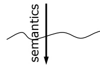

Interpretations

We take the first set of sentences through the definition of semantics and get a set of interpretations that satisfy those sentences.

<!-- page: 49 -->

Sentences

## Models and Entailment

• An interpretation i is a model of a sentence φ iff $\models _ { \mathsf { i } }$ φ

• A set of sentences KB entails φ iff every model of KB is also a model of φ

Sentences

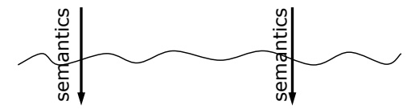

Interpretations

Lecture 3 • 49

Then, we do the same for the second set of sentences.

<!-- page: 50 -->

Sentences

## Models and Entailment

• An interpretation i is a model of a sentence φ iff $\models _ { \mathsf { i } }$ φ

• A set of sentences KB entails φ iff every model of KB is also a model of φ

Lecture 3 • 50

Sentences

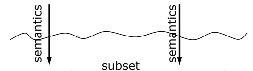

Now, we can ask whether the first set of interpretations is a subset of the second set.

<!-- page: 51 -->

Sentences Sentencesentails

## Models and Entailment

• An interpretation i is a model of a sentence φ iff $\models _ { \mathsf { i } }$ φ

• A set of sentences KB entails φ iff every model of KB is also a model of φ

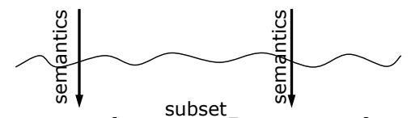

Lecture 3 • 51

If so, we say that the first set of sentences entails the second. In all the worlds in which the first set of sentences are true, the second set will also be true.

<!-- page: 52 -->

$$
\mathrm{KB} = \mathrm{A} / \mathrm{E} \mathrm{B}
$$

$$
\phi = \mathsf {B}
$$

We can go through this again with an example. Let's let KB be two sentences, A and B. And Let's let \Phi be B.

<!-- page: 53 -->

## Models and Entailment

• An interpretation i is a model of a sentence φ iff $\models _ { \mathsf { i } }$ φ

• A set of sentences KB entails φ iff every model of KB is also a model of φ

Sentences entails Sentences

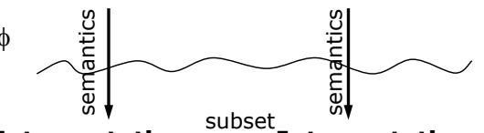

Interpretations Interpretations

$$
\mathrm{KB} = \mathrm{A} / \mathrm{E} \mathrm{B}
$$

$$
\phi = \mathsf {B}
$$

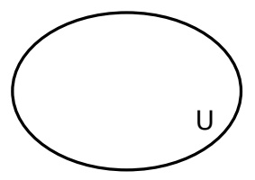

Lecture 3 • 53

Now, we can use a Venn diagram to think about the interpretations. Let U be the set of all possible interpretations.

<!-- page: 54 -->

## Models and Entailment

• An interpretation i is a model of a sentence φ iff $\models _ { \mathsf { i } }$ φ

• A set of sentences KB entails φ iff every model of KB is also a model of φ

Sentences entails Sentences


Interpretations Interpretations

$$
\mathrm{KB} = \mathrm{A} \not \in \mathrm{B}
$$

$$
\phi = \mathsf {B}
$$

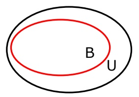

Lecture 3 • 54

There is a set of interpretations that are models of B (interpretations that make B true); it’s a subset of U, and we’ll label it B in our diagram.

<!-- page: 55 -->

## Models and Entailment

• An interpretation i is a model of a sentence φ iff $\models _ { \mathsf { i } }$ φ

• A set of sentences KB entails φ iff every model of KB is also a model of φ

Sentences entails Sentences


Interpretations Interpretations

$$
\mathrm{KB} = \mathrm{A} / \mathrm{E} \mathrm{B}
$$

$$
\phi = \mathsf {B}
$$

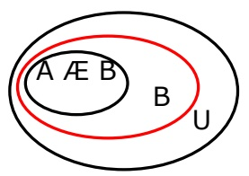

Lecture 3 • 55

Now, what about interpretations that are models of A and B? Clearly that’s a subset of the models of B (because any interpretation that is a model of A and B has to be a model of A and a model of B).

<!-- page: 56 -->

## Models and Entailment

• An interpretation i is a model of a sentence φ iff $\models _ { \mathsf { i } }$ φ

• A set of sentences KB entails φ iff every model of KB is also a model of φ

Sentences entails Sentences

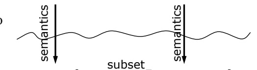

Interpretations Interpretations

$$
\mathrm{KB} = \mathrm{A} / \mathrm{E} \mathrm{B}
$$

$$
\phi = \mathsf {B}
$$

$$
A \not \equiv B \models B
$$

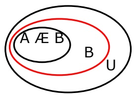

Lecture 3 • 56

So, we find that A and B entails B. If we know that A and B are true, then B has to be true.

<!-- page: 57 -->

## Models and Entailment

• An interpretation i is a model of a sentence φ iff ²i φ

• A set of sentences KB entails φ iff every model of KB is also a model of φ

Sentences entails Sentences

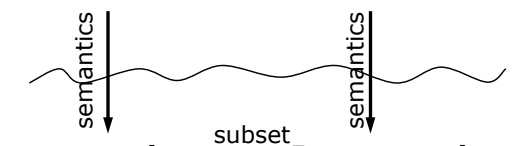

Interpretations Interpretations

$$
\mathrm{KB} \models \phi \text {iff} \models \mathrm{KB} \rightarrow \phi
$$

$$
\mathrm{KB} = \mathrm{A} / \mathrm{E} \mathrm{B}
$$

$$
\phi = \mathsf {B}
$$

KB entails φ if and only if (KB → φ) is valid

$$
A \not \equiv B \models B
$$

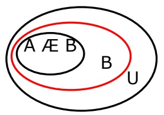

Lecture 3 • 57

We’ll finish with an important theorem of logic (it’s **about** logic, not **in** propositional logic): KB entails \Phi if and only if the sentence (KB implies \Phi) is valid.

That is, if the sentence \Phi is true in all models where the Knowledge Base is true, then the sentence -- KB implies \Phi is valid (true in all interpretations, so we use a turnstile without the subscript).

Why is this important? It says that if we have a way of deciding whether sentences are valid, then we have a way of checking whether one set of sentences entails another. That is, whether the truth of one set of sentences semantically requires the truth of another. This is going to lead into techniques for **proof**, which is the process of testing for validity. Next time we'll talk about proof, which is a mechanical way to grind sentences into sentences that satisfies the entailment relationship. That lets you draw valid conclusions from assumptions.

<!-- page: 58 -->

# Examples

Let’s work through some examples. We can think about whether they're valid or unsatisfiable or satisfiable.

<!-- page: 59 -->

<table><tr><td colspan="3">Examples</td></tr><tr><td>Sentence</td><td>Valid?</td><td>Interpretation that make sentence&#x27;s truth value = f</td></tr><tr><td>smoke → smoke smoke Ǭsmoke</td><td>} valid</td><td></td></tr></table>

What about “smoke implies smoke”? Rather than doing a whole truth table it might be easier if we can convert it into smoke or not smoke, right? The definition of A implies B is not A or B. And we decided that smoke or not smoke was valid already.

<!-- page: 60 -->

<table><tr><td colspan="3">Examples</td></tr><tr><td>Sentence</td><td>Valid?</td><td>Interpretation that make sentence&#x27;s truth value = f</td></tr><tr><td>smoke → smoke</td><td rowspan="3">} valid</td><td rowspan="3"></td></tr><tr><td>smoke Ç</td></tr><tr><td>¬smoke</td></tr><tr><td>smoke → fire</td><td>} satisfiable, not valid</td><td>smoke = t, fire = f</td></tr></table>

What about “smoke implies fire”? It’s satisfiable, because there's an interpretation of these two symbols that makes it true. There are other interpretations that make it false. I should say, everything that's valid is also satisfiable.

<!-- page: 61 -->

```txt
Examples
Sentence Valid? Interpretation that make sentence's truth value = f
smoke → smoke
    smoke Ç
    ¬smoke
    smoke → fire
        }
    }
    not valid
    }
    (s → f) → (¬ s → ¬ f)
        }
    }
    not valid
    }
    smoke = t, fire = f
    s = f, f = t
    s → f = t, ¬ s → ¬ f = f
Lecture 3 • 61
```

Here is a form of reasoning that you hear people do a lot, but the question is, is it OK? “Smoke implies fire implies not smoke implies not fire.” It’s invalid. We could show that by drawing out the truth table (and you should do it as an exercise if the answer is not obvious to you). Another way to show that a sentence is not valid is to give an interpretation that makes the sentence have the truth value F. In this case, if we give “smoke” the truth value F and and “fire” the truth value “T”, then the whole sentence has truth value “F”.

<!-- page: 62 -->

```txt
Examples
Sentence Valid? Interpretation that make sentence's truth value = f
smoke → smoke
smoke Ç
¬smoke
smoke → fire
} valid
} satisfiable, smoke = t, fire = f
not valid
(s → f) → (¬ s → ¬ f)
} satisfiable, s = f, f = t
not valid
s → f = t, ¬ s → ¬ f = f
contrapositive
(s → f) → (¬ f → ¬
s)
} valid
Lecture 3 • 62
```

Reasoning in the other direction is okay, though. So the sentence “smoke implies fire implies not fire implies not smoke” is valid. And for those of you who love terminology, this thing is called the contrapositive. So, if there's no fire, then there's no smoke.

<!-- page: 63 -->

```txt
Examples
Sentence Valid? Interpretation that make sentence's truth value = f
smoke → smoke
smoke Ç
¬smoke
smoke → fire
} valid
} satisfiable, smoke = t, fire = f
not valid
(s → f) → (¬ s → ¬ f)
} satisfiable, s = f, f = t
not valid
s → f = t, ¬ s → ¬ f = f
contrapositive
(s → f) → (¬ f → ¬)
} valid
s)
b Ç d Ç (b → d)
b Ç d Ç ¬ b Ç d
} valid
Lecture 3 • 63
```

What about $^ { a } b$ or d or (b implies $d ) ^ { n } ?$ We can rewrite that (using the definition of implication) into $^ { a } b$ or d or not b or $\mathbf { d } ^ { \flat }$ , which is valid, because in every interpretation either b or not b must be true.

<!-- page: 64 -->

## Recitation Exercises: Part II

For each of the following sentences, say whether it is valid, unsatisfiable, or satisfiable but not valid. If it is neither valid nor unsatisfiable, provide an interpretation in which it is true and another in which it is false.

$$
(P \to Q) \to ((Q \to R) \to (P \to R))
$$

$$
(P \lor Q) \land (\neg P \lor R) \land (\neg R \lor Q)
$$

$$
\neg P \to (P \to Q)
$$

$$
(P \to Q) \land (Q \to P)
$$

$$
(P \to (Q \to R)) \to (P \to (R \to Q))
$$

Russell & Norvig problems 6.5 and 6.7

Lecture 3 • 64

Here are some problems to do for recitation.

Talk to you later!
