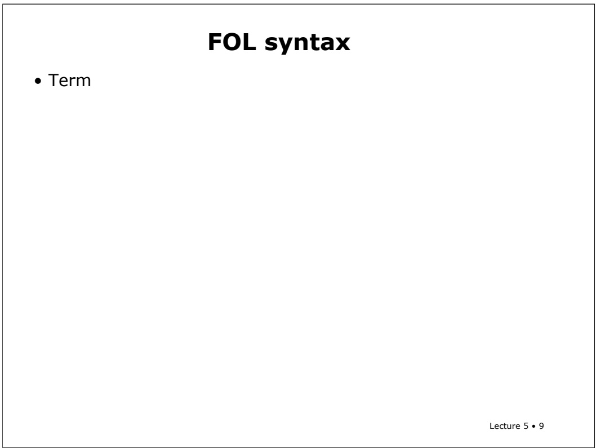
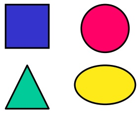
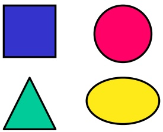
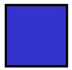
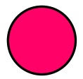
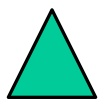
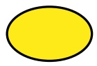
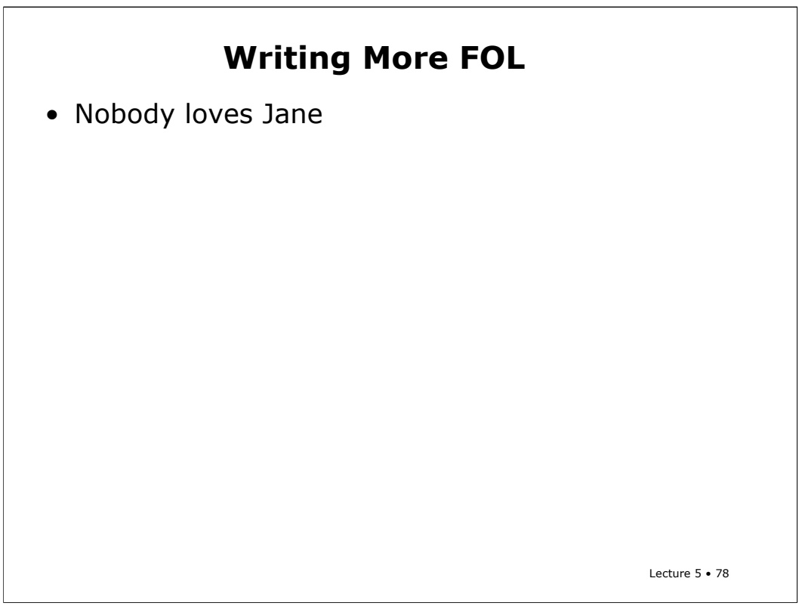

<!-- page: 1 -->

# 6.825 Techniques in Artificial Intelligence

# First-Order Logic

Lecture 5 • 1

At the end of the last lecture, I talked about doing deduction and propositional logic in the natural deduction, high-school geometry style, and then I promised you that we would look at resolution, which is a propositional-logic proof system used by computers.

But I decided in preparing this lecture that we should postpone resolution and talk about it in the context of first-order logic. So we'll talk about plausible ways to do theorem-proving on computers all at once, after we've seen how to do firstorder logic

<!-- page: 2 -->

## 6.825 Techniques in Artificial Intelligence

## First-Order Logic

• Propositional logic only deals with “facts”, statements that may or may not be true of the world, e.g. “It is raining”. , one cannot haveBut variables that stand for books or tables.

Lecture 5 • 2

That means today's subject matter is first-order logic, which is extending propositional logic so that we can talk about things. In propositional logic, all we had were variables that stood, not for things in the world or even quantities or anything like that, but just facts, Boolean things that might or might not be true about the world, like it might be raining, or it might be greater than 67 degrees; but you couldn't have variables that stood for tables or books, or the temperature, or things like that. And as it turns out that that's an enormously limiting kind of representation.

<!-- page: 3 -->

In first-order logic, variables refer to things in the world and you can **quantify** over them. That is, you can talk about all or some of them without having to name them explicitly.

<!-- page: 4 -->

The book has a nice argument for why propositional logic is inadequate in the Huntthe-Wumpus domain. Here are some examples of the kinds of things that you can say in first-order logic, but not in propositional logic

<!-- page: 5 -->

## FOL motivation

• Statements that cannot be made in propositional logic but can be made in FOL.

• When you paint a block with green paint, it becomes green.

– In propositional logic, one would need a statement about every single block, one cannot make the general statement about all blocks.

Lecture 5 • 5

“When you paint the block it becomes green.” You might have a proposition for every single aspect of the situation, like "my book is black" and "my book is green" and "my book is red", and then you could say that if my book was black and I paint it then after that my book is green. But you'd have to have one of those propositions for every single book, or every single desk, or every single thing in the world. You couldn't say that, as a general fact, after you paint something it becomes green.

<!-- page: 6 -->

# FOL motivation

• Statements that cannot be made in propositional logic but can be made in FOL.

• When you paint a block with green paint, it becomes green.

– In propositional logic, one would need a statement about every single block, one cannot make the general statement about all blocks.

• When you sterilize a jar, all the bacteria are dead.

– In FOL, we can talk about all the bacteria without naming them explicitly.

Lecture 5 • 6

Let's say you want to talk about what happens when you sterilize a jar. Well, it kills all the bacteria in the jar. Now, you don't want to have to name all the bacteria; to have to say, bacterium 57 is dead, and bacterium 93 is dead. Each one of those guys is dead. All the bacteria are dead now. So you'd like to have a way not only to talk about things in the world, but to quantify over them, to talk about all of them, or some of them, without naming them explicitly.

<!-- page: 7 -->

# FOL motivation

• Statements that cannot be made in propositional logic but can be made in FOL.

• When you paint a block with green paint, it becomes green.

– In propositional logic, one would need a statement about every single block, one cannot make the general statement about all blocks.

• When you sterilize a jar, all the bacteria are dead.

– In FOL, we can talk about all the bacteria without naming them explicitly.

• A person is allowed access to this Web site if they have been formally authorized or they are known to someone who has access.

Lecture 5 • 7

In the context of providing flexible computer security, you might want to prove or try to understand whether someone should be allowed access to a web site. And you could say: a person should have access to this web site if they've been personally, formally authorized to use this web site or if they are known to someone who has access to the web site. So you could write a general rule that says that and then some other system or this system could try to prove that you should have access to the web site. In this case, what that would mean would be going to look for a chain of people that are authorized or known to one another that grounds out in somebody who's known to this web site.

<!-- page: 8 -->

# FOL syntax

First-order logic lets us talk about things in the world. It's a logic like propositional logic, but somewhat richer and more complex. We’ll spend the first half of the lecture doing the same thing we did with propositional logic and going over syntax and semantics, and the second half practicing with the logic and, in particular, with trying to write down statements in logic

<!-- page: 9 -->



The big difference between propositional logic and first-order logic is that we can talk about **things**, and so there's a new kind of syntactic element. There's a new kind of syntactic element called a term. And the term, as we'll see when we do the semantics, is a name for a thing. It's an expression that somehow names a thing in the world. There are three kinds of terms:

<!-- page: 10 -->

There are constant symbols. They are names like Fred or Japan or bacterium39. Those are symbols that, in the context of an interpretation, name a particular thing.

<!-- page: 11 -->

Then there are variables, which are not really syntactically differentiated from constant symbols. We’ll use capital letters to start constant symbols (think of them as proper names), and lower-case letters for term variables. (It’s important to note, though, that this convention is not standard, and in some logic contexts, such as the programming language Prolog, they adopt the exact opposite convention).

<!-- page: 12 -->

The last kind of term is a function symbol, applied to one or more terms. We’ll use capital letters for function symbols, as well.

So another way to make a name for something is to say something like "F(X)". If F is a function, you can give it a term and then F(X) names something. So, you might have mother-of(John) or F(F(x)).

These three kinds of terms are our ways to name things in the world.

<!-- page: 13 -->

## FOL syntax

## • Term

• Constant symbols: Fred, Japan, Bacterium39

• Variables: x, y, a

• Function symbol applied to one or more terms: F(x), F(F(x)), Mother-of(John)

• Sentence

• A predicate symbol applied to zero or more terms: on(a,b), sister(Jane, Joan), sister(Mother-of(John), Jane), its-raining()

Lecture 5 • 13

In propositional logic we had sentences. Now, in first-order logic it's a little bit more complicated, but not a lot. So what's a sentence? There's another kind of symbol called a predicate symbol. A predicate symbol is applied to zero or more terms. Predicate symbols stand for relations so we might have things like on(A,B) or sister(Jane, Joan). “on” and “sister” are predicate symbols; “a”, ”b”,”Jane”, ”Joan”, and ”Mother-of(John)” are terms.

A predicate applied to zero terms is what's sometimes called a sentential variable. It was our old kind of variable that we had before in propositional logic, like “it'sraining." It's a little bit of an artifice, but we'll take predicates with no arguments to be variables that have values true or false.

<!-- page: 14 -->

A sentence can also be T1 = T2. We’re going to have one special predicate called equality. You can say this thing equals that thing, written term, equal-sign, term.

<!-- page: 15 -->

There are two more new constructs. If v is a variable and Phi is a sentence then (upside-down-A phi), and (backwards-E phi) are sentences. You've probably seen these symbols before informally as "for all" and "there exists", and that's what they're going to mean for us, too.

<!-- page: 16 -->

## FOL syntax

## • Term

• Constant symbols: Fred, Japan, Bacterium39

• Variables: x, y, a

• Function symbol applied to one or more terms: F(x), F(F(x)), Mother-of(John)

## • Sentence

• A predicate symbol applied to zero or more terms: on(a,b), sister(Jane, Joan), sister(Mother-of(John), Jane), its-raining()

$\mathbf { t } _ { 1 } \mathbf { = } \mathbf { t } _ { 2 }$

• For v a variable and Φ a sentence, then ∀v.Φ and ∃v.Φ are sentences.

• Closure under sentential operators: Æ v → ¬ ( )

Lecture 5 • 16

Finally we have closure under the sentential operators that we had before, so you can do and, or, implies, not, parentheses, like we had before in propositional logic. All that basic connective structure is still the same, but the things that we can say on either side have gotten a little bit more complicated. All right, so that's what we get to write down on our page.

<!-- page: 17 -->

We’re going to do the semantics informally. This isn't really going to look informal to you, but compared to the sorts of things that logicians write down, it’s pretty informal. In propositional logic, an interpretation is an assignment of truth values to sentential variables. Now an interpretation's going to have to be something more complicated. An interpretation is made up of a set and three mappings.

<!-- page: 18 -->

The set is the universe, U, which is a set of objects. So what's an object? Well, really, it could be this chair and that chair and these pieces of chalk or it could be all of you guys or it could be some trees out there, or it could be rather more abstract objects like meetings or points in time or numbers. An object could be anything you can think of, and the universe can be any set (finite or infinite) of objects. The universe is also sometimes called the domain of discourse.

<!-- page: 19 -->

There’s a mapping from constant symbols to elements of U, specifying how names are connected to objects in the world. So I might have the constant symbol, Fred, and I might have a particular person in the universe, and then the interpretation of the symbol Fred could be that person.

<!-- page: 20 -->

## FOL Interpretations

• Interpretation I

• U set of objects; domain of discourse; universe

• Maps constant symbols to elements of U

• Maps predicate symbols to relations on U (binary relation is a set of pairs)

Lecture 5 • 20

The next mapping is from predicate symbols to relations on U. Remember that an nary relation is a set of n-tuples, saying which groups of things stand in that particular relation to one another. A binary relation is a set of pairs. So if I have a binary relation "brother of" and U is a bunch of people, then every pair of people such that the person who's the brother of the second would be in the relation that the predicate symbol brother-of is mapped to.

<!-- page: 21 -->

## FOL Interpretations

• Interpretation I

• U set of objects; domain of discourse; universe

• Maps constant symbols to elements of U

• Maps predicate symbols to relations on U (binary relation is a set of pairs)

• Maps function symbols to functions on U

Lecture 5 • 21

The last mapping is from function symbols to functions on U. If you’ve had the prerequisite discrete math class, you know that functions are a special kind of relation, in which, for any particular assignment of the first n-1 arguments, there is a single possible assignment of the last one.

In the brother-of relation, there could be many pairs with the same first item and a different second item, but in a function, if you have the same first time then you have to have the same second item. So that means you just name the first item and then there's a unique thing that you get from applying the function. So it's OK for mother-of to be a function, discounting adoptions and other unusual situations.

So, the last mapping is from function symbols to functions on the universe.

<!-- page: 22 -->

Now we can do the definition of what it means for something to be true, and then we'll do examples. First we'll talk about terms. Terms name things, but we like to be fancy so we say a term denotes something, so we can talk about the denotation of a term, that is, the thing that a term names.

<!-- page: 23 -->

The denotations of constant symbols are given directly in the interpretation.

<!-- page: 24 -->

The denotation of a variable is undefined. What does x mean, if x is a variable? The answer is, "mu." That's a Zen joke. If you don't get it, don’t worry about it.

<!-- page: 25 -->

The denotation of a complex term is defined recursively. So, to find the interpretation of a function symbol applied to some terms, first you look up the function symbol in the interpretation and get a function. (Remember that the function symbol is a syntactic thing, ink on paper, but the function it denotes is an abstract mathematical object.) Then you find the interpretations of the component terms, which will be objects in U. Finally, you apply the function to the objects, yielding an object in U. And that object is the denotation of the complex term.

<!-- page: 26 -->

$$
\models_ {\mathrm{I}} \mathsf {P} (\mathsf {t} _ {1}, \dots , \mathsf {t} _ {\mathrm{n}})
$$

In the context of propositional logic, we looked at the rules of semantics, which told us how to determine whether a sentence was true in an interpretation. Now, in first-order logic, we’ll add some semantic rules, for the new kinds of sentences we’ve introduced. One of our new kinds of sentences is a predicate symbol applied to a bunch of terms. That's a sentence, which is going to have a truth value, true or false.

<!-- page: 27 -->

$$
\models_ {I} P (t _ {1}, \dots , t _ {n}) \text {iff} <   I (t _ {1}), \dots , I (t _ {n}) > \in I (P)
$$

To figure out its truth value, we first use the denotation rules to find out which objects are named by each of the terms. Then, we look up the predicate symbol in the interpretation, which gives us a mathematical relation on U. Finally, we look to see if the tuple of objects named by the terms is a member of the relation. If so, the sentence is true in the given interpretation.

<!-- page: 28 -->

<div class="docvortex-algorithm" style="white-space: pre-wrap; font-family:monospace;">
Basic FOL Semantics
Denotation of terms (naming)
• I(Fred)      if Fred is constant, then given
• I(x)          undefined
• I(F(term))   I(F)(I(term))
$\models_{I} P(t_1, ..., t_n)$ iff $&lt;I(t_1), ..., I(t_n)&gt; \in I(P)$
brother(John, Joe)??
</div>

Let’s look at an example. Imagine we want to determine whether the sentence Brother(John,Joe) is true in some interpretation.

<!-- page: 29 -->

<div class="docvortex-algorithm" style="white-space: pre-wrap; font-family:monospace;">
Basic FOL Semantics
Denotation of terms (naming)
• I(Fred) if Fred is constant, then given
• I(x) undefined
• I(F(term)) I(F)(I(term))
$\models_{I} P(t_1, ..., t_n)$ iff $&lt;I(t_1), ..., I(t_n)&gt; \in I(P)$
brother(John, Joe)?
• I(John) = [an element of U]
Lecture 5 • 29
</div>

First, we look up the constant symbol “John” in the interpretation and find that it names this guy with glasses.

<!-- page: 30 -->

<div class="docvortex-algorithm" style="white-space: pre-wrap; font-family:monospace;">
Basic FOL Semantics
Denotation of terms (naming)
• I(Fred) if Fred is constant, then given
• I(x) undefined
• I(F(term)) I(F)(I(term))
$\models_{I} P(t_1, ..., t_n)$ iff $&lt;I(t_1), ..., I(t_n)&gt; \in I(P)$
brother(John, Joe)?
• I(John) = [an element of U]
• I(Joe) = [an element of U]
Lecture 5 • 30
</div>

Then we look up “Joe” and find that it names this angry-looking guy.

<!-- page: 31 -->

<div class="docvortex-algorithm" style="white-space: pre-wrap; font-family:monospace;">
Basic FOL Semantics
Denotation of terms (naming)
• I(Fred) if Fred is constant, then given
• I(x) undefined
• I(F(term)) I(F)(I(term))
$\models_{I} P(t_1, ..., t_n)$ iff $&lt;I(t_1), ..., I(t_n)&gt; \in I(P)$
brother(John, Joe)?
• I(John) = [an element of U]
• I(Joe) = [an element of U]
• I(brother) = {&lt;, &lt;, &lt;,..., ...}
Lecture 5 • 31
</div>

Now we look up the predicate symbol “brother” and find that it denotes this complicated relation.

<!-- page: 32 -->

<div class="docvortex-algorithm" style="white-space: pre-wrap; font-family:monospace;">
Basic FOL Semantics
Denotation of terms (naming)
• I(Fred) if Fred is constant, then given
• I(x) undefined
• I(F(term)) I(F)(I(term))
$\models_{\mathrm{I}} P(t_1, ..., t_n)$ iff $&lt;\mathrm{I}(t_1), ..., \mathrm{I}(t_n)&gt; \in \mathrm{I}(P)$
brother(John, Joe)?
• I(John) = [an element of U]
• I(Joe) = [an element of U]
• I(brother) = {&lt;[, &lt;[, &lt;[, ...], ...}
• $\models_{\mathrm{I}}$ brother(John, Joe)
Lecture 5 • 32
</div>

Finally, we look up the pair of the guy with glasses and the angry-looking guy, to see if they’re in the relation. They are, so the sentence must be true in that interpretation. It’s easy to think of lots of other interpretations in which it wouldn’t be true (and lots of others in which it would).

<!-- page: 33 -->

Now we have to figure out how to tell whether sentences with quantifiers in them are true.

<!-- page: 34 -->

# Semantics of Quantifiers

Extend an interpretation I to bind variable x to element a ∈ U: x/a

Lecture 5 • 34

In order to talk about quantifiers we need the idea of extending an interpretation. We would like to be able to extend an interpretation to bind variable X to value A. We'll write that I with X bound to A. Here, x is a variable and a is an object; an element of U.

The idea is that, in order to understand whether a sentence that has variables in it is true or not, we have to make various temporary assignments to the variables and see what the truth value of the sentence is.

Binding X to A is kind of like adding X as a constant symbol to I. It's kind of like temporarily binding a variable in a programming language.

<!-- page: 35 -->

Now, how do we evaluate the truth under interpretation I, of the statement "for all X, Phi"? So how do we know if that's true? Well, it's true if and only if Phi is true if for every possible binding of variable X to thing in the world A. All right? For every possible thing in the world that you could plug in for X, this statement's true. That's what it means to say "for all X, Phi".

<!-- page: 36 -->

Similarly, to say that there exists an X such that Phi, it means that Phi has to be true for some A in U. That is to say, there has to be something in the world such that if we plug that in for X, then Phi becomes true.

<!-- page: 37 -->

It’s hard to understand the precedence of these operators using the usual rules. A quantifier is understood to apply to everything to its right in the formula, stopping only when it reaches an enclosing close parenthesis.

<!-- page: 38 -->

## Semantics of Quantifiers

<div class="docvortex-algorithm" style="white-space: pre-wrap; font-family:monospace;">
Extend an interpretation I to bind variable x to element  $a \in U$ :  $I_{x/a}$
</div>

$\models _ { \mathrm { I } } \forall \mathsf { x } . \Phi \mathrm { i f f } \models _ { \mathrm { I } \mathsf { x } / \mathsf { a } }$ Φ for all ${ \bf a } \in { \bf U }$

• $\models _ { \mathrm { I } } \exists \mathsf { x } . \Phi \mathrm { i f f } \models _ { \mathrm { I } \mathsf { x } / \mathsf { a } }$ Φ for some ${ \mathsf { a } } \in \mathsf { U }$

```txt
- Quantifier applies to formula to right until an enclosing right parenthesis:
```

$$
(\forall x. p (x) \lor q (x)) \land \exists x. r (x) \to q (x)
$$

So in this example sentence, the for all x applies until the close paren after q(x); and the exists x applies to the end of the sentence.

<!-- page: 39 -->

**FOL Example Domain**



The Real World

Lecture 5 • 39

All right, let's work on an example. Here’s a picture of our world.

<!-- page: 40 -->

$$
\bullet \mathsf{U} = \{\blacksquare , \blacktriangle , \bigcirc , \bigcirc \}
$$

There are four things in our U. Here they are.

<!-- page: 41 -->

## FOL Example Domain

• U = { , , , }

• Constants: Fred


The Real World

Lecture 5 • 41

We have one constant symbol, Fred.

<!-- page: 42 -->

## FOL Example Domain

• U = { , , , }

• Constants: Fred

• Preds: above<sup>2</sup>, circle<sup>1</sup>, oval<sup>1</sup>, square<sup>1</sup>



The Real World

Lecture 5 • 42

We have four predicates: above, circle, oval, square. The numbers above them indicate their **arity**, or the number of arguments they take.

Now these particular predicate names suggest a particular interpretation. The fact that I used this word, "circle", makes you guess that probably the interpretation of circle is going to be true for the red object. But of course it needn't be. The fact that those marks on the board are like an English word that we think means something about the shape of an object, that doesn't matter. It's just some words that we write down on the board. But it helps us understand what's going on. It's just like using reasonable variable names in a program that you might write. When you call a variable “the number of times I've been through this loop,” that doesn't mean that the computer knows what that means. It’s the same thing here.

<!-- page: 43 -->

And we have one function symbol, called “hat”.

<!-- page: 44 -->

Now we can talk about a particular interpretation, I. We’ll define I so that I(Fred) is the triangle.

<!-- page: 45 -->

$$
\bullet \mathrm{I} (\text {above}) = \{<   \square , \triangle >, <   \bigcirc , \bigcirc > \}
$$

Now, what kind of a thing is I(above)? Well, above is a predicate symbol, and the interpretation of a predicate symbol is a relation, so I(above) is a relation. Here’s the particular relation we define it to be; it’s a set of pairs, because above has arity 2.

<!-- page: 46 -->

The interpretation of circle is a unary relation. As you might expect in this world, it’s the singleton set, whose element is a one-tuple containing the circle. (Of course, it doesn’t have to be!).

<!-- page: 47 -->

## FOL Example Domain

$$
\bullet \mathsf{U} = \{\blacksquare , \blacktriangle , \bigcirc , \bigcirc \}
$$

• Constants: Fred

• Preds: above<sup>2</sup>, circle<sup>1</sup>, oval<sup>1</sup>, square<sup>1</sup>


• Function: Hat

• I(Fred) =

• I(above) = {< , >,< , >}

The Real World

• I(circle) = {< >}

• I(oval) = {< >,< >}

We’ll interpret the predicate oval to be true of both the oval object and the round one (circles are degenerate ovals, after all).

<!-- page: 48 -->

$$
\bullet \mathrm{I} (\text {oval}) = \{<   \bigcirc >, <   \bigcirc > \}
$$

$$
\bullet \mathrm{I(Hat)} = \{\triangleleft , \square >, <   \emptyset , \bigcirc > \}
$$

And we’ll say that the hat of the triangle is the square and the hat of the oval is the circle.

<!-- page: 49 -->

## FOL Example Domain

• U = { , , , }

• Constants: Fred





• Preds: above<sup>2</sup>, circle<sup>1</sup>, oval<sup>1</sup>, square<sup>1</sup>

• Function: Hat





• I(Fred) =

• I(above) = {< , >,< , >}

The Real World

• I(circle) = {< >}

• I(oval) = {< >,< >}

• I(Hat) = {< , >,< , >}

• I(square) = {< >}

Lecture 5 • 49

Finally, just to cause trouble, we’ll interpret the predicate “square” to be true of the triangular object.

<!-- page: 50 -->

$$
\bullet \quad I (\text {Fred}) = \triangle
$$

$$
\text {I} (\text {above}) = \{\langle \square , \triangle >, <   \bigcirc , \bigcirc > \}
$$

$$
\text {I(circle)} = \{<   \bigcirc > \}
$$

$$
\text {I(oval)} = \{<   \bigcirc >, <   \bigcirc > \}
$$

$$
\text {I(Hat)} = \{<   \triangle , \square >, <   \bigcirc , \bigcirc > \}
$$

$$
\text {I(square)} = \{<   \triangle > \}
$$

Now, let’s find the truth values of some sentences in this interpretation. What about Square(Fred), is that true in this interpretation?

Yes. We look to see that Fred denotes the triangle, and then we look for the triangle in the relation denoted by square, and we find it there. So the sentence is true.

<!-- page: 51 -->

$$
\bullet \quad I (\text {Fred}) = \triangle
$$

$$
\text {I} (\text {above}) = \{<   \square , \triangle >, <   \bigcirc , \bigcirc > \}
$$

$$
\text {I(circle)} = \{<   \bigcirc > \}
$$

$$
\text {I(oval)} = \{<   \bigcirc >, <   \bigcirc > \}
$$

$$
\text {I(Hat)} = \{<   \triangle , \square >, <   \bigcirc , \bigcirc > \}
$$

$$
\text {I(square)} = \{<   \triangle > \}
$$

What about this one? Does the above relation hold true of Fred and the hat of Fred?

<!-- page: 52 -->

## FOL Example

$$
\text {I(Fred)} = \triangle
$$

$$
\text {I} (\text {above}) = \{<   \square , \triangle >, <   \bigcirc , \bigcirc > \}
$$

$$
\text {I(circle)} = \{<   \bigcirc > \}
$$

$$
\text {I(oval)} = \{<   \bigcirc >, <   \bigcirc > \}
$$

$\models _ { \mathtt { I } } \mathsf { s q u a r e } ( \mathsf { F r e d } ) ?$

$$
\text {I(Hat)} = \{<   \triangle , \square >, <   \bigcirc , \bigcirc > \}
$$

$$
\text {I(square)} = \{<   \triangle > \}
$$

$\models _ { \mathsf { I } } \mathsf { a b o v e } ( \mathsf { F r e d } , \: \mathsf { H a t } ( \mathsf { F r e d } ) ) ?$

$$
\text {I(Hat(Fred))} =
$$

Let's start by asking the question, what's the denotation of the term, Hat(Fred)?

<!-- page: 53 -->

$$
\bullet \quad I (\text {Fred}) = \triangle
$$

$$
\text {I} (\text {above}) = \{<   \square , \triangle >, <   \bigcirc , \bigcirc > \}
$$

$$
\text {I(circle)} = \{<   \bigcirc > \}
$$

$$
\text {I(oval)} = \{<   \bigcirc >, <   \bigcirc > \}
$$

$$
\text {I(Hat)} = \{<   \triangle , \square >, <   \bigcirc , \bigcirc > \}
$$

$$
\text {I(square)} = \{<   \triangle > \}
$$

It’s the square, right? We look up Fred, and get the triangle. Then we look in the Hat function, and, sure enough, there's a pair with triangle first and square second. So hat(Fred) is a square.

<!-- page: 54 -->

$$
\bullet \quad I (\text {Fred}) = \triangle
$$

$$
\text {I} (\text {above}) = \{<   \square , \triangle >, <   \bigcirc , \bigcirc > \}
$$

$$
\text {I(circle)} = \{<   \bigcirc > \}
$$

$$
\text {I(oval)} = \{<   \bigcirc >, <   \bigcirc > \}
$$

$$
\text {I(Hat)} = \{<   \triangle , \square >, <   \bigcirc , \bigcirc > \}
$$

$$
\text {I(square)} = \{<   \triangle > \}
$$

$$
\bullet \mathrm{I} (\text {Hat} (\text {Fred})) = \square
$$

Now the question is: does the above relation hold of the triangle and the square? We look this pair up in the relation denoted by above, and we can’t find it. So the above relation doesn’t hold of these objects,

<!-- page: 55 -->

## FOL Example

$$
\text {I(Fred)} = \triangle
$$

$$
\text {I} (\text {above}) = \{<   \square , \triangle >, <   \bigcirc , \bigcirc > \}
$$

$$
\text {I(circle)} = \{\langle \bigcirc > \}
$$

$\models _ { \mathtt { I } } \mathsf { s q u a r e } ( \mathsf { F r e d } ) ?$

$$
\text {I(oval)} = \{<   \bigcirc >, <   \bigcirc > \}
$$

$$
\text {I(Hat)} = \{<   \triangle , \square >, <   \bigcirc , \bigcirc > \}
$$

$\mathbb { 1 } _ { \mathsf { I } } \: \mathsf { a b o v e } ( \mathsf { F r e d } , \: \mathsf { H a t } ( \mathsf { F r e d } ) ) ?$

And our original sentence is false.

$$
\text {I(square)} = \{<   \triangle > \}
$$

$\operatorname { I } ( \operatorname { \mathsf { H a t } } ( \operatorname { \mathsf { F r e d } } ) ) = \boxdot$

$\mathbb { W } _ { \mathrm { I } }   \mathsf { a b o v e } ( \triangle   , \boxdot ) ?$

<!-- page: 56 -->

$$
\bullet \quad I (\text {Fred}) = \triangle
$$

$$
\bullet \quad \nvdash_ {\mathrm{I}} \text {above} (\triangle , \square)?
$$

$$
\text {I} (\text {above}) = \{<   \square , \triangle >, <   \bigcirc , \bigcirc > \}
$$

$$
\text {I(circle)} = \{<   \bigcirc > \}
$$

$$
\text {I(oval)} = \{\langle \bigcirc >, <   \bigcirc > \}
$$

Okay. What about this sentence: there exists an x such that oval x. Is there a thing that is an oval? Yes. So how do we show that carefully?

$$
\text {I(Hat)} = \{<   \triangle , \square >, <   \bigcirc , \bigcirc > \}
$$

$$
\text {I(square)} = \{<   \triangle > \}
$$

<!-- page: 57 -->

## FOL Example

$$
\bullet \quad I (\text {Fred}) = \triangle
$$

$$
\text {I} (\text {above}) = \{<   \square , \triangle >, <   \bigcirc , \bigcirc > \}
$$

$\models _ { \mathtt { I } } \mathsf { s q u a r e } ( \mathsf { F r e d } ) ?$

$\mathbb { F }$ above(Fred, Hat(Fred))?

• I(Hat(Fred)) =

$\hat{\psi}_{\mathrm{I}} \mathsf{above}(\hat{\triangle}, \boxdot) ?$

$$
\text {I(circle)} = \{<   \bigcirc > \}
$$

• ²I $\models _ { \mathrm { I } } \exists \mathsf { x } . \mathsf { o v a l } ( \mathsf { x } ) ?$

$\mathsf { F } _ { \mathsf { I x } / \mathsf { \Theta } } \mathsf { o v a l } ( \mathsf { x } )$

$$
\text {I(Hat)} = \{<   \triangle , \square >, <   \bigcirc , \bigcirc > \}
$$

$$
\text {I(oval)} = \{<   \bigcirc >, <   \bigcirc > \}
$$

$$
\text {I(square)} = \{<   \triangle > \}
$$

We say that there's an extension of this interpretation where we take X and substitute in for it, the circle. Temporarily, I say that I(X) is a circle. And now I ask, in that new interpretation, is it true that oval(X). So I look up X and I get the circle. I look up oval and I get the relation with the circle and the oval, and so the answer's yes.

<!-- page: 58 -->

$$
\text {I(Fred)} = \triangle
$$

$$
\text {I} (\text {above}) = \{<   \square , \triangle >, <   \bigcirc , \bigcirc > \}
$$

$$
\text {I(circle)} = \{<   \bigcirc > \}
$$

$$
\text {I(oval)} = \{<   \bigcirc >, <   \bigcirc > \}
$$

$$
\text {I(Hat)} = \{<   \triangle , \square >, <   \bigcirc , \bigcirc > \}
$$

$$
\text {I(square)} = \{<   \triangle > \}
$$

$$
\vdash_ {I} \forall x. \exists y. \text {above} (x, y) v \text {above} (y, x)
$$

Here’s a more complicated question in the same domain and interpretation. Is the sentence: “For all x there exists a y such that either x is above y or y is above $\mathbf { x } ^ { \flat \flat }$ true in I?

<!-- page: 59 -->

$$
\bullet \quad I (\text {Fred}) = \triangle
$$

$$
\text {I} (\text {above}) = \{\langle \square , \triangle >, <   \bigcirc , \bigcirc > \}
$$

$$
\text {I(circle)} = \{<   \bigcirc > \}
$$

$$
\text {I(oval)} = \{<   \bigcirc >, <   \bigcirc > \}
$$

$$
\text {I(Hat)} = \{<   \triangle , \square >, <   \bigcirc , \bigcirc > \}
$$

$$
\text {I(square)} = \{<   \triangle > \}
$$

$$
\vdash_ {\mathrm{Ix/} \triangle} \exists \mathbf {y}. \dots
$$

We could test to see if this is true by going through every possible object in the universe and binding it to the variable x, and then seeing whether the rest of the sentence is true. So, for example, we might put in the triangle for x, just to start with.

<!-- page: 60 -->

```txt
FOL Example: Continued
• I(Fred) = ▲
• I(above) = { < □, △>, < ●, ○ > }
• I(circle) = { < ● > }
• I(oval) = { < ● >, < ○ > }
• I(Hat) = { < △, □ >, < ○, ● > }
• I(square) = { < △ > }
• ⊨I ∀x. ∃y. above(x,y) v above(y,x)
• ⊨Ix/▲ ∃y. ...
• ⊨Ix/▲ y/□ above(x,y) v above(y,x)
Lecture 5 • 60
```

Now, having made that binding, we have to ask whether the sentence “There exists a y such that either x is above y or y is above x” is true in the new interpretation. Existentials are easier than universals; we just have to come up with **one** y that makes the sentence true. And we can; if we bind y to the square, then that makes above(y,x) true, which makes the disjunction true. So, we’ve proved this existential statement is true. If we can do that for every other binding of x, then the whole universal sentence is true.

You can verify that it is, in fact, true, by finding the truth value of the sentence with the other objects substituted in for x.

<!-- page: 61 -->

$$
\text {I(Fred)} = \triangle
$$

$$
\text {I} (\text {above}) = \{<   \square , \triangle >, <   \bigcirc , \bigcirc > \}
$$

$$
\text {I(circle)} = \{<   \bigcirc > \}
$$

$$
\text {I(oval)} = \{<   \bigcirc >, <   \bigcirc > \}
$$

$$
\text {I(Hat)} = \{<   \triangle , \square >, <   \bigcirc , \bigcirc > \}
$$

$$
\text {I(square)} = \{<   \triangle > \}
$$

Okay. Here’s our last example in this domain. What about the sentence: “for all x, for all $\mathbf { y } , \mathbf { x }$ is above y or $\mathrm { y }$ is above $\mathbf { X } ^ { ^ { 5 5 } } ?$ Is it true in interpretation I?

<!-- page: 62 -->

## FOL Example: Continued

$$
\text {I} (\text {above}) = \{<   \square , \triangle >, <   \bigcirc , \bigcirc > \}
$$

$$
\text {I(circle)} = \{<   \bigcirc > \}
$$

$$
\text {I(oval)} = \{<   \bigcirc >, <   \bigcirc > \}
$$

$$
\text {I(Hat)} = \{<   \triangle , \square >, <   \bigcirc , \bigcirc > \}
$$

$$
\text {I(square)} = \{<   \triangle > \}
$$

$\models _ { \mathrm { I } } \forall \mathsf { X } . \exists \mathsf { Y } .$ above(x,y) v above(y, x)

$\mathsf { F } _ { \mathsf { I x } / \underline { { \mathbf { \alpha } } } } \exists \mathsf { y } .$ …

$\models_{\mathsf{Ix/ \bigtriangleup , \textsf{y/ }_{\boxdot}}}$ above(x,y) v above(y,x)

• $\models _ { \mathrm { I } } \forall \; \mathsf { x } . \; \forall \; \mathsf { y } .$ above $( x , y )$ v above $( y , x )$

$\models_{ tx / 將密 / 將密 }$ $\mathsf { g b o v e } ( \mathsf { x } , \mathsf { y } )$ v above $( y , x )$

If it’s going to be true, then it has to be true for every possible instantiation of x and y to elements of U. So, what, in particular, about the case when x is the square and y is the circle?

<!-- page: 63 -->

$$
\text {I(Fred)} = \triangle
$$

$$
\text {I} (\text {above}) = \{\langle \square , \triangle >, <   \bigcirc , \bigcirc > \}
$$

$$
\text {I(circle)} = \{<   \bigcirc > \}
$$

$$
\text {I(oval)} = \{<   \bigcirc >, <   \bigcirc > \}
$$

$$
\text {I(Hat)} = \{<   \triangle , \square >, <   \bigcirc , \bigcirc > \}
$$

$$
\text {I(square)} = \{<   \triangle > \}
$$

We can’t find either the pair square, circle, or the pair circle, square in the above relation, so this statement isn’t true.

<!-- page: 64 -->

$$
\text {I(Fred)} = \triangle
$$

$$
\text {I} (\text {above}) = \{<   \square , \triangle >, <   \bigcirc , \bigcirc > \}
$$

$$
\text {I(circle)} = \{<   \bigcirc > \}
$$

$$
\text {I(oval)} = \{<   \bigcirc >, <   \bigcirc > \}
$$

$$
\text {I(Hat)} = \{<   \triangle , \square >, <   \bigcirc , \bigcirc > \}
$$

$$
\text {I(square)} = \{<   \triangle > \}
$$

$$
\vdash_ {\mathrm{Ix/}, \text {v /}} \text {above} (\mathrm{x}, \mathrm{y}) \vee \text {above} (\mathrm{y}, \mathrm{x})
$$

And, therefore, neither is the universally quantified statement.

<!-- page: 65 -->

Please do at least two of these problems before you go on (and the rest of them before our next recitation!).

<!-- page: 66 -->

# Writing FOL

Now we’re going to see how first-order logic can be used to formalize a variety of real-world concepts and situations. We’ll go through a bunch of examples together, and then I’ll give you some more recitation exercises of a similar type. Even in this first batch of problems, you should try to think of the answer before you go on to see it.

<!-- page: 67 -->

How would you use first-order logic to say “Cats are mammals”? (You can use a unary predicate “cat” and another unary predicate “mammal”).

<!-- page: 68 -->

For all x Cat(x) implies Mammal(x). This is saying that every individual in the cat relation is also in the mammal relation. Or that cats are a subset of mammals.

<!-- page: 69 -->

All right. Let's let Jane be a constant, Tall and Surveyor can be unary predicates. How can we say Jane is a tall surveyor?

<!-- page: 70 -->

Surveyor of Jane and tall of Jane.

<!-- page: 71 -->

A nephew is a sibling's son. Nephew, sibling, and son are all binary relations.

I'll start you off and say for all X and Y, X is the nephew of Y if and only if something. In English, what relationship has to hold between X and Y for X to be a nephew of Y? There has to be another person Z who is a sibling of Y and X has to be the son of Z.

<!-- page: 72 -->

So, the answer is, for all x and y, x is the nephew of y if and only if there exists a z such that y is a sibling of z and x is a son of z.

<!-- page: 73 -->

When you have relationships that are functional, like mother-of, and maternal-grandmother-of, then you can write expressions using functions and equality. So, what’s the logical way of saying that someone’s maternal grandmother is their mother’s mother? Use mgm, standing for maternal grandmother, and mother-of, each of which is a function of a single argument.

<!-- page: 74 -->

We can say that, for all x and y, x is the maternal grandmother of y if and only if there exists a z such that x is the mother of z, and z is the mother of y.

<!-- page: 75 -->

Using a binary predicate loves(x,y), how can you say that everybody loves somebody?

<!-- page: 76 -->

This one’s fun, because there are really two answers. The usual answer is for all x, there exists a y such that loves(x,y). So, for each person, there is someone that they love. The loved-one can be different for each lover.

The other interpretation is that there is a particular person that everybody loves. How would we say that?

<!-- page: 77 -->

There exists a y such that for all x, loves(x,y). So, just by changing the order of the quantifiers, we get a very different meaning.

<!-- page: 78 -->



Let's say nobody loves Jane. Poor Jane. How can we say that?

<!-- page: 79 -->

For all x, not loves(x, Jane). So, for everybody, every single person, that person doesn't love Jane.

<!-- page: 80 -->

An equivalent thing to write, is there does not exist an x such that loves(x, Jane). This is a general transformation, if you have for all X not something, then it's the same as having not there exists an X something. It's like saying I can't find a single X such that X loves Jane.

<!-- page: 81 -->

Everybody has a father.

<!-- page: 82 -->

Forall x Exists y $\mathsf { F } ( \mathsf { y } , \mathsf { x } )$

<!-- page: 83 -->

Everybody has a father and a mother.

<!-- page: 84 -->

Forall x Exists yz. $\mathsf { F } ( \mathsf { y } , \mathsf { x } )$ and $M ( z , x )$

<!-- page: 85 -->

Now, you might ask whether y and z are necessarily different. The answer is, no, that’s not enforced by the logic. For that matter, they could be the same as x. Now, if you use the typical definitions of father and mother, they won’t be the same, but that’s up to the interpretation.

<!-- page: 86 -->

Whoever has a father has a mother. This is a general statement about objects of the kind, everything that has one property has another property. All right? So we'll talk about everything by starting with forall x.

<!-- page: 87 -->

Now, how do we describe x’s that have a father? Exists y such that father(y,x).

<!-- page: 88 -->

Finally, we put these together using implication, just as we did with the “all cats are mammals” example. We want to say objects with a father are a subset (in this case, it will turn out they’re a proper subset) of the set of objects with a mother. So, we end up with for all x. if there exists a y such that y is the father of x, then there exists a y such that y is the mother of x.

And we can describe x’s that have a mother by Exists y. mother (y,x).

<!-- page: 89 -->

Note that the two variables named y have separate scopes, and are entirely unrelated to one another. You could rename either or both of them and the semantics of the sentence would remain the same. It’s technically legal to have nested quantifiers over the same variable, and there are rules for figuring out what it means, but it’s very confusing, so it’s just better not to do it.

<!-- page: 90 -->

Please do these recitation problems before the next recitation. See you then!
