<!-- page: 1 -->

Today we’re going to talk about resolution, which is a proof strategy. First, we’ll look at it in the propositional case, then in the first-order case. It will actually take two lectures to get all the way through this. Then, we’ll have you do problem set 2, which involves using the resolution proof technique on a moderately big problem in first-order inference.

<!-- page: 2 -->

At the end of propositional logic, we talked a little bit about proof, what it was, with the idea that you write down some axioms, statements that you’re given, and then you try to derive something from them. And we've all had practice doing that in high school geometry and we've talked a little bit about natural deduction. So what we're going to talk about today is resolution. Which is the way that pretty much every modern automated theorem-prover is implemented. It's apparently the best way for computers to think about proving things.

<!-- page: 3 -->

# Propositional Resolution

• Resolution rule:

$$
\alpha \lor \gamma
$$

So here's the Resolution Inference Rule, in the propositional case. It says that if you know “alpha or beta”, and you know “not beta or gamma”, then you're allowed to conclude “alpha or gamma”. OK. Remember from when we looked at inference rules before that these greek letters are meta-variables. They can stand for big chunks of propositional logic, as long as the parts match up in the right way. So if you know something of the form “alpha or beta”, and you also know that “not beta or gamma”, then you can conclude “alpha or gamma”.

<!-- page: 4 -->

$$
\neg \beta \dot {\textbf {v}} \gamma
$$

$$
\alpha \lor \gamma
$$

It turns out that that one rule is all you need to prove things. At least, to prove that a set of sentences is not satisfiable. So, let's see how this is going to work. There's a proof strategy called Resolution Refutation, with three steps. And it goes like this.

<!-- page: 5 -->

$$
\alpha \lor \beta
$$

$$
\neg \beta \dot {\textbf {v}} \gamma
$$

$$
\alpha \lor \gamma
$$

First, you convert all of your sentences to conjunctive normal form. You already know how to do this! Then, you write each clause down as a premise or given in your proof.

<!-- page: 6 -->

Then, you negate the desired conclusion -- so you have to say what you're trying to prove, but what we're going to do is essentially a proof by contradiction. You've all seen the strategy of proof by contradiction (or, if we’re being fancy and Latin, reductio ad absurdum). You assert that the thing that you're trying to prove is false, and then you try to derive a contradiction. That's what we're going to do. So you negate the desired conclusion and convert that to CNF. And you add each of these clauses as a premise of your proof, as well.

<!-- page: 7 -->

And then we apply the Resolution Rule until either you can derive "false" -- which means that the conclusion did, in fact, follow from the things that you had assumed, right? If you assert that the negation of the thing that you're interested in is true, and then you prove for a while and you manage to prove false, then you've succeeded in a proof by contradiction of the thing that you were trying to prove in the first place. So you run the resolution rule until you derive false or until you can't apply it anymore.

<!-- page: 8 -->

## Propositional Resolution

• Resolution rule:

α v β

α v γ

• Resolution refutation:

• Convert all sentences to CNF

• Negate the desired conclusion (converted to CNF)

• Apply resolution rule until either

– Derive false (a contradiction)

– Can’t apply any more

• Resolution refutation is sound and complete • If we derive a contradiction, then the conclusion follows from the axioms

• If we can’t apply any more, then the conclusion cannot be proved from the axioms.

Lecture 7 • 8

What if you can't apply the Resolution Rule anymore? Is there anything in particular that you can conclude? In fact, you can conclude that the thing that you were trying to prove can't be proved. So resolution refutation for propositional logic is a complete proof procedure. So if the thing that you're trying to prove is, in fact, entailed by the things that you've assumed, then you can prove it using resolution refutation. In the propositional case. It’s more complicated in the first-order case, as we’ll see. But in the propositional case, it means that if you've applied the Resolution Rule and you can't apply it anymore, then your desired conclusion can’t be proved.

It’s guaranteed that you’ll always either prove false, or run out of possible steps. It’s complete, because it always generates an answer. Furthermore, the process is sound: the answer is always correct.

<!-- page: 9 -->


Propositional Resolution Example

| 1 | P v Q |
| --- | --- |
| 2 | P → R |
| 3 | Q → R |

So let's just do a proof. Let's say I'm given “P or Q”, “P implies $\mathbb { R } ^ { \mathfrak { s } }$ and “Q implies $\mathbb { R } ^ { \flat }$ . I would like to conclude R from these three axioms. I'll use the word "axiom" just to mean things that are given to me right at the moment.

<!-- page: 10 -->

| Step | Formula | Derivation |
| --- | --- | --- |
| 1 | P v Q | Given |
|  |  |  |
|  |  |  |
|  |  |  |
|  |  |  |
|  |  |  |
|  |  |  |
|  |  |  |
|  |  |  |

Propositional Resolution Example

| 1 | P v Q |
| --- | --- |
| 2 | P → R |
| 3 | Q → R |

We start by converting this first sentence into conjunctive normal form. We don’t actually have to do anything. It’s already in the right form.

<!-- page: 11 -->

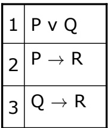

Propositional Resolution Example

| Step | Formula | Derivation |
| --- | --- | --- |
| 1 | P v Q | Given |
| 2 | ¬ P v R | Given Lectur |

Now, “P implies R” turns into “not P or R”.

<!-- page: 12 -->


Propositional Resolution Example

| Step | Formula | Derivation |
| --- | --- | --- |
| 1 | P v Q | Given |
| 2 | ¬ P v R | Given |
| 3 | ¬ Q v R | Given |
|  |  |  |
|  |  |  |
|  |  |  |
|  |  |  |
|  |  |  |
|  |  |  |

Similarly, “Q implies R” turns into “not Q or R

<!-- page: 13 -->

## Propositional Resolution Example

<table><tr><td colspan="2">Prove R</td></tr><tr><td>1</td><td>P v Q</td></tr><tr><td>2</td><td>P → R</td></tr><tr><td>3</td><td>Q → R</td></tr></table>

| Step | Formula | Derivation |
| --- | --- | --- |
| 1 | P v Q | Given |
| 2 | ¬ P v R | Given |
| 3 | ¬ Q v R | Given |
| 4 | ¬ R | Negated conclusion Lecture 7 • 13 |

Now we want to add one more thing to our list of given statements. What's it going to be?

Not R. Right? We're going to assert the negation of the thing we're trying to prove. We'd like to prove that R follows from these things. But what we're going to do instead is say not R, and now we're trying to prove false. And if we manage to prove false, then we will have a proof that R is entailed by the assumptions.

<!-- page: 14 -->

## Propositional Resolution Example

<table><tr><td colspan="2">Prove R</td></tr><tr><td>1</td><td>P v Q</td></tr><tr><td>2</td><td>P → R</td></tr><tr><td>3</td><td>Q → R</td></tr></table>

| Step | Formula | Derivation |
| --- | --- | --- |
| 1 | P v Q | Given |
| 2 | ¬ P v R | Given |
| 3 | ¬ Q v R | Given |
| 4 | ¬ R | Negated conclusion |
|  |  |  |
|  |  |  |
|  |  |  |
|  |  |  |
|  |  |  |

And now, we look for opportunities to apply the resolution rule. You can do it in any order you like (though some orders of application will result in much shorter proofs than others).

Now, we’ll draw a blue line just to divide the assumptions from the proof steps.

<!-- page: 15 -->

Propositional Resolution Example

| 1 | P v Q |
| --- | --- |
| 2 | P → R |
| 3 | Q → R |

| Step | Formula | Derivation |
| --- | --- | --- |
| 1 | P v Q | Given |
| 2 | ¬ P v R | Given |
| 3 | ¬ Q v R | Given |
| 4 | ¬ R | Negated conclusion |
| 5 | Q v R | 1,2 |
|  |  |  |
|  |  |  |
|  |  |  |
|  |  |  |

We can apply resolution to lines 1 and 2, and get $^ { * } \mathbf { Q }$ or $\mathbb { R } ^ { \flat }$ by resolving away P.

<!-- page: 16 -->

Lecture 7 • 16

## Propositional Resolution Example

| 1 | P v Q |
| --- | --- |
| 2 | P → R |
| 3 | Q → R |

| Step | Formula | Derivation |
| --- | --- | --- |
| 1 | P v Q | Given |
| 2 | ¬ P v R | Given |
| 3 | ¬ Q v R | Given |
| 4 | ¬ R | Negated conclusion |
| 5 | Q v R | 1,2 |
| 6 | ¬ P | 2,4 |

And we can take lines 2 and 4, resolve away R, and get “not P.”

<!-- page: 17 -->

Lecture 7 • 17

## Propositional Resolution Example

Prove R

| 1 | P v Q |
| --- | --- |
| 2 | P → R |
| 3 | Q → R |

| Step | Formula | Derivation |
| --- | --- | --- |
| 1 | P v Q | Given |
| 2 | ¬ P v R | Given |
| 3 | ¬ Q v R | Given |
| 4 | ¬ R | Negated conclusion |
| 5 | Q v R | 1,2 |
| 6 | ¬ P | 2,4 |
| 7 | ¬ Q | 3,4 |

Similarly, we can take lines 3 and 4, resolve away R, and get “not Q”.

<!-- page: 18 -->

## Propositional Resolution Example

| 1 | P v Q |
| --- | --- |
| 2 | P → R |
| 3 | Q → R |

| Step | Formula | Derivation |
| --- | --- | --- |
| 1 | P v Q | Given |
| 2 | ¬ P v R | Given |
| 3 | ¬ Q v R | Given |
| 4 | ¬ R | Negated conclusion |
| 5 | Q v R | 1,2 |
| 6 | ¬ P | 2,4 |
| 7 | ¬ Q | 3,4 |
| 8 | R | 5,7 |
|  |  |  |

Lecture 7 • 18

By resolving away Q in lines 5 and 7, we get R.

<!-- page: 19 -->

Propositional Resolution Example

| 1 | P v Q |
| --- | --- |
| 2 | P → R |
| 3 | Q → R |

| Step | Formula | Derivation |
| --- | --- | --- |
| 1 | P v Q | Given |
| 2 | ¬ P v R | Given |
| 3 | ¬ Q v R | Given |
| 4 | ¬ R | Negated conclusion |
| 5 | Q v R | 1,2 |
| 6 | ¬ P | 2,4 |
| 7 | ¬ Q | 3,4 |
| 8 | R | 5,7 |
| 9 | • | 4,8 |

Lecture 7 • 19

And finally, resolving away R in lines 4 and 8, we get the empty clause, which is false. We’ll often draw this little black box to indicate that we’ve reached the desired contradiction.

<!-- page: 20 -->

Lecture 7 • 20

Propositional Resolution Example

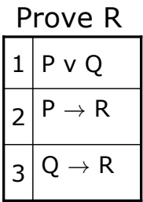

| Step | Formula | Derivation |
| --- | --- | --- |
| 1 | P v Q | Given |
| 2 | ¬ P v R | Given |
| 3 | ¬ Q v R | Given |
| 4 | ¬ R | Negated conclusion |
| 5 | Q v R | 1,2 |
| 6 | ¬ P | 2,4 |
| 7 | ¬ Q | 3,4 |
| 8 | R | 5,7 |
| 9 | • | 4,8 |

How did I do this last resolution? Let’s see how the resolution rule is applied to lines 4 and 8. The way to look at it is that R is really “false or R”, and that “not R” is really “not R or false”. (Of course, the order of the disjuncts is irrelevant, because disjunction is commutative). So, now we resolve away R, getting “false or false”, which is false.

<!-- page: 21 -->

Propositional Resolution Example

<u>Prove R</u>

| 1 | P v Q |
| --- | --- |
| 2 | P → R |
| 3 | Q → R |

false v R

¬ R v false

false v false

| Step | Formula | Derivation |
| --- | --- | --- |
| 1 | P v Q | Given |
| 2 | ¬ P v R | Given |
| 3 | ¬ Q v R | Given |
| 4 | ¬ R | Negated conclusion |
| 5 | Q v R | 1,2 |
|  | P |  |
| 7 | ¬ Q | 3,4 |
| 8 | R | 5,7 |
| 9 | • | 4,8 |

Lecture 7 • 21

One of these steps is unnecessary. Which one? Line 6. It’s a perfectly good proof step, but it doesn’t contribute to the final conclusion, so we could have omitted it.

<!-- page: 22 -->

Lecture 7 • 22

# The Power of False

Here’s a question. Does $^ { \circ } \mathrm { P }$ and not $\mathrm { P } ^ { \flat }$ entail Z?

<!-- page: 23 -->

## The Power of False

Prove Z

| 1 | P |
| --- | --- |
| 2 | ¬ P |

| Step | Formula | Derivation |
| --- | --- | --- |
|  |  |  |
|  |  |  |
|  |  |  |
|  |  |  |

Lecture 7 • 23

It does, and it’s easy to prove using resolution refutation.

<!-- page: 24 -->

Lecture 7 • 24

## The Power of False

Prove Z

| 1 | P |
| --- | --- |
| 2 | ¬ P |

| Step | Formula | Derivation |
| --- | --- | --- |
| 1 | P | Given |
| 2 | ¬ P | Given |
| 3 | ¬ Z | Negated conclusion |
|  |  |  |

We start by writing down the assumptions and the negation of the conclusion.

<!-- page: 25 -->

Lecture 7 • 25

## The Power of False

Prove Z

| 1 | P |
| --- | --- |
| 2 | ¬ P |

| Step | Formula | Derivation |
| --- | --- | --- |
| 1 | P | Given |
| 2 | ¬ P | Given |
| 3 | ¬ Z | Negated conclusion |
| 4 | • | 1,2 |

Then, we can resolve away P in lines 1 and 2, getting a contradiction right away.

<!-- page: 26 -->

Prove Z

## The Power of False

| 1 | P |
| --- | --- |
| 2 | ¬ P |

| Step | Formula | Derivation |
| --- | --- | --- |
| 1 | P | Given |
| 2 | ¬ P | Given |
| 3 | ¬ Z | Negated conclusion |
| 4 | • | 1,2 |

Note that (P Æ ¬ P) → Z is valid

Lecture 7 • 26

Because we can prove Z from “P and not $\mathrm { P } ^ { \flat }$ using a sound proof procedure, then $^ { \circ } \mathrm { P }$ and not $\mathrm { P } ^ { \flat }$ entails Z. And, by the theorem relating entailment and validity, we have that the sentence $^ { \circ } \mathrm { P }$ and not P implies $Z ^ { \flat }$ is valid.

<!-- page: 27 -->

## The Power of False

| 1 | P |
| --- | --- |
| 2 | ¬ P |

| Step | Formula | Derivation |
| --- | --- | --- |
| 1 | P | Given |
| 2 | ¬ P | Given |
| 3 | ¬ Z | Negated conclusion |
| 4 | • | 1,2 |

Note that (P Æ ¬ P) → Z is valid

Any conclusion follows from a contradiction – and so strict logic systems are very brittle.

Lecture 7 • 27

So, we see, again, that any conclusion follows from a contradiction. This is the property that can make logical systems quite brittle; they’re not robust in the face of noise. We’ll address this problem when we move to probabilistic inference.

<!-- page: 28 -->

Here’s an example problem. Stop and do the conversion into CNF before you go to the next slide.

<!-- page: 29 -->

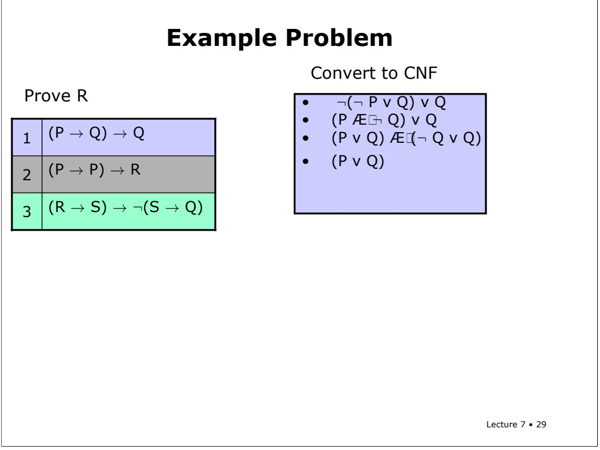

So, the first formula turns into $^ { \circ } \mathrm { P }$ or $\mathbf { Q } ^ { \flat }$ .

<!-- page: 30 -->

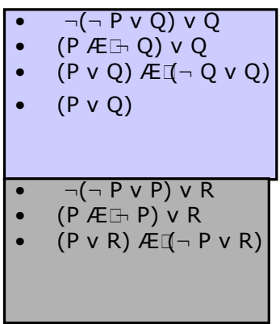

Example Problem

Convert to CNF

Prove R

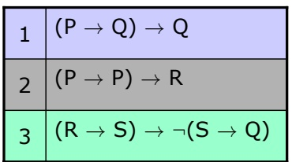

The second turns into $( ^ { \mathrm { c } } \mathrm { P }$ or $\mathbb { R } ^ { \flat }$ and “not P or $\mathrm { R } ^ { \circ } )$ . We probably should have simplified it into “False or $\mathbb { R } ^ { \mathfrak { s } }$ at the second step, which reduces just to R. But $\mathbf { w e } ^ { \flat } \Pi$ leave it as is, for now.

<!-- page: 31 -->

Example Problem

Prove R

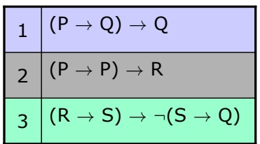

Convert to CNF

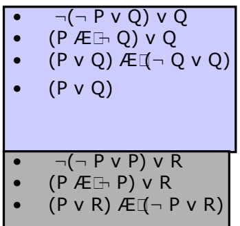

$$
\bullet \quad (\mathrm{R} \not \in \mathrm{S}) \vee (\mathrm{S} \not \in \mathrm{Q})
$$

$$
\cdot \quad (R \lor S) A E \square (\neg S \lor S) A E (R \lor \neg Q) A E (\neg S \lor \neg Q)
$$

$$
\bullet \quad (R \lor S) A E \square (R \lor \neg Q) A E (\neg S \lor \neg Q)
$$

Finally, the last formula requires us to do a big expansion, but one of the terms is true and can be left out. So, we get “(R or S) and (R or not Q) and (not S or not Q)”.

<!-- page: 32 -->

<table><tr><td rowspan="12" colspan="2">Prove R</td><td>1</td><td>P v Q</td><td></td></tr><tr><td>2</td><td>P v R</td><td></td></tr><tr><td>3</td><td> $\neg P v R$ </td><td></td></tr><tr><td>4</td><td>R v S</td><td></td></tr><tr><td>5</td><td>R v  $\neg Q$ </td><td></td></tr><tr><td>6</td><td> $\neg S v \neg Q$ </td><td></td></tr><tr><td>7</td><td> $\neg R$ </td><td>Neg</td></tr><tr><td></td><td></td><td></td></tr><tr><td></td><td></td><td></td></tr><tr><td></td><td></td><td></td></tr><tr><td></td><td></td><td></td></tr><tr><td></td><td></td><td></td></tr></table>

Now we can almost start the proof. We copy each of the clauses over here, and we add the negation of the query.

Please stop and do this proof yourself before going on.

<!-- page: 33 -->

<table><tr><td rowspan="12">Prove R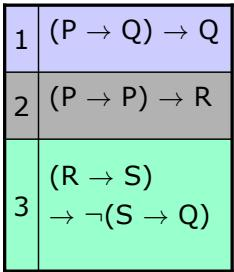</td><td>P v Q</td><td></td></tr><tr><td>P v R</td><td></td></tr><tr><td> $\neg P v R$ </td><td></td></tr><tr><td>R v S</td><td></td></tr><tr><td>R v  $\neg Q$ </td><td></td></tr><tr><td> $\neg S v \neg Q$ </td><td></td></tr><tr><td> $\neg R$ </td><td>Neg</td></tr><tr><td>S</td><td>4,7</td></tr><tr><td> $\neg Q$ </td><td>6,8</td></tr><tr><td>P</td><td>1,9</td></tr><tr><td>R</td><td>3,10</td></tr><tr><td>•</td><td>7,11</td></tr></table>

Here’s a sample proof. It’s one of a whole lot of possible proofs.

<!-- page: 34 -->

In choosing among all the possible proof steps that you can do at any point, there are two rules of thumb that are really important.

<!-- page: 35 -->

The unit preference rule says that if you can involve a clause that has only one literal in it, that's usually a good idea. It’s good because you get back a shorter clause. And the shorter a clause is, the closer it is to false.

<!-- page: 36 -->

## Proof Strategies

• Unit preference: prefer a resolution step involving an unit clause (clause with one literal).

• Produces a shorter clause – which is good since we are trying to produce a zero-length clause, that is, a contradiction.

• Set of support: Choose a resolution involving the negated goal or any clause derived from the negated goal.

• We’re trying to produce a contradiction that follows from the negated goal, so these are “relevant” clauses.

• If a contradiction exists, one can find one using the set-of-support strategy.

Lecture 7 • 36

The set-of-support rule says you should involve the thing that you're trying to prove. It might be that you can derive conclusions all day long about the solutions to chess games and stuff from the axioms, but once you're trying to prove something about what way to run, it doesn't matter. So, to direct your “thought” processes toward deriving a contradiction, you should always involve a clause that came from the negated goal, or that was produced by the set of support rule. Adhering to the set-of-support rule will still make the resolution refutation process sound and complete.

<!-- page: 37 -->

$$
P \to Q
$$

$$
(P \to Q) \lor (R \to S)
$$

$$
\neg (P \land \neg Q) \lor \neg (\neg S \land \neg T)
$$

$$
\neg P \to R
$$

$$
(P \to S) \lor (R \to Q)
$$

$$
- (T \lor Q)
$$

$$
\neg Q \to \neg R
$$

$$
U \to (\neg T \to (\neg S \land P))
$$

$$
\neg U
$$

Please do at least two of these problems before going on, and do the rest before the next recitation.

<!-- page: 38 -->

# First-Order Resolution

OK, now what if we have variables? We're going to move to the first-order case. And there's going to be a resolution rule in the first-order case, and it's essentially the same inference rule, but the trick is what to do with the variables. And what to do with the variables is pretty hard and pretty complicated. We’ll spend the rest of this lecture understanding what to do with the variables.

<!-- page: 39 -->

# First-Order Resolution

∀ x. P(x) → Q(x)

P(A)

uppercase letters: constants

Q(A)

lowercase letters: variables

Let’s try to get some intuition through an example. Imagine you knew “for all X, P of X implies Q of X.” And let's say you also knew P of A. What would you be able to conclude?

Lecture 7 • 39

Q of A, right? You ought to be able to conclude Q of A.

<!-- page: 40 -->

First-Order Resolution

∀ x. P(x) → Q(x)

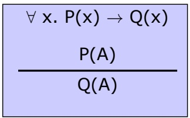

P(A)

Q(A)

Syllogism:

All men are mortal

Socrates is a man

Socrates is mortal

uppercase letters:

constants

variables

lowercase letters:

This is actually Aristotle’s original syllogism: From “All men are mortal” and “Socrates is a man”, conclude “Socrates is a mortal”.

Lecture 7 • 40

<!-- page: 41 -->

$$
\begin{array}{c} \forall x. \neg P (x) \lor Q (x) \\ \frac {P (A)}{Q (A)} \end{array}
$$

So, how can we justify this conclusion formally. Well, the first step would be to get rid of the implication.

<!-- page: 42 -->

First-Order Resolution

Syllogism: All men are mortal Socrates is a man Socrates is mortal

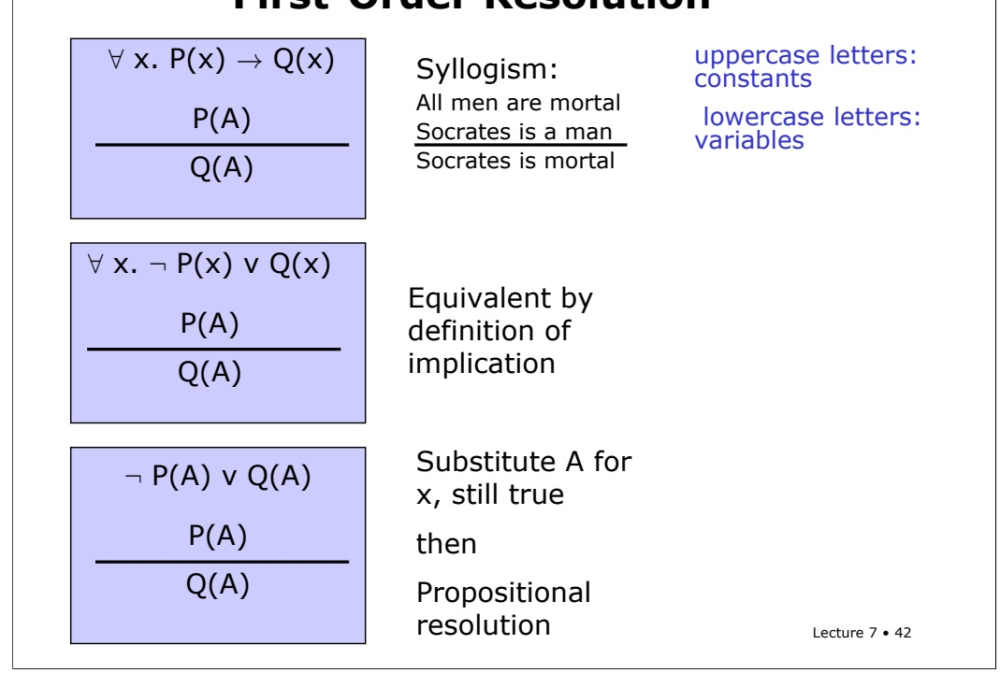

Equivalent by definition of implication

Next, we could substitute the constant A in for the variable x in the universally quantified sentence. By the semantics of universal quantification, that’s allowed. And now, we can apply the propositional resolution rule.

<!-- page: 43 -->

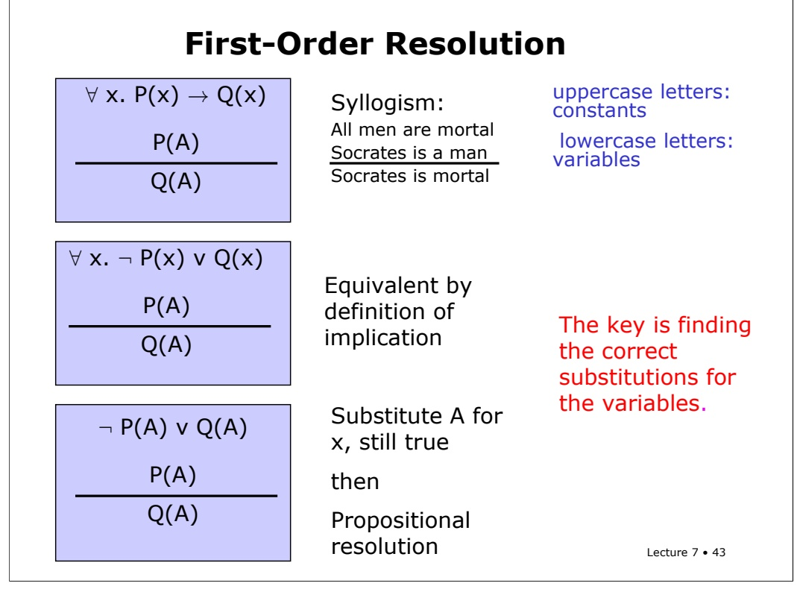

The hard part is figuring out how to instantiate the variables in the universal statements. In this problem, it was clear that A was the relevant individual. But it not necessarily clear at all how to do that automatically.

<!-- page: 44 -->

In order to derive an algorithmic way of finding the right instantiations for the universal variables, we need something called substitutions.

<!-- page: 45 -->

# Substitutions

P(x, F(y), B) : an atomic sentence

Lecture 7 • 45

Here’s an example of what we called an atomic sentence before, a predicate applied to some terms. There are two variables in here: x, and y. We can think about different ways that we can substitute terms into this expression, right? Those are called substitution instances of that expression.

<!-- page: 46 -->

## Substitutions

P(x, F(y), B) : an atomic sentence

| Substitution instances | Substitution$\{v_1/t_1,..., v_n/t_n\}$ | Comment |
| --- | --- | --- |
|  |  |  |
|  |  |  |
|  |  |  |
|  |  |  |

A substitution is a set of variable-term pairs, written this way. It says that whenever you see variable I, you should substitute in term I. There should not be more than one entry for a single variable.

<!-- page: 47 -->

Substitutions

P(x, F(y), B) : an atomic sentence

| Substitution instances | Substitution {v1 /t1,…, vn /tn} | Comment |
| --- | --- | --- |
| P(z, F(w), B) | {x/z, y/w} | Alphabetic variant |
|  |  |  |
|  |  |  |
|  |  |  |

So here's one substitution instance. P(z,F(w),B). It’s not particularly interesting. It’s called an alphabetic variant, because we’ve just substituted some different variables in for x and y. In particular, we’ve put z in for x and w in for y, as shown in the substitution.

<!-- page: 48 -->

## Substitutions

P(x, F(y), B) : an atomic sentence

| Substitution instances | Substitution {v1 /t1,…, vn /tn} | Comment |
| --- | --- | --- |
| P(z, F(w), B) | {x/z, y/w} | Alphabetic variant |
| P(x, F(A), B) | {y/A} |  |
|  |  |  |
|  |  |  |

Here’s another substitution instance of our sentence: P(x, F(A), B), We’ve put the constant A in for the variable y.

<!-- page: 49 -->

## Substitutions

$\mathsf { P } ( \mathsf { x } ,   \mathsf { F } ( \mathsf { y } ) ,   \mathsf { B } )$ : an atomic sentence

| Substitution instances | Substitution {v1 /t1,…, vn /tn} | Comment |
| --- | --- | --- |
| P(z, F(w), B) | {x/z, y/w} | Alphabetic variant |
| P(x, F(A), B) | {y/A} |  |
| P(G(z), F(A), B) | {x/G(z), y/A} |  |
|  |  |  |

To get $\mathrm { P } ( \mathrm { G } ( \mathrm { z } ) , \mathrm { F } ( \mathrm { A } ) , \mathrm { B } )$ , we substitute the term G(z) in for x and the constant A for y.

<!-- page: 50 -->

Here’s one more -- P(C, F(A), B). It’s sort of interesting, because it doesn't have any variables in it. We'll call an atomic sentence with no variables a ground instance. Ground means it doesn't have any variables.

<!-- page: 51 -->

## Substitutions

P(x, F(y), B) : an atomic sentence

| Substitution instances | Substitution {v1 /t1,…, vn /tn} | Comment |
| --- | --- | --- |
| P(z, F(w), B) | {x/z, y/w} | Alphabetic variant |
| P(x, F(A), B) | {y/A} |  |
| P(G(z), F(A), B) | {x/G(z), y/A} |  |
| P(C, F(A), B) | {x/C, y/A} | Ground instance |

Lecture 7 • 51

You can think about substitution instances, in general, as being more specific than the original sentence. A constant is more specific than a variable. There are fewer interpretations under which a sentence with a constant is true. And even F(x) is more specific than y, because the range of F might be smaller than U.

You’re not allowed to substitute anything in for a constant, or for a compound term (the application of a function symbol to some terms). You **are** allowed to substitute for a variable inside a compound term, though, as we have done with F in this example.

<!-- page: 52 -->

## Substitutions

P(x, F(y), B) : an atomic sentence

| Substitution instances | Substitution$\{v_1/t_1,..., v_n/t_n\}$ | Comment |
| --- | --- | --- |
| P(z, F(w), B) | {x/z, y/w} | Alphabetic variant |
| P(x, F(A), B) | {y/A} |  |
| P(G(z), F(A), B) | {x/G(z), y/A} |  |
| P(C, F(A), B) | {x/C, y/A} | Ground instance |

We’ll use the notation of an expression followed by a substitution to mean the expression that we get by applying the substitution to the expression. And the book uses a function subst, with two arguments, the substitution and the expression.

To apply a substitution to an expression, we look to see if any of the variables in the expression have entries in the substitution. If they do, we substitute in the appropriate new expression for the variable, and continue to look for possible substitutions until no more opportunities exist.

<!-- page: 53 -->

Now we’ll look at the process of unification, which is finding a substitution that makes two expressions match each other exactly.

<!-- page: 54 -->

So, expressions Omega 1 and Omega 2 are unifiable if there exists a substitution S such that (Omega-1 S) will be equal to (Omega-2 S). And that substitution S is called a unifier of omega1 and omega2.

<!-- page: 55 -->

So, let’s look at some unifiers of the expressions x and y. Since x and y are both variables, there are lots of things you can do to make them match.

<!-- page: 56 -->

If you substitute x in for y, then both expressions come out to be x.

<!-- page: 57 -->

If you put in y for x, then they both come out to be y.

<!-- page: 58 -->

But you could also substitute something else, like F(F(A)) for x and for y, and you’d get matching expressions.

<!-- page: 59 -->

Or, you could substitute some constant, like A, in for both x and y.

<!-- page: 60 -->

Of the unifiers we considered on the previous slide, some of them seem a bit arbitrary. Binding both x and y to A, or to F(F(A)) is a kind of overcommitment.

<!-- page: 61 -->

## Most General Unifier

g is a most general unifier of ω and ω iff for all unifiers $\mathbb { S } _ { r }$ there exists s0 such that $\omega _ { 1 } \hat { \mathsf { S } } = ( \omega _ { 1 } \hat { \mathsf { g } } ) \mathsf { S } ^ { \prime }$ and $\omega _ { 2 } \; s = ( \omega _ { 2 } \; g ) \; s ^ { \prime }$

Lecture 7 • 60

So, in fact, what we’re really going to be looking for is not just any unifier of two expressions, but a **most general unifier**, or MGU.

G is a most general unifier of omega1 and omega2 if and only if for all unifiers S, there exists an S-prime such that (omega-1 S) equals (omega-1 G S-prime), and (omega-2 S) equals (omega-2 G S-prime).

A unifier is most general if every single one of the other unifiers can be expressed as an extra-substitution added onto the most general one.

It’s a substitution that you can make that makes the fewest commitments, and can still make these two expressions equal.

<!-- page: 62 -->

## Most General Unifier

g is a most general unifier of $\mathfrak { O } _ { 1 }$ and ω iff for all unifiers $\mathbb { S } _ { r }$ there exists s0 such that $\omega_{1} \hat{s} = (\omega_{1} \hat{g}) s'$ and $\omega _ { 2 } \; s = ( \omega _ { 2 } \; g ) \; s ^ { \prime }$

| ω<sub>1</sub> | ω<sub>2</sub> | MGU |
| --- | --- | --- |
| P(x) | P(A) | {x/A} |
|  |  |  |
|  |  |  |
|  |  |  |
|  |  |  |
|  |  |  |

So, let's do a few more examples together, and then you can do some as recitation problems. So, what’s a most general unifier of $\mathbf { P } ( \mathbf { x } )$ and $\mathrm { P ( A ) ? }$ A for x.

<!-- page: 63 -->

## Most General Unifier

g is a most general unifier of $\mathfrak { O } _ { 1 }$ and ω iff for all unifiers $\mathbb { S } _ { r }$ there exists s0 such that $\omega_{1} \hat{s} = (\omega_{1} \hat{g}) s'$ and $\omega _ { 2 } \; s = ( \omega _ { 2 } \; g ) \; s ^ { \prime }$

| ω<sub>1</sub> | ω<sub>2</sub> | MGU |
| --- | --- | --- |
| P(x) | P(A) | {x/A} |
| P(F(x), y, G(x)) | P(F(x), x, G(x)) | {y/x} or {x/y} |
|  |  |  |
|  |  |  |
|  |  |  |
|  |  |  |

What about these two expressions? We can make them match up either by substituting x for y, or y for x. It doesn’t matter which one we do. They’re both “most general”.

<!-- page: 64 -->

## Most General Unifier

g is a most general unifier of $\mathfrak { O } _ { 1 }$ and ω iff for all unifiers $\mathbb { S } _ { r }$ there exists s0 such that $\omega_{1} \hat{s} = (\omega_{1} \hat{g}) s'$ and $\omega _ { 2 } \; s = ( \omega _ { 2 } \; g ) \; s ^ { \prime }$

| ω<sub>1</sub> | ω<sub>2</sub> | MGU |
| --- | --- | --- |
| P(x) | P(A) | {x/A} |
| P(F(x), y, G(x)) | P(F(x), x, G(x)) | {y/x} or {x/y} |
| P(F(x), y, G(y)) | P(F(x), z, G(x)) | {y/x, z/x} |
|  |  |  |
|  |  |  |
|  |  |  |

Okay. What about this one? It’s a bit tricky. You can kind of see that, ultimately, all of the variables are going to have to be the same. Matching the arguments to G forces y and x to be the same, And since z and y have to be the same as well (to make the middle argument match), they all have to be the same variable. Might as well make it x (though it could be any other variable).

<!-- page: 65 -->

## Most General Unifier

g is a most general unifier of $\mathfrak { O } _ { 1 }$ and ω iff for all unifiers $\mathbb { S } _ { r }$ there exists s0 such that $\omega_{1} \hat{s} = (\omega_{1} \hat{g}) s'$ and $\omega _ { 2 } \; s = ( \omega _ { 2 } \; g ) \; s ^ { \prime }$

| ω<sub>1</sub> | ω<sub>2</sub> | MGU |
| --- | --- | --- |
| P(x) | P(A) | {x/A} |
| P(F(x), y, G(x)) | P(F(x), x, G(x)) | {y/x} or {x/y} |
| P(F(x), y, G(y)) | P(F(x), z, G(x)) | {y/x, z/x} |
| P(x, B, B) | P(A, y, z) | {x/A, y/B, z/B} |
|  |  |  |
|  |  |  |

What about P(x, B, B) and $\mathrm{P}(\mathrm{A}, \mathrm{y}, \mathrm{z})?$ It seems pretty clear that we’re going to have to substitute A for x, B for $\mathrm { y } ,$ and B for Z.

<!-- page: 66 -->

## Most General Unifier

g is a most general unifier of $\mathfrak { O } _ { 1 }$ and ω iff for all unifiers $\mathbb { S } _ { r }$ there exists s0 such that $\omega_{1} \hat{s} = (\omega_{1} \hat{g}) s'$ and $\omega _ { 2 } \; s = ( \omega _ { 2 } \; g ) \; s ^ { \prime }$

| ω<sub>1</sub> | ω<sub>2</sub> | MGU |
| --- | --- | --- |
| P(x) | P(A) | {x/A} |
| P(F(x), y, G(x)) | P(F(x), x, G(x)) | {y/x} or {x/y} |
| P(F(x), y, G(y)) | P(F(x), z, G(x)) | {y/x, z/x} |
| P(x, B, B) | P(A, y, z) | {x/A, y/B, z/B} |
| P(G(F(v)), G(u)) | P(x, x) | {x/G(F(v)), u/F(v)} |
|  |  |  |

Here’s a tricky one. It looks like x is going to have to simultaneously be $\mathbf { G } ( \mathrm { F } ( \mathbf { v } ) )$ and G(u). How can we make that work? By substituting F(v) in for u.

<!-- page: 67 -->

Lecture 7 • 66

## Most General Unifier

g is a most general unifier of $\mathfrak { O } _ { 1 }$ and ω iff for all unifiers $\mathbb { S } _ { r }$ there exists s0 such that $\omega_{1} \hat{s} = (\omega_{1} \hat{g}) s'$ and $\omega _ { 2 } \; s = ( \omega _ { 2 } \; g ) \; s ^ { \prime }$

| ω<sub>1</sub> | ω<sub>2</sub> | MGU |
| --- | --- | --- |
| P(x) | P(A) | {x/A} |
| P(F(x), y, G(x)) | P(F(x), x, G(x)) | {y/x} or {x/y} |
| P(F(x), y, G(y)) | P(F(x), z, G(x)) | {y/x, z/x} |
| P(x, B, B) | P(A, y, z) | {x/A, y/B, z/B} |
| P(G(F(v)), G(u)) | P(x, x) | {x/G(F(v)), u/F(v)} |
| P(x, F(x)) | P(x, x) | No MGU! |

Now, let’s try unifying P(x, F(x)) with $\mathrm { P ( x , } \mathrm { x ) }$ . The temptation is to say x has to be F(x), but then that x has to be F(x), etc. The answer is that these expressions are not unifiable.

<!-- page: 68 -->

## Most General Unifier

g is a most general unifier of ω and ω iff for all unifiers s, there exists s0 such that $\omega_{1} \hat{s} = (\omega_{1} \hat{g}) s'$ and $\omega _ { 2 } \; s = ( \omega _ { 2 } \; g ) \; s ^ { \prime }$

| ω<sub>1</sub> | ω<sub>2</sub> | MGU |
| --- | --- | --- |
| P(x) | P(A) | {x/A} |
| P(F(x), y, G(x)) | P(F(x), x, G(x)) | {y/x} or {x/y} |
| P(F(x), y, G(y)) | P(F(x), z, G(x)) | {y/x, z/x} |
| P(x, B, B) | P(A, y, z) | {x/A, y/B, z/B} |
| P(G(F(v)), G(u)) | P(x, x) | {x/G(F(v)), u/F(v)} |
| P(x, F(x)) | P(x, x) | No MGU! |

Lecture 7 • 67

The last time I explained this to a class, someone asked me what would happen if F were the identity function. Then, couldn’t we unify these two expressions? That’s a great question, and it illustrates a point I should have made before. In unification, we are interested in ways of making expressions equivalent, in every interpretation of the constant and function symbols. So, although it might be possible for the constants A and B to be equal because they both denote the same object in some interpretation, we can’t unify them, because they are not required to be the same in every interpretation.

<!-- page: 69 -->

An MGU can be computed recursively, given two expressions x, and y, to be unified, and a substitution that contains substitutions that must already be made. The argument s will be empty in a top-level call to unify two expressions.

<!-- page: 70 -->

The algorithm returns a substitution if x and y are unifiable in the context of s, and fail otherwise. If s is already a failure, we return s.

<!-- page: 71 -->

If x is equal to $\mathrm { y } ,$ then we don’t have to do any work and we return fail.

<!-- page: 72 -->

If either x or y is a variable, then we go to a special subroutine that’s shown on the next slide.

<!-- page: 73 -->

If x is a predicate or a function application, then y must be one also, with the same predicate or function.

<!-- page: 74 -->

If so, we’ll unify the lists of arguments from x and y in the context of s.

<!-- page: 75 -->

If not, that is, if x and y have different predicate or function symbols, we simply fail.

<!-- page: 76 -->

```awk
Unification Algorithm
unify(Expr x, Expr y, Subst s){
    if s = fail, return fail
    else if x = y, return s
    else if x is a variable, return unify-var(x, y, s)
    else if y is a variable, return unify-var(y, x, s)
    else if x is a predicate or function application,
        if y has the same operator,
            return unify(args(x), args(y), s)
        else     return fail
    else             ; x and y have to be lists
        return unify(rest(x), rest(y),
                unify(first(x), first(y), s))
}
```

Finally, (if we get to this case, then x and y have to be lists, or something malformed), we go down the lists, unifying the first elements, then the second elements, and so on. Each time we unify a pair of elements, we get a new substitution that records the commitments we had to make to get that pair of expressions to unify. Each further unification must take place in the context of the commitments generated by the previous elements of the lists.

<!-- page: 77 -->

## Unify-var subroutine

Substitute in for var and x as long as possible, then add new binding

**unify-var(Variable var, Expr x, Subst s){**

Lecture 7 • 76

Given a variable var, an expression x, and a substitution s, we need to return a substitution that unifies var and x in the context of s. What makes this tricky is that we have to first keep applying the existing substitutions in s to var, and to x, if it is a variable, before we’re down to a new concrete problem to solve.

<!-- page: 78 -->

So, if var is bound to val in s, then we unify that value with x, in the context of s (because $\mathbf { w e } ^ { \flat }$ re already committed that val has to be substituted for var).

<!-- page: 79 -->

## Unify-var subroutine

Substitute in for var and x as long as possible, then add new binding

**unify-var(Variable var, Expr x, Subst s){**

**if var is bound to val in s,**

**return unify(val, x, s)**

**else if x is bound to val in s,**

**return unify-var(var, val, s)**

Similarly, if x is a variable, and it is bound to val in s, then we have to unify var with val in s. (We call unify-var directly, because we know that var is still a var).

<!-- page: 80 -->

If var occurs anywhere in x, then fail. This is the “occurs” check, which keeps us from circularities, like binding x to F(x).

<!-- page: 81 -->

```txt
Unify-var subroutine
    Substitute in for var and x as long as possible, then add new binding
    unify-var(Variable var, Expr x, Subst s){
        if var is bound to val in s,
            return unify(val, x, s)
        else if x is bound to val in s,
            return unify-var(var, val, s)
        else if var occurs anywhere in x, return fail
        else   return add({var/x}, s)
    }
}
```

Finally, we know var is a variable that doesn’t already have a substitution, so we add the substitution of x for var to s, and return it.

<!-- page: 82 -->

```javascript
Unify-var subroutine
    Substitute in for var and x as long as possible, then add new binding
    unify-var(Variable var, Expr x, Subst s){
        if var is bound to val in s,
            return unify(val, x, s)
        else if x is bound to val in s,
            return unify-var(var, val, s)
        else if var occurs anywhere in x, return fail
        else   return add({var/x}, s)
    }

    Note: last line incorrect in book!
```

Be careful. The last line of this algorithm in the book is incorrect.

<!-- page: 83 -->

Please do at least half of these problems before you go on to the next lecture, and all of them before the next recitation.

<!-- page: 84 -->

## Inference using Unification

$$
\begin{array}{c} \forall x. \neg P (x) \lor Q (x) \\ \frac {P (A)}{Q (A)} \end{array}
$$

For universally quantified variables, find MGU {x/A} and proceed as in propositional resolution.

<small><span class="docvortex-page-footnote" data-block-type="page_footnote" style="color:#6b7280">We’ll spend next time talking about the first-order resolution inference rule in great detail. But just so you can see what unification is good for, here’s an example inference rule.</span></small>

<small><span class="docvortex-page-footnote" data-block-type="page_footnote" style="color:#6b7280">In propositional resolution, we looked for a variable and its negation to resolve. They had to match exactly. In first-order unification, we’ll look for two expressions to resolve. But now they don’t have to match exactly. They just have to unify. The details are to come.</span></small>
