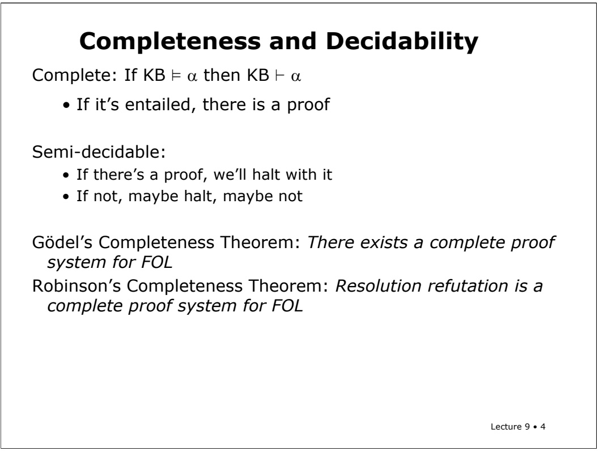
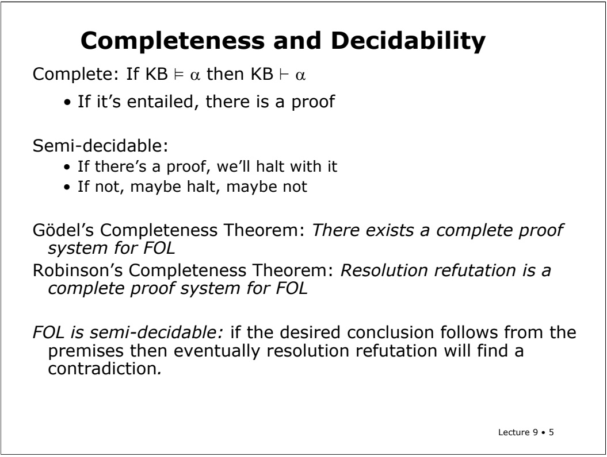

<!-- page: 1 -->

Logic is a huge subject. It includes esoteric mathematical and philosophical arguments as well as hard-core engineering of knowledge representations and efficient inference algorithms. I’m going to use this lecture to cover a set of random topics in logic that, even if you don’t understand them exactly, it’s good to know a little bit about.

The paramodulation rule will also be important to homework 2.

<!-- page: 2 -->

We found that resolution for propositional logic was sound and complete. Recall that a proof system is complete if whenever a conclusion is entailed by some premises, it can be proved from those premises.

<!-- page: 3 -->

## Completeness and Decidability

Complete: If KB ² α then KB \` α

• If it’s entailed, there is a proof

Semi-decidable:

• If there’s a proof, we’ll halt with it

• If not, maybe halt, maybe not

Gödel’s Completeness Theorem: There exists a complete proof system for FOL

Godel proved a completeness theorem for first-order logic: There exists a complete proof system for FOL. But, living up to his nature as a very abstract logician, he didn’t come up with such a proof system; he just proved one existed.

<!-- page: 4 -->



Then, Robinson came along and showed that resolution refutation is sound and complete for FOL.

<!-- page: 5 -->



This makes first-order logic semi-decidable. If the answer is “yes”, that is, if there is a proof, then the theorem prover will eventually halt and say so. But if there isn’t a proof, it might run forever! (unlike in the propositional case, in which it is guaranteed that if there isn’t a proof, resolution will eventually stop).

<!-- page: 6 -->

So, things are relatively good with regular first-order logic. And they’re still fine if you add addition to the language. But if you add addition and multiplication, it starts to get weird!

<!-- page: 7 -->

Godel also had an **in**completeness theorem, which says that there is no consistent, complete proof system for FOL plus arithmetic. (Consistent is the same as sound). Either there are sentences that are true, but not provable, or there are sentences that are provable, but not true. It’s not so good either way.

<!-- page: 8 -->

## Adding Arithmetic

Gödel’s Incompleteness Theorem: There is no consistent, complete proof system for FOL + Arithmetic.

Either there are sentences that are true, but not provable or there are sentences that are provable, but not true.

Arithmetic gives you the ability to construct codenames for sentences within the logic. P = “P is not provable.”

Lecture 9 • 8

Here’s the roughest cartoon of how the proof goes. Arithmetic gives you the ability to construct code names for sentences within the logic, and therefore to construct sentences that are self-referential. This sentence, P, is sometimes called the Godel-sentence. P is “P is not provable”.

<!-- page: 9 -->

If P is true, then P is not provable (so the system is incomplete). If P is false, then P is provable (so the system is inconsistent). Too bad!

<!-- page: 10 -->

# Equality

We need to talk a bit about equality. So far we've been doing proofs in a language with predicates and functions, but no equality statements. When we talked about the definition of first-order logic we put equality in our language, so the question is what do you do in resolution, if you have equality, if you want to talk about things being equal to each other.

<!-- page: 11 -->

$$
\forall \mathbf {x}. \mathbf {x} = \mathbf {x}
$$

$$
\forall \mathsf {x y .} \mathsf {x = y} \rightarrow \mathsf {y} = \mathsf {x}
$$

$$
\forall x y z. x = y \notin y = z \rightarrow x = z
$$

One solution is to just treat equality like any other relation and give axioms that specify how it has to work. So, for instance, equality is an equivalence relation, which means it’s symmetric, reflexive, and transitive. We can say that in logic like this.

<!-- page: 12 -->

## Equality

$$
\forall \texttt {X .} \texttt {X} = \texttt {X}
$$

$$
\forall \mathsf {x y .} \mathsf {x = y} \rightarrow \mathsf {y} = \mathsf {x}
$$

$$
\forall x y z. x = y \not \in E y = z \rightarrow x = z
$$

$$
\forall \mathsf {x y}. \mathsf {x} = \mathsf {y} \rightarrow (\mathsf {P} (\mathsf {x}) \leftrightarrow \mathsf {P} (\mathsf {y}))
$$

$$
\text {etc., etc., etc., ...}
$$

But then, very sadly, you need more than that. You need to say, for every predicate P, for all X and Y if X = Y then (P(X) if and only if P(Y)). The idea is that you should be able to substitute equals for equals into any context. That doesn’t follow from our equality axioms, and so $\mathbf { w e } ^ { \flat } \mathbf { d }$ have add a new axiom for every predicate in our language that says it’s okay to substitute equals into it. That could get to be pretty tedious.

<!-- page: 13 -->

So what typically happens is that people build special inference procedures for equality into the proof procedure, so in resolution there's a rule called paramodulation. I'll show it to you by example. You'll get the idea. The book talks about demodulation. This is a slightly more complicated version, but it's not too much more complicated.

<!-- page: 14 -->

$$
F (x) = B
$$

$$
Q (y) \lor W (y, F (y))
$$

$$
Q (y) \lor W (y, B)
$$

We’ll start by looking at a simple example. What if you know that F(x) = B, and that either Q(y) or $\mathbf { W } ( \mathbf { y } , \mathbf { F } ( \mathbf { y } ) )$ . It seems like you should be able to substitute B in for F(y), because F(x) unifies with F(y). And you can! You can conclude Q(y) or W(y,B).

<!-- page: 15 -->

Lecture 9 • 15

# Paramodulation

Need one more rule to deal with resolution and equality.

$$
\alpha \lor (s = t)
$$

$$
\beta \lor \gamma [ r ]
$$

[r] is a literal containing term r

$$
(\alpha \lor \beta \lor \gamma [ t ]) \theta
$$

$$
\theta = \text {unify} (s, r)
$$

$$
F (x) = B
$$

$$
Q (y) \lor W (y, F (y))
$$

$$
Q (y) \lor W (y, B)
$$

Here’s the general paramodulation rule. Like resolution, it lets you take two clauses and make a third with elements from the first two. The first clause has to have an equality (we’ll call it s = t) in it. The second clause has to have some literal, which we’ll call gamma that contains a term r, such that r unifies with s. Then, the basic idea is that, since r matches with s, and since s equals t, then we should be able to substitute r in for t. And we’re allowed to do that, but with some additional work. First of all, it might have required application of a substitution theta to make r unify with s, and we’ll have to apply that substitution to the whole resulting clause. Secondly, we might not have known, unconditionally, that s = t. If s = t actually occurs in a clause with other literals, then we need to disjoin those literals into our resulting sentence.

<!-- page: 16 -->

## Paramodulation

Need one more rule to deal with resolution and equality.

$$
\alpha \lor (s = t)
$$

$$
\beta \lor \gamma [ r ]
$$

$\mathcal { n } [ r ]$ is a literal containing term r

$$
(\alpha \lor \beta \lor \gamma [ t ]) \theta
$$

$$
\theta = \text {unify} (s, r)
$$

$$
F (x) = B
$$

where

$$
Q (y) \lor W (y, F (y))
$$

$$
s = F (x)
$$

$$
Q (y) \lor W (y, B)
$$

$$
t = B
$$

$$
\gamma [ \cdot ] = W (y, \cdot)
$$

$$
r = F (y)
$$

$$
\theta = \{x / y \}
$$

Lecture 9 • 16

So, to see how we can do our simple example with paramodulation, here is the mapping from the abstract variables in the rule to the actual components of the example.

<!-- page: 17 -->

## Paramodulation

Need one more rule to deal with resolution and equality.

$$
\alpha \lor (s = t)
$$

$$
\beta \lor \gamma [ r ]
$$

$\mathcal { n } [ r ]$ is a literal containing term r

$$
(\alpha \lor \beta \lor \gamma [ t ]) \theta
$$

$$
\theta = \text {unify} (s, r)
$$

$$
F (x) = B
$$

where

$$
Q (y) \lor W (y, F (y))
$$

$$
s = F (x)
$$

$$
Q (y) \lor W (y, B)
$$

$$
t = B
$$

$$
P (x) \lor F (x) = B
$$

$$
\gamma [ \cdot ] = W (y, \cdot)
$$

$$
Q (y) \lor W (y, F (y))
$$

$$
r = F (y)
$$

$$
P (y) \lor Q (y) \lor W (y, B)
$$

$$
\theta = \{x / y \}
$$

Lecture 9 • 17

Now we can make our example a bit more complicated, adding an additional literal to the first sentence. Now we’re required to include it in the result, and to apply the substitution theta to it, as well.

<!-- page: 18 -->

```txt
Recitation Problems
Formalize each group of sentences (using the given function and predicate symbols), then prove the last from the others using resolution and paramodulation.
Jane's lover drives a red car.
Fred is the only person who drives a red car.
Therefore, Fred is Jane's lover.
(L(x) = the lover of x; D(x) = x drives a red car)
Mrs. Abbot only teaches good students.
John and Mary have the same teacher.
Mrs. Abbot is Mary's teacher.
Therefore, John is a good student.
(T(x) = the teacher of x; G(x) = x is a good student)
Lecture 9 • 18
```

Please do these recitation problems before the next recitation.

<!-- page: 19 -->
