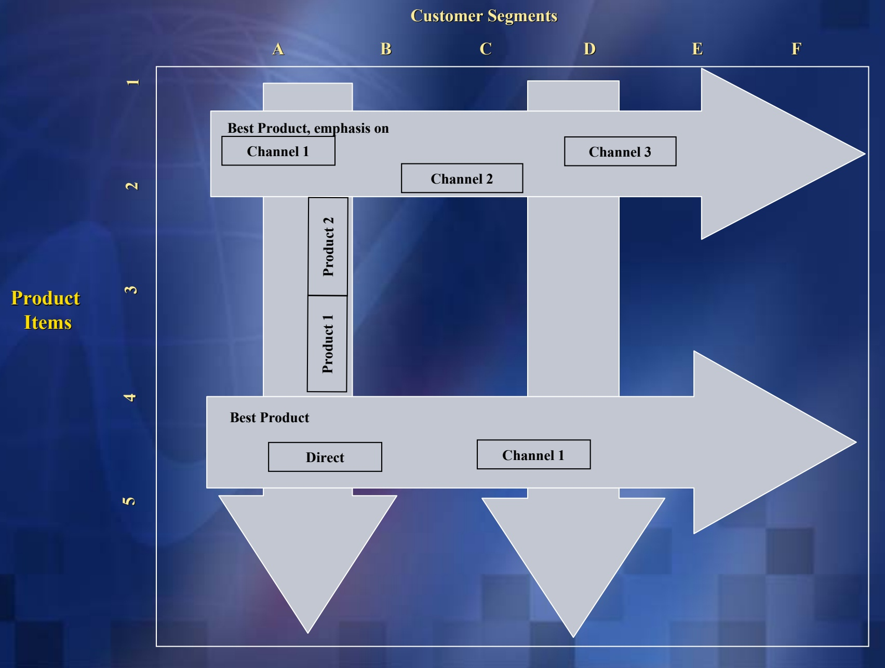
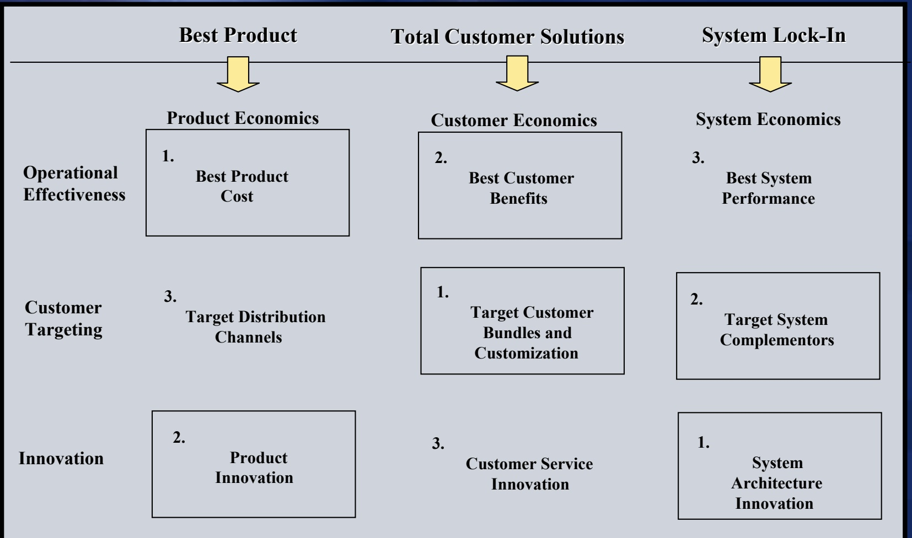

<!-- page: 1 -->

## Adaptive Processes:

## Linking Strategy with Execution

<!-- page: 2 -->

## Contributions of the Delta Model

| Contribution: | Goal: | Implication: | Method: |
| --- | --- | --- | --- |
| The Triangle | Opening the mindset to new strategic positions | The best product does not always win | Three distinct strategic optionsBest ProductTotal Customer SolutionsSystem Lock-In |
| Adaptive Processes | Linking strategy with execution | Execution is not the problem, linking to strategy is | Execution is captured through three Adaptive Processes:Operational EffectivenessCustomer TargetingInnovationwhose roles need to change to achieve different strategic positions |
| Aggregate Metrics | Measuring success | Good financials do not always lead to good results | Aggregate performance metrics need to reflect each of the Adaptive Processes and their role based upon the strategic positionProduct performanceCustomer performanceCompetitor performance |
| Granular Metrics and Feedback | Discovering performance drivers | Managing by averages leads to below average performance | Business is nonlinear. Performance is concentrated, particularly when it involves bonding. Granular Metrics allows us to focus on underlying performance drivers, to detect variability, explain, learn, and act |

<!-- page: 3 -->

## The Adaptive Processes:

## Linking Strategy with Execution

Business Model

Innovation

• The process of new product development

\- Should ensure a continuous stream of new products and services to maintain the future viability of the business

Operational Effectiveness

Customer Targeting

\- The management of the customer interface

\- Identification and selection of attractive customers and enhancement of customers' performance

\- Should establish best revenue infrastructure for chosen strategy • The production and delivery of products and services to the customer

\- Should produce the most effective cost and asset infrastructure to support the chosen strategic position of the business

<!-- page: 4 -->

\- Operational Effectiveness: This process is responsible for the delivery of products and services to the customer. In a traditional sense, this includes all the elements of the internal supply chain. Its primary focus is on producing the most effective cost and asset infrastructure to support the desired strategic position of the business. In a more comprehensive sense, operational effectiveness should expand its external scope to include suppliers, customer, and key complementors, thus establishing an extended supply chain. This process is the heart of a company’s productive engine as well as its source of capacity and efficiency.

<!-- page: 5 -->

\- Customer Targeting: This process addresses the business-to-customer interface. It encompasses the activities intended to attract, satisfy, and retain customers, and ensures that customer relationships are managed effectively. Its primary objectives are to identify and select attractive customers and to enhance their performance, either by helping to reduce their costs or increase their revenues. The ultimate goal of this process is to establish the best revenue infrastructure for the business.

<!-- page: 6 -->

\- Innovation: This process ensures a continuous stream of new products and services to maintain the future viability of the business. It mobilizes all the creative resources of the firm- including its technical, production, and marketing capabilities- to develop an innovative infrastructure for the business. It should not limit itself to the pursuit of internal product development, but should extend the sources of Innovation to include suppliers, customers, and key complementors. The heart of this process is the renewal of the business in order to sustain its competitive advantage and its superior financial performance.

<!-- page: 7 -->

## The Changing Role of Operational Effectiveness

## In supporting the chosen Strategic Position

Focus of Attention

Description of the Role

Best Product

Internal Value

Internal cost infrastructure

Output

Objective

Best Product Cost

Internal and customer value chain

Solutions

Total

Combined internal and customer infrastructure

Strategic Position

Internal, customer, and complementor value chain

Maximum customer value

System infrastructure

System Lock-In

Enhance system performance

<!-- page: 8 -->

## The Changing Role of Customer Targeting

## In supporting the chosen Strategic Position

Best Product

Focus of Attention

Distribution channel 'generic customer'

Description of the Role

Maximize product volume and product market share, minimize distribution cost

## Total Customer Solutions

System Lock-In

Targeted customer

Relevant business system

Target market intelligence, Customer interface

Network of complementors, Complementor interfaces

Maximize share of each customer

Maximize share of complementors

<!-- page: 9 -->

## Best Product Companies Take a Horizontal Market Cut, Total Customer Solutions Businesses Take a Vertical Market Cut

<!-- page: 10 -->

## The Traditional Customer Interface in the Best Product Strategy

Rest of the organization

Salesforce

Buyers

Rest of the organization

Supplier

Customer

<!-- page: 11 -->

## The Traditional Customer Interface in the Total Customer Solutions Strategy

Line Executives

Line Executives

R & D

R & D

Manufacturing

Manufacturing

Marketing and Distribution

Marketing and Distribution

Finance

Finance

After Sales

After Sales

<!-- page: 12 -->

## In supporting the chosen Strategic Position

Focus of Attention

Best Product

Common product platform

Description of the Role

Family of products

Objective

First to market, dominant design

Solutions

Customer's platform

Total

Joint development

\- Manage proliferation of complementors

\- Enhance customer's results

Open platform

System Lock-In

\- Breadth/range of applications

\- Customized bundle of products

\- Integrate into customer's activities

Strategic Position

\- Application interfaces

Harmonized system architecture

<!-- page: 13 -->

## The Role of Adaptive Processes

## In supporting the Strategic Positioning of the Business

Strategic Positioning

Operational Effectiveness

Best Product Cost

Maximum Customer Value

Best System Performance

Customer Targeting

Innovation

↓

Maximize Product Volume, Low Distribution Cost

↓

First to Market,
Dominant Design

↓

Customer Share

↓

Customized Bundle Of Products

↓

Total Customer Solutions

Complementor Share

↓

Harmonize System Architecture

Best Product

System Lock-In

<!-- page: 14 -->

## The Role of Adaptive Processes

## In supporting the Strategic Positioning of the Business

Strategic Positioning

Best Product

Total Customer Solutions

System Lock-In

Best Product Cost

\- Identify product cost drivers

\- Improve stand alone product cost

Target Distribution Channels

\- Maximize coverage through multiple channels

\- Obtain low cost distribution

\- Identify and enhance the profitability of each product by channel

Product Innovation

• Develop family of products based on common platform

Best Customer Benefits

\- First to market, or follow rapidly-stream of products

\- Improve customer economics

Best System Performance

\- drivers

\- Improve horizontal linkages in the

• components of total solutions

Target Customer Bundles

\- Identify and exploit opportunities to add value to key customers by bundling solutions and customization

\- Increase customer value and possible alliances to bundle solutions

\- Select key vertical markets

\- Examine Channel ownership options

Customer Service Innovation

\- Identify and exploit joint development linked to the customer value chain

\- Expand your offer into the customer value chain to improve customer economics

\- Integrate and innovate customer care functions

\- Increase customer lock-in through customization and learning

\- Improve system performance drivers

\- Integrate complementors in improving system performance

Target System Architecture

\- Identify leading complementors in the system

• Consolidate a lock-in position with complementors

\- Expand number and variety of complementors

System Innovation

\- Create customer and system lock-in, and competitive lock-out

\- Design propriety standard within open architecture

\- Complex interfaces

\- Rapid evolution

\- Backward compatibility

<!-- page: 15 -->

## The Priorities of Adaptive Processes in Each Strategic Position

