<!-- page: 1 -->

## Introduction to Artificial Intelligence

• You have approximately 2 hours and 50 minutes.

• The exam is closed book, closed notes except your one-page crib sheet.

• Please use non-programmable calculators only.

• Mark your answers ON THE EXAM ITSELF. If you are not sure of your answer you may wish to provide a brief explanation. All short answer sections can be successfully answered in a few sentences AT MOST.

<table><tr><td>First name</td><td></td></tr><tr><td>Last name</td><td></td></tr><tr><td>SID</td><td></td></tr><tr><td>edX username</td><td></td></tr><tr><td colspan="2"></td></tr><tr><td>First and last name of student to your left</td><td></td></tr><tr><td>First and last name of student to your right</td><td></td></tr></table>

For staff use only:

| Q1. An Incredibly Difficult Question | /1 |
| --- | --- |
| Q2. Short Answer | /23 |
| Q3. Dragons and Dungeons | /16 |
| Q4. Exponential Utilities | /12 |
| Q5. Instantiated Elimination | /14 |
| Q6. Bayes' Net Representation | /12 |
| Q7. Finding Waldo | /14 |
| Q8. Neural Logic | /12 |
| Q9. Spam Classification | /16 |
| Total | /120 |

<!-- page: 2 -->

<!-- page: 3 -->

Q1. [1 pt] An Incredibly Difficult Question

Circle the CS188 mascot.

<!-- page: 4 -->

## Q2. [23 pts] Short Answer

(a) [3 pts] You have a pile of P potatoes to eat and B potato-eating bots. At any time, each bot is either a chopper or a devourer ; all begin as choppers. In a given time step, a chopper can chop, idle, or transform. If it chops, it will turn 1 potato into a pile of fries. If it is idle, it will do nothing. If it transforms, it will do nothing that time step but it will be a devourer in the next time step. Devourers are hive-like and can only devour or transform. When D devourers devour, they will consume exactly $D ^ { 2 }$ piles of fries that time step – but only if at least that many piles exist. If there are fewer piles, nothing will be devoured. If a devourer transforms, it will do nothing that time step but will be a chopper in the next one. The goal is to have no potatoes or fries left. Describe a minimal state space representation for this search problem. You must write down a size expression in terms of the number of potatoes P, the number of total bots B, the number of fries F, the number of time steps elapsed T, and any other quantities you wish to name. For example, you might write $P ^ { B } + T$ . You may wish to briefly explain what each factor in your answer represents.

State space size:

(b) [4 pts] Consider a 3D maze, represented as an $( N + 1 ) \times ( N + 1 ) \times ( N + 1 )$ cube of $1 \times 1 \times 1$ cells with some cells empty and some cells blocked (i.e. walls). From every cell it is possible to move to any adjacent facing cell (no corner movement). The cells are identified by triples $( i , j , k )$ . The start state is (0, 0, 0) and the goal test is satisfied only by $( \dot { N } , N , N )$ . Let $L _ { i j }$ be the loose projection of the cube onto the first two coordinates, where the projected state $( i , j )$ is a wall if $( i , j , k )$ is a wall for all k. Let $T _ { i j }$ be the tight projection of the cube onto the first two coordinates, where the projected state (i, j) is a wall if $( i , j , k )$ is a wall for any k. The projections are similarly defined for $L _ { i k }$ and so on.

Distance is the <u>maze</u> distance. If all paths to the goal are blocked, the distance is $+ \infty$

Mark each admissible heuristic below.

For (i, j, k), the value $3 N - i - j - k$

For (i, j, k), the value $N ^ { 3 } - i j k$

For (i, j, k), the distance from (i, j) to the goal in $L _ { i j }$

For (i, j, k), the distance from (i, j) to the goal in $T _ { i j }$

For $( i , j , k )$ , the distance from $( i , j )$ to the goal in $L _ { i j }$ plus the distance from (i, k) to the goal in $L _ { i k }$ plus the distance from $( j , k )$ to the goal in $L _ { j k }$

For $( i , j , k )$ , the distance from $( i , j )$ to the goal in $T _ { i j }$ plus the distance from (i, k) to the goal in $T _ { i k }$ plus the distance from $( j , k )$ to the goal in $T _ { j k }$ .

(c) The cube is back! Consider an $( N + 1 ) \times ( N + 1 ) \times ( N + 1 )$ gridworld. Luckily, all the cells are empty – there are no walls within the cube. For each cell, there is an action for each adjacent facing open cell (no corner movement), as well as an action stay. The actions all move into the corresponding cell with probability p but stay with probability $1 - p .$ Stay always stays. The reward is always zero except when you enter the goal cell at $( N , N , N )$ , in which case it is 1 and the game then ends. The discount is $0 < \gamma < 1$

(i) [2 pts] How many iterations k of value iteration will there be before $V _ { k } ( 0 , 0 , 0 )$ becomes non-zero? If this will never happen, write never.

(ii) [2 pts] If and when $V _ { k } ( 0 , 0 , 0 )$ first becomes non-zero, what will it become? If this will never happen, write never.

(iii) [2 pts] What is $V ^ { * } ( 0 , 0 , 0 ) ?$ If it is undefined, write undefined.

<!-- page: 5 -->

(d) The cube is still here! (It’s also still empty.) Now the reward depends on the cell being entered. The goal cell is not special in any way. The reward for staying in a cell (either intentionally or through action failure) is always 0. Let Vk be the value function computed after k iterations of the value iteration algorithm. Recall that V0 is defined to be 0 for all states. For each statement, circle the subset of rewards (if any) for which the statement holds.

(i) [2 pts] As the number of iterations k of value iteration increases, Vk(s) cannot decrease when all cell-entry rewards: are zero are in the interval [0, 1] are in the interval [−1, 1]

(ii) [2 pts] The optimal policy can involve the stay action for some states when all cell-entry rewards: are zero are in the interval [0, 1] are in the interval [−1, 1]

(e) F-learning is a forgetful alternative to Q-learning. Where Q-learning tracks Q-values, F-learning tracks F-values. After experiencing an episode (s, a, r, s0), F-learning does the following update:

As in Q-learning, All F-values are initialized to 0. Assume all states and actions are experienced infinitely often under a fixed, non-optimal policy π that suffices for Q-learning’s convergence and optimality. Note that π will in general be stochastic in the sense that for each state s, π(s) gives a distribution over actions that are then randomly chosen between.

For each claim, mark the classes of MDPs for which it is true:

(i) [2 pts] F-learning converges to some fixed values: for deterministic state transitions for stochastic state transitions never whenever Q-learning converges

(ii) [2 pts] F-learning converges to the optimal Q-values: for deterministic state transitions for stochastic state transitions never whenever Q-learning converges

(iii) [2 pts] F-learning converges to the Q-values of the policy π: for deterministic state transitions for stochastic state transitions never whenever Q-learning converges

<!-- page: 6 -->

## Q3. [16 pts] Dragons and Dungeons

Note: You may tackle part (a) and part (b) independently.

(a) The Dragon

In a world far away, there live two great adventurers: Evan and Teodor. One day, they stumble across a dark cave. Full of excitement, Evan tells Teodor to wait by the entrance as he rushes into the entrance of the cave. Evan stumbles around in the darkness for a while until he reaches a grand chamber, filled with piles of gold. Suddenly, Evan hears a load roar; he looks up, and sees a majestic dragon staring at him, ready for battle.

Evan makes the first move. He has two choices: to attack the dragon at his feet (f), or at his arms (a). The dragon will attack back by either swinging its tail (t), or slashing with its claws (c). Evan’s sword can be broken; this possibility is represented with a known probability distribution at node B. Evan’s sword can either be broken (+b), or not broken (-b), and Evan does not know which one will happen. The dragon assumes that the sword won’t break (-b), and tries to minimize Evan’s utility. The utilities Evan receives for all eight outcomes are shown in the table below.

The decision diagram that models this battle is shown below:

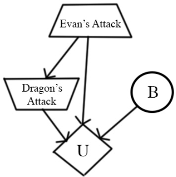

| Evan(E) | Dragon(D) | B | U(E, D, B) |
| --- | --- | --- | --- |
| f | t | +b | -30 |
| f | t | -b | 40 |
| f | c | +b | -20 |
| f | c | -b | 30 |
| a | t | +b | -50 |
| a | t | -b | -20 |
| a | c | +b | -10 |
| a | c | -b | 80 |

| B | P(B) |
| --- | --- |
| +b | 0.1 |
| -b | 0.9 |

The trapezoid pointing up symbolizes Evan’s action, who is maximizing his utility. The trapezoid pointing down symbolizes the dragon’s action, who is minimizing the utility.

(i) [2 pts] What is Evan’s expected utility of attacking the dragon’s feet?

(ii) [2 pts] What is Evan’s expected utility of attacking the dragon’s arms?

(iii) [1 pt] Which action is optimal for Evan: attacking the dragon’s feet (f) or the dragon’s arms (a) ? What is the utility of the optimal action?

<!-- page: 7 -->

## (b) The Dungeon

Evan finally defeats the dragon, but the cave starts the crumble. Evan flees from the cave and reconvenes with Teodor. Teodor asks Evan if there was any treasure in the cave. Evan replies that there was a lot of treasure, but that he didn’t bring any back. Before Evan even finishes his sentence, Teodor rushes into the cave to see what treasure he can salvage before the cave collapses.

Teodor pulls out the treasure map of the cave, shown below. There are 6 treasures, and the location of each is marked with a number, which represents the utility of getting that treasure. Upon moving into a treasure square, Teodor immediately picks it up. Each treasure can only be picked up once. The square labeled T marks Teodor’s starting location. Assume there is no discounting $( \gamma   =   1 )$ , and there is no time penalty. Teodor may only take one of the actions (North, South, East, West) and all actions are deterministic. To survive, Teodor must get back to his starting location by the stated maximum number of timesteps left (e.g. if two timesteps are left, Teodor has time only to move one cell and come right back). If he fails to get back to his starting location, his utility is −∞. The game ends when (1) Teodor makes it back to his starting location or (2) the maximum number of timesteps has passed.

The map also indicates that a boulder could be present in the squares marked with the letter B in the map. The presence of a boulder means you cannot move onto the boulder square. Teodor doesn’t know if the boulder is actually in the maze or not; he observes whether it is present or not if he moves to a square adjacent to the boulder (B) The boulder is present with probability 0.5.

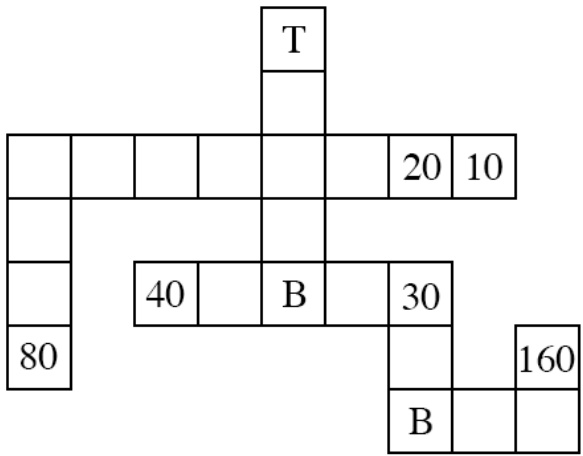

Teodor wants to maximize the sum of utilities gained. Let $S _ { K }$ be the starting state for Teodor when he has just entered at position T and there are K timesteps left. For each scenario, calculate the optimal $V ^ { * } ( S _ { K } )$ values.

(i) $[ 1 ~ \mathrm { p t } ] ~ V ^ { * } ( S _ { 9 } ) =$

(ii) [2 pts] $V ^ { * } ( S _ { 1 3 } ) =$

(iii) [2 pts] $V ^ { * } ( S _ { \infty } ) =$

(iv) [6 pts] In a M x N grid with B potential boulders and X treasure locations, write an expression for the minimum state space size in terms of M, N, B, and X. (For example, you could write MNBX.) For each factor, briefly note what it corresponds to.

<!-- page: 8 -->

## Q4. [12 pts] Exponential Utilities

(a) The ghosts offer Pacman a deal: upon rolling a fair 6-sided die, they will give Pacman a reward equal to the number shown on the die minus a fee x, so he could win $1 - x , 2 - x , 3 - x , 4 - x , 5 - x$ or 6 − x with equal probability. Pacman can also refuse to play the game, getting 0 as a reward.

(i) [1 pt] Assume Pacman’s utility is $U ( r ) = r$ . Pacman should accept to play the game if and only if: O $x \leq 7 / 6$ O $x \leq 7 / 2$ O $x \leq 2 1 / 2$ O $x \leq 2 1$

(ii) [1 pt] Assume Pacman’s utility is $U ^ { \prime } ( r ) = 2 ^ { r }$ . Pacman should accept to play the game if and only if: $\bigcirc \ x \leq \log _ { 2 } ( 7 / 2 )$ O $x \leq \log _ { 2 } ( 2 0 )$ O $x \leq \log _ { 2 } ( 2 1 )$ O $x \leq 2 1$

(b) For the following question assume that the ghosts have set the price of the game at $x = 4 .$ The fortune-teller from the past midterm is able to accurately predict whether the die roll will be even (2, 4, 6) or odd (1, 3, 5). (i) [3 pts] Assume Pacman’s utility is $U ( r ) = r .$ . The VPI (value of perfect information) of the prediction is: 116 78 1  74

(ii) [3 pts] Assume Pacman’s utility is $U ^ { \prime } ( r ) = 2 ^ { r }$ . The VPI of the prediction is: ○0 C 116 C 78 ○1 O 74

(c) [4 pts] For simplicity the following question concerns only Markov Decision Processes (MDPs) with no discounting $( \gamma = 1 )$ and parameters set up such that the total reward is always finite. Let J be the total reward obtained in the MDP:

$$
J = \sum_ {t = 1} ^ {\infty} r (S _ {t}, A _ {t}, S _ {t + 1}).
$$

The utility we’ve been using implicitly for MDPs with no discounting is $U ( J ) \; = \; J .$ The value function $V ( s )$ is equal to the maximum expected utility $E [ U ( J ) ] = E [ J ]$ if the start state is s, and it obeys the Bellman equation seen in lecture:

$$
V ^ {*} (s) = \max _ {a} \sum_ {s ^ {\prime}} T (s, a, s ^ {\prime}) (r (s, a, s ^ {\prime}) + V ^ {*} (s ^ {\prime})).
$$

Now consider using the exponential utility $U ^ { \prime } ( J )   =   2 ^ { J }$ for MDPs. Write down the corresponding Bellman equation for $W ^ { * } ( s )$ , the maximum expected exponential utility $E[U^{\prime}(J)] = E[2^{J}]$ if the start state is s.

$W ^ { * } ( s ) = \operatorname* { m a x } _ { a }$ W ∗( s0)

<!-- page: 9 -->

## Q5. [14 pts] Instantiated Elimination

(a) Difficulty of Elimination. Consider answering $P ( H \mid + f )$ by variable elimination in the Bayes’ nets N and $N ^ { \prime }$ Elimination order is alphabetical. All variables are binary +/−. Factor size is the number of unobserved variables in a factor made during elimination.

(i) $[ 2 ~ \mathrm { p t s } ]$ What is the size of the largest factor made during variable elimination for N?

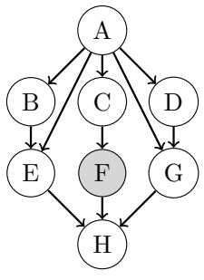

(ii) [2 pts] What is the size of the largest factor made during variable elimination for $N ^ { \prime } ?$

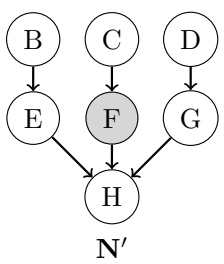

Variable elimination in N can take a lot of work! If only A were observed. . .

(b) Instantiation Sets. To simplify variable elimination in N, let’s pick an instantiation set to pretend to observe, and then do variable elimination with these additional instantiations.

Consider the original query $P ( H \mid + f )$ , but let A be the instantiation set so $A = a$ is observed. Now the query is H with observations $F = + f , A = a$

(i) [2 pts] What is the size of the largest factor made during variable elimination with the A = a instantiation?

(ii) [1 pt] Given a Bayes’ net over n binary variables with k variables chosen for the instantiation set, how many instantiations of the set are there?

(c) Inference by Instantiation. Let’s answer $P ( H | + f )$ by variable elimination with the instantiations of A.

(i) $[ 2 ~ \mathrm { p t s } ]$ What quantity does variable elimination for $P ( H | + f )$ with the $A = + a$ instantiation compute without normalization? That is, which choices are equal to the entries of the last factor made by elimination? O $P ( H \mid + f )$ O $P ( H , + a , + f )$ O $P(H, +f \mid +a)$ O $P ( H \mid + a )$ O $P(H, +a \mid +f)$ O $P ( H \mid + a , + f )$

(ii) [2 pts] Let $I _ { + } ( H ) \: = \: F ( H , + a , + f )$ and $I _ { - } ( H )   =   F ( H , - a , + f )$ be the last factors made by variable elimination with instantiations $A = + a$ and $A = - a$ . Which choices are equal to $p(+h \mid +f)?$ O $I _ { + } ( + h ) \cdot p ( + a ) \cdot I _ { - } ( + h ) \cdot p ( - a )$ O $\textstyle \frac { I _ { + } ( + h ) \cdot p ( + a ) \cdot I _ { - } ( + h ) \cdot p ( - a ) } { \sum _ { h } I _ { + } ( h ) \cdot p ( + a ) \cdot I _ { - } ( h ) \cdot p ( - a ) }$ O $I _ { + } ( + h ) \cdot p ( + a ) + I _ { - } ( + h ) \cdot p ( - a )$ O $\begin{array} { c } { \frac { I _ { + } ( + h ) \cdot p ( + a ) + I _ { - } ( + h ) \cdot p ( - a ) } { \sum _ { h } I _ { + } ( h ) \cdot p ( + a ) + I _ { - } ( h ) \cdot p ( - a ) } } \\ \end{array}$ O $I _ { + } ( + h ) + I _ { - } ( + h )$ O $\begin{array} { l } { \frac { I _ { + } ( + h ) + I _ { - } ( + h ) } { \sum _ { h } I _ { + } ( h ) + I _ { - } ( h ) } } \\ \end{array}$

(d) [3 pts] Complexity of Instantiation. What is the time complexity of instantiated elimination? Let $n =$ number of variables, k = instantiation set size, $f   =   \mathrm { s i z e }$ of the largest factor made by elimination without instantiation, and i = size of the largest factor made by elimination with instantiation. Mark the tightest bound. Variable elimination without instantiation is $O ( n \exp ( f ) )$ . O $O ( n \exp ( k ) )$ O $O ( n \exp ( i ) )$ O $O ( n \exp ( i + k ) )$ O $O ( n \exp ( f ) )$ O $O ( n \exp ( f - k ) )$ O $O ( n \exp ( i / f ) )$

<!-- page: 10 -->

D1

## Q6. [12 pts] Bayes’ Net Representation

(a) [4 pts] Consider the joint probability table on the right.

Clearly fill in all circles corresponding to BNs that can correctly represent the distribution on the right. If no such BNs are given, clearly select None of the above.

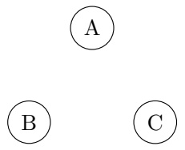

G1

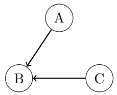

O G2

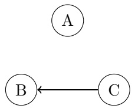

G3

| A | B | C | P(A,B,C) |
| --- | --- | --- | --- |
| 0 | 0 | 0 | .15 |
| 0 | 0 | 1 | .1 |
| 0 | 1 | 0 | 0 |
| 0 | 1 | 1 | .25 |
| 1 | 0 | 0 | .15 |
| 1 | 0 | 1 | .1 |
| 1 | 1 | 0 | 0 |
| 1 | 1 | 1 | .25 |

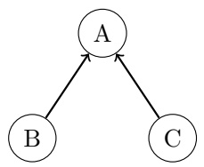

$\mathbf { G _ { 4 } }$

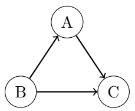

O G5

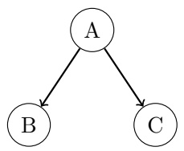

$\mathbf { G _ { 6 } }$

None of the above.

(b) [4 pts] You are working with a distribution over A, B, C, D that can be fully represented by just three probability tables: $P(A \mid D),   P(C \mid B)$ , and $P ( B , D )$ . Clearly fill in the circles of those BNs that can correctly represent this distribution. If no such BNs are given, clearly select None of the above.

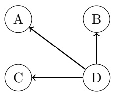

$\mathbf { G _ { 1 } }$

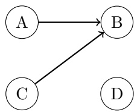

O G2

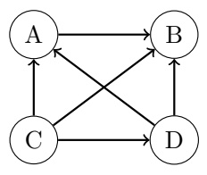

O G3

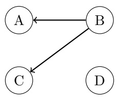

$\mathbf { G _ { 4 } }$

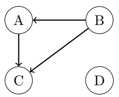

$\mathbf { G _ { 5 } }$

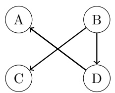

$\mathbf { G _ { 6 } }$

None of the above.

(c) [4 pts] We are dealing with two probability distributions over N variables, where each variable can take on exactly d values. The distributions are represented by the two Bayes’ Nets shown below. If S is the amount of storage required for the CPTs for $X _ { 2 } , \ldots , X _ { N }$ in $D _ { 1 }$ , how much storage is required for the CPTs for $X _ { 2 } , \ldots , X _ { N }$ in $D _ { 2 } ?$ There is a correct answer among the options.

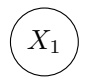

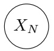

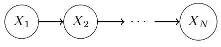

$2 ^ { S }$

D2

Sd

$$
S ^ {2}
$$

$S ^ { d }$

$$
S + 2 ^ {d}
$$

<!-- page: 11 -->

## Q7. [14 pts] Finding Waldo

You are part of the CS 188 Search Team to find Waldo. Waldo randomly moves around floors A, B, C, and D. Waldo’s location at time t is $X _ { t }$ . At the end of each timestep, Waldo stays on the same floor with probability 0.5, goes upstairs with probability 0.3, and goes downstairs with probability 0.2. If Waldo is on floor A, he goes down with probability 0.2 and stays put with probability 0.8. If Waldo is on floor D, he goes upstairs with probability 0.3 and stays put with probability 0.7.

| X0 | P(X0) |
| --- | --- |
| A | 0.1 |
| B | 0.2 |
| C | 0.3 |
| D | 0.4 |

(a) [2 pts] Fill in the table below with the distribution of Waldo’s location at time t = 1.

| Xt | P(X1) |
| --- | --- |
| A |  |
| B |  |
| C |  |
| D |  |

(b) [3 pts] $F _ { T } ( X )$ is the fraction of timesteps Waldo spends at position X from $t = 0 \mathrm { t o } t = T$ . The system of equations to solve for $F _ { \infty } ( A ) ,   F _ { \infty } ( B ) ,   F _ { \infty } ( C )$ , and $F _ { \infty } ( D )$ is below. Fill in the blanks. Note: You may or may not use all equations.

$$
\begin{array}{l} \_ F _ {\infty} (A) + \_ F _ {\infty} (B) + \_ F _ {\infty} (C) + \_ F _ {\infty} (D) = \_ \\ \_ F _ {\infty} (A) + \_ F _ {\infty} (B) + \_ F _ {\infty} (C) + \_ F _ {\infty} (D) = \_ \\ \_ F _ {\infty} (A) + \_ F _ {\infty} (B) + \_ F _ {\infty} (C) + \_ F _ {\infty} (D) = \\ \_ F _ {\infty} (A) + \_ F _ {\infty} (B) + \_ F _ {\infty} (C) + \_ F _ {\infty} (D) = \_ \\ \_ F _ {\infty} (A) + \_ F _ {\infty} (B) + \_ F _ {\infty} (C) + \_ F _ {\infty} (D) \\ \_ F _ {\infty} (A) + \_ F _ {\infty} (B) + \_ F _ {\infty} (C) + \_ F _ {\infty} (D) = \end{array}
$$

<!-- page: 12 -->

To aid the search a sensor $S _ { r }$ is installed on the roof and a sensor $S _ { b }$ is installed in the basement. Both sensors detect either sound $( + s )$ or no sound (−s). The distribution of sensor measurements is determined by $d ,$ the number of floors between Waldo and the sensor. For example, if Waldo is on floor B, then $d _ { b } = 2$ because there are two floors (C and D) between floor B and the basement and $d _ { r } = 1$ because there is one floor $( \mathrm { A } )$ between floor B and the roof. The prior of the both sensors’ outputs are identical and listed below. Waldo will not go onto the roof or into the basement.

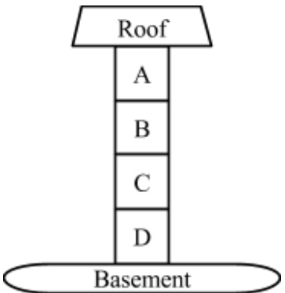

| X0 | P(X0) |
| --- | --- |
| A | 0.1 |
| B | 0.2 |
| C | 0.3 |
| D | 0.4 |

| Sr | P(Sr\|dr) | Sb | P(Sb\|db) |
| --- | --- | --- | --- |
| +s | 0.3 ∗ dr | +s | 1 - 0.3 ∗ db |
| -s | 1 - 0.3 ∗ dr | -s | 0.3 ∗ db |

| S | P(S) |
| --- | --- |
| +s | 0.5 |
| -s | 0.5 |

(c) [2 pts] You decide to track Waldo by particle filtering with 3 particles. At time $t   =   2 ,$ the particles are at positions $X_{1} = A, X_{2} = B$ and $X _ { 3 }   =   C$ Without incorporating any sensory information, what is the probability that the particles will be resampled as $X_{1} = B,   X_{2} = B$ , and $X _ { 3 } = C$ , after time elapse?

(d) To decouple this from the previous question, assume the particles after time elapsing are $X_{1} = B, X_{2} = C$ $X _ { 3 } = D$ , and the sensors observe $S _ { r } = + s$ and $S _ { b } = - s$

(i) [2 pts] What are the particle weights given these observations?

| Particle | Weight |
| --- | --- |
| X1 = B |  |
| X2 = C |  |
| X3 = D |  |

(ii) [2 pts] To decouple this from the previous question, assume the particle weights in the following table. What is the probability the particles will be resampled as $X_{1} = B,   X_{2} = B,$ , and $X _ { 3 } = D ?$

| Particle | Weight |
| --- | --- |
| X = B | 0.1 |
| X = C | 0.6 |
| X = D | 0.3 |

<!-- page: 13 -->

(e) [3 pts] Note: the r and b subscripts from before will be written here as superscripts.

Part of the expression for the forward algorithm update for Hidden Markov Models is given below. $s _ { 0 : t } ^ { r }$ are all the measurements from the roof sensor $s _ { 0 } ^ { r } , s _ { 1 } ^ { r } , s _ { 2 } ^ { r } , \ldots , s _ { t } ^ { r } . s _ { 0 : t } ^ { b }$ are all the measurements from the roof sensor $s _ { 0 } ^ { b } , s _ { 1 } ^ { b } , s _ { 2 } ^ { b } , \ldots , s _ { t } ^ { b } .$

Which of the following are correct completions of line (4)? Circle all that apply.

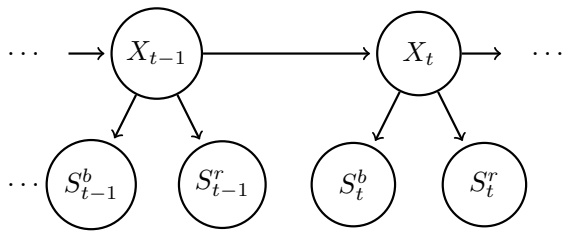

$$
P (x _ {t} | s _ {0: t} ^ {r}, s _ {0: t} ^ {b}) \propto P (x _ {t}, s _ {0: t} ^ {r}, s _ {0: t} ^ {b})\tag{1}
$$

$$
= \sum_ {x _ {t - 1}} P (x _ {t - 1}, x _ {t}, s _ {0: t} ^ {r}, s _ {0: t} ^ {b})\tag{2}
$$

$$
= \sum_ {x _ {t - 1}} P (x _ {t - 1}, x _ {t}, s _ {0: t - 1} ^ {r}, s _ {t} ^ {r}, s _ {0: t - 1} ^ {b}, s _ {t} ^ {b})\tag{3}
$$

$$
= \sum_ {x _ {t - 1}} \underline {{\quad}} P (x _ {t} | x _ {t - 1}) P (x _ {t - 1}, s _ {0: t - 1} ^ {r}, s _ {0: t - 1} ^ {b})\tag{4}
$$

$$
\bigcirc P (s _ {t} ^ {r}, s _ {t} ^ {b} | x _ {t - 1}, x _ {t}, s _ {0: t - 1} ^ {r}, s _ {0: t - 1} ^ {b})
$$

$$
\bigcirc P (s _ {t} ^ {r} | x _ {t}) P (s _ {t} ^ {b} | x _ {t})
$$

$$
\bigcirc P (s _ {t} ^ {r} | x _ {t - 1}) P (s _ {t} ^ {b} | x _ {t - 1})
$$

$$
\bigcirc P (s _ {t} ^ {r} | s _ {t - 1} ^ {r}) P (s _ {t} ^ {b} | s _ {t - 1} ^ {b})
$$

P(srt , sbt |xt)

$$
\bigcirc P (s _ {t} ^ {r}, s _ {t} ^ {b} | x _ {t}, x _ {t - 1})
$$

None of the above.

<!-- page: 14 -->

## Q8. [12 pts] Neural Logic

For the following questions, mark ALL neural networks that can compute the same function as the boolean expression. If none of the neural nets can do this, mark None. Booleans will take values 0, 1, and each perceptron will output values 0, 1. You may assume that each perceptron also has as input a bias feature that always takes the value 1. It may help to write out the truth table for each expression. Note that $\mathrm { X } \Rightarrow \mathrm { Y }$ is equivalent to (NOT X) OR Y.

(1)

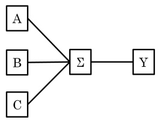

(2)

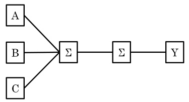

(3)

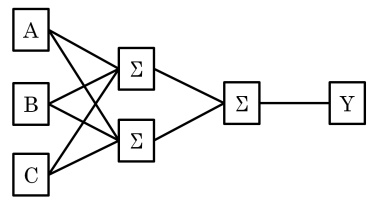

(4)

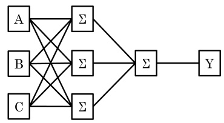

(a) [2 pts] A 1 2 3 4 None

(b) [2 pts] A OR B 1 2 3 4 None

(c) [2 pts] B XOR C 1 2 3 4 None

(d) [2 pts] (A XOR B) XOR C 1 2 3 4 None

(e) [2 pts] (¬A AND ¬B AND ¬C) OR (A AND B AND C) 1 2 3 4 None

(f) [2 pts] (A ⇒ B) ⇒ C 1 2 3 4 None

<!-- page: 15 -->

## Q9. [16 pts] Spam Classification

The Na¨ıve Bayes model has been famously used for classifying spam. We will use it in the “bag-of-words” model:

• Each email has binary label Y which takes values in {spam, ham}.

• Each word w of an email, no matter where in the email it occurs, is assumed to have probability $P ( W = w \mid Y )$ where W takes on words in a pre-determined dictionary. Punctuation is ignored.

• Take an email with K words $w _ { 1 } , \ldots , w _ { K }$ . For instance: email “hi hi you” has $w _ { 1 } = \mathrm { h i } , w _ { 2 } = \mathrm { h i } , w _ { 3 } = \mathrm { y o u } .$ Its label is given by arg max $P ( Y = y \mid w _ { 1 } , \ldots , w _ { K } ) = \operatorname * { a r g \operatorname* { m a x } } _ { \mathbf { \mathbf { \mathbf { \mathbf { \mathbf { \mathbf { \mathbf { \mathbf { \mathbf { \mathbf { \mathbf { \mathbf { \mathbf { \mathbf { \mathbf { \mathbf { \mathbf { \mathbf { \mathbf { \mathbf { \mathbf { \mathbf { } } { } } } } } } } } } } } } } } } } } } } \mathbf { \mathbf { \mathbf { \mathbf { \mathbf { \mathbf { \mathbf { \mathbf { \mathbf { \mathbf { \mathbf { \mathbf { \mathbf { \mathbf { { \mathbf { \mathbf { \mathbf { \mathbf { \mathbf { \mathbf { \mathbf { \mathbf { \mathbf { \mathbf { \mathbf { \mathbf { \mathbf { \mathbf { \mathbf { \mathbf { } } } { } } } } } } } } } } } } } } } } } } } } } } } } } } } } } P ( W = w _ { i } \mid Y = y )$ y y

(a) [3 pts] You are in possession of a bag of words spam classifier trained on a large corpus of emails. Below is a table of some estimated word probabilities.

| W | note | to | self | become | perfect |
| --- | --- | --- | --- | --- | --- |
| P(W \| Y = spam) | 1/6 | 1/8 | 1/4 | 1/4 | 1/8 |
| P(W \| Y = ham) | 1/8 | 1/3 | 1/4 | 1/12 | 1/12 |

You are given a new email to classify, with only two words:

perfect note

Fill in the circles corresponding to all values of $P ( Y   =   \mathrm { s p a m } )$ for which the bag of words with these word probabilities will give “spam” as the most likely label.

$$
\begin{array}{c c} \bigcirc & 0 \\ \bigcirc & 0. 2 \end{array}
$$

$$
\begin{array}{c c} \bigcirc & 0. 4 \\ \bigcirc & 0. 6 \end{array}
$$

(b) [4 pts] You are given only three emails as a training set:

(Spam) dear sir, I write to you in hope of recovering my gold watch.

(Ham) hey, lunch at 12?

(Ham) fine, watch it tomorrow night.

Fill in the circles corresponding to values you would estimate for the given probabilities, if you were doing no smoothing.

$$
\begin{array}{l} P (W = \text {sir} \mid Y = \text {spam}) \\ P (W = \text {watch} \mid Y = \text {ham}) \\ P (W = \text {gauntlet} \mid Y = \text {ham}) \\ P (Y = \text {ham}) \end{array}
$$

(c) [3 pts] You are training with the same emails as in the previous question, but now doing Laplace Smoothing with k = 2. There are V words in the dictionary. Write concise expressions for:

$$
P (W = \mathbf {s i r} \mid Y = \mathbf {s p a m})
$$

$$
P (W = \textbf {w a t c h} \mid Y = \textbf {h a m})
$$

$$
P (Y = \mathbf {h a m})
$$

<!-- page: 16 -->

(d) [2 pts] On the held-out set, you see the following accuracies for different values of k:

| k | 0 | 1 | 2 | 10 |
| --- | --- | --- | --- | --- |
| accuracy | 0.65 | 0.68 | 0.74 | 0.6 |

On the training set, the accuracy for k = 0 is 0.8. Fill in the circle of all plausible accuracies for k = 10 on the training set. 0.1 0.99 0.7 None of the above

## (e) Becoming less na¨ıve

We are now going to improve the representational capacity of the model. Presence of word $w _ { i }$ will be modeled not by $P ( W = w _ { i } \mid Y )$ , where it is only dependent on the label, but by $P ( W = w _ { i } \mid Y , W _ { i - 1 } )$ , where it is also dependent on the previous word. The corresponding model for an email of only four words is given on the right.

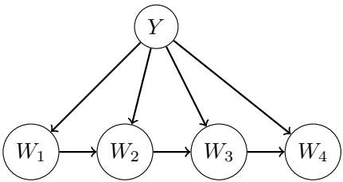

(i) [2 pts] With a vocabulary consisting of V words, what is the minimal number of conditional word probabilities that need to be estimated for this model? The correct answer is among the choices. OV O $V ^ { 2 }$ O $2 ^ { V }$ 2V O $2 V ^ { 2 }$ O $2 ^ { 2 V }$

(ii) [2 pts] Select all expected effects of using the new model instead of the old one, if both are trained with a very large set of emails (equal number of spam and ham examples).

The entropy of the posterior $P ( Y | W )$ should on average be lower with the new model. (In other words, the model will tend to be more confident in its answers.)

The accuracy on the training data should be higher with the new model.

The accuracy on the held-out data should be higher with the new model.

None of the above.
