<!-- page: 1 -->

## Introduction to Artificial Intelligence

• You have approximately 2 hours and 50 minutes.

• The exam is closed book, closed notes except your one-page crib sheet.

• Please use non-programmable calculators only.

• Mark your answers ON THE EXAM ITSELF. If you are not sure of your answer you may wish to provide a brief explanation. All short answer sections can be successfully answered in a few sentences AT MOST.

<table><tr><td>First name</td><td></td></tr><tr><td>Last name</td><td></td></tr><tr><td>SID</td><td></td></tr><tr><td>edX username</td><td></td></tr><tr><td colspan="2"></td></tr><tr><td>First and last name of student to your left</td><td></td></tr><tr><td>First and last name of student to your right</td><td></td></tr></table>

For staff use only:

| Q1. An Incredibly Difficult Question | /1 |
| --- | --- |
| Q2. Short Answer | /23 |
| Q3. Dragons and Dungeons | /16 |
| Q4. Exponential Utilities | /12 |
| Q5. Instantiated Elimination | /14 |
| Q6. Bayes' Net Representation | /12 |
| Q7. Finding Waldo | /14 |
| Q8. Neural Logic | /12 |
| Q9. Spam Classification | /16 |
| Total | /120 |

<!-- page: 2 -->

<!-- page: 3 -->

Q1. [1 pt] An Incredibly Difficult Question

Circle the CS188 mascot.

<!-- page: 4 -->

## Q2. [23 pts] Short Answer

(a) [3 pts] You have a pile of P potatoes to eat and B potato-eating bots. At any time, each bot is either a chopper or a devourer ; all begin as choppers. In a given time step, a chopper can chop, idle, or transform. If it chops, it will turn 1 potato into a pile of fries. If it is idle, it will do nothing. If it transforms, it will do nothing that time step but it will be a devourer in the next time step. Devourers are hive-like and can only devour or transform. When D devourers devour, they will consume exactly $D ^ { 2 }$ piles of fries that time step – but only if at least that many piles exist. If there are fewer piles, nothing will be devoured. If a devourer transforms, it will do nothing that time step but will be a chopper in the next one. The goal is to have no potatoes or fries left. Describe a minimal state space representation for this search problem. You must write down a size expression in terms of the number of potatoes P, the number of total bots B, the number of fries $F ,$ the number of time steps elapsed $T ,$ and any other quantities you wish to name. For example, you might write $P ^ { B } + T$ . You may wish to briefly explain what each factor in your answer represents.

State space size: $\boxed{P^{2} \cdot B  OR  P \cdot F \cdot B}$

$P ^ { 2 }$ or P · F is need to represent the number of potatoes and fries. It is not sufficient to represent only the number of potatoes remaining, since the devourers can only eat $D ^ { 2 }$ piles of fries, so number of fries remaining needs to be represented too. B is sufficient to represent the state of the bots because every bot is either a chopper or devourer, their total number is fixed, and only the number of choppers and the number of devourers are relevant to the problem. The individual bot roles do not matter; only the number of each since any chopper can chop and the D devourers devour together.

(b) [4 pts] Consider a 3D maze, represented as an $( N + 1 ) \times ( N + 1 ) \times ( N + 1 )$ cube of $1 \times 1 \times 1$ cells with some cells empty and some cells blocked (i.e. walls). From every cell it is possible to move to any adjacent facing cell (no corner movement). The cells are identified by triples $( i , j , k )$ . The start state is (0, 0, 0) and the goal test is satisfied only by (N, N, N). Let $L _ { i j }$ be the loose projection of the cube onto the first two coordinates, where the projected state (i, j) is a wall if $( i , j , k )$ is a wall for all k. Let $T _ { i j }$ be the tight projection of the cube onto the first two coordinates, where the projected state $( i , j )$ is a wall if $( i , j , k )$ is a wall for any k. The projections are similarly defined for $L _ { i k }$ and so on.

Distance is the <u>maze</u> distance. If all paths to the goal are blocked, the distance $\mathrm { i s } + \infty$

Mark each admissible heuristic below.

An heuristic h is admissible if it never overestimates the true cost $h ^ { * }$ , that is, $h \leq h ^ { * }$ for all nodes.

For $( i , j , k )$ , the value $3 N - i - j - k$

$3 ( N + 1 ) - i - j - k$ is the true length of the path from $( i , j , k )$ to the goal. It is the sum of the distance for each dimension, since movement is only possible in straight lines to facing cells.

O For $( i , j , k )$ , the value $N ^ { 3 } - i j k .$

This is an overestimate. Verify for $N = 4 .$

For $( i , j , k )$ , the distance from (i, j) to the goal in $L _ { i j }$

The distance to the goal in the projected plane is less than or equal to the distance in 3D. The blocked cells in the plane are those blocked across all of dimension $k ,$ and so no further blocks are introduced to lengthen the path.

For $( i , j , k )$ , the distance from $( i , j )$ to the goal in $T _ { i j }$

The tight projection blocks a cell in the plane if any cell across dimension k at $( i , j )$ is blocked. In this way it can disconnect the start and goal states, yielding distance +∞, and overestimating the true cost.

For $( i , j , k )$ , the distance from $( i , j )$ to the goal in $L _ { i j }$ plus the distance from (i, k) to the goal in $L _ { i k }$ plus the distance from $( j , k )$ to the goal in $L _ { j k }$

Although the loose projection distance on a particular plane is admissible, the sum of projected distances overcounts the length of the path since the distance in dimensions i and k both appear twice.

$\bigcirc$ For $( i , j , k )$ , the distance from $( i , j )$ to the goal in $T _ { i j }$ plus the distance from $( i , k )$ to the goal in $T _ { i k }$ plus the distance from $( j , k )$ to the goal in $T _ { j k }$ .

The tight projection distance on a particular plane is not admissible, so the sum is not admissible.

<!-- page: 5 -->

(c) The cube is back! Consider an $( N + 1 ) \times ( N + 1 ) \times ( N + 1 )$ gridworld. Luckily, all the cells are empty – there are no walls within the cube. For each cell, there is an action for each adjacent facing open cell (no corner movement), as well as an action stay. The actions all move into the corresponding cell with probability p but stay with probability $1 - p .$ . Stay always stays. The reward is always zero except when you enter the goal cell at $( N , N , N )$ , in which case it is 1 and the game then ends. The discount is $0 < \gamma < 1$

(i) [2 pts] How many iterations k of value iteration will there be before $V _ { k } ( 0 , 0 , 0 )$ becomes non-zero? If this will never happen, write never.

3N. At $V _ { 0 }$ the value of the goal is correct. At $V _ { 1 }$ all cells next to the goal are non-zero, at $V _ { 2 }$ all cells next to those are nonzero, and so on.

(ii) [2 pts] If and when $V _ { k } ( 0 , 0 , 0 )$ first becomes non-zero, what will it become? If this will never happen, write never.

$( \gamma p ) ^ { 3 N } / \gamma$ . The value update of a cell c in this problem is $V ^ { \prime } ( c ) = p ( r _ { c ^ { \prime } } + \gamma V ( c ^ { \prime } ) ) + ( 1 - p ) V ( c )$ . The first time the value of a state becomes non-zero, the value is $V ^ { \prime } ( c ) = p ( r _ { c ^ { \prime } } + \gamma V ( c ^ { \prime } ) )$ .

$$
\begin{array}{l} V ^ {\prime} (g) = p (1 + \gamma V (g o a l) = p \\ V ^ {\prime} (c) = p \gamma V (c ^ {\prime}) \end{array}
$$

for a cell g adjacent to the goal.

for other cells since the reward is 0.

Carrying out the value recursion, the goal reward +1 is multiplied by $p$ for the step to the goal and $p \gamma$ for each further step. The number of steps from the start to the goal is 3N, the Manhattan distance in the cube. The first non-zero $V ( 0 , 0 , 0 )$ is $( \gamma p ) ^ { 3 \bar { N } } / \gamma$ since every step multiplies in $p \gamma$ except the last step to the goal, which multiplies in p. Equivalently, the first non-zero value is $\tilde { p ( \gamma p ) ^ { 3 N - 1 } }$ with $\dot { ( \gamma p ) ^ { 3 N - 1 } }$ for all the steps from the start to a cell adjacent to the goal and $p$ for the transition to the goal.

(iii) [2 pts] What is $V ^ { * } ( 0 , 0 , 0 ) ?$ If it is undefined, write undefined.

$$
\frac {1}{\gamma} \left(\frac {\gamma p}{1 - \gamma + \gamma p}\right) ^ {3 N}
$$

To see why, let $V ^ { * } ( d )$ be the value function of states whose Manhattan distance from the goal is d. By symmetry, all states with the same Manahttan distance from the goal will have the same value. Write the Bellman equations:

$$
\begin{array}{l} V ^ {*} (d) = \gamma (1 - p) V ^ {*} (d) + \gamma p V ^ {*} (d - 1) \qquad \text {for all} d > 1 \\ V ^ {*} (1) = p + \gamma (1 - p) V ^ {*} (1) + \gamma p V ^ {*} (0) \\ V ^ {*} (0) = \gamma V ^ {*} (0) \end{array}
$$

and solve starting with $V ^ { * } ( 0 ) = 0$ to get the answer.

<!-- page: 6 -->

(d) The cube is still here! (It’s also still empty.) Now the reward depends on the cell being entered. The goal cell is not special in any way. The reward for staying in a cell (either intentionally or through action failure) is always 0. Let Vk be the value function computed after k iterations of the value iteration algorithm. Recall that V0 is defined to be 0 for all states. For each statement, circle the subset of rewards (if any) for which the statement holds.

(i) [2 pts] As the number of iterations k of value iteration increases, Vk(s) cannot decrease when all cell-entry rewards:

are in the interval [0, 1]

are in the interval [−1, 1]

For zero, the value of every state is constant and zero. For [0, 1], the value can only stay zero or increase. For [−1, 1], this case is identical to [0, 1] except that if the reward to enter a neighboring cell is negative, the stay action will be chosen and the value of the cell will stay zero.

(ii) [2 pts] The optimal policy can involve the stay action for some states when all cell-entry rewards:

are zero are in the interval [0, 1] are in the interval [−1, 1] It is possible for stay to be part of an optimal policy in all three cases. “Can involve” means there exists a set of rewards in the given interval for which there exists an optimal policy that includes the stay action for a state. For all rewards zero, any policy is optimal. For [0, 1] rewards, stay is likewise optimal if the rewards are zero. For [−1, 1] rewards, stay is optimal if rewards are negative (since stay has reward zero) and is optimal if rewards are zero as in the other cases.

(e) F-learning is a forgetful alternative to Q-learning. Where Q-learning tracks Q-values, F-learning tracks F-values. After experiencing an episode (s, a, r, s0), F-learning does the following update:

$$
F (s, a) = r + \gamma \max _ {a ^ {\prime}} F (s ^ {\prime}, a ^ {\prime})
$$

As in Q-learning, All F-values are initialized to 0. Assume all states and actions are experienced infinitely often under a fixed, non-optimal policy π that suffices for Q-learning’s convergence and optimality. Note that π will in general be stochastic in the sense that for each state s, π(s) gives a distribution over actions that are then randomly chosen between.

F-learning is equivalent to Q-learning with learning rate α = 1.

For each claim, mark the classes of MDPs for which it is true:

(i) [2 pts] F-learning converges to some fixed values: for deterministic state transitions for stochastic state transitions never whenever Q-learning converges

(ii) [2 pts] F-learning converges to the optimal Q-values: for deterministic state transitions for stochastic state transitions C never whenever Q-learning converges

(iii) [2 pts] F-learning converges to the Q-values of the policy π: for deterministic state transitions for stochastic state transitions O never whenever Q-learning converges

In deterministic MDPs, Q-learning always converges with the usual assumption of all state-actions being experienced infinitely often, and it converges to the optimal values. Learning rate α = 1 is actually optimally efficient for the deterministic setting in the sense that Q-learning will converge in the fewest number of steps.

<!-- page: 7 -->

In stochastic MDPs, Q-learning converges when the learning rate is appropriately reduced to 0. F-learning however does not converge: the value is updated to the most recent sample at each step, and so it changes whenever a different transition and reward are experienced.

The policy π is a stochastic policy, so the transitions under this policy. This is true even if the MDP itself is deterministic, since the same action is not necessarily taken in the same state. F-learning never converges in this case since the F-value is updated to the most recent sample each time.

<!-- page: 8 -->

## Q3. [16 pts] Dragons and Dungeons

Note: You may tackle part (a) and part (b) independently.

## (a) The Dragon

In a world far away, there live two great adventurers: Evan and Teodor. One day, they stumble across a dark cave. Full of excitement, Evan tells Teodor to wait by the entrance as he rushes into the entrance of the cave. Evan stumbles around in the darkness for a while until he reaches a grand chamber, filled with piles of gold. Suddenly, Evan hears a load roar; he looks up, and sees a majestic dragon staring at him, ready for battle.

Evan makes the first move. He has two choices: to attack the dragon at his feet (f), or at his arms (a). The dragon will attack back by either swinging its tail (t), or slashing with its claws (c). Evan’s sword can be broken; this possibility is represented with a known probability distribution at node B. Evan’s sword can either be broken (+b), or not broken (-b), and Evan does not know which one will happen. The dragon assumes that the sword won’t break (-b), and tries to minimize Evan’s utility. The utilities Evan receives for all eight outcomes are shown in the table below.

The decision diagram that models this battle is shown below:

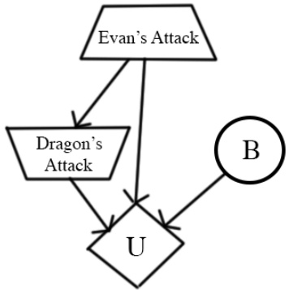

| Evan(E) | Dragon(D) | B | U(E, D, B) |
| --- | --- | --- | --- |
| f | t | +b | -30 |
| f | t | -b | 40 |
| f | c | +b | -20 |
| f | c | -b | 30 |
| a | t | +b | -50 |
| a | t | -b | -20 |
| a | c | +b | -10 |
| a | c | -b | 80 |

| B | P(B) |
| --- | --- |
| +b | 0.1 |
| -b | 0.9 |

The trapezoid pointing up symbolizes Evan’s action, who is maximizing his utility. The trapezoid pointing down symbolizes the dragon’s action, who is minimizing the utility.

(i) [2 pts] What is Evan’s expected utility of attacking the dragon’s feet?

Given that Evan chose to attack the feet, the dragon wants to minimize the utility on the assumption that B=-b. It will calculate the utilities between either attacking with its tail or claws, which is given by: min $\left(  U(E=f, D=t, B=-b), U(E=f, D=c, B=-b)  \right) = \min(40,30) = 30.$

Hence, the dragon will choose to attack with its claws (c) if Evan attacks its feet.

$$
\mathrm{EU(f)} = \mathrm{P(+b)U(E=f, D=c, B=+b)} + \mathrm{P(-b)U(E=f, D=c, B=-b)} = 0. 1 ^ {*} (- 2 0) + 0. 9 ^ {*} (3 0) = 2 5
$$

(ii) [2 pts] What is Evan’s expected utility of attacking the dragon’s arms?

Given that Evan chose to attack the arms, the dragon wants to minimize the utility on the assumption that B=-b. It will calculate the utilities between either attacking with its tail or claws, which is given by: min $.(U(E=a, D=t, B=-b), U(E=a, D=c, B=-b)) = min(-20,80) = -20.$

Hence, the dragon will choose to attack with its tail (t) if Evan attacks its arms.

$$
\mathrm{EU(f)} = \mathrm{P(+b)U(E=a, D=t, B=+b)} + \mathrm{P(-b)U(E=a, D=t, B=-b)} = 0. 1 ^ {*} (- 5 0) + 0. 9 ^ {*} (- 2 0) = - 2 3
$$

(iii) [1 pt] Which action is optimal for Evan: attacking the dragon’s feet (f) or the dragon’s arms (a) ? What is the utility of the optimal action?

The feet. MEU = max(25, -23) = 25.

<!-- page: 9 -->

## (b) The Dungeon

Evan finally defeats the dragon, but the cave starts the crumble. Evan flees from the cave and reconvenes with Teodor. Teodor asks Evan if there was any treasure in the cave. Evan replies that there was a lot of treasure, but that he didn’t bring any back. Before Evan even finishes his sentence, Teodor rushes into the cave to see what treasure he can salvage before the cave collapses.

Teodor pulls out the treasure map of the cave, shown below. There are 6 treasures, and the location of each is marked with a number, which represents the utility of getting that treasure. Upon moving into a treasure square, Teodor immediately picks it up. Each treasure can only be picked up once. The square labeled T marks Teodor’s starting location. Assume there is no discounting $( \gamma   =   1 )$ , and there is no time penalty. Teodor may only take one of the actions (North, South, East, West) and all actions are deterministic. To survive, Teodor must get back to his starting location by the stated maximum number of timesteps left (e.g. if two timesteps are left, Teodor has time only to move one cell and come right back). If he fails to get back to his starting location, his utility is −∞. The game ends when (1) Teodor makes it back to his starting location or (2) the maximum number of timesteps has passed.

The map also indicates that a boulder could be present in the squares marked with the letter B in the map. The presence of a boulder means you cannot move onto the boulder square. Teodor doesn’t know if the boulder is actually in the maze or not; he observes whether it is present or not if he moves to a square adjacent to the boulder (B) The boulder is present with probability 0.5.

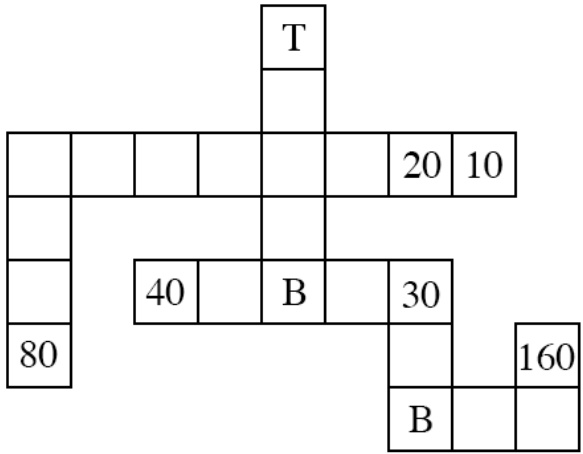

Teodor wants to maximize the sum of utilities gained. Let $S _ { K }$ be the starting state for Teodor when he has just entered at position T and there are K timesteps left. For each scenario, calculate the optimal $V ^ { * } ( S _ { K } )$ values.

(i) [1 pt] $V ^ { * } ( S _ { 9 } ) =$

Grab the 20 reward. Answer: 20.

(ii) [2 pts] $V ^ { * } ( S _ { 1 3 } ) =$

You have enough time to move to the square north of the northmost boulder to see if it’s there. If it’s present (with probability 0.5), you get the reward of 40. If it’s not, you can default to the rewards of 20 and 10. Hence, the utility is the average of 40 and 30, which is 35. Answer: 35.

(iii) [2 pts] $V ^ { * } ( S _ { \infty } ) =$

You get the 20, 10, and 80 rewards no matter what. You get the 40 and 30 rewards half the time, and the 160 reward a quarter of the time, so:

$$
\text {Answer:} = 1 0 + 2 0 + 8 0 + \frac {4 0}{2} + \frac {3 0}{2} + \frac {1 6 0}{4} = 1 1 0 + 2 0 + 1 5 + 4 0 = 1 8 5
$$

(iv) [6 pts] In $\mathrm { ~ a ~ } M \mathrm { ~ x ~ } N$ grid with B potential boulders and X treasure locations, write an expression for the minimum state space size in terms of M, N, B, and X. (For example, you could write MNBX.) For

<!-- page: 10 -->

each factor, briefly note what it corresponds to.

The minimum state space size corresponds to the minimum number of states present in this search problem with Teodor bagging the treasures. We assume that from the setup of the problem, the boulder locations and treasure locations were known.

Answer: $M N 3 ^ { B } 2 ^ { X }$

MN: possible number of positions.

$3 ^ { B } ;$ each boulder is present, not present, or unknown.

$2 ^ { X }$ : for each possible treasure location, whether the treasure was taken or not.

<!-- page: 11 -->

## Q4. [12 pts] Exponential Utilities

(a) The ghosts offer Pacman a deal: upon rolling a fair 6-sided die, they will give Pacman a reward equal to the number shown on the die minus a fee x, so he could win $1 - x , 2 - x , 3 - x , 4 - x , 5 - x$ or 6 − x with equal probability. Pacman can also refuse to play the game, getting 0 as a reward.

(i) [1 pt] Assume Pacman’s utility is $U ( r ) = r .$ . Pacman should accept to play the game if and only if: x ≤ 7/6 x ≤ 7/2 x ≤ 21/2 x ≤ 21 We consider when $E U ( p l a y ) \geq E U ( s t a y )$ EU(stay) = 0. $\widehat { E U ( p l a y ) } = \textstyle \frac { 1 } { 6 } [ ( 1 - x ) + ( 2 - x ) + ( 3 - x ) + ( 4 - x ) + ( 5 - x ) + ( 6 - x ) ]$ 16 (21 − 6x) ≥ 0 when x ≤72 . Answer: $\begin{array} { r } { x \leq \frac { 7 } { 2 } . } \end{array}$

(ii) [1 pt] Assume Pacman’s utility is $U ^ { \prime } ( r ) = 2 ^ { r }$ . Pacman should accept to play the game if and only if: x ≤ log2(7/2) x ≤ log2(20) x ≤ log2(21) x ≤ 21 We consider when $E U ( p l a y ) \geq E U ( s t a y )$ EU(stay) = 20 = 1. $\begin{array} { l } { E U ( \hat { p l a y } ) = \frac { 1 } { 6 } [ 2 ^ { 1 - x } + 2 ^ { 2 - x } + 2 ^ { 3 - x } + 2 ^ { 4 - x } + 2 ^ { 5 - x } + 2 ^ { 6 - x } ] } \\ \end{array}$ So, we consider the inequality (2−x)(21 + 22 + 23 + 24 + 25 + 26) ≥ 1 21(2−x) ≥ 1 (2−x) ≥21 log2(2−x) ≥ − log2(21) −x ≥ − log2(21) x ≤ log2(21)

(b) For the following question assume that the ghosts have set the price of the game at $x = 4 .$ The fortune-teller from the past midterm is able to accurately predict whether the die roll will be even $( 2 , 4 , 6 )$ or odd (1, 3, 5).

(i) [3 pts] Assume Pacman’s utility is $U ( r ) = r .$ . The VPI (value of perfect information) of the prediction is: 0 C 116 78 〇1 O 74

Because $x = 4$ and based on the answer for (ai), Pacman will not play the game and get a reward of 0. Hence, $\mathrm { M E U } ( \emptyset ) = 0$

Now, let’s calculate the MEU for the two predictions. Remember that Pacman has two choices, to play, or to stay (which gives him an utility of 0). Pacman will choose the best option.

MEU(fortune teller predicts $\operatorname { o d d ) } = \operatorname* { m a x } ( 0 , \textstyle \frac { 1 } { 3 } ( ( 1 - 4 ) + ( 3 - 4 ) + ( 5 - 4 ) ) = 0 .$

MEU(fortune teller predicts even) $= \operatorname* { m a x } ( 0 , \textstyle { \frac { 5 } { 3 } } ( ( 2 - 4 ) + ( 4 - 4 ) + ( 6 - 4 ) ) = 0 .$

Hence, VPI(fortune teller prediction) $$) = { \frac { 1 } { 2 } }$ $\mathrm { M \ddot { E } U ( o d d ) }$ + $\frac { 1 } { 2 }$ MED(even) - MED($\emptyset ) = 0$$

(ii) [3 pts] Assume Pacman’s utility is $U ^ { \prime } ( r ) = 2 ^ { r }$ . The VPI of the prediction is:

O 0 116 78 1 O 74

From (aii), because $x = 4 \leq l o g _ { 2 } ( 2 1 )$ , we know that Pacman will play the game, so $\mathrm { M E U } ( \emptyset ) = \mathrm { E U } ( \mathrm { p l a y } )$ Hence, $\begin{array} { r } { \mathrm { \widetilde { M E U } } ( \emptyset ) = \frac { 1 } { 6 } [ 2 ^ { 1 - 4 } + 2 ^ { 2 - 4 } + 2 ^ { 3 - 4 } + 2 ^ { 4 - 4 } + 2 ^ { 5 - 4 } + 2 ^ { 6 - 4 } ] = \frac { 1 } { 6 } [ \frac { 1 } { 8 } + \frac { 1 } { 4 } + \frac { 1 } { 2 } + 1 + 2 + 4 ] = \frac { 2 1 } { 1 6 } . } \end{array}$

Now, let’s calculate the MEU for the two predictions. Remember that Pacman has two choices, to play, or to stay (which gives him an utility of 1). Pacman will choose the best option. MEU(fortune teller predicts odd) = max(1, $, \textstyle { \frac { 1 } { 3 } } ( \dot { 2 ^ { 1 - 4 } } + 2 ^ { 3 - 4 } + 2 ^ { 5 - 4 } ) ) = \operatorname* { m a x } ( 1 , \frac { 7 } { 8 } ) \stackrel { } { = } 1$ MEU(fortune teller predicts even) = max(1, $\begin{array} { r } { \frac { 3 } { 3 } \widetilde ( 2 ^ { 2 - 4 } + 2 ^ { 4 - 4 } + 2 ^ { 6 - 4 } ) ) = \operatorname* { m a x } ( 1 , \frac { \widetilde { 7 } } { 4 } ) = \frac { 7 } { 4 } } \end{array}$ Hence, VPI(fortune teller prediction) $\begin{array} { r } { = \frac { 1 } { 2 } \stackrel { \circ } { \mathrm { M E U } } ( \mathrm { o d d } ) + \frac { 1 } { 2 } \mathrm { M E U } ( \stackrel { \circ } { \mathrm { e v e n } } ) \cdot \mathrm { M E U } ( \vec { \emptyset } ) = \frac { 1 } { 2 } ( 1 ) + \frac { 1 } { 2 } ( \frac { 7 } { 4 } ) - \frac { 2 1 } { 1 6 } = \frac { 1 } { 1 6 } . } \end{array}$

<!-- page: 12 -->

(c) [4 pts] For simplicity the following question concerns only Markov Decision Processes (MDPs) with no discounting $( \gamma = 1 )$ and parameters set up such that the total reward is always finite. Let J be the total reward obtained in the MDP:

$$
J = \sum_ {t = 1} ^ {\infty} r (S _ {t}, A _ {t}, S _ {t + 1}).
$$

The utility we’ve been using implicitly for MDPs with no discounting is $U ( J ) \; = \; J$ The value function $V ( s )$ is equal to the maximum expected utility $E [ U ( J ) ] = E [ J ]$ if the start state is $s ,$ and it obeys the Bellman equation seen in lecture:

$$
V ^ {*} (s) = \max _ {a} \sum_ {s ^ {\prime}} T (s, a, s ^ {\prime}) (r (s, a, s ^ {\prime}) + V ^ {*} (s ^ {\prime})).
$$

Now consider using the exponential utility $U ^ { \prime } ( J )   =   2 ^ { J }$ for MDPs. Write down the corresponding Bellman equation for $W ^ { * } ( s )$ , the maximum expected exponential utility $E[U^{\prime}(J)] = E[2^{J}]$ if the start state is s.

$$
W ^ {*} (s) = \max _ {a} \underbrace {\sum_ {s ^ {\prime}} T (s , a , s ^ {\prime}) 2 ^ {r (s , a , s ^ {\prime})}} W ^ {*} (s ^ {\prime})
$$

Let’s parse the similarities between this solution and the regular Bellman update equation. We start at a maximizing node, s. From s, we have a set of actions we can take, and because we want to maximize our sum of utilities, we take a max over all the possible actions. This brings us to a chance node, $Q ( s , a )$ , which, branching from this node, contains many landing states. We land in one of the states $s ^ { \prime } ,$ based on the transition model $T ( s , a , s ^ { \prime } )$

The difference lies in how we incorporate the utility of reward from the immediate rewards and the future rewards. Think back to the normal Bellman equation when $U ( r ) = r$ . We receive an intermediate reward $r ,$ and add in the value at $s ^ { \prime } ,$ which corresponds to the sum of expected rewards acting optimally at $s ^ { \prime } .$ Let’s say that the future reward sequence is $R ^ { \prime }$ . That means that when we append $r$ to $R ^ { \prime }$ , we get a new utility $U ( r + R ^ { \prime } )$ But, knowing $U ( r ) = r$ , then: $U ( r + R ^ { \prime } ) = U ( r ) + U ( R ^ { \prime } )$ , which is exactly the $r ( s , a , s ^ { \prime } )$ and the $V ^ { * } ( s ^ { \prime } )$ terms in the Bellman equation (with no discounting).

Now, when the utility function is $U ( r )   =   2 ^ { r }$ , then $U ( r   +   R ^ { \prime } )   =   2 ^ { r + R ^ { \prime } }   =   2 ^ { r } * 2 ^ { R ^ { \prime } }$ That is, the utilities of the immediate reward and the future rewards get multiplied together. This explains why the term $2 ^ { r ( s , a , s ^ { \prime } ) }$ gets multiplied with $W ^ { * } ( s ^ { \prime } )$ in the solutions.

<!-- page: 13 -->

## Q5. [14 pts] Instantiated Elimination

(a) Difficulty of Elimination. Consider answering $P ( H \mid + f )$ by variable elimination in the Bayes’ nets N and $N ^ { \prime }$

Elimination order is alphabetical.

All variables are binary +/−.

Factor size is the number of unobserved variables in a factor made during elimination.

(i) $[ 2 ~ \mathrm { p t s } ]$ What is the size of the largest factor made during variable elimination for N?

F(B, C, D, E, G) after eliminating $A . 2 ^ { 5 } ,$ the number of factor entries was also accepted.

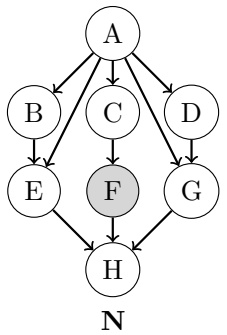

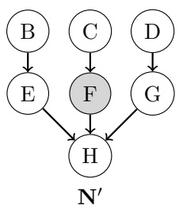

(ii) [2 pts] What is the size of the largest factor made during variable elimination for $N ^ { \prime } ?$

$F ( G , H , + f )$ after eliminating E.

Variable elimination in N can take a lot of work! If only A were observed. . .

(b) Instantiation Sets. To simplify variable elimination in N, let’s pick an instantiation set to pretend to observe, and then do variable elimination with these additional instantiations.

Consider the original query $P ( H \mid + f )$ , but let A be the instantiation set so $A = a$ is observed. Now the query is H with observations $F = + f , A = a$

(i) [2 pts] What is the size of the largest factor made

during variable elimination with the A = a instantiation? 2

Observing $A = a$ renders the children conditionally independent and prevents its elimination. The large factor $F ( B , C , D , E , G )$ is never made and elimination proceeds similarly to elimination in N0except for the presence of a in the factors.

(ii) [1 pt] Given a Bayes’ net over n binary variables with k variables chosen for the instantiation set, how many instantiations of the set are there?

For a selected instantiation set of k binary variables, there are $2 ^ { k }$ total instantiations of these variables. The alternative interpretation of how many size k instantiation sets exist from n variables, n was also accepted.

(c) Inference by Instantiation. Let’s answer $P ( H | + f )$ by variable elimination with the instantiations of A.

(i) [2 pts] What quantity does variable elimination for $P ( H | + f )$ with the $A = + a$ instantiation compute without normalization? That is, which choices are equal to the entries of the last factor made by elimination?

$P ( H \mid + f )$

$P ( H \mid + a )$

$$
P (H, + a, + f)
$$

$P(H, +f \mid +a)$

C $P(H, +a \mid +f)$

$P ( H \mid + a , + f )$

At the end of variable elimination, the last factor is equal to the equivalent entries of the joint distribution with the eliminated variables summed out and the selected values of the evidence variables. Normalization gives the conditional $\begin{array} { r } { p ( + h \mid + a , + f ) = \frac { f ( + h , + a , + f ) } { f ( + h , + a , + f ) + f ( - h , + a , + f ) } } \end{array}$ , but here the factor is kept unnormalized.

(ii) $[ 2   \mathrm { p t s } ]$ Let $I _ { + } ( H ) \: = \: F ( H , + a , + f )$ and $I _ { - } ( H )   =   F ( H , - a , + f )$ be the last factors made by variable elimination with instantiations $A = + a$ and $A = - a$ . Which choices are equal to $p(+h \mid +f)?$

<!-- page: 14 -->

$$
\begin{array}{l l} \bigcirc I _ {+} (+ h) \cdot p (+ a) \cdot I _ {-} (+ h) \cdot p (- a) & \bigcirc \frac {I _ {+} (+ h) \cdot p (+ a) \cdot I _ {-} (+ h) \cdot p (- a)}{\sum_ {h} I _ {+} (h) \cdot p (+ a) \cdot I _ {-} (h) \cdot p (- a)} \\ \bigcirc I _ {+} (+ h) \cdot p (+ a) + I _ {-} (+ h) \cdot p (- a) & \bigcirc \frac {I _ {+} (+ h) \cdot p (+ a) + I _ {-} (+ h) \cdot p (- a)}{\sum_ {h} I _ {+} (h) \cdot p (+ a) + I _ {-} (h) \cdot p (- a)} \\ \bigcirc I _ {+} (+ h) + I _ {-} (+ h) & \bullet \frac {I _ {+} (+ h) + I _ {-} (+ h)}{\sum_ {h} I _ {+} (h) + I _ {-} (h)} \end{array}
$$

The last factors are the entries from the corresponding joint $I _ { + } ( + h )   =   p ( + h , + a , + f )$ and $I _ { - } ( + h )   =$ $p(+h,-a,+f)$ and so on.

By the law of total probability $p ( + h , + f )   =   p ( + h , + a , + f )   +   p ( + h , - a , + f )$ , so the joint of the origi nal query and evidence can be computed from the instantiated elimination factors. For the conditional $p ( + h , + f )$ , normalize by the sum over the query $\textstyle \sum _ { h } p ( h , + f ) { = } \textstyle \sum _ { h } \sum _ { a } p ( h , a , + f ) { = } f ( + h , + a , + f ) +$ $f ( + h , - a , + f ) + f ( - h , + a , + f ) + f ( - h , - a , + f )$ where the joint over the query and evidence is again computed from the law of total probability over A.

Working with the joint in this way is why the last factor of instantiated elimination was left unnormalized. (Those who answered the conditional $P ( H \mid + a , + f )$ in the previous part were awarded credit for multi-plying the marginal $p(+a),p(-a)$ back in as this is the correct chain rule were $P ( H \mid + a , + f )$ correct.)

(d) [3 pts] Complexity of Instantiation. What is the time complexity of instantiated elimination? Let $n =$ number of variables, k = instantiation set size, f = size of the largest factor made by elimination without instantiation, and i = size of the largest factor made by elimination with instantiation. Mark the tightest bound. Variable elimination without instantiation is O(n exp(f)). O(n exp(k)) O(n exp(i)) O(n exp(i + k)) O(n exp(f)) O(n exp(f − k)) O(n exp(i/f))

To carry out instantiated elimination, we have to do variable elimination exp(k) times for all the settings of the instantiation set. Each of these eliminations takes time bounded by n exp(i) as the largest factor is the most expensive to eliminate and there are n variables to eliminate.

If the instantiation set is not too large and the size of the factors made by instantiation elimination are small enough this method can be exponentially faster than regular elimination. The catch is how to select the instantiation set.

<!-- page: 15 -->

$\mathbf { G _ { 6 } }$

## Q6. [12 pts] Bayes’ Net Representation

(a) [4 pts] Consider the joint probability table on the right.

Clearly fill in all circles corresponding to BNs that can correctly represent the distribution on the right. If no such BNs are given, clearly select None of the above.

G1

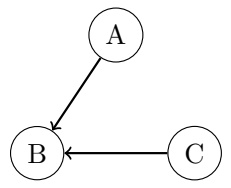

G2

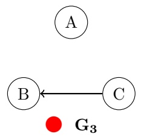

| A | B | C | P(A,B,C) |
| --- | --- | --- | --- |
| 0 | 0 | 0 | .15 |
| 0 | 0 | 1 | .1 |
| 0 | 1 | 0 | 0 |
| 0 | 1 | 1 | .25 |
| 1 | 0 | 0 | .15 |
| 1 | 0 | 1 | .1 |
| 1 | 1 | 0 | 0 |
| 1 | 1 | 1 | .25 |

$\mathbf { G _ { 4 } }$

O G5

None of the above.

From the table we can clearly see that the values of $P ( A , B , C )$ repeat in two blocks. This means that the value of A does not matter to the distribution. The values are otherwise all unique, meaning that there is a relationship between B and C. Together, this means that A ⊥⊥ B, A ⊥⊥ B | C, A ⊥⊥ C, and A ⊥⊥ C | B are the only independences in the distribution.

(b) [4 pts] You are working with a distribution over A, B, C, D that can be fully represented by just three probability tables: $P(A \mid D),   P(C \mid B)$ , and $P ( B , D )$ . Clearly fill in the circles of those BNs that can correctly represent this distribution. If no such BNs are given, clearly select None of the above.

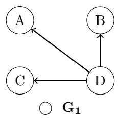

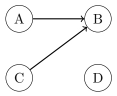

O G2

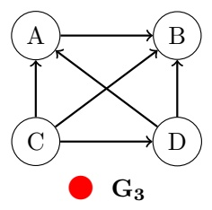

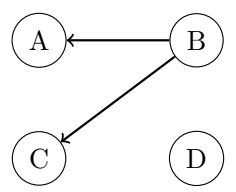

C G4

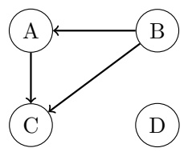

O G5

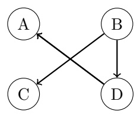

None of the above.

The only independences guaranteed by the factorization $P ( A , B , C , D ) = P ( A \mid D ) P ( C \mid B ) P ( B , D )$ are:

• $A \perp     \perp B \mid D$

$A \perp    \perp C \mid B$

• A ⊥⊥ C | D

• C ⊥⊥ D | B

(c) [4 pts] We are dealing with two probability distributions over N variables, where each variable can take on exactly d values. The distributions are represented by the two Bayes’ Nets shown below. If S is the amount of

<!-- page: 16 -->

storage required for the CPTs for $X _ { 2 } , \ldots , X _ { N }$ in $D _ { 1 }$ , how much storage is required for the CPTs for $X _ { 2 } , \ldots , X _ { l }$ N in $D _ { 2 } ?$ There is a correct answer among the options.

<table><tr><td>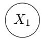</td><td>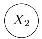</td><td> $\cdots$ </td><td>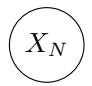</td><td>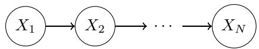</td></tr><tr><td></td><td></td><td> $D_1$ </td><td></td><td> $D_2$ </td></tr><tr><td>○ S</td><td></td><td></td><td>○  $2^S$ </td><td>● Sd</td></tr><tr><td>○  $S^2$ </td><td></td><td></td><td>○  $S^d$ </td><td>○  $S + 2^d$ </td></tr></table>

$D _ { 1 }$ needs storage of N d values. $D _ { 2 }$ needs storage of $N d ^ { 2 }$ values.

<!-- page: 17 -->

## Q7. [14 pts] Finding Waldo

You are part of the CS 188 Search Team to find Waldo. Waldo randomly moves around floors A, B, C, and D. Waldo’s location at time t is $X _ { t }$ . At the end of each timestep, Waldo stays on the same floor with probability 0.5, goes upstairs with probability 0.3, and goes downstairs with probability 0.2. If Waldo is on floor A, he goes down with probability 0.2 and stays put with probability 0.8. If Waldo is on floor D, he goes upstairs with probability 0.3 and stays put with probability 0.7.

| X0 | P(X0) |
| --- | --- |
| A | 0.1 |
| B | 0.2 |
| C | 0.3 |
| D | 0.4 |

(a) [2 pts] Fill in the table below with the distribution of Waldo’s location at time t = 1.

| Xt | P(X1) |
| --- | --- |
| A | 0.1 ∗ 0.8 + 0.2 ∗ 0.3 = 0.14 |
| B | 0.2 ∗ 0.5 + 0.1 ∗ 0.2 + 0.3 ∗ 0.3 = 0.21 |
| C | 0.3 ∗ 0.5 + 0.4 ∗ 0.3 + 0.2 ∗ 0.2 = 0.31 |
| D | 0.4 ∗ 0.7 + 0.3 ∗ 0.2 = 0.34 |

(b) [3 pts] $F _ { T } ( X )$ is the fraction of timesteps Waldo spends at position X from t = 0 to t = T. The system of equations to solve for $F _ { \infty } ( A ) ,   F _ { \infty } ( B ) ,   F _ { \infty } ( C )$ , and $F _ { \infty } ( D )$ is below. Fill in the blanks. Note: You may or may not use all equations.

$$
\underline {{0 . 8}} F _ {\infty} (A) + \underline {{0 . 3}} F _ {\infty} (B) + \underline {{0}} F _ {\infty} (C) + \underline {{0}} F _ {\infty} (D) = \underline {{F _ {\infty} (A)}}
$$

$$
\underline {{0 . 2}} F _ {\infty} (A) + \underline {{0 . 5}} F _ {\infty} (B) + \underline {{0 . 3}} F _ {\infty} (C) + \underline {{0}} F _ {\infty} (D) = \underline {{F _ {\infty}}} (B)
$$

$$
\underline {{0}} F _ {\infty} (A) + \underline {{0 . 2}} F _ {\infty} (B) + \underline {{0 . 5}} F _ {\infty} (C) + \underline {{0 . 3}} F _ {\infty} (D) = \underline {{F _ {\infty} (C)}}
$$

$$
F _ {\infty} (A) + \underline {{0}} F _ {\infty} (B) + \underline {{0 . 2}} F _ {\infty} (C) + \underline {{0 . 7}} F _ {\infty} (D) = F _ {\infty} (D)
$$

$$
F _ {\infty} (A) + \underline {{1}} F _ {\infty} (B) + \underline {{1}} F _ {\infty} (C) + \underline {{1}} F _ {\infty} (D) = \underline {{1}}
$$

<!-- page: 18 -->

To aid the search a sensor $S _ { r }$ is installed on the roof and a sensor $S _ { b }$ is installed in the basement. Both sensors detect either sound $( + s )$ or no sound (−s). The distribution of sensor measurements is determined by $d ,$ the number of floors between Waldo and the sensor. For example, if Waldo is on floor B, then $d _ { b } = 2$ because there are two floors (C and D) between floor B and the basement and $d _ { r } = 1$ because there is one floor (A) between floor B and the roof. The prior of the both sensors’ outputs are identical and listed below. Waldo will not go onto the roof or into the basement.

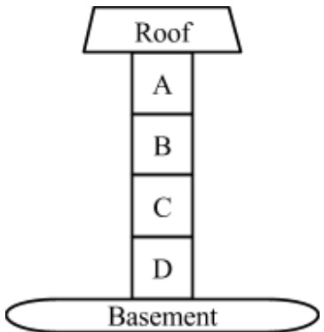

| X0 | P(X0) |
| --- | --- |
| A | 0.1 |
| B | 0.2 |
| C | 0.3 |
| D | 0.4 |

| Sr | P(Sr\|dr) | Sb | P(Sb\|db) |
| --- | --- | --- | --- |
| +s | 0.3 ∗ dr | +s | 1 - 0.3 ∗ db |
| -s | 1 - 0.3 ∗ dr | -s | 0.3 ∗ db |

| S | P(S) |
| --- | --- |
| +s | 0.5 |
| -s | 0.5 |

(c) [2 pts] You decide to track Waldo by particle filtering with 3 particles. At time $t   =   2 ,$ the particles are at positions $X_{1} = A, X_{2} = B$ and $X _ { 3 }   =   C$ Without incorporating any sensory information, what is the probability that the particles will be resampled as $X_{1} = B,   X_{2} = B$ , and $X _ { 3 } = C$ , after time elapse? Answer: $P ( X _ { 3 } = B | X _ { 2 } = A ) P ( X _ { 3 } = B | X _ { 2 } = B ) P ( X _ { 3 } = C | X _ { 2 } = C )$ $= ( 0 . 2 ) ( 0 . 5 ) ( 0 . 5 ) = 0 . 0 5$

(d) To decouple this from the previous question, assume the particles after time elapsing are $X_{1} = B, X_{2} = C,$ $X _ { 3 } = D$ , and the sensors observe $S _ { r } = + s$ and $S _ { b } = - s$

(i) [2 pts] What are the particle weights given these observations?

| Particle | Weight |
| --- | --- |
| X1 = B | P(Sr = +s\|dr = 1)P(Sb = -s\|db = 2) = 0.18 |
| X2 = C | P(Sr = +s\|dr = 2)P(Sb = -s\|db = 1) = 0.18 |
| X3 = D | P(Sr = +s\|dr = 3)P(Sb = -s\|db = 0) = 0 |

(ii) [2 pts] To decouple this from the previous question, assume the particle weights in the following table. What is the probability the particles will be resampled as $X_{1} = B,   X_{2} = B$ , and $X _ { 3 } = D ?$

| Particle | Weight |
| --- | --- |
| X = B | 0.1 |
| X = C | 0.6 |
| X = D | 0.3 |

(e) [3 pts] Note: the r and b subscripts from before will be written here as superscripts.

Part of the expression for the forward algorithm update for Hidden Markov Models is given below. $s _ { 0 : t } ^ { r }$ are all the measurements from the roof sensor $s _ { 0 } ^ { r } , s _ { 1 } ^ { r } , s _ { 2 } ^ { r } , \ldots , s _ { t } ^ { r } . s _ { 0 : t } ^ { b }$ are all the measurements from the roof sensor $\boldsymbol { s } _ { 0 } ^ { b } , \boldsymbol { s } _ { 1 } ^ { b } , \boldsymbol { s } _ { 2 } ^ { b } , \ldots , \boldsymbol { s } _ { t } ^ { b } .$

<!-- page: 19 -->

Which of the following are correct completions of line (4)? Circle all that apply.

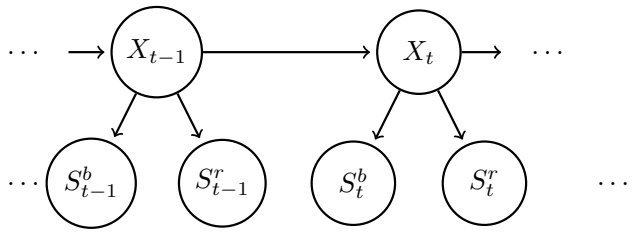

$$
P (x _ {t} | s _ {0: t} ^ {r}, s _ {0: t} ^ {b}) \propto P (x _ {t}, s _ {0: t} ^ {r}, s _ {0: t} ^ {b})\tag{1}
$$

$$
= \sum_ {x _ {t - 1}} P (x _ {t - 1}, x _ {t}, s _ {0: t} ^ {r}, s _ {0: t} ^ {b})\tag{2}
$$

$$
= \sum_ {x _ {t - 1}} P (x _ {t - 1}, x _ {t}, s _ {0: t - 1} ^ {r}, s _ {t} ^ {r}, s _ {0: t - 1} ^ {b}, s _ {t} ^ {b})\tag{3}
$$

$$
= \sum_ {x _ {t - 1}} \underline {{\quad}} P (x _ {t} | x _ {t - 1}) P (x _ {t - 1}, s _ {0: t - 1} ^ {r}, s _ {0: t - 1} ^ {b})\tag{4}
$$

$$
\begin{array}{l l} \bullet & P (s _ {t} ^ {r}, s _ {t} ^ {b} | x _ {t - 1}, x _ {t}, s _ {0: t - 1} ^ {r}, s _ {0: t - 1} ^ {b}) \\ \bullet & P (s _ {t} ^ {r} | x _ {t}) P (s _ {t} ^ {b} | x _ {t}) \\ \bigcirc & P (s _ {t} ^ {r} | x _ {t - 1}) P (s _ {t} ^ {b} | x _ {t - 1}) \\ \bigcirc & P (s _ {t} ^ {r} | s _ {t - 1} ^ {r}) P (s _ {t} ^ {b} | s _ {t - 1} ^ {b}) \\ \bullet & P (s _ {t} ^ {r}, s _ {t} ^ {b} | x _ {t}) \\ \bullet & P (s _ {t} ^ {r}, s _ {t} ^ {b} | x _ {t}, x _ {t - 1}) \\ \bigcirc & \text {None of the above.} \end{array}
$$

There are two equally-correct interpretations of this question: (1) completing the mathematical expression for the probability and (2) completing the algorithmic update for the probability.

Selecting the answers above is correct for interpretation (1): in the Hidden Markov Model, these four probabilities are identical.

Selecting answer 2 alone is correct for interpretation (2): in the Hidden Markov Model, the forward algorithm has the conditional probabilities of the observations given the present state. While the other three choices above are mathematically equivalent, they are not available to the algorithm during execution.

Both correct interpretations earned full credit.

<!-- page: 20 -->

## Q8. [12 pts] Neural Logic

For the following questions, mark ALL neural networks that can compute the same function as the boolean expression. If none of the neural nets can do this, mark None. Booleans will take values 0, 1, and each perceptron will output values 0, 1. You may assume that each perceptron also has as input a bias feature that always takes the value 1. It may help to write out the truth table for each expression. Note that $\mathrm { X } \Rightarrow \mathrm { Y }$ is equivalent to (NOT X) OR Y.

(1)

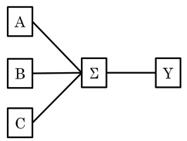

(2)

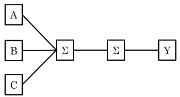

(3)

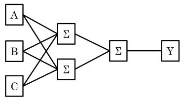

(4)

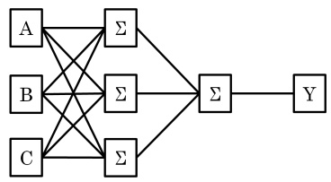

(a) [2 pts] A

● 1 ● 2 3 4 None

(b) [2 pts] A OR B 1 2 3 4 None

(c) [2 pts] B XOR C 1 2 3 4 None

(d) [2 pts] (A XOR B) XOR C 1 2 3 4 None

(e) [2 pts] (¬A AND ¬B AND ¬C) OR (A AND B AND C) 1 2 O 3 ●4 None

(f) [2 pts] (A ⇒ B) ⇒ C 1 2 3 4 None

<!-- page: 21 -->

## Q9. [16 pts] Spam Classification

The Na¨ıve Bayes model has been famously used for classifying spam. We will use it in the “bag-of-words” model:

• Each email has binary label Y which takes values in {spam, ham}.

• Each word w of an email, no matter where in the email it occurs, is assumed to have probability $P ( W = w \mid Y )$ where W takes on words in a pre-determined dictionary. Punctuation is ignored.

• Take an email with K words $w _ { 1 } , \ldots , w _ { K }$ . For instance: email “hi hi you” has $w _ { 1 } = \mathrm { h i } , w _ { 2 } = \mathrm { h i } , w _ { 3 } = \mathrm { y o u }$ Its label is given by arg max $\textstyle P ( Y = y \mid w _ { 1 } , \ldots , w _ { K } ) = \operatorname { a r g } \operatorname* { m a x } \: P ( Y = y ) \prod _ { i = 1 } ^ { K } P ( W = w _ { i } \mid Y = y )$ y y

(a) [3 pts] You are in possession of a bag of words spam classifier trained on a large corpus of emails. Below is a table of some estimated word probabilities.

$$
\begin{array}{c c c c c c} W & \text {note} & \text {to} & \text {self} & \text {become} & \text {perfect} \\ \hline P (W \mid Y = \text {spam}) & 1 / 6 & 1 / 8 & 1 / 4 & 1 / 4 & 1 / 8 \\ P (W \mid Y = \text {ham}) & 1 / 8 & 1 / 3 & 1 / 4 & 1 / 1 2 & 1 / 1 2 \end{array}
$$

You are given a new email to classify, with only two words:

perfect note

Fill in the circles corresponding to all values of $P ( Y   =   \mathrm { s p a m } )$ for which the bag of words with these word probabilities will give “spam” as the most likely label.

$$
\begin{array}{c c} \bigcirc & 0 \\ \bigcirc & 0. 2 \end{array}
$$

$$
\begin{array}{c} P (Y = \text {spam} \mid w _ {1} = \text {perfect}, w _ {2} = \text {note}) > P (Y = \text {ham} \mid w _ {1} = \text {perfect}, w _ {2} = \text {note}) \\ P (w _ {1} = \text {perfect} \mid Y = \text {s}) P (w _ {2} = \text {note} \mid Y = \text {s}) P (Y = \text {s}) > P (w _ {1} = \text {perfect} \mid Y = \text {h}) P (w _ {2} = \text {note} \mid Y = \text {h}) P (Y = \text {h}) \\ 1 / 8 * 1 / 6 * P (Y = \text {spam}) > 1 / 1 2 * 1 / 8 * (1 - P (Y = \text {spam})) \\ 2 / 9 6 * P (Y = \text {spam}) > 1 / 9 6 - 1 / 9 6 * P (Y = \text {spam}) \\ 3 / 9 6 * P (Y = \text {spam}) > 1 / 9 6 \\ P (Y = \text {spam}) > 1 / 3 \end{array}
$$

(b) [4 pts] You are given only three emails as a training set:

(Spam) dear sir, I write to you in hope of recovering my gold watch.

(Ham) hey, lunch at 12?

(Ham) fine, watch it tomorrow night.

Fill in the circles corresponding to values you would estimate for the given probabilities, if you were doing no smoothing.

$$
\begin{array}{l l l l l l l l} P (W = \text {sir} \mid Y = \text {spam}) & \bigcirc 0 & \bigcirc 1 / 1 0 & \bigcirc 1 / 5 & \bigcirc 1 / 3 & \bigcirc 2 / 3 & \bullet \text {None of the above} \\ P (W = \text {watch} \mid Y = \text {ham}) & \bigcirc 0 & \bigcirc 1 / 1 0 & \bigcirc 1 / 5 & \bigcirc 1 / 3 & \bigcirc 2 / 3 & \bullet \text {None of the above} \\ P (W = \text {gauntlet} \mid Y = \text {ham}) & \bullet 0 & \bigcirc 1 / 1 0 & \bigcirc 1 / 5 & \bigcirc 1 / 3 & \bigcirc 2 / 3 & \bigcirc \text {None of the above} \\ P (Y = \text {ham}) & \bigcirc 0 & \bigcirc 1 / 1 0 & \bigcirc 1 / 5 & \bigcirc 1 / 3 & \bullet 2 / 3 & \bigcirc \text {None of the above} \end{array}
$$

Intuitively, the conditional probability is P(word | it’s a word in an email of type Y). We estimate this probability with word counts:

$$
\begin{array}{c} P (W = \text {sir} \mid Y = \text {spam}) = \frac {c _ {w} (W = \text {sir} , Y = \text {spam}) / c _ {w} (\text {total})}{c _ {w} (Y = \text {spam}) / c _ {w} (\text {total})} \\ = \frac {c _ {w} (W = \text {sir} , Y = \text {spam})}{c _ {w} (Y = \text {spam}))} = \frac {1}{1 3} \end{array}
$$

<!-- page: 22 -->

Similarly, P(W = watch $\begin{array} { r } { | \; Y = \mathrm { h a m } ) = \frac { 1 } { 9 } } \end{array}$

The word “gauntlet” does not occur in our training emails, and since we’re not smoothing, we estimate its conditional probability to be 0.

Estimating the prior probability $P ( Y = \mathrm { h a m } )$ only requires counting emails: $\begin{array} { r } { \frac { c _ { e } ( Y = \mathrm { h a m } ) } { c _ { e } ( \mathrm { t o t a l } ) } = \frac { 2 } { 3 } } \end{array}$

(c) [3 pts] You are training with the same emails as in the previous question, but now doing Laplace Smoothing with k = 2. There are V words in the dictionary. Write concise expressions for:

$$
P (W = \mathbf {s i r} \mid Y = \mathbf {s p a m})
$$

$$
P (W = \text {watch} \mid Y = \text {ham})
$$

| “Sir” occurs once in the spam emails, and there are 13 total words in all spam emails. Smoothing with $k = 2$ gives $\frac{1+2}{13+2V}$. |
| --- |
| “Watch” occurs once in the ham emails, and there are nine total words in all ham emails. Smoothing with $k = 2$ gives $\frac{1+2}{9+2V}$. |
| Same as before: number of ham emails divided by the number of spam emails, which is 2/3. If you did Laplace smoothing on the priors as well, this would be 4/7, which was also accepted. |

$$
P (Y = \mathbf {h a m})
$$

(d) [2 pts] On the held-out set, you see the following accuracies for different values of k:

| k | 0 | 1 | 2 | 10 |
| --- | --- | --- | --- | --- |
| accuracy | 0.65 | 0.68 | 0.74 | 0.6 |

On the training set, the accuracy for k = 0 is 0.8. Fill in the circle of all plausible accuracies for k = 10 on the training set. 0.1 0.99 0.7 None of the above

On the training set, smoothing counts is not likely to help as much as on the held-out set. Smoothing is supposed to prevent “overfitting” – but overfitting is what gives really high accuracy on the training set. There is also an optimal spot for smoothing parameter values, and we see that at k = 10, we went past that optimal spot on the held-out set. So we have a technique that is designed to prevent overfitting (in other words, lower accuracy) on the training set, and it’s so strong that it’s actually hurting performance even on the held-out set: it definitely shouldn’t be expected to increase performance on the training set! This rules out 0.99 as an answer.

Why is 0.1 ruled out? Because achieving a classification error of 0.1 is equivalent to achieving classification accuracy of 0.9 – we have to flip the sign, but the signal is there. But that would mean that we improved performance from accuracy of 0.8, which we decided above is not reasonable to expect.

0.7, however, is a reasonable answer: it hurts performance compared to not doing smoothing, which is what we should expect.

## (e) Becoming less na¨ıve

We are now going to improve the representational capacity of the model. Presence of word wi will be modeled not by $P ( W = w _ { i } \mid Y )$ , where it is only dependent on the label, but by $P ( W = \dot { w _ { i } } | Y , \dot { W _ { i - 1 } } )$ , where it is also dependent on the previous word. The corresponding model for an email of only four words is given on the right.

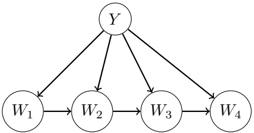

(i) [2 pts] With a vocabulary consisting of V words, what is the minimal number of conditional word probabilities that need to be estimated for this model? The correct answer is among the choices. OV O $\begin{aligned} { } & { { } V ^ { 2 } } \\ { } & { { } 2 V ^ { 2 } } \\ \end{aligned}$ O $\begin{aligned} { 2 ^ { V } } \\ { 2 ^ { 2 V } } \\ \end{aligned}$ 2V ● O

We need to consider V possible words for each one of V possible previous words and 2 possible lables: $2 V ^ { 2 }$

<!-- page: 23 -->

(ii) [2 pts] Select all expected effects of using the new model instead of the old one, if both are trained with a very large set of emails (equal number of spam and ham examples).

The entropy of the posterior P(Y |W) should on average be lower with the new model. (In other words, the model will tend to be more confident in its answers.)

The accuracy on the training data should be higher with the new model.

The accuracy on the held-out data should be higher with the new model.

None of the above.

The new model is closer to an actual model of language, and so should better model emails and thus filter spam from non-spam on both the training and held-out datasets. Remember that Na¨ıve Bayes is an overconfident model: it gives unwarrantedly low-entropy posteriors. This model is less “na¨ıve”, and is therefore less overconfident — its posterior can be expected to be higher entropy.
