<!-- page: 1 -->

ˆ You have approximately 2 hours and 50 minutes.

ˆ The exam is closed book, closed notes except a three-page crib sheet.

ˆ Please use non-programmable calculators only.

ˆ Mark your answers ON THE EXAM ITSELF. If you are not sure of your answer you may wish to provide a brief explanation. All short answer sections can be successfully answered in a few sentences AT MOST.

| First name |  |
| --- | --- |
| Last name |  |
| SID |  |
| EdX username |  |
| First and last name of student to your left |  |
| First and last name of student to your right |  |

For staff use only:

| Q1. Bounded suboptimal search: weighted A* | /19 |
| --- | --- |
| Q2. Generalizing Reinforcement Learning | /6 |
| Q3. Extending the Forward Algorithm | /18 |
| Q4. Dual Perceptron CSPs | /11 |
| Q5. Generalization | /18 |
| Q6. Fun with Probability | /17 |
| Q7. Games | /5 |
| Q8. Pruning | /6 |
| Total | /100 |

<!-- page: 2 -->

<!-- page: 3 -->

# Q1. [19 pts] Bounded suboptimal search: weighted $\mathrm { A } ^ { * }$

In this class you met $\mathrm { A } ^ { * }$ , an algorithm for informed search guaranteed to return an optimal solution when given an admissible heuristic. Often in practical applications it is too expensive to find an optimal solution, so instead we search for good suboptimal solutions.

Weighted $\mathrm { A } ^ { * }$ is a variant of $\mathrm { A } ^ { * }$ commonly used for suboptimal search. Weighted $\mathrm { A } ^ { * }$ is exactly the same as $\mathrm { A } ^ { * }$ but where the f-value is computed differently:

$$
f (n) = g (n) + \varepsilon h (n)
$$

where $\varepsilon \geq 1$ is a parameter given to the algorithm. In general, the larger the value of $\varepsilon ,$ the faster the search is, and the higher cost of the goal found.

Pseudocode for weighted $\mathrm { A } ^ { * }$ tree search is given below. NOTE: The only differences from the $\mathrm { A } ^ { * }$ tree search pseudocode presented in the lectures are: (1) fringe is assumed to be initialized with the start node before this function is called (this will be important later), and (2) now Insert takes ε as a parameter so it can compute the correct f-value of the node.

1: function Weighted-A\*-Tree-Search(problem, fringe, ε)

2: loop do

3: if fringe is empty then return failure

4: node ← Remove-Front(fringe)

5: if Goal-Test(problem, State[node]) then return node

6: for child-node in child-nodes do

7: fringe ← Insert(child-node, fringe, ε)

(a) [2 pts] We’ll first examine how weighted $\mathrm { A } ^ { * }$ works on the following graph:

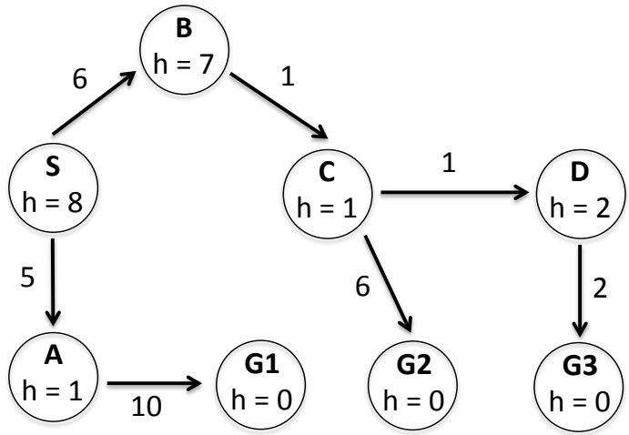

Execute weighted $\mathrm { A } ^ { * }$ on the above graph with $\varepsilon = 2$ , completing the following table. To save time, you can optionally just write the nodes added to the fringe, with their g and f values.

| node | Goal? | fringe |
| --- | --- | --- |
| - | - | {S : g = 0,f = 16} |
| S | No | {S → A : g = 5,f = 7; S → B : g = 6,f = 20} |

<!-- page: 4 -->

(b) [5 pts] After running weighted $\mathrm { A } ^ { * }$ with weight $\varepsilon \geq 1$ a goal node $G$ is found, of cost $g ( G )$ . Let $C ^ { * }$ be the optimal solution cost, and suppose the heuristic is admissible. Select the strongest bound below that holds, and provide a proof.

$$
\bigcirc g (G) \leq \varepsilon C ^ {*} \quad \bigcirc g (G) \leq C ^ {*} + \varepsilon \quad \bigcirc g (G) \leq C ^ {*} + 2 \varepsilon \quad \bigcirc g (G) \leq 2 ^ {\varepsilon} C ^ {*} \quad \bigcirc g (G) \leq \varepsilon^ {2} C ^ {*}
$$

Proof: (Partial credit for reasonable proof sketches.)

(c) Weighted $\mathrm { A } ^ { * }$ includes a number of other algorithms as special cases. For each of the following, name the corresponding algorithm.

(i) $[ 1 ~ \mathrm { p t } ] \quad \varepsilon = 1 .$

Algorithm:

(ii) [1 pt] ε = 0.

Algorithm:

Algorithm:

(iii) [1 $\mathrm { p t ] } \varepsilon \to \infty \mathrm { ( i . e . , }$ , as ε becomes arbitrarily large).

<!-- page: 5 -->

(d) Here is the same graph again:

(i) [3 pts] Execute weighted $\mathrm { A } ^ { * }$ on the above graph with $\varepsilon = 1 ,$ completing the following table as in part (a):

| node | Goal? | fringe |
| --- | --- | --- |
|  |  |  |
|  |  |  |
|  |  |  |
|  |  |  |
|  |  |  |
|  |  |  |
|  |  |  |

(ii) [4 pts] You’ll notice that weighted $\mathrm { A } ^ { * }$ with $\varepsilon = 1$ repeats computations performed when run with $\varepsilon = 2 .$ . Is there a way to reuse the computations from the $\varepsilon = 2$ search by starting the $\varepsilon = 1$ search with a different fringe? Let F denote the set that consists of both (i) all nodes the fringe the $\varepsilon = 2$ search ended with, and (ii) the goal node G it selected. Give a brief justification for your answer.

Use F as new starting fringe

Use F with goal G removed as new starting fringe

Use F as new starting fringe, updating the f-values to account for the new ε

Use F with goal G removed as new starting fringe, updating the f-values to account for the new ε

Initialize the new starting fringe to all nodes visited in previous search

Initialize the new starting fringe to all nodes visited in previous search, updating the f-values to account for the new ε

It is not possible to reuse computations, initialize the new starting fringe as usual

Justification:

<!-- page: 6 -->

Here is the same graph again:

(iii) [2 pts] Now re-run the  = 1 search for the above graph using the fringe you selected in the previous question.

| node | Goal? | fringe |
| --- | --- | --- |
|  |  |  |
|  |  |  |
|  |  |  |
|  |  |  |
|  |  |  |
|  |  |  |
|  |  |  |

<!-- page: 7 -->

## Q2. [6 pts] Generalizing Reinforcement Learning

Assume we have an MDP with state space S, action space A, reward function $R ( s , a , s ^ { \prime } )$ , and discount γ. Our eventual goal is to learn a policy that can be used by a robot in the real world. However, we only have access to simulation software, not the robot directly. We know that the simulation software is built using the transition model $T _ { \mathrm { s i m } } ( s , a , s ^ { \prime } )$ which is unfortunately different than the transition model that governs our real robot, $T _ { \mathrm { r e a l } } ( s , a , s ^ { \prime } )$

Without changing the simulation software, we want to use the samples drawn from the simulator to learn Q-values for our real robot.

Recall the Q-learning update rule. Given a sample $( s , a , s ^ { \prime } , r )$ , it performs the following update:

$$
Q (s, a) \leftarrow (1 - \alpha) Q (s, a) + \alpha \left[ r + \gamma \max _ {a ^ {\prime}} Q (s ^ {\prime}, a ^ {\prime}) \right]
$$

(a) [4 pts] Assuming the samples are drawn from the simulator, which new update rule will learn the correct Q-value functions for the real world robot? Circle the correct update rule and provide an explanation for your choice in the box below.

$$
\bigcirc \quad Q (s, a) \leftarrow (1 - \alpha) Q (s, a) + \alpha T _ {\mathrm{sim}} (s, a, s ^ {\prime}) \left[ r + \gamma \max _ {a ^ {\prime}} Q (s ^ {\prime}, a ^ {\prime}) \right]
$$

$$
\bigcirc \quad Q (s, a) \leftarrow (1 - \alpha) Q (s, a) + \alpha T _ {\text {real}} (s, a, s ^ {\prime}) \left[ r + \gamma \max _ {a ^ {\prime}} Q (s ^ {\prime}, a ^ {\prime}) \right]
$$

$$
\bigcirc \quad Q (s, a) \leftarrow (1 - \alpha) Q (s, a) + \alpha \frac {1}{T _ {\mathrm{sim}} (s , a , s ^ {\prime})} \left[ r + \gamma \max _ {a ^ {\prime}} Q (s ^ {\prime}, a ^ {\prime}) \right]
$$

$$
\bigcirc \quad Q (s, a) \leftarrow (1 - \alpha) Q (s, a) + \alpha \frac {1}{T _ {\mathrm{real}} (s , a , s ^ {\prime})} \left[ r + \gamma \max _ {a ^ {\prime}} Q (s ^ {\prime}, a ^ {\prime}) \right]
$$

$$
\bigcirc Q (s, a) \leftarrow (1 - \alpha) Q (s, a) + \alpha \frac {T _ {\mathrm{real}} (s , a , s ^ {\prime})}{T _ {\mathrm{sim}} (s , a , s ^ {\prime})} \left[ r + \gamma \max _ {a ^ {\prime}} Q (s ^ {\prime}, a ^ {\prime}) \right]
$$

$$
\bigcirc Q (s, a) \leftarrow (1 - \alpha) Q (s, a) + \alpha \frac {T _ {\mathrm{sim}} (s , a , s ^ {\prime})}{T _ {\mathrm{real}} (s , a , s ^ {\prime})} \left[ r + \gamma \max _ {a ^ {\prime}} Q (s ^ {\prime}, a ^ {\prime}) \right]
$$

Justification:

(b) [2 pts] Now consider the case where we have n real robots with transition models $T _ { \mathrm { r e a l } } ^ { 1 } ( s , a , s ^ { \prime } ) , \ldots , T _ { \mathrm { r e a l } } ^ { n } ( s , a , s ^ { \prime } )$ and still only one simulator. Is there a way to learn policies for all n robots simultaneously by using the same samples from the simulator? If yes, explain how. If no, explain why not. (1-2 sentences)

Yes No

Justification:

<!-- page: 8 -->

# Q3. [18 pts] Extending the Forward Algorithm

Consider the HMM graph structure shown below.

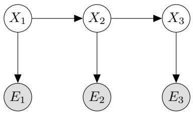

Recall the Forward algorithm is a two step iterative algorithm used to approximate the probability distribution $P ( X _ { t } | e _ { 1 } , \ldots , e _ { t } )$ . The two steps of the algorithm are as follows:

Elapse Time $\textstyle P ( X _ { t } | e _ { 1 } , \ldots , e _ { t - 1 } ) = \sum _ { x _ { t - 1 } } P ( X _ { t } | x _ { t - 1 } ) P ( x _ { t - 1 } | e _ { 1 } , \ldots , e _ { t - 1 } )$

Observe $\begin{array} { l } { P ( X _ { t } | e _ { 1 } , \ldots , e _ { t } ) = \frac { P ( e _ { t } | X _ { t } ) P ( X _ { t } | e _ { 1 } , \ldots , e _ { t - 1 } ) } { \sum _ { x _ { t } } P ( e _ { t } | x _ { t } ) P ( x _ { t } | e _ { 1 } , \ldots , e _ { t - 1 } ) } } \\ \end{array}$

For this problem we will consider modifying the forward algorithm as the HMM graph structure changes. Our goal will continue to be to create an iterative algorithm which is able to compute the distribution of states, $X _ { t } ,$ given all available evidence from time 0 to time t.

Note: If the probabilities required can be computed without any change to original update equations, mark the no change bubble. Otherwise write the new update equation inside the box.

Consider the graph below where new observed variables, $Z _ { i } ,$ are introduced and influence the evidence.

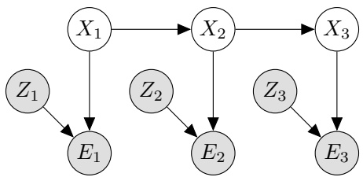

(a) [3 pts] State the modified Elapse Time update.

No Change

$$
P (X _ {t} | e _ {1}, \dots , e _ {t - 1}, z _ {1}, \dots , z _ {t - 1}) =
$$

(b) [3 pts] State the modified Observe update.

No Change

$$
P (X _ {t} | e _ {1}, \dots , e _ {t}, z _ {1}, \dots , z _ {t}) =
$$

<!-- page: 9 -->

Next, consider the graph below where the $Z _ { i }$ variables are unobserved.

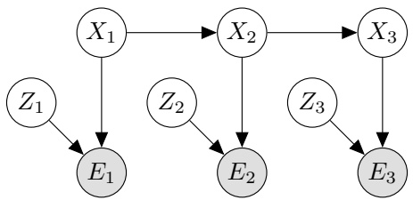

(c) [3 pts] State the modified Elapse Time update.

No Change

$$
P (X _ {t} | e _ {1}, \dots , e _ {t - 1}) =
$$

(d) [3 pts] State the modified Observe update.

No Change

$$
P (X _ {t} | e _ {1}, \dots , e _ {t}) =
$$

Finally, consider a graph where the newly introduced variables are unobserved and influenced by the evidence nodes.

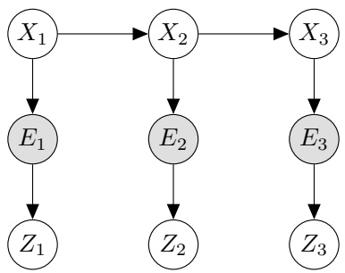

(e) [3 pts] State the modified Elapse Time update.

No Change

$$
P (X _ {t} | e _ {1}, \dots , e _ {t - 1}) =
$$

(f) [3 pts] State the modified Observe update.

No Change

$$
P (X _ {t} | e _ {1}, \dots , e _ {t}) =
$$

<!-- page: 10 -->

## Q4. [11 pts] Dual Perceptron CSPs

In this question, we formulate the dual perceptron algorithm as a constraint satisfaction problem (CSP). We have a binary classification problem with classes +1 and −1 and a set of n training points, $x _ { 1 } , x _ { 2 } , . . . , x _ { n }$ with labels $y _ { i } \in \{ - 1 , + 1 \}$

Recall that the dual perceptron algorithm takes as input a kernel function $K ( x _ { i } , x _ { j } )$ defined on all pairs of training points $x _ { i }$ and $x _ { j }$ , estimates an $\alpha _ { i }$ for each training point $x _ { i } ,$ and predicts the class of a point z using $h _ { \alpha } ( z )   =$ $\textstyle \sum _ { i = 1 } ^ { n } \alpha _ { i } K ( x _ { i } , z )$ , classifying z as positive (+1) if $h _ { \alpha } ( a ) \geq 0 ,$ , and negative (−1) otherwise.

Let the $\alpha _ { i }$ variables of the dual perceptron be the variables in a CSP, with domains restricted to $\{ - 1 , 0 , 1 \}$ . Each training point $x _ { i }$ induces a constraint $c _ { i }$ requiring that it is correctly classified with a margin of at least 1; i.e., $y _ { i } h _ { \alpha } ( x _ { i } ) \geq 1$

For this problem, we work with a predefined kernel function $K ( x _ { i } , x _ { j } )$ . The value of the kernel function (left) for the training points and their labels (right) are given in the tables below. In the kernel table, the $j ^ { \mathrm { t h } }$ entry in the $i ^ { \mathrm { t h } }$ row is the value of $K ( x _ { i } , x _ { j } )$

|  | x1 | x2 | x3 | x4 |
| --- | --- | --- | --- | --- |
| x1 | 1 | 0 | 0 | -1 |
| x2 | 0 | 4 | -2 | -2 |
| x3 | 0 | -2 | 1 | 1 |
| x4 | -1 | -2 | 1 | 2 |

| i | 1 2 3 4 |
| --- | --- |
| yi | -1 -1 +1 +1 |

(a) [2 pts] Write each constraint $c _ { i }$ as an inequality in terms of the variables α. (c1 has been completed for you.)

| c1 | α1 - α4 ≤ -1 | c3 |  |
| --- | --- | --- | --- |
| c2 |  | c4 |  |

(b) We now randomly initialize to the full assignment $\alpha = ( 1 , - 1 , 0 , - 1 )$

(i) [3 pts] For a constraint of the form $a \geq b ,$ define the constraint violation margin (CVM) as the difference $b - a .$ . For each of the above constraints, circle either Satisfied or Violated and compute the CVM.

|  | Satisfied? | CVM |  | Satisfied? | CVM |
| --- | --- | --- | --- | --- | --- |
| c1 | Satisfied Violated |  | c3 | Satisfied Violated |  |
| c2 | Satisfied Violated |  | c4 | Satisfied Violated |  |

(ii) [4 pts] We decide to run a variation of the min-conflicts algorithm. Recall that min-conflicts begins with a full assignment of all variables and tries to get all constraints satisfied by iteratively modifying the assignment.

In our variant of the algorithm, a single iteration consists of selecting the currently most violated constraint— i.e., the constraint with the highest CVM—and then reassigning all variables that are part of the constraint to values such that the new CVM for the selected constraint is minimized.

Starting from the assignment above $( \alpha = ( 1 , - 1 , 0 , - 1 ) )$ , run a single iteration of this algorithm. Indicate which constraint $c _ { i }$ is selected, then compute the updated assignment $\alpha ^ { \prime }$ and the updated CVM for the selected constraint $c _ { i }$ . Finally, indicate whether or not after this single iteration all constraints have been satisfied (and the algorithm terminates).

<!-- page: 11 -->

| Selected ci | α10 | α20 | α30 | α40 | Updated CVM | Terminated? |
| --- | --- | --- | --- | --- | --- | --- |
|  |  |  |  |  |  | Yes No |

(iii) [2 pts] Suppose we are given a solution to this CSP of $\alpha ^ { * } = ( - 1 , - 1 , + 1 , + 1 )$ . For each test point $z _ { i }$ whose kernel values with each training point are given in the table below, compute $h _ { \alpha ^ { * } } ( z _ { i } )$ and the predicted classification for $z _ { i }$

|  | K(x1,zi) | K(x2,zi) | K(x3,zi) | K(x4,zi) | hα∗(zi) | Class prediction? |
| --- | --- | --- | --- | --- | --- | --- |
| z1 | 3 | 0 | -2 | 1 |  |  |
| z2 | -2 | 1 | 2 | -2 |  |  |

<!-- page: 12 -->

## Q5. [18 pts] Generalization

We consider the following different classifiers for classification of samples in a 2-dimensional feature space.

PNoBias Linear perceptron without a bias term (features $\left[ \begin{matrix} { x _ { 1 } } & { x _ { 2 } ^ { \mathsf { T } } } \\ \end{matrix} \right] ^ { \mathsf { T } } )$

PBias Linear perceptron with a bias term (features -1 x 1 x 2 |)

PQuad Kernel perceptron with the quadratic kernel function $K ( x , z ) = ( 1 + x \cdot z ) ^ { 2 }$

PCutoff Kernel perceptron with the kernel function $K ( x , z ) = \operatorname* { m a x } \{ 0 , 0 . 0 1 - | | x - z | | _ { 2 } \} ( | | a - b | | _ { 2 }$ is the Euclidean distance between a and b) 1NN 1-nearest neighbor classifier 3NN 3-nearest neighbor classifier

(a) [8 pts] In each of the plots below you are given points from two classes, shown as filled rectangles and open circles. For each plot, fill in the bubble next to each classifier that will be able to perfectly classify all of the training data (or, if none, mark “None of these will classify the data perfectly”).

Note that when computing the nearest neighbors for a training data point, the training data point will be its own nearest neighbor.

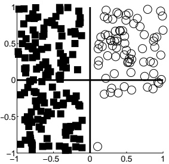

\# PNoBias # PQuad 1NN

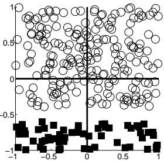

PBias PCutoff 3NN

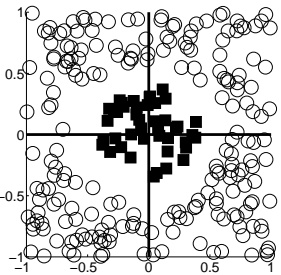

None of these will be able to classify the training data perfectly. PNoBias PQuad 1NN PBias PCutoff 3NN

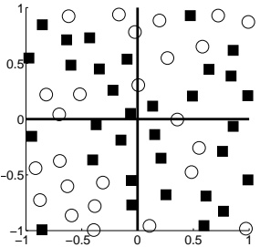

None of these will be able to classify the training data perfectly. PNoBias PQuad 1NN PBias PCutoff 3NN

None of these will be able to classify the training data perfectly. PNoBias PQuad 1NN PBias PCutoff 3NN

\# None of these will be able to classify the training data perfectly.

<!-- page: 13 -->

(b) (i) [5 pts] Suppose you train a classifier and test it on a held-out validation set. It gets 80% classification accuracy on the training set and 20% classification accuracy on the validation set. From what problem is your model most likely suffering? # Underfitting # Overfitting

Fill in the bubble next to any measure of the following which could reasonably be expected to improve your classifier’s performance on the validation set. # Add extra features # Remove some features

Briefly justify: # Collect more training data # Throw out some training data

Assuming features are outcome counts (k is the Laplace smoothing parameter controlling the number of extra times you “pretend” to have seen an outcome in the training data): # Increase k # Decrease k (assuming k > 0 currently)

Assuming your classifier is a Bayes’ net: # Add edges # Remove edges

(ii) [3 pts] Suppose you train a classifier and test it on a held-out validation set. It gets 30% classification accuracy on the training set and 30% classification accuracy on the validation set. From what problem is your model most likely suffering? # Underfitting # Overfitting

Fill in the bubble next to any measure of the following which could reasonably be expected to improve your classifier’s performance on the validation set. # Add extra features # Remove some features Briefly justify:

## Collect more training data # Throw out some training data

(iii) [2 pts] Your boss provides you with an image dataset in which some of the images contain your company’s logo, and others contain competitors’ logos. You are tasked to code up a classifier to distinguish your company’s logos from competitors’ logos. You complete the assignment quickly and even send your boss your code for training the classifier, but your boss is furious. Your boss says that when running your code with images and a random label for each of the images as input, the classifier achieved perfect accuracy on the training set. And this happens for all of the many random labelings that were generated. Do you agree that this is a problem? Justify your answer.

<!-- page: 14 -->

## Q6. [17 pts] Fun with Probability

In this question you will be asked to complete a table specifying a count of samples drawn from a probability distribution, and subsequently answer questions about Bayes’ nets constructed from the table using maximum likelihood techniques.

(a) [8 pts] The table below shows a count of samples drawn from a distribution over 4 variables: $A ,   B ,   C$ and D. As each of the 4 variables is binary, there are 16 possible values a sample can take on. The counts for 15 of these have been recorded in the table below, but the remaining one is missing.

Calculate the remaining value such that a maximum likelihood estimate of the joint probability distribution over the 4 variables below will have the following properties: $A \perp D \mid C$ and $B \perp D \mid C$ . You must show work in order to receive credit.

Hint: For this example just enforcing $B \perp D \mid C$ is sufficient to find n. (I.e., the numbers in this examples are chosen such that after enforcing $B \perp D   |   C$ the n you found will automatically also make $A \perp D   |   C$ hold true.)

|  |  |  |  | Sample |
| --- | --- | --- | --- | --- |
| A | B | C | D | Count |
| +a | +b | +c | +d | n |
| -a | +b | +c | +d | 18 |
| +a | -b | +c | +d | 3 |
| -a | -b | +c | +d | 9 |
| +a | +b | -c | +d | 6 |
| -a | +b | -c | +d | 2 |
| +a | -b | -c | +d | 0 |
| -a | -b | -c | +d | 8 |
| +a | +b | +c | -d | 6 |
| -a | +b | +c | -d | 6 |
| +a | -b | +c | -d | 1 |
| -a | -b | +c | -d | 3 |
| +a | +b | -c | -d | 18 |
| -a | +b | -c | -d | 6 |
| +a | -b | -c | -d | 0 |
| -a | -b | -c | -d | 24 |

<!-- page: 15 -->

(b) [3 pts] Draw a Bayes’ net that makes exactly the 2 independence assumptions indicated by the set of samples shown above: $A \perp D   |   C$ and $B \perp D   |   C .$ . Make sure it doesn’t make any additional independence assumptions.

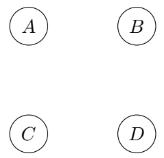

(c) [6 pts] Now we run maximum likelihood learning of the parameters for each of the Bayes’ nets below from the data on the previous page. The result is four learned distributions $\begin{array} { l } { P ^ { ( 1 ) } ( A , B , C , \dot { D } ) , P ^ { ( 2 ) } ( A , B , C , D ) } \\ \end{array}$ $P^{(3)}(A,B,C,D),\tilde{P^{(4)}}(A,\tilde{B},\tilde{C},D)$ . We also define another distribution $P^{(0)}(\widetilde{A,B,C,D})$ which is obtained by renormalizing the table on the previous page. Fill in the bubble for every true statement below. Hint: You shouldn’t need to inspect the numbers in the table on the previous page. The key information about the table on the previous page is that the numbers are such that $\widetilde { P } ^ { ( 0 ) } ( A , \widetilde { B } , \widetilde { C } , D )$ satisfies $A   \perp   D \mid C$ and $B \perp D \mid C ,$ but doesn’t satisfy any other independence assumptions.

P(1)

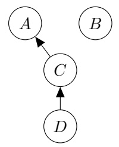

$$
P ^ {(0)} (B) = P ^ {(1)} (B) \quad \bigcirc \quad P ^ {(0)} (D \mid C) = P ^ {(1)} (D \mid C) \quad \bigcirc \quad P ^ {(0)} (A, B) = P ^ {(1)} (A, B)
$$

P(2)

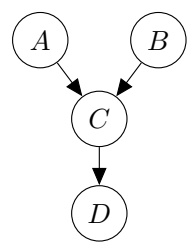

\# $P^{(0)}(B) = P^{(2)}(B)$ # $P ^ { ( 0 ) } ( D   |   C ) = P ^ { ( 2 ) } ( D   |   C )$ $P^{(0)}(A,B)=P^{(2)}(A,B)$

P(3)

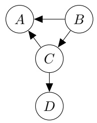

\# $P^{(0)}(B) = P^{(3)}(B)$ () $P ^ { ( 0 ) } ( D   |   C ) = P ^ { ( 3 ) } ( D   |   C )$ $P^{(0)}(A,B)=P^{(3)}(A,B)$

P(4)

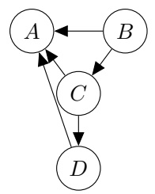

$$
P ^ {(0)} (B) = P ^ {(4)} (B)
$$

$$
P ^ {(0)} (D \mid C) = P ^ {(4)} (D \mid C)
$$

<!-- page: 16 -->

## Q7. [5 pts] Games

Consider a zero-sum game with two players, one maximizing agent and one minimizing agent, in which the ordering of moves is no longer deterministic. Each turn, a coin is flipped in order to determine which agent gets to make a move during that time step.

Consider the game tree below encoding the result of playing for two turns. It is currently the maximizer’s move, so the top node is a max node, but we don’t know which agent is going to play on the next turn, so we’ve replaced those nodes with boxes. Draw a new game tree that consists of only the traditional min, max, and expecti-nodes that models this situation.

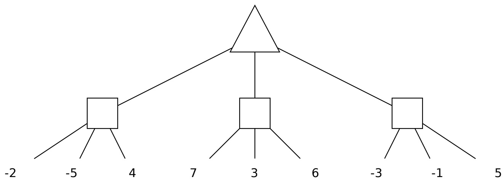

<!-- page: 17 -->

## Q8. [6 pts] Pruning

Pacman has a new kind of magic that allows him to look ahead during game search. Concretely, for a given node he can call a function Get-Lowest-Avg-Highest(node) which tells him the lowest, L, highest, H, and average, A, values of all leaves below that node in the tree.

Below is some modified code for performing alpha-beta pruning in this new situation. Select the choices that result in maximal pruning while still preserving that the correct value is found.

function MAX-VALUE(node, $\alpha$, $\beta$)
    if node is leaf then
        return VALUE(node)
    (L, A, H) ← GET-LOWEST-AVG-HIGHEST(node)
    if (1) then
        return H
    v ← -$\infty$
    for child ← CHILDREN(node) do
        v ← MAX(v, MIN-VALUE(child, $\alpha$, $\beta$))
        if v == H then
            return v
        if v ≥ $\beta$ then
            return v
        $\alpha$ ← MAX($\alpha$, v)
    return v
    (1)
        ○ L &lt; $\alpha$
        ○ L &lt; $\beta$
        ○ L &gt; $\alpha$
        ○ L &gt; $\beta$
        ○ H &lt; $\alpha$
        ○ H &lt; $\beta$
        ○ H &gt; $\alpha$
        ○ H &gt; $\beta$
        ○ A &lt; $\alpha$
        ○ A &lt; $\beta$
        ○ A &gt; $\alpha$
        ○ A &gt; $\beta$
function MIN-VALUE(node, $\alpha$, $\beta$)
    if node is leaf then
        return VALUE(node)
    (L, A, H) ← GET-LOWEST-AVG-HIGHEST(node)
    if (2) then
        return L
    v ← $\infty$
    for child ← CHILDREN(node) do
        v ← MIN(v, MAX-VALUE(child, $\alpha$, $\beta$))
        if v == L then
            return v
        if v ≤ $\alpha$ then
            return v
        $\beta$ ← MIN($\beta$, v)
    return v
    (2)
        ○ L &lt; $\alpha$
        ○ L &lt; $\beta$
        ○ L &gt; $\alpha$
        ○ L &gt; $\beta$
        ○ H &lt; $\alpha$
        ○ H &lt; $\beta$
        ○ H &gt; $\alpha$
        ○ H &gt; $\beta$
        ○ A &lt; $\alpha$
        ○ A &lt; $\beta$
        ○ A &gt; $\alpha$ $A &gt; \beta$

<!-- page: 18 -->
