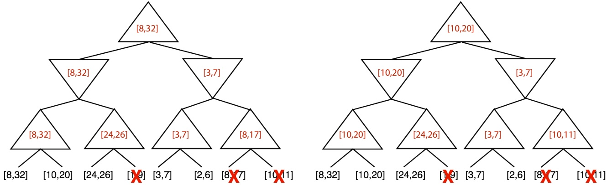
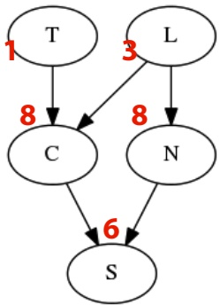
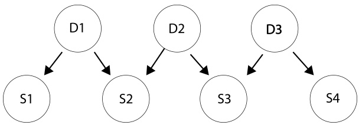
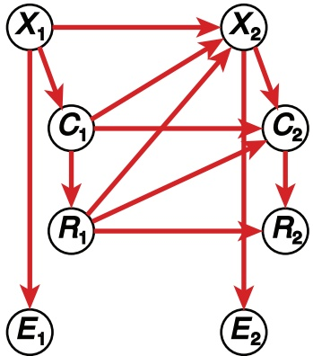
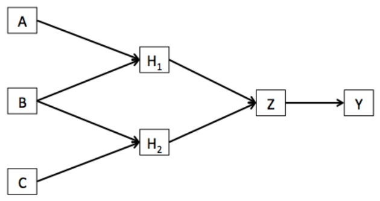
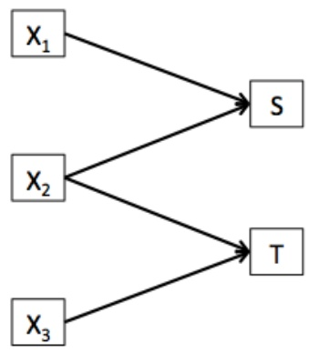
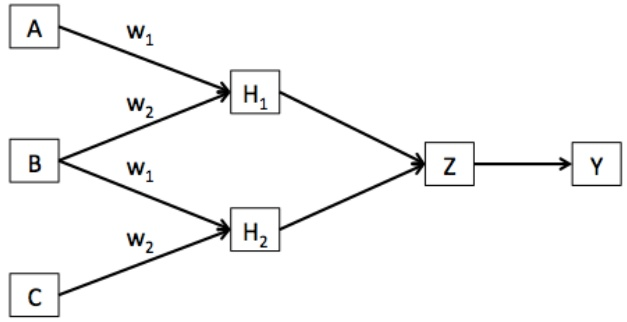

<!-- page: 1 -->

| CS 188 | Introduction to |  |
| --- | --- | --- |
| Fall 2014 | Artificial Intelligence | Final |

## INSTRUCTIONS

• You have 2 hours 50 minutes.

• The exam is closed book, closed notes except a one-page crib sheet.

• Please use non-programmable calculators only. Laptops, phones, etc., may not be used. If you have one in your bag please switch it off.

• Mark your answers ON THE EXAM ITSELF. If you are not sure of your answer you may wish to provide a brief explanation. All short answer sections can be successfully answered in a few sentences at most.

• Questions are not sequenced in order of difficulty. Make sure to look ahead if stuck on a particular question.

| Last Name |  |
| --- | --- |
| First Name |  |
| SID |  |
| Email |  |
| First and last name of person on left |  |
| First and last name of person on right |  |
| All the work on this exam is my own.(please sign) |  |

<table><tbody><tr><td>Q. 1</td><td>Q. 2</td><td>Q. 3</td><td>Q. 4</td><td>Q. 5</td><td>Q. 6</td><td>Q. 7</td><td colspan="3">Q. 8 Q. 9 Q. 10</td><td>Total</td></tr><tr><td>/10</td><td>/10</td><td>/ 11</td><td>/ 6</td><td>/12</td><td>/12</td><td>/11</td><td>/11</td><td>/7</td><td>/10</td><td>/100</td></tr></tbody></table>

<!-- page: 2 -->

## 1. (10 points) Agents, Search, CSPs

Please CIRCLE either True OR False for the following questions.

**(a) (1 pt)** True/ <u>False</u> : A hill-climbing algorithm that never visits states with lower value (or higher cost) is guaranteed to find the optimal solution if given enough time to find a solution.

Such an algorithm will reach a local optimum and stop (or wander on a plateau).

**(b) (1 pt)** True/ <u>False</u> : Suppose the temperature schedule for simulated annealing is set to be constant up to time N and zero thereafter. For any finite problem, we can set N large enough so that the algorithm is returns an optimal solution with probability 1.

If the temperature is fixed the algorithm always has a certain amount of randomness, so when it stops there is no guarantee it will be in an optimal state.

**(c) (1 pt)** True/ <u>False</u> : For any local-search problem, hill-climbing will return a global optimum if the algorithm is run starting at any state that is a neighbor of a neighbor of the state corresponding to the global optimum.

The intervening neighbor could be a local minimum and the current state is on another slope leading to a local maximum.

**(d) (1 pt)** <u>True</u> / <u>False</u> : Given a fully observable task environment where there is more than one action at every particular state, there exists a simple reflex agent that can take a different action upon revisiting the same state.

The question was not worded precisely enough, since it’s not clear if randomized actions are allowed. Technically they are, so the answer is True, but we allowed both.

**(e) (1 pt)** True/ <u>False</u> : Running forward checking after the assignment of a variable in backtracking search will ensure that every variable is arc consistent with every other variable.

Forward checking only checks variables that are connected to the variable being assigned.

**(f) (1 pt)** <u>True</u> / <u>False</u> : Suppose we use the min-conflicts algorithm to try to solve a CSP. It is possible the algorithm will not terminate even if the CSP has a solution.

Since min-conflicts takes an integer number of steps as input, it always terminates; but it is true that it can get stuck in local minima where it loops through the same set of states, so we allowed both answers.

**(g) (1 pt)** True/ <u>False</u> : In a CSP constraint graph, a link (edge) between any two variables implies that those two variables may not take on the same values.

A link represents any constraint, including, e.g., equality!

<!-- page: 3 -->

**(h) (1 pt)** <u>True</u> /False: A model-based reflex agent maintains some internal state that it updates as the agent collects more information through percepts.

The internal state represents in some form what the agent knows about the external state of the world given the percepts to date, which is a good idea for partially observable environments.

**(i) (1 pt)** True/ <u>False</u> : For any particular CSP constraint graph, there exists exactly one minimal cutset.

There may be several minimal cutsets of equal size, particularly if the graph has symmetries.

**(j) (1 pt)** <u>True</u> /False: Suppose agent A1 is rational and agent A2 is irrational. There exists a task environment where A2’s actual score will be greater than A1’s actual score.

Rational decisions are defined by expected outcomes, not actual outcomes. A1 might just be unlucky.

<!-- page: 4 -->

## 2. (10 points) Game tree search on intervals

Consider a modification of a game tree where, rather than numbers, leaf nodes are now intervals, given by [lower, upper], and where the true value is somewhere inside the interval. Here is an example (with a spare copy for later use):



For parts (a) and (b), suppose the min and max players are both trying to optimize avg(lower, upper); that is, max is trying to maximize the average value of the interval chosen and min is trying to minimize it.

**(a) (2 pt)** In each node of the tree above, fill in the interval defining what the agent knows about the value of that node.

**(b) (2 pt)** In the tree above, cross out the leaves that would be pruned by alpha-beta pruning based on average values.

For parts (c) and (d), assume that upper(interval) is the upper bound of current interval we are looking at, lower(interval) is the lower bound, α is the best value for max seen so far and β the best value for min.

**(c) (3 pt)** Suppose that min and max are both pessimistic: both try to optimize their worst possible outcomes. Is pruning possible in this scenario? If so, write the pruning condition which, if true, would lead to maximal pruning while evaluating a max node. If not, explain why not.

At a max node, choose the child with the highest lower bound; at a min node, choose the node with the lowest upper bound. The right-hand tree above shows that pruning is possible. Once the third grandchild of the root is known to be [3,7], its parent, a min node, will choose a child with an upper bound of 7 or less. The lower bound of this node has to be 7 or less, by definition, so at the root max will always choose the left branch; thus the fourth grandchild and its two leaves can be pruned.

**(d) (3 pt)** Suppose that min and max are both optimistic: both try to optimize their best possible outcomes. Is pruning possible in this scenario? If so, write the pruning condition which, if true, would lead to maximal pruning while evaluating a max node. If not, explain why not.

In this case pruning is not possible. Because the players are optimistic, both will think that a leaf node with interval [−∞, ∞] is ideal, so no leaf can be pruned in case it might be such a node.

<!-- page: 5 -->

## 3. (11 points) Propositional Logic

**(a) (3 pt)** $\boxed { { \mathit { T r u e } } } { \mathit { F a l s e } } { \colon } A \wedge B \implies C \mathbin { \mathsf { e n t a i l s } } ( A \implies C ) \vee ( B \implies C )$

A truth table shows that they are actually equivalent. Alternatively, one can argue that the LHS is false in a single case: TTF; and for the RHS to be false, both implications have to be false, again just the TTF case. Finally, one could convert to clause form, getting $\neg A \lor \neg B \lor C$ in both cases.

**(b) (2 pt)** True False: Every nonempty propositional clause, by itself, is satisfiable.

Obviously every literal is satisfiable; and disjoining means unioning the satisfying models. Many people thought that clauses were conjunctions of literals; a conjunction such as A ∧ ¬A is two clauses!

**(c) (2 pt)** <u>True</u> /False: Suppose a propositional clause contains three literals, each mentioning a different variable; <u>then the clause is satisfied in exactly 7 of the 8 possible models for the three variables.</u>

The clause can be false only if all three literals are false, which fixes a single model of the 8

**(d) (4 pt)** Now explain why the following set of clauses is unsatisfiable without using truth tables:

$$
A \vee B \vee C
$$

$$
\neg A \lor B \lor C
$$

$$
A \lor B \lor \neg C
$$

$$
\neg A \lor B \lor \neg C
$$

$$
A \lor \neg B \lor C
$$

$$
A \lor \neg B \lor \neg C
$$

$$
\neg A \lor \neg B \lor \neg C
$$

Since each clause is false in exactly one model, and all clauses are different and therefore false in different models, all 8 models are ruled out hence the conjunction is unsatisfiable. There are other elegant proofs: for example, suppose there is a satisfying model $[ A   =   a , B   =   b , C   =   c ] ;$ that falsifies the clause $\neg a \lor \neg b \lor \neg c ,$ which must be a member of the set, hence no such model can exist. Some more elaborate proofs based on splitting on variable values amount to truth tables in disguise. One approach definitely won’t work: claiming that, say, $A \vee B \vee C$ and ¬A $\lor \lnot B \lor \lnot C$ are contradictory; in fact, there are 6 models where both are true!

<!-- page: 6 -->

<div class="docvortex-algorithm" style="white-space: pre-wrap; font-family:monospace;">
$2 * 2 * 3 * 4 * 2 - 1 = 95$
</div>

## 4. (6 points) Bayes Nets

You’re interested in predicting whether boba stores in Berkeley will be successful or go out of business. You decide to solve this problem using probablistic inference over a model with the following variables:

• S, whether or not the store will be successful. May take two values: true or f alse.

• T, whether or not the store makes boba with real tea leaves. May take two values: true or f alse.

• N, the number of other boba stores nearby. May take three values: $0 , 1 , \mathrm { o r } > 1$

• L, location of the store relative to campus. May take four values: north, south, east, or west.

• C, the cost of the boba. May take two values: cheap or expensive.

**(a) (1 pt)** Your first idea for a probability model is a joint probability table over all of the variables. How many free <u>parameters would this joint probability table have (after taking into account sum-to-1 constraints)?</u>

**(b) (2 pt)** You decide this is too many parameters. To fix this, you decide to model the problem with the following Bayes net instead:



For this network, write next to each node the total number of free parameters in its conditional probability table, taking into account sum-to-1 constraints.

**(c) (3 pt)** A new boba store is opening up! You don’t know how expensive it will be, but you have heard that it’s going to use real tea, it will be North of campus, and there will be one other boba store nearby. According to your model, what is the probability it will be successful? (Just write out the expression in terms of conditional probabilities from the model; no need to simplify, though you may include a normalizing constant.)

<div class="docvortex-algorithm" style="white-space: pre-wrap; font-family:monospace;">
The question asks for $P(S \mid T = true, L = north, N = 1)$. The most straightforward way to calculate this is to compute the full joint distribution with the given variables and then sum out the unknown variable, $C$. Recall that to calculate the full joint distribution in a Bayes net, we only need the conditional probabilities in our conditional probability table. The full calculation is: $P(S \mid T = true, L = north, N = 1)$
$= \alpha P(S, T = true, L = north, N = 1)$
$= \alpha \sum_{p} P(C = c, S, T = true, L = north, N = 1)$
$= \alpha \sum_{p} P(T = true)P(L = north)P(C = c \mid T = true, L = north)P(N = 1 \mid L = north)P(S \mid N = 1, C = c)$
</div>

<!-- page: 7 -->

## 5. (12 points) Bayes Nets

A k-zigzag network has k Boolean root variables and $k + 1$ Boolean leaf variables, where root i is connected to leaves i and i + 1. Here is an example for $k   =   3 ,$ where each $D _ { i }$ represents a Boolean disease variable and each $S _ { j }$ is a Boolean symptom variable:



Figure 1: A 3-zigzag Bayes net.

**(a) (1 pt)** Does having symptom $S _ { 4 }$ affect the probability of disease $D _ { 1 } ?$ Why or why not?

No. $D _ { 1 }$ is independent of its nondescendants (including $S _ { 4 } )$ given its parents (empty set), i.e., $D _ { 1 }$ is absolutely independent of $S _ { 4 }$

**(b) (3 pt)** Using only conditional probabilities from the model, express the probability of having symptom $S _ { 1 }$ but not symptom $S _ { 2 } ,$ given disease $D _ { 1 }$

$$
P (s _ {1} \land \neg s _ {2} \mid D _ {1}) = P (s _ {1} \mid D _ {1}) P (\neg s _ {2} \mid D _ {1}) = P (s _ {1} \mid D _ {1}) \sum_ {d _ {2}} P (d _ {2}) P (\neg s _ {2} \mid D _ {1}, d _ {2})
$$

**(c) (1 pt)** <u>True</u> /False: Exact inference in a k-zigzag net can be done in time O(k).

The network is a polytree.

**(d) (1 pt)** Suppose the values of all the symptom variables have been observed, and you would like to do Gibbs sampling on the disease variables (i.e., sample each variable given its Markov blanket). What is the largest number of non-evidence variables that have to be considered when sampling any particular disease variable? Explain your answer.

The Markov blanket of a disease includes its parents, children, children’s other parents; for a disease variable, the non-evidence variables in the Markov blanket are just the two neighboring disease variables.

<!-- page: 8 -->

**(e) (2 pt)** Suppose $k   =   5 0$ . You would like to run Gibbs sampling for 1 million samples. Is it a good idea to precompute all the sampling distributions, so that when generating each individual sample no arithmetic operations are needed? Explain.

Yes. Precomputation requires space for 200 numbers and saves tens of millions of computations.

**(f) (2 pt)** A k-zigzag++ network is a k-zigzag network with two extra variables: one is a root connected to all the leaves and one is a leaf to which all the roots are connected. You would like to run Gibbs sampling for 1 million samples in a 50-zigzag++ network. Is it a good idea to precompute all the sampling distributions? Explain.

No. The Markov blanket of every disease now includes all other diseases, and a table of $2 ^ { 5 0 }$ numbers is impossible to compute or store.

**(g) (2 pt)** Let us assume that in every case the values of all symptom variables are observed, which means that we can consider training a neural net to predict diseases from symptoms rather than using a Bayes net. Mary from MIT claims that an equivalent neural net can be obtained by reversing the arrows in the figure. She argues that because $D _ { 1 }$ doesn’t affect $S _ { 3 }$ and S<sub>4</sub>, they are not needed for predicting $D _ { 1 }$ . Is Mary right? Explain.

<div class="docvortex-algorithm" style="white-space: pre-wrap; font-family:monospace;">
No. While  $D_{1}$  is absolutely independent of  $S_{3}$ , it is not independence given  $S_{1}$  and  $S_{2}$ . The reason is that the value of  $S_{3}$  affects the probability of  $D_{2}$ ;  $D_{2}$  in turn can “explain away”  $S_{2}$ , thereby changing the probability of  $D_{1}$ . The same argument applies, by extension, to all symptoms.
</div>

<!-- page: 9 -->

## 6. (12 points) Hidden Semi-Markov Models


A Hidden Semi-Markov Model is an extention of HMMs where the system is allowed reside in a given state for some duration before a transition occurs to the next state (which may be the same state as before). In a regular HMM the durations are all 1. The HSMM formulation is as follows:

• Chain of state variables $X _ { 1 } , \ldots , X _ { T } ; X _ { t }$ is the state of the system at time $t ;$ actual states are labeled by integers.

• Chain of evidence variables $E _ { 1 } , \ldots , E _ { T } ; E _ { t }$ is the observation at time $t ;$ actual observations are labeled by integers.

• State sequence durations $D _ { 1 } , \ldots , D _ { M }$ , which take on positive integer values; $D _ { m }$ is the number of time steps the system resides in a state $i _ { m }$ between transition $m - 1$ and transition m.

It is helpful also to define the variables $S _ { m }$ and $F _ { m } ,$ the start and finish times for period $m ,$ where $S _ { 1 }   =   1 , \; F _ { 1 }   =   D _ { 1 }$ $S _ { 2 }   =   D _ { 1 }   +   1 , \; F _ { 2 }   =   D _ { 1 }   +   D _ { 2 }$ , etc. Then we can write $X _ { S _ { m } : F _ { m } } = i _ { m }$ as shorthand for $X_{S_m} = i_m, X_{S_m+1} =$ $i _ { m } , \ldots , X _ { F _ { m } } = i _ { m }$

Suppose that a transition occurs at time t which is the end of residence period m with duration $D _ { m }$ . The new state depends on the old state and its duration, while the new duration depends only on the new state:

$$
P (X _ {t + 1}, D _ {m + 1} \mid X _ {t}, D _ {m}) = P (X _ {t + 1} | X _ {t}, d _ {m}) P (D _ {m + 1} | X _ {t + 1}).\tag{1}
$$

During a residence period, of course, the state and duration remain constant. In all cases the evidence at t depends only on the state at t. Thus, the entire probability model can be built from the following probability tables:

(A) Initial distribution of X: $P ( X _ { 1 } )$

(B) Sensor model: $P ( E | X )$

(C) Transition model: $P ( X _ { S _ { m + 1 } } = i | X _ { F _ { m } } = j , D _ { m } = d ) ;$

(D) Duration model: $P ( D | X )$

**(a) (2 pt)** Which of the following expressions are correct for $P _ { 1 } \mathop { = } P ( D _ { 1 } , X _ { 1 } , \ldots , X _ { D _ { 1 } } , E _ { 1 } , \ldots , E _ { D _ { 1 } } )$ , the probability that the first period has duration $D _ { 1 }$ and the state sequence is $X _ { 1 } , \ldots , X _ { D _ { 1 } }$ and the observation sequence is $E _ { 1 } , \ldots , E _ { D _ { 1 } }$ , assuming $X _ { 1 }   =   X _ { 2 }   =   \ldots   =   X _ { D _ { 1 } } ?$

$$
P (X _ {1}) P (D _ {1} \mid X _ {1}) \prod_ {t = 1} ^ {D _ {1}} P (E _ {t} \mid X _ {t})
$$

$$
P (X _ {1}) \prod_ {t = 1} ^ {D _ {1}} P (E _ {t} \mid X _ {t}) P (D _ {t} \mid X _ {t})
$$

C $P ( X _ { 1 } ) \textstyle \prod _ { t \: = \: 1 } ^ { D _ { 1 } } P ( E _ { t } \mid X _ { t } )$

N $\textstyle P ( X _ { 1 } , E _ { 1 } ) P ( D _ { 1 } \mid X _ { 1 } ) \prod _ { t \: = \: 2 } ^ { D _ { 1 } } P ( E _ { t } \mid X _ { t } )$

**(b) (2 pt)** The following expression is supposed to be the probability that the first M periods have durations $D _ { 1 } , \ldots , D _ { M }$ and the state sequence is $X _ { 1 } , \ldots , X _ { F _ { M } }$ and the observation sequence is $E _ { 1 } , \ldots , E _ { F _ { M } }$ , but one term is missing. What is that term and where does it go?

$$
P _ {1} \prod_ {m = 2} ^ {M} P (X _ {S _ {m}} \mid X _ {F _ {m - 1}}, D _ {m - 1}) \prod_ {t = S _ {m}} ^ {F _ {m}} P (E _ {t} \mid X _ {t})
$$

<!-- page: 10 -->

A term is needed for $D _ { m } , \mathtt { i . e . , } \: P ( D _ { m } \mid X _ { S _ { m } } )$ . It goes in the scope of the product over m.

**(c) (3 pt)** Suppose we want to describe an HSMM as an ordinary dynamic Bayes net that yields an exactly equivalent distribution over state and observation sequences. In addition to $X _ { t }$ and $E _ { t } ,$ we will handle durations using $C _ { t }$ , the duration of the current period, and $R _ { t } ,$ the amount of time left in the current period. In the figure below, add an appropriate (and minimal) set of links to define the model.



**(d) (2 pt)** Describe precisely the conditional distribution for $C _ { 2 }$ in your model.

If $R _ { 1 }   =   1$ then $C _ { 2 }$ depends on $X _ { 2 }$ according to the model $P ( D \mid X ) ;$ else $C _ { 2 }   =   C _ { 1 }$ Some students interpreted $C _ { t }$ as “the time spent so far in this period,” which is not quite what the question states but still results in a feasible (Markovian) model so we allowed it.

**(e) (3 pt)** The forward equation for an ordinary HMM is given by

$$
P (X _ {t + 1} \mid e _ {1: t + 1}) = \alpha   P (e _ {t + 1} \mid X _ {t + 1}) \sum_ {x _ {t}} P (X _ {t + 1} \mid x _ {t}) P (x _ {t} \mid e _ {1: t})  .
$$

Write the forward equation for this dynamic Bayes net; i.e., write an equation for $P ( X _ { t + 1 } , C _ { t + 1 } , R _ { t + 1 } \mid e _ { 1 : t + 1 } )$ in terms of $P ( X _ { t } , C _ { t } , R _ { t } \mid e _ { 1 : t } )$ and quantities given in the model.

The key is to realize that the state of the process is now constituted by X, C, R instead of just X but otherwise the equation has the same structure. And any distribution for $X$ becomes a joint distribution for X, C, R, expressed as a product of the appropriate conditionals:

$$
\alpha P (e _ {t + 1} \mid X _ {t + 1}) \sum_ {x _ {t}, c _ {t}, r _ {t}} P (X _ {t + 1} \mid x _ {t}, c _ {t}, r _ {t}) P (C _ {t + 1} \mid X _ {t + 1}, c _ {t}, r _ {t}) P (R _ {t + 1} \mid C _ {t + 1}, r _ {t}) P (x _ {t}, c _ {t}, r _ {t} \mid e _ {1: t})
$$

<!-- page: 11 -->

## 7. (11 points) MDPs

**(a) (3 pt)** The MDP of life has two actions $P a r t y$ and Study in the start state. After that, there is only one choice per state. If the agent parties, it receives a reward of +10 followed by an infinite sequence of rewards of –1. If the agent studies, it receives a reward of –10 followed by an infinite sequence of rewards of +1. For what value of the discount factor γ is the agent indifferent between partying and studying? (Recall that $1   +   x   +   x ^ { 2 }   +   \cdots   =   1 / ( 1   -   x ) . )$

At indifference, 10 − γ/(1 − γ) = −10 + γ/(1 − γ), so γ = 10/11.

The GSIs of 188 have started a game company. Their first game, GhostBlushers, starts with two ghosts, Blinky and Pinky. On each turn, the player clicks on a ghost. Clicking on any Blinky (action a<sub>B</sub>) produces a new Blinky with probability $( 2 b + p ) / 2 ( b + p )$ and a new Pinky otherwise, whereas clicking on any Pinky (action $a _ { P } )$ produces a new Pinky with probability $( b + 2 p ) / 2 ( b + p )$ and a new Blinky otherwise, where b and p are the numbers of Blinkies and Pinkies in the current state. There is a reward of +1 for producing an offspring of the same kind. The game ends after T steps.

<div class="docvortex-algorithm" style="white-space: pre-wrap; font-family:monospace;">
(b) (4 pt) Define the game as an MDP, with a minimal state space. (No need to describe both actions, just $a_B$.)
States: pairs $(b, p)$. (Time step is not needed as it's encoded in $b + p$.) Actions: $a_B, a_P$.
Transition model: $T((b, p), a_B, (b + 1, p)) = (2b + p)/2(b + p)$; $T((b, p), a_B, (b, p + 1)) = p/2(b + p)$; 0 otherwise.
Reward function: $T((b, p), a_B, (b + 1, p)) = 1$; 0 otherwise.
</div>

**(c) (1 pt)** The total number of states in the MDP is $\bigcirc \mathop { O } \mathopen { O } ( T )$

None of these

It’s just an arithmetic series up to the last time step which has O(T) states.

**(d)** <strong><u>(2 pt)</u></strong> <u>Explain why value iteration applied to this problem converges exactly after O(T) iterations.</u>

The key property of this MDP is that the state space is acyclic. After iteration t, states t steps from the end have exact values and no changes take place after that. After T iterations the root is correct. This is in direct contrast to the typical process for a model with cycles in the state space, where convergence is geometric and continues for ever. Notice, on the other hand, that each iteration of VI updates ALL the states; it does not “start from the end and work back.”

**(e) (1 pt)** Assuming that Bellman backups at each state consider only successor states that have nonzero probability, the total runtime of value iteration on this problem is O $O ( T ^ { 2 } )$ N $O ( T ^ { 3 } )$ O(T<sup>4</sup>) O(2<sup>T</sup>) None of these

<!-- page: 12 -->

For each state the backup work is constant (only two successors); T iterations times $O ( T ^ { 2 } )$ states is $O ( T ^ { 3 } )$

<!-- page: 13 -->

## 8. (11 points) Approximate Q-Learning

The UC system is experimenting with new transportation options that will help students move between all 10 campuses.

Each possible **state** for a student is a tuple of location (one of 10 campuses) and mood (happy or upset).

Available **actions**: Bus, T axi, Motorcycle. Actions have the following properties:

| Action | Makes Stops | Max. Passengers | Has Wi-Fi |
| --- | --- | --- | --- |
| Bus | Yes | 50 | Yes |
| Taxi | No | 4 | No |
| Motorcycle | No | 1 | No |

We will use a linear, feature-based approximation of the Q-values:

Linear value function: $Q _ { \mathbf { w } } ( s , a ) = \sum _ { i = 0 } ^ { 3 } f _ { i } ( s , a ) w _ { i } .$

<table><tr><td colspan="2">Features</td><td>Initial Weights</td></tr><tr><td colspan="2"> $f_0(state, action) = 1$  (this is a bias feature that is always 1)</td><td> $w_0 = 1$ </td></tr><tr><td colspan="2"> $f_1(state, action) = \left\{ \begin{array}{ll} 1 & \text{if action makes stops} \\ 0 & \text{otherwise} \end{array} \right.$ </td><td> $w_1 = 2.5$ </td></tr><tr><td colspan="2"> $f_2(state, action) = \left\{ \begin{array}{ll} 1 & \text{if action has max. passengers > 1} \\ 0 & \text{otherwise} \end{array} \right.$ </td><td> $w_2 = 0.5$ </td></tr><tr><td colspan="2"> $f_3(state, action) = \left\{ \begin{array}{ll} 1 & \text{if action has Wi-Fi} \\ 0 & \text{otherwise} \end{array} \right.$ </td><td> $w_3 = 1$ </td></tr></table>

Remember that the approximate Q-values are a function of the weights, so make sure to use the chain rule as follows whenever updating the weights:

$$
w _ {i} \leftarrow w _ {i} + \alpha \left[ r + \gamma \max _ {a ^ {\prime}} Q _ {\mathbf {w}} (s ^ {\prime}, a ^ {\prime}) - Q _ {\mathbf {w}} (s, a) \right] \frac {\partial}{\partial w _ {i}} Q _ {\mathbf {w}} (s, a)
$$

**(a) (3 pt)** Calculate the following initial Q values given the initial weights above:

| Q( (UCLA,upset), Bus ) | 1+2.5+0.5+1 = 5 |
| --- | --- |
| Q( (UCLA,upset), Taxi ) | 1+0+0.5+0 = 1.5 |
| Q( (UCLA,upset), Motorcycle ) | 1 + 0 + 0 + 0 = 1 |

**(b) (2 pt)** The initial Q-values for the state (UCLA, upset) happen to be equal to the corresponding initial Q-values for the state (Berkeley, happy). As you update the weights, will these values always be the equal to each other? In other words, will $Q _ { \mathbf { w } } ( \; ( U C \dot { L A } , u p s e t ) , \; a \; ) \: = \: Q _ { \mathbf { w } } ( \; ( B e r k e l e y , h a p p y ) , \; a \; )$ given any action a and vector of weights w?

N Yes No

Why / Why not? (in just one sentence)

They are always equal because our features are not dependent on the state.

<!-- page: 14 -->

**(c) (2 pt)** Exploration / exploitation: Given the Q-values for the state (UCLA, upset) you calculated on the previous page, what is the probability that each action could be chosen when using -greedy exploration (assuming any random movements are chosen uniformly from all actions)?

<table><tbody><tr><td>Action</td><td>Probability (in terms of)</td></tr><tr><td rowspan="2">Bus</td><td rowspan="2">(1 -) + 3= 1 - 23</td></tr><tr></tr><tr><td rowspan="2">Taxi</td><td rowspan="2">3</td></tr><tr></tr><tr><td rowspan="2">Motorcycle</td><td rowspan="2">3</td></tr><tr></tr></tbody></table>

**(d) (2 pt)** Given a sample with start state = (Berkeley, happy), action= Taxi, successor state $\mathbf { \mathit { c } } = ( U C L A , \; u p s e t )$ , and reward = -7: Using a learning rate of $\alpha = 0 . 5$ and discount of $\gamma = 0 . 5$ , update each of the weights.

$$
\text {Difference} = - 7 + 0. 5 * \max (5, 1. 5, 1) - 1. 5 = - 6
$$

$$
\begin{array}{r l} & {\frac {\partial}{\partial w _ {i}} Q _ {\mathbf {w}} (s, a) = f _ {i}} \\ & {w _ {0} = 1 + 0. 5 * (- 6) * 1 = - 2} \end{array}
$$

$$
w _ {1} = 2. 5 + 0. 5 * (- 6) * 0 = 2. 5
$$

$$
w _ {2} = 0. 5 + 0. 5 * (- 6) * 1 = - 2. 5
$$

$$
w _ {3} = 1 + 0. 5 * (- 6) * 0 = 1
$$

**(e) (2 pt)** Give one advantage and one disadvantage of using approximate Q-Learning rather than standard Q-Learning.

```txt
Pros: Feature representation scales to very large or infinite spaces; learning process generalizes from seen states to unseen states.
Cons: True Q may not be representable in the chosen form; learning may not converge; need to design feature functions.
```

<!-- page: 15 -->

## 9. (7 points) Decision Trees

After taking CS188, Alice wants to construct a decision tree classifier to predict flight delays. She has collected the data for a few months. A summary of the data is provided in table below. Read it **carefully**.

<table><tbody><tr><td rowspan="2">Feature</td><td colspan="2">Feature value = Yes</td><td colspan="2">Feature value = No</td></tr><tr><td># Delayed</td><td># not Delayed</td><td># Delayed</td><td># not Delayed</td></tr><tr><td>Rain</td><td>30</td><td>10</td><td>10</td><td>30</td></tr><tr><td>Wind</td><td>25</td><td>15</td><td>15</td><td>25</td></tr><tr><td>Summer</td><td>5</td><td>35</td><td>35</td><td>5</td></tr><tr><td>Winter</td><td>20</td><td>10</td><td>20</td><td>20</td></tr><tr><td>Day</td><td>20</td><td>20</td><td>20</td><td>20</td></tr><tr><td>Night</td><td>15</td><td>10</td><td>25</td><td>30</td></tr></tbody></table>

**(a) (1 pt)** Alice thinks she was tired when filling in the last column and may have made a mistake. Please correct it in the table for her.

The 4th number is wrong, as the row total should be 80 no matter what feature is used to classify the data. We should change 20 to 30.

**(b) (2 pt)** Which of “ Rain” and “Day” has the higher information gain for predicting delay? Explain without numerical calculations.

Day is useless: the subsets have the same delay proportions as the original set; Rain is better as the proportions are different from the prior.

**(c) (2 pt)** Bob the Stanford student says **among all six features**, “Rain” should be at the root of the decision tree. Do you agree with him? If not, which feature should be at the root? Explain why **qualitatively**.

No. “Rain” is not the best feature. Note that the distribution of “Delay” conditioned on “Summer” is more skewed than conditioned on all other features, which implies the maximum information gain can be achieved when “Summer” is chosen as the root.

**(d) (2 pt)** Based **only** on the table, can you determine which feature should be on the second level (the level just beneath the root) of the decision tree? If yes, which one is it? Support your answer **qualitatively**.

No, it is impossible to tell. To determine the second level feature we need to know the breakdown of delays for the other features given the value of “Summer”. Since we only have summaries for delay given one feature in this table, there is not enough information to determine the feature that would lead to the highest information gain AFTER we used “Summer”

<!-- page: 16 -->



(a)



(b)

Figure 2: (a) A neural network with two hidden layers; (b) a multiclass perceptron.

## 10. (10 points) Neural Networks

**(a) (2 pt)** Consider the (non-fully connected) neural network in Figure 2(a), where each node is assumed to have a bias input of constant value 1 that is not shown. Assume the inputs to A, B, C and the output Y are boolean (1 or 0). Could this network correctly classify each of the following logical operations? Briefly justify.

$$
(A \land B \land C) \lor (\neg A \land B \land C)
$$

Yes, this is equivalent to $B \wedge C$ which can be classified using $H _ { 2 }$

A XOR B

No, because (1) $H _ { 1 }$ can only separate the inputs into two sets of size two, each with one positive and one negative example, or into a set of size three and a singleton. (2) $H _ { 2 }$ can only test on B, which is not enough to separate the sets from (1) correctly.

Now assume we have the (non-fully connected) multi-class perceptron shown in Figure 2(b); here we assume no bias inputs. Such a perceptron returns as a prediction the label of the output node with the highest output value.

**(b) (4 pt)** Suppose we start with the weights [1, 1] for output S and the weights [0, 1] for output T and a learning rate of 1. Given the following example run one iteration of weight update.

$$
X _ {1} = - 1, X _ {2} = 0. 5, X _ {3} = 1, l a b e l = S
$$

<!-- page: 17 -->

<div class="docvortex-algorithm" style="white-space: pre-wrap; font-family:monospace;">
Here we do normal perceptron weight updates, the only difference is that S only has weights for $X_1$ and $X_2$ while T only has weights for $X_2$ and $X_3$.
1) Feed Forward
$output_S = 1 * -1 + 1 * 0.5 = -0.5$
$output_T = 0 * 0.5 + 1 * 1 = 1$
So we predict T which is incorrect so we update the weights.
$W_S = [1, 1] + [-1, 0.5] = [0, 1.5]$
$W_T = [0, 1] - [0.5, 1] = [-0.5, 0]$
</div>

**(c) (2 pt)** Independent of your answer to the previous problem, assume you arrived at the conclusion that the weights for S are [0, 2] and the weights for T are [-1, 0]. What is the condition on the inputs such that this network chooses S rather than T? Express the condition as simply as possible.

<div class="docvortex-algorithm" style="white-space: pre-wrap; font-family:monospace;">
The condition for choosing $S$ over $T$ is $(0 \cdot X_1) + (2 \cdot X_2) &gt; (-1 \cdot X_2) + (0 \cdot X_3)$ which simplifies to $X_2 &gt; 0$.
</div>

Many neural networks used in practice have weights that are shared across multiple connections. In the example below, there are two weights in the first layer, $w _ { 1 }$ and $w _ { 2 } ,$ , each of which appears twice.



**(d) (1 pt)** What effect would you expect weight sharing to have on the training error?

```txt
○ It should go down    ⊗ It should go up    ○ Cannot tell given this information
This reduces the ability of the model to fit the data well.
```

**(e) (1 pt)** What effect would you expect weight sharing to have on the test error? It should go down It should go up N Cannot tell given this information

<!-- page: 18 -->

It could go either way, depending on the tradeoff between reduced expressive power and whether the true function agrees or nearly agrees with the constrained function space.
