<!-- page: 1 -->

## CS 188 Introduction to Summer 2014Artificial Intelligence

• You have approximately 2 hours and 50 minutes.

• The exam is closed book, closed notes except your two-page crib sheet.

• Mark your answers ON THE EXAM ITSELF. If you are not sure of your answer you may wish to provide a brief explanation. All short answer sections can be successfully answered in a few sentences AT MOST.

<table><tr><td>First name</td><td></td></tr><tr><td>Last name</td><td></td></tr><tr><td>SID</td><td></td></tr><tr><td>edX username</td><td></td></tr><tr><td colspan="2"></td></tr><tr><td>First and last name of student to your left</td><td></td></tr><tr><td>First and last name of student to your right</td><td></td></tr></table>

For staff use only:

| Q1. Warm-Up | /1 |
| --- | --- |
| Q2. Search &amp; Games | /6 |
| Q3. CSPs | /6 |
| Q4. MDPs &amp; RL | /10 |
| Q5. Probability | /10 |
| Q6. VPI | /12 |
| Q7. Bayes' Nets | /12 |
| Q8. Bayes' Nets Sampling | /7 |
| Q9. HMMs | /12 |
| Q10. Particle Filtering | /6 |
| Q11. ML: Maximum Likelihood | /10 |
| Q12. ML: Perceptrons and Kernels | /8 |
| Total | /100 |

<!-- page: 2 -->

<!-- page: 3 -->

Q1. [1 pt] Warm-Up

Circle the CS 188 mascot

<!-- page: 4 -->

## Q2. [6 pts] Search & Games

(a) [4 pts] In this question, we will be formulating flying between two locations as a search problem. After working hard all summer, you have decided to go on a vacation in Australia. You want to get there as fast as possible, regardless of the cost or the number of flights you need to take. Flights have a departure time and location and an arrival time and location. Between flights you wait in the city. Formulate this as a search problem with a minimal state space:

What are the states for this search problem?

Current city

\## Current city and amount of time spent traveling so far

\# Current city and current time

\# Current city, current time, and amount of time spent traveling so far

What is the successor function for this search problem?

Action: Take a flight

Successor: Update city Cost: Time length of the flight plus time until takeoff

Successor: Update city and current time Cost: Time length of the flight plus time until takeoff

Action: Take a flight and increase the amount of time so far

Successor: Update city and time spent traveling Cost: Time length of the flight plus time until takeoff

Action: Take a flight and increase the amount of time so far

Successor: Update city, time spent traveling, and current time Cost: Time length of the flight plus time until takeoff

What is the start state?

Oakland

Oakland, 0 minutes traveling

Oakland, 8pm

\## Oakland, 8pm, 0 minutes traveling

What is the goal test?

Check if the current city is in Australia

\# Check if the amount of time spent traveling is minimal

\# Check if the current city is in Australia and if the amount of time spent traveling is minimal # Check if the current city is in Australia, the amount of time spent traveling is minimal, and if the current time is minimal

(b) [2 pts] In this question, you are writing a program to compete in a chess tournament. Because it is your first time in the competition, you have been given access to your opponent’s program and are allowed to do anything with it. (They are experienced and so do not get access to your program.) You adjust your minimax: instead of considering all actions at a min node, you run your opponent’s code and consider only the action it would take. Time spent running your opponent’s code does not count towards your own time limit. Select all of the statements below that are true. If none are true, select none of them.

\# Your minimax search tree is equivalent to a game tree constructed with only max nodes # Running your code for the same amount of time as in regular minimax, you are able to search deeper in the game tree than you could with regular minimax

\# If you search to the same depth as you could with regular minimax you will always return the same answer as regular minimax

<!-- page: 5 -->

## Q3. [6 pts] CSPs

In this question we are considering CSPs for map coloring. Each region on the map is a variable, and their values are chosen from {black, gray, white}. Adjacent regions cannot have the same color. The figures below show the constraint graphs for three CSPs and an assignment for each one. None of the assignments are solutions as each has a pair of adjacent variables that are white. For both parts of this question, let the score of an assignment be the number of satisfied constraints (so a higher score is better).

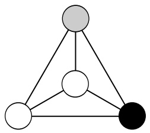

(1)

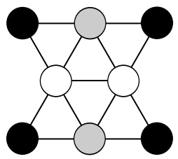

(2)

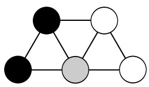

(3)

(a) [6 pts] Consider applying Local Search starting from each of the assignments in the figure above. For each successor function, indicate whether each configuration is a local optimum and whether it is a global optimum (note that the CSPs may not have satisfying assignments).

<table><tr><td>Successor Function</td><td>CSP</td><td colspan="2">Local optimum?</td><td colspan="2">Global Optimum?</td></tr><tr><td rowspan="3">Change a single variable</td><td>(1)</td><td>Yes</td><td>No</td><td>Yes</td><td>No</td></tr><tr><td>(2)</td><td>Yes</td><td>No</td><td>Yes</td><td>No</td></tr><tr><td>(3)</td><td>Yes</td><td>No</td><td>Yes</td><td>No</td></tr><tr><td rowspan="3">Change a single variable, or a pair of variables</td><td>(1)</td><td>Yes</td><td>No</td><td>Yes</td><td>No</td></tr><tr><td>(2)</td><td>Yes</td><td>No</td><td>Yes</td><td>No</td></tr><tr><td>(3)</td><td>Yes</td><td>No</td><td>Yes</td><td>No</td></tr></table>

<!-- page: 6 -->

## Q4. [10 pts] MDPs & RL

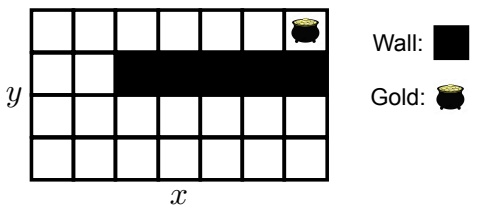

Consider the grid-world MDP above. The goal of the game is to reach the pot of gold. As soon as you land on the pot of gold you receive a reward and the game ends. Your agent can move around the grid by taking the following actions: North, South, East, West. Moving into a square that is not a wall is always successful. If you attempt to move into a grid location occupied by a wall or attempt to move off the board, you remain in your current grid location.

Our goal is to build a value function that assigns values to each grid location, but instead of keeping track of a separate number for each location, we are going to use features. Specifically, suppose we represent the value of state $( x , y )$ (a grid location) as $V ( x , y ) = w ^ { \top } f ( x , y )$ . Here, $f ( x , y )$ is a feature function that maps the grid location $( x , y )$ to a vector of features and w is a weights vector that parameterizes our value function.

In the next few questions, we will look at various possible feature functions $f ( x , y )$ We will think about the value functions that are representable using each set of features, and, further, think about which policies could be extracted from those value functions. Assume that when a policy is extracted from a value function, ties can be broken arbitrarily. In our definition of feature functions we will make use of the location of the pot of gold. Let the gold’s location be $( x ^ { * } , y ^ { * } )$ . Keep in mind the policies (i), (ii), (iii), (iv), (v), and (vi) shown below.

(i)

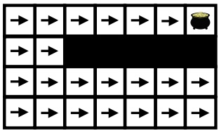

(ii)

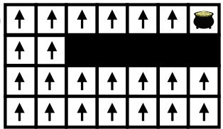

(iii)

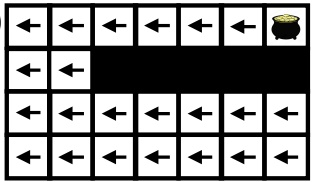

(iv)

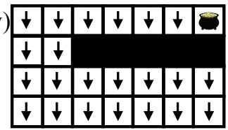

(vi)

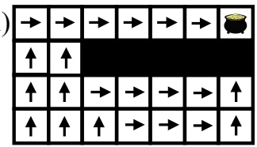

(a) [2 pts] Suppose we use a single feature: the x-distance to the pot of gold. Specifically, suppose $f ( x , y ) = | x   -   x ^ { * } |$ Which of the policies could be extracted from a value function that is representable using this feature function? Assume the weights vector w is not allowed to be 0. Circle all that apply. # (i) # (ii) # (iii) # (iv) # (v) # (vi)

<!-- page: 7 -->

(b) [2 pts] Suppose we use a single feature: the y-distance to the pot of gold. Specifically, suppose $f ( x , y ) = | y   -   y ^ { * } |$ Which of the policies could be extracted from a value function that is representable using this feature function? Assume the weights vector w is not allowed to be 0. Circle all that apply. # (i) # (ii) # (iii) # (iv) # (v) # (vi)

(c) [2 pts] Suppose we use a single feature: the Manhattan distance to the pot of gold. Specifically, suppose $\widehat { f ( x , y ) } = | x - x ^ { * } | + | y - y ^ { * } |$ Which of the policies could be extracted from a value function that is representable using this feature function? Assume the weights vector w is not allowed to be 0. Circle all that apply. # (i) # (ii) # (iii) # (iv) # (v) # (vi)

(d) [2 pts] Suppose we use a single feature: the length of the shortest path to the pot of gold. Which of the policies could be extracted from a value function that is representable using this feature function? Assume the weights vector w is not allowed to be 0. Circle all that apply. # (i) # (ii) # (iii) # (iv) # (v) # (vi)

(e) [2 pts] Suppose we use two features: the x-distance to the pot of gold and the y-distance to the pot of gold. Specifically, suppose $f ( x , y ) = ( | x   -   x ^ { * } | , | y   -   y ^ { * } | )$ . Which of the policies could be extracted from a value function that is representable using this feature function? Assume the weights vector w must have at least one non-zero entry. Circle all that apply. # (i) # (ii) # (iii) # (iv) # (v) # (vi)

<!-- page: 8 -->

## Q5. [10 pts] Probability

(a) [2 pts] Select all of the expressions below that are equivalent to $P ( A \mid B , C )$ given no independence assumptions. # $\textstyle \sum _ { d } P ( A \mid B , C , D = d )$ # $P(A \mid B)P(B \mid C)$ # $\textstyle \sum _ { d } P ( A , D = d \mid B , C )$ # $P(A \mid C)P(C \mid B)$ # $P(A \mid B)P(A \mid C)$ # $\scriptstyle { \frac { P ( A , B , C ) } { P ( B , C ) } }$ # $P ( A \mid C )$ # $\frac { P ( A ) P ( B | A ) P ( C | A , B ) } { P ( C ) P ( B | C ) }$

(b) [2 pts] Select all of the expressions below that are equivalent to P(A | B, C) given A ⊥⊥ B. $\textstyle \sum _ { d } P ( A \mid B , C , D = d )$ $P(A \mid B)P(B \mid C)$ $\textstyle \sum _ { d } P ( A , D = d \mid B , C )$ $P(A \mid C)P(C \mid B)$ $P(A \mid B)P(A \mid C)$ $\scriptstyle { \frac { P ( A , B , C ) } { P ( B , C ) } }$ # $P ( A \mid C )$ # $\frac { P ( A ) P ( B | A ) P ( C | A , B ) } { P ( C ) P ( B | C ) }$

(c) [2 pts] Select all of the expressions below that are equivalent to P(A | B, C) given B ⊥⊥ C | A. $\textstyle \sum _ { d } P ( A \mid B , C , D = d )$ # $P(A \mid B)P(B \mid C)$ # $\textstyle \sum _ { d } P ( A , D = d \mid B , C )$ # $P(A \mid C)P(C \mid B)$ # $P(A \mid B)P(A \mid C)$ # $\scriptstyle { \frac { P ( A , B , C ) } { P ( B , C ) } }$ # $P ( A \mid C )$ # $\frac { P ( A ) P ( B | A ) P ( C | A , B ) } { P ( C ) P ( B | C ) }$

(d) [2 pts] Select all of the expressions below that hold for any distribution over four random variables A, B, C and D. # $P(A,B \mid C,D) = P(A \mid C,D)P(B \mid A,C,D)$ # $P ( A , B \mid C , D ) = P ( A , B ) P ( C , D ) P ( C , D \mid A , B )$ # $P ( A , B ) = P ( A , B \mid C , D ) P ( C , D )$ # $P ( A , B \mid C , D ) = P ( A , B ) P ( D ) P ( C , D \mid A , B )$

(e) [2 pts] Circle all of the Bayes’ Nets below in which the following expression always holds: $P(A,B)P(C)=P(A)P(B,C)$

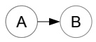

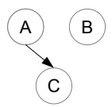

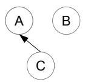

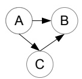

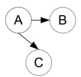

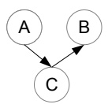

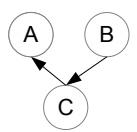

<!-- page: 9 -->

## Q6. [12 pts] VPI

You’re playing a game on TV where you are asked a yes-or-no question. If you answer it correctly, you could win a lot of money! You decide to approach your decision from the perspective of Value of Perfect Information. Your answer, A, is either yes or no. The goal is for your answer, A, to match the correct answer, C.

| C | P(C) |
| --- | --- |
| yes | 0.2 |
| no | 0.8 |

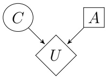

| C | A | U(C,A) |
| --- | --- | --- |
| yes | yes | +106 |
| yes | no | -103 |
| no | yes | 0 |
| no | no | +104 |

(a) Maximum Expected Utility

Compute the following quantities:

(i) [2 pts] $EU(ys) =$

(ii) [2 pts] $EU(no)=$

(iii) [1 pt] $M E U ( \{ \} ) =$

(iv) [1 pt] Optimal decision:

<!-- page: 10 -->

## (b) [2 pts] A Game of Telephone

In this game you have the option to phone a friend to find out what they think the answer is. Your friend will be asked the same question and give you their answer, F, which they also want to match C. Additional probability tables have been computed for you.

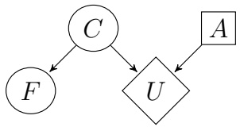

| F | C | P(F\|C) |
| --- | --- | --- |
| yes | yes | 0.6 |
| yes | no | 0.2 |
| no | yes | 0.4 |
| no | no | 0.8 |

| F | P(F) |
| --- | --- |
| yes | 0.25 |
| no | 0.75 |

| C | P(C) |
| --- | --- |
| yes | 0.2 |
| no | 0.8 |

| C | A | U(C,A) |
| --- | --- | --- |
| yes | yes | +106 |
| yes | no | -103 |
| no | yes | 0 |
| no | no | +104 |

| C | F | P(C\|F) |
| --- | --- | --- |
| yes | yes | 0.5 |
| yes | no | 0.1 |
| no | yes | 0.5 |
| no | no | 0.9 |

We have worked out for you that:

$$
M E U (\{F = y e s \}) = 5 \times 1 0 ^ {5} (y e s)
$$

$$
M E U (\{F = n o \}) = 1 0 ^ {5} (y e s)
$$

What is $VPI(\{F\})?$

## (c) [4 pts] Game of Shows

Eventually, your friend gives you their answer, but you notice that they sounded a bit. . . off. Maybe your friend is just sick — or maybe your arch-nemesis Leland has your friend’s phone tapped!

As a result, the answer that you heard, H, may not be the same as the answer that your friend gave you, F. You introduce two new nodes, one for H, the answer you heard, and one for T, which represents the probability that your arch-nemesis has intercepted your friend’s answer.

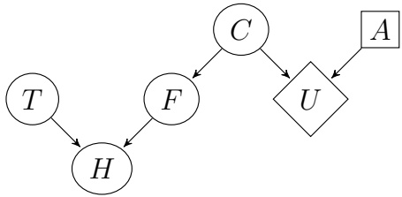

Determine whether the following expressions could be less than, equal to, or greater than zero. Fill in all of the choices that could be true under some setting of the probability tables P(T) and $P ( H | T , F )$

| VPI(F \| H) | less than 0 # equal to 0 # greater than 0 # |
| --- | --- |
| VPI(T) | less than 0 # equal to 0 # greater than 0 # |
| VPI(T \| H) | less than 0 # equal to 0 # greater than 0 # |
| VPI(T \| F,H) | less than 0 # equal to 0 # greater than 0 # |

<!-- page: 11 -->

Q7. [12 pts] Bayes’ Nets

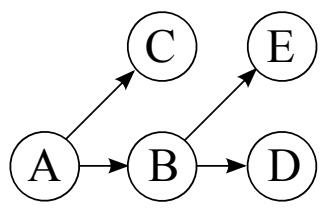

|  | P(A) |
| --- | --- |
| +a | 0.25 |
| -a | 0.75 |

| P(B\|A) | +b | -b |
| --- | --- | --- |
| +a | 0.5 | 0.5 |
| -a | 0.25 | 0.75 |

| P(C\|A) | +c | -c |
| --- | --- | --- |
| +a | 0.2 | 0.8 |
| -a | 0.6 | 0.4 |

| P(D\|B) | +d | -d |
| --- | --- | --- |
| +b | 0.6 | 0.4 |
| -b | 0.8 | 0.2 |

| P(E\|B) | +e | -e |
| --- | --- | --- |
| +b | 0.25 | 0.75 |
| -b | 0.1 | 0.9 |

(a) Using the Bayes’ Net and conditional probability tables above, calculate the following quantities: (i) [1 pt] $P(+a,+b)=$

(ii) [2 pts] $P(+a|+b)=$

(iii) [1 pt] $P(+b|+a)=$

(b) Now we are going to consider variable elimination in the Bayes’ Net above.

(i) [1 pt] Assume we have the evidence +c and wish to calculate $P(E \mid +  c )$ . What factors do we have initially?

(ii) [1 pt] If we eliminate variable B, we create a new factor. What probability does that factor correspond to?

<!-- page: 12 -->

This is the same figure as the previous page, repeated here for your convenience:

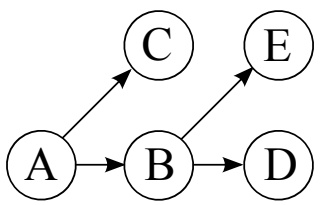

|  | P(A) | P(B\|A) | +b | -b |
| --- | --- | --- | --- | --- |
| +a | 0.25 | +a | 0.5 | 0.5 |
| -a | 0.75 | -a | 0.25 | 0.75 |

| P(C\|A) | +c | -c |
| --- | --- | --- |
| +a | 0.2 | 0.8 |
| -a | 0.6 | 0.4 |

| P(D\|B) | +d | -d |
| --- | --- | --- |
| +b | 0.6 | 0.4 |
| -b | 0.8 | 0.2 |

| P(E\|B) | +e | -e |
| --- | --- | --- |
| +b | 0.25 | 0.75 |
| -b | 0.1 | 0.9 |

(iii) [2 pts] What is the equation to calculate the factor we create when eliminating variable B?

(iv) [2 pts] After eliminating variable B, what are the new set of factors? As in (ii), write the probabilities that the factors represent. For each factor, also provide its size. Use only as many rows as you need to.

| Factor | Size after elimination |
| --- | --- |
|  |  |
|  |  |
|  |  |
|  |  |

(v) [1 pt] Now assume we have the evidence −c and are trying to calculate $P ( A | - c )$ . What is the most efficient elimination ordering? If more than one ordering is most efficient, provide any one of them.

(vi) [1 pt] Once we have run variable elimination and have $f ( A , - c )$ how do we calculate $P ( + a \mid { } - c ) ?$ (give an equation)

<!-- page: 13 -->

## Q8. [7 pts] Bayes’ Nets Sampling

Susan, Jerry, Beatrice, and Xavier are being given some money, but they have to share it in a very particular way. First, Susan will be given a number of dollars (an integer) between 1 and 100 (inclusive). The number is chosen uniformly at random from the 100 possibilities. In this problem, we will use the random variable S to represent the amount of money Susan receives.

Next, Susan will give some portion of her money to Jerry. The amount she gives him will be represented by the random variable J. Susan chooses how much to give Jerry by selecting an integer uniformly at random between 1 and S (inclusive). Jerry will then follow the same process, giving B dollars to Beatrice (selected uniformly at random between 1 and J, inclusive). Finally, Beatrice will give some portion of her money to Xavier (uniformly at random between 1 and B, inclusive). The Bayes’ net corresponding to this process is shown to the right.

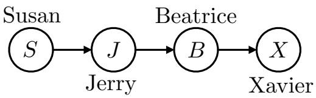

Suppose you are Xavier and you receive \$5 from Beatrice $(i.e.   X = 5  )$ . You want to know how much money Susan received. In particular, you want to know the probability that Susan received more than \$50. In other words, you want to know $P ( S > 5 0 | X = 5 )$ . You decide to try various sampling methods using the Bayes’ net above (and the conditional probability tables implied by the money sharing process) to approximate $P ( S > 5 0 | X = 5 )$

(a) [2 pts] You try using prior sampling, generating the following samples from your model:

$$
\begin{array}{c} (S = 5 2, J = 2 1, B = 1 0, X = 5) \\ (S = 3 4, J = 2 1, B = 6, X = 3) \\ (S = 9 6, J = 4 8, B = 1 2, X = 2) \\ (S = 1 3, J = 1 2, B = 1 0, X = 1) \\ (S = 5 4, J = 1 2, B = 1 1, X = 6) \\ (S = 9 1, J = 3 2, B = 3 1, X = 2 9) \end{array}
$$

What is the estimate of $P ( S > 5 0 | X = 5 )$ based on these samples?

(b) You try using likelihood weighting, generating the following samples from your model:

| Sample | Likelihood weighting |
| --- | --- |
| (S = 52, J = 21, B = 10, X = 5) |  |
| (S = 34, J = 21, B = 4, X = 5) |  |
| (S = 87, J = 12, B = 10, X = 5) |  |
| (S = 41, J = 12, B = 5, X = 5) |  |
| (S = 91, J = 32, B = 4, X = 5) |  |

(i) [3 pts] Write the corresponding weight used by likelihood weighting next to each sample.

(ii) [2 pts] What is the estimate of $P ( S > 5 0 | X = 5 )$ based on these samples?

<!-- page: 14 -->

## Q9. [12 pts] HMMs

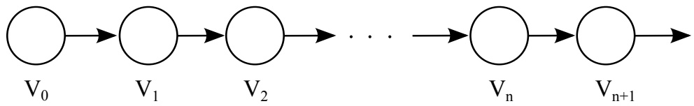

(a) [8 pts] Consider a Markov model like the one above. For the first three parts of this problem, assume the domain of our variables is {a, b}. Fill in the table below with the probability of being in each state after a large number of transitions, when $P ( V _ { n } ) = P ( V _ { n + 1 } )$ . If the values never reach a point when $P ( V _ { n } ) = P ( V _ { n + 1 } )$ write ‘None’.

In the left part of the table, assume that we start with a uniform distribution $( P ( V _ { 0 } = \mathrm { a } ) = P ( V _ { 0 } = \mathrm { b } ) = 0 . 5 )$ In the right part of the table, assume that we start with the distribution that has $P ( V _ { 0 } = \mathrm { a } ) = 1 . 0 .$

<table><tr><td colspan="2">Transition Probabilities</td><td> $P(V_n)$  given that  $P(V_0)$  is uniform $V_n = a$ </td><td> $V_n = b$ </td><td> $P(V_n)$  given that  $P(V_0 = a) = 1.0$  $V_n = a$ </td><td> $V_n = b$ </td></tr><tr><td colspan="2"></td><td rowspan="4"></td><td rowspan="4"></td><td rowspan="4"></td><td rowspan="4"></td></tr><tr><td> $V_{i-1}$ </td><td> $P(V_i \mid V_{i-1})$  $V_i = a \quad V_i = b$ </td></tr><tr><td>a</td><td>0.5 0.5</td></tr><tr><td>b</td><td>0.5 0.5</td></tr><tr><td colspan="2"></td><td rowspan="4"></td><td rowspan="4"></td><td rowspan="4"></td><td rowspan="4"></td></tr><tr><td> $V_{i-1}$ </td><td> $P(V_i \mid V_{i-1})$  $V_i = a \quad V_i = b$ </td></tr><tr><td>a</td><td>0.9 0.1</td></tr><tr><td>b</td><td>0.3 0.7</td></tr><tr><td colspan="2"></td><td rowspan="4"></td><td rowspan="4"></td><td rowspan="4"></td><td rowspan="4"></td></tr><tr><td> $V_{i-1}$ </td><td> $P(V_i \mid V_{i-1})$  $V_i = a \quad V_i = b$ </td></tr><tr><td>a</td><td>0.0 1.0</td></tr><tr><td>b</td><td>1.0 0.0</td></tr></table>

For this part our variables have the domain $\{ \mathrm { a ,   b ,   c } \}$ . Fill in the table at the bottom with the probability of being in each state after a large number of transitions, when $P ( V _ { n } ) = P ( V _ { n + 1 } )$ . In the left part of the table, assume that we start with a uniform distribution $\textstyle ( P ( V _ { 0 } = \mathrm { a } ) = P ( V _ { 0 } = \mathrm { b } ) = P ( V _ { 0 } = \mathrm { c } ) = { \frac { 1 } { 3 } } )$ . In the right part of the table, assume that we start with the distribution that has $P(V_{0}= a )=1.0$

<table><tr><td rowspan="2"> $V_{i-1}$ </td><td colspan="3"> $P(V_i \mid V_{i-1})$ </td></tr><tr><td> $V_i = a$ </td><td> $V_i = b$ </td><td> $V_i = c$ </td></tr><tr><td>a</td><td>0.5</td><td>0.5</td><td>0.0</td></tr><tr><td>b</td><td>0.5</td><td>0.5</td><td>0.0</td></tr><tr><td>c</td><td>0.0</td><td>0.0</td><td>1.0</td></tr></table>

<table><tbody><tr><td colspan="3">P(Vn) given that P(V0) is uniform</td><td colspan="3">P(Vn) given that P(V0 = a) = 1.0</td></tr><tr><td>a</td><td>b</td><td>c</td><td>a</td><td>b</td><td>c</td></tr></tbody></table>

<!-- page: 15 -->

Now we will consider a Hidden Markov Model, and look at properties of the Viterbi Algorithm. The Viterbi algorithm finds the most probable sequence of hidden states $X _ { 1 : S }$ given a sequence of observations $y _ { 1 : S }$ . Recall that for the canonical HMM structure, the Viterbi algorithm performs the following update at each time step:

$$
m _ {t} [ x _ {t} ] = P (y _ {t} | x _ {t}) \max _ {x _ {t - 1}} \left[ P (x _ {t} | x _ {t - 1}) m _ {t - 1} [ x _ {t - 1} ] \right]
$$

Assume we have an HMM where:

• The hidden variable X can take on H values

• The (observed) emission variable Y can take on E values

• Our sequence has S steps

(b) (i) [2 pts] What is the run time of the Viterbi algorithm? # O(SEH) # O(SEH2) # O(SH2) # O(SH) # O(EH) # O(EH2) # O(SH2 + SEH)

Ignoring the storage of the emission probabilities, $P ( Y _ { t } | X _ { t } )$ , and the transition probabilities, $P ( X _ { t } | X _ { t - 1 } )$ what are the storage requirements of the Viterbi algorithm? # O(S) # O(E) # O(H) # O(SH) # O(SE) # O(EH) # O(S + H) # O(S + E) # O(E + H) # O(SEH)

Now, assume that most of the transitions in our HMM have probability zero. In particular, suppose that for any given hidden state value, there are only K possible next state values for which the transition probability is non-zero. To exploit this sparsity, we change the Viterbi Algorithm to only consider the non-zero transition edges during each max computation inside each update. You can think of this as the Viterbi algorithm ignoring edges that correspond to zero probability transitions in the transition lattice diagram.

(ii) [2 pts] What is the run time of this modified algorithm?

| ○ O(SEH) | ○ O(SEH2) | ○ O(SH2) |
| --- | --- | --- |
| ○ O(SH) | ○ O(EH) | ○ O(EH2) |
| ○ O(SH2+SEH) |  |  |
| ○ O(SEK) | ○ O(SEHK) | ○ O(SHK) |
| ○ O(SK) | ○ O(EK) | ○ O(EHK) |
| ○ O(SK+SEK) | ○ O(SHK+SEK) |  |

Ignoring the storage of the emission probabilities, $P ( Y _ { t } | X _ { t } )$ , and the transition probabilities, $P ( X _ { t } | X _ { t - 1 } )$ what are the storage requirements of this modified Viterbi algorithm? # O(S) # O(E) # O(H) # O(SH) # O(SE) # O(EH) # O(S + H) # O(S + E) # O(E + H) # O(SEH) # O(K) # O(SK) # O(EK) # O(HK) # O(S + K) # O(E + K) # O(H + K) # O(SEK)

<!-- page: 16 -->

## Q10. [6 pts] Particle Filtering

You’ve chased your arch-nemesis Leland to the Stanford quad. You enlist two robo-watchmen to help find him! The grid below shows the campus, with ID numbers to label each region. Leland will be moving around the campus. His location at time step t will be represented by random variable $X _ { t } .$ Your robo-watchmen will also be on campus, but their locations will be fixed. Robot 1 is always in region 1 and robot 2 is always in region 9. (See the \* locations on the map.) At each time step, each robot gives you a sensor reading to help you determine where Leland is. The sensor reading of robot 1 at time step t is represented by the random variable $E _ { t , 1 }$ . Similary, robot 2’s sensor reading at time step t is $E _ { t , 2 }$ . The Bayes’ Net to the right shows your model of Leland’s location and your robots’ sensor readings.

| 1* | 2 | 3 | 4 | 5 |
| --- | --- | --- | --- | --- |
| 6 | 7 | 8 | 9* | 10 |
| 11 | 12 | 13 | 14 | 15 |

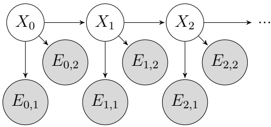

In each time step, Leland will either stay in the same region or move to an adjacent region. For example, the available actions from region 4 are (WEST, EAST, SOUTH, STAY). He chooses between all available actions with equal probability, regardless of where your robots are. Note: moving off the grid is not considered an available action.

Each robot will detect if Leland is in an adjacent region. For example, the regions adjacent to region 1 are 1, 2, and 6. If Leland is in an adjacent region, then the robot will report NEAR with probability 0.8. If Leland is not in an adjacent region, then the robot will still report NEAR, but with probability 0.3.

For example, if Leland is in region 1 at time step t the probability tables are:

| E | P(Et,1\|Xt = 1) | P(Et,2\|Xt = 1) |
| --- | --- | --- |
| NEAR | 0.8 | 0.3 |
| FAR | 0.2 | 0.7 |

(a) [2 pts] Suppose we are running particle filtering to track Leland’s location, and we start at t = 0 with particles $\left[ X = \dot{6},   X = 14,   X = 9,   X = 6 \right]$ . Apply a forward simulation update to each of the particles using the random numbers in the table below.

Assign region IDs to sample spaces in numerical order. For example, if, for a particular particle, there were three possible sucessor regions 10, 14 and 15, with associated probabilities, $P(X = 10),   P(X = 14)$ and P(X = 15), and the random number was 0.6, then 10 should be selected if $0 . 6 \leq P ( X = 1 0 )$ , 14 should be selected if $P(X=10)<0.6<P(X=10)+P(X=14)$ , and 15 should be selected otherwise.

| Particle at t = 0 | Random number for update Particle after forward simulation update |
| --- | --- |
| X = 6 | 0.864 |
| X = 14 | 0.178 |
| X = 9 | 0.956 |
| X = 6 | 0.790 |

<!-- page: 17 -->

(b) [2 pts] Some time passes and you now have particles $[ X = 6 ,   X = 1 ,   X = 7 ,   X = 8 ]$ at the particular time step, but you have not yet incorporated your sensor readings at that time step. Your robots are still in regions 1 and 9, and both report NEAR. What weight do we assign to each particle in order to incorporate this evidence?

| Particle | Weight |
| --- | --- |
| X = 6 |  |
| X = 1 |  |
| X = 7 |  |
| X = 8 |  |

(c) [2 pts] To decouple this question from the previous question, let’s say you just incorporated the sensor readings and found the following weights for each particle (these are not the correct answers to the previous problem!):

| Particle | Weight |
| --- | --- |
| X = 6 | 0.1 |
| X = 1 | 0.4 |
| X = 7 | 0.1 |
| X = 8 | 0.2 |

Use the following random numbers to resample you particles. As on the previous page, assign region IDs to sample spaces in numerical order.

| Random number: | 0.596 | 0.289 | 0.058 | 0.765 |
| --- | --- | --- | --- | --- |
| Particle: |  |  |  |  |

<!-- page: 18 -->

Q11. [10 pts] ML: Maximum Likelihood

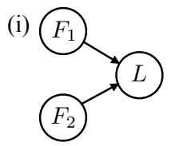

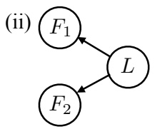

$$
\text {Training Data}
$$

$$
(L = 1, F _ {1} = 1, F _ {2} = 1)
$$

$$
(L = 1, F _ {1} = 1, F _ {2} = 1)
$$

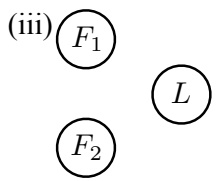

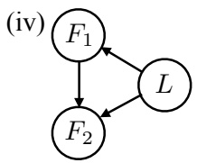

$$
(L = 0, F _ {1} = 1, F _ {2} = 1)
$$

$$
(L = 1, F _ {1} = 0, F _ {2} = 0)
$$

$$
(L = 0, F _ {1} = 0, F _ {2} = 0)
$$

$$
(L = 0, F _ {1} = 0, F _ {2} = 0)
$$

$$
(L = 0, F _ {1} = 0, F _ {2} = 1)
$$

You’ve decided to use a model-based approach to classification of text documents. Your goal is to build a classifier that can determine whether or not a document is about cats. You’re taking a minimalist approach and you’re only characterizing the input documents in terms of two binary features: $F _ { 1 }$ and $F _ { 2 } .$ . Both of these features have domain {0, 1}. The thing you’re trying to predict is the label, $L ,$ which is also binary valued. When $L = 1$ , the document is about cats. When $L = 0$ , the document is not.

The particular meaning of the two features $F _ { 1 }$ and $F _ { 2 }$ is not important for your current purposes. You are only trying to decide on a particular Bayes’ net structure for your classifier. You’ve got your hands on some training data (shown above) and you’re trying to figure out which of several potential Bayes’ nets (also shown above) might yield a decent classifier when trained on that training data.

(a) [2 pts] Which of the Bayes’ nets, once learned from the training data with maximum likelihood estimation, would assign non-zero probability to the following query: $P ( L = 1 | F _ { 1 } = 0 , F _ { 2 } = 0 ) ?$ Circle all that apply. # (i) # (ii) # (iii) # (iv)

(b) $[ 2 ~ \mathrm { p t s } ]$ Which of the Bayes’ nets, once learned from the training data with maximum likelihood estimation, would assign non-zero probability to the following query: $P ( L = 1 | F _ { 1 } = 0 , F _ { 2 } = 1 ) ?$ Circle all that apply. # (i) # (ii) # (iii) # (iv)

(c) $[ 2 ~ \mathrm { p t s } ]$ Which of the Bayes’ nets, once learned from the training data with Laplace smoothing using $k = 1$ would assign non-zero probability to the following query: $P ( L = 1 | F _ { 1 } = 0 , F _ { 2 } = 1 ) ?$ Circle all that apply. # (i) # (ii) # (iii) # (iv)

(d) [2 pts] What probability does Bayes’ net (i), once learned from the training data with Laplace smoothing using $k = 1$ , assign to the query $P ( L = 1 | F _ { 1 } = \overset { \frown } { 0 } , F _ { 2 } = 1 ) ?$

(e) [2 pts] As $k \to \infty$ (the constant used for Laplace smoothing), what does the probability that Bayes’ net (i) assigns to the query $P ( L = 1 | F _ { 1 } = 0 , F _ { 2 } = 1 )$ converge to?

<!-- page: 19 -->

## Q12. [8 pts] ML: Perceptrons and Kernels

You’ve decided to single-handedly advance AI by constructing a perfect classifier to separate pictures of dogs and cats. With your state of the art 9-pixel camera, you’ve taken 4 pictures of dogs and 4 pictures of cats. These are the pictures of dogs (Class +):

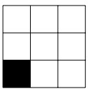

(D-1)

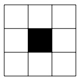

(D-2)

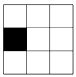

(D-3)

Class +

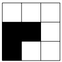

(D-4)

And these are the pictures of cats (Class -): (the cat is hiding in the second picture)

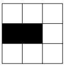

(C-1)

(C-2)

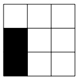

Class -

(C-3)

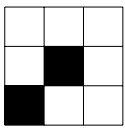

(C-4)

You decide to mathematically model the dataset as:

| x1 | x2 | x3 |
| --- | --- | --- |
| x4 | x5 | x6 |
| x7 | x8 | x9 |

$$
= (x _ {1}, x _ {2}, x _ {3}, x _ {4}, x _ {5}, x _ {6}, x _ {7}, x _ {8}, x _ {9}) = x
$$

where $x _ { i } = 1$ if the corresponding pixel is black and 0 otherwise.

(a) Impressed with the quality of your photos, you want to run the perceptron algorithm with the weight vector initialized to $w _ { 0 }   =   ( 0 , 0 , 0 , 1 , 1 , 1 , 1 , 1 , 1 )$ When your classifier gives a positive score, it predicts dog. When your classifier gives a negative score it predicts cat. To break ties, since you like cats more than dogs, when your classifier gives a score of 0, it predicts cat. Using the ordering left to right, dogs first and then cats:

(i) [1 pt] What is the first misclassified training datum?

(ii) [2 pts] What is the weight vector after the first perceptron update?

(b) [2 pts] At heart, you’re an artist. You feel the pictures of cats and dogs would look better if you changed them a little. Under which of the following transformations is the dataset above NOT linearly separable?

\# The identity transformation, $\phi ( x ) = x .$ In other words, the dataset above is not linearly separable.

$\phi ( x ) = { \bar { x } } .$ That is, if a cell is black it is turned white and vice versa.

A rotation 90 degree clockwise

A horizontal reflection

The number of times each of the following patterns appear: g P F

#(e.g. D-1 contains the first pattern once and the second pattern three times.)

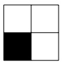

<!-- page: 20 -->

(c) [3 pts] Consider the original feature space (i.e. none of the transformations above have been applied). Indicate whether the decision rules below can be represented by a weight vector in the original feature space. If yes, then include such a weight vector.

Predict dog (+) if at least 3 squares are black.

Predict dog (+) if any two adjacent squares are black.

Predict cat (-) if any square other than the corner squares is black.

Predict dog (+) if the photo is symmetric with respect to a 90 degree rotation.

Predict dog (+) if the photo is symmetric with respect to its horizontal and vertical reflections.
