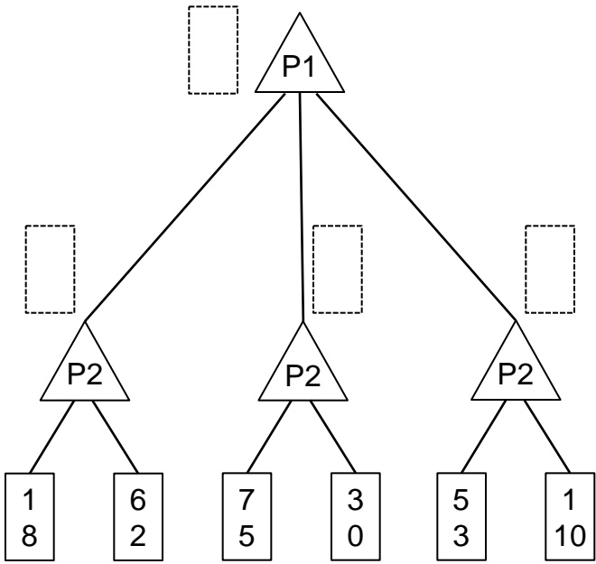
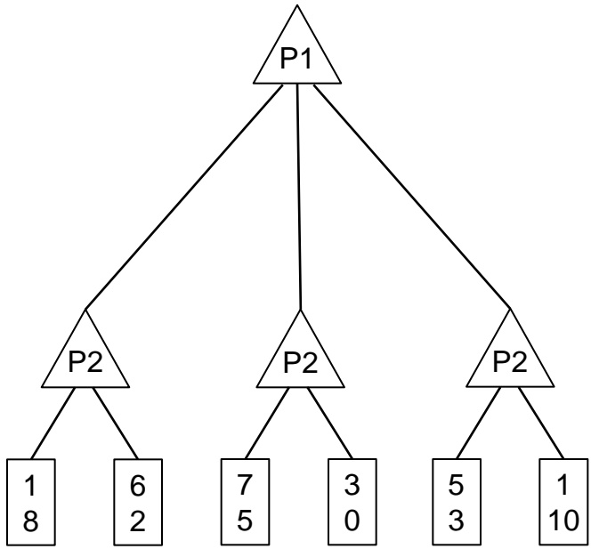
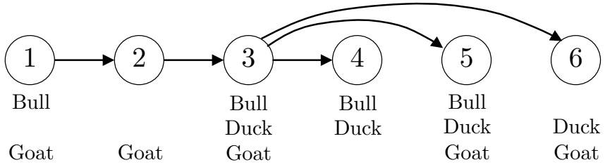
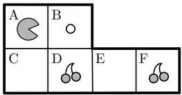
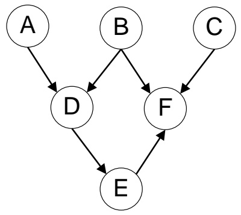
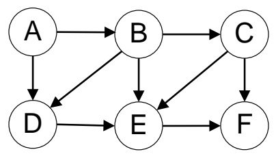
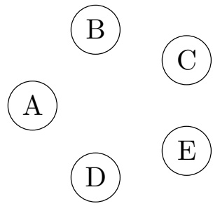
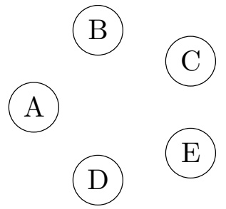

<!-- page: 1 -->

## CS 188 Introduction to Summer 2015Artificial Intelligence

ˆ You have approximately 2 hours 50 minutes.

ˆ The exam is closed book, closed calculator, and closed notes except your one-page crib sheet.

ˆ Mark your answers ON THE EXAM ITSELF. If you are not sure of your answer you may wish to provide a brief explanation. All short answer sections can be successfully answered in a few sentences AT MOST.

| First name |  |
| --- | --- |
| Last name |  |
| SID |  |
| edX username |  |
| Name of person on your left |  |
| Name of person on your right |  |

For staff use only:

| Q1. Search and Probability | /10 |
| --- | --- |
| Q2. Games | /8 |
| Q3. Utilities | /10 |
| Q4. Farmland CSP | /8 |
| Q5. MDP | /16 |
| Q6. Bayes Nets | /8 |
| Q7. Chameleon | /10 |
| Q8. Perceptron | /10 |
| Total | /80 |

<!-- page: 2 -->

<!-- page: 3 -->

## Q1. [10 pts] Search and Probability

Each True/False question is worth 1 points. Leaving a question blank is worth 0 points. Answering incorrectly is worth −1 points.

(a) Consider a graph search problem where for every action, the cost is at least , with $\epsilon > 0 .$ . Assume the heuristic is admissible.

(i) [1 pt] [true or false] Uniform-cost graph search is guaranteed to return an optimal solution.

(ii) [1 pt] [true or false] The path returned by uniform-cost graph search may change if we add a positive constant C to every step cost.

(iii) [1 pt] [true or false] A\* graph search is guaranteed to return an optimal solution.

(iv) [1 pt] [true or false] A\* graph search is guaranteed to expand no more nodes than depth-first graph search.

(v) [1 pt] [true or false] If $h _ { 1 } ( s )$ and $h _ { 2 } ( s )$ are two admissible A∗ heuristics, then their average $f ( s )   =$ $\textstyle \frac { 1 } { 2 } h _ { 1 } ( s ) + \frac { 1 } { 2 } h _ { 2 } ( s )$ must also be admissible.

(b) [3 pts] A, B, C, and D are random variables with binary domains. How many entries are in the following probability tables and what is the sum of the values in each table? Write a “?” in the box if there is not enough information given.

| Table | Size | Sum |
| --- | --- | --- |
| P(A\|C) |  |  |
| P(A,D\| + b,+c) |  |  |
| P(B\| + a,C,D) |  |  |

(c) $[ 2 ~ \mathrm { p t s } ]$ Write all the possible chain rule expansions of the joint probability $P ( a , b , c )$ . No conditional independence assumptions are made.

<!-- page: 4 -->

## Q2. [8 pts] Games

For the following game tree, each player maximizes their respective utility. Let x, y respectively denote the top and bottom values in a node. Player 1 uses the utility function $U _ { 1 } ( x , y ) = x .$

(a) Both players know that Player 2 uses the utility function $U _ { 2 } ( x , y ) = x - y$

(i) [2 pts] Fill in the rectangles in the figure above with pair of values returned by each max node.

(ii) [2 pts] You want to save computation time by using pruning in your game tree search. On the game tree above, put an $\mathrm { { ^ { \circ } X ^ { \prime } } }$ on branches that do not need to be explored or simply write ‘None’. Assume that branches are explored from left to right.

<!-- page: 5 -->

(b) Now assume Player 2 changes their utility function based on their mood. The probabilities of Player 2’s utilities and mood are described in the following table. Let M, U respectively denote the mood and utility function of Player 2.

<table><tbody><tr><td colspan="2"></td><td></td><td>M = happy</td><td>M = mad</td></tr><tr><td>P(M = happy)</td><td>P(M = mad)</td><td>P(U2(x,y) = -x | M)</td><td>c</td><td>f</td></tr><tr><td>a</td><td>b</td><td>P(U2(x,y) = x - y | M)</td><td>d</td><td>g</td></tr><tr><td colspan="2"></td><td>P(U2(x,y) = x2 + y2 | M)</td><td>e</td><td>h</td></tr></tbody></table>

(i) [4 pts] Calculate the maximum expected utility of the game for Player 1 in terms of the values in the game tree and the tables. It may be useful to record and label your intermediate calculations. You may write your answer in terms of a max function.

<!-- page: 6 -->

## Q3. [10 pts] Utilities

Davis is on his way to a final exam planning meeting. He is already running late (the meeting is starting now) and he’s trying to determine whether he should wait for the bus or just walk.

It takes 20 minutes to get to Cory Hall by walking, and only 5 minutes to get to there by bus. The bus will either come in 10, 20, or 30 minutes, each with probability 1/3.

(a) [3 pts] Davis hates being late; his utility for being late as a function of t, the number of minutes late he is, is

$$
U _ {D} (t) = \left\{ \begin{array}{c c} 0 & : t \leq 0 \\ - 2 ^ {t / 5} & : t > 0 \end{array} \right.
$$

What is the expected utility of each action? Should he wait for the bus or walk?

(b) [3 pts] Pat is running late too. However, Pat reasons that once he’s late, it doesn’t matter how late he is. Therefore, his utility function is

$$
U _ {P} (t) = \left\{ \begin{array}{r l} 0 & : t \leq 0 \\ - 1 0 & : t > 0 \end{array} \right.
$$

Moreover, Pat prefers riding the bus because it is more comfortable, so riding the bus incurs a utility bonus of 5.

If Pat is deciding whether to take the bus or walk when the meeting is just starting, what are his expected utilities for each action? Should he take the bus or walk?

(c) [2 pts] Give an example of a decreasing utility function in terms of time such that it will favor decisions that always minimize expected time to get to the meeting.

(d) [2 pts] Give an example of a decreasing utility function in terms of time such that it will be risk-seeking; that is, a lottery with expected time of arrival t will be preferred to a guarantee of arrival time t.

<!-- page: 7 -->

## Q4. [8 pts] Farmland CSP

The animals in Farmland aren’t getting along and the farmers have to assign them to different pens. To avoid fighting, animals of the same type cannot be in connected pens. Fortunately, the Farmland pens are connected in a tree structure.

(a) [2 pts] Consider the following constraint diagram that shows six pens with lines indicating connected pens. The remaining domains for each pen are listed below each node.

After assigning a bull to pen 5, enforce arc consistency on this CSP considering only the directed arcs shown in the figure. What are the remaining values for each pen?

| Pen | Values |
| --- | --- |
| 1 |  |
| 2 |  |
| 3 |  |
| 4 |  |
| 5 | Bull |
| 6 |  |

(b) [2 pts] What is the computational complexity of solving general tree structured CSPs with n nodes and d values in the domain? Give an answer of the form O(·).

(c) This True/False question is worth 1 points. Leaving a question blank is worth 0 points. Answering incorrectly is worth −1 points.

(i) [1 pt] [true or false] If root to leaf arcs are consistent on a general tree structured CSP, assigning values to nodes from root to leaves will not back-track if a solution exists.

(d) [3 pts] Given 3 animal types, what is the most number of pens a tree structure could have, such that the computational complexity to solve the tree CSP is no greater than the computational complexity to solve a fully connected CSP with 10 pens?

<!-- page: 8 -->

## Q5. [16 pts] MDP

Pacman is using MDPs to maximize his expected utility. In each environment:

ˆ Pacman has the standard actions {North, East, South, West} unless blocked by an outer wall

ˆ There is a reward of 1 point when eating the dot (for example, in the grid below, $R ( C , S o u t h , F ) = 1 )$

ˆ The game ends when the dot is eaten

(a) Consider a the following grid where there is a single food pellet in the bottom right corner (F). The discount factor is 0.5. There is no living reward. The states are simply the grid locations.

| A | B | C |
| --- | --- | --- |
| D | E | F |

(i) [2 pts] What is the optimal policy for each state?

| State | π(state) |
| --- | --- |
| A |  |
| B |  |
| C |  |
| D |  |
| E |  |

(ii) [2 pts] What is the optimal value for the state of being in the upper left corner (A)? Reminder: the discount factor is 0.5.

V∗( A ) =

(iii) [2 pts] Using value iteration with the value of all states equal to zero at k=0, for which iteration k will $V_{k}(A)=V^{*}(A)?$

k =

<!-- page: 9 -->

(b) Consider a new Pacman level that begins with cherries in locations D and F. Landing on a grid position withD E F cherries is worth 5 points and then the cherries at that position disappear. There is still one dot, worth 1 point. The game still only ends when the dot is eaten.

(i) [2 pts] With no discount $( \gamma = 1 )$ and a living reward of -1, what is the optimal policy for the states in this level’s state space?

(ii) [2 pts] With no discount $( \gamma = 1 )$ , what is the range of living reward values such that Pacman eats exactly one cherry when starting at position A?

(c) Quick reinforcement learning questions [PLEASE WRITE CLEARLY]:

(i) [1 pt] What is the difference between value-iteration and TD-learning?

(ii) [1 pt] What is the difference between TD-learning and Q-learning?

(iii) [1 pt] What is the purpose of using a learning rate (α) during Q-learning?

(iv) [1 pt] In value iteration, we store the value of each state. What do we store during approximate Q-learning?

(v) [2 pts] Give one advantage and one disadvantage of using approximate Q-learning rather than standard Q-learning.

<!-- page: 10 -->

## Q6. [8 pts] Bayes Nets

(a) For the following graphs, explicitly state the minimum size set of edges that must be removed such that the corresponding independence relations are guaranteed to be true.

Marked the removed edges with an ‘X’ on the graphs.

(i) [2 pts]

$$
\perp F | D
$$

$$
B \perp \perp C
$$

(ii) [2 pts]

$$
C \perp D | B
$$

(b) You’re performing variable elimination over a Bayes Net with variables A, B, C, D, E. So far, you’ve finished joining over (but not summing out) C, when you realize you’ve lost the original Bayes Net! Your current factors are f(A), f(B), f(B, D), f(A, B, C, D, E). Note: these are factors, NOT joint distributions. You don’t know which variables are conditioned or unconditioned.

(i) [2 pts] What’s the smallest number of edges that could have been in the original Bayes Net? Draw out one such Bayes Net below. Number of edges =

(ii) [2 pts] What’s the largest number of edges that could have been in the original Bayes Net? Draw out one such Bayes Net below. Number of edges =

<!-- page: 11 -->

## Q7. [10 pts] Chameleon

A team of scientists from Berkeley discover a rare species of chameleons. Each one can change its color to be blue or gold, once a day. The probability of colors on a certain day are determined solely by its color on the previous day.

The team spends 5 days observing 10 chameleons changing color from day to day. The recorded counts for the chameleons’ color transitions are below.

| # of Ct+1\|Ct | t = 0 | t = 1 | t = 2 | t = 3 |
| --- | --- | --- | --- | --- |
| # of Ct+1 = gold\|Ct = gold | 0 | 0 | 8 | 2 |
| # of Ct+1 = blue\|Ct = gold | 7 | 0 | 0 | 8 |
| # of Ct+1 = gold\|Ct = blue | 0 | 8 | 2 | 0 |
| # of Ct+1 = blue\|Ct = blue | 3 | 2 | 0 | 0 |

(a) [3 pts] They suspect that this phenomenon obeys the stationarity assumption – that is, the transition probabilites are actually the same between all the days. Estimate the transition probabilites $P ( C _ { t + 1 } | C _ { t } )$ from the above simulation.

|  | P(Ct+1\|Ct) |
| --- | --- |
| P(Ct+1 = gold\|Ct = gold) |  |
| P(Ct+1 = blue\|Ct = gold) |  |
| P(Ct+1 = gold\|Ct = blue) |  |
| P(Ct+1 = blue\|Ct = blue) |  |

(b) [2 pts] Further scientific tests determine that these chameleons are, in fact, immortal. As a result, they want to determine the distribution of a chameleon’s colors over an infinite amount of time.

Given the estimated transition probabilities, what is the steady state distribution for $P ( C _ { \infty } ) ?$

|  | P(C∞) |
| --- | --- |
| P(C∞ = gold) |  |
| P(C∞ = blue) |  |

<!-- page: 12 -->

The chameleons, realizing that these tests are being performed, decide to hide. The scientists can no longer observe them directly, but they can observe the bugs that one particular chameleon likes to eat. They know that the chameleon’s color influences the probability that it will eat some fraction of a nest. The scientists will observe the size of the nests twice per day: once in the morning, before the chameleon eats, and once in the evening, after the chameleon eats. Every day, the chameleon moves on to a new nest.

(c) [1 pt] Draw a DBN using the variables $C _ { t } , \mathit { C } _ { t + 1 } , \mathit { M } _ { t } , \mathit { M } _ { t + 1 } , \mathit { E } _ { t }$ , and $E _ { t + 1 }$ . C refers to the color of the chameleon, M is the size of a nest in the morning, and E is the size of that nest in the evening.

When the chameleon is blue, it eats half of the bugs in the chosen nest with probability $1 / 2 ,$ one-third of the bugs with probability $1 / 4$ , and two-thirds of the bugs with probability $1 / 4 .$

When the chameleon is gold, it eats one-third, half, or two-thirds of the bugs, each with probability $1 / 3 .$

(d) [4 pts] You would like to use particle filtering to guess the chameleon’s color based on the observations of M and E. You observe the following population sizes: $M_{1} = 24, \quad E_{1} = 12, \quad M_{2} = 36$ , and $E _ { 2 } = 2 4$ . Fill in the following tables with the weights you would assign to particles in each state at each time step.

| State at t = 1 Weight | State at t = 2 Weight |
| --- | --- |
| Blue | Blue |
| Gold | Gold |

<!-- page: 13 -->

## Q8. [10 pts] Perceptron

We would like to use a perceptron to train a classifier for datasets with 2 features per point and labels +1 or -1. Consider the following labeled training data:

| Features | Label |
| --- | --- |
| (x1,x2) | y∗ |
| (-1,2) | 1 |
| (3,-1) | -1 |
| (1,2) | -1 |
| (3,1) | 1 |

(a) $[ 2 ~ \mathrm { p t s } ]$ Our two perceptron weights have been initialized to $w _ { 1 } = 2$ and $w _ { 2 } = - 2$ After processing the first point with the perceptron algorithm, what will be the updated values for these weights?

(b) [2 pts] After how many steps will the perceptron algorithm converge? Write “never” if it will never converge. Note: one steps means processing one point. Points are processed in order and then repeated, until convergence.

(c) Instead of the standard perceptron algorithm, we decide to treat the perceptron as a single node neural network and update the weights using gradient descent on the loss function. The loss function for one data point is Loss $s ( y , y ^ { * } ) = ( y - y ^ { * } ) ^ { 2 }$ , where $y ^ { * }$ is the training label for a given point and y is the output of our single node network for that point.

(i) [3 pts] Given a general activation function $g ( z )$ and its derivative $g ^ { \prime } ( z )$ , what is the derivative of the loss function with respect to $w _ { 1 }$ in terms of $g ,   g ^ { \prime } ,   y ^ { * } ,   x _ { 1 } ,   x _ { 2 } ,   w _ { 1 }$ , and $w _ { 2 } ?$

$$
\frac {\partial L o s s}{\partial w _ {1}} =
$$

(ii) [2 pts] For this question, the specific activation function that we will use is:

$$
g (z) = 1 \text {if} z \geq 0 \text {and} = - 1 \text {if} z <   0
$$

Given the following gradient descent equation to update the weights given a single data point. With initial weights of $w _ { 1 } = 2$ and $w _ { 2 } = - 2$ , what are the updated weights after processing the first point? Gradient descent update equation: $\begin{array} { r } { w _ { i } = w _ { i } - \alpha \frac { \partial L o s s } { \partial w _ { 1 } } } \end{array}$

(iii) [1 pt] What is the most critical problem with this gradient descent training process with that activation function?

<!-- page: 14 -->
