<!-- page: 1 -->

**UC Berkeley – Computer Science**

CS188: Introduction to Artificial Intelligence

Josh Hug and Adam Janin

Midterm II, Fall 2016

This test has 7 questions worth a total of **100** points, to be completed in 110 minutes. The exam is closed book, except that you are allowed to use a single two-sided hand written cheat sheet. No calculators or other electronic devices are permitted. Give your answers and show your work in the space provided.

**Write the statement out below in the blank provided and sign. You may do this before the exam begins.** Any plagiarism, no matter how minor, will result in an F.

**“I have neither given nor received any assistance in the taking of this exam.”**

Signature:

Name:

Your EdX Login:

SID:

Name of person to left:

Exam Room:

Name of person to right:

Primary TA:

indicates that only one circle should be filled in.

● ▢ indicates that more than one box may be filled in.

● Be sure to fill in the ◯ and ▢ boxes completely and erase fully if you change your answer.

There may be partial credit for incomplete answers. Write as much of the solution as you can, but bear in mind that we may deduct points if your answers are much more complicated than necessary.

There are a lot of problems on this exam. Work through the ones with which you are comfortable first. **Do not get overly captivated by interesting problems or complex corner cases you’re not sure about.**

Not all information provided in a problem may be useful.

**There are some problems on this exam with a slow brute force approach and a faster, clever approach. Think before you start calculating with lots of numbers!**

● Write the last four digits of your SID on each page in case pages get shuffled during scanning.

| Problem | 1 | 2 | 3 | 4 | 5 | 6 | 7 |
| --- | --- | --- | --- | --- | --- | --- | --- |
| Points | 14 | 9 | 12 | 20 | 14 | 13 | 18 |

Optional. Mark along the line to show your feelings on the spectrum between :( and ☺.

Before exam: [:( ☺].

After exam: [:( ☺].

<!-- page: 2 -->

**1. Bayesics (14 pts)** Model-Q1 is a Bayes’ Net consisting of the graph and probability tables shown below:

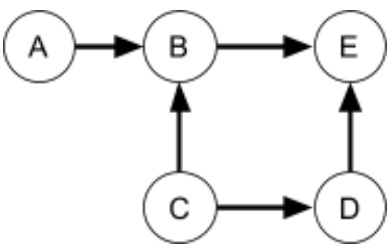

| A | P(A) |
| --- | --- |
| 0 | 0.6 |
| 1 | 0.4 |

| C | D | P(D\|C) |
| --- | --- | --- |
| 0 | 0 | 0.2 |
| 0 | 1 | 0.8 |
| 1 | 0 | 0.3 |
| 1 | 1 | 0.7 |

| A | C | B | P(B\|A,C) |
| --- | --- | --- | --- |
| 0 | 0 | 0 | 0.2 |
| 0 | 0 | 1 | 0.8 |
| 0 | 1 | 0 | 0.4 |
| 0 | 1 | 1 | 0.6 |
| 1 | 0 | 0 | 0.2 |
| 1 | 0 | 1 | 0.8 |
| 1 | 1 | 0 | 0.4 |
| 1 | 1 | 1 | 0.6 |

| C | P(C) |
| --- | --- |
| 0 | 0.4 |
| 1 | 0.6 |

| B | D | E | P(E\|B,D) |
| --- | --- | --- | --- |
| 0 | 0 | 0 | 0.75 |
| 0 | 0 | 1 | 0.25 |
| 0 | 1 | 0 | 0.5 |
| 0 | 1 | 1 | 0.5 |
| 1 | 0 | 0 | 0.85 |
| 1 | 0 | 1 | 0.15 |
| 1 | 1 | 0 | 0.4 |
| 1 | 1 | 1 | 0.6 |

i. (3 pts) Check the boxes above the Bayes’ nets below that <u>could also be valid</u> for the above probability tables.

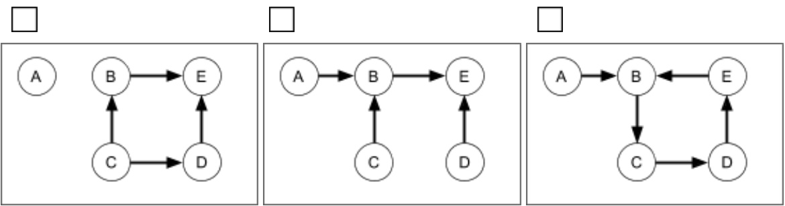

ii. (2 pts) Caryn wants to compute the distribution P(A,C|E=1) using **prior sampling** on Model-Q1 (given at the top of this page). She draws a bunch of samples. The first of these is (0, 0, 1, 1, 0), given in (A, B, C, D, E) format. What’s the probability of drawing this sample?

<!-- page: 3 -->

iii. (2 pts) Give an example of an inference query for Model-Q1 with **one query variable and one evidence variable** that could be estimated more efficiently (in terms of runtime) using **rejection sampling** than by using **prior sampling**​. If none exist, state “not possible”.

iv. (2 pts) Give an example of an inference query for Model-Q1 with **one query variable and one evidence variable** for which **rejection sampling** provides no efficiency advantage (in terms of runtime) over using **prior sampling**​. If none exist, state “not possible”.

v. (2 pts) Now Caryn wants to determine P(A,C|E=1) for Model-Q1 using likelihood weighting. She draws the five samples shown below, which are given in (A, B, C, D, E) format, where the leftmost sample is “Sample 1” and the rightmost is “Sample 5”. What are the weights of the samples S1 and S3?

weight(S1):

weight(S3):

S1: (0, 0, 1, 1, 1) S2: (0, 0, 1, 1, 1) S3: (1, 0, 1, 1, 1) S4: (0, 1, 0, 0, 1) S5: (0, 1, 0, 0, 1)

vi. (1 pt) For the same samples as in part v, compute P(A=1,C=1|E=1) for Model-Q1. Express your answer as a simplified fraction (e.g. 2 / 3 instead of 4 / 6).

vii. (2 pts) Select True or False for each of the following:

**True False**

When there is no evidence, prior sampling is guaranteed to yield the exact same answer as inference by enumeration.

O O When collecting a sample during likelihood weighting, evidence variables are not sampled.

O O When collecting a sample during rejection sampling, variables can be sampled in any order.

O O Gibbs sampling is a technique for performing approximate inference, not exact inference.

<!-- page: 4 -->

## 2. Pacmanian Language Modeling (9 pts)

Archaeologists uncover ancient Pacmanian ruins and discover a fragment of their rare writing. Your job is to analyze the Pacmanian language based **only** on the tiny amount of data uncovered (and your knowledge of material in this class). Specifically, the fragment contains the following 20 word sentence:

**Nom Waka Pow Tuk Gah Waka Pow Tuk Bop Waka Pow Awoo Nom Waka Tuk Waka Gah Waka Tuk Waka**

Notes and hints:

$\mathbf { W } _ { \mathrm { i } }$ represents the $i ^ { \mathrm { t h } }$ word in the fragment. So $\mathrm{W}_{0}=\mathrm{Non}$ and $\mathbf { W } _ { 8 }   =   \mathbf { B o p }$

● The words and counts are: Awoo (1) Bop (1) Gah (2) Nom (2) Pow (3) Tuk (4) Waka (7)

● Your parameters should be computed from the 20 word fragment above!

● For those of you who are up to date on the post-MT2 material, **do not use Laplacian smoothing**​!

i. (1 pt) Given a new four word sentence in Pacmanian, draw a Bayes' Network representing a **bigram language model**​, where a word at position i can be dependent on the word that precedes it. You do not need to provide the conditional probability tables (CPTs).

ii. (2 pts) Given a bigram language model, write down the formula for the joint probability $\mathrm{P}(\mathrm{W}_{0}, \mathrm{W}_{1}, \mathrm{W}_{2}, \mathrm{W}_{3})$ in terms of the four smaller factors. You do not need to provide the CPTs.

iii. (2 pts) Given a bigram language model with parameters collected from the 20 word fragment, what is the probability of the Pacmanian sentence "Nom Waka Pow Awoo"? Hint: Only compute the parameters you need.

iv. (2 pts) Given a four word sentence in Pacmanian, draw a Bayes' Network representing a **trigram language model**, where a word at position i can be dependent on the **two** words that precede it. You do not need to provide the CPTs.

v. (2 pts) Given a trigram language model, write down the formula for the joint probability $\mathrm{P}(\mathrm{W}_{0}, \mathrm{W}_{1}, \mathrm{W}_{2}, \mathrm{W}_{3})$ in terms of the smaller factors.

<!-- page: 5 -->

## 3. Smoke Weed Everyday (12 pts)

Allen is trying to decide whether to vote to legalize marijuana. He wants marijuana to be legalized, but he’s pretty lazy and doesn’t want to wait in line. He knows that while it’s a close decision, he doesn’t think his vote will actually matter.

**Part A:** Allen lives in some County C1, e.g Alameda. Our model has three possible scenarios for C1:

Scenario —m: marijuana is not legalized regardless of Allen's vote (probability 1/2)

● Scenario **+m**: marijuana is legalized regardless of Allen’s vote (probability 1/4)

● Scenario @: marijuana is legalized but only if Allen votes; otherwise it is not (probability 1/4)

We can model this interaction between Allen’s action A (**+v** for vote, —v for not vote) and C1 using a new type of node called a variable node. Its value is deterministically given by its inputs. The resulting network is shown below. The table on the right lists the result R1 of the county(C1)’s decision on marijuana, given the possible values for C1 and A. R1 is either (+m)arijuana legalized or (—m)arijuana not legalized. The black squares mean that Allen’s vote doesn’t matter in those cases.

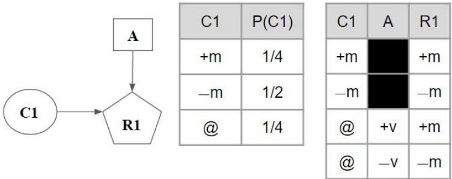

i. (0.5 pt) What is the chance of marijuana legalization assuming Allen votes (i.e. P(R1 = +m | A = +v))?

ii. (0.5 pt) What is the chance of marijuana legalization assuming Allen doesn’t vote (i.e. P(R1 = +m | A = − v))?

**Part B:** Allen lives in a small state with only three counties, C1, C2, and C3. In counties C2 and C3, (+m)arijuana legalized or ( − m)arijuana not legalized have a 50% chance each of occurring and Allen’s vote does not affect those counties. Let R represent the outcome of the vote for the state, which can either be **R = +m** for legalization, or **R =** − m for not legalizing marijuana. The majority result of the counties determines the result of the state, e.g. if R1 = + m, C2 = +m, C3 = − m, then R = +m. The resulting model (including Allen’s utility function) is given in the figure at the top of the next page. For space reasons, no table is shown for R in the figure. Larger version on next page.

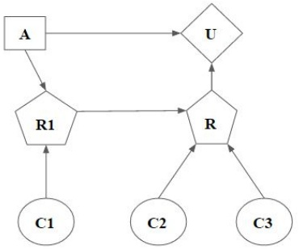

| C1 | P(S1) |
| --- | --- |
| +m | 1/4 |
| -m | 1/2 |
| @ | 1/4 |

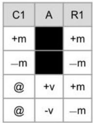

| C2 | P(C2) |
| --- | --- |
| +m | 1/2 |
| -m | 1/2 |

| R | A | U |
| --- | --- | --- |
| +m | +v | 8 |
| +m | -v | 16 |
| -m | +v | 0 |
| -m | -v | 4 |

<!-- page: 6 -->

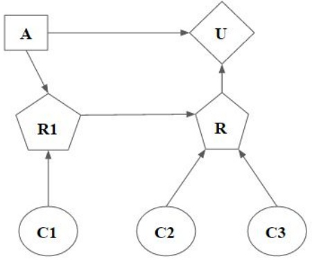

| C1 | P(S1) |
| --- | --- |
| +m | 1/4 |
| -m | 1/2 |
| @ | 1/4 |

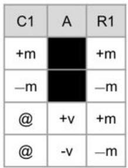

| C2 | P(C2) |
| --- | --- |
| +m | 1/2 |
| -m | 1/2 |

| R | A | U |
| --- | --- | --- |
| +m | +v | 8 |
| +m | -v | 16 |
| -m | +v | 0 |
| -m | -v | 4 |

Make sure to show your work clearly​ on this page, as it will be used for determining partial credit! iii. (6 pts) What is MEU(⊘) , i.e. the maximum expected utility if Allen doesn’t have any evidence? To maximize his utility, should Allen vote? Note that Allen’s utility is a function of the result AND his action.

**MEU**(⊘) : Should Allen vote?

iv. (3 pts) Suppose Allen could somehow know that C1 = +m. How much would he value additional information about the results of C2? In other words, what is VPI(C2 | C1 = +m)?

v. (2 pts) Is VPI(C2|C1= @) greater than, less than, or equal to VPI(C2|C1= +m)?

O greater than

O less than

<!-- page: 7 -->

## 4. Probability Potpourri Pain Problem (20 pts)

i. (6 pts) Suppose we know that $A \perp B$ and $B \perp C \mid D$ . Which of the following statements (if any) are **definitely true**​? Which are **sometimes** ​true? Which are **never** ​true? Here ⊥ represents the independence symbol.

DEFINITELY SOMETIMES NEVER

| ◯ | ◯ | ◯ | P(A, B, C, D) = P(A) P(B) P(C) P(D) |
| --- | --- | --- | --- |
| ◯ | ◯ | ◯ | P(A, B, C, D) = P(A) P(B) P(C\|D) |
| ◯ | ◯ | ◯ | P(A, B, C, D) = P(A) P(B\|A) P(C\|A,B) P(D\|A,B,C) |
| ◯ | ◯ | ◯ | P(B,C\|D) = P(B) P(C\|D) |
| ◯ | ◯ | ◯ | P(A,C\|D) = P(C) P(A\|D) |
| ◯ | ◯ | ◯ | P(X,Y\|Z) = P(X\|Y) P(Y\|Z) |

ii. (3 pt) Draw a Bayes’ Net that is consistent with the assumptions that $A \perp B$ and $B \perp C \mid D$ . Your Bayes’ Net may include additional independence assumptions other than these.

iii. $_ { ( 1 \mathrm { { \it ~ p t } } ) \mathrm { { \it ~ \bigcirc ~ } _ { \mathrm { { \it ~ T r u e } } } \mathrm { { \it ~ \bigcirc ~ } } } }$ False: If X is independent of Y, then X is independent of Y given Z, i.e. $X \perp Y \to X \perp Y \mid Z$

iv. (4 pts) Given the Bayes’ Net below, prove algebraically that A is independent of D. Briefly (less than five words per step) explain or justify each step of your proof. Use the lines given for the steps of your proof. You may not need all lines.

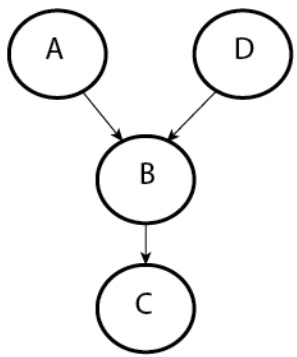

Step

<!-- page: 8 -->

v. (2 pts) Suppose we have the Bayes’ Net model below:

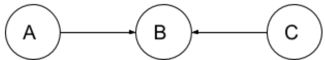

Which of the following statements regarding independence **must be true** given the model?

$$
\square A \perp B
$$

$$
\square A \perp C \mid B
$$

$$
\square A \perp C
$$

$$
\square A \perp B \mid C
$$

$$
\square B \perp C
$$

$$
\square B \perp C \mid A
$$

vi. (2 pts) Consider the Bayes’ Net model below.

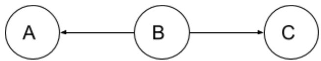

Which of the following independence assumptions **must be true** given the model?

$$
\square_ {A \perp B}
$$

$$
\square A \perp C \mid B
$$

$$
\square_ {A \perp C}
$$

$$
\square A \perp B \mid C
$$

$$
\square B \perp C
$$

$$
\square B \perp C | A
$$

vii. (2 pts) Consider the simple model shown below:

Umbrella

Weather

| W | P(W) |
| --- | --- |
| rain | 0.1 |
| sun | 0.9 |

| Umbrella | W | U(A, W) |
| --- | --- | --- |
| take | rain | 0 |
| take | sun | 100 |
| leave | rain | 0 |
| leave | sun | 100 |

Trivially, we can calculate that the maximum expected utility in the absence of evidence is $M E U ( \mathcal { D } ) = 9 0$ Suppose we want to calculate the value of knowing that it is raining VPI(w = rain). Calculating, we find that $M E U ( r a i n ) = 0$ . This implies that the value of knowing that it is **rain**ing is -90. In class, we said that VPI is always non-negative. Explain where this argument fails.

<!-- page: 9 -->

## 5. Bayes’ Nets Inference (14 pts)

Consider the following Bayes’ Net where all variables are binary.

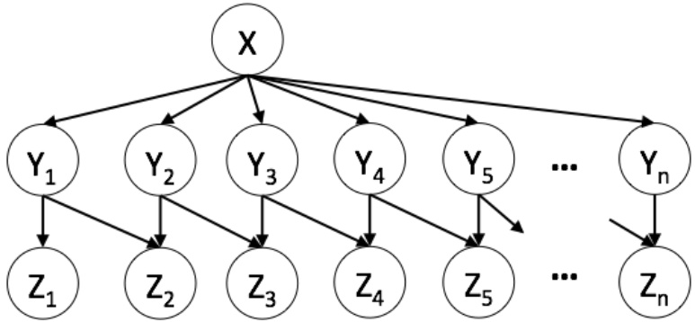

i. (2 pts) Suppose we somehow calculate the distribution $P(Y_n | Z_1 = z_1, Z_2 = z_2, \cdots, Z_n = z_n)$ . What is the size of this factor (number of rows)? Note that the Z variables are all observed evidence!

Number of rows in this factor:

ii. (3 pts) Suppose we try to calculate $P(Y_n | Z_1 = z_1, Z_2 = z_2, \cdots, Z_n = z_n)$ using variable elimination, and start by eliminating the variable $\mathbf { Y } _ { 1 } .$ What new factor is generated? Give your answer in standard probability distribution notation​, as opposed to using notation that involves f, e.g. use $\mathrm { P } ( \mathrm { A } , \mathrm { B } \mid \mathrm { C } )$ , not $\mathbf { f } _ { 1 } ( \mathrm { A } , \mathrm { B } , \mathrm { C } )$

What is the size of the probability table for this new factor (number of rows)? As before, assume all the Z variable are observed evidence.

New factor generated: Size of this new factor:

<!-- page: 10 -->

iii. (2 pts) Suppose we decide to perform variable elimination to calculate $P(Y_n | Z_1 = z_1, Z_2 = z_2, \cdots, Z_n = z_n)$ Suppose that we eliminate the variables in the order $\mathrm{Y}_{1}, \mathrm{Y}_{2}, \ldots \mathrm{Y}_{\mathrm{n}-1}, \mathrm{X}$ . What factor is generated when we finally eliminate X? **Give your answer in standard probability distribution notation.** ​Note $\mathrm { Y _ { n } }$ is not eliminated!

New factor generated:

iv. (4 pts) Find the best and worst variable elimination orderings for calculating

$P(Y_n | Z_1 = z_1, Z_2 = z_2, \cdots, Z_n = z_n)$ . An ordering is considered better than another if the the sum of the sizes of the factors that are generated is smaller. You do not need to calculate the precise value of this sum to answer this question. If there are orderings that are tied, give just one ordering.

Best ordering:

Worst ordering:

v. (2 pts) Assume now we want to use variable elimination to calculate **a new** <strong><u>query</u></strong> $P(Z_n|Y_1,Y_2,\cdots,Y_{n-1})$ Mark all of the following variables that produce a constant factor after being eliminated for all possible elimination orderings. Note that for this problem, the set of evidence variables is different than in previous parts.

⃞ Z1

⃞ Z2

⃞ X

vi. $_ { ( 1 \mathrm { p t } ) } \bigcirc _ { \mathrm { T r u e } } \bigcirc _ { \mathrm { F a l s e } ; }$ We can simply delete any factor that will produce a constant factor from our feature set before computing any distribution.

<!-- page: 11 -->

## 6. The Homebody Ladybug (13 pts)

Consider a ladybug who lives on a number line where, at each step, the ladybug changes her position x by flying one step to the right (setting $\mathrm { { _ { X } } = x + 1 ) }$ or one step to the left (setting $\mathrm { _ { X } = x - 1 ) }$ with probabilities:

$\begin{array} { r } { P _ { \mathit { l e f t } } = \frac { 1 } { 2 } + \frac { 1 } { 2 }   \frac { x } { c + | x | } } \end{array}$ , where c is a constant greater than 0.

$$
P _ {r i g h t} = 1 - P _ {l e f t}
$$

For example, if the constant c equals 1, the probabilities of a move to the left at positions $x = - 2 , - 1 , 0 , 1 , 2$ are given by ⅙, ¼, ½, ¾, and ⅚, respectively.

i. (1.5 pts) Draw the Bayes’ Net for the ladybug’s position, using $\mathrm { X _ { i } }$ to represent the ladybug’s position at time step i. Do not assume the ladybug starts at the origin.

ii. (1.5 pts) What is the domain of the variable $\mathrm { X _ { i } } ?$ Do not assume the ladybug starts at the origin.

iii. (3 pts) Assume that at time 0 the lady bug starts at the origin $( \mathrm { X } _ { 0 }   =   0 )$ . What is $\mathrm{P}(\mathrm{X}_{10}=5 \mid \mathrm{X}_{0}=0)$ if c = 1?

iv. (2 pts) You’d like to estimate the probability that the ladybug is at the origin at time t=4, given that you observe that the ladybug is at +1 in timestep t = 1, i.e. $\mathrm{P}(\mathrm{X}_{4}=0 \mid \mathrm{X}_{1}=1)$ . Consider the following possible samples for $\{ \mathrm { X } _ { 0 } ,   \dots ,   \mathrm { X } _ { 4 } \}$ . Put a check **in the box to the left the samples that are valid for computing this query and could have come from the ladybug model**​.

$$
\square \{\theta , 1, 2, 3, 4 \} \square \{\theta , - 1, \theta , 1, \theta \}
$$

$$
\square \{\theta , - 1, \theta , 2, - 2 \} \square \{\theta , 1, \theta , - 1, \theta \}
$$

$$
\square \{\theta , 1, 2, 1, \theta \} \square \{\theta , - 1, - 2, - 1, \theta \} \square \{\theta , - 1, - 2, - 1, \theta \} \square \{\theta , 1, 1, 2, \theta \}
$$

v. (1 pt) From the valid samples in part iv, what is $\mathrm{P}(\mathrm{X}_{4}=0 \mid \mathrm{X}_{1}=1)?$

vi. (2 pts) How would you expect $\mathrm{P}(X_{4}=0 \mid X_{0}=0)$ to change as c increases?

vii. (2 pts) Suppose you are trying to use Gibbs Sampling to estimate $\mathrm{P}(\mathrm{X}_{4}=0 \mid \mathrm{X}_{0}=0)$ . If we start by initializing $\mathrm{X}_{1}, \mathrm{X}_{2}, \mathrm{X}_{3},$ and $\mathrm { X } _ { 4 }$ to random 32 bit integers, will the Gibbs Sampling process **yield a reasonable estimate**​? Will the sampling procedure complete in a **reasonable amount of time**​? Explain your answer.

<!-- page: 12 -->

## 7. Ms. Pac-Man’s Spicy Psychic Stake Out (18 pts)

## The parts of this problem are independent. You can do any of them without doing the rest.

i) (4 pts) Ms. Pac-Man is training herself to understand the habits of ghosts. She has captured a ghost named Clyde, and forced it to walk down a hallway to train her model. She builds the model below, and calculates the conditional probability tables (CPTs) for this model, i.e. $\mathrm{P}(\mathrm{X}_{0}), \mathrm{P}(\mathrm{X}_{1} \mid \mathrm{X}_{0}), \mathrm{P}(\mathrm{X}_{2} \mid \mathrm{X}_{1})$ , etc. where $\mathrm { X _ { i } }$ is the location of the ghost at time i.

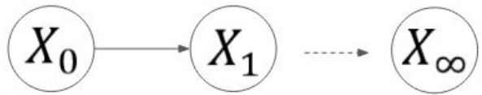

Give an expression for computing $\mathbf { P } ( \mathbf { X _ { i } } )$ **i**n terms of these CPTs.

ii) (4 pts) Ms. Pac-Man has been experimenting with SPICE to gain psychic abilities. When she takes SPICE, she sees a psychic vision v that provides her with a belief about the ghost’s future position at some specified time t, shown below. In other words, she now knows v, and thus also knows the distribution $\mathbf { P } ( \mathbf { v }   |   \mathbf { X } _ { \mathfrak { t } } )$

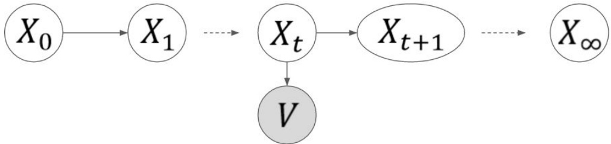

Suppose Ms. Pac-Man wants to figure out where the ghost will go next in the timestep after t. Give an expression for computing $\mathbf { P } ( \mathbf { X _ { t + 1 } } \mid \mathbf { v } )$ in terms of distributions either given as part of her model, or calculated in part i. In total this includes the CPTs, $\mathbf { P } ( \mathbf { v }   |   \mathbf { X } _ { \mathrm { t } } )$ , and $\mathrm { P } ( \mathrm { \nabla } \mathrm { X } _ { \mathrm { i } } )$ . You may not need all of them.

<!-- page: 13 -->

iii) (6 pts) Now suppose Ms. Pac-Man wants to figure out where the ghost was the timestep **before** t given her SPICE vision. Give an expression for computing $\mathbf { P } ( \mathbf { X } _ { \mathrm { ~ t ~ - ~ 1 ~ } } | \textbf { v } )$ in terms of distributions either given as part of her model, or calculated in part i or ii of Question 7. You may not need all of them.

iv) (2 pts) Suppose Ms. Pac-Man takes SPICE at time 0, which provides her a vision v corresponding to time t = 188, i.e. she knows v and $\mathrm { P } ( \mathrm { v }   |   \mathrm { X } _ { 1 8 8 } )$ . Explain how she would calculate Clyde’s **most likely current position (i.e. at time 0)**​ in terms of the distributions given in parts i, ii, and iii. You may not need all of them.

v) $\mathrm { { _ { ( 1 p t ) } \bigcirc _ { T r u e } \bigcirc _ { F a l s e : } } }$ If we assume our model is stationary $\mathrm{(i.e.~P(X_n \mid X_{n-1}) = P(X_{n-1} \mid X_{n-2}))}$ , then the limit without evidence as time goes to infinity must be a uniform distribution., $\mathrm{i.e.~P(X_{_{\infty}})}$ is uniform.

vi) $_ { ( 1 \mathrm { p t } ) } \bigcirc _ { \mathrm { T r u e } } \bigcirc _ { \mathrm { F a l s e } ; }$ If we assume our model is stationary $\mathrm{(i.e.~P(X_n \mid X_{n-1}) = P(X_{n-1} \mid X_{n-2}))}$ , then the limit with evidence as time goes to infinity must be a uniform distribution., i.e. $\mathrm{P}(\mathrm{X}_{\circ} \mid \mathrm{v})$ is uniform.

<!-- page: 14 -->

**THIS PAGE INTENTIONALLY LEFT BLANK. WORK ON THIS PAGE WILL NOT BE GRADED.**

Local man finds an unlikely testosterone booster that builds muscle & burns fat... Read More »

