<!-- page: 1 -->

## CS 188 Introduction to Summer 2016Artificial Intelligence

ˆ You have approximately 2 hours and 50 minutes.

ˆ The exam is closed book, closed calculator, and closed notes except your two crib sheets.

ˆ Mark your answers ON THE EXAM ITSELF. If you are not sure of your answer you may wish to provide a brief explanation or show your work.

ˆ For multiple choice questions,

–  means mark all options that apply

– # means mark a single choice

ˆ There are multiple versions of the exam. For fairness, this does not impact the questions asked, only the ordering of options within a given question.

<table><tr><td>First name</td><td></td></tr><tr><td>Last name</td><td></td></tr><tr><td>SID</td><td></td></tr><tr><td>edX username</td><td></td></tr><tr><td colspan="2"></td></tr><tr><td>First and last name of student to your left</td><td></td></tr><tr><td>First and last name of student to your right</td><td></td></tr></table>

For staff use only:

| Q1. Agent Testing Today! | /1 |
| --- | --- |
| Q2. Potpourri | /35 |
| Q3. GSI Adventures | /18 |
| Q4. MDPs and RL | /15 |
| Q5. Perceptron and Kernels | /16 |
| Q6. Particle Filtering Apprenticeship | /15 |
| Q7. Neural Network Data Sufficiency | /12 |
| Q8. Naive Bayes: Pacman or Ghost? | /13 |
| Total | /125 |

<!-- page: 2 -->

<!-- page: 3 -->

Q1. [1 pt] Agent Testing Today!

It’s testing time! Circle your favorite robot below. We hope you have fun with the rest of the exam!

<!-- page: 4 -->

## Q2. [35 pts] Potpourri

(a) Game trees

(i) [2 pts] Fill in all missing values in this game tree. Next, cross out branches pruned by alpha-beta search. (Upward arrows denote a maximizing player, while downward arrows denote a minimizing player.)

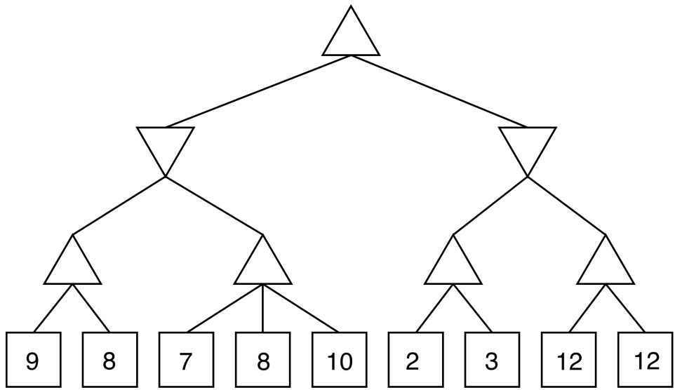

(ii) [1 pt] In a minimax game, a leaf node that is the first child of its parent may be pruned: # Always # Sometimes # Never

(iii) [1 pt] In an expectimax game, a leaf node that is the last child of its parent may be pruned: # Always # Sometimes # Never

(b) CSPs In a general constraint satisfaction problem with N binary-valued variables, backtracking search will backtrack at least (i) times and at most (ii) times. (Choose the tightest upper bound.) (i) [1 $\begin{aligned} pt]  & \bigcirc & \quad O(1)\end{aligned}$ # O(n) # O(n2) # O(2n) # O(n!) (ii) [1 pt] # O(1) # O(n) # O(n2) # O(2n) # O(n!)

Aldo has a choice between (1) receiving four apples with certainty, and (2) a lottery in which he will receive two, four, or six apples, each with probability 1/3.

Write down a monotonically decreasing utility U(a) (where a is the number of apples) such that Aldo strictly prefers to enter the lottery. You may assume a > 0.

U(a) =

<!-- page: 5 -->

(d) Search and Heuristics

Consider the graph and heuristics below for the following problems.

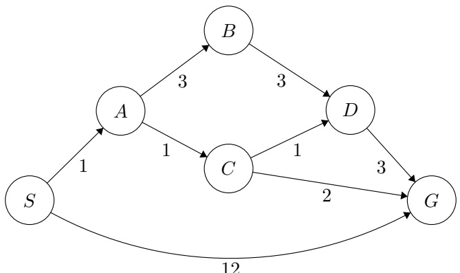

| State | h1(s) | h2(s) | h3(s) |
| --- | --- | --- | --- |
| S | 3 | 2 | 2 |
| A | 3 | 2 | 2 |
| B | 5 | 5 | 5 |
| C | 2 | 3 | 2 |
| D | 2 | 2 | 1 |
| G | 0 | 0 | 0 |

For the following, mark all that are true about the heuristic in question.

(i) [1 pt] h1(s)

 Admissible  Consistent  Neither

(ii) [1 pt] h2(s)

 Admissible  Consistent  Neither

(iii) [1 pt] h3(s)

 Admissible  Consistent  Neither

For the following search algorithms, fill in the minimal sufficient condition on the heuristic for the algorithm to be guaranteed to be optimal. Fill in “neither” if neither condition is sufficient.

(iv) [1 pt] A∗ Tree Search

\# Consistent # Admissible # Neither

(v) [1 pt] A∗ Graph Search

\# Consistent # Admissible # Neither

(vi) [1 pt] Greedy Search

\# Consistent # Admissible # Neither

<!-- page: 6 -->

(e) VPI and Decision Networks For the following question, consider the graph below.

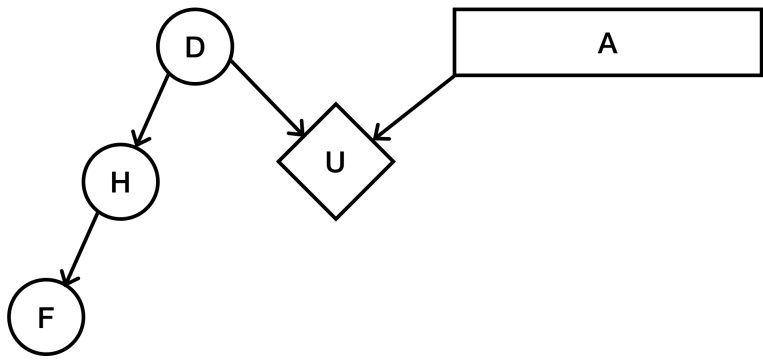

2For the following, decide whether the statement equals 0, does not equal 0, or we need more information to decide. If we need more information to decide, write a relation that would guarantee it to be equal to 0.

(i) [1 pt] V P I(H) # Equal to 0 # Not Equal to 0 # Need more information:

(ii) [1 pt] V P I(H|D) # Equal to 0 # Not Equal to 0 # Need more information:

(iii) [1 pt] V P I(D) # Equal to 0 # Not Equal to 0 # Need more information:

## (f) Naive Bayes

(i) [1 pt] In the Naive Bayes model, features are independent effects of the label. # True # False

(ii) [1 pt] Laplace smoothing helps to achieve better accuracy on the training data. # True # False

Consider the following table of data.

| A | 1 | 0 | 1 | 2 | 0 | 1 | 2 | 1 | 2 | 0 |
| --- | --- | --- | --- | --- | --- | --- | --- | --- | --- | --- |
| B | 0 | 2 | 2 | 1 | 2 | 2 | 1 | 0 | 0 | 1 |
| Y | + | - | + | + | - | + | - | - | - | + |

(iii) [1 pt] Find the following quantities. You can leave your answers as fractions.

P(Y = +) =

P(A = 0|Y = +) =

P(B = 2|Y = −) =

(iv) [2 pts] Find the following quantities, using Laplace smoothing with k = 2. You can leave your answers as fractions.

P(A = 1|Y = +) =

$P ( B = 1 | Y = - )$ =

<!-- page: 7 -->

## (g) Perceptron

(i) [1 pt] The perceptron algorithm will converge even if the data is not linearly separable. # True # False

(ii) [1 pt] If while running the perceptron algorithm we make one pass through the data and make no classification mistakes, the algorithm has converged. # True # False

(iii) [1 pt] If we run the perceptron with no bias on d dimensional data, the decision boundary produced by the algorithm is a hyperplane that passes through the origin of Rd. # True # False

(iv) [3 pts] Suppose we have linearly separable three-class data with classes (A, B, C) and run perceptron with initial weights $w _ { A } ^ { ( 0 ) } ,   w _ { B } ^ { ( 0 ) }$ , and $w _ { C } ^ { ( 0 ) }$ until convergence. Let N be the number of data points, and let T be the number of updates to the weights before convergence. Let $s = w _ { A } ^ { ( 0 ) } + w _ { B } ^ { ( 0 ) } + w _ { C } ^ { ( 0 ) }$ . What is the sum $w _ { A } ^ { ( T ) } + w _ { B } ^ { ( T ) } + \tilde { w _ { C } ^ { ( T ) } } ?$ # s # $\frac { s } { \| | s \| | }$ $N s$ # $\textstyle N { \frac { s } { \| s \| } }$ ## $T s$ # $T { \frac { s } { \| s \| } }$ # $N T s$ # Zero vector # $\textstyle N T { \frac { s } { \| s \| } }$ # None of the above

(v) [2 pts] Consider a perceptron update with step size $\lambda_{t} = \frac{1}{2^{t}}$ . In other words, for a two class problem the t−th iteration is $w_{t} \leftarrow w_{t} + \lambda_{t} y_{i} x_{i}   if   (x_{i}, y_{i})$ is the selected misclassified point to perform the update.

 This perceptron converges even if the data is not linearly separable.

 The order of the data feed will affect the outome of the algorithm.

 This perceptron update only converges if the data is linearly separable.

 The order of the data feed will not affect the outcome of the algorithm.

(vi) [2 pts] If we run the perceptron update defined above on a linearly separable dataset, it is guaranteed that the algorithm will converge to a linear separator that achieves perfect training accuracy. # True # False

(vii) [2 pts] Aldo wants to use perceptron to build a classifier for his binary class data $\{ x _ { i } \}$ with labels $y _ { i } \in \{ + 1 , - 1 \}$ . He has noticed however that his training data is not linearly separable. He has devised a brilliant idea. He decided that he will instead train with the data $z _ { i } = ( x _ { i } , y _ { i } )$ and labels $y _ { i }$ . Is the new data, zi with labels yi linearly separable? # Yes # No

Comment on Aldo’s decision. Do you think it is a good idea? Why or why not?

<!-- page: 8 -->

(h) Optimization

(i) [1 pt] Stochastic gradient descent is guaranteed to arrive at a global optimum. # True # False

(ii) [1 pt] Gradient descent with momentum makes use of second derivative information. # True # False

<!-- page: 9 -->

## Q3. [18 pts] GSI Adventures

(a) Missing Exams! The GSIs of 188 are currently looking for where all of the exams have gone! There are 5 GSIs and each one has contact with the other, and they’re looking for a grand total of E exams. Imagine Berkeley as an M × N grid and each GSI starts in a different place. The E exams are spread throughout the Berkeley grid and when a GSI visits a grid space, they are able to pick up all of the exams at that space. During each timestep, a GSI can move 1 grid space. If the exams are not found in T time steps, there will not be time to grade them, and the staff will be forced to give everyone an A. The students know this, so the GSIs must always avoid S students in the grid, otherwise they will steal the exams from them.

(i) [3 pts] Davis and Jacob would like to model this as a search problem. The instructors know where the GSIs start, where the students start, and how they move (that is, student position is a known deterministic function of time). What is a minimal state representation to model this game? Recall that the locations of the exams are not known.

(ii) [3 pts] Provide the size of the state representation from above.

(iii) [2 pts] Which of the following are admissible heuristics for this search problem?

<small>The number of exams left to be found</small>

<small>The number of exams left to be found divided by 5</small>

 The minimum Manhattan Distance between a GSI and an unvisited grid space

 The maximum Manhattan Distance between a GSI and an unvisited grid space

 The number of squares in the grid that have not been visited

 The number of squares in the grid that have not been visited divided by 5

<!-- page: 10 -->

(b) The exams have finally been located, and now, it’s the students’ turn to worry! A student’s utility leading up to the exam depends on how hard they study (very hard (+v) or just hard (−v)) as well as the chance that Davis has a cold around the the exam.

If Davis has a cold (+c), he will be too tired to write a hard exam question. He might also be unable to hold office hours, in which case Bob (a reader) will hold office hours instead (+b). The decision network and the tables associated with it are shown below:

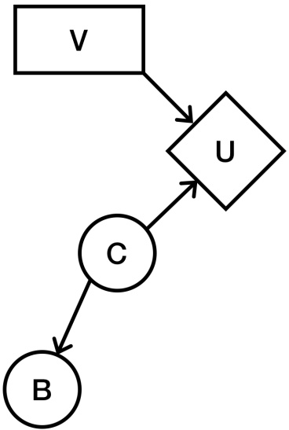

<table><tbody><tr><td colspan="2"></td><td>B</td><td>C</td><td>P(B|C)</td><td>V</td><td>C</td><td>U</td></tr><tr><td>C</td><td>P(C)</td><td>+b</td><td>+c</td><td>0.8</td><td>+v</td><td>+c</td><td>200</td></tr><tr><td>+c</td><td>0.5</td><td>+b</td><td>-c</td><td>0.1</td><td>+v</td><td>-c</td><td>120</td></tr><tr><td>-c</td><td>0.5</td><td>-b</td><td>+c</td><td>0.2</td><td>-v</td><td>+c</td><td>250</td></tr><tr><td colspan="2"></td><td>-b</td><td>-c</td><td>0.9</td><td>-v</td><td>-c</td><td>90</td></tr></tbody></table>

Calculate the V P I(B). To do this, in the calculations, calculate MEU(), MEU(+b), and $M E U ( - b )$ . In order to get as much partial credit, provide these calculations, as well as any other calculations necessary, in a neat and readable order. Use the calculated tables below in order to help with the calculations. You may leave your answers as expressions in terms of probabilities in the table and your answers to previous parts.

<table><tbody><tr><td colspan="2"></td><td>B</td><td>C</td><td>P(C|B)</td></tr><tr><td>B</td><td>P(B)</td><td>+b</td><td>+c</td><td>0.89</td></tr><tr><td>+b</td><td>0.45</td><td>+b</td><td>-c</td><td>0.11</td></tr><tr><td>-b</td><td>0.55</td><td>-b</td><td>+c</td><td>0.18</td></tr><tr><td colspan="2"></td><td>-b</td><td>-c</td><td>0.81</td></tr></tbody></table>

(i) [2 pts] MEU() =

(ii) [3 pts] MEU(+b) =

(iii) [3 pts] MEU(−b) =

(iv) [2 pts] V P I(B) =

<!-- page: 11 -->

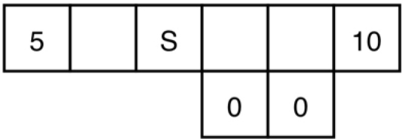

Consider the above gridworld. An agent is currently on grid cell S, and would like to collect the rewards that lie on both sides of it. If the agent is on a numbered square, its only available action is to Exit, and when it exits it gets reward equal to the number on the square. On any other (non-numbered) square, its available actions are to move East and West. Note that North and South are never available actions.

If the agent is in a square with an adjacent square downward, it does not always move successfully: when the agent is in one of these squares and takes a move action, it will only succeed with probability p. With probability $1 - p ,$ the move action will fail and the agent will instead move downwards. If the agent is not in a square with an adjacent space below, it will always move successfully.

For parts (a) and (b), we are using discount factor $\gamma \in [ 0 , 1 ]$

(a) [2 pts] Consider the policy $\pi _ { \mathrm { E a s t } }$ , which is to always move East (right) when possible, and to Exit when that is the only available action. For each non-numbered state x in the diagram below, fill in $V ^ { \pi _ { \mathrm { E a s t } } } ( x )$ in terms of γ and p.

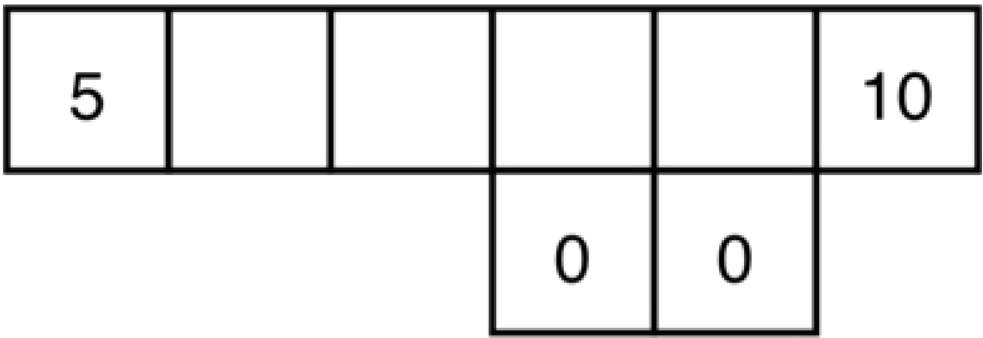

(b) [2 pts] Consider the policy $\pi _ { \mathrm { W e s t } }$ , which is to always move West (left) when possible, and to Exit when that is the only available action. For each non-numbered state x in the diagram below, fill in $V ^ { \pi \mathrm { w e s t } } ( x )$ in terms of $\gamma$ and $p .$

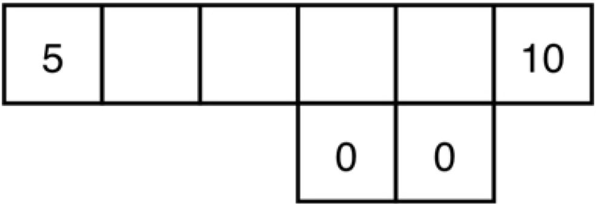

<!-- page: 12 -->

(c) [2 pts] For what range of values of $p$ in terms of $\gamma$ is it optimal for the agent to go West (left) from the start state $\bar { ( S ) } ?$

Range:

(d) $[ 2 ~ \mathrm { p t s } ]$ For what range of values of $p$ in terms $o f   \gamma$ is $\pi _ { \mathrm { W e s t } }$ the optimal policy?

Range:

(e) [2 pts] For what range of values of $p$ in terms $o f   \gamma$ is $\pi _ { \mathrm { E a s t } }$ the optimal policy?

Range:

<!-- page: 13 -->

Recall that in approximate Q-learning, the Q-value is a weighted sum of features: $\begin{array} { r } { Q ( s , a )   =   \sum _ { i } w _ { i } f _ { i } ( s , a ) } \end{array}$ . To derive a weight update equation, we first defined the loss function $L _ { 2 } = { \textstyle \frac { 1 } { 2 } } ( y - \sum _ { k } w _ { k } f _ { k } ( \vec { x ) } ) ^ { 2 }$ and found $d L _ { 2 } / d w _ { m } =$ $- ( y - \textstyle \sum _ { k } w _ { k } f _ { k } ( x ) ) f _ { m } ( x )$ . Our label y in this set up is $r + \gamma \operatorname { m a x } _ { a } Q ( s ^ { \prime } , \bar { a ^ { \prime } } )$ . Putting this all together, we derived the gradient descent update rule for $w _ { m }$ as $\begin{array} { l } { w _ { m } \leftarrow w _ { m } + \alpha \left( r + \gamma \operatorname* { m a x } _ { a } Q ( s ^ { \prime } , a ^ { \prime } ) - Q ( s , a ) \right) f _ { m } ( s , a ) } \\ \end{array}$

In the following question, you will derive the gradient descent update rule for $w _ { m }$ using a different loss function:

$$
L _ {1} = \left| y - \sum_ {k} w _ {k} f _ {k} (x) \right|
$$

(f) [4 pts] Find $d L _ { 1 } / d w _ { m }$ . Show work to have a chance at receiving partial credit. Ignore the non-differentiable point.

(g) [1 pt] Write the gradient descent update rule for $w _ { m }$ , using the $L _ { 1 }$ loss function.

<!-- page: 14 -->

## Q5. [16 pts] Perceptron and Kernels

A kernel is a mapping $K ( x , y )$ from pairs vectors in Rdinto the real numbers such that $K ( x , y ) = \Phi ( x ) \cdot \Phi ( y )$ where Φ is a mapping from $\mathbb { R } ^ { d }$ into $\mathbb { R } ^ { D }$ where D is possibly different from d and even infinite. We say that a mapping $K ( x , y )$ for which such Φ exists is a valid kernel.

(a) The following binary class data has two features, A and B.

| Index | A | B | Class |
| --- | --- | --- | --- |
| 1. | 1 | 1 | 1 |
| 2. | 0 | 3 | -1 |
| 3. | 1 | -1 | 1 |
| 4. | 3 | 0 | -1 |
| 5. | -1 | 1 | 1 |
| 6. | 0 | -3 | -1 |
| 7. | -1 | -1 | 1 |
| 8. | -3 | 0 | -1 |

(i) [3 pts] Select all true statements:

This data is linearly separable.

 This data is linearly separable if we use a feature map $\phi ( ( A , B ) ) = ( A ^ { 2 } , B ^ { 2 } , 1 )$

 There exists a kernel such that this data is linearly separable.

 For all datasets in which no data point is labeled in more than one distinct way, there exists a kernel such that the data is linearly separable.

 For all datasets, there exists a kernel such that the data is linearly separable.

 For all valid kernels, there exists a dataset with at least one point from each class that is linearly separable under that kernel.

 None of the above.

We will be running both the primal (normal) binary (not multiclass) perceptron and dual binary perceptron algorithms on this dataset. We will initialize the weight vector w to (1, 1) for the primal perceptron algorithm. Accordingly, we will initialize the α vector to $( 1 , 0 , 0 , 0 , 0 , 0 , 0 , 0 )$ for the dual perceptron algorithm with the kernel $K ( x , y ) = x \cdot y$ . Pass through the data using the indexing order provided. There is no bias term.

Write your answer in the box provided. Show your work outside of the boxes to have a chance at receiving partial credit.

(ii) [1 pt]

What is the first misclassified point?

(iii) [1 pt] For the primal perceptron algorithm, what is the weight vector after the first weight update?

<!-- page: 15 -->

For your convenience, the data is duplicated on this page.

| Index | A | B | Class |
| --- | --- | --- | --- |
| 1. | 1 | 1 | 1 |
| 2. | 0 | 3 | -1 |
| 3. | 1 | -1 | 1 |
| 4. | 3 | 0 | -1 |
| 5. | -1 | 1 | 1 |
| 6. | 0 | -3 | -1 |
| 7. | -1 | -1 | 1 |
| 8. | -3 | 0 | -1 |

(iv) [1 pt] For the dual perceptron algorithm, what is the α vector after the first weight update?

(v) [1 pt] What is the second misclassified point?

(vi) [1 pt] For the primal perceptron algorithm, what is the weight vector after the second weight update?

(vii) [1 pt] For the dual perceptron algorithm, what is the α vector after the second weight update?

(b) [3 pts] Consider the following kernel function: $K ( \mathbf { x } , \mathbf { y } ) = ( \mathbf { x } \cdot \mathbf { y } ) ^ { 2 }$ where $\mathbf { x } , \mathbf { y } \in \mathbb { R } ^ { 2 }$ . Find a valid Φ map for this kernel. That is, find a vector-to-vector function φ such that ${ \dot { \phi } } ( \mathbf { x } ) \cdot \phi ( \mathbf { y } ) = K ( \mathbf { x } , \mathbf { y } ) = ( \mathbf { x } \cdot \mathbf { y } ) ^ { 2 }$ . Show work to have a chance at receiving partial credit. Any precise answer format is acceptable.

<!-- page: 16 -->

(c) We have n data points, $\{ ( x _ { i } , y _ { i } ) \} _ { i = 1 } ^ { n }$ , with $x _ { i }   \in   \mathbb { R } ^ { d }$ and $y _ { i } \: \in \: \{ 1 , 2 , \ldots , M \}$ That is, they are labelled as belonging to one of M classes. We will run the multiclass perceptron algorithm with an RBF kernel:

$$
K (x _ {i}, x _ {j}) = \exp (- \parallel x _ {i} - x _ {j} \parallel^ {2})\tag{1}
$$

Denote the dual weights at time t as $\alpha _ { y } ^ { ( t ) } = ( \alpha _ { y , 1 } ^ { ( t ) } , \cdots , \alpha _ { y , K } ^ { ( t ) } )$ for all classes $y = 1 , \cdots , M .$

(i) [1 pt] What is the right value for K, the dimension of each of the dual weight vectors?

$$
\begin{array}{c c} \bigcirc & n \\ \bigcirc & M n \end{array}
$$

$$
\begin{array}{c c} \bigcirc & M \\ \bigcirc & M + n \end{array}
$$

(ii) [3 pts]

Assume that for some t, and for all $y ,   \alpha _ { y } ^ { ( t ) }$ has only one nonzero entry. This single nonzero entry equals one. All the nonzero entries occur at different indices for different y. Describe the decision regions in $\mathcal { R } ^ { d }$ for the M classes in terms of distances between points.

<!-- page: 17 -->

# Q6. [15 pts] Particle Filtering Apprenticeship

Consider a modified version of the apprenticeship problem. We are observing an agent’s actions in an MDP and are trying to determine which out of a set $\{ \pi _ { 1 } , \ldots , \pi _ { n } \}$ the agent is following. Let the random variable Π take values in that set and represent the policy that the agent is acting under. We consider only stochastic policies, so that $A _ { t }$ is a random variable with a distribution conditioned on $S _ { t }$ and Π. As in a typical ${ \mathrm { M D P } } ,   S _ { t }$ is a random variable with a distribution conditioned on $S _ { t - 1 }$ and $A _ { t - 1 }$ . The full Bayes net is shown below.

The agent acting in the environment knows what state it is currently in (as is typical in the MDP setting). Unfortunately, however, we, the observer, cannot see the states $S _ { t } .$ Thus we are forced to use an adapted particle filtering algorithm to solve this problem. Concretely, we will develop an efficient algorithm to estimate $P ( \Pi \mid a _ { 1 : t } )$

(a) The Bayes net for part (a) is

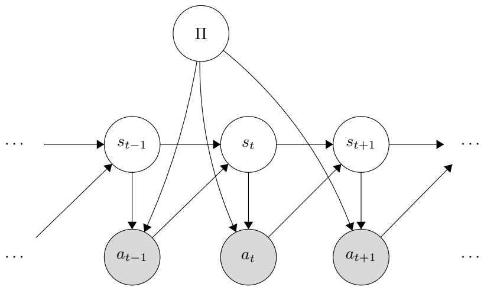

(i) [3 pts] Select all of the following that are guaranteed to be true in this model for $t > 1 0 ;$

$$
\square \quad S _ {t} \perp \perp S _ {t - 2} \mid S _ {t - 1}
$$

$$
\square \quad S _ {t} \perp \perp S _ {t - 2} \mid \Pi , S _ {t - 1}
$$

$$
\square \quad S _ {t} \perp \perp S _ {t - 2} \mid S _ {t - 1}, A _ {1: t - 1}
$$

$$
\square \quad S _ {t} \perp \perp S _ {t - 2} \mid \Pi
$$

$$
\square \quad S _ {t} \perp \perp S _ {t - 2} \mid \Pi , S _ {t - 1}, A _ {1: t - 1}
$$

$$
\square \quad S _ {t} \perp \perp S _ {t - 2} \mid \Pi , A _ {1: t - 1}
$$

 None of the above

We will compute our estimate for $P ( \Pi \mid a _ { 1 : t } )$ by coming up with a recursive algorithm for computing $P ( \Pi , S _ { t } \mid a _ { 1 : t } )$ . (We can then sum out $S _ { t }$ to get the desired distribution; in this problem we ignore that step.)

(ii) [2 pts] Write a recursive expression for $P ( \Pi , S _ { t } \mid a _ { 1 : t } )$ in terms of the CPTs in the Bayes net above. Hint: Think of the forward algorithm.

$P ( \Pi , S _ { t } \mid a _ { 1 : t } ) \propto$

<!-- page: 18 -->

We now try to adapt particle filtering to approximate this value. Each particle will contain a single state $s _ { t }$ and a potential policy $\pi _ { i } .$

(iii) [2 pts] The following is pseudocode for the body of the loop in our adapted particle filtering algorithm. Fill in the boxes with the correct values so that the algorithm will approximate $P ( \Pi , S _ { t } \mid a _ { 1 : t } )$

1. <u>Elapse time: for each particle</u> $( s _ { t } , \pi _ { i } )$ <u>, sample a s</u>uccessor $s _ { t + 1 }$ from

The policy $\pi ^ { \prime }$ in the new particle is

2. Incorporate evidence: To each new particle $( s _ { t + 1 } , \pi ^ { \prime } )$ , assign weight

3. Resample particles from the weighted particle distribution.

(b) [1 pt] We now observe the acting agent’s actions and rewards at each time step (but we still don’t know the states). Unlike the MDPs in lecture, here we use a stochastic reward function, so that $R _ { t }$ is a random variable with a distribution conditioned on $S _ { t }$ and $A _ { t }$ . The new Bayes net is given by

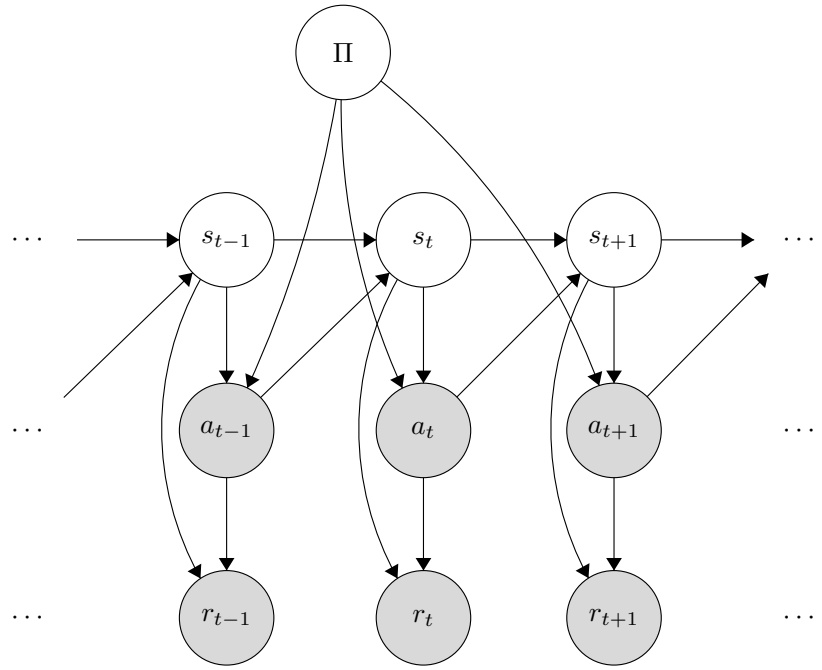

Notice that the observed rewards do in fact give useful information since d-separation does not give that $R _ { t } \perp    \perp \Pi \mid A _ { 1 : t }$ . Give an active path connecting $R _ { t }$ and Π when $A _ { 1 : t }$ are observed. Your answer should be an ordered list of nodes in the graph, for example $`` S_{t},S_{t+1},A_{t},\Pi,A_{t-1},R_{t-1}  ''$

<!-- page: 19 -->

(c) We now observe only the sequence of rewards and no longer observe the sequence of actions. The new Bayes net is:

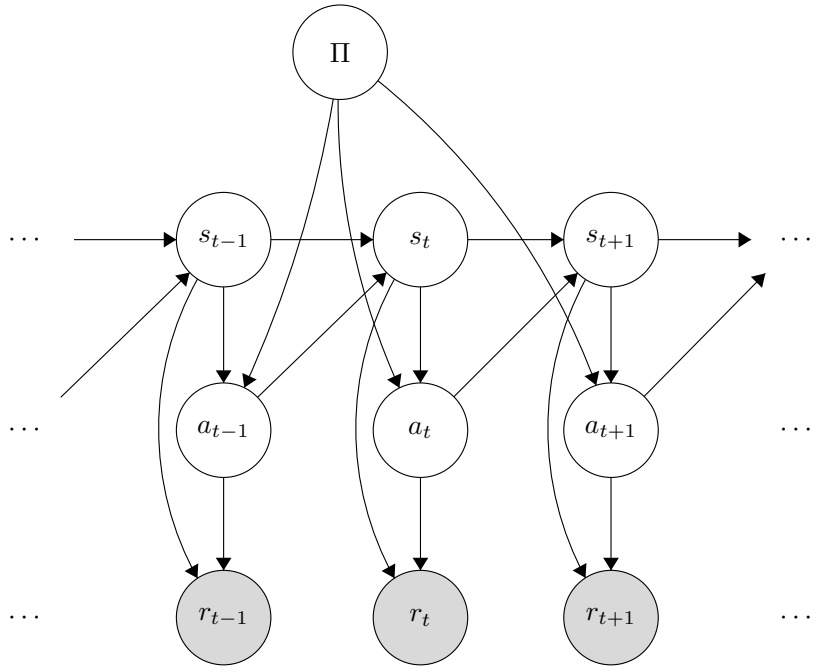

We will compute our estimate for $P ( \Pi \mid r _ { 1 : t } )$ by coming up with a recursive algorithm for computing $P ( \Pi , S _ { t } , A _ { t } \mid r _ { 1 : t } )$ . (We can then sum out $S _ { t }$ and $A _ { t }$ to get the desired distribution; in this problem we ignore that step.)

(i) [2 pts] Write a recursive expression for $P ( \Pi , S _ { t } , A _ { t } \mid r _ { 1 : t } )$ in terms of the $\mathrm { C P T s }$ in the Bayes net above.

$P ( \Pi , S _ { t } , A _ { t } \mid r _ { 1 : t } )$ ∝

We now try to adapt particle filtering to approximate this value. Each particle will contain a single state $s _ { t } ,$ a single action $a _ { t } ,$ and a potential policy $\pi _ { i }$

(ii) [2 pts] The following is pseudocode for the body of the loop in our adapted particle filtering algorithm. Fill in the boxes with the correct values so that the algorithm will approximate $P ( \Pi , S _ { t } , A _ { t } \mid r _ { 1 : t } )$

1. Elapse time: for each particle $( s _ { t } , a _ { t } , \pi _ { i } )$ , sample a successor stat e st+1 $s _ { t + 1 }$ from

Then, sample a successor action $a _ { t + 1 }$ from

The policy $\pi ^ { \prime }$ in the new particle is

2. Incorporate evidence: To each new particle $( s _ { t + 1 } , a _ { t + 1 } , \pi ^ { \prime } )$ , assign weight

3. Resample particles from the weighted particle distribution.

<!-- page: 20 -->

(d) Finally, consider the following Bayes net:

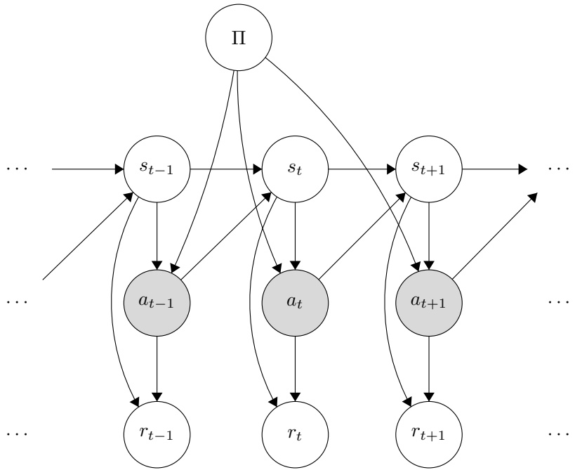

Here, the task is identical to that in part (a); we see only the actions and want to approximate $P ( \Pi , | a _ { 1 : t } )$ However, now we are also accounting for the hidden reward variables.

(i) [1 pt] For a fixed state action pair $( s _ { t } , a _ { t } )$ , what is $\textstyle \sum _ { r _ { t } } P ( r _ { t } \mid s _ { t } , a _ { t } ) ?$

Suppose for the following questions we adapt particle filtering to this model as in previous parts. In particular, in this algorithm, our particles will also track $r _ { t }$ values.

(ii) [1 pt] Comparing to the algorithm in (a), with the same number of particles, this algorithm will give an estimate of $P ( \Pi \mid a _ { 1 : t } )$ that is # More accurate # Equally accurate # Less accurate

(iii) [1 pt] Comparing to the algorithm in (a), with the same number of particles, to compute an estimate, this algorithm will take # More time # The same amount of time # Less time

<!-- page: 21 -->

## Q7. [12 pts] Neural Network Data Sufficiency

The next few problems use the below neural network as a reference. Neurons $h _ { 1 - 3 }$ and $j _ { 1 - 2 }$ all use ReLU activation functions. Neuron $y$ uses the identity activation function: $f ( x )   =   x$ . In the questions below, let $w _ { a , b }$ denote the weight that connects neurons a and b. Also, let $o _ { a }$ denote the value that neuron a outputs to its next layer.

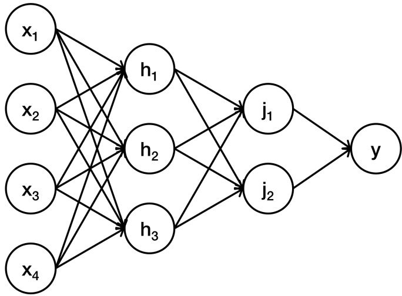

Given this network, in the following few problems, you have to decide whether the data given are sufficient for answering the question.

(a) [2 pts] Given the above neural network, what is the value of ${ o _ { y } } ^ { ? }$

Data item 1: the values of all weights in the network and the values $o _ { h _ { 1 } } ,   o _ { h _ { 2 } } ,   o _ { h _ { 3 } }$

Data item 2: the values of all weights in the network and the values $o _ { j _ { 1 } } ,   o _ { j _ { 2 } }$

\# Data item (1) alone is sufficient, but data item (2) alone is not sufficient to answer the question.

\# Data item (2) alone is sufficient, but data item (1) alone is not sufficient to answer the question.

\# Both statements taken together are sufficient, but neither data item alone is sufficient.

\# Each data item alone is sufficient to answer the question.

\# Statements (1) and (2) together are not sufficient, and additional data is needed to answer the question.

(b) [2 pts] Given the above neural network, what is the value of ${ O _ { h _ { 1 } } } _ { \cdot } ^ { ? }$

Data item 1: the neuron input values, i.e., $O _ { x _ { 1 } }$ through $O _ { x _ { 4 } }$

Data item 2: the values $o _ { j _ { 1 } } ,   o _ { j _ { 2 } }$

\# Data item (1) alone is sufficient, but data item (2) alone is not sufficient to answer the question.

\# Data item (2) alone is sufficient, but data item (1) alone is not sufficient to answer the question.

\# Both statements taken together are sufficient, but neither data item alone is sufficient.

Each data item alone is sufficient to answer the question.

\## Statements (1) and (2) together are not sufficient, and additional data is needed to answer the question.

(c) [2 pts] Given the above neural network, what is the value of $o _ { j _ { 1 } } \mathit { ? }$

Data item 1: the values of all weights connecting neurons $h_{1}, h_{2}, h_{3}   to   j_{1}, j_{2}$

Data item 2: the values $o _ { h _ { 1 } } ,   o _ { h _ { 2 } } ,   o _ { h _ { 3 } }$

\# Data item (1) alone is sufficient, but data item (2) alone is not sufficient to answer the question.

\# Data item (2) alone is sufficient, but data item (1) alone is not sufficient to answer the question.

\# Both statements taken together are sufficient, but neither data item alone is sufficient.

Each data item alone is sufficient to answer the question.

\## Statements (1) and (2) together are not sufficient, and additional data is needed to answer the question.

<!-- page: 22 -->

(d) [2 pts] Given the above neural network, what is the value of ${ \partial } o _ { y } / { \partial } w _ { j _ { 2 } , y } ?$

Data item 1: the value of $o _ { j _ { 2 } }$

Data item 2: all weights in the network and the neuron input values, i.e., $o _ { x _ { 1 } }$ through $O _ { x _ { 4 } }$ 4

\# Data item (1) alone is sufficient, but data item (2) alone is not sufficient to answer the question.

\# Data item (2) alone is sufficient, but data item (1) alone is not sufficient to answer the question.

\# Both statements taken together are sufficient, but neither data item alone is sufficient.

Each data item alone is sufficient to answer the question.

\## Statements (1) and (2) together are not sufficient, and additional data is needed to answer the question.

(e) [2 pts] Given the above neural network, what is the value of ${ \partial } o _ { y } / { \partial } w _ { h _ { 2 } , j _ { 2 } } ?$

Data item 1: the value of $w _ { j _ { 2 } , y }$

Data item 2: the value of ${ \partial } o _ { j _ { 2 } } / { \partial } w _ { h _ { 2 } , j _ { 2 } }$

\# Data item (1) alone is sufficient, but data item (2) alone is not sufficient to answer the question.

\# Data item (2) alone is sufficient, but data item (1) alone is not sufficient to answer the question.

\# Both statements taken together are sufficient, but neither data item alone is sufficient.

\# Each data item alone is sufficient to answer the question.

\# Statements (1) and (2) together are not sufficient, and additional data is needed to answer the question.

(f) [2 pts] Given the above neural network, what is the value of ${ \partial } o _ { y } / { \partial } w _ { x _ { 1 } , h _ { 3 } } ?$

Data item 1: the value of all weights in the network and the neuron input values, i.e., $O _ { x _ { 1 } }$ through $O _ { x _ { 4 } }$ Data item 2: the value of $w _ { x _ { 1 } , h _ { 3 } }$

\# Data item (1) alone is sufficient, but data item (2) alone is not sufficient to answer the question.

\# Data item (2) alone is sufficient, but data item (1) alone is not sufficient to answer the question.

\# Both statements taken together are sufficient, but neither data item alone is sufficient.

Each data item alone is sufficient to answer the question.

\## Statements (1) and (2) together are not sufficient, and additional data is needed to answer the question.

<!-- page: 23 -->

## Q8. [13 pts] Naive Bayes: Pacman or Ghost?

You are standing by an exit as either Pacmen or ghosts come out of it. Every time someone comes out, you get two observations: a visual one and an auditory one, denoted by the random variables $X _ { v }$ and $X _ { a } ,$ respectively. The visual observation informs you that the individual is either a Pacman $( X _ { v } = 1 )$ or a ghost $( X _ { v } = 0 )$ The auditory observation $X _ { a }$ is defined analogously. Your observations are a noisy measurement of the individual’s true type, which is denoted by Y . After the indiviual comes out, you find out what they really are: either a Pacman $( Y = 1 )$ or a ghost $( Y = 0 )$ . You have logged your observations and the true types of the first 20 individuals:

| individual $i$ | 0 | 1 | 2 | 3 | 4 | 5 | 6 | 7 | 8 | 9 | 10 | 11 | 12 | 13 | 14 | 15 | 16 | 17 | 18 | 19 |
| --- | --- | --- | --- | --- | --- | --- | --- | --- | --- | --- | --- | --- | --- | --- | --- | --- | --- | --- | --- | --- |
| first observation $X_{v}^{(i)}$ | 0 | 0 | 1 | 0 | 1 | 0 | 0 | 1 | 1 | 1 | 0 | 1 | 1 | 0 | 1 | 1 | 1 | 0 | 0 | 0 |
| second observation $X_{a}^{(i)}$ | 0 | 0 | 0 | 0 | 0 | 0 | 0 | 0 | 0 | 0 | 0 | 1 | 1 | 0 | 0 | 0 | 0 | 0 | 0 | 0 |
| individual’s type $Y^{(i)}$ | 0 | 0 | 0 | 0 | 0 | 0 | 0 | 1 | 1 | 1 | 1 | 1 | 1 | 1 | 1 | 1 | 1 | 0 | 0 | 0 |

The superscript (i) denotes that the datum is the ith one. Now, the individual with $i = 2 0$ comes out, and you want to predict the individual’s type $Y ^ { ( 2 0 ) }$ given that you observed $X _ { v } ^ { ( 2 0 ) } = 1$ and $X _ { a } ^ { ( 2 0 ) } = 1$

(a) Assume that the types are independent, and that the observations are independent conditioned on the type. You can model this using na¨ıve Bayes, with $X _ { v } ^ { ( i ) }$ and ${ { X } _ { a } ^ { ( i ) } }$ as the features and $Y ^ { ( i ) }$ as the labels. Assume the probability distributions take on the following form:

$$
\begin{array}{c} P (X _ {v} ^ {(i)} = x _ {v} | Y ^ {(i)} = y) = \left\{ \begin{array}{l l} p _ {v} & \text {if} x _ {v} = y \\ 1 - p _ {v} & \text {if} x _ {v} \neq y \end{array} \right. \\ P (X _ {a} ^ {(i)} = x _ {a} | Y ^ {(i)} = y) = \left\{ \begin{array}{l l} p _ {a} & \text {if} x _ {a} = y \\ 1 - p _ {a} & \text {if} x _ {a} \neq y \end{array} \right. \\ P (Y ^ {(i)} = 1) = q \end{array}
$$

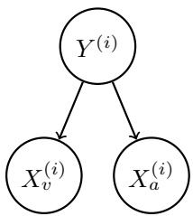

for $p _ { v } , p _ { a } , q \in [ 0 , 1 ]$ and $i \in \mathbb { N } .$

(i) [3 pts] What’s the maximum likelihood estimate of $p _ { v } , p _ { a }$ and $q ^ { \prime }$

pv = pa = q =

(ii) [3 pts] What is the probability that the next individual is Pacman given your observations? Express your answer in terms of the parameters $p _ { v } , p _ { a }$ and q (you might not need all of them).

$P ( Y ^ { ( 2 0 ) } = 1 | X _ { v } ^ { ( 2 0 ) } = 1 , X _ { a } ^ { ( 2 0 ) } = 1 ) =$

<!-- page: 24 -->

Now, assume that you are given additional information: you are told that the individuals are actually coming out of a bus that just arrived, and each bus carries exactly 9 individuals. Unlike before, the types of every 9 consecutive individuals are conditionally independent given the bus type, which is denoted by Z. Only after all of the 9 individuals have walked out, you find out the bus type: one that carries mostly Pacmans $( Z = 1 )$ or one that carries mostly ghosts $( Z = 0 )$ . Thus, you only know the bus type in which the first 18 individuals came in:

| individual i 0 1 2 3 | 4 5 6 7 8 9 10 11 12 | 13 14 15 16 17 18 19 |
| --- | --- | --- |
| first observation Xv(i) 0 0 1 0 | 1 0 0 1 1 1 0 1 1 | 0 1 1 1 0 0 0 |
| second observation Xa(i) 0 0 0 0 | 0 0 0 0 0 0 0 1 1 | 0 0 0 0 0 0 0 |
| individual's type Y(i) 0 0 0 0 | 0 0 0 1 1 1 1 1 1 | 1 1 1 1 0 0 0 |
| bus j | 0 | 1 |
| bus type Z(j) | 0 | 1 |

(b) You can model this using a variant of na¨ıve bayes, where now 9 consecutive labels $Y ^ { ( i ) } , \ldots , Y ^ { ( i + 8 ) }$ are conditionally independent given the bus type $Z ^ { ( j ) }$ , for bus j and individual $i = 9 j$ . Assume the probability distributions take on the following form:

$$
P (X _ {v} ^ {(i)} = x _ {v} | Y ^ {(i)} = y) = \left\{ \begin{array}{l l} p _ {v} & \text {if} x _ {v} = y \\ 1 - p _ {v} & \text {if} x _ {v} \neq y \end{array} \right.
$$

$$
P (X _ {a} ^ {(i)} = x _ {a} | Y ^ {(i)} = y) = \left\{ \begin{array}{l l} p _ {a} & \text {if} x _ {a} = y \\ 1 - p _ {a} & \text {if} x _ {a} \neq y \end{array} \right.
$$

$$
P (Y ^ {(i)} = 1 | Z ^ {(j)} = z) = \left\{ \begin{array}{l l} q _ {0} & \text {if} z = 0 \\ q _ {1} & \text {if} z = 1 \end{array} \right.
$$

$$
P (Z ^ {(j)} = 1) = r
$$

for $p , q _ { 0 } , q _ { 1 } , r \in [ 0 , 1 ]$ and $i , j \in \mathbb { N } .$

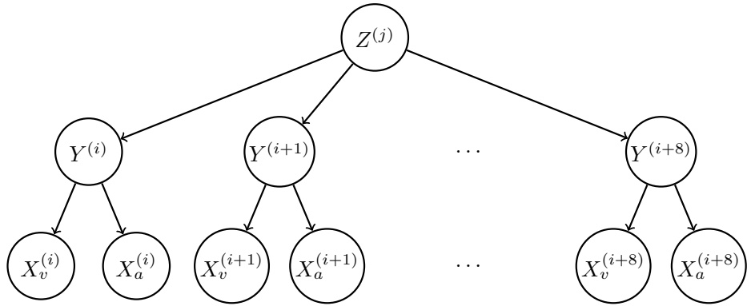

(i) [3 pts] What’s the maximum likelihood estimate of $q _ { 0 } , q _ { 1 }$ and $r ?$

q0 =

q1 =

r =

<!-- page: 25 -->

(ii) [4 pts] Compute the following joint probability. Simplify your answer as much as possible and express it in terms of the parameters $p _ { v } , p _ { a } , q _ { 0 } , q _ { 1 }$ and r (you might not need all of them).

$$
P (Y ^ {(2 0)} = 1, X _ {v} ^ {(2 0)} = 1, X _ {a} ^ {(2 0)} = 1, Y ^ {(1 9)} = 1, Y ^ {(1 8)} = 1) =
$$

<!-- page: 26 -->

<!-- page: 27 -->
