<!-- page: 1 -->

• You have approximately 170 minutes.

• The exam is closed book, closed calculator, and closed notes except your three-page crib sheet.

• Mark your answers ON THE EXAM ITSELF. If you are not sure of your answer you may wish to provide a brief explanation. All short answer sections can be successfully answered in a few sentences AT MOST.

• For multiple choice questions:

–  means mark all options that apply

means mark a single choice

#– When selecting an answer, please fill in the bubble or square completely ( and )

| First name |  |
| --- | --- |
| Last name |  |
| SID |  |
| Student to your right |  |
| Student to your left |  |

## Your Discussion/Exam Prep\* TA (fill all that apply):

 Brijen (Tu)

 Aaron (W)

 Peter (Tu)

 Mitchell (W)

 Aarash (W)

 Shea\* (W)

 Daniel (W)

 David (Tu)

Daniel\* (W)

 Abhishek (W)

 Yuchen\* (Tu)

 Nipun (Tu)

 Caryn (W)

 Wenjing (Tu)

 Andy\* (Tu)

 Anwar (W)

Nikita\* (Tu)

For staff use only:

| Q1. Agent Testing Today! | /1 |
| --- | --- |
| Q2. Potpourri | /14 |
| Q3. Search | /9 |
| Q4. CSPs | /8 |
| Q5. Game Trees | /9 |
| Q6. Something Fishy | /10 |
| Q7. Policy Evaluation | /8 |
| Q8. Bayes Nets: Inference | /8 |
| Q9. Decision Networks and VPI | /9 |
| Q10. Neural Networks: Representation | /15 |
| Q11. Backpropagation | /9 |
| Total | /100 |

<!-- page: 2 -->

<!-- page: 3 -->

SID:

Q1. [1 pt] Agent Testing Today!

It’s testing time! Not only for you, but for our CS188 robots as well! Circle your favorite robot below.


<!-- page: 4 -->

## Q2. [14 pts] Potpourri

(a) [1 pt] Fill in the unlabelled nodes in the Bayes Net below with the variables $\{ A , B , C , E \}$ such that the following independence assertions are true:

1. $A \perp     \perp B \mid E, D$

2. $E \perp     \perp D \mid B$

3. $E \perp    \perp C \mid A , B$

4. $C \perp     \perp D \mid A , B$

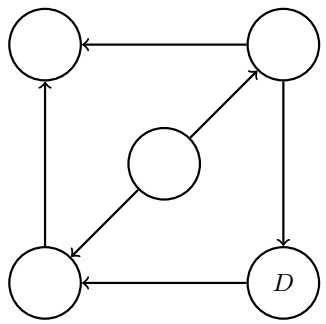

(b) [4 pts] For each of the 4 plots below, create a classification dataset which can or cannot be classified correctly by Naive Bayes and perceptron, as specified. Each dataset should consist of nine points represented by the boxes, shading the box  for positive class or leaving it blank  for negative class. Mark Not Possible if no such dataset is possible.

For can be classified by Naive Bayes, there should be some probability distributions $P ( Y )$ and $P ( F _ { 1 } | Y ) , P ( F _ { 2 } | Y )$ for the class Y and features $F _ { 1 } , F _ { 2 }$ that can correctly classify the data according to the Naive Bayes rule, and for cannot there should be no such distribution. For perceptron, assume that there is a bias feature in addition to $F _ { 1 }$ and $F _ { 2 }$

Naive <u>Bayes and perceptron b</u>oth can classify:

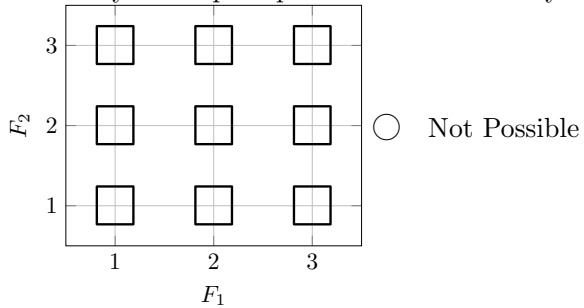

Naive <u>Bayes and perceptron b</u>oth cannot classify:

Naive <u>Bayes can classify; per</u>ceptron cannot classify:

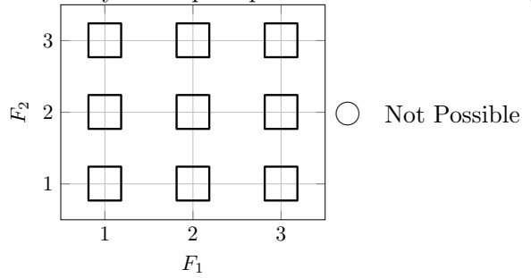

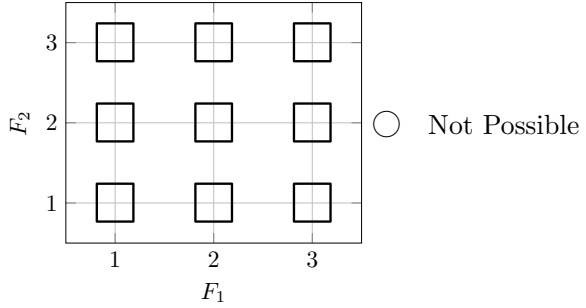

Naive <u>Bayes cannot classify;</u> perceptron can classify:


(c) [1 pt] Consider a multi-class perceptron for classes A, B, and C with current weight vectors:

$$
w _ {A} = (1, - 4, 7), w _ {B} = (2, - 3, 6), w _ {C} = (7, 9, - 2)
$$

A new training sample is now considered, which has feature vector $f(x) = (-2,1,3)$ and label $y ^ { * } = B$ . What are the resulting weight vectors after the perceptron has seen this example and updated the weights?

$w _ { A }$

w<sub>B</sub> =

w<sub>C</sub> =

<!-- page: 5 -->

SID:

(d) [1 pt] A single perceptron can compute the XOR function. # True # False

(e) [1 pt] A perceptron is guaranteed to learn a separating decision boundary for a separable dataset within a finite number of training steps. # True # False

(f) [1 pt] Given a linearly separable dataset, the perceptron algorithm is guaranteed to find a max-margin separating hyperplane. # True # False

(g) [1 pt] You would like to train a neural network to classify digits. Your network takes as input an image and outputs probabilities for each of the 10 classes, 0-9. The network’s prediction is the class that it assigns the highest probability to. From the following functions, select all that would be suitable loss functions to minimize using gradient descent:

 The square of the difference between the correct digit and the digit predicted by your network

 The probability of the correct digit under your network

 The negative log-probability of the correct digit under your network

\# None of the above

(h) [1 pt] From the list below, mark all triples that are inactive. A shaded circle means that node is conditioned on.

k = 0

```txt
□ ○ → ○ → ○
□ ○ → ● → ○
```

```txt
○ ← ○ → ○
○ ← ● → ○
```

```txt
□ ○ → ○ ← ○
□ ○ → ● ← ○
```

(i) [2 pts]

| A |  |
| --- | --- |
|  |  |

Consider the gridworld above. At each timestep the agent will have two available actions from the set {North, South, East, W est}. Actions that would move the agent into the wall may never be chosen, and allowed actions always succeed. The agent receives a reward of +8 every time it <u>enters</u> the square marked A. Let the discount factor be $\gamma = { \textstyle { \frac { 1 } { 2 } } }$

At each cell in the following tables, fill in the value of that state after iteration k of Value Iteration.

| 0 | 0 |
| --- | --- |
| 0 | 0 |

<table><tr><td colspan="2">k = 1</td></tr><tr><td></td><td></td></tr><tr><td></td><td></td></tr></table>

|  |  |
| --- | --- |
|  |  |

|  |  |
| --- | --- |
|  |  |

(j) [1 pt] Consider an HMM with T timesteps, hidden state variables $X _ { 1 } , \ldots X _ { T }$ , and observed variables $E _ { 1 } , \ldots E _ { T }$ Let S be the number of possible states for each hidden state variable X. We want to compute (with the forward algorithm) or estimate (with particle filtering) $P ( X _ { T } | E _ { 1 } { = } e _ { 1 } , \ldots E _ { T } { = } e _ { T } )$ . How many particles, in terms of S and T, would it take for particle filtering to have the same time complexity as the forward algorithm? You can assume that, in particle filtering, each sampling step can be done in constant time for a single particle (though this is not necessarily the case in reality):

\# Particles =

<!-- page: 6 -->

## Q3. [9 pts] Search

Suppose we have a connected graph with N nodes, where N is finite but large. Assume that every node in the graph has exactly D neighbors. All edges are undirected. We have exactly one start node, S, and exactly one goal node, G.

Suppose we know that the shortest path in the graph from S to G has length L. That is, it takes at least L edge-traversals to get from S to G or from G to S (and perhaps there are other, longer paths).

We’ll consider various algorithms for searching for paths from S to G.

## (a) [2 pts] Uninformed Search

Using the information above, give the tightest possible bounds, using big O notation, on both the absolute best case and the absolute worst case number of node expansions for each algorithm. Your answer should be a function in terms of variables from the set {N, D, L}. You may not need to use every variable.

(i) [1 pt] DFS Graph Search

Best case:

Worst case:

(ii) [1 pt] BFS Tree Search

Best case:

Worst case:

## (b) [2 pts] Bidirectional Search

Notice that because the graph is undirected, finding a path from S to G is equivalent to finding a path from G to S, since reversing a path gives us a path from the other direction of the same length.

This fact inspired bidirectional search. As the name implies, bidirectional search consists of two simultaneous searches which both use the same algorithm; one from S towards G, and another from G towards S. When these searches meet in the middle, they can construct a path from S to G.

More concretely, in bidirectional search:

• We start Search 1 from S and Search 2 from G.

• The searches take turns popping nodes off of their separate fringes. First Search 1 expands a node, then Search 2 expands a node, then Search 1 again, etc.

• This continues until one of the searches expands some node X which the other search has also expanded.

• At that point, Search 1 knows a path from S to X, and Search 2 knows a path from G to X, which provides us with a path from X to G. We concatenate those two paths and return our path from S to G.

Don’t stress about further implementation details here!

Repeat part (a) with the bidirectional versions of the algorithms from before. Give the tightest possible bounds, using big O notation, on both the absolute best and worst case number of node expansions by the bidirectional search algorithm. Your bound should still be a function of variables from the set {N, D, L}.

(i) [1 pt] Bidirectional DFS Graph Search

Best case:

Worst case:

(ii) [1 pt] Bidirectional BFS Tree Search

Best case:

Worst case:

<!-- page: 7 -->

In parts (c)-(e) below, consider the following graph, with start state $S$ and goal state G. Edge costs are labeled on the edges, and heuristic values are given by the h values next to each state.

In the search procedures below, break any ties alphabetically, so that if nodes on your fringe are tied in values, the state that comes first alphabetically is expanded first.

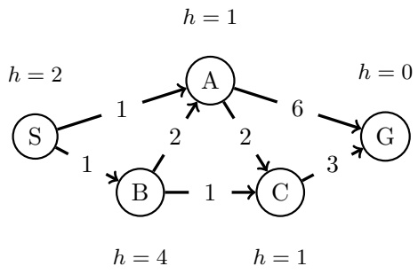

(c) [1 pt] Greedy Graph Search

What is the path returned by greedy graph search, using the given heuristic?

$$
\bigcirc \quad S \to A \to G
$$

$$
\bigcirc \quad S \to A \to C \to G
$$

$$
\bigcirc \quad S \to B \to A \to C \to G
$$

$$
\bigcirc \quad S \to B \to A \to G
$$

$$
\bigcirc \quad S \to B \to C \to G
$$

(d) A\* Graph Search

(i) [1 pt] List the nodes in the order they are expanded by $\mathrm { A } ^ { * }$ graph search:

Order:

(ii) [1 pt] What is the path returned by $\mathrm { A } ^ { * }$ graph search?

$$
\bigcirc \quad S \to A \to G
$$

$$
\bigcirc \quad S \to A \to C \to G
$$

$$
\bigcirc \quad S \to B \to A \to C \to G
$$

$$
\bigcirc \quad S \to B \to A \to G
$$

$$
\bigcirc \quad S \to B \to C \to G
$$

(e) Heuristic Properties

(i) [1 pt] Is this heuristic admissible? If so, mark Already admissible. If not, find a minimal set of nodes that would need to have their values changed to make the heuristic admissible, and mark them below.

Already admissible

# Change h(S)

 Change h(A)

 Change h(C)

 Change h(B)

 Change h(D)

 Change h(G)

(ii) [1 pt] Is this heuristic consistent? If so, mark Already consistent. If not, find the minimal set of nodes that would need to have their values changed to make the heuristic consistent, and mark them below.

Already consistent

# Change h(S)

 Change h(A)

 Change h(B)

 Change h(C)

 Change h(D)

 Change h(G)

<!-- page: 8 -->

## Q4. [8 pts] CSPs

Four people, A, B, C, and D, are all looking to rent space in an apartment building. There are three floors in the building, 1, 2, and 3 (where 1 is the lowest floor and 3 is the highest). Each person must be assigned to some floor, but it’s ok if more than one person is living on a floor. We have the following constraints on assignments:

• A and B must not live together on the same floor.

• If A and C live on the same floor, they must both be living on floor 2.

• If A and C live on different floors, one of them must be living on floor 3.

• D must not live on the same floor as anyone else.

• D must live on a higher floor than C.

We will formulate this as a CSP, where each person has a variable and the variable values are floors.

(a) [1 pt] Draw the edges for the constraint graph representing this problem. Use binary constraints only. You do not need to label the edges.


(b) [2 pts] Suppose we have assigned C = 2. Apply forward checking to the CSP, filling in the boxes next to the values for each variable that are eliminated:

$$
\left| \begin{array}{c c c c c} \square & 1 & \square & 2 & \square & 3 \\ \square & 1 & \square & 2 & \square & 3 \\ & & \square & 2 \\ \square & 1 & \square & 2 & \square & 3 \end{array} \right.
$$

(c) [3 pts] Starting from the original CSP with full domains (i.e. without assigning any variables or doing the forward checking in the previous part), enforce arc consistency for the entire CSP graph, filling in the boxes next to the values that are eliminated for each variable:

$$
\begin{array}{c c c c c c} \text {A} & \square & 1 & \square & 2 & \square & 3 \\ \text {B} & \square & 1 & \square & 2 & \square & 3 \\ \text {C} & \square & 1 & \square & 2 & \square & 3 \\ \text {D} & \square & 1 & \square & 2 & \square & 3 \end{array}
$$

(d) [2 pts] Suppose that we were running local search with the min-conflicts algorithm for this CSP, and currently have the following variable assignments.

Which variable would be reassigned, and which value would it be reassigned to? Assume that any ties are broken alphabetically for variables and in numerical order for values.

The variable A will be assigned the new value 1 B 2 C 3 D

<!-- page: 9 -->

SID:

## Q5. [9 pts] Game Trees

The following problems are to test your knowledge of Game Trees.

## (a) Minimax

The first part is based upon the following tree. Upward triangle nodes are maximizer nodes and downward are minimizers. (small squares on edges will be used to mark pruned nodes in part (ii))

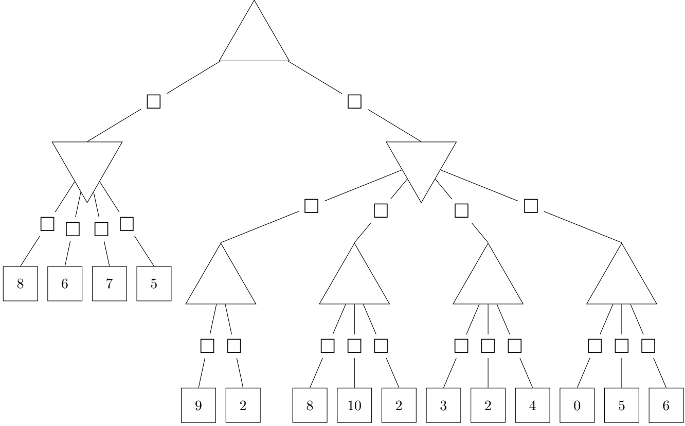

(i) [1 pt] Complete the game tree shown above by filling in values on the maximizer and minimizer nodes.

(ii) [3 pts] Indicate which nodes can be pruned by marking the edge above each node that can be pruned (you do not need to mark any edges below pruned nodes). In the case of ties, please prune any nodes that could not affect the root node’s value. Fill in the bubble below if no nodes can be pruned.

No nodes can be pruned

<!-- page: 10 -->

## (b) Food Dimensions

The following questions are completely unrelated to the above parts.

Pacman is playing a tricky game. There are 4 portals to food dimensions. But, these portals are guarded by a ghost. Furthermore, neither Pacman nor the ghost know for sure how many pellets are behind each portal, though they know what options and probabilities there are for all but the last portal.

Pacman moves first, either moving West or East. After which, the ghost can block 1 of the portals available.

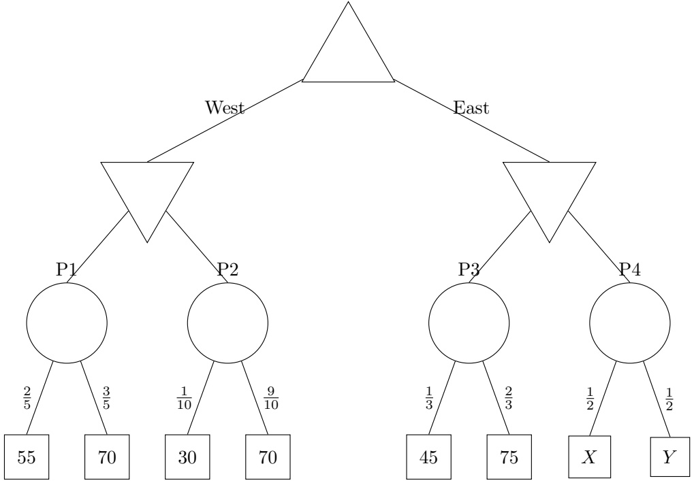

(i) [1 pt] Fill in values for the nodes that do not depend on X and Y .

(ii) [4 pts] What conditions must X and Y satisfy for Pacman to move East? What about to definitely reach the P4? Keep in mind that X and Y denote numbers of food pellets and must be whole numbers: $X , Y \in \{ 0 , 1 , 2 , 3 , \dots \}$

To move East:

To reach P4:

<!-- page: 11 -->

## Q6. [10 pts] Something Fishy

In this problem, we will consider the task of managing a fishery for an infinite number of days. (Fisheries farm fish, continually harvesting and selling them.) Imagine that our fishery has a very large, enclosed pool where we keep our fish.

Harvest (11pm): Before we go home each day at 11pm, we have the option to harvest some (possibly all) of the fish, thus removing those fish from the pool and earning us some profit, x dollars for x fish.

Birth/death (midnight): At midnight each day, some fish are born and some die, so the number of fish in the pool changes. An ecologist has analyzed the ecological dynamics of the fish population. They say that if at midnight there are x fish in the pool, then after midnight there will be exactly f(x) fish in the pool, where f is a function they have provided to us. (We will pretend it is possible to have fractional fish.)

To ensure you properly maximize your profit while managing the fishery, you choose to model it using a Markov decision problem.

For this problem we will define States and Actions as follows: State: the number of fish in the pool that day (before harvesting) Action: the number of fish you harvest that day

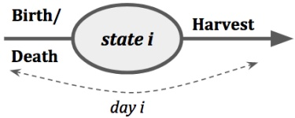

(a) [2 pts] How will you define the transition and reward functions?

$T ( s , a , s ^ { \prime } )$

$R(s,a)=$

(b) [4 pts] Suppose the discount rate is $\gamma = 0 . 9 9$ and f is as below. Graph the optimal policy $\pi ^ { * }$

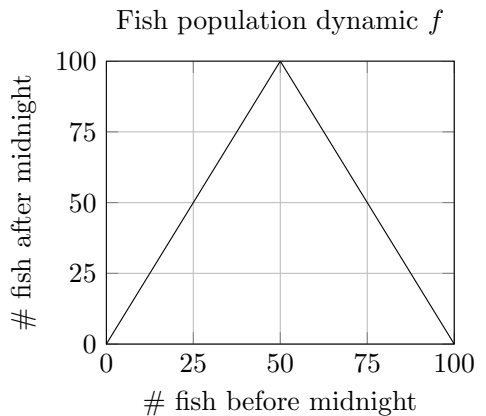

(YOUR ANSWER) Optimal policy $\pi ^ { * }$

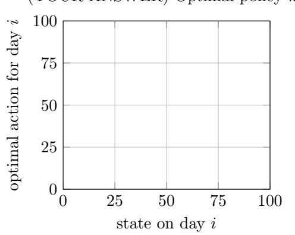

(c) [4 pts] Suppose the discount rate is $\gamma = 0 . 9 9$ and f is as below. Graph the optimal policy $\pi ^ { * }$

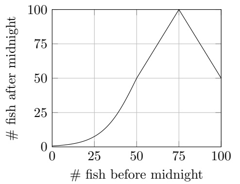

$$
\pi^*
$$

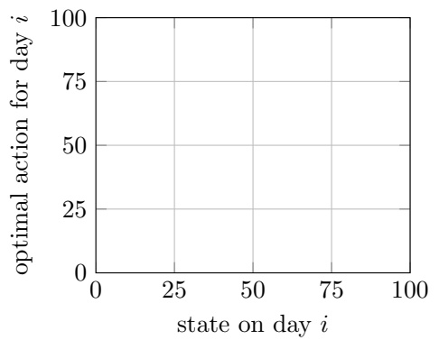

<!-- page: 12 -->

## Q7. [8 pts] Policy Evaluation

In this question, you will be working in an MDP with states S, actions A, discount factor $\gamma ,$ transition function $T ,$ and reward function R.

We have some fixed policy $\pi : S \to A$ , which returns an action $a = \pi ( s )$ for each state $s \in S$ . We want to learn the Q function $Q ^ { \pi } ( s , a )$ for this policy: the expected discounted reward from taking action a in state s and then continuing to act according to π: $\begin{array} { r } { Q ^ { \pi } ( s , a ) = \sum _ { s ^ { \prime } } T ( s , a , s ^ { \prime } ) [ R ( s , a , s ^ { \prime } ) + \gamma Q ^ { \pi } ( s ^ { \prime } , \pi ( s ^ { \prime } ) ] } \end{array}$ . The policy π will not change while running any of the algorithms below.

(a) [1 pt] Can we guarantee anything about how the values $Q ^ { \pi }$ compare to the values $Q ^ { * }$ for an optimal policy $\pi ^ { * } ?$

$Q ^ { \pi } ( s , a ) \leq Q ^ { * } ( s , a )$ for all s, a

$Q ^ { \pi } ( s , a ) = Q ^ { * } ( s , a )$ for all $s , a$

$Q ^ { \pi } ( s , a ) \geq Q ^ { * } ( s , a )$ for all $s , a$

\# None of the above are guaranteed

(b) Suppose T and R are unknown. You will develop sample-based methods to estimate $Q ^ { \pi }$ . You obtain a series of samples $( s _ { 1 } , a _ { 1 } , r _ { 1 } ) , ( s _ { 2 } , a _ { 2 } , r _ { 2 } ) , \ldots ( s _ { T } , a _ { T } , r _ { T } )$ from acting according to this policy (where $a _ { t } = \pi ( s _ { t } )$ , for all t).

(i) [4 pts] Recall the update equation for the Temporal Difference algorithm, performed on each sample in sequence:

$$
V (s _ {t}) \leftarrow (1 - \alpha) V (s _ {t}) + \alpha (r _ {t} + \gamma V (s _ {t + 1}))
$$

which approximates the expected discounted reward $V ^ { \pi } ( s )$ for following policy π from each state $s ,$ for a learning rate α.

Fill in the blank below to create a similar update equation which will approximate $Q ^ { \pi }$ using the samples. You can use any of the terms $Q , s _ { t } , s _ { t + 1 } , a _ { t } , a _ { t + 1 } , r _ { t } , r _ { t + 1 } , \gamma , \alpha , \pi$ in your equation, as well as $\sum$ and max with any index variables (i.e. you could write $\operatorname* { m a x } _ { a } , { \mathrm { ~ o r ~ } } \textstyle \sum _ { a }$ <sub>and</sub> then use a somewhere else), but no other terms.

$$
Q (s _ {t}, a _ {t}) \leftarrow (1 - \alpha) Q (s _ {t}, a _ {t}) + \alpha [ \underline {{\quad}} ]
$$

(ii) $[ 2 ~ \mathrm { p t s } ]$ Now, we will approximate $Q ^ { \pi }$ using a linear function: $Q ( s , a ) = \mathbf { w } ^ { \top } \mathbf { f } ( s , a )$ for a weight vector w and feature function $\mathbf { f } ( s , a )$

To decouple this part from the previous part, use $Q _ { s a m p }$ for the value in the blank in part (i) (i.e. $Q ( s _ { t } , a _ { t } ) \leftarrow ( 1 - \alpha ) Q ( s _ { t } , a _ { t } ) + \alpha Q _ { s a m p } )$

Which of the following is the correct sample-based update for w?

$$
\bigcirc \quad \mathbf {w} \leftarrow \mathbf {w} + \alpha [ Q (s _ {t}, a _ {t}) - Q _ {s a m p} ]
$$

$$
\bigcirc \quad \mathbf {w} \leftarrow \mathbf {w} - \alpha [ Q (s _ {t}, a _ {t}) - Q _ {s a m p} ]
$$

$$
\bigcirc \quad \mathbf {w} \leftarrow \mathbf {w} + \alpha [ Q (s _ {t}, a _ {t}) - Q _ {s a m p} ] \mathbf {f} (s _ {t}, a _ {t})
$$

$$
\bigcirc \quad \mathbf {w} \leftarrow \mathbf {w} - \alpha [ Q (s _ {t}, a _ {t}) - Q _ {s a m p} ] \mathbf {f} (s _ {t}, a _ {t})
$$

$$
\bigcirc \quad \mathbf {w} \leftarrow \mathbf {w} + \alpha [ Q (s _ {t}, a _ {t}) - Q _ {s a m p} ] \mathbf {w}
$$

$$
{\bigcirc} {\mathbf {w} \leftarrow \mathbf {w} - \alpha [ Q (s _ {t}, a _ {t}) - Q _ {s a m p} ] \mathbf {w}}
$$

(iii) [1 pt] The algorithms in the previous parts (part i and ii) are:

model-based model-free

<!-- page: 13 -->

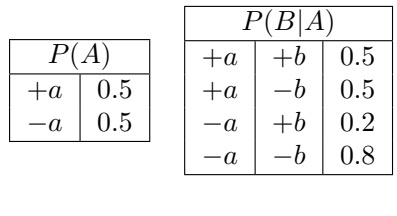

## Q8. [8 pts] Bayes Nets: Inference

Consider the following Bayes Net, where we have observed that $D = + d .$

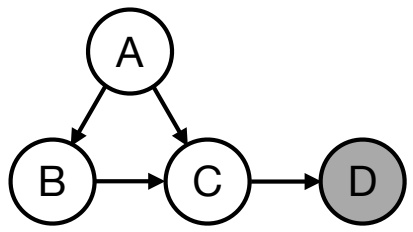

|  | P(C\| | A,B) |  |
| --- | --- | --- | --- |
| +a | +b | +c | 0.8 |
| +a | +b | -c | 0.2 |
| +a | -b | +c | 0.6 |
| +a | -b | -c | 0.4 |
| -a | +b | +c | 0.2 |
| -a | +b | -c | 0.8 |
| -a | -b | +c | 0.1 |
| -a | -b | -c | 0.9 |

| P | (D\|C | ) |
| --- | --- | --- |
| +c | +d | 0.4 |
| +c | -d | 0.6 |
| -c | +d | 0.2 |
| -c | -d | 0.8 |

(a) [1 pt] Below is a list of samples that were collected using prior sampling. Mark the samples that would be rejected by rejection sampling.

$$
\begin{array}{c c c c c} \square & + a & - b & + c & - d \\ \square & + a & - b & + c & + d \\ \square & - a & + b & - c & - d \\ \square & + a & + b & + c & + d \end{array}
$$

(b) [3 pts] To decouple from the previous part, you now receive a new set of samples shown below:

$$
\begin{array}{c c c c} + a & + b & + c & + d \\ - a & - b & - c & + d \\ + a & + b & + c & + d \\ + a & - b & - c & + d \\ - a & - b & - c & + d \end{array}
$$

For this part, express your answers as exact decimals or fractions simplified to lowest terms.

Estimate the probability $P ( + a | + d )$ if these new samples were collected using...

(i) [1 pt] ... rejection sampling:

(ii) [2 pts] ... likelihood weighting:

(c) [4 pts] Instead of sampling, we now wish to use variable elimination to calculate $P ( + a | + d )$ . We start with the factorized representation of the joint probability:

$$
P (A, B, C, + d) = P (A) P (B | A) P (C | A, B) P (+ d | C)
$$

(i) [1 pt] We begin by eliminating the variable B, which creates a new factor $f _ { 1 }$ . Complete the expression for the factor $f _ { 1 }$ in terms of other factors.

(ii) [1 pt] After eliminating B to create a factor $f _ { 1 } ,$ we next eliminate C to create a factor $f _ { 2 } .$ . What are the remaining factors after both B and $C$ are eliminated?

$$
\square \quad p (A)
$$

$$
\square \quad p (B | A)
$$

$$
\square \quad p (C | A, B)
$$

$$
\square \quad p (+ d | C)
$$

 f<sub>1</sub>

 f<sub>2</sub>

(iii) [2 pts] After eliminating both B and $C ,$ we are now ready to calculate $P ( + a | + d )$ . Write an expression for $P ( + a | + d )$ in terms of the remaining factors.

$P(+a|+d)=$

<!-- page: 14 -->

Q9. [9 pts] Decision Networks and VPI

(a) Consider the decision network structure given below:

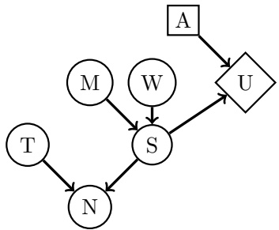

Mark all of the following statements that could possibly be true, for some probability distributions for $P ( M ) , P ( W ) , P ( T ) , P ( S | M , W )$ , and P(N|T, S) and some utility function U(S, A):

(i) [1.5 pts]  VPI(T) < 0  VPI(T) = 0

 VPI(T) > 0

 VPI(T) = VPI(N)

(ii) [1.5 pts]  VPI(T|N) < 0  VPI(T|N) = 0

 VPI(T|N) > 0

 VPI(T|N) = VPI(T|S)

(iii) [1.5 pts]

 VPI(M) > VPI(W)

 VPI(M) > VPI(S)

 VPI(M) < VPI(S)

 VPI(M|S) > VPI(S)

(b) Consider the decision network structure given below.

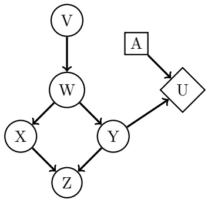

Mark all of the following statements that are guaranteed to be true, regardless of the probability distributions for any of the chance nodes and regardless of the utility function.

(i) [1.5 pts]

 VPI(Y ) = 0

 VPI(X) = 0

 VPI(Z) = VPI(W, Z)

 VPI(Y ) = VPI(Y, X)

(ii) [1.5 pts]

 VPI(X) ≤ VPI(W)

 VPI(V ) ≤ VPI(W)

 VPI(V | W) = VPI(V )

 VPI(W | V ) = VPI(W)

(iii) [1.5 pts]

 VPI(X | W) = 0

 VPI(Z | W) = 0

 VPI(X, W) = VPI(V, W)

 VPI(W, Y ) = VPI(W) + VPI(Y )

<!-- page: 15 -->

Q10. [15 pts] Neural Networks: Representation

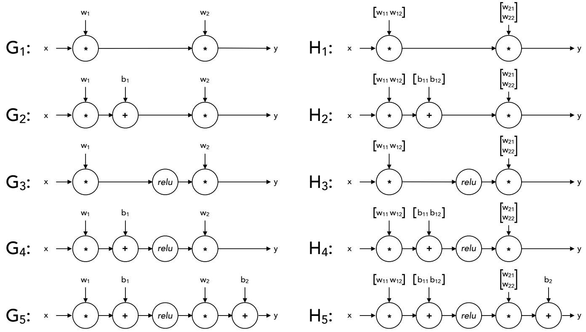

For each of the piecewise-linear functions below, mark all networks from the list above that can represent the function exactly on the range $x   \in   ( - \infty , \infty )$ . In the networks above, relu denotes the element-wise ReLU nonlinearity: $r e l u ( z )   =   m a x ( 0 , z )$ The networks $G _ { i }$ use 1-dimensional layers, while the networks $H _ { i }$ have some 2-dimensional intermediate layers.

(a) [5 pts]

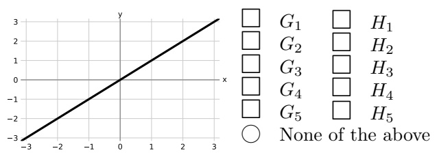

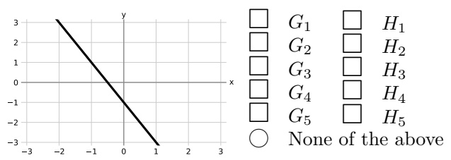

(b) [5 pts]

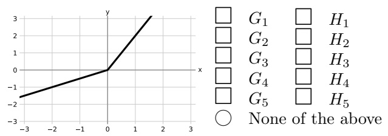

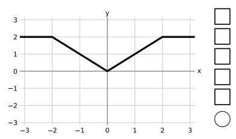

(c) [5 pts]

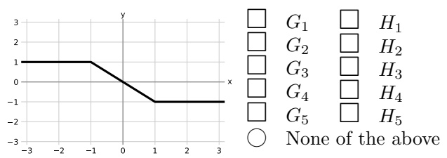

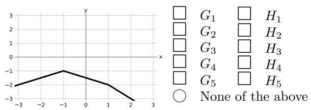

<!-- page: 16 -->

## Q11. [9 pts] Backpropagation

In this question we will perform the backward pass algorithm on the formula

$$
f = \frac {1}{2} \left\| \mathbf {A x} \right\| ^ {2}
$$

Here, $\mathbf { A } = \left[ \begin{matrix} { A _ { 1 1 } } & { A _ { 1 2 } } \\ { A _ { 2 1 } } & { A _ { 2 2 } } \\ \end{matrix} \right]$ $\mathbf { x } = \left[ \begin{matrix} { x _ { 1 } } \\ { x _ { 2 } } \end{matrix} \right]$ $\mathbf { b } = \mathbf { A } \mathbf { x } = \left[ \begin{matrix} { A _ { 1 1 } x _ { 1 } + A _ { 1 2 } x _ { 2 } } \\ { A _ { 2 1 } x _ { 1 } + A _ { 2 2 } x _ { 2 } } \\ \end{matrix} \right] = \left[ \begin{matrix} { b _ { 1 } } \\ { b _ { 2 } } \\ \end{matrix} \right]$ , and $\begin{array} { r } { f = \frac { 1 } { 2 } \left\| \mathbf { b } \right\| ^ { 2 } = \frac { 1 } { 2 } \left( b _ { 1 } ^ { 2 } + b _ { 2 } ^ { 2 } \right) } \end{array}$ is a scalar. A b f ∗ 12 → x

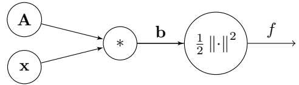

(a) [1 pt] Calculate the following partial derivatives of f.

(i) [1 pt] Find $\begin{array} { r } { \frac { \partial f } { \partial \mathbf { b } } = \left[ \begin{matrix} { \frac { \partial f } { \partial b _ { 1 } } } \\ { \frac { \partial f } { \partial b _ { 2 } } } \end{matrix} \right] . } \end{array}$ # $\begin{bmatrix} x_{1} \\ x_{2} \end{bmatrix}$ # $\begin{bmatrix} b_{1} \\ b_{2} \end{bmatrix}$ # $\begin{bmatrix} b_{2} \\ b_{1} \end{bmatrix}$ # $\begin{bmatrix} f(b_1) \\ f(b_2) \end{bmatrix}$ # $\begin{bmatrix} A_{11} \\ A_{22} \end{bmatrix}$ # $\begin{bmatrix} b_{1} + b_{2} \\ b_{1} - b_{2} \end{bmatrix}$

(b) [3 pts] Calculate the following partial derivatives of $b _ { 1 }$ (i) [1 pt] $\left( \begin{matrix} { \frac { \partial b _ { 1 } } { \partial A _ { 1 1 } } , \frac { \partial b _ { 1 } } { \partial A _ { 1 2 } } } \\ \end{matrix} \right)$ # $( A _ { 1 1 } , A _ { 1 2 } )$ # (0, 0) # $( x _ { 2 } , x _ { 1 } )$ # $( A _ { 1 1 } x _ { 1 } , A _ { 1 2 } x _ { 2 } )$ # $( x _ { 1 } , x _ { 2 } )$

(ii) [1 pt] $\left( \begin{matrix} { \frac { \partial b _ { 1 } } { \partial A _ { 2 1 } } , \frac { \partial b _ { 1 } } { \partial A _ { 2 2 } } } \\ \end{matrix} \right)$ # $( A _ { 2 1 } , A _ { 2 2 } )$ # $( x _ { 1 } , x _ { 2 } )$ # (1, 1) # (0, 0) # $( A _ { 2 1 } x _ { 1 } , A _ { 2 2 } x _ { 2 } )$

(iii) [1 $\mathrm { [ p t ] } \begin{pmatrix} \frac { \partial b _ { 1 } } { \partial x _ { 1 } } , \frac { \partial b _ { 1 } } { \partial x _ { 2 } } \end{pmatrix}$ # $( A _ { 1 1 } , A _ { 1 2 } )$ # $( A _ { 2 1 } , A _ { 2 2 } )$ # (0, 0) # $( b _ { 1 } , b _ { 2 } )$ # $( A _ { 2 1 } x _ { 1 } , A _ { 2 2 } x _ { 2 } )$

## (c) [3 pts] Calculate the following partial derivatives of f.

(i) [1 pt] $\left( \begin{matrix} { \frac { \partial f } { \partial A _ { 1 1 } } , \frac { \partial f } { \partial A _ { 1 2 } } } \\ \end{matrix} \right)$ # $\begin{array} { l } { ( A _ { 1 1 } , A _ { 1 2 } ) } \\ { ( x _ { 1 } b _ { 1 } , x _ { 2 } b _ { 1 } ) } \\ \end{array}$ # # $( A _ { 1 1 } b _ { 1 } , A _ { 1 2 } b _ { 2 } )$ # # $\begin{array} { l } { ( A _ { 1 1 } x _ { 1 } , A _ { 1 2 } x _ { 2 } ) } \\ { ( x _ { 1 } b _ { 1 } , x _ { 2 } b _ { 2 } ) } \\ \end{array}$ # $( x _ { 1 } b _ { 2 } , x _ { 2 } b _ { 2 } )$

(ii) [1 pt] $\left( \begin{matrix} { \frac { \partial f } { \partial A _ { 2 1 } } , \frac { \partial f } { \partial A _ { 2 2 } } } \\ \end{matrix} \right)$ # # $\begin{array} { l } { ( A _ { 2 1 } , A _ { 2 2 } ) } \\ { ( x _ { 1 } b _ { 1 } , x _ { 2 } b _ { 1 } ) } \\ \end{array}$ # # $( A _ { 2 1 } b _ { 1 } , A _ { 2 2 } b _ { 2 } )$ $( x _ { 1 } b _ { 2 } , x _ { 2 } b _ { 2 } )$ # # $( A _ { 2 1 } x _ { 1 } , A _ { 2 2 } x _ { 2 } )$ $( x _ { 1 } b _ { 1 } , x _ { 2 } b _ { 2 } )$

(iii) [1 pt] $\left( \frac { \partial f } { \partial x _ { 1 } } , \frac { \partial f } { \partial x _ { 2 } } \right)$ # # $( A _ { 1 1 } b _ { 1 } + A _ { 1 2 } b _ { 2 } , A _ { 2 1 } b _ { 1 } + A _ { 2 2 } b _ { 2 } )$ $( A _ { 1 1 } b _ { 1 } + A _ { 1 2 } b _ { 1 } , A _ { 2 1 } b _ { 2 } + A _ { 2 2 } b _ { 2 } )$ # # $( A _ { 1 1 } b _ { 1 } + A _ { 2 1 } b _ { 2 } , A _ { 1 2 } b _ { 1 } + A _ { 2 2 } b _ { 2 } )$ $( A _ { 1 1 } b _ { 1 } + A _ { 2 1 } b _ { 1 } , A _ { 1 2 } b _ { 2 } + A _ { 2 2 } b _ { 2 } )$

(d) [2 pts] Now we consider the general case where A is an $n \times d$ matrix, and x is a $d \times 1$ vector. As before, $\begin{array} { r } { \dot { f } = \frac { 1 } { 2 } \| \mathbf { A } \mathbf { x } \| ^ { 2 } } \end{array}$

(i) [1 pt] Find $\frac { \partial f } { \partial \mathbf { A } }$ in terms of A and x only. # $\mathbf { x } ^ { \top } \mathbf { A } ^ { \top } \mathbf { A } \mathbf { x }$ # $\mathbf { A x x } ^ { \top }$ # $\mathbf { A } \left( \mathbf { A } ^ { \top } \mathbf { A } \right) ^ { - 1 }$ # $\mathbf { A } \mathbf { A } ^ { \top } \mathbf { A } \mathbf { x }$ # A

(ii) [1 $\mathrm { p t ] }$ Find $\frac { \partial f } { \partial \mathbf { x } }$ in terms of A and x only. # x # $\left( \mathbf { A } ^ { \top } \mathbf { A } \right) ^ { - 1 } \mathbf { x }$ # $\mathbf { x } \mathbf { x } ^ { \top } \mathbf { x }$ # $\mathbf { x } ^ { \top } \mathbf { A } ^ { \top } \mathbf { A } \mathbf { x }$ # $\mathbf { A } ^ { \top } \mathbf { A } \mathbf { x }$

<!-- page: 17 -->

SID:

THIS PAGE IS INTENTIONALLY LEFT BLANK
