<!-- page: 1 -->

• You have approximately 165 minutes (2 hours 45 minutes).

• The exam is closed book, closed calculator, and closed notes except your one-page crib sheet.

• Mark your answers ON THE EXAM ITSELF. If you are not sure of your answer you may wish to provide a brief explanation. All short answer sections can be successfully answered in a few sentences AT MOST.

• For multiple choice questions with circular bubbles, you should only mark ONE option; for those with checkboxes, you should mark ALL that apply (which can range from zero to all options)

| First name |  |
| --- | --- |
| Last name |  |
| edX username |  |

For staff use only:

| Q1. Approximate Q-Learning | /11 |
| --- | --- |
| Q2. Who Spoke When | /12 |
| Q3. Graph Search | /10 |
| Q4. Bayes Net Inference | /10 |
| Q5. Naive Bayes | /18 |
| Q6. MDP: Left or Right | /16 |
| Q7. Take Actions | /22 |
| Q8. Tracking a cyclist | /18 |
| Q9. Deep Learning | /23 |
| Total | /140 |

<!-- page: 2 -->

## Q1. [11 pts] Approximate Q-Learning

Consider the following MDP: We have infinitely many states $s \in \mathbb { Z }$ and actions $a \in \mathbb { Z } ,$ each represented as an integer. Taking action a from state s deterministically leads to new state $s ^ { \prime } = s + a$ and reward $r = s - a$ . For example, taking action 3 at state 1 results in new state $s ^ { \prime } = 1 + 3 = 4$ and reward $r = 1 - 3 = - 2$

We perform approximate Q-Learning, with features and initialized weights defined below.

| Feature | Initial Weight |
| --- | --- |
| f1(s,a) = s | w1 = 1 |
| f2(s,a) = -a2 | w2 = 2 |

(a) [3 pts] Write down $Q ( s , a )$ in terms of $w _ { 1 } , \: w _ { 2 } , \: s ,$ and a.

(b) $[ 2 ~ \mathrm { p t s } ]$ Calculate $Q ( 1 , 1 )$

(c) [4 pts] We observe a sample $( s , a , r , s ^ { \prime } )$ of $( 1 , 1 , 0 , 2 )$ Assuming a learning rate of $\alpha = 0 . 5$ and discount factor of $\gamma = 0 . 5 ,$ compute new weights after a single update of approximate Q-Learning.

w1:

w2:

(d) [2 pts] Compute the new value for $\mathrm { Q ( 1 , } 1 \mathrm { ) }$

<!-- page: 3 -->

## Q2. [12 pts] Who Spoke When

We are given a single audio recording (divided into equal and short time slots) and wish to infer when each person speaks. At every time step exactly one of N people is talking. This problem can be modeled using an HMM. Hidden variable $X _ { t } \in \{ 1 , 2 , . . . , N \}$ represents which person is talking at time step t.

(a) For this part, assume that at each time step:

• with probability $p ,$ the current speaker will continue to talk in the next time step.

• with probability $1 - p ,$ the current speaker will be interrupted by another person. Each other person is equally likely to be the interrupter.

Assume that $N = 3 .$

(i) [2 pts] Complete the Markov Chain below and write down the probabilities on each transition.

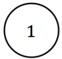

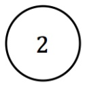

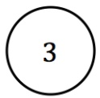

(ii) [2 pts] What is the stationary probability distribution of this Markov chain? (Again, assume $N = 3 )$

$P ( X _ { \mathrm { i n f } } = 1 )$

$P ( X _ { \mathrm { i n f } } = 2 )$

$P ( X _ { \mathrm { i n f } } = 3 )$

(b) [2 pts] What is the number of parameters (or degrees of freedom) needed to model the transition probability $P ( X _ { t } | X _ { t - 1 } ) ?$ Assume N people in the meeting and arbitrary transition probabilities.

<small>t , N</small>

<small>bility P X X ? ( t| t−1)</small>

<small>(c) [2 pts] Let’s remove the assumption that people are not allowed to talk simultaneously. Now, hidden state X ∈ {0 1} will be a binary vector of length N. Each element of the vector corresponds to a person, and whether they are speaking.</small>

<small>Now, what is the number of parameters (or degrees of freedom) needed for modeling the transition proba-</small>

<!-- page: 4 -->

One way to decrease the parameter count is to assume independence. Assume that the transition probability between people is independent. The figure below represents this assumption for $N = 3 ,$ where $X _ { t } = [ X _ { t } ( 1 ) , X _ { t } ( 2 ) , X _ { t } ( 3 ) ]$

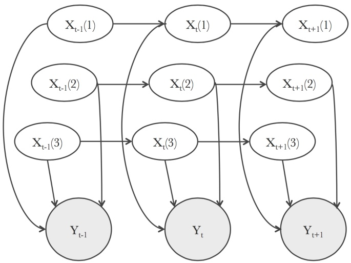

(d) [4 pts] Write the following in terms of conditional probabilities given from the Bayes Net. Assume N people in the meeting.

Transition Probability $P ( X _ { t } | X _ { t - 1 } )$

Emission Probability $P ( Y _ { t } | X _ { t } )$

<small>P Xt Xt−1 ?</small>

<small>(e) [2 pts] What is the number of parameters (or degrees of freedom) needed for modeling transition probability ( | ) Assume N people in the meeting.</small>

<!-- page: 5 -->

## Q3. [10 pts] Graph Search

You are trying to plan a road trip from city A to city B. You are given an undirected graph of roads of the entire country, together with the distance along each road between any city X and any city Y : length(X, Y ) (For the rest of this question, ”shortest path” is always in terms of length, not number of edges). You would like to run a search algorithm to find the shortest way to get from A to B (assume no ties).

Suppose C is the capital, and thus you know the shortest paths from city C to every other city, and you would like to be able to use this information.

Let $p a t h _ { o p t } ( X \to Y )$ denote the shortest path from X to Y and let cost(X, Y ) denote the cost of the shortest path between cities X and Y . Let $[ p a t h ( X \to Y ) , p a t h ( Y \to Z ) ]$ denote the concatenation.

(a) [5 pts] Suppose the distance along any edge is 1. You decide to initialize the queue with A, plus a list of all cities X, with $p a t h ( A \: \to \: X ) \: = \: [ p a t h _ { o p t } ( A \: \to \: C ) , p a t h _ { o p t } ( C \: \to \: X ) ]$ You run BFS with this initial queue (sorted in order of path length). Which of the following is correct? (Select all that apply)

 You always expand the exact same nodes as you would have if you ran standard BFS.

 You might expand a different set of nodes, but still find the shortest path.

 You might expand a different set of nodes, and find the sub-optimal path.

(b) [5 pts] You decide to initialize priority queue with A, plus a list of all cities X, with $p a t h ( A \; \rightarrow \; X ) \; =$ $[ \dot { p a t h _ { o p t } } ( A \: \to \: C ) , p a t h _ { o p t } ( C \: \to \: X ) ]$ ], and $c o s t ( A , X ) \: = \: c o s t ( A , C ) \: + \: c o s t ( C , X )$ You run UCS with this initial priority queue. Which of the following is correct? (Select all that apply)

 You always expand the exact same nodes as you would have if you ran standard UCS.

 You might expand a different set of nodes, but still find the shortest path.

 You might expand a different set of nodes, and find the sub-optimal path.

<!-- page: 6 -->

## Q4. [10 pts] Bayes Net Inference

A plate representation is useful for capturing replication in Bayes Nets. For example, Figure 1(a) is an equivalent representation of Figure 1(b). The N in the lower right corner of the plate stands for the number of replica.

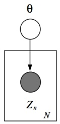

(a)

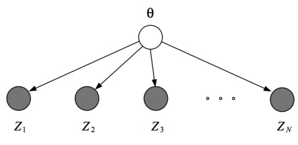

Figure 1

Now consider the Bayes Net in Figure 2. We use $X _ { 1 : N }$ as shorthand for $( X _ { 1 } , \cdots , X _ { N } )$ . We would like to compute the query $P ( X _ { 1 : N } | Y _ { 1 : N } = y _ { 1 : N } )$ . Assume all variables are binary.

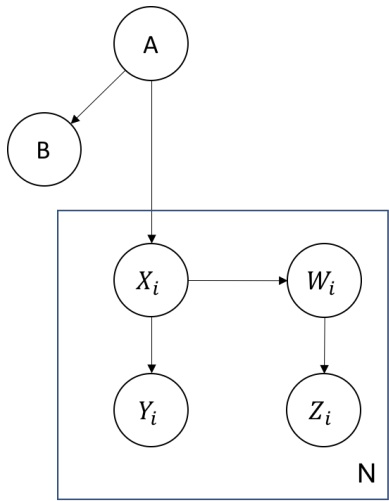

Figure 2

(a) [2 pts] What is the number of rows in the largest factor generated by inference by enumeration, for this query? # 22N # 23N # 22N+2 # 23N+2

(b) [4 pts] Mark all of the following variable elimination orderings that are optimal for calculating the answer for the query $P ( X _ { 1 : N } | Y _ { 1 : N } = y _ { 1 : N } )$ . (A variable elimination ordering is optimal if the largest factors generated is smallest among all possible elimination orderings).

 $Z _ { 1 } , \cdots , Z _ { N } , W _ { 1 } , \cdots , W _ { N } , B , A$

 $W _ { 1 } , \cdots , W _ { N } , Z _ { 1 } , \cdots , Z _ { N } , B , A$

 $A , B , W _ { 1 } , \cdots , W _ { N } , Z _ { 1 } , \cdots , Z _ { N }$

 $A , B , Z _ { 1 } , \cdots , Z _ { N } , W _ { 1 } , \cdots , W _ { N }$

(c) [4 pts] Which of the following variables can be deleted before running variable elimination, without affecting the inference result? Deleting a variable means not putting its CPT in our initial set of factors when starting the algorithm.

 W1  Z1  A  B  None

<!-- page: 7 -->

## Q5. [18 pts] Naive Bayes

(a) We use a Naive Bayes classifier to differentiate between Pacmen and Ghosts, trained on the following:

| F1 | F2 | Y |
| --- | --- | --- |
| 0 | 1 | Ghost |
| 1 | 0 | Ghost |
| 0 | 0 | Pac |
| 1 | 1 | Pac |

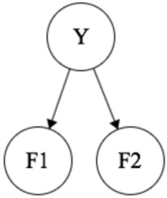

Assume that the distributions generated from these samples perfectly estimate the CPTs. Given features $f _ { 1 } , f _ { 2 }$ we predict $\hat { Y } \in \{ G h o s t , P a c m a n \}$ using the Naive Bayes decision rule. If $P ( Y = G h o s t | F _ { 1 } = f _ { 1 } , F _ { 2 } = f _ { 2 } ) = 0 . 5$ assign Ŷ based on flipping a fair coin.

(i) [3 pts] Compute the table $P ( { \hat { Y } } | Y )$

Value $P ( \hat { Y } = G h o s t | Y = G h o s t )$ is the probability of correctly classifying a Ghost,

while $P ( \hat { Y } = P a c m a n | Y = G h o s t )$ is the probability of confusing a Ghost for a P acman.

| P(Yˆ\|Y) | Yˆ = Ghost | Yˆ = Pacman |
| --- | --- | --- |
| Y = Ghost |  |  |
| Y = Pacman |  |  |

For each modification below, recompute table $P ( { \hat { Y } } | Y )$ The modifications for each part are separate, and do not accumulate.

(ii) [3 pts] Add extra feature $F _ { 3 } = F _ { 1 } + F _ { 2 }$ , and modify the Naive Bayes classifier appropriately.

| P(Yˆ\|Y) | Yˆ = Ghost | Yˆ = Pacman |
| --- | --- | --- |
| Y = Ghost |  |  |
| Y = Pacman |  |  |

(iii) [3 pts] Add extra feature $F _ { 3 } = F _ { 1 } \times F _ { 2 }$ , and modify the Naive Bayes classifier appropriately.

| P(Yˆ\|Y) | Yˆ = Ghost | Yˆ = Pacman |
| --- | --- | --- |
| Y = Ghost |  |  |
| Y = Pacman |  |  |

<!-- page: 8 -->

(iv) [3 pts] Add extra feature $F _ { 3 } = F _ { 1 } - F _ { 2 }$ , and modify the Naive Bayes classifier appropriately.

| P(Yˆ\|Y) | Yˆ = Ghost | Yˆ = Pacman |
| --- | --- | --- |
| Y = Ghost |  |  |
| Y = Pacman |  |  |

(v) [3 pts] Perform Laplace Smoothing with $k = 1$

| P(Yˆ\|Y) | Yˆ = Ghost | Yˆ = Pacman |
| --- | --- | --- |
| Y = Ghost |  |  |
| Y = Pacman |  |  |

(b) [3 pts] Now, we reformulate the Naive Bayes classifier so that it can choose more than one class. For example, if we are choosing which genre a book is, we want the ability to say that a romantic comedy is both a romance and a comedy.

To do this, we have multiple label nodes $Y = \{ Y _ { 1 } . . . Y _ { n } \}$ which all point to all features $F = \{ F _ { 1 } . . . F _ { m } \}$

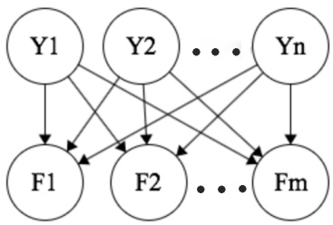

Select all of the following expressions which are valid Naive Bayes classification rules, i.e., equivalent to arg max $_ { Y _ { 1 } . . . Y _ { n } } P ( Y _ { 1 } , Y _ { 2 } , . . . , Y _ { n } | F _ { 1 } , F _ { 2 } , . . . , F _ { m } )$ :

 $\operatorname { a r g } \operatorname* { m a x } _ { Y _ { 1 } \ldots Y _ { n } } \prod _ { i } ^ { n } \left[ P ( Y _ { i } ) \prod _ { j } ^ { m } P ( F _ { j } | Y _ { i } ) \right]$

$$
\square \arg \max _ {Y _ {1} \dots Y _ {n}} \prod_ {i} ^ {n} \left[ P (Y _ {i}) \prod_ {j} ^ {m} P (F _ {j} | Y _ {1} \dots Y _ {n}) \right]
$$

 $\operatorname { a r g } \operatorname* { m a x } _ { Y _ { 1 } . . . Y _ { n } } \prod _ { i } ^ { n } \left[ P ( Y _ { i } ) \right] \prod _ { j } ^ { m } \left[ P ( F _ { j } | Y _ { 1 } . . . Y _ { n } ) \right]$

 $\prod _ { i } ^ { n } \left[ \operatorname { a r g } \operatorname* { m a x } _ { Y _ { i } } \left\{ P ( Y _ { i } ) \prod _ { j } ^ { m } P ( F _ { j } | Y _ { i } ) \right\} \right]$

 $\prod _ { i } ^ { n } \left[ \operatorname { a r g } \operatorname* { m a x } _ { Y _ { i } } \left\{ P ( Y _ { i } ) \prod _ { j } ^ { m } P ( F _ { j } | Y _ { 1 } . . . Y _ { n } ) \right\} \right]$

<!-- page: 9 -->

# Q6. [16 pts] MDP: Left or Right

Consider the following MDP:

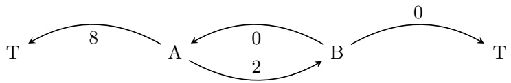

The state space $\mathcal { S }$ and action space A are

$$
\mathcal {S} = \{A, B, T \}
$$

$$
\mathcal {A} = \{\text {left, right} \}
$$

where T denotes the terminal state (both T states are the same). When in a terminal state, the agent has no more action and gets no more reward. In non-terminal states, the agent can only go left or right, but their action only succeeds (goes in the intended direction) with probability p. If their action fails, then they go the opposite direction. The numbers on the arrows denote the reward associated with going from one state to another.

For example, at state A taking action left:

• with probability $p ,$ the next state will be T and the agent will get a reward of 8. The episode is then terminated.

• with probability $1 - p ,$ the next state will be B and the reward will be 2.

For this problem, the discount factor $\gamma$ is 1. Let $\pi _ { p } ^ { * }$ be the optimal policy, which may or may not depend on the value of $p .$ Let $Q ^ { \pi _ { p } ^ { * } }$ and $V ^ { \pi _ { p } ^ { * } }$ be the corresponding $Q$ and V functions of $\pi _ { p } ^ { * }$

(a) [1 pt] If $p = 1$ , what is $\pi _ { p } ^ { * } { } ^ { ? }$ (Select one)

$$
\bigcirc \pi_ {p} ^ {*} (A) = \texttt {l e f t}, \pi_ {p} ^ {*} (B) = \texttt {l e f t}
$$

$$
\bigcirc \quad \pi_ {p} ^ {*} (A) = \text {left} \quad , \quad \pi_ {p} ^ {*} (B) = \text {right}
$$

$$
\bigcirc \quad \pi_ {p} ^ {*} (A) = \text {right} \quad , \quad \pi_ {p} ^ {*} (B) = \text {left}
$$

$$
\bigcirc \quad \pi_ {p} ^ {*} (A) = \text {right} \quad , \quad \pi_ {p} ^ {*} (B) = \text {right}
$$

(b) [1 pt] If $p = 0 ,$ , what is $\pi _ { p } ^ { * } ( A ) ?$ (Select one)

$$
\bigcirc \quad \pi_ {p} ^ {*} (A) = \text {left} \quad , \quad \pi_ {p} ^ {*} (B) = \text {left}
$$

$$
\bigcirc \quad \pi_ {p} ^ {*} (A) = \text {left}, \quad \pi_ {p} ^ {*} (B) = \text {right}
$$

$$
\bigcirc \pi_ {p} ^ {*} (A) = \mathbf {r i g h t}, \pi_ {p} ^ {*} (B) = \mathbf {l e f t}
$$

$$
\bigcirc \quad \pi_ {p} ^ {*} (A) = \text {right} \quad , \quad \pi_ {p} ^ {*} (B) = \text {right}
$$

<!-- page: 10 -->

(c) [5 pts] Suppose $\pi _ { p } ^ { * } ( A ) = \mathtt { l e f t }$ . Which of the following statements must be true? (Select all that apply)

Hint: Don’t forget that if $x = y ,$ then $x \geq y$ and $x \leq y$

 $Q ^ { \pi _ { p } ^ { * } } ( A , \mathtt { l e f t } ) \leq Q ^ { \pi _ { p } ^ { * } } ( A , \mathtt { r i g h t } )$

 $Q ^ { \pi _ { p } ^ { * } } ( A , \mathtt { l e f t } ) \geq Q ^ { \pi _ { p } ^ { * } } ( A , \mathtt { r i g h t } )$

 $Q ^ { \pi _ { p } ^ { * } } ( A , \mathtt { l e f t } ) = Q ^ { \pi _ { p } ^ { * } } ( A , \mathtt { r i g h t } )$

$V ^ { \pi _ { p } ^ { * } } ( A ) \leq V ^ { \pi _ { p } ^ { * } } ( B )$

 $V ^ { \pi _ { p } ^ { * } } ( A ) \geq V ^ { \pi _ { p } ^ { * } } ( B )$

$V ^ { \pi _ { p } ^ { * } } ( A ) = V ^ { \pi _ { p } ^ { * } } ( B )$

$V ^ { \pi _ { p } ^ { * } } ( A ) \leq Q ^ { \pi _ { p } ^ { * } } ( A , \mathtt { l e f t } )$

 $V ^ { \pi _ { p } ^ { * } } ( A ) \geq Q ^ { \pi _ { p } ^ { * } } ( A , \mathtt { l e f t } )$

 $V ^ { \pi _ { p } ^ { * } } ( A ) = Q ^ { \pi _ { p } ^ { * } } ( A , \mathtt { l e f t } )$

$$
V ^ {\pi_ {p} ^ {*}} (A) \leq Q ^ {\pi_ {p} ^ {*}} (A, \text {right})
$$

$V ^ { \pi _ { p } ^ { * } } ( A ) \geq Q ^ { \pi _ { p } ^ { * } } ( A , \mathtt { r i g h t } )$

 $V ^ { \pi _ { p } ^ { * } } ( A ) = Q ^ { \pi _ { p } ^ { * } } ( A , { \tt r i g h t } )$

(d) Assume $p \geq 0 . 5$ below.

(i) [3 pts] $V ^ { * } ( B ) = \alpha V ^ { * } ( A ) + \beta .$ Find α and $\beta$ in terms of $p .$

• α =

$\beta = ,$

(ii) [3 pts] $Q ^ { \pi _ { p } ^ { * } } ( A , \mathtt { l e f t } ) = \alpha V ^ { * } ( B ) + \beta$ . Find α and $\beta$ in terms of $p .$

• α =

$\beta = ,$

(iii) [3 pts] $Q ^ { \pi _ { p } ^ { * } } ( A , \mathtt { r i g h t } ) = \alpha V ^ { * } ( B ) + \beta .$ . Find α and $\beta$ in terms of $p .$

• α =

$\beta =$

<!-- page: 11 -->

## Q7. [22 pts] Take Actions

An agent is acting in the following gridworld MDP, with the following characteristics.

• Discount factor $\gamma < 1$

• Agent gets reward $R > 0$ for entering the terminal state T, and 0 reward for all other transitions.

• When in terminal state T, the agent has no more action and gets no more reward.

• In non-terminal states {A, B, C}, the agent can take an action $\{ U p , D o w n , L e f t , R i g h t \}$

• Assume perfect transition dynamics. For example, taking action Right at state A will always result in state C in the next time step.

• If the agent hits an edge, it stays in the same state in the next time step. For example, after taking action Right at C, the agent remains in state C.

| B | T |
| --- | --- |
| A | C |

(a) (i) [3 pts] What are all the optimal deterministic policies? Each cell should contain a single action $\{ U p , D o w n , L e f t , R i g h t \}$ . Each row corresponds to a different optimal policy. You may not need all rows.

| State | A | B | C |
| --- | --- | --- | --- |
| Optimal policy 1 |  |  |  |
| Optimal policy 2 (if needed) |  |  |  |
| Optimal policy 3 (if needed) |  |  |  |

(ii) [2 pts] Suppose the agent uniformly randomly chooses between the optimal policies in (i). In other words, at each state, the agent picks randomly between the actions in the corresponding column with equal probability. The agent’s location at each time step is then a Markov process where state $X _ { t } \in \{ A , B , C , T \}$ Fill in the following transition probabilities for the Markov process.

$P(X_{t+1}=B|X_t=A)=$

$P ( X _ { t + 1 } = A | X _ { t } = B )$

$P ( X _ { t + 1 } = T | X _ { t } = C ) =$

<!-- page: 12 -->

(b) Suppose the agent is acting in the same gridworld as above, but does not get to observe their exact state $X _ { t } .$ Instead, the agent only observes $O _ { t } \in \{ b l a c k , g r e e n , p i n k \}$ . The observation probability as a function of the state $P ( O _ { t } | X _ { t } )$ is specified in the table below. This becomes a partially-observable Markov decision process (POMDP). The agent is equally likely to start in non-terminal states $\{ A , B , C \}$

| B0.5, black0.5, green | T |
| --- | --- |
| A0.5, black0.5, pink | C0.5, pink0.5, green |

(i) [3 pts] If the agent can only act based on its current observation, what are all deterministic optimal policies? You may not need all rows.

|  | Black | Green | Pink |
| --- | --- | --- | --- |
| Optimal policy 1 |  |  |  |
| Optimal policy 2 (if needed) |  |  |  |
| Optimal policy 3 (if needed) |  |  |  |

(ii) [3 pts] Suppose that the agent follows the policy π(Black) = Right, π(Green) = Right, and $\pi ( { \mathrm { P i n k } } ) = U p .$ Let V (S) be the agent’s expected reward from state S. Your answer should be in terms of γ and R. Note that V (S) is the expected value before we know the observation, so you must consider all possible observations at state S.

• V(A) =

• V(B) =

• V(C) =

Now suppose that the agent’s policy can also depend on all past observations and actions. Assume that when the agent is starting (and has no past observations), it behaves the same as the policy in the previous part: $\pi ( [ \mathrm { B l a c k } ] )   =   \mathrm { R i g h t } , \; \stackrel { \cdot } { \pi ( [ \mathrm { G r e e n } ] ) }   =   \mathrm { R i g h t } , \; \pi ( [ \mathrm { P i n k } ] ) \stackrel { \cdot } { = }   \mathrm { U p }$ . In all cases where the agent has more than one observation (for example, observed Pink in the previous time step and now observes Green), π acts optimally.

(iii) [3 pts] For each of the following sequences of two observations, write the optimal action that the policy π would take.

| Black Pink | Black Green | Green Pink | Green Green | Pink Black | Pink Green |
| --- | --- | --- | --- | --- | --- |
|  |  |  |  |  |  |

<!-- page: 13 -->

<small>1000( 0.9n−0.1n) 1000(0.9n−0.1n) 0.9n+ 0.1n</small>

(iv) [3 pts] In this part only, let V (S) refer to the expected sum of discounted rewards following π if we start from state S (and thus have no previous observations yet). As in the previous part, this is the expected value before knowing the observation, so you must consider all possible observations at S. Hint: since π now depends on sequences of observations, the way we act at states after the first state may be different, and this affects the value at the first state.

• V(A) =

• V(B) =

• V(C) =

(c) Boba POMDP May is a venture capitalist who knows that Berkeley students love boba. She is picking between investing in Sharetea or Asha. If she invests in the better one, she will make a profit of \$1000. If she invests in the worse one, she will make no money.

At the start, she believes both Asha and Sharetea have an equal chance of being better. However, she can pay to have students taste test. At each time step, she can either choose to invest or to pay for a student taste test. Each student has a p = 0.9 probability of picking the correct place (independent of other students).

(i) [1 pt] What is the expected profit if May invests optimally after one (free) student test?

(ii) [1 pt] If she had to invest after one student test, what is the highest May should pay for the test?

<small>(iii) [1 pt] Suppose after n student tests, it turns out that all students have chosen the same store. What is her expected profit after after observing these n student tests?</small>

<small>\# 1000(0.9n)</small>

<small>1000( 1000( 0.9n+0.1n 0.9n +0.1n 0.9n 0.9n</small>

<small>\# 1000(0.9n − 0.1ⁿ) 1000(0.9 − 0.1 )</small>

<small>0 9n−0 1n) 1000( . . 0.9n</small>

<small>1000(1 − 0.1n)</small>

<small>(iv) [2 pts] How many tests should May pay for if each one costs \$100? Hint: Think about the maximum possible value of information. How does this compare to the expected value of information?</small>

<!-- page: 14 -->

| PB(D\|C) | d = 1 | d = 0 |
| --- | --- | --- |
| Back detector c = 1 | 0.6 | 0.4 |
| c = 0 | 0.4 | 0.6 |

## Q8. [18 pts] Tracking a cyclist

We are trying to track cyclists as they move around a self-driving car. The car is equipped with 4 “presence detectors” corresponding to:

• Front of the car (F),

• Back of the car (B),

• Left side of the car (L),

• Right side of the car (R).

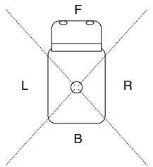

Figure 3: Autonomous vehicle and detection zones

Unfortunately, the detectors are not perfect and feature the following conditional probabilities for detection $D \in \{ 0 , 1 \}$ (“no detection” or “detection”, respectively) given cyclist presence $C \in \{ 0 , 1 \}$ (“no cyclist” or “cyclist”, respectively).

Front detector

| PF(D\|C) | d = 1 | d = 0 |
| --- | --- | --- |
| c = 1 | 0.8 | 0.2 |
| c = 0 | 0.1 | 0.9 |

Left & Right detectors

| PL(D\|C) = PR(D\|C) | d = 1 | d = 0 |
| --- | --- | --- |
| c = 1 | 0.7 | 0.3 |
| c = 0 | 0.2 | 0.8 |

(a) Detection and dynamics

(i) [2 pts] If you could freely choose any detector to equip all four detection zones, which one would be best?

\# The front detector. # The detector at the back. # The left/right detector.

Dynamics: We have measured the following transition probabilities for cyclists moving around the car when driving. Assume any dynamics are Markovian. Variable $X _ { t } \in \{ f , l , r , b \}$ denotes the location of the cyclist at time t, and can be in front, left, right, or back of the car.

| P(Xt+1\|Xt) | Xt+1 = f | Xt+1 = l | Xt+1 = r | Xt+1 = b |
| --- | --- | --- | --- | --- |
| Xt = f | pff | pfl | pfr | pfb |
| Xt = l | plf | pll | plr | plb |
| Xt = r | prf | prl | prr | prb |
| Xt = b | pbf | pbl | pbr | pbb |

(ii) [3 pts] Which criterion does this table have to satisfy for it to be a well defined CPT? (Select all that apply).

 Each row should sum to 1.  Each column should sum to 1.  The table should sum to 1.

<!-- page: 15 -->

(b) Let’s assume that we have been given a sequence of observations $d _ { 1 } , d _ { 2 } , \ldots , d _ { t }$ and computed the posterior probability $P ( X _ { t } | d _ { 1 } , d _ { 2 } , \ldots , d _ { t } )$ , which we represent as a four-dimensional vector.

(i) [3 pts] What is vector $P ( X _ { t + 1 } | d _ { 1 } , d _ { 2 } , \ldots , d _ { t } )$ as a function of $P ( X _ { t + 1 } | X _ { t } )$ (a 4 × 4 matrix written above) and $P ( X _ { t } | d _ { 1 } , d _ { 2 } , \ldots , d _ { t } ) ?$

(ii) [2 pts] What is the computational complexity of computing $P ( X _ { t } | D _ { 1 } { = } d _ { 1 } , D _ { 2 } { = } d _ { 2 } , \ldots , D _ { t } { = } d _ { t } )$ as a function of t and the number of states S (using big O notation)?

Detailed solution: At each time step of the forward algorithm, we need to multiply a vector of size S by a matrix of size $S ^ { 2 }$ to account for the dynamics entailed in $P ( X _ { t + 1 } | X _ { t } )$ Then, we need to compute the emission probability of each state which here costs $2 \times S$ and normalize (complexity is S). Therefore, the cost of propagating beliefs forward in time through the dynamics dominates as a function of S and is $O ( S ^ { 2 } )$ for each time step. Hence the final answer.

(c) (i) [4 pts] We now add a radar to the system (random variable $E \in \{ f , l , r , b \} )$ . Assuming the detection by this device is independent from what happens with the pre-existing detectors, which of the probabilistic models could you use? If several variables are in the same node, the node represents a tuple of random variables, which itself is a random variable.

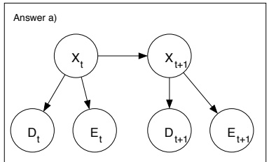

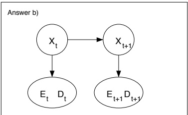

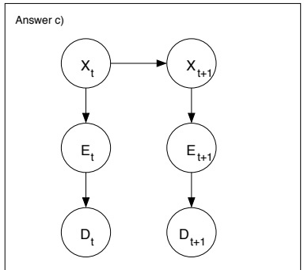

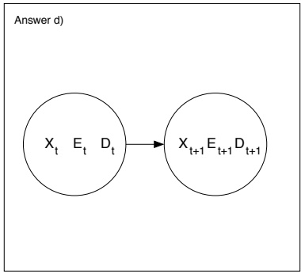

Select all that apply. a) b) c) d)

(ii) [4 pts] ERRATUM: Which of the following values for Z are correct?

$$
P (X _ {t + 1} | D _ {1}, \dots , D _ {t + 1}, E _ {1}, \dots , E _ {t + 1}) = \sum_ {x = f, l, r, b} \frac {Z \cdot P (X _ {t} = x | D _ {1} , \dots , D _ {t} , E _ {1} , \dots , E _ {t}) \cdot P (X _ {t + 1} | X _ {t} = x)}{P (D _ {t + 1} , E _ {t + 1} | D _ {1} , \dots , D _ {t} , E _ {1} , \dots , E _ {t})}.
$$

$$
\square \quad Z = P (E _ {t + 1} D _ {t + 1} | X _ {t + 1}, X _ {t}, D _ {1}, \ldots , D _ {t + 1}, E _ {1}, \ldots , E _ {t + 1})
$$

$$
\square Z = P (E _ {t + 1} | X _ {t + 1}) P (D _ {t + 1} | X _ {t + 1})
$$

$$
\square \quad Z = P (E _ {t + 1} | X _ {t}) P (D _ {t + 1} | X _ {t})
$$

$$
\square \quad Z = P (E _ {t + 1} | E _ {t}) P (D _ {t + 1} | D _ {t})
$$

<!-- page: 16 -->

 $Z = P ( E _ { t + 1 } , D _ { t + 1 } | X _ { t + 1 } )$

 $Z = P ( E _ { t + 1 } , D _ { t + 1 } | X _ { t } )$

<!-- page: 17 -->

Q9. [23 pts] Deep Learning

(a) [5 pts] Data Separability

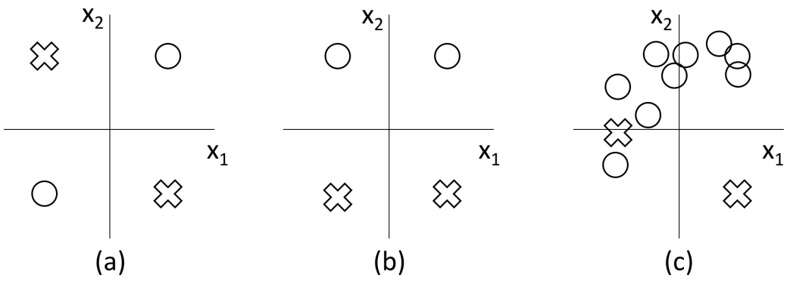

The plots above show points in feature space $( x _ { 1 } ,   x _ { 2 } )$ , also referred to as feature vectors $\mathbf { x } = [ x _ { 1 } \quad x _ { 2 } ] ^ { T }$ For each of the following, we will define a function $h ( \mathbf { x } )$ as a composition of some functions $f _ { i }$ and $g _ { i } .$ . For each one, consider the decision rule

$$
y (\mathbf {x}) = \left\{ \begin{array}{l l} \times & h (\mathbf {x}) \geq 0 \\ \bigcirc & h (\mathbf {x}) <   0. \end{array} \right.
$$

Under each composition of functions $h ,$ select the datasets for which there exist some linear functions $f _ { i }$ and some nonlinear functions $g _ { i }$ such that the corresponding decision rule perfectly classifies the data. (Select all that apply)

(i) $h ( \mathbf { x } ) = f _ { 1 } ( \mathbf { x } )$

(a)  (b)  (c) 

(ii) $h ( \mathbf { x } ) = f _ { 2 } ( f _ { 1 } ( \mathbf { x } ) )$

(a)  (b)  (c) 

(iii) $h ( \mathbf { x } ) = f _ { 2 } ( g _ { 1 } ( f _ { 1 } ( \mathbf { x } ) ) )$

(a)  (b)  (c) 

(iv) $h ( \mathbf { x } ) = f _ { 4 } ( f _ { 3 } ( f _ { 2 } ( f _ { 1 } ( \mathbf { x } ) ) ) )$

(a) $口  $\begin{array} { r l } { \mathrm { ( b ) } \; \Box } & { { } \mathrm { ( c ) } \; \Box } \end{array}$$

(v) $h ( \mathbf { x } ) = g _ { 2 } ( g _ { 1 } ( \mathbf { x } ) ) )$

(a) $口  $\begin{array} { r l } { \mathrm { ( b ) } \; \Box } & { { } \mathrm { ( c ) } \; \Box } \end{array}$$

<!-- page: 18 -->

(b) Backpropagation Below is a deep network with input x. Values $x , h _ { 1 } , h _ { 2 } , z$ are all scalars.

$$
h _ {1} = f _ {1} (x), h _ {2} = f _ {2} (x), z = h _ {1} h _ {2}\tag{1}
$$

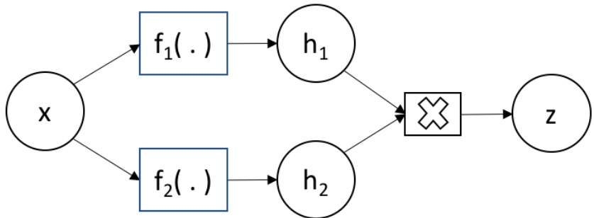

Derive the following gradients in terms of $x , h _ { 1 } , h _ { 2 } , \frac { \partial f _ { 1 } } { \partial x } , \frac { \partial f _ { 2 } } { \partial x }$

(i) [1 pt] Derive $\frac { \partial z } { \partial h _ { 1 } }$

(ii) [1 pt] Derive $\frac { \partial z } { \partial h _ { 2 } }$

(iii) $\mathrm{[3~pts]~Dewe}~\frac{\partial z}{\partial x}$

<!-- page: 19 -->

(c) Deep Network Below is a deep network with inputs $x _ { 1 } , x _ { 2 }$ . The internal nodes are computed below. All variables are scalar values.

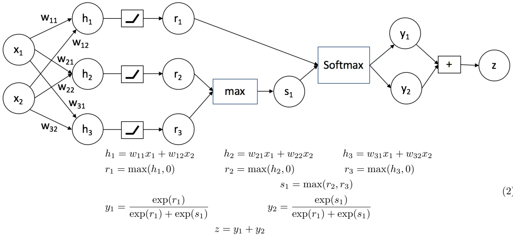

(2)

(i) [5 pts] Forward propagation Now, given $x _ { 1 } = 1 , x _ { 2 } = - 2 , w _ { 1 1 } = 6 , w _ { 1 2 } = 2 , w _ { 2 1 } = 4 , w _ { 2 2 } = 7 ,$ $w _ { 3 1 } = 5 , w _ { 3 2 } = 1$ , and the same values for $x _ { 1 } , x _ { 2 }$ above, compute the values of the internal nodes. Please simplify any fractions.

| h1 | h2 | h3 | r1 | r2 |
| --- | --- | --- | --- | --- |
|  |  |  |  |  |

| r3 | s | y1 | y2 | z |
| --- | --- | --- | --- | --- |
|  |  |  |  |  |

(ii) [2 pts] Bounds on variables.

Find the tightest bounds on y1.

Find the tightest bounds on z.

<!-- page: 20 -->

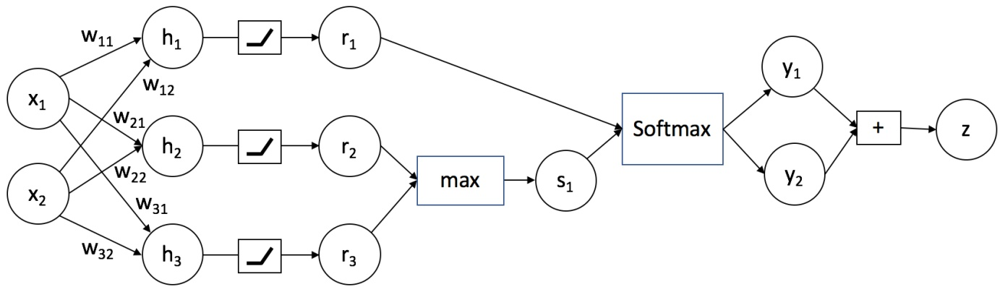

$$
\begin{array}{c c c} h _ {1} = w _ {1 1} x _ {1} + w _ {1 2} x _ {2} & h _ {2} = w _ {2 1} x _ {1} + w _ {2 2} x _ {2} & h _ {3} = w _ {3 1} x _ {1} + w _ {3 2} x _ {2} \\ r _ {1} = \max (h _ {1}, 0) & r _ {2} = \max (h _ {2}, 0) & r _ {3} = \max (h _ {3}, 0) \\ & s _ {1} = \max (r _ {2}, r _ {3}) \\ y _ {1} = \frac {\exp (r _ {1})}{\exp (r _ {1}) + \exp (s _ {1})} & y _ {2} = \frac {\exp (s _ {1})}{\exp (r _ {1}) + \exp (s _ {1})} \\ & z = y _ {1} + y _ {2} \end{array}\tag{3}
$$

(iii) [6 pts] Backpropagation Compute the following gradients analytically. The answer should be an expression of any of the nodes in the network $( x _ { 1 } , x _ { 2 } , h _ { 1 } , h _ { 2 } , h _ { 3 } , r _ { 1 } , r _ { 2 } , r _ { 3 } , s _ { 1 } , y _ { 1 } , y _ { 2 } , z )$ or weights $w _ { 1 1 } , w _ { 1 2 } , w _ { 2 1 } , w _ { 2 2 } , w _ { 3 1 } , w _ { 3 2 } .$ Hint: Recall that for functions of the form $\begin{array} { r } { g ( x )   =   \frac { 1 } { 1 + e x p ( a - x ) } , \; \frac { \partial g } { \partial x }   =   g ( x ) \left( 1 - g ( x ) \right) } \end{array}$ . Also, your answer may be a constant or a piecewise function.

<table><tbody><tr><td rowspan="2">∂h1∂w12</td><td rowspan="2">∂h1∂x1</td><td rowspan="2">∂r1∂h1</td><td rowspan="2">∂y1∂r1</td></tr><tr></tr><tr><td></td><td></td><td></td><td></td></tr></tbody></table>

<table><tbody><tr><td rowspan="2">∂y1∂s1</td><td rowspan="2">∂z∂y1</td><td rowspan="2">∂z∂x1</td><td rowspan="2">∂s1∂r2</td></tr><tr></tr><tr><td></td><td></td><td></td><td></td></tr></tbody></table>

<!-- page: 21 -->
