<!-- page: 1 -->

• You have approximately 170 minutes. The time will be projected at the front of the room. You may not leave during the last 10 minutes of the exam

• The exam is closed book, closed calculator, and closed notes except your two-page crib sheet.

• Mark your answers ON THE EXAM IN THE DESIGNATED ANSWER AREAS. Provide a brief explanation if applicable.

• In the interest of fairness, we want everyone to have access to the same information. To that end, we will not be answering questions about the content. If a clarification is needed, it will be projected at the front of the room. **Make sure to periodically check the clarifications**.

• For multiple choice questions,

means mark **all options** that apply

means mark a single choice

#– When selecting an answer, please fill in the bubble or square **completely** ( and ■)

– If need to undo a selection, either **erase it completely** or **lay a giant cross (X) over the box**. The staff reserves the right to subtract points from ambiguous answers

| First name |  |
| --- | --- |
| Last name |  |
| SID |  |
| Student to your right |  |
| Student to your left |  |

For staff use only:

| Q1. Coin Stars | /10 |
| --- | --- |
| Q2. Five Card Game | /14 |
| Q3. Vehicle Perception Indication | /10 |
| Q4. Hidden CSP | /14 |
| Q5. Snail Bayes | /15 |
| Q6. We Are Getting Close... | /11 |
| Q7. Generating and classifying text | /10 |
| Q8. Deep "Blackjack" | /16 |
| Total | /100 |

<!-- page: 2 -->

<!-- page: 3 -->

## Q1. [10 pts] Coin Stars

In a new online game called Coin Stars, all players are walking around an M x N grid to collect **hidden coins, which only appear when you’re on top of them**. There are also power pellets scattered across the board, which are visible to all players. If you walk onto a square with a power pellet, your power level goes up by 1, and the power pellet disappears. Players will also attack each other if one player enters a square occupied by another player. In an attack, the player with a higher power level will steal all the coins from the other player. If they have equal power levels, nothing happens. Each turn, players go in order to move in one of the following directions: {N, S, E, W}.

In this problem, you and your friend Amy are playing Coin Stars against each other. You are player 1, and your opponent Amy is player 2. Our <u>state space representation</u> includes the locations of the power pellets $( x _ { p _ { j } } , y _ { p _ { j } } )$ and the following player information:

• Each player’s location $( x _ { i } , y _ { i } )$

• Each player’s power level $l _ { i }$

• Each player’s coin count $c _ { i }$

**(a) (i)** [2 pts] Suppose a player wins by collecting more coins at the end of a number of rounds, so we can formulate this as a minimax problem with the value of the node being $\underline { { c _ { 1 } - c _ { 2 } } }$ . Consider the following game tree where you are the maximizing player (maximizing the your net advantage, as seen above) and the opponent is the minimizer. Assuming both players act optimally, if a branch can be pruned, fill in its square completely, otherwise leave the square unmarked.

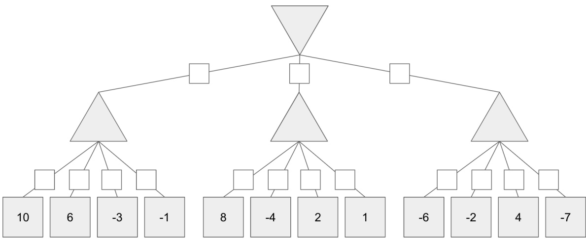

None of the above can be pruned

If you traverse the tree with 𝛼 − 𝛽 pruning, you will see that no branches can be pruned

**(ii)** [1 pt] Suppose that instead of the player with more coins winning, every player receives payout equal to the number of coins they’ve collected. Can we still use a multi-layer minimax tree (like the one above) to find the optimal action?

\# Yes, because the update in payout policy does not affect the minimax structure of the game.

\# Yes, but not for the reason above

\# No, because we can no longer model the game under the updated payout policy with a game tree.

No, but not for the reason above

No, because the game is no longer zero-sum: your opponent obtaining more coins does not necessarily make you worse off, and vice versa. We can still model this game with a game-tree, where each node contains a tuple of two values, instead of a single value. But this means the tree is no longer a minimax tree.

An example of using the minimax tree but not optimizing the number of coins collected: when given a choice between gathering 3 coins or stealing 2 coins from the opponent, the minimax solution with $c _ { 1 } - c _ { 2 }$ will steal the 2 coins (net gain of 4), even though this will cause it to end up with fewer coins.

<!-- page: 4 -->

**(b)** Suppose we want to train a Reinforcement Learning (RL) agent using Q-learning to play against a wide range of human participants, with the objective to **obtain more coins than its opponent** like in (a.i).

Your friend Blake discovers that a computer scientist and expert Coin Stars player Oswald has published (open-sourced) his policy $\pi _ { e } ,$ which consists of a set of expert features $F _ { e } = [ f _ { 1 } , f _ { 2 } , . . . , f _ { n } ]$ , <u>all of which can be computed using the current state representation mentioned in the problem statement</u>. Oswald has hand-tuned the weights $W _ { e } = [ w _ { 1 } , w _ { 2 } , . . . , w _ { n } ]$ of the policy $\pi _ { e }$ such that $\pi _ { e }$ is near optimal **assuming the opponent also plays optimally**.

You decide to use the same set of features as Oswald’s $F _ { e } ,$ and come up with four proposed training procedures, all of which **will learn the optimal policy (i.e. the best response) against that particular opponent**:

I Playing against an opponent who plays $\pi _ { e } ,$ Oswald’s expert-tuned policy that assumes our agent plays optimally

II Playing against an opponent who plays a fixed policy $\pi _ { p } ,$ , a sub-optimal policy that moves to maximize the collection of power pellet, and chases its opponent afterwards.

III Playing against an opponent who plays a fixed policy $\pi _ { c } ,$ a sub-optimal policy that ignores power pellet and its opponent, and moves to maximize the collection of hidden coins.

**(i)** [1 pt] With which of the training procedures is our agent most likely to learn a set of weights that can achieve the highest win rate against **Oswald, an expert human participant who plays according to** $\pi _ { e } ?$ (I) # (II) # (III)

\# There is not enough information to distinguish among the three

Procedure (I) is the direct fit to the expert human players, and thus is selected. Procedure (II)’s and (III)’s opponents are not expert human players, thus it’s unlikely that the policies trained to cope with these opponents can win as frequently as the policy from Procedure (I).

**(ii)** [1 pt] Is either of (II) or (III) guaranteed to result in an agent who achieves a higher win rate than (I) when playing against **novice human participants who play sub-optimally, in an unknown way**?

\# Yes, because (II) and (III) are trained with sub-optimal opponents, whereas (I) is trained with expert opponents. # Yes, but not for the reason above.

No, because the novice human may not be sub-optimal in the same way as the opponents in (II) or (III).

Procedure (I) could yield a policy that is robust enough and still beat sub-optimal human players, but the policy also makes the incorrect assumption that the human opponent play optimally, which is not true for novice human players. There are essentially so many ways to play sub-optimally, so, similar to Procedure (I), with a high probability, Procedures (II) and (III) make incorrect assumptions about the novice human player’s strategy and therefore cannot guarantee a higher win rate.

**(iii)** [2 pts] Suppose instead of training an RL agent against an agent with a fixed strategy, we instead train the RL agent against itself. That is, the RL agent plays against an opponent with its weights, and the features are computed from each agent’s point of view.

Which of the following are potential issues in this self-play Reinforcement Learning approach?

■ The RL agent’s weights are not guaranteed to converge because it is playing against itself.

Because the opponent you play against can be arbitrarily bad, the RL agent cannot improve at the game at all. Because the RL agent is playing against the same opponent (itself), the best (highest reward) policy from its perspective does not change over the course of training.

□ Because the RL agent is playing against itself, it does not need to do exploration (for example, it can just do the greedy action with respect to its current Q-values).

\# None of the above

The 1st choice: suppose there exist three strategies in the game A, B, C, such that A beats B beats C beats A. (For an analogy, consider rock-paper-scissors.) If the agent is currently playing B, then it learns that playing C is better, and will change its weights too play C. If the agent is currently playing C, then playing A will look better, and so it will play A. This will cause it to play B, then C, then A, and so forth, ad infinitum. So this choice is true.

The 2nd choice: even if the opponent is arbitrarily bad, you still might learn some basic skills such as how to gather coins. Then the opponent is better in the next iteration, and the RL agent might get better yet.

The 3rd choice: again, consider the rock-paper-scissors example. Over time, the best policy (against the previous iteration of the agent) changes.

The 4th choice: You need to do exploration, as, for example, your initial Q-values can be arbitrarily bad.

<!-- page: 5 -->

**(c)** [1 pt] **For this part only**, suppose the game randomly reveals some hidden coins throughout the game, making them visible to both you and your friend. Which of the conditions below will both players benefit the most from the feature "Distance to closest visible coins"?

Coins are sparse (∼ 1 coin per 50 squares), reveal frequency high (∼ 1 coin becomes visible per 1 moves)

\# Coins are sparse (∼ 1 coin per 50 squares), reveal frequency low (∼ 1 coin becomes visible per 50 moves)

\# Coins are dense (∼ 1 coin per 2 squares), reveal frequency high (∼ 1 coin becomes visible per 1 moves)

\# Coins are dense (∼ 1 coin per 2 squares), reveal frequency low (∼ 1 coin becomes visible per 50 moves)

Equally useful in all conditions above

Spare coins makes information about their location more valuable. This is because if coins are dense, agents are able to collects lots of coins without knowing their locations, just by walking on the grid. Higher reveal frequency is strictly better because they are able to make their plan more efficient with strictly more information. We also accepted "Equally useful in all conditions above" as an answer since benefit can be interpreted as a better chance to win the game - but this situation equally benefits both players in all coin situations.

**(d)** Using the original problem setup and, we have the following features and weights for a given state 𝑠:

| Feature | Initial Weight |
| --- | --- |
| 𝑓1(𝑠, 𝑎) = \|𝑥1 - 𝑥2\| + \|𝑦1 - 𝑦2\| | 𝑤1 = 1 |
| 𝑓2(𝑠, 𝑎) = 𝑙1 - 𝑙2 | 𝑤2 = 4 |
| 𝑓3(𝑠, 𝑎) = the Manhattan distance from1player 1 to their closest pellet | 𝑤3 = 2 |

**(i)** [1 pt] Calculate 𝑄(𝑠, 𝑎) for the q-state where player 1 is at (1, 1) and player 2 is at (5, 4). Player 1 has power level 7, and player 2 has power level 3. The closest pellet to player 1 is located at (2, 1).

\# 24 $\bigcirc 25 \bigcirc 26 \bigcirc 27 \bigcirc 28 \bigcirc  A$ value different from all of the above

\# There is not enough information to calculate this value

$$
1 * (1 - 5 + 1 - 4) + 4 * (7 - 3) + 2 * \frac {1}{1} = 1 * 7 + 4 * 4 + 2 * 1 = 2 5
$$

**(ii)** [1 pt] We observe a sample $( s , a , r )$ for the q-state in the previous part with $r = 2 3$ . Assuming a learning rate of $\alpha   =   0 . 5$ and discount factor of $\gamma   =   0 . 5$ , calculate the new weight $w _ { 1 \_ n e w }$ after a single update of approximate Q-Learning. **This part will be graded independently of the previous part**, so please check your work before proceeding.

$$
w _ {1 \_ n e w} =
$$

$\begin{array}{l}\text {  \text {  } \text {  } \text {  } \text {  } \text {  } \text {  } \text {  } \text {  } \text {  } \text {  } \text {  } \text {  } \text {  } \text {  } \text {  } \text {  } \text {  } \text {  } \text {  } \text {  } \text {  } \text {  } \text {  } \text {  } \text {  } \text {  } \text {  } \text {  } \text {  } \text {  } \text {  } \text {  } \text {  } \text {  } \text {  } \text {  } \text {  } \text {  } \text {  } \text {  } \text {  } \text {  } \text {  } \text {  } \text {  } \text {  } \text {  } \text {  } \text {  } \text {  } \text {  } \text {  } \text {  } \text {  } \text {  } \text {  } \text {  } \text {  } \text {  } \text {  } \text {  } \text {  } \text {  } \text {  } \text {  } \text {  } \text {  } \text {  } \text {  } \text {  } \text {  } \text {  } \text {  } \text {  } \text {  } \text {  } \text {  } \text {  } \text {  } \text {  } \text {  } \text {  } \text {  } \text {  } \text {  } \text {  } \text {  } \text {  } \text {  } \text {  } \text {  } \text {  } \text {  } \text {  } \text {  } \text {  } \text {  } \text {  } \text {  } \text {  } \text {  } \text {  } \text {  } \text {  } \text {  } \text {  } \text {  } \text {  } \text {  } \text {  } \text {  } \text {  } \text {  } \text {  } \text {  } \text {  } \text {  } \text {  } \text {  } \text {  } \text {  } \text {  } \text {  } \text {  } \text {  } \text {  } \text {  } \text {  } \text {  } \text {  } \text {  } \text {  } \text {  } \text {  } \text {  } \text {  } \text {  } \text {  } \text {  } \text \text {  } \text {  } \text {  } \text {  } \text {  } \text \text {  } \text {  } \text {  } \text {  } \text \text {  } \text {  } \text {  } \text \text {  } \text {  } \text {  } \text \text {  } \text {  } \text \text {  } \text {  } \text {  } \text \text {  } \text {  } \text \text {  } \text {  } \text \text {  } \text {  } \text \text {  } \text {  } \text \text {  } \text {  } \text \text {  } \text {  } \text \text {  } \text \text {  } \text {  } \text \text {  } \text \text {  } \text \text {  } \text {  } \text \text {  } \text \text {  } \text \text {  } \text {  } \text \text {  } \text \text {  } \text \text {  } \text \text {  } \text \text {  } \text {  } \text \text {  } \text \text {  } \text \text {  } \text \text {  } \text \text {  } \text \text {  } \text \text {  } \text \text {  } \text \text {  } \text \text {  } \text \text {  } \text \text {  } \text \text {  } \ \end{array}$ A value different from all of the above

There is not enough information to calculate this value

We do not have any information about the values of features for any outgoing state-action pair $s ^ { \prime } , a ^ { \prime }$ from this current 𝑠, 𝑎 state-action pair.

<!-- page: 6 -->

## Q2. [14 pts] Five Card Game

There is a two-player zero-sum card game called Five Card Game. Player A plays odd-numbered turns (and thus plays first), and he initially has the cards labeled 1, 3, 5 in his hand. Player B plays even-numbered turns, and she initially has the cards labeled 2 and 4 in her hand. They take turns to give out one of their cards to the judge based on their policies. The game ends after 5 turns and forms the sequence $X _ { 1 } , X _ { 2 } , X _ { 3 } , X _ { 4 } , X _ { 5 }$ , where $X _ { 1 } , X _ { 3 } , X _ { 5 }$ is a permutation of 1, 3, 5 provided by player A, and $X _ { 2 } , X _ { 4 }$ is a permutation of 2, 4 provided by player B.

However, neither of the two players have access to what cards their opponent plays throughout the game. The only hint they receive is from the judge: when $X _ { t }$ has been determined by either of the players $( t \geq 2 )$ , the judge of the game will compare $X _ { t }$ and $X _ { t - 1 }$ , and assign one point to either of the players. With probability $p _ { t } \: ( 0 \leq p _ { t } \leq 1 )$ , the point will be given to the player whose card is larger, and with probability $1 - p _ { t }$ , the point will be given to the player whose card is smaller. $p _ { 2 } , p _ { 3 } , p _ { 4 } , p _ { 5 }$ are **pre-defined** before the game and everyone knows their values. **Both the players and the audience know the point assignment right after the judge assigns it**. The player who wins more points wins the game.

We denote the point that player A earned at each time step as $U _ { 2 } ^ { A } , U _ { 3 } ^ { A } , U _ { 4 } ^ { A } , U _ { 5 } ^ { A }$ (value can be either 0 or 1), and thus all the variables are determined in the following order: $X_{1},X_{2},U_{2}^{A},\bar{X_{3}},U_{3}^{\bar{A}},\bar{X_{4}},U_{4}^{\bar{A}},X_{5},U_{5}^{A}$ . Note player A determines $X _ { 3 }$ after knowing $U _ { 2 } ^ { A }$ , and player B determines $X _ { 4 }$ after knowing $U _ { 2 } ^ { A }$ and $U _ { 3 } ^ { A }$ , and player A determines $X _ { 5 }$ after knowing $U _ { 2 } ^ { A } , U _ { 3 } ^ { A } , U _ { 4 } ^ { A }$

As an illustration, if $X _ { 1 } , X _ { 2 } , X _ { 3 } , X _ { 4 } , X _ { 5 }$ is 3, 2, 5, 4, 1, and $p _ { t } = 1$ for all 𝑡 (so that the bigger card’s owner always gets the point), then $U _ { 2 } ^ { A } , U _ { 3 } ^ { A } , \bar { U _ { 4 } ^ { A } } , \bar { U _ { 5 } ^ { A } }$ is 1, 1, 1, 0 and player A wins this game. In this example, $U _ { 2 } ^ { A } = 1$ because $X_{2} < X_{1}$ and hence the point is awarded to player A, while $U _ { 5 } ^ { A } = 0$ because $X _ { 5 } < X _ { 4 }$ and hence the point is awarded to player B.

**(a)** Suppose $p _ { t } = 1$ for all 𝑡.

**(i)** [1 pt] Each player uses their own optimal deterministic policy and is aware that their opponent is also using the optimal deterministic policy. How many points will Player A obtain? Hint: Drawing a game tree might help you here.

Answer:

Player A is the maximizer, and player B is the minimizer. Utility of the root node = 2.

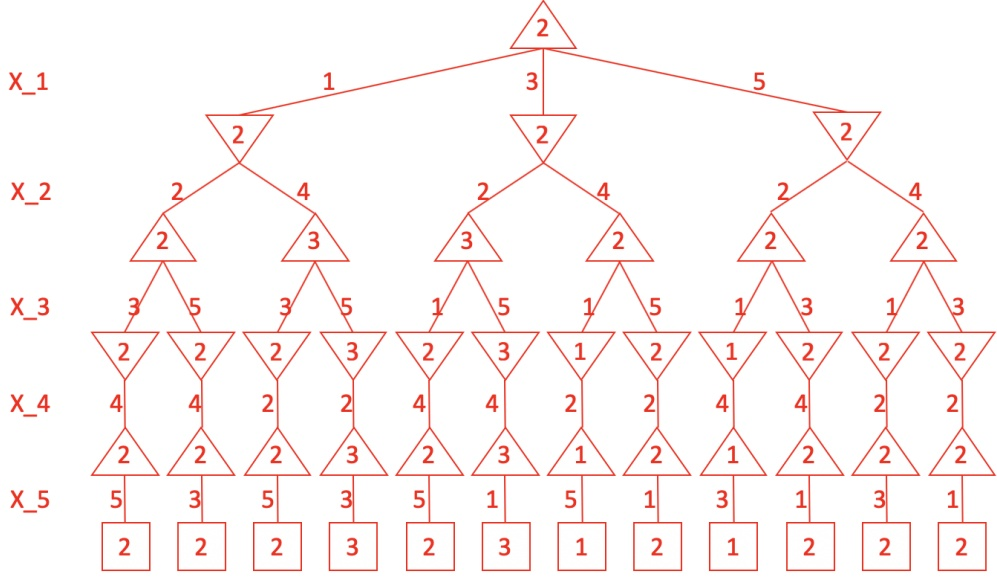

<!-- page: 7 -->

SID:

**(ii)** [1 pt] Player B decides to gives out her cards randomly (with equal probability for each ordering). If Player A becomes aware of this, what is the expected number of points Player A will obtain if he plays optimally?

Answer:

Player A is again the maximizer, but here player B has the chance nodes. Utility of the root node = 2.5.

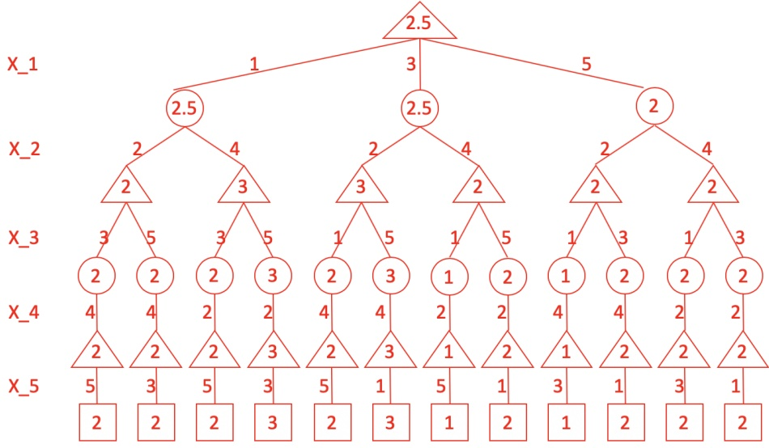

<!-- page: 8 -->

Now we assume both the players have their own random policies. Suppose a player’s policy for each $X _ { t }$ is a conditional probability table, **conditioned on the MINIMUM set of DEPENDENT information they know when playing the card** $X _ { t }$ . Then at each time step 𝑡, they randomly sample which card to draw according to their probability table. During the game, each player only knows their own policy. In addition, the policies do not change over time.

We want to construct a Bayes Net **with the minimum number of edges** to investigate the relations between the nodes $X _ { 1 } , X _ { 2 } , U _ { 2 } ^ { A } , X _ { 3 }$ $U _ { 3 } ^ { A } , X _ { 4 } , U _ { 4 } ^ { A } , X _ { 5 } , U _ { 5 } ^ { A }$

Hint 1: Drawing the Bayes Net with nodes $X _ { 1 } , X _ { 2 } , U _ { 2 } ^ { A } , X _ { 3 } , U _ { 3 } ^ { A } , X _ { 4 } , U _ { 4 } ^ { A } , X _ { 5 } , U _ { 5 } ^ { A }$ while answering part (b) will help you in part (c). But only your response to the questions will be graded. No partial credit for the drawings.

Hint 2: Do Player A and Player B know each other’s card sequence exactly? Do they know their own card sequence exactly?

Hint 3: As noted in the problem statement, before any player determines his or her turn $X _ { t } ,$ he or she knows all the existing hints $U _ { 2 } ^ { A } , . . . , U _ { t - 1 } ^ { A } .$

The Bayes Net:

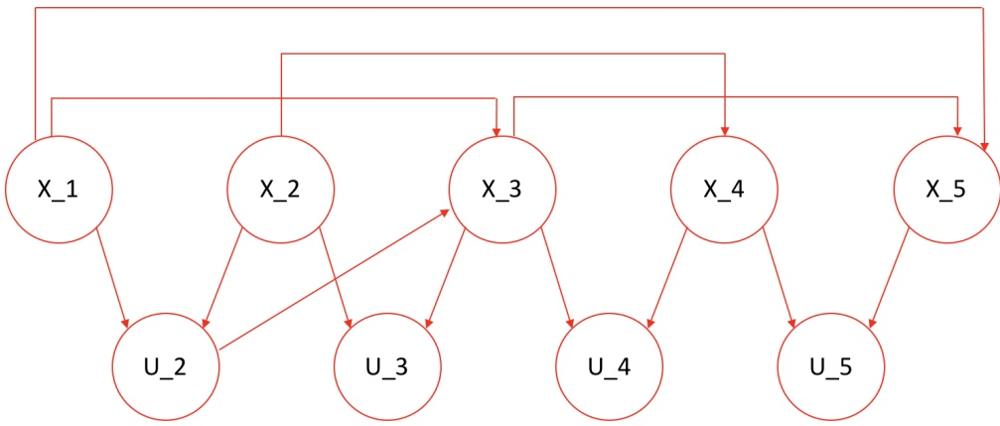

Special note about $U _ { 2 } ^ { A }   \rightarrow   X _ { 3 } { : }$ As indicated in the problem, player A determines $X _ { 3 }$ after getting the value of $U _ { 2 } ^ { A }$ from the judge. $U _ { 2 } ^ { A }$ would be a valuable indication of $X _ { 2 }$ played by player B if $X _ { 1 } = 3$ . However, for $X _ { 4 } ,$ , player B has no other choice. He only have the card that is different from $X _ { 2 }$ at hand.

**(b) (i)** [1 pt] Which of the following are directly reflected in the Bayes net’s probability tables (including prior probability tables and conditional probability tables)? The judge’s point assignment probability. The player A’s winning probability. # None of the above

(ii) [2 pts] For each table, mark the minimal set of variables that each probability table should be conditioned on. Player B’s policy probability table to determine $X _ { 2 }$ □ $X _ { 1 }$ None of the above Player B has no information about $X _ { 1 } ,$ because the judge has not stepped in to give hints. Player A’s policy probability table to determine $X _ { 3 }$ $X_{1} \bigsqcup X_{2} \bigsqcup U_{2}^{A}$ # None of the above $X _ { 1 }$ eliminate the options for $X _ { 3 }$ , and $U _ { 2 }$ gives clue to what $X _ { 1 }$ could have been, and thus gives clue to what $X _ { 3 }$ would be. Player B’s policy probability table to determine $X _ { 4 }$ $\bigsqcup X _ { 1 } \blacksquare X _ { 2 } \bigsqcup X _ { 3 } \bigsqcup U _ { 2 } ^ { A } \bigsqcup U _ { 3 } ^ { A }$ # None of the above Note for $X _ { 4 } ,$ it can be precisely determined by $X _ { 2 } ,$ , and hence it does not condition on any other variables.

<!-- page: 9 -->

Player A’s policy probability table to determine $X _ { 5 }$

■ $X _ { 1 } \bigsqcup X _ { 2 } \bigsqcup X _ { 3 } \bigsqcup X _ { 4 } \bigsqcup U _ { 2 } ^ { A } \bigsqcup U _ { 3 } ^ { A } \bigsqcup U _ { 4 } ^ { A } \qquad \bigcirc$ None of the above

$X _ { 1 }$ and $X _ { 3 }$ eliminate the options for $X _ { 5 }$ to one option.

**(c)** Analyze the independency or conditional independency between variables.

Hint: Feel free to use the Bayes Net you constructed from part $( b ) ,$ , but this part will be graded independently. Please double check your work in part (b)

**(i)** [1 pt] Which of the following pairs of variables are independent, given no observations?

$口  x_{2}$ and $X _ { 3 }$ ■ $X _ { 1 }$ and $X _ { 4 }$ None of the above

**(ii)** [1 pt] Which of the following pairs of variables are independent, given only $U _ { 2 } ^ { A \gamma }$

$口  x_{2}$ and $X _ { 3 }$

By using the D-Separation on the Bayes Net constructed for this question, we can obtain the correct answer. For the second question, although the route $X _ { 2 } - U _ { 2 } ^ { A } - X _ { 3 }$ is cut off, there is still another path $X _ { 2 } - U _ { 2 } ^ { A } - X _ { 1 } - X _ { 3 }$ that connects.

$$
\square X _ {1} \text {and} X _ {4}
$$

None of the above

<!-- page: 10 -->

Now the game is over and you have only observed the values of $U _ { 2 } ^ { A } , U _ { 3 } ^ { A } , U _ { 4 } ^ { A } , U _ { 5 } ^ { A }$ , and want to decode the values of $X _ { 1 } , X _ { 2 } , X _ { 3 } ,$ $X _ { 4 } , X _ { 5 }$ . You want to solve this problem by searching over all the possible states. Each of your states contains the card sequence at some point during the game. For example, one search path from the start state to one goal state could be:

$$
() \rightarrow (3,) \rightarrow (3, 2) \rightarrow (3, 2, 5) \rightarrow (3, 2, 5, 4) \rightarrow (3, 2, 5, 4, 1) (\text {Goal State}).
$$

**(d)** [1 pt]

How many goal states are there in your search problem?

Answer:

12

There are 12 leaf nodes in the game tree, and hence there are 12 goal states.

Which data structure is more similar to the search graph?

Your game tree from part (a)

\# Your bayes net from part (b)

There is no valid start state or goal state in the Bayes Net. In the game tree, the root node is the start state, while the leaf nodes are the goal states.

Now we wish to decode $X _ { 1 } , X _ { 2 } , X _ { 3 } , X _ { 4 } , X _ { 5 }$ given $U _ { 2 } ^ { A } , U _ { 3 } ^ { A } , U _ { 4 } ^ { A } , U _ { 5 } ^ { A }$ by solving the following problem:

$$
\operatorname{argmax} _ {X _ {1}, X _ {2}, X _ {3}, X _ {4}, X _ {5}} P (U _ {2} ^ {A} | X _ {1}, X _ {2}) P (U _ {3} ^ {A} | X _ {2}, X _ {3}) P (U _ {4} ^ {A} | X _ {3}, X _ {4}) P (U _ {5} ^ {A} | X _ {4}, X _ {5})
$$

**(e)** We then assign proper cost to each edge in the search graph.

**(i)** [2 pts] Which is a correct edge cost configuration for the edge connecting the states $( X _ { 1 } , . . . , X _ { t - 1 } )$ and $( X _ { 1 } , . . . , X _ { t } )$ (where $t \geq 2 ) ?$ Note a correct configuration means that, the optimal path of your search problem should always be the correct argmax solution above for any valid player policy probability table values and $p _ { t }$ values. # $P ( U _ { t } ^ { A } | X _ { t - 1 } , X _ { t } )$ # −𝑃 (𝑈𝐴|𝑋𝑡−1, 𝑋𝑡) # ln 𝑃 (𝑈𝐴|𝑋𝑡−1, 𝑋𝑡) − ln 𝑃 (𝑈𝐴𝑡 |𝑋𝑡−1, 𝑋𝑡) # $e ^ { P ( U _ { t } ^ { A } | X _ { t - 1 } , X _ { t } ) }$ # $e ^ { - P ( U _ { t } ^ { A } | X _ { t - 1 } , X _ { t } ) }$ # None of the above

Turning multiplication (argmax) into summation (total cost in search), we need logarithm. Turning argmax into argmin (search is finding the minimum cost), we need the negative sign.

Now suppose we observe that $U _ { 2 } ^ { A } , U _ { 3 } ^ { A } , U _ { 4 } ^ { A } , U _ { 5 } ^ { A }$ all equal to 1.

**(ii)** [2 pts]

What is the value for $P ( U _ { 5 } ^ { A } | X _ { 4 } , X _ { 5 } )$ used to compute the edge cost from the state (3, 2, 5, 4) to the state (3, 2, 5, 4, 1)? Your answer should just be the value of $P ( U _ { 5 } ^ { A } | X _ { 4 } , X _ { 5 } )$ rather than the edge cost computed using your answer to part (e)(i).

$\textcircled{C}  \quad p _ { 5 } \quad \spadesuit \quad 1 - p _ { 5 } \quad \textcircled{C}$ Cannot be determined only by $p _ { t }$ - we also need the players’ policy probability table.

What is the value for $P ( U _ { 3 } ^ { A } | X _ { 2 } , X _ { 3 } )$ used to compute the edge cost from the state (3, 2) to the state (3, 2, 5)? Your answer should just be the value of $P ( U _ { 3 } ^ { A } | X _ { 2 } , X _ { 3 } )$ rather than the edge cost computed using your answer to part (e)(i).

$p _ { 3 } \quad \bigcirc \quad 1 - p _ { 3 } \quad \bigcirc$ Cannot be determined only by $p _ { t }$ - we also need the players’ policy probability table.

Note we still did not assign the edge cost to the edge connecting () and $( X _ { 1 } , )$ . Let us assign 1 as the cost to all this type of edges.

**(f)** [2 pts] Now you will conduct $\mathrm { A } ^ { * }$ search on your constructed search graph with the proper edge cost from part (e). The heuristic for each node will be set to be the number of time steps remaining to the game end. For example, the heuristic for the state (3, 2, 5) is $2 \: ( 2$ steps from the game end). Which of the following statements is correct?

\# Neither tree search nor graph search will be complete.

Both tree search and graph search will be complete, but neither is guaranteed to be optimal.

\# Both tree search and graph search will be complete, and only the tree search is guaranteed to be optimal.

\# Both the tree search and the graph search will be complete and optimal.

In this question, the graph search is exactly the same as the tree search because the search graph is a tree and all the edges are directed from the parent node to the child node. The heurstic is not admissible because if $p _ { t } > \frac { 1 } { e }$ , then − ln $p _ { t } < 1$ Similarly, if $\begin{array} { r } { p _ { t } < 1 - \frac { 1 } { e } , \mathrm { t h e n } - \ln ( 1 - p _ { t } ) < 1 } \end{array}$ . So this heuristic can overestimate the true cost. The counter example for

<!-- page: 11 -->

optimality (for both tree search and graph search) can be: $\begin{array} { r } { p _ { 2 } = p _ { 3 } = 1 ,   p _ { 4 } = 0 . 5 e ^ { \epsilon } ,   p _ { 5 } = \frac { 1 } { e } \cdot e ^ { \delta } } \end{array}$ , where 𝜖 and $\delta$ are very small positive numbers and satisfy $\delta > 2 \epsilon$ , and we have $U _ { 2 } ^ { A } = U _ { 3 } ^ { A } = U _ { 4 } ^ { A } = 1 \; \mathrm { a n d } \; U _ { 5 } ^ { A } = 0 .$ Then the optimal path should reach the goal state (1, 2, 3, 4, 5). But the $\mathrm { A } ^ { * }$ search will return the path reaching the goal state $( 1 , 2 , 5 , 4 , 3 )   \mathrm { o r }   ( 3 , 4 , 5 , 2$ 1) (tie breaker will decide which). It is worth point out that if all the cost of the edges are set to be $- \log _ { a } P ( U _ { t } ^ { A } | X _ { t - 1 } , X _ { t } ) ,$ and if $1 < a < 2$ , both the tree search and the graph search of the $\mathrm { A } ^ { * }$ search will be both complete and optimal. Try a proof if you are interested. Hint: the edge cost in the same tree depth can only take two values 𝐴 and $B ,$ and we have $a ^ { - A } + a ^ { - B } = 1$

<!-- page: 12 -->

## Q3. [10 pts] Vehicle Perception Indication

A vehicle is trying to identify the situation of the world around it using a set of sensors located around the vehicle.

Each sensor reading is based off of an object’s location (LOC) and an object’s movement (MOVE). The sensor reading will then produce various values for its predicted location, predicted movement, and image rendered, which is then sent back to the user.

**(a)** The vehicle takes an action, and we assign some utility to the action based on the object’s location and movement. Possible actions are MOVE TOWARDS, MOVE AWAY, and STOP. Suppose the decision network faced by the vehicle is the following.

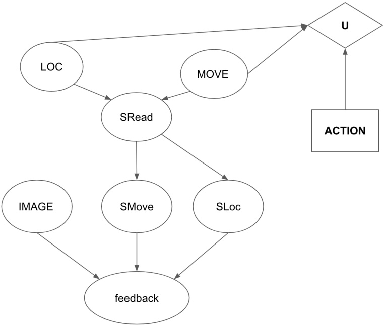

**(i)** [2 pts] Based on the diagram above, which of the following **could possibly be** true?

VPI (Image) = 0

□ VPI (SRead) < 0

VPI (SMove, SRead) > VPI (SRead)

VPI (Feedback) = 0

\# None of the above

VPI(Image) = 0 because there is not active path connecting Image and U

VPI cannot be negative, so option 2 is not selected.

VPI(SMove, SRead) = VPI(SMove | SRead) + VPI(SRead), therefore we can cancel VPI(SRead) from both side, and it becomes asking if VPI(SMove | SRead) > 0. And we can see that cannot be true, because shading in SRead, there is no active path connecting SMove and U.

There is an active path connecting Feedback and U, therefore VPI(Feedback) ≥ 0. It could still be 0 because active path only gives the possiblity of > 0.

**(ii)** [2 pts] Based on the diagram above, which of the following **must necessarily be** true?

VPI (Image) = 0

VPI (SRead) = 0

VPI (SMove, SRead) = VPI (SRead)

VPI (Feedback) = 0

\# None of the above

VPI(Image) = 0 because there is not active path connecting Image and U

VPI(SRead) could be >0 because SRead-MOVE-U is an active path between SRead and U

VPI(SMove, SRead) = VPI(SMove | SRead) + VPI(SRead), therefore we can cancel VPI(SRead) from both side, and it becomes asking if VPI(SMove | SRead) == 0. And we can see that must true, because shading in SRead, there is no active path connecting SMove and U.

<!-- page: 13 -->

VPI(Feedback) could be >0 because feedback-SLoc-SRead-MOVE-U is an active path

Let’s assume that your startup has less money, so we use a simpler sensor network. One possible sensor network can be represented as follows.

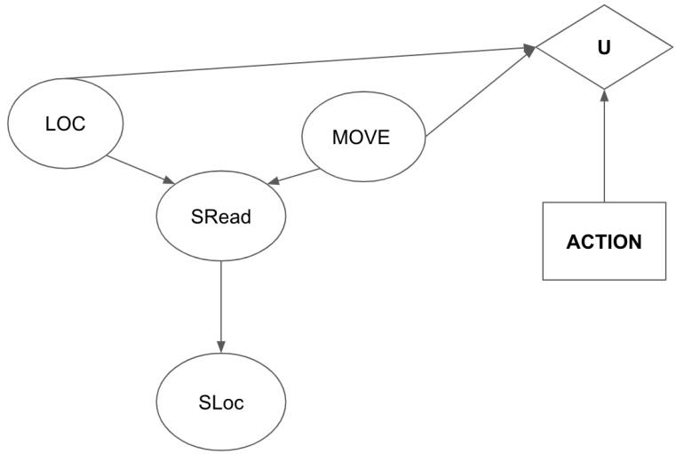

You have distributions of 𝑃 (LOC), 𝑃 (MOVE), 𝑃 (𝑆𝑅𝑒𝑎𝑑|LOC, MOVE), 𝑃 (𝑆𝐿𝑜𝑐|𝑆𝑅𝑒𝑎𝑑) and utility values 𝑈(𝑎, 𝑙, 𝑚).

**(b)** Complete the equation for determining the expected utility for some ACTION 𝑎.

$$
E U (a) = \left( \begin{array}{c c c} \underline {{\text {(i)}}} & \underline {{\text {(ii)}}} & \underline {{\text {(iii)}}} \end{array} \right) U (a, l, m)
$$

$$
\sum_ {l} P (l)
$$

$$
\sum_ {s l o c} P (s l o c | l)
$$

$$
\sum_ {l} \sum_ {s l o c} P (s l o c | l)
$$

$$
\sum_ {m} P (m)
$$

$$
\bigcirc \sum_ {l} \sum_ {m} \sum_ {s l o c} P (s l o c | l) P (s l o c | m)
$$

$$
\begin{array}{l} \bigcirc * \sum_ {l} \sum_ {m} \sum_ {s l o c} P (s l o c | l) P (s l o c | m) \\ \bigcirc + \sum_ {l} \sum_ {m} \sum_ {s l o c} P (s l o c | l, m) P (l) P (m) \end{array}
$$

$$
\bigcirc + \sum_ {l} \sum_ {m} \sum_ {s l o c} P (s l o c | l) P (s l o c | m)   * 1
$$

$$
E U (a) = \sum_ {l} P (l) \sum_ {m} P (m) U (a, l, m)
$$

We can eliminate SRead and SLoc via marginalization, so they don’t need to be included the expression

**(c)** Your colleague Bob invented a new sensor to observe values of 𝑆𝐿𝑜𝑐.

**(i)** [1 pt] Suppose that your company had no sensors till this point. Which of the following expression is equivalent to VPI(𝑆𝐿𝑜𝑐)?

$$
\mathrm{VPI} (S L o c) = (\sum_ {s l o c} P (s l o c) \mathrm{MEU} (S L o c = s l o c)) - \max _ {a} \mathrm{EU} (a)
$$

$$
\mathrm{VPI} (S L o c) = \mathrm{MEU} (S L o c) - \mathrm{MEU} (\emptyset)
$$

$$
\square \mathrm{VPI} (S L o c) = \max _ {s l o c} \mathrm{MEU} (S L O C = s l o c) - \mathrm{MEU} (\emptyset)
$$

\# None of the above

Option 2 is correct by definition, and option 1 is the expanded version of option 2

**(ii)** [2 pts] Gaagle, an established company, wants to sell your startup a device that gives you 𝑆𝑅𝑒𝑎𝑑. Given that you already have Bob’s device (that gives you 𝑆𝐿𝑜𝑐), what is the maximum amount of money you should pay for Gaagle’s device? Suppose you value \$1 at 1 utility.

$$
\square \text {VPI} (S R e a d)
$$

$$
\mathrm{VPI} (S \text {Read}) - \mathrm{VPI} (S L o c)
$$

VPI(𝑆𝑅𝑒𝑎𝑑, 𝑆𝐿𝑜𝑐)

$$
\mathrm{VPI} (S \text {Read}, S L o c) - \mathrm{VPI} (S L o c)
$$

VPI(𝑆𝑅𝑒𝑎𝑑|𝑆𝐿𝑜𝑐)

<!-- page: 14 -->

\# None of the above

Choices 4, 5, are correct by definition

Choice 2 is true because VPI(SLoc |SRead) = 0, and thus

VPI(SRead) = VPI(SRead) + 0 = VPI(SRead) + VPI(SLoc|SRead) = VPI(SRead, SLoc), which makes choice 2 the same as choice 4

<!-- page: 15 -->

## Q4. [14 pts] Hidden CSP

We have studied lots of algorithms to solve a CSP with a list of known constraints. But can we solve a CSP **without explicitly knowing the constraints**?

The wildfire reaches Berkeley in the middle of CS188 lecture, and all $N \geq 1$ students need to be evacuated on $M \geq 1$ buses (each with capacity 𝑁).

Suppose the only constraints are $k \geq 0$ pairs of students who have to be on two different buses (for example, "Zelda and Yoda" constitute one pair of students who have to be on two different buses). You don’t know these constraints explicitly, but you can observe the **yelling from the buses**, which is correlated with whether all constraints are satisfied.

In this question, $S = + s$ means that the current assignment satisfies all the constraints, and 𝑆 = −𝑠 means it violates at least 1 constraint. We also denote $Y = + y$ as the event where there is yelling from the buses, and 𝑌 = −𝑦 as the event where there is no yelling from the buses.

**(a)** Your friend Alice suggests starting with a set of random assignments $S _ { 0 }$ (where you randomly assign each of 𝑁 students to one of 𝑀 buses).

**(i)** [1 pt] What is $p _ { 0 } = P ( S _ { 0 } = + s )$ , the probability that the randomly generated assignment satisfies all the constraints, for any choice of 𝑁, 𝑀, 𝑘. (Hint: try writing down the expression for the probability that it satisfies two different constraints)

$$
\bigcirc 0 \quad \bigcirc 1 - \left(\frac {1}{\binom {M} {2}}\right) ^ {k} \quad \bigcirc 1 - \left(\frac {1}{M}\right) ^ {k} \quad \bigcirc \left(1 - \frac {1}{\binom {M} {2}}\right) ^ {k} \quad \bigcirc \left(1 - \frac {1}{M}\right) ^ {k}
$$

None of the above

We are presenting solutions from 3 different angles

Solution 1: Observe unwarranted independence assumption in Chain Rule.

First of all, 𝑃 (violating $\begin{array} { r } { c _ { i } ) = \frac { 1 } { M } } \end{array}$ for all constraint $c _ { i } ,$ because that’s the probability of assigning the two students in conflict to the same bus.

$1 - ( \frac { 1 } { M } ) ^ { k }$ is wrong because it is the probability of violating all constraints (which is already wrong), and making unwarranted independent assumptions.

The bogus solution $\textstyle ( 1 - { \frac { 1 } { M } } ) ^ { k }$ is wrong because it makes unwarranted independent assumptions that not violations of constraints.

We know 𝑃 (not violating $\begin{array} { r } { c _ { i } ) = 1 - \frac { 1 } { M } } \end{array}$ But,

𝑃 (not violating $c _ { i } ,$ not violating $c _ { j } ,$ not violating $c _ { h } )$

= 𝑃 (not violating $c _ { h }$ |not violating $c _ { j } ,$ not violating $c _ { i } ) * P ( { \mathsf { n o t } }$ violating $c _ { j }$ |not violating $c _ { i } ) * P ($ (not violating 𝑐𝑖) ≠ 𝑃 (not violating $c _ { h } ) * . P ($ (not violating $c _ { j } ) * P ( { \mathsf { n o t } }$ violating 𝑐 ) in general

Since 𝑃 (not violating $c _ { i } ,$ not violating $c _ { j } ,$ not violating $\begin{array} { r } { c _ { h } ) \neq ( 1 - \frac { 1 } { M } ) ^ { 3 } } \end{array}$ in general, it also is not true for any $k \geq 3$

Solution 2: Observe how the probability should intuitively behave.

It’s clear that 0 and 1 are wrong, because if k = 0 then the probability is 1, and if M = 1, k >= 1, then the probability is 0. So the probability must depend on M and k. As k -> infinity with M fixed, the probability should go to 0. Indeed, for $\mathrm { M }   { = }   1 , \mathrm { k > = }   1$ , it should be 0! Plugging this in, we immediately eliminate the second and third proobabilities.

Now, let’s consider the other two probabilities. Suppose that we have N = 3 student, M = 2 buses, and $\mathrm { k } = 3$ constraints. If the constraints are:

Student A not on same bus as student B. Student B not on same bus as student C. Student A not on same bus as student C.

Then the probability is 0. Yet neither of the probabilities are 0 in this case. Therefore, it has to be none of the above.

<small>M=2, k=</small>

With 3, we see that none of the expressions work, as the probability depends on the consntraints. For example, if the constraints are:

Student A not on same bus as student B. Student B not on same bus as student C. Student A not on same bus as student C.

<small>Then the probability is 0.</small>

<small>Solution 3: Find one good counter example:</small>

<!-- page: 16 -->

If the constraints are: Student A not on same bus as student B. Student B not on same bus as student C. Student C not on same bus as student D.

Then the probability is $1 / 8 > 0$ . So we can see that there’s no expression for the probability that depends only on M, N, k.

**(ii)** [1 pt] Since we don’t know the constraints explicitly, our observation of yelling is the only way to infer whether all constraints are satisfied.

Alice, an expert in the human behavior of yelling, constructs the table $P ( Y _ { t } | S _ { t } )$ below to describe the relation between yelling $( Y _ { t } )$ and the hidden assignment being satisfying $( S _ { t } )$ . What is $P ( S _ { 0 } = + s | Y _ { 0 } = + y ) ?$

$0 . 1 ( p _ { 0 } ) + 0 . 2 ( 1 - p _ { 0 } )$

$0 . 1 ( p _ { 0 } ) + 0 . 8 ( 1 - p _ { 0 } )$

0.1(𝑝0) 0.1(𝑝 )+0.2(1−𝑝 )

\# None of the above

Please note that we can use the law of total probability to get $P(+y|-s)=1-P(-y|-s)=1-0.2=0.8$

$$
P (+ y) = P (+ y, + s) + P (+ y, - s) = P (+ y | + s) P (+ s) + P (+ y | - s) P (- s) = 0. 1 * p _ {0} + 0. 8 * (1 - p _ {0})
$$

Using Bayes Rule, $\begin{array} { r } { P ( + s | + y ) = \frac { P ( + y , + s ) } { P ( + y ) } = \frac { 0 . 1 ( p _ { 0 } ) } { 0 . 1 ( p _ { 0 } ) + 0 . 8 ( 1 - p _ { 0 } ) } } \end{array}$

<table><tr><td colspan="2"></td><td> $S_t$ </td><td> $Y_t$ </td><td> $P(Y_t|S_t)$ </td><td> $S_t$ </td><td> $S_{t+1}$ </td><td> $P(S_{t+1}|S_t)$ </td></tr><tr><td> $S_0$ </td><td> $P(S_0)$ </td><td>+s</td><td>+y</td><td>0.1</td><td>+s</td><td>+s</td><td> $r_{++}$ </td></tr><tr><td>+s</td><td> $p_0$ </td><td>+s</td><td>-y</td><td>-</td><td>+s</td><td>-s</td><td>-</td></tr><tr><td>-s</td><td> $1 - p_0$ </td><td>-s</td><td>+y</td><td>-</td><td>-s</td><td>+s</td><td>-</td></tr><tr><td></td><td></td><td>-s</td><td>-y</td><td>0.2</td><td>-s</td><td>-s</td><td> $r_{--}$ </td></tr></table>

Note: $\begin{array}{l}\prime \prime \quad \prime \prime \\ \hline \end{array}$ in the tables means the value is not given in the problem

**(b)** Your friend Bob suggests iteratively updating the assignment: at each time step, <u>we randomly select a student and randomly assign them to a</u> <strong><u>different</u></strong> <u>bus</u>. Assume for the remainder of the Q4, there are at least 2 buses $( M \geq 2 )$ .

The resulting transition probability table is listed above, where $P ( S _ { t + 1 } | S _ { t } )$ is the probability of transitioning from $S _ { t }$ to $S _ { t + 1 }$ after the iterative improvement at the end of time 𝑡.

**(i)** [2 pts] Which of the following conditions are sufficient for $r _ { + + } = P ( S _ { t + 1 } = + s | S _ { t } = + s ) = 0 ?$ Select all that apply.

□ The underlying constraint graph is fully connected

□ The underlying constraint graph does not contain a cycle

■ There exists exactly one satisfying assignment

\# None of the above

Reason for 1 and 2 being unselected: When there are more buses than students $( M > N )$ , you can always move one student to any one of the vacant 𝑀 − 𝑁 buses and still satisfies all constraints. Since the probability of doing so is $\begin{array} { r } { \frac { 1 } { N } * \frac { M - N } { M - 1 } > 0 , r _ { + + } } \end{array}$ is definitely non-zero.

Reason for 3 being selected: If there is only one satisfying assignment, changing any variable to any other value will violate at least one constraint.

**(ii)** [2 pts] Ben claims that although $r _ { + + }$ and $r _ { - - }$ can be approximated with constant numbers, they actually fluctuate throughout the execution of the program. Is Ben right and why?

\# Ben is right, because $r _ { + + }$ and $r _ { - - }$ are non-constant functions of time-step 𝑡.

\# Ben is right, because enforcing assigning the randomly selected student to a different bus changes the belief of the hidden states.

Ben is right, but not for the reasons above.

\## Ben is wrong, because $r _ { + + }$ and $r _ { - - }$ will only change monotonically (either always going up or always going down), and never fluctuate.

Ben is wrong, because $r _ { + + }$ and $r _ { - - }$ are always constants

\# Ben is wrong, but not for the reasons above.

Let 𝑎𝑖, $a ^ { j } \in A _ { t } ,$ the set of all possible assignments, whose domain is {(1, 1, 1, 1, 1, ...., 1), (1, 1, 1, 1, 1, ...., 2),

$\{ 1 , 1 , 1 , 1 , 1 , . . . . , 3 ) , . . . , ( M , M , M , M , M , . . . . , M - 1 ) , ( M , M , M , M , M , . . . . , M ) \}$ for all time 𝑡

<!-- page: 17 -->

| $S_0$ | $P(S_0)$ |
| --- | --- |
| +s | $p_0$ |
| -s | $1 - p_0$ |

(1) $P ( A _ { t }   =   a ^ { i } )$ is a constant for all t, as the uniform distribution is the stationary distribution, because for all $a ^ { i } ,$ there are 𝑁(𝑀 − 1) adjacent states with equal probability. The number 𝑁(𝑀 − 1) come out of the fact that each of the 𝑁 students could be re-assigned to any of the other $M - 1$ buses it is currently on.

(1.analogy) If we model the distribution of $P ( A _ { t } = a ^ { i } )$ as water level in many connected buckets. The analogy here is that, if all buckets start at the same level and flow to each other the same way, there will be no change in the distribution of water across all bucket.

(2) Since $P ( A _ { t + 1 } = a ^ { j } | A _ { t } = a ^ { i } )$ is a constant for all 𝑡 (as the swapping procedure is the same over time), it follows that $P(A_{t+1}=a^{j},A_{t}=a^{i})$ is a constant for all 𝑡.

(3) Since $S = + s$ is just summing over all values of $a ^ { i }$ that satisfy the constraints, and $S = - s$ is just summing over all the values of 𝑎𝑖that don’t satisfy them, it follows that

(a) $P ( S _ { t } = + s )$ is a constant and

(b) $P ( S _ { t + 1 } = + s , S _ { t } = + s )$ is a constant.

So the conditional probability $r _ { + + } = P ( S _ { t + 1 } = + s | S _ { t } = + s )$ is also a constant.

**(iii)** [1 pt] Does your selection above change to one of the other 5 choices, if hypothetically, we initially assign all students to bus 1 instead?

\# Yes, because $r_{++} =  under ($ is true immediately (at time 𝑡 = 0) if we initially assign all students to bus 1, but not true if the initial assignment is randomly generated.

Yes, but not for the reason above.

\# No, because the properties of $r _ { + + }$ and $r _ { - - }$ are independent of how we generate the initial assignment. # No, but not for the reason above.

Choice 1 is not selected because if $k = 0$ , all assignments are satisfying, and thus $r _ { + + } = 1$ , not undefined.

Also, $r _ { + + } = \mathrm { u n d e f i n e d }$ can be true even if we assign students uniformly, if no satisfying assignment exists.

The real reason is that "initially assign all students to bus 1" create a huge bias in the distribution of assignment-space $A _ { 0 } \left( \mathrm { N o w } \left( 1 , 1 , 1 , 1 , 1 , 1 , . . . . , 1 \right) \right.$ has probability 1 in the assignment-space while all other assignments including (2, 1, 1, 1, 1, 1, ......, 1) will have probability 0. This drastic difference will be balanced out after we start to re-assign students to different buses, because now (2, 1, 1, 1, 1, 1, ......, 1) has non-zero probability in the assignment state, and thus the probability of its projection into t $\circ + s , - s$ space will change, and thus $r _ { + + }$ will change over time.

(analogy) Following the analogy in the previous part, if all buckets are connected and one bucket starts full while others start empty. Overtime, all buckets will reach the same level, but during this process, the distribution of waters in the bucket will fluctuate, instead of staying constant. (In this case, $( 1 , 1 , 1 , 1 , 1 , 1 , . . . . , 1 )$ starts full and all others start empty)

**(c)** Your friend Charlie suggests a policy that, since the absence of yelling (-y) is a good indicator that the current assignment satisfy all constraints (+s), we will not alter any variable when we currently observe no yelling (-y).

| 𝑆𝑡 | 𝑌𝑡 | 𝑆𝑡+1 | 𝑃(𝑆𝑡+1\|𝑆𝑡,𝑌𝑡) |
| --- | --- | --- | --- |
| +𝑠 | +𝑦 | +𝑠 | 𝑟++ |
| +𝑠 | +𝑦 | -𝑠 | (I) |
| +𝑠 | -𝑦 | +𝑠 | (II) |
| +𝑠 | -𝑦 | -𝑠 | (III) |
| -𝑠 | +𝑦 | +𝑠 | (IV) |
| -𝑠 | +𝑦 | -𝑠 | 𝑟-- |
| -𝑠 | -𝑦 | +𝑠 | (V) |
| -𝑠 | -𝑦 | -𝑠 | (VI) |

Note: "–" in the tables means the value is not given in the problem

**(i)** [1 pt] Which of the quantities in the $P ( S _ { t + 1 } | S _ { t } , Y _ { t } )$ table are guaranteed to be 1, per Charlie’s policy.

□ (I) ■ (II) □ (III) □ (IV) □ (V) ■ (VI)

\# None of the above

Both (II) and (VI) correspond to −𝑦 and maintain 𝑠 on the same side, which is guaranteed to be 1. Also (I) and (V) are guaranteed to be 0 since we don’t swap values.

**(ii)** [1 pt] We are following Charlie’s algorithm, and for the first 𝑇 time-steps, all observations are no yelling (-y), and thus we have not altered any variables. Conditioned on $Y _ { 0 } = Y _ { 1 } = . . . = Y _ { T - 1 } = - y ,$ , what’s the probability that the initial assignment indeed satisfy all constraints (+𝑠)?

<!-- page: 18 -->

$p _ { 0 }$

$0 . 9 ( p _ { 0 } )$

$( 0 . 9 ) ^ { T } p _ { 0 }$

$( 0 . 9 ( p _ { 0 } ) ) ^ { T }$

$\frac { 0 . 9 ( p _ { 0 } ) } { 0 . 9 ( p _ { 0 } ) { + } 0 . 2 ( 1 { - } p _ { 0 } ) }$

$$
\frac {(0 . 9) ^ {T} p _ {0}}{(0 . 9) ^ {T} p _ {0} + (0 . 2) ^ {T} (1 - p _ {0})}
$$

(0.9(𝑝0))𝑇 (0.9(𝑝0))𝑇 +(0.2(1−𝑝0))𝑇

\# None of the above

Key observation: since we never changed the assignments, $S _ { 0 } = S _ { 1 } = \ldots S _ { T } = + s \; \mathrm { o r } \; S _ { 0 } = S _ { 1 } = \ldots S _ { T } = - s$

$$
P (S _ {0} = + s, Y _ {0} = Y _ {1} = \ldots = Y _ {T - 1} = - y)
$$

$= P ( S _ { T - 1 } = + s , Y _ { 0 } = Y _ { 1 } = . . . = Y _ { T - 1 } = - y )$ (because the assignment is never alter)

$$
= P (S _ {T - 2} = + s, Y _ {0} = Y _ {1} = \dots = Y _ {T - 2} = - y) * P (Y _ {T - 1} = - y | S _ {T - 2} = + s) * P (S _ {T - 1} = + s | S _ {T - 2} = + s, Y _ {T - 2} =
$$

$$
- y) + P (S _ {T - 2} = - s, Y _ {0} = Y _ {1} = \dots = Y _ {T - 2} = - y) * P (Y _ {T - 1} = - y | S _ {T - 2} = - s) * P (S _ {T - 1} = + s | S _ {T - 2} = - y) * P (Y _ {T - 2} = - y | S _ {T - 2} = - s)
$$

$$
= P (S _ {T - 2} = + s, Y _ {0} = Y _ {1} = \dots = Y _ {T - 2} = - y) * 0. 9 * 1 + P (S _ {T - 2} = - s, Y _ {0} = Y _ {1} = \dots = Y _ {T - 2} = - y) * 0. 2 * 0
$$

$= 0 . 9 * P ( S _ { T - 2 } = + s , Y _ { 0 } = Y _ { 1 } = . . . = Y _ { T - 2 } = - y )$ (because the second term has a 0 factor)

$$
\begin{array}{l} = (0. 9) ^ {T - 1} * P (Y _ {0} = - y | P (S _ {0} = + s) * P (S _ {0} = + s) \\ = (0. 9) ^ {T - 1} * 0. 9 * p _ {0} \\ = (0. 9) ^ {T} * p _ {0} \end{array}
$$

Similarly, $P ( S _ { 0 } = - s , Y _ { 0 } = Y _ { 1 } = . . . = Y _ { T - 1 } = - y ) = ( 0 . 2 ) ^ { T } ( 1 - p _ { 0 } )$

Therefore, $P ( S _ { 0 } = + s | Y _ { 0 } = Y _ { 1 } = . . . = Y _ { T - 1 } = - y )$

$$
\begin{array}{l} = \frac {P (S _ {0} + s , Y _ {0} - Y _ {1} = ... = Y _ {T - 1} = - y)}{P (S _ {0} = + s , Y _ {0} = Y _ {1} = ... = Y _ {T - 1} = - y) + P (S _ {0} = - s , Y _ {0} = Y _ {1} = ... = Y _ {T - 1} = - y)} \\ = \frac {(0 . 9) ^ {T} p _ {0}}{(0 . 9) ^ {T} p _ {0} + (0 . 2) ^ {T} (1 - p _ {0})} \end{array}
$$

<!-- page: 19 -->

**(iii)** [1 pt] In which of the following way does Charlie’s suggestion improve on Bob’s algorithm?

□ When the assignment is likely to violate a lot of constraints, Charlie’s suggestion helps reduce the number of violated constraints better then Bob’s

When the assignment is likely to satisfy all constraints, Charlie’s suggestion helps retain that state better than Bob’s

\# None of the above

Because $P ( - y | - s ) = 0 . 2$ is not negligible, and we preserve the assignment when observing $- y ,$ Charlie’s algorithm actually make it harder to get out of −𝑠 than Bob’s does.

**(iv)** [3 pts] Charlie’s algorithm is likely to work well to find a satisfying assignment (if one exists) in which of the following scenarios?

When the constraint graph is sparse

When the constraint graph is dense

When $r _ { + + }$ is close to 1

When $r _ { + + }$ is close to 0

When $r _ { - - }$ is close to 1

When $r _ { - - }$ is close to 0

\# None of the above

Since this algorithm is largely random and it will stop swapping when yelling start to not be observed, it heavily relies on 2 aspects:

1. When we have a non-satisfying assignment (−𝑠), the algorithm has high probability of jumping out of it (and thus low probability of returning to another non-satisfying assignment (−𝑠), indicated by low 𝑟

2. When we have a satisfying assignment (+𝑠), the algorithm is not going to shortly fall to another non-satisfying assignment (−𝑠) as a result of accidentally observing the noise $( P ( + y | + s ) = 0 . 1 > 0 )$ . Therefore, having a high retaining rate for satisfying assignment is also important (indicated by high $r _ { + + } )$

A sparse constrain graph tends to have the two properties above, while dense graph tends to have the opposite of the two properties.

**(d)** [1 pt] The approach used in this question (especially in Charlie’s algorithm) is the most similar to which of the following concepts?

\# AC-3 Algorithm

Local Search

\# Forward Checking

\# Likelihood Weighing

<!-- page: 20 -->

<table><tr><td colspan="4">P(S1 | D, W)</td></tr><tr><td>+d</td><td>+w</td><td>a</td><td>0.1</td></tr><tr><td>+d</td><td>+w</td><td>b</td><td>0.9</td></tr><tr><td>+d</td><td>-w</td><td>a</td><td>0.5</td></tr><tr><td>+d</td><td>-w</td><td>b</td><td>0.5</td></tr><tr><td>-d</td><td>+w</td><td>a</td><td>0.6</td></tr><tr><td>-d</td><td>+w</td><td>b</td><td>0.4</td></tr><tr><td>-d</td><td>-w</td><td>a</td><td>0.2</td></tr><tr><td>-d</td><td>-w</td><td>b</td><td>0.8</td></tr></table>

## Q5. [15 pts] Snail Bayes

Celebrating the near-end of the semester, the CS188 TAs have gathered around the staff aquarium to check up on the snails and their search for love. To our excitement, two snails decided to go on a date! We don’t know who the snails are, but we spent enough time around the terrarium to know that the first one $( S _ { 1 } )$ is either Alex (a) or Bubbles (b), and the second one $( S _ { 2 } )$ is either Cuddles (c) or Scorpblorg (s). On the date, the snails will eat some dinner (D), which can be a beautiful flower (+d) or a poisonous mushroom (-d), and they will walk (W) around wonderful rocks (+w) or some treacherous puddle (-w). The snails are in the quest for love (L), which, depending on how the date goes, they can find (+l) or not (-l).

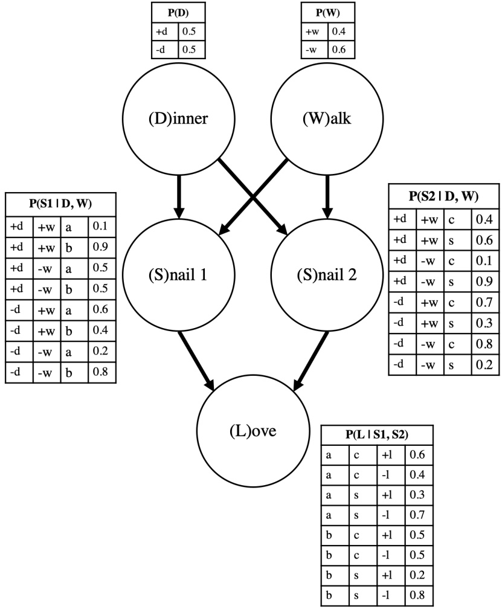

<table><tr><td colspan="4">P(S2 | D, W)</td></tr><tr><td>+d</td><td>+w</td><td>c</td><td>0.4</td></tr><tr><td>+d</td><td>+w</td><td>s</td><td>0.6</td></tr><tr><td>+d</td><td>-w</td><td>c</td><td>0.1</td></tr><tr><td>+d</td><td>-w</td><td>s</td><td>0.9</td></tr><tr><td>-d</td><td>+w</td><td>c</td><td>0.7</td></tr><tr><td>-d</td><td>+w</td><td>s</td><td>0.3</td></tr><tr><td>-d</td><td>-w</td><td>c</td><td>0.8</td></tr><tr><td>-d</td><td>-w</td><td>s</td><td>0.2</td></tr></table>

**(a)** [1 pt] What is the probability of an outcome $( S _ { 1 } = a , S _ { 2 } = c , D = - d , W = + w , L = + l )$ , the probability that Cuddles and Alex are on a date, where they share a poisonous mushroom, walk around the wonderful rocks and find love?

$$
\bigcirc 0. 5 * 0. 4 * 0. 7 * 0. 5 * 0. 4 \quad \bigcirc 0. 4 * 0. 6 * 0. 7 * 0. 5 * 0. 4 \quad \bullet 0. 6 * 0. 6 * 0. 7 * 0. 5 * 0. 4
$$

None of the above

$$
\begin{array}{l} P (a, c, - d, + w, + l) = P (+ l \mid a, c) * P (a \mid - d, + w) * P (c \mid - d, + w) * P (- d) * P (+ w) = 0. 6 * 0. 6 * 0. 7 * 0. 5 * 0. 4 = \\ 0. 0 5 0 4 \end{array}
$$

**(b)** [2 pts] Which of the following independence statements are guaranteed to be true by the Snail Bayes’ Net graph structure? 𝑆 1 ⫫ 𝑆 2 ∣ 𝐿 𝐷 ⫫ 𝑊 𝐷 ⫫ 𝑊 ∣ 𝐿 𝑆1 ⫫ 𝑆2 ∣ 𝐷, 𝑊 𝐿 ⫫ 𝑊 ∣ 𝑆1, 𝑆2 𝐷 ⫫ 𝑊 ∣ 𝑆1, 𝑆2

<!-- page: 21 -->

None of the above

We can use D-Separation Algorithm to check for independence guarantees

The date is about to start and people are making guesses for what’s going to happen. One TA notices how adorable it would be if the snails were Bubbles and Cuddles.

**(c)** If Bubbles and Cuddles are on the date, we want to compute the probability of them eating a beautiful flower and walking around the wonderful rocks.

**(i)** [1 pt] What is the equivalent expression for this probability?

$$
P (b, c, + d, + w)
$$

**(ii)** [1 pt] What minimal set of probability tables will we use in calculating this probability?

\# None of the above

We need all the conditional probability table containing $D , W , S _ { 1 } , S _ { 2 }$ on the unconditioned side, which are the first four. The last table is left out because 𝐿 is not part of the query and none of $D , W , S _ { 1 } , S _ { 2 }$ is conditioned on 𝐿

The snails are starving, so the date begins with a delightful dinner. The snails start sharing a mushroom as their dish of choice.

**(d)** Given their choice of dinner, what is $P ( S 1 \mid - d )$ , the belief over which snail is S1? Please answer in **decimal** numbers. You should not need a calculator.

$$
(1 \text {pt}) P (S _ {1} = a \mid D = - d) = \boxed {0. 3 6}
$$

$$
P (S 1 = a \mid - d) = \sum_ {w} P (a \mid - d, w) * P (w) = 0. 6 * 0. 4 + 0. 2 * 0. 6 = 0. 3 6.
$$

A late TA rushes in and is thrilled to see us around the aquarium. You see, he spent many hours befriending the little ones and immediately recognizes the second snail as Cuddles! Apparently, Cuddles is the ooziest and is easiest to identify.

**(e)** [1 pt] What is $P ( S _ { 1 } = b \mid S _ { 2 } = c , D = - d )$ , the probability that the first snail is Bubbles given that the second is Cuddles and they ate a mushroom?

$$
\bigcirc \frac {\sum_ {w} P (b | - d , w) * P (w) * P (c | - d , w) * P (w)}{P (c | - d)}
$$

$$
\bigcirc \frac {\sum_ {w} P (b | - d , w) * P (w) * P (c | - d , w) * P (w)}{\sum_ {w} P (c | - d , w) * P (- d)}
$$

$$
\bigcirc \quad \frac {\sum_ {w} P (b | - d , w) * P (- d) * P (c | - d , w) * P (w)}{P (c)}
$$

● $\frac { \sum _ { w } P ( b | - d , w ) * P ( c | - d , w ) * P ( w ) } { P ( c | - d ) }$

\# None of the above

$$
P (b \mid c, - d) = \frac {P (b , c \mid - d)}{P (c \mid - d)} = \frac {\sum_ {w} P (b , c \mid - d , w) * P (w)}{P (c \mid - d)} = \frac {\sum_ {w} P (b \mid - d , w) * P (c \mid - d , w) * P (w)}{P (c \mid - d)} = \frac {0 . 4 * 0 . 7 * 0 . 4 + 0 . 8 * 0 . 8 * 0 . 6}{0 . 7 6} = 0. 6 5 2 6
$$

where we used 𝑆1 ⫫ $S 2 \mid D , W$ from part b) for the numerator.

<!-- page: 22 -->

**(f)** [2 pts] What is $P ( L = + l \mid S _ { 2 } = c , D = - d )$ , the probability that the snails will find love given that the second snail is Cuddles and they ate a mushroom?

$$
\square \frac {\sum_ {s _ {1}} P (+ l | c , s _ {1}) * P (- d | c) * P (s _ {1} | - d , c)}{P (c | - d)}
$$

$$
\square \frac {\sum_ {s _ {1}} P (+ l | c , s _ {1}) * P (c | - d) * P (s _ {1} | - d , c)}{P (- d | c)}
$$

$$
\sum_ {s _ {1}} P (+ l \mid c, s _ {1}) * P (s _ {1} \mid - d, c)
$$

$$
\frac {\sum_ {s _ {1}} P (+ l , - d | c , s _ {1}) * P (s _ {1} | c)}{P (- d | c)}
$$

\# None of the above

$$
P (+ l \mid c, - d) = \frac {P (+ l , - d \mid c)}{P (- d \mid c)} = \frac {\sum_ {s _ {1}} P (+ l , - d \mid c , s _ {1}) * P \left(s _ {1} \mid c\right)}{P (- d \mid c)} = \frac {\sum_ {s _ {1}} P (+ l \mid c , s _ {1}) * P (- d \mid c , s _ {1}) * P \left(s _ {1} \mid c\right)}{P (- d \mid c)} = \frac {\sum_ {s _ {1}} P (+ l \mid c , s _ {1}) * P (- d \mid c) * P \left(s _ {1} \mid - d , c\right)}{P (- d \mid c)} =
$$

where we used 𝐿 ⫫ 𝑊 ∣ 𝑆1, 𝑆2 and the answer from part e).

The snails found love! We are now trying to find the probability that the other snail was Bubbles given all evidence so far, $P(b \mid c, -d, +l)$ . The TAs are tired of multiplying probabilities, so they instead try another way. The late TA actually wrote down memories of previous dates he has witnessed in a notebook. He can sample some of his memories from the notebook and help us learn probabilities.

**(g)** [1 pt] If the TA uses prior sampling, what is the probability of obtaining the sample $[ D = - d , W = + w , S _ { 1 } = b , S _ { 2 } =$ 𝑐, 𝐿 = −𝑙]?

$$
\bigcirc \quad 0. 5 * 0. 4 * 0. 6 * 0. 3 * 0. 2
$$

$$
\bigcirc \quad 0. 4 * 0. 4 * 0. 9 * 0. 2 * 0. 8
$$

0.6\*0.1\*0.7\*0.1\*0.2

$$
0. 5 * 0. 4 * 0. 4 * 0. 7 * 0. 5
$$

$$
\bigcirc \quad 0. 2 5 * 0. 2 4 * 0. 9 * 0. 1 * 0. 5
$$

$$
\bigcirc \quad 0. 4 * 0. 5 * 0. 2 4 * 0. 2 1 * 0. 2 5
$$

\# None of the above

Prior sampling samples without taking the evidence into account, so the probability of the sample is $P(-d)P(+w)P(b\mid$ $- d , + w ) P ( c \mid - d , + w ) P ( - l \mid b , c )$

**(h)** [1 pt] If the TA samples $[ D = - d , W = + w , S _ { 1 } = b , S _ { 2 } = c , L = - l ]$ , would rejection sampling discard the memory?

Yes No

Rejection sampling discards samples inconsistent with the evidence. In this case, −𝑙 is inconsistent with the fact that our snails did in fact find love.

**(i)** [1 pt] Assuming that the TA actually sampled using likelihood weighing and obtained $[ D = - d , W = + w , S _ { 1 } = b , S _ { 2 } =$ 𝑐, 𝐿 = +𝑙], what is the weight of this sample?

$$
\bigcirc \quad 0. 5 * 0. 5 * 0. 5
$$

$$
0. 5 * 0. 7 * 0. 5
$$

$$
\bigcirc \quad 0. 4 ^ {*} 0. 9 ^ {*} 0. 6
$$

$$
\bigcirc \quad 0. 5 * 0. 3 * 0. 5
$$

$$
\bigcirc \quad 0. 4 * 0. 2 4 * 0. 6
$$

$$
\bigcirc \quad 0. 6 * 0. 3 * 0. 6
$$

\# None of the above

The weight of a sample in likelihood weighing is the probability of the evidence given their parents: $P(-d)P(c \mid$ $- d , + w ) P ( + l \mid b , c )$

**(j)** [1 pt] Sampling using likelihood weighting will systematically underestimate the probability of a variable conditioned on

<!-- page: 23 -->

one of its ancestors.

\# Yes, because likelihood weighting does not sample all the variables, and thus creates a bias

\# Yes, but not for the reason above

No, because likelihood weighting is unbiased

\# No, but not for the reason above

Likelihood weighting is an unbiased sampling procedure.

**(k)** [2 pts] To estimate $P(b \mid c, -d, +l)$ , the TA samples five memories in a row:

$$
[ D = - d, W = + w, S _ {1} = b, S _ {2} = c, L = + l ],
$$

$$
[ D = - d, W = + w, S _ {1} = b, S _ {2} = c, L = + l ],
$$

$$
[ D = - d, W = + w, S _ {1} = a, S _ {2} = c, L = + l ],
$$

$$
[ D = - d, W = + w, S _ {1} = a, S _ {2} = c, L = + l ],
$$

$$
[ D = - d, W = + w, S _ {1} = b, S _ {2} = c, L = + l ].
$$

Could these memories have been generated using Gibbs sampling?

\# Yes, because all evidence variables are consistent with their values in the query $P(b \mid c, -d, +l)$

Yes, but the reason above is incorrect because there exist other samples sequences that fit the condition in the previous choice but cannot be generated by Gibbs sampling.

\# No, because the sequence of samples only differs by $S _ { 1 }$ , the query variable. The values of 𝑊 , a variable that is not part of the query, never changes throughout the sequence.

\# No, but the reason above is incorrect because there exist other samples sequences that fit the condition in the previous choice but cannot be generated by Gibbs sampling.

Since each neighboring sample differs by at most one variable value AND the evidence variables are not change, this sequence could be generated via Gibbs sampling, and thus eliminate choice 3 and 4. [0->1: no change, 1->2: no change, 2->3: only changes $$S _ { 1 } , 3 { \scriptstyle - > } 4 { \scriptstyle : }$$ no change, 4->5: no change]

But choice one "all evidence variables are consistent with their values in the query $P(b \mid c, -d, +l)$ is insufficient, because the following sequence fits the condition, yet cannot be generated by Gibbs Sampling:

$$
[ D = - d, W = + w, S _ {1} = b, S _ {2} = c, L = + l ],
$$

$$
[ D = - d, W = - w, S _ {1} = a, S _ {2} = c, L = + l ],
$$

$$
[ D = - d, W = - w, S _ {1} = b, S _ {2} = c, L = + l ].
$$

Because 0->1: changes both 𝑊 and $S _ { 1 }$

Just a quick note about choice 3: it is totally possible that when it is $W ^ { \prime } \mathrm { s }$ turn to be re-sampled from 𝑃 (𝑊 |everything else), the result just so happens to remain +𝑤 all times, throughout the process of the 5 consecutive samples.

<!-- page: 24 -->

## Q6. [11 pts] We Are Getting Close...

The CS 188 TAs have built an autonomous vehicle, and it’s finally on the street! Approaching a crossroad, our vehicle must avoid bumping into pedestrians. However, how close are we?

X is the signal received from sensors on our vehicle. We have a estimation model E, which estimates the current distance of any object in our view. Our vehicle also needs a model to detect objects and label their classes as one of {pedestrian, stop sign, road, other}. The TAs trained a detection model D that does the above and with a simple classification, outputs one of {no pedestrian, pedestrian on the road, pedestrian beside the stop sign}. Our vehicle has a control operator C, which determines the velocity by changing the acceleration.

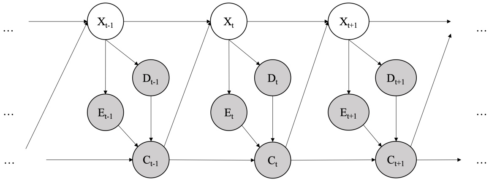

**(a)** [5 pts] For the above Dynamic Bayes Net, complete the equations for performing updates. (Hint: think about the prediction update and observation update equations in the forward algorithm for HMMs.)

Time elapse: $\begin{array} { r } { \mathrm { ~ \underline { { ~ \mathbf ~ { ~ ( i ) ~ } ~ } ~ } ~ } = \mathrm { ~ \underline { { ~ \mathbf ~ { ~ ( i i ) ~ } ~ } ~ } ~ } \mathrm { ~ \underline { { ~ \mathbf ~ { ~ ( i i i ) ~ } ~ } ~ } ~ } \mathrm { ~ \underline { { ~ \mathbf ~ { ~ ( i v ) ~ } ~ } ~ } ~ } P \left( x _ { t - 1 } | e _ { 0 : t - 1 } , d _ { 0 : t - 1 } , c _ { 0 : t - 1 } \right) } \end{array}$

$$
\text {i)} \quad \bigcirc P (x _ {t}) \quad \bullet P \left(x _ {t} | e _ {0: t - 1}, d _ {0: t - 1}, c _ {0: t - 1}\right) \quad \bigcirc P \left(e _ {t}, d _ {t}, c _ {t} | e _ {0: t - 1}, d _ {0: t - 1}, c _ {0: t - 1}\right)
$$

$$
P (c _ {0: t - 1})
$$

$$
P (e _ {0: t}, d _ {0: t}, c _ {0: t})
$$

**(iii)** $\Sigma _ { x _ { t - 1 } } \quad \bigcirc \quad \Sigma _ { x _ { t } }$ $\begin{array} { r l } { \operatorname* { m a x } _ { x _ { t - 1 } } } & { { } \mathrm { ~ \textcircled { ~ } ~ } \operatorname* { m a x } _ { x _ { t } } } \end{array}$ # 1

$$
P (x _ {t - 1} | x _ {t - 2})
$$

$$
P (x _ {t - 1}, x _ {t - 2})
$$

$$
P (x _ {t} | x _ {t - 1})
$$

$$
P (x _ {t}, x _ {t - 1})
$$

$$
P (x _ {t} | x _ {t - 1}, c _ {t - 1})
$$

$$
P (x _ {t}, x _ {t - 1}, c _ {t - 1})
$$

Recall the prediction update of forward algorithm: $P ( x _ { t } | o _ { 0 : t - 1 } ) = \Sigma _ { x _ { t - 1 } } P ( x _ { t } | x _ { t - 1 } ) P \left( x _ { t - 1 } | o _ { 0 : t - 1 } \right)$ , where o is the observation. Here it is similar, despite that there are several observations at each time, which means $o _ { t }$ corresponds to $e _ { t } , d _ { t } , c _ { t }$ for each t, and that X is dependent on the C value of the previous time, so we need $P ( x _ { t } | x _ { t - 1 } , c _ { t - 1 } )$ instead of $P ( x _ { t } | x _ { t - 1 } )$ Also note that 𝑋 is independent of $D _ { t - 1 } , E _ { t - 1 }$ given $C _ { t - 1 } , X _ { t - 1 }$

Update to incorporate new evidence at time 𝑡:

$$
\bigcirc \left(P \left(c _ {t} | c _ {0: t - 1}\right)\right) ^ {- 1}
$$

$$
\bigcirc \left(P \left(e _ {0: t - 1}, d _ {0: t - 1}, c _ {0: t - 1} | e _ {t}, d _ {t}, c _ {t}\right)\right) ^ {- 1}
$$

$$
\text {Vi} \quad \bigcirc \Sigma_ {x _ {t - 1}} \quad \bigcirc \Sigma_ {x _ {t}} \quad \bigcirc \Sigma_ {x _ {t - 1}, x _ {t}} \quad \bigcirc \max _ {x _ {t - 1}} \quad \bigcirc \max _ {x _ {t}} \quad \bullet 1
$$

$$
\square P (x _ {t} | e _ {t}, d _ {t}, c _ {t}, c _ {t - 1})
$$

$$
\square P (x _ {t}, e _ {t}, d _ {t}, c _ {t}, c _ {t - 1})
$$

$$
P (e _ {t}, d _ {t} | x _ {t}) P (c _ {t} | e _ {t}, d _ {t}, c _ {t - 1})
$$

Recall the observation update of forward algorithm: $P ( x _ { t } | o _ { 0 : t } ) \propto P ( x _ { t } , o _ { t } | o _ { 0 : t - 1 } ) = P ( o _ { t } | x _ { t } ) P ( x _ { t } | o _ { 0 : t - 1 } ) .$

Here the observations $o _ { t }$ corresponds to $e _ { t } , d _ { t } , c _ { t }$ for each t. Apply the Chain Rule, we are having

$$
P \left(x _ {t} | e _ {0: t}, d _ {0: t}, c _ {0: t}\right) \propto P \left(x _ {t}, e _ {t}, d _ {t}, c _ {t} | e _ {0: t - 1}, d _ {0: t - 1}, c _ {0: t - 1}\right) = P (e _ {t}, d _ {t}, c _ {t} | x _ {t}, c _ {t - 1}) P (x _ {t} | e _ {0: t - 1}, d _ {0: t - 1}, c _ {0: t - 1})
$$

<!-- page: 25 -->

$$
= P (e _ {t}, d _ {t} | x _ {t}) P (c _ {t} | e _ {t}, d _ {t}, c _ {t - 1}) P (x _ {t} | e _ {0: t - 1}, d _ {0: t - 1}, c _ {0: t - 1}).
$$

Note that in $P ( e _ { t } , d _ { t } , c _ { t } | x _ { t } , c _ { t - 1 } ) ,$ we cannot omit $c _ { t - 1 }$ due to the arrow between $c _ { t }$ and $c _ { t - 1 }$

To calculate the normalizing constant, use Bayes Rule: $\begin{array} { r } { P \left( x _ { t } | e _ { 0 : t } , d _ { 0 : t } , c _ { 0 : t } \right) = \frac { P \left( x _ { t } , e _ { t } , d _ { t } , c _ { t } | e _ { 0 : t - 1 } , d _ { 0 : t - 1 } , c _ { 0 : t - 1 } \right) } { P \left( e _ { t } , d _ { t } , c _ { t } | e _ { 0 : t - 1 } , d _ { 0 : t - 1 } , c _ { 0 : t - 1 } \right) } } \end{array}$

**(viii)** Suppose we want to do the above updates in one step and use normalization to reduce computation. Select all the terms that are <u>not explicitly calculated</u> in this implementation.

DO **NOT** include the choices if their values are 1.

□ **(ii)**

□ **(iii)**

□ **(iv)**

(v)

□ **(vi)**

□ **(vii)**

None of the above

**(v)** is a constant, so we don’t calculate it during implementation and simply do a normalization instead. Everything else is necessary.

**(b)** Suppose X outputs 1024 × 1024 greyscale images and our vehicle stays stationary. As before, E includes precise estimation of the distance between our vehicle and the pedestrian evaluated from outputs of X. Unfortunately, a power outage happened, and before the power is restored, E will not be available for our vehicle. But we still have the detection model D, which outputs one of {no pedestrian, pedestrian on the road, pedestrian beside the stop sign} for each state.

**(i)** [1 pt] During the power outage, it is best to

\# do particle filtering because the particles are easier to track for D than for both D and E

do particle filtering because of memory constraints

\# do particle filtering, but not for the reasons above

\# do exact inference because it saves computation

\# do exact inference, but not for the reason above

E is unavailable and C does not change its value since our vehicle stays stationary, so we only considers X and D. Although D has only 3 possible values, X is huge and it is impossible to store the belief distribution.

**(ii)** [1 pt] The power outage was longer than expected. As the sensor outputs of X have degraded to 2 × 2 binary images, it is best to

\# do particle filtering because the particles are easier to track for D than for both D and E

\# do particle filtering because of memory constraints

\# do particle filtering, but not for the reasons above

\# do exact inference because it saves computation

do exact inference, but not for the reason above

In this case we do not have the "X is huge" problem in **(i)**, and we can do exact inference, which is always more accurate than particle filtering and thus more favorable in this setting.

**(iii)** [1 pt] After power is restored and we have E, it is reasonable to

do particle filtering because of memory constraints

\# do particle filtering, but not for the reason above

\# do exact inference because E gives more valuable information than D

\# do exact inference because it’s impractical to do particle filtering for E

\# do exact inference, but not for the reasons above

The belief distribution is too big to store in memory.

<!-- page: 26 -->

**(c)** Now we formulate the Dynamic Bayes Net for this question into a non-deterministic two-player game (analogous to MDP in single-player setting). Each state $S = ( X , E , D )$

There are 2 agents in the game: our vehicle (with action set A), and a pedestrian (with action set B). **The vehicle and the pedestrian take turns to perform their actions**.

The TAs implemented 3 modes for the autonomous vehicle to act in the same space with the kind pedestrian, the confused pedestrian, and the naughty pedestrian. In each round of testing, a TA will be the pedestrian, and one of the modes will be tested. The vehicle and the pedestrian are both in the corresponding mode.

Below, $Q _ { v } ^ { * }$ is the Q-function for the autonomous vehicle. For each subquestion, given the standard notation for an MDP, select the expression $f _ { n }$ that would complete the blank part of the Q-Value Iteration under the specified formulation.

$$
Q _ {v} ^ {*} (s, a) = \sum_ {s ^ {\prime}} T (s, a, s ^ {\prime}) [ R (s, a, s ^ {\prime}) + \gamma \underline {{\quad}} ]
$$

$$
f _ {1} = \sum_ {b \in B} \sum_ {s ^ {\prime \prime}} \left(T \left(s ^ {\prime}, b, s ^ {\prime \prime}\right) \left[ R \left(s ^ {\prime}, b, s ^ {\prime \prime}\right) + \gamma \max _ {a ^ {\prime} \in A} Q _ {v} ^ {*} \left(s ^ {\prime \prime}, a ^ {\prime}\right) \right]\right)
$$

$$
f _ {2} = \max _ {b \in B} \sum_ {s ^ {\prime \prime}} \left(T \left(s ^ {\prime}, b, s ^ {\prime \prime}\right) \left[ R \left(s ^ {\prime}, b, s ^ {\prime \prime}\right) + \gamma \max _ {a ^ {\prime} \in A} Q _ {v} ^ {*} \left(s ^ {\prime \prime}, a ^ {\prime}\right) \right]\right)
$$

$$
f _ {3} = \min _ {b \in B} \sum_ {s ^ {\prime \prime}} \left(T \left(s ^ {\prime}, b, s ^ {\prime \prime}\right) \left[ R \left(s ^ {\prime}, b, s ^ {\prime \prime}\right) + \gamma \max _ {a ^ {\prime} \in A} Q _ {v} ^ {*} \left(s ^ {\prime \prime}, a ^ {\prime}\right) \right]\right)
$$

$$
f _ {4} = \sum_ {b \in B} \sum_ {s ^ {\prime \prime}} \left(T \left(s ^ {\prime}, b, s ^ {\prime \prime}\right) \left[ R \left(s ^ {\prime}, b, s ^ {\prime \prime}\right) + \gamma \frac {1}{| B |} \max _ {a ^ {\prime} \in A} Q _ {v} ^ {*} \left(s ^ {\prime \prime}, a ^ {\prime}\right) \right]\right)
$$

$$
f _ {5} = \max _ {a ^ {\prime} \in A} Q _ {v} ^ {*} \left(s ^ {\prime}, a ^ {\prime}\right)
$$

$$
f _ {6} = \min _ {a ^ {\prime} \in A} Q _ {v} ^ {*} \left(s ^ {\prime}, a ^ {\prime}\right)
$$

$$
f _ {7} = \frac {1}{| A |} \sum_ {a ^ {\prime} \in A} Q _ {v} ^ {*} \left(s ^ {\prime}, a ^ {\prime}\right)
$$

**(i)** [1 pt] The kind pedestrian that acts friendly, maximizing the vehicle’s utility.

$\coprod f _ { 1 } \quad \boxed { \quad } \quad f _ { 2 } \quad \boxed { \quad } \quad f _ { 3 } \quad \boxed { \quad } \quad f _ { 4 } \quad \boxed { \quad } \quad f _ { 5 } \quad \boxed { \quad } \quad f _ { 6 } \quad \boxed { \quad } \quad f _ { 7 } \quad \boxed { \quad }$ None of the above

**(ii)** [1 pt] The confused pedestrian that acts randomly. $\coprod _ { \circ } ^ { \prime } f _ { 1 } ^ { \prime } \ \coprod f _ { 2 } ^ { \prime } \ \coprod f _ { 3 } ^ { \prime } \ \coprod f _ { 4 } ^ { \prime } \ \ \ \ \ \ \ \ \ \ \ \ \ \ \ \ \ \ \ \ \ \ \square \ \ \ \coprod f _ { 6 } ^ { \prime } \ \ \coprod f _ { 7 } ^ { \prime }$ # None of the above

**(iii)** [1 pt] The naughty pedestrian that performs adversarial actions, minimizing the vehicle’s utility.

$\coprod f_{1} \quad \coprod f_{2} \quad \boxed{\quad} f_{3} \quad \coprod f_{4} \quad \coprod f_{5} \quad \coprod f_{6} \quad \coprod f_{7} \quad \bigcirc$ None of the above

Recall the q-value iteration formula: $\begin{array} { r } { Q _ { k + 1 } ( s , a ) \leftarrow \sum _ { s ^ { \prime } } T \left( s , a , s ^ { \prime } \right) \big [ R \left( s , a , s ^ { \prime } \right) + \gamma \operatorname* { m a x } _ { a ^ { \prime } } Q _ { k } \left( s ^ { \prime } , a ^ { \prime } \right) \big ] . } \end{array}$

Here it is similar, but in addition to the vehicle, there’s also a pedestrian taking actions from a different set, so we need to do something similar for the pedestrian, as in $f _ { 1 } , f _ { 2 } , f _ { 3 } , f _ { 4 } .$ That is, instead of using the maximum $Q _ { v }$ right away, we substitute that with the q-value iteration formula for the pedestrian with respect to $Q _ { v }$

The value of this formula is maximized (as in $f _ { 2 } )$ in the case of the kind pedestrian,

minimized (as in $f _ { 3 } )$ in the case of the naughty pedestrian,

and averaged in the case of the naughty pedestrian, which would be

$$
\frac {1}{| B |} \sum_ {b \in B} \sum_ {s ^ {\prime \prime}} \left(T \left(s ^ {\prime}, b, s ^ {\prime \prime}\right) \left[ R \left(s ^ {\prime}, b, s ^ {\prime \prime}\right) + \gamma \max _ {a ^ {\prime} \in A} Q _ {v} ^ {*} \left(s ^ {\prime \prime}, a ^ {\prime}\right) \right]\right).
$$

Hence $f _ { 1 }$ and $f _ { 4 }$ are incorrect. Since the pedestrian is acting completely randomly, we can include the pedestrian in the transition dynamics and just use regular q-value iteration, which is $f _ { 5 }$

<!-- page: 27 -->

## Q7. [10 pts] Generating and classifying text

In this question, we are interested in modelling sentences. Assume each sentence is represented using a bag-of-words (i.e. a vector which contains counts for each word in a sentence). We are interested in classifying whether a sentence (represented as a bag of words 𝑋) is a positive-sounding (class 𝐶 = 1) or negative-sounding (𝐶 = −1) sentence. $X _ { 1 } , X _ { 2 } , . . . X _ { p }$ represent the entries for individual words in the bag-of-words representation 𝑋.

**(a)** In this question, we are interested in the basics of Naive Bayes and logistic regression.

**(i)** [1 pt] Which of these are modelled **explicitly** in Naive Bayes? Select all that apply. 𝑃 (𝐶|𝑋) 𝑃 (𝑋|𝐶) 𝑃 (𝐶) None of the above

**(ii)** [1 pt] Which of these decompositions reflect the naive assumption in Naive Bayes?

$P ( C ) = P ( C _ { 1 } ) \cdot P ( C _ { 2 } )$

$$
P (X | C) = P (X _ {1} | C) \cdot P (X _ {2} | C) \cdot P (X _ {3} | C) \cdot P (X _ {4} | C) \cdot \dots
$$

$P ( X ) = P ( X _ { 1 } ) \cdot P ( X _ { 2 } | X _ { 1 } ) \cdot P ( X _ { 3 } | X _ { 2 } , X _ { 1 } ) . .$

$\textstyle P ( X _ { 1 } ) = ( P ( X _ { 1 } ) + 1 ) / ( \sum _ { x _ { i } } P ( X _ { i } ) )$

#The naive assumption is that each feature is independent of all other features given the class label. That is, $X _ { i } \mathrm { s }$ are conditionally independent given C, which is reflected in the second choice.

**(iii)** [1 pt] Which of these are modelled directly in Logistic Regression? Select all that apply.

𝑃 (𝐶|𝑋) 𝑃 (𝑋|𝐶) 𝑃 (𝐶) 𝑃 (𝑋) # None of the above

**(b)** In this part, we will consider different scenarios about the data we have.

**(i)** [1 pt] Assume we only have two points in our training dataset which are linearly separable using the feature $X _ { 1 }$ Which of the following methods will be able to achieve zero training error? Select all that apply. Naive Bayes Bayes classifier (i.e. naive bayes with no naive assumption) Logistic Regression Perceptron A very large neural network with many nonlinearities None of the above

**(ii)** [1 pt] Assume we now have a very large training dataset which is not linearly separable using any individual variable, but is separable given $X _ { 1 } \cdot X _ { 2 }$ . Which of the following methods will be able to achieve zero training error (without augmenting the data set with additional features)? Select all that apply.

Naive Bayes

□ Logistic Regression

■ Bayes classifier (i.e. naive bayes with no naive assumption)

□ Perceptron (with no softmax on the output)

■ A very large neural network with many nonlinearities

\# None of the above

Bayes classifier is able to model $P ( X _ { 1 } , X _ { 2 } )$ , which lets us classify correctly. A neural network is able to model the interaction between 𝑋1 and $X _ { 2 }$

**(iii)** [1 pt] Now assume that the true dataset is linearly separable but our training set has a single mis-labeled data point. Which of the following are true? Select all that apply.

□ Logistic regression may output probabilities greater than 1

<!-- page: 28 -->

■ Perceptron (with no softmax on the output) may not converge

\# None of the above

Perceptron updates may continue to oscillate due to the misclassified outlier.

**(iv)** [1 pt] Assume we initially have a model trained on a very large dataset with the same number of positive and negative examples. Then, we duplicate all the positive examples in our training set and re-add them (resulting in a training set 1.5 times the size of the original training set). We then train a second model on the new training set. Which of the following is true? Select all that apply.

■ In logistic regression, $P ( C = 1 | X )$ will generally be higher for the retrained model than the original model

□ In naive bayes, 𝑃 (𝑋 = 𝑥|𝐶 = 1) will be higher for some 𝑥 for the retrained model than the original model

■ In naive bayes, 𝑃 (𝐶 = 1) will generally be higher for the retrained model than the original model

□ In naive bayes, 𝑃 (𝑋 = 1) will generally to be higher for the retrained model than the original model

\# None of the above

Duplicating all the positive samples does not change the distribution of X given that the example is positive.

**(c)** We are now interested in generating text (still in the form of bag-of-words) from each of our classes.

**(i)** [1 pt] If we have already fit naive bayes for text classification, which distribution can we use to generate text for the positive class? # 𝑃 (𝐶) # 𝑃 (𝑋) 𝑃 (𝑋|𝐶) # 𝑃 (𝐶|𝑋) # None of the above

**(ii)** [1 pt] Assuming we have an infinite amount of data, which of the following modeling assumption is generally able to more accurately model the true distribution of 𝑃 (𝑋) (and thus to generate more realistic bag-of-words sentences)? $\begin{array} { r } { \mathrm { ~  ~ \bigcirc ~ } ~ P ( X ) = P ( X _ { 1 } ) \cdot P ( X _ { 2 } ) \cdot P ( X _ { 3 } ) \cdot P ( X _ { 4 } ) \cdot \dots } \end{array}$ $P ( X ) = P ( X _ { 1 } ) \cdot P ( X _ { 2 } | X _ { 1 } ) \cdot P ( X _ { 3 } | X _ { 2 } , X _ { 1 } ) \cdot$ ... # They are the same

**(iii)** [1 pt] Which of the following will best help us generate text with words in the correct order?

\# Using Laplace smoothing

Predicting 𝑃 (𝑋|𝐶) using a neural network

Changing the representation of the text (to use something other than bag-of-words)

\# None of the above

Regardless of the model, bag of words cannot represent the order of words.

<!-- page: 29 -->

## Q8. [16 pts] Deep “Blackjack”

To celebrate the end of the semester, you visit Las Vegas and decide to play a good, old fashioned game of “Blackjack”!

Recall that the game has states $\scriptstyle 0 , 1 , \ldots , 8 ,$ corresponding to dollar amounts, and a 𝐷𝑜𝑛𝑒 state where the game ends. The player starts with \$2, i.e. at state 2. The player has two actions: Stop (𝑎 = 0) and Roll $( a = 1 )$ , and is forced to take the Stop action at states 0,1,and 8.

When the player takes the Stop action (𝑎 = 0), they transition to the 𝐷𝑜𝑛𝑒 state and receive reward equal to the amount of dollars of the state they transitioned from: e.g. taking the stop action at state 3 gives the player \$3. The game ends when the player transitions to 𝐷𝑜𝑛𝑒.

The Roll action (𝑎 = 1) is available from states 2-7. The player rolls a **biased** 6-sided die. If the player Rolls from state s and the die lands on outcome 𝑜, the player transitions to state $s + o - 2$ , as long as $s + o - 2 \leq 8$ (𝑠 is the amount of dollars of the current state, 𝑜 is the amount rolled, and the negative 2 is the price to roll). $\mathrm { I f } \; s + o - 2 > 8$ , the player busts, i.e. transitions to Done and does NOT receive reward.

As the bias of the dice **is unknown**, you decided to perform some good-old fashioned reinforcement learning (RL) to solve the game. However, unlike in the midterm, you have decided to flex and solve the game using approximate Q-learning. Not only that, you decided not to design any features - the features for the Q-value at $( s , a )$ will simply be the vector [𝑠 𝑎], where 𝑠 is the state and 𝑎 is the action.

**(a)** First, we will investigate how your choice of features impacts whether or not you can learn the optimal policy. Suppose the unique optimal policy in the MDP is the following:

| State | 2 | 3 | 4 | 5 | 6 | 7 |
| --- | --- | --- | --- | --- | --- | --- |
| 𝜋∗(𝑠) | Roll | Roll | Roll | Stop | Stop | Stop |

For each of the cases below, select “Possible with large neural net” if the policy can be expressed by using a large neural net to represent the Q-function using the features specified as input. (That is, the greedy policy with respect to some Q-function representable with a large neural network is the optimal policy: $Q ( s , \pi ^ { * } ( s ) )   >   Q ( s , a )$ for all states 𝑠 and actions 𝑎 ≠ $\pi ^ { * } ( s ) . )$ Select “Possible with weighted sum" if the policy can be expressed by using a weighted linear sum to represent the Q-function. Select “Not Possible” if expressing the policy with given features is impossible no matter the function.

**(i)** [1 pt] Suppose we decide to use the state 𝑠 and action 𝑎 as the features for $Q ( s , a )$

Possible with large neural network □ Possible with linear weighted sum of features # Not possible

A sufficiently large neural network could represent the true optimal 𝑄-function using this feature representation. The optimal 𝑄-function satisfies the desired property (there are no ties as the optimal policy is unique). Alternatively, a sufficiently large neural network could represent a function that is 1 for the optimal action in each state, and 0 otherwise, which also suffices.

No linear weighted sum of features can represent this optimal policy. To see this, let our linear weighted sum be $w _ { 0 } s$ + $w _ { 1 } a + w _ { 3 }$ . We need $Q ( 4 , 1 ) > Q ( 4 , 0 )$ and $Q ( 5 , 0 ) > Q ( 5 , 1 )$ . Plugging in the expression for Q, the former inequality requires that $w _ { 1 } > 0$ . The second inequality requires that $w _ { 1 } < 0$ , a contradiction. So we cannot represent the policy with a weighted sum of features.

**(ii)** [1 pt] Now suppose we decide to use $s + a$ as the feature for $Q ( s , a )$

Possible with large neural network □ Possible with linear weighted sum of features # Not possible

Indeed, it’s possible that no neural network can represent the optimal 𝑄-function with this feature representation, as 𝑄(4, 1) does not have to equal $Q ( 5 , 0 )$ However, the question is not asking about representing the optimal 𝑄-function, but instead the optimal policy, which merely requires that $Q ( s , 1 )   >   Q ( s , 0 )$ for $s \leq 4$ and $Q ( s , 0 )   >   Q ( s , 1 )$ for $s \geq 5$ This can be done with the feature representation. For example the neural network in part (d) can represent the following function (using $w _ { 0 } = - 5$ and $w _ { 1 } = - 2 )$ that represents the optimal policy:

Again, no linear weighted sum of features can represent this optimal policy. To see this, let our linear weighted sum be $w _ { 0 } s   +   w _ { 0 } a   +   w _ { 1 }$ . This is a special case of the linear weighted sums in part (i), which we know cannot represent the optimal policy.

<!-- page: 30 -->

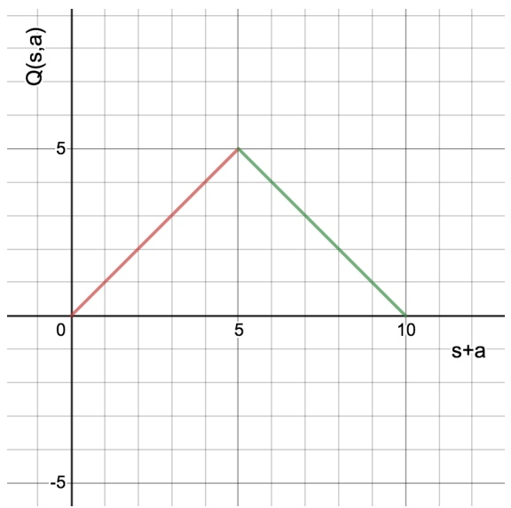

Figure 1: A Q-function from $s + a ,$ that represents the optimal policy.

**(iii)** [1 pt] Now suppose we decide to use 𝑎 as the feature for $Q ( s , a )$

□ Possible with large neural network □ Possible with linear weighted sum of features Not possible This isn’t possible, regardless of what function you use. With this representation, we will have $Q ( 4 , 1 ) = Q ( 5 , 1 )$ and $Q ( 4 , 0 ) = Q ( 5 , 0 )$ . So we cannot both have $Q ( 4 , 1 ) > Q ( 4 , 0 )$ and $Q ( 5 , 0 ) > Q ( 5 , 1 )$

**(iv)** [1 pt] Now suppose we decide to use sign(𝑠 − 4.5) ⋅ 𝑎 as the feature for $Q ( s , a )$ , where sign(𝑥) is −1 if $x < 0 ,$ 1 if $x > 0 ,$ and 0 if 𝑥 = 0.

■ Possible with large neural network ■ Possible with linear weighted sum of features # Not possible $Q ( s , a )   =   - \mathrm { s i g n } ( s   -   4 . 5 ) \cdot a$ is sufficient to represent the optimal policy, as we have $Q ( s , 0 )   =   0$ for all 𝑠, $Q ( s , 1 )   =$ $1 > Q ( s , 0 )$ for $s \leq 4$ , and $Q ( s , 1 ) = - 1 < Q ( s , 0 )$ for $s \geq 5$ . This is a linear function of the input, and so can also be represented using a neural network.

<!-- page: 31 -->

SID:

**(b)** [4 pts] Next, we investigate the effect of different neural network architectures on your ability to learn the optimal policy. Recall that our features for the Q-value at (𝑠, 𝑎) will simply be the vector [𝑠 𝑎], where 𝑠 is the state and 𝑎 is the action. In addition, suppose that the unique optimal policy is the following:

| State | 2 | 3 | 4 | 5 | 6 | 7 |
| --- | --- | --- | --- | --- | --- | --- |
| 𝜋∗(𝑠) | Roll | Roll | Roll | Stop | Stop | Stop |

Which of the following neural network architectures can express Q-values that represent the optimal policy? That is, the greedy policy with respect to some Q-function representable with the given neural network is the optimal policy: $Q ( s , \pi ^ { * } ( s ) ) > Q ( s , a )$ for all states 𝑠 and actions $a \neq \pi ^ { * } ( s )$ . Hint: Recall that $ReLU(x)=\begin{cases}x&x>0\\0&x\leq0\end{cases}$

Neural Network 1:

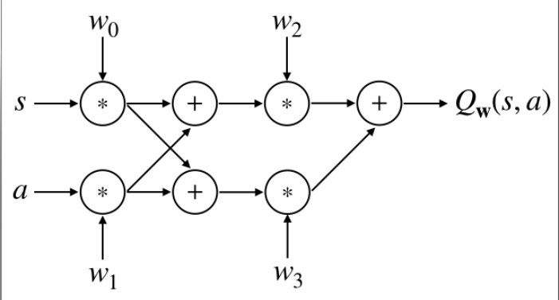

Neural Network 2:

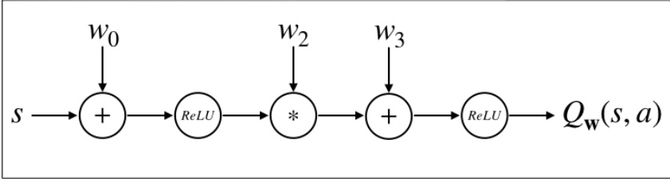

Neural Network 3:

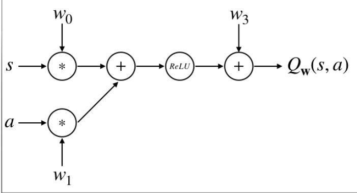

<!-- page: 32 -->

Neural Network 4:

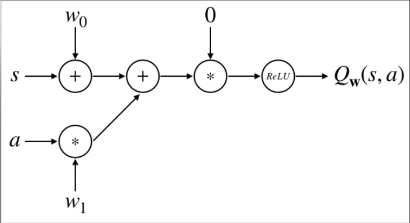

Neural Network 5:

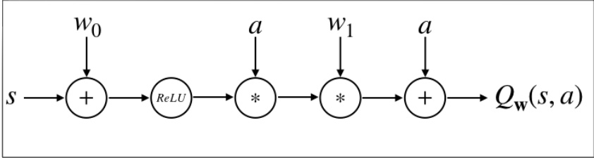

None of the above.

Recall from the previous question that no linear function of the features [𝑠 𝑎] can represent the optimal policy. So network 1, which is linear (as it has no activation function), cannot represent the optimal policy.

Network 2 cannot represent the optimal function, as it does not take as input the action. So $Q ( s , 0 ) = Q ( s , 1 )$ for all states 𝑠.

Network 3 cannot simultaneously satisfy $Q ( 4 , 0 )   <   Q ( 4 , 1 )$ and $Q ( 5 , 0 )   >   Q ( 5 , 1 )$ This is because the rectified linear unit is a monotonic function: if $\dot { 1 } x \geq y ,$ then $R e L U ( x ) \geq R e L U ( y )$ . Since we cannot represent the optimal policy using a linear function of $s , a ,$ we cannot represent it with a ReLU of a linear function of $s , a .$

Network 4 is always 0, so it cannot represent the (unique) optimal policy.

Network 5 can represent the optimal policy. For example, $w _ { 0 } = - 4 , w _ { 1 } = - 2$ represents the optimal policy.

**(c)** [1 pt] As with the linear approximate q-learning, you decide to minimize the squared error of the Bellman residual. Let $Q _ { \mathbf { w } } ( s , a )$ be the approximate 𝑄-values of $s , a$ . After taking action 𝑎 in state 𝑠 and transitioning to state $s ^ { \prime }$ with reward $r ,$ you first compute the target target $= r + \gamma \operatorname* { m a x } _ { a ^ { \prime } } Q _ { \mathbf { w } } ( s ^ { \prime } , a ^ { \prime } )$ . Then your loss is:

$$
\text {loss} (\mathbf {w}) = \frac {1}{2} \left(Q _ {\mathbf {w}} (s, a) - \text {target}\right) ^ {2}
$$

You then perform gradient descent to **minimize** this loss. Note that we will **not** take the gradient through the target - we treat it as a fixed value.

Which of the following updates represents one step of gradient descent on the weight parameter $w _ { i }$ with learning rate $\alpha \in ( 0 , 1 )$ after taking action 𝑎 in state 𝑠 and transitioning to state $s ^ { \prime }$ with reward $r ^ { \flat } { } _ { \bullet } ^ { \flat }$ [Hint: which of these is equivalent to the normal approximate Q-learning update when $Q _ { \mathbf { w } , } ( s , a ) = \mathbf { w } \cdot \mathbf { f } ( s , a ) ? ]$

$$
\bigcirc w _ {i} = w _ {i} + \alpha \left(Q _ {\mathbf {w}} (s, a) - \left(r + \gamma \max _ {a ^ {\prime}} Q _ {\mathbf {w}} (s ^ {\prime}, a ^ {\prime})\right)\right) \frac {\partial Q _ {\mathbf {w}} (s , a)}{\partial w _ {i}}
$$

$$
w _ {i} = w _ {i} - \alpha \left(Q _ {\mathbf {w}} (s, a) - \left(r + \gamma \max _ {a ^ {\prime}} Q _ {\mathbf {w}} (s ^ {\prime}, a ^ {\prime})\right)\right) \frac {\partial Q _ {\mathbf {w}} (s , a)}{\partial w _ {i}}
$$

$$
\bigcirc w _ {i} = w _ {i} + \alpha \left(Q _ {\mathbf {w}} (s, a) - \left(r + \gamma \max _ {a ^ {\prime}} Q _ {\mathbf {w}} (s ^ {\prime}, a ^ {\prime})\right)\right) s
$$

$$
\bigcirc w _ {i} = w _ {i} - \alpha \left(Q _ {\mathbf {w}} (s, a) - \left(r + \gamma \max _ {a ^ {\prime}} Q _ {\mathbf {w}} (s ^ {\prime}, a ^ {\prime})\right)\right) s
$$

None of the above.

**(d) and (e) are on the next page.**

<!-- page: 33 -->

Note that the gradient of the loss with respect to the parameter, via the chain rule, is:

$$
\left(Q _ {\mathbf {w}} (s, a) - \left(r + \gamma \max _ {a ^ {\prime}} Q _ {\mathbf {w}} (s ^ {\prime}, a ^ {\prime})\right)\right) \frac {\partial Q _ {\mathbf {w}} (s , a)}{\partial w _ {i}}
$$

The second option performs gradient descent, the first option is gradient ascent, and the other options compute the gradient incorrectly.

<!-- page: 34 -->

**(d)** While programming the neural network, you’re getting some bizarre errors. To debug these, you decide to calculate the gradients by hand and compare them to the result of your code.

Suppose your neural network is the following:

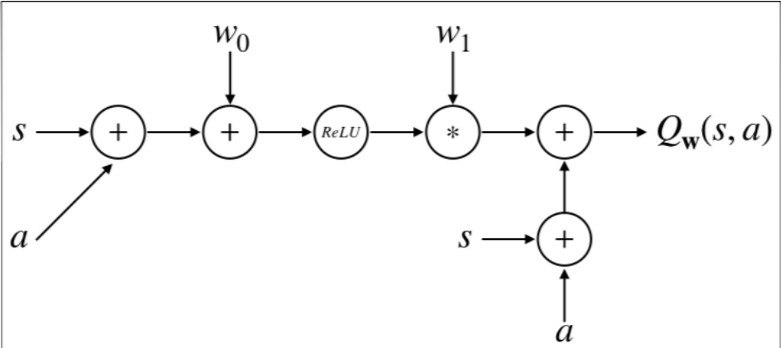

Figure 2: Neural Network 6

That is, $Q _ { \mathbf { w } } ( s , a ) = s + a + w _ { 1 } \; R e L U ( w _ { 0 } + s + a ) .$

You are able to recall that $\begin{array} { r } { \frac { d } { d x } R e L U ( x ) = \left\{ \begin{aligned} { 1 \quad x \geq 0 } \\ { 0 \quad x < 0 } \end{aligned} \right. . } \end{array}$

**(i)** [1 pt] Suppose $w _ { 0 } = - 4$ , and $w _ { 1 } = - 1$ . What is $Q _ { \mathbf { w } } ( 5 , 0 ) ?$

$$
Q _ {\mathrm{w}} (5, 0) = \boxed {4}
$$

Plugging in values, we get

$$
Q _ {\mathrm{w}} (5, 0) = 5 - R e L U (- 4 + 5) = 4.
$$

**(ii)** [2 pts] Suppose $w _ { 0 } = - 4 , \mathrm { a n d } \; w _ { 1 } = - 1$ . What is the gradient with respect to $w _ { 0 } ,$ evaluated at $s = 5 , a = 0 ?$

$$
\frac {\partial}{w _ {0}} Q _ {\mathbf {w}} (5, 0) = \left| \begin{array}{c c} & - 1 \end{array} \right|
$$

Since the input to the ReLU is positive, the gradient of the ReLU is 1. Applying the chain rule, we get that $\begin{array} { r l } { \frac { \partial } { w _ { 0 } } Q _ { \mathbf { w } } ( 5 , 0 ) = } \end{array}$ $w _ { 1 } = - 1$

**(iii)** [2 pts] Suppose $w _ { 0 } = - 4 , \mathrm { a n d } \; w _ { 1 } = - 1$ . What is the gradient with respect to $w _ { 0 } ,$ evaluated at $s = 3 , a = 0 ?$

$$
\frac {\partial}{w _ {0}} Q _ {\mathbf {w}} (3, 0) = \left| \begin{array}{c c} & 0 \end{array} \right|
$$

Since the input to the ReLU is negative, the gradient of the ReLU is 0. Applying the chain rule, the gradient with respect to $w _ { 0 }$ has to be 0.

**(e)** After picking a feature representation, neural network architecture, and update rule, as well as calculating the gradients, it’s time to turn to the age old question... will this even work?

**(i)** [1 pt] Without any other assumptions, is it guaranteed that your approximate 𝑄-values will converge to the optimal policy, if each $s , a$ pair is observed an infinite amount of times?

\# Yes No

**(ii)** [1 pt] Without any other assumptions, is it guaranteed that your approximate 𝑄-values will converge to the optimal policy, if each 𝑠, 𝑎 pair is observed an infinite amount of times and there exists some 𝑤 such that $Q _ { \mathbf { w } } ( s , a ) = Q ^ { * } ( s , a ) ?$ # Yes No

Note that there’s no guarantee that your neural network will converge in this case. For example, the learning rate can be too large! (As in the RL Blackjack question on midterm.)
