<!-- page: 1 -->

## CS 188 Introduction to Summer 2019Artificial Intelligence

• You have approximately 170 minutes.

• The exam is closed book, closed calculator, and closed notes except your two-page sheet of note.

• Mark your answers ON THE EXAM ITSELF. If you are not sure of your answer you may wish to provide a brief explanation. All short answer sections can be successfully answered in a few sentences AT MOST.

• For multiple choice questions,

–  means mark all options that apply

means mark a single choice

#– When selecting an answer, please fill in the bubble or square completely ( and )

| First name |  |
| --- | --- |
| Last name |  |
| SID |  |
| Student to your right |  |
| Student to your left |  |

## Your Discussion TA (fill in all that apply):

 Caryn (TTh 10:00 am Wheeler)

 Arin (TTh 10:00 am Dwinelle)

 Bobby (MW 3:00 pm)

 Benson (MW 4:00 pm)

 Mike (TTh 11:00 am)

 Did not attend any

For staff use only:

| Q1. They Hatin', Patrolling (Search Formulation) | /17 |
| --- | --- |
| Q2. Search | /17 |
| Q3. M-O-D-E Pruning | /19 |
| Q4. LQR | /15 |
| Q5. Approximate Q-Learning | /12 |
| Q6. Probability and Bayes Net Representation | /23 |
| Q7. Decode Your Terror (HMM) | /18 |
| Q8. Raisins Again (VPI) | /12 |
| Q9. Machine Learning: Potpourri | /19 |
| Q10. Perceptrons and Naive Bayes | /24 |
| Q11. Neural Network | /24 |
| Total | /200 |

<!-- page: 2 -->

<!-- page: 3 -->

# Q1. [17 pts] They Hatin’, Patrolling (Search Formulation)

Recall that in Midterm 1, Pacman bought a car, was speeding in Pac-City, and the police weren’t able to catch him. Now Pacman has run out of gas, his car has stopped, and he is currently hiding out at an undisclosed location.

In this problem, you are on the police side, tryin’ to catch Pacman!

There are still p police cars in the Pac-city of dimension m by n. In this problem, all police cars can move, with two distinct integer controls: throttle and steering, but Pacman has to stay stationary. Once one police car takes an action which lands him in the same grid as Pacman, Pacman will be arrested and the game ends.

Throttle: $t _ { i } \in \{ 1 , 0 , - 1 \}$ , corresponding to {Gas, Coast, Brake}. This controls the speed of the car by determining its acceleration. The integer chosen here will be added to his velocity for the next state. For example, if a police car is currently driving at 5 grid/s and chooses Gas (1) he will be traveling at 6 grid/s in the next turn. Steering: $s _ { i } \in \{ 1 , 0 , - 1 \}$ , corresponding to {Turn Left, Go Straight, Turn Right}. This controls the direction of the car. For example, if a police car is facing North and chooses Turn Left, it will be facing West in the next turn.

(a) Suppose you can only control 1 police car, and have absolutely no information about the remainder of $p - 1$ police cars, or where Pacman stopped to hide. Also, the police cars can travel up to 6 grid/s so $0 \leq v \leq 6$ at all times.

(i) [4 pts] What is the tightest upper bound on the size of state space, if your goal is to use search to plan a sequence of actions that guarantees Pacman is caught, no matter where Pacman is hiding, or what actions other police cars take. Please note that your state space representation must be able to represent all states in the search space.

(ii) [3 pts] What is the maximum branching factor? Your answer may contain integers, m, n.

(iii) [2 pts] Which algorithm(s) is/are guaranteed to return a path passing through all grid locations on the grid, if one exists?  Depth First Tree Search  Breadth First Tree Search  Depth First Graph Search  Breadth First Graph Search

(iv) [2 pts] Is Breadth First Graph Search guaranteed to return the path with the shortest number of time steps, if one exists? # Yes # No

(b) Now let’s suppose you can control all p police cars at the same time (and know all their locations), but you still have no information about where Pacman stopped to hide

(i) [3 pts] Now, you still want to search a sequence of actions such that the paths of p police car combined pass through all m ∗ n grid locations. Suppose the size of the state space in part (a) was $N _ { 1 }$ , and the size of the state space in this part is $N _ { p } .$ Please select the correct relationship between $N _ { p }$ and $N _ { 1 }$ # $N _ { p } = p * N _ { 1 }$ # $N _ { p } = p ^ { N _ { 1 } }$ # $N _ { p } = ( N _ { 1 } ) ^ { p }$ # None of the above

(ii) [3 pts] Suppose the maximum branching factor in part (a) was $b _ { 1 }$ , and the maximum branching factor in this part is $b _ { p }$ . Please select the correct relationship between $b _ { p }$ and $b _ { 1 }$ # $b _ { p } = p * b _ { 1 }$ # $b _ { p } = p ^ { b _ { 1 } }$ # $b _ { p } = ( b _ { 1 } ) ^ { p }$ # None of the above

<!-- page: 4 -->

## Q2. [17 pts] Search

For this problem, assume that all of our search algorithms use tree search, unless specified otherwise.

(a) For each algorithm below, indicate whether the path returned after the modification to the search tree is guaranteed to be identical to the unmodified algorithm. Assume all edge weights are non-negative before modifications.

(i) [3 pts] Adding additional cost $c > 0$ to every edge weight.

|  | Yes | No |
| --- | --- | --- |
| BFS | ○ | ○ |
| DFS | ○ | ○ |
| UCS | ○ | ○ |

(ii) [3 pts] Multiplying a constant $w > 0$ to every edge weight.

|  | Yes | No |
| --- | --- | --- |
| BFS | ○ | ○ |
| DFS | ○ | ○ |
| UCS | ○ | ○ |

(b) For part (b), two search algorithms are defined to be equivalent if and only if they expand the same states in the same order and return the same path. Assume all graphs are directed and acyclic.

(i) [3 pts] Assume we have access to costs $c _ { i j }$ that make running UCS algorithm with these costs $c _ { i j }$ equivalent to running BFS. How can we construct new costs $c _ { i j } ^ { \prime }$ such that running UCS with these costs is equivalent to running DFS? Mark all correct choices. # $\begin{aligned} &c_{ij}^{\prime} = 0 \\&c_{ij}^{\prime} = -c_{ij}\\ \end{aligned}$ $\begin{array} { r l } { \bigcirc } & { { } ~ c _ { i j } ^ { \prime } = 1 } \\ { \bigcirc } & { { } ~ c _ { i j } ^ { \prime } = c _ { i j } + \alpha } \end{array}$ # c<sup>0</sup>ij = <sup>c</sup>ij # # Not possible

(ii) [3 pts] Given edge weight $c _ { i j }   =   h ( j )   -   h ( i )$ , where $h ( n )$ is the value of the heuristic function at node n, running UCS on this graph is equivalent to running which of the following algorithm(s) on the same graph? Select all correct answers. # DFS # BFS # Iterative Deepening # Greedy # A\* # None of the above.

<!-- page: 5 -->

SID:

(c) Consider the following graph. $h ( n )$ denotes the heuristic function evaluated at node n.

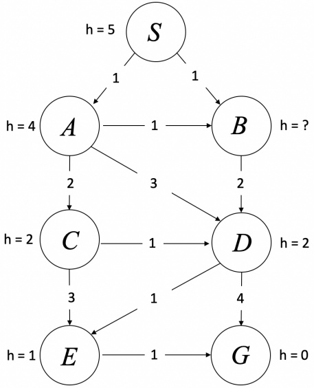

(i) [2 pts] Given that G is the goal node, and heuristic values are fixed for all nodes other than $B ,$ for which values of $h ( B )$ will $\mathrm { A } ^ { * }$ tree search be guaranteed to return the optimal path? Fill in the lower and upper bounds or select “impossible.”

$$
\leq h (B) \leq
$$

\# Impossible

(ii) [3 pts] With the heuristic values fixed for all nodes other than $B ,$ for which values of $h ( B )$ will $\mathrm { A } ^ { * }$ graph search be guaranteed to return the optimal path? Either fill in the lower and upper bound or select “impossible.”

$$
\leq h (B) \leq
$$

\# Impossible

<!-- page: 6 -->

## Q3. [19 pts] M-O-D-E Pruning

For all parts of this question, write your final answer in the small box, but we encourage you to show relevant work in the big box. A correct final answer is sufficient for full credit.

NOTE: In the pruning process, we are only concerned about returning the correct value of the root node.

(a) Minimax Tree Pruning

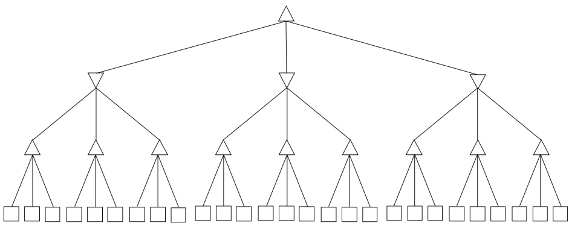

Figure 1: Minimax Tree with $b = 3 , d = 3$

Suppose we have a complete minimax tree (with exactly 1 maximizer and 1 minimizer, alternating), where all nodes have branching factor b, and d total layers (an extra layer of maximizer is added, if d is not even)

(i) [2 pts] In the case of b = 3, d = 3, what is the total number of value nodes (denoted by squares at the lowest layer)? Your final answer should be an integer.

Answer:

(ii) [3 pts] In the case of $b = 3 , d = 3 ,$ what is the maximum total number of value nodes whose value is never explored because an upstream branch is pruned in one single set of values for the values nodes. Your final answer should be an integer.

Answer:

(iii) [3 pts] Now we are changing the branching factor b, keeping d = 3. In the case of b = 5, d = 3, what is the maximum total number of value nodes whose value is never explored because an upstream branch is pruned in one single set of values for the value nodes. Your final answer should be an integer.

Answer:

<!-- page: 7 -->

## (b) Mode Tree Pruning

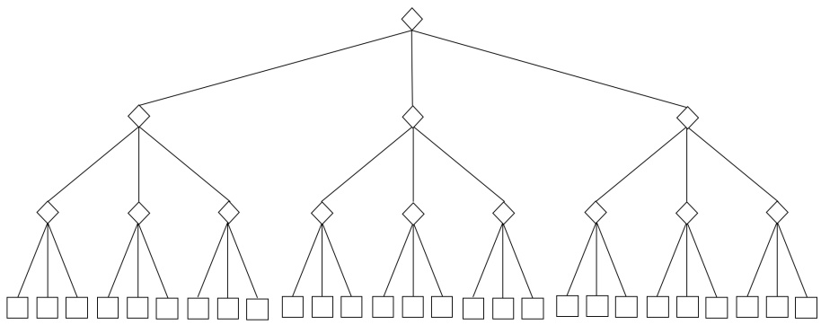

Figure 2: Mode Tree with $b = 3 , d = 3$

We all know $\alpha { - } \beta$ pruning on minimax tree reduces the number of nodes explored to minimum, but what if we change all the maximizer and minimizer nodes to mode nodes (symbolized by spades in the diagram), where mode value (most frequent value) among the child nodes will be selected?

Important: Please note that, just like in $\alpha - \beta$ pruning, a child node $n _ { c }$ can be pruned when its parent node $n _ { p }$ are absolutely sure that the value of $n _ { c }$ will have no influence on the final value of the root node.

(i) [3 pts] In the case of $b = 3 , d = 3 ,$ what is the maximum total number of value nodes whose value is never explored because an upstream branch is pruned in one single set of values for the values nodes. Your final answer should be an integer.

Answer:

(ii) [4 pts] Now we are changing the branching factor b, keeping $d = 3$ . In the case of $b = 5 , d = 3 ,$ what is the maximum total number of value nodes whose value is never explored because an upstream branch is pruned in one single set of values for the values nodes. Your final answer should be an integer.

Answer:

<!-- page: 8 -->

(iii) [4 pts] Now we are changing the depth d, keeping $b = 3 .$ In the case of $b = 3 , d = 4 ,$ what is the maximum total number of value nodes whose value is never explored because an upstream branch is pruned in one single set of values for the values nodes. Your final answer should be an integer.

Answer:

<!-- page: 9 -->

```perl
$\pi_{t+1}^*(s) =$
```

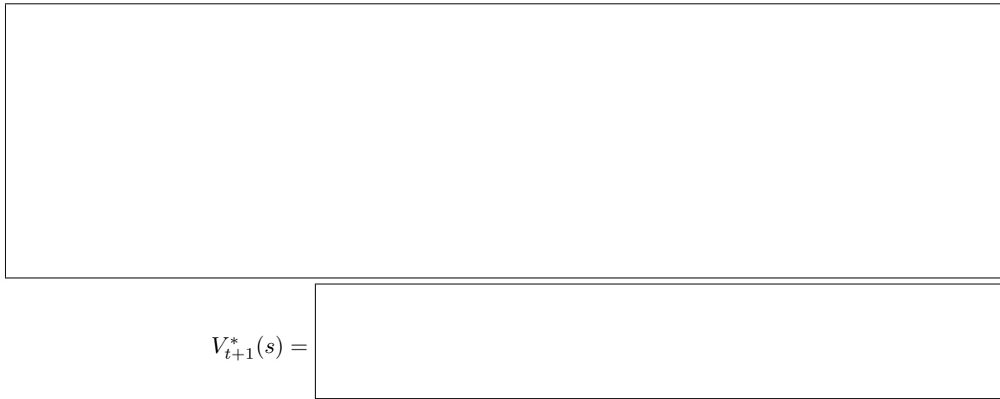

SID:

## Q4. [15 pts] LQR

For all parts of this question, write your final answer in the small box, but we encourage you to show relevant work in the big box. A correct final answer is sufficient for full credit.

Consider the following deterministic MDP with 1-dimensional continuous states and actions and a finite task horizon:

State Space S: R

Action Space A: R

Reward Function: $R ( s , a , s ^ { \prime } ) = - q s ^ { 2 } - r a ^ { 2 }$ where $r > 0$ and $q \geq 0$

Deterministic Dynamics/Transition Function: $s ^ { \prime } = c s +$ da (i.e., the next state $s ^ { \prime }$ is a deterministic function of the action a and current state s)

Task Horizon: $T \in \mathbb { N }$

Discount Factor: $\gamma = 1$ (no discount factor)

Hence, we would like to maximize a quadratic reward function that rewards small actions and staying close to the origin. In this problem, we will design an optimal agent $\pi _ { t } ^ { * }$ and also solve for the optimal agent’s value function $V _ { t } ^ { * }$ for all timesteps.

By induction, we will show that $V _ { t } ^ { * }$ is quadratic. Observe that the base case t = 0 trivially holds because $V _ { 0 } ^ { * } ( s ) = 0$ For all parts below, assume that $\dot { V } _ { t } ^ { * } ( s ) = - p _ { t } s ^ { 2 }$ (Inductive Hypothesis).

(a) (i) [5 pts] Write the equation for $V _ { t + 1 } ^ { * } ( s )$ as a function of s, q, r, a, c, d, and $p _ { t }$ . If your expression contains max, you do not need to simplify the max.

(ii) [5 pts] Now, solve for $\pi _ { t + 1 } ^ { * } ( s )$ . Recall that you can find local maxima of functions by computing the first derivative and setting it to 0.

<!-- page: 10 -->

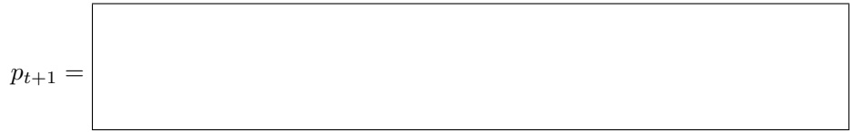

(b) [5 pts] Assume $\pi _ { t + 1 } ^ { * } = k _ { t + 1 } s$ for some $k _ { t + 1 } \in \mathbb { R }$ . Solve for $p _ { t + 1 }$ in $V _ { t + 1 } ^ { * } ( s ) = - p _ { t + 1 } s ^ { 2 }$

<!-- page: 11 -->

## Q5. [12 pts] Approximate Q-Learning

For all parts of this question, write your final answer in the small box, but we encourage you to show relevant work in the big box. A correct final answer is sufficient for full credit.

We would like to train a Q function $Q _ { w }$ parameterized by some trainable weights w. On observing a sample $( s , a , r , s ^ { \prime } )$ from the environment, we compare the old estimate of the Q-value of $( s , a ) { : ~ { \hat { y } }   =   { Q _ { w } } ( s , a ) ~ }$ and the new estimate: $\begin{array} { r } { y = r + \operatorname* { m a x } _ { a ^ { \prime } } Q _ { w } ( s ^ { \prime } , a ^ { \prime } ) } \end{array}$ and use it to update w to minimize the squared error via gradient descent.

$$
\begin{array}{c} e r r o r (\hat {y}, y) = (\hat {y} - y) ^ {2} \\ = (Q _ {w} (s, a) - y) ^ {2} \end{array}
$$

Treating the target $y$ as a constant, differentiate $e r r o r ( \hat { y } , y )$ with respect to w to derive the weight update rule for $w _ { i } \colon$

$$
w _ {i} \leftarrow w _ {i} - \alpha \frac {\partial e r r o r}{\partial w _ {i}} (\hat {y}, y)
$$

Let’s derive the update rules for different types of Q functions. For all parts, leave your answers in terms of $y , \hat { y } , f _ { i } ( s , a )$ , and $w _ { i }$

(a) [4 pts] The Q-function we would like to train has the form $\begin{array} { r } { Q _ { w } ( s , a ) = \sum _ { i = 0 } ^ { m } w _ { i } f _ { i } ( s , a ) } \end{array}$ . Please derive $\begin{array} { l } { \frac { \partial e r r o r } { \partial w _ { i } } ( \hat { y } , y ) } \\ \end{array}$ for this Q function.

$$
\frac {\partial \text {error}}{\partial w _ {i}} (\hat {y}, y) = \boxed {\quad}
$$

<!-- page: 12 -->

(b) The Q-function we would like to train now has the form

$$
Q _ {w} (s, a) = \sum_ {i = 0} ^ {m} e ^ {w _ {i} f _ {i} (s, a)} + \sum_ {i = m + 1} ^ {2 m} w _ {i} ^ {2} f _ {i} (s, a)
$$

(i) [4 pts] For $i \in \{ 1 , \ldots , m \}$ , derive $\begin{array} { l } { \frac { \partial e r r o r } { \partial w _ { i } } ( \hat { y } , y ) } \\ \end{array}$ for this $Q$ function.

(ii) [4 pts] For $i \in \{ m + 1 , \ldots , 2 m \}$ , derive $\begin{array} { l } { \frac { \partial e r r o r } { \partial w _ { i } } ( \hat { y } , y ) } \\ \end{array}$ for this $Q$ function.

<!-- page: 13 -->

## Q6. [23 pts] Probability and Bayes Net Representation

You’re interested in knowing whether you would be Satisfied with your choice of snack(s), and so you decide to make the prediction using probabilistic inference over a model with the following variables:

• S, whether or not you will be Satisfied.

• H, whether or not you will be Hungry.

• T, whether or not you will be Thirsty.

• P, whether or not you will have Pizza.

• B, whether or not you will have Boba.

Each of the variables may take on two values: yes or no.

(a) [1 pt] Your first idea for a probability model is a joint probability table over all of the variables. What’s the minimum number of parameters you need to fully specify this joint probability distribution?

(b) [3 pts] You decide this is too many parameters. To fix this, you decide to model the problem with the following Bayes net instead:

<table><tr><td rowspan="18" colspan="13"></td><td></td><td></td></tr><tr><td></td><td></td></tr><tr><td></td><td></td></tr><tr><td></td><td></td></tr><tr><td></td><td></td></tr><tr><td></td><td></td></tr><tr><td></td><td></td></tr><tr><td></td><td></td></tr><tr><td></td><td></td></tr><tr><td colspan="4">Pr(B|H,T)</td><td colspan="3">Pr(S|P,B)</td><td></td></tr><tr><td>+b</td><td>+h</td><td>+t</td><td>0.4</td><td>+s</td><td>+p</td><td>+b</td><td>0.9</td></tr><tr><td>+b</td><td>+h</td><td>-t</td><td>0.2</td><td>+s</td><td>+p</td><td>-b</td><td>0.4</td></tr><tr><td>+b</td><td>-h</td><td>+t</td><td>0.9</td><td>+s</td><td>-p</td><td>+b</td><td>0.7</td></tr><tr><td>+b</td><td>-h</td><td>-t</td><td>0.5</td><td>+s</td><td>-p</td><td>-b</td><td>0.1</td></tr><tr><td>-b</td><td>+h</td><td>+t</td><td>0.6</td><td>-s</td><td>+p</td><td>+b</td><td>0.1</td></tr><tr><td>-b</td><td>+h</td><td>-t</td><td>0.8</td><td>-s</td><td>+p</td><td>-b</td><td>0.6</td></tr><tr><td>-b</td><td>-h</td><td>+t</td><td>0.1</td><td>-s</td><td>-p</td><td>+b</td><td>0.3</td></tr><tr><td>-b</td><td>-h</td><td>-t</td><td>0.5</td><td>-s</td><td>-p</td><td>-b</td><td>0.9</td></tr></table>

You do not know which snack(s) you are going for, but you know you are both hungry, thirsty, and definitely getting Pizza. According to your model, what is the probability that you will be satisfied? (First, write out the expression in terms of conditional probabilities from the model; then, plug in the values from the tables and compute the final answer.)

<!-- page: 14 -->

(c) [3 pts] You thought the last part required too much computation so you decide to use rejection sampling, sampling variables in topological order. Write the probability of rejecting a sample for the following queries.

$$
P (+ p \mid + h)
$$

$$
P (- s \mid + p)
$$

$$
= \boxed {\quad}
$$

$$
P (+ s | - h, + t)
$$

(d) Given that you are satisfied with your choice of snack(s), write out the variable elimination steps you would take to compute the probability that you actually had boba, that is, $\operatorname* { P r } ( + b | + s )$ . (You do not have to plug in the values from the tables.)

(i) [2 pts] Which of the following factors do we start with?

$$
\square \Pr (H)
$$

$$
\square \Pr (T)
$$

$$
\square \Pr (P)
$$

$$
\square \Pr (H | P)
$$

$$
\square \Pr (P | H)
$$

$$
\square \Pr (B)
$$

$$
\square \Pr (B | H)
$$

$$
\square \Pr (+ s)
$$

$$
\square \Pr (+ s | P)
$$

$$
\square \Pr (+ s | B)
$$

$$
\square \Pr (B | T)
$$

$$
\square \Pr (+ s | P, H)
$$

$$
\square \Pr (B | H, T)
$$

 Pr(+s|P, H, B)

$$
\square \Pr (+ s | P, B)
$$

(ii) [1 pt] First, we eliminate H. What is the factor $f _ { 1 }$ generated when we eliminate H?

$$
f _ {1} (P)
$$

$$
\bigcirc \quad f _ {1} (B)
$$

$$
f _ {1} (P, B)
$$

$$
f _ {1} (P, B, T)
$$

$$
f _ {1} (B, T)
$$

$$
\bigcirc \quad f _ {1} (B, + s)
$$

$$
\bigcirc \quad f _ {1} (P, B, + s)
$$

$$
f _ {1} (T, + s)
$$

$$
\bigcirc \quad f _ {1} (B, T, + s)
$$

(iii) [1 pt] Write out the expression for computing $f _ { 1 }$ in terms of the remaining factor(s) (before H is eliminated).

f<sub>1</sub>(

(iv) [2 pts] Next, we eliminate T. What is the factor $f _ { 2 }$ generated when we eliminate T?

Write out the expression for computing $f _ { 2 }$ in terms of the remaining factor(s) (before T is eliminated).

(v) [2 pts] Finally, we eliminate P. What is the factor $f _ { 3 }$ generated when we eliminate $P ?$

Write out the expression for computing $f _ { 3 }$ in terms of the remaining factor(s) (before P is eliminated).

<!-- page: 15 -->

SID:

(vi) [2 pts] Write out the expression for computing Pr(+b| + s) in terms of the remaining factor(s) (after P is eliminated).

Pr(+b | + s) =

(e) Conditional Independence: For each of the following statements about conditional independence, mark if it is guaranteed by the Bayes Net.

The Bayes Net is reproduced below for your convenience.

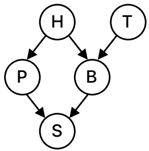

(i) [1 pt] H ⊥⊥ T # Guaranteed # Not guaranteed

(ii) [1 pt] P ⊥⊥ T | B # Guaranteed # Not guaranteed

(iii) [1 pt] H ⊥⊥ T | S # Guaranteed # Not guaranteed

(iv) [1 pt] S ⊥⊥ T | B

\# Guaranteed # Not guaranteed

(v) [1 pt] H ⊥⊥ S | P, B # Guaranteed # Not guaranteed

\# Guaranteed # Not guaranteed

<!-- page: 16 -->

## Q7. [18 pts] Decode Your Terror (HMM)

You go to Disney and ride the famous Tower of Terror ride, where an elevator rises and drops seemingly at random. You’re terrified, but vow to determine the sequence of rises and drops that make up the ride so you won’t be as terrified next time. Assume the elevator E follows a Markovian process and it has m floors at which it can stop. In the dead of night, you install a sensor S at the top of the shaft that gives approximate distance measurements, quantized into n different distance bins. Assume that the elevator stops at $T$ floors as part of the ride and the initial distribution of the elevator is uniform over the m floors.

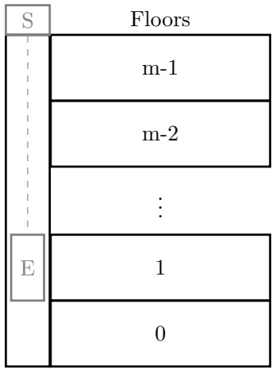

You want to know the most probable sequence of (hidden) states $X _ { 1 : T }$ given your observations $y _ { 1 : T }$ from the sensor, so you turn to the Viterbi algorithm, which performs the following update at each step:

$$
\begin{array}{r l} & m _ {t} [ x _ {t} ] = P (y _ {t} | x _ {t}) \underset {x _ {t - 1}} {\max} [ P (x _ {t} | x _ {t - 1}) m _ {t - 1} [ x _ {t - 1} ] ] \\ & a _ {t} [ x _ {t} ] = \arg \underset {x _ {t - 1}} {\max} m _ {t - 1} [ x _ {t - 1} ] \end{array}
$$

(a) (i) [2 pts] What is the run time of the Viterbi algorithm to determine all previous states for this scenario? Please answer in big O notation, in terms of T, m, and n, or write $``N /\bar{ A }  ''$ if the run time is unable to be determined with the given information.

(ii) [2 pts] What is the space complexity of the Viterbi algorithm to determine all previous states for this scenario? Please answer in big O notation, in terms of T, m, and n, or write $``N/A''$ if the space complexity is unable to be determined with the given information.

Eventually, we decide that the end of the ride is the exciting part, so we decide that we only wish to determine the previous K states.

(b) (i) [2 pts] What is the run time of the Viterbi algorithm to determine the previous K states? Please answer in big O notation, in terms of T, K, m, and n, or write $``N/A''$ if the run time is unable to be determined

<!-- page: 17 -->

with the given information.

(ii) [2 pts] What is the space complexity of the Viterbi algorithm to determine the previous K states? Please answer in big O notation, in terms of T, K, m, and n, or write $``N/A''$ if the space complexity is unable to be determined with the given information.

Suppose you instead only wish to determine the current distribution (at time T) for the elevator, given your $T$ observations, so you use the forward algorithm, with update step shown here:

$$
P (X _ {t} | y _ {t}) \propto P (y _ {t} | x _ {t}) \sum_ {x _ {t - 1}} P (X _ {t} | x _ {t - 1}) P (x _ {t - 1}, y _ {0: t - 1})
$$

Additionally, from your previous analysis, you note that there are some states which are unreachable from others (e.g., the elevator cannot travel from the top floor to the bottom in a single timestep). Specifically, from each state, there are between $G / 2$ and G states which can be reached in the next timestep, where $G < m$

(c) (i) [2 pts] What is the run time for the forward algorithm to estimate the current state at time T, assuming we ignore states that cannot be reached in each update? Please answer in big O notation, in terms of $T .$ m, G, and n, or write $``N/A''$ if the run time is unable to be determined with the given information.

(ii) [2 pts] What is the space complexity for the forward algorithm to estimate the current state at time T, assuming we ignore states that cannot be reached in each update? Please answer in big O notation, in terms of $T , \; m , \; G ,$ and $n ,$ or write $``N/A''$ if the space complexity is unable to be determined with the given information.

Finally, assume that the number of elevator states is actually infinite $( \mathrm { e . g . }$ , instead of stopping at floors, the elevator can stop at any point along the elevator shaft).

(d) [3 pts] What is the run time of the standard forward algorithm to estimate the current state at time $T$ in this case? Please answer in big O notation, in terms of T, m, G, and n, or write $``N/A''$ if the run time is unable to be determined with the given information.

<!-- page: 18 -->

(e) [3 pts] Suppose you decide to use a particle filter instead of the forward algorithm. What is the run time of a particle filter with $P$ particles? Please answer in big O notation, in terms of $T ,   m ,   G ,   n ,$ and $P ,$ or write $``N/A''$ if the run time is unable to be determined with the given information.

<!-- page: 19 -->

## Q8. [12 pts] Raisins Again (VPI)

(a) Valerie from midterm 1 is still concerned about her cookie containing raisins so she decides to take a completely new approach. She wants to find out which factory (F) made the cookie because that can help her find out if there are raisins (R) in the cookie. Thus she goes to the cookie company and asks a manager, $M _ { 1 } .$ , which factory the cookie was made in. However, she doesn’t fully trust his answer so she asks his superior, $M _ { 2 }$ , which factory he thinks it is in and how credible $M _ { 1 }$ is. She knows there is a chain of n managers like this where every manager can tell her which factory they think the cookie was made in and the credibility of every manager working under them. This system can be modeled by the decision network below.

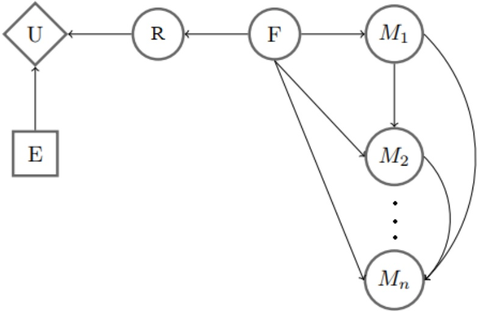

For this question assume $1 < i < k < n ,$ choose one for each equation:

|  | Could be true | Must be true | Must be false |
| --- | --- | --- | --- |
| $VPI(M_i) > VPI(M_k)$ | ○ | ○ | ○ |
| $VPI(M_k) > VPI(M_i)$ | ○ | ○ | ○ |
| $VPI(F) \geq VPI(M_i)$ | ○ | ○ | ○ |
| $VPI(F) > VPI(R)$ | ○ | ○ | ○ |
| $VPI(M_k\|M_i) > VPI(M_k)$ | ○ | ○ | ○ |
| $VPI(M_i\|M_k) > VPI(M_i)$ | ○ | ○ | ○ |
| $VPI(M_i, M_k) = VPI(M_i\|M_k) + VPI(M_k)$ | ○ | ○ | ○ |
| $VPI(M_i\|F) > 0$ | ○ | ○ | ○ |

<!-- page: 20 -->

## Q9. [19 pts] Machine Learning: Potpourri

(a) [2 pts] What it the minimum number of parameters needed to fully model a joint distribution $P ( Y , F _ { 1 } , F _ { 2 } , . . . , F _ { n } )$ over label Y and n features F<sub>i</sub>? Assume binary class where each feature can possibly take on k distinct values.

(b) [3 pts] Under the Naive Bayes assumption, what is the minimum number of parameters needed to model a joint distribution $P ( Y , F _ { 1 } , F _ { 2 } , . . . , F _ { n } )$ over label Y and n features F<sub>i</sub>? Assume binary class where each feature can take on k distinct values.

(c) [1 pt] You suspect that you are overfitting with your Naive Bayes with Laplace Smoothing. How would you adjust the strength k in Laplace Smoothing? # Increase k # Decrease k

(d) [2 pts] While using Naive Bayes with Laplace Smoothing, increasing the strength k in Laplace Smoothing can:  Increase training error  Decrease training error  Increase validation error  Decrease validation error

(e) [1 pt] It is possible for the perceptron algorithm to never terminate on a dataset that is linearly separable in its feature space. # True # False

(f) [1 pt] If the perceptron algorithm terminates, then it is guaranteed to find a max-margin separating decision boundary. # True # False

(g) [1 pt] In multiclass perceptron, every weight w<sub>y</sub> can be written as a linear combination of the training data feature vectors. # True # False

(h) [1 pt] For binary class classification, logistic regression produces a linear decision boundary. # True # False

(i) [1 pt] In the binary classification case, logistic regression is exactly equivalent to a single-layer neural network with a sigmoid activation and the cross-entropy loss function. # True # False

<!-- page: 21 -->

SID:

(j) (i) [2 pts] You train a linear classifier on 1,000 training points and discover that the training accuracy is only 50%. Which of the following, if done in isolation, has a good chance of improving your training accuracy?  Add novel features  Train on more data  Train on less data

(ii) [2 pts] You now try training a neural network but you find that the training accuracy is still very low. Which of the following, if done in isolation, has a good chance of improving your training accuracy?

 Add more hidden layers

 Add more units to the hidden layers

(k) Recall the following kernels covered in class:

1. Linear kernel: $\begin{array} { r } { K \left( x , x ^ { \prime } \right) = x \cdot x ^ { \prime } = \sum _ { i } x _ { i } x _ { i } ^ { \prime } } \end{array}$

2. Quadratic kernel: $\begin{array} { r } { K ( x , x ^ { \prime } ) = ( x \cdot x ^ { \prime } + 1 ) ^ { 2 } = \sum _ { i , j } x _ { i } x _ { j } x _ { i } ^ { \prime } x _ { j } ^ { \prime } + 2 \sum _ { i } x _ { i } x _ { i } ^ { \prime } + 1 } \end{array}$

3. Gaussian RBF kernel: $\begin{array} { r } { K ( x , x ^ { \prime } ) = \exp \left( - \frac { 1 } { 2 \sigma ^ { 2 } } \| x - x ^ { \prime } \| ^ { 2 } \right) } \end{array}$

(i) [1 pt] There exists data that is separable with a Gaussian RBF kernel but not with a quadratic kernel. # True # False

(ii) [1 pt] There exists data that is separable with a linear kernel but not with a quadratic kernel. # True # False

<!-- page: 22 -->

Q10. [24 pts] Perceptrons and Naive Bayes

(a) For each of the datasets represented by the graphs below, please select the feature maps for which the perceptron algorithm can perfectly classify the data.

Each data point is in the form $( x _ { 1 } , x _ { 2 } )$ , and has some label Y , which is either a 1 (dot) or −1 (cross).

(i) [5 pts]

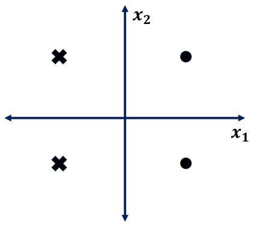

$$
\square \quad [ x _ {1} \quad x _ {2} \quad 1 ]
$$

$$
\square \quad \left[ \begin{array}{c c c} x _ {1} & x _ {2} & x _ {1} ^ {2} \end{array} \right]
$$

$$
\square \quad \left[ \begin{array}{c c c} x _ {1} & x _ {2} & Y \end{array} \right]
$$

$$
\square \quad \left[ \begin{array}{c c} x _ {1} & x _ {2} \end{array} \right]
$$

(ii) [5 pts]

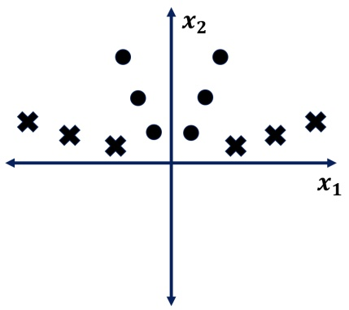

$$
\square \quad \left[ \begin{array}{c c c} x _ {1} & x _ {2} & 1 \end{array} \right]
$$

$$
\square \quad \left[ \begin{array}{c c c} x _ {1} & x _ {2} & x _ {1} ^ {2} \end{array} \right]
$$

$$
\square \quad \left[ \begin{array}{c c c} x _ {1} & x _ {2} & | x _ {1} | \end{array} \right]
$$

$$
\square \quad \left[ \begin{array}{c c} x _ {1} & x _ {2} \end{array} \right]
$$

(iii) [5 pts]

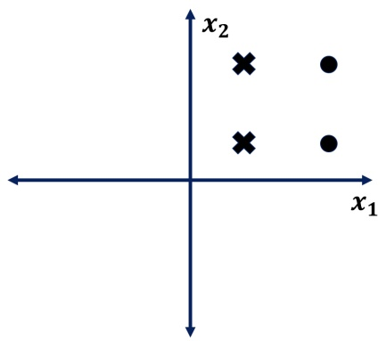

$$
\begin{array}{c c c c} \square & [ x _ {1} & x _ {2} & 1 ] \\ \square & [ x _ {1} & x _ {2} & x _ {1} ^ {2} ] \\ \square & [ x _ {1} & x _ {2} & | x _ {1} | ] \\ \square & [ x _ {1} & x _ {2} & Y ] \\ \square & [ x _ {1} & x _ {2} ] \end{array}
$$

<!-- page: 23 -->

(b) [2 pts] Performing maximum likelihood estimation (MLE) to fit the parameters of a Bayes net to some given data (with no Laplace smoothing) leads to which of the following learning algorithms?

 Naive Bayes

 Perceptrons

 Kernelization

 Neural Networks

\# None

(c) Suppose that we are trying to perform a binary classification task using Naive Bayes. Y is the label, and $( X _ { 1 }$ $\left| X _ { 2 } \right\rangle$ are the features. The domain for the features is anywhere on the $3 \times 3$ grid centered at (0, 0). In other words, $X _ { 1 }$ and $X _ { 2 }$ have the domain {−1, 0, 1}

Suppose that this is your dataset: $( 0 , \: 1 , \: + ) , \: ( 0 , \: - 1 , \: - ) , \: ( - 1 , \: 1 , \: + ) , \: ( - 1 , \: - 1 , \: - ) , \: ( 1 , \: 0 , \: + ) , \: ( - 1 , \: 1 , \: - ) , \: ( 0 , \: 0 ,$ +). What is the learned value of each of the following? (Leave your answer as a simplified fraction)

(i) [1 pt]

(ii) [1 pt]

(iii) [1 pt]

$$
P (Y = +)
$$


$$
P (X _ {1} = 1 | Y = -)
$$


$$
P (X _ {2} = 0 | Y = +)
$$


(d) Now, to decouple from the previous question, assume that the learned CPTs are below.

| Y | X<sub>1</sub> | Pr(X<sub>1</sub> \| Y) |
| --- | --- | --- |
| + | -1 | 0.4 |
| + | 0 | 0.1 |
| + | 1 | 0.5 |
| - | -1 | 0.6 |
| - | 0 | 0.3 |
| - | 1 | 0.1 |

$$
\begin{array}{c c c} \hline Y & X _ {2} & \Pr (X _ {2} \mid Y) \\ \hline + & - 1 & 0. 2 \\ + & 0 & 0. 2 \\ + & 1 & 0. 6 \\ - & - 1 & 0. 7 \\ - & 0 & 0. 1 \\ - & 1 & 0. 2 \\ \hline \end{array}
$$

| Y | Pr(Y) |
| --- | --- |
| + | 0.2 |
| - | 0.8 |

(i) [2 pts] What would be the predicted value for Y if the data point is at (0, 0)?

```txt
The provided image is a blank rectangular box with no text or content.
```

(ii) [2 pts] What would be the predicted value for Y if the data point is at (1, −1)?

```json
[REDACTED]
```

<!-- page: 24 -->

## Q11. [24 pts] Neural Network

The network below is a neural network with inputs $x _ { 1 }$ and $x _ { 2 } ,$ and outputs $y _ { 1 }$ and $y _ { 2 }$ . The internal nodes are computed below. All variables are scalar values. Note that $ReLU(x) = \max(0, x)$

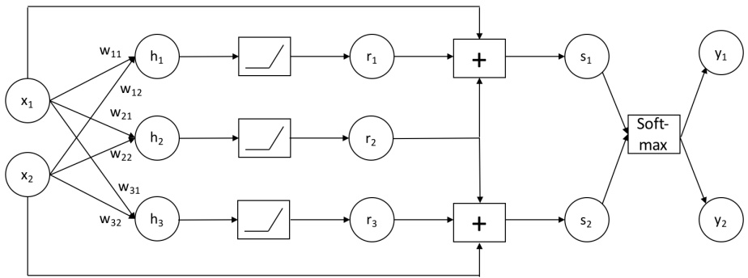

Figure 3: Neural Network

The expressions for the internal nodes in the network are given here for convenience:

$$
\begin{array}{l} h _ {1} = w _ {1 1} x _ {1} + w _ {1 2} x _ {2} \qquad h _ {2} = w _ {2 1} x _ {1} + w _ {2 2} x _ {2} \qquad h _ {3} = w _ {3 1} x _ {1} + w _ {3 2} x _ {2} \\ r _ {1} = R e L U (h _ {1}) \qquad r _ {2} = R e L U (h _ {2}) \qquad r _ {3} = R e L U (h _ {3}) \qquad s _ {1} = x _ {1} + r _ {1} + r _ {2} \qquad s _ {2} = x _ {2} + r _ {2} + r _ {3} \\ y _ {1} = \frac {e x p (s _ {1})}{e x p (s _ {1}) + e x p (s _ {2})} \qquad y _ {2} = \frac {e x p (s _ {2})}{e x p (s _ {1}) + e x p (s _ {2})} \end{array}
$$

## (a) Forward Propagation

Suppose for this part only, $x _ { 1 } = 3 , x _ { 2 } = 5 , w _ { 1 1 } = - 1 0 , w _ { 1 2 } = 7 , w _ { 2 1 } = 2 , w _ { 2 2 } = 5 , w _ { 3 1 } = 4 , w _ { 3 2 } = - 4$ . What are the values of the following internal nodes? Please simplify any fractions.

(i)

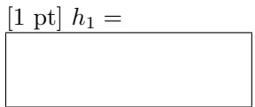

(ii)

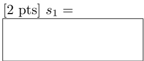

(iii)

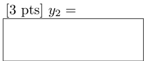

## (b) Back Propagation

Compute the following gradients analytically. The answer should be an expression of any of the nodes in the network $( x _ { 1 } , x _ { 2 } , h _ { 1 } , h _ { 2 } , h _ { 3 } , r _ { 1 } , r _ { 2 } , r _ { 3 } , s _ { 1 } , s _ { 2 } , y _ { 1 } , y _ { 2 } )$ or weights w<sub>11</sub>, w<sub>12</sub>, w<sub>21</sub>, w<sub>22</sub>, w<sub>31</sub>, w<sub>32</sub> (clarification during exam: without derivative or partial derivative symbols). In the case where the gradient depend on the value of nodes in the network, please list all possible analytical expressions, caused by active/inactive ReLU, separated by comma.

Hint 1: If z is a function of y, and y is a function of $x ,$ the chain rule of taking derivative is: $\begin{array} { r } { \frac { \partial z } { \partial x } = \frac { \partial z } { \partial y } * \frac { \partial y } { \partial x } } \end{array}$

Hint 2: Hint: Recall that for functions of the form $\begin{array} { r } { g ( x ) = \frac { 1 } { 1 + e x p ( a - x ) } ,   \frac { \partial g } { \partial x } = g ( x ) ( 1 - g ( x ) ) } \end{array}$

(i) $[1 pt] $\frac{\partial h_{2}}{\partial x_{1}} =$$

(ii) [2 pts] $\begin{array} { r } { \frac { \partial h _ { 1 } } { \partial w _ { 2 1 } } = } \end{array}$

<!-- page: 25 -->

SID:

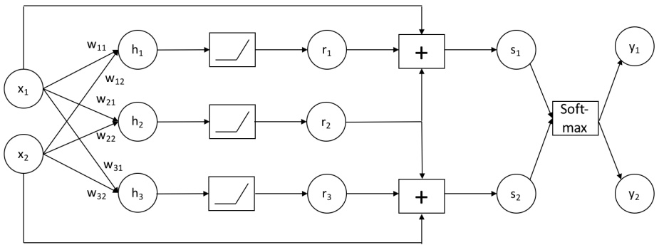

Figure 4: Neural Network, copied from the previous page for reference

(iii) $[2 pts]  $\frac{\partial r_{3}}{\partial w_{31}} =$$

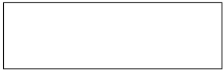

(iv) $[2 pts]  $\frac { \partial s _ { 1 } } { \partial r _ { 1 } }$$ =

$$
\boxed {\quad}
$$

(v) [3 $[pts] $\frac{\partial s_{1}}{\partial x_{1}} =$$

(vi) $[3 pts]  $\frac{\partial y_{2}}{\partial s_{2}} =$$

(vii) [3 $[pts] $\frac{\partial y_{1}}{\partial x_{1}} =$$

(c) [2 pts] In roughly 15 words, what role could the non-negative values in node r<sub>2</sub> play according to its location in the network architecture?
