<!-- page: 1 -->

• You have approximately 80 minutes.

• The exam is closed book, closed calculator, and closed notes except your one-page crib sheet.

• Mark your answers ON THE EXAM ITSELF. If you are not sure of your answer you may wish to provide a brief explanation. All short answer sections can be successfully answered in a few sentences AT MOST.

• For multiple choice questions,

–  means mark all options that apply

means mark a single choice

#– When selecting an answer, please fill in the bubble or square completely ( and )

| First name |  |
| --- | --- |
| Last name |  |
| SID |  |
| Student to your right |  |
| Student to your left |  |

For staff use only:

| Q1. Probability | /12 |
| --- | --- |
| Q2. Bayes Net Inference | /25 |
| Q3. HMMs: Help Your House Help You | /20 |
| Q4. Variable Elimination | /12 |
| Q5. Decision Networks and VPI | /21 |
| Q6. Bayes Nets Representation | /10 |
| Total | /100 |

<!-- page: 2 -->

<!-- page: 3 -->

$(2\times 2 - 1)\times 2\times 5 = 30$

## Q1. [12 pts] Probability

(a) A, B, C, and D are boolean random variables, and E is a random variable whose domain is $\{ e _ { 1 } , e _ { 2 } , e _ { 3 } , e _ { 4 } , e _ { 5 } \}$

(i) [5 pts] How many entries are in the following probability tables and what is the sum of the values in each table? Write “?” if there is not enough information given.

| Table | Size | Sum |
| --- | --- | --- |
| P(e \| B) | 2 | ? |
| P(A,B \| c) | 4 | 1 |
| P(A,B \| C,d,E) | 40 | 10 |
| P(a,E \| B,C) | 20 | ? |
| P(A,c,E) | 10 | ? OR P(c) |

(ii) [1 pt] What is the minimum number of parameters needed to fully specify the distribution $P ( A , B | C , d , E )$

(iii) [1 pt] What is the minimum number of parameters needed to fully specify the distribution $P ( a , E | B , C )$

$$
5 \times 2 \times 2 = 2 0
$$

(b) Given the same set of random variables as defined in part (a). Write each of the following expressions in its simplest form, i.e., a single term. Make no independence assumptions unless otherwise stated. Write “Not possible” if it is not possible to simplify the expression without making further independence assumptions.

(i) [2 pts]

$$
\sum_ {a ^ {\prime}} P (a ^ {\prime} \mid B, E) P (c \mid a ^ {\prime}, B, E)
$$

$$
P (c \mid B, E)
$$

(ii) [3 pts]

$$
\frac {\sum_ {a ^ {\prime}} P (B \mid a ^ {\prime} , C) P (a ^ {\prime} \mid C) P (C)}{\sum_ {d ^ {\prime} , e ^ {\prime}} P (d ^ {\prime} \mid e ^ {\prime} , C) P (e ^ {\prime} \mid C) P (C)}
$$

$$
P (B \mid C)
$$

<!-- page: 4 -->

| C | P(C) |
| --- | --- |
| +c | (i) |
| -c | (ii) |

## Q2. [25 pts] Bayes Net Inference

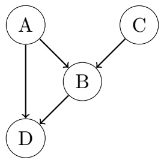

Consider the Bayes net graph depicted above.

(a) (i) [4 pts] Select all conditional independences that are enforced by this Bayes net graph.

$$
\begin{array}{c c c c} \square A \perp \perp B & \square A \perp \perp C | B & \blacksquare D \perp \perp C | A, B & \square D \perp \perp C \\ \blacksquare A \perp \perp C & \square A \perp \perp C | D & \square A \perp \perp C | B, D & \square D \perp \perp C | B \end{array}
$$

(ii) [3 pts] Because of these conditional independences, there are some distributions that cannot be represented by this Bayes net. What is the minimum set of edges that would need to be added such that the resulting Bayes net could represent any distribution?

$$
\begin{array}{c c c c} \square A \to C & \blacksquare C \to A & \blacksquare C \to D & \square D \to C \\ \square D \to A & \square D \to B & \square B \to C & \square B \to A \end{array}
$$

Either (C → A AND C → D) OR (A → C AND C → D)

(b) [6 pts] For the rest of this Q2, we use the original, unmodified Bayes net depicted at the beginning of the problem statement. Here are some partially-filled conditional probability tables on A, B, C, and D. Note that these are not necessarily factors of the Bayes net. Fill in the six blank entries such that this distribution can be represented by the Bayes net.

$$
\begin{array}{c c c} \hline A & C & P (C \mid A) \\ \hline + a & + c & 0. 8 \\ + a & - c & 0. 2 \\ - a & + c & 0. 8 \\ - a & - c & 0. 2 \\ \hline \end{array}
$$

$$
\begin{array}{c c c c} \hline A & B & D & P (D \mid A, B) \\ \hline + a & + b & + d & 0. 6 0 \\ + a & + b & - d & 0. 4 0 \\ + a & - b & + d & 0. 1 0 \\ + a & - b & - d & 0. 9 0 \\ - a & + b & + d & 0. 2 0 \\ - a & + b & - d & 0. 8 0 \\ - a & - b & + d & 0. 5 0 \\ - a & - b & - d & 0. 5 0 \end{array}
$$

$$
\begin{array}{c c c c} \hline A & B & C & P (C \mid A, B) \\ \hline + a & + b & + c & 0. 5 0 \\ + a & + b & - c & 0. 5 0 \\ + a & - b & + c & 0. 2 0 \\ + a & - b & - c & 0. 8 0 \\ - a & + b & + c & 0. 9 0 \\ - a & + b & - c & 0. 1 0 \\ - a & - b & + c & 0. 4 0 \\ - a & - b & - c & 0. 6 0 \\ \hline \end{array}
$$

$$
\begin{array}{c c c c} \hline A & B & C & D \\ \hline + a & + b & + c & + d \\ + a & + b & - c & - d \\ + a & - b & + c & + d \\ + a & - b & - c & - d \\ \vdots & \vdots & \vdots & \vdots \\ \hline \end{array}
$$

(iii)

(iv)

(v)

(vi)

(i):

0.8

(ii):

0.2

(iii):

$$
0. 6 * 0. 5 = 0. 3
$$

<!-- page: 5 -->

SID:

(iv):

$$
0. 4 * 0. 5 = 0. 2
$$

(v):

(vi):

$$
0. 9 * 0. 8 = 0. 7 2
$$

The original Bayes net is depicted again for convenience:

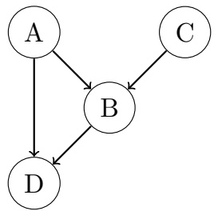

(c) [3 pts] What is the minimal set of edges that needs to be removed from the above graph, such that it is possible to construct a Markov random field (i.e. an undirected graphical model) that is I-equivalent to the resulting graph? If no edges need to be removed, select ‘None’.

$$
\square A \rightarrow B \quad \blacksquare C \rightarrow B \quad \square A \rightarrow D \quad \square B \rightarrow D \quad \square B \rightarrow D \quad \bigcirc \text {None}
$$

(d) Given the following conditional probability tables:

| A | P(A) |
| --- | --- |
| +a | 0.05 |
| -a | 0.95 |

| C | P(C) |
| --- | --- |
| +c | 0.3 |
| -c | 0.7 |

$$
\begin{array}{c c c c} \hline P (B & A, C) \\ \hline + a & + c & + b & 0. 6 5 \\ + a & + c & - b & 0. 3 5 \\ + a & - c & + b & 0. 1 5 \\ + a & - c & - b & 0. 8 5 \\ - a & + c & + b & 0. 2 5 \\ - a & + c & - b & 0. 7 5 \\ - a & - c & + b & 0. 5 5 \\ - a & - c & - b & 0. 4 5 \\ \hline \end{array}
$$

$$
\begin{array}{c c c c} \hline P (D & A, B) \\ \hline + a & + b & + d & 0. 6 0 \\ + a & + b & - d & 0. 4 0 \\ + a & - b & + d & 0. 1 0 \\ + a & - b & - d & 0. 9 0 \\ - a & + b & + d & 0. 2 0 \\ - a & + b & - d & 0. 8 0 \\ - a & - b & + d & 0. 5 0 \\ - a & - b & - d & 0. 5 0 \end{array}
$$

(i) [5 pts] Suppose that we want to use likelihood weighted sampling to approximate $P ( A \mid + b , + c , + d )$ However, we accidentally forgot to fix the value of C and $D ,$ and instead we sampled them just like unconditioned variables!

For each of the samples below, write what the weight of the sample should be, in order to correctly approximate $P(A \mid  + b,  + c,  + d)$ . If the weight of the sample does not matter for calculating $P(A \mid  + b,  + c,  + d)$ write ‘reject’ instead (since we would not use that sample).

$$
(+ a, + b, - c, + d):
$$

reject

$$
(+ a, + b, + c, + d):
$$

0.65

$$
(- a, + b, + c, + d):
$$

0.25

(ii) [4 pts] Let’s say we’re trying to approximate $P ( A \mid - b )$ using Gibbs sampling. Suppose the most recent sample is $( + a , - b , + c , + d )$ If we choose D to resample, what is the probability of resampling +d and −d respectively?

<!-- page: 6 -->

<!-- page: 7 -->

## Q3. [20 pts] HMMs: Help Your House Help You

Imagine you have a smart house that wants to track your location within itself so it can turn on the lights in the room you are in and make you food in your kitchen. Your house has 4 rooms $( A , B , C , D )$ in the floorplan below (A is connected to B and D, B is connected to A and $\mathrm { C } ,$ C is connected to B and D, and D is connected to A and C):

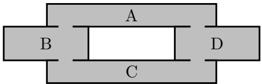

At the beginning of the day $( t = 0 )$ , your probabilities of being in each room are $p _ { A } , p _ { B } , p _ { C } ,$ , and $p _ { D }$ for rooms A, B, C, and D, respectively, and at each time t your position (following a Markovian process) is given by $X _ { t }$ . At each time, your probability of staying in the same room is $q _ { 0 } ,$ your probability of moving clockwise to the next room is $q _ { 1 }$ , and your probability of moving counterclockwise to the next room is $q _ { - 1 } = 1 - q _ { 0 } - q _ { 1 }$

(a) [3 pts] Initially, assume your house has no way of sensing where you are. What is the probability that you will be in room D at time $t = 1 ?$

$$
\begin{array}{l l l l} \bigcirc & q _ {0} p _ {D} & \bigcirc & q _ {0} p _ {D} + q _ {1} p _ {A} + q _ {- 1} p _ {C} + 2 q _ {1} p _ {B} \\ \bigcirc & q _ {0} p _ {D} + q _ {- 1} p _ {A} + q _ {1} p _ {C} & \bigcirc & q _ {1} p _ {A} + q _ {1} p _ {C} + q _ {0} p _ {D} \end{array} \quad \begin{array}{l l l l} \bullet & q _ {0} p _ {D} + q _ {1} p _ {A} + q _ {- 1} p _ {C} \\ \bigcirc & \text {None of these} \end{array}
$$

This probability is given by the sum of three probabilities: 1) $q _ { 0 } p _ { D } ;$ You are in room D to start $( p _ { D } )$ and stay there (q0), 2) q1pA: You are in room A to start $( p _ { A } )$ and move clockwise to room D (q1), and $3) $q _ { - 1 } p _ { C } \colon$$ You are in room C to start $( p _ { C } )$ and move counterclockwise to room D (q−1).

Now assume your house contains a sensor $M ^ { A }$ that detects motion (+m) or no motion (-m) in room A. However, the sensor is a bit noisy and can be tricked by movement in adjacent rooms, resulting in the conditional distributions for the sensor given in the table below. The prior distribution for the sensor’s output is also given.

<table><tbody><tr><td>MA</td><td>P(MA | X = A)</td><td>P(MA | X = B)</td><td>P(MA | X = C)</td><td>P(MA | X = D)</td><td rowspan="3"></td><td>MA</td><td>P(MA)</td></tr><tr><td>+mA</td><td>1 - 2γ</td><td>γ</td><td>0.0</td><td>γ</td><td>+mA</td><td>0.5</td></tr><tr><td>-mA</td><td>2γ</td><td>1 - γ</td><td>1.0</td><td>1 - γ</td><td>-mA</td><td>0.5</td></tr></tbody></table>

(b) [3 pts] You decide to help your house to track your movements using a particle filter with three particles. At time $t = T .$ , the particles are at $X^{0} = A,X^{1} = B,X^{2} = D$ . What is the probability that the particles will be resampled as $X ^ { 0 } = X ^ { 1 } = X ^ { 2 } = A$ after time elapse? Select all terms in the product.

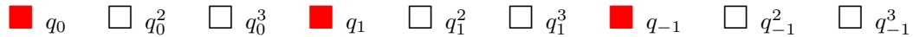

The probability that all particles will be resampled as being in room A is $q _ { 0 } q _ { 1 } q _ { - 1 }$ since particle $X ^ { 0 }$ stays in A with probability $q _ { 0 } ,$ particle $X ^ { 1 }$ moves clockwise to A with probability $q _ { 1 }$ , and particle $X ^ { 2 }$ moves counterclockwise with probability $q _ { - 1 }$

(c) [3 pts] Assume that the particles are actually resampled after time elapse as $X ^ { 0 } = D , X ^ { 1 } = B , X ^ { 2 } = C$ , and the sensor observes $M ^ { A } = - m ^ { A }$ . What are the particle weights given the observation?

<!-- page: 8 -->

<table><tr><td>Particle</td><td colspan="10">Weight</td></tr><tr><td> $X^{0} = D$ </td><td colspan="10">○ γ ● 1-γ ○ 1-2γ ○ 0.0 ○ 1.0 ○ 2γ ○ None of these</td></tr><tr><td> $X^{1} = B$ </td><td colspan="10">○ γ ● 1-γ ○ 1-2γ ○ 0.0 ○ 1.0 ○ 2γ ○ None of these</td></tr><tr><td> $X^{2} = C$ </td><td colspan="10">○ γ ○ 1-γ ○ 1-2γ ○ 0.0 ● 1.0 ○ 2γ ○ None of these</td></tr></table>

We can read these weights off of the tables given above. The weight for $X ^ { 0 }$ is given by $P ( M ^ { A } = - m ^ { A } | X =$ $\overline { { D } } ) = 1 - \gamma$ , the weight for $X ^ { 1 }$ is given by $P ( M ^ { A } = - m ^ { A } | X = B ) = 1 - \gamma$ , and the weight for $X ^ { 2 }$ is given by $\vec { P ( M ^ { A } = - m ^ { A } | X = C ) } = 1$

Now, assume your house also contains sensors $M ^ { B }$ and $M ^ { D }$ in rooms B and D, respectively, with the conditional distributions of the sensors given below and the prior equivalent to that of sensor $M ^ { \hat { A } }$

| MB | P(MB \| X = A) | P(MB \| X = B) | P(MB \| X = C) | P(MB \| X = D) |
| --- | --- | --- | --- | --- |
| +mB | γ | 1 - 2γ | γ | 0.0 |
| -mB | 1 - γ | 2γ | 1 - γ | 1.0 |
| MD | P(MD \| X = A) | P(MD \| X = B) | P(MD \| X = C) | P(MD \| X = D) |
| +mD | γ | 0.0 | γ | 1 - 2γ |
| -mD | 1 - γ | 1.0 | 1 - γ | 2γ |

(d) [6 pts] Again, assume that the particles are actually resampled after time elapse as $X ^ { 0 } = D , X ^ { 1 } = B , X ^ { 2 } = C$ The sensor readings are now $\tilde { M ^ { A } } = - m ^ { A } , M ^ { B } = \tilde { - m ^ { B } } , \tilde { M ^ { D } } = + m ^ { D }$ . What are the particle weights given the observations?

| Particle | Weight |
| --- | --- |
| X0 = D | 1#- 3γ + 2γ2 #2 - γ 1#- 2γ + γ2 # None of theseγ2 - 2γ3 3 - 2γ 0.0 γ - γ2 + γ3# # # |
| X1 = B | γ2 - 2γ3 3 - 2γ 0.0 γ - γ2 + γ31#- 3γ + 2γ2 #2 - γ 1 - 2γ + γ2# None of these# # # # |
| X2 = C | γ2 - 2γ3 3 - 2γ 0.0 γ - γ2 + γ3# 1#- 3γ + 2γ2 # #2 - γ # #1 - 2γ + γ2# None of these |

The weight for $X ^ { 0 }$ is given by $P ( M ^ { A }   =   - m ^ { A } | X   =   D ) P ( M ^ { B }   =   - m ^ { B } | X   =   D ) P ( m ^ { D }   =   + m ^ { D } | X   =   D )   =$ $( 1 - \gamma ) \dot { ( 1 . 0 ) } ( 1 - 2 \gamma ) = \dot { 1 } - 3 \gamma \dot { + } 2 \gamma ^ { 2 }$ , the weight for $X ^ { 1 }$ is given by $P(M^{A} = -m^{A}|X = B)P(M^{B} = -m^{B}|X =$ $B ) P ( M ^ { D } = + m ^ { D } | X = B ) = ( 1 - \gamma ) ( 2 \gamma ) ( 0 . 0 ) = 0 . 0 ,$ and the weight for $X ^ { 2 }$ is given by $P ( M ^ { A } = - m ^ { A } | X =$ C) ${ } ^ { 1 } P ( M ^ { B } = - m ^ { B } | X = C ) P ( M ^ { A } = + m ^ { D } | X = C ) = ( 1 . 0 ) ( 1 - \gamma ) ( \gamma ) = \gamma - \gamma ^ { 2 }$

The sequence of observations from each sensor are expressed as the following: $m _ { 0 : t } ^ { A }$ are all measurements $m _ { 0 } ^ { A } , m _ { 1 } ^ { A } , \ldots , m _ { t } ^ { A }$ from sensor $M ^ { A } , m _ { 0 : t } ^ { B }$ are all measurements $\tilde { m _ { 0 } ^ { B } , m _ { 1 } ^ { B } , \ldots , m _ { t } ^ { B } }$ from sensor $\hat { M } ^ { B }$ , and $m _ { 0 : t } ^ { D }$ are all measurements $m _ { 0 } ^ { D } , m _ { 1 } ^ { D } , \ldots , m _ { t } ^ { D }$ from sensor $M ^ { D }$ . Your house can get an accurate estimate of where you are at a given time t using the forward algorithm. The forward algorithm update step is shown here:

<!-- page: 9 -->

$$
P (X _ {t} \mid m _ {0: t} ^ {A}, m _ {0: t} ^ {B}, m _ {0: t} ^ {D}) \propto P (X _ {t}, m _ {0: t} ^ {A}, m _ {0: t} ^ {B}, m _ {0: t} ^ {D})\tag{1}
$$

$$
= \sum_ {x _ {t - 1}} P (X _ {t}, x _ {t - 1}, m _ {t} ^ {A}, m _ {t} ^ {B}, m _ {t} ^ {D}, m _ {0: t - 1} ^ {A}, m _ {0: t - 1} ^ {B}, m _ {0: t - 1} ^ {D})\tag{2}
$$

$$
= \sum_ {x _ {t - 1}} \underline {{\quad}} P (X _ {t} \mid x _ {t - 1}) P (x _ {t - 1}, m _ {0: t - 1} ^ {A}, m _ {0: t - 1} ^ {B}, m _ {0: t - 1} ^ {D})\tag{3}
$$

(e) [5 pts] Which of the following expression(s) correctly complete the missing expression in line (3) above (regardless of whether they are available to the algorithm during execution)? Fill in all that apply.

$$
P (m _ {t} ^ {A}, m _ {t} ^ {B}, m _ {t} ^ {D} \mid X _ {t}, x _ {t - 1}) \quad \square P (m _ {t} ^ {A}, m _ {t} ^ {B}, m _ {t} ^ {D} \mid x _ {t - 1}) \quad \square P (m _ {t} ^ {A} \mid x _ {t - 1}) P (m _ {t} ^ {B} \mid x _ {t - 1}) P (m _ {t} ^ {D} \mid x _ {t - 1})
$$

$$
\square P (m _ {t} ^ {A} \mid m _ {0: t - 1} ^ {A}) P (m _ {t} ^ {B} \mid m _ {0: t - 1} ^ {B}) P (m _ {t} ^ {D} \mid m _ {0: t - 1} ^ {D}) \quad \blacksquare P (m _ {t} ^ {A}, m _ {t} ^ {B}, m _ {t} ^ {D} \mid X _ {t}, x _ {t - 1}, m _ {0: t - 1} ^ {A}, m _ {0: t - 1} ^ {B}, m _ {0: t - 1} ^ {D})
$$

$$
\begin{array}{c} \blacksquare P (m _ {t} ^ {A} \mid X _ {t}) P (m _ {t} ^ {B} \mid X _ {t}) P (m _ {t} ^ {D} \mid X _ {t}) \end{array} \quad \begin{array}{c} \blacksquare P (m _ {t} ^ {A}, m _ {t} ^ {B}, m _ {t} ^ {D} \mid X _ {t}) \end{array} \quad \bigcirc \quad \text {None of these}
$$

Using the chain rule from the previous step,

$$
\begin{array}{l} P (X _ {t}, x _ {t - 1}, m _ {t} ^ {A}, m _ {t} ^ {B}, m _ {t} ^ {D}, m _ {0: t - 1} ^ {A}, m _ {0: t - 1} ^ {B}, m _ {0: t - 1} ^ {D}) = [ P (m _ {t} ^ {A}, m _ {t} ^ {B}, m _ {t} ^ {D} \mid X _ {t}, x _ {t - 1}, m _ {0: t - 1} ^ {A}, m _ {0: t - 1} ^ {B}, m _ {0: t - 1} ^ {D}) \\ \qquad \qquad \qquad P (X _ {t} \mid x _ {t - 1}) P (x _ {t - 1}, m _ {0: t - 1} ^ {A}, m _ {0: t - 1} ^ {B} m _ {0: t - 1} ^ {D}) ] \\ \qquad = [ P (m _ {t} ^ {A}, m _ {t} ^ {B}, m _ {t} ^ {D} \mid X _ {t}, x _ {t - 1}) \\ \qquad \qquad P (X _ {t} \mid x _ {t - 1}) P (x _ {t - 1}, m _ {0: t - 1} ^ {A}, m _ {0: t - 1} ^ {B} m _ {0: t - 1} ^ {D}) ] \\ \qquad \text {(indep. of measurements from prev.measurements)} \\ \qquad = [ P (m _ {t} ^ {A}, m _ {t} ^ {B}, m _ {t} ^ {D} \mid X _ {t}) \\ \qquad \qquad P (X _ {t} \mid x _ {t - 1}) P (x _ {t - 1}, m _ {0: t - 1} ^ {A}, m _ {0: t - 1} ^ {B} m _ {0: t - 1} ^ {D}) ] \\ \qquad \text {(indep. of measurements from prev.states)} \\ \qquad = [ P (m _ {t} ^ {A} \mid X _ {t}) P (m _ {t} ^ {B} \mid X _ {t}) P (m _ {t} ^ {D} \mid X _ {t}) \\ \qquad \qquad P (X _ {t} \mid x _ {t - 1}) P (x _ {t - 1}, m _ {0: t - 1} ^ {A}, m _ {0: t - 1} ^ {B} m _ {0: t - 1} ^ {D}) ] \\ \qquad \text {(indep.of measurements from each other)} \end{array}
$$

All of the expressions on the right side of the above equations should be selected.

<!-- page: 10 -->

## Q4. [12 pts] Variable Elimination

Consider the following Bayes Net:

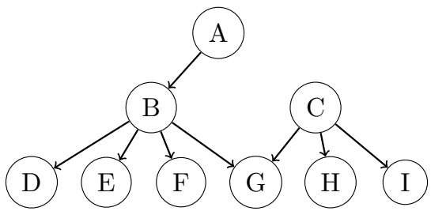

(a) [4 pts] Given the following domain sizes for the variables:

| Variable | Domain Size |
| --- | --- |
| A | $2^{2}$ |
| B | $2^{3}$ |
| C | $2^{8}$ |
| D | $2^{5}$ |
| E | $2^{6}$ |
| F | $2^{7}$ |
| G | $2^{8}$ |
| H | $2^{9}$ |
| I | $2^{10}$ |

What is the size of the biggest factor generated when we perform variable elimination with an alphabetical elimination order for the query $P ( G = g \mid I = i )$ for some $g \in \mathrm { d o m } ( G )$ and $i \in \mathrm { d o m } ( I ) ?$

$$
2^{27}
$$

Eliminating A generates f(B) of size $2 ^ { 3 }$

Eliminating B generates $f ( D , E , F , g , C )$ of size $2 ^ { 5 + 6 + 7 + 8 } = 2 ^ { 2 6 }$

Eliminating C generates $f ( D , E , F , g , H , i )$ of size $2^{5+6+7+9}=2^{27}$

Eliminating $D , \ldots , H$ generates factors of size strictly smaller than $2 ^ { 2 7 }$

(b) [3 pts] Which is the variable whose elimination generates the biggest factor if we perform variable elimination in alphabetical order for the query $P ( G = g \mid I = i )$ for some $g \in \mathrm { d o m } ( G )$ and $i \in \mathrm { d o m } ( I ) ?$ # A # B C # D # E # F # G # H # I # None of the above

The solution follows from the previous part.

(c) [5 pts] Now, suppose the variables are all boolean variables, give an elimination ordering that generates the smallest largest factor for the query $P ( A = a \mid I = i )$ for some $a \in \operatorname { d o m } ( A )$ and i ∈ dom(I). Leave the extra boxes blank. For example, if your elimination ordering is $X , Y , Z ,$ you should only fill in the first 3 boxes.

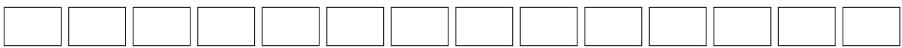

\- Any permutation of {D, E, F, H}, followed by any permutation of $\{ B , C , G \}$

\- Alternative solutions like {D, E, F, B, G, C, H} are also accepted.

<!-- page: 11 -->

## Q5. [21 pts] Decision Networks and VPI

Valerie has just found a cookie on the ground. She is concerned that the cookie contains raisins, which she really dislikes but she still wants to eat the cookie. If she eats the cookie and it contains raisins she will receive a utility of −100 and if the cookie doesn’t contain raisins she will receive a utility of 10. If she doesn’t eat the cookie she will get 0 utility. The cookie contains raisins with probability 0.1.

(a) [3 pts] We want to represent this decision network as an expectimax game tree. Fill in the nodes of the tree below, with the top node representing her maximizing choice.

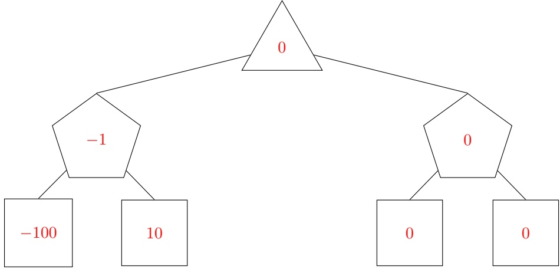

(b) [1 pt] Should Valerie eat the cookie? # Yes No

(c) [3 pts] Valerie can now smell the cookie to judge whether it has raisins before she eats it. However, since she dislikes raisins she does not have much experience with them and cannot recognize their smell well. As a result she will incorrectly identify raisins when there are no raisins with probability 0.2 and will incorrectly identify no raisins when there are raisins with probability 0.3. This decision network can be represented by the diagram below where E is her choice to eat, U is her utility earned, R is whether the cookie contains raisins, and S is her attempt at smelling.

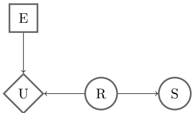

Valerie has just smelled the cookie and she thinks it doesn’t have raisins. Write the probability, X, that the cookie has raisins given that she smelled no raisins as a simplest form fraction or decimal.

$$
\begin{array}{l} X = \boxed {0. 0 4} \\ P (+ r | - s) = \frac {P (- s | + r) P (+ r)}{P (- s)} = \frac {P (- s | + r) P (+ r)}{P (- s | + r) P (+ r) + P (- s | - r) P (- r)} = \frac {. 3 * . 1}{. 3 * . 1 + . 8 * . 9} = \frac {. 0 3}{. 7 5} = . 0 4 \end{array}
$$

(d) [3 pts] What is her maximum expected utility, Y given that she smelled no raisins? You can answer in terms of X or as a simplest form fraction or decimal.

$$
\begin{array}{l} Y = \boxed {- 1 0 0 X + 1 0 (1 - X),   5. 6} \\ M E U (- s) = m a x (M E U (e a t i n g | - s), M E U (n o t e a t i n g | - s)) = \\ m a x (P (+ r | - s) * E U (e a t i n g, + r) + P (- r | - s) * E U (e a t i n g, - r), M E U (n o t e a t i n g)) = \\ m a x (X * (- 1 0 0) + (1 - X) * 1 0, 0) = \\ X * 1 0 0 + (1 - X) * 1 0 \end{array}
$$

<!-- page: 12 -->

(e) [3 pts] What is the Value of Perfect Information (VPI) of smelling the cookie? You can answer in terms of X and Y or as a simplest form fraction or decimal.

| VPI = | 0.75 * Y,4.2 |
| --- | --- |

$$
V P I (S) = M E U (S) - M E U (\emptyset)
$$

$$
M E U (S) = P (- s) M E U (- s) + P (+ s) M E U (+ s)
$$

$$
P (- s) = . 7 5 \text { from   part (c), } M E U (- s) = Y
$$

$M E U ( + s ) = 0$ because it was better for her to not eat the raisin without knowing anything, smelling raisins will only make it more likely for the cookie to have raisins and it will still be best for her to not eat and earn a utility of 0. Note this means we do not have to calculate P(+s).

$$
M E U (\emptyset) = 0
$$

$$
V P I (S) = . 7 5 * Y + 0 - 0 = . 7 5 * Y
$$

(f) [8 pts] Valerie is unsatisfied with the previous model and wants to incorporate more variables into her decision network. First, she realizes that the air quality (A) can affect her smelling accuracy. Second, she realizes that she can question (Q) the people around to see if they know where the cookie came from. These additions are reflected in the decision network below.

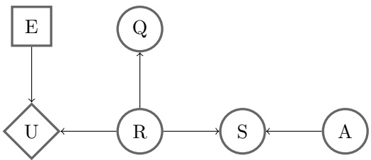

Choose one for each equation:

|  | Could Be True | Must Be True | Must Be False |
| --- | --- | --- | --- |
| $VPI(A,S) > VPI(A) + VPI(S)$ | ● | ○ | ○ |
| $VPI(A) = 0$ | ○ | ● | ○ |
| $VPI(Q,R) \leq VPI(Q) + VPI(R)$ | ○ | ● | ○ |
| $VPI(S,R) > VPI(R)$ | ○ | ○ | ● |
| $VPI(Q) \geq 0$ | ○ | ● | ○ |
| $VPI(Q,A) > VPI(Q)$ | ○ | ○ | ● |
| $VPI(S\|A) < VPI(S)$ | ○ | ○ | ● |
| $VPI(A\|S) > VPI(A)$ | ● | ○ | ○ |

<!-- page: 13 -->

## Q6. [10 pts] Bayes Nets Representation

(a) [5 pts] Given the joint probability table on the right.

Clearly fill in all circles corresponding to Bayes Nets (BNs) that can correctly represent the distribution on the right. If no such Bayes Nets are given, clearly select None of the above.

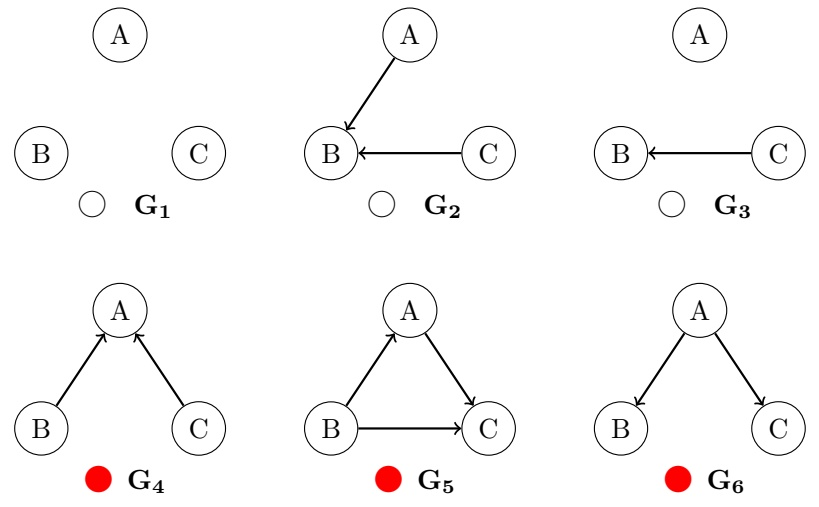

| A | B | C | P(A,B,C) |
| --- | --- | --- | --- |
| 0 | 0 | 0 | .22 |
| 0 | 0 | 1 | .08 |
| 0 | 1 | 0 | .22 |
| 0 | 1 | 1 | .08 |
| 1 | 0 | 0 | .09 |
| 1 | 0 | 1 | .11 |
| 1 | 1 | 0 | .09 |
| 1 | 1 | 1 | .11 |

\# None of the above.

From the table we can see that the values of $P ( A , B , C )$ repeat in two blocks. This means that the value of B does not matter to the distribution. The values are otherwise all unique, meaning that there is a relationship between A and C. Together, this means that B ⊥⊥ A, (B ⊥⊥ A | C), B ⊥⊥ C, and $(B \perp    \perp C \mid A)$ are the only independence relationships in the distribution.

(b) [5 pts] For the pair of Bayes Net (BN) models below, indicate if the New BN model is guaranteed to be able to represent any joint distribution that the Old BN Model can represent. If the New BN model is guaranteed to be able to represent any joint distribution that the Old BN Model can represent, select ”None.” Otherwise, fill in the squares corresponding to the minimal number of edges that must be added such that the modified New BN can represent any joint distribution that the Old BN Model can represent. Select ”Not Possible” if no combination of added edges can result in the modified New BN representing any joint distribution that the Old BN Model can represent.

Old BN Model

New BN Model

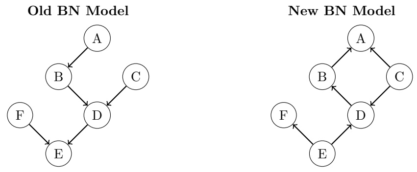

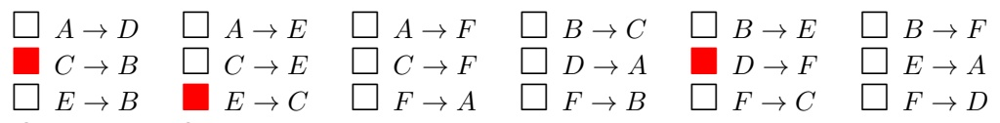

None Not Possible

The new BN makes the following independence assumptions that the old BN does not make: C ⊥⊥ E, $(B \perp    \perp C | D)$ $(C \perp    \perp F | E),   (D \perp    \perp F | E)$

• $E \rightarrow C$ resolves $C \perp     \perp E,   (D \perp     \perp F | E)$

Alternatively, $C \rightarrow E$ resolves $C \perp     \perp E$

<!-- page: 14 -->

• C → B resolves $(B \perp    \perp C | D)$

• D → F resolves $(C \perp F | E),   (D \perp F | E)$
