<!-- page: 1 -->

\- You have approximately 170 minutes.

\- The exam is open book, open calculator, and open notes.

\- For multiple choice questions,

\- $\square$ means mark all options that apply

\- $\bigcirc$ means mark a single choice

| First name |  |
| --- | --- |
| Last name |  |
| SID |  |

For staff use only:

| Q1. | Shrektacular Swamp | /16 |
| --- | --- | --- |
| Q2. | Pac-Pact | /16 |
| Q3. | Tom and Jerry, Continued | /11 |
| Q4. | Mesut-Bot Going to Class | /19 |
| Q5. | Reinforcement Learning on Belief States | /11 |
| Q6. | Pac-mate or Pac-poster | /10 |
| Q7. | Value of Pacman Information | /17 |
|  | Total | /100 |

<!-- page: 2 -->

<!-- page: 3 -->

## Q1. [16 pts] Shrektacular Swamp

Shrek finds himself in the 3x3 grid world below. He starts in square 1 and he wants to reach his swamp in square 9. His 4 available actions are to move up, left, right, and down, from one numbered square to another. Actions that move Shrek out of the grid are not allowed.

| 1 | 2 | 3 |
| --- | --- | --- |
| 4 | 5 | 6 |
| 7 | 8 | 9 |

(a) Shrek decides to plan his route using search algorithms. His state space contains 9 total states, one for each square in the grid.

There are 5 candidate paths from state 1 to state 9 below, labeled (A through E). For each search algorithm below select all paths that the algorithm could possibly return under some tie breaking system.

Note for A\* algorithms, $n$ is the integer label of the square, the cost we are trying to minimize is the total number of moves, and we only update a state's value in the fringe if the value in the fringe is strictly greater than the value we are updating to.

A

| ↓1 | 2 | 3 |
| --- | --- | --- |
| →4 | ↓5 | 6 |
| 7 | →8 | 9 |

B

| ↓1 | 2 | 3 |
| --- | --- | --- |
| ↓4 | 5 | 6 |
| →7 | →8 | 9 |

C

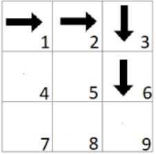

D

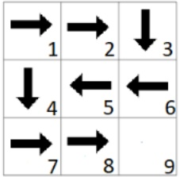

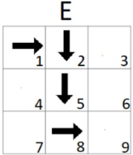

(i) [1 pt] DFS Graph Search
A B C D E ○ None of the paths
DFS can explore nodes in any order so any path that reaches the end is possible.

(ii) [1 pt] BFS
A B C D E None of the paths
BFS finds the path with the least amount of transitions so any path that makes 4 transitions is possible.

(iii) [2 pts] A\* with heuristic $h(n) = 10 * n$
□ A □ B ■ C □ D □ E ○ None of the paths
This heuristic causes us to explore squares with lower numbers first so path C will be the first path explored to the end.

(iv) [2 pts] A\* with heuristic $h(n) = 10 * (10 - n)$ □ A ■ B □ C □ D □ E ○ None of the paths ☐ A ☐ B ☐ C ☐ D ☐ E ☐ None of the paths
This heuristic causes us to explore squares with greater numbers first so path B will be the first path explored to the end.

(v) [2 pts] A\* with heuristic $h(n) = n \mod 3$ (where $x \mod y$ is the remainder when $x$ is divided by $y$). □ A □ B ■ C □ D □ E ○ None of the paths

This heuristic causes us to explore nodes that are a multiple of 3 first. In path C, 3 is added to the fringe from state 2 and then the algorithm will explore to state 9.

(b) Lord Farquaad wants to take over Shrek's swamp so he decides to navigate the same grid world. However, he decides to frame the problem as an MDP with 9 states and 4 actions. The transitions are deterministic and work the same as the previous part. Farquaad is forbidden from taking any action that attempts to move him out of the grid. State 9 is a terminal state so no more actions can be taken from there.

There are 5 candidate policies below. For each reward function and discount factor pair below select all candidate policies

<!-- page: 4 -->

that will get you the optimal reward for all 8 non-terminal states.

Note, $I(\text{condition})$ is an indicator function that is equal to 1 if the condition is true and it is equal to 0 otherwise.

A

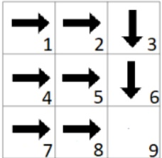

B

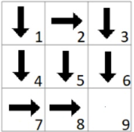

C

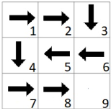

D

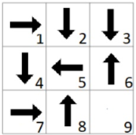

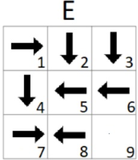

(i) [1 pt] $R(s, a, s') = I(a = right) + 10 * I(s' = 9)$, $\gamma = .5$

A □ B □ C □ D □ E ○ None of the policies

This reward function incentivizes us to reach state 9 while moving right as fast as possible and A is the only policy that does this.

(ii) [1 pt] $R(s, a, s') = -1$, $\gamma = .75$ A B C D E None of the policies

This reward function incentivizes us to reach state 9 as fast as possible to incur the least amount of negative rewards.

(iii) [2 pts]  $R(s, a, s') = I(a = right) + 10 * I(s' = 9) - I(a = left)$ ,  $\gamma = 1$ 
A B C D E None of the policies

This reward function incentivizes us to reach state 9 but it no longer requires us to move right as fast as possible because the discount factor is 1. Note the left moves in path C are still optimal because they have right moves later in the path that compensate.

(iv) [2 pts] $R(s, a, s') = I(a = right) + I(a = left)$, $\gamma = .75$

$$
\begin{array}{c c c c c} \text {A} & \square \mathrm{B} & \square \mathrm{C} & \square \mathrm{D} & \square \mathrm{E} \end{array}
$$

None of the policies

This reward function incentivizes us to oscillate left and right as fast as possible without exiting. None of the policies do this because they all contain up or down movements on at least one square.

(v) [2 pts] $R(s, a, s') = 10 * I(s' \neq 9) + 15 * I(s' = 9)$, $\gamma = .5$
    □ A    □ B    □ C    ■ D    ■ E    ○ None of the policies

This reward function incentivizes us to never reach state 9 and earn an eventual reward of $10 + 5 + 2.5 + 1.25 + \dots = 20$ instead of the 15 for reaching state 9. Thus any policy that doesn't reach state 9 works.

<!-- page: 5 -->

## Q2. [16 pts] Pac-Pact

Pacman and his two ghost buddies are driving down a 3 lane highway, each in their own lane. They want to stay next to each other for the entirety of the n timesteps of their roadtrip. For any timestep t, let  $X_{t}$  denote the position of Pacman,  $Y_{t}$  the position of Ghost Y, and  $Z_{t}$  the position of Ghost Z.

\- Pacman and his ghost buddies start on the three lanes in random positions.

\- At each timestep, each agent either accelerates or decelerates by a controllable amount.

\- We model this problem such that during each timestep $t$, Ghost $Z$ acts first, Ghost $Y$ acts second, and Pacman acts third.

\- Each agent's position at time $t$ is influenced by their position in the previous timestep, $t - 1$.

\- Ghost $Y$'s position at time $t(Y_t)$ is influenced by Ghost $Z$'s position at time $t - 1(Z_{t-1})$ and $t(Z_t)$.

\- Pacman's position at time $t$ is influenced by Ghost $Y$'s position at time $t - 1(Y_{t-1})$ and $t(Y_t)$.

This gives us the Bayes Net below.

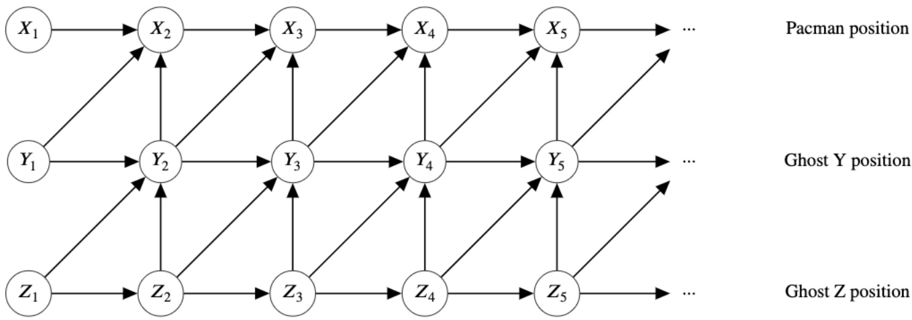

(a) First we analyze the independence assumptions of our Bayes Net.

(i) [2 pts] Which of the following independence relations are guaranteed?

$\boxed{\quad}Z_{4}\perp Y_{3}$

$\square X_{t}\perp\perp X_{t-3}|X_{t-1}\text{ for }4\leq t\leq n$

$\square X_{t}\perp X_{t - 3}|X_{t - 1},Y_{t - 1}$ for $4\leq t\leq n$

$X_{t}\perp X_{t - 3}|X_{t - 1},Y_{t - 1},Z_{t - 1}$ for $4\leq t\leq n - 1$

○ None of the above

1.  $Z_{4} \perp Y_{3}$  is not guaranteed because of the active path  $Z_{4} - Z_{3} - Y_{3}$ .

2. $X_{t} \perp X_{t - 3}|X_{t - 1}$ is not guaranteed because of the active path $X_{t - 3} - X_{t - 2} - X_{t - 1} - Y_{t - 1} - X_t$.

3. $X_{t} \perp X_{t-3}|X_{t-1}, Y_{t-1}$ is not guaranteed because of the active path $X_{t-3} - X_{t-2} - X_{t-1} - Y_{t-2} - Z_{t-2} - Z_{t-1} - Y_{t} - X_{t}$.

4. Blocking the entire previous timestep means that all paths between  $X_{t}$  and  $X_{t-3}$  are blocked, so they are guaranteed to be independent.

(ii) [2 pts] If we are trying to determine Pacman's position on the highway from timesteps 1 to 4, and we are given Ghost Y's position from timesteps 1 to 4, which of the following are guaranteed to not give us additional information to solve our problem?

Ghost Z's position at timestep 3

Ghost Z's position at timestep 5

<!-- page: 6 -->

Pacman position

Ghost $Y$’s position at timestep 5  
$\square$ Pacman's position at timestep 5  
$\bigcirc$ None of the above

Given Ghost Y's positions over time, ghost Z's positions are independent of Pacman's positions over that same range of time, due to the blocked causal chains. $Y_5 \perp X_4$ due to an inactive triple, so ghost Y's position at timestep 5 does not help us figure out Pacman's position at timestep 4, nor does it help us figure out any of Pacman's previous positions.

(iii) [1 pt] What is the minimal number of variables that must be given for Pacman's position at time $t$ to be independent of Ghost Z's position at time $t$, for $t \geq 2$? \_\_\_\_ 3

\- We need to block the $Z_{t} - Y_{t} - X_{t}$ path. So we need $Y_{t}$ as a given.

\- However, this creates active paths: $Z_{t} - Y_{t} - Y_{t - 1} - X_{t}$ and $Z_{t} - Y_{t} - Y_{t - 1} - X_{t - 1} - X_{t}$. So to block these, we need $Y_{t - 1}$ as a given.

\- Note there are no active paths from $Z_{t}$ to $X_{t}$ that go through some $Y_{t+k}$ because those involve common effect inactive triples.

\- However, there are active paths that go back in time and get to $X_{t}$ through $X_{t - 1}$. So we need to block all of these active paths by having $X_{t - 1}$ given.

Therefore, blocking $X_{t - 1},Y_{t - 1}$ , and $Y_{t}$ results in a minimum of 3 variables.

You realize that the Bayes Net above does not accurately reflect the interactions between Pacman and his ghost buddies. You notice that:

\- Ghost $Z$ takes cues from Pacman with probability $p$, so Ghost $Z$'s position at any time $t$ depends on Pacman's position at time $t - 1$ with probability $p < 1$.

Taking this into account, you modify the Bayes Net as shown below, with dotted edges denoting those that exist with probability $p < 1$.

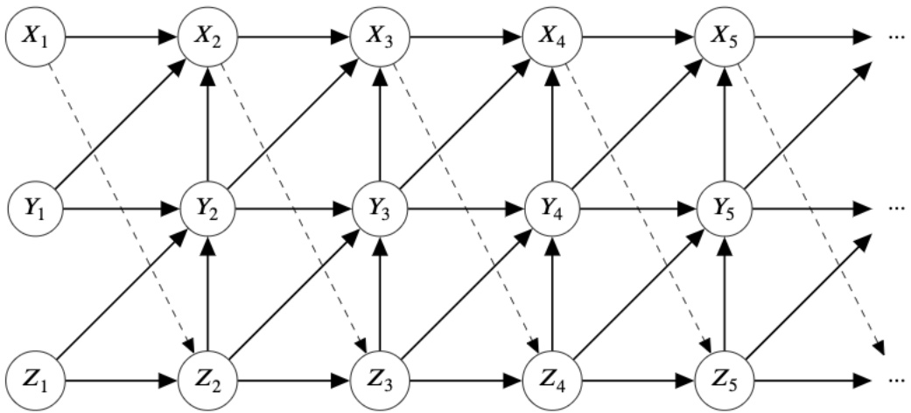

(b) (i) [1 pt] If the entire roadtrip was $n$ timesteps long, what is the expected number of timesteps where Ghost Z takes into account Pacman's position before moving?
○ $n - 1$
● $(n - 1)p$
○ $\frac{n - 1}{p}$
○ $\frac{n - 1}{1 - p}$
○ $(n - 1)(1 - p)$
○ None of the above

Binomial. $n - 1$ trials, and probability of success $p$ gives the expectation $(n - 1)p$

(ii) [1 pt] What is the probability we are guaranteed that $X_{1} \perp X_{3}|X_{2}$ based on conditional independence assumptions encoded in the Bayes Net?

<!-- page: 7 -->

0
○ p
○ $p^2$
○ $p(1-p)$
○ $2p(1-p)$
○ $(1-p)^2$
○ $1-p$
○ 1
○ None of the above
$X_1 - X_2 - Y_2$ is an active triple with $X_2$ given. Then we have $Y_2$ influencing $X_3$ no matter whether the dotted edges are there or not.
(iii) [1 pt] What is the probability we are guaranteed that $X_1 \perp X_t|X_2, Y_1, Y_2$, for any $3 &lt; t &lt; n$ based on conditional independence assumptions encoded in the Bayes Net?
○ 0
○ p
○ $p^2$
○ $p(1-p)$
○ $p(1-p)^{t-1}$
○ $p^{t-1}(1-p)$
○ $2p(1-p)$
○ $(1-p)^2$
● 1-p
○ 1
○ None of the above
The key here is that it only depends on the first dotted edge, X1-Z2. If that one is off, then X1-X4 is guaranteed independent. If not, there is no such guarantee, no matter what the rest of the dotted edges are.
(iv) [2 pts] What is the probability we are guaranteed that $X_1 \perp X_t|X_k, Y_{k-1}, Y_k$, for any k, t where $2 &lt; k &lt; t &lt; n$ based on conditional independence assumptions encoded in the Bayes Net?
○ 0
○ $p^{k-1}(1-p)^{t-k}$
○ $p^{t-k}(1-p)^{k-1}$
○ $p^k(1-p)^{t-k}$
○ $p^{t-k}(1-p)^k$
○ $\binom{t-1}{k}p^k(1-p)^{t-1-k}$
○ $\binom{n}{k}p^k(1-p)^{n-k}$
● $(1-p)^{k-1}$
○ $(1-p)^{t-1-k}$
○ $p^{k-1}$
○ $p^{t-1-k}$
○ 1
○ None of the above
The key here is that it only depends on the first k-1 dotted edges. If all of them are off, then we guarantee the above conditional independence statement is true. If any of them are on, then there exists a path through that dotted edge that "skips over" the given variables and creates an active path. Note that the other edges after the first k-1 do not matter in guaranteeing the above conditional independence.
(v) [2 pts] What is the expected minimum number of given variables to guarantee that Pacman's position at time $t+1$ is independent of Ghost Z's position at time t-1, with dotted edge probability p&lt;1?
○ 1
○ $p^2 + 2p(1-p) + (1-p)^2$
○ 2
○ $2p + 3(1-p)$
○ $2(1-p) + 3p$
○ $p^2 + 4p(1-p) + 3(1-p)^2$
● 3
○ $3p + 4(1-p)$
○ $3(1-p) + 4p$

<!-- page: 8 -->

$\bigcirc 2p^{2} + 6p(1 - p) + 4(1 - p)^{2}$

○ 4

○ None of the above

With or without any combination of dotted edges, we see that 3 nodes, $X_{t}, Y_{t}$, and $Y_{t+1}$, is the smallest set needed to block all active paths from $Z_{t-1}$ to $X_{t+1}$

## (c) You want the joint probability of all three agent positions during some timestep $t$ after knowing their positions in the previous timestep, $t - 1$.

(i) [2 pts] For this part, let the dotted edge probability $p = 0$. Which of the following are equivalent to $P\left(X_{t}, Y_{t}, Z_{t} | X_{t-1}, Y_{t-1}, Z_{t-1}\right)$?

$\square P(X_{t})P(Y_{t}|X_{t})P(Z_{t}|X_{t},Y_{t})$

$\square P(Z_{t})P(Y_{t}|Z_{t})P(X_{t}|Y_{t},Z_{t})$

$$
P (Z _ {t} | X _ {t - 1}, Y _ {t - 1}, Z _ {t - 1}) P (Y _ {t} | X _ {t - 1}, Y _ {t - 1}, Z _ {t - 1}, Z _ {t}) P (X _ {t} | X _ {t - 1}, Y _ {t - 1}, Z _ {t - 1}, Y _ {t}, Z _ {t})
$$

$$
P (Z _ {t} | X _ {t - 1}, Y _ {t - 1}, Z _ {t - 1}) P (Y _ {t} | Y _ {t - 1}, Z _ {t - 1}, Z _ {t}) P (X _ {t} | X _ {t - 1}, Y _ {t - 1}, Y _ {t})
$$

$P(Z_{t}|Z_{t - 1})P(Y_{t}|Y_{t - 1},Z_{t - 1},Z_{t})P(X_{t}|X_{t - 1},Y_{t - 1},Y_{t})$

○ None of the above

We break down the expression using the Chain Rule to get these three options.

(ii) [2 pts] Which of the following are equivalent to $P\left(X_{t}, Y_{t}, Z_{t} | X_{t-1}, Y_{t-1}, Z_{t-1}\right)$ for any probability of the dotted edge $p < 1$?

$$
\square P (X _ {t}) P (Y _ {t} | X _ {t}) P (Z _ {t} | X _ {t}, Y _ {t})
$$

$$
\square P (Z _ {t}) P (Y _ {t} | Z _ {t}) P (X _ {t} | Y _ {t}, Z _ {t})
$$

$$
\square P (Z _ {t} | Z _ {t - 1}) P (Y _ {t} | Y _ {t - 1}, Z _ {t - 1}, Z _ {t}) P (X _ {t} | X _ {t - 1}, Y _ {t - 1}, Y _ {t})
$$

$$
P (Z _ {t} | X _ {t - 1}, Z _ {t - 1}) P (Y _ {t} | Y _ {t - 1}, Z _ {t - 1}, Z _ {t}) P (X _ {t} | X _ {t - 1}, Y _ {t - 1}, Y _ {t})
$$

$$
\left[ p * P (Z _ {t} | X _ {t - 1}, Z _ {t - 1}) + (1 - p) * P (Z _ {t} | Z _ {t - 1}) \right] P (Y _ {t} | Y _ {t - 1}, Z _ {t - 1}, Z _ {t}) P (X _ {t} | X _ {t - 1}, Y _ {t - 1}, Y _ {t})
$$

○ None of the above

$P(Z_{t}|X_{t-1},Z_{t-1})P(Y_{t}|Y_{t-1}Z_{t-1},Z_{t})P(X_{t}|X_{t-1}Y_{t-1},Y_{t})$  is correct because when the dotted edge exists, it is right on. When the dotted edge does not exist,  $P(Z_{t}|X_{t-1},Z_{t-1}) = P(Z_{t}|Z_{t-1})$  due to conditional independence in the Bayes Net.

<!-- page: 9 -->

# Q3. [11 pts] Tom and Jerry, Continued

Tom and Jerry are playing a game. Each of them has three cards, Rock (R), Paper (Pa), and Scissors (S). The usual rule for Rock-Paper-Scissors applies: R beats S, S beats Pa, and Pa beats R.

Each round, both Tom and Jerry play a card. If Tom's card beats Jerry's card, Tom gets a reward of 1; If there is a tie, Tom gets a reward of 0.5; otherwise Tom gets 0 reward. The played cards cannot be played again. The game ends after three rounds, when neither Tom nor Jerry has any card to play.

However, the game is asymmetric in that Jerry plays according to a fixed pre-made plan regardless of what cards Tom plays. Tom is also aware of the fact that Jerry is playing according to a fixed plan for every game.

(a) Tom has an initial policy $\pi$, which is to play card $R$ first, then card $Pa$, and finally card $S$.

(i) [3 pts] Tom does not know Jerry's plan, but he wants to evaluate the expected reward he can get with the initial policy by playing with Jerry. Which of the following methods can Tom use to achieve this?

□ Value Iteration □ Policy Iteration ■ Direct Evaluation

Temporal-Difference Learning □ Q-learning □ Not Possible

Rubric: 3 points for completely correct. 1.5 points for one off (one less OR one more). 0 point otherwise. Choosing anything with "not possible" gives 0 points.

(ii) [2 pts] Tom's friend, Spike, intercepts Jerry's plan and tells it to Tom. Tom knows that Jerry is going to play card $S$ with probability 0.5 and card $R$ with probability 0.5 in the first round, and play one of the remaining cards uniformly at random in the second round.

What is the expected reward of Tom's policy? If there is not enough information, write NO.

1.875 or 15/8

Since both Jerry's and Tom's policies are known, there is enough information for us to calculate the expected reward. There are four possible rollouts for Jerry: $SRPa$, $RSPa$, $SPaR$, $RPaS$, each with probability 0.25, and corresponding reward for tom 3, 1.5, 1.5, 1.5. So the expected reward is $7.5/4 = 15/8$.

(iii) [1 pt] Tom learned an optimal policy $\pi^{*}$ against Jerry's plan with one of the methods from the previous part. Playing under policy $\pi^{*}$ is deterministic, i.e., Tom plays some card with probability 1 conditioned on the cards Jerry previously played in each round. Spike claims that since Jerry uses a stochastic policy, it may be sub-optimal for Tom to only consider deterministic policies. Is Spike correct?

○ Yes, since there are many more stochastic policies than deterministic policies, so considering stochastic policies gives more flexibility.

○ Yes, but not for the reason above.

No, because for any plan that Jerry makes, there always exists a deterministic policy that is at least at good as any other policy against Jerry's plan.

○ No, but not for the reason above.

We can formulate the problem as an MDP since Jerry's plan is fixed. If we run value iteration (or policy iteration) on this MDP, we end up with a deterministic optimal policy.

(b) [2 pts] Jerry changed his plan. Spike somehow knew that Jerry changed the plan and told this to Tom. However, Tom has no information about what the new plan is.

Which of the following methods can Tom use to learn an optimal policy against Jerry's new plan? Tom is allowed to play as many times as desired with Jerry to learn the policy.

□ Value Iteration □ Policy Iteration □ Direct Evaluation

☐ Temporal-Difference Learning ☐ Q-learning ☐ Not Possible

Rubric: 2 points for completely correct. 1 point for choosing "Not possible". 1 point for choosing "Q-learning" with one other choice. 0 point otherwise. Choosing anything else along with "not possible" gives 0 points.

(c) (i) [1 pt] True or False: No matter what Jerry's plan is, there always exists a policy where Tom gets an expected total reward of at least 1.5 with this policy.

<!-- page: 10 -->

## - True    ○ False

If Tom use the exact same policy as Jerry, the expected reward will be 1.5

(ii) [2 pts] Jerry wants to come up with a plan that minimizes Tom's reward under Tom's optimal policy against the plan. What is such an optimal plan for Jerry? Fill in the probability with which Jerry will play each card in the first round.

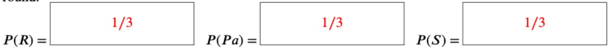

Play all the cards uniformly at random. No matter what Tom's policy is, the expected total reward is only 1.5.

<!-- page: 11 -->

## Q4. [19 pts] Mesut-Bot Going to Class

Your friend Mesut-Bot is a very diligent robot and tries to attend all the live lectures and discussions even though there are recordings. However, Pacman thinks it would be fun to make Mesut-Bot accidentally pop into random Zoom rooms, so he mischievously adds a list of random links to Mesut-Bot's calendar. Being a diligent robot himself, Mesut-Bot has hand-picked some features and modeled them as a Naive Bayes classification problem. The features are:

\- Z - If the link contains "zoom.us" in it

\- B - If the link contains "berkeley" in it

\- N - If the link ends with a number

To help your friend Mesut-Bot, you offer him some training data based on your experience in Zoom University. Below is the data and the Naive Bayes structure:

| Data | Link | Valid? |
| --- | --- | --- |
| 1 | https://berkeley.zoom.us/j/000000 | 1 |
| 2 | https://stanford.zoom.us/j/notaroom | 1 |
| 3 | https://berkeley.zoom.us/j/nowhere | 0 |
| 4 | https://www.twitch.tv/888 | 1 |

| Data | Link | Valid? |
| --- | --- | --- |
| 5 | https://berkeley.zoom.us/j/11111111 | 0 |
| 6 | https://berkeley.zoom.us/j/myroom | 1 |

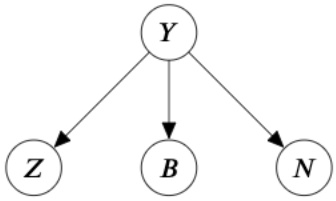

Knowing that these links are all he has, Mesut-Bot decides to use data  $\{1,2,3,4\}$  for training and  $\{5,6\}$  for testing.

(a) [2 pts] Using Maximum Likelihood Estimation without Laplace smoothing, calculate the following values using the training data. If necessary, round your answer to the nearest hundredth (i.e.: 1.2345 would round to 1.23):

\- $P(Z = true|Y = 1) = \underline{0.67}$

\- $P(B = false|Y = 0) = \underline{0}$

\- $P(N = true|Y = 1) = \underline{0.67}$

Here are the complete CPTs after training:

<table><tr><td colspan="2"></td><td>Z</td><td>Y</td><td>P(Z|Y)</td><td>B</td><td>Y</td><td>P(B|Y)</td><td>N</td><td>Y</td><td>P(N|Y)</td></tr><tr><td>Y</td><td>P(Y)</td><td>true</td><td>1</td><td> $\frac{2}{3}/0.67$ </td><td>true</td><td>1</td><td> $\frac{1}{3}/0.33$ </td><td>true</td><td>1</td><td> $\frac{2}{3}/0.67$ </td></tr><tr><td>1</td><td>0.75</td><td>false</td><td>1</td><td> $\frac{1}{3}/0.33$ </td><td>false</td><td>1</td><td> $\frac{2}{3}/0.67$ </td><td>false</td><td>1</td><td> $\frac{1}{3}/0.33$ </td></tr><tr><td>0</td><td>0.25</td><td>true</td><td>0</td><td>1</td><td>true</td><td>0</td><td>1</td><td>true</td><td>0</td><td>0</td></tr><tr><td colspan="2"></td><td>false</td><td>0</td><td>0</td><td>false</td><td>0</td><td>0</td><td>false</td><td>0</td><td>1</td></tr></table>

(b) Now Mesut-Bot evaluates the model using data $\{5,6\}$. The CPTs constructed using Maximum Likelihood Estimation after training are shown below; use these along with your answers from the previous part to calculate the following probabilities. Note that values you were asked to compute in the previous part are omitted from the CPTs (marked as '-' in the tables).

<table><tr><td colspan="2"></td><td>Z</td><td>Y</td><td>P(Z|Y)</td><td>B</td><td>Y</td><td>P(B|Y)</td><td>N</td><td>Y</td><td>P(N|Y)</td></tr><tr><td>Y</td><td>P(Y)</td><td>true</td><td>1</td><td>-</td><td>true</td><td>1</td><td>1/3</td><td>true</td><td>1</td><td>-</td></tr><tr><td>1</td><td>0.75</td><td>false</td><td>1</td><td>-</td><td>false</td><td>1</td><td>2/3</td><td>false</td><td>1</td><td>-</td></tr><tr><td>0</td><td>0.25</td><td>true</td><td>0</td><td>1</td><td>true</td><td>0</td><td>-</td><td>true</td><td>0</td><td>0</td></tr><tr><td colspan="2"></td><td>false</td><td>0</td><td>0</td><td>false</td><td>0</td><td>-</td><td>false</td><td>0</td><td>1</td></tr></table>

<!-- page: 12 -->

(i) [2 pts] Calculate the following probabilities while evaluating the model for each datapoint. If necessary, round your answer to the nearest hundredth (i.e.: 1.2345 would round to 1.23).

\- Data 5:

$$
P (Y = 1 | Z = t r u e, B = t r u e, N = t r u e) = \underline {{\quad 1}}
$$

$$
P (Y = 0 | Z = t r u e, B = t r u e, N = t r u e) = \underline {{\quad 0 \quad}}
$$

\- Data 6:

$$
P (Y = 1 | Z = t r u e, B = t r u e, N = f a l s e) = \underline {{\quad}} \quad 0. 1 8
$$

$$
P (Y = 0 | Z = \text {true}, B = \text {true}, N = \text {false}) = \underline {{\quad 0 . 8 2}}
$$

Data 5:

$$
P (Y = 1 | Z = t r u e, B = T r u e, N = T r u e) = 0. 7 5 * 0. 6 7 * 0. 3 3 * 0. 6 7 \approx 0. 1 1 > 0
$$

$$
P (Y = 0 | Z = t r u e, B = T r u e, N = T r u e) = 0. 2 5 * 1 * 1 * 0 = 0
$$

Normalize to get 1 and 0.

Data 6:

$$
P (Y = 1 | Z = t r u e, B = T r u e, N = F a l s e) = 0. 7 5 * 0. 6 7 * 0. 3 3 * 0. 3 3 \approx 0. 0 6 <   0. 2 5
$$

$$
P (Y = 0 | Z = t r u e, B = T r u e, N = F a l s e) = 0. 2 5 * 1 * 1 * 1 = 0. 2 5
$$

Normalize to get 0.18 and 0.82

(ii) [1 pt] Using your answers from the previous subpart, what are the predictions for each datapoint?

$$
\bullet \quad \text {Data 5:} \bigcirc \hat {Y} = 0 \bullet \hat {Y} = 1
$$

$$
\bullet \quad \text {Data 6:} \quad \hat {Y} = 0 \bigcirc \hat {Y} = 1
$$

We select the value associated with the higher probability for Data 5 and Data 6, as per the previous part.

(iii) [1 pt] What is the test accuracy of this model? If necessary, round your answer to the nearest hundredth (i.e.: 1.2345 would round to 1.23).\_\_\_\_0\_\_\_\_

Both datapoints were classified incorrectly based on the true label.

(c) [2 pts] Mesut-Bot is sad that his Naive Bayes model performs so poorly, so he is thinking about ways to improve it. What are the ways that could potentially help Mesut-Bot mitigate bad effects due to overfitting?

Increase the amount of training data

☐ Increase the amount of test data

□ Adding a single feature

Use Laplace Smoothing

Use Logistic Regression

□ Use a Neural Network

Increasing train data and Laplace smoothing are the 2 common ways to reduce overfitting. While sometimes adding a feature could improve accuracy, it actually decrease the capacity of the model, so it encourage overfitting. Logistic regression will actually help to generalize the data better than Naive Bayes. On the other hand, using a neural network can cause greater amounts of overfitting.

Luckily, Mesut-Bot finds his way to CS 188 lecture. He is asked to classify the following datasets:

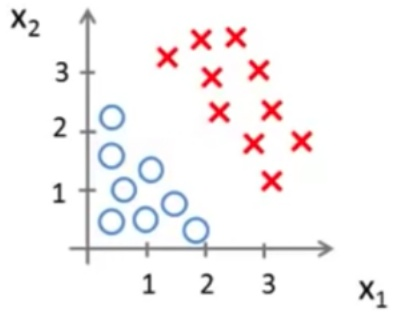

Figure 1: Dataset 1

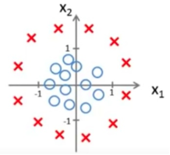

Figure 2: Dataset 2

(d) Using the given features and the specified dataset, which model(s) can achieve a training accuracy of 1?

<!-- page: 13 -->

(i) [1 pt] Dataset 1: $X_1, X_2$ Perceptron Logistic Regression Neural Network None of the above

The points in Dataset 1 are linearly separable, so all of the above methods are able to correctly classify them

(ii) [1 pt] Dataset 2: $X_1, X_2$ Perceptron Logistic Regression Neural Network None of the above

The points in Dataset 2 are not linearly separable, so neither Perceptron or Logistic Regression can reach a perfect training accuracy. However, since a Neural Network can estimate arbitrary functions, it can definitely estimate e.g. a circle around the origin with radius 1 in  $X_{1}$  and  $X_{2}$  space, which classifies the points perfectly

(iii) [1 pt] Dataset 2: $X_1, X_2, X_1X_2$  
Perceptron  
Logistic Regression  
Neural Network  
None of the above

Here, only adding an  $X_{1}X_{2}$  term will not enable Perceptron or Logistic Regression to reach an accuracy of 1 because the resulting decision boundary will be a reciprocal function in the form of  $y = a/(x - h) + k$ , which cannot classify all points

(iv) [1 pt] Dataset 2: $X_1, X_2, X_1^2, X_2^2$  
Perceptron  
Logistic Regression  
Neural Network  
None of the above

Adding  $X_{1}^{2}, X_{2}^{2}$  as the features will do the trick: the Perceptron/Logistic Regression can predict  $X_{1}^{2} + X_{2}^{2} = 1$  as the decision boundary (which is linear in the feature space), which will correctly classify all points

(e) [4 pts] We know that the activation function is an important part of the neural network.

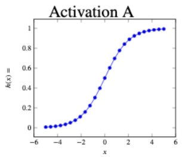

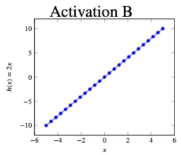

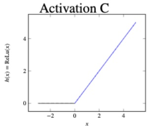

Assuming any network configuration is possible, which of the activation functions above will fit each function with any arbitrary error bound  $\epsilon$ :

$$
\begin{array}{l} \text {(ii)} [ 0 \text {pts} ] f (x) = \left\{ \begin{array}{l l} 1, & \text {if} x <   - 1 \\ - x, & \text {if} - 1 <   x <   0 \\ 0, & \text {otherwise} \end{array} \right. \\ \boxed {\quad} \mathrm{A} \quad \boxed {\quad} \mathrm{B} \quad \boxed {\quad} \mathrm{C} \quad \bigcirc \quad \text {None} \end{array}
$$

<!-- page: 14 -->

(iii) [0 pts]  $f(x)=1$

A B C ○ None

With arbitrary width, a neural network can fit any function with a desired accuracy by adding more neurons, under the condition that there is non-linearity in the activation function. If there is no non-linearity in the activation function, the neural network can still represent linear functions.

Rubric: For (i) and (ii): 1 point being for completely correct. 0.5 point for one off  $(A, C, \text{or } A, B, C)$ . For (iii): 1 point for choosing B, and 0.5 point for choosing A and C each. Choosing anything with None gives 0 points.

(f) [3 pts] A neural network is presented below. $\sigma(x) = \frac{1}{1 + e^{-x}} = \frac{e^x}{e^x + 1}$, and $\tanh(x) = \frac{e^{2x} - 1}{e^{2x} + 1}$.

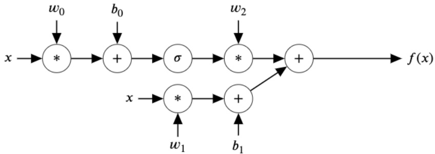

Which of the following are correct about this neural network?

☐ With sufficient amount of data, this neural network can accurately approximate the function  $f(x) = \sin(x)$ . (You trained a neural network to approximate the  $\sin(x)$  function in project 5.)

☐ This neural network often generalizes well to unseen data.

A deeper neural network is better at expressing complicated functions than this neural network.

☐ Adding an extra "+" node with bias  $b_{2}$  before (to the left of) the "\*" node with coefficient  $w_{1}$  expands the set of functions this neural network can represent.

☐ None of the above The neural network only has one layer, and is therefore too shallow to represent complicated functions, including the  $sin(x)$  function. No matter how these coefficients are tuned (try it yourself!),  $f(x)$  can only be a combination of a linear function and an S-shaped function. Which means the function either converges to some value or goes to infinity when  $x \to \infty$ . Deeper NNs can better express more complicated functions.

Adding an extra "+" node with bias $b_{2}$ before (to the left of) the "\*" node with coefficient $w_{1}$ does not expand the set of functions this neural network can represent, since the bottom branch can still represent only linear functions.

We do not usually care about the generalization of a model that underfits (like this one). Most of the time we only talk about whether the model generalizes well when it can achieve low training error, and we care about whether the model overfits. Therefore, this choice is considered correct either way.

<!-- page: 15 -->

# Q5. [11 pts] Reinforcement Learning on Belief States

In this question, you will be helping reinforcement learning agent Rob to play a simple two-player cooperative game called "Agreed!" against Mesut. The game lasts T rounds in total.

During each round, each player can vote "0" or "1" ($a_t \in [0, 1]$). Both players will get a shared reward of 1 if their votes are the same, and 0 otherwise.

(a) Rob knows that Mesut follows one of these three predetermined policies when deciding his action for a turn:

\- $\pi^{A} =$ Always vote "0"

\- $\pi^{B} =$ Always vote "1"

\- $\pi^C =$ Toss a fair (50/50) coin, vote "0" if it lands on tails, and "1" if it lands on heads

Let $\pi_t$ denote the policy that Mesut is following at round $t$. Let $a_t$ denote the action performed by Mesut at time $t$.

Rob is trying to guess what policy Mesut will make next so he calculates,  $P(\pi_{t} = \pi^{X} \mid a_{0:t}, r_{0:t})$ . This table represents Rob's belief of the policy Mesut is following at time t in order to produce the trajectory of actions  $a_{0:t}$ , while receiving rewards  $r_{0:t}$ .

Assume a uniform prior for $\pi_0$: $P(\pi_0 = \pi^A) = \frac{1}{3}$, $P(\pi_0 = \pi^B) = \frac{1}{3}$, and $P(\pi_0 = \pi^C) = \frac{1}{3}$.

(i) [1 pt] At the initial round (round 0), which of the following are true?

$$
\square P (\pi_ {0} = \pi^ {A} \mid a _ {0: 0} = [ 0 ], r _ {0: 0} = [ 0 ]) = 0
$$

$$
P (\pi_ {0} = \pi^ {C} \mid a _ {0: 0} = [ 0 ], r _ {0: 0} = [ 0 ]) > 0
$$

$$
P (\pi_ {0} = \pi^ {C} \mid a _ {0: 0} = [ 1 ], r _ {0: 0} = [ 0 ]) = 0
$$

$$
\square P (\pi_ {0} = \pi^ {B} \mid a _ {0: 0} = [ 1 ], r _ {0: 0} = [ 1 ]) = 1
$$

○ None of the above

All the absolute statements (=0 or =1) are false because we cannot eliminate/confirm any of these policies.

(b) Mesut's strategy shifts overtime, especially because of the outcome of the current round. Mesut's close friend gives Rob the following transition matrices based on what she knows about Mesut:

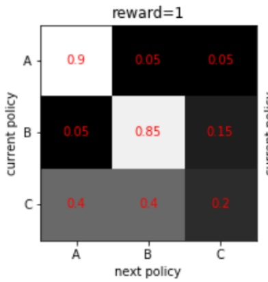

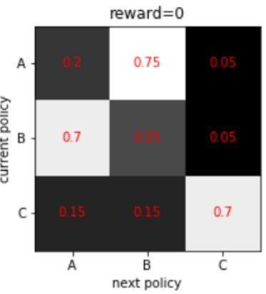

Figure 3: Transition matrices for policies, given rewards of the current round

(i) [2 pts] Suppose that Rob follows the fixed strategy $\pi^A$ of always vote "0" regardless of the outcome of each game. Does the Mesut's strategy over time satisfy the Markov property $P(\pi_{t+1} \mid \pi_t) = P(\pi_{t+1} \mid \pi_1, \pi_2, ..., \pi_t)$?:

☐ Yes, because Mesut will not change their policy as long as they keep getting +1 rewards

\- Yes, but not because of the reason above.

$\bigcirc$ No, because Mesut's strategy at round $t + 1$ will be affected by rewards received at rounds 0 to $t$

○ No, but not because of the reason above.

<!-- page: 16 -->

It does satisfy the Markov property, because the probability distribution over  $\pi_{t-1}$ ,  $\pi_{t}$ ,  $\pi_{t+1}$  forms a casual chain with observed intermediate node when  $\pi_{t}$  is known, and thus D-separate  $\pi_{t+1}$  from belief over policies in all previous rounds

(ii) [2 pts] Now suppose that Rob's policy changes over time among $(\pi^A, \pi^B, \text{and} \pi^C)$ based on the same transition matrices above (just like Mesut's). Does your answer above change?

$\bigcirc$ Yes, because when Rob's policy changes over time, Mesut's policy transition can no longer be captured by the two transition matrices.

\- Yes, but not because of the reason above.

$\bigcirc$ No, because Rob's policy has no impact on $P(\pi_{t + 1} \mid \pi_t)$

○ No, but not because of the reason above.

$\pi_{t+1}$ is no longer independent of $\pi_{t-1}$ when given $\pi_t$ because knowing $\pi_{t-1}$ would give information about $a_{t-1}$ and thus $r_{t-1}$. Since Rob's policy follows also follows the transition matrices above, having information about $r_{t-1}$ can give us information about Rob's action and reward at time t which influences Mesut's transition to $\pi_{t+1}$.

(iii) [2 pts] After two rounds (round 1), which of the following are true:

$$
P (\pi_ {1} = \pi^ {A} \mid a _ {0: 1} = [ 0, 0 ], r _ {0: 1} = [ 0, 0 ]) > 0
$$

$$
\square P (\pi_ {1} = \pi^ {A} \mid a _ {0: 1} = [ 0, 0 ], r _ {0: 1} = [ 0, 1 ]) = 1
$$

$$
P (\pi_ {1} = \pi^ {B} \mid a _ {0: 1} = [ 0, 0 ], r _ {0: 1} = [ 0, 1 ]) = 0
$$

$$
P (\pi_ {1} = \pi^ {C} \mid a _ {0: 1} = [ 1, 0 ], r _ {0: 1} = [ 1, 0 ]) > 0
$$

$$
\square P (\pi_ {1} = \pi^ {C} \mid a _ {0: 1} = [ 1, 0 ], r _ {0: 1} = [ 1, 0 ]) = 1
$$

$$
\square P (\pi_ {1} = \pi^ {B} \mid a _ {0: 1} = [ 1, 0 ], r _ {0: 1} = [ 0, 1 ]) > 0
$$

$$
P (\pi_ {1} = \pi^ {C} \mid a _ {0: 1} = [ 1, 0 ], r _ {0: 1} = [ 0, 1 ]) > 0
$$

○ None of the above

Since all the transition probabilities are non-zero, Mesut can possibly change from one policy to any other policy given either reward. Thus we select probabilities that are true purely based on the action in timestep 1.

(c) Suppose we deploy our reinforcement learning agent Rob into the real world to interact with Mesut to perform online reinforcement learning. Now we need to decide on a state-space representation. There are two choices:

\- Previous observation: $o_{t} = [a_{t - 1}, r_{t - 1}]$

\- Belief state $b_{t} = [P(\pi_{t - 1} = \pi^{A}), P(\pi_{t - 1} = \pi^{B}), P(\pi_{t - 1} = \pi^{C})]$

(i) [1 pt] The size of the state space for representation $o_t$ is \_\_\_\_.

○ 2 ○ 3 ● 4 ○ None of the above

There are 2 possibilities for $a_{t-1}$ and $r_{t-1}$ so there are 4 combinations of the two of them.

(ii) [1 pt] The size of the state space for representation $b_{t}$ is \_\_\_\_.

○ 3 ○ 6 ○ 9 ○ 27 ● None of the above

This belief space is continuous so there is no finite size.

(iii) [2 pts] Select all true statements.

Using less expressive representations could be better if we have limited opportunity to deploy Rob to interact with real human

We can perform approximate Q-learning by feeding $b_{t}$ as the features $f_0, f_1, f_2$

☐ The optimality of Rob learning with representation  $b_{t}$  does not rely on the accuracy of the transition matrices in part (b)

○ None of the above

1) Less expressive representations could be better with less data for less overfitting.

2) We can use any real numbers that represent an attribute of a state as features.

3) We need those transition probabilities to be accurate to accurately calculate the belief distribution.

<!-- page: 17 -->

## Q6. [10 pts] Pac-mate or Pac-poster

(a) Pacman is on a spaceship with six other friends  $(A, B, C, D, E, F)$  when he realizes that two of them are imposters! His goal is to figure out the probability of each of his friends being an imposter, so that he can kick the imposters off of the ship.

He considers the following Bayes Net, where all nodes correspond to binary random variables representing each of his friends being imposters. For example,  $A = +a$  corresponds to friend A being an imposter and A = -a corresponds to friend A not being an imposter:

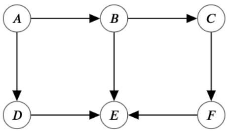

(i) [2 pts] Pacman sees friend $E$ faking a task, so he knows that she is one of the imposters. Now Pacman wants to compute $P(A| + e)$, but he's having trouble deciding what technique he should use to calculate it. He first considers Variable Elimination.

What is the most efficient elimination ordering of nodes that minimizes the size of the largest factor created when computing  $P(A| + e)$ ? Specify your answer as a comma-separated list of nodes. For example, if your answer is to eliminate A and then B, you should write 'A,B'. If multiple orderings are just as efficient, write the one that comes first alphabetically.

$C,F,B,D$

The CPTs in the given Bayes Net correspond to  $P(A)$ ,  $P(B|A)$ ,  $P(C|B)$ ,  $P(D|A)$ ,  $P(E|B, D, F)$ , and  $P(F|C)$ . Making sure not to eliminate variables in our query, we can see that eliminating C first is most efficient since this creates factor  $f_{1}(F|B)$  of size 4, while every other first elimination creates a factor of size 8 or above. Eliminating F next creates factor  $f_{2}(+e|B, D)$  of size 4 as well, while eliminating either B or D result in factors of size 8. Lastly, eliminating either B or D next will result in the same factor size of 4, so we choose the ordering that comes first alphabetically. Thus, the most optimal elimination ordering is C, F, B, D.

(ii) [2 pts] Pacman instead decides to use sampling methods to estimate the probabilities. He runs a simulator in the admin room that generates the following sample while trying to compute  $P(A|+e)$ :  $(+a,+b,-c,-d,-e,+f)$ . For which of the following sampling approaches could the simulator have been generating samples?

Prior Sampling

□ Rejection Sampling

□ Likelihood Weighting

□ Gibb's Sampling

○ None of the Above

The sample is not consistent with our evidence +e, so only Prior Sampling is possible, since it can generate samples that are not consistent with our evidence. Rejection Sampling would reject the sample instead of outputting it, and Likelihood Weighting and Gibb's Sampling set the variable E to be consistent with our evidence before generating samples.

(b) Pacman realizes that there might be something wrong with his Bayes Net, so he tries generating different Bayes Nets instead. Consider each Bayes Net independently, and select the methods that would allow for reasonably efficient computation of  $P(A| + e)$  for each Bayes Net. If none are efficient, select 'None of the above'.

Each method is considered efficient if it meets its corresponding criteria below:

\- Variable Elimination: the largest factor created in the optimal elimination order is smaller than the number of nodes in the Bayes Net.

<!-- page: 18 -->

\- Prior Sampling: approximately no more than $10\%$ of generated samples can be inconsistent with the evidence.

\- Rejection Sampling: approximately no more than $20\%$ of samples are rejected.

\- Likelihood Weighting: the ratio between the largest and the smallest weight that can be assigned is less than 5 : 1.

The CPT for $E$ is provided for each Bayes Net. You may assume that every other random variable takes on + with probability 0.5 and - with probability 0.5.

(i) [3 pts]

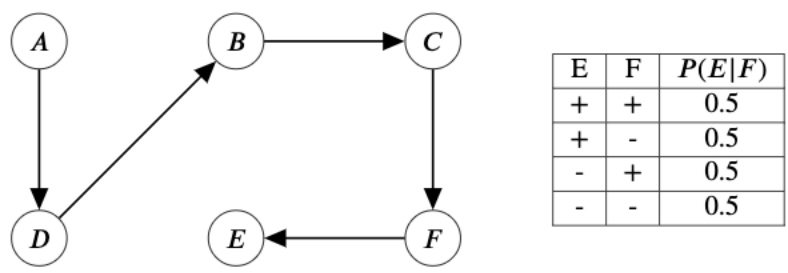

| E | F | $P(E\|F)$ |
| --- | --- | --- |
| + | + | 0.5 |
| + | - | 0.5 |
| - | + | 0.5 |
| - | - | 0.5 |

■ Variable Elimination
□ Prior Sampling
□ Rejection Sampling
■ Likelihood Weighting
○ None of the Above

In the optimal ordering for Variable Elimination, we can keep eliminating the variable starting from F and going backwards in the direction of the Bayes Net to have a maximum factor size of 2, which is less than 6, the number of nodes in the Bayes Net. For Prior Sampling, the probability that E is sampled to be +e or -e is equivalent, which means that more than 10% of generated samples will be inconsistent with the evidence. The same reasoning shows that Rejection Sampling will reject more than 20% of samples as well. For Likelihood Weighting, the possible weights assignable are  $P(+e| + f) = 0.5$  and  $P(+e| - f) = 0.5$ , so the ratio between them is 1 : 1, which is less than 5 : 1.

(ii) [3 pts]

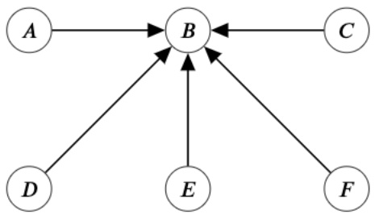

| E | P(E) |
| --- | --- |
| + | 0.8 |
| - | 0.2 |

□ Variable Elimination
□ Prior Sampling
■ Rejection Sampling
■ Likelihood Weighting
○ None of the Above

In the optimal ordering for Variable Elimination, no matter which of C, D, or F we eliminate first, the size of the factor created is 16, which is larger than the number of nodes in the Bayes Net. For Prior Sampling, the probability

<!-- page: 19 -->

that $E$ is sampled to be $+e$ is not high enough to guarantee that more than $10\%$ of generated samples will be inconsistent with the evidence. However, the probability is high enough such that Rejection Sampling will reject more than $20\%$ of samples. For Likelihood Weighting, each sample will be assigned the same weight $P(+e) = 0.8$, since the probability based on the Bayes Net isn't dependent on the sampled values of the rest of the variables. Therefore, the ratio between the largest and smallest weight is just $1:1$, which is less than $5:1$.

<!-- page: 20 -->

# Q7. [17 pts] Value of Pacman Information

For fill in the blank questions, please write in decimals and round to the nearest hundredth. Unsimplified answers or expressions involving variables will not receive credit.

Notation: if  $X \sim U(a, b)$ , X takes value uniformly on the range  $[a, b]$ .

(a) [2 pts] Game 1: The ghost chooses a number G and Pacman randomly chooses a number P at the same time. A computer generates a number  $X \sim U(0, 10)$  and then another number  $Y \sim U(0, X)$ . The utility is  $f(G, P, X, Y)$  for a fixed function f. Select the decision net(s) that can correctly represent the problem above for the ghost.

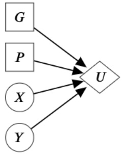

□ (A)

□ (B)

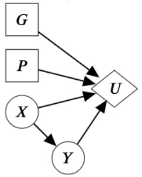

□ (C)

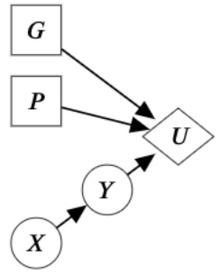

□ (D)

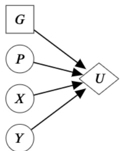

□ (F)

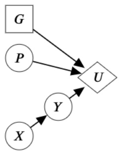

○ (G) None of the above

G is a value that the ghost can choose so it should be a rectangle. In the perspective of the ghost, P, X, and Y are random outcomes so they should be ovals. All the variables are involved in the calculation of U, and Y's distribution is influenced by X, so E has to be the answer.

(b) Game 2: In the game tree below, $D$ is a real number $\sim U(0,10)$. The ghost does not know the true value of $D$, but does know that $D$ is sampled from $\sim U(0,10)$ and wants to achieve the greatest possible score in expectation. Pacman does know the true value of $D$ and uses this information to minimize the ghost's best possible score as much as he can.

Note, the circle node is a random chance node where all 3 option are equally likely.

(i) [5 pts]

Calculate and fill in the values below.

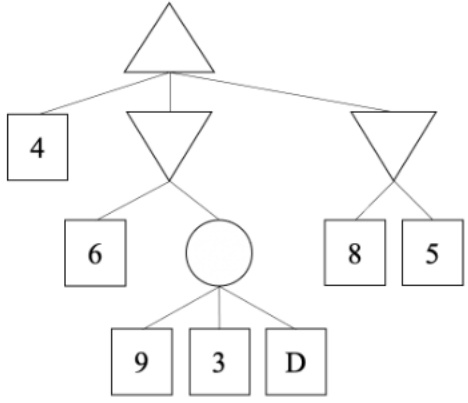

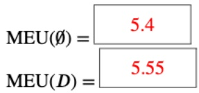

<!-- page: 21 -->

SID: \_\_\_\_

$$
\mathrm{VPI} (D) = \boxed {0. 1 5}
$$

$$
M E U (\emptyset) = P (D <   6) \cdot \frac {9 + 3 + 3}{3} + P (D \geq 6) \cdot 6 = 0. 6 \cdot 5 + 0. 4 \cdot 6 = 5. 4
$$

$$
M E U (D) = P (D <   3) \cdot 5 + P (3 \leq D <   6) \cdot \frac {9 + 3 + 4 . 5}{3} + P (D \geq 6) \cdot 6 = 0. 3 \cdot 5 + 0. 3 \cdot 5. 5 + 0. 4 \cdot 6 = 5. 5 5
$$

$$
V P I (D) = 5. 5 5 - 5. 4 = 0. 1 5
$$

<!-- page: 22 -->

(c) Game 3: Pacbaby doesn't know how to play games and chooses actions randomly. Pacman has to leave and Pacbaby is taking his place in the game. But the ghost doesn't know! She still believes that she is playing against Pacman, who minimizes her utility (her score in the game).

Note, the Ghost now knows all the leaf node values and the structure of the tree like a normal minimax agent. She believes that Pacman is playing with this information as well.

(i) [1 pt] Select all correct choices from below.

☐ The ghost is guaranteed to take the optimal actions.

☐ The ghost is guaranteed to not take the optimal actions.

We don't have enough information to tell if the ghost will take the optimal actions.

○ None of the above.

Depending on game tree leaf values, the ghost could or could not take the optimal actions.

(ii) [1 pt] Select one choice below.

\- Playing against Pacbaby will always give the ghost a score at least as high as the score she would get if she plays the same game against Pacman.

○ Playing against Pacbaby is not guaranteed to give the ghost a score at least as high as the score she would get if she plays the same game against Pacman.

Pacbaby can only ever take a suboptimal action for minimizing while Pacman will always minimize optimally.

For the remaining parts of this problem, consider the game tree below. Fill in the value of each letter with the score the ghost will receive in expectation if they play out that branch thinking that Pacman is still there playing optimally.

Circle nodes represent Pacbaby's decision which is chosen randomly.

Hexagon nodes represent the Ghost's decision which maximizes the score if Pacbaby were to play as a minimizer.

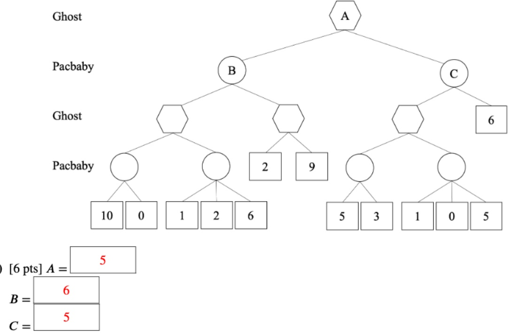

<!-- page: 23 -->

Note that in this question, the ghost does not have complete information. The actions of the ghost are as below, since the ghost is using the optimal actions against Pacman.

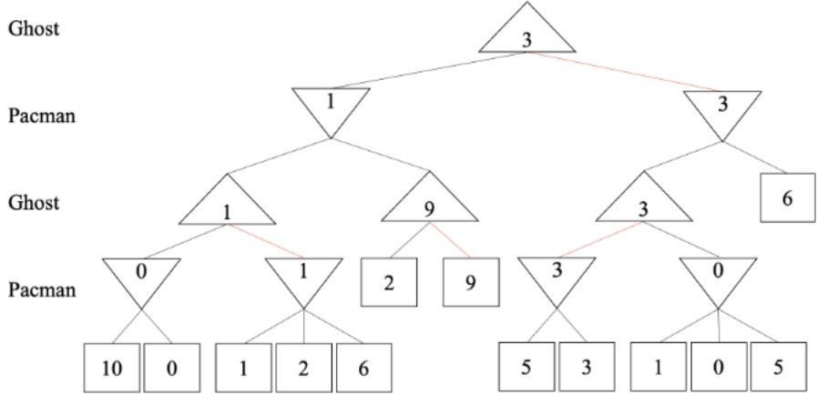

So the outcome of the game is as below: $A = 5, B = 6, C = 5$.

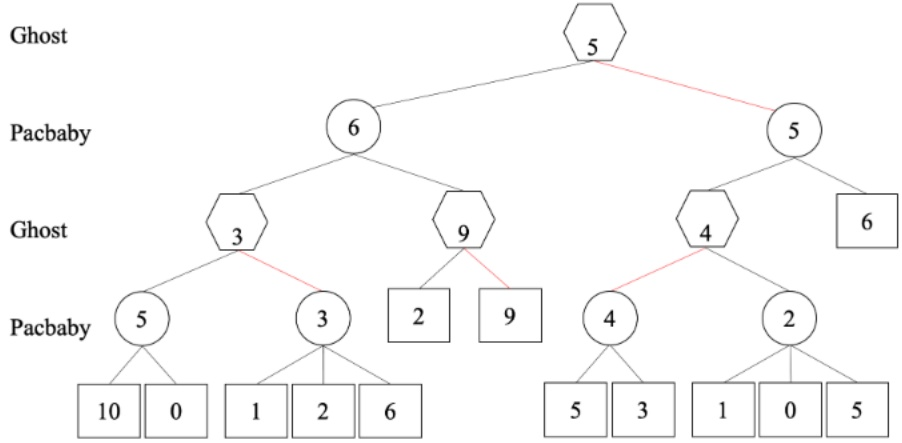

(iv) [2 pts] Before the game starts pacbaby cries out and the ghost hears him and realizes she is playing against a random acting player. How much will the ghost's expected score be after adjusting her strategy with this information?
7

Now this is a regular expectimax game if the Ghost knows that Pacbaby is playing. The game would go as illustrated by the tree below. The maximum expected utility increases from 5 to 7.

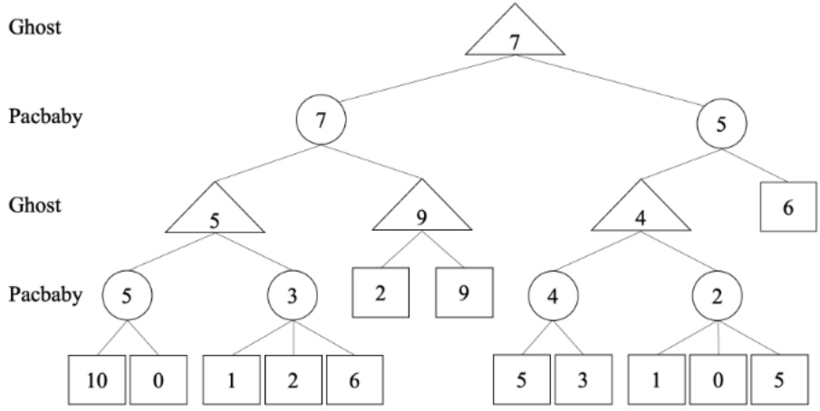
