<!-- page: 1 -->

## CS 188 Introduction to Summer 2020 Artificial Intelligence

\- You have approximately 170 minutes.

\- The exam is open book, open calculator, and open notes.

\- In the interest of fairness, we want everyone to have access to the same information. To that end, we will not be answering questions about the content or making clarifications.

\- For multiple choice questions,

\- $\square$ means mark all options that apply

\- $\bigcirc$ means mark a single choice

| First name |  |
| --- | --- |
| Last name |  |
| SID |  |

For staff use only:

| Q1. | Testing Time | /1 |
| --- | --- | --- |
| Q2. | Searching for a Triple | /6 |
| Q3. | HMM | /7 |
| Q4. | Filter the Filter | /6 |
| Q5. | Potpourri | /22 |
| Q6. | Value Iteration Networks | /15 |
| Q7. | Q Learning Fundamentals | /9 |
| Q8. | A Cluster of Trees | /9 |
| Q9. | Tupacman’s NB Model | /11 |
| Q10. | Perceptron’s Plan | /14 |
|  | Total | /100 |

<!-- page: 2 -->

<!-- page: 3 -->

SID: \_\_\_\_

## Q1. [1 pt] Testing Time

It's testing time! Not only for you, but for our CS188 robots as well! Circle your favorite robot for a free point!


<!-- page: 4 -->

## Q2. [6 pts] Searching for a Triple

Pacman is performing search over undirected paths through the Bayes Net below. Pacman knows the set of all nodes and the set of directed edges, as well as the fact that nodes E and K are observed.

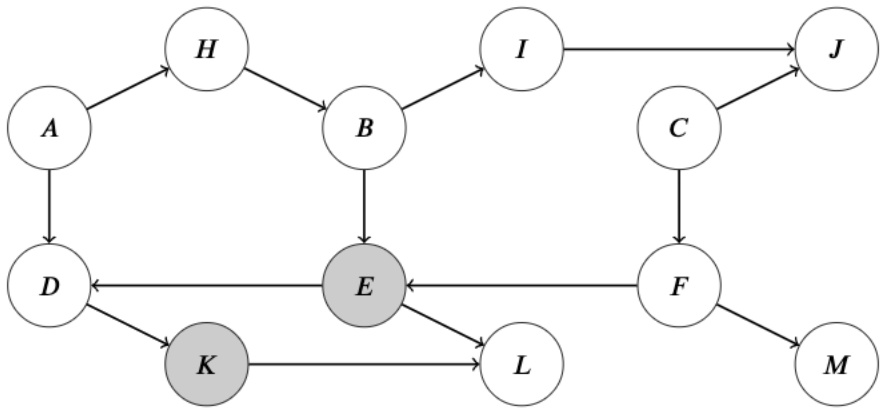

(a) [2 pts] Suppose Pacman performs search with the aim of finding an undirected path that starts at node A and ends at node C. Here, "undirected path" means that the path may follow edges in the Bayes Net in either direction.

Using DFS Graph Search, does Pacman find a path from node A to node C? If yes, write out the nodes in the order of the path that he finds, separated by commas. If no path is found, write 'No Path'. Assume that we break ties between nodes alphabetically.

(b) Pacman decides to modify the search procedure to only look for active paths, thereby implementing d-separation. Pacman now intends to verify whether nodes A and C are independent conditioned on E and K. The search starts at node A, and terminates when it finds an active path that reaches node C, or once the fringe becomes empty. Pacman performs Graph Search as follows:

\- Whenever Pacman is about to expand a node, he checks the closed set to determine whether he should skip expanding it, using one of two variants:

\- Variant 1: Pacman takes the last random variable along the current path and checks if it is in the closed set
- Variant 2: Pacman takes the last triple of nodes along the current path and checks if it is in the closed set

\- If he detects an inactive triple along the path that's about to be expanded, the path is discarded. Pacman must backtrack, i.e. select another candidate for expansion on the fringe and continue his search from there. The closed set is not updated in this case.

\- If no inactive triple is detected, Pacman expands the current node and updates the closed set:

\- For Variant 1: Pacman takes the last random variable along the current path and adds it to the closed set.

\- For Variant 2: Pacman takes the last triple of nodes along the current path and adds it to the closed set

(i) [2 pts] Does Pacman find an active path from A to C using BFS Graph Search Variant 1? If yes, write out the nodes in the order of the path that he finds, separated by commas. If no path is found, write 'No Active Path'. Assume that we break ties between nodes alphabetically.

(ii) [2 pts] Does Pacman find an active path from A to C using BFS Graph Search Variant 2? If yes, write out the nodes in the order of the path that he finds, separated by commas. If no path is found, write 'No Active Path'. Assume that we break ties between nodes alphabetically.

<!-- page: 5 -->

## Q3. [7 pts] HMM

Recall that for the canonical HMM structure, the Viterbi algorithm finds the most probable sequence of hidden states  $X_{1:T}$ , given a sequence of observations  $e_{1:T}$ . Throughout this question you may assume there are no ties. Note that for the canonical HMM, the Viterbi algorithm performs the following dynamic programming computations:

$$
m _ {t} [ x _ {t} ] = P (e _ {t} | x _ {t}) \max _ {x _ {t - 1}} P (x _ {t} | x _ {t - 1}) m _ {t - 1} [ x _ {t - 1} ]
$$

(a) [3 pts] For the HMM structure below, we want to find the most likely sequence of states  $X_{1:T}$  and  $S_{1:T}$  given the sequence of observations  $e_{1:T}$, so we modify the Viterbi algorithm to work with our new structure. Which of the following probabilities are maximized by the sequence of states returned by this modified Viterbi algorithm? Mark all the correct option(s).

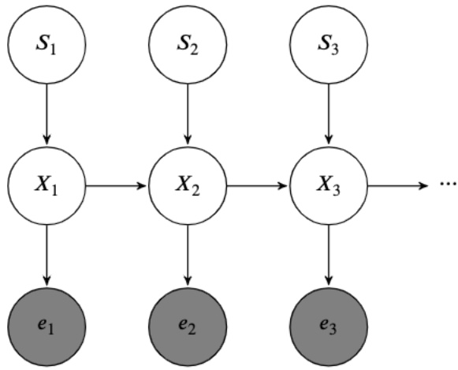

$\square P(X_{1:T})$

$\square P(S_{1:T})$

$\square P(e_{1:T})$

$$
\square P (X _ {1: T}, S _ {1: T} | e _ {1: T})
$$

$$
\square P (X _ {1: T}, S _ {1: T}, e _ {1: T})
$$

$$
\square P (S _ {1}) P (X _ {1} | S _ {1}) P (e _ {1} | X _ {1}) \cdot \prod_ {t = 2} ^ {T} P (S _ {t}) P (e _ {t} | X _ {t}) P (X _ {t} | S _ {t}, X _ {t - 1})
$$

$$
\square P (X _ {1} | S _ {1}) P (e _ {1} | X _ {1}) \cdot \prod_ {t = 2} ^ {T} P (e _ {t} | X _ {t}) P (X _ {t} | X _ {t - 1})
$$

□ None of the above

<!-- page: 6 -->

| ○ $\mathcal{O}(T)$ | ○ $\mathcal{O}(Te)$ | ○ $\mathcal{O}(Tse)$ | ○ $\mathcal{O}(T + e)$ |
| --- | --- | --- | --- |
| ○ $\mathcal{O}(Tx)$ | ○ $\mathcal{O}(Txs)$ | ○ $\mathcal{O}(Txse)$ | ○ $\mathcal{O}(T + x + s + e)$ |
| ○ $\mathcal{O}(Ts)$ | ○ $\mathcal{O}(Txe)$ | ○ $\mathcal{O}(T + x + s)$ | ○ None of the above |

(b) Assume in the HMM above,

1. The hidden variable $X$ can take on $x$ values.

2. The hidden variable $S$ can take on $s$ values.

3. The (observed) emission variable $E$ can take on $e$ values.

4. Our sequence has $T$ time steps.

(i) [2 pts] What is the runtime of the modified Viterbi algorithm?

| $\bigcirc$ $\mathcal{O}(T^2xs)$ | $\bigcirc$ $\mathcal{O}(Tx^2+Txs)$ | $\bigcirc$ $\mathcal{O}(x^2s^2e^2)$ | $\bigcirc$ $\mathcal{O}(Tx^2s^2)$ |
| --- | --- | --- | --- |
| $\bigcirc$ $\mathcal{O}(Txs)$ | $\bigcirc$ $\mathcal{O}(T^2x^2s^2e^2)$ | $\bigcirc$ $\mathcal{O}(Tx^2s^2+Txse)$ | $\bigcirc$ $\mathcal{O}(x^2s^2)$ |
| $\bigcirc$ $\mathcal{O}(xs)$ | $\bigcirc$ $\mathcal{O}(Tx^2s^2e^2)$ | $\bigcirc$ $\mathcal{O}(T^2x^2s^2)$ | $\bigcirc$ None of the above |

<!-- page: 7 -->

## Q4. [6 pts] Filter the Filter

A group of CS188 robots are at a factory trying to filter some magical packages that come through constantly to ensure safety. We denote the possible label of each package as an integer from 1 through 10 (inclusive). However, since we're in a magical robotics land, the package and its label might mutate at every time step.

The label of a package at time step i is represented by the random variable  $X_{i}$ . At each time step, the package will either remain with its current label, or swap to a different label corresponding to an adjacent region of the current label on the following grid. For example, the available actions from label 3 are (UP, RIGHT, STAY), corresponding to labels 2, 6, and 3 respectively. The new package label is chosen between the successor states of all available actions from a label with equal probability. Note: a package can only be assigned a label between 1 and 10 (inclusive), and actions that would lead to exiting the grid are invalid; the two empty boxes above and below box 10 are invalid as well.

| 1 | 4 | 7 |  |
| --- | --- | --- | --- |
| 2 | 5 | 8 | 10 |
| 3 | 6 | 9 |  |

We have two sensors for detecting labels. The first sensor  $S_{1}$  monitors if labels remain between 1 through 5 inclusive. The second sensor  $S_{2}$  checks whether the labels between 1 through 9 inclusive.

(a) [2 pts] Assume that we utilize particle filtering to track the labels of our packages. Suppose we start with five particles with corresponding labels [1, 6, 10, 5, 8].

Fill out the table below for the time elapse update, using the given generated random numbers.

Note: Assign the label IDs numerically. For example, if a label has 2 potential successor labels 3 and 7 with corresponding probabilities $P(X_{t+1} = 3)$ and $P(X_{t+1} = 7)$, then we would select label 3 if the generated random number is less than $P(X_{t+1} = 3)$, and select label 7 otherwise.

| Label at t = 0 | 1 | 6 | 10 | 5 | 8 |
| --- | --- | --- | --- | --- | --- |
| Random number for time elapse update | 0.49 | 0.23 | 0.89 | 0.12 | 0.43 |
| Label after time elapse update |  |  |  |  |  |

(b) [2 pts] Ignore your answer from part (a). Suppose you obtain the following labels after the update: [1, 9, 10, 5, 7]. Recall that you have two sensors for detecting labels. The first sensor $S_{1}$ monitors if labels remain between 1 through 5 inclusive. The second sensor $S_{2}$ checks whether the labels between 1 through 9 inclusive.

However, you suddenly realize that your sensors are not precise, and they are giving results following this distribution:

| Sensor 1 | $P(S_1\|1 \leq X_i \leq 5)$ | $P(S_1\|6 \leq X_i \leq 10)$ |
| --- | --- | --- |
| True | 0.75 | 0.2 |
| False | 0.25 | 0.8 |

| Sensor 2 | $P(S_2\|1 \leq X_i \leq 9)$ | $P(S_2\|X_i = 10)$ |
| --- | --- | --- |
| True | 0.9 | 0.4 |
| False | 0.1 | 0.6 |

<!-- page: 8 -->

Suppose that Sensor 1 reports $S_{1} = \text{False}$ and Sensor 2 reports $S_{2} = \text{True}$. What is the weight for each label after incorporating the sensor readings?

| Label(s) |  | 1 | 9 | 10 | 5 | 7 |
| --- | --- | --- | --- | --- | --- | --- |
| Weight(s) |  |  |  |  |  |  |

(c) [2 pts] Ignore your answer for part (b). Suppose you obtain these weights for each label after incorporating the sensor readings:

| Label(s) | 1 | 9 | 10 | 5 | 7 |
| --- | --- | --- | --- | --- | --- |
| Weight(s) | 0.3 | 0.2 | 0.5 | 0.8 | 0.2 |

Use the following random numbers to resample the package labels.

As in part (a), assign label IDs to sample spaces in numerical order.

| Random number(s) | 0.11 | 0.98 | 0.58 | 0.47 | 0.62 | 0.70 | 0.84 |
| --- | --- | --- | --- | --- | --- | --- | --- |
| Label(s) |  |  |  |  |  |  |  |

<!-- page: 9 -->

SID: \_\_\_\_

## Q5. [22 pts] Potpourri

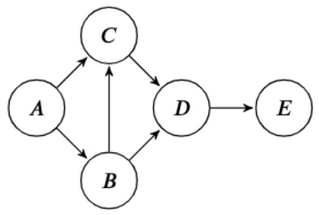

(1)

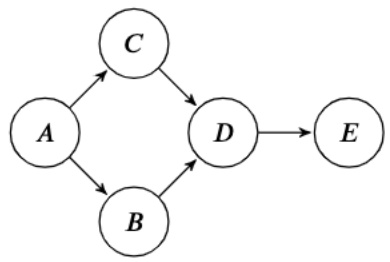

(2)

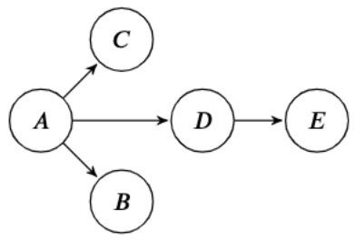

(3)

(a) (i) [4 pts] For each conditional independence expression, select the Bayes net(s) for which the conditional independence is guaranteed to be true.

$$
A \perp E \mid D
$$

$$
B \perp C \mid A
$$

$$
A \perp D \mid B, C
$$

$$
B \perp C \mid A, E
$$

$$
\begin{array}{c c c c c} \square & (1) & \square & (2) & \square \\ \hline \square & (1) & \square & (2) & \square \\ \hline \square & (1) & \square & (2) & \square \\ \hline \square & (1) & \square & (2) & \square \end{array} \quad \begin{array}{c c c c c} \bigcirc & \text {None} \\ \bigcirc & \text {None} \\ \bigcirc & \text {None} \\ \bigcirc & \text {None} \end{array}
$$

(ii) [2 pts] Select all of the following statements that are true.

☐ Any distribution that can be represented by Bayes net (1) can be represented by Bayes net (2).

☐ Any distribution that can be represented by Bayes net (2) can be represented by Bayes net (1).

☐ A Bayes net with no edges can represent any distribution over its random variables.

☐ If two Bayes nets can represent the same set of distributions, then they must have the same set of edges.

○ None of the above

<!-- page: 10 -->

(b) Pacman is about to play as the maximizer agent in the game shown below, but the values of some leaf nodes are known to all players except Pacman! In this problem, let's think about Pacman's VPI associated with learning the leaf utility for one or more leaf nodes. In the game tree, square nodes are terminal nodes and the circle is a chance node.

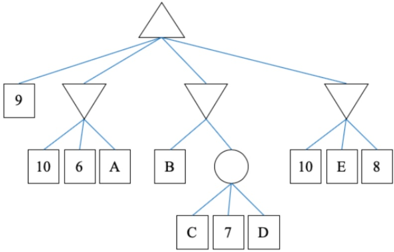

(i) [2 pts] Consider the game tree above, and select the choices that are guaranteed to be true.

```txt
VPI(B) = 0
VPI(C) = 0
VPI(D) = 0
VPI(E) = 0
VPI(C|D) = 0
VPI(D|C) = 0
○ None of the above
```

(ii) [4 pts] Consider the game tree above, and select the choices that are possible to be true.

$$
\begin{array}{c} \framebox {} > 0 \\ \framebox {} = 0 \\ \framebox {} <   0 \end{array}
$$

$$
\begin{array}{l} V P I (B, C) - V P I (C, D) \\ \boxed {\quad} > 0 \\ \boxed {\quad} = 0 \\ \boxed {\quad} <   0 \end{array}
$$

$$
\begin{array}{l} V P I (C, D) - V P I (B, C | D) \\ \boxed {\quad} > 0 \\ \boxed {\quad} = 0 \\ \boxed {\quad} <   0 \end{array}
$$

<!-- page: 11 -->

SID: \_\_\_\_

(c) Select the model(s) that each graph is representing:

(i) [1 pt]

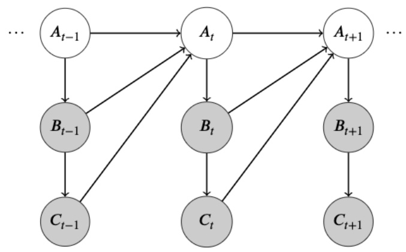

☐ Dynamic Bayes Net ☐ Naive Bayes ☐ Decision Network ○ None of the above

(ii) [1 pt]

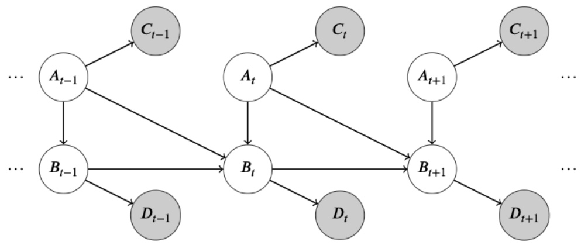

☐ Dynamic Bayes Net ☐ Naive Bayes ☐ Decision Network ○ None of the above

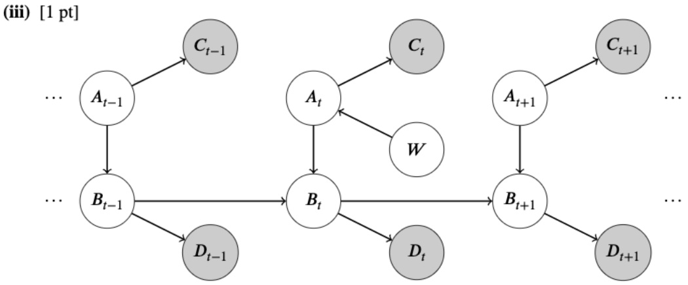

☐ Dynamic Bayes Net ☐ Naive Bayes ☐ Decision Network ○ None of the above

<!-- page: 12 -->

(d) In hidden Markov models, a common task is to compute the probability distribution of the final state given the evidence, $P(s_T|e_{1:T})$. Suppose that instead of using the forward algorithm, we wish to apply variable elimination to compute this probability.

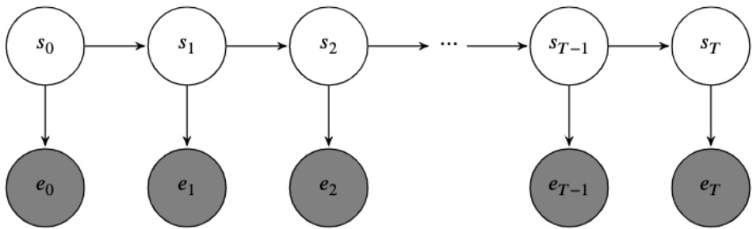

(i) [2 pts] Select the most optimal variable ordering(s) for which we should eliminate our variables.

<div class="docvortex-algorithm" style="white-space: pre-wrap; font-family:monospace;">
$\begin{array}{l}\square\\ \hline s_{0},s_{1},s_{2},\dots,s_{T - 1}\\ \hline s_{T - 1},s_{T - 2},\dots,s_{0}\\ \hline e_{0},s_{0},e_{1},s_{1},e_{2},s_{2},\dots,s_{T - 1},e_{T}\\ \hline e_{T},s_{T - 1},e_{T - 1},s_{T - 2},\dots,s_{0},s_{T}\\ \hline s_{0},s_{1},s_{2},\dots,s_{T - 1},e_{0},e_{1},\dots,e_{T}\\ \hline s_{T - 1},s_{T - 2},\dots,s_{0},e_{T},e_{T - 1},\dots,e_{0}\\ \bigcirc \text{None of the above.} \end{array}$
</div>

○ None of the above

(ii) [2 pts] Let $|S|$ and $|E|$ denote the domain sizes of $S$ and $E$, respectively. What is the size of the largest factor created using the most optimal variable ordering(s)?

○ |S|

○ |E|

$\bigcirc \quad |S| \cdot |E|$

○ T

$\bigcirc T\cdot |S|$

$\bigcirc T\cdot |E|$

$\bigcirc T\cdot |S|\cdot |E|$

$\bigcirc \quad |S|^{T - 1}$

$\bigcirc |E|^T$

$\bigcirc \quad |S|^{T - 1} \cdot |E|^T$

$\bigcirc |S|^T$

$\bigcirc |E|^{T + 1}$

$\bigcirc \quad |S|^T \cdot |E|^{T+1}$

○ None of the above

<!-- page: 13 -->

(e) [1 pt] Pacman must navigate through a maze with the goal of eating a specific power pellet. Which of the following must be included in the minimal search space for this problem?

☐ The number of actions Pacman has taken thus far

□ Pacman's position

☐ The location of the power pellet

☐ A dot boolean for each dot in the grid

☐ The total number of power pellets

☐ The location of any walls

○ None of the above

(f) [1 pt] Which of the following is true about relaxed problem heuristics?

☐ Greedy tree search with a relaxed problem heuristic is optimal

☐ Greedy graph search with a relaxed problem heuristic is optimal

☐ A\* tree search with a relaxed problem heuristic is optimal

☐ A\* graph search with a relaxed problem heuristic is optimal

○ None of the above

(g) [1 pt] What is the size of the smallest minimax search tree where at least one node can be pruned by alpha-beta pruning? Your answer should be the total number of nodes in the tree (including all maximizer, minimizer, and leaf nodes).

<!-- page: 14 -->

## Q6. [15 pts] Value Iteration Networks

In this problem, we'll explore how neural network architectures can be designed to mimic value iteration for Markov Decision Processes. Consider the following 5-state MDP:

| 0 | 1 | 2 | 3 | 4 |
| --- | --- | --- | --- | --- |

The agent can transition deterministically between any adjacent states, or remain in place. Suppose we're in a situation where we know the values of the policy for some iteration of value iteration, but we don't know the reward function. We can set up a modified neural network to solve for the rewards as shown on the right:

The node  $V_{i}^{(k)}$  represents the value of state i at iteration k. The reward  $r_{ij}$  represents the reward obtained on a transition from state i to state j. Each node can be calculated from values at the previous layer according to:

$$
V _ {j} ^ {(k)} = \left\{ \begin{array}{l l} \max _ {i \in (0, 1)} r _ {i j} + \gamma V _ {i} ^ {(k - 1)} & j = 0 \\ \max _ {i \in (j - 1, j, j + 1)} r _ {i j} + \gamma V _ {i} ^ {(k - 1)} & 1 \leq j \leq 3 \\ \max _ {i \in (3, 4)} r _ {i j} + \gamma V _ {i} ^ {(k - 1)} & j = 4 \end{array} \right.
$$

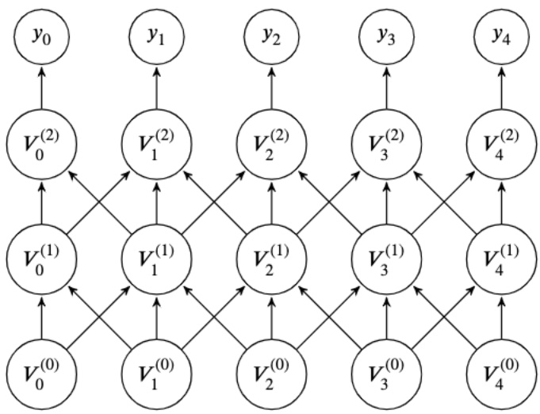

Suppose we have estimates $\mathbf{y}$ for the values at iteration 2, and

we feed in a value of 0 as the input to this network on the bottom layer ($V_i^{(0)} = 0$ for all $i$). We use the following squared loss function, where the network is parameterized by the rewards $\mathbf{r}$:

$$
\mathcal {L} (\mathbf {r}) = \frac {1}{2} \sum_ {i = 0} ^ {4} (y _ {i} - V _ {i} ^ {(2)}) ^ {2}
$$

Note that the superscript (2) in $V_{i}^{(2)}$ denotes the second layer of the network, and not a square.

(a) [2 pts] We are interested in minimizing the loss $\mathcal{L}$ in order to learn the rewards $r_{ij}$. How many learnable parameters are there in this network? Hint: The reward parameters $r_{ij}$ are shared between different layers. \_\_\_\_

(b) [2 pts] Suppose we fix all parameters but consider a change in the value of $r_{12}$. In the forward pass, which of the following values can possibly be changed?

$$
\begin{array}{c c c c c c} \square & V _ {0} ^ {(2)} & \square & V _ {1} ^ {(2)} & \square & V _ {2} ^ {(2)} \\ \square & V _ {0} ^ {(1)} & \square & V _ {1} ^ {(1)} & \square & V _ {2} ^ {(1)} \end{array} \quad \begin{array}{c c c c c c} \square & V _ {3} ^ {(2)} & \square & V _ {4} ^ {(2)} \\ \square & V _ {3} ^ {(1)} & \square & V _ {4} ^ {(1)} \end{array}
$$

(c) [2 pts] Suppose we fix all parameters but consider a change in the value of $r_{12}$. In the backward pass, which of the following derivatives can possibly be changed?

$$
\begin{array}{c c c c c c} \square & \frac {\partial \mathcal {L}}{\partial V _ {0} ^ {(2)}} & \square & \frac {\partial \mathcal {L}}{\partial V _ {1} ^ {(2)}} & \square & \frac {\partial \mathcal {L}}{\partial V _ {2} ^ {(2)}} \\ \square & \frac {\partial \mathcal {L}}{\partial V _ {0} ^ {(1)}} & \square & \frac {\partial \mathcal {L}}{\partial V _ {1} ^ {(1)}} & \square & \frac {\partial \mathcal {L}}{\partial V _ {2} ^ {(1)}} \end{array} \quad \begin{array}{c c c c c c} \square & \frac {\partial \mathcal {L}}{\partial V _ {3} ^ {(2)}} & \square & \frac {\partial \mathcal {L}}{\partial V _ {4} ^ {(2)}} \\ \square & \frac {\partial \mathcal {L}}{\partial V _ {3} ^ {(1)}} & \square & \frac {\partial \mathcal {L}}{\partial V _ {4} ^ {(1)}} \end{array}
$$

Now, let's begin with computing some derivatives.

(d) [3 pts] Compute the derivative $\frac{\partial\mathcal{L}}{\partial r_{00}}$. Select one entry from each column.

<!-- page: 15 -->

SID: \_\_\_\_

$$
\square \frac {\partial \mathcal {L}}{\partial V _ {0} ^ {(1)}}
$$

$$
\square \frac {\partial V _ {0} ^ {(1)}}{\partial r _ {0 0}}
$$

$$
\square \frac {\partial \mathcal {L}}{\partial V _ {0} ^ {(2)}}
$$

$$
\square \frac {\partial \mathcal {L}}{\partial V _ {1} ^ {(0)}}
$$

$$
\square \frac {\partial V _ {0} ^ {(2)}}{\partial r _ {0 0}}
$$

$$
\square \frac {\partial V _ {0} ^ {(1)}}{\partial r _ {0 0}}
$$

$$
\square \frac {\partial \mathcal {L}}{\partial V _ {2} ^ {(0)}}
$$

$$
\square \frac {\partial V _ {0} ^ {(2)}}{\partial r _ {0 0}}
$$

$$
\begin{array}{c} \square \\ \square \\ \square \end{array} \begin{array}{c} r _ {0 0} \\ \gamma \\ 1 \end{array}
$$

$$
\begin{array}{c c} \square + & \square r _ {0 1} \\ \square * & \square 1 \\ & \square 0 \end{array}
$$

$$
\begin{array}{c c} \square + & \square r _ {0 0} \\ \square * & \square \gamma \\ & \square 1 \end{array}
$$

$$
\begin{array}{c c} \square + & \square r _ {0 2} \\ \square * & \square 1 \\ & \square 0 \end{array}
$$

(e) [3 pts] Compute the derivative $\frac{\partial V_2^{(2)}}{\partial V_2^{(1)}}$ using the chain rule. Please select from the following terms such that when multiplied together, they yield the correct derivative.

$$
\begin{array}{l l} \square \gamma & \square r _ {1, 2} \quad \square r _ {2, 2} \quad \square r _ {3, 2} \quad \square r _ {2, 1} \quad \square r _ {2, 3} \\ \square \left\{ \begin{array}{l l} 1 & r _ {1 2} + \gamma V _ {1} ^ {(1)} > r _ {2 2} + \gamma V _ {2} ^ {(1)} \\ 0 & \text {otherwise} \end{array} \right. & \square \left\{ \begin{array}{l l} 1 & r _ {1 2} + \gamma V _ {1} ^ {(1)} > r _ {3 2} + \gamma V _ {3} ^ {(1)} \\ 0 & \text {otherwise} \end{array} \right. \\ \square \left\{ \begin{array}{l l} 1 & r _ {3 2} + \gamma V _ {3} ^ {(1)} > r _ {2 2} + \gamma V _ {2} ^ {(1)} \\ 0 & \text {otherwise} \end{array} \right. & \square \left\{ \begin{array}{l l} 1 & r _ {2 2} + \gamma V _ {2} ^ {(1)} > r _ {1 2} + \gamma V _ {1} ^ {(1)} \\ 0 & \text {otherwise} \end{array} \right. \\ \end{array}
$$

☐ Not possible with the given choices

(f) [3 pts] Compute the derivative $\frac{\partial V_2^{(2)}}{\partial r_{12}}$, assuming that $\frac{\partial V_2^{(1)}}{\partial r_{12}} = 0$. Please select from the following terms, such that when multiplied together, they yield the correct derivative.

$$
\square \gamma \quad \square r _ {1, 2} \quad \square r _ {2, 2} \quad \square r _ {3, 2} \quad \square r _ {2, 1} \quad \square r _ {2, 3}
$$

$$
\begin{array}{l l} \square \left\{ \begin{array}{l l} 1 & r _ {1 2} + \gamma V _ {1} ^ {(1)} > r _ {2 2} + \gamma V _ {2} ^ {(1)} \\ 0 & \text {otherwise} \end{array} \right. & \square \left\{ \begin{array}{l l} 1 & r _ {1 2} + \gamma V _ {1} ^ {(1)} > r _ {3 2} + \gamma V _ {3} ^ {(1)} \\ 0 & \text {otherwise} \end{array} \right. \\ \square \left\{ \begin{array}{l l} 1 & r _ {3 2} + \gamma V _ {3} ^ {(1)} > r _ {2 2} + \gamma V _ {2} ^ {(1)} \\ 0 & \text {otherwise} \end{array} \right. & \square \left\{ \begin{array}{l l} 1 & r _ {2 2} + \gamma V _ {2} ^ {(1)} > r _ {1 2} + \gamma V _ {1} ^ {(1)} \\ 0 & \text {otherwise} \end{array} \right. \\ \end{array} \quad \begin{array}{l l} \square \left\{ \begin{array}{l l} 1 & r _ {2 2} + \gamma V _ {2} ^ {(1)} > r _ {3 2} + \gamma V _ {3} ^ {(1)} \\ 0 & \text {otherwise} \end{array} \right. \\ \square \left\{ \begin{array}{l l} 1 & r _ {3 2} + \gamma V _ {3} ^ {(1)} > r _ {1 2} + \gamma V _ {1} ^ {(1)} \\ 0 & \text {otherwise} \end{array} \right. \\ \end{array}
$$

☐ Not possible with the given choices

<!-- page: 16 -->

## Q7. [9 pts] Q Learning Fundamentals

(a) (i) [1 pt] Q-learning is a model-based reinforcement learning method.

○ True ○ False

(ii) [1 pt] In approximate Q-learning, which of the following can be learned with a neural network?
□ Weights □ Features ○ Neither

(b) For the following parts, consider the following MDP. The state space is determined by the grid-world like letters, and the agent can take one of four actions: up, down, right, left.

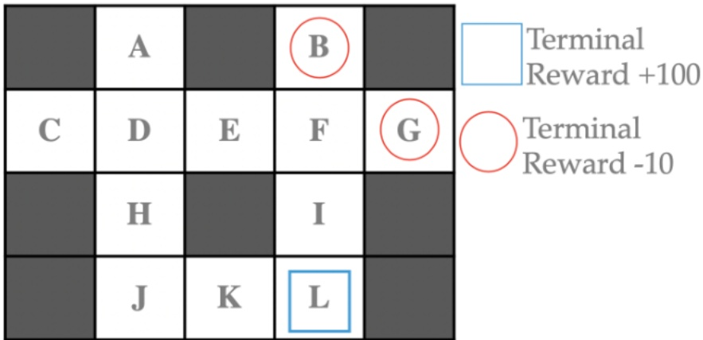

Figure 1: The MDP that we are learning.

We start with the following Q values for the states for all possible actions:

|  | A | B | C | D | E | F | G | H | I | J | K | L |
| --- | --- | --- | --- | --- | --- | --- | --- | --- | --- | --- | --- | --- |
| $Q_0(s,a)$ | 0 | -10 | 0 | 0 | 0 | 0 | -10 | 10 | 0 | 25 | 50 | 100 |

Table 1: Initial Q Values.

Now, consider the following episodes, shown in Table 2 below and compute the Q values for the given state-action pairs after running Q learning for the following transitions.

Operate with the following assumptions:

1) a discount factor,  $\gamma = .9$ .

2) a terminal reward is received after leaving a terminal state and the only action available in a terminal state is to exit.  
3) a living reward of $-1$ for all other transitions.

4) the learning rate  $\alpha = 0.5$ .

$$
Q (s, a) \leftarrow (1 - \alpha) Q (s, a) + \alpha \big [ r + \gamma \max _ {a ^ {\prime}} Q (s ^ {\prime}, a ^ {\prime}) \big ]\tag{1}
$$

| sequence | (step index, state, action, next state) |
| --- | --- |
| 1 | (0, F, down, I) → (1, I, down, L)→ (2, L, exit) |
| 2 | (3, D, down, E) → (4, E, right, F) → (5, F, down, G) → (6, G, exit) |
| 3 | (7, A, down, D) → (8, D, down, H) → (9, H, down, J) |

Table 2: Agent roll-outs.

(i) [1 pt] Q(F, down) = \_\_\_\_

(ii) [1 pt] Q(D, down) = \_\_\_\_

(iii) [1 pt] Q(A, down) = \_\_\_\_

<!-- page: 17 -->

Given a new Q table for the same MDP, we want to look closer at some behavior.

|  | A | B | C | D | E | F | G | H | I | J | K | L |
| --- | --- | --- | --- | --- | --- | --- | --- | --- | --- | --- | --- | --- |
| $Q_0(s, \text{right})$ | 0 | - | 1 | 4 | 0 | -5 | - | 10 | 10 | 25 | 50 | - |
| $Q_0(s, \text{down})$ | 1 | - | 0 | 6 | 1 | 3 | - | 9 | 50 | 25 | 50 | - |
| $Q_0(s, \text{left})$ | 0 | - | 0 | 1 | 2 | 2 | - | 8 | 10 | 25 | 50 | - |
| $Q_0(s, \text{up})$ | 0 | - | 0 | 2 | 1 | -5 | - | 7 | 0 | 25 | 50 | - |
| $Q_0(s, \text{exit})$ | - | -10 | - | - | - | - | -10 | - | - | - | - | 100 |

Table 3: Initial Q Values.

(c) For the following initial states, what state will the agent end up in after two steps following the policy extracted from the given Q values in Table 3? In the case of a tie, both solutions will be accepted (the agent can go either direction).

If the agent has left the MDP, write “exit”. Assume in this subpart that the dynamics are deterministic. Valid actions always move the agent in the intended direction, while invalid actions will result in no movement (i.e. moving into a wall will leave the agent in the same location).

(i) [1 pt] State A. \_\_\_\_

(ii) [1 pt] State C. \_\_\_\_

(iii) [1 pt] State D. \_\_\_\_

(iv) [1 pt] State E. \_\_\_\_

(v) [0 pts] State F. \_\_\_\_

(vi) [0 pts] State H. \_\_\_\_

(vii) [0 pts] State I. \_\_\_\_

<!-- page: 18 -->

## Q8. [9 pts] A Cluster of Trees

(a) Consider using the k-means algorithm to cluster the following points A, B, C, D, E, F, marked on the grid with black dots. S and T correspond to the current cluster centers, which are marked in the graph by red dots:

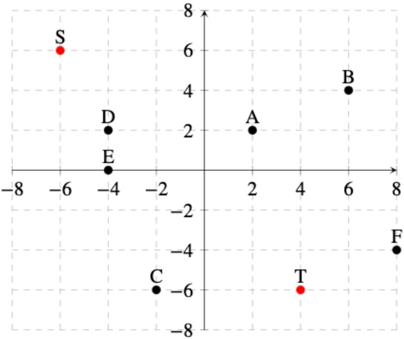

(i) [2 pts] We run one iteration of the k-means algorithm from the current state. For which of the following distance functions will point A be assigned to cluster center T? All distance functions are written as a function of two arbitrary points  $M = (M_{x}, M_{y})$  and  $N = (N_{x}, N_{y})$ . Assume that in choosing between cluster centers we break ties alphabetically (i.e.: select S over T).

$$
\square d (M, N) = | M _ {x} - N _ {x} | + | M _ {y} - N _ {y} |
$$

$$
\square d (M, N) = (M _ {x} - N _ {x}) ^ {2} + (M _ {y} - N _ {y}) ^ {2}
$$

$$
\square d (M, N) = \max \left\{(M _ {x} - N _ {x}) ^ {2}, (M _ {y} - N _ {y}) ^ {2} \right\}
$$

$$
\square d (M, N) = \min \left\{(M _ {x} - N _ {x}) ^ {2}, (M _ {y} - N _ {y}) ^ {2} \right\}
$$

$$
\square d (M, N) = \frac {| M _ {x} - N _ {x} |}{| M _ {x} | + | N _ {x} |} + \frac {| M _ {y} - N _ {y} |}{| M _ {y} | + | N _ {y} |}
$$

○ None of the above

(ii) [2 pts] After assigning a new set of points to $T$ using distance function $d(M, N) = (M_x - N_x)^2 + (M_y - N_y)^2$, we update $T$ to $T'$. What is the new coordinate of $T'$ under this distance function? Write your answer as a tuple. Assume that in choosing between cluster centers we break ties alphabetically (i.e.: select $S$ over $T$).

(iii) [1 pt] Consider a set of n data points  $x_{1}, x_{2}, \cdots, x_{n}$  which we would like to group into m clusters, where n > m. For which of the following cluster center initialization procedures is k-means guaranteed to converge to a local optimum when using Euclidean distance as the distance function? Assume that we always select the first cluster center uniformly at random from the dataset.

☐ Sample all m centers from the n data points uniformly at random.

□ Iteratively select the unselected datapoint furthest from all currently selected centers.

☐ Run agglomerative clustering on the dataset, and use the centroids of the m largest clusters for k-means.

☐ Find m equally spaced areas in the feature space that cover all the data points, then take the center of each.

○ None of the above

(iv) [1 pt] Consider a set of n data points  $x_{1}, x_{2}, \cdots, x_{n}$  which we would like to group into m clusters, where n > m. For which of the following cluster center initialization procedures is k-means guaranteed to converge to the global optimum when using Euclidean distance as the distance function? Assume that we always select the first cluster center uniformly at random from the dataset.

☐ Sample all m centers from the n data points uniformly at random.

☐ Iteratively select the unselected datapoint furthest from all currently selected centers.

<!-- page: 19 -->

☐ Run agglomerative clustering on the dataset, and use the centroids of the m largest clusters for k-means.

☐ Find m equally spaced areas in the feature space that cover all the data points, then take the center of each.

○ None of the above

(b) Suppose that we've successfully used clustering to separate our data points into two distinct classes: circles and $\mathbf{x}$'s.

(i) [1 pt] The graph depicting the same dataset separated into classes is shown below. Each coordinate corresponds to the values of two features  $f_{1}$  and  $f_{2}$  of a datapoint, plotted on the x and y axes respectively:

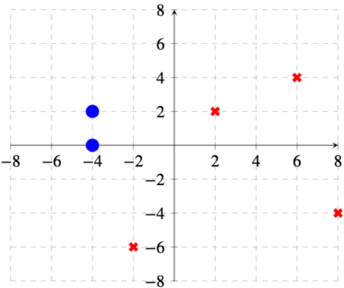

What is the minimum depth of the decision tree that completely separates the two classes? Assume that each decision involves comparing a single feature value against a chosen threshold.

○ 1
○ 2
○ 3
○ 4
○ 5
○ > 5
○ Cannot be determined

(ii) [2 pts] We recovered some additional data points that were missing from the graph! We've plotted them alongside the original data, and labeled their classes accordingly.

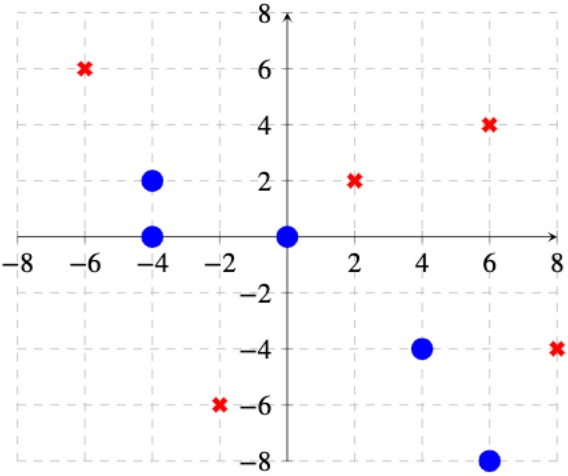

What is the minimum depth of the decision tree that completely separates the two classes now? Assume that each decision involves comparing a single feature value against a chosen threshold.
○ 1
○ 2
○ 3
○ 4

<!-- page: 20 -->

<!-- page: 21 -->

## Q9. [11 pts] Tupacman's NB Model

(a) Tupacman is ready to begin his rap career and wants to use his CS 188 knowledge to figure out how to make it. After some thorough research, he realizes that the success of Billboard Hits, whether $H = +h$ or $H = -h$, only depends on the following factors:

\- $T$: $+t$ if songs have a tempo greater than 120 BPM, else $-t$

\- $E$: $+e$ if the song contains explicit content, else $-e$

\- $D$: $+d$ if the song has a Drake feature, else $-d$

He also collects data on recently released music and stores it in the table below.

| Song | E | T | D | H |
| --- | --- | --- | --- | --- |
| 1 | + | + | + | + |
| 2 | + | - | - | + |
| 3 | - | - | - | + |
| 4 | + | - | - | + |
| 5 | - | - | + | - |
| 6 | - | - | + | - |
| 7 | + | - | + | - |
| 8 | + | - | + | - |

(i) [2 pts] Use MLE to fill in the following probability tables:

| H | P(H) |
| --- | --- |
| + |  |
| - |  |

| E | H | $P(E\|H)$ |
| --- | --- | --- |
| + | + |  |
| + | - |  |
| - | + |  |
| - | - |  |

(ii) [2 pts] Now use Laplace Smoothing with $k = 3$ to fill in the following probability tables:

| T | H | $P(T\|H)$ |
| --- | --- | --- |
| + | + |  |
| + | - |  |
| - | + |  |
| - | - |  |

| D | H | $P(D\|H)$ |
| --- | --- | --- |
| + | + |  |
| + | - |  |
| - | + |  |
| - | - |  |

(iii) [1 pt] How does decreasing the value of $k$ in Laplace Smoothing affect the learned model?  
○ Increases overfitting    ○ Decreases overfitting

(b) Use the following probability tables for the next few parts.

| H | P(H) |
| --- | --- |
| + | 0.4 |

| E | H | $P(E\|H)$ |
| --- | --- | --- |
| + | + | 0.55 |
| + | - | 0.45 |

| T | H | $P(T\|H)$ |
| --- | --- | --- |
| + | + | 0.6 |
| + | - | 0.4 |

| D | H | $P(D\|H)$ |
| --- | --- | --- |
| + | + | 0.3 |
| + | - | 0.7 |

(i) [2 pts] Tupacman wants to release a song at 150 BPM (+t) that contains no slurs (-e) and has a Drake feature (+d). Find the joint probability of this song being a hit (+h). Simplify your answer as much as possible and round your answer to the nearest thousandth (i.e.: 1.2345 would round to 1.236).

(ii) [3 pts] Find $P(H = -h|T = +, E = -, D = +)$. Simplify your answer as much as possible and round your answer to the nearest hundredth (i.e.: 1.234 would round to 1.23).

(iii) [1 pt] What prediction would the model make for this song?
○ Hit ○ Not a Hit ○ Not enough information ○ Tie

<!-- page: 22 -->

## Q10. [14 pts] Perceptron's Plan

(a) Tupacman has written another song that he is thinking about releasing but is waiting to hear back from Drake about a potential feature. He has to let his team know if he will release the song by tonight and makes a decision network that is shown below to help him make the right decision. The outcome of his track purely depends on Drake's reply (+d if he agrees, else -d) which Tupacman will try to predict by observing Drake's mood (+m if he's in a good mood, else -m) through his twitter feed. He estimates  $P(M = +m|D = +d) = 0.8$ ,  $P(M = +m|D = -d) = 0.3$  and  $P(D = +d) = 0.4$ .

| Action | Drake | Utility |
| --- | --- | --- |
| Release | + | 2000 |
| Release | - | -1000 |
| Don’t Release | + | -400 |
| Don’t Release | - | 0 |

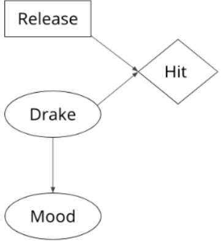

(i) [1 pt] What is his MEU?

(ii) [1 pt] What is the value of perfect information of $D$?

(iii) [2 pts] What is the value of perfect information of $M$?

(iv) [2 pts] What is the value of perfect information of $M$ given $D$?

(v) [1 pt] What decision does Tupacman make given that Drake is in a bad mood?
○ Release ○ Do not release

(b) Naive Bayes is not working out (it's too naive!) and Tupacman wants to use a binary perceptron model with more detailed data to predict which songs will be hits. He now considers two new features for this model, $G$: the groove of the song rated on a scale of 1 to 10 and $D$: the number of sentences said by Drake. He stores this data in the table below, where $H$ is the true label of the sample, + or −.

| Song | G | D | H |
| --- | --- | --- | --- |
| 1 | 10 | 20 | + |
| 2 | 4 | 15 | - |
| 3 | 1 | 15 | + |
| 4 | 1 | 10 | - |
| 5 | 5 | 20 | + |

(i) [2 pts] Starting with $w = [1\ 2\ 3]$, where the first entry is the weight for the bias term, fill in the following table with the results of running the perceptron algorithm on the five samples. $\hat{H}$ is the prediction made by his model, + or −.

<!-- page: 23 -->

SID: \_\_\_\_

| Song | $\hat{H}$ | Updated Weight |
| --- | --- | --- |
| 1 |  |  |
| 2 |  |  |
| 3 | (E) |  |
| 4 |  |  |
| 5 |  |  |

(ii) [1 pt] What is the value of the dual perceptron weight $\alpha$ after the five updates? (assume $\alpha$ was initialized as a zero vector)

The OCR result should be empty, as the image contains only a stylistic horizontal line that must be ignored according to Rule 2. No text or placeholder characters should be output.

(iii) [1 pt] True or False: The algorithm has converged.
○ True ○ False

(iv) [1 pt] True or False: The perceptron algorithm is always able to converge on data that a Naive Bayes classifier can separate.
○ True    ○ False

(v) [1 pt] True or False: In a situation where perceptron is unable to separate the data, a neural network with many hidden layers using linear activation functions will be able to separate the data.
○ True    ○ False

(vi) [1 pt] True or False: The final weights for a converged perceptron instance can be written in terms of the initial weights and the feature vectors it trained on.

○ True ○ False
