<!-- page: 1 -->

## CS 188 Introduction to Summer 2020 Artificial Intelligence

\- You have approximately 170 minutes.

\- The exam is open book, open calculator, and open notes.

\- In the interest of fairness, we want everyone to have access to the same information. To that end, we will not be answering questions about the content or making clarifications.

\- For multiple choice questions,

\- $\square$ means mark all options that apply

\- $\bigcirc$ means mark a single choice

| First name |  |
| --- | --- |
| Last name |  |
| SID |  |

For staff use only:

| Q1. | Testing Time | /1 |
| --- | --- | --- |
| Q2. | Searching for a Triple | /6 |
| Q3. | HMM | /7 |
| Q4. | Filter the Filter | /6 |
| Q5. | Potpourri | /22 |
| Q6. | Value Iteration Networks | /15 |
| Q7. | Q Learning Fundamentals | /9 |
| Q8. | A Cluster of Trees | /9 |
| Q9. | Tupacman’s NB Model | /11 |
| Q10. | Perceptron’s Plan | /14 |
|  | Total | /100 |

<!-- page: 2 -->

<!-- page: 3 -->

## Q1. [1 pt] Testing Time

It's testing time! Not only for you, but for our CS188 robots as well! Circle your favorite robot for a free point!


<!-- page: 4 -->

## Q2. [6 pts] Searching for a Triple

Pacman is performing search over undirected paths through the Bayes Net below. Pacman knows the set of all nodes and the set of directed edges, as well as the fact that nodes E and K are observed.

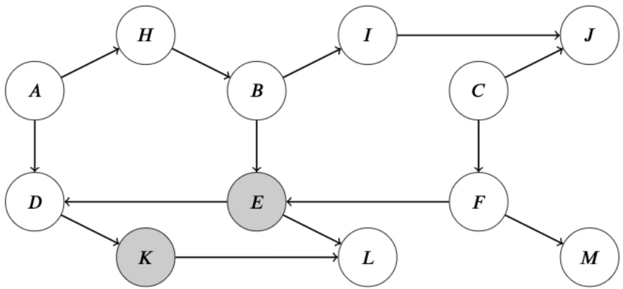

Note: There was an alternate graph with the same solutions.

(a) [2 pts] Suppose Pacman performs search with the aim of finding an undirected path that starts at node A and ends at node C. Here, "undirected path" means that the path may follow edges in the Bayes Net in either direction.

Using DFS Graph Search, does Pacman find a path from node A to node C? If yes, write out the nodes in the order of the path that he finds, separated by commas. If no path is found, write 'No Path'. Assume that we break ties between nodes alphabetically.

$A, D, E, B, I, J, C$

Since we are referring to an undirected path here, we can ignore the direction of the edges and just run DFS Graph search as normal. Breaking ties alphabetically, we end up expanding in the order of A, D, E, B, H, I, J, C, in which case the path we return is just A, D, E, B, I, J, C, since expanding H forced us to backtrack.

(b) Pacman decides to modify the search procedure to only look for active paths, thereby implementing d-separation. Pacman now intends to verify whether nodes A and C are independent conditioned on E and K. The search starts at node A, and terminates when it finds an active path that reaches node C, or once the fringe becomes empty. Pacman performs Graph Search as follows:

\- Whenever Pacman is about to expand a node, he checks the closed set to determine whether he should skip expanding it, using one of two variants:

\- Variant 1: Pacman takes the last random variable along the current path and checks if it is in the closed set

\- Variant 2: Pacman takes the last triple of nodes along the current path and checks if it is in the closed set

\- If he detects an inactive triple along the path that's about to be expanded, the path is discarded. Pacman must backtrack, i.e. select another candidate for expansion on the fringe and continue his search from there. The closed set is not updated in this case.

\- If no inactive triple is detected, Pacman expands the current node and updates the closed set:

\- For Variant 1: Pacman takes the last random variable along the current path and adds it to the closed set.

\- For Variant 2: Pacman takes the last triple of nodes along the current path and adds it to the closed set

(i) [2 pts] Does Pacman find an active path from $A$ to $C$ using BFS Graph Search Variant 1? If yes, write out the nodes in the order of the path that he finds, separated by commas. If no path is found, write 'No Active Path'. Assume that we break ties between nodes alphabetically.

No Active Path

Adding nodes instead of triples to the closed set prevents Pacman from finding an active path, since the first time that we encounter the last node in an active triple, it prevents Pacman from ever revisiting that node. Following the order of expanded nodes, Pacman will encounter the active triple A, D, E with observed child K, so E will be added

<!-- page: 5 -->

to the closed set. However, the only actual active path from A to C uses triple H, B, E, which Pacman will never find because we can no longer expand E.

(ii) [2 pts] Does Pacman find an active path from $A$ to $C$ using BFS Graph Search Variant 2? If yes, write out the nodes in the order of the path that he finds, separated by commas. If no path is found, write 'No Active Path'. Assume that we break ties between nodes alphabetically.

A, H, B, E, F, C

The difference between Variant 1 and Variant 2 is that we save the triple into the closed set instead, which allows us to revisit the same node if we find it from a different triple. Therefore, if we run BFS Variant 2, even though Pacman encounters the active triple A, D, E with observed child K first, E is not added to the closed set; instead, the triple A, D, E is added. Thus, we can still encounter H, B, E later on without being limited by our closed set. Following the standard BFS Graph search procedure, we end up returning the path A, H, B, E, F, C

<!-- page: 6 -->

## Q3. [7 pts] HMM

Recall that for the canonical HMM structure, the Viterbi algorithm finds the most probable sequence of hidden states  $X_{1:T}$ , given a sequence of observations  $e_{1:T}$ . Throughout this question you may assume there are no ties. Note that for the canonical HMM, the Viterbi algorithm performs the following dynamic programming computations:

$$
m _ {t} [ x _ {t} ] = P (e _ {t} | x _ {t}) \max _ {x _ {t - 1}} P (x _ {t} | x _ {t - 1}) m _ {t - 1} [ x _ {t - 1} ]
$$

Note: There was another version of this graph that used o instead of e and V instead of S. Please substitute in the corresponding letters as appropriate to match your version.

(a) [3 pts] For the HMM structure below, we want to find the most likely sequence of states  $X_{1:T}$  and  $S_{1:T}$  given the sequence of observations  $e_{1:T}$, so we modify the Viterbi algorithm to work with our new structure. Which of the following probabilities are maximized by the sequence of states returned by this modified Viterbi algorithm? Mark all the correct option(s).

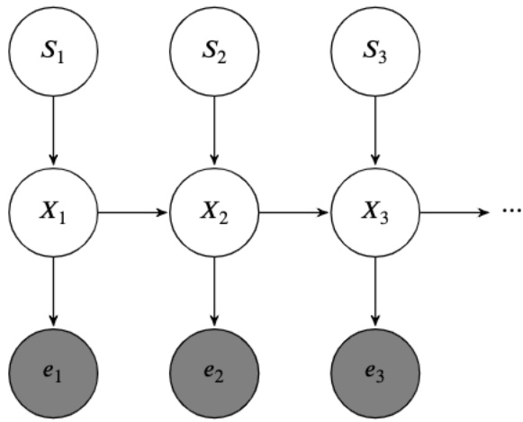

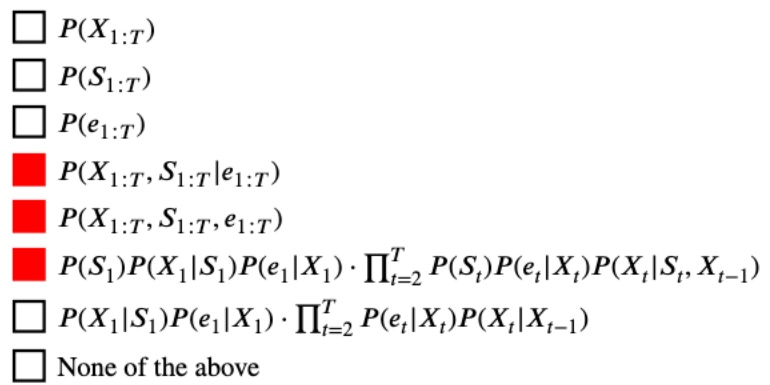

First, by definition, the sequence of states returned by the Viterbi algorithm maximizes the conditional probability  $P(X_{1:T}, S_{1:T}|e_{1:T})$ . Then, since  $P(e_{1:T})$  is a constant with the evidence being observed, and since  $P(X_{1:T}, S_{1:T}, e_{1:T}) \propto P(X_{1:T}, S_{1:T}|e_{1:T})$ , the full joint probability  $P(X_{1:T}, S_{1:T}, e_{1:T})$  is also maximized.

Finally, using the Chain rule and the conditional independences implied by the HMM structure, we have that  $P(S_{1})P(X_{1}|S_{1})P(e_{1}|X_{1})$ .  $\prod_{t=2}^{T}P(S_{t})P(e_{t}|X_{t})P(X_{t}|S_{t},X_{t-1})== P(X_{1:T},S_{1:T},e_{1:T})$ , and thus, this option is also maximized.

<!-- page: 7 -->

(b) Assume in the HMM above,

1. The hidden variable $X$ can take on $x$ values.

2. The hidden variable $S$ can take on $s$ values.

3. The (observed) emission variable $E$ can take on $e$ values.

4. Our sequence has $T$ time steps.

(i) [2 pts] What is the runtime of the modified Viterbi algorithm?
○  $\mathcal{O}(T^{2}xs)$  ●  $\mathcal{O}(Tx^{2}+Txs)$  ○  $\mathcal{O}(x^{2}s^{2}e^{2})$  ○  $\mathcal{O}(Tx^{2}s^{2})$ 
○  $\mathcal{O}(Txs)$  ○  $\mathcal{O}(T^{2}x^{2}s^{2}e^{2})$  ○  $\mathcal{O}(Tx^{2}s^{2}+Txse)$  ○  $\mathcal{O}(x^{2}s^{2})$ 
○  $\mathcal{O}(xs)$  ○  $\mathcal{O}(Tx^{2}s^{2}e^{2})$  ○  $\mathcal{O}(T^{2}x^{2}s^{2})$  ○ None of the above

Although both X and S are hidden, Viterbi only looks at X since it affects the evidence, so there are x states, giving  $\mathcal{O}(Tx^{2})$  with a sequence of T observations. However, X is dependent on S, so we still need the additional runtime  $\mathcal{O}(Txs)$  to capture this part of the conditional probability.

Therefore, the total runtime is  $\mathcal{O}(Tx^{2} + Txs)$ . However, this simplification was more of an optimization style analysis, so full credit was also given for those who thought there were xs-many states, resulting in  $\mathcal{O}(Tx^{2}s^{2})$ .

(ii) [2 pts] Ignoring the storage of the emission probabilities, $P(E_t|X_t, S_t)$, and the transition probabilities, $P(X_t|X_{t-1}, S_t)$, what is the storage requirement (space needed) of the modified Viterbi algorithm?
○ $\mathcal{O}(T)$
○ $\mathcal{O}(Te)$
○ $\mathcal{O}(Tse)$
○ $\mathcal{O}(T + e)$
● $\mathcal{O}(Tx)$
○ $\mathcal{O}(Txs)$
○ $\mathcal{O}(Txse)$
○ $\mathcal{O}(T + x + s + e)$
○ $\mathcal{O}(Ts)$
○ $\mathcal{O}(Txe)$
○ $\mathcal{O}(T + x + s)$
○ None of the above

Similar to the runtime argument, we only need to record the states of X, so there are a total of x states. Therefore, given a sequence of T observations, the required storage space is  $\mathcal{O}(Tx)$ .

For the same reason as the previous subpart, full credit was given for  $\mathcal{O}(Txs)$

<!-- page: 8 -->

## Q4. [6 pts] Filter the Filter

A group of CS188 robots are at a factory trying to filter some magical packages that come through constantly to ensure safety. We denote the possible label of each package as an integer from 1 through 10 (inclusive). However, since we're in a magical robotics land, the package and its label might mutate at every time step.

The label of a package at time step i is represented by the random variable  $X_{i}$ . At each time step, the package will either remain with its current label, or swap to a different label corresponding to an adjacent region of the current label on the following grid. For example, the available actions from label 3 are (UP, RIGHT, STAY), corresponding to labels 2, 6, and 3 respectively. The new package label is chosen between the successor states of all available actions from a label with equal probability. Note: a package can only be assigned a label between 1 and 10 (inclusive), and actions that would lead to exiting the grid are invalid; the two empty boxes above and below box 10 are invalid as well.

| 1 | 4 | 7 |  |
| --- | --- | --- | --- |
| 2 | 5 | 8 | 10 |
| 3 | 6 | 9 |  |

We have two sensors for detecting labels. The first sensor  $S_{1}$  monitors if labels remain between 1 through 5 inclusive. The second sensor  $S_{2}$  checks whether the labels between 1 through 9 inclusive.

Note: Each subpart had three different versions. Please reference the version that corresponded to your actual exam.

(a) [2 pts] Assume that we utilize particle filtering to track the labels of our packages. Suppose we start with five particles with corresponding labels [1, 6, 10, 5, 8].

Fill out the table below for the time elapse update, using the given generated random numbers.

Note: Assign the label IDs numerically. For example, if a label has 2 potential successor labels 3 and 7 with corresponding probabilities $P(X_{t+1} = 3)$ and $P(X_{t+1} = 7)$, then we would select label 3 if the generated random number is less than $P(X_{t+1} = 3)$, and select label 7 otherwise.

For each label at t = 0, we arrange the possible labels for the next timestep in numerical order. We then use these as bins between 0 and 1, and use the random number generated to sample from the range. For example, for label 1, the possible labels for the next timestep are 1, 2, 4, so we can separate it such that any random number from 0 to 0.33 goes to 1, from 0.34 to 0.66 goes to 2, and anything above 0.66 goes to 4.

Version 1:

| Label at t = 0 | 1 | 6 | 10 | 5 | 8 |
| --- | --- | --- | --- | --- | --- |
| Random number for time elapse update | 0.49 | 0.23 | 0.89 | 0.12 | 0.43 |
| Label after time elapse update | 2 | 3 | 10 | 2 | 8 |

<!-- page: 9 -->

Version 2:

| Label at t = 0 | 1 | 6 | 10 | 5 | 8 |
| --- | --- | --- | --- | --- | --- |
| Random number for time elapse update | 0.89 | 0.30 | 0.52 | 0.43 | 0.74 |
| Label after time elapse update | 4 | 5 | 10 | 5 | 9 |

Version 3:

| Label at t = 0 | 1 | 6 | 10 | 5 | 8 |
| --- | --- | --- | --- | --- | --- |
| Random number for time elapse update | 0.3 | 0.98 | 0.12 | 0.86 | 0.36 |
| Label after time elapse update | 1 | 9 | 8 | 8 | 7 |

(b) [2 pts] Ignore your answer from part (a). Suppose you obtain the following labels after the update: [1, 9, 10, 5, 7]. Recall that you have two sensors for detecting labels. The first sensor $S_{1}$ monitors if labels remain between 1 through 5 inclusive. The second sensor $S_{2}$ checks whether the labels between 1 through 9 inclusive.

However, you suddenly realize that your sensors are not precise, and they are giving results following this distribution:

Version 1:

| Sensor 1 | $P(S_1\|1 \leq X_i \leq 5)$ | $P(S_1\|6 \leq X_i \leq 10)$ |
| --- | --- | --- |
| True | 0.75 | 0.2 |
| False | 0.25 | 0.8 |

| Sensor 2 | $P(S_2\|1 \leq X_i \leq 9)$ | $P(S_2\|X_i = 10)$ |
| --- | --- | --- |
| True | 0.9 | 0.4 |
| False | 0.1 | 0.6 |

Version 2:

| Sensor 1 | $P(S_1\|1 \leq X_i \leq 5)$ | $P(S_1\|6 \leq X_i \leq 10)$ |
| --- | --- | --- |
| True | 0.7 | 0.25 |
| False | 0.3 | 0.75 |

| Sensor 2 | $P(S_2\|1 \leq X_i \leq 9)$ | $P(S_2\|X_i = 10)$ |
| --- | --- | --- |
| True | 0.8 | 0.3 |
| False | 0.2 | 0.7 |

Version 3:

| Sensor 1 | $P(S_1\|1 \leq X_i \leq 5)$ | $P(S_1\|6 \leq X_i \leq 10)$ |
| --- | --- | --- |
| True | 0.9 | 0.3 |
| False | 0.1 | 0.7 |

| Sensor 2 | $P(S_2\|1 \leq X_i \leq 9)$ | $P(S_2\|X_i = 10)$ |
| --- | --- | --- |
| True | 0.75 | 0.1 |
| False | 0.25 | 0.9 |

Suppose that Sensor 1 reports $S_{1} =$ False and Sensor 2 reports $S_{2} =$ True. What is the weight for each label after incorporating the sensor readings?

We multiply the values in the sensor model tables corresponding to  $S_{1}=False$  and  $S_{2}=True$  based on the label value. For example, for a label of 1, we would multiply  $P(S_{1}=False|1\leq X_{i}\leq5)P(S_{2}=True|1\leq X_{i}\leq9)$ , since 1 falls between those corresponding ranges.

<!-- page: 10 -->

Version 1:

| Label(s) | 1 | 9 | 10 | 5 | 7 |
| --- | --- | --- | --- | --- | --- |
| Weight(s) | $0.25 \times 0.9 = 0.225$ | $0.8 \times 0.9 = 0.72$ | $0.8 \times 0.4 = 0.32$ | $0.25 \times 0.9 = 0.225$ | $0.8 \times 0.9 = 0.72$ |

Version 2:

| Label(s) | 1 | 9 | 10 | 5 | 7 |
| --- | --- | --- | --- | --- | --- |
| Weight(s) | $0.3 \times 0.8 = 0.24$ | $0.75 \times 0.8 = 0.6$ | $0.75 \times 0.3 = 0.225$ | $0.3 \times 0.8 = 0.24$ | $0.75 \times 0.8 = 0.6$ |

Version 3:

| Label(s) | 1 | 9 | 10 | 5 | 7 |
| --- | --- | --- | --- | --- | --- |
| Weight(s) | $0.1 \times 0.75 = 0.075$ | $0.7 \times 0.75 = 0.525$ | $0.7 \times 0.1 = 0.07$ | $0.1 \times 0.75 = 0.075$ | $0.7 \times 0.75 = 0.525$ |

(c) [2 pts] Ignore your answer for part (b). Suppose you obtain these weights for each label after incorporating the sensor readings:

| Label(s) | 1 | 9 | 10 | 5 | 7 |
| --- | --- | --- | --- | --- | --- |
| Weight(s) | 0.3 | 0.2 | 0.5 | 0.8 | 0.2 |

Use the following random numbers to resample the package labels.

As in part (a), assign label IDs to sample spaces in numerical order.

Take the labels and their corresponding weights, reorder them numerically, and the normalize to get ranges for each label. Then resample the label with the random numbers based on your version of the exam.

Normalizing:

$$
\mathrm{X} = 1: 0. 3 / 2 = 0. 1 5 \longrightarrow (0, 0. 1 5)
$$

$$
\mathrm{X} = 5: 0. 8 / 2 = 0. 4 \longrightarrow (0. 1 5, 0. 5 5)
$$

$$
\mathrm{X} = 7: 0. 2 / 2 = 0. 1 \longrightarrow (0. 5 5, 0. 6 5)
$$

$$
\mathrm{X} = 9: 0. 2 / 2 = 0. 1 \longrightarrow (0. 6 5, 0. 7 5)
$$

$$
\mathrm{X} = 1 0: 0. 5 / 2 = 0. 2 5 \longrightarrow (0. 7 5, 1)
$$

Version 1:

| Random number(s) | 0.11 | 0.98 | 0.58 | 0.47 | 0.62 | 0.70 | 0.84 |
| --- | --- | --- | --- | --- | --- | --- | --- |
| Label(s) | 1 | 10 | 7 | 5 | 7 | 9 | 10 |

<!-- page: 11 -->

Version 2:

| Random number(s) | 0.48 | 0.61 | 0.80 | 0.73 | 0.10 | 0.93 | 0.56 |
| --- | --- | --- | --- | --- | --- | --- | --- |
| Label(s) | 5 | 7 | 10 | 9 | 1 | 10 | 7 |

Version 3:

| Random number(s) | 0.21 | 0.90 | 0.11 | 0.58 | 0.68 | 0.84 | 0.52 |
| --- | --- | --- | --- | --- | --- | --- | --- |
| Label(s) | 5 | 10 | 1 | 7 | 9 | 10 | 5 |

<!-- page: 12 -->

## Q5. [22 pts] Potpourri

(a) Different versions had different numberings of the same graphs, leading to slightly different answers for a.i. and a.ii.

Version 1:

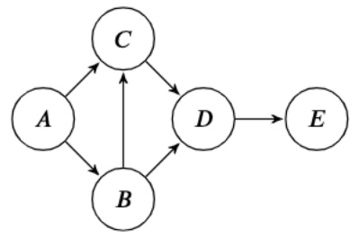

(1)

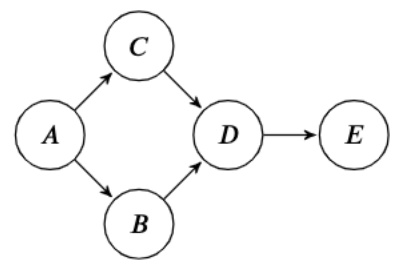

(2)

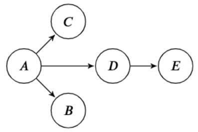

(3)

Version 2:

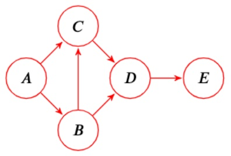

(1)

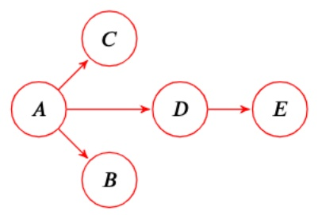

(2)


(3)

Version 3:

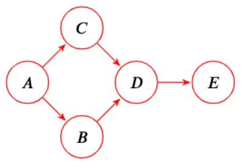

(1)

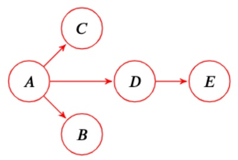

(2)

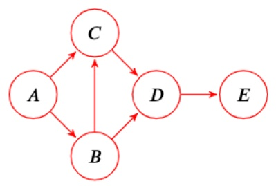

(3)

<!-- page: 13 -->

(i) [4 pts] For each conditional independence expression, select the Bayes net(s) for which the conditional independence is guaranteed to be true.

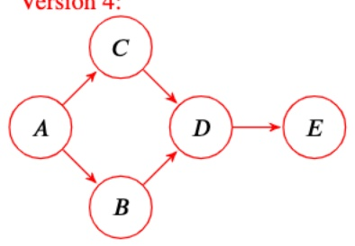

(1)

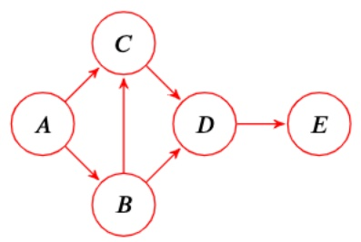

(2)


(3)


(1)

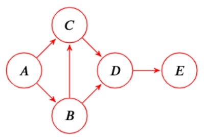

(2)

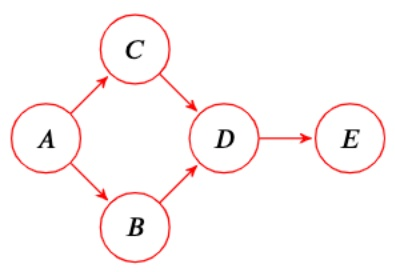

(3)

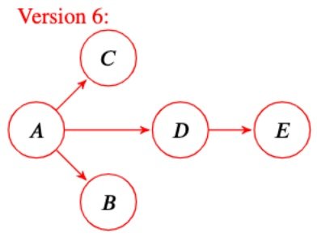

(1)

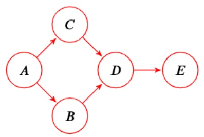

(2)

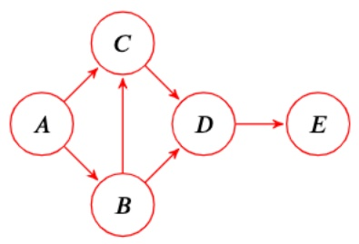

(3)

<table><tr><td colspan="5">(i) [4 pts] For each conditional independence expression, select the Bay is guaranteed to be true.</td></tr><tr><td colspan="5">Version 1:</td></tr><tr><td>A ⊥ E | D</td><td>(1)</td><td>(2)</td><td>(3)</td><td>○ None</td></tr><tr><td>B ⊥ C | A</td><td>(1)</td><td>(2)</td><td>(3)</td><td>○ None</td></tr><tr><td>A ⊥ D | B, C</td><td>(1)</td><td>(2)</td><td>(3)</td><td>○ None</td></tr><tr><td>B ⊥ C | A, E</td><td>(1)</td><td>(2)</td><td>(3)</td><td>○ None</td></tr><tr><td colspan="5">Version 2:</td></tr><tr><td>A ⊥ E | D</td><td>(1)</td><td>(2)</td><td>(3)</td><td>○ None</td></tr><tr><td>B ⊥ C | A</td><td>(1)</td><td>(2)</td><td>(3)</td><td>○ None</td></tr><tr><td>A ⊥ D | B, C</td><td>(1)</td><td>(2)</td><td>(3)</td><td>○ None</td></tr><tr><td>B ⊥ C | A, E</td><td>(1)</td><td>(2)</td><td> $\square$ (3)</td><td>○ None</td></tr><tr><td colspan="5">Version 3:</td></tr><tr><td>A ⊥ E | D</td><td>(1)</td><td>(2)</td><td>(3)</td><td>○ None</td></tr><tr><td>B ⊥ C | A</td><td>(1)</td><td>(2)</td><td>(3)</td><td>○ None</td></tr><tr><td>A ⊥ D | B, C</td><td>(1)</td><td>(2)</td><td>(3)</td><td>○ None</td></tr><tr><td>B ⊥ C | A, E</td><td>(1)</td><td>(2)</td><td>□(3)</td><td>○ None</td></tr><tr><td colspan="5">Version 4:</td></tr><tr><td>A ⊥ E | D</td><td>(1)</td><td>(2)</td><td>(3)</td><td>○ None</td></tr><tr><td>B ⊥ C | A</td><td>(1)</td><td>(2)</td><td>(3)</td><td>○ None</td></tr><tr><td>A ⊥ D | B, C</td><td>(1)</td><td>(2)</td><td>(3)</td><td>○ None</td></tr><tr><td>B ⊥ C | A, E</td><td>(1)</td><td>(2)</td><td>- (3)</td><td>○ None</td></tr></table>

<!-- page: 14 -->

<table><tr><td colspan="5">Version 5:</td></tr><tr><td>A ⊥ E | D</td><td>(1)</td><td>(2)</td><td>(3)</td><td>○ None</td></tr><tr><td>B ⊥ C | A</td><td>(1)</td><td>(2)</td><td>(3)</td><td>○ None</td></tr><tr><td>A ⊥ D | B, C</td><td>(1)</td><td>(2)</td><td>(3)</td><td>○ None</td></tr><tr><td>B ⊥ C | A, E</td><td>(1)</td><td>(2)</td><td>(3)</td><td>○ None</td></tr><tr><td colspan="5">Version 6:</td></tr><tr><td>A ⊥ E | D</td><td>(1)</td><td>(2)</td><td>(3)</td><td>○ None</td></tr><tr><td>B ⊥ C | A</td><td>(1)</td><td>(2)</td><td>(3)</td><td>○ None</td></tr><tr><td>A ⊥ D | B, C</td><td>(1)</td><td>(2)</td><td>(3)</td><td>○ None</td></tr><tr><td>B ⊥ C | A, E</td><td>(1)</td><td>(2)</td><td> $\square$ (3)</td><td>○ None</td></tr></table>

## (ii) [2 pts] Select all of the following statements that are true.

☐ Any distribution that can be represented by Bayes net (1) can be represented by Bayes net (2).

Any distribution that can be represented by Bayes net (2) can be represented by Bayes net (1).

☐ A Bayes net with no edges can represent any distribution over its random variables.

☐ If two Bayes nets can represent the same set of distributions, then they must have the same set of edges.

○ None of the above

\- Bayes net (1) has an extra edge compared to Bayes net (2), so therefore Bayes net (1) can represent a strictly greater set of distributions (rather than the other way around).

\- A Bayes net with no edges is the most restrictive Bayes net and can only represent distributions where all variables are independent.

\- Two Bayes nets can represent the same set of distributions with different edges. For example, $A \to B$ and $A \leftarrow B$ are equivalent Bayes nets that have different graph structure.

## For each version, the following is the correct answer:

1. Any distribution that can be represented by Bayes net (2) can be represented by Bayes net (1).

2. Any distribution that can be represented by Bayes net (3) can be represented by Bayes net (1).

3. Any distribution that can be represented by Bayes net (1) can be represented by Bayes net (3).

4. Any distribution that can be represented by Bayes net (1) can be represented by Bayes net (2).

5. Any distribution that can be represented by Bayes net (3) can be represented by Bayes net (2).

6. Any distribution that can be represented by Bayes net (2) can be represented by Bayes net (3).

<!-- page: 15 -->

(b) Pacman is about to play as the maximizer agent in the game shown below, but the values of some leaf nodes are known to all players except Pacman! In this problem, let's think about Pacman's VPI associated with learning the leaf utility for one or more leaf nodes. In the game tree, square nodes are terminal nodes and the circle is a chance node.

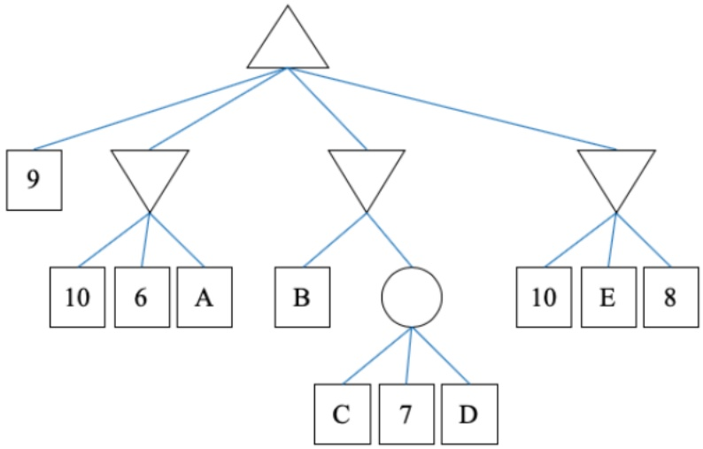

Note: We also gave full credit to answers that were correct if we assumed a prior distribution of the chance node, although this was not specified by the problem and should not have been assumed.

(i) [2 pts] Consider the game tree above, and select the choices that are guaranteed to be true.

```ini
[2 pts] Consider the gain
□ VPI(B) = 0
    VPI(C) = 0
    VPI(D) = 0
    VPI(E) = 0
□ VPI(C|D) = 0
□ VPI(D|C) = 0
○ None of the above
```

The maximizer will never select the second and the fourth branch, so $VPI(E) = 0$. It's possible that $B < 9$, in which case the maximizer knows that it should select the first branch, so $VPI(B)$ is not guaranteed to be 0. For the same reason, $VPI(C, D)$ is not guaranteed to be 0.

Knowing C or D does not give any information of the expected value that the chance node returns, so  $VPI(C) = VPI(D) = 0$ . Therefore,  $VPI(C|D) = VPI(C, D) - VPI(D)$  and  $VPI(D|C) = VPI(C, D) - VPI(C)$  are not guaranteed to be 0.

If we assumed a prior distribution, then  $VPI(C)$  and  $VPI(D)$  are not guaranteed to be 0, so the only correct answer was  $VPI(E)=0$ .

(ii) [4 pts] Consider the game tree above, and select the choices that are possible to be true.

$VPI(A)=0$ , and  $VPI(B,C)\geq VPI(B)$ , which is not guaranteed to be 0.

$VPI(B,C) \geq VPI(B)$ for any general variables B and C, but in this case, $VPI(B,C) = VPI(B)$, because without D, C does not add any information on the choice of branch (action). If we assumed a prior distribution, then $VPI(C)$ is not guaranteed to be 0, so $VPI(B,C)$ is not guaranteed to be $VPI(B)$. Therefore, the correct answer in this case would be > 0 and = 0.

<!-- page: 16 -->

$VPI(B,C) = VPI(B)$. We cannot guarantee any relation between $VPI(B)$ and $VPI(C,D)$.

$$
\begin{array}{l} V P I (C, D) - V P I (B, C | D) \\ \boxed {\quad} > 0 \\ \boxed {\quad} = 0 \\ \boxed {\quad} <   0 \end{array}
$$

$$
V P I (C, D) - V P I (B, C | D) = V P I (C, D) - (V P I (B, C, D) - V P I (D)) = V P I (C, D) - V P I (B, C, D).
$$

Note that  $VPI(B,C,D) \geq VPI(C,D)$ , and there are cases that  $VPI(B,C,D) > VPI(C,D)$ , e.g. B = 8 and C = D = 12.

<!-- page: 17 -->

(c) Select the model(s) that each graph is representing:

(i) [1 pt]

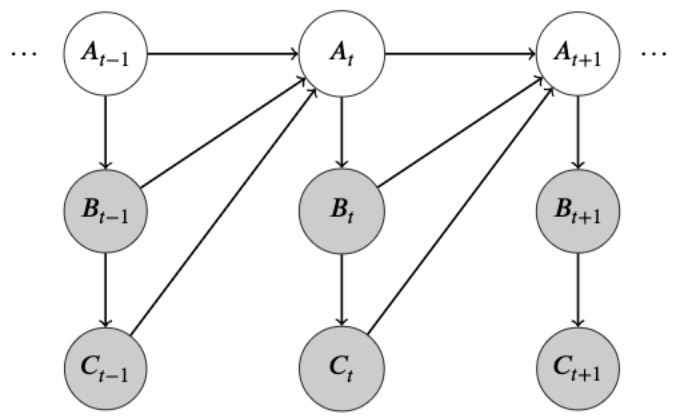

Dynamic Bayes Net □ Naive Bayes □ Decision Network ○ None of the above

(ii) [1 pt]

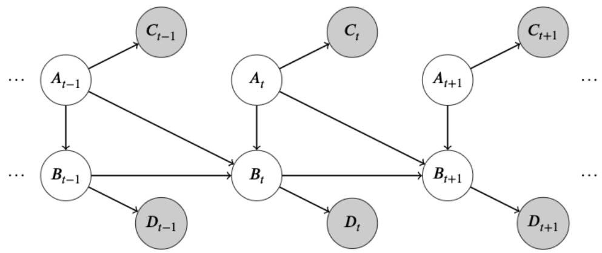

Dynamic Bayes Net □ Naive Bayes □ Decision Network ○ None of the above

(iii) [1 pt]

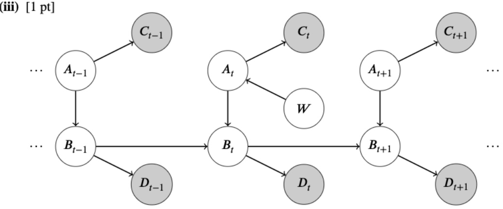

□ Dynamic Bayes Net □ Naive Bayes □ Decision Network ● None of the above

None of the 3 graphs above are decision networks because there are no action nodes. They are not Naive Bayes either because they don't satisfy the Naive Bayes assumption, no matter which node is considered as the label. (i) and (ii) are Dynamic Bayes Nets (a generalization of HMMs), but (iii) is not because it does not repeat a fixed Bayes net structure at each time.

<!-- page: 18 -->

(d) In hidden Markov models, a common task is to compute the probability distribution of the final state given the evidence, $P(s_T|e_{1:T})$. Suppose that instead of using the forward algorithm, we wish to apply variable elimination to compute this probability.

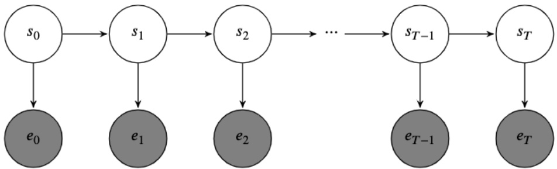

(i) [2 pts] Select the most optimal variable ordering(s) for which we should eliminate our variables.

<div class="docvortex-algorithm" style="white-space: pre-wrap; font-family:monospace;">
$s_0, s_1, s_2, ..., s_{T-1}$
$s_{T-1}, s_{T-2}, ..., s_0$
$e_0, s_0, e_1, s_1, e_2, s_2, ..., s_{T-1}, e_T$
$e_T, s_{T-1}, e_{T-1}, s_{T-2}, ..., s_0, s_T$
$s_0, s_1, s_2, ..., s_{T-1}, e_0, e_1, ..., e_T$
$s_{T-1}, s_{T-2}, ..., s_0, e_T, e_{T-1}, ..., e_0$
</div>

○ None of the above

Eliminating from $s_0$ to $s_{T-1}$ one by one will lead to the lowest factor size created, since this means that every factor will be in terms of exactly one $s_i$. Eliminating backwards doesn't work because we are not eliminating $s_T$ since it's part of our query. We also do not eliminate the evidence, so any answer choices involving that were incorrect.

(ii) [2 pts] Let $|S|$ and $|E|$ denote the domain sizes of $S$ and $E$, respectively. What is the size of the largest factor created using the most optimal variable ordering(s)?

● |S|

$\bigcirc |E|$

$\bigcirc \quad |S| \cdot |E|$

○ T

$\bigcirc T\cdot |S|$

$\bigcirc T\cdot |E|$

$\bigcirc T \cdot |S| \cdot |E|$

$\bigcirc \quad |S|^{\bar{T} -1}$

$\bigcirc |E|^T$

$\bigcirc \quad |S|^{T - 1} \cdot |E|^T$

$\bigcirc |S|^T$

$\bigcirc |E|^{T + 1}$

$\bigcirc \quad |S|^T \cdot |E|^{T+1}$

○ None of the above

The optimal variable elimination ordering will be to sum out variables from left to right, starting from $s_0$ and ending at $s_{T-1}$. This produces $T$ factors with size $|S|$. If we eliminate a node without first eliminating it's predecessor, this will generate a factor with size $|S|^2$.

(e) [1 pt] Pacman must navigate through a maze with the goal of eating a specific power pellet. Which of the following must be included in the minimal search space for this problem?

☐ The number of actions Pacman has taken thus far

Pacman's position

☐ The location of the power pellet

☐ A dot boolean for each dot in the grid

☐ The total number of power pellets

☐ The location of any walls

○ None of the above

<!-- page: 19 -->

SID: \_\_\_\_

Only Pacman's position is necessary. The location of the power pellet is not necessary because it is stationary, and the rest of the features are not relevant to the minimal state space.

(f) [1 pt] Which of the following is true about relaxed problem heuristics?

☐ Greedy tree search with a relaxed problem heuristic is optimal

☐ Greedy graph search with a relaxed problem heuristic is optimal

A\* tree search with a relaxed problem heuristic is optimal

☐ A\* graph search with a relaxed problem heuristic is optimal

○ None of the above

A relaxed problem heuristic is an admissible heuristic for the original problem, for which only A\* tree search is guaranteed to be optimal.

(g) [1 pt] What is the size of the smallest minimax search tree where at least one node can be pruned by alpha-beta pruning? Your answer should be the total number of nodes in the tree (including all maximizer, minimizer, and leaf nodes).


Consider a game tree with one maximizer node, one minimizer node, and three leaf nodes (for a total of 5 nodes) such as the following:

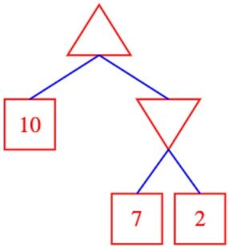

In this case, because the maximizer is already guaranteed a value of 10 or greater, once we see a 7 from the minimizer, we can prune the remaining node.

<!-- page: 20 -->

## Q6. [15 pts] Value Iteration Networks

In this problem, we'll explore how neural network architectures can be designed to mimic value iteration for Markov Decision Processes. Consider the following 5-state MDP:

| 0 | 1 | 2 | 3 | 4 |
| --- | --- | --- | --- | --- |

The agent can transition deterministically between any adjacent states, or remain in place. Suppose we're in a situation where we know the values of the policy for some iteration of value iteration, but we don't know the reward function. We can set up a modified neural network to solve for the rewards as shown on the right:

The node  $V_{i}^{(k)}$  represents the value of state i at iteration k. The reward  $r_{ij}$  represents the reward obtained on a transition from state i to state j. Each node can be calculated from values at the previous layer according to:

$$
V _ {j} ^ {(k)} = \left\{ \begin{array}{l l} \max _ {i \in (0, 1)} r _ {i j} + \gamma V _ {i} ^ {(k - 1)} & j = 0 \\ \max _ {i \in (j - 1, j, j + 1)} r _ {i j} + \gamma V _ {i} ^ {(k - 1)} & 1 \leq j \leq 3 \\ \max _ {i \in (3, 4)} r _ {i j} + \gamma V _ {i} ^ {(k - 1)} & j = 4 \end{array} \right.
$$


Suppose we have estimates $\mathbf{y}$ for the values at iteration 2, and

Suppose we have estimates $\mathbf{y}$ for the values at iteration 2, and we feed in a value of 0 as the input to this network on the bottom layer ($V_{i}^{(0)} = 0$ for all $i$). We use the following squared loss function, where the network is parameterized by the rewards $\mathbf{r}$:

$$
\mathcal {L} (\mathbf {r}) = \frac {1}{2} \sum_ {i = 0} ^ {4} (y _ {i} - V _ {i} ^ {(2)}) ^ {2}
$$

Note that the superscript (2) in $V_{i}^{(2)}$ denotes the second layer of the network, and not a square.

(a) [2 pts] We are interested in minimizing the loss $\mathcal{L}$ in order to learn the rewards $r_{ij}$. How many learnable parameters are there in this network? Hint: The reward parameters $r_{ij}$ are shared between different layers. 13 There is one reward $r_{ij}$ for each transition $i$ to $j$. There are 13 such transitions.

(b) [2 pts] Suppose we fix all parameters but consider a change in the value of $r_{12}$. In the forward pass, which of the following values can possibly be changed?

$$
\begin{array}{c c c c c} \square & V _ {0} ^ {(2)} & \blacksquare & V _ {1} ^ {(2)} & \blacksquare \\ \square & V _ {0} ^ {(1)} & \square & V _ {1} ^ {(1)} & \blacksquare \\ \end{array} \quad \begin{array}{c c c c c} \blacksquare & V _ {2} ^ {(2)} & \blacksquare & V _ {3} ^ {(2)} & \square \\ \blacksquare & V _ {2} ^ {(1)} & \square & V _ {3} ^ {(1)} & \square \\ \end{array} \quad \begin{array}{c c c c c} \square & V _ {4} ^ {(2)} \\ \square & V _ {4} ^ {(1)} \\ \square & V _ {4} ^ {(1)} \\ \end{array}
$$

On the first layer, the value of $r_{12}$ directly affects the value of $V_2^{(1)}$. The value of $V_2^{(1)}$ can potentially affect the values of its neighbors in the MDP on the next iteration, $V_1^{(2)}, V_2^{(2)}$, and $V_3^{(2)}$.

Alternative solutions.

For $r_{01}$, the values $V_{1}^{(1)}, V_{0}^{(2)}, V_{1}^{(2)}, V_{2}^{(2)}$ should be affected.

For $r_{23}$, the values $V_{3}^{(1)}, V_{2}^{(2)}, V_{3}^{(2)}, V_{4}^{(2)}$ should be affected.

(c) [2 pts] Suppose we fix all parameters but consider a change in the value of $r_{12}$. In the backward pass, which of the following derivatives can possibly be changed?

<!-- page: 21 -->

$$
\begin{array}{c c c c c c} \square & \frac {\partial \mathcal {L}}{\partial V _ {0} ^ {(2)}} & \square & \frac {\partial \mathcal {L}}{\partial V _ {1} ^ {(2)}} & \square & \frac {\partial \mathcal {L}}{\partial V _ {2} ^ {(2)}} \\ \hline & \frac {\partial \mathcal {L}}{\partial V _ {0} ^ {(1)}} & \hline & \frac {\partial \mathcal {L}}{\partial V _ {1} ^ {(1)}} & \hline & \frac {\partial \mathcal {L}}{\partial V _ {2} ^ {(1)}} \\ \hline \end{array} \quad \begin{array}{c c c c c c} \square & \frac {\partial \mathcal {L}}{\partial V _ {3} ^ {(2)}} & \square & \frac {\partial \mathcal {L}}{\partial V _ {4} ^ {(2)}} \\ \hline & \frac {\partial \mathcal {L}}{\partial V _ {3} ^ {(1)}} & \hline & \frac {\partial \mathcal {L}}{\partial V _ {4} ^ {(1)}} \\ \hline \end{array}
$$

Because the forward pass affects the values of $V_{1}^{(2)}$, $V_{2}^{(2)}$, and $V_{3}^{(2)}$, and all nodes in the first layer are connected to at least one of those nodes, all of the first layer's derivatives are affected. The second layer's derivatives are unaffected because they only depend on the difference between $V_{i}^{(2)}$ and $y_{i}$.

Alternative solutions.

For both  $r_{01}$  and  $r_{23}$ , the solution is still the entire bottom row of answers.

Now, let's begin with computing some derivatives.

(d) [3 pts] Compute the derivative $\frac{\partial\mathcal{L}}{\partial r_{00}}$. Select one entry from each column.

$$
\begin{array}{c c c c c c c} \boxed {\quad} & \frac {\partial \mathcal {L}}{\partial V _ {0} ^ {(1)}} & \boxed {\quad} & \frac {\partial V _ {0} ^ {(1)}}{\partial r _ {0 0}} & \boxed {\quad} & \frac {\partial \mathcal {L}}{\partial V _ {0} ^ {(2)}} & \boxed {\quad} \\ \boxed {\quad} & \frac {\partial \mathcal {L}}{\partial V _ {1} ^ {(0)}} & \boxed {\quad} & \frac {\partial V _ {0} ^ {(2)}}{\partial r _ {0 0}} & \boxed {\quad} & \frac {\partial \mathcal {L}}{\partial V _ {2} ^ {(0)}} & \boxed {\quad} \\ \boxed {\quad} & r _ {0 0} & \boxed {\quad} + & \boxed {\quad} & r _ {0 1} & \boxed {\quad} + & \boxed {\quad} \\ \boxed {\quad} & \gamma & \boxed {\quad} * & \boxed {\quad} & 1 & \boxed {\quad} * & \boxed {\quad} \\ \boxed {\quad} & 1 & & \boxed {\quad} & 0 & & \boxed {\quad} \\ \end{array}
$$

$r_{00}$ shows up in two places in the computation graph, in the edge from $V_0^{(0)}$ to $V_0^{(1)}$ and from $V_0^{(1)}$ to $V_0^{(2)}$. The rule for a parameter that shows up multiple times is to add the gradients together.

Using the chain rule twice (one for each time the parameter shows up in the graph), we get a solution of:

$$
\frac {\partial \mathcal {L}}{\partial V _ {0} ^ {(1)}} * \frac {\partial V _ {0} ^ {(1)}}{\partial r _ {0 0}} + \frac {\partial \mathcal {L}}{\partial V _ {0} ^ {(2)}} * \frac {\partial V _ {0} ^ {(2)}}{\partial r _ {0 0}}
$$

(e) [3 pts] Compute the derivative $\frac{\partial V_2^{(2)}}{\partial V_2^{(1)}}$ using the chain rule. Please select from the following terms such that when multiplied together, they yield the correct derivative.

$$
\begin{array}{l l l l l} \boxed {\gamma} & \boxed {\square} r _ {1, 2} & \boxed {\square} r _ {2, 2} & \boxed {\square} r _ {3, 2} & \boxed {\square} r _ {2, 1} & \boxed {\square} r _ {2, 3} \\ \boxed {\square} \left\{ \begin{array}{l l} 1 & r _ {1 2} + \gamma V _ {1} ^ {(1)} > r _ {2 2} + \gamma V _ {2} ^ {(1)} \\ 0 & \text {otherwise} \end{array} \right. & \boxed {\square} \left\{ \begin{array}{l l} 1 & r _ {1 2} + \gamma V _ {1} ^ {(1)} > r _ {3 2} + \gamma V _ {3} ^ {(1)} \\ 0 & \text {otherwise} \end{array} \right. & \boxed {\blacksquare} \left\{ \begin{array}{l l} 1 & r _ {2 2} + \gamma V _ {2} ^ {(1)} > r _ {3 2} + \gamma V _ {3} ^ {(1)} \\ 0 & \text {otherwise} \end{array} \right. \\ \boxed {\square} \left\{ \begin{array}{l l} 1 & r _ {3 2} + \gamma V _ {3} ^ {(1)} > r _ {2 2} + \gamma V _ {2} ^ {(1)} \\ 0 & \text {otherwise} \end{array} \right. & \boxed {\blacksquare} \left\{ \begin{array}{l l} 1 & r _ {2 2} + \gamma V _ {2} ^ {(1)} > r _ {1 2} + \gamma V _ {1} ^ {(1)} \\ 0 & \text {otherwise} \end{array} \right. & \boxed {\square} \left\{ \begin{array}{l l} 1 & r _ {3 2} + \gamma V _ {3} ^ {(1)} > r _ {1 2} + \gamma V _ {1} ^ {(1)} \\ 0 & \text {otherwise} \end{array} \right. \end{array}
$$

☐ Not possible with the given choices

The forward pass equation for $V_{2}^{(2)}$ is: $V_{2}^{(2)} = \max_{i\in (1,2,3)}r_{i2} + \gamma V_{i}^{1}$

If $r_{22} + \gamma V_2^{(1)}$ is smaller then $r_{12} + \gamma V_1^{(1)}$ or $r_{32} + \gamma V_3^{(1)}$ then the derivative is 0.

If $r_{22} + \gamma V_2^{(1)}$ is greater, then we have $V_2^{(2)} = r_{22} + \gamma V_1^{(1)}$, and the derivative is $\gamma$.

Let $1[i > j]$ to denote an indicator function that is 1 if $r_{i2} + \gamma V_i^{(1)} > r_{j2} + \gamma V_j^{(1)}$, and 0 if not. We can write this derivative as $\gamma * 1[2 > 3] * 1[2 > 1]$.

Alternative solutions:

For computing $\frac{\partial V_2^{(2)}}{\partial V_1^{(1)}}$, the correct solution is $\gamma * 1[1 > 2] * 1[1 > 3]$.

For computing $\frac{\partial V_2^{(2)}}{\partial V_3^{(1)}}$, the correct solution is $\gamma * 1[3 > 2] * 1[3 > 1]$.

<!-- page: 22 -->

(f) [3 pts] Compute the derivative $\frac{\partial V_2^{(2)}}{\partial r_{12}}$, assuming that $\frac{\partial V_2^{(1)}}{\partial r_{12}} = 0$. Please select from the following terms, such that when multiplied together, they yield the correct derivative.

$$
\begin{array}{l l} \square \gamma & \square r _ {1, 2} \quad \square r _ {2, 2} \quad \square r _ {3, 2} \quad \square r _ {2, 1} \quad \square r _ {2, 3} \\ \blacksquare \left\{ \begin{array}{l l} 1 & r _ {1 2} + \gamma V _ {1} ^ {(1)} > r _ {2 2} + \gamma V _ {2} ^ {(1)} \\ 0 & \text {otherwise} \end{array} \right. & \blacksquare \left\{ \begin{array}{l l} 1 & r _ {1 2} + \gamma V _ {1} ^ {(1)} > r _ {3 2} + \gamma V _ {3} ^ {(1)} \\ 0 & \text {otherwise} \end{array} \right. \\ \square \left\{ \begin{array}{l l} 1 & r _ {3 2} + \gamma V _ {3} ^ {(1)} > r _ {2 2} + \gamma V _ {2} ^ {(1)} \\ 0 & \text {otherwise} \end{array} \right. & \square \left\{ \begin{array}{l l} 1 & r _ {2 2} + \gamma V _ {2} ^ {(1)} > r _ {1 2} + \gamma V _ {1} ^ {(1)} \\ 0 & \text {otherwise} \end{array} \right. \\ \end{array} \quad \begin{array}{l l} \square \left\{ \begin{array}{l l} 1 & r _ {2 2} + \gamma V _ {2} ^ {(1)} > r _ {3 2} + \gamma V _ {3} ^ {(1)} \\ 0 & \text {otherwise} \end{array} \right. \\ \square \left\{ \begin{array}{l l} 1 & r _ {3 2} + \gamma V _ {3} ^ {(1)} > r _ {1 2} + \gamma V _ {1} ^ {(1)} \\ 0 & \text {otherwise} \end{array} \right. \\ \end{array}
$$

☐ Not possible with the given choices

This is similar to the previous problem. Again, the forward pass equation for $V_{2}^{(2)}$ is: $V_{2}^{(2)} = \max_{i\in (1,2,3)}r_{i2} + \gamma V_{i}^{1}$

If $r_{12} + \gamma V_1^{(1)}$ is smaller then $r_{22} + \gamma V_2^{(1)}$ or $r_{32} + \gamma V_3^{(1)}$ then the derivative is 0.

If $r_{12} + \gamma V_1^{(1)}$ is greater, then we have $V_2^{(2)} = r_{12} + \gamma V_1^{(1)}$, and the derivative is 1.

Let $1[i > j]$ to denote an indicator function that is 1 if $r_{i2} + \gamma V_i^{(1)} > r_{j2} + \gamma V_j^{(1)}$, and 0 if not. We can write this derivative as $1[1 > 2] * 1[1 > 3]$.

Alternative solutions:

For computing $\frac{\partial V_2^{(2)}}{\partial r_{22}}$, the solution is $1[2 > 1] * 1[2 > 3]$.

For computing $\frac{\partial V_2^{(2)}}{\partial r_{32}}$, the solution is $1[3 > 1] * 1[3 > 2]$.

<!-- page: 23 -->

## Q7. [9 pts] Q Learning Fundamentals

(a) (i) [1 pt] Q-learning is a model-based reinforcement learning method.

○ True ● False

Q-Learning is a off-policy, model-free RL method.

(ii) [1 pt] In approximate Q-learning, which of the following can be learned with a neural network?

Weights Features ○ Neither

Q-Learning can have neural networks learn both the weights and the features. Learning the weights only is the simpler case.

(b) For the following parts, consider the following MDP. The state space is determined by the grid-world like letters, and the agent can take one of four actions: up, down, right, left.

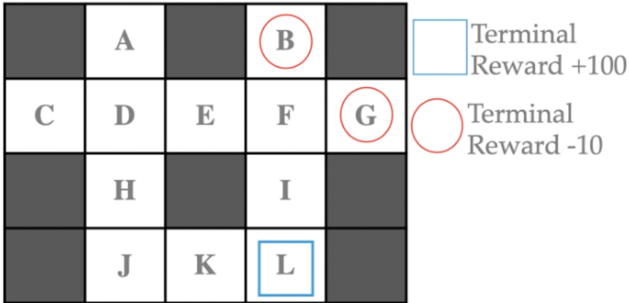

Figure 1: The MDP that we are learning.

We start with the following Q values for the states for all possible actions:

|  | A | B | C | D | E | F | G | H | I | J | K | L |
| --- | --- | --- | --- | --- | --- | --- | --- | --- | --- | --- | --- | --- |
| $Q_0(s,a)$ | 0 | -10 | 0 | 0 | 0 | 0 | -10 | 10 | 0 | 25 | 50 | 100 |

Table 1: Initial Q Values.

Now, consider the following episodes, shown in Table 2 below and compute the Q values for the given state-action pairs after running Q learning for the following transitions.

Operate with the following assumptions:

1) a discount factor,  $\gamma = .9$ .

2) a terminal reward is received after leaving a terminal state and the only action available in a terminal state is to exit.  
3) a living reward of $-1$ for all other transitions.

4) the learning rate  $\alpha = 0.5$ .

$$
Q (s, a) \leftarrow (1 - \alpha) Q (s, a) + \alpha \big [ r + \gamma \max _ {a ^ {\prime}} Q (s ^ {\prime}, a ^ {\prime}) \big ]\tag{1}
$$

$$
\begin{array}{l c}\text {sequence}&(\text {step index, state, action, next state})\\\hline 1&(0, \mathrm{F}, \text {down, I}) \rightarrow (1, \mathrm{I}, \text {down, L}) \rightarrow (2, \mathrm{L}, \text {exit})\\\hline 2&(3, \mathrm{D}, \text {down, E}) \rightarrow (4, \mathrm{E}, \text {right, F}) \rightarrow (5, \mathrm{F}, \text {down, G}) \rightarrow (6, \mathrm{G}, \text {exit})\\\hline 3&(7, \mathrm{A}, \text {down, D}) \rightarrow (8, \mathrm{D}, \text {down, H}) \rightarrow (9, \mathrm{H}, \text {down, J})\end{array}
$$

Table 2: Agent roll-outs.

(i) [1 pt]  $Q(\mathrm{F}, \mathrm{down}) = \alpha^{2} - 1\alpha - 10\alpha$

(ii) [1 pt] $Q(\mathrm{D},\mathrm{down}) = \underline{\alpha^2 - 1\alpha + 8\alpha}$

(iii) [1 pt] Q(A, down) = \_\_\_\_ -α

<!-- page: 24 -->

Step by step with the q-learning formula. Sequence 1 entails steps 0,1, and 2:

$$
\eta = Q (\mathrm{F}, \text {down}) \leftarrow (1 - \alpha) Q _ {0} (\mathrm{F}, \text {down}) + \alpha \left[ - 1 + 0. 9 \max _ {a ^ {\prime}} Q _ {0} (\mathrm{I}, a ^ {\prime}) \right] = (1 - \alpha) \cdot 0 + \alpha (- 1 + 0. 9 \cdot 0)\tag{2}
$$

$$
= Q (\mathrm{I}, \text {down}) \leftarrow (1 - \alpha) Q _ {0} (\mathrm{I}, \text {down}) + \alpha \left[ - 1 + 0. 9 \max _ {a ^ {\prime}} Q _ {0} \left(\mathrm{L}, a ^ {\prime}\right) \right] = (1 - \alpha) \cdot 0 + \alpha (- 1 + 0. 9 \cdot 1 0 0)\tag{3}
$$

$$
= Q (\mathrm{L}, \text {exit}) \leftarrow (1 - \alpha) Q _ {0} (\mathrm{L}, \text {exit}) + \alpha [ 1 0 0 ] = (1 - \alpha) \cdot 1 0 0 + \alpha (1 0 0)\tag{4}
$$

Now for sequence 2 with steps 3, 4, 5 and 6:

$$
\beta = Q (\mathrm{D}, \text {down}) \leftarrow (1 - \alpha) Q _ {0} (\mathrm{D}, \text {down}) + \alpha \left[ - 1 + 0. 9 \max _ {a ^ {\prime}} Q _ {0} (\mathrm{E}, a ^ {\prime}) \right] = (1 - \alpha) \cdot 0 + \alpha (- 1 + 0. 9 \cdot 0)\tag{5}
$$

$$
= Q (\mathrm{E}, \text {right}) \leftarrow (1 - \alpha) Q _ {0} (\mathrm{E}, \text {right}) + \alpha \left[ - 1 + 0. 9 \max _ {a ^ {\prime}} Q _ {0} (\mathrm{F}, a ^ {\prime}) \right] = (1 - \alpha) \cdot 0 + \alpha (- 1 + 0. 9 \cdot 0)\tag{6}
$$

$$
= Q (\mathrm{F}, \mathrm{down}) \leftarrow (1 - \alpha) \eta + \alpha \left[ - 1 + 0. 9 \max _ {a ^ {\prime}} Q _ {0} (\mathrm{G}, a ^ {\prime}) \right] = (1 - \alpha) \cdot \eta + \alpha (- 1 + 0. 9 \cdot - 1 0)\tag{7}
$$

$$
= Q (\mathrm{G}, \text {exit}) \leftarrow (1 - \alpha) Q _ {0} (\mathrm{G}, \text {exit}) + \alpha [ - 1 0 ] = (1 - \alpha) \cdot - 1 0 + \alpha (- 1 0)\tag{8}
$$

And sequence 3 with steps 7, 8, and 9:

$$
= Q (\mathrm{A}, \text {down}) \leftarrow (1 - \alpha) Q _ {0} (\mathrm{A}, \text {down}) + \alpha \left[ - 1 + 0. 9 \max _ {a ^ {\prime}} Q (\mathrm{D}, a ^ {\prime}) \right] = (1 - \alpha) \cdot 0 + \alpha (- 1 + 0. 9 \cdot 0)\tag{9}
$$

$$
= Q (\mathrm{D}, \text {down}) \leftarrow (1 - \alpha) Q (\mathrm{D}, \text {down}) + \alpha \left[ - 1 + 0. 9 \max _ {a ^ {\prime}} Q _ {0} (\mathrm{H}, a ^ {\prime}) \right] = (1 - \alpha) \cdot \beta + \alpha (- 1 + 0. 9 \cdot 1 0)\tag{10}
$$

$$
= Q (\mathrm{H}, \text {down}) \leftarrow (1 - \alpha) Q _ {0} (\mathrm{H}, \text {down}) + \alpha \left[ - 1 + 0. 9 \max _ {a ^ {\prime}} Q _ {0} \left(\mathrm{J}, a ^ {\prime}\right) \right] = (1 - \alpha) \cdot 1 0 + \alpha (- 1 + 0. 9 \cdot 2 5)\tag{11}
$$

So, in summary, for general  $\alpha$

$$
= Q (\mathrm{F}, \text {down}) = (1 - \alpha) \big [ - \alpha \big ] + \alpha \cdot - 1 0 = \alpha^ {2} - 1 \alpha - 1 0 \alpha\tag{12}
$$

$$
= Q (\mathrm{D}, \text {down}) = (1 - \alpha) \big [ - \alpha \big ] + \alpha \cdot 8 = \alpha^ {2} - 1 \alpha + 8 \alpha\tag{13}
$$

$$
= Q (\mathrm{A}, \text {down}) = - \alpha\tag{14}
$$

For  $\alpha = 0.3$ :

$$
= Q (\mathrm{F}, \text {down}) = - 3. 2 1
$$

$$
= Q (\mathrm{D}, \text {down}) = 2. 1 9\tag{15}
$$

(16)

$$
= Q (\mathrm{A}, \text {down}) = - 0. 3\tag{17}
$$

For  $\alpha = 0.4$ :

$$
= Q (\mathrm{F}, \text {down}) = - 4. 2 4\tag{18}
$$

$$
= Q (\mathrm{D}, \text {down}) = 2. 9 6\tag{19}
$$

$$
= Q (\mathrm{A}, \text {down}) = - 0. 4\tag{20}
$$

For  $\alpha = 0.5$ :

$$
= Q (\mathrm{F}, \text {down}) = - 5. 2 5\tag{21}
$$

$$
= Q (\mathrm{D}, \text {down}) = 3. 7 5\tag{22}
$$

$$
= Q (\mathrm{A}, \text {down}) = - 0. 5\tag{23}
$$

For  $\alpha = 0.6$ :

$$
= Q (\mathrm{F}, \text {down}) = - 6. 2 4\tag{24}
$$

$$
= Q (\mathrm{D}, \text {down}) = 4. 5 6\tag{25}
$$

$$
= Q (\mathrm{A}, \text {down}) = - 0. 6\tag{26}
$$

<!-- page: 25 -->

SID: \_\_\_\_

For  $\alpha = 0.7$ :

$$
= Q (\mathrm{F}, \text {down}) = - 7. 2 1
$$

$$
= Q (\mathrm{A}, \text {down}) = - 0. 7\tag{27}
$$

$= Q(\mathrm{D},\text{down}) = 5.39$ (28)

(29)

<!-- page: 26 -->

Given a new Q table for the same MDP, we want to look closer at some behavior.

|  | A | B | C | D | E | F | G | H | I | J | K | L |
| --- | --- | --- | --- | --- | --- | --- | --- | --- | --- | --- | --- | --- |
| $Q_0(s, \text{right})$ | 0 | - | 1 | 4 | 0 | -5 | - | 10 | 10 | 25 | 50 | - |
| $Q_0(s, \text{down})$ | 1 | - | 0 | 6 | 1 | 3 | - | 9 | 50 | 25 | 50 | - |
| $Q_0(s, \text{left})$ | 0 | - | 0 | 1 | 2 | 2 | - | 8 | 10 | 25 | 50 | - |
| $Q_0(s, \text{up})$ | 0 | - | 0 | 2 | 1 | -5 | - | 7 | 0 | 25 | 50 | - |
| $Q_0(s, \text{exit})$ | - | -10 | - | - | - | - | -10 | - | - | - | - | 100 |

Table 3: Initial Q Values.

(c) For the following initial states, what state will the agent end up in after two steps following the policy extracted from the given Q values in Table 3? In the case of a tie, both solutions will be accepted (the agent can go either direction).

If the agent has left the MDP, write “exit”. Assume in this subpart that the dynamics are deterministic. Valid actions always move the agent in the intended direction, while invalid actions will result in no movement (i.e. moving into a wall will leave the agent in the same location).

Only four out of seven of these were given on the exam, please reference your own exam to compare the correct subparts.

(i) [1 pt] State A. H

(ii) [1 pt] State C. H

(iii) [1 pt] State D. H

(iv) [1 pt] State E. H

(v) [0 pts] State F. L

(vi) [0 pts] State H. \_\_\_\_ H

(vii) [0 pts] State I. exit

The chosen action from each state will be the action corresponding to the highest Q-value:

\- State A: down

\- State $B$: exit

\- State $c$: right

\- State $D$: down

\- State $E$: down

\- State $F$: down

\- State $G$: exit

\- State $H$: right

\- State $I$: down

\- State $J$: up, left, right, down

\- State $K$: up, left, right, down

\- State $L$: exit

Take the optimal action from the initial state, and then the optimal action from the successor state in order to get the answers in the solutions.

<!-- page: 27 -->

## Q8. [9 pts] A Cluster of Trees

(a) Consider using the k-means algorithm to cluster the following points A, B, C, D, E, F, marked on the grid with black dots. S and T correspond to the current cluster centers, which are marked in the graph by red dots:

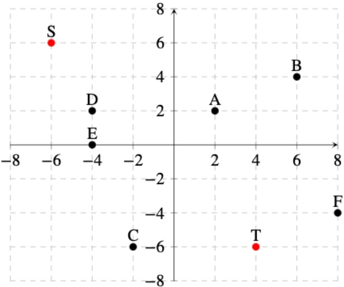

There were different graphs between versions, but all had the same answers for the following questions.

(i) [2 pts] We run one iteration of the k-means algorithm from the current state. For which of the following distance functions will point A be assigned to cluster center T? All distance functions are written as a function of two arbitrary points  $M = (M_x, M_y)$  and  $N = (N_x, N_y)$ . Assume that in choosing between cluster centers we break ties alphabetically (i.e.: select S over T).

$$
\begin{array}{l} \blacksquare d (M, N) = | M _ {x} - N _ {x} | + | M _ {y} - N _ {y} | \\ \blacksquare d (M, N) = (M _ {x} - N _ {x}) ^ {2} + (M _ {y} - N _ {y}) ^ {2} \\ \square d (M, N) = \max \left\{(M _ {x} - N _ {x}) ^ {2}, (M _ {y} - N _ {y}) ^ {2} \right\} \\ \blacksquare d (M, N) = \min \left\{(M _ {x} - N _ {x}) ^ {2}, (M _ {y} - N _ {y}) ^ {2} \right\} \\ \blacksquare d (M, N) = \frac {| M _ {x} - N _ {x} |}{| M _ {x} | + | N _ {x} |} + \frac {| M _ {y} - N _ {y} |}{| M _ {y} | + | N _ {y} |} \end{array}
$$

○ None of the above

For each distance function, solve for  $d(S, A)$  and  $d(T, A)$ . The evaluation associated with the smaller value will be the center to which A is assigned.

1.  $d(S, A) = |-6 - 2| + |6 - 2| = 12$ ;  $d(T, A) = |4 - 2| + |-6 - 2| = 10$ . A is assigned to T.

2. $d(S, A) = (-6 - 2)^{2} + (6 - 2)^{2} = 80$; $d(T, A) = (4 - 2)^{2} + (-6 - 2)^{2} = 68$. $A$ is assigned to

3. $d(S, A) = \max \left\{(-6 - 2)^2, (6 - 2)^2\right\} = 64$; $d(T, A) = \max \left\{(4 - 2)^2, (-6 - 2)^2\right\} = 64$. $A$ is assigned to $S$ by tiebreaking.

4. $d(S, A) = \min \left\{(-6 - 2)^2, (6 - 2)^2\right\} = 16$; $d(T, A) = \min \left\{(4 - 2)^2, (-6 - 2)^2\right\} = 4$. $A$ is assigned to $T$.

5. $d(S,A) = \frac{| - 6 - 2|}{| - 6| + |2|} +\frac{|6 - 2|}{|6| + |2|} = \frac{3}{2};d(T,A) = \frac{|4 - 2|}{|4| + |2|} +\frac{| - 6 - 2|}{| - 6| + |2|} = \frac{4}{3} .A$ is assigned to $T$

(ii) [2 pts] After assigning a new set of points to $T$ using distance function $d(M, N) = (M_x - N_x)^2 + (M_y - N_y)^2$, we update $T$ to $T'$. What is the new coordinate of $T'$ under this distance function? Write your answer as a tuple. Assume that in choosing between cluster centers we break ties alphabetically (i.e.: select $S$ over $T$).

$$
T ^ {\prime} = \boxed {(3. 5, - 1)}
$$

To update T to  $T'$ , for the points assigned to T based on the distance function, we set  $T'$  to be the point that minimizes the sum of the distances between each of those assigned points and  $T'$ . Using the distance function, we assign points A, B, C, and F to T, so we try to find  $T'$  that minimizes  $d(T', A) + d(T', B) + d(T', C) + d(T', F)$ .

Using the standard distance function, this corresponds to just taking an average over all the points assigned to center T. Therefore, we have  $T' = \left(\frac{2+6+-2+8}{4}, \frac{2+4-6-4}{4}\right) = (3.5, -1)$

<!-- page: 28 -->

(iii) [1 pt] Consider a set of n data points  $x_{1}, x_{2}, \cdots, x_{n}$  which we would like to group into m clusters, where n > m. For which of the following cluster center initialization procedures is k-means guaranteed to converge to a local optimum when using Euclidean distance as the distance function? Assume that we always select the first cluster center uniformly at random from the dataset.

Sample all $m$ centers from the $n$ data points uniformly at random.

Iteratively select the unselected datapoint furthest from all currently selected centers.

Run agglomerative clustering on the dataset, and use the centroids of the $m$ largest clusters for $k$-means.

Find $m$ equally spaced areas in the feature space that cover all the data points, then take the center of each.

○ None of the above

The k-means algorithm is guaranteed to converge to some local optimum, regardless of how we initialize our cluster centers here.

(iv) [1 pt] Consider a set of n data points  $x_{1}, x_{2}, \cdots, x_{n}$  which we would like to group into m clusters, where n > m. For which of the following cluster center initialization procedures is k-means guaranteed to converge to the global optimum when using Euclidean distance as the distance function? Assume that we always select the first cluster center uniformly at random from the dataset.

☐ Sample all m centers from the n data points uniformly at random.

☐ Iteratively select the unselected datapoint furthest from all currently selected centers.

☐ Run agglomerative clustering on the dataset, and use the centroids of the m largest clusters for k-means.

☐ Find m equally spaced areas in the feature space that cover all the data points, then take the center of each.

None of the above

The k-means algorithm is never guaranteed to converge to the global optimum, regardless of how we initialize our cluster centers here. The only way we would guarantee a global optimum convergence would be setting our cluster centers to the exact centroids of the m clusters that were associated with the global optimum, but we would only be able to perfectly solve for this using brute force. Other methods approximate this result in less time.

(b) Suppose that we've successfully used clustering to separate our data points into two distinct classes: circles and x's. There were different versions of the same graphs below, but the answers were the same between versions.

(i) [1 pt] The graph depicting the same dataset separated into classes is shown below. Each coordinate corresponds to the values of two features  $f_{1}$  and  $f_{2}$  of a datapoint, plotted on the x and y axes respectively:

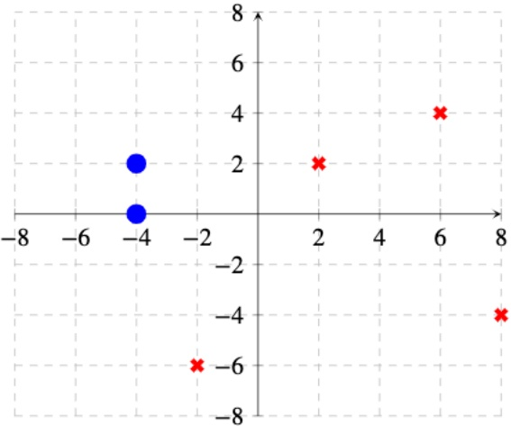

What is the minimum depth of the decision tree that completely separates the two classes? Assume that each decision involves comparing a single feature value against a chosen threshold.

1
○ 2
○ 3
○ 4
○ 5
○ > 5
○ Cannot be determined

<!-- page: 29 -->

The data is linearly separable by a single line, so we only need to query once to determine if a point is red or blue, which can be drawn as a decision tree of depth 1.

(ii) [2 pts] We recovered some additional data points that were missing from the graph! We've plotted them alongside the original data, and labeled their classes accordingly.

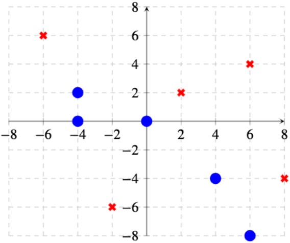

What is the minimum depth of the decision tree that completely separates the two classes now? Assume that each decision involves comparing a single feature value against a chosen threshold.

○ 1
○ 2
● 3
○ 4
○ 5
○ > 5
○ Cannot be determined

Intuitively, we want to separate the dataset above using as few horizontal and vertical lines as possible such that our separation will correspond to the minimal depth of the decision tree. The key is to segment off as much of the dataset that is of the same class together that we can; however, the way that the data overlaps on x and y axes make it not so straightforward.

At depth 1 and depth 2, no matter how we section off the dataset into two parts, we will be unable to perform a separation that perfectly separates the data, because of how points of different classes share identical x and y coordinates. Only at depth 3 can we completely separate the data. An example of this is seen below:

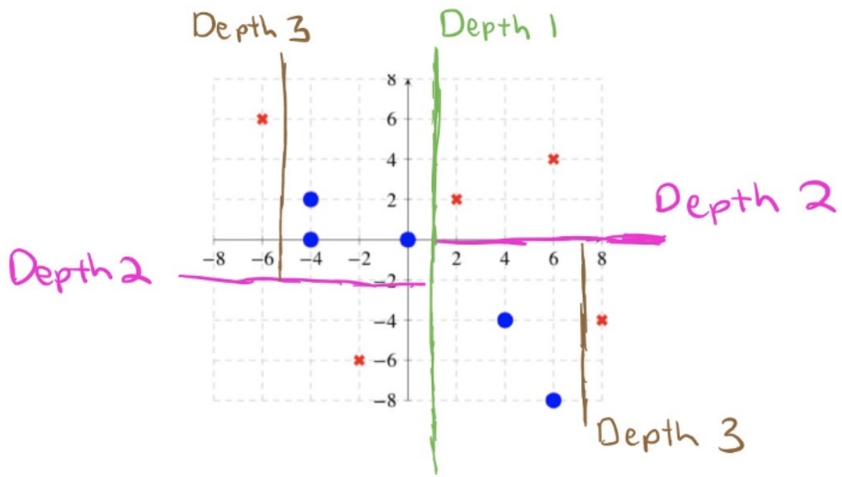

<!-- page: 30 -->

## Q9. [11 pts] Tupacman's NB Model

(a) Tupacman is ready to begin his rap career and wants to use his CS 188 knowledge to figure out how to make it. After some thorough research, he realizes that the success of Billboard Hits, whether $H = +h$ or $H = -h$, only depends on the following factors:

\- $T$: +t if songs have a tempo greater than 120 BPM, else -t

\- $E$: $+e$ if the song contains explicit content, else $-e$

\- $D$: $+d$ if the song has a Drake feature, else $-d$

He also collects data on recently released music and stores it in the table below.

| Song | E | T | D | H |
| --- | --- | --- | --- | --- |
| 1 | + | + | + | + |
| 2 | + | - | - | + |
| 3 | - | - | - | + |
| 4 | + | - | - | + |
| 5 | - | - | + | - |
| 6 | - | - | + | - |
| 7 | + | - | + | - |
| 8 | + | - | + | - |

(i) [2 pts] Use MLE to fill in the following probability tables:

| H | P(H) |
| --- | --- |
| + | 0.5 |
| - | 0.5 |

| E | H | $P(E\|H)$ |
| --- | --- | --- |
| + | + | 0.75 |
| + | - | 0.5 |
| - | + | 0.25 |
| - | - | 0.5 |

For MLE, we take the number of data points consistent with the query, and divide that by the total based on the query we're estimating.

(ii) [2 pts] Now use Laplace Smoothing with $k = 3$ to fill in the following probability tables:

| T | H | $P(T\|H)$ |
| --- | --- | --- |
| + | + | 0.4 |
| + | - | 0.3 |
| - | + | 0.6 |
| - | - | 0.7 |

| D | H | $P(D\|H)$ |
| --- | --- | --- |
| + | + | 0.4 |
| + | - | 0.7 |
| - | + | 0.6 |
| - | - | 0.3 |

For Laplace Smoothing, we add the constant $k = 3$ to each count, and divide that by the total based on the query plus $k$ times the domain of the random variable we're currently estimating for.

(iii) [1 pt] How does decreasing the value of $k$ in Laplace Smoothing affect the learned model?

\- Increases overfitting    - Decreases overfitting

The purpose of Laplace Smoothing is to prevent overfitting by adding a constant k to the count. By reducing the value of k, we would be increasing overfitting in our learned model. This is easiest to see for the smallest value of k = 0, which would be the same as having our model without Laplace Smoothing at all.

(b) Use the following probability tables for the next few parts.

| H | P(H) |
| --- | --- |
| + | 0.4 |

| E | H | $P(E\|H)$ |
| --- | --- | --- |
| + | + | 0.55 |
| + | - | 0.45 |

| T | H | $P(T\|H)$ |
| --- | --- | --- |
| + | + | 0.6 |
| + | - | 0.4 |

| D | H | $P(D\|H)$ |
| --- | --- | --- |
| + | + | 0.3 |
| + | - | 0.7 |

Alternate version:

| H | P(H) |
| --- | --- |
| + | 0.4 |

| E | H | $P(E\|H)$ |
| --- | --- | --- |
| + | + | 0.5 |
| + | - | 0.5 |

| T | H | $P(T\|H)$ |
| --- | --- | --- |
| + | + | 0.8 |
| + | - | 0.2 |

| D | H | $P(D\|H)$ |
| --- | --- | --- |
| + | + | 0.6 |
| + | - | 0.4 |

(i) [2 pts] Tupacman wants to release a song at 150 BPM (+t) that contains no slurs (-e) and has a Drake feature (+d). Find the joint probability of this song being a hit (+h). Simplify your answer as much as possible and round your answer to the nearest thousandth (i.e.: 1.2345 would round to 1.236).

<!-- page: 31 -->

$P(H = +h, T = +t, E = -e, D = +d) = P(+h)P(T = +t| + h)P(E = -e| + h)P(D = +d| + h) = 0.4 * 0.6 * 0.45 * 0.3 = 0.032$

ALTERNATE VERSION:  $P(H = +h, T = +t, E = -e, D = +d) = P(+h)P(T = +t|+h)P(E = -e|+h)P(D = +d| + h) = 0.4 * 0.8 * 0.5 * 0.6 = 0.096$

(ii) [3 pts] Find $P(H = -h|T = +, E = -, D = +)$. Simplify your answer as much as possible and round your answer to the nearest hundredth (i.e.: 1.234 would round to 1.23).

```txt
0.74
```

Normalize the values from the previous part. That is, 0.0924 / (0.0324 + 0.0924).

$$
\begin{array}{l} \text {ALTERNATE VERSION:} P (H = - h, T = + t, E = - e, D = + d) = P (- h) P (T = + t | - h) P (E = - e | - h) P (D = \\ + d | - h) = 0. 6 * 0. 2 * 0. 5 * 0. 4 = 0. 0 2 4 \end{array}
$$

Normalize the values from the previous part. That is,  $0.024 / (0.024 + 0.096) = 0.2$ .

(iii) [1 pt] What prediction would the model make for this song?

○ Hit ● Not a Hit ○ Not enough information ○ Tie
Compare  $P(H = h, T = +t, E = -e, D = +D) = P(h)P(T = +t|h)P(E = -e|h)P(D = +d|h)$  for both values of h. The value is 0.0324 for +h and 0.0924 for -h.

ALTERNATE VERSION: HIT, since value for +h is 0.096 and value for -h is 0.024.

<!-- page: 32 -->

## Q10. [14 pts] Perceptron's Plan

(a) Tupacman has written another song that he is thinking about releasing but is waiting to hear back from Drake about a potential feature. He has to let his team know if he will release the song by tonight and makes a decision network that is shown below to help him make the right decision. The outcome of his track purely depends on Drake's reply (+d if he agrees, else -d) which Tupacman will try to predict by observing Drake's mood (+m if he's in a good mood, else -m) through his twitter feed. He estimates  $P(M = +m|D = +d) = 0.8$ ,  $P(M = +m|D = -d) = 0.3$  and  $P(D = +d) = 0.4$ .

| Action | Drake | Utility |
| --- | --- | --- |
| Release | + | 2000 |
| Release | - | -1000 |
| Don’t Release | + | -400 |
| Don’t Release | - | 0 |

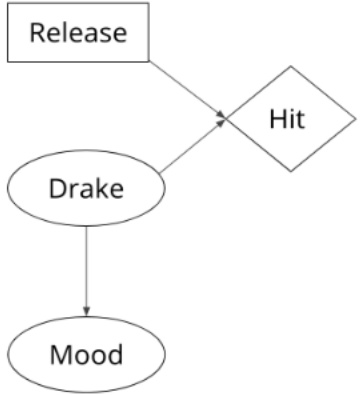

Alternate version:

| Action | Drake | Utility |
| --- | --- | --- |
| Don’t Release | + | -300 |
| Release | + | 3000 |
| Release | - | -1000 |
| Don’t Release | - | 0 |

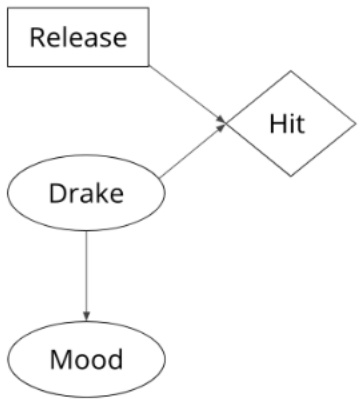

(i) [1 pt] What is his MEU?

| 200 |
| --- |

$MEU = max(EU(release), EU(don't release).EU(release) = 2000 * 0.4 - 1000 * 0.6 = 200. EU(don't release) = -400 * 0.4 + 0 = -160.$

ALTERNATE VERSION: $MEU = max(EU(release), EU(don't release).EU(release) = 3000 * 0.4 - 1000 * 0.6 = 600$. $EU(don't release) = -300 * 0.4 + 0 = -120$. Therefore, 600.

(ii) [1 pt] What is the value of perfect information of $D$?

```txt
600
```

$$
M E U (D) = P (+ d) * 2 0 0 0 + P (- d) * 0 = 8 0 0. M E U (D) - M E U () = 8 0 0 - 2 0 0 = 6 0 0.
$$

ALTERNATE VERSION: $MEU(D) = P(+d) * 3000 + P(-d) * 0 = 1,200$. $MEU(D) - MEU() = 1,200 - 600 = 600$.

(iii) [2 pts] What is the value of perfect information of M?

<!-- page: 33 -->

```txt
0
```

$VPI(M) = (P(+m) * MEU(+m) + P(-m) * MEU(-m)) - MEU($.  
$P(+m) = P(-m) = 0.5$ since $P(m) = P(m| + d)P(+d) + P(m| - d)P(-d)$.  
$P(+d| + m) = 0.64$ and $P(+d| - m) = 0.16$ since $P(d|m) = P(m|d)P(d)/P(m)$.  
$EU(release| + m) = P(+d| + m) * EU(rel, +d) + P(-d| + m) * EU(rel, -d) = 920.$  
$EU(release| - m) = P(+d| - m) * EU(rel, +d) + P(-d| - m) * EU(rel, -d) = -320.$  
$EU(don't release| + m) = P(+d| + m) * EU(don't release, +d) + P(-d| + m) * EU(don't release, -d) = -256.$  
$EU(don't release| - m) = P(+d| - m) * EU(don't release, +d) + P(-d| - m) * EU(don't release, -d) = -64.$  
$MEU(+m) = max(920, -256) = 920, MEU(-m) = max(-320, -64) = -64.$ Therefore, $VPI = 428 - 200 = 228$.

## ALTERNATE VERSION:

<div class="docvortex-algorithm" style="white-space: pre-wrap; font-family:monospace;">
$VPI(M) = (P(+m) * MEU(+m) + P(-m) * MEU(-m)) - MEU($.  
$P(+m) = P(-m) = 0.5 since P(m) = P(m| + d)P(+d) + P(m| - d)P(-d)$.  
$P(+d| + m) = 0.64 and P(+d| - m) = 0.16 since P(d|m) = P(m|d)P(d)/P(m)$.  
$EU(release| + m) = P(+d| + m) * EU(rel, +d) + P(-d| + m) * EU(rel, -d) = 0.64 * 3000 + 0.36 * -1000 = 1,560.$  
$EU(release|-m) = P(+d|-m) * EU(rel, +d)+P(-d|-m) * EU(rel, -d) = 0.16 * 3000+0.84 * -1000 = -360.$  
$EU(don't release| + m) = P(+d| + m) * EU(don't release, +d) + P(-d| + m) * EU(don't release, -d) = 0.64 * -300 + 0.36 * 0 = -192.$  
$EU(don't release|-m) = P(+d|-m) * EU(don't release, +d) + P(-d|-m) * EU(don't release, -d) = 0.16 * -300 + 0.84 * 0 = -48.$  
$MEU(+m) = max(1560, -192) = 1560, MEU(-m) = max(-360, -48) = -48.$ Therefore, $VPI = P(+m) * 1560 + P(-m) * -48 - MEU() = 756 - 600 = 156$.
</div>

(iv) [2 pts] What is the value of perfect information of $M$ given $D$?

Since M is independent of H given D.

(v) [1 pt] What decision does Tupacman make given that Drake is in a bad mood?

○ Release ● Do not release

Not releasing corresponds to a higher utility than releasing if Drake is in a bad mood.

(b) Naive Bayes is not working out (it's too naive!) and Tupacman wants to use a binary perceptron model with more detailed data to predict which songs will be hits. He now considers two new features for this model, $G$: the groove of the song rated on a scale of 1 to 10 and $D$: the number of sentences said by Drake. He stores this data in the table below, where $H$ is the true label of the sample, + or −.

| Song | G | D | H |
| --- | --- | --- | --- |
| 1 | 10 | 20 | + |
| 2 | 4 | 15 | - |
| 3 | 1 | 15 | + |
| 4 | 1 | 10 | - |
| 5 | 5 | 20 | + |

(i) [2 pts] Starting with $w = [1\ 2\ 3]$, where the first entry is the weight for the bias term, fill in the following table with the results of running the perceptron algorithm on the five samples. $\hat{H}$ is the prediction made by his model, + or −.

| Song | $\hat{H}$ | Updated Weight |
| --- | --- | --- |
| 1 | + | [1 2 3] |
| 2 | + | [0 -2 -12] |
| 3 | - | [1 -1 3] |
| 4 | + | [0 -2 -7] |
| 5 | - | [1 3 13] |

Song 1: [1 2 3] · [1 10 20] > 0, therefore, $\hat{H} = +$ and the weight isn't updated.

Song 2: [1 2 3] · [1 4 15] > 0, therefore, $\hat{H} = +$ which is incorrect. Since our dot product was too large, we lower the weight by subtracting the data point that was misclassified from it. Therefore, $w = [1\ 2\ 3] - [1\ 4\ 15] = [0\ -2\ -12]$. The same procedure is used for the remaining samples.

<!-- page: 34 -->

(ii) [1 pt] What is the value of the dual perceptron weight $\alpha$ after the five updates? (assume $\alpha$ was initialized as a zero vector)

The dual weight vector has size = the number of samples. Every time we misclassify a song, we add the true H for that song to the corresponding entry of the dual vector. As a result, dual vector times a matrix of shape  $5 \times 3$  with all of our samples is equal to the final weight vector found in part (b).

(iii) [1 pt] True or False: The algorithm has converged.

○ True ● False

Since the final weight still misclassifies the second song.

(iv) [1 pt] True or False: The perceptron algorithm is always able to converge on data that a Naive Bayes classifier can separate.

○ True ● False

It can be shown that the Naive Bayes classifier can find any linear decision boundary that the perceptron algorithm can find.

(v) [1 pt] True or False: In a situation where perceptron is unable to separate the data, a neural network with many hidden layers using linear activation functions will be able to separate the data.

○ True ● False

Both networks can only find linear decision boundaries.

(vi) [1 pt] True or False: The final weights for a converged perceptron instance can be written in terms of the initial weights and the feature vectors it trained on.

● True ○ False

Weights are updated by adding or subtracting feature vectors from the initial weight.
