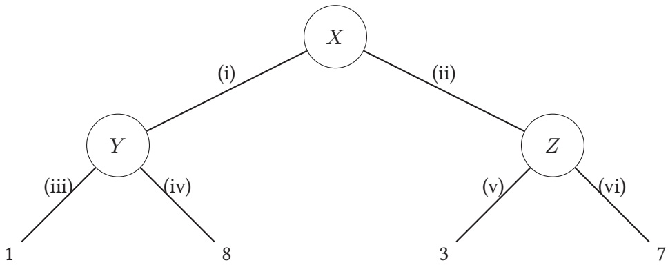
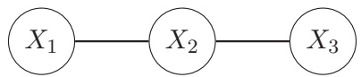
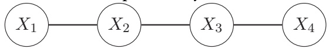
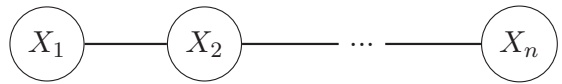
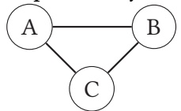
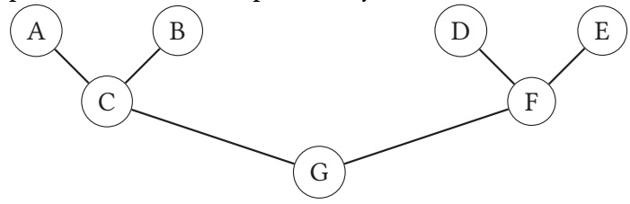
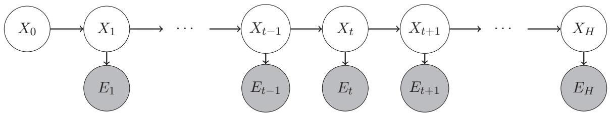
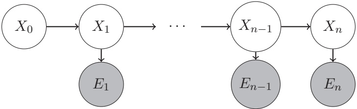
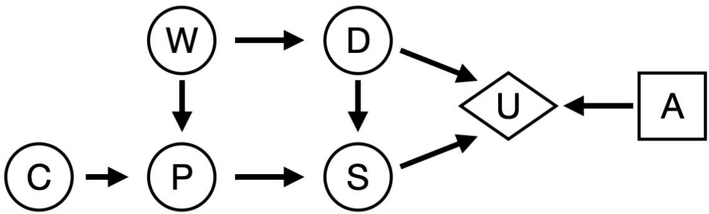
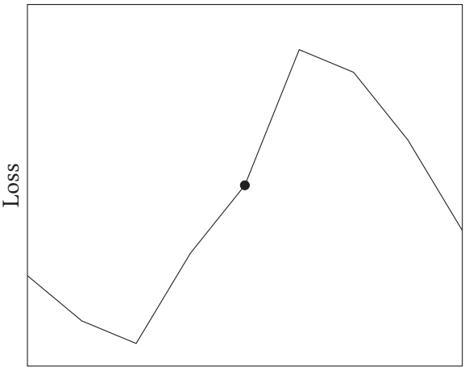

<!-- page: 1 -->

| CS 188Fall 2022 | Introduction toArtificial Intelligence | Final Exam |
| --- | --- | --- |

| Name |  |
| --- | --- |
| Student ID |  |
| Name ofperson sitting to your left |  |
| Name ofperson sitting to your right |  |

You have 170 minutes. There are 10 questions of varying credit (100 points total).

| Question: | 1 | 2 | 3 | 4 | 5 | 6 | 7 | 8 | 9 | 10 | Total |
| --- | --- | --- | --- | --- | --- | --- | --- | --- | --- | --- | --- |
| Points: | 1 | 12 | 13 | 10 | 13 | 16 | 12 | 13 | 4 | 6 | 100 |

For questions with **circular bubbles**, you may select only one choice.

Unselected option (completely unfilled)

Only one selected option (completely filled)

For questions with **square checkboxes**, you may select one or more choices.

You can select

multiple squares (completely filled)

## Q1 Honor Code

**(1 point)**

**Read the following honor code and sign your name.**

I understand that I may not collaborate with anyone else on this exam, or cheat in any way. I am aware of the Berkeley Campus Code of Student Conduct and acknowledge that academic misconduct will be reported to the Center for Student Conduct and may further result in, at minimum, negative points on the exam.

Sign your name:

<!-- page: 2 -->

## Q2 Balls and Bins

**(12 points)**

Pacman has a row of 7 bins, and is going to deposit some number of balls in each bin, while following these rules:

• Each bin must have between 0 and 10 balls.

• The middle bin must have more balls than the left 3 bins combined.

• The middle bin must have fewer balls than the right 3 bins combined.

We can model this as a CSP, where each bin is a variable, and the domain is the number of balls in each bin.

Q2.1 (1 point) What type of constraints are present in this CSP? (A) Unary constraints (C) Higher-order constraints (B) Binary constraints (D) None of the above

Pacman decides to formulate this problem as a simpler CSP. It should be possible to take a solution to this simpler CSP and trivially convert it to a solution to the original problem.

Q2.2 (1 point) What is the minimum number of variables needed in this modified CSP? (A) 1 (B) 2 (C) 3 (D) 4 (E) 5 (F) 6

Q2.3 (1 point) What is the largest domain size in this modified CSP? (A) 2 (B) 3 (C) 7 (D) 11 (E) 31 (F) $1 1 ^ { 3 }$

Q2.4 (2 points) Is the AC3 arc consistency algorithm useful in this modified CSP? (A) Yes, because it will reduce the domains of the variables during backtracking search. (B) Yes, because after running AC3, each variable will have exactly one possible value left. (C) No, because it will not reduce the domains of the variables during backtracking search. (D) No, because after running AC3, some variables still have more than one possible value.

Pacman decides to formulate this problem as a search problem. The start state has no balls in any of the bins. The successor function adds one ball to one bin.

Q2.5 (2 points) What is the size of the state space in this search problem? (A) 7 (C) $7 \times 1 1$ (E) $7 ^ { 1 1 }$ (B) 11 (D) $1 1 ^ { 7 }$ (F) None of the above

<!-- page: 3 -->

Q2.6 (1 point) What else should Pacman define to complete the definition of this search problem?

(A) A goal state

(B) A goal test

(C) A list of constraints

(D) None of the above (the search problem is already fully defined)

Q2.7 (2 points) Pacman considers modifying the successor function so that it either adds one ball to one bin, or removes a ball from a bin. Is this modification needed for breadth-first search (BFS) to find a solution to the problem?

(A) Yes, because this modification allows the algorithms to backtrack (i.e. undo a bad move).

(B) Yes, because without this modification, the state where all bins have 10 balls has no valid successor state.

(C) No, because this modification introduces cycles and breaks BFS.

(D) No, because the original successor function was sufficient to reach a solution.

Q2.8 (2 points) Pacman decides to use UCS instead of BFS to solve this search problem. Will UCS help Pacman find a solution more efficiently than BFS?

(A) Yes, because UCS explores lowest-cost nodes first.

(B) Yes, because UCS uses a heuristic to explore promising nodes first.

(C) No, because in this problem, action costs are irrelevant.

(D) No, because BFS explores shallower nodes first.

<!-- page: 4 -->

## Q3 Friend or Foe?

**(13 points)**

Robotron is a latest-generation robot. Robotron is loaded into a world where Robotron chooses one action, then a human chooses one action, then Robotron receives a reward. We can model this as a game tree, shown below.

At node X, Robotron selects action (i) or (ii). At node Y , the human selects action (iii) or (iv). At node Z, the human selects action (v) or (vi). The circles do not necessarily represent chance nodes.

Q3.1 (1 point) Suppose the human acts adversarially, and Robotron knows this. If Robotron acts optimally, what reward will Robotron receive? (A) 1 (B) 8 (C) 3 (D) 7 (E) 4.5 (F) 5

Q3.2 (1 point) Suppose the human acts cooperatively with Robotron to maximize Robotron’s reward, and Robotron knows this. If Robotron acts optimally, what reward will Robotron receive? (A) 1 (B) 8 (C) 3 (D) 7 (E) 4.5 (F) 5

Q3.3 (3 points) For the rest of the question, suppose Robotron doesn’t know the human’s behavior. Robotron knows that with probability $p ,$ the human will act adversarially, and with probability $1 - p ,$ the human will act cooperatively. For what $p$ will Robotron be indifferent about Robotron’s choice of action? (A) $1 / 8$ (B) $1 / 6$ (C) $1 / 3$ (D) $1 / 2$ (E) $2 / 3$ (F) 5/6

<!-- page: 5 -->

The problem above (where Robotron doesn’t know the human’s behavior) can also be modeled as an MDP.

In this MDP, $T _ { a }$ refers to a terminal state (no more actions or rewards are available from that state) when the human is adversarial, and $T _ { c }$ refers to a terminal state when the human is cooperative.

For the rest of the question, fill in the blanks in the table, or mark “Invalid” if the provided row does not belong in the $\mathrm { M D P ^ { \prime } s }$ transition function and reward function. Not all rows of the table are shown.

| s | a | s' | T(s,a,s') | R(s,a,s') |
| --- | --- | --- | --- | --- |
| X | (i) | Q3.4 | p | Q3.5 |
| X | Q3.6 | Q3.7 | Q3.8 | 7 |
| Y | (iii) | Ta | p | Q3.9 |

Q3.4 (1 point) Q3.4

<table><tr><td>○ (A) Y</td><td>○ (F) (ii)</td><td>○ (K) p</td><td>○ (P) 7</td></tr><tr><td>○ (B) Z</td><td>○ (G) (iii)</td><td>○ (L) 1 - p</td><td>○ (Q) 4.5</td></tr><tr><td>○ (C)  $T_a$ </td><td>○ (H) (iv)</td><td>○ (M) 1</td><td>○ (R) 5</td></tr><tr><td>○ (D)  $T_c$ </td><td>○ (I) (v)</td><td>○ (N) 8</td><td>○ (S) 0</td></tr><tr><td>○ (E) (i)</td><td>○ (J) (vi)</td><td>○ (O) 3</td><td>○ (T) Invalid</td></tr><tr><td colspan="4">Q3.5 (1 point) Q3.5</td></tr><tr><td>○ (A) Y</td><td>○ (F) (ii)</td><td>○ (K) p</td><td>○ (P) 7</td></tr><tr><td>○ (B) Z</td><td>○ (G) (iii)</td><td>○ (L) 1 - p</td><td>○ (Q) 4.5</td></tr><tr><td>○ (C)  $T_a$ </td><td>○ (H) (iv)</td><td>○ (M) 1</td><td>○ (R) 5</td></tr><tr><td>○ ( $D$ )  $T_c$ </td><td>○ (I) (v)</td><td>○ (N) 8</td><td>○ (S) 0</td></tr><tr><td>○ (E) (i)</td><td>○ (J) (vi)</td><td>○ (O) 3</td><td>○ (T) Invalid</td></tr></table>

<!-- page: 6 -->

| ○ (A) Y | ○ (F) (ii) | ○ (K) p | ○ (P) 7 |
| --- | --- | --- | --- |
| ○ (B) Z | ○ (G) (iii) | ○ (L) 1 - p | ○ (Q) 4.5 |
| ○ (C) $T_a$ | ○ (H) (iv) | ○ (M) 1 | ○ (R) 5 |
| ○ (D) $T_c$ | ○ (I) (v) | ○ (N) 8 | ○ (S) 0 |
| ○ (E) (i) | ○ (J) (vi) | ○ (O) 3 | ○ (T) Invalid |

The table, reproduced for your convenience:

| s | a | s' | T(s,a,s') | R(s,a,s') |
| --- | --- | --- | --- | --- |
| X | (i) | Q3.4 | p | Q3.5 |
| X | Q3.6 | Q3.7 | Q3.8 | 7 |
| Y | (iii) | Ta | p | Q3.9 |

Q3.7 (1 point) Q3.7

<table><tr><td>○ (A) Y</td><td>○ (F) (ii)</td><td>○ (K) p</td><td>○ (P) 7</td></tr><tr><td>○ (B) Z</td><td>○ (G) (iii)</td><td>○ (L) 1 - p</td><td>○ (Q) 4.5</td></tr><tr><td>○ (C)  $T_a$ </td><td>○ (H) (iv)</td><td>○ (M) 1</td><td>○ (R) 5</td></tr><tr><td>○ (D)  $T_c$ </td><td>○ (I) (v)</td><td>○ (N) 8</td><td>○ (S) 0</td></tr><tr><td>○ (E) (i)</td><td>○ (J) (vi)</td><td>○ (O) 3</td><td>○ (T) Invalid</td></tr><tr><td colspan="4">Q3.8 (1 point) Q3.8</td></tr><tr><td>○ (A) Y</td><td>○ (F) (ii)</td><td>○ (K) p</td><td>○ (P) 7</td></tr><tr><td>○ (B) Z</td><td>○ (G) (iii)</td><td>○ (L) 1 - p</td><td>○ (Q) 4.5</td></tr><tr><td>○ (C)  $T_a$ </td><td>○ (H) (iv)</td><td>○ (M) 1</td><td>○ (R) 5</td></tr><tr><td>○ ( $D$ )  $T_c$ </td><td>○ (I) (v)</td><td>○ (N) 8</td><td>○ (S) 0</td></tr><tr><td>○ (E) (i)</td><td>○ (J) (vi)</td><td>○ (O) 3</td><td>○ (T) Invalid</td></tr></table>

<!-- page: 7 -->

| ○ (A) X | ○ (F) (ii) | ○ (K) p | ○ (P) 7 |
| --- | --- | --- | --- |
| ○ (B) Y | ○ (G) (iii) | ○ (L) 1 - p | ○ (Q) 4.5 |
| ○ (C) Z | ○ (H) (iv) | ○ (M) 1 | ○ (R) 5 |
| ○ (D) T | ○ (I) (v) | ○ (N) 8 | ○ (S) 0 |
| ○ (E) (i) | ○ (J) (vi) | ○ (O) 3 | ○ (T) Invalid |

| ○ (A) 1 | ○ (C) 3 | ○ (E) 4.5 | ○ (G) 0.5 | ○ (I) 1.5 | ○ (K) 2.25 |
| --- | --- | --- | --- | --- | --- |
| ○ (B) 8 | ○ (D) 7 | ○ (F) 5 | ○ (H) 4 | ○ (J) 3.5 | ○ (L) 2.5 |

<!-- page: 8 -->

## Q4 Approximate Q-Learning

**(10 points)**

You might have noticed that approximate Q-learning has a lot in common with perceptrons! In this question we’ll explore some of those similarities.

Q4.1 (2 points) Suppose we have an MDP with 100 different states. We can represent each state as a vector of 10 features. To run approximate Q-learning on this problem, how many parameters do we need to learn?

Suppose we have a training dataset with 100 different data points. We can represent each training data point as a vector of 10 features. To run the perceptron algorithm on this data, how many parameters do we need to learn?

Both of these questions have the same answer; select it below. (A) 0 (C) 100 (E) $1 0 0 ^ { 1 0 }$ (B) 10 (D) 1000 (F) $1 0 ^ { 1 0 0 }$

Q4.2 (2 points) In the perceptron algorithm, we don’t update the weights if the current weights classify the training data point correctly. In approximate Q-learning, in what situation do we not update the weights?

(A) The estimated Q-value from the training episode exactly matches the estimated Q-value from the weights.

(B) The reward from the training episode exactly matches the estimated reward from the weights.

(C) The estimated Q-value from the training episode has the same sign as the estimated Q-value from the weights.

(D) The reward from the training episode has the same sign as the estimated reward from the weights.

Q4.3 (2 points) In the perceptron algorithm, if we incorrectly classified 1 when the true classification is -1, we adjust the weights by the feature vector. In approximate Q-learning, if the training episode’s Q-value is lower than the estimated Q-value from the weights, we adjust the weights by the feature vector. Both of these questions have the same answer; select it below. (A) adding (B) subtracting (C) multiplying (D) dividing

<!-- page: 9 -->

Q4.4 (2 points) Instead of manually designing features for perceptrons, we often vectorize the training data and input it directly into the perceptron. For example, if we’re classifying images, we could take a vector of pixel brightnesses and input that to the perceptron. We can also run approximate Q-learning without manually designing features by creating one feature for each state. Feature i is 1 if the current state is i, and 0 otherwise. (In other words, each state has a unique feature vector where exactly one element is set to 1.) If we ran approximate Q-learning with these features, our learned Q-values would be the Q-values from exact Q-learning. (A) less accurate than (B) exactly the same as (C) more accurate than

Q4.5 (2 points) Having more unique data points in the training dataset in the perceptron algorithm is most similar to which of these procedures in Q-learning? (A) More exploration (C) Decreasing the learning rate (B) More exploitation (D) Increasing the learning rate

<!-- page: 10 -->

## Q5 Tracing Contacts

**(13 points)**

In this question, consider building a Bayes’ net by starting with an undirected graph. We then add arrows to each edge, choosing the direction of each edge independently and uniformly at random.

For example, in the above graph, the left edge is $X _ { 1 } \rightarrow X _ { 2 }$ with probability $1 / 2 ,$ and $X _ { 2 } \rightarrow X _ { 1 }$ with probability $1 / 2 .$ The right edge is $X _ { 2 } \rightarrow X _ { 3 }$ with probability $1 / 2 ,$ and $X _ { 3 } \rightarrow X _ { 2 }$ with probability $1 / 2 .$ The direction of the left edge is chosen independently of the direction of the right edge.

Q5.1 (2 points) In the graph above, what is the probability that $X_{1} \perp    \perp X_{3} ?$

(A) 0

(B) $1 / 4$

(C) $1 / 2$

$3 / 4$

(E) 1

Q5.2 (3 points) In the graph below, what is the probability that $X_{1} \perp    \perp X_{4} ?$

(A) 0

(C) 1/4

(E) 1/2

(G) 3/4

(I) 1

(B) $1 / 8$

(D) 3/8

(F) 5/8

(H) $7 / 8$

Q5.3 (3 points) In the graph below (a chain of n nodes), what is the probability that $X _ { 1 }$ ⊥⊥ $X _ { n }$ for any $n \geq 3 ?$

(A) ${ \textstyle { \frac { n } { 4 } } - { \frac { 1 } { 2 } } }$

(C) $\frac { 2 ^ { n - 1 } { - 1 } } { 2 ^ { n - 1 } }$

(E) $\frac { 1 } { 2 ^ { n - 2 } }$

(G) $\textstyle { \frac { 2 ^ { n - 1 } - 1 } { 2 ^ { n - 1 } } } - { \frac { 1 } { 2 } }$

(B) $\frac{1}{2^{n - 2}} - \frac{1}{4}$

(D) $\frac { 1 } { 2 ^ { n - 1 } }$

(F) $\textstyle { \frac { 2 ^ { n - 1 } - n } { 2 ^ { n - 1 } } }$

Q5.4 (2 points) In the graph below, what is the probability that the Bayes’ net is undefined?

(A) 0

(C) 1/4

(E) $1 / 2$

(G) 3/4

(I) 1

(B) $1 / 8$

(D) 3/8

(F) $5 / 8$

(H) $7 / 8$

<!-- page: 11 -->

Q5.5 (3 points) In the graph below, what is the probability that B ⊥⊥ F?

<!-- page: 12 -->

## Q6 Deriving HMMs

## (16 points)

Recall that the Hidden Markov Model (HMM) from lecture (shown below) is just a Bayes’ Net with a special structure. This means that we can use standard Bayes’ Net algorithms to answer queries about the HMM.

In this question, we want to perform variable elimination to derive $P ( X _ { t } | e _ { 1 : t } )$ , using the most efficient variable ordering possible. If there are no more variables to eliminate, select “None” for all future subparts.

Q6.1 (1 point) Which of the following variables should be eliminated first? (A) $X _ { 0 : t - 1 }$ (C) $X _ { t + 1 : H }$ (E) $e _ { t }$ (G) None (B) $X _ { t }$ (D) $e _ { 1 : t - 1 }$ (F) $e _ { t + 1 : H }$

Q6.2 (1 point) Which of the following variables should be eliminated second? (A) $X _ { 0 : t - 1 }$ (C) $X _ { t + 1 : H }$ (E) $e _ { t }$ (G) None (B) $X _ { t }$ (D) $e _ { 1 : t - 1 }$ (F) $e _ { t + 1 : H }$

Q6.3 (1 point) Which of the following variables should be eliminated third? (A) $X _ { 0 : t - 1 }$ (C) $X _ { t + 1 : H }$ (E) $e _ { t }$ (G) None (B) $X _ { t }$ (D) $e _ { 1 : t - 1 }$ (F) $e _ { t + 1 : H }$

Q6.4 (1 point) Which of the following variables should be eliminated fourth? (A) $X _ { 0 : t - 1 }$ (C) $X _ { t + 1 : H }$ (E) $e _ { t }$ (G) None (B) $X _ { t }$ (D) $e _ { 1 : t - 1 }$ (F) $e _ { t + 1 : H }$

Q6.5 (2 points) What is the first elimination step that generates a new factor that we need to eliminate in later steps? (A) First elimination (D) Fourth elimination (B) Second elimination (E) None of the above (C) Third elimination

<!-- page: 13 -->

Q6.6 (4 points) Select all true statements.

(A) If a variable is independent of the query variable, then eliminating that variable doesn’t generate a new factor.

(B) If a variable is conditionally independent of the query variable given the evidence, then eliminating that variable doesn’t generate a new factor.

(C) If a variable doesn’t have any descendants, then eliminating that variable doesn’t generate a new factor.

(D) If a variable doesn’t have any ancestors and is not observed, then eliminating that variable doesn’t generate a new factor.

(E) None of the above

Now, let’s look at how the forward algorithm (alternating time elapse and evidence update) relates to variable elimination.

Q6.7 (2 points) How do we compute the initial belief, $P(X_{0})?$ (A) Join and eliminate on $X _ { 0 }$ (C) Join and eliminate on $X _ { 0 }$ and $X _ { 1 }$ (B) Join and eliminate on $X _ { 1 } .$ (D) Read it directly from the Bayes’ net.

Q6.8 (2 points) How do we perform a time elapse step to compute $P(X_{1})?$ (A) Join and eliminate on $X _ { 0 } .$ (C) Join and eliminate on $X _ { 0 }$ and $X _ { 1 }$ (B) Join and eliminate on $X _ { 1 }$ (D) Read it directly from the Bayes’ net.

Q6.9 (2 points) Recall that in an HMM, we usually want to compute a belief over the current state given all the evidence so far: $P ( X _ { t } | e _ { 1 : t } )$ Suppose we are missing evidence at a particular time step, $e _ { m }$ . Can we still calculate a belief with all the evidence so far: $P ( X _ { t } | e _ { 1 : m - 1 } , e _ { m + 1 : t } ) ?$

(A) Yes, but we cannot use a recursive approach anymore; we have to use regular Bayes Net algorithms.

(B) Yes, and we can still use a recursive approach; we can simply skip the steps we can’t do.

(C) No, the evidence structure is not consistent anymore, so the graph is disconnected.

(D) No, but we can calculate $P ( X _ { t } | e _ { 1 : m - 1 } )$ and $P ( X _ { t } | e _ { m + 1 : t } )$ by eliminating the right and the left parts of the graph, respectively.

<!-- page: 14 -->

## Q7 Sampling

**(12 points)**

In this question, we’ll explore how standard Bayes’ net sampling algorithms compare to particle filtering in a hidden Markov model (HMM).

First, consider the following Markov model, modeled as a Bayes’ net:

The Markov assumption means that the transition probability distribution, $P ( X _ { t } | X _ { t - 1 } )$ , is the same for all $t \geq 1$

Q7.1 (2 points) Suppose we want to use prior sampling to compute $P ( X _ { n } )$ . Which statement best describes the process of computing one sample?

(A) Because the transition probability at each time step is the same, we can just draw one sample from $P ( X _ { t } | X _ { t - 1 } )$

(B) First, draw a sample from $P ( X _ { 0 } )$ . Then, use that sample (call it x) to draw one sample from $P ( X _ { t } | x )$

(C) First, draw a sample from $P ( X _ { 0 } )$ . Then, use that sample (call it x0) to draw one sample from $P ( X _ { 1 } | x _ { 0 } )$ . Then, use that sample (call it $x _ { 1 } )$ to draw one sample from $P ( X _ { 2 } | x _ { 1 } )$ Repeat until $x _ { n }$ is generated. The final sample is $x _ { n } .$

(D) Same process as the previous choice, except the final sample is $( x _ { 0 } , x _ { 1 } , \ldots , x _ { n } )$

Q7.2 (2 points) Suppose we know the state at time step $i ,   x _ { i } .$ We want to use rejection sampling to compute $P ( X _ { n } | x _ { i } )$ On average, what proportion of samples will be discarded in this sampling procedure? (A) 0 (C) $P ( x _ { i } )$ (E) $1 - P ( x _ { 0 } )$ (B) $1 / 2$ (D) $1 - P ( x _ { i } )$ (F) $1 - P ( x _ { i } | X _ { i - 1 } )$

Q7.3 (2 points) Suppose we still know $x _ { i } ,$ , but now we want to use likelihood weighting to compute $P ( X _ { n } | x _ { i } )$ Pacman suggests a modification where we skip sampling $x _ { 0 }$ to $x _ { i - 1 }$ . Instead, we start by fixing $x _ { i }$ then sampling $x _ { i + 1 }$ to $x _ { n }$ Does Pacman’s modification work?

(A) Yes, because the Markov assumption says that $X _ { 0 : i - 1 }$ is independent of $X _ { i + 1 : n } \; \mathbf { g i v e n } \; x _ { i }$

(B) Yes, because the weights of each sample are the same for this query.

(C) No, because the modification makes it impossible to compute weights for each sample.

(D) No, because $x _ { i }$ needs to be randomly sampled, not fixed.

<!-- page: 15 -->

Q7.4 (2 points) Recall the time elapse update in the particle filtering algorithm: at each time step, we move a particle to a new state by sampling from the transition model $P ( X _ { t + 1 } | X _ { t } )$ We can repeatedly use the time elapse update to compute $P ( X _ { n } )$ . Which sampling algorithm is this procedure most similar to? (A) Variable elimination (D) Likelihood weighting (B) Prior sampling (E) Gibbs sampling (C) Rejection sampling

For the rest of the question, consider a standard Hidden Markov Model (HMM) with evidence nodes. Recall that in particle filtering, we can use time elapse updates and evidence observation updates to estimate $P ( X _ { n } | e _ { 1 : n } )$

Q7.5 (2 points) Pacman suggests using rejection sampling to estimate $P ( X _ { n } | e _ { 1 : n } )$ . Why is this not a good idea?

(A) If the evidence $e _ { 1 : n }$ is rare, rejection sampling will be very inefficient.

(B) Rejection sampling is much slower than particle filtering because it must consider every time step.

(C) In rejection sampling, the evidence $e _ { 1 : n }$ will not influence the upstream variable $X _ { n }$

(D) Rejection sampling will produce samples that are inconsistent with the desired distribution, so the estimates will be inaccurate.

<!-- page: 16 -->

Q7.6 (2 points) Pacman suggests using likelihood weighting to estimate $P ( X _ { n } | e _ { 1 : n } )$ . Why is this not a good idea?

(A) If the evidence $e _ { 1 : n }$ is rare, likelihood weighting will be very inefficient.

(B) Likelihood weighting is much slower than particle filtering because it must consider every time step.

(C) In likelihood weighting, the evidence $e _ { 1 : n }$ will not influence the upstream variable $X _ { n }$

(D) Likelihood weighting will produce samples that are inconsistent with the desired distribution, so the estimates will be inaccurate.

<!-- page: 17 -->

Consider the decision network below:

Q8.1 (3 points) Which of these expressions could be true? Select all that apply.

(A) $\operatorname { V P I } ( C ) > 0$

(B) $\operatorname { V P I } ( C ) = 0$

(C) $\mathrm { V P I } ( C ) < 0$

Q8.2 (3 points) Which of these expressions could be true? Select all that apply.

(A) $\mathrm { V P I } ( C | S , P ) > 0$

(B) $\mathrm { V P I } ( C | S , P ) = 0$

(C) $\mathrm { V P I } ( C ) < 0$

Q8.3 (3 points) Which of these expressions could be true? Select all that apply.

(A) $\mathrm { V P I } ( C , D ) > \mathrm { V P I } ( C ) + \mathrm { V P I } ( D )$

(B) $\mathrm { V P I } ( C , D ) = \mathrm { V P I } ( C ) + \mathrm { V P I } ( D )$

(C) $\mathrm { V P I } ( C , D ) < \mathrm { V P I } ( C ) + \mathrm { V P I } ( D )$

Q8.4 (4 points) Which of these statements is always true? Select all that apply.

(A) $\mathrm { V P I } ( P , D ) = \mathrm { V P I } ( D , P )$

(D) $\operatorname { V P I } ( S | C ) = \operatorname { V P I } ( D | C )$

(B) $\operatorname { V P I } ( W ) = \operatorname { V P I } ( P )$

(E) None of the above

(C) $\mathrm { V P I } ( P ) = \mathrm { V P I } ( P | W )$

<!-- page: 18 -->

## Q9 Deriving Naive Bayes

The Naive Bayes model is just a Bayes’ net with a special structure. This means that we can use standard Bayes’ net algorithms to perform classification with Naive Bayes.

## (4 points)

Q9.1 (2 points) Where do the probability tables $P ( X _ { 1 } | Y ) , P ( X _ { 2 } | Y ) , \ldots , P ( X _ { n } | Y )$ usually come from?

(A) We compute them from the training dataset.

(B) We compute them from the validation dataset.

(C) We compute them from the test dataset.

(D) We ask experts what the distributions should be.

Q9.2 (2 points) In a Naive Bayes’ model, we’re trying to compute $P ( Y | x _ { 1 } , x _ { 2 } , \ldots , x _ { n } )$ . Then, we pick the most likely Y as our classification. How can we use variable elimination to compute this distribution?

(A) Join and eliminate on Y .

(B) Join and eliminate on $x _ { 1 } , x _ { 2 } , \ldots , x _ { n } .$

(C) Join every factor together and normalize.

(D) Join $P ( X _ { 1 } | Y ) , P ( X _ { 2 } | Y ) , \ldots , P ( X _ { n } | Y )$ together and normalize.

<!-- page: 19 -->

Parameter value

Q10.1 (2 points) Your model achieves 0.99 accuracy on the training dataset and 0.62 accuracy on the test dataset. Which is the most likely explanation for what happened?

(A) Your model overfit the training dataset.

(B) Your model underfit the training dataset.

(C) You looked at the test dataset during training when you weren’t supposed to.

(D) You trained your model on the test dataset instead of the training dataset.

Q10.2 (2 points) Consider a 1-dimensional minimization problem with the following graph. The x-axis is the value of the parameter you’re learning, and the y-axis is the loss. Assume that you’re currently at the point indicated by the dot.

The gradient at the current point is \_\_\_\_, and to perform gradient descent, you should move

(B) negative, right

(A) negative, left (C) positive, left

(D) positive, right

<!-- page: 20 -->

Q10.3 (2 points) Consider the neural network model we used in Project 5:

$$
\begin{array}{c} h = \mathrm{ReLU} (W _ {1} x + b _ {1}) \\ \hat {y} = W _ {2} h + b _ {2} \\ L = (y - \hat {y}) ^ {2} \end{array}
$$

Which variables are the parameters that we need to learn? Select all that apply.

| (A) x | (E) h | (I) y |
| --- | --- | --- |
| (B) W1 | (F) W2 | (J) L |
| (C) b1 | (G) b2 | (K) None ofthe above |
| (D) ReLU | (H) yˆ |  |

<!-- page: 21 -->

## Clarifications

We aren’t issuing clarifications during the exam. However, if you have any clarification questions, or made <u>any assumptions while solving a question, you can note it here and we’ll account for it during grading.</u>

## Doodle

Congratulations for making it to the end of the exam! Feel free to leave any final thoughts, comments, feedback, or doodles here:
