<!-- page: 1 -->

| CS 188Fall 2022 | Introduction toArtificial Intelligence | Final Exam |
| --- | --- | --- |

Solutions last updated: January 27, 2023

Note: This exam was written while GSIs were on strike. As a result, the entire exam is multiple-choice, and topics later in the class are only lightly tested compared to a normal semester. This exam should not be considered indicative of an exam in a normal CS 188 semester.

| Name |  |
| --- | --- |
| Student ID |  |
| Name ofperson sitting to your left |  |
| Name ofperson sitting to your right |  |

You have 170 minutes. There are 10 questions of varying credit (100 points total).

| Question: | 1 | 2 | 3 | 4 | 5 | 6 | 7 | 8 | 9 | 10 | Total |
| --- | --- | --- | --- | --- | --- | --- | --- | --- | --- | --- | --- |
| Points: | 1 | 12 | 13 | 10 | 13 | 16 | 12 | 13 | 4 | 6 | 100 |

For questions with **circular bubbles**, you may select only one choice.

Unselected option (completely unfilled)

Only one selected option (completely filled)

For questions with **square checkboxes**, you may select one or more choices.

You can select

multiple squares (completely filled)

## Q1 Honor Code

**(1 point)**

**Read the following honor code and sign your name.**

I understand that I may not collaborate with anyone else on this exam, or cheat in any way. I am aware of the Berkeley Campus Code of Student Conduct and acknowledge that academic misconduct will be reported to the Center for Student Conduct and may further result in, at minimum, negative points on the exam.

Sign your name:

<!-- page: 2 -->

## Q2 Balls and Bins

**(12 points)**

Pacman has a row of 7 bins, and is going to deposit some number of balls in each bin, while following these rules:

• Each bin must have between 0 and 10 balls.

• The middle bin must have more balls than the left 3 bins combined.

• The middle bin must have fewer balls than the right 3 bins combined.

We can model this as a CSP, where each bin is a variable, and the domain is the number of balls in each bin.

Q2.1 (1 point) What type of constraints are present in this CSP? (A) Unary constraints (C) Higher-order constraints (B) Binary constraints (D) None of the above

**Solution:** The second and third rules are higher-order constraints, because they involve more than 2 variables at once. There are no binary constraints (recall that binary constraints can be checked by just checking two variables).

The intended answer was higher-order constraints. However, we gave full credit if you selected unary constraints. Some students interpreted the first rule (each bin must have between 0 and 10 balls) as a unary constraint that limits the domain of each variable individually. The first rule was intended to define the domain of the variables, but we could see how it might be misinterpreted as a unary constraint limiting a possibly-larger domain of the variables.

Pacman decides to formulate this problem as a simpler CSP. It should be possible to take a solution to this simpler CSP and trivially convert it to a solution to the original problem.

Q2.2 (1 point) What is the minimum number of variables needed in this modified CSP? (A) 1 (B) 2 (C) 3 (D) 4 (E) 5 (F) 6

**Solution:** One for the left 3 bins, one for the middle bin, and one for the right 3 bins. Note that once you know how many balls are in the left 3 bins combined, you can trivially distribute them across the left 3 bins however you want, without violating any constraints.

Q2.3 (1 point) What is the largest domain size in this modified CSP? (A) 2 (B) 3 (C) 7 (D) 11 (E) 31 (F) $1 1 ^ { 3 }$

**Solution:** The variables representing groups of 3 bins could have anywhere between 0 and 30 balls.

<!-- page: 3 -->

Q2.4 (2 points) Is the AC3 arc consistency algorithm useful in this modified CSP?

(A) Yes, because it will reduce the domains of the variables during backtracking search.

(B) Yes, because after running AC3, each variable will have exactly one possible value left.

(C) No, because it will not reduce the domains of the variables during backtracking search.

(D) No, because after running AC3, some variables still have more than one possible value.

**Solution:** Yes. The constraints between the variables are now binary constraints, so AC3 can be used to reduce the domains of the variables. Note that running AC3 will not immediately give you a solution, but that’s fine; AC3 is used with backtracking search to help reduce the search space.

Pacman decides to formulate this problem as a search problem. The start state has no balls in any of the bins. The successor function adds one ball to one bin.

Q2.5 (2 points) What is the size of the state space in this search problem? (A) 7 $\bigcirc     \bigcirc     ( \mathrm { C } )     7 \times 1 1$ (E) $7 ^ { 1 1 }$ (B) 11 (D) $1 1 ^ { 7 }$ (F) None of the above

**Solution:** The first bin could have 0-10 balls, then the second bin could also have 0-10 balls, and so on. There are 7 bins in total.

Q2.6 (1 point) What else should Pacman define to complete the definition of this search problem? (A) A goal state (B) A goal test (C) A list of constraints

(D) None of the above (the search problem is already fully defined)

**Solution:** We need a goal test to check if we’ve found a state where the constraints are all satisfied. Note that multiple states might satisfy the goal test, so a goal state is not sufficient here. Search problems don’t use constraints.

<!-- page: 4 -->

Q2.7 (2 points) Pacman considers modifying the successor function so that it either adds one ball to one bin, or removes a ball from a bin. Is this modification needed for breadth-first search (BFS) to find a solution to the problem?

(A) Yes, because this modification allows the algorithms to backtrack (i.e. undo a bad move).

(B) Yes, because without this modification, the state where all bins have 10 balls has no valid successor state.

(C) No, because this modification introduces cycles and breaks BFS.

(D) No, because the original successor function was sufficient to reach a solution.

**Solution:** The last option is the only true statement.

Q2.8 (2 points) Pacman decides to use UCS instead of BFS to solve this search problem. Will UCS help Pacman find a solution more efficiently than BFS?

(A) Yes, because UCS explores lowest-cost nodes first.

(B) Yes, because UCS uses a heuristic to explore promising nodes first.

(C) No, because in this problem, action costs are irrelevant.

(D) No, because BFS explores shallower nodes first.

**Solution:** When all the action costs are the same (which is the case in this problem), UCS reduces to BFS, so UCS will not be helpful here.

<!-- page: 5 -->

## Q3 Friend or Foe?

## (13 points)

Robotron is a latest-generation robot. Robotron is loaded into a world where Robotron chooses one action, then a human chooses one action, then Robotron receives a reward. We can model this as a game tree, shown below.

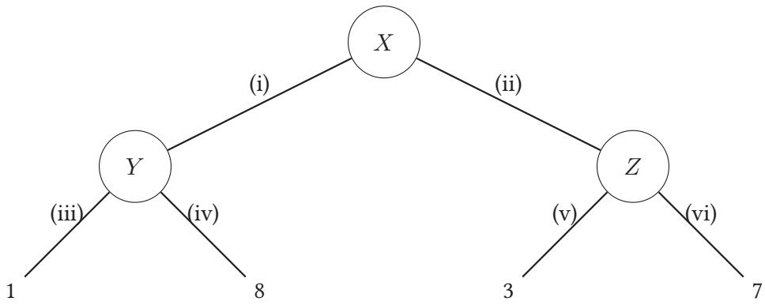

At node X, Robotron selects action (i) or (ii). At node Y , the human selects action (iii) or (iv). At node Z, the human selects action (v) or (vi). The circles do not necessarily represent chance nodes.

Q3.1 (1 point) Suppose the human acts adversarially, and Robotron knows this. If Robotron acts optimally, what reward will Robotron receive?

(A) 1

(B) 8

(C) 3

(D) 7

(E) 4.5

(F) 5

**Solution:** This is the minimax outcome of this game tree. We use minimax here because the human is acting adversarially.

Q3.2 (1 point) Suppose the human acts cooperatively with Robotron to maximize Robotron’s reward, and Robotron knows this. If Robotron acts optimally, what reward will Robotron receive?

(A) 1

(B) 8

(C) 3

(D) 7

(E) 4.5

(F) 5

**Solution:** Because the human is acting cooperatively, the human will choose action (iv) from Y to get reward 8, and action (vi) from Z to get reward 7. Robotron will choose action (i) to reach Y and maximize its reward. Sometimes this is called MaxiMax, because both agents are maximizing agents trying to maximize the value of the game.

<!-- page: 6 -->

Q3.3 (3 points) For the rest of the question, suppose Robotron doesn’t know the human’s behavior. Robotron knows that with probability $p ,$ the human will act adversarially, and with probability $1 - p ,$ the human will act cooperatively. For what $p$ will Robotron be indifferent about Robotron’s choice of action?

| ○ (A) 1/8 | ○ (B) 1/6 | ● (C) 1/3 | ○ (D) 1/2 | ○ (E) 2/3 | ○ (F) 5/6 |
| --- | --- | --- | --- | --- | --- |

**Solution:** The expected utility of taking action (i) is $1 p + ( 1 - p ) 8 .$ The expected utility of taking action (ii) is $3 p + ( 1 - p ) 7$ . Set the two equal to each other and solve to see when the robot finds the expected utility of each action to be equal.

The problem above (where Robotron doesn’t know the human’s behavior) can also be modeled as an MDP.

In this MDP, $T _ { a }$ refers to a terminal state (no more actions or rewards are available from that state) when the human is adversarial, and $T _ { c }$ refers to a terminal state when the human is cooperative.

For the rest of the question, fill in the blanks in the table, or mark “Invalid” if the provided row does not belong in the $\mathrm { M D P ^ { \prime } s }$ transition function and reward function. Not all rows of the table are shown.

| s | a | s' | T(s,a,s') | R(s,a,s') |
| --- | --- | --- | --- | --- |
| X | (i) | Q3.4 | p | Q3.5 |
| X | Q3.6 | Q3.7 | Q3.8 | 7 |
| Y | (iii) | Ta | p | Q3.9 |

Q3.4 (1 point) Q3.4

| (A) Y | (F) (ii) | (K) p | (P) 7 |
| --- | --- | --- | --- |
| (B) Z | (G) (iii) | (L) 1 - p | (Q) 4.5 |
| (C) Ta | (H) (iv) | (M) 1 | (R) 5 |
| (D) Tc | (I) (v) | (N) 8 | (S) 0 |
| (E) (i) | (J) (vi) | (O) 3 | (T) Invalid |

**Solution:** Robotron only gets to choose one action, so after taking that action, Robotron immediately transitions to the terminal state, and since transition probability is p, we know human is adversarial so terminal state is $T _ { a } .$

<!-- page: 7 -->

| ○ (A) Y | ○ (F) (ii) | ○ (K) p | ○ (P) 7 |
| --- | --- | --- | --- |
| ○ (B) Z | ○ (G) (iii) | ○ (L) 1 - p | ○ (Q) 4.5 |
| ○ (C) $T_a$ | ○ (H) (iv) | ● (M) 1 | ○ (R) 5 |
| ○ (D) $T_c$ | ○ (I) (v) | ○ (N) 8 | ○ (S) 0 |
| ○ (E) (i) | ○ (J) (vi) | ○ (O) 3 | ○ (T) Invalid |

**Solution:** After taking action (i), with probability $p ,$ the human is adversarial and Robotron gets reward 1.

| ○ (A) Y | ● (F) (ii) | ○ (K) p | ○ (P) 7 |
| --- | --- | --- | --- |
| ○ (B) Z | ○ (G) (iii) | ○ (L) 1 - p | ○ (Q) 4.5 |
| ○ (C) $T_a$ | ○ (H) (iv) | ○ (M) 1 | ○ (R) 5 |
| ○ (D) $T_c$ | ○ (I) (v) | ○ (N) 8 | ○ (S) 0 |
| ○ (E) (i) | ○ (J) (vi) | ○ (O) 3 | ○ (T) Invalid |

**Solution:** This row has reward $^ { 7 , }$ so we can work backwards and infer that it must have resulted from Robotron taking action (ii), and the human being cooperative (with probability 1 − p).

<!-- page: 8 -->

The table, reproduced for your convenience:

| s | a | s' | T(s,a,s') | R(s,a,s') |
| --- | --- | --- | --- | --- |
| X | (i) | Q3.4 | p | Q3.5 |
| X | Q3.6 | Q3.7 | Q3.8 | 7 |
| Y | (iii) | Ta | p | Q3.9 |

Q3.7 (1 point) Q3.7

| (A) Y | (F) (ii) | (K) p | (P) 7 |
| --- | --- | --- | --- |
| (B) Z | (G) (iii) | (L) 1 - p | (Q) 4.5 |
| (C) Ta | (H) (iv) | (M) 1 | (R) 5 |
| (D) Tc | (I) (v) | (N) 8 | (S) 0 |
| (E) (i) | (J) (vi) | (O) 3 | (T) Invalid |

**Solution:** As before, Robotron takes one action and lands in the terminal state $T _ { c }$ because human is cooperative. Y and Z aren’t states in this MDP because Robotron doesn’t get to choose actions from those states.

| ○ (A) Y | ○ (F) (ii) | ○ (K) p | ○ (P) 7 |
| --- | --- | --- | --- |
| ○ (B) Z | ○ (G) (iii) | ● (L) 1 - p | ○ (Q) 4.5 |
| ○ (C) $T_a$ | ○ (H) (iv) | ○ (M) 1 | ○ (R) 5 |
| ○ (D) $T_c$ | ○ (I) (v) | ○ (N) 8 | ○ (S) 0 |
| ○ (E) (i) | ○ (J) (vi) | ○ (O) 3 | ○ (T) Invalid |

**Solution:** To get reward 7, the human must be cooperative, which happens with probability $1 - p .$

<!-- page: 9 -->

| ○ (A) X | ○ (F) (ii) | ○ (K) p | ○ (P) 7 |
| --- | --- | --- | --- |
| ○ (B) Y | ○ (G) (iii) | ○ (L) 1 - p | ○ (Q) 4.5 |
| ○ (C) Z | ○ (H) (iv) | ○ (M) 1 | ○ (R) 5 |
| ○ (D) T | ○ (I) (v) | ○ (N) 8 | ○ (S) 0 |
| ○ (E) (i) | ○ (J) (vi) | ○ (O) 3 | ● (T) Invalid |

| s | a | s' | T(s, a, s') | R(s, a, s') |
| --- | --- | --- | --- | --- |
| X | (i) | $T_a$ | p | 1 |
| X | (i) | $T_c$ | 1 - p | 8 |
| X | (ii) | $T_a$ | p | 3 |
| X | (ii) | $T_c$ | 1 - p | 7 |

Q3.10 (2 points) In this MDP, suppose that $p = 0 . 5$ and $\gamma = 0 . 5$ . Robotron’s policy π is to always choose the action with the higher number, e.g. (xi) would be preferred over (x). What is $V ^ { \pi } ( X ) ?$ (A) 1 (C) 3 (E) 4.5 (G) 0.5 (I) 1.5 (K) 2.25 (B) 8 (D) 7 (F) 5 (H) 4 (J) 3.5 (L) 2.5

**Solution:** Robotron chooses between actions (i) and (ii) in this MDP. According to policy π, Robotron chooses action (ii). Afer choosing action (ii), the expected reward is $0.5(3)+0.5(7)=$ 5, where we used $p = 0 . 5$ and the two possible rewards. Note that we don’t apply the discount factor to the immediate reward, only future rewards, so $\gamma = 0 . 5$ is not applied to this reward. Half credit was given if you applied the discount factor once to get 2.5.

<!-- page: 10 -->

## Q4 Approximate Q-Learning

**(10 points)**

You might have noticed that approximate Q-learning has a lot in common with perceptrons! In this question we’ll explore some of those similarities.

Q4.1 (2 points) Suppose we have an MDP with 100 different states. We can represent each state as a vector of 10 features. To run approximate Q-learning on this problem, how many parameters do we need to learn?

Suppose we have a training dataset with 100 different data points. We can represent each training data point as a vector of 10 features. To run the perceptron algorithm on this data, how many parameters do we need to learn?

Both of these questions have the same answer; select it below.

(A) 0 (C) 100 (E) $1 0 0 ^ { 1 0 }$

(B) 10 (D) 1000 (F) $1 0 ^ { 1 0 0 }$

**Solution:** In both approximate Q-learning and perceptron, we need to learn a vector of weights, one weight value per feature.

Q4.2 (2 points) In the perceptron algorithm, we don’t update the weights if the current weights classify the training data point correctly. In approximate Q-learning, in what situation do we not update the weights?

(A) The estimated Q-value from the training episode exactly matches the estimated Q-value from the weights.

(B) The reward from the training episode exactly matches the estimated reward from the weights.

(C) The estimated Q-value from the training episode has the same sign as the estimated Q-value from the weights.

(D) The reward from the training episode has the same sign as the estimated reward from the weights.

**Solution:** In the Q-learning equation, we note that the weights are not updated if $\left[ r + \right.$ γ maxa′ $Q ( s ^ { \prime } , a ^ { \prime } ) ] = Q ( s , a )$ . The left-hand side is the estimated Q-value from the training episode, and the right-hand side is the estimated Q-value from the weights.

<!-- page: 11 -->

Q4.3 (2 points) In the perceptron algorithm, if we incorrectly classified 1 when the true classification is -1, we adjust the weights by \_\_\_\_\_ the feature vector. In approximate Q-learning, if the training episode’s Q-value is lower than the estimated Q-value from the weights, we adjust the weights by the feature vector. Both of these questions have the same answer; select it below. (A) adding (B) subtracting (C) multiplying (D) dividing

**Solution:** In Perceptron weight update, we subtract feature vector if true classification y∗is -1. Recall the approximate Q-learning update: w ← w + α[(episode’s Q value) − (estimated Q value)]f(s, a) The difference is negative, so we subtract from the weights.

Q4.4 (2 points) Instead of manually designing features for perceptrons, we often vectorize the training data and input it directly into the perceptron. For example, if we’re classifying images, we could take a vector of pixel brightnesses and input that to the perceptron. We can also run approximate Q-learning without manually designing features by creating one feature for each state. Feature i is 1 if the current state is i, and 0 otherwise. (In other words, each state has a unique feature vector where exactly one element is set to 1.) If we ran approximate Q-learning with these features, our learned Q-values would be the Q-values from exact Q-learning. (A) less accurate than (B) exactly the same as (C) more accurate than

**Solution:** With this set of features, each weight corresponds to the Q-value of one state, so we’re just doing exact Q-learning.

Q4.5 (2 points) Having more unique data points in the training dataset in the perceptron algorithm is most similar to which of these procedures in Q-learning? (A) More exploration (C) Decreasing the learning rate (B) More exploitation (D) Increasing the learning rate

**Solution:** More exploration in Q-learning lets you visit more states that you haven’t seen before, which is similar to having a larger training dataset.

<!-- page: 12 -->

## Q5 Tracing Contacts

**(13 points)**

In this question, consider building a Bayes’ net by starting with an undirected graph. We then add arrows to each edge, choosing the direction of each edge independently and uniformly at random.

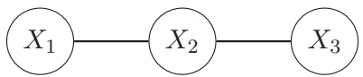

For example, in the above graph, the left edge is $X _ { 1 } \rightarrow X _ { 2 }$ with probability $1 / 2 ,$ and $X _ { 2 } \rightarrow X _ { 1 }$ with probability $1 / 2 .$ The right edge is $X _ { 2 } \rightarrow X _ { 3 }$ with probability $1 / 2 ,$ and $X _ { 3 } \rightarrow X _ { 2 }$ with probability $1 / 2 .$ The direction of the left edge is chosen independently of the direction of the right edge.

Q5.1 (2 points) In the graph above, what is the probability that $X_{1} \perp    \perp X_{3} ?$

(A) 0

(B) 1/4

(C) 1/2

(D) 3/4

(E) 1

**Solution:** With no evidence nodes, you must have a common effect for the triple to be inactive. The only configuration with this independence assumption is $X _ { 1 } \to X _ { 2 } \leftarrow X _ { 3 }$ . This is 1 working configuration out of 4 possible configurations.

Q5.2 (3 points) In the graph below, what is the probability that $X _ { 1 }$ ⊥⊥ $X _ { 4 } ?$

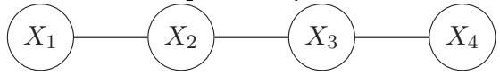

(A) 0

(C) 1/4

(E) 1/2

(G) 3/4

(I) 1

(B) $1 / 8$

(D) 3/8

(F) 5/8

(H) 7/8

**Solution:** It might be easier to count the configurations where the independence assumption is not true. In these 4 configurations, every triple is either a causal chain or a common cause:

$$
X _ {1} \rightarrow X _ {2} \rightarrow X _ {3} \rightarrow X _ {4}
$$

$$
X _ {1} \leftarrow X _ {2} \rightarrow X _ {3} \rightarrow X _ {4}
$$

$$
X _ {1} \leftarrow X _ {2} \leftarrow X _ {3} \rightarrow X _ {4}
$$

$$
X _ {1} \leftarrow X _ {2} \leftarrow X _ {3} \leftarrow X _ {4}
$$

In the other 4 configurations, there is at least one common effect triple that guarantees the independence assumption.

<!-- page: 13 -->

Q5.3 (3 points) In the graph below (a chain of n nodes), what is the probability that $X_{1} \perp    \perp X_{n}$ for any $n \geq 3 ?$

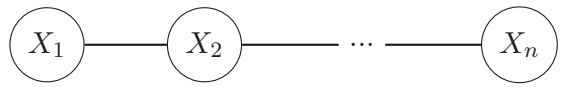

(A) ${ \textstyle { \frac { n } { 4 } } - { \frac { 1 } { 2 } } }$

(C) $\frac { 2 ^ { n - 1 } { - } 1 } { 2 ^ { n - 1 } }$

(E) $\frac { 1 } { 2 ^ { n - 2 } }$

(G) $\textstyle { \frac { 2 ^ { n - 1 } - 1 } { 2 ^ { n - 1 } } } - { \frac { 1 } { 2 } }$

(B) $\frac{1}{2^{n - 2}} - \frac{1}{4}$

(D) $\frac { 1 } { 2 ^ { n - 1 } }$

(F) $\textstyle { \frac { 2 ^ { n - 1 } - n } { 2 ^ { n - 1 } } }$

**Solution:** We know that there has to be at least one common effect triple in the chain to make the entire path inactive.

It is more helpful here to think about the cases where $X _ { 1 } , X _ { n }$ are NOT guaranteed to be independent. When does this happen? Only when all the triples are a mix of causal chain or common cause. We can actually get all of the possible bayes nets where $X _ { 1 }$ and $X _ { n }$ are not guaranteed to be independent by “sliding" a common cause triple across the entire bayes net, like so.

Graph 1:

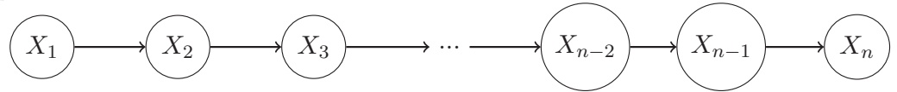

Graph 2:

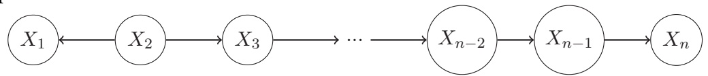

Graph 3:

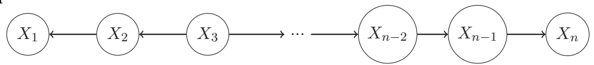

Graph n − 1:

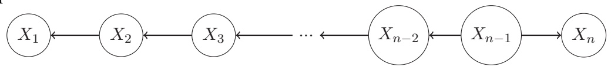

Graph n:

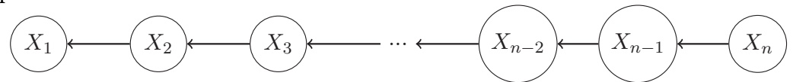

We can think about each of these n graphs, and that if any other edges are flipped in direction in any of these n graphs, the resulting bayes net will have some inactive common effect triple, creating an inactive path.

Thus, there are n different possible bayes net configurations where $X _ { 1 }$ and $X _ { n }$ are guaranteed independent. This gives us $2 ^ { n - 1 } - n$ bayes net configurations where we are guaranteed $X_{1} \perp    \perp X_{n}$ . There are $2 ^ { n - 1 }$ possible bayes net edge configurations. So the probability is $\frac { 2 ^ { n - 1 } - n } { 2 ^ { n - 1 } }$

<!-- page: 14 -->

Q5.4 (2 points) In the graph below, what is the probability that the Bayes’ net is undefined?

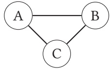

(A) 0

(C) 1/4

(E) 1/2

(G) 3/4

(I) 1

(B) 1/8

(D) 3/8

(F) 5/8

(H) 7/8

**Solution:** A Bayes’ net is undefined if there is a cycle between nodes. In the above graph, there are 2 ways to draw a cycle: $A \to B , B \to C , C \to A ,$ , and vice-versa. In total, there are 8 ways to draw arrows.

Q5.5 (3 points) In the graph below, what is the probability that B ⊥⊥ F?

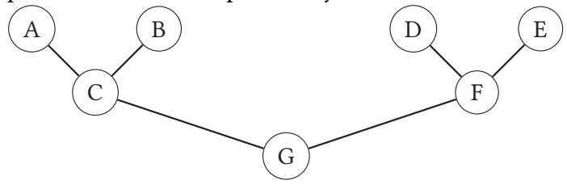

(A) 0

(C) 1/4

(E) 1/2

(G) 3/4

(I) 1

(B) 1/8

(D) 3/8

(F) 5/8

(H) 7/8

**Solution:** The key to solving this problem is to note that there’s only one path between B and F, and it’s the chain BCGF. For B ⊥⊥ F to be true, we need this one path to be inactive, and we don’t care about the directions of any of the other arrows not on this path. The probability that the two end nodes on a 4-node chain are independent is something we already calculated in Q5.2: it was 1/2.

<!-- page: 15 -->

## Q6 Deriving HMMs

## (16 points)

Recall that the Hidden Markov Model (HMM) from lecture (shown below) is just a Bayes’ Net with a special structure. This means that we can use standard Bayes’ Net algorithms to answer queries about the HMM.

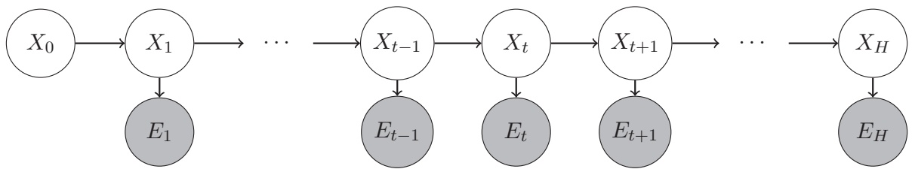

In this question, we want to perform variable elimination to derive $P ( X _ { t } | e _ { 1 : t } )$ , using the most efficient variable ordering possible. If there are no more variables to eliminate, select “None” for all future subparts.

Q6.1 (1 point) Which of the following variables should be eliminated first?

(A) $X _ { 0 : t - 1 }$

(B) $X _ { t }$

(C) $X _ { t + 1 : H }$

(D) $e _ { 1 : t - 1 }$

(E) et

(F) et+1:H

(G) None

**Solution:** First, we should list out all the hidden variables we need to eliminate. These are the variables that aren’t included in our query: $X _ { 0 : t - 1 } , X _ { t + 1 : H }$ , and $e _ { t + 1 : H }$ It might be helpful to write out the conditional probability tables of the variables we need to eliminate. They’re all in the form $P ( X _ { i } | X _ { i - 1 } )$ and $P ( E _ { i } | X _ { i } )$ If we try to join and eliminate on $X _ { 0 : t - 1 }$ , we would need to include $P ( e _ { i } | X _ { i } )$ for $0 \leq i \leq t - 1$ in the join, creating larger factors, so we probably want to save this elimination for last. If we try to join and eliminate on $X _ { t + 1 : H _ { 1 } }$ , we would also need to include $P ( e _ { i } | X _ { i } )$ for $t + 1 \leq$ $i \leq H$ , which creates larger factors, so we don’t want to eliminate this yet either. However, if we try to join and eliminate on $e _ { t + 1 : H }$ , the joins don’t create any larger factors. In other words, you can join and eliminate on $e _ { i }$ for $t + 1 \leq i \leq H$ without creating any larger factors. Then, once these are eliminated, we can also eliminate all the $X _ { t + 1 : H }$ without creating any larger factors.

<!-- page: 16 -->

Q6.2 (1 point) Which of the following variables should be eliminated second? (A) $X _ { 0 : t - 1 }$ $\oplus ( \mathrm { C } ) \; X _ { t + 1 : H }$ O $( \mathrm { E } ) \; e _ { t }$ (G) None (B) $X _ { t }$ $\bigcirc \bigcirc ( \mathrm { D } ) \; e _ { 1 : t - 1 }$ O $( \mathrm { F ) ~ } e _ { t + 1 : H }$

| Solution: (continued from solution to the first subpart)It might also help to explicitly write out an example. Let's set t = 3 and H = 5. Then our conditional probability tables are:$P(X_0), P(X_1\|X_0), P(X_2\|X_1), P(X_3\|X_2), P(X_4\|X_3), P(X_5\|X_4)$$P(e_1\|X_1), P(e_2\|X_2), P(e_3\|X_3), P(e_4\|X_4), P(e_5\|X_5)$We need to eliminate $X_0, X_1, X_2, X_4, X_5$. We also need to eliminate $e_4, e_5$.Trying to eliminate $X_1$ involves joining three factors, $P(X_1\|X_0), P(X_2\|X_1)$, and $P(e_1\|X_1)$.The same occurs for $X_2$ and $X_4$. Trying to eliminate $X_0$ and $X_5$ each involve joining two factors. We should avoid these at first.Trying to eliminate $e_4$ and $e_5$ each only involve joining a single factor, so we should eliminate these first.As a result of the first elimination, $P(e_4\|X_4)$ and $P(e_5\|X_5)$ are gone from our list of factors (and no new factor was generated from them).With those two factors gone, now, joining on $X_5$ only involves one factor, $P(X_5\|X_4)$. It originally would have also included $P(e_5\|X_5)$ but we just eliminated that. So we should eliminate $X_5$ next.As a result of eliminating $X_5, P(X_5\|X_4)$ is gone and no new factor was generated.Next, we can eliminate $X_4$, since this only involves $P(X_4\|X_3)$. It originally would have also included $P(X_5\|X_4)$ and $P(e_4\|X_4)$, but both have been eliminated. This elimination removes $P(X_4\|X_3)$ and generates no new factor.Finally, we're left with $X_0, X_1,$ and $X_2$ to eliminate. These eliminations are the first ones to involve multiple tables at once and generate new factors. |
| --- |

| ● (A) X0:t-1 | ○ (C) Xt+1:H | ○ (E) et | ○ (G) None |
| --- | --- | --- | --- |
| ○ (B) Xt | ○ (D) e1:t-1 | ○ (F) et+1:H |  |

<!-- page: 17 -->

Q6.4 (1 point) Which of the following variables should be eliminated fourth? (A) $X _ { 0 : t - 1 }$ O $\mathrm { ( C ) } \; X _ { t + 1 : H }$ (E) et (G) None (B) Xt (D) e1:t−1 (F) $e _ { t + 1 : H }$

**Solution:** See solution to the first subpart.

Note on Q6.1-Q6.4: Full credit was given if you selected $X _ { 0 : t - 1 }$ , then $e _ { t + 1 : H : }$ , then $X _ { t + 1 : H : }$ then None, in that order. This is an equally efficient ordering as the intended solution, if measuring by size of the largest factor generated (which is what we usually do in this class). Partial credit (2 out of 4 points total) was given if you selected $X _ { 0 : t - 1 }$ , then None three times. This is not a correct implementation of the variable elimination algorithm because variable elimination explicitly joins/eliminates on all the hidden variables. However, this operation does lead you to the desired query distribution, so we gave partial credit for it.

Q6.5 (2 points) What is the first elimination step that generates a new factor that we need to eliminate in later steps? (A) First elimination (D) Fourth elimination (B) Second elimination (E) None of the above

(C) Third elimination

**Solution:** See solution to the first subpart.

<!-- page: 18 -->

Q6.6 (4 points) Select all true statements.

(A) If a variable is independent of the query variable, then eliminating that variable doesn’t generate a new factor.

(B) If a variable is conditionally independent of the query variable given the evidence, then eliminating that variable doesn’t generate a new factor.

(C) If a variable doesn’t have any descendants, then eliminating that variable doesn’t generate a new factor.

(D) If a variable doesn’t have any ancestors and is not observed, then eliminating that variable doesn’t generate a new factor.

(E) None of the above

**Solution:** Think about the probability tables inside a Bayes net (one per node). If we want to join and eliminate on some variable A, we need to collect all the tables that involve A. This includes the table in the A node, as well as the tables in any of A’s direct children, since those tables would need to be conditioned on A. (For example, if B were a direct child of A, the corresponding probability table would be $P ( B | A ) . )$ If A doesn’t have any direct children, then the only table that depends on A is the table in the A node. Joining just one table results in the same table, which would be P(A|parents of A). Eliminating A from this table (i.e. summing over A) results in a trivial factor (you can think of it like a 0-dimensional vector, or a 1-row table that just has the entry 1), which we can safely throw away during variable elimination. This doesn’t generate any new factors. For the other three options, you can come up with counterexamples to show that the statements are false.

Now, let’s look at how the forward algorithm (alternating time elapse and evidence update) relates to variable elimination.

Q6.7 (2 points) How do we compute the initial belief, $P(X_{0})?$

(A) Join and eliminate on $X _ { 0 } .$

(C) Join and eliminate on $X _ { 0 }$ and $X _ { 1 }$

(B) Join and eliminate on $X _ { 1 } .$

(D) Read it directly from the Bayes’ net.

**Solution:** $P ( X _ { 0 } )$ is already specified in the $X _ { 0 }$ node in the Bayes’ net.

<!-- page: 19 -->

Q6.8 (2 points) How do we perform a time elapse step to compute $P(X_{1})?$ (A) Join and eliminate on $X _ { 0 }$ (C) Join and eliminate on $X _ { 0 }$ and $X _ { 1 }$ (B) Join and eliminate on $X _ { 1 }$ (D) Read it directly from the Bayes’ net.

**Solution:** To join on $X _ { 0 } ,$ you’d join $P ( X _ { 0 } )$ and $P ( X _ { 1 } | X _ { 0 } )$ , the two tables in the Bayes’ net that depend on $X _ { 0 }$ . This gives you a joint distribution $P ( X _ { 1 } , X _ { 0 } )$ . Then you would eliminate (sum out) $X _ { 0 }$ , which gives you $P ( X _ { 1 } )$ as desired.

Q6.9 (2 points) Recall that in an HMM, we usually want to compute a belief over the current state given all the evidence so far: $P ( X _ { t } | e _ { 1 : t } )$ Suppose we are missing evidence at a particular time step, $e _ { m }$ . Can we still calculate a belief with all the evidence so far: $P ( X _ { t } | e _ { 1 : m - 1 } , e _ { m + 1 : t } ) ?$

(A) Yes, but we cannot use a recursive approach anymore; we have to use regular Bayes Net algorithms.

(B) Yes, and we can still use a recursive approach; we can simply skip the steps we can’t do.

(C) No, the evidence structure is not consistent anymore, so the graph is disconnected.

(D) No, but we can calculate $P ( X _ { t } | e _ { 1 : m - 1 } )$ and $P ( X _ { t } | e _ { m + 1 : t } )$ by eliminating the right and the left parts of the graph, respectively.

**Solution:** Intuitively, the idea would be to skip one of the observation update steps while performing the forward algorithm.

<!-- page: 20 -->

## Q7 Sampling

(12 points)

In this question, we’ll explore how standard Bayes’ net sampling algorithms compare to particle filtering in a hidden Markov model (HMM).

First, consider the following Markov model, modeled as a Bayes’ net:

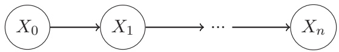

The Markov assumption means that the transition probability distribution, $P ( X _ { t } | X _ { t - 1 } )$ , is the same for all $t \geq 1$

Q7.1 (2 points) Suppose we want to use prior sampling to compute $P ( X _ { n } )$ . Which statement best describes the process of computing one sample?

(A) Because the transition probability at each time step is the same, we can just draw one sample from $P ( X _ { t } | X _ { t - 1 } )$

(B) First, draw a sample from $P ( X _ { 0 } )$ . Then, use that sample (call it x) to draw one sample from $P ( X _ { t } | x )$

(C) First, draw a sample from $P ( X _ { 0 } )$ . Then, use that sample (call it x0) to draw one sample from $P ( X _ { 1 } | x _ { 0 } )$ . Then, use that sample (call it $x _ { 1 } )$ to draw one sample from $P ( X _ { 2 } | x _ { 1 } )$ Repeat until $x _ { n }$ is generated. The final sample is $x _ { n } .$

(D) Same process as the previous choice, except the final sample is $( x _ { 0 } , x _ { 1 } , \ldots , x _ { n } )$

**Solution:** Although the Markov assumption makes the transition probability at each individ ual time step the same, the overall distribution still changes at different time steps.

(For an intuitive example, consider a 1D grid where the initial probability distribution over the ghost position is uniform, and the transition distribution says that the ghost always moves left. At time step 0, the distribution over the ghost position is uniform, but at later time steps, it’s much more likely that the ghost is in the left squares.)

Because the distribution is different at different time steps, we still need to resample from the transition probability distribution n times to generate a sample. Since we’re trying to compute $P ( X _ { n } )$ , our sample should be the result of sampling from the transition distribution n times, ${ \bf i . e . } ~ x _ { n }$ . Intermediate results like $x _ { 0 } , x _ { 1 } , \ldots$ can’t be used because these would be samples from $P ( X _ { 0 } ) , P ( X _ { 1 } ) , \ldots ,$ not samples from $P ( X _ { n } )$

Note: Full credit was given if you selected (D). The intended answer was (C), because only values of $x _ { n }$ are needed to create a sampling distribution. However, we realized that the lecture slides show the entire sample $( x _ { 0 } , x _ { 1 } , \ldots , x _ { n } )$ being returned, even if only $x _ { n }$ (the last element of the tuple) is actually used when computing the sampling distribution.

<!-- page: 21 -->

Q7.2 (2 points) Suppose we know the state at time step $i ,   x _ { i }$ . We want to use rejection sampling to compute $P ( X _ { n } | x _ { i } )$ On average, what proportion of samples will be discarded in this sampling procedure? (A) 0 (C) $P ( x _ { i } )$ (E) $1 - P ( x _ { 0 } )$ (B) $1 / 2$ (D) $1 - P ( x _ { i } )$ (F) $1 - P ( x _ { i } | X _ { i - 1 } )$

**Solution:** Since our samples are consistent with the joint distribution, the probability that a sample is consistent with $x _ { i }$ and kept is $P ( x _ { i } )$ . Thus the probability that a sample is discarded is $1 - P ( x _ { i } )$

Q7.3 (2 points) Suppose we still know $x _ { i } ,$ but now we want to use likelihood weighting to compute $P ( X _ { n } | x _ { i } )$ Pacman suggests a modification where we skip sampling $x _ { 0 }$ to $x _ { i - 1 }$ . Instead, we start by fixing $x _ { i } ,$ then sampling $x _ { i + 1 } \; { \mathrm { t o } } \; x _ { n }$ Does Pacman’s modification work?

(A) Yes, because the Markov assumption says that $X _ { 0 : i - 1 }$ is independent of $X _ { i + 1 : n }$ given $x _ { i }$

(B) Yes, because the weights of each sample are the same for this query.

(C) No, because the modification makes it impossible to compute weights for each sample.

(D) No, because $x _ { i }$ needs to be randomly sampled, not fixed.

**Solution:** To weight each sample by the probability of the evidence occurring, we need $P ( x _ { i } | x _ { i - 1 } )$ , but we never sampled $x _ { i - 1 }$ . This means that we won’t be able to actually generate weights for each sample. However, recall that the reason we’re incorporating weights is to make our sampling distribu tion consistent with the query distribution. If we start with a fixed $x _ { i }$ and then sample a value of $X _ { n }$ given $x _ { i } ,$ then the probability of $X _ { n }$ taking on some value matches the distribution $P ( X _ { n } | x _ { i } )$ , even if we don’t assign a weight to the sample. This is made possible because the Markov assumption says that $P ( X _ { n } | x _ { i } )$ does not depend on any of $x _ { 0 } , \ldots , x _ { i - 1 }$ Note: An older version of solutions marked (C) as the correct answer. After deliberation, we agreed that $( \mathrm { A } )$ is the correct answer and regraded all submissions.

<!-- page: 22 -->

Q7.4 (2 points) Recall the time elapse update in the particle filtering algorithm: at each time step, we move a particle to a new state by sampling from the transition model $P ( X _ { t + 1 } | X _ { t } )$ We can repeatedly use the time elapse update to compute $P ( X _ { n } )$ . Which sampling algorithm is this procedure most similar to? (A) Variable elimination (D) Likelihood weighting (B) Prior sampling (E) Gibbs sampling

**Solution:** No samples are rejected, and no evidence variables are fixed, so this is most similar to prior sampling.

For the rest of the question, consider a standard Hidden Markov Model (HMM) with evidence nodes. Recall that in particle filtering, we can use time elapse updates and evidence observation updates to estimate $P ( X _ { n } | e _ { 1 : n } )$

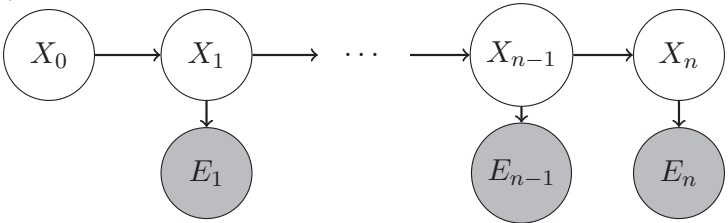

Q7.5 (2 points) Pacman suggests using rejection sampling to estimate $P ( X _ { n } | e _ { 1 : n } )$ . Why is this not a good idea?

(A) If the evidence $e _ { 1 : n }$ is rare, rejection sampling will be very inefficient.

(B) Rejection sampling is much slower than particle filtering because it must consider every time step.

(C) In rejection sampling, the evidence $e _ { 1 : n }$ will not influence the upstream variable $X _ { n }$

(D) Rejection sampling will produce samples that are inconsistent with the desired distribution, so the estimates will be inaccurate.

**Solution:** If the evidence is rare, the vast majority of your randomly-generated samples will not line up with the evidence, and will have to be discarded.

<!-- page: 23 -->

Q7.6 (2 points) Pacman suggests using likelihood weighting to estimate $P ( X _ { n } | e _ { 1 : n } )$ . Why is this not a good idea?

(A) If the evidence $e _ { 1 : n }$ is rare, likelihood weighting will be very inefficient.

(B) Likelihood weighting is much slower than particle filtering because it must consider every time step.

(C) In likelihood weighting, the evidence $e _ { 1 : n }$ will not influence the upstream variable $X _ { n }$

(D) Likelihood weighting will produce samples that are inconsistent with the desired distribution, so the estimates will be inaccurate.

**Solution:** Try running likelihood weighting on the Bayes’ net shown above: you would have to sample all the $X _ { i }$ before you sample any evidence nodes $e _ { i }$ . By the time you fix the evidence nodes, $X _ { n }$ might have already been chosen to be something very unlikely given the evidence, so you’d get a fairly useless sample with very low weight.

<!-- page: 24 -->

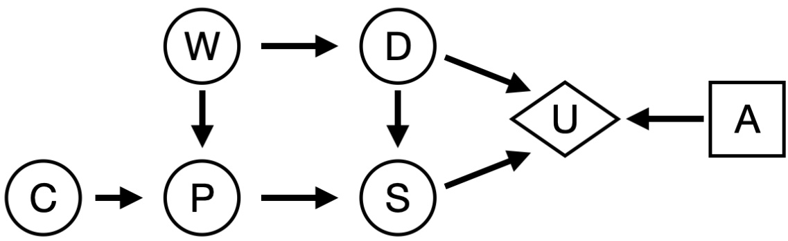

Q8.1 (3 points) Which of these expressions could be true? Select all that apply.

$$
\text {■ (A) VPI} (C) > 0
$$

$$
(\mathrm{B}) \mathrm{VPI} (C) = 0
$$

$$
\square (\mathrm{C}) \operatorname{VPI} (C) <   0
$$

**Solution:** Without seeing the underlying probability tables, the only way you can guarantee that $\mathrm { V P I } ( X | Y ) = 0$ is if X is conditionally independent of all the parents of the utility node, given Y .

In this case, $C$ is not independent of $S$ (a parent of the utility), so the VPI could be zero or positive.

VPI can’t be negative.

Q8.2 (3 points) Which of these expressions could be true? Select all that apply.

(A) VPI(C|S, P) > 0

$$
\blacksquare \mathrm{(B)} \mathrm{VPI} (C | S, P) = 0
$$

$$
\square (\mathrm{C}) \mathrm{VPI} (C) <   0
$$

**Solution:** Similarly from the previous subpart, C is not conditionally independent of $D \left( \mathbf { a } \right.$ parent of the utility) given S, P. (Consider the CPW D path which is active.) Choice (C) was a typo here and should have said VP $\mathrm { { \bf { \cal { I } } } } ( C | S , P )   <   0 ,$ but luckily it doesn’t change the answer. VPI can’t be negative, so the answer is false regardless of what you assumed this option said.

<!-- page: 25 -->

Q8.3 (3 points) Which of these expressions could be true? Select all that apply.

(A) $\mathrm { V P I } ( C , D ) > \mathrm { V P I } ( C ) + \mathrm { V P I } ( D )$

(B) $\mathrm { V P I } ( C , D ) = \mathrm { V P I } ( C ) + \mathrm { V P I } ( D )$

(C) $\mathrm { V P I } ( C , D ) < \mathrm { V P I } ( C ) + \mathrm { V P I } ( D )$

Solution: VPI rule (true of all decision networks): $\operatorname { V P I } ( C , D ) = \operatorname { V P I } ( C ) + \operatorname { V P I } ( D | C )$ Now we just need to compare $\mathrm { V P I } ( D | C )$ and $\operatorname { V P I } ( D )$ . In this particular decision network, we could have $\mathrm { V P I } ( D ) = \mathrm { V P I } ( D | C )$ (intuitively, if knowing C is useless), or $\mathrm { V P I } ( D ) > \mathrm { V P I } ( D | C )$ (intuitively, if knowing C is useful, then D by itself gives more information than D after already knowing C).

Additionally, it’s possible that $\mathrm { V P I } ( C , D )   >   \mathrm { V P I } ( C )   +   \mathrm { V P I } ( D )$ . For an intuitive example: consider a utility completely determined by a 2-bit number. Fully knowing the 2-bit number lets you maximize utility, while knowing just one of the bits doesn’t affect your decision at all. C indicates the low bit, and D indicates the high bit. Then $\mathrm { V P I } ( C ) + \mathrm { V P I } ( D ) = 0 ,$ , and $\mathrm { V P I } ( C , D ) > 0 .$

Note: An older version of solutions marked (A) as incorrect. After deliberation, we agreed that (A) is a correct answer and regraded all submissions.

Q8.4 (4 points) Which of these statements is always true? Select all that apply.

(A) $\mathrm { V P I } ( P , D ) = \mathrm { V P I } ( D , P )$

(D) VPI(S|C) = VPI(D|C)

(B) $\operatorname { V P I } ( W ) = \operatorname { V P I } ( P )$

(E) None of the above

(C) $\mathrm { V P I } ( P ) = \mathrm { V P I } ( P | W )$

**Solution:** (A) is true from the rules of VPI.

The other options are not necessarily true. Intuitively, in the pairs of nodes listed here, there’s no way to compare whether one node is more valuable than another. (For example, there’s no indicator that W is more valuable than P or vice-versa.)

<!-- page: 26 -->

## Q9 Deriving Naive Bayes

The Naive Bayes model is just a Bayes’ net with a special structure. This means that we can use standard Bayes’ net algorithms to perform classification with Naive Bayes.

**(4 points)**

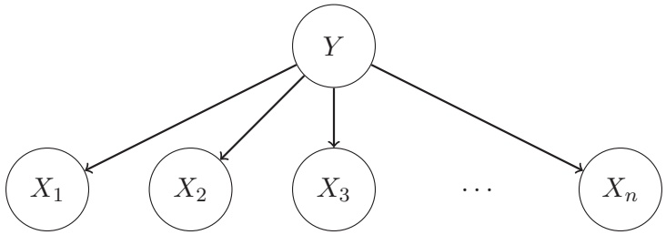

Q9.1 (2 points) Where do the probability tables $P ( X _ { 1 } | Y ) , P ( X _ { 2 } | Y ) , \ldots , P ( X _ { n } | Y )$ usually come from?

(A) We compute them from the training dataset.

(B) We compute them from the validation dataset.

(C) We compute them from the test dataset.

(D) We ask experts what the distributions should be.

**Solution:** We empirically derive the probability distribution of each feature, given its label, from the training dataset.

Q9.2 (2 points) In a Naive Bayes’ model, we’re trying to compute $P ( Y | x _ { 1 } , x _ { 2 } , \ldots , x _ { n } )$ . Then, we pick the most likely Y as our classification. How can we use variable elimination to compute this distribution?

(A) Join and eliminate on Y .

(B) Join and eliminate on $x _ { 1 } , x _ { 2 } , \ldots , x _ { n } .$

(C) Join every factor together and normalize.

(D) Join $P ( X _ { 1 } | Y ) , P ( X _ { 2 } | Y ) , \ldots , P ( X _ { n } | Y )$ together and normalize.

**Solution:** Notice that we don’t actually want to eliminate anything, because our final distribution contains all the variables from the Bayes’ net. To get this distribution, we join all the variables to get a joint distribution, then normalize to get a distribution over Y .

<!-- page: 27 -->

**(6 points)**

Q10.1 (2 points) Your model achieves 0.99 accuracy on the training dataset and 0.62 accuracy on the test dataset. Which is the most likely explanation for what happened?

(A) Your model overfit the training dataset.

(B) Your model underfit the training dataset.

(C) You looked at the test dataset during training when you weren’t supposed to.

(D) You trained your model on the test dataset instead of the training dataset.

**Solution:** High training accuracay but low test accuracy is a telltale sign of overfitting.

Q10.2 (2 points) Consider a 1-dimensional minimization problem with the following graph. The x-axis is the value of the parameter you’re learning, and the y-axis is the loss. Assume that you’re currently at the point indicated by the dot.

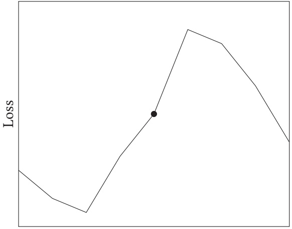

Parameter value

The gradient at the current point is \_\_\_\_, and to perform gradient descent, you should move

(A) negative, left

(C) positive, left

(B) negative, right

(D) positive, right

**Solution:** The derivative/gradient at the current point is positive, and we want to minimize the loss, so we move in the opposite direction (negative, aka left).

<!-- page: 28 -->

Q10.3 (2 points) Consider the neural network model we used in Project 5:

$$
h = \mathrm{ReLU} (W _ {1} x + b _ {1})
$$

$$
\hat {y} = W _ {2} h + b _ {2}
$$

$$
L = (y - \hat {y}) ^ {2}
$$

Which variables are the parameters that we need to learn? Select all that apply.

(A) x (E) h (I) y

(B) $W _ { 1 }$ (F) $W _ { 2 }$ (J) L

(C) $b _ { 1 }$ (G) $b _ { 2 }$ (K) None of the above

(D) ReLU (H) ŷ

## Solution:

x and y are the inputs and outputs, which are provided in the dataset.

ReLU is a function, so it’s not a parameter.

ŷ is the prediction that we compute, and h is an intermediate value in the process of computing the prediction.

L is the loss from our computed prediction and the actual output.

The W matrices and b vectors contain the parameters that we use to take an input and compute a predicted output. We use gradient descent to learn the values in these matrices/vectors that minimize the loss function.

<!-- page: 29 -->

## Clarifications

We aren’t issuing clarifications during the exam. However, if you have any clarification questions, or made <u>any assumptions while solving a question, you can note it here and we’ll account for it during grading.</u>

## Doodle

Congratulations for making it to the end of the exam! Feel free to leave any final thoughts, comments, feedback, or doodles here:
