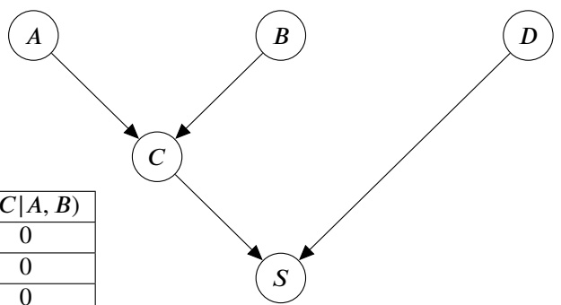
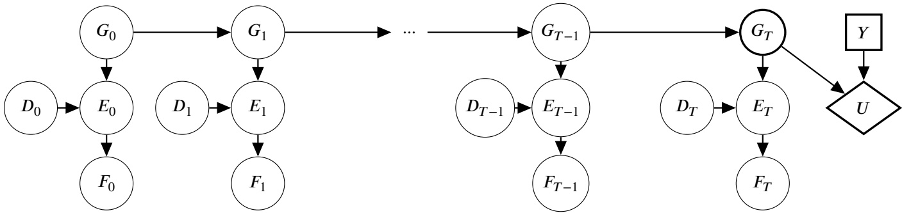
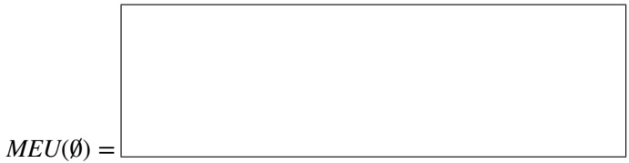
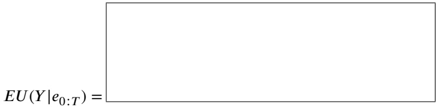
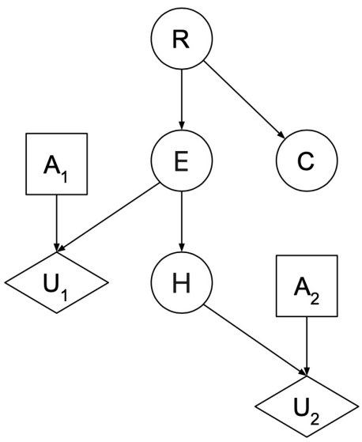
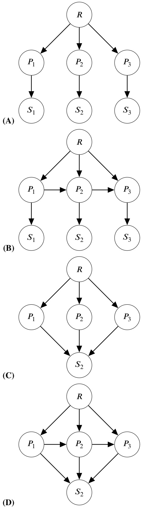
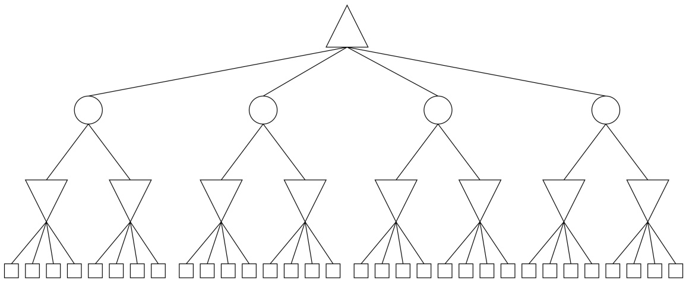
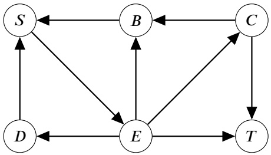
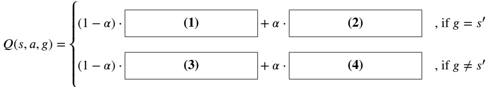

<!-- page: 1 -->

• You have approximately 170 minutes.

• The exam is closed book, no calculator, and closed notes, other than two double-sided "crib sheets" that you may reference.

• For multiple choice questions,

– □ means mark **all options** that apply

means mark a single choice

| First name |  |
| --- | --- |
| Last name |  |
| SID |  |
| Exam Room |  |
| Name and SID of person to the right |  |
| Name and SID of person to the left |  |
| Discussion TAs (or None) |  |

**Honor code**: “As a member of the UC Berkeley community, I act with honesty, integrity, and respect for others.”

By signing below, I affirm that all work on this exam is my own work, and honestly reflects my own understanding of the course material. I have not referenced any outside materials (other than two double-sided crib sheet), nor collaborated with any other human being on this exam. I understand that if the exam proctor catches me cheating on the exam, that I may face the penalty of an automatic "F" grade in this class and a referral to the Center for Student Conduct.

Signature:

Point Distribution

| Q1. Machine Learning | 15 |
| --- | --- |
| Q2. Satisfiability with a Bayes net | 10 |
| Q3. Ghostbusters 2 | 13 |
| Q4. Decisions, Decisions | 16 |
| Q5. She's So Gone | 10 |
| Q6. Search and Games | 13 |
| Q7. Q-Learning on partially observable problems | 14 |
| Q8. Search on MDPs | 9 |
| Total | 100 |

<!-- page: 2 -->

<!-- page: 3 -->

## Q1. [15 pts] Machine Learning

**(a)** First, let’s review the basics of perceptrons. The following binary class data has two features, $x _ { 1 }$ and $x _ { 2 } .$ Let x denote the column vector with these elements. We would like to train a perceptron parameterized by $\mathbf { w } \in \mathbb { R } ^ { 2 }$ . The perceptron outputs 1 if $\mathbf { w } ^ { \top } \mathbf { x } \geq 0$ and −1 otherwise.

| Index | 𝑥<sub>1</sub> | 𝑥<sub>2</sub> | Class |
| --- | --- | --- | --- |
| 1 | -1 | 1 | 1 |
| 2 | 0 | 3 | 1 |
| 3 | 1 | -1 | -1 |
| 4 | 3 | 0 | -1 |

**(i)** [2 pts] If the current weight vector $\mathbf { w } = ( - 1 , - 1 )$ , select the indices of the samples which will be classified correctly. **[1] [2] [3] [4] (None)**

**(ii)** [1 pt] If w is currently all zeros and sample 4 is picked in the first round of training, what will w be after the update? Assume a learning rate of 𝛼 = 1. **(A)** (0, 0) **(B)** (-3, 0) **(C)** (3, 0) **(D)** (-3, -1) **(E)** (3, 1) **(F)** None

**(iii)** [2 pts] Notice $\mathbf { w } _ { 1 }   =   ( - 1 , 1 )$ and $\mathbf { w } _ { 2 }   =   ( - 4 , 1 )$ are both perceptrons that can correctly classify all samples in the training data but we still want to figure out how robust they are to unseen data. To do so, we add some noise n (with magnitude $\| \mathbf { n } \| _ { 2 }   \leq   1 )$ to each sample to test the two perceptrons. Which of the two perceptrons is guaranteed to classify the noisy samples correctly? <strong><sup>[w</sup></strong>1] $[ \mathbf { w } _ { 2 } ]$ **(None)**

**(iv)** [1 pt] True/False: If we add a positive training sample (2, −1), can a linear perceptron correctly classify all the training samples? **(T) (F)**

**(b)** [1 pt] You have trained a perceptron model to perfectly classify your training data but find that it performs poorly on your validation set, which consists of completely new data points. Instead of using the naive perceptron model, which of the following models could improve the validation accuracy? **[A]** Logistic regression **[B]** Linear regression **[C]** Single-layer neural net with softmax activation **(D)** None of the above

**(c)** [2 pts] When using a deep neural network to perform classification, which of the following are learned by the model? **[A]** Weight matrices of the neural net [E] Learning rate **[B]** Bias vectors of the neural net [F] Number of layers of the neural net **[C]** Hidden layer size of the neural net **[D]** Batch size **(E)** None of the above

**(d) (i)** [1 pt] **(T) (F)** During training, if a perceptron misclassifies data $x ^ { ( i ) }$ , it will not misclassify it after the weight update.

**(ii)** [1 pt] **(T) (F)** The number of weights (including bias) of a multiclass logistic regression model with ddimensional input and 3 classes is 3𝑑 + 1.

**(iii)** [1 pt] **(T) (F)** Applying Laplace smoothing on Naive Bayes could increase validation accuracy because it mitigates underfitting.

**(iv)** [1 pt] **(T) (F)** We cannot use $y = | x |$ as an activation function in neural networks because it’s not differentiable at 𝑥 = 0.

**(v)** [1 pt] **(T) (F)** It’s possible for a neural network with only 1 hidden layer to represent any continuous function.

**(vi)** [1 pt] **(T) (F)** We should decrease the learning rate if the training loss is going up every epoch.

<!-- page: 4 -->

## Q2. [10 pts] Satisfiability with a Bayes net

In lecture, we learned that we can reduce the satisfiability (SAT) problem to inference in a Bayes net, where logical circuits with input variables as parent nodes will output a CNF value as the child node. The Bayes net can have multiple levels to represent nested logical circuits.

For this problem, we seek to determine the satisfiability of ¬(𝐴 ∧ 𝐵) ∨ 𝐷 using the following Bayes net.

Here, we construct a Bayes net to represent 𝐶 = 𝐴 ∧ 𝐵 and $S = \neg C \vee D$

| 𝐴 | 𝑃(𝐴) |
| --- | --- |
| true | 0.5 |
| false | 0.5 |

| 𝐵 | 𝑃(𝐵) |
| --- | --- |
| true | 0.5 |
| false | 0.5 |

| 𝐷 | 𝑃(𝐷) |
| --- | --- |
| true | 0.5 |
| false | 0.5 |



| 𝐶 | 𝐴 | 𝐵 | 𝑃(𝐶\|𝐴,𝐵) |
| --- | --- | --- | --- |
| true | true | true | 0 |
| false | true | true | 0 |
| true | true | false | 0 |
| false | true | false | 1 |
| true | false | true | 0 |
| false | false | true | 1 |
| true | false | false | 0 |
| false | false | false | 1 |

| 𝑆 | 𝐶 | 𝐷 | P(S\|C,D) |
| --- | --- | --- | --- |
| true | true | true | 1 |
| false | true | true | 0 |
| true | true | false | 0 |
| false | true | false | 1 |
| true | false | true | 1 |
| false | false | true | 0 |
| true | false | false | 1 |
| false | false | false | 0 |

**(a) (i)** [2 pts] Which condition on the probability of 𝑆 in the Bayes net is true if and only if the logical sentence ¬(𝐴∧𝐵)∨𝐷 is satisfiable?

**(A)** $P ( S = t r u e ) = 0$

**(B)** $P ( S = t r u e ) \geq 0$

**(D)** $P ( S = t r u e ) \geq 0 . 5$

**(C)** $P ( S = t r u e ) > 0$

**(E)** $P ( S = t r u e ) > 0 . 5$

**(F)** $P ( S = t r u e ) = 1$

**(ii)** [2 pts] Which condition on the probability of 𝑆 in the Bayes net is true if and only if the logical sentence $\neg ( A   \land   B )   \lor   D$ is valid?

**(A)** $P ( S = t r u e ) = 0$

**(B)** $P ( S = t r u e ) \geq 0$

**(C)** $P ( S = t r u e ) > 0$

**(D)** $P ( S = t r u e ) \geq 0 . 5$

**(E)** $P ( S = t r u e ) > 0 . 5$

**(F)** $P ( S = t r u e ) = 1$

<!-- page: 5 -->

**(b)** Now, we will do inference via prior sampling in this Bayes net. Assume that we have access to code that will run prior sampling and return the samples to us. However, the code will only show us the value of the variable 𝑆 in each sample. We can see nothing else.

**(i)** [1 pt] Suppose we draw 100 samples and find that in exactly 43 of them, 𝑆 has the value true. What can we conclude about the satisfiability o $\mathbf { f } \neg ( A \land B ) \lor D ?$

**(A)** $\neg ( A \land B ) \lor D$ is valid.

**(B)** $\neg ( A \land B ) \lor D$ is satisfiable.

**(C)** $\neg ( A \land B ) \lor D$ is **not** satisfiable.

**(D)** None of the above.

**(ii)** [1 pt] Suppose we instead draw 100 total samples and find that 𝑆 has the value false in all 100 of them. What can we conclude about the satisfiability of $\neg ( A \land B ) \lor D ?$

**(A)** $\neg ( A \land B ) \lor D$ is valid.

**(B)** $\neg ( A \land B ) \lor D$ is satisfiable.

**(C)** $\neg ( A \land B ) \lor D$ is **not** satisfiable.

**(D)** None of the above.

**(c) (i)** [2 pts] Consider the same example of determining satisfiability of $\neg ( A   \land   B )   \lor   D .$ If we are still doing prior sampling, what is the probability that our first sample has $S = t r u e ?$

**(ii)** [2 pts] Now consider a sentence with 𝑛 uniformly distributed binary variables and 𝑚 models that satisfy the sentence, what is the expected number of samples we draw in order to conclude that the sentence is satisfiable?

Hint: If $X \sim G e o m e t r i c ( p )$ , then $\begin{array} { r } { \mathbb { E } [ X ] = \frac { 1 } { p } } \end{array}$

<!-- page: 6 -->

## Q3. [13 pts] Ghostbusters 2

A ghost is traveling in an $M   \times   N$ grid with no walls or obstacles. Pacman is trying to determine the location of the ghost at some finite timestep 𝑇 , where $G _ { t }$ represents ghost’s location at timestep 𝑡. At each timestep 𝑡, there are up to 3 sensor variables— $D _ { t } ,$ $E _ { t }$ , and $F _ { t ^ { - } }$ —connected as shown in the dynamic Bayes net (DBN) below.

Pacman has a guess action 𝑌 which represents Pacman’s guess of the value $G _ { T }$ . The utility Pacman gains for its guess is determined by $U ( Y , G _ { T } )$ which is a predetermined function that is larger when 𝑌 is closer to $G _ { T }$



**(a)** [2 pts] For this part only: assume that Pacman does not observe the sensor values and does not know any of the CPTs in the DBN; further, let $U ( y , g _ { T } )$ be 100 if $y = g _ { T }$ and −1 otherwise.

Sid from Stanford says the distribution is uniform, assuming that the ghost moves randomly for a long time. Using this information, what is Pacman’s maximum expected utility? You may use the values 𝑀, 𝑁, or 𝑇 in your expression as necessary.



For the remainder of the question, assume that Pacman knows all the conditional distributions in the DBN.

**(b)** [1 pt] Which of the following expressions maximizes Pacman’s expected utility when no evidence is available?

**(A)** $Y = \mathop { \operatorname { a r g   m a x } } _ { g _ { T } } P ( g _ { T } | G _ { T - 1 } )$

**(B)** $Y = \mathop { \operatorname { a r g   m a x } } _ { g _ { T } } P ( g _ { T } | G _ { 0 : T - 1 } )$

**(C)** $Y = \mathop { \operatorname { a r g   m a x } } _ { g _ { T } } P ( G _ { 0 : T - 1 } , g _ { T } )$

**(D)** $Y = \underset { g _ { T } } { \operatorname { a r g   m a x } } \sum _ { g _ { T - 1 } } P ( g _ { T } | g _ { T - 1 } ) P ( g _ { T - 1 } ) ,$

**(E)** None of the above

**(c)** Pacman can choose to uncover the value of one sensor (seeing its value for all 𝑡) in order to help maximize its utility.

**(i)** [2 pts] Without any assumptions about the sensor CPTs, which of the following inequalities provides the strongest valid statement about the VPIs for the sensor variables?

**(A)** $\mathit { V P I } ( D ) \geq \mathit { V P I } ( E ) > \mathit { V P I } ( F )$

**(B)** $\mathit { V P I } ( E ) \geq \mathit { V P I } ( D ) > \mathit { V P I } ( F )$

**(C)** $\mathit { V P I } ( E ) \geq \mathit { V P I } ( F ) > \mathit { V P I } ( D )$

**(D)** $\mathit { V P I } ( E ) \geq \mathit { V P I } ( F ) \geq \mathit { V P I } ( D )$

**(E)** Any VPI relationship is possible

**(ii)** [2 pts] Let 𝑋 and 𝑍 be the sensor variables with the highest and second-highest VPI, respectively. Which of the following statements are guaranteed to be true for any timestep $t \in [ 0 , T - 1 ]$ and any values $x _ { t }$ and ${ z _ { t } } ^ { ? }$

<!-- page: 7 -->

SID:

**[A]** $\mathit { M E U } ( X _ { t + 1 } = x _ { t + 1 } ) \geq \mathit { M E U } ( X _ { t } = x _ { t } ) \quad \forall x _ { t } , x _ { t + 1 }$

**[B]** $\mathit { M E U } ( X _ { t + 1 } = x _ { t + 1 } ) \geq \mathit { M E U } ( Z _ { t } = z _ { t } ) \quad \forall x _ { t } , z _ { t }$

**[C]** $\mathit { V P I } ( X _ { t + 1 } ) \geq \mathit { V P I } ( X _ { t } )$

**[D]** $\mathit { V P I } ( X _ { t } ) \geq \mathit { V P I } ( Z _ { t + 1 } )$

**(E)** None of the above

**(iii)** [1 pt] Pacman chooses the sensor variable 𝐹 as evidence, so we are given $F _ { t }   =   f _ { t }   \forall t$ Which of the following expressions for 𝑌 would maximize Pacman’s expected utility?

**(A)** $Y = \underset { g _ { T } } { \operatorname { a r g   m a x } } \sum _ { g _ { T - 1 } } P ( g _ { T } | g _ { T - 1 } ) P ( g _ { T - 1 } ) ,$

**(B)** $Y = \underset { g _ { T } } { \operatorname { a r g   m a x } } \sum _ { e _ { T } } P ( f _ { T } | e _ { T } ) \cdot P ( g _ { T } | e _ { 0 : T - 1 } ) ,$

$$
Y = \arg \max _ {g _ {T}} \sum_ {e _ {T}} P (f _ {T} | e _ {T}) P (e _ {T} | d _ {T}, g _ {T}) \cdot P (g _ {T} | e _ {0: T - 1})
$$

$$
Y = \arg \max _ {g _ {T}} \sum_ {e _ {T}, d _ {T}} P (f _ {T} | e _ {T}) P (d _ {T}) P (e _ {T} | d _ {T}, g _ {T}) \cdot P (g _ {T} | f _ {0: T - 1})
$$

**(E)** None of the above

**(iv)** [2 pts] Now consider that Pacman instead chooses only the variable 𝐸 as evidence. Using the functions for the belief distribution (𝐵 or $B ^ { \prime } )$ and the general utility function 𝑈, what is the expression for $E U ( Y | e _ { 0 : T } ) ?$

Recall that $B ( G _ { T } ) = P ( G _ { T } | e _ { 0 : T } ) \; \mathrm { a n d } \; B ^ { \prime } ( G _ { T } ) = P ( G _ { T } | e _ { 0 : T - 1 } ) .$



**(d)** [3 pts] Pacman is now free to choose as many of the sensor evidence variables as it requires to maximize its expected utility. In addition, Pacman can choose to know the starting position of the ghost. Among all the available evidence listed below, select the minimum set that would allow Pacman to achieve the maximum expected utility possible.

**[A]** $G _ { 0 }$ **[B]** $E _ { 0 }$ **[C]** $D _ { 0 }$ **[D]** $F _ { 0 }$ **[E]** $E _ { 1 : T }$ **[F]** $D _ { 1 : T }$ **[G]** $F _ { 1 : T }$

**(H)** None of the above

<!-- page: 8 -->

## Q4. [16 pts] Decisions, Decisions

Saagar plans to attend an event in AILand. His situation can be represented as a decision network with the following components:



Chance variables (all Boolean):

• 𝑅: Whether it Rains or not. According to the forecast, $P ( r ) = 0 . 3 .$

• 𝐶: Whether it is Cloudy or not. This may depend on 𝑅.

• 𝐸: Whether the Event is held or not. This may depend on 𝑅.

• 𝐻: Whether there is Heavy traffic or not. This may depend on 𝐸. Actions:

$A _ { 1 } \in \{ \mathrm { e v e n t ,   a r c a d e } \}$ : Whether Saagar goes to the event or arcade.

$A _ { 2 } \in \{ \mathrm { c a r ,   s u b w a y } \}$ : Whether Saagar takes a car or subway.

Utilities:

$U _ { 1 } ( A _ { 1 } , E ) ;$ The utility Saagar derives from his choice of arcade or event (if it happens).

$U _ { 2 } ( A _ { 2 } , H )$ : The heavy-traffic-dependent utility Saagar derives from his choice of car or subway.

• Saagar’s total utility is the sum: $U = U _ { 1 } + U _ { 2 }$

It is known that none of the conditional probabilities in the decision network are 0.

**(a)** [3 pts] Derive an expression for $M E U ( R = t r u e )$ in terms of conditional probability and utility terms from the network (no numerical values).

**(b)** [1 pt] Notice that there are two separate utilities $U _ { 1 }$ and $U _ { 2 }$ that contribute to Saagar’s overall utility 𝑈. Select all possible individual variables 𝑋 such that we can correctly decompose $MEU(X = x) = MEU_{1}(X = x) + MEU_{2}(X = x); \mathrm{i.e.}$ each action can be optimized independently of the other.

**[R] [C] [E] [H] (None)**

**(c)** [1 pt] **(T) (F)** Let 𝑋 be any Boolean variable in any decision network. The following conditions are jointly sufficient to show that $V P I ( X ) > 0 ;$

• 𝑃 (𝑥) is not 0 or 1.

• The optimal decisions given 𝑥 and ¬𝑥 are different.

Now we are given the following numerical values for some of the factors in our decision network:

𝑃 (𝐻|𝐸)

| 𝐸 | 𝐻 | 𝑃(𝐻\|𝐸) |
| --- | --- | --- |
| true | true | 0.8 |
| true | false | 0.2 |
| false | true | 0.4 |
| false | false | 0.6 |

$$
U _ {1} (A _ {1}, E)
$$

| 𝐴<sub>1</sub> | 𝐸 | 𝑈<sub>1</sub>(𝐴<sub>1</sub>,𝐸) |
| --- | --- | --- |
| event | true | 100 |
| arcade | true | 60 |
| event | false | 0 |
| arcade | false | 90 |

$$
U _ {2} (A _ {2}, H)
$$

| 𝐴<sub>2</sub> | 𝐻 | 𝑈<sub>2</sub>(𝐴<sub>2</sub>,𝐻) |
| --- | --- | --- |
| subway | true | -10 |
| taxi | true | -30 |
| subway | false | -10 |
| taxi | false | 0 |

(d) [2 pts] Given the information we have, which of the following could be true?

**[A]** $V P I ( E ) > 0$ **[D]** $V P I ( C ) > 0$ **[B]** $V P I ( E ) = 0$ **[E]** $V P I ( C ) = 0$ **[C]** $VPI(E) < 0$ **[F]** $VPI(C) < 0$

<!-- page: 9 -->

```txt
The image contains no text or content to process. It is a blank template with a single horizontal line, which is a stylistic or background element and not textual content. Therefore, the correct OCR output is an empty string.
```

SID:

**(e)** [2 pts] Given the information we have, which of the following **must** be true?

**[A]** $V P I ( R , C ) > V P I ( R )$

**[B]** $V P I ( R , H ) > V P I ( E )$

**[C]** $V P I ( E , H ) > V P I ( H )$

**[D]** $VPI(C) > VPI(R)$

**(E)** None of the above

We want to calculate VPI(𝐻). **For the remainder of this problem**, say we have eliminated 𝑅 and 𝐶 to find $P ( E = t r u e ) = 0 . 6$

Say we also have the following values for expected utility given no information.

𝐸𝑈(𝐴<sub>1</sub>, 𝐴<sub>2</sub>)

| 𝐴<sub>1</sub> | 𝐴<sub>2</sub> | 𝐸𝑈(𝐴<sub>1</sub>,𝐴<sub>2</sub>) |
| --- | --- | --- |
| event | subway | 50 |
| event | taxi | 30 |
| arcade | subway | 40 |
| arcade | taxi | 20 |

**(f)** [2 pts] Find $P ( E = t r u e | H = t r u e )$

```json
[REDACTED]
```

**(g)** [2 pts] Find the expected utility EU(event, subway|𝐻 = 𝑡𝑟𝑢𝑒). You may show work in the box below for partial credit.

(h) [3 pts] Let’s say the best decision if there is traffic is to take subway and go to the event (i.e. $A _ { 1 }   =   e v e n t ,   A _ { 2 }   =   s u b w a y )$ The best decision if there is no traffic is to take a taxi and go to the arcade (i.e. $A _ { 1 }   =   a r c a d e ,   A _ { 2 }   =   t a x i )$ . Here we provide two values that are not calculated from the earlier parts of the question:

$$
\begin{array}{l} P (H = f a l s e) = 0. 3 6 \\ E U (a r c a d e, t a x i | H = f a l s e) = 8 0. \end{array}
$$

Use your answers from the previous part to calculate 𝑉 𝑃 𝐼(𝐻). You may show work in the box below for partial credit.

<!-- page: 10 -->

[C] 0.1

## Q5. [10 pts] She’s So Gone

Mrs. Pacman is moving around in a 4x4 gridworld with deterministic transitions and an action space $A = \{ u p , d o w n , r i g h t , l e f t \} =$ {↑, ↓, →, ←}. Any action that would take her into a wall keeps her position constant. There are two possible exiting (absorbing) states: Pacbaby’s location at the top right and a fire pit at the bottom right of the gridworld. Exiting from Pacbaby’s location gives a reward of +1, while exiting from the fire pit gives a reward of -2. Mrs. Pacman starts in the bottom left corner. The discount factor 𝛾 = 1. Below is a figure of her world:

|  |  |  | +1 |
| --- | --- | --- | --- |
|  |  |  |  |
|  |  |  |  |
| Start |  |  | -2 |

**(a)** We’re watching Mrs. Pacman move around and would like to understand how she feels about existing — in other words, we’d like to reason about her living reward. Here, we define living reward as a constant reward value that is the same for all non-exit states. For each of the optimal policies displayed below, select the possible living rewards that could have been used to generate each policy. A dot represents the Exit action which is the only action available at exit states.

(i) [2 pts]

| → | → | → | . |
| --- | --- | --- | --- |
| ↑ | ↑ | ↑ | ↑ |
| ↑ | ↑ | ↑ | ↑ |
| ↑ | ↑ | ↑ | . |

(ii) [2 pts]

| → | → | → | . |
| --- | --- | --- | --- |
| ↑ | ↑ | ↑ | ↑ |
| ↑ | ↑ | ↑ | ↑ |
| → | → | → | . |

[A] -1

(iii) [2 pts]

| ↑ | ↑ | ↑ | . |
| --- | --- | --- | --- |
| ↑ | ↑ | ↑ | ↑ |
| ↑ | ↑ | ↑ | ↑ |
| ← | ↑ | ↑ | . |

[A] -1

[D] 1

[D] 1

(E) None of the above

[D] 1

(E) None of the above

(E) None of the above

**(b)** [2 pts] Your friend Scott suggests using the Forward Algorithm to estimate Mrs. Pacman’s living reward. In the HMM, the hidden variable would be Mrs. Pacman’s living reward and the evidence variable would be Mrs. Pacman’s observed (true) position. You go to office hours and overhear that this approach wouldn’t work. Select all reasons why an HMM model would NOT be a good choice here.

**[A]** The evidence variable at a timestep is not independent of everything else given the hidden variable at that timestep

**[B]** The hidden variable is not time-varying

**[C]** The discount factor causes the transition model to change between timesteps

**(D)** None of the above

<!-- page: 11 -->

**(c)** [2 pts] Knowing that a vanilla HMM would not be a good model, you decide to consider using a dynamic Bayes net. Select the DBN below that could represent the relationship between Mrs. Pacman’s living reward (𝑅), her true position (𝑃<sub>𝑖</sub>), and a noisy sensor reading of her location (𝑆<sub>𝑖</sub>).



<!-- page: 12 -->

## Q6. [13 pts] Search and Games

**(a)** Please evaluate the truth of each following statement regarding search algorithms and game trees.

**(i)** [1 pt] **(T) (F)** UCS graph search is complete for any graph with edge costs that are strictly greater than some finite positive value 𝜖.

**(ii)** [1 pt] **(T) (F)** Greedy graph search is complete if the heuristic is consistent and all edge costs are 1.

**(iii)** [1 pt] **(T) (F)** We can never prune an expectimax tree with bounded leaf nodes.

**(iv)** [1 pt] **(T) (F)** We can never prune a multi-agent non-zero-sum game tree (where each agent has its own independent utility function) with unbounded leaf nodes.

**(b)** Maria is exploring an 𝑀 by 𝑁 grid of the ocean. Her goal is to visit all of the 𝑘 island squares. There is also one evil pirate ship that will sink Maria’s ship if they occupy the same grid square. Maria and the pirate are playing a minimax game where Maria is the maximizer and the pirate is a minimizer. Both agent ships can move up, down, left, right; if they attempt to move off the map, they stay put.

**(i)** [2 pts] We can view this as a minimax search problem where Maria takes a move and then the pirate ship takes a move. What is the size of the minimal state space in terms of 𝑀, 𝑁, and 𝑘?

**(ii)** [1 pt] What is the maximum possible branching factor for the minimax tree induced by this search problem?

**(c)** Suppose now that whenever Maria takes an action, it fails with probability 0.5, resulting in her ship remaining in the same spot. The following game tree depicts the updated scenario. For all pruning subparts below, we do not prune on equality.



**(i)** <u>[2 pts] What</u> is the maximum number of leaves that can be pruned if there is **no bound** on the leaf values?

**(ii)** <u>[2 pts] What</u> is the maximum number of leaves that can be pruned if leaf values are finitely **lower** bounded?

**(iii)** <u>[2 pts] What</u> is the maximum number of leaves that can be pruned if leaf values are finitely **upper** bounded?

<!-- page: 13 -->

## Q7. [14 pts] Q-Learning on partially observable problems

Pacman is exploring a 3 × 3 grid world with deterministic transitions and the action space $A = \{ u p , d o w n , r i g h t , l e f t \}   =   \{ \uparrow$, ↓, →, ←}. The states are numbered 1 through 9 as shown below left, and the rewards are as shown below right. The discount factor is $\gamma = 0 . 5$ **.** Note that there is no exit action at any state.

The deterministic transition function 𝑇 (𝑠, 𝑎) returns the result $s ^ { \prime }$ of taking action 𝑎 from state 𝑠. (Note: this is different from the $T ( s , a , s ^ { \prime } ) = P ( s ^ { \prime } | s , a )$ notation that we used earlier in the class.) When Pacman hits a wall, it stays in place.

| 1 | 2 | 3 |
| --- | --- | --- |
| 4 | 5 | 6 |
| 7 | 8 | 9 |

State Numbers

| 0 | 0 | 0 |
| --- | --- | --- |
| 0 | 0 | 0 |
| 0 | 0 | 1 |

$R ( s , a , s ^ { \prime } )$ for each state 𝑠

**(a)** Let $V _ { 2 }$ be the value function after two iterations of value iteration, assuming $V _ { 0 } ( s ) = 0$ for all states 𝑠.

**(i)** [2 pts] Write an expression for the policy $\pi _ { 2 } ( s )$ obtained by policy extraction, in terms of 𝑇 and $V _ { 2 } ,$ for the case where 𝑠 ≠ 9.

**(ii)** [2 pts] Select all policies that can be obtained by using policy extraction with $V _ { 2 }$ as the value function.

| → | → | ↓ |
| --- | --- | --- |
| → | ↓ | ↓ |
| → | → | ↓ |

**[A]**

**[B]**

| → | → | → |
| --- | --- | --- |
| ↓ | ↓ | ↓ |
| → | → | ↓ |

**[C]**

| ↑ | → | ↓ |
| --- | --- | --- |
| ↓ | ↓ | ↓ |
| → | → | ↓ |

**(D)** None

**(iii)** [2 pts] What is the minimum number of iterations 𝑘 for value iteration such that the value function $V _ { k }$ is optimal? Write ∞ if the value function is never optimal.

**(iv)** [2 pts] What is the minimum number of iterations 𝑘 for value iteration such that the extracted policy $\pi _ { k }$ is optimal? Write ∞ if the extracted policy is never optimal.

<!-- page: 14 -->

For the remainder of the question, we suppose that Pacman only perceives the 𝑥-coordinate. In other words, the world from its eyes looks like the 1 × 3 grid world $\tilde { S } = \widetilde { \{ \tilde { 1 } , \tilde { 2 } , \tilde { 3 } \} }$ represented below. The action space remains $A = \{ u p , d o w n , r i g h t , l e f t \}$

| 1̃ | 2̃ | 3̃ |
| --- | --- | --- |

**(b)** [2 pts] What must be accounted for to evaluate the policy learned using Q-learning in this environment? Select all that apply.

**[A]** The problem cannot be represented by a deterministic transition function $T : \tilde { S } \times A \to \tilde { S }$ anymore.

**[B]** The problem cannot be represented by a reward function depending only on the state $R : \tilde { S } \to \mathbb { R } \; \mathrm { a n y m o r e }$

**[C]** The problem cannot be represented by a deterministic reward function $R : { \tilde { S } } \times A \times { \tilde { S } } \to \mathbb { R } .$

**[D]** The optimal policy cannot be represented by a deterministic function $\pi : { \tilde { S } } \to A { \mathrm { ~ a n y m o r e } }$

**(E)** None of the above

**(c)** We modify the reward function of the fully observed grid world as follows.

| 0 | 0 | 0 |
| --- | --- | --- |
| 0 | 0 | 1 |
| 0 | 0 | 0 |

PacMan still only perceives the 𝑥-coordinates.

**(i)** [2 pts] What must be accounted for to evaluate the policy learned using Q-learning in this environment? Select all that apply.

**[A]** The problem cannot be represented by a deterministic transition function $T : \tilde { S } \times A \to \tilde { S }$ anymore.

**[B]** The problem cannot be represented by a reward function depending only on the state $R : { \tilde { S } } \to \mathbb { R } { \mathrm { ~ a n y m o r e } } .$

**[C]** The problem cannot be represented by a deterministic reward function $R : \tilde { S } \times A \times \tilde { S } \to \mathbb { R }$

**[D]** The optimal policy cannot be represented by a deterministic function $\pi : { \tilde { S } } \to A$ anymore.

**(E)** None of the above

**(ii)** [2 pts] Assuming an infinite number of samples from each transition and a reasonable decreasing schedule for the learning rate, under which environment will Q-learning always find the optimal policy of the fully observable environment?

**[A]** The fully observable environment for part (a)

**[B]** The partially observable environment for part (b)

**[C]** The partially observable environment for part (c)

**(D)** None of the above

<!-- page: 15 -->

## Q8. [9 pts] Search on MDPs

**(a)** In the following grid, we want to move from start state 𝑆 to target state 𝑇 through the shortest possible path. The arrows indicate the available actions. We will formulate the problem as a search problem or an MDP. To formulate it as a search problem, assume an edge cost of 1 for any transition. To formulate it as an MDP, we use a deterministic transition, a reward of 0 when transitioning to the terminal state 𝑇 , a reward of -1 for any other transition, and a discount factor of 1.



**(i)** [1 pt] We first try to use uniform-cost tree search. What is total cost of the solution?

**(ii)** [2 pts] We run value iteration to convergence and extract the policy. Which of the following statements are correct?

**[A]** The policy at state 𝑆 will be the same as the action returned by the UCS algorithm at state 𝑆.

**[B]** Starting at any state, we can go to the terminal state 𝑇 with the shortest path by following the policy.

**[C]** For the new reward function $R _ { 1 } ( s , a , s ^ { \prime } ) = 1 + R ( s , a , s ^ { \prime } )$ , the policy should remain unchanged.

**[D]** While standard BFS/UCS tree search no longer works when the transitions are non-deterministic, we can use the same value-iteration/Q-iteration algorithm to generalize to cases where transitions are non-deterministic.

**(E)** None of the above

**(b)** [2 pts] Let’s consider the following idea: we first do 𝑘 iterations of value iteration (with initialization of all zeros), and then use the values $- V _ { k }$ as a heuristic to run $A ^ { * }$ search on. Which of the following statements are correct?

**[A]** The heuristic is admissible for any 𝑘.

**[B]** The heuristic is consistent for any 𝑘.

**[C]** For $k = 1$ , the heuristic will be equivalent to the zero heuristic.

**[D]** If $V _ { k } = V ^ { * }$ , then the number of states expanded by $A ^ { * }$ equals the number of states along the optimal path.

**(E)** None of the above

**(c)** In this part, we want to find the shortest path from any state to any state (instead of only to 𝑇 ). To solve this problem in an MDP setting, we define a goal-conditioned MDP to be a collection of MDPs with the same state and action space and transition probabilities, but the rewards depend on the goal state. In a goal-conditioned MDP, we define $V ^ { * } ( s , g )$ as the optimal expected value starting in 𝑠 when the goal is $g ,$ and $Q ^ { * } ( s , a , g )$ as the optimal value of taking action 𝑎 in state 𝑠 when the goal state is 𝑔. Also assume that the reward is 0 when we transition to a goal state, and is -1 for all other transitions. The discount factor is 1.

**(i)** [2 pts] Write down the recursive update equation for $Q _ { k + 1 } ( s , a , g )$ assuming that the deterministic transition of taking action 𝑎 from state 𝑠 leads to state $s ^ { \prime }$ and $s ^ { \prime }$ is not a goal state.

**(ii)** [2 pts] Doing Q-learning on a goal-conditioned MDP can require less samples than solving for each MDP with a different goal separately, when the transitional probabilities are unknown (but we know they are the same for all the MDPs with different goals in the same goal-conditioned MDP). Say we have a transition sample $( s , a , s ^ { \prime } )$ . Write down the Q-learning update rules for a general goal-conditioned MDP with learning rate 𝛼 and discount factor 1.



<!-- page: 16 -->

**(a) (i)**

**(iv)**

**(b)**

$$
(\mathrm{d}) \quad (\mathrm{i}) \square \quad (\mathrm{ii}) \square \quad (\mathrm{iii}) \square \quad (\mathrm{iv}) \square \quad (\mathrm{v}) \square \quad (\mathrm{vi}) \square
$$

**Q2**

**(a) (i) (ii)**

**(b) (i) (ii)**

**(c) (i)**

**Q3**

**(b)**

**(c) (i)**

**(iv)**

**(d)**

**Q4**

**(a)**

<!-- page: 17 -->

**(b)**

**(f)**

**(c)**

**(g)**

**(d)**

**(h)**

## Q5

**(ii)**

**(iii)**

**(b)**

**(c)**

## Q6

**(a) (i)**

**(iv)**

**(b) (i)**

**(ii)**

**(c) (i)**

**(ii)**

**(iii)**

SID:

**(e)**

<!-- page: 18 -->

**(a) (i)**

**(iii)**

**(b)**

**(c) (i)**

## Q8

**(a) (i)**

**(c) (i)**

**(b)**

**(ii) (1)**

**(3)**

**(iv)**

**(ii)**

**(ii)**

**(ii)**

**(2)**

**(4)**
