<!-- page: 1 -->

## CS 188 Introduction to Summer 2022Artificial Intelligence

• You have approximately 170 minutes.

• The exam is closed book, no calculator, and closed notes, other than two double-sided "crib sheets" that you may reference.

• For multiple choice questions,

– □ or **[A]** means mark **all options** that apply

– # or (A) means mark a single choice

| First name |  |
| --- | --- |
| Last name |  |
| SID |  |
| Exam Room |  |
| Name and SID of person to the right |  |
| Name and SID of person to the left |  |
| Discussion TAs (or None) |  |

**Honor code**: “As a member of the UC Berkeley community, I act with honesty, integrity, and respect for others.”

By signing below, I affirm that all work on this exam is my own work, and honestly reflects my own understanding of the course material. I have not referenced any outside materials (other than two double-sided crib sheets), nor collaborated with any other human being on this exam. I understand that if the exam proctor catches me cheating on the exam, that I may face the penalty of an automatic "F" grade in this class and a referral to the Center for Student Conduct.

Signature:

Point Distribution

| Q1. Potpourri | 29 |
| --- | --- |
| Q2. Bayes Net and Sampling | 10 |
| Q3. College Indecision | 14 |
| Q4. Dynamic Bayes Net | 6 |
| Q5. Fair or Biased? | 6 |
| Q6. Reinforcement Learning | 12 |
| Q7. So Many Derivatives | 8 |
| Q8. Settlers of Catan | 15 |
| Total | 100 |

<!-- page: 2 -->

<!-- page: 3 -->

## Q1. [29 pts] Potpourri

**(a)** True or False

**(i)** [1 pt] The Value of Perfect Information (VPI) is always non-negative. True False

**(ii)** [1 pt] When we run Q-learning on a fixed dataset of (state, action, next state, reward) tuples once, it will always converge to the optimal Q-values. # True False

**(iii)** [1 pt] Iterative deepening search is optimal when all the edge costs are identical. True # False

(iv) [1 pt] The space complexity of depth-first search (DFS) is 𝑂(𝑏𝑚) where 𝑏 is the branching factor and 𝑚 is the maximum depth of the search tree. True # False

**(v)** [1 pt] When solving an HMM with states 𝑆 and evidence 𝐸, it is possible for variable elimination and the forward algorithm to reach different solutions for $P ( S _ { t } | E _ { 1 : t } )$ for some timestep 𝑡. # True False

**(vi)** [1 pt] In a constraint satisfaction problem, if we wanted to prune the domain as much as possible before selecting values, we would use the LCV heuristic. # True False Least constraining values heuristic does not prune the domain

**(vii)** [1 pt] There exists an MDP such that value iteration does not converge for some states but policy iteration converges for all states. True # False

**(viii)** [1 pt] Consider a Markov chain with transition probabilities $P ( X _ { t } | X _ { t - 1 } )$ . For two different initial distributions $P ( X _ { 0 } ) ,$ , the stationary distributions (if they both exist) are guaranteed to be different. # True False Least constraining values heuristic does not prune the domain

**(ix)** [1 pt] In Bayes Nets, sampling methods usually have smaller memory requirements than exact inference methods (e.g. variable elimination). True # False

**(x)** [1 pt] While using Naive Bayes with Laplace smoothing, we pick the value of smoothing strength 𝑘 based on accuracy on the training set. # True False We tune the value of 𝑘 on the held-out set.

**(b) (i)** [2 pts] Which of the following statements are correct about particle filtering?

Both the forward algorithm and particle filtering can be used to calculate (or estimate) the probability $P ( X _ { t } | E _ { 1 : t } )$ for states $X _ { t }$ and evidence $E _ { 1 : t }$

□ With particle filtering, we often need more samples than likelihood weighting to achieve the same level of accuracy in the estimations.

Particle filtering is often computationally less expensive than the forward algorithm.

□ In particle filtering, after we re-sample the particles, the weights of the particles remain unchanged.

None of the above.

**(ii)** [2 pts] Which of the following are correct expressions?

■ 𝑀 $\begin{array} { r } { I E U ( e ) = \operatorname* { m a x } _ { a } \sum _ { s } P ( s \mid e ) U ( s , a ) } \end{array}$

𝑀𝐸𝑈(𝑒, 𝑒′) = max ∑𝑃 (𝑠 ∣ 𝑒)𝑃 (𝑠 ∣ 𝑒′)𝑈(𝑠, 𝑎)

$VPI(E' \mid e) = MEC(E' \mid e) - MEC(e)$

$V P I ( E ^ { \prime } \mid e ) = M E U ( E ^ { \prime } ) - M E U ( e )$

None of the above

<!-- page: 4 -->

1 is the correct expression for MEU, other options are all incorrect

**(c) (i)** [1 pt] While using Naive Bayes with Laplace smoothing, if the training error is low but validation error is much higher, which of the following should we do?

## Increase k Decrease k

Increasing k reduces overfitting

**(ii)** [2 pts] When running the Perceptron algorithm, adding a feature to the input of the model will never negatively affect its performance on which of the following datasets?

■ Training set

Validation set

□ Test set

None of the above

**(iii)** [2 pts] When using a neural network, if the training error is high, which of the following could help in decreasing the training error?

Increase the network’s size

Train on more data

■ Increase training time

Decrease the learning rate

Increasing the size and training time all help with underfitting. Decreasing the learning rate may help if the opti mization is oscillating.

**(d)** Assume that we are in a standard Pacman setting where Pacman’s goal is to eat all the food pellets while avoiding ghosts. Answer the following true/false questions.

**(i)** [1 pt] T # F The position of the ghosts is part of the minimal state space for this problem. Pacman is trying to avoid the ghosts so the ghost positions are necessary in the state space.

**(ii)** [1 pt] # T F There exists a state space formulation with all positive edge weights > 𝜖 > 0 for some constant 𝜖 where no heuristic would make 𝐴∗search optimal. Can always set the heuristic to be 0 and UCS is optimal.

**(e)** Arvind goes to the casino one night and is playing the following game: Initially, there is \$1 in a pot. At every round, Arvind has two actions: (1) spend \$𝑅 to draw a card from a deck or (2) leave and take the money in the pot (thereby terminating the game). For the draw action, there is a 1/4 chance that the card drawn is a winning card which multiplies the amount of money in the pot by 10, else the money in the pot is reset to \$1 and the game continues. Once the pot reaches \$100, the game ends and Arvind receives \$100 in reward. In all subparts, use a discount value of 𝛾 = 1.

**(i)** [3 pts] For this part only, let 𝑅 = 1. What are the values of each state in value iteration for times 𝑡 = 1 and 𝑡 = 2? Note that 𝑆 represents the state where the center pot contains \$𝑖.

$$
V _ {1} (S _ {1}) = \boxed { \begin{array}{c} 1 \end{array} }\tag{1}
$$

(2)

$$
V _ {1} (S _ {1 0}) = \boxed { \begin{array}{c} 1 0 \end{array} }\tag{3}
$$

$$
V _ {1} (S _ {1 0 0}) = \boxed { \begin{array}{c} 1 0 0 \end{array} }
$$

$$
V _ {2} (S _ {1}) = \boxed {2. 2 5} \tag {4}
$$

(5)

$$
V _ {2} (S _ {1 0}) = \boxed {2 4. 7 5}\tag{6}
$$

$$
V _ {2} (S _ {1 0 0}) = \quad 1 0 0
$$

$$
0. 2 5 \cdot 1 0 + 0. 7 5 \cdot 1 - 1 = 2. 2 5 \tag {4}
$$

(5) 0.25 ⋅ 100 + 0.75 ⋅ 1 − 1 = 24.75

**(ii)** [2 pts] Again using a discount value of 𝛾 = 1, for what value of 𝑅 will the agent be indifferent between taking the action draw or leave at state $S _ { 1 0 }$ at time 𝑡 = 2? In other words, determine the value of 𝑅 where $Q _ { 2 } ( S _ { 1 0 } , d r a w ) =$ $Q _ { 2 } ( S _ { 1 0 } , l e a v e ) .$

$$
Q (S _ {1 0}, d r a w) = 0. 2 5 \cdot 1 0 0 + 0. 7 5 \cdot 1 - R = 2 5. 7 5 - R
$$

$$
Q (S _ {1 0}, \text {leave}) = 1 0
$$

$$
2 5. 7 5 - R = 1 0 \rightarrow R = 1 5. 7 5
$$

<!-- page: 5 -->

SID:

**(f) (i)** [1 pt] Which of the following models use a factored state representation? Search CSP Bayes Net MDP **(ii)** [1 pt] Which of the following models assumes stochastic transitions? Search CSP Bayes Net MDP **(iii)** [1 pt] Which of the following models assumes known physics? Search CSP Bayes Net MDP

<!-- page: 6 -->

## Q2. [10 pts] Bayes Net and Sampling

**(a)** [2 pts] 𝐴, 𝐵, 𝐶 are discrete random variables. Given 𝐴 ⟂⟂ 𝐵|𝐶, which of the following equations must hold?

■ $P ( A | B , C ) P ( B | A , C ) = P ( A , B | C )$

$P(A,B,C)=P(A)P(B)P(A,B|C)$

■ $\begin{array} { r } { P ( A | C ) = \frac { P ( A ) P ( C | A ) } { P ( C ) } } \end{array}$

$P ( A , B | C ) = P ( A , B )$

None of the above.

The first option is correct. We can simplify the left side by $P ( A | B , C )   =   P ( A | C )$ and $P ( B | A , C )   =   P ( B | C )$ , then it follows from conditional independence definition.

The second option is incorrect. The left side is equal to $P ( A , B | C ) P ( C )$ , so this is true only if $P(A)P(B)=P(C)$ which doesn’t make sense.

The third option is correct. It follows from Bayes theorem and doesn’t assume any conditions.

The last option is incorrect. The joint probability of 𝐴, 𝐵 can very much depend on 𝐶.

Consider the following Bayes Net involving binary random variables 𝐴, 𝐵, 𝐶, 𝐷. The relevant probability tables are given.

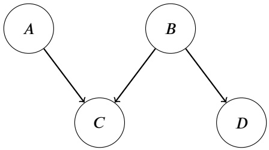

<table><tbody><tr><td rowspan="3" colspan="4"></td><td>𝐴</td><td>𝐵</td><td>𝐶</td><td>𝑃(𝐶|𝐴,𝐵)</td><td rowspan="2" colspan="3"></td></tr><tr><td>0</td><td>0</td><td>0</td><td>0.6</td></tr><tr><td>0</td><td>0</td><td>1</td><td>0.4</td><td>𝐵</td><td>𝐷</td><td>𝑃(𝐷|𝐵)</td></tr><tr><td colspan="2">𝑃(𝐴)</td><td colspan="2">𝑃(𝐵)</td><td>0</td><td>1</td><td>0</td><td>0.4</td><td>0</td><td>0</td><td>0.6</td></tr><tr><td>𝐴 = 0</td><td>0.5</td><td>𝐵 = 0</td><td>0.5</td><td>0</td><td>1</td><td>1</td><td>0.6</td><td>0</td><td>1</td><td>0.4</td></tr><tr><td>𝐴 = 1</td><td>0.5</td><td>𝐵 = 1</td><td>0.5</td><td>1</td><td>0</td><td>0</td><td>0.8</td><td>1</td><td>0</td><td>0.4</td></tr><tr><td rowspan="3" colspan="4"></td><td>1</td><td>0</td><td>1</td><td>?</td><td>1</td><td>1</td><td>0.6</td></tr><tr><td>1</td><td>1</td><td>1</td><td>0.6</td><td rowspan="2" colspan="3"></td></tr><tr><td>1</td><td>1</td><td>0</td><td>0.4</td></tr></tbody></table>

1-0.8=0.2

**(b) (i)** [1 pt] Calculate $P ( C = 1 | A = 1 , B = 0 )$ (the ? entry in the table).

**(ii)** [1 pt] Calculate $P ( A = 1 | B = 0 , D = 1 ) .$

**(c)** Instead of calculating the exact quantity, suppose we want to estimate $P ( C = 1 | D = 1 )$ using different sampling methods.

**(i)** [1 pt] In this subpart we use rejection sampling. Which of the following is a valid topological order and is most efficient for rejection sampling to estimate $P ( C = 1 | D = 1 ) ?$

\# 𝐴, 𝐵, 𝐶, 𝐷 # 𝐵, 𝐴, 𝐷, 𝐶 𝐵, 𝐷, 𝐴, 𝐶 # 𝐷, 𝐶, 𝐵, 𝐴

**(ii)** <u>[1 pt] In this subpart we u</u>se likelihood weighting. What is the weight of the sample $( A = 0 , B = 0 , C = 0 , D = 1 ) ?$

| 0.4 |
| --- |

<!-- page: 7 -->

SID:

**(iii)** [2 pts] In this subpart we use Gibbs sampling. We initialize $A = 0 ,   B = 0 ,   C = 0 ,   D = 1$ , and choose to re-sample <u>𝐴. What is the probability that we still get</u> $A = 0$ <u>after re-sampling?</u>

$$
P (A = 0 | B = 0, C = 0, D = 1) = \frac {P (A = 0 , B = 0 , C = 0)}{\sum_ {a} P (A = a , B = 0 , C = 0)} = \frac {0 . 5 * 0 . 5 * 0 . 6}{0 . 5 * 0 . 5 * 0 . 6 + 0 . 5 * 0 . 5 * 0 . 8} = 3 / 7
$$

**(d)** [2 pts] We reverse the arrow between 𝐵 and 𝐷 to create a new Bayes Net (shown below).

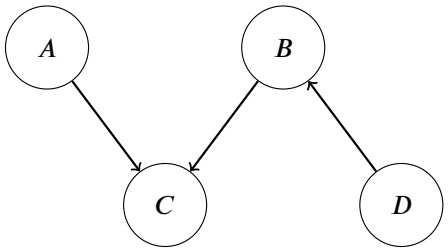

Which of the following statements are true?

O The set of joint distributions 𝑃 (𝐴, 𝐵, 𝐶, 𝐷) that can be modeled by the two Bayes nets are the same.

\# The set of joint distributions that can be modeled by the old Bayes net is a subset of the set of joint distributions that can be modeled by the new Bayes net.

\# The set of joint distributions that can be modeled by the new Bayes net is a subset of the set of joint distributions that can be modeled by the old Bayes net.

None of the above.

<!-- page: 8 -->

## Q3. [14 pts] College Indecision

**(a)** Pacman is paying to enter a lottery for summer classes, and his favorite class, CS 188, is among the 𝑛 possible classes. CS 188 would cost \$10, and all other classes in the lottery cost \$1. Pacman is a rational agent, and his utility function is $U _ { 1 } ( \S x ) = x ^ { 2 }$ , where 𝑥 is the cost of the class that Pacman wins in the lottery.

**(i)** [2 pts] For this subpart only, Pacman would win 1 of 𝑛 possible classes in the lottery. What is the utility of the lottery? You may leave your answer in terms of 𝑛.

$$
\frac {1}{n} \cdot U _ {1} (1 0) + \left(1 - \frac {1}{n}\right) \cdot U _ {1} (1) = \frac {1}{n} 1 0 0 + 1 - \frac {1}{n} 1 = \frac {1}{n} \cdot 9 9 + 1
$$

**(ii)** [2 pts] For this subpart only, Pacman would now win 2 of 𝑛 possible classes in the lottery, and the total utility is the sum of the utility of each class. What is the utility of the lottery? You may leave your answer in terms of 𝑛.

$$
\frac {1}{n} \cdot U _ {1} (1 0) + \left(1 - \frac {1}{n}\right) \left(\frac {1}{n - 1}\right) \cdot U _ {1} (1) + \left[ 1 - \frac {1}{n} - \left(1 - \frac {1}{n}\right) \left(\frac {1}{n - 1}\right) \right] \cdot U _ {1} (1)
$$

$$
= \frac {2}{n} \cdot U _ {1} (1 0) + \left(2 - \frac {2}{n}\right) \cdot U _ {1} (1)
$$

$$
= \frac {1}{n} \cdot 2 0 0 + 2 - \frac {1}{n} \cdot 2 = \frac {2}{n} \cdot 9 9 + 2
$$

**(b)** After taking summer classes, Pacman is deciding his major, which depends on what he finds meaningful (M) and how stressed he is (S). The amount he slept the night before (Z) influences how stressed he is.

**(i)** [2 pts] Select all of the decision networks that can represent Pacman’s decision.

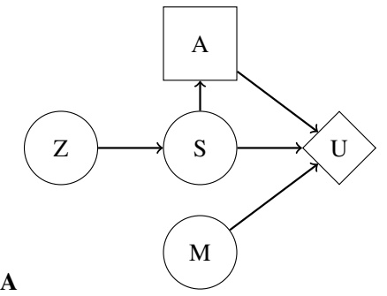

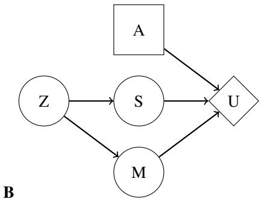

A

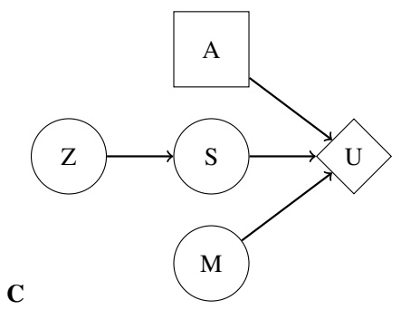

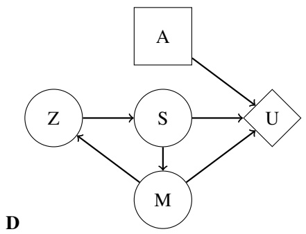

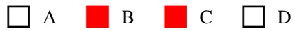

The action should always be completely in our control, so (a) is wrong. (d) has a cycle, so it is not a valid Bayes net. (c) has all the dependencies in the description. (b) has an additional arrow from $\mathbf { Z }$ to M, but Z and M could still be independent.

**(ii)** [3 pts] Pacman keeps track of how long he slept the night before $( Z = z ^ { \prime } )$ . Write out his new MEU as a function of the CPTs corresponding to the decision network.

<!-- page: 9 -->

SID:

$$
E U (a | e) = \sum_ {s} \sum_ {m} P (s, m | z ^ {\prime}) U (a, s, m) = \sum_ {s} \sum_ {m} P (s | z ^ {\prime}) P (m) U (a, s, m)
$$

$$
\max _ {a} E U (a | e) = \max _ {a} \sum_ {s} \sum_ {m} P (s | z ^ {\prime}) P (m) U (a, s, m)
$$

<!-- page: 10 -->

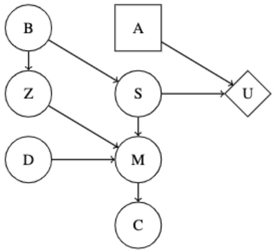

**(c)** For the following statements, select if they are always, sometimes, or never true.

**(i)** [1 pt] **VPI(S)** ≥ **VPI(B)**

Always true

Sometimes true

Never true

Since B only affects the utility through S, the VPI of knowing S directly will always be higher than or equal to the VPI of knowing B.

## (ii) [1 pt] VPI(Z|M) + VPI(Z|B) ≤ VPI(Z|B, M)

Always true

Sometimes true

Never true

Given M, there’s an active path between Z and the utility node. VPI(Z|B) = 0 because given B but not M, there’s no active path between Z and the utility node. Given both, there’s the same active path through M. A case where this is not true: we can construct the CPT for M such that the edge Z-M is disregarded by making $P ( M | S , Z , D ) = P ( M | S , D )$ for all 𝑍. In that case, VPI(Z|B,M) = 0 since the only path Z-B-S is blocked whereas $\mathrm{VPI}(\mathrm{Z} | \mathrm{M}) \geq 0.$

**(d)** [2 pts] Under which of the following conditions (considered independently) can we safely ignore 𝐶 when solving for the MEU?

𝐶 is not an evidence variable

□ 𝐶 is an evidence variable

𝑀 is not an evidence variable

■ 𝑀 is an evidence variable

\# None

We can ignore non-evidence leaf nodes, because they do not affect the MEU. Given M, C does not provide us any additional value.

**(e)** [1 pt] The following question is unrelated to the decision network above. Consider the following lottery $L _ { 1 } = [ 0 . 5 , \S 2 ; 0 . 5 , \S 8 ]$ Indicate whether an agent with utility function $U _ { 2 } ( x )$ is risk-seeking, risk-neutral, or risk-averse on this lottery, where

$$
U _ {2} (x) = \left\{ \begin{array}{l l} 0 & \text {if} x <   0 \\ x ^ {2} & \text {if} 0 \leq x \leq 6 \\ 4 x + 1 2 & \text {if} x > 6 \end{array} \right.\tag{1}
$$

Recall that a lottery $L = [ p _ { 1 } , P _ { 1 } ; p _ { 2 } , P _ { 2 } ]$ represents a situation where Pacman receives prize $P _ { 1 }$ with probability $p _ { 1 }$ , and prize $P _ { 2 }$ with probability $p _ { 2 }$ .

<!-- page: 11 -->

SID:

Risk-seeking

Risk-neutral

Risk-averse

Expected value is $0 . 5   \cdot   \$ 2   +   0 . 5   \cdot   \$ 8   =   \$ 5$ , which is worth $U _ { 2 } ( \S 5 )   =   2 5 .   U _ { 2 } ( L _ { 1 } )   =   0 . 5   \cdot   U _ { 2 } ( \S 2 ) + 0 . 5   \cdot   U _ { 2 } ( \S 8 )   =$ $0.5 \cdot 4 + 0.5 \cdot 44 = 24$ , so Pacman does not take the risk here.

<!-- page: 12 -->

## Q4. [6 pts] Dynamic Bayes Net

We are given the following dynamic Bayes net:

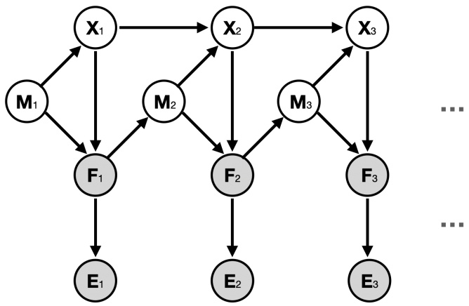

**(a)** [2 pts] Which of the following conditional independence relations are correct?

$$
\square X _ {t + 1} \perp       \perp X _ {t - 1} | X _ {t}
$$

$$
\square F _ {t + 1} \perp \perp F _ {t - 1} | F _ {t}
$$

$E _ { t + 1 } \perp    \perp E _ { t - 1 } | E _ { t }$

$M_{t+1} \perp M_{t-1} | M_t$

O None of the above

Markov property says that future is independent with past given present. From the Bayes net graph we see that given $X _ { i }$ and $M _ { i }$ , which "block" all the path from previous $X _ { i - 1 } ,   M _ { i - 1 } \operatorname { t o } X _ { i + 1 } ,   M _ { i + 1 } ,   X _ { i - 1 } ,   M _ { i - 1 }$ will be independent with $X _ { i + 1 }$ $M _ { i + 1 }$ . However, for F and E we can see that given $F _ { i }$ , there is an active path: $F _ { i - 1 } , M _ { i } , X _ { i } , X _ { i + 1 } , F _ { i + 1 }$

**(b)** [2 pts] Which of the following is the correct update rule for the elapse-time (prediction) update?

$$
\bigcirc \quad P (X _ {t}, M _ {t} | f _ {1: t - 1}, e _ {1: t - 1}) = \sum_ {x _ {t - 1}} P (x _ {t - 1}, X _ {t} | f _ {1: t - 1}, e _ {1: t - 1}) \sum_ {m _ {t - 1}} P (m _ {t - 1}, M _ {t} | f _ {1: t - 1}, e _ {1: t - 1})
$$

$$
\bigcirc \quad P (X _ {t}, M _ {t} | f _ {1: t - 1}, e _ {1: t - 1}) = \sum_ {x _ {t - 1}} P (x _ {t - 1}, m _ {t - 1} | f _ {1: t - 1}, e _ {1: t - 1}) P (M _ {t} | f _ {t - 1}, e _ {t - 1}) P (X _ {t} | x _ {t - 1}, Z _ {t - 1})
$$

$$
\bigcirc \quad P (X _ {t}, M _ {t} | f _ {1: t - 1}, e _ {1: t - 1}) = \sum_ {x _ {t - 1}, m _ {t - 1}} P (x _ {t - 1}, m _ {t - 1} | e _ {t - 1}, f _ {t - 1}) P (M _ {t} | f _ {t - 1}) P (X _ {t} | M _ {t}, x _ {t - 1})
$$

$$
P (X _ {t}, M _ {t} | f _ {1: t - 1}, e _ {1: t - 1}) = \sum_ {x _ {t - 1}, m _ {t - 1}} P (x _ {t - 1}, m _ {t - 1} | e _ {1: t - 1}, f _ {1: t - 1}) P (M _ {t} | f _ {t - 1}) P (X _ {t} | M _ {t}, x _ {t - 1})
$$

$$
P (X _ {t}, M _ {t} | f _ {1: t - 1}, e _ {1: t - 1}) = \sum_ {x _ {t - 1}, m _ {t - 1}} P (x _ {t - 1}, m _ {t - 1} | e _ {1: t - 1}, f _ {1: t - 1}) P (X _ {t}, M _ {t} | m _ {t - 1}, x _ {t - 1}) P (X _ {t} | f _ {t - 1})
$$

$$
\bigcirc \quad P (X _ {t}, M _ {t} | f _ {1: t - 1}, e _ {1: t - 1}) = \sum_ {x _ {t - 1}, m _ {t - 1}} P (x _ {t - 1}, m _ {t - 1} | e _ {1: t - 1}, f _ {1: t - 1}) P (m _ {t - 1} | f _ {t - 1}) P (X _ {t} | M _ {t}, x _ {t - 1})
$$

None of the above.

**(c)** [2 pts] What is the correct update rule for the observation update? From the six options below, select the **minimum set** of options such that, after multiplying them and normalizing, gives $P ( X _ { t } , M _ { t } | f _ { 1 : t } , e _ { 1 : t } )$

$$
\square P (x _ {t - 1}, m _ {t - 1} | e _ {1: t - 1}, f _ {1: t - 1})
$$

■ $P ( f _ { t } | X _ { t } , M _ { t } )$

□ $P ( e _ { t } | f _ { t } )$

$P ( M _ { t } | f _ { t - 1 } )$

□ $P ( X _ { t } | M _ { t } , x _ { t - 1 } )$

■ $P ( X _ { t } , M _ { t } | f _ { 1 : t - 1 } , e _ { 1 : t - 1 } )$

None of the above.

<!-- page: 13 -->

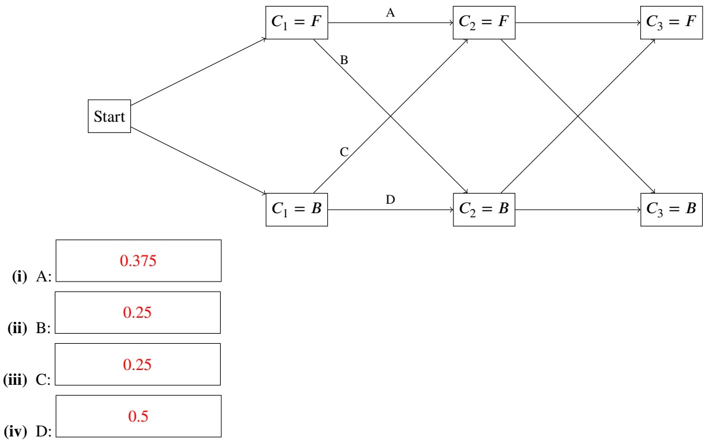

## Q5. [6 pts] Fair or Biased?

We have two indistinguishable coins. The fair coin (𝐹) has 0.5 probability for getting either heads or tails; the biased coin (𝐵) always gives tails.

Our friend Angela did 3 coin flips, each time with either the fair or the biased coin, but we do not know which. We use $C _ { t }$ $( t   =   1 , 2 , 3 )$ to represent the coin that Angela chooses for the $t ^ { \mathrm { t h } }$ coin flip. We do know, however, that Angela picks the fair or biased coin with equal probability for the first flip (i.e. $P ( C _ { 1 }   =   F )   =   P ( C _ { 1 }   =   B )   =   0 . 5 )$ , and chooses the coin at each subsequent timestep according to the following probability table:

| 𝐶𝑡 | 𝐶𝑡+1 | 𝑃(𝐶𝑡+1\|𝐶𝑡) |
| --- | --- | --- |
| 𝐹 | 𝐹 | 0.75 |
| 𝐹 | 𝐵 | 0.25 |
| 𝐵 | 𝐹 | 0.5 |
| 𝐵 | 𝐵 | 0.5 |

We also observe the outcomes of the flips to be **(Head, Tail, Tail)**. We want to use the Viterbi algorithm to infer the most likely sequence of coins that Angela picked to flip.

**(a)** [2 pts] Shown below is the full Trellis Diagram. Fill in the values for each labeled arc connecting $C _ { 1 }$ to $C _ { 2 }$ with the product of the transition probability and the observation likelihood at the second coin flip (as seen in lecture). Recall that the observation at timestep 1 is **Head** and observation at timestep 2 is **Tail**.

**(b)** [2 pts] What is the most likely sequence of coin<u>s? Your answer should b</u>e a 3-character string, e.g. "BBF" means the first FFF two coin flips are biased while the third is fair.

**(c)** [2 pts] Which of the following is true about the Viterbi algorithm in general?

■ The time complexity of Viterbi is linear with regard to the number of time steps.

□ The time complexity of Viterbi is linear with regard to the size of the state space.

The space complexity of Viterbi is linear with regard to the size of the state space.

□ The Viterbi algorithm computes arg max $_ { 1 x _ { 1 : N } } P ( e _ { 1 : N } | x _ { 1 : N } )$ , where 𝑥 are the states and 𝑒 are the observations.

None of the above.

<!-- page: 14 -->

## Q6. [12 pts] Reinforcement Learning

**(a)** In the directed graph below, we formulate the problem of commuting in the Bay Area as a simple MDP, where the cities (nodes) represent the states, and the arrows represent possible actions. We will use the direction of the arrows in the graph, i.e., "up", "down", "left", and "right" to refer to the actions.

**(i)** [2 pts] Let’s assume that the agent does not always succeed in every action, and we want to build an estimate of the transition function 𝑇̂ and reward function 𝑅̂ from data (for model-based reinforcement learning). The agent follows some policy 𝜋 to collect a dataset of (current state, action, next state, reward) tuples, as listed below.

| s | a | s' | Reward |
| --- | --- | --- | --- |
| San Francisco | up | Oakland | -4 |
| San Francisco | up | San Mateo | -3 |
| San Mateo | up | San Francisco | -5 |
| Oakland | down | San Francisco | -2 |
| San Francisco | up | San Mateo | -3 |
| San Francisco | right | San Mateo | -6 |

**(1)** What is 𝑇̂ (San Francisco, up, Oakland)?

${ \frac { 1 } { 3 } } ,$ since out of the 3 times we take the up action from SF, only once do we actually end up in Oakland.

**(2)** What is $\hat { R } ( \mathrm { S a n }$ Francisco, up, Oakland)?

**(ii)** [1 pt] We decide to use temporal difference learning instead to learn the values of 𝜋. Assume we start with the following values for each state:

| 𝑠 | Berkeley | Oakland | Hayward | Fremont | San Jose | San Francisco | San Mateo | Palo Alto |
| --- | --- | --- | --- | --- | --- | --- | --- | --- |
| 𝑉𝜋(𝑠) | -2 | -8 | -7 | -3 | -1 | -2 | -6 | -1 |

We do one update step with the sample **(San Francisco, up, Oakland, -4)**. Assume discount factor 𝛾 = 0.9 and the learning rate 𝛼 = 0.5. What is the updated value of 𝑉𝜋(San Francisco)?

sample = 𝑅(San Francisco, up, Oakland) + 0.9 ⋅ 𝑉𝜋(Oakland) = −4 + 0.9 ⋅ −8 = −11.2. Then,

𝑉𝜋(San Francisco) ← (1 − 𝛼)𝑉𝜋(San Francisco) $+ \alpha \cdot ( { \mathrm { s a m p l e } } ) = 0 . 5 \cdot - 2 + 0 . 5 \cdot - 1 1 . 2 = - 6 . 6 .$

**(iii)** [2 pts] Which of the following are true about temporal difference learning and Q-learning?

■ Q-learning can learn an optimal policy even if the dataset contains some sub-optimal actions.

□ Q-learning is an on-policy algorithm.

□ Temporal difference learning returns an optimal policy.

■ Temporal difference learning often leads to faster convergence than direct evaluation.

None of the above

<!-- page: 15 -->

(1): We still take the max across all valid actions, so taking suboptimal actions doesn’t hinder our ability to learn an optimal policy. (2): Q-learning is an off-policy algorithm. (3): We need Q-values to learn an optimal policy, and TD-learning returns values, which aren’t sufficient. (4): True.

**(iv)** [2 pts] We want to use an exploration function to give some preference to visiting less-visited state-action pairs. Which of the following exploration functions 𝑓 permit this behavior? Assume 𝑘 is some positive real number, $N ( s , a )$ represents the number of times that state-action pair (𝑠, 𝑎) has been taken, and 𝜖 is a very small number (say 0.0001) to avoid division by zero.

$$
\square f (s, a) = k \cdot Q (s, a)
$$

$$
\square f (s, a) = k \cdot Q (s, a) \cdot N (s, a)
$$

$$
f (s, a) = Q (s, a) + \frac {k}{N (s , a) + \epsilon}
$$

$$
\square f (s, a) = Q (s, a) + k \cdot N (s, a)
$$

$$
f (s, a) = Q (s, a) + k \cdot e ^ {- N (s, a)}
$$

$$
\bigcirc \quad \text {None of the above}
$$

(1): Only Q-states are used (𝑘 is a scaling factor applied to all state-action pairs, so it doesn’t affect which action is chosen), so exploration isn’t encouraged. (2): The value keeps amplifying the more times a route is explored, which will eventually cause only one route to be explored all the time. (3): This creates the desired effect, since as $N ( s , a )$ increases, the benefit of exploration (initially 𝑘) contracts to 0. (4): Same as (2). (5): The exponential function of a negative exponent creates the same monotonically decreasing effect as (3).

**(b)** Recall the policy improvement step:

$$
\pi_ {i + 1} (s) = \arg \max _ {a} \sum_ {s ^ {\prime}} T (s, a, s ^ {\prime}) [ R (s, a, s ^ {\prime}) + \gamma V ^ {\pi_ {i}} (s ^ {\prime}) ]
$$

**(i)** [2 pts] Which of the following modifications to the reward value $R ( s , a , s ^ { \prime } )$ in the equation above will not affect the policy chosen in policy improvement? Note that we are still using the old unmodified reward $R ( s , a , s ^ { \prime } )$ during policy evaluation. Assume that 𝑘 is a real number and $k > 0$

$$
R (s, a, s ^ {\prime}) + k
$$

$$
R (s, a, s ^ {\prime}) - k
$$

$$
\square k \cdot R (s, a, s ^ {\prime})
$$

$$
\square R (s, a, s ^ {\prime}) / k
$$

$$
\square R (s, a, s ^ {\prime}) ^ {k}
$$

$$
\bigcirc \quad \text {None of the above}
$$

(1) and (2): Adding or subtracting a positive constant will not affect the relative maximum among possible policies since every original $Q ( s , a )$ gets changed to $Q ( s , a ) \pm k$ for all actions 𝑎.

(3) and (4): Consider a deterministic setup with action $a _ { 1 }$ that has reward $R ( s , a _ { 1 } , s ^ { \prime } ) = 0$ and $V ^ { \pi } ( s ^ { \prime } ) = 1 0$ vs. an action $a _ { 2 }$ that has reward $R ( s , a _ { 2 } , s ^ { \prime } ) = 2$ and $V ^ { \pi } ( s ^ { \prime } ) = 1$ (note that $s ^ { \prime }$ is different in each case since for simplicity of this counterexample we are assuming determinisitic and we are comparing two different actions). Making 𝑘 a large number would cause $R ( s , a _ { 2 } , s ^ { \prime } )$ to increase without changing the value of $a _ { 1 }$ so for $k > 5$ , the policy would change. Same idea for dividing by 𝑘 would apply for a value of $k = 1 / 1 5$ Since we do not modify the reward during policy evaluation, $V ^ { \pi } ( s ^ { \prime } )$ is consistent with what it was before.

(5) Same argument as above.

**(ii)** [3 pts] Which of the following expressions below is equivalent to $V ^ { \pi _ { i } } ( s ^ { \prime } ) ?$ Assume that $0 < \alpha < 1$

$$
Q ^ {\pi_ {i}} (s ^ {\prime}, \pi_ {i} (s ^ {\prime}))
$$

$$
\square \max _ {a ^ {\prime}} Q ^ {\pi_ {i}} (s ^ {\prime}, a ^ {\prime})
$$

$$
\sum_ {s ^ {\prime \prime}} T (s ^ {\prime}, \pi_ {i} (s ^ {\prime}), s ^ {\prime \prime}) [ R (s ^ {\prime}, \pi_ {i} (s ^ {\prime}), s ^ {\prime \prime}) + \gamma V ^ {\pi_ {i}} (s ^ {\prime \prime}) ]
$$

$$
\square \max _ {a ^ {\prime}} \sum_ {s ^ {\prime \prime}} T (s ^ {\prime}, a ^ {\prime}, s ^ {\prime \prime}) [ R (s ^ {\prime}, a ^ {\prime}, s ^ {\prime \prime}) + \gamma V ^ {\pi_ {i}} (s ^ {\prime \prime}) ]
$$

$$
\square \quad (1 - \alpha) \cdot V ^ {\pi_ {i}} (s ^ {\prime}) + \alpha \cdot [ R (s ^ {\prime}, a ^ {\prime}, s ^ {\prime \prime}) + \gamma V ^ {\pi_ {i}} (s ^ {\prime \prime}) ]
$$

None of the above

(1) and (3): Correct since these are the equations for policy evaluation.

(2) and (4): Taking the max over actions $a ^ { \prime }$ will return the value for the best $a ^ { \prime } ,$ not necessarily the action corresponding to the current policy $\pi _ { i } ( s ^ { \prime } )$ , so these are incorrect.

<!-- page: 16 -->

(5): This is the equation for temporal difference learning which is incorrectly used in this context since we do not use a list of samples during policy evaluation for $V ^ { \pi _ { i } } ( s ^ { \prime } )$ . Also, the last term $R ( s ^ { \prime } , a ^ { \prime } , s ^ { \prime \prime } )   +   \gamma V ^ { \pi _ { i } } ( s ^ { \prime \prime } )$ ≠ $\begin{array} { r } { \sum _ { s ^ { \prime \prime } } T ( s ^ { \prime } , \pi _ { i } ( s ^ { \prime } ) , s ^ { \prime \prime } ) [ R ( s ^ { \prime } , \pi _ { i } ( s ^ { \prime } ) , s ^ { \prime \prime } ) + \gamma V ^ { \pi _ { i } } ( s ^ { \prime \prime } ) ] } \end{array}$

<!-- page: 17 -->

## Q7. [8 pts] So Many Derivatives

Consider the neural network configuration below.

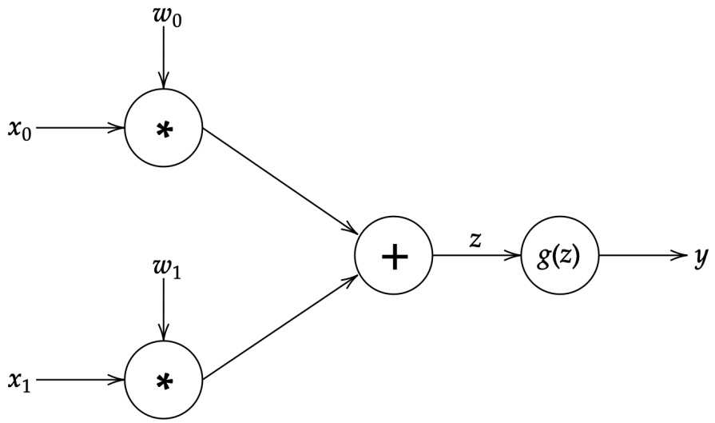

(a) [2 pts] Which of the following decision boundaries can be learned by the neural network? Assume $w _ { 0 } , w _ { 1 } , x _ { 0 } , x _ { 1 } , T _ { a } \in \mathbb { R } ^ { n }$ and $z = w _ { 0 } x _ { 0 } + w _ { 1 } x _ { 1 }$ . Let $g ( z )$ be the binary step activation function with $T _ { a }$ as the decision threshold, which is defined as follows:

$$
g (z) = \left\{ \begin{array}{l} 1 \text {if} z \geq T _ {a} \\ 0 \text {if} z <   T _ {a} \end{array} \right.
$$

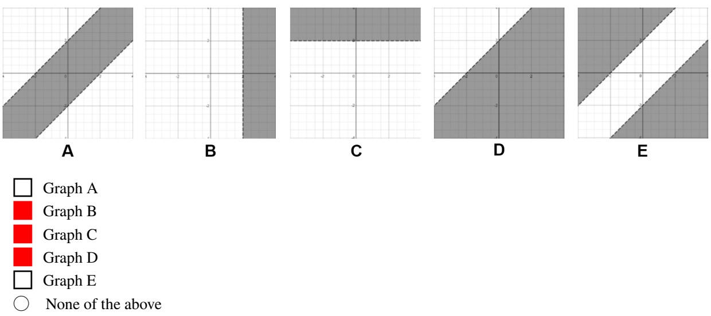

(b) Now let 𝑔(𝑧) be the sigmoid activation function and y be a real number value between 0 and 1 (we will ignore the threshold $T _ { a }$ for this part). Recall that the derivative of the sigmoid function is $\begin{array} { r } { \frac { \partial } { \partial z } g ( z ) = g ( z ) \cdot ( 1 - g ( z ) ) } \end{array}$ . You can represent your answers in terms of $x _ { 0 } , x _ { 1 } , w _ { 0 } , w _ { 1 } , z , \operatorname { o r } y$

**(i)** [2 pts] Calculate the following partial derivatives for backpropagation.

$$
\begin{array}{l} \text {(1)} \quad \frac {\partial y}{\partial z} = \boxed {y (1 - y)} \\ \text {(2)} \quad \frac {\partial z}{\partial w _ {0}} = \boxed {x _ {0}} \end{array}
$$

<!-- page: 18 -->

**(ii)** [2 pts] Suppose we are running gradient **descent** on the neural network above. We are trying to minimize the upstream loss 𝐿 using learning rate 𝛼. Given the upstream gradient $\frac { \partial L } { \partial y }$ and the two partial derivatives that you computed in the previous part $( \frac { \partial y } { \partial z } \mathrm { ~ a n d ~ } \frac { \partial z } { \partial w _ { 0 } } )$ , determine the gradient descent update rule for $w _ { 0 }$

$$
w _ {0} - \alpha \cdot \frac {\partial L}{\partial y} \frac {\partial y}{\partial z} \frac {\partial z}{\partial w _ {0}}
$$

**(c)** [2 pts] The Binary Perceptron is defined as the following:

$$
y = \text {classify} (x) = \left\{ \begin{array}{l l} + 1 & \text {if} w \cdot f (x) + b \geq 0 \\ - 1 & \text {if} w \cdot f (x) + b <   0 \end{array} \right.
$$

where 𝑤 is a vector of real-valued weights, $w \cdot f ( x )$ is the dot product $\textstyle \sum _ { i = 1 } ^ { m } w _ { i } f _ { i } ( x )$ where 𝑚 is the number of features, $f _ { i } ( x )$ is the 𝑖th feature of $x ,$ and 𝑏 is the bias.

Which of the following are true about the binary perceptron as defined above?

□ It is possible that the perceptron learns a decision boundary that is nonlinear in terms of the features $f ( x )$

■ It is possible that the perceptron learns a decision boundary that is nonlinear in terms of the data 𝑥.

■ The perceptron algorithm is guaranteed to converge if the data is linearly separable.

□ The perceptron algorithm is trained using gradient descent.

None of the above

<!-- page: 19 -->

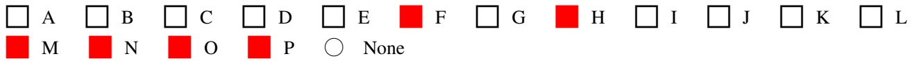

## Q8. [15 pts] Settlers of Catan

Sid, Perry, and Andrew are playing a board game. Each terminal state (leaf) has 2 values, $x _ { 1 }$ and $x _ { 2 }$

Each player has the following utilities:

• Sid’s utility function is $U _ { s } = + x _ { 1 }$

• Perry’s utility function is $U _ { p } = - x _ { 1 }$

• Andrew’s utility function is $U _ { a } = x _ { 2 } + r \cdot x _ { 1 }$ , where $0 < r < 1$

Consider the following game tree, with the upward-pointing triangle representing Sid, downwards-pointing triangle representing Perry, and the right-pointing triangle representing Andrew.

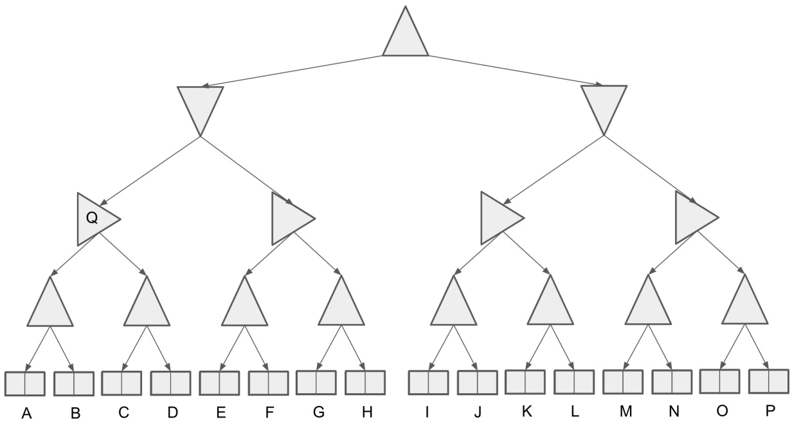

(a) [1 pt] This is a zero-sum game. # True False

**(b)** Let terminal state values be represented in the form $[ x _ { 1 } , x _ { 2 } ]$ . For this part only, assume the leaves $A   =   [ 3 , 1 0 ] , B   =$ [4, 5], 𝐶 = [6, 6] and $D = [ 9 , 4 ]$

(i) [1 pt] If 𝑟 = 0.5, Which terminal state’s values will Q take on? $\begin{array} { r } { \begin{array} { r l r l r l } { \bigcirc } & { { } \mathbf { A } } & { } & { { } \bigcirc } & { \mathbf { B } } & { } & { { } \bigcirc } & { \mathbf { C } } \end{array} } \end{array}$ D

**(ii)** [2 pts] What value of 𝑟 would make Andrew indifferent between choosing left or right at node 𝑄?

$$
\boxed {5 + 4 r = 4 + 9 r, r = 0. 2}
$$

**(c)** [4 pts] Assuming the terminal state values are unbounded, mark which leaf nodes can be potentially pruned, under some set of values.

𝐴, 𝐵, 𝐶, and 𝐷 cannot be pruned because we must establish an option (node 𝑄) for the left minimizer node. 𝐹 and 𝐻 can be pruned if 𝐸 and 𝐺, respectively, are worse choices for the minimizer than the value at node 𝑄. 𝐼, 𝐽, 𝐾, and 𝐾 cannot be pruned by the same reasoning of 𝐴, 𝐵, 𝐶, and 𝐷. 𝑀, 𝑁, 𝑂, and 𝑃 can all be pruned away if the value of the right minimizer node’s left child’s is worse for the maximizer than the value at the left minimizer node.

<!-- page: 20 -->

**(d)** [2 pts] Let $[ x _ { 1 , i } , x _ { 2 , i } ]$ represent the values at leaf node 𝑖. When Sid and Perry both act optimally according to their own utilities, for which of the following values of $x _ { 2 , i }$ does Andrew act as a maximizer for Sid? For this part, assume that the first value $x _ { 1 , i }$ for all leaf nodes 𝑖 is a positive real number.

$$
x _ {2, i} = x _ {1, i} \forall i
$$

$$
x _ {2, i} = x _ {1, i} ^ {2} \forall i
$$

$$
x _ {2, i} = \sqrt {x _ {1 , i}} \forall i
$$

$\begin{array} { r } { x _ { 2 , i } = \frac { 1 } { x _ { 1 , i } } \forall i } \end{array}$

None of the above

Any monotonically increasing function will guarantee that Andrew acts as a maximizer for the higher value of $x _ { 1 }$

**(e)** Sid decides to run Monte-Carlo Tree Search to train an agent to play for him. He counts the rollouts and the number of favorable outcomes from each node. The current search tree is shown below. Note that the fractions at every node represent the win rates for Sid, the root maximizer. You may assume that Andrew never wins the game, so the complement of Sid’s win rate is Perry’s win rate.

As a reminder, the UCB heuristic is $\mathit { U C B } ( n ) = \frac { U ( n ) } { N ( n ) } + k \sqrt { l o g \frac { N ( \mathit { P A R E N T } ( n ) ) } { N ( n ) } }$ where 𝑁(𝑛) is the number of rollouts at node 𝑛, PARENT (𝑛) is the parent node of $n ,$ and $U ( n )$ the rollout utility (# wins) for the player at PARENT(𝑛).

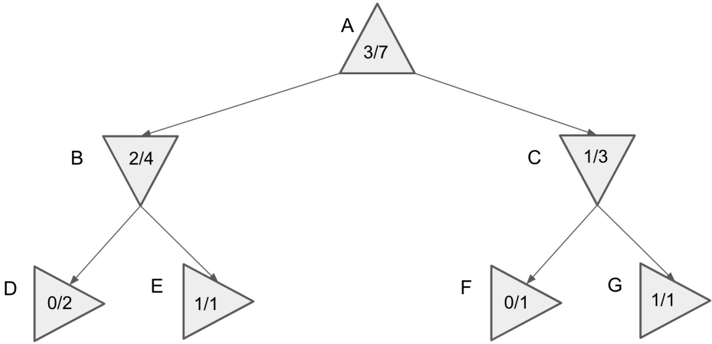

**(i)** [1 pt] If the MCTS algorithm ended now, which action would our agent choose? Left # Right

**(ii)** [2 pts] If 𝑘 = 188 in our UCB heuristic, which node will be expanded next?

\# A # B # C # D # E F # G

Since k is so large, UCB will favor the least explored nodes

(iii) [1 pt] In MCTS, a greater 𝑘 value incentivizes greater exploitation over exploration. # True False

(iv) [1 pt] When using the UCB heuristic at a node $p ,$ if all child nodes of 𝑝 have the same utility 𝑈(𝑛), then the child node with largest 𝑁(𝑛) will be expanded in the rollout as long as $k > 0 . \bigcirc$ True False
