<!-- page: 1 -->

Solutions last updated: Monday, December 18

• You have 170 minutes.

• The exam is closed book, no calculator, and closed notes, other than four double-sided cheat sheets that you may reference.

• For multiple choice questions,

means mark **all options** that apply

means mark a single choice

| First name |  |
| --- | --- |
| Last name |  |
| SID |  |
| Name of person to the right |  |
| Name of person to the left |  |
| Discussion TAs (or None) |  |

**Honor code**: “As a member of the UC Berkeley community, I act with honesty, integrity, and respect for others.”

By signing below, I affirm that all work on this exam is my own work, and honestly reflects my own understanding of the course material. I have not referenced any outside materials (other than my cheat sheets), nor collaborated with any other human being on this exam. I understand that if the exam proctor catches me cheating on the exam, that I may face the penalty of an automatic "F" grade in this class and a referral to the Center for Student Conduct.

Signature:

Point Distribution

| Q1. Search: Squirrel Shenanigans | 11 |
| --- | --- |
| Q2. CSPs and BNs: Bayes for Days | 11 |
| Q3. MDPs and BNs: Coin Blackjack | 10 |
| Q4. RL: Rest and ReLaxation | 14 |
| Q5. Bayes' Nets: Pac Pong Performance | 16 |
| Q6. HMMs and VPI: Markov Menagerie | 13 |
| Q7. Games and ML: BeatBlue | 12 |
| Q8. Potpourri | 13 |
| Total | 100 |

It’s testing time for our CS188 robots! Circle your favorite robot below. (ungraded, just for fun)

<!-- page: 2 -->

## Q1. [11 pts] Search: Squirrel Shenanigans

A squirrel is moving around on a grid representing the UC Berkeley campus, picking up and dropping off nuts, in order to store nuts in its nest for the upcoming winter.

At the start of the problem, each square on the 𝑀 × 𝑁 grid contains between 0 and 𝐴 nuts, inclusive. (𝐴 is some constant that is fixed for the entire problem.) There cannot be more than 𝐴 nuts on any square at any time.

At the start of the problem, the squirrel is carrying 0 nuts. The squirrel can only carry between 0 and 𝐴 nuts, inclusive, at any time.

The squirrel has the following actions available, and every action costs 1:

• Pick up any number of nuts from the current square (as long as the total number of nuts carried does not exceed 𝐴).

• Drop off any number of carried nuts onto the current square (as long as the total number of nuts on the square does not exceed 𝐴).

• When the squirrel is carrying 𝐶 nuts, the squirrel can move 1 to 𝐴 − 𝐶 + 1 squares in any of the four cardinal directions (up, down, left, right).

The squirrel’s goal is to reach a state where the nest square contains 𝐴 nuts. The nest square is always fixed to be the top-left corner of the grid.

Here is an example, though your answers should work for any arbitrary problem, not just the example shown.

In this example only, assume 𝐴 = 4, the squirrel is currently carrying 𝐶 = 2 nuts, and there are 3 additional nuts on the square the squirrel is on.

Possible actions from this state (each costing 1):

• Pick up 1 or 2 nuts from the current square. (The squirrel can’t pick up 3 nuts, because it can’t hold more than 4 nuts.)

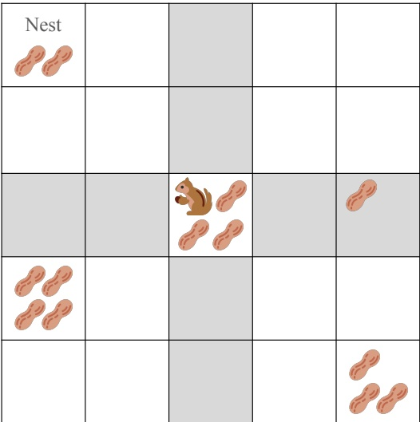

• Drop off 1 nut on the current square. (The squirrel can’t drop off 2 nuts, because the square can’t hold more than 4 nuts.)

• Move to any of the shaded squares (𝐴 − 𝐶 + 1 = 2 squares in each of the cardinal directions).

**(a)** [2 pts] For this subpart only, assume 𝑁 > 𝐴 and 𝑀 > 𝐴 (the board is very large). What is the maximum branching factor for this search problem?

\# 1 # 4 # 𝐴 + 4 # 4𝐴 + 4

5𝐴 + 4 # 𝑀𝑁 # 𝑀𝑁 + 𝐴 # 𝐴𝑀𝑁

$$
5 A + 4
$$

The maximum branching factor occurs when the squirrel is holding 0 nuts and is on a square with 𝐴 nuts.

In this scenario, the squirrel can pick up between 1 and 𝐴 nuts, giving 𝐴 actions. The squirrel can also move up to 𝐴 + 1 squares in each of the four directions, giving 4(𝐴 + 1) actions. In total, we have 𝐴 + 4(𝐴 + 1) = 5𝐴 + 4 actions.

The square having 𝐴 nuts creates the maximum branching factor for the squirrel, because each fewer nut reduces the number of actions available by 1 (the squirrel has one fewer choice of number of nuts to pick up).

0 nuts creates the maximum branching factor for the squirrel, because each additional nut the squirrel holds reduces the net number of actions it has available by 3 (the squirrel gains 1 additional action for an extra nut it can drop, but loses 4 actions for range the squirrel loses in each of the cardinal directions).

<!-- page: 3 -->

**(b)** [1 pt] True or false: The squirrel’s location needs to be part of the state space.

True, because it’s needed for the successor function.

True, because it’s needed for the goal test.

\# False, because it’s not needed for the successor function.

False, because it’s not needed for the goal test.

The squirrel location is needed so that the successor function can generate new states with new squirrel locations. Note that the squirrel location is not needed for the goal test, because the goal test only needs to check the nest square to see if it contains 𝐴 nuts.

<!-- page: 4 -->

The actions available (each costing 1), repeated for your convenience:

• Pick up any number of nuts from the current square (as long as the total number of nuts carried does not exceed 𝐴).

• Drop off any number of carried nuts onto the current square (as long as the total number of nuts on the square does not exceed 𝐴).

• When the squirrel is carrying 𝐶 nuts, the squirrel can move 1 to 𝐴 − 𝐶 + 1 squares in any of the four cardinal directions (up, down, left, right).

**(c)** [2 pts] Give a reasonably tight upper-bound on the size of the minimal state space.

Your answer should be in the form 𝑝 ⋅ 𝑞𝑟, where 𝑝, 𝑞, 𝑟 are expressions that possibly include 𝑀, 𝑁, 𝐴, constants, and arithmetic operators (add, subtract, multiply, divide).

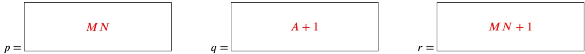

• 𝑀𝑁: Represent the squirrel location. The squirrel can be in 𝑀𝑁 possible squares.

$( A + 1 ) ^ { M N + 1 }$ : Represent the number of nuts on each square, and the number of nuts the squirrel is carrying. For each of the 𝑀𝑁 squares, store a number between 0 and 𝐴, inclusive. For the squirrel, also store one more number between 0 and 𝐴, inclusive. In total, each number has 𝐴 + 1 possibilties (between 0 and 𝐴), and there are 𝑀𝑁 + 1 such numbers to store (one for each of the 𝑀𝑁 squares, plus one for the squirrel).

• **Alternate answers:** We also accepted 𝑝 = 𝑀𝑁(𝐴 + 1) and 𝑟 = 𝑀𝑁 since you can get the same solution with these values.

**(d)** [3 pts] Select all of the admissible heuristics.

□ 𝐴, minus the number of nuts on the nest square.

□ 0 if the nest has 𝐴 nuts. Otherwise, Manhattan distance to the closest non-nest square containing nuts.

□ 0 if the nest has 𝐴 nuts. Otherwise, Manhattan distance to the furthest non-nest square containing nuts.

None of the above

Option 1: False. Consider this counterexample: The squirrel is on the nest square. The squirrel is carrying 𝐴 nuts. The nest square contains 0 nuts.

The heuristic would be 𝐴 − 0 = 𝐴. However, the actual cost to the goal is 1: the squirrel could drop off all 𝐴 nuts in a single action, costing 1.

Options 2 and 3: False. Consider this counterexample: The squirrel is carrying 1 nut, and is 1 square south of the nest square. The nest square contains 𝐴 − 1 nuts. There is one other non-nest square with nuts, but it’s very far away.

The heuristic would be very large, since the closest/furthest non-nest square (which are the same, it’s the only non-nest square) is very far away.

However, the actual cost to the goal is 2: The squirrel could move into the nest square, and then drop off 1 nut.

**(e)** [3 pts] For this subpart only, suppose we change the search problem: The squirrel is now only able to drop off or pick up a single nut in one time step.

Select all algorithms that can be used to find an optimal solution to this modified problem.

□ Leave the successor function unchanged from the original problem, and run UCS.

Modify the successor function so that the squirrel can only pick up or drop off one nut at a time (costing 1 each time). Then, run BFS with the modified successor function.

■ Modify the costs in the successor function so that picking up or dropping off 𝑘 nuts costs 𝑘, instead of 1. Then, run UCS with the modified successor function.

\# None of the above

<!-- page: 5 -->

UCS on the original problem won’t work, because in the original problem, picking up 𝑘 nuts still costs 1.

If we modify the successor function so that the squirrel can only pick up or drop off one nut at a time, then all costs are 1, and the successor function models the new costs (i.e. picking up 𝑘 nuts now costs 𝑘 actions). Since all costs are 1 again, BFS on this modified successor function will return an optimal solution.

If we modify the costs in the successor function, then we can use UCS to return an optimal solution, since UCS will account for different costs.

<!-- page: 6 -->

# Q2. [11 pts] CSPs and BNs: Bayes for Days

Consider the following incomplete Bayes’ net, with four random variables, and four edges that do not have directions yet:

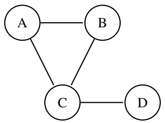

**(a)** [1 pt] How many undirected paths are there between A and D? # 1 ● 2 # 3 # 4 # > 4

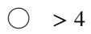

2. ABCD, and ACD.

**(b)** [2 pts] How many possible ways are there to assign directions to the arrows, such that A and D are independent?

3. Considering both paths ACD and ABCD, we know ACD has to be a common effect triple. Now there are 3 configurations for ABC, excluding the configuration that results in a cycle. Both configurations where B points to C work because BCD is inactive, and if C points to B, ABC is inactive.

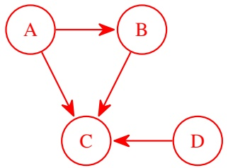

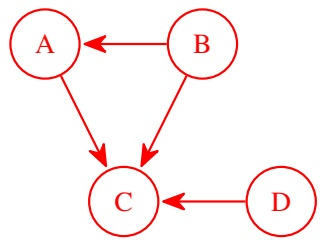

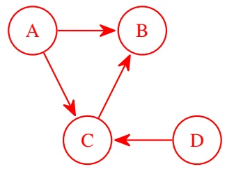

For the rest of the question, consider the following incomplete Bayes’ net:

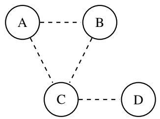

To complete this Bayes’ net, each pair of variables connected by a dashed line can be filled in with an edge (in either direction), or no edge. Here are some examples of completed Bayes’ nets:

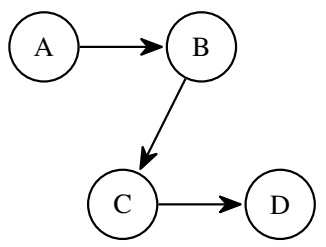

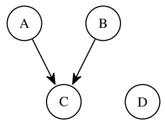

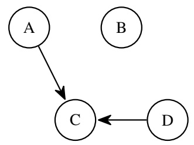

<!-- page: 7 -->

<!-- page: 8 -->

The Bayes’ net, repeated for your convenience:

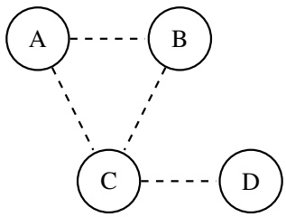

We would like to use a CSP to find a way to complete this Bayes’ net.

**(c)** [1 pt] What are the variables in this CSP? The 4 dashed edges The 4 random variables (A, B, C, D) The conditional independence assumptions

**(d)** [1 pt] How many possible values can each variable take on in this CSP? # 1 # 2 3 # 4 # > 4

3. Each pair of variables can be connected with no edge, an edge in one direction, or an edge in the other direction. For example, the dashed line between A and B could be filled in with no edge, or an edge A → B, or an edge A ← B.

For each of the following statements, select all type(s) of constraints that are needed to represent that statement in the CSP. Each statement is independent.

Note for later: something about minimal constraint, because technically you can use a four-way constraint to write a unary constraint.

**(e)** [2 pts] The graph must be acyclic. Unary constraint Binary constraint

Three-way constraint Four-way constraint

The only potential cycle in the graph is between A B and C. This introduces a constraint between AB, BC, and AC, since those three edges could potentially form a cycle. Note that the CD edge is not relevant to this constraint; no matter how we assign the CD edge, it will not introduce a cycle

**(f)** [2 pts] A and B are independent. ■ Unary constraint Binary constraint

Three-way constraint Four-way constraint

None of the above

This introduces a unary constraint, because the AB edge must be unfilled. This also introduces a binary constraint, because AC and BC cannot be connected in a way that introduces an active path ACB.

**(g)** [2 pts] A and D are independent.

<!-- page: 9 -->

The ACD path needs to be blocked, which introduces a binary constraint on AC and CD. The ABCD path needs to be blocked, which introduces a three-way constraint on AB, BC, and CD.

<!-- page: 10 -->

## Q3. [10 pts] MDPs and BNs: Coin Blackjack

Consider the following game (similar to blackjack):

• You begin the game with a score of 0 points.

• At every time step, you can choose to flip a coin, or end the game with reward equal to your current score.

• When you choose to flip: if the coin comes up heads, then 1 point is added to your score. If the coin comes up tails, then 2 points are added to your score.

• If your score ever reaches 4 or more points, you bust and end the game with 0 reward.

There are two coins: a fair coin that comes up heads exactly half of the time, and a biased coin that comes up heads more than half of the time.

Each time you choose to flip a coin, the dealer will first randomly select one of the two coins, and then flip the chosen coin for you. The probability that the dealer selects the fair or biased coin depends on two things: the coin used on the previous flip, and your current score (before flipping).

The randomness of the coin flip can be modeled by the following Bayes’ net:

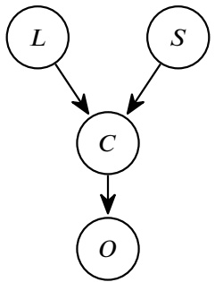

• 𝐿: The coin that was last used on the previous flip (fair or biased).

• 𝑆: The current score (0, 1, 2, or 3).

• 𝐶: The selected coin (fair or biased).

• 𝑂: The outcome of the coin flip (heads or tails).

**(a)** [1 pt] From the Bayes’ net, what is the most efficient way to learn the probability that the biased coin comes up heads? (CPT = conditional probability table)

Read the value from the CPT in the 𝐶 node.

Read the value from the CPT in the 𝑂 node.

Perform variable elimination with 𝐶 unobserved.

\# Perform variable elimination with 𝐶 observed as evidence.

This probability is not in the Bayes’ net.

The CPT corresponding to the 𝑂 node is 𝑃 (𝑂|𝐶), which would contain an entry telling you the probability of flipping heads, given that the coin is biased.

We choose to model this game as an MDP. For each transition, select the corresponding transition probability.

**(b)** [2 pts] State: The biased coin was last used. The current score is 1.

Action: Flip.

Successor state: The fair coin was last used. The current score is 3.

\# 0

O $P ( C = \mathrm { f a i r } | L = \mathrm { b i a s e d } , S = 1 ) \cdot P ( O = \mathrm { t a i l s } | C = \mathrm { f a i r } )$

#∑𝑐 𝑃 (𝐶 = 𝑐|𝐿 = biased, 𝑆 = 1) ⋅ 𝑃 (𝑂 = tails|𝐶 = 𝑐)

$\begin{array} { r } { \sum _ { l } P ( C = \mathrm { f a i r } | L = l , S = 1 ) \cdot P ( O = \mathrm { t a i l s } | C = \mathrm { f a i r } ) } \end{array}$

\## 1

<!-- page: 11 -->

We’re looking for the probability that the fair coin was chosen (since the fair coin was last used after the transition), and tails was flipped (since the score increased by 2). Both of these probabilities, given the current state (biased coin, current score is 1, fair coin is chosen), can be found in the Bayes’ net.

$$
P (C = \text { fair } | L = \text { biased }, S = 1) \cdot P (O = \text { tails } | C = \text { fair })
$$

<!-- page: 12 -->

The Bayes’ net, repeated for your convenience:

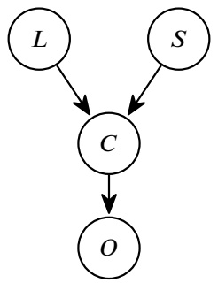

• 𝐿: The coin that was last used on the previous flip (fair or biased).

• 𝑆: The current score (0, 1, 2, or 3).

• 𝐶: The selected coin (fair or biased).

• 𝑂: The outcome of the coin flip (heads or tails).

**(c)** [2 pts] State: The fair coin was last used. The current score is 2.

Action: Flip.

Successor state: Bust.

○ 0
○ $P(C = \text{fair} | L = \text{fair}, S = 2) \cdot P(O = \text{tails} | C = \text{fair})$
● $\sum_{c} P(C = c | L = \text{fair}, S = 2) \cdot P(O = \text{tails} | C = c)$
○ $\sum_{l} P(C = \text{fair} | L = l, S = 2) \cdot P(O = \text{tails} | C = \text{fair})$
○ 1

There are two ways for this transition to happen, and they’re mutually exclusive, so we can combine them by adding their probabilities.

Either we chose the fair coin and then flipped tails (adding 2 to the score and busting), or we chose the biased coin and flipped tails (adding 2 to the score and busting).

𝑃 (𝐶 = biased|𝐿 = fair, 𝑆 = 2) ⋅ 𝑃 (𝑂 = tails|𝐶 = biased)

**(d)** [2 pts] State: The fair coin was last used. The current score is 3.

Action: Flip.

Successor state: Bust.

○ 0
○ $P(C = \text{fair} | L = \text{fair}, S = 3) \cdot P(O = \text{tails} | C = \text{fair})$
○ $\sum_{c} P(C = c | L = \text{fair}, S = 3) \cdot P(O = \text{tails} | C = c)$
○ $\sum_{l} P(C = \text{fair} | L = l, S = 3) \cdot P(O = \text{tails} | C = \text{fair})$
● 1

No matter which coin you choose, and which way the coin flips (heads or tails), flipping on a score of 3 will lead to a bust.

Lastly, we need to deal with the first coin flip at the start of the game, when we don’t know what coin was used on the previous flip. We will represent this as being uncertain about the state of the MDP: we could either be in a state where the fair coin was last used, or the biased coin was last used.

(Hint: The next subpart can be solved independently of the rest of the question.)

**(e)** [3 pts] Consider an MDP where you are uncertain about your current state. The probability that you are in state 𝑠 is 𝑃 (𝑠). The actions available from every state are the same.

Write the Bellman expression that represents the optimal action in this situation.

<!-- page: 13 -->

**(i) (ii) (iii)** $\sum _ { s ^ { \prime } } T ( s , a , s ^ { \prime } ) \left[ R ( s , a , s ^ { \prime } ) + \gamma V ( s ^ { \prime } ) \right]$

**(i)** # 1 #∑𝑎 ● $\mathtt { a r g m a x } _ { a }$ # arg min𝑎

**(ii)** # 1 ∑𝑠 $\mathbf { m a x } _ { s }$ # min𝑠

**(iii)** 1 𝑃 (𝑠) # $T ( s , a , s ^ { \prime } )$ $R ( s , a , s ^ { \prime } )$

arg max𝑎 $\begin{array} { r } { { } _ { t } \sum _ { s } P ( s ) \sum _ { s ^ { \prime } } T ( s , a , s ^ { \prime } ) [ R ( s , a , s ^ { \prime } ) + V ( s ^ { \prime } ) ] } \end{array}$

For each action, we need to consider the expected discounted reward of taking that action.

Since we don’t know which state we’re in, we need to check every state: for each state, compute the expected discounted reward of starting in that state, and taking the action. This is where the ∑ 𝑃 (𝑠) term is introduced.

We use an argmax over 𝑎 in the first term, because we want to find and return the action that results in the highest expected discounted reward.

<!-- page: 14 -->

<table><tr><td>○ 0</td><td>○ 3/5</td><td>● 2/3</td><td rowspan="3">○ Not enough information</td></tr><tr><td>○ 1/5</td><td>○ 4/5</td><td>○ 1/2</td></tr><tr><td>○ 2/5</td><td>○ 1/3</td><td>○ 1</td></tr></table>

## Q4. [14 pts] RL: Rest and ReLaxation

Consider the grid world MDP below, with unknown transition and reward functions.

| A | B | C |
| --- | --- | --- |
| D | E | F |
| G | H | I |

The agent observes the following samples in this grid world:

| 𝑠 | 𝑎 | 𝑠' | 𝑅(𝑠,𝑎,𝑠') |
| --- | --- | --- | --- |
| E | East | F | -1 |
| E | East | H | -1 |
| E | South | H | -1 |
| E | South | H | -1 |
| E | South | D | -1 |

Reminder: In grid world, each non-exit action succeeds with some probability. If an action (e.g. North) fails, the agent moves in one of the cardinally adjacent directions (e.g. East or West) with equal probability, but will not move in the opposite direction (e.g. South).

Let 𝑝 denote the probability that an action succeeds.

In this question, we will consider 3 strategies for estimating the transition function in this MDP.

**Strategy 1**: The agent does not know the rules of grid world, and runs model-based learning to directly estimate the transition function.

**(a)** [1 pt] From the samples provided, what is 𝑇̂ (E, South, H)?

There are 3 samples that move South from E, and 2 of them result in successor state H.

**(b)** [1 pt] From the samples provided, what is 𝑇̂ (E, West, D)?

Not enough information

We have no samples that move West from E, so there is not enough information to empirically estimate this transition probability.

**Strategy 2**: The agent knows the rules of grid world, and runs model-based learning to estimate 𝑝. Then, the agent uses the estimated ̂𝑝 to estimate the transition function.

**(c)** [1 pt] From the samples provided, what is ̂𝑝, the estimated probability of an action succeeding?

\# Not enough information

There are 3 samples of successful actions: 1 sample of E East F, and 2 samples of E South H. The other 2 samples are unsuccessful actions: E East H, and E South D.

**(d)** [1 pt] Based on ̂𝑝, what is 𝑇̂ (E, West, D)?

<!-- page: 15 -->

<table><tr><td>○ 0</td><td>● 3/5</td><td>○ 2/3</td><td rowspan="3">○ Not enough information</td></tr><tr><td>○ 1/5</td><td>○ 4/5</td><td>○ 1/2</td></tr><tr><td>○ 2/5</td><td>○ 1/3</td><td>○ 1</td></tr></table>

Even though we have never seen a sample that moves West from E, we can still use the estimated parameters in the grid world to provide an estimate. Our estimate is that actions succeed with probability 3∕5, so moving West from E will succeed (and land in D) with probability 3∕5.

**(e)** [3 pts] Select all true statements about comparing Strategy 1 and Strategy 2.

□ Strategy 1 will usually require fewer samples to estimate the transition function to the same accuracy threshold.

□ There are fewer unknown parameters to learn in Strategy 1.

■ Strategy 1 is more prone to overfitting on samples.

None of the above

Option 1: False. Estimating the transition function directly would require collecting samples for every state-action pair. By contrast, estimating the grid world parameters can be done even if you don’t see every state-action pair.

Option 2: False. The transition function has probabilities for every (𝑠, 𝑎, 𝑠′) transition. By contrast, there is only one grid world parameter to estimate, the probability of an action succeeding.

Option 3: True. The transition function for some (𝑠, 𝑎, 𝑠′) transition is only estimated using the samples that start in 𝑠 and take action 𝑎. If the samples for that particular state/action pair are biased, then the transition function for that value will also be biased.

<!-- page: 16 -->

The grid world and samples, repeated for your convenience:

| A | B | C |
| --- | --- | --- |
| D | E | F |
| G | H | I |

| 𝑠 | 𝑎 | 𝑠' | 𝑅(𝑠,𝑎,𝑠') |
| --- | --- | --- | --- |
| E | East | F | -1 |
| E | East | H | -1 |
| E | South | H | -1 |
| E | South | H | -1 |
| E | South | D | -1 |

**Strategy 3**: The agent knows the rules of grid world, and uses an exponential moving average to estimate 𝑝. Then, the agent uses the estimated ̂𝑝 to estimate the transition function.

**(f)** [2 pts] Consider this update equation: $\hat { p } \gets ( 1 - \alpha ) \hat { p } + ( \alpha ) x$

Given a sample $( s , a , s ^ { \prime } )$ , what value of 𝑥 should be used in the corresponding update?

$R ( s , a , s ^ { \prime } )$

1.0 if the action succeeded, and 0.0 otherwise

1.0 if the action failed, and 0.0 otherwise

$V ( s )$

$V ( s ^ { \prime } )$

We’re trying to estimate 𝑝, the probability of an action succeeding.

Consider a sample where the action succeeds. The estimated probability of success from that one sample is 1.0. Similarly, the estimated probability of success from a sample where the action fails is 0.0.

Note that the reward and value are not needed here, because we are not trying to estimate the action of states; instead, we are trying to estimate the probability of success.

**(g)** [3 pts] Select all true statements about comparing Strategy 2 and Strategy 3.

■ Strategy 2 gives a more accurate estimate, because it is the maximum likelihood estimate.

□ Strategy 3 gives a more accurate estimate, because it gives more weight to more recent samples.

■ Strategy 3 can be run with samples streaming in one at a time.

None of the above

Option 1: True. The maximum likelihood estimate comes from the count estimate.

Option 2: False. In TD learning, we want to give weight to more recent samples because they use more accurate values in their calculation. However, when we’re just estimating a probability from independent samples (whose values don’t depend on the estimated values of other states), then there’s no reason to give more weight to recent samples.

Option 3: True. To compute a count estimate, we need to be able to count up all the samples. The exponential moving average can be computed with each sample streaming in one at a time.

The rest of the question is independent from the previous subparts.

Suppose the agent runs Q-learning in this grid world, with learning rate $0 < \alpha < 1$ , and discount factor 𝛾 = 1.

**(h)** [1 pt] After iterating through the samples once, how many learned Q-values will be nonzero? # 0 # 1 2 # 3 # 4 # > 4

𝑄(E, East) and 𝑄(E, South) will be nonzero.

**(i)** [1 pt] After iterating through the samples repeatedly until convergence, how many learned Q-values will be nonzero?

<!-- page: 17 -->

Still the same two nonzero values. In order to update a Q-state, we have to see a sample with that Q-state, and we only ever see two Q-states.

<!-- page: 18 -->

## Q5. [16 pts] Bayes’ Nets: Pac Pong Performance

Pacman is going out to play a Pong tournament, and he wants to model all the uncertainty in the game in order to ensure victory.

Consider the Bayes’ net below. All random variables are binary.

Pacman is trying to compute $P ( \mathbf { C } | + \mathbf { w } , - \mathbf { t } )$

First, Pacman uses the standard variable elimination algorithm (as seen in lecture) to eliminate L and M.

**(a)** [2 pts] Select the factor(s) needed to eliminate L and M.

$$
\begin{array}{c c} \square & P (+ \mathrm{w}) \\ \square & P (- \mathrm{t}) \end{array}
$$

$$
\begin{array}{c c} \blacksquare & P (\mathrm{M} | + \mathrm{w}) \\ \square & P (\mathrm{C} | + \mathrm{w}) \end{array}
$$

𝑃 (C|R, +w, V) ■ 𝑃 (L| − t)

■ 𝑃 (C|R, M, V) □ 𝑃 (R)

These are all the factors that mention L or M.

**(b)** [2 pts] Select the factor(s) that remain after eliminating L and M.

$f(\mathrm{R}, +\mathrm{w}, \mathrm{V}, \mathrm{C})$
$f(\mathrm{R}, +\mathrm{w}, -\mathrm{t}, \mathrm{V}, \mathrm{C})$
$f(-\mathrm{t})$

$$
\begin{array}{c c} \square & f (+ \mathrm{w}, \mathrm{V}, \mathrm{C}) \\ \blacksquare & f (\mathrm{V}, + \mathrm{w}, - \mathrm{t}) \\ \blacksquare & f (+ \mathrm{w}) \end{array}
$$

Initial list of factors:
$P(+w)$
$P(-t)$
$P(M|+w)$
$P(V|+w,+t)$
$P(L|-t)$
$P(R)$
$P(C|R,M,V)$

When we join on 𝐿, we combine all factors involving 𝐿. There’s only one factor involving 𝐿: 𝑃 (𝐿| − 𝑡)

When we sum out 𝐿, this factor sums to 1, so we can safely drop it the list of factors.

$$
\sum_ {l} P (l | - t) = 1
$$

When we join on 𝑀, we combine all factors involving 𝑀:

$$
P (M | + w) \cdot P (C | R, M, V) = f (M, + w, C, R, V)
$$

When we sum out 𝑀, we get:

<!-- page: 19 -->

$$
\sum_ {m} f (m, + w, C, R, V) = f (+ w, C, R, V)
$$

The remaining list of factors is:

𝑃 (+𝑤)

$$
P (- t)
$$

$$
P (V | + w, - t)
$$

𝑃 (𝑅)

$$
f (+ w, C, R, V)
$$

Note: An earlier version of the solutions did not mark these three answer choices: 𝑓(−t), 𝑓(V, +w, −t), 𝑓(+w)

The question was not clear on whether we wanted you to select the factors generated from eliminating L and M, or the entire list of factors after eliminating L and M. If you use the former interpretation, then those three answer choices would not be marked. If you use the latter interpretation, then those three answer choices would be marked.

During grading, we gave everybody points for these three choices, regardless of whether you selected them or did not select them. (The other three answer choices are unaffected by the alternate interpretation.)

**(c)** [2 pts] Which statement best explains why variable elimination (VE) is better than inference by enumeration (IBE)?

\# VE can use larger factors, so we can read off more values and use less computation.

VE can use smaller factors, so we can use less computation.

While VE is usually better, sometimes IBE creates smaller factors.

\# VE is always strictly better, because it always uses strictly smaller factors, using less computation.

Note that the factor created by IBE is the full joint distribution, since we’re multiplying every CPT in the Bayes’ net together. The full joint distribution over all the variables is the largest possible factor we could generate. The factors generated by VE must be smaller or equal to the factor generated by IBE. (There will never be a factor greater than the joint distribution factor generated by IBE.)

In the worst case, VE will generate the entire joint distribution, just as in VE.

**(d)** [2 pts] Pac-Man claims that he could have skipped eliminating L and just removed it from the graph for his query of 𝑃 (C| + w, −t). This is:

\# Correct, because L is not directly connected with C.

\# Correct, because there is no downstream path from C to L.

Correct, because L is conditionally independent of C, given w and t.

\# Incorrect, because every variable can have relevant information to every query.

\# Incorrect, because there exists a path from L to C.

The first option is not correct. Hidden variables that are not directly connected to the query variable can still provide relevant information through other nodes to the query variable. (For example, W affects C).

The third option is correct, because variables that don’t have information relevant to our query variable can be directly removed.

The fourth option is incorrect, and the explanation stems from the third option’s explanation.

The fifth option is incorrect, and the explanation stems from the third option’s explanation.

<!-- page: 20 -->

Reminder: Pacman is trying to compute 𝑃 (C| + w, −t).

The Bayes’ net, repeated for your convenience:

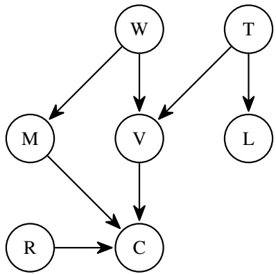

Pac-Man is tired of variable elimination, so he takes a short break. He decides to approximate the query using various sampling methods.

In each of the next subparts, select all sampling algorithm(s) that could have generated the two **consecutive** samples shown.

Note: If Pacman rejects a sample while generating it, the rest of the sample will say “rejected.”

None of the above

None of the above

Sample 1: −r +w +t rejected rejected rejected rejected **(g)** [1 pt] Sample 2: −r +w −t rejected rejected rejected rejected

O None of the above

For the first table, only Prior Sampling would have samples collected that do not agree with the evidence.

For the second table, all algorithms could use these samples. Rejections sampling and likelihood weighting could create these samples, since +𝑤 and −𝑡 are consistent with the evidence. Gibbs sampling could consecutively create these samples, since they only differ in one variable, 𝑣.

For the third table, none of the algorithms work. Note that rejection sampling should continue in the second entry.

For the fourth table, Gibbs sampling does not work because both r and v change values. Rejection sampling and likelihood weighting could create these samples, since +𝑤 and −𝑡 are consistent with the evidence.

## (i) [4 pts] Pacman finishes his variable elimination, in the order: L, M, R, V.

Pacman discovers that the evidence he used was wrong! The evidence was +t, not −t.

Select all steps that Pacman would need to redo. Note that the step of collecting samples does **not** involve computing the probability from those samples.

<!-- page: 21 -->

■ Collecting samples for Gibbs sampling.

□ Joining and eliminating M.

■ Joining and eliminating V.

Collecting samples for likelihood weighting.

□ Joining and eliminating R.

□ Collecting samples for prior sampling.

No steps need to be redone.

From earlier in the question, note that joining and eliminating 𝐿 and 𝑀 never involved any factor or CPT that included 𝑇 , so that work will stay the same, even if the evidence 𝑇 is different.

However, when we join and eliminate on 𝑉 , we will need the CPT 𝑃 (𝑉 | + 𝑤, +𝑡). This table will be different depending on the value of the evidence variable 𝑇 . If we change the evidence, we will need to redo this step and use the corrected CPT.

The samples for prior sampling assume nothing about the evidence, so the samples don’t need to be re-collected when the evidence changes.

Rejection sampling, likelihood weighting, and Gibbs sampling all only produce samples consistent with the evidence. If we change the evidence, none of the samples are consistent with the evidence anymore, so we have to re-collect samples.

<!-- page: 22 -->

# Q6. [13 pts] HMMs and VPI: Markov Menagerie

Consider the following hidden Markov model (HMM). All random variables are binary.

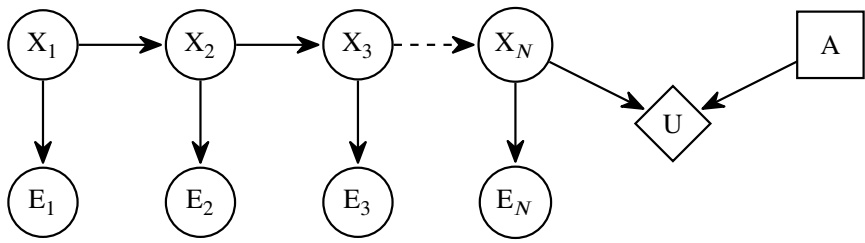

We would like to compute $\mathrm { V P I } ( E _ { N } ) = \mathrm { M E U } ( E _ { N } ) - \mathrm { M E U } ( \emptyset )$

**(a)** [1 pt] Which of these distributions is needed to compute MEU(∅)? ● $P ( X _ { N } )$ # $P ( X _ { N } | X _ { N - 1 } )$ # $P ( X _ { N } | E _ { 1 } , \ldots , E _ { N } )$ # $P ( X _ { N } | E _ { N } )$

The utility 𝑈 depends on $X _ { N } ,$ , so we need a distribution over $X _ { N }$ to compute the expected utility of each action. MEU(∅) means that we are given no evidence, so the distribution over $X _ { N }$ should also be given no evidence.

**(b)** [2 pts] Which of these computations can be used to derive the distribution in part **(a)**?

\# Run the forward algorithm with no modifications.

\# Run the forward algorithm, skipping all time elapse updates.

Run the forward algorithm, skipping all observation updates.

Read the conditional probability table under $X _ { N }$

We need $P ( X _ { N } )$ . This is not in the Bayes’ net; the CPT under $X _ { N }$ is $P ( X _ { N } | X _ { N - 1 } )$

To obtain $P ( X _ { N } )$ , we need to run the forward algorithm, skipping all observation updates, because we have no evidence.

**(c)** [3 pts] Write an expression that can be used to compute $\mathrm { M E U } ( E _ { N } )$

$$
\begin{array}{c} \mathrm{MEU} (E _ {N}) = \sum_ {e _ {N}} (\mathbf {i}) \left[ \max _ {a} \sum_ {x _ {N}} (\mathbf {i i}) (\mathbf {i i i}) \right] \\ \text {(i)} \quad \bullet P (E _ {N}) \quad \bigcirc P (E _ {N} | E _ {N - 1}) \quad \bigcirc P (E _ {N} | X _ {N}) \quad \bigcirc P (E _ {N} | X _ {1}, \dots , X _ {N}) \\ \text {(ii)} \quad \bigcirc P (X _ {N} | X _ {N - 1}) \quad \bigcirc P (X _ {N} | X _ {1}, \dots , X _ {N - 1}) \quad \bullet P (X _ {N} | E _ {N}) \quad \bigcirc P (X _ {N} | E _ {1}, \dots , E _ {N}) \\ \text {(iii)} \quad \bigcirc 1 \quad \bigcirc U (x _ {N}) \quad \bigcirc U (a) \quad \bullet U (x _ {N}, a) \\ \sum_ {e _ {N}} P (e _ {N}) \left[ \max _ {a} \sum_ {x _ {N}} P (x _ {N} | e _ {N}) U (x _ {N}, a) \right] \end{array}
$$

We need $P ( X _ { N } | E _ { N } )$ to compute the expected utility of each action.

Then, we also need $P ( E _ { N } )$ so that we can weight each expected utility by the probability of that specific evidence occurring.

Finally, we need the utility, which depends on both the value of $X _ { N }$ and the action selected.

**(d)** [2 pts] Consider the distribution in part **(a)**, which you computed in part **(b)**.

From the distribution in **(a)**, which of the following additional computations results in the distribution in blank **(ii)**?

<!-- page: 23 -->

Apply an additional observation update.

\# Apply an additional time elapse update.

\# Apply an additional time elapse and observation update.

\# Re-run the forward algorithm from the beginning, with no modifications.

From the previous subpart, we have $P ( X _ { N } )$ , but we need $P ( X _ { N } | E _ { N } )$ . This requires one extra evidence update in the forward algorithm: we need to weight every value in the table $P ( X _ { N } )$ by $P ( E _ { N } | X _ { N } )$ , and then normalize. In equations: We have $P ( X _ { N } )$ (from the earlier subparts) and $P ( E _ { N } | X _ { N } )$ (from the Bayes’ net). We want $P ( X _ { N } | E _ { N } )$ so we can apply Bayes’ rule:

$$
P (X _ {N} | E _ {N}) = \frac {P (X _ {N}) P (E _ {N} | X _ {N})}{P (E _ {N})}
$$

In other words, in the numerator, we’re multiplying every value in the $P ( X _ { N } )$ table by $P ( E _ { N } | X _ { N } )$ , and then we normalize (since the denominator is a constant).

**(e)** [2 pts] Which of the following computations can be used to derive the distribution in blank **(i)**?

$$
\begin{array}{l l} \bigcirc & P (x _ {N}) P (E _ {N} | x _ {N}) \\ \bullet & \sum_ {x _ {N}} P (x _ {N}) P (E _ {N} | x _ {N}) \end{array}
$$

$$
\begin{array}{l l} \bigcirc & \sum_ {e _ {N}} P (x _ {N}) P (e _ {N} | x _ {N}) \\ \bigcirc & \sum_ {x _ {N}} P (E _ {N}) P (x _ {N} | E _ {N}) \end{array}
$$

We’re given $P ( X _ { N } )$ (from earlier subparts), and $P ( E _ { N } | X _ { N } )$ (from the Bayes’ net). Using the chain rule, we can get:

$$
P (X _ {N}) P (E _ {N} | X _ {N}) = P (X _ {N}, E _ {N})
$$

Then, you can sum out $X _ { N }$ to get:

$$
\sum_ {x _ {N}} P (x _ {N}) P (E _ {N} | x _ {N}) = P (E _ {N})
$$

<!-- page: 24 -->

The diagram, repeated for your convenience:

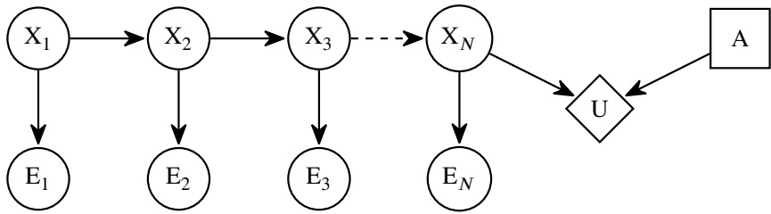

For the rest of the question, suppose we would like to compute $\operatorname { V P I } ( E _ { 1 } , \ldots , E _ { N } ) = \operatorname { M E U } ( E _ { 1 } , \ldots , E _ { N } ) - \operatorname { M E U } ( { \varnothing } )$

**(f)** [2 pts] To compute $\mathrm { M E U } ( E _ { 1 } , \ldots , E _ { N } )$ , we’ll need one or more distribution(s) over $X _ { N }$

Which of these computations will generate the necessary distribution(s) over $X _ { N } ?$

Run the forward algorithm once, with no modifications.

Run the forward algorithm $2 ^ { N }$ times, with no modifications.

\# Run the forward algorithm once, skipping all observation updates.

\# Run the forward algorithm $2 ^ { N }$ times, skipping all observation updates.

We don’t know what the evidence is, so we have to run the forward algorithm once for every possible setting of the evidence $P ( X _ { N } | e _ { 1 } , \ldots , e _ { N } )$

**(g)** [1 pt] To compute $\mathrm { M E U } ( E _ { 1 } , \ldots , E _ { N } )$ , which other distribution do we need?

$P ( E _ { 1 } )$

$$
P (E _ {N})
$$

$$
P (E _ {1}, \dots , E _ {N})
$$

$$
P (E _ {1}, \dots , E _ {N} | X _ {N})
$$

We need to weight each $\mathrm { M E U } ( e _ { 1 } , \ldots , e _ { N } )$ by the corresponding probability of evidence, $P ( E _ { 1 } , \ldots , E _ { N } )$

<!-- page: 25 -->

## Q7. [12 pts] Games and ML: BeatBlue

Pacman wants to design an agent that can play chess and beat his older (more successful) brother, DeepBlue.

First, Pacman would like to design a machine learning algorithm that takes in a board state and outputs a real number between 0.00 (for states where Pacman is losing) and 1.00 (for states where Pacman is winning).

**(a)** [2 pts] Pacman starts by asking experts to manually assign values to board states. Select all true statements.

■ We can use the manually-assigned values as our training dataset.

■ We can use the manually-assigned values as our testing dataset.

□ Since we have values assigned by experts, the machine learning algorithm provides no additional benefit.

None of the above

First two options are true, because we use hand-labeled data for both training and testing.

Third option is false, because the machine learning algorithm might be able to help us assign values to states that we’ve never seen before, and we know from class that the state space of a game like chess is so large that it would be impossible to enumerate and manually assign values to every possible board state.

**(b)** [1 pt] Pacman suggests using a perceptron for this problem. Is it reasonable to use a perceptron for this problem?

Yes, because this is a classification problem.

\# Yes, because the training data is linearly separable.

No, because this is a regression problem, and perceptrons output discrete classes, not continuous numbers.

\# No, because perceptrons should never be used when the data is not linearly separable.

The last option is false because perceptrons can still be used when data is not linearly separable; they just wouldn’t have perfect training accuracy.

Pacman decides to represent the chess board state as a 64-dimensional vector. Pacman designs a fully-connected, feed-forward neural network with the following architecture:

$$
\begin{array}{l} h = \mathrm{ReLU} (x \cdot W _ {1} + b _ {1}) \\ \hat {y} = \mathrm{ReLU} (h \cdot W _ {2} + b _ {2}) \end{array}
$$

This network takes in a $1 1 \times 6 4$ vector, 𝑥, and outputs a scalar real number, ̂𝑦.

Pacman sets the hidden layer size to be 128. In other words, ℎ has dimensions $1 \times 1 2 8$

**(c)** [1 pt] What are the dimensions of $W _ { 1 } ?$

$$
\begin{array}{c c} \bigcirc & 1 2 8 \times 1 \\ \bigcirc & 1 9 2 \times 1 \end{array}
$$

$$
\begin{array}{c c} \bigcirc & 8 1 9 2 \times 1 \\ \bigcirc & 6 4 \times 6 4 \end{array}
$$

From the question: 𝑥 has dimension $1 \times 6 4 ,$ , and ℎ has dimension 1 × 128.

In order to make the dimensions line up, $W _ { 1 }$ must have dimension 64 × 128, so that we have $( 1 , 6 4 ) { \times } ( 6 4 , 1 2 8 ) \rightarrow ( 1 , 1 2 8 )$ Intuitively, the 64 × 128 weight array is converting our 64-dimensional input vector into a 128-dimensional hidden layer vector. In other words, if you think of the hidden layer output as the output of 128 different perceptrons, then the weight array contains 128 different weight vectors, where each weight vector is 64-dimensional.

**(d)** [1 pt] What are the dimensions of $W _ { 2 } ?$

<!-- page: 26 -->

| ○ 1 × 1 | ● 128 × 1 | ○ 8192 × 1 | ○ 128 × 128 |
| --- | --- | --- | --- |
| ○ 64 × 1 | ○ 192 × 1 | ○ 64 × 64 | ○ 64 × 128 |

From the question: ℎ has dimension $1 \times 1 2 8 .$ , and ̂𝑦 is a scalar, so it has dimension $1 \times 1$

In order to make the dimensions line up, $W _ { 2 }$ must have dimension $1 2 8 \times 1 ,$ so that we have (1, 128) × (128, 1) → (1, 1). Intuitively, this layer is a single neuron taking the 128-dimensional hidden layer vector and outputting a single scalar as output. This neuron requires a 128-dimensional weight vector, so that we can take a dot product between the weight vector and hidden layer vector.

**(e)** [1 pt] Pacman considers changing the second layer of the neural network. Which of these proposed changes is best for this problem?

$$
\begin{array}{l l} \text {Reminders:} & \operatorname{ReLU} (x) = \max (x, 0) \\ \bigcirc \quad \hat {y} = \operatorname{ReLU} (h \cdot W _ {2} + b _ {2}) \\ \bullet \quad \hat {y} = \sigma (h \cdot W _ {2} + b _ {2}) \end{array} \qquad \begin{array}{l l} \sigma (x) = \frac {1}{1 + e ^ {- x}} & \operatorname{sgn} (x) = \left\{ \begin{array}{l l} 1 & x > 0 \\ 0 & x = 0 \\ - 1 & x <   0 \end{array} \right. \\ \bigcirc \quad \hat {y} = \operatorname{sgn} (h \cdot W _ {2} + b _ {2}) \\ \bigcirc \quad \hat {y} = h \cdot W _ {2} + b _ {2} \end{array}
$$

The output of the machine learning algorithm needs to be a real number between 0 and 1.

The sigmoid function is the only function in the answer choices that always outputs a real number between 0 and 1. ReLU could output positive numbers greater than 1. The sgn function could output -1. Without any non-linearity at the last layer, the outputs could be outside of the range of 0 to 1.

<!-- page: 27 -->

Pacman now has a neural network ${ \hat { y } }   =   f ( x )$ that takes in board states (𝑥) and outputs values ( ̂𝑦), and would like to use the network to select actions in the chess game.

**(f)** [1 pt] Let $s ^ { \prime } = g ( s , a )$ represent the successor function that takes in a state 𝑠 and action 𝑎, and outputs a successor state $s ^ { \prime } .$ Which of the following expressions represents a reflex agent’s optimal action from state 𝑠, based on the values outputted by the neural network? # arg max𝑠 𝑓(𝑠) arg max𝑎 𝑓(𝑔(𝑠, 𝑎)) # max 𝑔(𝑠, 𝑎) #∑𝑎 𝑓(𝑔(𝑠, 𝑎))

For every action 𝑎, generate a successor state $g ( s , a )$ , then use 𝑓 to evaluate this successor state. Use argmax to pick the action that led to the successor state with the highest value.

Finally, Pacman decides to run depth-limited minimax search and use the neural network as an evaluation function.

**(g)** [1 pt] Is it reasonable to use the neural network as an evaluation function?

Yes, because the neural network maps states to real-numbered values.

\# Yes, because the network is guaranteed to correctly identify terminal states where the game is over.

\# No, because it would be more efficient and accurate to expand the entire minimax tree to the terminal states.

No, because evaluation functions should map states to actions.

The other Yes option is false because depending on the weights in the neural network, it might not correctly identify terminal states. There is also no requirement that evaluation functions need to correctly identify terminal states.

**(h)** [1 pt] Is it possible to use alpha-beta pruning in this problem?

Yes, pruning works even if the neural network output was unbounded.

\# Yes, but only because the neural network only outputs numbers between 0 and 1.

\# No, because pruning requires you to know the values at all leaf nodes in advance.

\# No, because the values outputted by the neural network are not guaranteed to be correct.

In this question, we’re running standard minimax (with a specific evaluation function learned from a neural network), so standard alpha-beta pruning works as well.

**(i)** [1 pt] Is it better to spend more time on training the neural network, or expanding more layers of the game tree?

Training the neural network

Expanding the game tree

Not enough information

This depends on how accurate the neural network is, and in practice, it would probably require empirical studies to determine where the time is better spent.

**(j)** [2 pts] Recall that in Monte Carlo tree search, we allocate more rollouts to game states that are more promising (i.e. better utility for Pacman).

Inspired by this idea, Pacman considers running gradient descent for a longer time when using the neural network to evaluate game states that are more promising. Would this idea work?

\# Yes, because this causes the neural network to focus its training on promising game states.

Yes, because training for a longer time leads to better evaluations.

\# No, because running gradient descent for too long always leads to overfitting.

No, because gradient descent runs during training, not evaluation.

The third option is false because running gradient descent for too long doesn’t necessarily lead to overfitting.

<!-- page: 28 -->

## Q8. [13 pts] Potpourri

**(a)** [4 pts] Select all true statements about the game tree shown.

Suppose that the values in the terminal nodes have the property that $D < E < F < G ,$ and the agents do not know this.

Assume that alpha-beta pruning visits nodes from left to right.

■ Two actions are needed to transition from state 𝐴 to state 𝐸.

■ The value at the root node will always be 𝐸.

■ When running alpha-beta pruning, node 𝐺 can always be pruned.

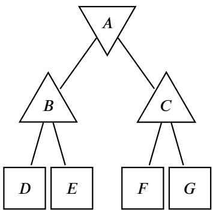

□ When running alpha-beta pruning, node 𝐹 can sometimes be pruned.

None of the above

#Option 1: True. Edges represent actions. There are two edges on the path between 𝐴 and 𝐸.

Option 2: True. We have:

$$
B = \max (D, E) = E
$$

$$
C = \max (F, G) = G
$$

$$
A = \min (B, C) = \min (E, G) = E
$$

Option 3: True. By the time we see F, we know that $C \geq F > E .$ The minimizing agent will always prefer going to 𝐵 and getting a rewards of 𝐸, and will never go to 𝐶 and get a reward greater than 𝐸. Therefore, we don’t have to check the value of 𝐺 to know that the minimizing agent is going to 𝐵.

Option 4: False. 𝐹 and 𝐺 could be very negative numbers, which would cause the minimizing agent to prefer 𝐶 over 𝐵. We have to check 𝐹 before we know for sure that the minimizing agent will never prefer 𝐶.

**(b)** [4 pts] Consider a standard HMM (from lecture) with states $X _ { 1 } , \ldots , X _ { N }$ and evidence $E _ { 1 } , \ldots , E _ { N }$ Suppose we’re running particle filtering with a large number of particles. At time step 𝑡, we have a particle at state $X _ { t } = x _ { t } ,$ with weight 0.7. Select all true statements about this particle.

□ We’ve just finished a time elapse update, and have not performed the observation update for time 𝑡 yet.

□ 0.7 is the probability of the particle visiting all the states it’s visited so far: $P ( x _ { 1 } , \ldots , x _ { t } )$

■ If this particle is drawn during resampling, the resulting new particle will still be at state $x _ { t }$ .

□ 0.3 is the probability that this particle disappears during resampling.

None of the above

Option 1: False. The particles take on weights after the observation update, not after the time elapse update.

Option 2: False. 0.7 is the probability of the evidence, given the particle’s current state. $P ( e _ { t } | x _ { t } )$ is not equal to $P ( x _ { 1 } , \ldots , x _ { t } )$

Option 3: True. The resampling process does not change the particles’ states.

Option 4: False. The weight of a particle is not the probability that it is resampled, because the weights of the particles are not normalized (don’t sum to 1), and because we are drawing many particles from the weighted particle distribution, with replacement (so there are many chances for the particle to be resampled).

Consider the following Naive Bayes’ model and training data. $Y , F _ { 1 }$ , and $F _ { 2 }$ are binary random variables.

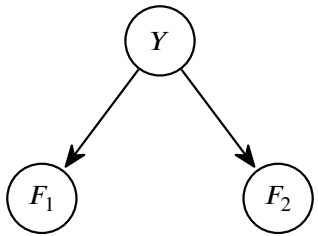

| 𝐹1 | 𝐹2 | 𝑌 |
| --- | --- | --- |
| +𝑓1 | +𝑓2 | +𝑦 |
| +𝑓1 | -𝑓2 | +𝑦 |
| -𝑓1 | +𝑓2 | -𝑦 |

<!-- page: 29 -->

The CPT under 𝑌 :

$$
\begin{array}{l} P (+ y) = 2 / 3 \\ P (- y) = 1 / 3 \end{array}
$$

The CPT under $F _ { 1 }$ :

$$
\begin{array}{l} P (+ f _ {1} | + y) = 1 \\ P (- f _ {1} | + y) = 0 \\ P (+ f _ {1} | - y) = 0 \\ P (- f _ {1} | - y) = 1 \end{array}
$$

The CPT under $F _ { 2 } ;$

$$
\begin{array}{l} P (+ f _ {2} | + y) = 0. 5 \\ P (- f _ {2} | + y) = 0. 5 \\ P (+ f _ {2} | - y) = 1 \\ P (- f _ {2} | - y) = 0 \end{array}
$$

**(c)** [2 pts] What is $P ( + y \mid + f _ { 1 } , + f _ { 2 } ) ?$

$$
\begin{array}{c c} \bigcirc & 0 \\ \bigcirc & 1 / 3 \end{array}
$$

$$
\begin{array}{c c} \bigcirc & 2 / 3 \\ \bigcirc & 1 / 2 \end{array}
$$

Not enough information

$$
\begin{array}{r l} & P (+ y, + f _ {1}, + f _ {2}) = P (+ y) \cdot P (+ f _ {1} | + y) \cdot P (+ f _ {2} | + y) \\ & \qquad = (2 / 3) \cdot 1 \cdot (1 / 2) \\ & \qquad = 1 / 3 \\ & P (- y, + f _ {1}, + f _ {2}) = P (- y) \cdot P (+ f _ {1} | - y) \cdot P (+ f _ {2} | - y) \\ & \qquad = (1 / 3) \cdot 0 \cdot 1 \\ & \qquad = 0 \end{array}
$$

After normalizing, we get $P ( + y \mid + f _ { 1 } , + f _ { 2 } ) = 1$

Note: During grading, we accepted “Not enough information” as an alternate solution. The intended answer was 1, using the calculations shown above. However, some students pointed out that while 1 is the estimate for $P ( + y | + f _ { 1 } , f _ { 2 } )$ given by the training data, it may not be the true probability given the full space of possible data points.

Update: the answer choice "None of the above" was accepted an an alternate answer choice, due to the reasoning that the samples given cannot represent the true probabilities of the distributions involved, and so you cannot compute the true probability asked for.

**(d)** [3 pts] Select all equations that are true about the model, regardless of the training data used.

$$
\begin{array}{l l} \square & P (F _ {1}) = P (F _ {1} | F _ {2}) \\ \square & P (Y) = P (Y | F _ {1}) \end{array}
$$

$$
\begin{array}{l l} \blacksquare & P (F _ {1} | Y) = P (F _ {1} | Y, F _ {2}) \\ \bigcirc & \text {None of the above} \end{array}
$$

By the definition of Naive Bayes’ or d-separation, $F _ { 1 }$ and $F _ { 2 }$ are conditionally independent, given $Y .$

By definition of conditional independence, $P ( F _ { 1 } | Y ) = P ( F _ { 1 } | Y , F _ { 2 } )$ . In words, if you already know the label 𝑌 , then any additional features like $F _ { 2 }$ tell you nothing more about $F _ { 1 }$
