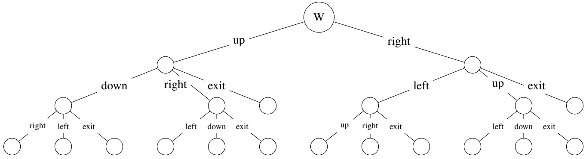
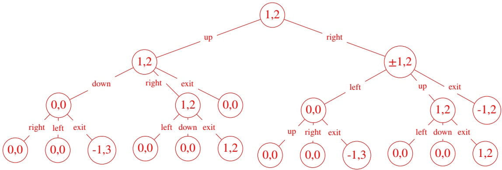
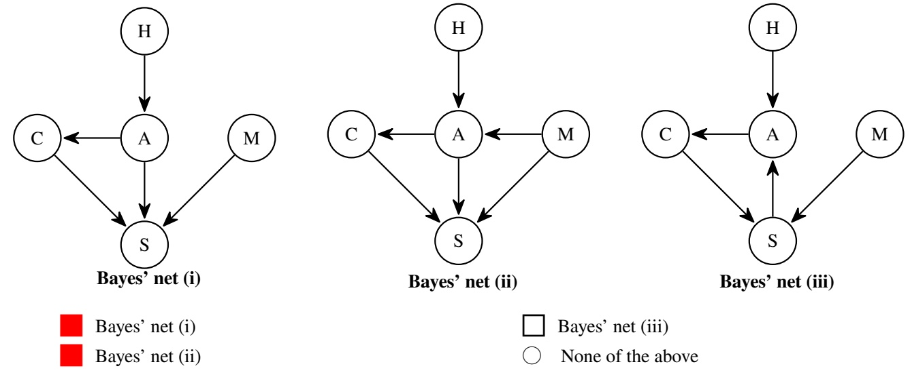
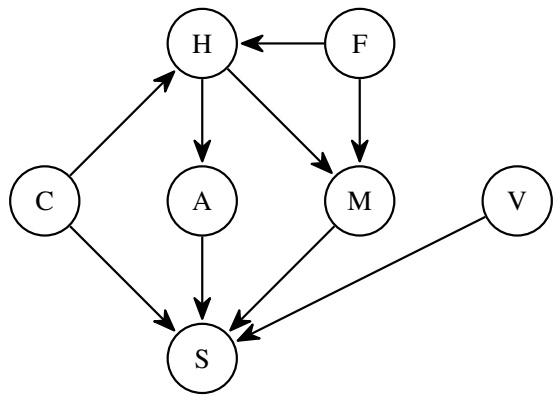
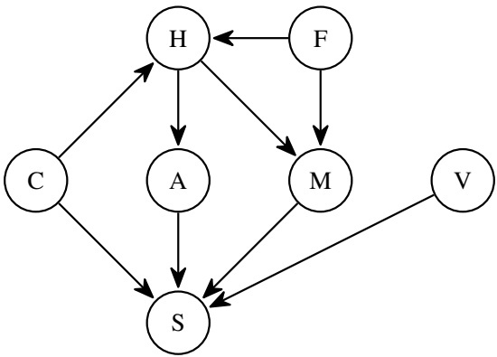
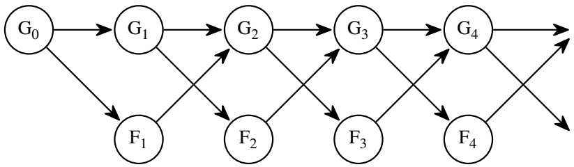
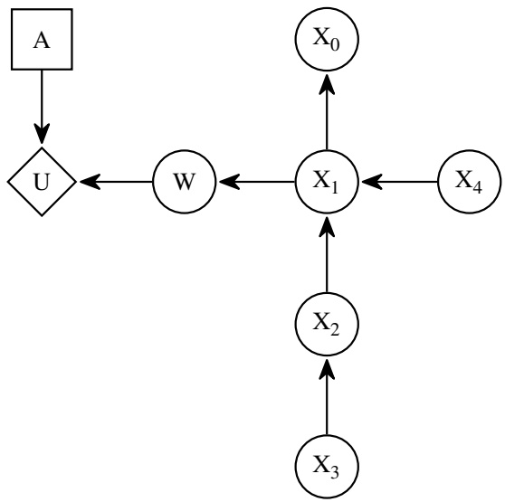
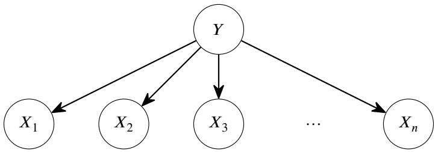
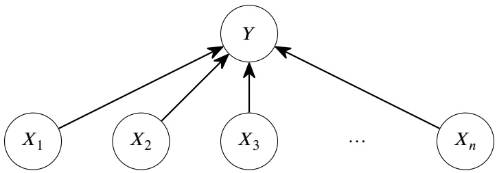
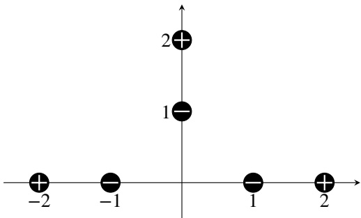

<!-- page: 1 -->

It’s testing time for our CS188 robots!

## Solutions last updated: Monday, May 15

• You have 170 minutes.

• The exam is closed book, no calculator, and closed notes, other than four double-sided cheat sheets that you may reference.

• For multiple choice questions,

means mark **all options** that apply

means mark a single choice

| First name |  |
| --- | --- |
| Last name |  |
| SID |  |
| Name of person to the right |  |
| Name of person to the left |  |
| Discussion TAs (or None) |  |

**Honor code**: “As a member of the UC Berkeley community, I act with honesty, integrity, and respect for others.”

By signing below, I affirm that all work on this exam is my own work, and honestly reflects my own understanding of the course material. I have not referenced any outside materials (other than my cheat sheets), nor collaborated with any other human being on this exam. I understand that if the exam proctor catches me cheating on the exam, that I may face the penalty of an automatic "F" grade in this class and a referral to the Center for Student Conduct.

Signature:

Point Distribution

| Q1. Search and Slime | 12 |
| --- | --- |
| Q2. Searching for a Path with a CSP | 11 |
| Q3. A Multiplayer MDP | 9 |
| Q4. Slightly Different MDPs | 13 |
| Q5. Bayes' Nets | 8 |
| Q6. Dynamic Bayes' Nets: Book Club | 10 |
| Q7. Inequalities of VPI | 7 |
| Q8. Inverted Naive Bayes | 13 |
| Q9. Higher-Dimensional Perceptrons | 8 |
| Q10. Q-Networks | 9 |
| Total | 100 |

Circle your favorite robot below. (ungraded, just for fun)


<!-- page: 2 -->

## Q1. [12 pts] Search and Slime

Slowmo the snail is trying to find a path to a goal in an 𝑁 × 𝑀 grid maze. The available actions are to move one square up, down, left, right, and each action costs 1. Moves into walls are impossible. The goal test is a black-box function (the snail does not know how the function works) that returns true if its state argument is a goal state, and false otherwise.

**(a)** [1 pt] Assume that there is a reachable goal state. Which algorithms are **complete** for this problem? Select all that apply.

Breadth-first tree search

Uniform-cost tree search

A∗ graph search with ℎ = 0

Depth-first tree search

■ A∗tree search with ℎ = 0

None of the above

Depth-first can fail because there are cyclic paths which lead to infinitely deep branches in the tree. The other algorithms are all basically breadth-first search because costs are 1, and because the branching factor is finite they are bound to find the goal.

**(b)** [1 pt] Assume that there is a reachable goal state. Which algorithms are **optimal** for this problem? Select all that apply.

Breadth-first tree search

Depth-first tree search

Uniform-cost tree search

A∗tree search with ℎ = 0

A∗ graph search with ℎ = 0

None of the above

As before, depth-first search may find a suboptimal solution or none at all, while the others are essentially breadth-first search, which is optimal for constant step costs.

**(c)** [2 pts] Assume that there may or may not be a reachable goal state. Which algorithms are **complete** for this problem? Select all that apply.

Breadth-first tree search

Depth-first tree search

□ Uniform-cost tree search

A∗tree search with ℎ = 0

A∗ graph search with ℎ = 0 None of the above

If there is no goal, all the tree search algorithms will follow cyclic paths indefinitely, so they will fail to report that no solution exists.

However, graph search will not expand any state more than once. This problem has a limited number of states, so once graph search finishes expanding all the states, it will report that no solution exists and terminate.

For the rest of the question, consider a modified version of the search problem: Slowmo the snail hates entering squares that are already covered in his own slime trail. This means that an action is impossible if it would enter a square that Slowmo has previously entered. There may or may not be a reachable goal state in this problem.

**(d)** [2 pts] What is the size of the state space (in terms of 𝑁 and 𝑀) required to correctly reflect this modified problem?

𝑀𝑁 ⋅ 2<sup>𝑀𝑁</sup>

The state space needs to include one bit for each location, indicating whether it has been slimed. There are 𝑀𝑁 locations, so there are 2<sup>𝑀𝑁</sup> possible sequences of 𝑀𝑁 bits indicating which locations have been slimed. Also, we need to include a factor of 𝑀𝑁 to represent Slowmo’s location.

**(e)** [2 pts] In this modified problem, which algorithms are **complete**? Select all that apply.

■ Breadth-first tree search

Uniform-cost tree search

A∗ graph search with ℎ = 0

■ Depth-first tree search

A∗tree search with ℎ = 0

None of the above

All the algorithms are complete because every path is of finite length (no more than 𝑀𝑁 steps). The memory of previously visited squares means that tree searches function more or less like graph searches.

**(f)** [2 pts] In this modified problem, which algorithms are **optimal**? Select all that apply.

<!-- page: 3 -->

In this particular problem, the optimal path with slime memory is the same as the optimal path without slime memory, because there is no benefit to moving back into a square that you’ve already visited. As before, with constant costs, the algorithms other than depth-first all function like breadth-first, which is optimal.

**(g)** [2 pts] Consider an arbitrary search problem. We want to modify this search problem so that the agent is not allowed to move into a state more than once.

Which of the following changes to the original problem, each considered in isolation, correctly represents this modification? Select all that apply.

□ Change the successor function to disallow actions that move into a previously-visited state.

■ Add a list of visited states in the state space, and also change the successor function to disallow actions that move into a previously-visited state.

□ Change the goal test to return false if a state has been visited more than once.

■ Add a list of visited states in the state space, and also change the goal test to return false if a state has been visited more than once.

None of the above

The key realization in this problem is that the successor function and goal test are black-box functions that take in only the state, and then need to report the list of successor states (in the successor function), or whether or not the state is a goal (in the goal test). In our definition of a search problem, a list of previously-visited states is not built into the problem, so these functions cannot access this list unless we explicitly create it. Therefore, we need to encode the previously-visited states into the state representation so that it can be passed into the successor function and goal test.

(A) False. The successor function has no way to look at a state and determine if it has been previously visited before.

(B) True. This fixes the issue with (A), since now the state will tell you which states have been visited before.

(C) False. The goal test has no way to tell which states have been visited.

(D) True. This fixes the issue with (C).

<!-- page: 4 -->

## Q2. [11 pts] Searching for a Path with a CSP

We have a graph with directed edges between nodes. We want to find a simple path (i.e. no node is visited twice) between node 𝑠 and node 𝑔.

We decide to use a CSP to solve this problem. The CSP has one variable for each edge in the graph: the variable $X _ { v w }$ represents whether the edge between node 𝑣 and node 𝑤 is part of the path. Each variable has domain {true, false}.

In each of the next three parts, a constraint is described; select the logical expression that represents the constraint. Notation:

• 𝑁(𝑣) is the set of all neighbors of node 𝑣. (Recall: a node 𝑤 is a neighbor of 𝑣 iff there is an edge from 𝑣 to 𝑤).

• The function ExactlyOne() returns an expression that is true iff exactly one of its inputs is true.

$\textstyle \bigwedge _ { x _ { i } \in S } x _ { i }$ refers to the conjunction of all $x _ { i }$ in the set 𝑆.

$\textstyle \bigvee _ { x _ { i } \in S } x _ { i }$ refers to the disjunction of all $x _ { i }$ in the set 𝑆.

**(a)** [2 pts] The starting node 𝑠 has a single outgoing edge in the path and no incoming edge in the path.

$$
(\{X _ {s v} \mid v \in N (s) \}) \land \bigwedge_ {v \in N (s)} \neg X _ {v s}
$$

$$
(\{X _ {v s} \mid v \in N (s) \}) \land \bigwedge_ {v \in N (s)} \neg X _ {s v}
$$

$$
(\{X _ {s v} \mid v \in N (s) \}) \wedge \bigwedge_ {v \in N (s)} X _ {v s}
$$

$$
\{X _ {v s} \mid v \in N (s) \}) \land \bigwedge_ {v \in N (s)} X _ {s v}
$$

The variables $X _ { s v } ,$ one per node 𝑣, represent the outgoing edges from node 𝑠 to other nodes 𝑣. We want exactly one of these variables to be true, representing the single outgoing edge from the start node.

The variables $X _ { v s } ,$ one per node $v _ { \ast }$ represent the incoming edges from other nodes 𝑣 to node 𝑠. We want all of these variables to be false, representing no edges incoming to 𝑠. In other words: $\neg X _ { v s }$ says that the incoming edge (𝑣, 𝑠) is not included in the path, and we want this to hold for all neighbors 𝑣.

**(b)** [2 pts] The goal node 𝑔 has a single incoming edge in the path and no outgoing edge in the path.

$$
\{X _ {g v} \mid v \in N (s) \}) \land \bigwedge_ {v \in N (g)} \neg X _ {v g}
$$

$$
\{X _ {g v} \mid v \in N (s) \}) \land \bigwedge_ {v \in N (g)} X _ {v g}
$$

$$
\{X _ {v g} \mid v \in N (s) \}) \land \bigwedge_ {v \in N (g)} \neg X _ {g v}
$$

$$
\{X _ {v g} \mid v \in N (s) \}) \wedge \bigwedge_ {v \in N (g)} X _ {g v}
$$

Clarification during exam: All options should use 𝑁(𝑔) instead of 𝑁(𝑠).

The idea is similar to the previous question. $X _ { v g }$ represent incoming edges from other nodes 𝑣 to 𝑔, and we want exactly one of these variables to be true.

$X _ { g v }$ represents outgoing edges from 𝑔 to other nodes 𝑣. We want all these to be false, so we want $\neg X _ { g v }$ for all 𝑣.

Note: There was a slight bug in this question. At the top of the question, we wrote that 𝑁(𝑣) is the set of nodes 𝑤 where an edge exists from 𝑣 to 𝑤 (i.e. direction of edges matters when considering neighbors), but this would make the sets 𝑁(𝑠) and 𝑁(𝑔) only give us outgoing edges, not incoming edges. However, among the four answer choices provided, we thought that the selected answers were unambiguously the best answers, so we did not clarify this during the exam.

**(c)** [2 pts] If node 𝑣 has an incoming edge in the path, then it must have exactly one outgoing edge in the path.

$$
\bigcirc \quad \bigwedge_ {w \in N (v)} X _ {w v} \iff \text {ExactlyOne} (\{X _ {v w} \mid w \in N (v) \})
$$

$$
\bigcirc \quad \bigwedge_ {w \in N (v)} X _ {w v} \implies \text {ExactlyOne} (\{X _ {v w} \mid w \in N (v) \})
$$

$$
\bigcirc \quad \bigvee_ {w \in N (v)} X _ {w v} \iff \text {ExactlyOne} (\{X _ {v w} \mid w \in N (v) \})
$$

$$
\bigvee_ {w \in N (v)} X _ {w v} \implies \text {ExactlyOne} (\{X _ {v w} \mid w \in N (v) \})
$$

$\textstyle \bigvee _ { w \in N ( v ) } X _ { w v }$ encodes whether or not 𝑣 has an incoming edge. It checks all the variables $X _ { w v }$ representing edges from other nodes 𝑤 to the chosen node 𝑣, and returns true if at least one of these variables is true (i.e. there is at least one incoming edge), or false if all variables are valse (i.e. there is no incoming edge).

We want an implication ⟹ rather than a biconditional ⟺ because of the if-then structure of the English statement. The statement does not suggest that the converse needs to be true.

<!-- page: 5 -->


| $2^M$ |
| --- |

**(d)** [2 pts] Suppose the graph has 𝑁 nodes and 𝑀 edges. How many different assignments to the variables exist in this CSP? Your answer should be an expression, possibly in terms of 𝑁 and 𝑀.

Our CSP has one variable for each edge in the graph. Each variable is binary (is assigned to either true or false). Therefore, we have $2 ^ { M }$ possible assignments to the variables in this CSP.

Suppose we set up our CSP on a graph with nodes $s , a , b , c , d , e , g .$ We want to run a hill climbing algorithm to maximize the number of satisfied constraints. Sideways steps (variable changes that don’t change the number of satisfied constraints) are allowed. All variables in the CSP initially set to false.

**(e)** [2 pts] Assuming that each of the following variables exists in the CSP, select all variables that might be set to true in the first step of running hill-climbing.

Recall the hill-climbing algorithm from the local search and CSP lectures: Start with some initial assignment (here, all variables false). At each iteration, change one of the assignments to one of the variables, such that the total number of violated constraints is decreased or unchanged.

Initially, the constraints from part (c) are satisfied, because the implication is vacuously true (the left-hand-side is false). The constraints from part (a) and (b) are violated, because there are no outgoing edges from 𝑠, and there are no incoming edges to $g .$

Adding an outgoing edge from 𝑠 satisfies the constraint in (a) without violating any constraints in (b) or (c). This corresponds to setting either $X _ { s a }$ or $X _ { s b }$ (the two outgoing edges from 𝑠 in the choices) to true.

Adding an incoming edge to 𝑔 satisfies the constraint in (b) without violating any constraints in (a) or (c). This corresponds to setting $X _ { e g }$ (the only incoming edge to 𝑔 in the choices) to true.

Adding any other edge (i.e. any edge that isn’t outgoing from 𝑠 or incoming to 𝑔) won’t affect constraints (a) or (b), but will cause a constraint in (c) to be violated, because it introduces one incoming edge without also introducing an outgoing edge. Therefore, the hill climbing algorithm won’t set $X _ { c s } , X _ { a b }$ , or $X _ { d e }$ to true on the first iteration.

**(f)** [1 pt] Will our hill-climbing algorithm always find a solution to the CSP if one exists?

\# Yes, the algorithm will incrementally add edges to the path until the path connects 𝑠 and 𝑔.

\# Yes, the algorithm will eventually search over all combinations of assignments to the variables until a satisfying one is found.

\# No, the search will sometimes find a solution to the CSP that is not a valid path.

No, the search will sometimes fail to satisfy all of the constraints in the CSP.

The only way for the hill climb to change variable assignments without decreasing the number of satisfied constraints is to add an outgoing edge to a node with an incoming edge that doesn’t have one yet or add an outgoing or incoming edge to 𝑠 or 𝑔 if they don’t have them yet. Therefore, the search will proceed by extending a partial path from 𝑠 (or backwards from 𝑔) until either (1) the partial path forms a complete path from 𝑠 to 𝑔 or (2) the partial path reaches a dead end in the graph at which no more edges can be added without repeating a node in the graph. In the second case, the search process will fail and the CSP will still have violated constraints.

<!-- page: 6 -->

## Q3. [9 pts] A Multiplayer MDP

Alice and Bob are playing a game on a 2-by-2 grid, shown below. To start the game, a puck is placed on square A.

At each time step, the available actions are:

• Up, Left, Down, Right: These actions move the puck deterministically. Actions that move the puck off the grid are disallowed. These actions give both players a reward of 0.

• Exit: This action ends the game. Note that the Exit action can be taken no matter where the puck is. This action gives Alice and Bob rewards depending on the puck’s final location, as shown below.

Each player tries to maximize their own reward, and does not care about what rewards the other player gets.

| X | Y |
| --- | --- |
| W | Z |

Figure 1: The grid that the puck moves on.

| Puck location when "exit" is taken | Alice's reward | Bob's reward |
| --- | --- | --- |
| W | -1 | +3 |
| X | 0 | 0 |
| Y | +1 | +2 |
| Z | -1 | +2 |

Figure 2: Exit rewards for Alice and Bob.

**(a)** [2 pts] Suppose Bob is the only player taking actions in this game. Bob models this game as an MDP with a discount factor 0 < 𝛾 ≤ 1.

For which of the following states does Bob’s optimal policy depend on the value of 𝛾? Select all that apply.

□ W

□ X

None of the above.

Clarification during exam: To start the game, a puck is placed on square W (not A).

Note that in this question, Bob is the only player, so all we’re concerned about is maximizing Bob’s utility. Alice’s utility does not matter in this question.

Bob gets highest reward at W, so the optimal action at W is always to exit.

The optimal policy from X is always {down, exit} to move into state W and exit there for a reward of 3. Even though there’s a discount factor, we know that a reward of 3𝛾 (one discount factor applied) is always going to be greater than the reward of 0 (if we had exited from X), because 𝛾 > 0.

At Y and Z, if the discount factor is low (i.e. future rewards are heavily discounted), the optimal action is to immediately exit and get a reward of 2. If the discount factor is high enough (i.e. future rewards are not so heavily discounted), then it’s better to go to state W and get the discounted reward of 3𝛾 for exiting from state W.

For the rest of the question, Alice and Bob alternate taking actions. Alice goes first.

Alice models this game with the following game tree, and wants to run depth-limited search with limit 3 turns. She uses an evaluation of 0 for any leaf node that is not a terminal state. (Note: Circles do not necessarily represent chance nodes.)



(b) [1 pt] This is a zero-sum game.

<!-- page: 7 -->

## True

Alice and Bob have different utilities in the tree, partially cooperative and partially competitive, as shown in the reward table.

In order for this game to be zero-sum, Alice’s utility would need to be the negative of Bob’s utility.

**(c)** [1 pt] What is Alice’s value of the root node of the tree?

| 1 |
| --- |

**(d)** [1 pt] What is Bob’s value of the root node of the tree?

```txt
2
```

Clarification during exam: The left-most subtree under the game tree should say "right, up, exit" not "right, left, exit". Filling out the tree with Alice and Bob’s utility gives the following tree.



At the terminal nodes, we fill in the utilities associated with the corresponding sequence of actions. For example, going through the leaf nodes of the tree left to right:

The left-most leaf node corresponds to the actions {up, down, right}. This sequence of actions has not led to the game ending, so we cannot evaluate the value (Alice and Bob’s reward) at this state. However, we note that Alice uses an evaluation of 0 for any non-terminal leaf node, so the value of this state is (0, 0).

Similarly, the next leaf node corresponds to {up, down, up} (clarification corrected this from {up, down, left}, which is illegal). Again, the game has not ended, so we use the evaluation of 0 to find the value of this state is (0, 0).

The next leaf node corresponds to {up, down, exit}. This ends the game with an exit from W, which gives Alice reward of −1 and Bob reward of +3. In the tree, we denote this as (−1, 3), where the left value is Alice’s reward and the right value is Bob’s reward.

Going through the other leaf nodes, we can write in (0, 0) for any non-terminal leaf nodes and the exit rewards for any leaf nodes where an exit action was taken.

To solve the tree, we need to evaluate which layers correspond to which player. Alice is going first, so the two branches from the root node (up and right) correspond to Alice’s action (where she will maximize her own utility). Since Alice and Bob take turns, the next layer then corresponds to Bob’s action (where he will maximize his own utility), and the final layer corresponds to Alice’s action again.

In layers where it’s Bob’s turn, we pick the child with the highest right-value (second value in the tuple). In layers where it’s Alice’s turn, we pick the child with the highest left-value (first value in the tuple).

Note that we have a node labeled (±1, 2). This is because at this node, Bob is indifferent between the (1, 2) and the (−1, 2) nodes, since he gets a reward of 2 either way. Since we didn’t specify a tiebreaker mechanism, the value here could be either (1, 2) or (−1, 2). However, the tiebreaker mechanism doesn’t matter because at the root node, Alice has a choice between (1, 2) and (±1, 2) and will choose (1, 2). If Alice is unsure of Bob’s tiebreaker strategy, she’d choose the guaranteed (1, 2) over the (±1, 2) where she might risk getting −1.

<!-- page: 8 -->

**(e)** [2 pts] Assuming that Alice and Bob play optimally, what are possible sequences of actions that they might play? Select all that apply.

■ up, right, exit

□ right, up, exit

up, right, down

□ right, exit

right, left, right

None of the above.

Using the tree above, we see that the value (1, 2) is associated with either the action sequence {up, right, exit}, or {right, up, exit}.

However, as discussed above, Alice does not know Bob’s tiebreaker strategy, so the (1, 2) value at the root is associated with the left branch {up, right, exit}. In other words, {right, up, exit} is suboptimal with no further knowledge of Bob’s strategy, because we can’t be sure if Bob will force the (1, 2) or the (−1, 2) outcome.

Alice instead decides to model the game as an MDP. Assumptions:

$\gamma = 0 . 5$

• Alice knows Bob’s policy is 𝜋.

• 𝐷(𝑠, 𝑎) represents the new state you move into when you start at state 𝑠 and take action 𝑎.

**(f)** [2 pts] Fill in the blanks to derive a modified Bellman equation that Alice can use to compute the values of states. Let $s ^ { \prime } = D ( s , a )$ and $s ^ { \prime \prime } = D ( s ^ { \prime } , \pi ( s ^ { \prime } ) )$ .

$$
V (s) = \max _ {a} R (s, a, s ^ {\prime}) + (\mathbf {i}) (\mathbf {i i}) + (\mathbf {i i i}) (\mathbf {i v})
$$

$$
\begin{array}{c c c c c c} \text {(i)} & \bigcirc & 1 & \bullet & 0. 5 & \bigcirc & 0. 2 5 \\ \text {(ii)} & \bigcirc & 0 & \bigcirc & R (s, \pi (s), s ^ {\prime}) & \bullet & R (s ^ {\prime}, \pi (s ^ {\prime}), s ^ {\prime \prime}) \\ \text {(iii)} & \bigcirc & 1 & \bigcirc & 0. 5 & \bullet & 0. 2 5 \\ \text {(iv)} & \bigcirc & V (s) & \bigcirc & V (s ^ {\prime}) & \bullet & V (s ^ {\prime \prime}) \end{array}
$$

Recall that the Bellman equation relates the values of states 𝑉 (𝑠) with the values of other states $V ( s ^ { \prime } )$ In this MDP, Alice and Bob alternate choosing actions, so in order to relate Alice’s value at a state to Alice’s value function at some other state, we need to iterate two timesteps into the future (to reach the next time it’s Alice’s turn).

To consider the first time step into the future, we need to consider Alice’s immediate reward $R ( s , a , s ^ { \prime } )$ , which is already in the answer. After the first time step, the game has transitioned from 𝑠 into $s ^ { \prime } .$

Then, for the second time step into the future, we need to consider the action that Bob will take, $p i ( s ^ { \prime } )$ . This will transition the game from state $s ^ { \prime }$ to another state, denoted $s ^ { \prime \prime } .$ . We also need to consider the reward that Alice will get from this transition (that Bob chose), which is $R ( s ^ { \prime } , \pi ( s ^ { \prime } ) , s ^ { \prime \prime } )$

Once we reach $s ^ { \prime \prime }$ two time steps later, it’s Alice’s turn again, so we can use the recursive definition $V ( s ^ { \prime \prime } )$ to denote the value of Alice starting at $s ^ { \prime \prime }$ and acting optimally.

Finally, we need to make sure to apply one discount of 0.5 to the reward $R ( s ^ { \prime } , \pi ( s ^ { \prime } ) , s ^ { \prime \prime } )$ one time step into the future. We need to apply two discounts to the rewards that are 2+ time steps into the future, $V ( s ^ { \prime \prime } )$

$$
V (s) = \max _ {a} (R (s, a, s ^ {\prime}) + 0. 5 R (s ^ {\prime}, \pi (s ^ {\prime}), s ^ {\prime \prime}) + 0. 2 5 V (s ^ {\prime \prime})
$$

<!-- page: 9 -->

## Q4. [13 pts] Slightly Different MDPs

Each subpart of this question is independent.

For all MDPs in this question, you may assume that:

• The maximum reward for any single action is some fixed number $R > 0 .$ , and the minimum reward is 0.

• The discount factor satisfies $0 < \gamma \leq 1$

• There are a finite number of possible states and actions.

**(a)** [2 pts] Which statements are always true? Select all that apply.

□∑𝑠∈𝑆 𝑇 (𝑠, 𝑎, 𝑠′) = 1.

■ $\begin{array} { r } { \sum _ { s ^ { \prime } \in S } T ( s , a , s ^ { \prime } ) = 1 . } \end{array}$

□ $\begin{array} { r } { \sum _ { a \in A } T ( s , a , s ^ { \prime } ) \leq 1 . } \end{array}$

□ For all state-action pairs $( s , a ) ,$ , there exists some $s ^ { \prime } ,$ such that $T ( s , a , s ^ { \prime } ) = 1$

None of the above

Clarification during exam: Q4 - The discount factor is $0 < \gamma < 1 .$

(A): False. This adds up the probability of going from all states to a certain state, which doesn’t necessarily sum to 1. As an intuitive example (disregarding the constant action 𝑎), consider a 3-state MDP with states X, Y, and $Z.\ P(X \to$ $Z ) + P ( Y \to Z ) + P ( Z \to Z ) \neq 1$ . Maybe it’s likely $( < 5 0 \% )$ to reach 𝑍 from any of the 3 states, which would make this expression add to more than 1.

(B): True. This adds up the probability of going from 1 state to all other states, which sums to 1 (because from one state, once you take an action, you have to land in some state). Using the example above, $P ( X \to X ) + P ( X \to Y ) + P ( X \to$ $Z ) = 1$ because from X, once you take an action, you have to land in X, Y, or Z.

(C): False. Suppose that in the example, if you’re in X, any action is guaranteed to land you in Z, no matter what action you take. Assume there are 2 actions, Left and Right. Then $T ( X , \mathrm { L e f t } , Z ) + T ( X , \mathrm { R i g h t } , Z ) = 2 ,$ , which is $\mathrm { n o t } \leq 1$

(D): False. $T ( s , a , s ^ { \prime } ) = 1$ would say that in state 𝑠, taking action 𝑎 always lands you in $s ^ { \prime } .$ However, there is no guarantee that taking some action in the MDP has a guaranteed outcome. For example, consider Gridworld from lecture with the exit action removed: every action is probabilistic, and there is no action that has a guaranteed $s ^ { \prime }$ successor state.

**(b)** [2 pts] Which statements are always true? Select all that apply.

■ Every MDP has a unique set of optimal values for each state.

□ Every MDP has a unique optimal policy.

□ If we change the discount factor 𝛾 of an MDP, the original optimal policy will remain optimal.

■ If we scale the reward function $r ( s , a )$ of an MDP by a constant multiplier $\alpha > 0$ , the original optimal policy will remain optimal.

\# None of the above

(A): True. The optimal values are the solutions to the Bellman equations, and they exist and are finite if $0 < \gamma < 1$ and the state space is finite. In other words, from a given state, the expected discounted sum of rewards for acting optimally is a unique value.

(B): False. An MDP could have multiple optimal policies. For example, consider a state where every action results in the same successor state. Then the optimal policies could assign any action at this state.

(C): False. Consider an MDP with two states, 𝐴 and 𝐵. At 𝐴 we can either go to 𝐵 or exit, getting a reward of 1, and at 𝐵, we can only exit, getting a reward of 10. If the discount factor is 0.9, the optimal action at 𝐴 would be to go to $B ;$ whereas if the discount factor is 0.01, the optimal action at 𝐴 is to exit directly.

(D): True. The optimal policy is determined by taking a argmax over values; if we scale all the values up or down by a constant, the relative ordering of values stays the same.

**(c)** [2 pts] Which statements are true? Select all that apply.

<!-- page: 10 -->

■ Policy iteration is guaranteed to converge to a policy whose values are the same as the values computed by value iteration in the limit.

Policy iteration usually converges to exact values faster than value iteration.

□ Temporal difference (TD) learning is off-policy.

An agent is performing Q-learning, using a table representation of Q (with all Q-values initialized to 0). If this agent takes only optimal actions during learning, this agent will eventually learn the optimal policy.

\# None of the above

(A): True. Policy iteration is guaranteed to converge to an optimal policy. Value iteration computes the values of the optimal policy. If we compute the values of the optimal policy (from policy iteration), we’ll get the same numbers as if we performed value iteration.

(B): True. Most of the time, value iteration converges towards optimal values in the limit but never reaches the exact values. However, policy iteration eventually finds the optimal policy, and then the policy evaluation step finds exact values as the solution of the linear equations.

(C): False. TD learning involves collecting samples using a particular policy 𝜋(𝑠) on the MDP, and thus it is on-policy, i.e., it learns values for 𝜋, the policy that is generating the samples.

(D): True.

**(d)** [2 pts] We modify the reward function of an MDP by adding or subtracting at most 𝜖 from each single-step reward. (Assume 𝜖 > 0.)

We fix a policy 𝜋, and compute $V _ { \pi } ( s )$ , the values of all states 𝑠 in the original MDP under policy 𝜋.

Then, we compute $V _ { \pi } ^ { \prime } ( s )$ , the values of all states in the modified MDP under the same policy 𝜋.

What is the maximum possible difference $\left| V _ { \pi } ^ { \prime } ( s ) - V _ { \pi } ( s ) \right|$ for any state 𝑠?

𝛾𝜖

\# 𝜖𝑅

● $\begin{array} { r } { \sum _ { n = 0 } ^ { \infty } \epsilon ( \gamma ) ^ { n } = \epsilon / ( 1 - \gamma ) } \end{array}$

None of the above

Intuitively, because the policies are the same, the future action sequences from any given state is also the same. (Formally, because an action can result in landing in multiple different states, we’d have to say something like, the distribution over futures is the same at a given state.)

Recall that the value of a state is the expected, discounted sum of rewards for acting optimally from that state for the rest of the time. So at each time step that we act, the difference in reward is at most 𝜖 (discounted appropriately). The sum of discounted differences at each time step is: $1 + \gamma + \gamma ^ { 2 } + \ldots = \epsilon / ( 1 - \gamma )$

<!-- page: 11 -->

**(e)** [3 pts] We modify the reward function of an MDP by adding exactly 𝐶 to each single-step reward. (Assume $C > 0 . )$ Let 𝑉 and $V ^ { \prime }$ be the optimal value functions for the original and modified MDPs. Select all true statements.

■ For all states 𝑠, $\begin{array} { r } { V ^ { \prime } ( s ) - V ( s ) = \sum _ { n = 0 } ^ { \infty } C ( \gamma ) ^ { n } = C / ( 1 - \gamma ) . } \end{array}$

For all states 𝑠, $V ^ { \prime } ( s ) - V ( s ) = C .$

□ For some MDPs, the difference $V ^ { \prime } ( s ) - V ( s )$ may vary depending on 𝑠.

None of the above

When we add a constant, the optimal policy does not change, so we have the same distribution over histories, and adding 𝑐 at each step gives a discounted sum of $C \mathrm { s } , \mathrm { i . e . } , C / ( 1 - \gamma )$ . This will be the same for all states.

**(f)** [2 pts] We notice that an MDP’s state transition probability $T ( s , a , s ^ { \prime } )$ does **not** depend on the action 𝑎.

Can we derive an optimal policy for this MDP without computing exact or approximate values (or Q-values) for each state?

O Yes, because the optimal policy for this MDP can be derived directly from the reward function.

\# Yes, because policy iteration gives an optimal policy and does not require computing values (or Q-values).

\# No, because we need a set of optimal values (or Q-values) to do policy extraction.

\# No, because there is no optimal policy for such an MDP.

None of the above

We know the optimal policy is given by

$$
\begin{array}{l} \pi (s) = \underset {a} {\arg \max} Q ^ {*} (s, a) \\ \qquad = \underset {a} {\arg \max} \left[ r (s, a) + \sum_ {s ^ {\prime}} T (s, a, s ^ {\prime}) V ^ {*} (s ^ {\prime}) \right]. \end{array}
$$

Since $T ( s , a , s ^ { \prime } )$ does not depend on 𝑎, the enitre summation term is irrelevant to the argmax (it’ll be a constant number, even as we vary 𝑎). Therefore, the optimal policy equation simplifies to $\pi ( s ) = \arg \operatorname* { m a x } _ { a } r ( s , a )$ , which only relies on the reward function.

Intuitively: If the transition probability doesn’t depend on the action, then no matter what action we take, we end up with the same probability of landing in every state. Therefore, we should just take the action that results in the highest immediate reward.

<!-- page: 12 -->

## Q5. [8 pts] Bayes’ Nets

The head of Pac-school is selecting the speaker (S) for the commencement ceremony, which depends on the student’s major (M), academic performance (A), and confidence (C). The student’s hard work (H) affects their academic performance (A), and academic performance (A) can affect confidence (C).

**(a)** [1 pt] Select all of the well-formed Bayes’ nets that can represent a scenario consistent with the assertions given above (even if the Bayes’ net is not the most efficient representation).



(i): True. The arrows in this diagram exactly reflect the cause-and-effect scenarios in the problem statement.

(ii): True. Adding an extra edge to the Bayes’ net only makes the Bayes’ net capable of representing more joint distributions; the more complex Bayes’ net can still represent all the distributions that the original Bayes’ net represented.

As a simple example, consider two independent coin flips with Bayes’ net nodes 𝐴 and 𝐵. If you drew an arrow betweeen 𝐴 and 𝐵, the resulting Bayes’ net can still represent two independent coin flips, by appropriately setting the CPT values in $B, \mathrm{e.g.} P(+b|+a)=P(+b|-a)=P(-b|+a)=P(-b|-a)=0.5.$

(iii): False. This Bayes’ net has a cycle $A \to C \to S \to A$ , and Bayes’ nets must be acyclic.

For the rest of the question, consider this Bayes net with added nodes Fearlessness (F) and Voice (V).



**(b)** [2 pts] Select all the conditional independence expressions that follow from the two standard axioms (1) a variable is independent of its non-descendants given its parents, and (2) a variable is independent of everything else given its Markov blanket.

<!-- page: 13 -->

<!-- page: 14 -->



Assume all the variables have a domain size of 2. Consider the query $P ( S | + h , + v , + f )$ in the Bayes net from the previous part.

**(c)** [1 pt] Suppose the query is answered by variable elimination, using the variable ordering 𝐶, 𝐴, 𝑀. What is the size (number of entries) of the largest factor generated during variable elimination? (Ignore the sizes of the initial factors.) # $2 ^ { 1 }$ 2<sup>3</sup> # $2 ^ { 5 }$ # $2 ^ { 2 }$ # $2 ^ { 4 }$ # $2 ^ { 6 }$

Initial list of factors:

$$
P (H | C, F), P (F), P (C), P (A | H), P (M | H, F), P (V), P (S | C, A, M, V)
$$

Join on 𝐶 gives us 𝑓 (𝐴, 𝐶, 𝐹 , 𝐻, 𝑀, 𝑆, 𝑉 ). Elimating on 𝐶 gives us $f _ { 1 } ( A , F , H , M , S , V )$ . This factor has six unknowns and $2 ^ { 6 }$ rows. This is actually the largest possible factor we can generate (there were only 7 variables and we always eliminate at least one each time we generate a factor), so the answer must be $2 ^ { 6 }$ and we’re done.

**(d)** [2 pts] If we use Gibbs sampling to answer this query, what other variables need to be referenced when sampling 𝑀?

𝐻 𝐴 𝑆

𝐹 𝑀 𝐶

None of the above

Now suppose the CPT for variable 𝐴 is as follows, and assume there are no zeroes in any other CPT.

| 𝐴 | 𝐻 | 𝑃(𝐴\|𝐻) |
| --- | --- | --- |
| +𝑎 | +ℎ | 1 |
| -𝑎 | +ℎ | 0 |
| +𝑎 | -ℎ | 0 |
| -𝑎 | -ℎ | 1 |

Hint: Recall that one requirement for Gibbs sampling to converge is that, in the limit of infinitely many samples, every state with non-zero probability is sampled infinitely often, regardless of the initial state.

**(e)** [1 pt] Will Gibbs sampling converge to the correct answer for the query $P ( S \mid + f ) ?$

\# Yes, because convergence properties of Gibbs sampling depend only on the structure of Bayes net, not on the values in the CPTs.

\# Yes, but it will converge very slowly because of the 0s and 1s in the CPT.

No, because some states with non-zero probability are unreachable from other such states.

\# No, because Gibbs sampling always fails with deterministic CPTs like this one.

None of the above

<!-- page: 15 -->

The deterministic CPT says that A=H; in other words, for (A,H) only states with (0,0) and (1,1) have non-zero probability. But once either of these states is reached, the other can never be reached, because sampling either A or H will always return the same value it already has.

## (f) [1 pt] Will Gibbs sampling converge to the correct answer for the query $P ( S \mid + h , + v , + f ) ?$

\# Yes, because convergence properties of Gibbs sampling depend only on the structure of Bayes net, not on the values in the CPTs.

\# Yes, but it will converge very slowly because of the 0s and 1s in the CPT.

\# No, because some states with non-zero probability are unreachable from other such states.

\# No, because Gibbs sampling always fails with deterministic CPTs like this one.

None of the above

In this case H is already fixed at 1, so as soon as A is sampled it will be 1, and it will stay at 1 for ever. This is fine, because (1,1) is the only state with non-zero probability. There is no need to reach (0,0). So it does converge correctly, but neither of the "Yes" reasons is correct. In fact the 0s and 1s help convergence here because A immediately gets the right value, which then influences S, so the evidence from H flows very quickly to the query variable.

<!-- page: 16 -->

## Q6. [10 pts] Dynamic Bayes’ Nets: Book Club

Each week $t \left( t \geq 0 \right)$ , the members of a book club decide on the genre of the book $G _ { t }$ to read that week: romance $( + g _ { t } )$ or science fiction $( - g _ { t } )$ . Each week’s choice is influenced by the genre chosen in the previous week. In addition, after week $t \left( t \geq 0 \right)$ , they collect feedback $( F _ { t + 1 } )$ from the members, which can be overall positive $( + f _ { t + 1 } )$ or negative $( - f _ { t + 1 } ) ,$ , and that influences the choice at week $t + 2 .$ The situation is shown in the Bayes’ net below:


**(a)** [1 pt] Recall that the joint distribution up to time 𝑇 for the "standard" HMM model with state $X _ { t }$ and evidence $E _ { t }$ is given by $\begin{array} { r } { P ( X _ { 0 : T } , E _ { 1 : T } )   =   P ( X _ { 0 } ) \prod _ { t = 1 } ^ { T } P ( X _ { t }   |   X _ { t - 1 } ) P ( E _ { t }   |   X _ { t } ) } \end{array}$

Write an expression for the joint distribution in the model shown above.

$$
P (F _ {1: T}, G _ {0: T}) = \boxed { \begin{array}{c} P (G _ {0}) P (F _ {1} \mid G _ {0}) P (G _ {1} \mid G _ {0}) \prod_ {t = 2} ^ {T} P (F _ {t} \mid G _ {t - 1}) P (G _ {t} \mid G _ {t - 1} F _ {t - 1}) \\ \hline \end{array} }
$$

This is just the ordinary expression for the joint distribution of a Bayes net. Recall that in a Bayes net, multiplying all of the conditional probability tables together (one per node) results in the joint distribution. The tricky part to writing this expression is getting the first couple of steps right (𝑡 = 0 and 𝑡 = 1)

**(b)** [2 pts] Which of the following Markov assumptions are implied by the network structure, assuming $t \geq 2 ?$

$$
\square P (G _ {t} \mid G _ {0: t - 1}, F _ {1: t - 1}) = P (G _ {t} \mid F _ {t - 1})
$$

$$
\square P (G _ {t} \mid G _ {0: t - 1}, F _ {1: t - 1}) = P (G _ {t} \mid G _ {t - 1})
$$

$$
\square P (G _ {t}, F _ {t} \mid G _ {0: t - 1}, F _ {1: t - 1}) = P (G _ {t}, F _ {t} \mid G _ {t - 1})
$$

$P ( F _ { t }   |   G _ { 0 : t - 1 } , F _ { 1 : t - 1 } ) = P ( F _ { t }   |   F _ { t - 1 } )$

$$
P (F _ {t} \mid G _ {0: t - 1}, F _ {1: t - 1}) = P (F _ {t} \mid G _ {t - 1}, F _ {t - 2})
$$

None of the above

These can all be worked out precisely using independence of non-descendants given parents. For the last one, note that the $F _ { t - 2 }$ is superfluous, but the equation is still correct.

The conditional probability tables for $G _ { t }$ and $F _ { t }$ are shown below, where 𝑎, 𝑏, 𝑐, 𝑑, 𝑝, 𝑞 are constants between 0 and 1.

| 𝐹<sub>𝑡</sub> | 𝐺<sub>𝑡-1</sub> | 𝑃(𝐹<sub>𝑡</sub>\|𝐺<sub>𝑡-1</sub>) |
| --- | --- | --- |
| + | + | 𝑝 |
| - | + | 1 - 𝑝 |
| + | - | 𝑞 |
| - | - | 1 - 𝑞 |

| 𝐺<sub>𝑡</sub> | 𝐹<sub>𝑡-1</sub> | 𝐺<sub>𝑡-1</sub> | 𝑃(𝐺<sub>𝑡</sub>\|𝐹<sub>𝑡-1</sub>,𝐺<sub>𝑡-1</sub>) |
| --- | --- | --- | --- |
| + | + | + | 𝑎 |
| - | + | + | 1 - 𝑎 |
| + | + | - | 𝑏 |
| - | + | - | 1 - 𝑏 |
| + | - | + | 𝑐 |
| - | - | + | 1 - 𝑐 |
| + | - | - | 𝑑 |
| - | - | - | 1 - 𝑑 |

Let’s consider this model as a Markov chain with state variables $( F _ { t } , G _ { t } )$ .

**(c)** [2 pts] Write out the transition probabilities below.

Your answer should be an expression, possibly in terms of 𝑎, 𝑏, 𝑐, 𝑑, 𝑝, and 𝑞.

<!-- page: 17 -->

$$
\begin{array}{l l} x _ {1} = P (+ f _ {t}, + g _ {t} \mid + f _ {t - 1}, + g _ {t - 1}) = \boxed {\text {ap}} & x _ {2} = P (+ f _ {t}, + g _ {t} \mid + f _ {t - 1}, - g _ {t - 1}) = \boxed {\text {bq}} \\ x _ {3} = P (+ f _ {t}, + g _ {t} \mid - f _ {t - 1}, + g _ {t - 1}) = \boxed {\text {cp}} & x _ {4} = P (+ f _ {t}, + g _ {t} \mid - f _ {t - 1}, - g _ {t - 1}) = \boxed {\text {dq}} \end{array}
$$

These entries follow from the fact that $P ( F _ { t } , G _ { t } \mid F _ { t - 1 } , G _ { t - 1 } )   =   P ( F _ { t } \mid G _ { t - 1 } ) P ( G _ { t } \mid F _ { t - 1 } , G _ { t - 1 } )$ . You can think of this expression as joining together two factors (CPTs) of the Bayes’ net.

Intuitively, you can also derive these expressions by considering the transition dynamics of this Markov chain. For example, consider deriving $x _ { 1 }$ . At time $t - 1$ , we have state $+ f _ { t - 1 } , + g _ { t - 1 }$ , and we want to know how likely it is for the state at time 𝑡 to be $+ f _ { t } , + g _ { t }$ . In order for this transition to happen, $+ f _ { t - 1 }$ must transition to $+ f _ { t }$ . The probability that this happens is governed by $P ( F _ { t } | G _ { t - 1 } )$ , and we look up the value in the table $P ( + f _ { t } | + g _ { t - 1 } )$ (since we know $+ g _ { t - 1 }$ at time $t - 1 )$ to find $p .$ Then, $+ g _ { t - 1 }$ must transition to $+ g _ { t }$ This transition is governed by the $P ( G _ { t } | F _ { t - 1 } , G _ { t - 1 } )$ and substituting in the desired values $P ( + g _ { t } | + f _ { t - 1 } , + g _ { t - 1 } )$ lets us look up the value 𝑎 in the table. Since both of these transitions must happen, the probability of the overall transition is $a p .$ The same approach can be used to derive the other three expressions.

<!-- page: 18 -->



**(d)** [2 pts] As 𝑡 goes to infinity, the stationary distribution of this Markov chain is shown below, where $y _ { 1 } , y _ { 2 } , y _ { 3 } , y _ { 4 }$ are constants between 0 and 1.

$$
\begin{array}{r} y _ {1} = P (+ f _ {\infty}, + g _ {\infty}) \\ y _ {2} = P (+ f _ {\infty}, - g _ {\infty}) \\ y _ {3} = P (- f _ {\infty}, + g _ {\infty}) \\ y _ {4} = P (- f _ {\infty}, - g _ {\infty}) \end{array}
$$

Write an equation that must be true if this is a stationary distribution.

Your answer should be an equation, possibly in terms of $x _ { 1 } , x _ { 2 } , x _ { 3 } , x _ { 4 }$ (from the previous part), $y _ { 1 } , y _ { 2 } , y _ { 3 } , y _ { 4 }$

$$
x _ {1} y _ {1} + x _ {2} y _ {2} + x _ {3} y _ {3} + x _ {4} y _ {4} = y _ {1}
$$

Recall that in the equilibrium distribution, the probability of being in a state no longer depends on the time step. In other words, if the probabilities of being in the four states at time ∞ are $y _ { 1 } , y _ { 2 } , y _ { 3 } , y _ { 4 } ,$ then at the next time step $\infty + 1$ , after the transition dynamics are applied once, the probabilities of being in the four states are still $y _ { 1 } , y _ { 2 } , y _ { 3 } , y _ { 4 } .$

From the previous subpart, we have the probabilities of transitioning into state $( + f , + g )$ from each of the four possible states. Therefore, we can write an equilibrium equation about the probability of being in $( + f , + g )$ , which is $y _ { 1 }$

$x _ { 1 } y _ { 1 } = \mathrm { p r o b a b i l i t y }$ of starting in $( + f , + g )$ , then transitioning to $( + f , + g )$ . Note that $x _ { 1 }$ is the probability of the transition and $y _ { 1 }$ is the probability of starting in the state.

𝑥<sub>2</sub>𝑦<sub>2</sub> = probability of starting in $( + f , - g )$ and transitioning to $( + f , + g )$

$x _ { 3 } y _ { 3 } = \mathrm { p r o b a b i l i t y }$ of starting in $( - f , + g )$ and transitioning to $( + f , + g ) .$

$x _ { 4 } y _ { 4 } = \mathrm { p r o b a b i l i t y }$ of starting in $( - f , - g )$ and transitioning to $( + f , + g )$

Since these are the only four ways to transition into $( + f , + g )$ , if we sum them up, we should get the probability that we’re in $( + f , + g )$ on the next time step, and because this is an equilibrium distribution, this should be equal to the probability that we’re in $( + f , + g )$ right now.

**(e)** [3 pts] Select all true statements.

There are values of $a , b , c , d$ such that the feedback model defined by $p , q$ is irrelevant to the stationary distribution of the genre 𝐺.

□ Even if $P ( F _ { t } , G _ { t } )$ reaches a unique stationary distribution, it is possible that the marginal probabilities $P ( F _ { t } )$ and $P ( G _ { t } )$ do not reach unique stationary distributions.

□ For any values of $a , b , c , d , p , q ,$ there is at least one stationary distribution.

None of the above

True. If $a   =   c   =   1$ and $b   =   d   =   0$ , then $G _ { t }$ is simply copied from $G _ { t - 1 }$ regardless of 𝐹. In that case the stationary distribution is the same as $P ( G _ { 0 } ) ,$ and 𝑝 and 𝑞 are irrelevant for computing the stationary distribution.

False. $P ( F _ { t } )$ and $P ( G _ { t } )$ can be computed directly from $P ( F _ { t } , G _ { t } )$ , so if the latter is constant then so are the former.

False. If $a   =   c   =   0$ and $b   =   d   =   1$ , then $G _ { t }$ is always the opposite of $G _ { t - 1 }$ , i.e., a deterministic cycle, and there is no stationary distribution.

<!-- page: 19 -->

## Q7. [7 pts] Inequalities of VPI

Consider the decision network shown below.



Choose the single equality or inequality symbol that results in the strongest assertion that is necessarily true in this network. (For example, if $[ a = b$ and $a \geq b$ are both necessarily true, choose $a = b$ because it is a strictly stronger assertion than $a \geq b . )$

**(a)** [1 pt] $\mathrm { V P I } ( X _ { 1 } , X _ { 2 } , X _ { 3 } )$ VPI(𝑋<sub>1</sub>) = # > # ≥ # < # ≤ # Not enough information

Note that 𝑈 is independent of $X _ { 2 } , X _ { 3 }$ given $X_{1} : \left( X_{2} , X_{3} \right) \mathrm{\  圧 \ } U | X_{1}$ . This implies that $\mathrm { V P I } ( X _ { 2 } , X _ { 3 } | X _ { 1 } ) \; = \; 0$ Therefore, $\mathrm{VPI}(X_{1},X_{2},X_{3})=\mathrm{VPI}(X_{1})+\mathrm{VPI}(\widetilde{X_{2}},X_{3}|X_{1})=\mathrm{VPI}(X_{1})$

**(b)** [1 pt] VPI(𝑋 ) VPI(𝑊 ) # # > # ≥ # < ≤ # Not enough information

Note that $X _ { 2 } , X _ { 3 }$ are independent with 𝑈 when conditioned on $X_{1},(X_{2},X_{3}) \perp U|X_{1}$ . This implies that $\mathrm { V P I } ( X _ { 2 } , X _ { 3 } | X _ { 1 } ) = 0$ Therefore, $\mathrm{VPI}(X_{1},X_{2},X_{3})=\mathrm{VPI}(X_{1})+\mathrm{VPI}(X_{2},X_{3}|X_{1})=\mathrm{VPI}(X_{1})$

**(c)** [1 pt] $\mathrm{VPI}(X_{1},X_{2})\xlongequal{\quad\quad}\mathrm{VPI}(X_{2})+\mathrm{VPI}(X_{1})$ # = # > # ≥ # < ≤ # Not enough information

VPI is always non-negative. Furthermore, we know from the first part that $\mathrm { V P I } ( X _ { 2 } | X _ { 1 } ) \; = \; 0 .$ Therefore, $\mathrm{VPI}(X_{1},X_{2}) \; =$ $\mathrm{VPI}(X_{1}) + \widetilde{\mathrm{VPI}(X_{2}|X_{1})} = \mathrm{VPI}(X_{1}) \leq \mathrm{VPI}(X_{1}) + \mathrm{VPI}(X_{2})$

**(d)** [1 pt] $\mathrm{VPI}(X_{3},X_{4}) \xlongequal{\quad } \mathrm{VPI}(X_{3}) + \mathrm{VPI}(X_{4})$ # = # > # ≥ # < # ≤ Not enough information

Although $X _ { 3 } , X _ { 4 }$ are independent, their impact on VPI can be (1) synergistic, i.e., joint VPI is higher than the sum, for example if neither variable individually can change the default decision, but together they can, or (2) antagonistic, e.g., if each individually fixes the decision, e.g., by deterministically fixing the value of $X _ { 1 } ,$ , such that adding the other variable cannot change it.

**(e)** [1 pt] $\mathrm{VPI}(X_{1},X_{2}|X_{3}) \xlongequal{\quad } \mathrm{VPI}(X_{2}|X_{3})$ # = # > ≥ # < # ≤ # Not enough information

$$
\mathrm{VPI} (X _ {1}, X _ {2} | X _ {3}) = \mathrm{VPI} (X _ {2} | X _ {3}) + \mathrm{VPI} (X _ {1} | X _ {2}, X _ {3}) \geq \mathrm{VPI} (X _ {2} | X _ {3})
$$

<!-- page: 20 -->

**(f)** [2 pts] Under which of the following circumstances would VPI(X) be 0 for every set of random variables X? Select all that apply.

𝑈 is a deterministic function of 𝐴 and 𝑊 .

𝑈 is independent of 𝐴 given 𝑊 .

𝑈 is independent of 𝑊 given 𝐴.

■ The best action choice, given 𝑊 , is the same for each value of 𝑊 .

□ The expected utility of the best action choice, given 𝑊 , is the same for each value of 𝑊 .

None of the above

(A): False. 𝑈 is always a deterministic function of 𝐴 and 𝑊 . For every configuration of 𝐴 and 𝑊 , we have to list the corresponding utility. The weather example from lecture can be a counterexample here: given your take/leave umbrella choice 𝐴 and the weather 𝑊 , your utility is fully deterministic. However, the value of knowing the weather is nonzero.

(B): True. Intuitively, this independence statement says that if you know 𝑊 , then the action you take has no effect on your utility. This means that knowing 𝑊 is useless; if you are indifferent to action after learning 𝑊 , then you may as well never change your action after learning 𝑊 . As we saw in lecture with the soup example (there are two soups but you wouldn’t order either one), if your action doesn’t change upon learning a variable outcome, then the VPI of that variable is 0.

(C): True. Intuitively, this statement says that once you take an action, the outcome of 𝑊 has no effect on the utility. Since the outcome of 𝑊 has no effect on utility, the value of knowing 𝑊 is 0.

(D): If the best action choice is the same regardless of 𝑊 , then knowing 𝑊 is not going to change your choice of action. As mentioned above, if knowing the value of 𝑊 does not change your action, then the value of knowing 𝑊 is 0.

(E): Even if the expected utility of the best action choice is the same for each value of 𝑊 , that does not necessarily mean that the action that leads to that best expected utility is the same. Since seeing different values of 𝑊 could lead you to take different actions (i.e. the action that gets you the best utility for the current value of 𝑊 ), the VPI of 𝑊 is nonzero.

As a concrete example: in our weather example from lecture, suppose that the utility of {sun, leave} is 100 and the utility of {rain, take} is 100. The expected utility of the best action choice given 𝑊 is the same for either 𝑊 = rain or 𝑊 = sun. However, the value of 𝑊 influences whether you choose to take or leave the umbrella, so the VPI of 𝑊 is nonzero.

<!-- page: 21 -->

## Q8. [13 pts] Inverted Naive Bayes

Consider a standard naive Bayes model with $n \mathrm { ~ > ~ } 1 0$ Boolean features $X _ { 1 } , \ldots , X _ { n }$ and a Boolean class variable 𝑌 . In this question, Boolean variables have values 0 or 1.



**(a)** [1 pt] How many parameters do we need to learn in this model (not counting parameters that can be derived by the sum-to-1 rule)?

Example of sum-to-1 rule: Given $P ( Y = 0 )$ , we can compute $P ( Y = 1 )$ since we know that these two values sum to 1. Therefore, $P ( Y = 0 )$ and $P ( Y = 1 )$ only count as one parameter we need to learn.

Your answer should be an expression, possibly in terms of 𝑛.

<div class="docvortex-algorithm" style="white-space: pre-wrap; font-family:monospace;">
$2n + 1$
</div>

Under the 𝑌 node, there is a conditional probability table 𝑃 (𝑌 ) with two rows: $P ( Y = 0 )$ and $P ( Y = 1 )$ . We must learn one of these as parameters; as soon as we learn one, the other one can be derived through the sum-to-one rule.

Under each $X _ { i }$ node, there is a conditional probability table $P ( X _ { i } | Y )$ with four rows. $P ( X _ { i }   =   0 | Y   =   0 )$ and $P(X_i =$ $1 | Y = 0 )$ sum to 1, so we have to learn one parameter for these two values. Also, $P ( X _ { i } = 0 | Y = 1 )$ and $P ( X _ { i } = 1 | Y = 0 )$ sum to 1, so we have another parameter to learn for these two values. In total, there are 2 parameters to learn for each $X _ { i }$ node.

There is 1 parameter to learn from the one 𝑌 node. There are 2 parameters to learn for each of the $X _ { i }$ nodes, and there are 𝑛 of those, for a total of 2𝑛 parameters from the $X _ { i }$ nodes. In total, that’s 2𝑛 + 1 parameters.

**(b)** [2 pts] We observe one training example with features $x _ { 1 } , \ldots , x _ { n }$ and class $y .$ Fill in the blanks to derive the likelihood of this training example.

$$
L = P (x _ {1}, \dots , x _ {n}, y) = P (Y = 1) ^ {(\mathbf {i})} P (Y = 0) ^ {(\mathbf {i i})} \prod_ {i = 1} ^ {n} P (X _ {i} = 1 | y) ^ {(\mathbf {i i i})} P (X _ {i} = 0 | y) ^ {(\mathbf {i v})}\tag{i}
$$

**(ii)**

**(iii)**

$$
\begin{array}{c c c c c c} \bigcirc & x & \bigcirc & 1 - x & \bullet & y \\ \bigcirc & x & \bigcirc & 1 - x & \bigcirc & y \\ \bullet & x & \bigcirc & 1 - x & \bigcirc & y \\ \bigcirc & x & \bullet & 1 - x & \bigcirc & y \end{array} \quad \begin{array}{c c c c c c} \bigcirc & 1 - y \\ \bullet & 1 - y \\ \bigcirc & 1 - y \\ \bigcirc & 1 - y \end{array}\tag{iv}
$$

Clarification during exam: The 𝑥 in the answer choices should say $x _ { i } .$

The probability requested here $P ( x _ { 1 } , \ldots , x _ { n } , y )$ is an entry in the joint distribution. To obtain an entry in the joint distribution, we just need to multiply the corresponding entry from each of the conditional probability tables together.

First, consider the CPT under node 𝑌 , which is 𝑃 (𝑌 ). If $y = 0$ , the $\mathrm { C P T }$ entry we need is $P ( Y = 0 )$ . If 𝑦 = 1, the CPT entry we need is $P ( Y = 1 )$ . To write this if/else condition into our equation, we can write $P(Y = 1)^{y}P(Y = 0)^{1 - y}$

Note that if $y = 0 ,$ , then the first term is equal to 1 (raised to 0th power), and the second term is raised to the $1 - 0 = 1 \mathrm { s }$ st power, for $P ( Y = 0 )$ , as desired. Also, if $\ [ y = 1$ , then the first term is raised to the 1st power, and the second term is equal to 1 (raised to the 0th power), for $P ( Y = 1 )$ , as desired.

Next, consider the CPTs under each $X _ { i }$ node. Again, if $x _ { i } = 0$ , we need the CPT entry $P ( X _ { i } = 0 | y )$ , and if $x _ { i } = 1$ , we need the CPT entry $P ( X _ { i } = 1 | y )$ . Using the same trick as we did for $P ( y )$ , we can write $P ( X _ { i } = 1 | y ) ^ { x _ { i } } P ( X _ { i } = 0 | y ) ^ { 1 - x _ { i } } .$ For each of the 𝑛 CPTs corresponding to $X _ { i }$ nodes, we need to multiply one entry per CPT, which is the summation operator in the existing expression.

<!-- page: 22 -->

**(c)** [1 pt] Suppose that this training example was missing a feature value, so we only observed $x _ { 2 } , \ldots , x _ { n }$ and class 𝑦. How is the likelihood with a missing feature $L ^ { \prime } = P ( x _ { 2 } , \ldots , x _ { n } , y )$ , related to the original likelihood $L ?$

$L ^ { \prime }$ is equal to $L ,$ but with any terms involving $P ( X _ { 1 } | y )$ dropped.

\# $L ^ { \prime }$ is equal to $L ,$ with an extra term related to the prior probabilities $P ( X _ { 1 } )$ , and any terms involving $P ( X _ { 1 } | y )$ dropped.

The correct expression for $L ^ { \prime }$ cannot be determined from 𝐿.

$$
L ^ {\prime} = P (x _ {2}, \dots , x _ {n}, y) = \sum_ {x _ {1}} P (x _ {1}, x _ {2}, \dots , x _ {n}, y).
$$

In words: $L ^ { \prime }$ is an entry in the marginal distribution where we summed $x _ { 1 }$ out of the joint distribution. In other words, we took the joint distribution, collected all rows with values $x _ { 2 } , \ldots , x _ { n } , y$ (there will be one row of this per value of $x _ { 1 }$ for two rows in total), and summed up all their values.

𝐿, with a fixed value of $x _ { 1 } ,$ , corresponds to just one of the many rows that we summed together to get $L ^ { \prime } .$ With just $L ,$ we cannot deduce what the other values to sum together are, so we cannot derive $L ^ { \prime }$ from $L$

Another way to think about this is to actually write out the summation over $x _ { 1 } ,$ which is possible here since there’s only two possible values of $x _ { 1 } ;$

$$
L ^ {\prime} = P (X _ {1} = 0, x _ {2}, \dots , x _ {n}, y) + P (X _ {1} = 1, x _ {2}, \dots , x _ {n}, y)
$$

𝐿 is going to correspond to one of these two values (depending on if $x _ { 1 }$ is 0 or 1). Given just $L ,$ we have no way to work out what the other value in the summation is to derive $L ^ { \prime }$

<!-- page: 23 -->

Suppose we "invert" the naive Bayes model so that the arrows point from the feature variables to the class variable:



**(d)** [1 pt] How many parameters do we need to learn in this model (not counting parameters that can be derived by the sum-to-1 rule)?

Your answer should be an expression, possibly in terms of $n .$

$$
n + 2^n
$$

Following simliar logic as part (a) here:

Under each $X _ { i }$ node, we have $P ( X _ { i } ) ,$ , a CPT with two rows. The two rows have to sum to 1, so each $X _ { i }$ node has one parameter we need to learn. There are 𝑛 of these $X _ { i }$ nodes, so that’s 𝑛 parameters in total from all the $X _ { i }$ nodes.

$P ( Y | X _ { 1 } , X _ { 2 } , \ldots , X _ { n } )$ is a CPT with $2 ^ { n + 1 }$ rows. For a fixed set of $x _ { 1 } , \ldots , x _ { n } ,$ the two rows $P ( Y   =   0 | x _ { 1 } , \ldots , x _ { n } )$ and $P ( Y = 1 | x _ { 1 } , \ldots , x _ { n } )$ must sum to 1, so we only have to learn half of the rows in the table as parameters, and the other half can be derived from the sum-to-1 rule. In total, that’s $2 ^ { n }$ parameters (corresponding to half of the $2 ^ { n + 1 }$ rows).

There are 𝑛 parameters from the $X _ { i }$ nodes and $2 ^ { n }$ parameters from the 𝑌 node, for a total of $n + 2 ^ { n }$ parameters.

For the rest of this question, Boolean variables are represented as positive or negative (e.g. +𝑦 and −𝑦).

Suppose you have all the parameters from the original naive Bayes model. Using any relevant parameters from the original model, derive the following parameters in the inverted naive Bayes’ model, so that the two models represent the same joint distribution.

Your answers should be expressions, possibly in terms of $P ( + y ) , P ( - y ) , P ( + x _ { i } | + y ) , P ( - x _ { i } | + y ) , P ( + x _ { i } | - y )$ , and $P ( - x _ { i } | - y )$ for $1 \leq i \leq n .$ Hint: You can also use summations $\sum$ and products ∏.

$$
\sum_ {y} P (+ x _ {i} | y) P (y)
$$

One way to solve this is to look at the CPT values in the original Bayes’ model (also listed above the question). From this list, note that the closest value to $P ( x _ { i } )$ is the CPT under the $x _ { i }$ node, which is $P ( x _ { i } | Y )$ . Then, to get a marginal distribution over $x _ { i }$ , you can sum over the variable you don’t care about $( y )$

$$
P (+ x _ {i}) = \sum_ {y} P (+ x _ {i} | y) P (y)
$$

Alternatively, if you wrote out the summation over 𝑦 explicitly, you get:

$$
P (+ x _ {i}) = P (+ x _ {i} | + y) P (+ y) + P (+ x _ {i} | - y) P (- y)
$$

$$
P (+ y) \prod_ {i = 1} ^ {n} P (+ x _ {i} | + y)
$$

$$
P (+ y | + x _ {1}, + x _ {2}, \dots , + x _ {n})
$$

One solution is to use Bayes’ rule, since we need an expression with 𝑦 on the left and $x _ { i }$ on the right of the conditioning bar, but our the listed expressions all have $x _ { i }$ on the left and 𝑦 on the right.

$$
P (+ y | + x _ {1}, \ldots , + x _ {n}) = \frac {P (+ y) P (+ x _ {1} , \ldots , + x _ {n} | + y)}{P (+ x _ {1} , \ldots , x _ {n})}
$$

<!-- page: 24 -->

Now, note that the denominator is a constant even if we vary 𝑦, and the question only asks for a proportional value (∝, not =), so we can safely ignore the denominator. (Recall the normalization trick we showed in the first probability lecture for why this works.)

Looking at the numerator, $P ( + x _ { 1 } , \ldots , + x _ { n } | + y )$ can be decomposed into a product of individual terms $P ( + x _ { i } | + y )$ , for the same reason that this decomposition works in the standard Bayes’ net. This leaves us with:

$$
P (+ y) \prod_ {i = 1} ^ {n} P (+ x _ {i} | + y)
$$

Another quick solution is to note that the desired expression $P ( + y | + x _ { 1 } , \ldots , + x _ { n } )$ is exactly the expression for classification in the original model. So all we have to do is write the classification for expression in the original model.

**(g)** [3 pts] Select all true statements.

■ For any set of parameters in the original naive Bayes model, there is some set of parameters in the inverted naive Bayes model that captures the same joint distribution.

□ For any set of parameters in the inverted naive Bayes model, there is some set of parameters in the original naive Bayes model that captures the same joint distribution.

The inverted naive Bayes model will typically require far more training data than the original naive Bayes model to achieve the same level of test accuracy.

None of the above

For options (A) and (B), the quickest intuitive (but definitely not rigorous) answer is to note that the inverted Bayes’ net has far more parameters and is probably going to have more expressive power than the normal Bayes’ net. Therefore, all distributions representable in the simpler original model should still be representable in the more complex inverted model. However, not all distributions representable in the more complex inverted model can be represented in the simpler original model.

A more rigorous proof for (A) is to note that in the previous two subparts, we were able to derive every parameter in the inverted Bayes’ net from the values in the original Bayes’ net. Therefore, given any values in the original Bayes’ net, we can derive values in the inverted Bayes’ net that represent the same joint distribution.

(C): True. Intuitively, the inverted model has far more parameters to learn, so we need more training data to learn the parameters well.

More rigorously, in the original Bayes’ net, we just have tables 𝑃 (𝑌 ) and $P ( X _ { i } | Y )$ To learn the 𝑃 (𝑌 ) table accurately, we just need to count the +𝑦 data points −𝑦 data points, and a large enough dataset should have a nontrivial number of data points from each class. To learn $P ( X _ { i } | Y )$ accurately, we just need lots of data points with each of these four configurations: $( + x , + y ) , ( - x , + y ) , ( + x , - y ) , ( - x , - y )$ Again, with a large enough data set, there should be a nontrivial number of data points with each of these four possible configurations, which would allow us to take counts and estimate parameters well.

However, in the inverted Bayes’ net, we have to learn the values in the table $P ( Y | X _ { 1 } , \ldots , X _ { n } )$ Consider just one pair of rows: $P ( + y | x _ { 1 } , \ldots , x _ { n } )$ and $P ( - y | x _ { 1 } , \ldots , x _ { n } ) ,$ for some fixed $x _ { 1 } , \ldots , x _ { n }$ To learn these two values accurately, we would need lots of data points with exactly $x _ { 1 } , \ldots , x _ { n }$ so that we can count how many have +𝑦 and how many have −𝑦. It’s going to be pretty unusual to find many data points with exactly this set of feature values; furthermore, even if we found such data points, they would be useless for learning any other parameter in the table.

**(h)** [1 pt] What learning behavior should we expect to see with this inverted naive Bayes’ model?

\# High training accuracy, high test accuracy

High training accuracy, low test accuracy

\# Low training accuracy, high test accuracy

\# Low training accuracy, low test accuracy

With a sizable number of features, what will probably happen is that no two inputs will have the exact same feature values, or very few inputs will have the same exact feature values. Consider the case where no two inputs have the exact same feature values. For some given training data point $x _ { 1 } , \ldots , x _ { n } ,   P ( Y | x _ { 1 } , \ldots , x _ { n } )$ derived from counts will equal 1 for this data point’s true class, and 0 for the other class. This will give us high training accuracy; when we try to classify that data point $x _ { 1 } , \ldots , x _ { n } ,$ the CPT will directly tell us its true class (which it learned from training).

However, this model will probably perform poorly on test data that it hasn’t seen before. For some unseen training data point $x _ { 1 } , \ldots , x _ { n } , P ( Y | x _ { 1 } , \ldots , x _ { n } )$ will be 0 for both values of 𝑌 , which results in lots of "ties" or undefined classifications.

<!-- page: 25 -->

In other words, this model is overfitting: the CPT under 𝑌 is essentially memorizing all the true classes of the training data points, and is not generalizing well to data points it hasn’t seen before. Smoothing helps somewhat.

<!-- page: 26 -->

## Q9. [8 pts] Higher-Dimensional Perceptrons

Consider a dataset with 6 points on a 2D coordinate grid Each point belongs to one of two classes. Points [−1, 0], [1, 0], [0, 1] belong to the negative class. Points [−2, 0], [2, 0], [0, 2] belong to the positive class.



**(a)** [1 pt] Suppose we run the perceptron algorithm with the initial weight vector set to [0, 5].

What is the updated weight vector after processing the data point [0, 1]?

[0, 4]

We have $f = [ 0 , 1 ]$ and $w = [ 0 , 5 ]$ . First we classify the point by computing the dot product: $f \cdot w = 5 .$ . This classifies 𝑓 in the positive class, but the true class is negative.

Our classification is wrong, so we need to adjust the weights by subtracting the feature vector: $w - f = [0,5] - [0,1] =$ [0, 4].

**(b)** [1 pt] How many iterations of the perceptron algorithm will run before the algorithm converges? Processing one data point counts as one iteration. If the algorithm never converges, write ∞.

The data points are not linearly separable, so the perceptron algorithm will never terminate.

In the next few subparts, we’ll consider transforming the data points by applying some modification to each of the data points. Then, we pass these modified data points into the perceptron algorithm.

For example, consider the transformation $[ x , y ] \to [ x , y , x ^ { 2 } , 1 ] .$ . In this transformation, we add two extra dimensions: one whose value is always the square of the first coordinate, and one whose value is always the constant 1. For example, the point at [2, 0] is transformed into a point at [2, 0, 4, 1] in 4-dimensional space.

**(c)** [2 pts] Which of the following data transformations will cause the perceptron algorithm to converge, when run on the transformed data? Select all that apply.

$$
\square \quad [ x, y ] \to [ y, x ]
$$

$$
\square \quad [ x, y ] \rightarrow [ x, y, 1 ]
$$

$$
[ x, y ] \to [ x, y, x ^ {2}, 1 ]
$$

$$
\square \quad [ x, y ] \to [ x, y, x ^ {2} + y ^ {2} ]
$$

None of the above.

(A): False. Pictorially, this transformation reflects all the data points across the $x = y$ line. If you graph the resulting points, they’re still not linearly separable, so the perceptron algorithm still never terminates.

(B): Pictorially, this transformation plots the data points along a flat plane in the 3D grid. If you graph the resulting points, they’re still not linearly separable, so the perceptron algorithm still never terminates.

If you don’t want to picture points in higher dimensions, another solution is to note that the resulting decision boundary here is $w_{1}x + w_{2}y + w_{3} > 0$ . In other words, you added a y-intercept term $w _ { 3 }$ to the decision boundary line on the 2D coordinate plane. Adding a y-intercept so that the decision boundary doesn’t have to cross the origin still doesn’t help us linearly separate the data, though.

<!-- page: 27 -->

(C): True. Write the decision boundary equation $w _ { 1 } x + w _ { 2 } y + w _ { 3 } x ^ { 2 } + w _ { 4 } > 0$ , and note that this is some form of parabola (quadratic equation) in the 2D coordinate plane, since we have terms with $y , x ^ { 2 } , x ,$ plus some constant.

Intuitively, you could sketch a parabola that crosses coordinate points [−1.5, 0], [0, 1.5], and [1.5, 0] on the coordinate grid, which would separate the points.

If you wanted to find the exact equation of this line (which was not necessary for this question), you could start with $y = x ^ { 2 }$ Then note that the parabola has to point down, so it should be something like $y = - x ^ { 2 }$ Then note that we should shift this parabola upwards so that the negative points are "below" the parabola, to get something like $y = - x ^ { 2 } + 1 . 5$ Rearranging gives the decision boundary $y+x^{2}-1.5>0$

You can confirm that this equation works by plugging in all six points and noting that the negative points all have $y   +   x ^ { 2 }   -$ $1 . 5 < 0$ , and all the positive points have $y + x^{2} - 1.5 > 0$

(D): False. The new feature, $x ^ { 2 } + y ^ { 2 }$ , is equal to 1 for all the negative points and 4 for all the positive points. However, the perceptron classifies points based on the sign of the output, so we’d have somehow use the remaining features to map all the 1s to negative numbers, and all the 4s to positive numbers. We don’t have a constant (like in the previous options) to help us with this, and trying to add/subtract multiples of 𝑥 or 𝑦 proves to not be useful either (playing around with a few possibilities should be enough to convince you that 𝑥 and 𝑦 can’t help here).

A geometric solution (which is not necessary to solve this problem, but useful if you like thinking geometrically): note that the $x ^ { 2 }   +   y ^ { 2 }$ term looks like the equation of a circle, so adding this term introduces circles into our decision boundaries. We can draw circles and classify points inside the circle as one class, and points outside the circle as a different class. However, we lack a constant term, so our decision boundary is always going to be in the form $w _ { 1 } x   +   w _ { 2 } y   +   w _ { 3 } ( x ^ { 2 }   +   y ^ { 2 } ) > 0$ We can see that [0, 0] is always going to fall on the decision boundary, so the lack of constant term restricts our decision boundaries to only the circles that pass through the origin. Visually, we can see that a circle passing through the origin will not separate the points.

**(d)** [2 pts] Suppose we transform [𝑥, 𝑦] to $[ x , y , x ^ { 2 } + y ^ { 2 } , 1 ]$ , and pass the transformed data points into the perceptron.

Write one possible weight vector that the perceptron algorithm may converge to.

[0,0,1,-2]

The new $x ^ { 2 }   +   y ^ { 2 }$ coordinate looks very useful for separating the data. Note that for the negative points, the new coordinate is always 1, and for the positive points, the new coordinate is always 4.

However, 1 and 4 are both positive, and the perceptron classifies based on the sign of the output. To fix this, we need to use the constant bias term to add any negative bias $- 4 < c < - 1$ from every classification so that 1 maps to some negative number and 4 maps to some positive number. For example, $c = - 2$ would map positive points to $1 - 2 = - 1$ and negative points to $4 - 2 = 2$

If you used a different weight 𝑘 for the $x ^ { 2 } + y ^ { 2 }$ feature, you would get perceptron activation of 𝑘 for all the negative points and 4𝑘 for all the positive points. Then, your constant factor would need to be in the range $- 4 k < c < - k$ so that 𝑘 gets mapped to a negative number, and 4𝑘 gets mapped to a positive number.

A nice geometric solution (which is not necessary to solve this problem): the $x ^ { 2 }   +   y ^ { 2 }$ feature, along with the constant bias, lets us draw circular decision boundaries. The restriction to circles passing through the origin, from the previous subpart, no longer applies here because we’ve introduced a constant bias. Now, we can draw a circle that separates the points. Any circle with center at the origin, and radius between 1 and 2, will perfectly separate the points (all negative points inside, all positive points outside). If we set the radius to be 1.5, we’d get the circle equation $x ^ { 2 } + y ^ { 2 } = 1 . 5 ^ { 2 } = 2 . 2 5$ . Rearranging terms a bit, we get the decision boundary $x ^ { 2 }   +   y ^ { 2 }   -   2 . 2 5 > 0$ . This corresponds to the weight vector $[ 0 , 0 , 1 , - 2 . 2 5 ]$ , which is also a correct solution.

**(e)** [2 pts] Construct another transformation (not equal to the ones above) that will allow the perceptron algorithm to converge. Hint: The transformation $[ x , y ] \rightarrow [ x , y , x ^ { 2 } + y ^ { 2 } , 1 ]$ allows the perceptron algorithm to converge.

$$
[ x, y ] \rightarrow [ x, y, \_, 1 ].
$$

One simple class of transformations that works here is any that combines the magnitudes of the two coordinates. (Pictorially, this corresponds to the fact that the negative points are closer to the origin, and the positive points are further away from the origin.) Some sample answers include: $x ^ { \bar { 4 } } + y ^ { 4 }$ , or $x ^ { 6 } + y ^ { 6 }$ , or |𝑥| + |𝑦|, etc.

<!-- page: 28 -->

Another simple class of transformations is to add a constant factor to the $x ^ { 2 }   +   y ^ { 2 }$ feature that helped from earlier: $2 ( x ^ { 2 }   +   y ^ { 2 } )$ or $3 ( x ^ { 2 } + y ^ { 2 } )$ , or $4 ( x ^ { 2 } + y ^ { 2 } )$ , etc. These transformations still work because you could always adjust the third weight value from the $[ x , y , x ^ { 2 } + y ^ { 2 } ,$ 1] perceptron to cancel out the new coefficient, which would give you back the original decision boundary that worked on the $[ x , y , x ^ { 2 } + y ^ { 2 } , 1 ]$ perceptron. For example, if your transformation is $x ^ { 2 } + y ^ { 2 } \stackrel { \sim } { \rightarrow } c ( x ^ { 2 } + y ^ { 2 } )$ and the original weight vector had $w _ { 3 }$ , you could adjust the weight vector to $w _ { 3 } / c$ and end up with the same decision boundary.

Another simple class of transformation is to add a constant value to the $x ^ { 2 }   +   y ^ { 2 }$ feature from earlier: $x ^ { 2 } + y ^ { 2 } + 1 , x ^ { 2 } + y ^ { 2 } + 2$ etc. If your transformation is $x ^ { 2 } + y ^ { 2 } \rightarrow x ^ { 2 } + y ^ { 2 } + c$ , then you’ve added a constant value $c w _ { 3 }$ to every activation value. If you adjust the constant bias weight value from $w _ { 4 }$ to $w _ { 4 } - c w _ { 3 }$ , then you cancel out the new addition and end up with the same original decision boundary.

Exam continues on next page.

Other solutions probably exist here, but these were the simplest three that we could think of.

<!-- page: 29 -->

## Q10. [9 pts] Q-Networks

Consider running Q-learning on the following Pacman problem: the maze is an 𝑥-by-𝑥 square, and each position can contain a food pellet or no food pellet. There are no ghosts or walls. Pacman’s only actions are {up, down, left, right}.

**(a)** [2 pts] How many Q-values do we need to learn for this problem?

Your answer should be an expression, possibly in terms of 𝑥.

$$
4 x ^ {2} \cdot 2 ^ {x ^ {2}}
$$

The table represents $Q ( s , a ) ,$ so we need $| S | \times | A |$ entries. $| A |   =   4$ . Pacman has $x ^ { 2 }$ possible locations. Every location has two potential statuses (food or empty). Hence the table size is $4 x ^ { 2 } \cdot 2 ^ { x ^ { 2 } }$

Recall that in Q-learning, we maintain a table of $Q ( s , a )$ values, where there’s one Q-value for every state-action pair.

There are 4 actions available from any given state. (Note: We got a few clarification questions during the exam about actions that would cause Pacman to leave the maze. Here, we either assumed that these actions were legal but left Pacman in the same position, or, if these actions were illegal, that 4 is a reasonable upper-bound on the number of available actions from any given state.)

The state space should include Pacman’s position, and a list of Booleans indicating whether each position has a food pellet or not. There are $x ^ { 2 }$ possible locations for Pacman. There are $x ^ { 2 }$ Booleans we have to keep track of, so there are $2 ^ { x ^ { 2 } }$ possible configurations of food pellets. In total, the problem has $x ^ { 2 } \cdot 2 ^ { x ^ { 2 } }$ possible states.

For each of the $x ^ { 2 } \cdot 2 ^ { x ^ { 2 } }$ states, there are 4 possible actions. Therefore, there are $4 x ^ { 2 } \cdot 2 ^ { x ^ { 2 } }$ state-action pairs.

To learn every Q-value, we could run standard Q-learning, but we decide to try a different approach:

Suppose somebody tells us 𝑁 exact Q-values for 𝑁 different state-action pairs: the exact Q-value for the state-action pair $( s _ { i } , a _ { i } )$ is $q _ { i } ,$ for $1 \leq i \leq N$ . (𝑁 is less than the total number of state-action pairs.)

We decide to use these exact Q-values to train a neural network, so that we can estimate other Q-values we don’t know. To train this neural network, we need to apply gradient descent to minimize the following loss function:

$$
L (\theta) = \frac {1}{N} \sum_ {i = 1} ^ {N} (f (\theta , s _ {i}, a _ {i}) - q _ {i}) ^ {2}
$$

$\theta$ represents the weights of the neural network. $f ( \theta , s _ { i } , a _ { i } )$ represents running the neural network with weights $\theta$ on state-action pair $( s _ { i } , a _ { i } )$

**(b)** [1 pt] What is the gradient $\frac { \partial L } { \partial \theta }   ?$

Your answer should be an expression, possibly in terms of $N , { \frac { \partial f } { \partial \theta } }$ , and $q _ { i }$ .

$$
\frac {2}{N} \sum_ {i = 1} ^ {N} \left[ \frac {\partial f}{\partial \theta} (f (\theta , s _ {i}, a _ {i}) - q _ {i}) \right]
$$

$$
\frac {\partial L}{\partial \theta} =
$$

Clarification during exam: Your expression could also use $f ( \theta , s _ { i } , a _ { i } )$ and $q _ { i } .$

Take the partial derivative using the chain rule.

The 2 comes from applying the power rule on the square of each term in the summation, and then factoring it out. The $1 / N$ constant coefficient comes from the coefficient in the original expression. The summation stays because the derivative of a sum is equal to the sum of the derivatives.

Inside the summation, we’re taking the derivative with respect to $\theta ,$ so by the chain rule, we need to have a factor of ${ \frac { \partial f } { \partial \theta } } .$

**(c)** [1 pt] After running 𝑡 iterations of gradient descent, our current weights are $\theta _ { t }$ . The learning rate is $\alpha .$

What are the weights on the next iteration, $\theta _ { t + 1 } ?$

Your answer should be an expression, possibly in terms of $\theta _ { t } , \alpha _ { 1 }$ , and $\frac { \partial L } { \partial \theta }$ .

<!-- page: 30 -->

$$
\theta_ {t} - \alpha \frac {\partial L}{\partial \theta}
$$

$$
\theta_ {t + 1} =
$$

This is the expression for gradient descent from lecture. We take the current weights $\theta _ { t } ,$ , and move them in the direction of the gradient $\left[ \frac { \partial L } { \partial \theta } \right]$ . We apply a learning rate of 𝛼, and we use subtraction because gradient descent involves moving in the opposite direction of the gradient.

**(d)** [2 pts] Eventually, gradient descent converges to the weights $\theta ^ { * }$

We use the neural network with weights $\theta ^ { * }$ to compute Q-values, and extract a policy out of these Q-values:

$$
\pi (s) = \underset {a} {\arg \max} f (\theta^ {*}, s, a)
$$

Is 𝜋 the optimal policy for this problem? # Yes # No Not enough information

When we train a neural network on some training data (here, some subset of all the Q-values) and then use the network to classify some unseen test data (here, the unseen Q-values), there is no guarantee that we are going to perfectly predict the test data values. In other words, test accuracy in a neural network is not guaranteed to be perfect.

It’s possible (but unlikely) that we get lucky and our neural network perfectly predicts all unseen Q-values. It’s also possible that our neural network makes some errors when predicting unseen Q-values. We don’t have enough information to know what the test accuracy of the neural network is.

Instead of the Pacman problem, consider a different problem where the action space is continuous. In other words, there are infinitely many actions available from a given state.

**(e)** [3 pts] Can we still use the strategy from the previous subparts (without any modifications) to obtain a policy $\pi ?$

Briefly explain why or why not.

When we move to a continuous action space, the main part of our strategy that breaks is the policy extraction step $\pi ( s ) =$ arg ma $\operatorname { k } _ { a } f ( \theta ^ { * } , s , a )$

When we had a finite number of actions, this argmax involved trying each value of 𝑎 and picking the one with the highest $f ( \theta ^ { * } , s , a )$ value. However, when we have an infinite number of actions available, this argmax becomes more difficult (or even impossible).

The neural network step should still mostly work; we can still pass in some existing training data and learn weights. Then, we can still use the neural network model to predict Q-values of state-action pairs that we’ve never seen before, even if there are infinitely many actions.
