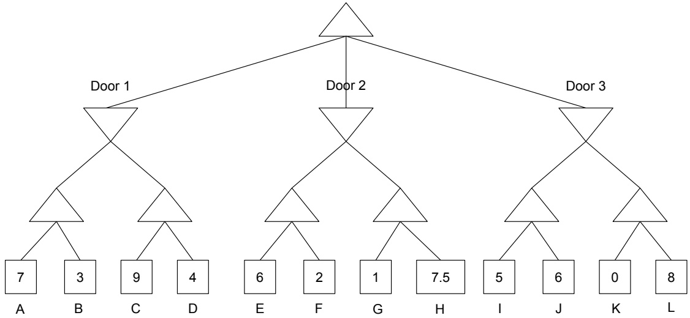
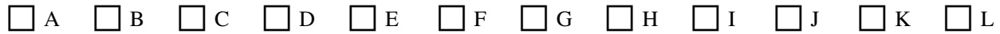
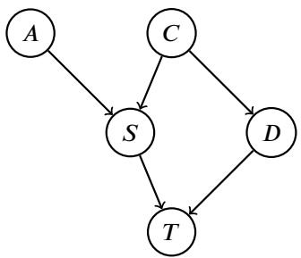
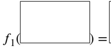
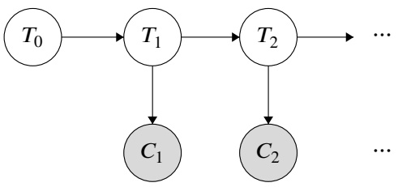
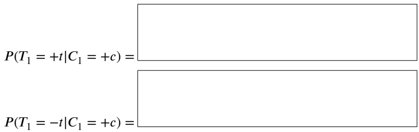
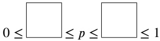
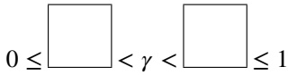
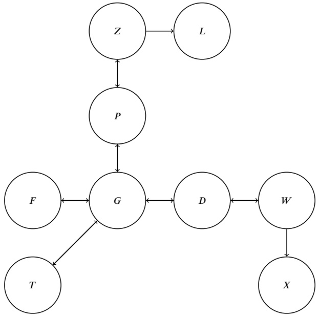

<!-- page: 1 -->

## CS 188 Introduction to Summer 2023Artificial Intelligence

• You have 170 minutes.

• The exam is closed book, no calculator, and closed notes, other than two double-sided cheat sheets that you may reference.

• For multiple choice questions,

means mark **all options** that apply

means mark a single choice

• For numerical calculation questions, you may leave your answer unsimplified but **show your work**

| First name |  |
| --- | --- |
| Last name |  |
| SID |  |
| Exam Room |  |
| Name and SID of person to the right |  |
| Name and SID of person to the left |  |
| Discussion TAs (or None) |  |

Honor code: “As a member of the UC Berkeley community, I act with honesty, integrity, and respect for others.”

By signing below, I affirm that all work on this exam is my own work, and honestly reflects my own understanding of the course material. I have not referenced any outside materials (other than two double-sided crib sheet), nor collaborated with any other human being on this exam. I understand that if the exam proctor catches me cheating on the exam, that I may face the penalty of an automatic "F" grade in this class and a referral to the Center for Student Conduct.

Signature:

Point Distribution

| Q1. Potpourri: Blast from the Past | 10 |
| --- | --- |
| Q2. Bayes Nets: Across the Spider-Verse | 13 |
| Q3. HMMs: Head TA Kirby | 12 |
| Q4. Decision Networks: Coin Toss Game | 15 |
| Q5. MDPs: Jim &amp; Pam Part 2 | 13 |
| Q6. Reinforcement Learning: Island Hopping | 12 |
| Q7. Machine Learning: Hotdog vs. Not Hotdog | 13 |
| Q8. Neural Nets: Quadratic Activation Function | 10 |
| Total | 98 |

<!-- page: 2 -->

## Q1. [10 pts] Potpourri: Blast from the Past

**(a) Search.** Barbie and Ken are in a building of size $H \times W \times L$ Each cell of the building may or may not contain a toy, and their mission is to collect all of the toys. It is okay for Barbie and Ken to be in the same cell of the building.

**(i)** [2 pts] Propose a minimal state space representation for this problem.

**(ii)** [2 pts] What is the size of the state space?

## (b) [2 pts] CSPs.

Alice is scheduling job interviews. Nine different companies reached out to interview her this coming week, and she is panicked trying to schedule all of them in just five days! For the nine companies, three are big $( B _ { 1 } ,   B _ { 2 } ,   B _ { 3 } )$ , three are medium $( M _ { 1 } , M _ { 2 } , M _ { 3 } )$ , and three are small $( S _ { 1 } , S _ { 2 } , S _ { 3 } )$ . Write down her constraints formally below:

| Index | Explanation | Constraint |
| --- | --- | --- |
| A | You should interview with 𝐵2 on Friday. | 𝐵2 = 5 |
| B | You should interview with 𝐵3 on Monday. |  |
| C | You should interview with 𝑆1 on either Monday or Tuesday. | 𝑆1 ∈ {1,2} |
| E | You should interview with 𝑆2 after 𝑆1 (cannot be on the same day). |  |
| G | You should take at least two days break after 𝑀2 before 𝑀3 (If 𝑀2 occurs on Monday, the earliest 𝑀3 can occur is Thursday). |  |
| H | You should interview with 𝑀3 after 𝐵1 (cannot be on the same day), since they have the same interview style. |  |

<!-- page: 3 -->

(c) [4 pts] Games.

**(i)** [2 pts] Fill out the values on the game tree. Which door does the top maximizer node choose?

\# Door 1 # Door 2 # Door 3

**(ii)** [2 pts] Which terminal nodes are never explored as a consequence of pruning? (Assume that we prune on equality.)

\# None of the above

<!-- page: 4 -->

## Q2. [13 pts] Bayesian Networks: Across the Spider-Verse

Miles is curious about the probability that he arrives to school on time. The factors involved with him arriving to school on time can be represented by the following Bayes Net (assume that each variable is a binary variable):

• 𝐴: Sets alarm

• 𝑆: Over sleeps

• 𝐷: Dad is late

• 𝐶: Fighting crime last night

• 𝑇 : Arrives at school on time

**(a)** [7 pts] Miles wants to calculate 𝑃 (𝐶|𝑇 ) using variable elimination. Assume he eliminates variables in alphabetical order (𝐴, 𝐷, 𝑆).

**(i)** [1 pt] What factors does he have available at the start?

**(ii)** [1 pt] First, he eliminates 𝐴, and get the new factor

Write out the remaining factors

**(iii)** [1 pt] Then, he eliminates 𝐷, and get the new factor

Write out the remaining factors

**(iv)** [1 pt] Then, he eliminates 𝑆, and get the new factor

Write out the remaining factors

**(v)** [1 pt] Finally, join any remaining factors to calculate

**(vi)** [1 pt] How can he use this to calculate 𝑃 (𝐶 = +𝑐|𝑇 = −𝑡)? Your answer should be in terms of $f _ { 4 } .$

$$
P (C = + c | T = - t) = \lfloor
$$

**(vii)** [1 pt] Order factors $f _ { 1 } , f _ { 2 }$ , and $f _ { 3 }$ in increasing order of size.

<!-- page: 5 -->

The following CPTs correspond to the Bayes Net above:

<table><tbody><tr><td>𝐴</td><td>𝐶</td><td>𝑆</td><td>𝑃(𝑆|𝐴,𝐶)</td><td>𝑇</td><td>𝐷</td><td>𝑆</td><td>𝑃(𝑇|𝑆,𝐷)</td><td>𝐶</td><td>𝐷</td><td>𝑃(𝐷|𝐶)</td></tr><tr><td>+𝑎</td><td>+𝑐</td><td>+𝑠</td><td>11∕16</td><td>+𝑡</td><td>+𝑑</td><td>+𝑠</td><td>1∕20</td><td>+𝑐</td><td>+𝑑</td><td>1∕4</td></tr><tr><td>+𝑎</td><td>+𝑐</td><td>-𝑠</td><td>5∕16</td><td>+𝑡</td><td>+𝑑</td><td>-𝑠</td><td>2∕5</td><td>+𝑐</td><td>-𝑑</td><td>3∕4</td></tr><tr><td>+𝑎</td><td>-𝑐</td><td>+𝑠</td><td>1∕8</td><td>+𝑡</td><td>-𝑑</td><td>+𝑠</td><td>1∕5</td><td>-𝑐</td><td>+𝑑</td><td>0</td></tr><tr><td>+𝑎</td><td>-𝑐</td><td>-𝑠</td><td>7∕8</td><td>+𝑡</td><td>-𝑑</td><td>-𝑠</td><td>1</td><td>-𝑐</td><td>-𝑑</td><td>1</td></tr><tr><td>-𝑎</td><td>+𝑐</td><td>+𝑠</td><td>9∕10</td><td>-𝑡</td><td>+𝑑</td><td>+𝑠</td><td>19∕20</td><td rowspan="4" colspan="3"></td></tr><tr><td>-𝑎</td><td>+𝑐</td><td>-𝑠</td><td>1∕10</td><td>-𝑡</td><td>+𝑑</td><td>-𝑠</td><td>3∕5</td></tr><tr><td>-𝑎</td><td>-𝑐</td><td>+𝑠</td><td>1∕5</td><td>-𝑡</td><td>-𝑑</td><td>+𝑠</td><td>4∕5</td></tr><tr><td>-𝑎</td><td>-𝑐</td><td>-𝑠</td><td>4∕5</td><td>-𝑡</td><td>-𝑑</td><td>-𝑠</td><td>0</td></tr></tbody></table>

| 𝐶 | 𝑃(𝐴) |
| --- | --- |
| -𝑐 | 4∕5 |
| +𝑐 | 1∕5 |

| 𝐴 | 𝑃(𝐴) |
| --- | --- |
| -𝑎 | 1∕4 |
| +𝑎 | 3∕4 |

Miles is now interested in calculating $P ( C = + c | T = - t )$ via sampling. He generates the following random samples (assume the variables were generated from left to right):

| Sample | 𝐴 | 𝐶 | 𝑆 | 𝐷 | 𝑇 |
| --- | --- | --- | --- | --- | --- |
| 1 | +𝑎 | -𝑐 | -𝑠 | -𝑑 | +𝑡 |
| 2 | +𝑎 | -𝑐 | +𝑠 | -𝑑 | -𝑡 |
| 3 | +𝑎 | +𝑐 | +𝑠 | -𝑑 | -𝑡 |
| 4 | -𝑎 | -𝑐 | -𝑠 | +𝑑 | -𝑡 |
| 5 | -𝑎 | -𝑐 | +𝑠 | +𝑑 | -𝑡 |

**(b)** [3 pts] Assuming Miles uses prior sampling:

**(i)** [1 pt] Bubble in the samples that Miles uses to calculate the final probability.

□ 1

□ 2

□ 3

□ 4

□ 5

**(ii)** [2 pts] What is the probability he calculates via prior sampling?

𝑃 (𝐶 = +𝑐|𝑇 = −𝑡) =

**(c)** [3 pts] Now assuming Miles uses likelihood weighting:

**(i)** [1 pt] What weight does Miles assign to each sample?

Sample 1:

Sample 2:

Sample 3:

Sample 4:

Sample 5:

What final probability does he calculate?

**(ii)** [2 pts] What is the probability he calculates via likelihood weighting?

𝑃 (𝐶 = +𝑐|𝑇 = −𝑡) =

<!-- page: 6 -->

## Q3. [12 pts] HMMs: Head TA Kirby

Kirby is serving as a TA. He wants to evaluate his teaching performance after each of his weekly discussion sections, and he does so based on how much his students collaborate during his section. He models this situation using an HMM.

| 𝑇𝑖+1 | 𝑇𝑖 | 𝑃(𝑇𝑖+1\|𝑇𝑖) |
| --- | --- | --- |
| +t | +t | 0.7 |
| -t | +t | 0.3 |
| +t | -t | 0.4 |
| -t | -t | 0.6 |

| 𝑇0 | 𝑃(𝑇0) |
| --- | --- |
| +t | 0.6 |
| -t | 0.4 |

| 𝐶𝑖 | 𝑇𝑖 | 𝑃(𝐶𝑖\|𝑇𝑖) |
| --- | --- | --- |
| +c | +t | 0.5 |
| -c | +t | 0.5 |
| +c | -t | 0.1 |
| -c | -t | 0.9 |

$T _ { i }$ is a binary random variable representing whether Kirby taught sufficiently well during Week $i . \; C _ { i }$ is another binary random variable representing whether students collaborated during Week 𝑖. He does not see his students’ collaboration during Week 0.

**(a)** [8 pts] Using the two steps of the forward algorithm, calculate the distribution of $P ( T _ { 1 } | C _ { 1 } \; = \; + c )$ . For the sake of organization, you may use the first box for the **time elapse** update and the second box for the **observation** update. You may also leave your final answers unsimplified (for example, as fractions).

Time elapse update:

Observation update:

<!-- page: 7 -->

**(b)** [4 pts] In order to save computational resources, Kirby turns to particle filtering to analyze this HMM.

**(i)** [2 pts] At timestep $t = 3 ,$ , Kirby has observed the following evidence: $C _ { 1 } = + c ,   C _ { 2 } = - c ,$ and $C _ { 3 } = + c$ . Following the particle filtering algorithm, assign weights to particles in the following states at $t = 3$

Particles in state +t will have weight:

Particles in state -t will have weight:

**(ii)** [2 pts] At timestep $t = 6 ,$ we observe 3 particles in state +𝑡 and 5 particles in state −𝑡, and $C _ { 6 } = - c$ . Fill in the table describing the distribution that we resample our new particles from for 𝑡 = 7. Show any work in the box on the left.

| 𝑇7 | 𝑃(𝑇7) |
| --- | --- |
| +t |  |
| -t |  |

<!-- page: 8 -->

## Q4. [15 pts] Decision Networks: Coin Toss Game

Alice and Bob are participating in a coin toss game. Both players toss two fair coins. Bob’s coins are revealed first, after which he must choose to “continue” or “concede”. If he concedes, Bob loses \$2 and the game ends. If he continues, Alice’s coins are revealed. If Bob’s coin toss resulted in strictly more heads than Alice’s, he wins \$10. However, if he has an equal or lesser number of heads than Alice, Bob loses \$10. Assume Bob is rational and his utility is the amount of money he wins.

**(a)** [2 pts] Sketch the decision network for the game, use the following nodes and node types.

**Nodes:** 𝐵 represents the number of heads in Bob’s coins; 𝐴 represents the number of heads in Alice’s coins; 𝐶 represents Bob’s choice to continue or concede; 𝑈 represents Bob’s utility.

**Node types:** An elliptical node represents a chance node; a rectangular node represents an action node; a diamond-shaped node represents utility.

𝐶 𝑈

## 𝐵 𝐴

**(b)** [3 pts] For each scenario where Bob gets 0, 1, or 2 heads, what should Bob’s decision be: to "continue or "concede"? Justify your answer.

**(i)** [1 pt] If Bob gets 0 heads:

**(ii)** [1 pt] If Bob gets 1 heads:

**(iii)** [1 pt] If Bob gets 2 heads:

<!-- page: 9 -->

**(c)** [3 pts] What is the expected monetary gain or loss for Bob in a game?

**(d)** [2 pts] Bob perceives the game as unfair and refuses to participate. To persuade him, Alice proposes an additional rule: Bob can pay Alice 𝑐 dollars $( c > 0 )$ to see one of Alice’s coins before seeing his own coins. **Sketch the decision network for the modified coin toss game.**

**New node:** 𝑅 represents the revealed coin, either head (𝑅 = 𝐻) or tail (𝑅 = 𝑇 ). 𝑆 represents Bob’s decision of whether to see one of Alice’s coins.

𝐶 𝑈 𝑆

## 𝑅

**(e)** [2 pts] Following the previous part, calculate the conditional distribution of 𝐴 given 𝑅 and fill in the table:

| 𝑅 | Pr(𝐴 = 0\|𝑅) | Pr(𝐴 = 1\|𝑅) | Pr(𝐴 = 2\|𝑅) |
| --- | --- | --- | --- |
| 𝐻 |  |  |  |
| 𝑇 |  |  |  |

**(f)** [3 pts] (**Extra Credit!!!!!**, do this last) Following the previous two parts, Alice secretly insists that this new rule should not impact her expected gain. What should the value of 𝑐 be to meet this condition? Justify your answer.

<!-- page: 10 -->

## Q5. [13 pts] MDPs: Jim & Pam Part 2

Jim and Pam are on a 1𝑥5 grid, where Jim starts at square 1, and Pam is fixed at square 5.

| Jim |  |  |  | Pam |
| --- | --- | --- | --- | --- |

In each time step, Jim chooses to either move right or to rest. Choosing to move succeeds with probability 𝑝 and fails with probability 1 −𝑝, in which case Jim stays in his original square (Jim received 0 utility regardless of success or failure). Choosing to rest always succeeds, and gives $\dot { R ( d ) } = 4 ^ { 5 - d }$ utility, where 𝑑 is the distance between Jim and Pam. For example, at the start, where $d = 4 .$ , if Jim decides to rest, he gets 4 utility. We represent this as an infinite horizon MDP with no terminal state.

**(a)** [3 pts] Jim is considering two policies:

**Policy 1**: Rest at the start forever.

**Policy 2**: Attempt to move right once, and then, regardless of success or failure, rest forever.

Assuming that Jim starts in square 1, for what values of 𝑝 is Policy 1 superior to Policy 2 when the discount factor $\gamma = 0 . 5 ?$ Hint: the sum 𝑆 of an infinite geometric series with starting value 𝑎 and ratio 𝑟 is $\begin{array} { r } { \dot { S } = \frac { a } { 1 - r } } \end{array}$

Show your work. 0 ≤ ≤ 𝑝 ≤ ≤ 1

**(b)** [3 pts]

Now assume that $p = 1$ . Still assuming that Jim starts in square 1, for what values of 𝛾 is Policy 1 superior to Policy 2?

Show your work. 0 ≤ < 𝛾 < ≤ 1

<!-- page: 11 -->

**(c)** [7 pts] For the following subparts, assume that $\gamma = 0 . 5$ and $p = 1$

**(i)** [3 pts] Perform two iterations of value iteration, for the following locations of Jim. Show your work.

| 𝑆𝑡𝑎𝑡𝑒𝑠 | 𝑠𝐽 = 1 | 𝑠𝐽 = 2 | 𝑠𝐽 = 3 | 𝑠𝐽 = 4 | 𝑠𝐽 = 5 |
| --- | --- | --- | --- | --- | --- |
| 𝑉0 | 0 | 0 | 0 | 0 | 0 |
| 𝑉1 |  |  |  |  |  |
| 𝑉2 |  |  |  |  |  |

(ii) [3 pts] Perform two iterations of policy iteration for the following locations of Jim.

| 𝑆𝑡𝑎𝑡𝑒𝑠 | 𝑠𝐽 = 1 | 𝑠𝐽 = 2 | 𝑠𝐽 = 3 | 𝑠𝐽 = 4 | 𝑠𝐽 = 5 |
| --- | --- | --- | --- | --- | --- |
| 𝜋𝑖 | 𝑎𝐽 = right | 𝑎𝐽 = rest | 𝑎𝐽 = rest | 𝑎𝐽 = rest | 𝑎𝐽 = rest |
| 𝑉𝜋𝑖 |  |  |  |  |  |
| 𝜋𝑖+1 |  |  |  |  |  |
| 𝑉𝜋𝑖+1 |  |  |  |  |  |
| 𝜋𝑖+2 |  |  |  |  |  |

**(iii)** [1 pt] Assuming that policy iteration has converged, Jim argues it isn’t guaranteed values have converged yet, so they need to run value iteration to get the correct values. Pam agrees that policy convergence doesn’t guarantee value convergence, but thinks that we don’t need to switch to value iteration, as if we continue running policy iteration, eventually the values will converge as well. Who is correct and why?

Jim Pam

<!-- page: 12 -->

# Q6. [12 pts] Reinforcement Learning: Island Hopping

Bob wants to traverse different islands to reach the island X. He formulates the problem as an MDP where the islands (nodes) represent the states and the arrows represent the possible actions he can take across the seas. Use the direction of the arrows (up, down, left, right) to refer to the specific actions that can be taken.

(a) [2 pts] Bob’s ship doesn’t always move in the direction that he wants it to. Despite this, he wants to use MLE to build an estimate of the transition function 𝑇̂ and the reward function 𝑅̂ for model-based reinforcement learning. He follows some specified policy and collects some data in the form of (current state, action, next state, reward) tuples shown below:

| State (s) | Action (a) | New State (s') | Reward |
| --- | --- | --- | --- |
| F | Right | G | 20 |
| D | Right | G | -10 |
| G | Up | T | -30 |
| P | Down | Z | -15 |
| G | Right | D | 30 |
| W | Down | D | -25 |
| G | Right | D | 30 |
| D | Left | G | -5 |
| G | Right | T | -30 |
| W | Down | X | 100 |

**(i)** [1 pt] What is 𝑇̂ (G, Right, D)?

**(ii)** [1 pt] What is 𝑅̂ (W, Down, D)?

<!-- page: 13 -->

**(b)** [3 pts] Bob looks to use temporal difference learning to learn the values of 𝜋, where he has the following initial values:

| s | F | G | T | P | Z | L | D | W | X |
| --- | --- | --- | --- | --- | --- | --- | --- | --- | --- |
| 𝑉𝜋(𝑠) | 5 | 10 | -4 | 8 | 2 | -10 | 10 | 30 | 50 |

He performs one update step using the sample (G, Right, D, 30). Assume a discount factor $\gamma = 0 . 5$ and the learning rate $\alpha = 0 . 2$ . What is the updated value of $V ^ { \pi } ( G ) ?$ Show all your work leading to your answer.

**(c)** [2 pts] Bob wants to have a greedy policy that will minimize exploration and maximize exploitation. Which of the following functions 𝑓 will do so? Assume 𝑘 is a positive real number, 𝑁(𝑠, 𝑎) represents the number of times that the state-action pair is taken, and 𝜖 is a very small number greater than 0.

$$
\square f (s, a) = Q (s, a) + \frac {k}{N (s , a)}
$$

$$
\square f (s, a) = Q (s, a) + k \cdot e ^ {N (s, a)}
$$

$$
\square f (s, a) = k \cdot Q (s, a) - \log (N (s, a))
$$

$$
\square f (s, a) = \frac {\epsilon}{k \cdot Q (s , a) \cdot N (s , a)}
$$

$$
\square f (s, a) = \frac {N (s , a) \cdot Q (s , a)}{\epsilon}
$$

None of the above

**(d)** [5 pts] Bob now switches to Q-learning, where he wants to perform approximate Q-learning for $Q ( G , r i g h t )$ . Assume he has 𝑤𝑖, which denotes the 𝑖th value of a weight vector 𝑤 and $f _ { i } ( s , a )$ , which denotes the value of the 𝑖th feature of the Q-state (𝑠, 𝑎). He has the following values and observations:

| State (s) | Action (a) | New State (s') | Reward (r) |
| --- | --- | --- | --- |
| G | Right | D | 10 |
| P | Up | Z | 1 |

| 𝑤1 | 𝑤2 | 𝑤3 |
| --- | --- | --- |
| 2 | 5 | 10 |

| 𝑓1(𝐺,𝑅𝑖𝑔ℎ𝑡) | 𝑓2(𝐺,𝑅𝑖𝑔ℎ𝑡) | 𝑓3(𝐺,𝑅𝑖𝑔ℎ𝑡) |
| --- | --- | --- |
| 6 | 3 | 4 |

| State | P | Z | D |
| --- | --- | --- | --- |
| Q(State, Up) | 2 | 0 | 0 |
| Q(State, Down) | 5 | 7 | 0 |
| Q(State, Left) | 0 | 0 | 2 |
| Q(State, Right) | 0 | -8 | 22 |

<!-- page: 14 -->

**(i)** [3 pts] What is the initial value of 𝑄(𝐺, 𝑅𝑖𝑔ℎ𝑡) based on the above weights and features?

**(ii)** [2 pts] What is the resulting weight vector after performing the first iteration of the weight update rule for going right on G? This time, assume a discount factor $\gamma = 0 . 5$ and learning rate $\alpha = 0 . 5$

<!-- page: 15 -->

## Q7. [13 pts] Machine Learning: Hotdog vs. Not Hotdog

Bob is building a model to classify whether a picture contains a Hotdog or not. He uses two binary features: whether the picture has brown color in it and whether there is red color in it. He collects this training set:

| Brown Color ($W_1$) | Red Color ($W_2$) | Label (y) |
| --- | --- | --- |
| 1 | 0 | not hotdog |
| 1 | 0 | not hotdog |
| 1 | 0 | not hotdog |
| 1 | 1 | not hotdog |
| 1 | 1 | hotdog |
| 0 | 0 | hotdog |

**(a)** [5 pts] He first builds a Naive Bayes model. Calculate the following probabilities.

$$
\begin{array}{l} \text {(i)} [ 1 \text {pt} ] P (y = \text {hotdog}) = \\ \text {(ii)} [ 4 \text {pts} ] P (W _ {1} = 1 \mid y = \text {hotdog}) = \\ P (W _ {2} = 1 \mid y = \text {hotdog}) = \\ P (W _ {1} = 1 \mid y = \text {not hotdog}) = \\ P (W _ {2} = 1 \mid y = \text {not hotdog}) = \end{array} \quad \begin{array}{l} P (y = \text {not hotdog}) = \\ P (W _ {1} = 0 \mid y = \text {hotdog}) = \\ P (W _ {2} = 0 \mid y = \text {hotdog}) = \\ P (W _ {1} = 0 \mid y = \text {not hotdog}) = \\ P (W _ {2} = 0 \mid y = \text {not hotdog}) = \end{array}
$$

**(b)** [3 pts] Next, he uses the model to classify three pictures that are from the test set. Fill in the predicted labels in the table.

Test set

<table><tbody><tr><td rowspan="2">Brown Color (𝑊1)</td><td rowspan="2">Red Predicted Color (𝑊2) Label (𝑦̂)</td></tr><tr></tr><tr><td>1</td><td>1</td></tr><tr><td>0</td><td>1</td></tr><tr><td>0</td><td>0</td></tr></tbody></table>

**(c)** [5 pts] Bob then adds two new examples to his training set, as shown below.

Additional training examples

| Brown Color ($W_1$) | Red Color ($W_2$) | Label (y) |
| --- | --- | --- |
| 0 | 0 | not hotdog |
| 0 | 1 | not hotdog |

<!-- page: 16 -->

**(i)** [3 pts] Now re-classify the test set using the new larger training set (hint: don’t forget to update the prior for each class with the new dataset).

<table><tr><td colspan="3">Test set</td></tr><tr><td>Brown Color ( $W_1$ )</td><td>Red Color ( $W_2$ )</td><td>Predicted Label ( $\hat{y}$ )</td></tr><tr><td>1</td><td>1</td><td></td></tr><tr><td>0</td><td>1</td><td></td></tr><tr><td>0</td><td>0</td><td></td></tr></table>

**(ii)** [2 pts] Did any of the predictions change? Why?

<!-- page: 17 -->

## Q8. [10 pts] Neural Networks: Quadratic Activation Function

Consider the following neural network, where the input is $x \in \mathbb { R } ^ { d }$ and the output is a real number prediction $\hat { y } \in \mathbb { R }$ . We have two neural network weight matrices: $W _ { 1 } \in \mathbb { R } ^ { n _ { 1 } \times n _ { 2 } }$ and $W _ { 2 } \in \mathbb { R } ^ { k }$ , where $k , d$ are known numbers and you need to find out the value of $n _ { 1 }$ and $n _ { 2 }$ . We consider the following neural network:

$$
z = W _ {1} x; \quad \hat {y} := W _ {2} ^ {T} g (z)\tag{1}
$$

with a quadratic activation function:

$$
g (z) := z \odot z\tag{2}
$$

where ⊙ means element-wise multiplication. For example, $g ( { \begin{bmatrix} { 1 } \\ { 2 } \\ { 3 } \end{bmatrix} } ) = { \begin{bmatrix} { 1 } \\ { 4 } \\ { 9 } \end{bmatrix} } .$

We consider a quadratic loss function:

$$
\mathcal {L} (W _ {1}; W _ {2}) := \frac {1}{2} (y - \hat {y}) ^ {2}\tag{3}
$$

**(a)** [2 pts] What’s the value of $n _ { 1 }$ and $n _ { 2 }$ if the above neural network is valid? You can write the answer in terms of 𝑘 and 𝑑

$$
(1 \mathrm{pt}) n _ {1} = \boxed {\quad}
$$

$$
(1 \mathrm{pt}) n _ {2} = \boxed {\quad}
$$

**(b)** [4 pts] Calculate the derivative of the loss function with respect to the following quantities. Your answer should **NOT** include the activation function $g ( \mathbf { i } . \mathbf { e } .$ , you need to explicitly calculate the derivative of $g$ rather than writing $g ^ { \prime } . )$ On the other hand, your answer can include $x , y , \hat { y } , W _ { 1 } , W _ { 2 } ,$ and 𝑧.

$$
(2 \text {pts}) \frac {\partial \mathcal {L}}{\partial W _ {2}} = \boxed {\quad}
$$

$$
(2 \text {pts}) \frac {\partial \mathcal {L}}{\partial x} = \boxed {\quad}
$$

**(c)** [4 pts] We have realized that the model is not getting the accuracy that we were hoping for. For each of the following possible solutions below, answer yes or no if they could possibly improve the model accuracy.

**(i)** [1 pt] If the model is overfitting, we can try to make it more complex by increasing the number of layers.

**(ii)** [1 pt] If the model is overfitting, we can try to make it simpler by decreasing the number of layers.

**(iii)** [1 pt] We could try to improve accuracy by getting more training data.

**(iv)** [1 pt] We could try out different <u>types o</u>f models instead of neural networks $( \mathbf { e . g . }$ , Naive bayes) and see which one works best on the validation set.
