<!-- page: 1 -->

Solutions last updated: Dec 26, 2024

• You have 170 minutes.

• The exam is closed book, no calculator, and closed notes, other than two double-sided cheat sheets that you may reference.

• Anything you write outside the answer boxes or you ~~cross out~~ will not be graded. If you write multiple answers, your answer is ambiguous, or the bubble/checkbox is not entirely filled in, we will grade the worst interpretation.

For questions with **circular bubbles**, you may select only one choice.

For questions with **square checkboxes**, you may select one or more choices.

Unselected option (completely unfilled)

You can select

Only one selected option (completely filled)

multiple squares (completely filled)

Don’t do this (it will be graded as incorrect)

Don’t do this (it will be graded as incorrect)

| First name |  |
| --- | --- |
| Last name |  |
| SID |  |
| Name of person to the right |  |
| Name of person to the left |  |
| Discussion TAs (or None) |  |

**Honor code**: “As a member of the UC Berkeley community, I act with honesty, integrity, and respect for others.”

By signing below, I affirm that all work on this exam is my own work, and honestly reflects my own understanding of the course material. I have not referenced any outside materials (other than my cheat sheets), nor collaborated with any other human being on this exam. I understand that if the exam proctor catches me cheating on the exam, that I may face the penalty of an automatic "F" grade in this class and a referral to the Center for Student Conduct.

Signature:

<!-- page: 2 -->

Point Distribution

| Q1. Potpourri | 9 |
| --- | --- |
| Q2. Acornomics | 14 |
| Q3. Monotonic Alignment | 18 |
| Q4. CSPeech | 17 |
| Q5. Froogle Maps | 13 |
| Q6. Machine Learning: Easter Island | 18 |
| Q7. Square Bayes | 11 |
| Total | 100 |

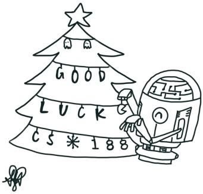

Doodle credit: Samantha Huang

<!-- page: 3 -->

## Clarifications

These clarifications were given on the exam:

• $\mathrm { Q 6 ( g ) }$ the answer choices in the left column should read $w _ { 1 } = \ldots$ and $b _ { 1 } = . .$ instead of $w _ { 1 } = . .$ and $b _ { 2 } = . .$

• Q2(c), (d), and (e) only, the rightmost column should be:

$$
\square 1 + p \rightarrow
$$

$$
\square 1 - p \gamma
$$

$$
\boxed {\begin{array}{c}1 + \gamma\end{array}} \rightarrow
$$

$$
\boxed { \begin{array}{c} 1 + p \gamma \end{array} }
$$

$$
\square \quad \infty \quad \rightarrow
$$

$$
\square \frac {1}{1 - p \gamma}
$$

• Q4 subparts (e)-(i) are all independent from each other.

• Q4 the sequence of 4 words "the", "???", "???", and "loudly" apply to the whole question

• Q3(c) Assume that log $0 = - \infty$ (negative infinity)

<!-- page: 4 -->

## Q1. [9 pts] Potpourri

For the next three subparts, consider the search problem below, with start state 𝑆 and a single goal state 𝐺.

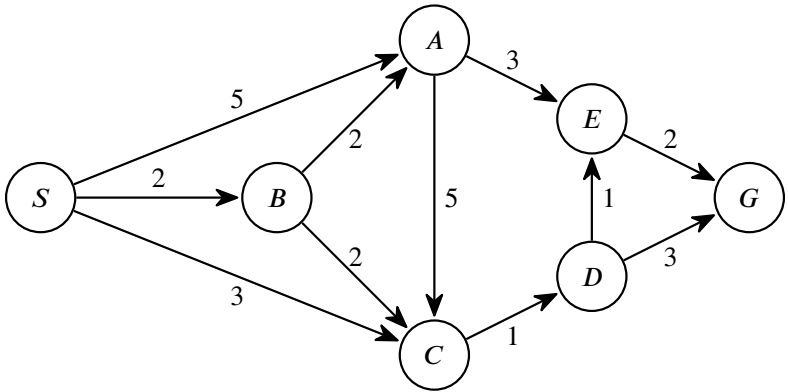

Assume that when you expand a state, you add its successors on the fringe in alphabetical order. For example, if you expand 𝐵, then 𝐴 is added to the fringe first, then 𝐶.

**(a)** [2 pts] What will be the path returned by DFS Graph Search on the search problem above?

Hint: DFS uses a stack. When expanding 𝐴, you push 𝐶, then you push 𝐸. This causes 𝐸 to be popped off before 𝐶.

$S \rightarrow C \rightarrow D \rightarrow G$ $S \to C \to D \to E \to G$ $S \to A \to C \to D \to E \to G$ $S \rightarrow A \rightarrow E \rightarrow G$

We start by putting just the start state on the fringe: Fringe: { S } We pop the most-recently-added item off the stack, namely S. Fringe: { S } Then, we add all of S’s successors onto the stack: Fringe: { **SA SB SC** } Per the hint, we added SA, SB, SC, in that order. Since we added SC most-recently, it is the next item popped off the stack. Fringe: { SA SB SC } Then, we add all of SC’s successors onto the stack: Fringe: { SA SB **SCD** } The most-recently-added item on the stack is SCD, so we pop SCD off the stack next. Fringe: { SA B ~~SCD~~ } Then, we add all of SCD’s successors onto the stack: Fringe: { SA SB **SCDE SCDG** } Per the hint, we added SCDE and SCDG in that order. Since SCDG was added most recently, it is the next item popped off the stack. SCDG reaches the goal, and we’ve popped this solution off the stack, so we are done.

**(b)** [1 pt] In BFS Graph Search, how many times does the successor function get called on state 𝐶?

<!-- page: 5 -->

\# 0 1 # 2 # 3

In BFS **Graph** Search, we only expand a state once, and after that, the state has been visited, so we never expand it again.

**(c)** [2 pts] In BFS Tree Search, how many times does the successor function get called on state 𝐶? # 0 # 1 # 2 3

We start by putting just the start state on the fringe: Fringe: { S } We pop the oldest item off the queue, namely S. Fringe: { S } Then, we add all of S’s successors onto the queue:

<!-- page: 6 -->

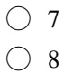

The oldest item still on the queue is SCD, so we’ll pop off SCD next. Fringe: { ~~SCD~~ SACD SAEG SBAC SBAE SBCD } Then, we’ll add all of SCD’s successors onto the fringe. Fringe: { SACD SAEG SBAC SBAE SBCD **SCDE SCDG** } The oldest item still on the queue is SACD, so we’ll pop off SACD next. Fringe: { ~~SACD~~ SAEG SBAC SBAE SBCD SCDE SCDG } Then, we’ll add all of SACD’s successors onto the fringe. Fringe: { SAEG SBAC SBAE SBCD SCDE SCDG **SACDE SACDG** } The oldest item still on the queue is SAEG, so we’ll pop off SAEG next. Fringe: { ~~SAEG~~ SBAC SBAE SBCD SCDE SCDG SACDE SACDG } SAEG is a valid path to the goal, so we are done. In total, we called the successor function on state C three times.

For the next two subparts, consider the following minimax tree. The upwards arrows indicate maximizer nodes and downwards arrows indicate minimizer nodes. The squares indicate terminal leaf nodes.

**(d)** [1 pt] What is the value of the game tree at the root node?

$$
\begin{array}{c} \bigcirc 1 \\ \bigcirc 2 \end{array}
$$

3 # 4 ● 5 # 6

**(e)** [3 pts] We run alpha-beta pruning from left to right. Select all nodes that will be pruned from the game tree.

$$
\begin{array}{c c} \square & A \\ \square & B \\ \square & C \end{array}
$$

$$
\begin{array}{c c} \hline & D \\ \hline \hline & E \\ \hline \square & F \end{array}
$$

𝐺 𝐻 None

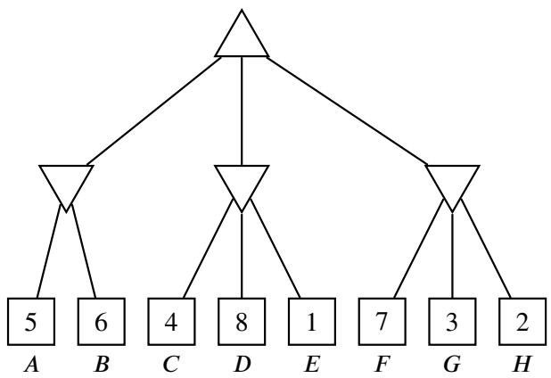

## Part (d) solution:

Here’s the tree with the values at the minimizer and maximizer nodes filled in:

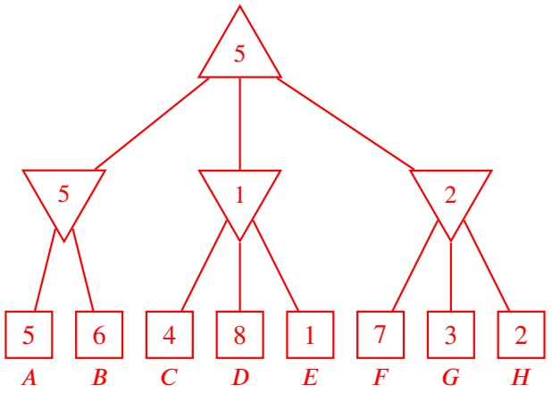

<!-- page: 7 -->

## Part (e) solution:

The game tree, reproduced for your reading convenience:

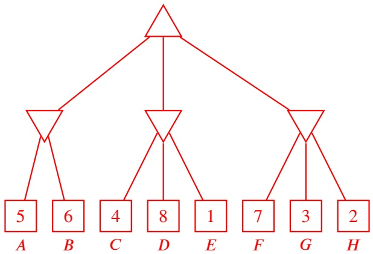

We visit 𝐴 and 𝐵 to learn that the left minimizer node has value 5.

Next, we visit 𝐶. We now know that the middle minimizer has value 4 or lower.

Think about the maximizer at the top. The maximizer at the top will always prefer to go to the left (getting 5) instead of going to the middle (getting 4 or lower). Thus, we can prune 𝐷 and 𝐸.

In other words, 𝐷 and 𝐸’s values won’t change the maximizer’s decision. If their values are very positive, then the middle minimizer will have value 4, and the maximizer will prefer to go left (getting 5).

On the other hand, if their values are very negative, then the middle minimizer will have a very negative value, and the maximizer will still prefer to go left (getting 5). Since 𝐷 and 𝐸’s values won’t change the maximizer’s decision, we can prune them.

Next, we visit 𝐹. At this point, we now know that the right minimizer has value 7 or lower.

Think about the maximizer at the top. Does it prefer 5 (going left), or does it prefer “7 or lower” (going right)? Either one of these could be better at this point, so we can’t prune yet. If “7 or lower” turns out to be 7, we’d prefer to go right, but if “7 or lower” turns out to be -1000, we’d prefer to go left. We need to keep exploring.

Next, we visit 𝐺. At this point, we now know that the right minimizer has value 3 or lower.

Think about the maximizer at the top. Does it prefer 5 (going left), or does it prefer “3 or lower” (going right)? The maximizer is always going to prefer 5 and go left.

In other words, if 𝐻 is very positive, the right minimizer would have value 3, and the maximizer prefers 5 (going left) over 3 (going right).

On the other hand, if 𝐻 is very negative, then the middle minimizer would have a very negative value, and the maximizer prefers 5 (going left) over very negative (going right). Since 𝐻’s value won’t change the maximizer’s decision, we can prune 𝐻.

In summary, 𝐷, 𝐸, and 𝐻 were pruned.

<!-- page: 8 -->

## Q2. [14 pts] Acornomics

Consider a squirrel living in a tree. Each day, the squirrel has two possible actions:

• **Relax**: Stay in the tree. This always earns a reward of $r _ { \mathrm { r e l a x } } > 0 .$

• **Gather**: Attempt to gather an acorn.

– With probability 𝑝, the squirrel succeeds and earns a reward of $r _ { \mathrm { a c o r n } } > 0 .$

– With probability $( 1 - p )$ , the squirrel is caught by a hawk and earns a reward of 0.

Once the squirrel is caught, no further actions or rewards are possible.

In this question, consider two policies for the squirrel:

• **Always Relax** $\pi _ { \mathrm { r e l a x } } \dot { \cdot }$ The squirrel always chooses the Relax action.

• **Always Gather** $\pi _ { \mathrm { g a t h e r } } \dot { \cdot }$ The squirrel always chooses the Gather action.

Hint: Recall the sum of a geometric series: $\sum _ { n = 0 } ^ { \infty } a _ { 1 } \cdot r ^ { n } = { \frac { a _ { 1 } } { 1 - r } } .$

For each subpart, select the **minimal** set of terms, such that their product corresponds to the answer. For example, if you think the answer is ${ \frac { p } { 1 + p } } ,$ then select only 𝑝 **and** ${ \frac { 1 } { 1 + p } } .$

For the next two subparts, assume an infinite horizon with **no discounting**.

**(a)** [2 pts] What is $V ^ { \pi _ { \mathrm { r e l a x } } }$ , the expected return if the squirrel follows the Always Relax policy?

$$
\square p
$$

$$
\square \frac {1}{p}
$$

$$
\square r _ {\mathrm{relax}}
$$

$$
\square 1 + p
$$

$$
\square 1 - p
$$

$$
\square \frac {1}{1 - p}
$$

$$
\square r _ {\text {acorn}}
$$

■ ∞

Every time we Relax, we get reward of $r _ { \mathrm { r e l a x } }$

There is no discounting, and the horizon is infinite, so if we Relax forever, our total expected return is:

$$
r _ {\text {relax}} + r _ {\text {relax}} + r _ {\text {relax}} + r _ {\text {relax}} + \dots \rightarrow \infty
$$

This sum blows up to infinity.

**(b)** [3 pts] What is $V ^ { \pi _ { \mathrm { g a t h e r } } }$ , the expected return if the squirrel follows the Always Gather policy?

$$
\square p
$$

$$
\square \frac {1}{p}
$$

$$
\square 1 - p
$$

$$
\square r _ {\text {relax}}
$$

$$
\square 1 + p
$$

$$
\frac {1}{1 - p}
$$

■ 𝑟acorn

$$
\begin{array}{c c} \square & \infty \end{array}
$$

## Solution 1 (infinite sum):

Let’s write out all the cases that the game can play out:

Squirrel is caught immediately on the first Gather action. This occurs with probability $( 1 - p )$ , and yields reward 0.

Squirrel gets acorn the first time, and then gets caught the second time. This occurs with probability $p ( 1 - p )$ , and yields reward $r _ { \mathrm { a c o r n } } .$

Squirrel gets acorn the first two times, and then gets caught the third time. This occurs with probability $p ^ { 2 } ( 1 - p )$ , and yields reward $2 r _ { \mathrm { a c o m } }$

Squirrel gets acorn the first three times, and then gets caught the fourth time. This occurs with probability $p ^ { 3 } ( 1 - p )$ , and yields reward $3 r _ { \mathrm { a c o m } }$

This continues forever, and the expected return is given by the infinite sum

$$
(1 - p) (0) + p (1 - p) \left(r _ {\text {acorn}}\right) + p ^ {2} (1 - p) \left(2 r _ {\text {acorn}}\right) + p ^ {3} (1 - p) \left(3 r _ {\text {acorn}}\right) + p ^ {4} (1 - p) \left(4 r _ {\text {acorn}}\right) + p ^ {5} (1 - p) \left(5 r _ {\text {acorn}}\right) + \dots
$$

We can rewrite this sum in a “triangle” shape like this:

<!-- page: 9 -->

$$
\begin{array}{l l l l l l} + p (1 - p) (r _ {\text {acorn}}) & + p ^ {2} (1 - p) (r _ {\text {acorn}}) & + p ^ {3} (1 - p) (r _ {\text {acorn}}) & + p ^ {4} (1 - p) (r _ {\text {acorn}}) & + p ^ {5} (1 - p) (r _ {\text {acorn}}) & \dots \\ & + p ^ {2} (1 - p) (r _ {\text {acorn}}) & + p ^ {3} (1 - p) (r _ {\text {acorn}}) & + p ^ {4} (1 - p) (r _ {\text {acorn}}) & + p ^ {5} (1 - p) (r _ {\text {acorn}}) & \dots \\ & & + p ^ {3} (1 - p) (r _ {\text {acorn}}) & + p ^ {4} (1 - p) (r _ {\text {acorn}}) & + p ^ {5} (1 - p) (r _ {\text {acorn}}) & \dots \\ & & & + p ^ {4} (1 - p) (r _ {\text {acorn}}) & + p ^ {5} (1 - p) (r _ {\text {acorn}}) & \dots \\ & & & & + p ^ {5} (1 - p) (r _ {\text {acorn}}) & \dots \\ & & & & \dots & \dots \end{array}
$$

Each term in the original sum corresponds to one column in our triangle. For example, notice that $p ^ { 3 } ( 1 - p ) ( 3 r _ { \mathrm { a c o r n } } )$ has ben replaced with three entries that each say $p ^ { 3 } ( 1 - p ) ( r _ { \mathrm { a c o r n } } )$

Each row of the triangle can be summed up using the sum of a geometric series formula given at the top of the question.

Row 1: First term is $p ( 1 - p ) ( r _ { \mathrm { a c o r n } } ) ,$ common ratio is 𝑝. Sum is $\frac { p ( 1 - p ) ( r _ { \mathrm { a c o r n } } ) } { 1 - p } = p ( r _ { \mathrm { a c o r n } } ) .$

Row 2: First term is $p ^ { 2 } ( 1 - p ) ( r _ { \mathrm { a c o r n } } )$ , common ratio is 𝑝. Sum is $\frac { p ^ { 2 } ( 1 - p ) ( r _ { \mathrm { a c o r n } } ) } { 1 - p } = p ^ { 2 } ( r _ { \mathrm { a c o r n } } )$

Row 3: First term is $p ^ { 3 } ( 1 - p ) ( r _ { \mathrm { a c o r n } } )$ , common ratio is 𝑝. Sum is $\frac { p ^ { 3 } ( 1 - p ) ( r _ { \mathrm { a c o r n } } ) } { 1 - p } = p ^ { 3 } ( r _ { \mathrm { a c o r n } } )$

Row 4: First term is $p ^ { 4 } ( 1 - p ) ( r _ { \mathrm { a c o r n } } )$ , common ratio is 𝑝. Sum is $\frac { p ^ { 4 } ( 1 - p ) ( r _ { \mathrm { a c o r n } } ) } { 1 - p } = p ^ { 4 } ( r _ { \mathrm { a c o r n } } )$

Row 5: First term is $p ^ { 5 } ( 1 - p ) ( r _ { \mathrm { a c o r n } } )$ , common ratio is 𝑝. Sum is $\frac { p ^ { 5 } ( 1 - p ) ( r _ { \mathrm { a c o r n } } ) } { 1 - p } = p ^ { 5 } ( r _ { \mathrm { a c o r n } } )$ and so on.

Now that we have one expression per row, we can write one more expression to get the sum of all the rows:

$$
p (r _ {\mathrm{acorn}}) + p ^ {2} (r _ {\mathrm{acorn}}) + p ^ {3} (r _ {\mathrm{acorn}}) + p ^ {4} (r _ {\mathrm{acorn}}) + p ^ {5} (r _ {\mathrm{acorn}}) + \dots
$$

First term is $p ( r _ { \mathrm { a c o r n } } ) ,$ common ratio is $p ,$ so our final sum is:

$$
\frac {p (r _ {\mathrm{acorn}})}{1 - p}
$$

## Solution 2 (recursive equation):

We can actually write out the game scenarios recursively.

The squirrel has infinite time steps remaining, and takes a Gather action. There are two possible outcomes:

1. The squirrel is caught immediately. This occurs with probability $( 1 - p )$ , and yields total expected return 0.

2. The squirrel gets the acorn and gets immediate reward $r _ { \mathrm { a c o r n } } .$ The squirrel is now in a scenario with infinite time steps remaining...which is exactly the same scenario we started in!

We can capture this recursive relationship with an equation. Let $V ^ { \pi _ { \mathrm { g a t h e r } } }$ be the expected return in the scenario with infinite time steps remaining. Then we can write:

$$
V ^ {\pi_ {\mathrm{gather}}} = (1 - p) (0) + p \left(r _ {\mathrm{acorn}} + V ^ {\pi_ {\mathrm{gather}}}\right)
$$

Now we just need to solve for $V ^ { \pi _ { \mathrm { g a t h e r } } }$ , which is our desired term.

$$
\begin{array}{r c l} V ^ {\pi_ {\mathrm{gather}}} & = & (1 - p) (0) + p \left(r _ {\mathrm{acorn}} + V ^ {\pi_ {\mathrm{gather}}}\right) \\ & = & p \left(r _ {\mathrm{acorn}} + V ^ {\pi_ {\mathrm{gather}}}\right) \\ & = & p \cdot r _ {\mathrm{acorn}} + p \cdot V ^ {\pi_ {\mathrm{gather}}} \\ V ^ {\pi_ {\mathrm{gather}}} - p \cdot V ^ {\pi_ {\mathrm{gather}}} & = & p \cdot r _ {\mathrm{acorn}} \\ V ^ {\pi_ {\mathrm{gather}}} \cdot (1 - p) & = & p \cdot r _ {\mathrm{acorn}} \\ V ^ {\pi_ {\mathrm{gather}}} & = & \frac {p \cdot r _ {\mathrm{acorn}}}{1 - p} \end{array}
$$

<!-- page: 10 -->

For the next three subparts, assume an infinite horizon with a discount factor of $\gamma , 0 < \gamma < 1$

**(c)** [2 pts] What is $V ^ { \pi _ { \mathrm { r e l a x } } }$ , the expected return if the squirrel follows the Always Relax policy?

$$
\square \gamma
$$

$$
\square 1 - p
$$

$$
\square 1 + p \gamma - \gamma
$$

$$
\frac {1}{1 - \gamma}
$$

$$
\square 1 - \gamma
$$

$$
\square \frac {1}{1 + p \gamma - \gamma}
$$

$$
\square 1 + p
$$

$$
\square \frac {1}{p}
$$

$$
\square \frac {1}{\gamma}
$$

$$
\square p
$$

$$
\square \frac {1}{1 - p}
$$

$$
\boldsymbol {r} _ {\text {relax}}
$$

$$
\square 1 + \gamma
$$

$$
\square r _ {\text {acorn}}
$$

$$
\square \infty
$$

Reminder: Due to the clarification, the answer choices actually look like this:

$$
\square \gamma
$$

$$
\square 1 - p
$$

$$
\frac {1}{1 - \gamma}
$$

$$
\square \frac {1}{1 + p \gamma - \gamma}
$$

$$
\square 1 + p \gamma - \gamma
$$

$$
\square 1 - p \gamma
$$

$$
\square 1 - \gamma
$$

$$
\square \frac {1}{p}
$$

$$
\square \frac {1}{\gamma}
$$

$$
\square p
$$

$$
\boldsymbol {r}_{\text{relax}}
$$

$$
\square \frac {1}{1 - p}
$$

$$
\square 1 + p \gamma
$$

$$
\square r _ {\text {acorn}}
$$

$$
\square \frac {1}{1 - p \gamma}
$$

Just like in subpart (a), every time we Relax, we get a reward of $r _ { \mathrm { r e l a x } } .$ . We have an infinite horizon, so we Relax forever. The main difference is that we now have a discount factor 𝛾, which means that later rewards are discounted. Our total expected return is now:

$$
r _ {\text {relax}} + \gamma (r _ {\text {relax}}) + + \gamma^ {2} (r _ {\text {relax}}) + \gamma^ {3} (r _ {\text {relax}}) + \gamma^ {4} (r _ {\text {relax}}) + \dots
$$

This is an infinite sum with first term $r _ { \mathrm { r e l a x } }$ , and common ratio 𝛾, so the sum is:

$$
\frac {r _ {\text {relax}}}{1 - \gamma}
$$

**(d)** [4 pts] What is $V ^ { \pi _ { \mathrm { g a t h e r } } }$ , the expected return if the squirrel follows the Always Gather policy?

$$
\square \gamma
$$

$$
\square 1 - p
$$

$$
\square \frac {1}{1 - \gamma}
$$

$$
\square 1 + p \gamma - \gamma
$$

$$
\square 1 - \gamma
$$

$$
\square \frac {1}{p}
$$

$$
\square \frac {1}{1 + p \gamma - \gamma}
$$

$$
\square 1 + p
$$

$$
\square r _ {\text {relax}}
$$

$$
\square 1 + \gamma
$$

■ 𝑝

$$
\square \frac {1}{\gamma}
$$

$$
\square \frac {1}{1 - p}
$$

$$
\boldsymbol {r}_{\text{acorn}}
$$

■ ∞

Reminder: Due to the clarification, the answer choices actually look like this:

$$
\square \gamma
$$

$$
\square 1 - p
$$

$$
\square \frac {1}{1 - \gamma}
$$

$$
\square \frac {1}{1 + p \gamma - \gamma}
$$

$$
\square 1 - p \gamma
$$

$$
\square 1 - \gamma
$$

$$
\square 1 + p \gamma - \gamma
$$

$$
\square \frac {1}{p}
$$

$$
\square 1 + p \gamma
$$

$$
\square r _ {\text {relax}}
$$

■ 𝑝

$$
\square \frac{1}{\gamma}
$$

$$
\square \frac {1}{1 - p}
$$

$$
\square r _ {\text {acorn}}
$$

$$
\frac {1}{1 - p \gamma}
$$

## Solution 1 (infinite sum):

Let’s write out all the cases that the game can play out. The math is pretty similar to part (b), but we have to include an extra discount factor 𝛾.

Squirrel is caught immediately on the first Gather action. This occurs with probability (1 − 𝑝), and yields reward 0.

Squirrel gets acorn the first time, and then gets caught the second time. This occurs with probability 𝑝(1 − 𝑝), and yields reward $r _ { \mathrm { a c o r n } } ,$

Squirrel gets acorn the first two times, and then gets caught the third time. This occurs with probability $p ^ { 2 } ( 1 - p )$ , and yields reward $r _ { \mathrm { a c o r n } } + \gamma ( r _ { \mathrm { a c o r n } } )$

Squirrel gets acorn the first three times, and then gets caught the fourth time. This occurs with probability $p ^ { 3 } ( 1 - p )$ , and yields reward $r _ { \mathrm { a c o r n } } + \gamma ( r _ { \mathrm { a c o r n } } ) + \gamma ^ { 2 } ( r _ { \mathrm { a c o r n } } )$

<!-- page: 11 -->

Squirrel gets acorn the first four times, and then gets caught the fifth time. This occurs with probability $p ^ { 4 } ( 1 - p )$ , and yields reward $r _ { \mathrm { a c o r n } } + \gamma ( r _ { \mathrm { a c o r n } } ) + \gamma ^ { 2 } ( r _ { \mathrm { a c o r n } } ) + \gamma ^ { 3 } ( r _ { \mathrm { a c o r n } } )$

Summing up all the cases gives us a sum that looks like this:

$$
\begin{array}{l} p (1 - p) \left(r _ {\mathrm{acorn}}\right) \\ + p ^ {2} (1 - p) \left(r _ {\mathrm{acorn}} + \gamma (r _ {\mathrm{acorn}})\right) \\ + p ^ {3} (1 - p) \left(r _ {\mathrm{acorn}} + \gamma (r _ {\mathrm{acorn}}) + \gamma^ {2} (r _ {\mathrm{acorn}})\right) \\ + p ^ {4} (1 - p) \left(r _ {\mathrm{acorn}} + \gamma (r _ {\mathrm{acorn}}) + \gamma^ {2} (r _ {\mathrm{acorn}}) + \gamma^ {3} (r _ {\mathrm{acorn}})\right) \\ + p ^ {5} (1 - p) \left(r _ {\mathrm{acorn}} + \gamma (r _ {\mathrm{acorn}}) + \gamma^ {2} (r _ {\mathrm{acorn}}) + \gamma^ {3} a (r _ {\mathrm{acorn}}) + \gamma^ {4} (r _ {\mathrm{acorn}})\right) \\ + \dots \end{array}
$$

Again, we can rewrite this as a triangle. Each row of the triangle below corresponds to a row of the sum above. We just distributed out the terms.

$$
\begin{array}{c c c c c} + p (1 - p) (r _ {\text {acorn}}) & & \\ + p ^ {2} (1 - p) (r _ {\text {acorn}}) & + p ^ {2} (1 - p) (\gamma) (r _ {\text {acorn}}) & & \\ + p ^ {3} (1 - p) (r _ {\text {acorn}}) & + p ^ {3} (1 - p) (\gamma) (r _ {\text {acorn}}) & + p ^ {3} (1 - p) (\gamma^ {2}) (r _ {\text {acorn}}) & \\ + p ^ {4} (1 - p) (r _ {\text {acorn}}) & + p ^ {4} (1 - p) (\gamma) (r _ {\text {acorn}}) & + p ^ {4} (1 - p) (\gamma^ {2}) (r _ {\text {acorn}}) & + p ^ {4} (1 - p) (\gamma^ {3}) (r _ {\text {acorn}}) \\ + p ^ {5} (1 - p) (r _ {\text {acorn}}) & + p ^ {5} (1 - p) (\gamma) (r _ {\text {acorn}}) & + p ^ {5} (1 - p) (\gamma^ {2}) (r _ {\text {acorn}}) & + p ^ {5} (1 - p) (\gamma^ {3}) (r _ {\text {acorn}}) & + p ^ {5} (1 - p) (\gamma^ {4}) (r _ {\text {acorn}}) \\ \dots & \dots & \dots & \dots & \dots \end{array}
$$

Now, we can sum this up by summing every column of the triangle. Each column is an infinite sum.

Column 1: First term is $p ( 1 - p ) ( r _ { \mathrm { a c o r n } } ) ,$ common ratio is 𝑝. Sum is $\frac { p ( 1 - p ) ( r _ { \mathrm { a c o r n } } ) } { 1 - p } = p ( r _ { \mathrm { a c o r n } } ) .$

Column 2: First term is $p ^ { 2 } ( 1 - p ) ( \gamma ) ( r _ { \mathrm { a c o r n } } )$ , common ratio is 𝑝. Sum is $\frac { p ^ { 2 } ( 1 - p ) ( \gamma ) ( r _ { \mathrm { a c o r n } } ) } { 1 - p } = p ^ { 2 } ( \gamma ) ( r _ { \mathrm { a c o r n } } ) .$

Column 3: First term is $p ^ { 3 } ( 1 - p ) ( \gamma ^ { 2 } ) ( r _ { \mathrm { a c o r n } } )$ , common ratio is 𝑝. Sum is $\frac { p ^ { 3 } ( 1 - p ) ( \gamma ^ { 2 } ) ( r _ { \mathrm { a c o r n } } ) } { 1 - p } = p ^ { 3 } ( \gamma ^ { 2 } ) ( r _ { \mathrm { a c o r n } } ) .$

Column 4: First term is $p ^ { 4 } ( 1 - p ) ( \gamma ^ { 3 } ) ( r _ { \mathrm { a c o r n } } ) ,$ , common ratio is 𝑝. Sum is $\frac { p ^ { 4 } ( 1 - p ) ( \gamma ^ { 3 } ) ( r _ { \mathrm { a c o r n } } ) } { 1 - p } = p ^ { 4 } ( \gamma ^ { 3 } ) ( r _ { \mathrm { a c o r n } } ) .$

Column 5: First term is $p ^ { 5 } ( 1 - p ) ( \gamma ^ { 4 } ) ( r _ { \mathrm { a c o r n } } )$ , common ratio is 𝑝. Sum is $\frac { p ^ { 5 } ( 1 - p ) ( \gamma ^ { 4 } ) ( r _ { \mathrm { a c o r n } } ) } { 1 - p } = p ^ { 5 } ( \gamma ^ { 4 } ) ( r _ { \mathrm { a c o r n } } ) .$

Now that we have expressions for each column sum, we just need one final expression to get the sum of all columns.

$$
p (r _ {\mathrm{acorn}}) + p ^ {2} (\gamma) (r _ {\mathrm{acorn}}) + p ^ {3} (\gamma^ {2}) (r _ {\mathrm{acorn}}) + p ^ {4} (\gamma^ {3}) (r _ {\mathrm{acorn}}) + p ^ {5} (\gamma^ {4}) (r _ {\mathrm{acorn}}) + \dots
$$

First term is $p ( r _ { \mathrm { a c o r n } } ) ,$ and common ratio is $p \gamma ,$ so the overall sum is:

$$
\frac {p(r_{\text{acorn}})}{1 - p\gamma}
$$

## Solution 2 (recursive equation):

We can actually write out the game scenarios recursively, similar to subpart (b).

The squirrel has infinite time steps remaining, and takes a Gather action. There are two possible outcomes:

1. The squirrel is caught immediately. This occurs with probability (1 − 𝑝), and yields total expected return 0.

<!-- page: 12 -->

2. The squirrel gets the acorn and gets immediate reward $r _ { \mathrm { a c o r n } } .$ The squirrel is now in a scenario with infinite time steps remaining...which is exactly the same scenario we started in!

**New for this subpart:** When we end back in the same scenario we started in, one additional time step has elapsed, so we need to apply a discount factor 𝛾 to the subsequent rewards.

We can capture this recursive relationship with an equation. Let $V ^ { \pi _ { \mathrm { g a t h e r } } }$ be the expected return in the scenario with infinite time steps remaining. Then we can write:

$$
V ^ {\pi_ {\mathrm{gather}}} = (1 - p) (0) + p \left(r _ {\mathrm{acorn}} + \gamma V ^ {\pi_ {\mathrm{gather}}}\right)
$$

This is the same equation as subpart (b), but the 𝛾 is new, to capture the fact that subsequent rewards are discounted.

Now we just need to solve for $V ^ { \pi _ { \mathrm { g a t h e r } } }$ , which is our desired term.

$$
\begin{array}{r c l} V ^ {\pi_ {\mathrm{gather}}} & = & (1 - p) (0) + p \left(r _ {\mathrm{acorn}} + \gamma V ^ {\pi_ {\mathrm{gather}}}\right) \\ & = & p \left(r _ {\mathrm{acorn}} + \gamma V ^ {\pi_ {\mathrm{gather}}}\right) \\ & = & p \cdot r _ {\mathrm{acorn}} + p \cdot \gamma \cdot V ^ {\pi_ {\mathrm{gather}}} \end{array}
$$

$$
V ^ {\pi_ {\mathrm{gather}}} - p \cdot \gamma \cdot V ^ {\pi_ {\mathrm{gather}}} = p \cdot r _ {\mathrm{acorn}}
$$

$$
V ^ {\pi_ {\mathrm{gather}}} \cdot (1 - p \gamma) = p \cdot r _ {\mathrm{acorn}}
$$

$$
V ^ {\pi_ {\mathrm{gather}}} = \frac {p \cdot r _ {\mathrm{acorn}}}{1 - p \gamma}
$$

**(e)** [3 pts] What value of $r _ { \mathrm { a c o m } }$ causes the squirrel’s expected return to be the same in the Always Relax and Always Gather

$$
\square \gamma
$$

$$
\square 1 - p
$$

$$
\square 1 + p \gamma - \gamma
$$

$$
\square 1 - \gamma
$$

$$
\frac {1}{1 - \gamma}
$$

$$
\square \frac {1}{1 + p \gamma - \gamma}
$$

$$
\boxed { \begin{array}{c} 1 + p \end{array} }
$$

$$
\frac {1}{p}
$$

$$
\square \frac {1}{\gamma}
$$

$$
\boldsymbol {r} _ {\text {relax}}
$$

$$
\square p
$$

$$
\square 1 + \gamma
$$

$$
\square \frac {1}{1 - p}
$$

$$
\square r _ {\text {acorn}}
$$

$$
\square \infty
$$

Reminder: Due to the clarification, the answer choices actually look like this:

$$
\square \gamma
$$

$$
\square 1 - p
$$

$$
\square 1 - \gamma
$$

$$
\boxed { \begin{array}{c} 1 + p \gamma - \gamma \end{array} }
$$

$$
\frac {1}{1 - \gamma}
$$

$$
\boxed { \begin{array}{c} 1 - p \gamma \end{array} }
$$

$$
\square \frac {1}{1 + p \gamma - \gamma}
$$

$$
\square p
$$

$$
\square \frac {1}{\gamma}
$$

$$
\frac {1}{p}
$$

$$
\square 1 + p \gamma
$$

$$
\square r _ {\text {relax}}
$$

$$
\square \frac {1}{1 - p}
$$

$$
\square r _ {\text {acorn}}
$$

$$
\square \frac {1}{1 - p \gamma}
$$

From subpart (c), we have:

$$
V ^ {\pi_ {\mathrm{relax}}} = \frac {r _ {\mathrm{relax}}}{1 - \gamma}
$$

From subpart (d), we have:

$$
V ^ {\pi_ {\mathrm{gather}}} = \frac {p \cdot r _ {\mathrm{acorn}}}{1 - p \gamma}
$$

If we want the expected return to be the same in the two policies, we just need to set these two terms equal:

$$
\frac {r _ {\mathrm{relax}}}{1 - \gamma} = \frac {p \cdot r _ {\mathrm{acorn}}}{1 - p \gamma}
$$

The question asks for a value of $r _ { \mathrm { a c o r n } } ,$ so we just need to do some algebra to solve for $r _ { \mathrm { a c o r n } } .$

$$
\frac {r _ {\mathrm{relax}}}{1 - \gamma} \cdot \frac {1 - p \gamma}{p} = r _ {\mathrm{acorn}}
$$

<!-- page: 13 -->

## Q3. [18 pts] Monotonic Alignment

Consider the following situation:

• You have a dataset of audio–text pairs. Each data point consists of an audio sequence, and a corresponding text sequence indicating what word was spoken.

• Each text sequence is 𝑁 letters long: $\{ x _ { 1 } , \ldots , x _ { N } \}$

• Each audio sequence is a sequence of 𝑇 audio chunks: $\{ a _ { 1 } , \ldots , a _ { T } \}$

• In this question, an audio chunk is written as two capital letters, $\mathrm{e.g.~ " HH, "" AH, " or~ " OW.}$

• For each audio–text pair, $T > N$

Given an audio–text pair, you wish to perform **monotonic alignment** on the pair: Find a monotonically-increasing sequence of 𝑇 indices that tells you, for each audio chunk, which letter in the word was said during that audio chunk. The first audio chunk must correspond to the first letter, and the last audio chunk must correspond to the last letter.

For example, consider this audio–text pair:

$$
\text {Audio:} \{\mathrm{HH}, \mathrm{HH}, \mathrm{AH}, \mathrm{AH}, \mathrm{AH}, \mathrm{LL}, \mathrm{LL}, \mathrm{LL}, \mathrm{OW}, \mathrm{OW}, \mathrm{OW}, \mathrm{OW} \} \quad \text {Text:} \{\mathrm{h}, \mathrm{e}, 1, 1, 0 \}
$$

One plausible alignment for this audio–text pair is {1 1 2 2 2 3 4 4 5 5 5 5}; an unlikely alignment is {1 2 3 4 5 5 5 5 5 5 5 5}.

To figure out which alignment is best, we are given an alignment map , containing the probability that each audio chunk corresponds to a particular letter. An example of an alignment map for the above audio–text pair is shown below.

For part (a) only, ignore the bolds and underlines; they are explained later.

| $x_{5}$ | O | 0.0 | 0.0 | 0.2 | 0.3 | $\underline{0.2}$ | $\underline{0.2}$ | $\underline{0.2}$ | $\underline{0.2}$ | $\underline{0.4}$ | $\underline{0.7}$ | $\underline{0.8}$ | $\underline{1.0}$ |
| --- | --- | --- | --- | --- | --- | --- | --- | --- | --- | --- | --- | --- | --- |
| $x_{4}$ | L | 0.0 | 0.0 | 0.1 | $\underline{0.1}$ | 0.2 | 0.3 | $\underline{0.3}$ | $\underline{0.4}$ | 0.2 | 0.1 | 0.1 | 0.0 |
| $x_{3}$ | L | 0.0 | 0.0 | $\underline{0.1}$ | 0.1 | 0.2 | $\underline{0.3}$ | 0.4 | 0.2 | 0.2 | 0.1 | 0.1 | 0.0 |
| $x_{2}$ | E | 0.0 | $\underline{0.1}$ | $\underline{0.5}$ | $\underline{0.5}$ | $\underline{0.4}$ | 0.1 | 0.1 | 0.1 | 0.2 | 0.1 | 0.0 | 0.0 |
| $x_{1}$ | H | $\underline{1.0}$ | $\underline{0.9}$ | 0.1 | 0.0 | 0.0 | 0.1 | 0.0 | 0.1 | 0.0 | 0.0 | 0.0 | 0.0 |
| i |  | HH | HH | AH | AH | AH | LL | LL | LL | OW | OW | OW | OW |
|  | t | $a_{1}$ | $a_{2}$ | $a_{3}$ | $a_{4}$ | $a_{5}$ | $a_{6}$ | $a_{7}$ | $a_{8}$ | $a_{9}$ | $a_{10}$ | $a_{11}$ | $a_{12}$ |

**(a)** [2 pts] In the alignment map above, what does entry (𝑡, 𝑖) in  represent? Hint: Consider whether each option is a valid probability distribution. ● $P ( x _ { i }   |   a _ { t } )$ # $P ( x _ { i } )$ # $P ( a _ { t }   |   x _ { 1 : i } )$ # $P ( a _ { t }   |   x _ { i } )$

Following the hint, let’s check each option against the table, to see which option forms a valid probability distribution. Recall that for any arbitrary conditional probability distribution 𝑃 (𝑋|𝑌 ), we should always have $\textstyle \sum _ { x } P ( x | y ) = 1$

## Option 1:

For this distribution to be valid, we should be able to take fixed evidence $a _ { t }$ , sum up all possible $x _ { i } ,$ and get a sum of 1.0:

$$
\sum_ {i} P (x _ {i} | a _ {t}) = 1. 0
$$

In English, this equation is saying: Each column should sum to 1.0.

As a concrete example, let’s use $t = 5$ as an example. Then we should have

$$
P (x _ {1} | a _ {5}) + P (x _ {2} | a _ {5}) + P (x _ {3} | a _ {5}) + P (x _ {4} | a _ {5}) + P (x _ {5} | a _ {5}) = 1. 0
$$

In English, this example is saying: The five entries in the $a _ { 5 }$ column should sum to 1.0.

<!-- page: 14 -->

If you inspect the table, each column indeed sums to 1.0. Thus, if the table entries represent $P ( x _ { i } | a _ { t } )$ , we do get a valid probability distribution. Option 1 is correct.

## Option 2:

There are a few ways to see that Option 2 is incorrect.

**Reading the problem:** The problem says that the alignment map contains the probability that each audio chunk corresponds to a particular letter. $P ( x _ { i } )$ would represent the probability of a letter occurring, but it says nothing about the audio chunks.

**Inspecting the table:** If the table represents a single probability distribution $P ( x _ { i } )$ then this distribution should have no dependence on $a _ { t } ,$ . This means that each column should have the same $P ( x _ { i } )$ distribution. In other words, every row should be the same number over and over. We can see that this is not true in the given table.

For Option 2 to be correct, the table would need to look something like this:

| $x_{5}$ | O | 0.2 | 0.2 | 0.2 | 0.2 | 0.2 | 0.2 | 0.2 |
| --- | --- | --- | --- | --- | --- | --- | --- | --- |
| $x_{4}$ | L | 0.3 | 0.3 | 0.3 | 0.3 | 0.3 | 0.3 | 0.3 |
| $x_{3}$ | L | 0.4 | 0.4 | 0.4 | 0.4 | 0.4 | 0.4 | 0.4 |
| $x_{2}$ | E | 0.1 | 0.1 | 0.1 | 0.1 | 0.1 | 0.1 | 0.1 |
| $x_{1}$ | H | 0.0 | 0.0 | 0.0 | 0.0 | 0.0 | 0.0 | 0.0 |
| i |  | HH | HH | AH | AH | AH | LL | LL |
|  | t | $a_{1}$ | $a_{2}$ | $a_{3}$ | $a_{4}$ | $a_{5}$ | $a_{6}$ | $a_{7}$ |

## Options 3 and 4:

For these distributions to be valid, we should be able to take some fixed evidence $x _ { i }$ (or $x _ { 1 : i } )$ , sum up all possible $a _ { t }$ , and get a sum of 1.0:

$$
\sum_ {t} P (a _ {t} | x _ {i}) = 1. 0
$$

In English, this equation is saying: Each row should sum to 1.0.

As a concrete example, let’s use $i = 2$ as an example. Then we should have

$$
P (a _ {1} | x _ {2}) + P (a _ {2} | x _ {2}) + P (a _ {3} | x _ {2}) + \ldots + P (a _ {1 1} | x _ {2}) + P (a _ {1 2} | x _ {2}) = 1. 0
$$

In English, this example is saying: The 12 entries in the $x _ { 2 }$ row should sum to 1.0.

If you inspect the table, each row does not sum to 1.0. Thus, if the table entries represented $P ( a _ { t } | x _ { 1 : t } )$ or $P ( a _ { t } | x _ { t } ) ,$ we would not get a valid probability distribution. Options 3 and 4 are incorrect.

For the next five subparts, we will model monotonic alignment as a search problem:

• **State space:** The entries in the map (𝑁 × 𝑇 states in total).

• **Starting state:** The bottom-left entry in the map (i.e. audio chunk 1 corresponding to the first letter)

• **Goal test:** Reach the top-right entry in the map (i.e. the last audio chunk 𝑇 corresponding to the last letter).

• **Actions:** From each state, there are up to two actions available:

(1) Move right one entry (i.e. output the same index again).

(2) Move right one entry and up one entry (i.e. output the next index).

**The optimal solution is the monotonic alignment with the highest probability.** Some possible solutions to the example alignment map above:

• The probability of the alignment {1 1 2 2 2 3 4 4 5 5 5 5} is computed by multiplying the **bold numbers** together.

<!-- page: 15 -->

• The probability of the alignment {1 2 3 4 5 5 5 5 5 5 5 5} is computed by multiplying the <u>underlined numbers</u> together.

**(b)** [1 pt] Which of the following search algorithms is guaranteed to find the optimal solution for the search problem described on the previous page?

□ DFS

□ BFS

Neither.

If we look at the example alignments (bold numbers and underlined numbers), we’ll see that different actions have different costs. DFS and BFS do not consider the costs of actions, so they will not be able to find the optimal solution to this search problem.

**(c)** [2 pts] Which of the following functions, if applied to each map entry 𝑝, converts the entries to “costs,” such that UCS Graph Search (with no modifications) is guaranteed to find the optimal solution? Consider each function independently. Select all that apply.

□ log 𝑝

□ exp 𝑝

■ − log 𝑝

□ −𝑝

Negative logarithm is the only correct answer. Log probabilities are additive, and in the range (−∞, 0]. Negating log probabilities ensures that the lower probabilities are larger, and all are in the range [0, ∞).

**(d)** [3 pts] For this subpart only, consider a modified table where entries are non-negative costs, i.e. entry (𝑖, 𝑡) corresponds to the cost of moving to that entry. Can this modified problem be solved with UCS Tree Search?

Yes, because we are guaranteed to have no cycles and the state graph is finite.

\# Yes, because UCS Tree Search is always able to terminate on finite state graphs.

\# No, because we could encounter cycles in the state graph.

\# No, because UCS Graph Search allows us to backtrack and UCS Tree Search does not.

**(e)** [3 pts] What is the number of states expanded by UCS Graph Search on the monotonic alignment problem? Express your answer as a tight upper-bound. Reminder: A state is expanded when you call the successor function on that state. # $O \left( 2 ^ { T } \right)$ # $O \left( 2 ^ { T N } \right)$ # 𝑂(𝑇 ) 𝑂(𝑇 𝑁)

In the worst case, every path must be searched. In this scenario, no more than 𝑇 𝑁 − (𝑁 − 1) states (letter, audio) pairs will be expanded. 𝑇 𝑁 − (𝑁 − 1) = (𝑇 𝑁)

**(f)** [2 pts] For this subpart only, consider the **general alignment** problem. It is the same as the monotonic alignment problem, except that the output does not need to be monotonically increasing (e.g. {1 1 1 1 4 2 2 3 4 5 5 5} is now a valid solution for the example alignment map). For any given alignment map, is the optimal solution to the monotonic alignment problem the same as the optimal solution to the general alignment problem? # Yes No

In the rest of the question, consider a totally different formulation of the monotonic alignment problem, using HMMs (independent of all earlier subparts):

• The hidden state 𝐻 represents what letter was said during the audio chunk at time 𝑡. For example, in the alignment {1 $1 \; 2 \; 3 \} , h _ { 1 } = 1 , h _ { 2 } = 1 , h _ { 3 } = 2 ,$ and $h _ { 4 } = 3$

• The evidence state $E _ { t }$ represents the audio chunk at time 𝑡.

**(g)** [3 pts] In order for this HMM to properly model the monotonic alignment problem, which of the following entries in the transition function must be set to 0? Select all that apply.

<!-- page: 16 -->

$$
\square P (H _ {t + 1} = 3 \mid H _ {t} = 2)
$$

$$
P (H _ {t + 1} = 5 \mid H _ {t} = 1)
$$

\# None of these.

$$
P (H _ {t + 1} = 4 \mid H _ {t} = 2)
$$

$$
P (H _ {t + 1} = 2 \mid H _ {t} = 3)
$$

$$
\square P (H _ {t + 1} = 3 \mid H _ {t} = 3)
$$

$$
P (H _ {t + 1} = 3 \mid H _ {t} = 5)
$$

The monotonic alignment problem assumes that the sequences are monotonically increasing. For example, if $H _ { t } = 7$ then at the next time step, $H _ { t + 1 }$ can only be 7 or 8.

Therefore, any situation where $H _ { t }$ is some value 𝑘, but $H _ { t + 1 }$ is not 𝑘 or 𝑘 + 1, must be impossible (i.e. occur with probability 0).

**(h)** [2 pts] Select all the true assumptions in this HMM.

□ All $E _ { t }$ are independent from each other.

■ $H _ { 1 : t - 1 }$ is conditionally independent of $H _ { t + 1 : T }$ given $H _ { t }$

□ $H _ { t }$ is conditionally independent of all previous $( H _ { 1 : t - 2 } )$ and future $( H _ { t + 1 : T } )$ hidden states given $H _ { t - 1 }$

$E _ { t }$ is conditionally independent of $H _ { t }$ given $E _ { t - 1 }$ .

\# None of the above.

<!-- page: 17 -->

## Q4. [17 pts] CSPeech

We are given the the first and last words of a four-word sentence. Our goal is to complete the sentence by predicting the second and third words.

| the(Position 1) | ??? (Position 2) | ??? (Position 3) | loudly (Position 4) |
| --- | --- | --- | --- |

In the first half of this question, consider using a CSP to solve the problem. The variables are Position 1 through Position 4 in the sentence, and the domains are the possible words. We treat Position 1 and Position 4 as already assigned.

Here are the words in the domains of each unassigned variable, and the type of each word. (You don’t need to know the definition of “article” or “adverb.”)

| Word | Type of Word |
| --- | --- |
| dogs | noun |
| cats | noun |
| swim | verb |
| bark | verb |
| meow | verb |
| the | article |
| loudly | adverb |

This CSP has two constraints:

• The word at Position 2 must be a noun.

• If a word at Position 𝑖 is a noun, then the word at Position 𝑖 + 1 must be a verb.

**(a)** [1 pt] After enforcing unary constraints, what is the size of Position 2’s domain? # 1 ● 2 # 3 # 4 # 5 # 6

The first constraint is the unary constraint, because it only affects a single variable (Position 2). There are 2 nouns. Therefore, the Position 2 variable only has 2 values (the nouns) left in its domain.

**(b)** [2 pts] Continuing from the previous subpart: After enforcing arc consistency on only the Position 3 → Position 2 arc, what is the size of Position 3’s domain? # 1 # 2 3 # 4 # 5 # 6

Recall that if you enforce an arc 𝑌 → 𝑋, you remove items from the tail (here, 𝑌 ). For each value in 𝑌 ’s domain, there should be a legal assignment to 𝑋. If there’s a value in 𝑌 ’s domain for which no valid assignment to 𝑋 exists, you should delete that value from 𝑌 ’s domain.

If we assign a non-verb ("dogs", "cats", "the", or "loudly") to Position 3, there is no corresponding legal assignment in Position 2.

Position 2’s domain only contains nouns (from the unary constraint enforcing), and assigning a noun at Position 2 would violate the constraint. We’d have a noun in Position 2, and a non-verb in Position 3.

Therefore, we need to remove all the non-verbs from Position 3’s domain.

If we assign a verb ("swim", "bark", or "meow") in Position 3, we have a legal assignment in Position 2. We could assign a noun in Position 2, and a verb in Position 3, and that’s fine.

Therefore, the verbs can stay in Position 3’s domain.

The non-verbs are removed, and the verbs stay. This leaves 3 values in Position 3’s domain.

<!-- page: 18 -->

**(c)** [2 pts] You run backtracking search on the CSP above. Is the outputted solution guaranteed to be the best solution?

\# Yes, because backtracking search is complete and optimal.

\# Yes, because our constraints force backtracking search to output one specific solution.

No, because backtracking search does not measure if one solution is “better” than another solution.

No, because backtracking search does not consider all solutions.

The intended answer was Option 3: Backtracking search does not measure if one solution is “better” than another solution.

After the exam, some students argued that Option 4 could also be considered valid. In our opinion, Option 4 is not the best reason, because even if backtracking search considered all solutions, it has no way of measuring which solution is better. However, we gave students the benefit of the doubt and accepted either “No” option as correct.

**The rest of this question is independent from the earlier subparts.**

In the second half of this question, consider using the Bayes Net below to solve this problem.

The Bayes Net has four nodes, corresponding to Position 1 $( X _ { 1 } )$ through Position 4 $( X _ { 4 } )$

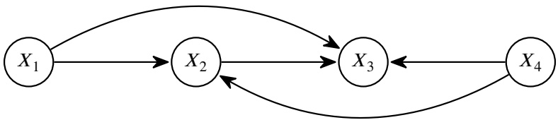

CPT (Conditional Probability Table) for $X _ { 3 } ;$

CPT (Conditional Probability Table) for $X _ { 2 }$

| Row | 𝑋3 | 𝑋2 | 𝑃(𝑋3\|𝑋2,𝑥1,𝑥4) |
| --- | --- | --- | --- |
| 1 | dogs | dogs | 0.1 |
| 2 | swim | dogs | 0.3 |
| 3 | bark | dogs | 0.6 |
| 4 | dogs | swim | 0.4 |
| 5 | swim | swim | 0.3 |
| 6 | bark | swim | 0.3 |
| 7 | dogs | bark | 0.4 |
| 8 | swim | bark | 0.3 |
| 9 | bark | bark | 0.3 |

| Row | 𝑋2 | 𝑃(𝑋2\|𝑥1,𝑥4) |
| --- | --- | --- |
| 10 | dogs | 0.8 |
| 11 | swim | 0.1 |
| 12 | bark | 0.1 |

The Bayes Net, reprinted:

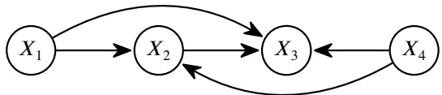

We want to find the values for $X _ { 2 }$ and $X _ { 3 }$ such that $P ( x _ { 1 } , x _ { 2 } , x _ { 3 } , x _ { 4 } )$ is maximized.

**(d)** [1 pt] What variable(s) are observed as evidence in this problem? Select all that apply.

■ 𝑋1

□ 𝑋2

𝑋3

\# None

We know the values of $x _ { 1 }$ and $x _ { 4 } ,$ so we consider them observed evidence variables in our model.

**(e)** [3 pts] Recall that “dogs” is a noun, “swim” is a verb, and “bark” is a verb.

Pacman tells you that if a word at Position 𝑖 is a noun, then the word at Position 𝑖 + 1 must be a verb.

Which row(s) in the Bayes Net should be set to 0 in order to correctly model Pacman’s statement? Select all that apply.

Row 1

Row 4

□ Row 7

□ Row 10

\# None

Row 2

□ Row 5

Row 8

□ Row 11

□ Row 3

□ Row 6

□ Row 9

Row 12

<!-- page: 19 -->

Row 1 is $P ( X _ { 3 } = \mathrm { d o g s } \mid X _ { 2 } = \mathrm { d o g s } )$ . This probability should be 0, because this is an assignment where Position 2 is a noun and Position 3 is not a verb.

Row 4 is $P ( X _ { 3 } = \mathrm { d o g s } \mid X _ { 2 } = \mathrm { s w i m } )$ . This probability should be 0, because this assignment violates Pacman’s statement: It puts a noun at Position 3, and a non-verb ("loudly") at Position 4.

Row 7 is $P ( X _ { 3 } = \mathrm { d o g s } \mid X _ { 2 } = \mathrm { b a r k } )$ . This probability should also be 0, for the same reason as above. It puts a noun at Position 3, and a non-verb ("loudly") at Position 4, which violates Pacman’s statement.

Note: A previous version of the solutions missed selecting Rows 4 and 7, and only selected Row 1. This was incorrect. The correct answer is Rows 1, 4, 7. (We missed this when we initially wrote the question, so we gave 2.5/3 points, most of the points, if you selected just Row 1.)

**(f)** [3 pts] Regardless of your answer to the previous subpart, suppose that we set only Row 5’s value to 0.

Which row(s) in the Bayes Net should be updated such that the resulting tables are valid CPTs? Select all that apply.

| ☐ Row 1 | ☑ Row 4 | ☐ Row 8 | ☐ Row 11 |
| --- | --- | --- | --- |
| ☐ Row 2 | ☑ Row 6 | ☐ Row 9 | ☐ Row 12 |
| ☐ Row 3 | ☐ Row 7 | ☐ Row 10 | ○ None |

Rows 4, 5, and 6 form a valid probability distribution, so they should sum to 1.0. If you zero out Row 5, then you need to adjust Rows 4 and 6 such that their values sum to 1.

**(g)** [2 pts] Suppose we use **prior sampling** to generate samples from this Bayes Net. What is the probability of generating the sample “the dogs bark loudly”? # 0.32 # 0.60 # 1.00 # 0.48 # 0.80 Not enough information.

We cannot compute the joint probability $P ( x _ { 1 } = \mathrm { t h e } , x _ { 2 } = \mathrm { d o g s } , x _ { 3 } = \mathrm { b a r k } , x _ { 4 } = \mathrm { l o u d l y } )$ because we do not know the probability of Word 1 being “the,” and we do not know the probability of Word 4 being “loudly.”

**(h)** [2 pts] Suppose we use **likelihood weighting** to generate samples from this Bayes Net. What is the probability of generating the sample “the dogs bark loudly”? # 0.32 # 0.60 # 1.00 0.48 # 0.80 # Not enough information.

Probability of sampling “dogs” for Word 2 is 0.8. Probability of sampling “bark” for Word 3, given that Word 2 was “dogs”, is 0.6. The total probability is $0.8 \times 0.6 = 0.48.$

**(i)** [1 pt] Suppose we use **likelihood weighting** to generate one sample from this Bayes Net.

True or false: The resulting sample $( x _ { 1 } , x _ { 2 } , x _ { 3 } , x _ { 4 } )$ will always be the sample that maximizes $P ( x _ { 1 } , x _ { 2 } , x _ { 3 } , x _ { 4 } )$

When we generate a sample from a Bayes Net, the resulting sample is not guaranteed to be the most likely assignment to the variables. We might get unlucky and generate a sample with lower probability in the joint distribution.

<!-- page: 20 -->

## Q5. [13 pts] Froogle Maps

You own Froogle Maps, a navigation app. You model navigation as a search problem, where you know the state space and successor function (i.e. you know the map).

You have a choice of two heuristics: the Traffic heuristic, and the Distance heuristic. You choose exactly one heuristic to use.

After you choose a heuristic, you receive a query from a random user, who wants to know directions from a start state 𝑆 to a goal state 𝐺. You know the probability distributions of 𝑆 and 𝐺.

You run A\* search with your chosen heuristic (𝐻), the user’s start state (𝑆), and the user’s goal state (𝐺). The user is impatient: if you solve the problem within 10 seconds, you receive 𝑈 = 100 utility points. Otherwise, you receive 𝑈 = 0 utility points.

You wish to choose the heuristic that maximizes your expected utility. We can model this as a decision network:

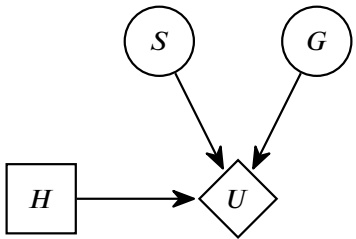

**(a)** [2 pts] Which of the following is true about EU(Traffic) and EU(Distance), the expected utility of selecting each heuristic?

□ If the Traffic heuristic dominates the Distance heuristic, then EU(Traffic) > EU(Distance).

□ If the Distance heuristic always outputs 0, then EU(Distance) is always 0.

Neither is true.

(A) is false. Suppose the Traffic heuristic takes a really long time to complete, and the Distance heuristic is very fast to compute. Then using the Traffic heuristic will always cause the query to time out, resulting in a utility of 0, while the Distance heuristic often finishes in time, resulting in a positive expected utility.

(B) is false. A trivial heuristic forces us to explore more states, but this could still be fast enough to return answers in time and achieve positive expected utility.

**(b)** [2 pts] For this subpart only, suppose the Traffic heuristic is inadmissible. Select all valid reasons for using an inadmissible heuristic.

■ We don’t need the optimal solution.

■ The Traffic heuristic is easy to calculate.

\# Neither, we always want to use an admissible heuristic.

If we use an inadmissible heuristic, we lose guarantees of optimality. However, sometimes, we don’t need the optimal solution, and we just need a solution that’s “good enough.” In that case, it might be preferable to use an inadmissible heuristic.

Note: Some students argued that Option 2 is ambiguous, because a heuristic being easy to calculate is only relevant when we don’t need the optimal solution. If we require an optimal solution, we still wouldn’t use an inadmissible heuristic, even if it was easy-to-calculate.

To adjust for this, we gave 2 points if you selected Option 1, and 0 points if you didn’t select Option 1. We totally ignored Option 2 during grading.

Fill in the blanks to describe how EU(Traffic) is calculated.

For each possible value of **(i)** :

Step 1: Run A\* search with the Traffic heuristic to see if a solution is found within 10 seconds.

Step 2: The utility is 100 if A\* search finishes within 10 seconds, and 0 otherwise.

Step 3: Take this utility and multiply it by **(ii)**

<!-- page: 21 -->

Sum up every value you get in Step 3 above.

| (c) [1 pt] Blank (i):● (S,G) | ○ S | ○ G | ○ H |
| --- | --- | --- | --- |
| (d) [2 pts] Blank (ii):● P(S,G) ○ P(S) | ○ P(G) ○ U(S,G,H = Traffic) | ○ 1 ○ 0 |  |

<!-- page: 22 -->

You want to consider whether Froogle Maps should partner with Big Brother, who will tell you the user’s start state 𝑆. For the next two subparts, refer to these tables, and the decision network from the previous page (reprinted below):

| 𝑆 | 𝑃(𝑆) |
| --- | --- |
| Library | 0.2 |
| School | 0.8 |
| 𝐺 | 𝑃(𝐺) |
| Restaurant | 0.6 |
| Gym | 0.4 |

| 𝑆 | 𝐺 | 𝐻 | 𝑈(𝑆,𝐺,𝐻) |
| --- | --- | --- | --- |
| Library | Restaurant | Traffic | 100 |
| Library | Gym | Traffic | 100 |
| School | Restaurant | Traffic | 0 |
| School | Gym | Traffic | 0 |
| Library | Restaurant | Distance | 100 |
| Library | Gym | Distance | 0 |
| School | Restaurant | Distance | 100 |
| School | Gym | Distance | 0 |

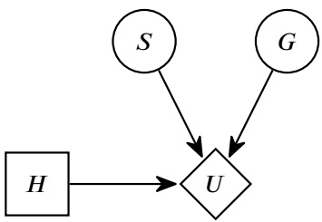

You would like to calculate the fair cost of Big Brother revealing 𝑆.

**(e)** [1 pt] If you know that the start state is Library, which is the better heuristic to use?

Distance

Traffic

If we use the Distance heuristic, Library to Gym (occurs 40% of the time) would time out (utility 0), while Library to Restaurant (occurs 60% of the time) would finish in time (utility 100). Therefore, the expected utility of using Distance, given that 𝑆 is library, is 0.4(0) + 0.6(100) = 60.

If we use the Traffic heuristic, both Library to Gym and Library to Restaurant would finish in time (utility 100). Therefore, the expected utility of using Traffic, given that 𝑆 is Library, is 100.

Since the expected utility of using Traffic is higher, the better heuristic to use is Traffic.

**(f)** [2 pts] Calculate MEU(𝑆 = School).

\# 0 # 20

EU(Traffic|𝑆 = School) = 0.6(0) + 0.4(0) = 0

If you know that the start state is School, then 60% of the time, the goal is Restaurant. With the Traffic heuristic, going from School to Restaurant achieves utility 0.

The other 40% of the time, the goal is Gym. With the Traffic heuristic, going from School to Gym achieves utility 0.

Therefore, the expected utility of using Traffic, given that the start state is School, is 0.

EU(Distance|𝑆 = School) = 0.6(100) + 0.4(0) = 60

If you know that the start state is School, then 60% of the time, the goal is Restaurant. With the Distance heuristic, going from School to Restaurant achieves utility 100.

The other 40% of the time, the goal is Gym. With the Distance heuristic, going from School to Gym achieves utility 0.

Therefore, the expected utility of using Distance, given that the start state is School, is 60.

The maximum expected utility is 60 (from using Distance), since this is greater than 0 (from using Traffic).

**(g)** [1 pt] Froogle Maps could also partner with Little Brother, who can tell you the user’s goal state 𝐺.

True or False: VPI(𝑆) + VPI(𝐺) = VPI(𝑆, 𝐺)

\# True

False

(𝑉 𝑃 𝐼(𝑆) + 𝑉 𝑃 𝐼(𝐷) ≠ 𝑉 𝑃 𝐼(𝑆, 𝐷)) VPIs are not additive.

<!-- page: 23 -->

**(h)** [2 pts] Big Brother offers to reveal the value of 𝑆, but only if Froogle Maps pays half of its **total** utility. The inequality that represents whether you should accept this offer is: $\frac { 1 } { 2 } \; ( { \bf i } ) \; > ( { \bf \ddot { n } } )$ What expression goes in blank **(i)**? VPI(𝑆) # EU(Traffic | 𝑆 = School) MEU(∅) # EU(Traffic | 𝑆 = Library) MEU(𝑆)

What expression goes in blank **(ii)**? VPI(𝑆) EU(Traffic | 𝑆 = School) MEU(∅) EU(Traffic | 𝑆 = Library) # MEU(𝑆)

If Froogle rejects Big Brother’s offer, Froogle has utility equal to MEU(∅).

If Froogle takes Big Brother’s offer, it will get utility equal to MEU(𝑆). However, it then has to pay half of it to Big Brother; it only has utility of ${ \frac { 1 } { 2 } } \; \mathrm { M E U } ( S )$

Thus, we get the inequality ${ \frac { 1 } { 2 } } \; \mathrm { M E U } ( S ) > \mathrm { M E U } ( \emptyset )$ . If the utility Froogle earns with Big Brother’s information is better than the base utility, Froogle will take the offer.

<!-- page: 24 -->

## Q6. [18 pts] Machine Learning: Easter Island

The elves of Easter Island have left Petru the Paradise Dweller and are headed to the North Pole for their internship with Santa Claus—just in time for the holiday season! Help the elves solve challenges using machine learning.

The elves want to build a binary perceptron model to predict whether a gift will be enjoyed (−1 for Not Enjoyed, and +1 for Enjoyed). Each sample has two features: $x _ { 1 }$ , the Cost of the gift, and $x _ { 2 } ,$ the Popularity of the gift.

| Sample # | Cost (𝑥1) | Popularity (𝑥2) | Enjoyed (𝑦) |
| --- | --- | --- | --- |
| #1 | 1 | 3 | -1 |
| #2 | 1 | -1.5 | -1 |
| #3 | 2 | 2 | +1 |
| #4 | 3 | 1 | -1 |
| #5 | 4 | 1 | +1 |

Note: For the next four subparts, **the first element in the weight vector is the bias term**.

**(a)** [3 pts] Using the Cost and Popularity features, which of the following weights 𝐰 would allow you to linearly separate the samples above? Select all that apply.

$$
\square \quad \mathbf {w} = [ 4, 1, 1 ]
$$

$$
\square \mathbf {w} = [ 2, - 1, 1 ]
$$

$$
\square \mathbf {w} = [ - 2, 1, - 1 ]
$$

None of the above.

One can draw a rough plot of $x _ { 1 }$ and $x _ { 2 }$ with labels 𝑦 and see that it is impossible to draw a line that separates the points, so no value of 𝑤 works.

<!-- page: 25 -->

$\bullet \mathbf{w} = [0,1, - 1,2]$   
$\bigcirc$ $\mathbf{w} = [1,2,2,0]$   
$\bigcirc$ $\mathbf{w} = [2,3,5, - 2]$

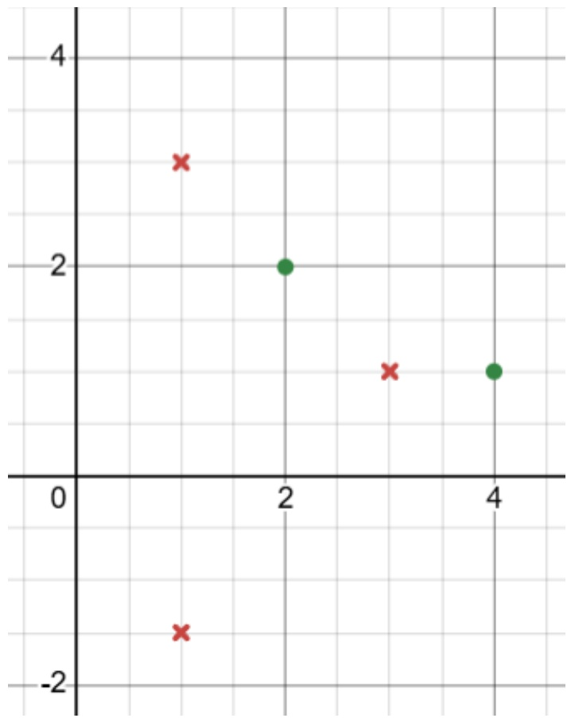

(b) [3 pts] Which of the following additional features, if introduced, would result in the samples above being linearly separable? Consider each option independently. Select all that apply.

Note: You may assume that $x _ { 1 }$ , the Cost feature, always takes on integer values.

$$
\begin{array}{l} \square x _ {3} = | x _ {1} | + | x _ {2} | \\ \blacksquare x _ {3} = x _ {1} \cdot x _ {2} \\ \blacksquare x _ {3} = (x _ {1} \bmod 2) \cdot | x _ {2} | \\ \bigcirc \text {None of the above.} \end{array}
$$

The first option doesn’t add any information other than moving the (1, −1.5) point to (1, 1.5) which still does not allow us to linearly separate.

The second option works since the only positive +1 labels have $x _ { 1 } x _ { 2 } \geq 4$ which the other samples do not have.

The third option allows us to tell whether the $x _ { 1 } \mathrm { - c o o r d i n a t e }$ is even, and this is enough to differentiate the +1 and −1 labels.

**(c)** [3 pts] In this subpart only, you introduce an additional feature, $x _ { 3 } = x _ { 1 } - x _ { 2 }$ . The initial weights are $\mathbf { w } = [ 1 , 2 , 2 , 0 ]$ Perform a single round of weight updates using Sample #1. What are the new weights?

**(d)** [1 pt] Suppose the elves introduce a new label, Indifferent. The elves re-label the dataset so that there are now 3 possible classes: Enjoyed, Not Enjoyed, and Indifferent. If we use a multi-class perceptron for this problem, what is the size of the weight matrix?

Note: We are using the Cost and Popularity features, not any additional $x _ { 3 }$ feature.

$$
\bigcirc \mathbf {w} \in \mathbb {R} ^ {2 \times 2}
$$

<!-- page: 26 -->

● $\mathbf { w } \in \mathbb { R } ^ { 3 \times 3 }$

$\mathbf { w } \in \mathbb { R } ^ { 4 \times 4 }$

\# None of the above.

A multi-class perceptron will assign probabilities to each class. With a bias term and two features $x _ { 1 }$ and $x _ { 2 }$ for 3 classes, that requires a $3 \times 3$ matrix.

**The following subparts are independent from the previous subparts.**

<!-- page: 27 -->

A few of the elves are late to the start of their internship and need to be rescued from Svalbard, Norway. For Santa to pick them up, they need to get to the highest point of NewtonToppen, a mountain outside the city.

Consider the function $f ( x ) = - x ^ { 2 } + 1 0 0 ,$ , where 𝑥 is the elves’ position, and $f ( x )$ is the elevation at that position.

**(e)** [3 pts] The elves start at position $x _ { 0 }   =   1 0$ They want to use the gradient ascent algorithm to reach the peak of the mountain (i.e. the position with maximum elevation). Their position update rule is: $x _ { t + 1 } = x _ { t } + \alpha ( - 2 x _ { t } )$ , where 𝛼 is the step size. Select all true statements.

■ There exists a value of 𝛼 such that the elves will reach the peak in fewer than 2 steps.

□ If $\alpha < 0 . 5 .$ , the elves will be at a negative position at some step 𝑡 (i.e. $x _ { t } < 0$ for some 𝑡).

□ If $\alpha > 1$ , gradient ascent will converge in the fewest steps possible.

\# None of the above.

The update is $x_{t + 1} = x_{t} - 2\alpha x_{t} = (1 - 2\alpha)x_{t}.$

The peak is at 𝑥 = 0. Setting $\alpha = 0 . 5$ means $x _ { 1 } = 0 ,$ so the first option is true.

If $\alpha < 0 . 5$ , the update looks like $x _ { t } = \beta ^ { t } x _ { 0 }$ for some $\beta < 1$ . Since $x _ { 0 } > 0 ,$ , this will always be positive. So the second option is false.

If $\alpha > 1$ , then there is exponential growth $( | \beta | > 1 )$ and the update diverges, so the third option is false.

As it turns out, Santa Claus doesn’t trust the elves to reach the peak of NewtonToppen, so he plans to meet them at a point along the surface of the mountain. In order to land safely, Santa’s autonomous sleigh needs to use a neural network to approximate the function above.

**(f)** [1 pt] True or False: To within any desired measure of accuracy $\epsilon > 0 ,$ it is possible for a neural network (as defined in lecture) to model the function $f ( x ) = - x ^ { 2 } + 1 0 0$

True

False

This is a consequence of the universal approximation theorem of neural networks.

**(g)** [4 pts] Suppose that the neural network onboard Santa’s sleigh has the given architecture:

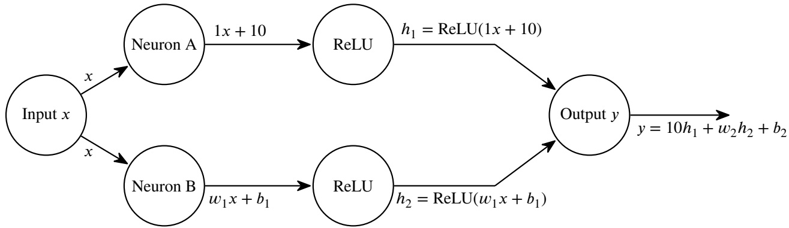

The neurons perform a linear transformation. For example, Neuron A takes in 𝑥 and outputs $1 x + 1 0 .$

The neural network is represented by the following equations, where all variables are scalars, and some of the weights have already been filled in for you:

$$
\begin{array}{c} h _ {1} = \mathrm{ReLU} (1 x + 1 0) \\ h _ {2} = \mathrm{ReLU} (w _ {1} x + b _ {1}) \\ y = 1 0 h _ {1} + w _ {2} h _ {2} + b _ {2} \end{array}
$$

<!-- page: 28 -->

Select values for the unknown weights $w _ { 1 } , b _ { 1 } , w _ { 2 }$ , and $b _ { 2 } ,$ , such that the resulting neural network gives the best approximation of the function $f ( x ) = - x ^ { 2 } + 1 0 0$ , for $- 1 0 \leq x \leq 1 0$

Select values for $w _ { 1 }$ and $b _ { 1 }$ :

Select values for $w _ { 2 }$ and $b _ { 2 } ;$

$$
\bigcirc w _ {1} = - 1, b _ {2} = - 1 0
$$

$$
\bigcirc w _ {2} = 1 0, b _ {2} = 1 0 0
$$

$$
\bigcirc w _ {1} = 2, b _ {2} = 1 0
$$

$$
w _ {2} = - 5, b _ {2} = 0
$$

$$
w _ {1} = 4, b _ {2} = 0
$$

$$
\bigcirc w _ {2} = 0, b _ {2} = 2 5
$$

Note that it was clarified during the exam that the $b _ { 2 } { } ^ { \prime } \mathrm { s }$ in the first column of answer choices are supposed to be $b _ { 1 } { } ^ { \prime } \mathrm { s }$

Note that $-x^{2}+100=0$ when $x = \pm 1 0$ Since the coefficient of $x ^ { 2 }$ is negative, it will be a downward facing parabola. This means you have a downward facing parabola with roots at −10 and +10. It also achieves its peak at $x = 0$ (since $x \neq 0$ will cause the $- x ^ { 2 }$ term to be strictly negative), so the parabola is symmetric about the y-axis.

Since $1 x + 1 0 \geq 0$ on the interval $- 1 0 \leq x \leq 1 0$ , the ReLU in $h _ { 1 }$ can be ignored. So we have $y = 10h_{1} + w_{2}h_{2} + b_{2} =$ $10x + 100 + w_{2}(ReLU(w_{1}x + b_{1})) + b_{2}$

The ReLU composition will be piecewise linear, and we only have two lines to work with (using $w _ { 1 } , b _ { 1 }$ and $w _ { 2 } , b _ { 2 } )$ . So let’s try to draw one line from (−10, 0) to (0, 100) and the other from (0, 100) to (10, 0), or as close to it as possible. (Like a big upside-down V shape)

$\mathrm { O n } - 1 0 \leq x \leq 0$ , the graph should ideally have slope $1 0 0 / ( 1 0 - 0 ) = 1 0$ . We already have a $1 0 x + 1 0 0$ , which means the slope is 10 already if the ReLU zeros out the $w _ { 1 } x + b _ { 1 }$ . This means $w _ { 1 } x + b _ { 1 }$ should not be positive on the entire interval $- 1 0 \leq x \leq 0 .$ The only option that has $w _ { 1 } x + b _ { 1 } \leq 0$ on the entire interval is $w _ { 1 } = 4 , b _ { 2 } = 0$

On $0 \leq x \leq 1 0$ , the line should ideally have slope -10. In order to change to slope -10 on this interval, we need the ReLU to go away, and the total slope is $( w _ { 2 } w _ { 1 } + 1 0 ) x$ . So we would want $w _ { 2 } w _ { 1 } = 2 0$ . Since we know $w _ { 1 } = 4 ,   w _ { 2 } = 5$ is the way to go for the second column of choices.

Since $b _ { 1 } = b _ { 2 } = 0$ , the y-intercept is just 100.

This means that our piecewise linear construction passes through (−10, 0), (0, 100), and (10, 0), as desired.

<!-- page: 29 -->

## Q7. [11 pts] Square Bayes

For the first two subparts, consider the 9-node Bayes Net on the right:

**(a)** [2 pts] How many paths are there between 𝐴 and 𝐻 when considering if 𝐴 and 𝐻 are 𝑑-separated?

\# 2

**(b)** [2 pts] Given the structure of the Bayes Net, which of the following are true? Select all that apply. 𝐴 ⟂⟂ 𝐹 | {𝐸} 𝐴 ⟂⟂ 𝐼 | {𝐷} $B \perp     L \mid \{ C , D , F , G , H \}$ 𝐷 ⟂⟂ 𝐹 | {𝐴, 𝐵, 𝐺, 𝐻} None of the above.

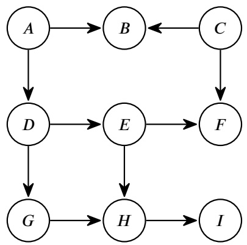

## Part (a) solution:

Recall that when we run the 𝑑-separation algorithm, we are looking for **undirected** paths (i.e. ignore the arrow directions).

Also, remember that the paths we consider in 𝑑-separation don’t have cycles, so something like [A D G H E D G H I] is not a path we consider. This path visits D twice, which means we traveled in a cycle, so it’s invalid.

With these two constraints in mind, there are 4 total paths between 𝐴 and 𝐻:

[A B C F E H]

[A B C F E D G H]

[A D G H]

[A D E H]

## Part (b), Option 1 solution:

Recall that in 𝑑-separation, if there is **one path** with **all triples active**, then the influence travels along this path, and the two variables are not conditionally independent.

By contrast, if **all paths** have **at least one inactive triple**, then the influence is blocked along all paths, and the two variables are conditionally independent.

Option 1: 𝐴 ⟂⟂ 𝐹 | {𝐸} is True.

Consider the path [A B C F]. The triple 𝐴 → 𝐵 ← 𝐶 is inactive, so this path is blocked.

Consider the path [A D E F]. The triple 𝐷 → 𝐸 → 𝐹 is inactive (𝐸 is observed), so this path is blocked.

Consider the path [A D G H E F]. The triple 𝐻 ← 𝐸 → 𝐹 is inactive (𝐸 is observed), so this path is blocked.

These are all the paths between 𝐴 and 𝐹. Since every path is blocked (i.e. has at least one inactive triple), we have shown that influence is blocked along all paths, and the conditional independence assumption is true.

<!-- page: 30 -->

## Part (b), Option 2 solution:

Option 2: 𝐴 ⟂⟂ 𝐼 | {𝐷} is True.

Consider the path [A B C F E D G H I]. The triple 𝐺 ← 𝐷 → 𝐸 is inactive (𝐷 is observed), so this path is blocked. Also, the triples 𝐴 → 𝐵 ← 𝐶 and 𝐶 → 𝐹 ← 𝐸 are also inactive. It only takes one inactive triple to block the path, but this path just happens to have multiple inactive triples.

Consider the path [A B C F E H I]. The triples 𝐴 → 𝐵 ← 𝐶 and 𝐶 → 𝐹 ← 𝐸 are both inactive. As long as there’s at least one inactive triple, the entire path is blocked.

Consider the path [A D E H I]. The triple 𝐴 → 𝐷 → 𝐸 is blocked (𝐷 is observed), so this path is blocked.

Consider the path [A D G H I]. The triple 𝐴 → 𝐷 → 𝐺 is blocked (𝐷 is observed), so this path is blocked.

These are all the paths between 𝐴 and 𝐼. Since every path is blocked (i.e. has at least one inactive triple), we have shown that influence is blocked along all paths, and the conditional independence assumption is true.

## Part (b), Option 3 solution:

Option 3: 𝐵 ⟂⟂ 𝐸 | {𝐶, 𝐷, 𝐹 , 𝐺, 𝐻} is True.

Consider the path [B C F E]. The 𝐵 ← 𝐶 → 𝐹 triple is inactive (𝐶 is observed), so this path is blocked.

Consider the path [B A D E]. The 𝐴 → 𝐷 → 𝐸 triple is inactive (𝐷 is observed), so this path is blocked.

Consider the path [A D G H E]. The 𝐴 → 𝐷 → 𝐺 is inactive (𝐷 is observed), and the 𝐷 → 𝐺 → 𝐻 is also inactive (𝐺 is observed), so this path is blocked.

These are all the paths between 𝐵 and 𝐸. Since every path is blocked (i.e. has at least one inactive triple), we have shown that influence is blocked along all paths, and the conditional independence assumption is true.

**Part (b), Option 4 solution:** Option 4: 𝐷 ⟂⟂ 𝐹 | {𝐴, 𝐵, 𝐺, 𝐻} is False.

Consider the path [D E F]. The only triple along this path is 𝐷 → 𝐸 → 𝐹, and this triple is active (𝐸 is not observed).

We found a path where every triple is active, so this path is unblocked.

Since there is at least one active path, influence can flow from 𝐷 to 𝐹, and conditional independence does not hold.

<!-- page: 31 -->

For the rest of the question, consider the 4-node Bayes Net to the right. Pacman wants to compute $P ( D | B = b )$ using variable elimination.

**(c)** [2 pts] If Pacman eliminates 𝐴 first, which factors should he join on?

𝑃 (𝐴) 𝑃 (𝑏) 𝑃 (𝐶)

□ 𝑃 (𝐷)

𝑃 (𝑏|𝐴)

■ 𝑃 (𝐶|𝐴)

■ $P ( D | A , C )$

\# None

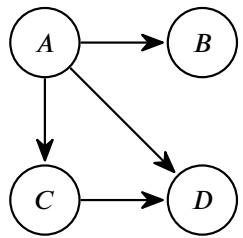

At the start of variable elimination, we have one factor per node, corresponding to the CPT inside each node. The CPT inside node 𝐴 is 𝑃 (𝐴). The CPT inside node 𝐵 is 𝑃 (𝑏|𝐴). The CPT inside node 𝐶 is $P ( C | A ) .$ The CPT inside node 𝐷 is $P ( D | A , C )$ To join-and-eliminate on 𝐴, we should first join all of the factors that include 𝐴. All four of the initial factors include 𝐴, so we should join all four of these factors.

**(d)** [2 pts] What is the resulting factor after joining on 𝐴? $f(A,b,C,D)$ # $f ( A , C , D )$ # $f ( A , b , D )$ # 𝑓(𝐴, 𝐷) $f ( b , C , D )$ # $f ( A , b , C )$ # 𝑓(𝐴, 𝐶) # 𝑃 (𝐴)

The intended answer was 𝑓(𝐴, 𝑏, 𝐶, 𝐷). When you join on the factors from the previous subpart, your resulting factor should include all the terms that appear in any of the joined factors: 𝐴, 𝑏, 𝐶, and 𝐷.

After the exam, some students pointed out that they interpreted joining-and-eliminating as a single step in the variable elimination algorithm. If you immediately eliminate 𝐴 after joining on 𝐴, the resulting factor would be $f ( b , C , D )$ . This was not our intended answer, and in lecture, we do make a distinction between the joining step and the eliminating step. However, we accepted 𝑓(𝑏, 𝐶, 𝐷) as an alternate answer.

**(e)** [1 pt] Blinky claims that it is more efficient (reduces the size of the largest factor generated) to join and eliminate 𝐶 before 𝐴. Is Blinky correct?

\# Yes

No

As seen above, joining on 𝐴 creates the factor $f(A,b,C,D)$ The size of this factor is $| A | \times | C | \times | D | ,$ where |𝐴| is the number of possible values for 𝐴 (and similar for |𝐶| and |𝐷|).

Suppose we instead start by joining on 𝐶. The initial factors including 𝐶 are $P ( C | A )$ and $P ( D | A , C )$ , and if we join these factors, we get 𝑓(𝐴, 𝐶, 𝐷) instead. This size of this factor is also $| A | \times | C | \times | D |$

Since both orders (starting with 𝐴, and starting with 𝐶) produce factors of the same size, it is not more efficient to joinand-eliminate 𝐶 first.

Note that 𝑏 does not contribute to the size of the factor $f(A,b,C,D)$ 𝑏 is observed as evidence, so there is only a single fixed value of 𝑏. You can think of this as multiplying the size of the factor by |𝑏| = 1, which doesn’t change the factor size. Or, you can write out the CPT and realize that the 𝐵 column only has a single value. In other words, you don’t need separate entries for every possible value of 𝐵, because there’s only one observed value 𝑏.

Note: A previous version of the solutions incorrectly marked Yes as the correct answer. The correct answer is No, and Yes was not worth any points.

<!-- page: 32 -->

After running variable elimination (not necessarily in the order above), the resulting remaining factors are 𝑓(𝑏) and 𝑓(𝐷). Given these remaining factors, how should Pacman compute his desired query, $P ( D   |   B = b ) ?$

$$
P (D \mid B = b) = \frac {(\mathbf {i})}{(\mathbf {i i})}
$$

**(f)** [1 pt] What goes in blank **(i)**? 𝑓(𝐷) # 𝑓(𝑏) # $\textstyle \sum _ { d } f ( d )$

**(g)** [1 pt] What goes in blank **(ii)**? # 𝑓(𝐷) # 𝑓(𝑏) $\textstyle \sum _ { d } f ( d )$

In variable elimination, after we join-and-eliminate all hidden variables, our remaining factors can be joined to form a joint probability over the remaining variables (evidence and query variables):

$$
f (D) \cdot f (b) = P (D, B = b)
$$

𝑃 (𝐷, 𝐵 = 𝑏) is the joint distribution $P ( D , B )$ , but with only the rows matching our evidence (𝐵 = 𝑏) selected (and the other rows discarded).

Next, we can use the definition of conditional probability to rewrite the desired query as a fraction:

$$
P (D \mid B = b) = \frac {P (D , B = b)}{P (B = b)}
$$

To get the denominator, we can take our joint distribution and sum out the unwanted variable: $\begin{array} { r } { P ( B = b ) = \sum _ { d } P ( D , B = b ) } \end{array}$ . This allows us to rewrite the denominator:

$$
P (D \mid B = b) = \frac {P (D , B = b)}{\sum_ {d} P (D , B = b)}
$$

We can rewrite the numerator and denominator using the two remaining factors we joined (the very first equation we wrote):

$$
P (D \mid B = b) = \frac {f (D) \cdot f (b)}{\sum_ {d} f (D) \cdot f (b)}
$$

Finally, we can cancel out 𝑓(𝑏), since it’s just a constant scalar value in both the numerator and denominator. This gives us our desired answer:

$$
P (D \mid B = b) = \frac {f (D)}{\sum_ {d} f (D)}
$$

## Alternate solution:

When we finish joining-and-eliminating all hidden variables, our remaining factors can be joined to give us the joint probability over the remaining variables (evidence and query variables):

$$
f (D) \cdot f (b) = P (D, B = b)
$$

However, the rows in 𝑃 (𝐷, 𝐵 = 𝑏) don’t add to 1, because we only selected the rows matching the evidence. Therefore, we need to normalize this distribution so that it sums to 1 again.

To normalize this distribution, we need to divide it by the sum of all entries. (As an unrelated example, if we had 𝑃 (sun) = 0.3 and 𝑃 (rain) = 0.2, you would divide both entries by the sum 0.5 to normalize the distribution.)

<!-- page: 33 -->

The sum of all entries is $\textstyle \sum _ { d } P ( D , \; B = b )$ . Thus, the normalized distribution we’re looking for is:

$$
\frac {P (D , B = b)}{\sum_ {d} P (D , B = b)}
$$

We can rewrite the numerator and denominator using the two remaining factors we joined (the very first equation we wrote):

$$
\frac {f (D) \cdot f (b)}{\sum_ {d} f (D) \cdot f (b)}
$$

$$
\frac {f (D)}{\sum_ {d} f (D)}
$$

As in the other solution, we can cancel out $f ( b ) ,$ , since it’s just a constant scalar value in both the numerator and denominator. This gives us our desired answer:
