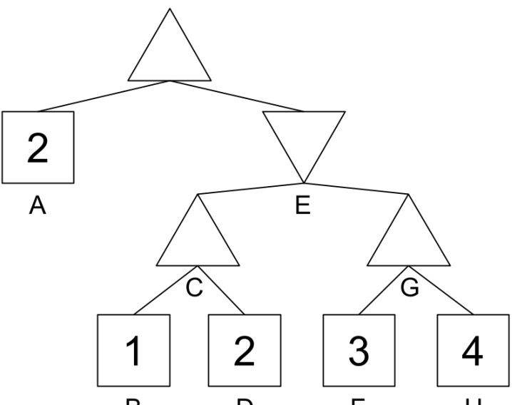
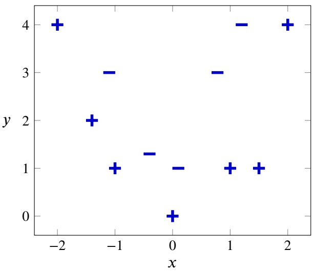
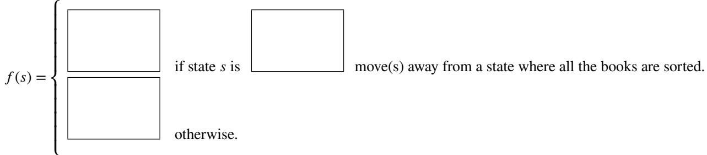
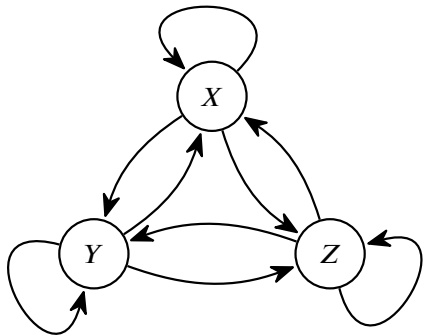
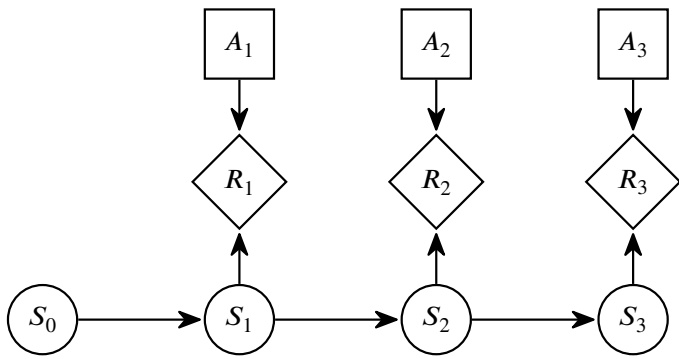
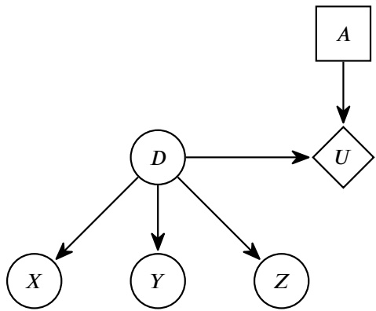
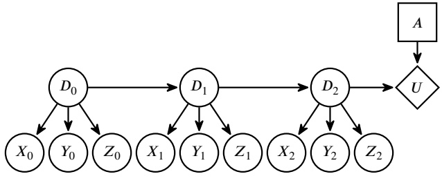
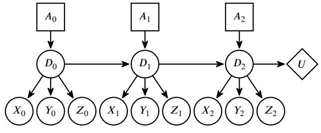
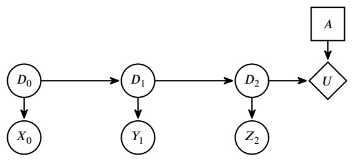
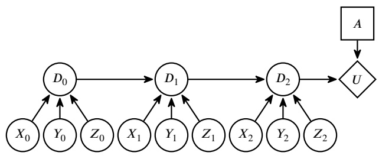

<!-- page: 1 -->

• You have 170 minutes.

• The exam is closed book, no calculator, and closed notes, other than two double-sided cheat sheets that you may reference.

• Anything you write outside the answer boxes or you ~~cross out~~ will not be graded. If you write multiple answers, your answer is ambiguous, or the bubble/checkbox is not entirely filled in, we will grade the worst interpretation.

For questions with **circular bubbles**, you may select only one choice.

Unselected option (completely unfilled)

For questions with **square checkboxes**, you may select one or more choices.

Only one selected option (completely filled)

You can select

Don’t do this (it will be graded as incorrect)

multiple squares (completely filled)

| First name |  |
| --- | --- |
| Last name |  |
| SID |  |
| Name of person to the right |  |
| Name of person to the left |  |
| Discussion TAs (or None) |  |

**Honor code**: “As a member of the UC Berkeley community, I act with honesty, integrity, and respect for others.”

By signing below, I affirm that all work on this exam is my own work, and honestly reflects my own understanding of the course material. I have not referenced any outside materials (other than my cheat sheets), nor collaborated with any other human being on this exam. I understand that if the exam proctor catches me cheating on the exam, that I may face the penalty of an automatic "F" grade in this class and a referral to the Center for Student Conduct.

Signature:

Point Distribution

| Q1. Potpourri | 16 |
| --- | --- |
| Q2. Search &amp; Games: Shelving Books | 15 |
| Q3. Logic: Easter Island Revisited | 15 |
| Q4. MDPs: Blinky's Hamster | 10 |
| Q5. VPI: Cost of Extra Samples | 16 |
| Q6. RL: Optimistic Q-Learning | 11 |
| Q7. ML: Spam Filter | 17 |
| Total | 100 |

We hope you set a new high score on this exam!

<!-- page: 2 -->

## Q1. [16 pts] Potpourri

**(a)** [2 pts] Which of the following statements about heuristics are true?

□ The trivial heuristic can sometimes (but rarely) speed up A\* search, compared to uniform cost search.

If a heuristic is admissible, it is guaranteed to be consistent.

□ If a heuristic is consistent, it is guaranteed to be admissible.

□ Greedy tree search with a consistent heuristic is complete, but not optimal.

\# None of the above.

**(b)** [1 pt] Which of the following statements means that 𝜙 **is satisfiable**, where 𝜙 is an arbitrary logical expression and ⊥ is always false? # $\phi \models \bot$ # $\phi  卩上$ # $\neg \phi \models \bot$ # $\neg \phi \models \bot$

For subparts (c)-(e), consider the following game tree. Assume that alpha-beta pruning visits nodes from left to right. Assume pruning on equality.

**(c)** [1 pt] Fill out the four missing values in the game tree below.

A

B

D

**(d)** [2 pts] Select all terminal nodes that are never explored as a result of alpha-beta pruning.

□ A

□ B

□ D

□ F

□ H

None of the above

**(e)** [2 pts] Which of the following pairs of nodes, when their values are swapped, will produce a tree where zero nodes are pruned during alpha-beta pruning? # A and B # B and H # D and F # F and H

<!-- page: 3 -->

For subparts $( \mathbf { f } ) \mathbf { - } ( \mathbf { g } ) ,$ , consider the following dataset. Points represented by the plus symbol (+) correspond to a label of +1, and points represented by the minus symbol (−) correspond to a label of −1.

**(f)** [3 pts] Assuming that we fit a linear perceptron to this dataset, select all sets of features that would allow such a perceptron to perfectly classify the dataset. Assume points on the decision boundary are classified as label +1.

$$
\begin{array}{c c} \square & x, y \\ \square & x ^ {2}, y \\ \square & x ^ {3}, y \end{array}
$$

$$
\begin{array}{l l} \square & x ^ {2}, y ^ {2}, x, y \\ \square & x, y, 1 \\ \square & x ^ {2}, y ^ {2}, y, 1 \end{array}
$$

\# None of the above.

**(g)** [2 pts] Suppose we use 𝑥, 𝑦 as the features, and the initial weight vector of the perceptron is $[ 0 , 0 , - 1 ]$ . In other words, the feature weights are [0, 0] and the bias is −1.

After running 1 iteration of the perceptron training algorithm with the point at $x = - 1 , y = 1$ , what is the new weight vector (including the bias term)?

**(h)** [2 pts] Recall Monte Carlo Tree Search, where UCT (upper confidence bound applied to trees) is used to determine the next best rollout. Which of the following terms, in combination, are necessary to determine the upper confidence bound at a particular node 𝑠? Select all that apply.

Number of rollouts $N ( s )$ at node 𝑠.

Number of wins 𝑈(𝑠) from node 𝑠.

Number of rollouts $N ( p )$ at the parent 𝑝 of node 𝑠.

□ The number of rollouts $N ( c _ { i } )$ from **each** child $c _ { i }$ of node 𝑠.

\# None of the above.

**(i)** [1 pt] Suppose we use gradient descent to find the value of 𝑥 that minimizes the loss function $L ( x ) = x ^ { 2 }$ . The gradient is ${ \frac { \partial L } { \partial x } } = 2 x$ . What is the smallest value of the learning rate for which gradient descent does **not** converge (assuming we do not start at the minimum $x = 0 ) ?$

<!-- page: 4 -->

## Q2. [15 pts] Search & Games: Shelving Books

At the library, Carolyn plans to place 36 books on a bookshelf. The bookshelf consists of 6 rows, labeled Row 0 to Row 5, and each row can hold exactly 6 books.

The 36 books are labeled from $b _ { 0 }$ to $b _ { 3 5 }$ . Furthermore, each spot on the bookshelf is labeled from 0 to 35. Here is a diagram of what the bookshelf looks like with all the books in their correct positions:

| Row 0 | 𝑏0 | 𝑏1 | 𝑏2 | 𝑏3 | 𝑏4 | 𝑏5 |
| --- | --- | --- | --- | --- | --- | --- |
| Row 1 | 𝑏6 | 𝑏7 | 𝑏8 | 𝑏9 | 𝑏10 | 𝑏11 |
| Row 2 | 𝑏12 | 𝑏13 | 𝑏14 | 𝑏15 | 𝑏16 | 𝑏17 |
| Row 3 | 𝑏18 | 𝑏19 | 𝑏20 | 𝑏21 | 𝑏22 | 𝑏23 |
| Row 4 | 𝑏24 | 𝑏25 | 𝑏26 | 𝑏27 | 𝑏28 | 𝑏29 |
| Row 5 | 𝑏30 | 𝑏31 | 𝑏32 | 𝑏33 | 𝑏34 | 𝑏35 |

Carolyn first places all 36 books onto the bookshelf in a random order.

Carolyn can move books around using these three actions (each action costs 1):

1. Shift all books in any row to the right by 1, with the rightmost book moving to the first spot on that row.

• For instance, using this action on Row 3, $\left\{ b _ { 1 8 } , b _ { 1 9 } , b _ { 2 0 } , b _ { 2 1 } , b _ { 2 2 } , b _ { 2 3 } \right\}$ , turns the row into $\left\{ b _ { 2 3 } , b _ { 1 8 } , b _ { 1 9 } , b _ { 2 0 } , b _ { 2 1 } , b _ { 2 2 } \right\}$

2. Shift all books in any row to the left by 1, with the leftmost book moving to the last spot on that row.

• For instance, using this action on Row 4, $\left\{ b _ { 2 4 } , b _ { 2 5 } , b _ { 2 6 } , b _ { 2 7 } , b _ { 2 8 } , b _ { 2 9 } \right\}$ , turns the row into $\left\{ b _ { 2 5 } , b _ { 2 6 } , b _ { 2 7 } , b _ { 2 8 } , b _ { 2 9 } , b _ { 2 4 } \right\}$

3. Swap any two books that are on **different** rows.

• For instance, the books at positions 6 and 22 can be swapped, and so can the books at positions 25 and 31, but the books at positions 24 and 26 **cannot** be swapped.

Carolyn’s goal is to **sort** the books by putting all the books in their correct positions. In other words, for $0 \leq i \leq 3 5$ , Carolyn wants book $b _ { i }$ to be placed on the 𝑖th position on the bookshelf.

Carolyn decides to model this as a search problem.

**(a)** [2 pts] Carolyn claims that the size of the state space for this problem is $2 ^ { 3 6 }$ , while a coworker Julia claims that it is 36! instead. Who is correct, and why? Explain your choice in two sentences or fewer.

\# Carolyn is correct

\# Neither are correct

<!-- page: 5 -->

**(b)** [4 pts] Derive the maximum branching factor for this problem. Your answer must written as a single integer. Hint 1: How many ways are there to swap two books on different rows? How many possible ways are there to shift any of the rows?

Hint 2: The choose function, $\begin{array} { r } { { \binom { n } { k } } = \frac { n ! } { k ! ( n - k ) ! } } \end{array}$ , may be useful here (though you can also solve this question without it).

**(c)** [1 pt] Another coworker Nawoda claims that the following goal test is valid for this search problem. (Reminder: the goal state is when every book is at its correct position on the bookshelf.) • For the leftmost book $b _ { i }$ of every row, book $b _ { i + 1 }$ is to its direct right. • For the rightmost book $b _ { i }$ of every row, book $b _ { i - 1 }$ is to its direct left.

• For each book $b _ { i }$ on **neither** end of a row, book $b _ { i - 1 }$ is to its direct left, and book $b _ { i + 1 }$ is to its direct right. # This is a valid goal test. # This is not a valid goal test.

**(d)** [3 pts] Which of the following heuristics are admissible for this search problem? Select all that apply.

□ The minimum number of **swaps** needed to sort all the books, assuming you can swap **any** two books, regardless of whether they are on the same row.

□ The number of books that are **not** in their correct position.

□ For some book $b _ { i } ,$ define dist(𝑏𝑖) to be the number of rows plus the number of columns book $b _ { i }$ is from its correct position. The heuristic is max(dist(𝑏 )) for all books 𝑏.

\# None of the above.

Now consider the following game: Julia and Carolyn take turns making moves on the same bookshelf until all the books are in their correct position. The person who makes the move that results in the bookshelf being completely sorted wins. Assume both players are playing optimally.

**(e)** [2 pts] Julia and Carolyn decide to model this game with a game tree. Select all true statements.

This game tree is infinite in depth.

□ This game tree requires expectation nodes.

This is a zero-sum game.

□ Every non-terminal node’s branching factor will be equal to the game’s maximum branching factor.

\# None of the above.

**(f)** [3 pts] Julia is trying to maximize her utility. Fill in the boxes below with integer values such that 𝑓(𝑠) is an evaluation function that causes Julia to act optimally.

<!-- page: 6 -->

## Q3. [15 pts] Logic: Easter Island Revisited

To recap from the midterm: Matei is an elf on Easter Island who is discontent with the current leadership of Pietru the Rotund. In preparation for the election outcome on May 9th, Matei has decided to predict the politics of Easter Island using logic.

Matei has quickly gathered that there are only 5 voting members on Easter Island—Abby (𝐴), Brad (𝐵), Charles (𝐶), Datsu (𝐷), Ershawn (𝐸)—who determine the outcome of the election.

Let the proposition $P _ { d }$ represent the decision 𝑑 made by voter 𝑃 in an election. A voter may either vote YES, NO, or ABSTAIN, i.e. 𝑃𝑦 = True, 𝑃𝑛 = True, or $P _ { a } = \mathrm { T r u e }$ , respectively.

**(a)** [3 pts] What is the constraint that represents the following statement?

“Brad must either vote YES, NO, or ABSTAIN, **and can only choose one of these options**.”

Write your answer in Disjunctive Normal Form (DNF) using a combination of the following symbols: ∧ (and), ∨ (or), ¬ (not), $B _ { y } , B _ { n } , B _ { a } .$ Parentheses—“(” and “)”—may also be used.

**(b)** [4 pts] Convert the following statement to a logical expression:

“If Brad votes NO, then either Charles abstains or Ershawn votes YES, but not both.”

Write your answer in Conjunctive Normal Form (CNF) using a combination of the following symbols: ∧ (and), ∨ (or), ¬ (not), $A _ { y } , A _ { n } , A _ { a } , . . . , E _ { y } , E _ { n } , E _ { a }$ . Parentheses—"(" and ")"—may also be used.

Hint 1: $A \bigoplus B$ is a function that evaluates to True if 𝐴 and 𝐵 are opposite truth values, or False if they are the same.

Hint 2: 𝐴⨁ 𝐵, can be represented as (𝐴 ∨ 𝐵) ∧ (¬𝐴 ∨ ¬𝐵).

Subparts (c)-(f) are unrelated to the previous subparts.

**(c)** [2 pts] Which options should be picked in the square brackets below to make the description true?

The DPLL algorithm is used for checking whether a sentence in CNF form has any assignment of values to variables that makes the sentence [true / false]. As the algorithm progresses, we evaluate partial models with [more / fewer] assignments of values to variables.

true; more

false; more

true; fewer

false; fewer

<!-- page: 7 -->

Depending on the sentence and the partial model, we might employ different techniques for speeding up the DPLL algorithm.

**(d)** [2 pts] Select the CNF sentence and partial model such that the DPLL algorithm can output True early.

\# $( A \lor \lnot B ) \land ( \lnot B \lor C ) \land ( \lnot A \lor C )$ . Partial model: {B: false, C: true}

\# $( A \lor \lnot B ) \land ( \lnot B \lor C ) \land ( \lnot A \lor C )$ . Partial model: {B: false}

\# $( A \lor B ) \land ( B \lor C ) \land ( A \lor C )$ . Partial model: {B: true}

\# $( A \lor \lnot A ) \land ( B \lor \lnot B ) \land ( C \lor \lnot C )$ . Partial model: {A: true}

**(e)** [2 pts] Select the CNF sentence and partial model such that the DPLL algorithm can use the **Pure Symbol** trick to update the partial model for the next iteration.

\# $( A \lor \lnot B ) \land ( B \lor \lnot C ) \land ( \lnot A \lor C )$ . Partial model: {}

\# $( A \lor \lnot B ) \land ( \lnot B \lor C ) \land ( \lnot A \lor C )$ . Partial model: {C: true}

\# $( A \lor \lnot A ) \land ( B \lor \lnot B ) \land ( C \lor \lnot C )$ . Partial model: {C: true}

\# $( A \lor B \lor C \lor D ) \land ( \neg A \lor \neg B ) \land ( \neg C \lor \neg D )$ . Partial model: {A: true, C: true}

**(f)** [2 pts] Select the CNF sentence and partial model such that the DPLL algorithm can use the **Unit Clause** trick to update the partial model for the next iteration.

$\begin{array} { r } { \bigcirc \quad ( \neg A \lor \neg B \lor \neg C ) \land ( A \lor \neg D \lor \neg E ) } \end{array}$ . Partial model: {}

\# $( A \lor B \lor C \lor D \lor E \lor F ) \land ( \neg A \lor \neg B )$ . Partial model: {}

0 $\begin{array}{l}\text {  \text {  } \text {  } \text {  } \text {  } \text {  } \text {  } \text {  } \text {  } \text {  } \text {  } \text {  } \text {  } \text {  } \text {  } \text {  } \text {  } \text {  } \text {  } \text {  } \text {  } \text {  } \text {  } \text {  } \text {  } \text {  } \text {  } \text {  } \text {  } \text {  } \text {  } \text {  } \text {  } \text {  } \text {  } \text {  } \text {  } \text {  } \text {  } \text {  } \text {  } \text {  } \text {  } \text {  } \text {  } \text {  } \text {  } \text {  } \text {  } \text {  } \text {  } \text {  } \text {  } \text {  } \text {  } \text {  } \text {  } \text {  } \text {  } \text {  } \text {  } \text {  } \text {  } \text {  } \text {  } \text {  } \text {  } \text {  } \text {  } \text {  } \text {  } \text {  } \text {  } \text {  } \text {  } \text {  } \text {  } \text {  } \text {  } \text {  } \text {  } \text {  } \text {  } \text {  } \text {  } \text {  } \text {  } \text {  } \text {  } \text {  } \text {  } \text {  } \text {  } \text {  } \text {  } \text {  } \text {  } \text {  } \text {  } \text {  } \text {  } \text {  } \text {  } \text {  } \text {  } \text {  } \text {  } \text {  } \text {  } \text {  } \text {  } \text {  } \text {  } \text {  } \text {  } \text {  } \text {  } \text {  } \text {  } \text {  } \text {  } \text {  } \text {  } \text {  } \text {  } \text {  } \text {  } \text {  } \text {  } \text {  } \text {  } \text {  } \text {  } \text {  } \text {  } \text {  } \text {  } \text {  } \text {  } \text {  } \text {  } \text {  } \text {  } \text {  } \text {  } \text {  } \text {  } \text {  } \text {  } \text {  } \text {  } \text {  } \text {  } \text {  } \text {  } \text {  } \text {  } \text \text {  } \text {  } \text {  } \text {  } \text {  } \text {  } \text {  } \text \text {  } \text {  } \text {  } \text {  } \text \text {  } \text {  } \text {  } \text {  } \text \text {  } \text {  } \text {  } \text \text {  } \text {  } \text {  } \text \text {  } \text {  } \text \text {  } \text {  } \text \text {  } \text {  } \text \text {  } \text {  } \text \text {  } \text {  } \text \text {  } \text {  } \text \text {  } \text \text {  } \text {  } \text \text {  } \text \text {  } \text {  } \text \text {  } \text {  } \text \text {  } \text \text {  } \text {  } \text \text {  } \text \text {  } \text {  } \text \text {  } \text \text {  } \text {  } \text \text {  } \text \ \end{array}$ . Partial model: {A: true}

\# $( A \lor \lnot B ) \land ( \lnot B \lor C \lor D ) \land ( \lnot A \lor C \lor \lnot D )$ . Partial model: {B: true}

<!-- page: 8 -->

## Q4. [10 pts] MDPs: Blinky’s Hamster

Blinky has a hamster that runs between 3 hamster wheels, labeled 𝑋, 𝑌 , and 𝑍. At each timestep 𝑡, the hamster is at one of the wheels. Between timestep 𝑡 and 𝑡 + 1, the hamster either stays at its current wheel or moves to one of the other two wheels.

We can model the hamster’s movement as a Markov process, where $S _ { t }$ represents the hamster’s location at timestep 𝑡.

|  | 𝑆𝑡+1 = 𝑋 | 𝑆𝑡+1 = 𝑌 | 𝑆𝑡+1 = 𝑍 |
| --- | --- | --- | --- |
| 𝑆𝑡 = 𝑋 | 0.25 | 0.50 | 0.25 |
| 𝑆𝑡 = 𝑌 | 0.25 | 0.25 | 0.50 |
| 𝑆𝑡 = 𝑍 | 0.50 | 0.25 | 0.25 |

For the next two subparts, use the above table of transition probabilities for $T ( S _ { t + 1 } | S _ { t } )$ . Suppose we know $S _ { 2 } = X$ , i.e. the hamster is in location 𝑋 at $t = 2$

**(a)** [1 pt] Calculate $P ( S _ { 3 } = Y )$

**(b)** [2 pts] Calculate $P ( S _ { 4 } = Y )$

Consider the following game. At every timestep, Blinky chooses to look inside wheel 𝑋, $Y ,$ or $Z .$ Let $A _ { t }$ represent Blinky’s choice of wheel at time 𝑡. At every timestep 𝑡, if Blinky finds the hamster, Blinky gets a reward of 1 (i.e. $R _ { t } = 1 \; { \mathrm { i f } } \; A _ { t } = S _ { t } )$ Otherwise, the reward is zero.

**(c)** [1 pt] Blinky’s observation at time 𝑡 consists of $A _ { t }$ (Blinky’s choice of wheel) and $R _ { t }$ (the reward at that time step). Does this observation qualify as a state that obeys the Markov property? In other words, is it true that $( A _ { t } , R _ { t } )$ is conditionally independent of $( A _ { 0 : t - 2 } , R _ { 0 : t - 2 } )$ , given $( A _ { t - 1 } , R _ { t - 1 } ) ?$

\# Yes

\# No

<!-- page: 9 -->

For the rest of the question, assume Blinky does not know the hamster’s transition probabilities $T ( s _ { t + 1 } | s _ { t } )$

**(d)** [3 pts] Suppose Blinky chooses a wheel and receives a reward at each timestep from 1 to 𝐾, where $K \gg 1$ , to learn about the game.

After these initial 𝐾 steps, Blinky will leave the game for a long time (while the hamster continues to move between wheels). Then, far in the future, at timestep $C \gg K$ , Blinky returns and wants to find the hamster.

Select all strategies that maximize the probability of choosing the wheel with the hamster at timestep 𝐶.

□ Treat the game as a bandit game with one arm per wheel. Play by **UCB1** for the initial 𝐾 steps, keeping track of the 𝑄-value for each wheel. Then, at time step 𝐶, look inside the wheel with the highest 𝑄-value.

□ Treat the game as a bandit game with one arm per wheel. Play by **𝝐-greedy with constant 𝝐** for the initial 𝐾 steps, keeping track of the 𝑄-value for each wheel. Then, at time step 𝐶, look inside the wheel with the highest 𝑄-value.

□ Select wheels randomly for the initial 𝐾 steps, keeping track of the average reward for each wheel. At time step 𝐶, look inside the wheel with the highest average reward.

□ Use the initial 𝐾 steps to estimate $T ( s _ { t + 1 } | s _ { t } )$ . Solve the steady state equations to find the most likely hamster wheel. At time step 𝐶, choose the corresponding wheel.

\# None of the above.

In the rest of the question, Blinky wants to estimate $T ( s _ { t + 1 } | s _ { t } )$ by playing the game.

Blinky plays the game for a long time, choosing wheels uniformly at random at every time step, and records many samples in the following format: $( A _ { t } , R _ { t } , A _ { t + 1 } , R _ { t + 1 } )$ . For example, (𝑋, 0, 𝑌 , 1) represents Blinky choosing 𝑋 and receiving a reward of 0, and then choosing 𝑌 and receiving a reward of 1 at the next time step.

Blinky writes the following expression:

$$
T _ {\text {guess}} (S _ {t + 1} = Y | S _ {t} = X) = \frac {\text {Count} ((X , 1 , Y , 1))}{\text {Count} ((X , 1 , Y , 1)) + \text {Count} ((X , 1 , Y , 0))}
$$

where Count(⋅) denotes the number of matching samples.

**(e)** [1 pt] Will this expression approach the true value of $T ( S _ { t + 1 } = Y | S _ { t } = X )$ as the number of samples approaches infinity? (Assume all transition probabilities are greater than zero.)

\# Yes

\# No

**(f)** [1 pt] Does the expression below always evaluate to 1? (Note: This subpart uses 𝑇 instead of $T _ { \mathrm { g u e s s } } . )$

\# Yes

$$
\begin{array}{c} \sum_ {i \in \{X, Y, Z \}} T (S _ {t + 1} = i \mid S _ {t} = X) \\ \bigcirc \text {No} \end{array}
$$

**(g)** [1 pt] Does the expression below always evaluate to 1? (Note: This subpart uses $T _ { \mathrm { g u e s s } }$ instead of 𝑇 .)

$$
\sum_ {i \in \{X, Y, Z \}} T _ {\text {guess}} (S _ {t + 1} = i \mid S _ {t} = X)
$$

\# Yes

\# No

<!-- page: 10 -->

## Q5. [16 pts] VPI: Cost of Extra Samples

Consider the following game. There are two doors, Left and Right. One of the doors contains a prize, and you want to choose the door with the prize.

Consider the following decision network:

• 𝐷: Random variable indicating which door (Left or Right) has the prize. The prize is equally likely to be behind each door.

• 𝐴: Action indicating which door (Left or Right) the player chooses to open.

• 𝑋, 𝑌 , 𝑍: Three independent, imperfect sensors indicating which door the prize is behind. Each sensor is correct 70% of the time, and incorrect 30% of the time.

• 𝑈: The player’s utility is 100 if they choose the door with the prize, and 0 if they choose the door without the prize.

| 𝐷 | 𝐴 | 𝑈 |
| --- | --- | --- |
| Left | Left | 100 |
| Left | Right | 0 |
| Right | Left | 0 |
| Right | Right | 100 |

| 𝐷 | 𝑃(𝐷) |
| --- | --- |
| Left | 0.5 |
| Right | 0.5 |

| 𝑋 | 𝐷 | 𝑃(𝑋\|𝐷) |
| --- | --- | --- |
| Left | Left | 0.7 |
| Left | Right | 0.3 |
| Right | Left | 0.3 |
| Right | Right | 0.7 |

Similar tables for 𝑃 (𝑌 |𝐷) and 𝑃 (𝑍|𝐷) omitted.

(a) [2 pts] From the above tables, we can derive 𝑃 (𝐷|𝑋), shown below.

| 𝐷 | 𝑋 | 𝑃(𝐷\|𝑋) |
| --- | --- | --- |
| Left | Left | 0.7 |
| Left | Right | 0.3 |
| Right | Left | 0.3 |
| Right | Right | 0.7 |

Select all true statements.

This table can be derived using Bayes’ rule.

□ This table’s values would be different if the prize was not equally likely to be behind either of the two doors.

□ This table’s values would be different if the sensor readings were accurate 80% of the time instead.

□ This table’s values would be different if the utility for guessing correctly was different.

\# None of the above.

For the rest of the question, suppose that we learn that sensor 𝑋 has value Left.

**(b)** [2 pts] What is EU(Right|𝑋 = Left), the expected utility of choosing action Right, given this sensor reading?

|  |
| --- |

**(c)** [2 pts] What is MEU(𝑋 = Left), the maximum expected utility, given this sensor reading?

|  |
| --- |

<!-- page: 11 -->

From the tables in the decision network, we can derive $P ( D | X = \operatorname { L e f t } , Y , Z )$ , shown below.

|  | 𝐷 | 𝑌 | 𝑍 | 𝑃(𝐷\|𝑋 = Left,𝑌,𝑍) |
| --- | --- | --- | --- | --- |
| (i) | Left | Left | Left | 0.927 |
| (ii) | Right | Left | Left | 0.073 |
| (iii) | Left | Left | Right | 0.7 |
| (iv) | Right | Left | Right | 0.3 |
| (v) | Left | Right | Left | 0.7 |
| (vi) | Right | Right | Left | 0.3 |
| (vii) | Left | Right | Right | 0.3 |
| (viii) | Right | Right | Right | 0.7 |

**(d)** [3 pts] What is VPI(𝑌 , 𝑍|𝑋 = Left), the value of learning the other two sensor readings, rounded to the nearest integer? Hint: Our solution uses the probabilities in rows (i), (iii), (v), and (viii) in the table above, along with values from the utilities table.

**(e)** [1 pt] The structure of 𝐷, 𝑋, 𝑌 , and 𝑍 in the decision network looks similar to a Naive Bayes structure. Which of the following best explains why?

\# The sensor readings are independent.

\# The sensor readings are conditionally independent, given the prize location.

\# The sensor readings are the training data, and the prize location is the test data.

\# The sensor readings are the test data, and the prize location is the training data.

**(f)** [2 pts] Suppose you and your friend each play the game once. You play the game with access to one sensor reading, and your friend plays the game with access to all three sensor readings. Is it possible that you receive more utility than your friend?

\# Yes, because VPI is an expectation and does not guarantee anything about a particular game.

\# Yes, because the two extra sensor readings never result in additional utility.

\# No, because VPI is always non-negative.

\# No, because the two extra sensor readings mean that your friend has strictly more information than you.

<!-- page: 12 -->

| VPI( ) |
| --- |

Now, consider a different game setting: the prize is revealed to be a hamster! There are still two doors, but the hamster can move between doors on each time step. You can use the sensor to try and locate the hamster for a few time steps, before making a decision.

At time step $t = 0$ , the hamster is hiding behind one of the doors. At each time step, the hamster might move behind the other door, or stay behind the same door. At time step 𝑡 = 2, you want to guess where the hamster is, and you win a prize for guessing correctly.

As before, there are three independent, imperfect sensors showing which door has the prize. If you have access to a sensor, you can read its value once per time step $( t = 0 , t = 1$ , and 𝑡 = 2).

$X _ { t }$ represents the value of the sensor 𝑋 at time 𝑡 (and similar for $Y _ { t } , Z _ { t } )$

**(g)** [2 pts] Which of the following decision network structures correctly models the game described?

# Network (i)

# Network (ii)

# Network (iii)

Network (iv)

**(h)** [2 pts] Write a VPI expression for the value of having access to two additional sensors 𝑌 and 𝑍 during this game, given that you already have access to sensor 𝑋.

<!-- page: 13 -->

## Q6. [11 pts] RL: Optimistic Q-Learning

Consider a Markov Decision Process where the reward function is bounded between −𝑅 and 𝑅, inclusive. Pacman suggests we use optimistic initialization to perform Q-learning on our MDP.

Recall that the online Q-learning algorithm uses the following update rule: $Q ( s , a ) \longleftarrow ( 1 { - } \alpha ) Q ( s , a ) { + } \alpha \left( r + \gamma \cdot \operatorname* { m a x } _ { a ^ { \prime } } Q ( s ^ { \prime } , a ^ { \prime } ) \right)$

**(a)** [2 pts] What is the highest Q-value that can possibly be achieved in the MDP? Hint: $\textstyle \sum _ { i = 0 } ^ { \infty } c ^ { i } = { \frac { 1 } { 1 - c } } , { \mathrm { f o r } } \left| c \right| < 1$

**(b)** [1 pt] Sometimes MDPs can be sparse, which means that nonzero rewards are given very rarely. For this subpart only, suppose that reward in our MDP is given only when transitioning to terminal states. What is the highest Q-value that can possibly be achieved in this MDP?

**(c)** [2 pts] Select all true statements about comparing online Q-Learning with different forms of Q-value initialization.

□ Optimistic initialization could be implemented by setting 𝑄(𝑠, 𝑎) to the maximum possible Q-value in the MDP for every state-action pair (𝑠, 𝑎).

□ Q-learning with optimistic initialization is guaranteed to converge to the optimal policy with a finite number of samples.

□ Q-values are more likely to be updated downward with optimistic initialization, than with zero initialization.

□ Zero initialization is likely to perform better than optimistic initialization when the rewards are sparse.

\# None of the above.

**(d)** [2 pts] Suppose we use online Q-learning with optimistic initialization and generate samples in an MDP with a purely greedy policy (i.e. the agent always selects actions with the highest Q-values and breaks ties randomly). You can assume an initial learning rate 𝛼 < 1 that decays exponentially over time.

Is the agent guaranteed to find to the optimal policy for the MDP after it has seen an infinite number of transitions?

\# Yes, because when the policy selects suboptimal actions, their Q-values will eventually be decreased.

\# Yes, because the policy by definition selects the action with the highest Q-value.

\# No, because rare transitions may cause the agent to underestimate the Q-value of the optimal action.

\# No, because new samples will always cause the policy to change.

**(e)** [2 pts] Which of the following are forms of optimism?

□ Admissible heuristics □ UCB1 # None of the above.

□ Alpha-beta pruning □ Gibbs sampling

**(f)** [2 pts] This subpart is about exploration and exploitation. Suppose we have taken some actions and collected a finite number of samples in an arbitrary MDP.

In which of the following scenarios is it possible for an agent following a purely greedy policy to ignore explored stateaction pairs (𝑠, 𝑎)?

□ When Q-values are initialized to zero and rewards are always positive.

□ When Q-values are initialized to zero and rewards are always negative.

□ When Q-values are initialized optimistically and rewards are always positive.

□ When Q-values are initialized optimistically and rewards are always negative.

\# None of the above.

<!-- page: 14 -->

## Q7. [17 pts] ML: Spam Filter

Pacman has hired you to work on his PacMail email service. You have been given the task of designing a spam detector.

You are given a dataset of emails 𝑋, each with labels 𝑌 of “spam” or “ham.” Here are some examples from the dataset.

Spam Email Ex. 1: “WINNER!! As a valued network customer you have been selected to receive a \$900 prize reward!!!”

Spam Email Ex. 2: “We are trying to contact you. Last weekend’s draw shows that you won a £1000 prize GUARANTEED!!!”

Ham Email Ex. 1: “Hey! Did you want to grab coffee before the team meeting on Friday?”

Ham Email Ex. 2: “Thank you for attending the talk this morning. I’ve attached the presentation for you to share with your team. Please let me know if you have any questions.”

Your job is to classify the emails in a second dataset, the test dataset, which do not have labels.

**(a)** [3 pts] Considering only the examples given, which of the following features, in isolation, would be sufficient to classify the examples correctly using a linear classifier?

The number of words in the email.

□ The number of times the exclamation point (“!”) appears in the email.

□ The number of times “prize” appears in the email.

□ The number of capital letters in the email.

\# None of the above.

**(b)** [2 pts] Select all true statements about using naive Bayes to solve this problem.

□ We assume that each feature is conditionally independent of the other features, given the label.

□ Given that the prior (class) probabilities are the same, the probability of classifying an email as “spam”, given the contents of the email, is proportional to the probability of the contents, given that the email is labeled “spam”.

□ Including more features in the model will always increase the test accuracy.

□ Naive Bayes uses the maximum likelihood estimate to compute probabilities in the Bayes net.

\# None of the above.

**(c)** [3 pts] You want to determine whether naive Bayes or logistic regression is better for your problem. Select all true statements about these two methods.

□ Logistic regression requires fewer learnable parameters than naive Bayes, assuming the same features.

□ Both logistic regression and naive Bayes use the same independence assumption.

□ Both logistic regression and naive Bayes can be used for multi-class classification.

□ Logistic regression models the conditional class distribution 𝑃 (𝑌 |𝑊 ) directly, whereas naive Bayes models the joint distribution 𝑃 (𝑌 , 𝑊 ).

\# None of the above.

<!-- page: 15 -->

You decide to use binary bag-of-words (see definition below) to extract a feature vector from each email in the dataset.

**Binary bag-of-words**: given a vocabulary of 𝑁 words, bag-of-words represents a string as an 𝑁–element vector, where the value at index 𝑖 is 1 if word 𝑖 appears in the string, and 0 otherwise.

The next 3 subparts (d)-(f) are connected. After training a naive Bayes model with **binary bag-of-words** features, you compute the following probability tables for $P ( W = w _ { i } | Y = y )$ , where $w _ { i }$ is the 𝑖th word in your vocabulary. Assume that there are no other words in your model’s vocabulary.

|  | "hey" | "valued" | "team" | "share" |
| --- | --- | --- | --- | --- |
| Spam | 0.25 | 0.6 | 0.3 | 0.8 |
| Ham | 0.4 | 0.1 | 0.5 | 0.3 |

Now you are tasked with classifying this new email:

“Hey, what time is our team meeting? Can’t wait to share with the team!!!”

**(d)** [1 pt] Fill in the following table with integers corresponding to the bag-of-words vector w for the new email. Ignore punctuation and capitalization.

|  | "hey" | "valued" | "team" | "share" |
| --- | --- | --- | --- | --- |
| w |  |  |  |  |

**(e)** [3 pts] Compute the probability distribution 𝑃 (𝑌 , 𝑊 = w) for this email. You may assume the prior probabilities of each class are equal, i.e. $P(Y =  span ) = P(Y =  hand ) = 0.5$ . You may ignore words in the sentence that are not present in our model’s vocabulary. Write your answer as a single decimal value, rounded to 3 decimal places.

**(f)** [2 pts] To get the conditional class distribution from the joint probabilities in part (e), we normalize 𝑃 (𝑌 , 𝑊 = w) by dividing it by some 𝑍, such that $P ( Y | W = \mathbf { w } ) = \frac { 1 } { Z } P ( Y , W = \mathbf { w } )$ . Write an expression for 𝑍 using any of the following terms: 𝑃 (𝑌 = ham, 𝑊 = w), 𝑃 (𝑌 = spam, 𝑊 = w), 𝑃 (𝑌 = ham), 𝑃 (𝑌 = spam), and the integer 1.

After training the binary bag-of-words model, you find that the test accuracy is still low.

**(g)** [1 pt] Instead of treating each word as a feature, you decide to use 𝑛-grams of words instead. You then split your labeled dataset into a large training set and a small validation set.

Which of the following is the best way of identifying the optimal value of 𝑛 for your 𝑛-gram model?

\# Train the model on the training data using different values of 𝑛; select the 𝑛 with the highest validation accuracy.

\# Train the model on the training data using different values of 𝑛; select the 𝑛 with the highest training accuracy.

\# Select the 𝑛 that maximizes the number of sequences of 𝑛 repeated words in the training data.

\# Select 𝑛 to be the average number of characters per word divided by 2.

**(h)** [2 pts] You apply Laplace smoothing on the bag-of-words data. Select all true statements.

□ Laplace smoothing for bag-of-words always leads to overfitting.

□ Laplace smoothing is applied by subtracting a constant positive value from each word count.

□ Laplace smoothing eliminates the need for a validation set.

□ Laplace smoothing is only useful for large-vocabulary training datasets.

\# None of the above.
