<!-- page: 1 -->

## CS 188 Introduction to Summer 2024Artificial Intelligence

Solutions last updated: August 11th, 2024

• You have 170 minutes.

• The exam is closed book, no calculator, and closed notes, other than three double-sided cheat sheets that you may reference.

• Anything you write outside the answer boxes or you ~~cross out~~ will not be graded. If you write multiple answers, your answer is ambiguous, or the bubble/checkbox is not entirely filled in, we will grade the worst interpretation.

For questions with **circular bubbles**, you may select only one choice.

Unselected option (completely unfilled)

For questions with **square checkboxes**, you may select one or more choices.

Only one selected option (completely filled)

You can select

Don’t do this (it will be graded as incorrect)

multiple squares (completely filled)

| First name |  |
| --- | --- |
| Last name |  |
| SID |  |
| Name of person to the right |  |
| Name of person to the left |  |
| Discussion TAs (or None) |  |

**Honor code**: “As a member of the UC Berkeley community, I act with honesty, integrity, and respect for others.”

By signing below, I affirm that all work on this exam is my own work, and honestly reflects my own understanding of the course material. I have not referenced any outside materials (other than my cheat sheets), nor collaborated with any other human being on this exam. I understand that if the exam proctor catches me cheating on the exam, that I may face the penalty of an automatic "F" grade in this class and a referral to the Center for Student Conduct.

Signature:

Point Distribution

| Q1. Potpourri | 20 |
| --- | --- |
| Q2. Search &amp; Games: Lights, Camera, Action! | 14 |
| Q3. HMMs: Inside Out | 13 |
| Q4. BN, Naive Bayes, Perceptron: Bayesketball | 14 |
| Q5. MDPs: Easy MDPeasy | 11 |
| Q6. RL: Weight a Minute! | 16 |
| Q7. ML: N&amp;Ns | 12 |
| Total | 100 |

You miss 100% of the shots you don’t take!

Drawing by Samantha Huang

<!-- page: 2 -->

## Q1. [20 pts] Potpourri

**Note:** This question is relatively long, so be sure to skip ahead and come back to it if you get stuck!

**(a)** [2 pts] Select all true statements.

■ Depth-first graph search is guaranteed to be complete in a finite-space search problem.

■ If the cost of expanding any node is 1, breadth-first search is guaranteed to be both optimal and complete.

■ If $h _ { 1 } ( x )$ and $h _ { 2 } ( x )$ are two consistent heuristics, then $h _ { 3 } ( x ) = \operatorname* { m a x } \{ h _ { 1 } ( x ) , h _ { 2 } ( x ) \}$ is also consistent.

□ In Monte Carlo Tree Search, performing more rollouts will always yield better decisions.

\# None of the above.

The first option is correct because, even though depth-first tree search is not complete, adding a visited set for graph search tracks states that have been visited before. This guarantees that we do not visit the same state twice, so we will eventually visit all possible states and can’t get stuck in an infinite loop.

The second option is correct because we know that uniform cost search is both optimal and complete. Given that the cost of expanding all nodes is 1, performing uniform cost search is equivalent to performing breadth-first search, making it both optimal and complete.

The third option is correct because if both $h _ { 1 }$ and $h _ { 2 }$ are consistent, $h ( A ) - h ( B ) \leq c o s t ( A , B )$ . Note that both $\Delta h _ { 1 }$ and $\Delta h _ { 2 }$ pass the condition, so the only danger is if some $\Delta h _ { 3 }$ evaluates to $h _ { 1 } ( A ) - h _ { 2 } ( B )$ (or vice-versa), which requires $h _ { 1 } ( A ) \geq h _ { 2 } ( A )$ and $h _ { 2 } ( B ) \geq h _ { 1 } ( B )$ . We can compare against $\Delta h _ { 1 }$ and get that $h _ { 1 } ( A ) - h _ { 2 } ( B ) \leq h _ { 1 } ( A ) - h _ { 2 } ( A )$ because $h _ { 2 } ( B ) \geq h _ { 1 } ( B )$ , meaning that we are subtracting a potentially bigger but not smaller number.

The fourth option is incorrect. While the number of rollouts in MCTS approaches infinity, the optimal decision is found, is may find worse outcomes as the number of rollouts get larger due to the stochastic nature of MCTS.

**(b)** [1 pt] We have a six-sided die, labeled one through six. If we end up observing the seven die-rolls of 6, 3, 4, 2, 5, 6, 1 from this die, what is the maximum likelihood estimate of $p ,$ the probability of rolling a $6 ?$

We have 7 observations, and 2 of those outcomes end up as 6.

**(c)** [2 pts] Is the perceptron algorithm a form of supervised learning, or unsupervised learning? Explain your answer choice in three sentences or fewer.

O Supervised Learning

\# Unsupervised Learning

\# Neither

It’s a form of supervised learning because we’re training our algorithm using labeled data. In supervised learning, training is done using data that is already labelled for us, rather than data that isn’t labelled.

<!-- page: 3 -->

**(d)** [1 pt] Select the true statement about HMM’s.

\# The Viterbi algorithm, for each state at time 𝑡, keeps track of the total probability of all paths to it.

The Viterbi algorithm chooses the state sequence that maximizes the likelihood of the observation sequence.

The second option is the goal of the Viterbi algorithm. The first answer choice applies to the forward algorithm, not the Viterbi algorithm.

**(e)** [3 pts] Suppose we have a Bayes net with binary variables 𝐴, 𝐵, 𝐶, 𝐷. The conditional probability tables (CPT’s) for this Bayes net are $P ( A | B ) , P ( B ) , P ( C | A , B )$ , and $P ( D | C )$ . Using Likelihood weighting to estimate the query $\mathbf { P } ( - \mathbf { b } | + \mathbf { a } , + \mathbf { d } )$ we obtain the two samples below.

Fill in the weight for each sample as a product of probabilities. For instance, an example (but incorrect) answer would look like $P(+a|-c)P(-a|+b,-d)$

By the algorithm, we multiply each particle by the Bayes CPT probability of each observation we had to assign. One way to see why this works is that this corresponds to, in rejection filtering, the proportion of the pre- observation assignment stubs that would naturally get the correct assignment and not get filtered.

Wesley is assigning robots $R _ { 1 } , R _ { 2 } , R _ { 3 } , R _ { 4 }$ , and $R _ { 5 }$ to translate texts from English into the languages German, Chinese, Japanese, Arabic, and Hindi. Each robot will only be able to translate English into exactly one of the five languages, and so Wesley decides to model this as a CSP. Additionally, Wesley has listed the following restrictions he needs to follow:

1. $R _ { 3 }$ will only translate Japanese.

2. $R _ { 1 }$ and $R _ { 2 }$ will translate the same language.

3. $R _ { 4 }$ will translate a language that is different from the rest of the robots.

4. $R _ { 2 }$ will only translate either German or Hindi.

**(f)** [2 pts] How many edges are in the constraint graph for this CSP, assuming $R _ { 1 } , R _ { 2 } , R _ { 3 } , R _ { 4 }$ , and $R _ { 5 }$ are the variables?

| 5 |
| --- |

There’s one edge between $R _ { 1 }$ and $R _ { 2 }$ due to constraint 2, and there’s also an edge from $R _ { 4 }$ to each of $R _ { 1 } , R _ { 2 } , R _ { 3 }$ , and $R _ { 5 }$ due to constraint 4.

Suppose we are in the middle of running the AC-3 arc consistency algorithm on this CSP, and the domains for each of the robots currently are as follows, where only $R _ { 3 }$ has been assigned a value:

1. $R _ { 1 } = \{ G e r m a n , H i n d i \}$

2. $R _ { 2 } = \{ G e r m a n ,$ 𝐶ℎ𝑖𝑛𝑒𝑠𝑒, 𝐽 𝑎𝑝𝑎𝑛𝑒𝑠𝑒, 𝐴𝑟𝑎𝑏𝑖𝑐, 𝐻 𝑖𝑛𝑑𝑖}

3. $R _ { 3 } = \{ J a p a n e s e \}$

4. $R _ { 4 } = \{ G e r m a n ,$ 𝐶ℎ𝑖𝑛𝑒𝑠𝑒, 𝐽 𝑎𝑝𝑎𝑛𝑒𝑠𝑒, 𝐴𝑟𝑎𝑏𝑖𝑐, 𝐻 𝑖𝑛𝑑𝑖}

5. 𝑅5 = {𝐺𝑒𝑟𝑚𝑎𝑛, 𝐶ℎ𝑖𝑛𝑒𝑠𝑒, 𝐽 𝑎𝑝𝑎𝑛𝑒𝑠𝑒, 𝐴𝑟𝑎𝑏𝑖𝑐, 𝐻 𝑖𝑛𝑑𝑖}

<!-- page: 4 -->

**(g)** [3 pts] After processing each of the arcs below, write down which arcs we need to add back to our queue as a result of it, separated by commas. Assume that these arcs are processed in **isolation** (not one after the other, so the domains stay the same with each arc). You may also ignore the arcs that are **already** in the queue (so you don’t have to worry about duplicate arcs in the queue). If no new arcs get added to the queue after the arc is processed, write "None".

For instance, if you believe the arcs $R _ { 1 } \to R _ { 2 } ,   R _ { 3 } \to R _ { 4 } ,$ , and $R _ { 5 } \rightarrow R _ { 1 }$ get added to the queue as a result of processing the specific arc, write down $R_{1} \rightarrow R_{2}, R_{3} \rightarrow R_{4}, R_{5} \rightarrow R_{1}$

$$
R _ {4} \rightarrow R _ {3}
$$

$$
R _ {1} \rightarrow R _ {4}, R _ {2} \rightarrow R _ {4}, R _ {5} \rightarrow R _ {4}
$$

Since $R _ { 4 }$ being equal to Japanese doesn’t allow $R _ { 3 }$ to be any value, we must prune Japanese from $R _ { 4 } { } ^ { \flat } \mathfrak { z }$ s domain and add in the three arcs back in the queue as shown. Note that $R _ { 3 } \rightarrow R _ { 4 }$ does not get added since $R _ { 3 }$ has been assigned a value already.

$$
R _ {5} \rightarrow R _ {3}
$$

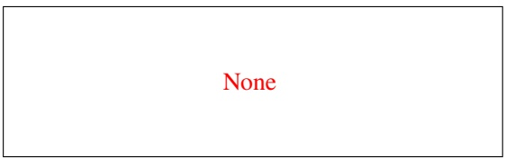

Since every possible value for $R _ { 5 }$ has a corresponding value in $R _ { 3 }$ that doesn’t violate any constraints, no new arcs need to get added to the queue.

<!-- page: 5 -->

**(h)** [3 pts] Select the following true statements. For all answers, you may assume that “tokens” means roughly the same thing as “words.”)

□ RNNs solve the “memory bottleneck” problem in LSTMs, and so RNNs are better at preserving information about early tokens in a sequence.

□ Masked language models predict each token based on the previous ones, while autoregressive (causal) language models predict only some fraction of the tokens based on the tokens before and after them.

When generating a sequence of tokens, models composed of Transformers use the attention mechanism to capture relationships between the token being generated and earlier tokens in a sequence.

□ Language models today are first pretrained on small amounts of curated, labeled data, then fine-tuned on large amounts of uncurated, unlabeled data.

□ After fine-tuning, an efficient and common way to encourage specific behaviors is to use RL with KL control, regardless of whether the specific behavior exists in the pretraining or fine-tuning data.

DDQN prevents the Q estimator learning algorithm from propagating a spike $( > > Q ^ { * } )$ in one $Q _ { \mathrm { s p i k e } }$ value into the Q values that depend on that $Q _ { \mathrm { s p i k e } }$ , **but** it does not help with overfitting. Hint: recall that Double Deep Q-Network (DDQN) keeps 2 Q estimators so that in computing $V ( s ^ { \prime } )$ to use in weight updates, one estimator gives $Q ( s ^ { \prime } , a ^ { \prime } )$ while the other one decides 𝑎′such that it maximizes $Q _ { \mathrm { o t h e r } } ( s ^ { \prime } , a ^ { \prime } )$

\# None of the above.

Note that these subparts (h to j) were taught only in the summer 2024 semester.

LSTMs were introduced to improve on RNNs at preserving information about early tokens in a sequence. LSTMs are better than RNNs about preserving information on tokens early in a sequence, but they still have a memory bottleneck; attention was introduced to address the memory bottleneck in LSTMs.

Autoregressive LMs predict each token based on the previous ones. Masked LMs predict some fraction of masked tokens based on the tokens around them.

Language models today are first pretrained on large amounts of uncurated, unlabeled data, then fine-tuned on small amounts of curated, labeled data (large and curated flipped vs. answer option).

If the specific behavior doesn’t exist in any of the data that created the model, RL cannot teach the new behavior because it only gives out rewards for the behavior when it happens which is then used to update weights to make high rewards more likely.

DDQN helps to actually better fit the training data by preventing unusual (spike) samples from breaking our model. The $Q _ { \mathrm { s p i k e } }   \mathrm { i s } > > Q ^ { * }$ , so it doesn’t fit the training data, and we stop it from breaking other 𝑄 values to not fit the training data. Helping with overfitting fixes the issue of fitting the training data well but not generalizing to test data.

**(i)** [2 pts] Bob is a TA for a computer science class. Bob’s professor accidentally deletes most of the files in each student’s final project (oops!). The professor asks Bob to train a neural network using data from past semesters that takes in each student’s past grades, personal information (name, age, etc.), and the remaining code for their final project, and then generate a final project grade with an explanation. The professor says she’ll use the model outputs to help her decide on final project grades, then release the trained model online so others can predict grades based on students’ past work.

Which of the following problems should Bob be concerned about?

The model might learn patterns that are unfair to some students, such as predicting higher grades for older students.

□ When assigning grades, the professor will most likely trust her own flawed judgment over the model’s impartial decision, an example of automation bias.

Once the model is released online, other users might be able to extract students’ personal information by querying the model.

\# None of the above.

This model is likely to result in allocation bias, such as assigning higher grades to some students in unfair ways based on factors like age or demographic background if those happen to correlate with certain grades. (The UK controversially implemented a similar algorithm to predict A-Level grades during Covid.) This could include predicting higher grades for older students if that’s a pattern in the data, even though it’s unfair to younger students who did well.

<!-- page: 6 -->

Automation bias is when people are likely to trust a model’s flawed prediction over their own (better-informed) judgment, which could certainly happen if the professor trusts a low-quality model prediction over her own knowledge of a student. Training data can indeed be extracted from publicly released models. This could violate students’ rights to have their educational records remain private.

**(j)** [1 pt] Suppose we have 20 data points, in which 10 of them are considered positive (indicated by a +) and the other 10 are considered negative (indicated by a −). We want to use a decision tree to split up our data, and we have four features to choose from to split our data. Which of the following splits results in the greatest information gain? Assume that is the symbol for separating groups formed by splitting on the feature.

$$
\bigcirc + - + - + - + - + - \bigg | - + - + - + - + - +
$$

$$
\bigcirc \quad + + \left| - + - + - + - + \right| - - + + \left| + + - - \right.
$$

$$
+\dots +\dots +\dots +\dots -\bigg| - - - - - - - - - +
$$

$$
\bigcirc + - \left| + - \right| - - \left| + + + + + + + + - - - - - - \right.
$$

The third answer choice is correct because we almost completely separate our positive data from our negative data, meaning there’s a very high information gain.

<!-- page: 7 -->

## Q2. [14 pts] Search & Games: Lights, Camera, Action!

Vivien is currently on an 𝑀 × 𝑁 grid, and she wants to take pictures of 𝑘 sites located on the grid, with each site occupying exactly one square on the grid. At each timestep, she can either move up, down, left, or right exactly one square (assuming this move does not push her out of the grid), or she can stay put and take a picture of her current square. The sites never move, and the 𝑘 sites are labeled as $s _ { 1 } , s _ { 2 } , \ldots , s _ { k }$

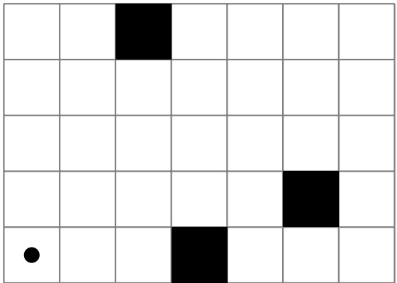

Figure 1: In the example 5 × 7 grid above, assuming that (1, 1) is located at the bottom left square, Vivien is located at (1, 1). In this example, 𝑘 = 3, and the location of the three sites, indicated by filled squares, are (4, 1), (3, 5), and (6, 2).

Vivien’s goal is to take a picture of each of the 𝑘 sites on the grid. She can only take a picture of a site when she is on that site’s respective square. Note that Vivien can take a picture of whatever square she’s currently on, even if it’s a blank square or a square of an already photographed site. This action will essentially do nothing.

Vivien decides to model this as a search problem.

**(a)** [2 pts] Do the sites’ locations **need** to be considered for the state space size calculation? Explain why or why not.

\# Yes

Since the sites do not move between actions, they do not need to be considered for the calculation of the state space.

**(b)** [2 pts] Select all true statements.

□ Depth-first tree search is guaranteed to be complete for this search problem.

When calculating the branching factor from a state, we take into account actions that result in our agent staying in the same state after taking that action.

At least a boolean variable is needed for each site when encoding a state representation for the search problem to check whether that site has been photographed yet.

The optimal solution to this search problem is always unique, meaning there is only ever at most one possible optimal solution.

\# None of the above.

<!-- page: 8 -->

The first option is false because depth-first tree search could potentially get trapped in an infinite cycle, causing the search problem to never finish.

The second option is true because actions that don’t do anything are still considered actions.

The third option is true because we need someway to know whether or not we have visited a site yet.

The fourth option is false because there could be multiple optimal paths that Vivien can take. For instance, if the grid is 2𝑥2, Vivien was at the bottom left, and there was one site at the top right, then Vivien could either go up and right or right and up to get to the site.

From this subpart onwards, we examine two scenarios for the search problem, labelling them as scenario 1 and scenario 2:

**Scenario 1:** Vivien can take pictures of the 𝑘 sites in any order. The goal is just to have every site be photographed at least once.

**Scenario 2:** Vivien still wants to take a picture of each of the 𝑘 sites, but she cannot take a picture of site $s _ { j }$ unless sites $s _ { 1 } , s _ { 2 } , \ldots , s _ { j - 1 }$ have all been photographed, for all $1 < j \leq k$

**(c)** [2 pts] Vivien implements goal tests 𝐺(𝑠) and $G ^ { \prime } ( s ^ { \prime } )$ for scenarios 1 and 2, respectively. What is the tightest upper bound (in big 𝑂 notation) it takes to run 𝐺(𝑠) and $G ^ { \prime } ( s ^ { \prime } )$ , in terms of the variables above (as well as constants, if necessary)? Assume we are using a minimal state space representation, and the functions are optimal (written to be as fast as possible).

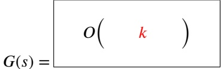

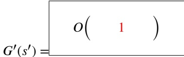

For 𝐺(𝑠), the goal state requires checking each of the 𝑘 sites to make sure that they have been photographed, which ultimately takes 𝑂(𝑘) time. However, for $G ^ { \prime } ( s ^ { \prime } )$ , it only takes 𝑂(1) time because only the last site, site $s _ { k } ,$ needs to be looked at, since if site $s _ { k }$ has been photographed, it is guaranteed by the problem itself that sites $s _ { 1 } , s _ { 2 } , \ldots , s _ { k - 1 }$ have ALSO been photographed.

**(d)** [3 pts] For each of the following heuristics, determine if it is admissible for scenario 1, scenario 2, both, or neither. Assume the heuristic is zero at a goal state.

One plus the maximum Manhattan distance between Vivien and any of the non-photographed sites.

■ Admissible for scenario 1. ■ Admissible for scenario 2. # Inadmissible for both.

We are simplifying the problem to require only one space to be photographed, and solving it exactly. Adding one improves over just the Manhattan distance because we need to spend an action to take the picture.

This is very similar to a Project 1 question where Pacman needs to eat all the foods.

One plus the Manhattan distance between Vivien and $s _ { j } ,$ , where 𝑗 is the minimum number such that $s _ { j }$ has not been photographed yet.

■ Admissible for scenario 1. ■ Admissible for scenario 2. # Inadmissible for both.

Same as the last one, but we are constrained to photographing some particular spot that’s not done yet, instead of the furthest remaining one.

**(e)** [2 pts] Now, Mustafa joins the search problem with Vivien and starts off at a random square. He can move around and take pictures of sites in the same way Vivien can.

Out of the following game scenarios, select the zero-sum games.

□ The game ends when both Mustafa and Vivien photograph all 𝑘 sites, and at the end, each person receives a score equal to the number of moves they made in the game.

□ The game ends when all 𝑘 sites have been photographed, but only ONE of Mustafa or Vivien needs to take a picture for each site. The score is the same as the first option.

The game ends when all 𝑘 sites are photographed, but only ONE of Mustafa or Vivien can photograph each state. However, between Mustafa and Vivien, the person that photographed the MOST of the 𝑘 sites wins.

<!-- page: 9 -->

\# None of the above.

Only the third option is zero-sum because in that game, Mustafa’s gain is equal to Vivien’s loss, and vice-versa. The same cannot be said for the first two options.

**(f)** [3 pts] Select all true statements about the mini-max game tree shown. It is **independent** from the subproblems before.

Suppose that the values in the terminal nodes have the property that either 𝐷 or 𝐸 is the **minimum** value out of the four terminal nodes, and either 𝐹 or 𝐺 is the **maximum** value out of the four terminal nodes.

Assume that alpha-beta pruning visits nodes from left to right.

□ Assuming no pruning, any of the four terminal nodes can be propagated up to the root node.

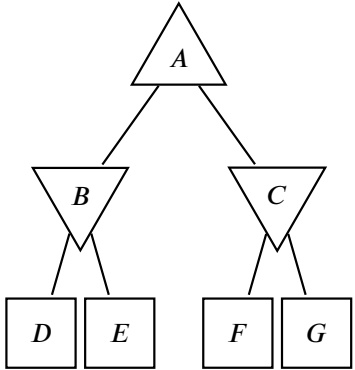

□ If 𝐹 is the max terminal node value, then 𝐺 is guaranteed to always be pruned.

■ This game tree represents a zero-sum game.

■ In general (not just in this game tree), alpha-beta pruning can sometimes result in different values being propagated up compared to standard mini-max tree calculations.

## # None of the above.

The first option is false because if 𝐷 is the minimum value, it will be propagated up once, but not propagated up to the root node. Only either node 𝐹 or 𝐺 can be the root node.

The second option is false, as 𝐹 being the maximum terminal node value doesn’t tell us anything about the value of 𝐺.

The third option is true, as mini-max game trees always represent zero-sum games.

The fourth option is true, since pruning could potentially not allow us to correctly propagate up the minimum or maximum value. However, alpha-beta pruning will always be sure to allow the root node to choose the same action as in a mini-max game tree.

<!-- page: 10 -->

## Q3. [13 pts] HMMs: Inside Out

Riley has 3 different observed behaviors for a given time 𝑡: smiling $( S _ { t } )$ , crying $( C _ { t } )$ , and laughing $( L _ { t } )$ . At each time step, each of these behaviors will either be observed $( X _ { t } = 1 )$ or not observed $( X _ { t } = 0 )$ , and this value is dependent on whether or not her primary emotion, Joy, is active at time $t \left( J _ { t } = 1 \right)$ . Zero, one, or two behaviors can be observed at a given time. We cannot directly observe the state of Joy.

This setup can be modeled by the following Hidden Markov Model. You may assume that $P ( C _ { i } | J _ { i } )$ is the same for all $1 \leq i \leq n .$ and you can assume the same for $P ( S _ { i } | J _ { i } )$ and $P ( L _ { i } | J _ { i } )$

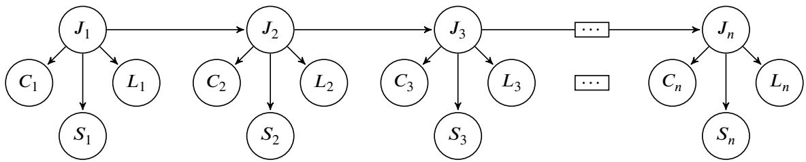

(a) [2 pts] What is the minimum number of conditional probability tables (CPTs) needed to model this HMM?

We need prior (𝑃 (𝐽)) and transition $( P ( J _ { i + 1 } | J _ { i } ) )$ distributions for 𝐽, as well as $P ( C | J ) , P ( S | J ) , P ( L | J )$

**(b)** [3 pts] Assume we observe that $J _ { 2 } = 1$ . Which variable(s) in the HMM are guaranteed to be conditionally independent of $J _ { 1 }$ given the observed variable?

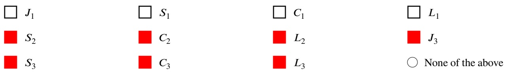

The chosen nodes are effectively getting their influence "blocked" by $J _ { 2 }$ from $J _ { 1 } .$

More formally, we can see that all paths from $J _ { 1 }$ to any of the selected variables must pass through $J _ { 2 } ,$ guaranteeing that all paths will include a causal chain with $J _ { 2 }$ observed. Because all the triples through $J _ { 2 }$ are an inactive triple (happens to be the same Unobserved → Observed → Unobserved triple), we know that $J _ { 1 }$ is d-separated with all variables that are descendants of $J _ { 2 } .$

We want to model our belief distribution $B ( J _ { i } )$ for whether Joy is active $( J _ { i } = 1 )$ or inactive $( J _ { i } = 0 )$ at any given time step 𝑖, given all observations of $C , S ,$ , and 𝐿 up to and including time 𝑖.

**(c)** [3 pts] Rewrite the update rule that would be used to derive $B ( J _ { i + 1 } )$ by filling in the blanks of the expression below.

$$
B (J _ {i + 1}) = (\mathbf {i}) \cdot (\mathbf {i i}) \cdot \sum_ {j _ {i}} \left((\mathbf {i i i}) \cdot B (j _ {i})\right)
$$

$$
\text {(i)} \quad \bigcirc 1 \quad \bigcirc P (J _ {i + 1} | J _ {i}) \quad \bullet P (C _ {i + 1} | J _ {i + 1}) \quad \bigcirc \sum_ {c} \sum_ {\ell} \sum_ {s} P (J _ {i} | c _ {i}, \ell_ {i}, s _ {i})\tag{ii}
$$

$$
\bigcirc P (J _ {i}) \quad \bigcirc P (J _ {i + 1} | J _ {i}) \quad \bullet P (L _ {i + 1} | J _ {i + 1}) P (S _ {i + 1} | J _ {i + 1}) \quad \bigcirc \sum_ {s} \sum_ {\ell} P (J _ {i + 1} | s _ {i + 1}, \ell_ {i + 1})
$$

$$
\text {(iii)} \quad \bigcirc P (j _ {i}) \quad \bullet P (J _ {i + 1} | j _ {i}) \quad \bigcirc P (j _ {i} | c _ {i}, s _ {i}, \ell_ {i}) \quad \bigcirc P (J _ {i + 1} | c _ {i + 1}, s _ {i + 1}, \ell_ {i + 1})
$$

<!-- page: 11 -->

This is the same as the normal belief distribution update rule, just incorporating the fact that there are 3 evidence variables. Notice that each evidence variable $( C _ { i } ,   S _ { i } ,   L _ { i } )$ is independent of all other evidence variables given parent $J _ { i } ,$ so the joint probability can be rewritten as $P ( C , S , L | J ) = P ( C | J ) \cdot P ( S | J ) \cdot P ( L | J )$

<!-- page: 12 -->

Riley’s parents want to tell her some important news, and want to know who should tell her the news out of the two. After observing her behaviors at the third timestep, they will decide whether the mom gives the news $( N = 1 )$ or the dad gives the news $( N = 0 )$ . Their utility from Riley’s reaction to the news depends on whether Joy is active at time step $3 \: ( J _ { 3 } = 1 )$ .

We can model this new setup as the following decision network:

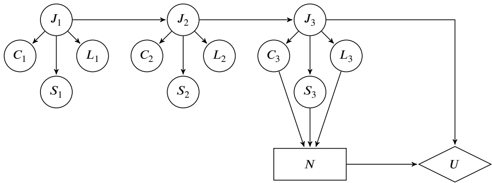

**(d)** [1 pt] $\mathrm{VPI}(C_{1},S_{1},L_{1})\xlongequal{\quad\quad}\mathrm{VPI}(C_{2},S_{2},L_{2})$ # = # > # ≥ # < ≤ # Not enough information

It’s possible that none of these six variables give any information at all, in which case $\mathrm{VPI}(C_{1},S_{1},L_{1})=\mathrm{VPI}(C_{2},S_{2},L_{2})=$ 0, so equality is always possible.

We know that the conditional probability tables $P ( C _ { 1 } | J _ { 1 } )$ and $P ( C _ { 2 } | J _ { 2 } )$ , etc. are identical because this is an HMM. So, the observations at step 2 give us the same volume of information about $J _ { 2 }$ as 1 about $J _ { 1 }$ . Finally, $J _ { 2 }$ is closer to the 𝑈 (and in fact would make $J _ { 1 }$ conditionally independent of $U /   U ^ { \prime } \mathrm { s }$ parents), so the step 2 is guaranteed to be at least the same 𝑉 𝑃 𝐼 or better.

**(e)** [1 pt] $\mathrm{VPI}(C_{1},S_{1},L_{1})\xlongequal{\quad\quad}\mathrm{VPI}(C_{1},S_{1},L_{1},C_{2},S_{2},L_{2})$ # = # > # ≥ # < ≤ # Not enough information

The right has the same, and some extra variables, so it can’t be lower than the left. We can’t guarantee that it is the same because the step 2 observations are not conditionally independent of $U /   U ^ { \prime } \mathrm { s }$ parents when conditioned on the step 1 observations.

**(f)** [1 pt] $\mathrm{VPI}(C_{1},S_{1},L_{1},J_{2})\xlongequal{\quad\quad}\mathrm{VPI}(J_{2})$ = # > # ≥ # < # ≤ # Not enough information

$C _ { 1 } , S _ { 1 } , L _ { 1 }$ are conditionally independent of $U / U ^ { \circ } \mathrm { s }$ parents when conditioned on $J _ { 2 }$ . We can see this with d-Separation, because we will hit the Unobserved → Observed $( = J _ { 2 } )$ → Unobserved inactive triple on all possible paths.

Riley’s mom will tell Riley the news (𝑁 = 1) if they believe their utility will be non-negative $( E U ( N = 1 ) \geq 0 )$

| 𝐽3 | 𝑈(𝑁 = 1) |
| --- | --- |
| 0 | -8 |
| 1 | 10 |

**(g)** [2 pts] Let’s say Riley’s parents are only able to observe Riley’s behaviors at time 𝑡 = 1, and they observe the values $C _ { 1 } = 0 , S _ { 1 } = 1 , L _ { 1 } = 0$ . Their choice 𝑁 at 𝑡 = 3 depends solely on these observations. Should Riley’s mom tell her the news given the assumptions about the probability distributions?

All distributions in the CPT’s are uniform.

<!-- page: 13 -->

$$
\bigcirc \text {Yes} (N = 1)
$$

$$
\bigcirc \text {No} (N = 0)
$$

It could be the case that $J _ { 3 } = 1$ is very unlikely, in which case Riley’s mom would not want to tell.

<!-- page: 14 -->

## Q4. [14 pts] BN, Naive Bayes, Perceptron: Bayesketball

Wilson is preparing for his basketball game. He wants to predict his team’s game outcome (G). He believes the game outcome is influenced by several binary random variables: Team Morale (M), Player Health (H), Training Quality (T), Opponent Strength (O), and Recent Injuries (I). Wilson builds a Bayes Network to represent the dependencies between these variables as follows:

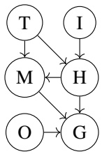

**(a)** [3 pts] Select the independence statements that are **guaranteed** to be true given this Bayes Net Structure.

■ O ⟂⟂ I

T ⟂⟂ G ∣ M, H

□ I ⟂⟂ G ∣ M

\# None of the above.

O ⟂⟂ I: These are both roots of the graph, and don’t have any shared observed descendants.

T ⟂⟂ G ∣ M, H: Both of the parents of G are included, and T is an ancestor of G, so they are independent by the base requirement of independences in a Bayes Net. We can also see that any path will encounter the Unobserved → Observed (=M or H) → Unobserved inactive triple.

I ⟂⟂ G ∣ M: We don’t have all of the parents. Specifically, the path I → H → G is active because the only triple in the path is active.

Wilson now computes 𝑃 (𝐺 ∣ 𝑀 = +𝑚, 𝐼 = −𝑖) using variable elimination.

**(b)** [2 pts] What factors are needed to eliminate 𝐻 first?

□ 𝑃 (𝑇 )

□ 𝑃 (𝐼 = −𝑖)

■ 𝑃 (𝑀 = +𝑚 ∣ 𝑇 , 𝐻)

𝑃 (𝐻 ∣ 𝑇 , 𝐼 = −𝑖)

□ 𝑃 (𝑂)

■ 𝑃 (𝐺 ∣ 𝑀 = +𝑚, 𝐻, 𝑂)

All factors that have 𝐻 in it. The number of factors is always 1+ how many arrows are coming out of the node – because each node is 𝑃 (node|parents).

The basketball game is about to end and Wilson is passed the ball, forcing him to think about taking the game winning shot. He uses a Naive Bayes classifier to help him predict the outcome of the shot. He chooses three features during classification: Launch Angle $( X _ { 1 } )$ , Velocity $( X _ { 2 } )$ , and Distance $( X _ { 3 } )$ . Below is the training dataset:

| Launch Angle (𝑋1) | Velocity (𝑋2) | Distance (𝑋3) | Outcome (𝑌) |
| --- | --- | --- | --- |
| + | + | + | success |
| + | + | + | success |
| + | - | + | success |
| + | + | - | success |
| + | + | + | fail |
| + | - | - | fail |

**(c)** [3 pts] Under Naive Bayes assumptions, solve the following probabilities:

<!-- page: 15 -->

$$
P (Y = \text {success}) = \boxed {\frac {2}{3}}
$$

$$
P (Y = \text {fail}) = \boxed {\frac {1}{3}}
$$

$$
P (X _ {1} = + \mid Y = \text {success}) = \boxed { \begin{array}{c} 1 \end{array} }
$$

$$
P (X _ {1} = + \mid Y = \text {fail}) = \boxed { \begin{array}{c} 1 \end{array} }
$$

All of these are just the count of samples matching all variable assignments divided by the number of samples matching the conditioned variable assignments. This is the MLE assuming each feature is conditionally independent of each other given the label.

<!-- page: 16 -->

Wilson decides to use a perceptron instead to label whether a shot will be a success (+) or fail (−). He uses 2 features: the Spin and Angle Offset (Angle), which can both be positive or negative integers.

Consider the following labeled training data, where each row signifies a shot:

| Spin | Angle | Success (+) or Fail (-) |
| --- | --- | --- |
| -5 | 1 | + |
| 3 | -2 | - |
| -2 | -1 | - |
| 4 | 2 | + |

**(d)** [2 pts] Our perceptron weights have been initialized to $w _ { \mathrm { s p i n } } = 1$ and $w _ { \mathrm { a n g l e } } = - 1$ . After processing the first row with the perceptron algorithm, what will be the updated values for these weights?

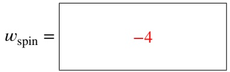

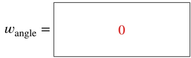

We misclassified when the true label is positive, so ADD the data to the current weights. $[ 1 ,   - 1 ] + [ - 5 ,   1 ] = [ - 4 ,   0 ]$

**(e)** [1 pt] Is the data linearly separable? Hint: You do not need to run the perceptron algorithm to figure this out.

Yes

\# No

Looking for easy lines that can separate the data, we can see that all fails have a low angle and all successes have a high angle, so we can separate on just the one angle feature.

Specifically, Angle=0 separates the data, which corresponds to $w _ { \mathrm { s p i n } } = 0$ and $w _ { \mathrm { a n g l e } } = 1$ or any positive number.

**(f)** [3 pts] For each of the basketball shot datasets represented by the graphs below, select the feature maps for which the perceptron algorithm can perfectly classify the data. Each data point is in the form $( x _ { 1 } , x _ { 2 } ) = ( \mathrm { s p i n } , \mathrm { h e i g h t } )$ , and has some label 𝑌 , which is either a + (successful shot) or - (missed shot).

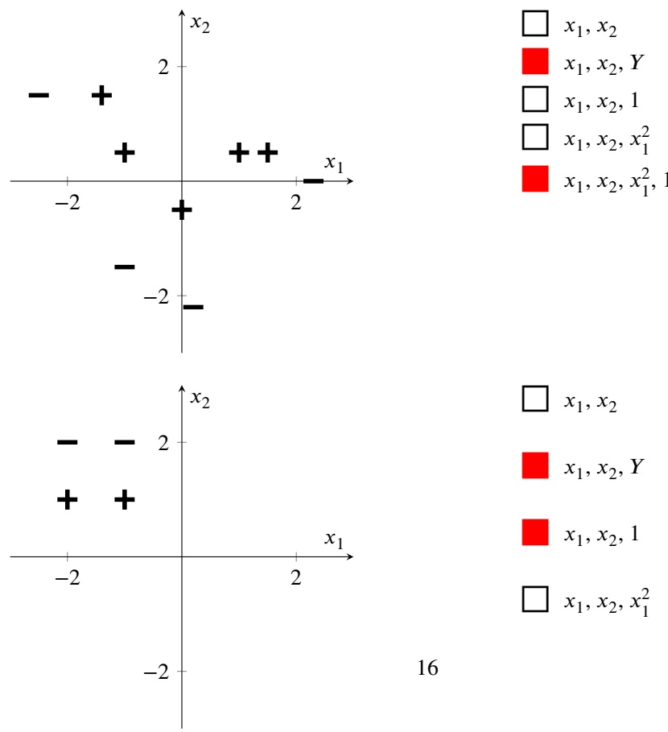

<!-- page: 17 -->

$$
x _ {1}, x _ {2}, x _ {1} ^ {2}, 1
$$

Having the feature 𝑌 just tells us the correct label, so any feature set that has it automatically works, but also is not at all interesting.

First graph: is not linearly separable, disqualifying the linear-only options (1 and 3). We can see that drawing a parabola (in $x _ { 1 } )$ can separate the points, but it needs to pass below the origin, so we need a parabolic feature set with a bias, which is the last option.

Second graph: is linearly separable, but the + and the − are on the same line as the origin, so we need a bias. A parabola in $x _ { 1 }$ can’t separate the points (option 4) but in $x _ { 2 } ,$ can (option 5). The last option (5) doesn’t strictly need the bias but extra features can always be ignored.

<!-- page: 18 -->

## Q5. [11 pts] MDPs: Easy MDPeasy

Lauren can be on any of floors $F _ { 1 } , F _ { 2 } ,$ or $F _ { 3 }$ in her house, where $F _ { 1 }$ is the lowest floor and $F _ { 3 }$ is the highest floor.

Lauren can take the action **up**, which moves her from floor $F _ { i }$ to floor $F _ { i + 1 }$ . If she’s originally at floor $F _ { 3 }$ and goes up, she just stays at floor $F _ { 3 }$ . Similarly, she can also take the action **down**, which moves her from floor $F _ { i }$ to floor $F _ { i - 1 }$ . If she’s originally at floor $F _ { 1 }$ and goes down, she just stays at floor $F _ { 1 }$

Both of these actions work correctly with 100% probability.

Also, at any floor, Lauren can choose to take the **call** action, in which she makes a phone call on that floor. With this action, one of three events can occur:

• Her call gets accepted, which lands her in the terminal state "accepted".

• Her call gets rejected, which lands her in the terminal state "rejected".

• Her phone glitches and she isn’t able to make the phone call, which causes her to stay in her current state.

Lauren decides to model this an a Markov Decision Process.

The reward is 0 for every action, except for actions that go from a floor state to one of the terminal states: going to "accepted" yields a reward of 1, and going to "rejected" yields a reward of −1. Assume we use a discount factor of $\gamma = 1$

For the rest of the problem, the below table will represent the transition probabilities for a **𝐜𝐚𝐥𝐥** action in our MDP, with each cell representing $T ( s , c a l l , s ^ { \prime } )$ for a given $s ^ { \prime }$ in the column headers and 𝑠 in the row headers.

|  | s' = accepted | s' = s | s' = rejected |
| --- | --- | --- | --- |
| 𝑠 = 𝐹3 | 0.3 | 0.4 | 0.3 |
| 𝑠 = 𝐹2 | 0.2 | 0.5 | 0.3 |
| 𝑠 = 𝐹1 | 0.1 | 0.7 | 0.2 |

**(a)** [2 pts] Lauren wants to go to a floor and choose the call action repeatedly on that floor until she reaches a terminal state. Which floor would yield the highest expected reward from doing this?

$$
\bigcirc F _ {1}
$$

$$
\bigcirc F _ {2}
$$

The highest expected reward:

We set up the following equations:

$$
\begin{array}{l} \mathbb {E} [ F _ {3} ] = 0. 3 + 0. 4 \mathbb {E} [ F _ {3} ] - 0. 3 \\ \mathbb {E} [ F _ {2} ] = 0. 2 + 0. 5 \mathbb {E} [ F _ {2} ] - 0. 3 \\ \mathbb {E} [ F _ {1} ] = 0. 1 + 0. 7 \mathbb {E} [ F _ {1} ] - 0. 2 \end{array}
$$

Solving each equation and finding the max expected value yields $\mathbb { E } [ F _ { 3 } ] = 0$ as the maximum expected reward.

Since the transition probabilities for the "call" action don’t change at all, the optimal policy will still be to go to

**(b)** [3 pts] Select all true statements about this MDP.

■ Value iteration will converge to the optimal values after calculating $V _ { 1 } ( s )$ for all states 𝑠 (assuming we start at $V _ { 0 } ( s ) )$

□ Changing the discount factor 𝛾 will affect the optimal values at each state for this MDP.

<!-- page: 19 -->

□ There exists a unique optimal policy for this MDP.

■ If we introduced a negative reward when moving between floors, this could potentially change the optimal values for some states.

\# None of the above.

The first statement is true. Performing one iteration of value iteration after $V _ { 0 } ( s )$ will result int he same values, meaning we have converged to the optimal values for that state.

The second statement is false because of the fact that our discount rate is being multiplied by $V _ { k - 1 } ( s ^ { \prime } )$ in the value iteration algorithm, and since $V _ { 0 } ( s ) = 0 ,$ the value of 𝛾 does not matter.

The third statement is false, as the optimal values are 0 for all states, which can be the result of going either up or down from every state.

The fourth option is true because this could mess with the idea that we can move freely between floors as many times as want. If we can’t do this, then we should have to explore the tradeoffs between moving between floors and calling from a floor you’re already on, which could mess with the optimal values for some states.

<!-- page: 20 -->

**(c)** [4 pts] Suppose we change the reward of moving into the "accepted" state from a non-terminal state to 10, we change the reward of moving into the "rejected" state from a non-terminal state to −10, and all other actions now yield a reward of −1 (including "up" and "down" actions between floors, and "call" actions that result in staying in the same floor). Perform two iterations of value iteration for the three floor states, and fill the missing values in the below table. Note that the two terminal states are left out here because they always have a value of 0, and also that $\gamma = 1$ For convenience, here is the same "call" transition table from the last page. Note that "up" and "down" actions still work correctly all the time.

|  | s' = accepted | s' = s | s' = rejected |
| --- | --- | --- | --- |
| 𝑠 = 𝐹3 | 0.3 | 0.4 | 0.3 |
| 𝑠 = 𝐹2 | 0.2 | 0.5 | 0.3 |
| 𝑠 = 𝐹1 | 0.1 | 0.7 | 0.2 |

| States | 𝐹1 | 𝐹2 | 𝐹3 |
| --- | --- | --- | --- |
| 𝑉0(𝑠) | 0 | 0 | 0 |
| 𝑉1(𝑠) | -1 | -1 | -0.4 |

For $V _ { 1 } ( F _ { 1 } )$ , we see that using the value iteration equation, going up or down will yield a value of −1, as well as making a call on that floor. In fact, this is the case for all floors, so the whole row will be equal to −1.

For $V _ { 2 } ( F _ { 1 } )$ , we first see that going up or down will yield a value of −2 now (since we use the values in $V _ { 1 } ( s )$ now). However, making a call at $F _ { 1 }$ will yield a value of $0 . 1 \cdot 1 0 - 0 . 2 \cdot 1 0 + 0 . 7 \cdot ( 0 + ( - 1 ) ) ) = - 1 . 7$ , and since this is the max value out of all three possible actions, this is the value for $V _ { 2 } ( F _ { 1 } )$ . Similar calculations are made for $V _ { 2 } ( F _ { 2 } )$ and $V _ { 2 } ( F _ { 3 } )$

This subpart is independent of the previous subparts.

**(d)** [2 pts] True or false: Computing the optimal values of states, given the output of policy iteration, is easier than computing the optimal values without policy iteration.

True

\# False

True or false: Extracting a policy given optimal values is easier than extracting a policy given optimal Q-values.

\# True

False

First: we can run policy evaluation and don’t have to consider non-optimal actions. This is better than having to compute values while not knowing the optimal actions; all algorithms for calculating values are slower than just policy evaluation.

Second: we can take the arg $\operatorname* { m a x } _ { a } Q ( s , a )$ for each state 𝑠, which is $O ( | S | | A | )$ amount of work. If we only have 𝑉 values, there’s no direct way of getting what actions made that happen, we have to use one of the more complex algorithms to either get 𝑄 values from this or do some kind of policy iteration.

<!-- page: 21 -->

## Q6. [16 pts] RL: Weight a Minute!

Consider a state space with states $X _ { 1 } , X _ { 2 } , X _ { 3 } , \ldots , X _ { n } .$ In any state, one can take the action to move to any **other** state. For instance, from state $X _ { 1 } ,$ , you can move to any of states $X _ { 2 } , X _ { 3 } , \ldots , X _ { n } ,$ but there is no action that allows you to stay in state $X _ { 1 }$

**(a)** [2 pts] Consider running Q-learning on this problem. How many Q-values do we need in order to represent this problem? Your answer should be an expression in terms of 𝑛.

$n(n - 1)$

Total $\mathrm { Q - v a l u e s } = | S | \times | A |$

**(b)** [2 pts] Compared to Q-learning, select all of the following reinforcement learning (RL) algorithms that have a **greater** space requirement for this problem. Hint: the space requirement for Q-learning is $| S | \times | A |$

Model-based Learning

Direct Evaluation

□ Temporal Difference (TD) Learning

\# None of the above.

Model-based learning requires a space complexity of $| S | ^ { 2 } | A |$ due to needing all the transitions from one state to any other state. Direct evaluation and TD-learning, on the other hand, only have a space requirement of |𝑆|, as only $V ( s )$ needs to be stored for all states 𝑠.

Now, consider an arbitrary MDP, with unknown transition/reward models. We observe an agent acting according to policy 𝜋.

In standard TD learning, we would process each sample one at a time:

$$
V ^ {\pi} (s) \leftarrow (1 - \alpha) V ^ {\pi} (s) + \alpha \left[ r _ {i} + \gamma V ^ {\pi} (s _ {i} ^ {\prime}) \right]
$$

Danial wants to instead process three samples (all starting at the same state) at a time in one update, rather than in three separate updates. Furthermore, he wants to process these three samples at once using a **weighted average**.

The sample yielding the highest reward out of the three receives weight $w _ { 1 }$ , the sample with the second highest reward receives weight $w _ { 2 }$ , and the sample with the lowest reward receives weight $w _ { 3 }$ , where ties are broken randomly. You can assume $w _ { 1 } > w _ { 2 } > w _ { 3 } > 0$ , and $w _ { 1 } + w _ { 2 } + w _ { 3 } = 1$

**(c)** [4 pts] Select Danial’s modified update equation.

Sample $( s _ { 1 } , a _ { 1 } , s _ { 1 } ^ { \prime } , r _ { 1 } )$ yields the highest reward.

Sample $( s _ { 2 } , a _ { 2 } , s _ { 2 } ^ { \prime } , r _ { 2 } )$ yields the second highest reward.

Sample $( s _ { 3 } , a _ { 3 } , s _ { 3 } ^ { \prime } , r _ { 3 } )$ yields the lowest reward.

$$
V ^ {\pi} (s) \leftarrow (1 - \alpha) \cdot (\mathbf {i}) \cdot (\mathbf {i i}) + \alpha \cdot (\mathbf {i i i}) ((\mathbf {i v}) \cdot [ (\mathbf {v}) + (\mathbf {v i}) ])
$$

**(i)** $\bigcirc \quad 0$ 1 # 3 # $( 1 - \alpha ) ^ { 2 }$

**(ii)** $\begin{array} { r } { \textcircled { \sim } ~ \sum _ { i = 1 } ^ { 3 } V ^ { \pi } ( s ) } \end{array}$ ● $V ^ { \pi } ( s )$ # $w _ { 1 } w _ { 2 } w _ { 3 } V ^ { \pi } ( s )$ # $\textstyle \prod _ { i = 1 } ^ { 3 } V ^ { \pi } ( s )$

**(iii)** # $\mathtt { m a x } _ { 1 \leq i \leq 3 }$ $\operatorname* { m i n } _ { 1 \leq i \leq 3 }$ $\Sigma _ { i = 1 } ^ { 3 }$ $\Pi _ { i = 1 } ^ { 3 }$

**(iv)** # $\alpha w _ { i }$ O $w _ { i }$ $( 1 - w _ { i } )$ $\frac { 1 } { w _ { i } }$

**(v)** $r _ { i }$ $\gamma r _ { i }$ $\alpha r _ { i }$ $3 r _ { i }$

**(vi)** $\textcircled { \textit { 1 } } w _ { i } V ^ { \pi } ( s _ { i } ^ { \prime } )$ # $V ^ { \pi } ( s _ { i } ^ { \prime } )$ # $\gamma V ^ { \pi } ( s _ { i } )$ O $\gamma V ^ { \pi } ( s _ { i } ^ { \prime } )$

<!-- page: 22 -->

$$
V ^ {\pi} (s) \leftarrow (1 - \alpha) V ^ {\pi} (s) + \alpha \sum_ {i = 1} ^ {3} w _ {i} \left[ r _ {i} + \gamma V ^ {\pi} (s _ {i} ^ {\prime}) \right]
$$

<!-- page: 23 -->

**(d)** [3 pts] Select all true statements.

■ More recent sets of three samples will influence the value of that state more than older sets.

□ We will learn the optimal policy from this new updated equation.

■ If $w _ { 1 } > w _ { 2 } \geq w _ { 3 } \geq 0$ instead of $w _ { 1 } > w _ { 2 } > w _ { 3 } > 0 ,$ , we may not converge to the true value of $V ^ { \pi } ( s )$

Slowly shrinking the learning rate 𝛼 overtime will help $V ^ { \pi } ( s )$ stabilize its value.

\# None of the above.

The first option is true because due to the learning rate 𝛼, the older sets of three samples will have exponentially less weight than the newer sets.

The second option is incorrect because TD-learning is not used to find the optimal policy, and neither will this new update equation.

The third option is true because if, say, $w _ { 1 }   =   1$ and $w _ { 2 }   =   w _ { 3 }   =   0$ , then this update equation essentially becomes the standard update equation for TD-learning, which we know converges already.

The fourth option is correct because decreasing the learning rate puts less weight on new samples, allowing our $V ( s )$ value to converge quickly to our true value.

**(e)** [3 pts] Danial claims that this new update equation is guaranteed to converge to the true state values, just like the normal TD learning update equation. Curtis, however, claims that this is not necessarily true. Who is correct, and why? Explain your answer in three sentences or fewer.

Danial is correct

Curtis is correct

Curtis is correct because assigning the highest weight to the largest reward value of the three samples isn’t guaranteed to help you converge. Consider the case where your two possible rewards from a state are 1 and 999, and the reward of 1 occurs $\frac{2}{3}$ of the time. If our weights were, say $w _ { 1 } = 0 . 9 5 , w _ { 2 } = 0 . 3 , w _ { 3 } = 0 . 2$ , then even though we would usually sets of three samples with rewards 1, 1, 999, our weights would unevenly weight the largest sample by a lot more, causing us to never converge to the true value for that state.

**(f)** [2 pts] In model-based learning, the approximations for our transition functions $\hat { T } ( s , a , s ^ { \prime } )$ are calculated using the

learning rate

weighted average

maximum a posteriori

maximum likelihood estimate

\# None of the above.

This is known as the maximum likelihood estimate, because we are finding the probability $( \hat { T } ( s , a , s ^ { \prime } ) )$ that maximizes the chance that we observe our evidence.

<!-- page: 24 -->

## Q7. [12 pts] ML: N&Ns

You’re building a neural network to determine whether candies are M&Ms or Skittles, where M&Ms are represented by a 0, and Skittles are represented by a 1.

Each data point is represented as a vector 𝑥 consisting of the features [candy diameter, is blue, is brown].

The neural net has the following structure:

$$
\begin{array}{c} {h _ {1} = \sigma (x W _ {1} + b _ {1})} \\ {\hat {y} = \mathrm{ReLU} (h _ {1} W _ {2} + b _ {2})} \end{array}
$$

Finally, this value ̂𝑦 is put into a loss function $\mathcal { L } ( \hat { y } ) = \| \hat { y } - y ^ { * } \| _ { 2 }$ , meaning after you subtract the vector 𝑦∗from the vector ̂𝑦, you take the square root of the sum of squares of that resulting vector. 𝑦∗is the vector holding the true labels for your input.

**(a)** [3 pts] You decide to train the model with batch size 4.

Given the already filled-in dimensions, fill in the missing dimensions:

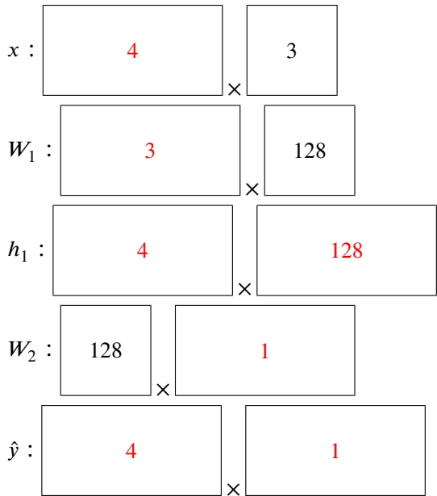

A single 𝑥 input needs to contain all of the data, so it needs to have 4 𝑥 vectors, each 3 features long.

By definition of matrix multiplication, if $M \times N$ is valid and 𝑀 is 𝑎 × 𝑏 and 𝑁 is $c \times d ,$ we must have $b = c$ (because matrix multiplication is just an array of results when looking at the dot product of each possibly pair of row of 𝑀 and column of 𝑁, which in turn is just a similarity check). The result of the matrix multiplication is therefore $a \times d .$

Tracking the dimensions starting from 𝑥 yields the rest of the numbers. 𝜎 and ReLU are an element-wise functions, so they doesn’t affect the dimensions.

This was also a part of doing Project 5.

**(b)** [3 pts] When training this model, the training loss remains high, and so does the test loss. Which of the following could help with this problem?

Change the column dimension of $W _ { 1 }$ from 128 to 256 (and modify other vector/matrix dimensions to line up with this).

■ Increase the size of the training set.

Increase the size of the test set.

Increase the batch size to 10.

■ Add more features to 𝑥.

\# None of the above.

<!-- page: 25 -->

Since both training and test loss are high, we are not fitting the data. This means that either our model is not complex enough to capture the relationship (options 1 and 5), or we don’t have enough data for the algorithm to work well (option 2).

Increasing the test set means we have less data in the training set (option 3). Changing the batch size (option 4) is usually a hardware-targeted optimization within a reasonable batch size selection; changing batch size from 4 to 10 will not affect the behavior of the optimization algorithm learning the weights.

<!-- page: 26 -->

**(c)** [4 pts] For each of the partial derivatives below, express these partial derivatives as a chain of other derivatives in the way that backpropagation would do. Do **not** compute the actual derivatives. In your partial derivatives, you may only use the variables $\mathcal { L } , b _ { 1 } , b _ { 2 } , h _ { 1 }$ , and ̂𝑦.

| 𝜕 | 𝜕𝜕𝑦̂ |
| --- | --- |
| 𝜕𝑏2 = | 𝜕𝑦̂ 𝜕𝑏2 |
| 𝜕𝜕𝑏1 = | 𝜕𝜕𝑦̂ 𝜕𝜕ℎ𝑦̂1 𝜕𝜕ℎ𝑏11 |

This uses the chain rule, $\begin{array} { r } { \frac { \partial f ( g ( t ) ) } { \partial t } = \frac { \partial f ( g ) } { \partial g } \times \frac { \partial g ( t ) } { \partial t } } \end{array}$ . We apply this to the neural net formulas at the beginning of the problem.

**(d)** [2 pts] Bubby proposes that changing the final activation function from ReLU to sigmoid (which means $\hat { y } = \sigma ( h _ { 3 } )$ is the new output step) will be more suitable for our task of classifying the M&Ms. Is he correct?

Yes, because the sigmoid function squashes our range to be between 0 and 1, allowing our output to be closer to the label value (which is 0 or 1).

\# Yes, because ReL $\mathbf { U } ( x ) = \operatorname* { m a x } ( 0 , x )$ does not have a defined derivative at $x = 0$

\# No, because the sigmoid function takes much longer for a computer to run than the ReLU function.

\# No, because the sigmoid function is undefined for certain inputs.

For binary classification tasks, the sigmoid function can represent probabilities of our input belonging to a certain class, deeming it much more appropriate for our M&M classification task.

<!-- page: 27 -->
