<!-- page: 1 -->

Intro to Artificial Intelligence

Fall 2025 Final Exam

Print Your Name:

Print Your Student ID:

Print Student name to your left:

Print Student name to your right:

You have 170 minutes. There are 8 questions of varying credit. (100 points total)

| Question: | 1 | 2 | 3 | 4 | 5 | 6 | 7 | 8 | Total |
| --- | --- | --- | --- | --- | --- | --- | --- | --- | --- |
| Points: | 5 | 6 | 15 | 17 | 17 | 17 | 17 | 6 | 100 |

We reserve the right to deduct points for failing to follow the marking directions below:

For questions with **circular bubbles**, you may select only one choice.

For questions with **square checkboxes**, you may select one or more choices.

A Unselected option (Completely unfilled)

You can select

B Don’t do this (it will be graded as incorrect!)

multiple squares

C Only one selected option (completely filled)

C Don’t do this (it will be graded as incorrect!)

Anything you write outside the answer boxes or you ~~cross out~~ will not be graded. If you write multiple answers, your answer is ambiguous, or the bubble/checkbox is not entirely filled in, we will grade the worst interpretation.

Read the honor code below and sign your name.

By signing below, I affirm that all work on this exam is my own work. I have not referenced any disallowed materials, nor collaborated with anyone else on this exam. I understand that if I cheat on the exam, I may face the penalty of an “F” grade and a referral to the Center for Student Conduct.

Sign your name:

<!-- page: 2 -->

Q1.1 and Q1.2 are from the guest lectures.

Q1.1 (1 point) In Prof. Alaa’s guest lecture, he talks about two metrics that can be used to compare real and synthetic distributions. What are the two metrics that he brings up? A Precision C Diversity B Fidelity D Recall

Q1.2 (1 point) In Prof. Pierson’s guest lecture, she discusses two specific examples of using AI to create social equity. What are the two examples discussed? A Knee osteoarthritis C Inequality in policing B Deforestation D Inequality in STEM education

For Q1.3 to Q1.5, consider an arbitrary Bayes Net with no edges. 𝑋, 𝑌 , and 𝑍 represent arbitrary variables in the Bayes Net.

Q1.3 (1 point) In a Bayes Net with no edges, what is the most efficient way to calculate a conditional probability like 𝑃(𝑋 | 𝑌 ), with **one** query variable and **one** evidence variable?

A Return one of the CPTs (Conditional Probability Tables) with no changes.

B Perform one or more join operations only.

C Perform one or more eliminate operations only.

D Perform one or more join operations, and one or more eliminate operations.

Q1.4 (1 point) In a Bayes Net with no edges, what is the most efficient way to calculate a conditional probability like 𝑃(𝑋 | 𝑌 , 𝑍), with **one** query variable and **multiple** evidence variables? A Return one of the CPTs with no changes. B Perform one or more join operations only. C Perform one or more eliminate operations only. D Perform one or more join operations, and one or more eliminate operations.

Q1.5 (1 point) In a Bayes Net with no edges, what is the most efficient way to calculate a conditional probability like 𝑃(𝑋, 𝑌 | 𝑍), with **multiple** query variables and **one** evidence variable?

A Return one of the CPTs with no changes.

B Perform one or more join operations only.

C Perform one or more eliminate operations only.

D Perform one or more join operations, and one or more eliminate operations.

<!-- page: 3 -->

CS188 staff is going on a road trip! There are five possible seats for staff members to sit in the car. The staff members are the variables, and the seats are the values. No two staff members can sit in the same seat.

The staff members have special requests on which seat they want to sit in:

1. Only Isabella and Kanav can sit in the driver’s seat 𝐷.

2. Andrew does not want to sit in the middle seat 𝑀.

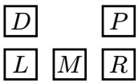

3. Aly gets carsick and needs to sit in a seat next to a window (𝐷, 𝑃, 𝐿, or 𝑅).

4. Saathvik wants to sit one seat to the left or right of Kanav, i.e., they can sit in (𝐷, 𝑃), (𝐿, 𝑀), or (𝑀, 𝑅).

Q2.1 (1 point) After enforcing only unary constraints, which of these arcs is already consistent, without removing additional values from any domains? A (Kanav → Saathvik) only B (Saathvik → Kanav) only C Both D Neither

Q2.2 (1 point) After enforcing only unary constraints, we use LCV (Least Constraining Value) with forward checking to assign Kanav first. Select all value(s) that LCV could assign to Kanav. A 𝐷 B 𝑃 C 𝐿 D 𝑀 E 𝑅

For Q2.3 to Q2.5, we use cutset conditioning to solve this CSP, where the cutset is Saathvik and Kanav. In cutset conditioning, after we assign values to one or more variables, the result is a residual CSP, which is a smaller CSP with only the unassigned variables left.

Assume we create residual CSPs by assigning values to Saathvik and Kanav, and **not** checking any constraints (except the “no two staff members in the same seat” constraint) when assigning values to Saathvik and Kanav.

Q2.3 (1 point) How many total residual CSPs do we need to create in order to find all solutions to the original CSP? A 1 B 2 C 3 D 6 E 10 F 20

Q2.4 (2 points) Select all true statements about each residual CSP. A Each residual CSP has a tree-structured constraint graph. B Each residual CSP has a constraint graph with no edges. C Each residual CSP only has unary constraints (except “no two staff members in the same seat”). D Each residual CSP can be solved with no backtracking. E Each residual CSP takes worst-case exponential time to solve (i.e., trying every assignment). F None of the above

Q2.5 (1 point) Does a solution for a residual CSP correspond to a solution for the original CSP? A Always B Sometimes C Never

<!-- page: 4 -->

**(15 points)**

Pac-Man is making donuts and models their attributes using a Bayes Net. Each donut has a shape 𝑆, icing color 𝐶, topping 𝑇 , filling 𝐹, yumminess 𝑌 , and aesthetics 𝐴.

All variables in the Bayes Net are binary (i.e., each variable can take on two possible values).

For Q3.1 to Q3.4, use 𝑑-separation to determine if the independence assumption is true or false. Q3.1 (1 point) $F \perp T$ A True B False Q3.2 (1 point) $A \perp Y \mid T$ A True B False Q3.3 (1 point) 𝑆 ⫫ 𝑇 | 𝐶 A True B False Q3.4 (1 point) 𝐹 ⫫ 𝑇 | 𝑆 A True B False

Q3.5 to Q3.10 are independent of each other.

Q3.5 (1 point) We use inference by enumeration to compute $P ( T \mid + f )$ . What is the size of the largest factor generated? A 1 B 2 C 4 D 8 E 16 F 32 G 64

Q3.6 (2 points) We use variable elimination to compute $P ( T \mid + f )$ . We join and eliminate on 𝑆 first. Which CPTs (Conditional Probability Tables) do we need to use when joining and eliminating on 𝑆? Select all that apply. A 𝑃(𝑆) $\boxdot P ( A \mid S , C , T )$ E 𝑃(+𝑓 | 𝑆) B $P ( C \mid S )$ D 𝑃(𝑇 | 𝐶) F 𝑃(𝑌 | +𝑓, 𝑇 )

<!-- page: 5 -->

Q3.7 (2 points) We use sampling to approximate $P ( T \mid + f , - a )$ . Which sampling techniques could have generated the following sequence of samples? Select all that apply. Sample $1 { : }   ( - s , + c , + t , + f , + y , - a ) .$ Sample 2: (–𝑠, –𝑐, –𝑡, –𝑓, +𝑦, –𝑎). Sample $\scriptstyle 3 :   ( + s , + c , - t , + f , + y , - a ) .$ A Prior Sampling C Likelihood Weighting E None of the above B Rejection Sampling D Gibbs Sampling

Q3.8 (2 points) We use likelihood weighting to approximate $P ( T \mid + f , - a )$ . We generate the following samples: Sample 1: (+𝑠, +𝑐, –𝑡, +𝑓, –𝑦, –𝑎). Sample 2: (–𝑠, +𝑐, –𝑡, +𝑓, +𝑦, –𝑎). Sample 3: $( + s , - c , + t , + f , - y , - a )$

Which CPTs do we need in order to calculate the weights of the samples? Select all that apply. A 𝑃(𝑆) C 𝑃(–𝑎 | 𝑆, 𝐶, 𝑇 ) E 𝑃(+𝑓 | 𝑆) B 𝑃(𝐶 | 𝑆) D 𝑃(𝑇 | 𝐶) F 𝑃(𝑌 | +𝑓, 𝑇 )

Q3.9 (2 points) We use Gibbs sampling to approximate $P ( T \mid + a )$ . The last generated sample is $( + s , - c , - t , - f , - y , + a )$ We choose to resample 𝑇 . Which CPTs do we need to join in order to resample 𝑇 ? Select all that apply. A 𝑃(𝑆) C 𝑃(𝐴 | +𝑠, –𝑐, –𝑡) E 𝑃(𝐹 | +𝑠) B 𝑃(𝐶 | +𝑠) D 𝑃(𝑇 | –𝑐) F 𝑃(𝑌 | –𝑓, –𝑡)

$$
(+ s, - c, - t, - f, - y, + a)
$$

$$
P (T \mid + a)
$$

Which of these distributions can be used **by itself** to resample 𝐶? There may be multiple answers; select all equivalent answers that work.

A 𝑃(𝐶)

$$
\boxed {\mathrm{C}} P (C \mid + a, + s, - t)
$$

$$
\boxed {\mathrm{E}} P (Y \mid - c)
$$

B 𝑃(𝐶 | +𝑠)

$$
\boxed {\mathrm{D}} P (C \mid + a, + s, - t, - f, - y)
$$

$$
\boxed {\mathrm{F}} P (Y \mid - f, - t)
$$

<!-- page: 6 -->

## Q4 MDP: Schrodinger’s Gridworld!

**(17 points)**

Consider the Gridworld MDP to the right, with starting state 𝑌 , discount factor 𝛾 = 1, and living reward 0.

| +10 |  | -10 |
| --- | --- | --- |
| X | Y | Z |

Remember that in Gridworld, when we are in the +10 or −10 square, the only action available is “Exit,” which succeeds with 100% probability, and we must take the “Exit” action to earn the reward.

In state 𝑌 , the only available actions are “Left” and “Right”. With 70% probability, the action succeeds, and with 30% probability, the opposite action is taken (e.g., if we go Left from 𝑌 , then we land in 𝑍 30% of the time).

Q4.1 (1 point) We are running value iteration. On what iteration 𝑘 does $V _ { k } ( Y )$ first become nonzero? A 0 B 1 C 2 D 3

Q4.2 (1 point) What is the value of $V ^ { * } ( Y ) ?$ Write a number in the box.

This Gridworld can also be modeled as a decision network, where:

• 𝐴 is the action taken.

• 𝑆 is whether the action succeeds (True for success, and False for failure).

• 𝑈 is the reward.

Q4.3 (1 point) Which of the following decision networks can model this scenario?

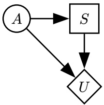

A Network (i)

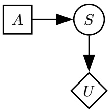

B Network (ii)

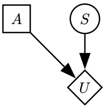

C Network (iii)

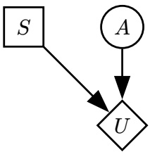

D Network (iv)

Q4.4 (2 points) Fill in 𝑈(𝐴, 𝑆), the utilities in the decision network. Write one number in each box.

| 𝐴 | 𝑆 | 𝑈(𝐴,𝑆) |
| --- | --- | --- |
| Left | True |  |
| Left | False |  |

| 𝐴 | 𝑆 | 𝑈(𝐴,𝑆) |
| --- | --- | --- |
| Right | True |  |
| Right | False |  |

Q4.5 (2 points) Compute MEU(∅) for the decision network. Write a number in the box.

<!-- page: 7 -->

## (Question 4 continued…)

Reminders: Starting state is 𝑌 , discount factor is 𝛾 = 1, and living reward is 0.

For the rest of the question, consider the Schrodinger’s Gridworld problem: We are in one of the two Gridworlds shown, with a 50% probability of being in either Gridworld. Initially, we do not know which Gridworld we are in.

In state 𝑌 , the three available actions are:

<table><tbody><tr><td>+10</td><td colspan="2">-10</td></tr><tr><td>𝑋</td><td>𝑌</td><td>𝑍</td></tr><tr><td>-10</td><td></td><td>+10</td></tr><tr><td>𝑋</td><td>𝑌</td><td>𝑍</td></tr></tbody></table>

• Left and Right, which succeed with 70% probability, as before.

• Observe, which reveals which Gridworld we are in and keeps us in state 𝑌 . This action succeeds 100% of the time.

Q4.6 (2 points) Intuitively, we know that taking the Observe action multiple times will not increase our expected utility. How could we modify the problem such that an optimal agent would not take the Observe action multiple times? Consider each modification separately.

A Add a negative reward for taking the Observe action.

B Add a positive living reward.

Change the probability of success for the Observe action to 70%. If the Observe action fails, C we gain no additional information and stay in state 𝑌 .

D Change the discount factor to be less than 1.

E None of the above

Q4.7 (2 points) In this subpart, ignore the modifications in the previous subpart.

An agent (who has not yet taken any actions) is deciding between two strategies:

• Strategy 1: Observe, then go Left or Right towards the state with the +10 reward.

• Strategy 2: Do not Observe, and always go Left.

What should the reward for Observe be, such that the two strategies have the same expected return? Write a number in the box.

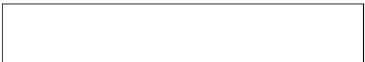

Consider modeling the Schrodinger’s Gridworld problem as an MDP with the following state space:

$Y _ { 0 } , Y _ { 1 } , Y _ { 2 }$ represents the agent in state 𝑌 without observing, after observing +10 in 𝑋, and after observing +10 in 𝑍, respectively.

$X _ { 0 } , X _ { 1 } , X _ { 2 }$ and $Z _ { 0 } , Z _ { 1 } , Z _ { 2 }$ are defined similarly.

In this MDP, all rewards are 0, except taking an Exit action.

| Q4.8 (2 points) What is 𝑄∗(𝑌0,Observe)? | A 0 | B 4 | C 5 | D 7 | E 10 |
| --- | --- | --- | --- | --- | --- |
| Q4.9 (2 points) What is 𝑄∗(𝑌0,Left)? | A 0 | B 4 | C 5 | D 7 | E 10 |
| Q4.10 (2 points) What is 𝑄∗(𝑌1,Left)? | A 0 | B 4 | C 5 | D 7 | E 10 |

<!-- page: 8 -->

In the Louvre museum, a robber is being chased by a guard! The robber’s position $( R _ { t } )$ and the guard’s position $( G _ { t } )$ are positions on a $4 \times 4$ grid, shown below.

At each time step 𝑡:

• The robber moves up, down, left, or right with equal probability. If the robber moves in a direction that hits a wall, then the robber stays in the same square.

• The guard instantly moves to a random square (not necessarily an adjacent square).

• The guard reports a sighting $S _ { t }$ of the robber. The value of $S _ { t }$ is **near** if the guard is Manhattan distance 0 or 1 from the robber, and **far** otherwise. $S _ { t }$ is correctly reported with probability 0.9.

$R _ { t }$ is the hidden variable, and $G _ { t }$ and $S _ { t }$ are the evidence. We can model this problem as the HMM below:

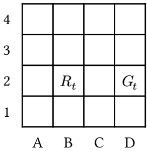

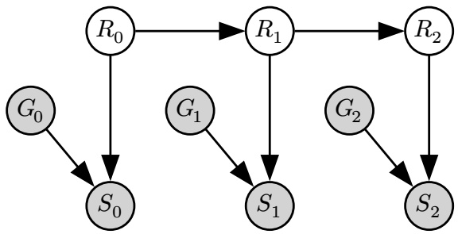

Example:

• At 𝑡 = 10, suppose $R _ { 1 0 } = \mathrm { B 2 }$ and $G _ { 1 0 } = \mathrm { D } 2 .$

• The robber moves up to $R _ { 1 1 } = \mathrm { B 3 }$ , and the guard moves to $G _ { 1 1 } = \mathrm { B 4 }$

$S _ { 1 1 }$ is **near** with probability 0.9 and **far** otherwise.

Q5.1 (2 points) In the HMM, which expression represents the belief distribution at time 𝑡, after incorporating the evidence at time 𝑡?

A $P ( R _ { t + 1 } , G _ { t } , S _ { t } )$

$$
P (R _ {t} \mid G _ {t}, S _ {t})
$$

$$
P (R _ {t + 1}, G _ {0: t}, S _ {0: t})
$$

$$
P (R _ {t} \mid G _ {0: t}, S _ {0: t})
$$

Q5.2 (2 points) Which of these distributions can be used **by itself** to perform a time elapse update in the forward algorithm? There may be multiple answers; select all answers that work.

A $P ( R _ { t + 1 } \mid R _ { t } )$

$$
\boxed {\mathrm{c}} P (R _ {t + 1} \mid S _ {t + 1}, G _ {t + 1})
$$

E None of the above

B $P \big ( R _ { t + 1 } \mid R _ { t } , S _ { t } , G _ { t } \big )$

$$
\boxed {\mathrm{D}} P (R _ {t + 1} \mid S _ {t + 1})
$$

Q5.3 (2 points) Which of these distributions can be used **by itself** to perform an observation update in the forward algorithm? There may be multiple answers; select all answers that work.

A $P ( S _ { t } , G _ { t } \mid R _ { t } )$

$$
\boxed {\mathrm{c}} P (S _ {t} \mid G _ {t}, R _ {t})
$$

E None of the above

B $P ( S _ { t } \mid G _ { t } )$

D $P ( S _ { t } , G _ { t } | S _ { t - 1 } , G _ { t - 1 } )$

<!-- page: 9 -->

Now, suppose we use particle filtering with 3 particles to estimate the robber’s location over time.

Q5.4 (2 points) At 𝑡 = 1, we have the three particles [A4, A4, D4]. After applying a time elapse update, what squares are the particles in? Use the following randomly-generated numbers for sampling (you may not need all of them): 0.94, 0.61, 0.12, 0.58, 0.20, 0.81 When sampling, split the 0 to 1 range alphabetically, e.g., to randomly choose between A1 and A2, low numbers correspond to A1 and high numbers correspond to A2. A [A3, A3, C4] C [A3, A4, D3] E [A4, B4, D4] G [B4, A3, D3] B [A3, A4, C4] D [A4, B4, D3] F [B4, A3, C4] H [B4, A4, C4]

Q5.5 (2 points) At 𝑡 = 2, suppose that $G _ { 2 } = \mathrm { C 3 }$ and that $S _ { 2 }$ is **far**. Consider a particle at square B3 at 𝑡 = 2. What is the weight of this particle after applying the observation update? A 0 C 0.2 E 0.45 G 0.75 I 0.9 B 0.1 D 0.25 F 0.5 H 0.8 J 1

In Q5.7 to Q5.9, we run particle filtering for a long time, and at some point, we notice that all of our particles are in D1. Each subpart is independent.

Q5.7 (1 point) Immediately after a re-sampling step, all particles are in D1. Is the robber guaranteed to be in D1 at this time step? A Yes B No

Q5.8 (2 points) Immediately after a time elapse update, all particles are in D1. After we perform an observation update, all particles \_\_\_\_\_ get the same weight (before re-sampling). A Always B Sometimes C Never

Q5.9 (2 points) Immediately after a re-sampling step, all particles are in D1. After we perform another time elapse and observation update, all particles are \_\_\_\_\_ in the same square (not necessarily D1). A Always B Sometimes C Never

<!-- page: 10 -->

## Q6 Machine Learning: Classification

**(17 points)**

For Q6.1 and Q6.2, consider the training data in the table, with features $X _ { 1 } , X _ { 2 }$ , and label 𝑌 . We build a Naive Bayes model using this training data.

Q6.1 (1 point) Which CPTs (Conditional Probability Tables) live in the Bayes Net for this model? Select all that apply. A 𝑃(𝑌 ) $\boxdot P ( Y \mid X _ { 2 } )$ E None B $P ( X _ { 1 } \mid Y )$ D $P ( Y \mid X _ { 1 } , X _ { 2 } )$

| 𝑋1 | 𝑋2 | 𝑌 |
| --- | --- | --- |
| 0 | 0 | 1 |
| 0 | 1 | 0 |
| 1 | 0 | 0 |
| 1 | 0 | 0 |
| 1 | 0 | 1 |
| 1 | 1 | 1 |
| 1 | 1 | 1 |
| 1 | 1 | 1 |

Q6.2 (2 points) Using the Naive Bayes model, what is the classification for a new data point with $X _ { 1 } = 1$ and $X _ { 2 } = 0 ?$ A $\hat { Y } = 0$ B $\hat { Y } = 1$ C None of these

Q6.3 (2 points) In general, what strategies can help a Naive Bayes model better generalize to unseen data? Select all that apply. A Use Laplace smoothing. B Use maximum likelihood estimation to estimate the CPTs. C Reduce the number of training data points. D Normalize the probabilities in the CPTs. E None of the above

For Q6.4 to Q6.6, consider training a perceptron with two features $( x _ { 1 } , x _ { 2 } )$ and a bias term on the training data below. The training data is plotted for your convenience. 5

| 𝑥1 | 𝑥2 | Label |
| --- | --- | --- |
| 3 | 4 | + |
| 1 | 3 | - |
| 2 | 3 | + |
| 4 | 1 | - |
| 1 | 2 | + |
| 2 | 4 | - |
| 3 | 1 | - |

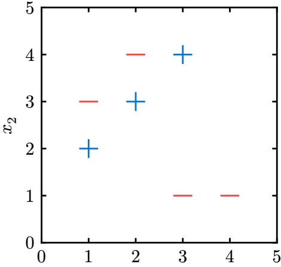

𝑥1

Q6.4 (2 points) We initialize the perceptron with weight vector $w = [ - 1 , 1 , 0 ]$ , where the weights corre- , spond to features $x _ { 1 } , x _ { 2 }$ , and 1 (bias feature), respectively. After running one iteration of the perceptron algorithm on the first 3 data points in the table, what is the new weight vector? A [−1, 1, 0] B [0, 4, 1] C [0, 1, 0] D [−4, −5, −2]

<!-- page: 11 -->

(Question 6 continued…)

Q6.5 (1 point) True or false: There exists some initial weight vector for which the perceptron algorithm is guaranteed to converge on the data points above. A True B False

Q6.6 (2 points) Which of the following features, if added **by itself**, would allow us to perfectly classify the data points above with a perceptron? There may be multiple answers; select all answers that work. $\boxed { \mathbf { A } } ~ | x _ { 1 } - x _ { 2 } |$ B 𝑥21 $\boxed { \mathbf { c } } x _ { 1 } + x _ { 2 }$ D None of the above

Q6.7 (1 point) True or false: In general, we prefer using Naive Bayes over the perceptron algorithm for classification when our features take on continuous values. Assume that our data points are linearly separable by their labels. A True B False

For Q6.8 and Q6.9, we switch from using a perceptron to using a decision tree to classify the same data. Q6.8 (1 point) Consider a decision tree with one split: All data points with $x _ { 1 } > 2$ and $x _ { 2 } < 2$ are classified as +. All other data points are classified as −. What is the entropy of this split, given the training data above? A 0 B −0.4 log(0.4) C −0.6 log(0.6) D 1

Q6.9 (2 points) For this subpart, each decision boundary must split on whether a single feature is less than or greater than a specific value. What is the minimum depth of a decision tree that correctly classifies all of the data points? An example (incorrect) tree with depth 2 is shown. A 2 B 4 C 6 D 7

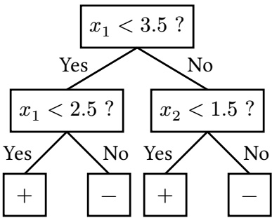

Q6.10 (2 points) In general (not necessarily using the data above), consider building two trees using the same training data set: **Tree A** is limited to a finite depth, and **Tree B** has no depth limit. Select all true statements about the two trees. A Tree A could have a strictly greater training accuracy than Tree B. B Tree A could have a strictly greater validation accuracy than Tree B. C Tree A could have a strictly greater test accuracy than Tree B. D Both trees could have the same number of leaves. E None of the above

Q6.11 (1 point) True or false: In general, decision trees can learn nonlinear decision boundaries. A True B False

<!-- page: 12 -->

Consider an MDP with unknown transition probabilities and rewards.

In this question, we will compare three methods for learning Q-values in this MDP:

1. Standard (tabular) Q-learning from lecture.

2. Approximate Q-learning from lecture.

3. Build a neural network that learns the 𝑄-function $Q ( s , a )$

In Q7.1 and Q7.2, assume the MDP has |𝑆| states and $| A |$ actions.

Q7.1 (1 point) How many parameters do we need to store when using standard Q-learning? A $| S | \cdot | A |$ B $| S | ^ { | A | }$ C $\left| S \right| + \left| A \right|$ D None of the above

Q7.2 (1 point) How many parameters do we need to store when using approximate Q-learning? Given a state-action pair, we derive 𝑛 features from the state and 𝑚 features from the action. A |𝑆| ⋅ |𝐴| B $| S | \cdot | A | \cdot m \cdot n$ C $m + n$ D 𝑚 ⋅ 𝑛

We design a neural network to approximate the $Q ( s , a )$ function. The network has this architecture: 5-dimensional input, hidden layer with 3 neurons, hidden layer with 2 neurons, 1-dimensional output.

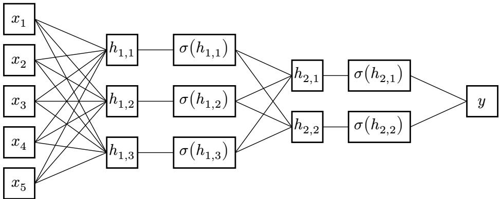

Q7.3 (1 point) How many total parameters do we need to store when using a neural network with these dimensions? (Ignore any bias terms.) A 11 B 15 C 21 D 23 E 28 F None

Q7.4 (1 point) How should we generate the inputs to the neural network? A Run a feature extraction function $f ( s , a )$ to get a vector $[ x _ { 1 } , x _ { 2 } , x _ { 3 } , x _ { 4 } , x _ { 5 } ]$ B Run a feature extraction function $f ( s , a )$ to get a scalar $x_{1} + x_{2} + x_{3} + x_{4} + x_{5}$ C Run a feature extraction function $f ( s , a )$ to get a scalar 𝑦. D Set each $x _ { i }$ to a state-action pair $( s , a )$ E Set 𝑦 to the state-action pair $( s , a )$

Q7.5 (1 point) Which value in the neural network represents the predicted Q-value? A $y$ B $\textstyle \sum _ { i = 1 } ^ { 5 } x _ { i }$ C $\textstyle y + \sum _ { i = 1 } ^ { 5 } x _ { i }$ D $[ x _ { 1 } , x _ { 2 } , x _ { 3 } , x _ { 4 } , x _ { 5 } ]$

<!-- page: 13 -->

Q7.6 (2 points) We are now training the neural network. $( s , a , s ^ { \prime } , r )$ represents a training data point, and $\hat { Q } ( s , a )$ represents the neural network’s predicted Q-values.

What happens when we train the neural network by minimizing the loss function below?

$$
\mathrm{Loss} = \left[ \left(r + \gamma \max _ {a ^ {\prime}} \hat {Q} (s ^ {\prime}, a ^ {\prime})\right) - \hat {Q} (s, a) \right] ^ {2}
$$

A The neural network will minimize Q-values for all (𝑠, 𝑎) pairs.

B The neural network will maximize Q-values for all (𝑠, 𝑎) pairs.

C The predicted Q-values will approximate the immediate reward of the state-action pair.

D The predicted Q-values will satisfy the Bellman equation more closely.

Q7.7 (2 points) We train the neural network to convergence, and we notice that the neural network produces bad predicted Q-values.

Which modifications could help the network perform better? Consider each choice independently.

A Increase the number of hidden neurons in each layer.

B Change the feature extraction function.

C Continue training the neural network on the existing training data.

D Provide additional training data that covers unseen (𝑠, 𝑎) pairs.

E None of the above

Q7.8 (2 points) We train the neural network to convergence. Given a state 𝑠, how do we use the neural network to choose an optimal action?

A Run the gradient descent algorithm.

B Use the network to predict a single $\hat { Q } ( s , a )$ value.

C Use the network to predict multiple $\hat { Q } ( s , a )$ values, then take an argmax.

D Use the network to predict multiple $\hat { Q } ( s , a )$ values, then take an average.

Q7.9 (3 points) Which algorithms can output predicted Q-values for unseen Q-states (i.e., Q-states that have never appeared in any sample)? Select all that apply. A Neural networks C Approximate Q-learning B Standard tabular Q-learning D None of the above

Q7.10 (3 points) Which algorithms can learn Q-states in a continuous state space (i.e., an MDP with infinitely many states)? Select all that apply. A Neural networks C Approximate Q-learning B Standard tabular Q-learning D None of the above

<!-- page: 14 -->

Q8.1 and Q8.2 are from Project 1 (Search).

In Project 1, you implemented the **ClosestDotSearchAgent**.

To solve the eat-all-dots problem, the **findPathToClosestDot** method in the **ClosestDotSearchAgent** class is called time(s), and the resulting solution is optimal. (i) (ii)

Q8.1 (1 point) Blank (i): A Exactly 1 B Exactly 4 C 1 or more

Q8.2 (1 point) Blank (ii): A Always B Sometimes C Never

Q8.3 (2 points) In Project 2 (Multi-Agent Search), when do we apply an evaluation function? Select all that apply. A After we return the value at the root. B When the current game state is a victory for Pac-Man. C When we have reached the maximum depth of the game tree. D None of the above. We never use an evaluation function in Project 2.

Q8.4 (1 point) In Project 5 (Machine Learning), you implemented the **DigitClassificationModel** to classify handwritten digits from the MNIST dataset. What loss function do we use? A ReLU C Mean Squared Error E Cross Entropy B Softmax D Mean Absolute Error F Sigmoid

Q8.5 (1 point) In Project 5, you applied a causal mask to your attention layer. What was the primary purpose of using a causal mask in Project 5? A To prevent the neural network from looking ahead at future tokens in the sequence. B To prevent the neural network from looking back at past tokens in the sequence. C To ensure that our neural network only looks at the current token. D To ensure that our neural network does not overfit on the training data.
