<!-- page: 1 -->

Final Exam

**Solutions last updated: Wednesday, May 13, 2026**

Print Your Name:

Print Your Student ID:

Print Student name to your left:

Print Student name to your right:

You have 170 minutes. There are 8 questions of varying credit. (100 points total)

| Question: | 1 | 2 | 3 | 4 | 5 | 6 | 7 | 8 | Total |
| --- | --- | --- | --- | --- | --- | --- | --- | --- | --- |
| Points: | 5 | 6 | 15 | 17 | 17 | 17 | 17 | 6 | 100 |

We reserve the right to deduct points for failing to follow the marking directions below:

For questions with **circular bubbles**, you may select only one choice.

For questions with **square checkboxes**, you may select one or more choices.

A Unselected option (Completely unfilled)

You can select

B Don’t do this (it will be graded as incorrect!)

multiple squares

C Only one selected option (completely filled)

C Don’t do this (it will be graded as incorrect!)

Anything you write outside the answer boxes or you ~~cross out~~ will not be graded. If you write multiple answers, your answer is ambiguous, or the bubble/checkbox is not entirely filled in, we will grade the worst interpretation.

Read the honor code below and sign your name.

By signing below, I affirm that all work on this exam is my own work. I have not referenced any disallowed materials, nor collaborated with anyone else on this exam. I understand that if I cheat on the exam, I may face the penalty of an “F” grade and a referral to the Center for Student Conduct.

Sign your name:

<!-- page: 2 -->

## Clarifications

• Q5.4: To randomly choose between A1, A2, and B1, the alphabetical order is A1, A2, B1.

<!-- page: 3 -->

## Q1 Potpourri

**(5 points)**

Q1.1 and Q1.2 are from the guest lectures.

**Solution:** Note for future semesters: These guest lectures are specific to Fall 2025, so these subparts are probably out of scope for future semesters.

Q1.1 (1 point) In Prof. Alaa’s guest lecture, he talks about two metrics that can be used to compare real and synthetic distributions. What are the two metrics that he brings up?

A Precision

C Diversity

B Fidelity

D Recall

**Solution:**

See [https://inst.eecs.berkeley.edu/\~cs188/fa25/assets/lectures/cs188-fa25-lec25.pdf#page=20](https://inst.eecs.berkeley.edu/~cs188/fa25/assets/lectures/cs188-fa25-lec25.pdf#page=20)

Q1.2 (1 point) In Prof. Pierson’s guest lecture, she discusses two specific examples of using AI to create social equity. What are the two examples discussed?

A Knee osteoarthritis

C Inequality in policing

B Deforestation

D Inequality in STEM education

**Solution:**

See [https://inst.eecs.berkeley.edu/\~cs188/fa25/assets/lectures/cs188-fa25-lec26.pdf](https://inst.eecs.berkeley.edu/~cs188/fa25/assets/lectures/cs188-fa25-lec26.pdf).

For Q1.3 to Q1.5, consider an arbitrary Bayes Net with no edges. 𝑋, 𝑌 , and 𝑍 represent arbitrary variables in the Bayes Net.

Q1.3 (1 point) In a Bayes Net with no edges, what is the most efficient way to calculate a conditional probability like 𝑃(𝑋 | 𝑌 ), with **one** query variable and **one** evidence variable?

A Return one of the CPTs (Conditional Probability Tables) with no changes.

B Perform one or more join operations only.

C Perform one or more eliminate operations only.

D Perform one or more join operations, and one or more eliminate operations.

**Solution:**

If our Bayes Net has no edges, then all variables are independent of each other. Each node has a CPT involving only that node’s variable, e.g. node 𝑋 has the CPT 𝑃(𝑋).

So, 𝑃(𝑋 | 𝑌 ) = 𝑃(𝑋), so all you need to return is 𝑃(𝑋).

<!-- page: 4 -->

(Question 1 continued…)

Q1.4 (1 point) In a Bayes Net with no edges, what is the most efficient way to calculate a conditional probability like $P ( X \mid Y , Z )$ , with **one** query variable and **multiple** evidence variables?

A Return one of the CPTs with no changes.

B Perform one or more join operations only.

C Perform one or more eliminate operations only.

D Perform one or more join operations, and one or more eliminate operations.

**Solution:** If our Bayes Net has no edges, then all variables are independent of each other. Each node has a CPT involving only that node’s variable, e.g. node 𝑋 has the CPT $P ( X )$

So, $P ( X \mid Y , Z ) = P ( X )$ , so all you need to return is $P ( X )$

Q1.5 (1 point) In a Bayes Net with no edges, what is the most efficient way to calculate a conditional probability like $P ( X , Y \mid Z )$ , with **multiple** query variables and **one** evidence variable?

A Return one of the CPTs with no changes.

B Perform one or more join operations only.

C Perform one or more eliminate operations only.

D Perform one or more join operations, and one or more eliminate operations.

**Solution:** Since all variables are independent of each other, $P ( X , Y \mid Z ) = P ( X , Y )$ . To get $P ( X , Y )$ , we need to join $P ( X )$ and $P ( Y )$

<!-- page: 5 -->

CS188 staff is going on a road trip! There are five possible seats for staff members to sit in the car. The staff members are the variables, and the seats are the values. No two staff members can sit in the same seat.

The staff members have special requests on which seat they want to sit in:

1. Only Isabella and Kanav can sit in the driver’s seat 𝐷.

2. Andrew does not want to sit in the middle seat 𝑀.

3. Aly gets carsick and needs to sit in a seat next to a window (𝐷, 𝑃, 𝐿, or 𝑅).

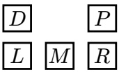

4. Saathvik wants to sit one seat to the left or right of Kanav, i.e., they can sit in (𝐷, 𝑃), (𝐿, 𝑀), or (𝑀, 𝑅).

Q2.1 (1 point) After enforcing only unary constraints, which of these arcs is already consistent, without removing additional values from any domains?

A (Kanav → Saathvik) only

(Saathvik → Kanav) only

C Both

D Neither

**Solution:** (Saathvik → Kanav) is consistent because Saathvik’s domain after enforcing unary constraints is {𝑃, 𝐿, 𝑀, 𝑅} and for each of those possible values, Kanav still has at least one neighboring seat available in his domain. (Kanav → Saathvik) is not consistent because if Kanav sits in 𝑃, Saathvik must sit in 𝐷, which violates the first request.

Q2.2 (1 point) After enforcing only unary constraints, we use LCV (Least Constraining Value) with forward checking to assign Kanav first. Select all value(s) that LCV could assign to Kanav.

A 𝐷

B 𝑃

C 𝐿

D 𝑀

E 𝑅

**Solution:** If Kanav is assigned to 𝑀, Saathvik can still be assigned to 2 values 𝐿 or 𝑅. If Kanav is assigned to 𝑃, Saathvik cannot be assigned to any value, and if Kanav is assigned to 𝐷, 𝐿, or 𝑅, Saathvik can only be assigned to 1 value.

For Q2.3 to Q2.5, we use cutset conditioning to solve this CSP, where the cutset is Saathvik and Kanav. In cutset conditioning, after we assign values to one or more variables, the result is a residual CSP, which is a smaller CSP with only the unassigned variables left.

Assume we create residual CSPs by assigning values to Saathvik and Kanav, and **not** checking any constraints (except the “no two staff members in the same seat” constraint) when assigning values to Saathvik and Kanav.

Q2.3 (1 point) How many total residual CSPs do we need to create in order to find all solutions to the original CSP?

A 1

B 2

C 3

D 6

E 10

F 20

**Solution:** We have 20 possible residual CSPs after assigning Saathvik and Kanav because Kanav can sit in any of the 5 seats and Saathvik can choose from the 4 remaining options.

<!-- page: 6 -->

(Question 2 continued…)

Q2.4 (2 points) Select all true statements about each residual CSP.

A Each residual CSP has a tree-structured constraint graph.

B Each residual CSP has a constraint graph with no edges.

C Each residual CSP only has unary constraints (except “no two staff members in the same seat”).

D Each residual CSP can be solved with no backtracking.

E Each residual CSP takes worst-case exponential time to solve (i.e., trying every assignment).

F None of the above

**Solution:** The remaining three constraints after assigning Kanav and Saathvik to a seat are all unary. The residual CSP has a constraint graph with no edges because we only have unary constraints left. The residual CSP can be solved without backtracking because we can enforce unary constraints and then solve accordingly.

Q2.5 (1 point) Does a solution for a residual CSP correspond to a solution for the original CSP?

A Always

Sometimes

C Never

**Solution:** Our residual CSP may place Saathvik and Kanav in a configuration that is invalid for our original CSP (i.e., not in adjacent seats).

<!-- page: 7 -->

<table><tr><td>A 1</td><td>B 2</td><td>C 4</td><td>D 8</td><td>E 16</td><td>F 32</td><td>G 64</td></tr><tr><td colspan="7">Solution: Join all variables - 5 variables total. (+f is evidence)</td></tr></table>

Pac-Man is making donuts and models their attributes using a Bayes Net. Each donut has a shape 𝑆, icing color 𝐶, topping 𝑇 , filling 𝐹, yumminess 𝑌 , and aesthetics 𝐴.

All variables in the Bayes Net are binary (i.e., each variable can take on two possible values).

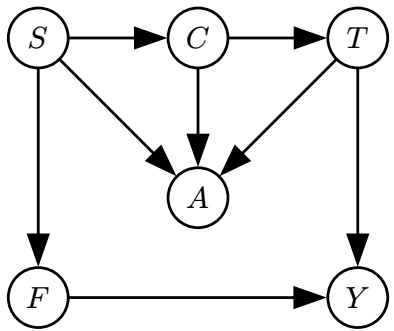

For Q3.1 to Q3.4, use 𝑑-separation to determine if the independence assumption is true or false.

$$
F \perp T
$$

B False

Q3.2 (1 point) $A \perp Y \mid T$ A True B False

Q3.3 (1 point)

$$
S \perp T \mid C
$$

B False

Q3.4 (1 point)

$$
F \perp T \mid S
$$

A True

B False

| Solution: We have an active path from F←S→C→T, which creates dependence, as this is an example of a common cause.A←T→Y blocks the direct path, but A←S→F→Y is a path that remains open. This path leads to dependence, as this is a common effect.S→C→T forms a causal chain. Because C is given, we have an inactive triple, so we have independence.F←S→C→T has S as a common cause, and because S is given, we know that they are independent of each other. |
| --- |

Q3.5 to Q3.10 are independent of each other.

<!-- page: 8 -->

(Question 3 continued…)

Q3.6 (2 points) We use variable elimination to compute $P ( T \mid + f )$ . We join and eliminate on 𝑆 first. Which CPTs (Conditional Probability Tables) do we need to use when joining and eliminating on 𝑆? Select all that apply.

A 𝑃(𝑆)

$$
\boxed {\mathrm{c}} P (A \mid S, C, T)
$$

$$
\boxed {\mathrm{E}} P (+ f \mid S)
$$

B 𝑃(𝐶 | 𝑆)

$$
\boxed {\mathrm{D}} P (T \mid C)
$$

$$
\boxed {\mathrm{F}} P (Y \mid + f, T)
$$

**Solution:** We use $P(S),P(C \mid S),P(A \mid S,C,T),P(+f \mid S)$ since these are all the CPTs that use 𝑆.

Q3.7 (2 points) We use sampling to approximate $P ( T \mid + f , - a )$ . Which sampling techniques could have generated the following sequence of samples? Select all that apply.

Sample $1 { : } \left( - s , + c , + t , + f , + y , - a \right)$

Sample $2 { : } \left( - s , - c , - t , - f , + y , - a \right)$

Sample 3: $( + s , + c , - t , + f , + y , - a )$

A Prior Sampling

C Likelihood Weighting

E None of the above

B Rejection Sampling

D Gibbs Sampling

**Solution:** Prior sampling is the only sampling method that can generate samples inconsistent with evidence. Sample 2 has –𝑓, so it is inconsistent with evidence.

Q3.8 (2 points) We use likelihood weighting to approximate $P ( T \mid + f , - a )$ . We generate the following samples:

Sample 1: $( + s , + c , - t , + f , - y , - a ) .$

Sample 2: $( - s , + c , - t , + f , + y , - a ) .$

Sample 3: $( + s , - c , + t , + f , - y , - a )$

Which CPTs do we need in order to calculate the weights of the samples? Select all that apply.

A 𝑃(𝑆)

$$
\boxed {\mathrm{c}} P (- a \mid S, C, T)
$$

E 𝑃(+𝑓 | 𝑆)

B $P ( C \mid S )$

D 𝑃(𝑇 | 𝐶)

F 𝑃(𝑌 | +𝑓, 𝑇 )

**Solution:** When we calculate the weights, we only need P(evidence | parents(evidence)).

<!-- page: 9 -->

(Question 3 continued…)

Q3.9 (2 points) We use Gibbs sampling to approximate $P ( T \mid + a )$ . The last generated sample is $( + s , - c , - t , - f , - y , + a )$

We choose to resample 𝑇 . Which CPTs do we need to join in order to resample $T ?$ Select all that apply.

A 𝑃(𝑆)

$$
\boxed {\mathrm{c}} P (A \mid + s, - c, - t)
$$

E 𝑃(𝐹 | +𝑠)

B 𝑃(𝐶 | +𝑠)

D 𝑃(𝑇 | –𝑐)

F 𝑃(𝑌 | –𝑓, –𝑡)

**Solution:** You just have to join the CPTs that include $T$ or a value for 𝑇 .

Q3.10 (2 points) We use Gibbs sampling to approximate $P ( T \mid + a )$ . The last generated sample is $( + s , - c , - t , - f , - y , + a )$

Which of these distributions can be used **by itself** to resample 𝐶? There may be multiple answers; select all equivalent answers that work.

A 𝑃(𝐶)

$$
\boxed {\mathrm{c}} P (C \mid + a, + s, - t)
$$

$$
\boxed {\mathrm{E}} P (Y \mid - c)
$$

B 𝑃(𝐶 | +𝑠)

$$
\boxed {\mathrm{D}} P (C \mid + a, + s, - t, - f, - y)
$$

F 𝑃(𝑌 | –𝑓, –𝑡)

**Solution:** Choices 𝐶 and 𝐷 are both true as they give the conditional distribution of 𝐶 given its Markov blanket. Choice 𝐶 is correct as it conditions on the full Markov blanket. Choice 𝐷 is correct as it conditions on the superset of the Markov blanket, meaning it includes extra variables $( y , c , { \mathrm { a n d } } f )$

<!-- page: 10 -->

## Q4 MDP: Schrodinger’s Gridworld!

**(17 points)**

Consider the Gridworld MDP to the right, with starting state 𝑌 , discount factor $\gamma = 1$ , and living reward 0.

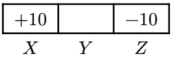

Remember that in Gridworld, when we are in the +10 or −10 square, the only action available is “Exit,” which succeeds with 100% probability, and we must take the “Exit” action to earn the reward.

In state 𝑌 , the only available actions are “Left” and “Right”. With 70% probability, the action succeeds, and with 30% probability, the opposite action is taken (e.g., if we go Left from 𝑌 , then we land in 𝑍 30% of the time).

Q4.1 (1 point) We are running value iteration. On what iteration 𝑘 does $V _ { k } ( Y )$ first become nonzero?

**Solution:** At the 0th iteration, Y’s value is 0. After the first iteration, we can move to states 𝑋 or 𝑍, but we only get their value after taking the Exit action. At the second iteration, we take the Exit action on state 𝑋, making 𝑉2(𝑌 ) nonzero.

Q4.2 (1 point) What is the value of $V ^ { * } ( Y ) ?$ Write a number in the box.

4

**Solution:**

With probability 70%, we get the +10, and with probability 30%, we get the −10.

$$
V ^ {*} (X) = + 1 0 (0. 7 0) - 1 0 (0. 3 0) = 4
$$

This Gridworld can also be modeled as a decision network, where:

• 𝐴 is the action taken.

• 𝑆 is whether the action succeeds (True for success, and False for failure).

• 𝑈 is the reward.

<!-- page: 11 -->

(Question 4 continued…)

Q4.3 (1 point) Which of the following decision networks can model this scenario?

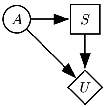

A Network (i)

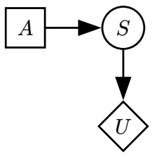

B Network (ii)

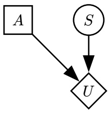

C Network (iii)

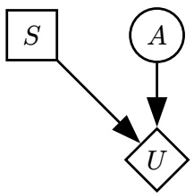

D Network (iv)

**Solution:**

Choice B is incorrect because the action taken and the action success both influence the utility. Choice D is incorrect because 𝑆 is incorrectly represented by an action node and 𝐴 is incorrectly represented by a chance node.

Choice A and B are incorrect because action nodes should not directly point to chance nodes as actions should be made on deterministic outcomes.

Q4.4 (2 points) Fill in 𝑈(𝐴, 𝑆), the utilities in the decision network. Write one number in each box.

| 𝐴 | 𝑆 | 𝑈(𝐴,𝑆) |
| --- | --- | --- |
| Left | True |  |
| Left | False |  |

| 𝐴 | 𝑆 | 𝑈(𝐴,𝑆) |
| --- | --- | --- |
| Right | True |  |
| Right | False |  |

**Solution:**

| 𝐴 | 𝑆 | 𝑈(𝐴,𝑆) |
| --- | --- | --- |
| Left | True | +10 |
| Left | False | -10 |
| Right | True | -10 |
| Right | False | +10 |

If you intend to go Left and it succeeds, then you reach state 𝑋 and get +10. If you intend to go Left and it fails, then you reach state 𝑍 and get −10. If you intend to go Right and it succeeds, then you reach state 𝑍 and get −10. Finally, if you intend to go Right and it fails, then you reach state 𝑋 and get +10.

<!-- page: 12 -->

Q4.5 (2 points) Compute MEU(∅) for the decision network. Write a number in the box.

## Solution:

If we move left, with probability 70%, we get the +10, and with probability 30%, we get the −10. The expected utility is 0.7(+10) + 0.3(-10) = 4

If we move right, with probability 70%, we get the −10, and with probability 30%, we get the +10. The expected utility is 0.7(-10) + 0.3(+10) = −4

Therefore, the MEU(∅) is max(4, −4) = 4.

Reminders: Starting state is 𝑌 , discount factor is 𝛾 = 1, and living reward is 0.

For the rest of the question, consider the Schrodinger’s Gridworld problem: We are in one of the two Gridworlds shown, with a 50% probability of being in either Gridworld. Initially, we do not know which Gridworld we are in.

In state 𝑌 , the three available actions are:

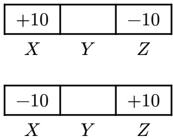

• Left and Right, which succeed with 70% probability, as before.

• Observe, which reveals which Gridworld we are in and keeps us in state 𝑌 . This action succeeds 100% of the time.

<!-- page: 13 -->

Q4.6 (2 points) Intuitively, we know that taking the Observe action multiple times will not increase our expected utility. How could we modify the problem such that an optimal agent would not take the Observe action multiple times? Consider each modification separately.

A Add a negative reward for taking the Observe action.

B Add a positive living reward.

Change the probability of success for the Observe action to 70%. If the Observe action fails, C we gain no additional information and stay in state 𝑌 .

D Change the discount factor to be less than 1.

E None of the above

**Solution:** A negative reward will help because by taking the Observe action multiple times, the agent will unnecessarily incur additional negative reward.

A positive living reward will make the agent repeatedly take the Observe action so that they never have to exit and keep accumulating the living reward.

If we change the probability of success for the Observe action to 70%, because the discount factor is 1, the agent will just keep trying to Observe from state Y even if it fails.

Having a discount factor less than 1 will make the agent prefer short-term rewards over longterm ones. This makes our agent prefer to move to states 𝑋 or 𝑍 instead of taking an unnecessary Observe action.

<!-- page: 14 -->

Q4.7 (2 points) In this subpart, ignore the modifications in the previous subpart.

An agent (who has not yet taken any actions) is deciding between two strategies:

• Strategy 1: Observe, then go Left or Right towards the state with the +10 reward.

• Strategy 2: Do not Observe, and always go Left.

What should the reward for Observe be, such that the two strategies have the same expected return? Write a number in the box.

Solution: Let $L$ represent the state with the +10 reward. The value of $L$ is initially unknown.
$\text{VPI}(L) = 0.5 * \text{VPI}(L = X) + 0.5 * \text{VPI}(L = Z) = \text{VPI}(L = X)$ (by symmetry)
$\text{VPI}(L = X) = \text{MEU}(L = X) - \text{MEU}(\varnothing)$
$\text{MEU}(\varnothing) = 0$ by symmetry.
$\text{MEU}(L = X) \to \text{we take the action Left. Reward is 4.}$
$\text{VPI}(L) = 4.$
So, we would pay 4 (negative reward of 4) to take the Observe action.

Consider modeling the Schrodinger’s Gridworld problem as an MDP with the following state space: $Y _ { 0 } , Y _ { 1 } , Y _ { 2 }$ represents the agent in state 𝑌 without observing, after observing +10 in 𝑋, and after observing +10 in 𝑍, respectively.

$X _ { 0 } , X _ { 1 } , X _ { 2 }$ and $Z _ { 0 } , Z _ { 1 } , Z _ { 2 }$ are defined similarly.

In this MDP, all rewards are 0, except taking an Exit action.

Q4.8 (2 points) What is $Q ^ { * } ( Y _ { 0 } ,$ , Observe)?

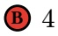

**Solution:** After we observe, the optimal action will be to go Left or Right depending on if X or Z will give us the +10 utility. With 70% probability, moving in the direction to the +10 succeeds and lands us in the +10 square. With 30% probability, moving in the direction to the +10 fails and lands us in the −10 square. So, we have (0.7)(10) + (0.3)(-10) = 4.

$$
Q ^ {*} (Y _ {0}, \text {Left})?
$$

**Solution:** From $Y _ { 0 } ,$ there is a 50% chance that we will get a +10 reward and a 50% chance we will get a −10 reward, due to symmetry.

Q4.10 (2 points) What is $Q ^ { * } ( Y _ { 1 } , \mathrm { L e f t } ) ?$

<!-- page: 15 -->

**Solution:** $Y _ { 1 }$ means that the +10 reward is in 𝑋.

With 70% probability, moving Left succeeds and lands us in the +10 square.

With 30% probability, moving Left fails and lands us in the −10 square.

Taking a weighted average gives an expected reward of $0.7(10)+0.3(-10)=4.$

<!-- page: 16 -->

In the Louvre museum, a robber is being chased by a guard! The robber’s position $( R _ { t } )$ and the guard’s position $( G _ { t } )$ are positions on a $4 \times 4$ grid, shown below.

At each time step 𝑡:

• The robber moves up, down, left, or right with equal probability. If the robber moves in a direction that hits a wall, then the robber stays in the same square.

• The guard instantly moves to a random square (not necessarily an adjacent square).

• The guard reports a sighting $S _ { t }$ of the robber. The value of $S _ { t }$ is **near** if the guard is Manhattan distance 0 or 1 from the robber, and **far** otherwise. $S _ { t }$ is correctly reported with probability 0.9.

$R _ { t }$ is the hidden variable, and $G _ { t }$ and $S _ { t }$ are the evidence. We can model this problem as the HMM below:

Example:

• At 𝑡 = 10, suppose $R _ { 1 0 } = \mathrm { B 2 }$ and $G _ { 1 0 } = \mathrm { D } 2 .$

• The robber moves up to $R _ { 1 1 } = \mathrm { B 3 }$ , and the guard moves to $G _ { 1 1 } = \mathrm { B 4 }$

$S _ { 1 1 }$ is **near** with probability 0.9 and **far** otherwise.

Q5.1 (2 points) In the HMM, which expression represents the belief distribution at time 𝑡, after incorporating the evidence at time $t ?$

A $P ( R _ { t + 1 } , G _ { t } , S _ { t } )$

$$
Ⓑ P (R _ {t} \mid G _ {t}, S _ {t})
$$

$$
Ⓒ P (R _ {t + 1}, G _ {0: t}, S _ {0: t})
$$

$$
P (R _ {t} \mid G _ {0: t}, S _ {0: t})
$$

**Solution:** Belief distribution is $P ( R _ { t } \mid G _ { 0 : t } , S _ { 0 : t } )$

Q5.2 (2 points) Which of these distributions can be used **by itself** to perform a time elapse update in the forward algorithm? There may be multiple answers; select all answers that work.

A $P ( R _ { t + 1 } \mid R _ { t } )$

$$
\boxed {\mathrm{c}} P (R _ {t + 1} \mid S _ {t + 1}, G _ {t + 1})
$$

E None of the above

B $P \big ( R _ { t + 1 } \mid R _ { t } , S _ { t } , G _ { t } \big )$

$$
\boxed {\mathrm{D}} P (R _ {t + 1} \mid S _ {t + 1})
$$

**Solution:** Transition model is $P \big ( R _ { t + 1 } | R _ { t } \big ) . P \big ( R _ { t + 1 } | R _ { t } , S _ { t } , G _ { t } \big )$ works too because $R _ { t + 1 }$ is conditionally independent of $S _ { t }$ and $G _ { t }$ given $R _ { t } .$

<!-- page: 17 -->

(Question 5 continued…)

Q5.3 (2 points) Which of these distributions can be used **by itself** to perform an observation update in the forward algorithm? There may be multiple answers; select all answers that work.

A $P ( S _ { t } , G _ { t } \mid R _ { t } )$

$$
\boxed {\mathrm{c}} P (S _ {t} \mid G _ {t}, R _ {t})
$$

E None of the above

B $P ( S _ { t } \mid G _ { t } )$

$$
\boxed {\mathbf {D}} P (S _ {t}, G _ {t} \mid S _ {t - 1}, G _ {t - 1})
$$

**Solution:** Observation model is

$$
\begin{array}{r} P (S _ {t}, G _ {t} \mid R _ {t}) = P (S _ {t} \mid G _ {t}, R _ {t}) \cdot P (G _ {t} \mid R _ {t}) \\ = P (S _ {t} \mid G _ {t}, R _ {t}) \cdot P (G _ {t}) \\ \propto P (S _ {t} \mid G _ {t}, R _ {t}) \end{array}
$$

Now, suppose we use particle filtering with 3 particles to estimate the robber’s location over time.

Q5.4 (2 points) At 𝑡 = 1, we have the three particles [A4, A4, D4]. After applying a time elapse update, what squares are the particles in?

Use the following randomly-generated numbers for sampling (you may not need all of them): 0.94, 0.61, 0.12, 0.58, 0.20, 0.81

When sampling, split the 0 to 1 range alphabetically, e.g., to randomly choose between A1 and A2, low numbers correspond to A1 and high numbers correspond to A2.

A [A3, A3, C4]

G [B4, A3, D3]

B [A3, A4, C4]

D [A4, B4, D3]

F [B4, A3, C4]

H [B4, A4, C4]

**Solution:** A4 particle successors are 𝐴3, 𝐴4, 𝐵4 with probabilities 0.25, 0.5, 0.25. So particle 1 goes to B4 (0.94>0.75), particle 2 goes to A4 (0.25 < 0.61 < 0.75). Door particle successors are 𝐶4, 𝐷3, 𝐷4 with probabilities 0.25, 0.25, 0.5 so particle 3 goes to C4 (0.12 < 0.25).

Q5.5 (2 points) At 𝑡 = 2, suppose that $G _ { 2 } = \mathrm { C 3 }$ and that $S _ { 2 }$ is **far**. Consider a particle at square B3 at 𝑡 = 2. What is the weight of this particle after applying the observation update? A 0 C 0.2 E 0.45 G 0.75 I 0.9 B 0.1 D 0.25 F 0.5 H 0.8 J 1

**Solution:** $P ( S _ { 2 } = \mathrm { f a r } | R _ { 2 } = B 2 , G _ { 2 } = C 2 ) = 0 . 1$ since 𝐵2 and 𝐶2 are adjacent cells, and the guard will incorrectly report a sighting distance with probability 0.1.

<!-- page: 18 -->

Q5.6 (2 points) At 𝑡 = 3, before resampling, 2 particles are in C1, each with weight 𝑥, and 1 particle is in B1 with weight 𝑦.

When we resample, what is the probability that the first particle we resample will be in B1? Write an expression in terms of 𝑥, 𝑦, and any mathematical operators.

$$
\frac {y}{2 x + y}
$$

**Solution:** The total weights for state C1 is 2𝑥, the total weights for state B1 is 𝑦, and the total weights for any other state is 0. We can normalize this distribution to get that that the probability a particle will be resampled to be in state B1 is ${ \frac { y } { 2 x + y } } .$

In Q5.7 to Q5.9, we run particle filtering for a long time, and at some point, we notice that all of our particles are in D1. Each subpart is independent.

Q5.7 (1 point) Immediately after a re-sampling step, all particles are in D1.

Is the robber guaranteed to be in D1 at this time step?

A Yes

B No

**Solution:** Particle filtering is a representation of our beliefs. Even though we believe that the robber is on D1, there is no guarantee that they are in this state because this is an approximation.

Q5.8 (2 points) Immediately after a time elapse update, all particles are in D1. After we perform an observation update, all particles \_\_\_\_\_ get the same weight (before re-sampling). A Always B Sometimes C Never

**Solution:** The weight depends on only the state and the observation, so all particles in the same state are assigned the same weight.

Q5.9 (2 points) Immediately after a re-sampling step, all particles are in D1. After we perform another time elapse and observation update, all particles are \_\_\_\_\_ in the same square (not necessarily D1).

A Always

Sometimes

C Never

**Solution:** After the time elapse, there is no guarantee that all of the particles will move into the same successor state. However, it is possible that all particles will randomly move into the same successor state.

<!-- page: 19 -->

For Q6.1 and Q6.2, consider the training data in the table, with features $X _ { 1 } , X _ { 2 }$ , and label 𝑌 . We build a Naive Bayes model using this training data.

Q6.1 (1 point) Which CPTs (Conditional Probability Tables) live in the Bayes Net for this model? Select all that apply.

A 𝑃(𝑌 )

$$
\boxed {\mathrm{c}} P (Y \mid X _ {2})
$$

E None

$$
\boxed {\mathrm{B}} P (X _ {1} \mid Y)
$$

$$
\boxed {\mathrm{D}} P (Y \mid X _ {1}, X _ {2})
$$

**Solution:** Under a Naive Bayes model, we assume that all features are dependent on our label and conditionally independent given the label. This means that we require the CPTs $P(Y),P(X_{1} \mid Y)$ , and $P ( X _ { 2 } \mid Y )$

Q6.2 (2 points) Using the Naive Bayes model, what is the classification for a new data point with $X _ { 1 } = 1$ and $X _ { 2 } = 0 ?$

$$
Ⓐ \hat {Y} = 0
$$

$$
Ⓑ \hat {Y} = 1
$$

C None of these

| 𝑋1 | 𝑋2 | 𝑌 |
| --- | --- | --- |
| 0 | 0 | 1 |
| 0 | 1 | 0 |
| 1 | 0 | 0 |
| 1 | 0 | 0 |
| 1 | 0 | 1 |
| 1 | 1 | 1 |
| 1 | 1 | 1 |
| 1 | 1 | 1 |

**Solution:** We compute

$$
\begin{array}{l} {P (X _ {1} = 1, X _ {2} = 0, Y = 0) = P (X _ {1} = 1 \mid Y = 0) \cdot P (X _ {2} = 0 \mid Y = 0)} \\ {P (Y = 0) = \frac {2}{3} \cdot \frac {2}{3} \cdot \frac {3}{8} = \frac {1}{6}} \end{array}
$$

$$
\frac {1}{6} <   \frac {1}{5}
$$

$$
\begin{array}{l} P (X _ {1} = 1, X _ {2} = 0, Y = 1) = P (X _ {1} = 1 \mid Y = 1) * P (X _ {2} = 0 \mid Y = \\ 1) * P (Y = 1) = \frac {4}{5} \cdot \frac {2}{5} \cdot \frac {5}{8} = \frac {1}{5} \end{array}
$$

$$
Y = 1.
$$

<!-- page: 20 -->

(Question 6 continued…)

Q6.3 (2 points) In general, what strategies can help a Naive Bayes model better generalize to unseen data? Select all that apply.

A Use Laplace smoothing.

B Use maximum likelihood estimation to estimate the CPTs.

C Reduce the number of training data points.

D Normalize the probabilities in the CPTs.

E None of the above

**Solution:** Laplace smoothing allows us to mitigate overfitting for Naive Bayes’ classifiers.

MLE would not help our model generalize to unseen data.

Reducing the training data size gives our classifer even less information to train on which may make it harder for our model to generalize on unseen data.

Normalizing the probabilities in our CPT does not change anything as they’re already normalized.

For Q6.4 to Q6.6, consider training a perceptron with two features $( x _ { 1 } , x _ { 2 } )$ and a bias term on the training data below. The training data is plotted for your convenience. 5

| 𝑥1 | 𝑥2 | Label |
| --- | --- | --- |
| 3 | 4 | + |
| 1 | 3 | - |
| 2 | 3 | + |
| 4 | 1 | - |
| 1 | 2 | + |
| 2 | 4 | - |
| 3 | 1 | - |

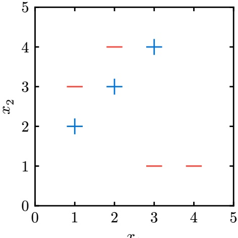

<!-- page: 21 -->

(Question 6 continued…)

Q6.4 (2 points) We initialize the perceptron with weight vector $w = [ - 1 , 1 , 0 ]$ , where the weights correspond to features $x _ { 1 } , x _ { 2 } ,$ , and 1 (bias feature), respectively.

After running one iteration of the perceptron algorithm on the first 3 data points in the table, what is the new weight vector?

A [−1, 1, 0]

B [0, 4, 1]

C [0, 1, 0]

D [−4, −5, −2]

Solution:
First point:  $[3, 4, 1] \cdot [-1, 1, 0] = 1 \rightarrow \text{correct}$ 
Second point:  $[1, 3, 1] \cdot [-1, 1, 0] = 2 \rightarrow \text{incorrect so } w = [-1, 1, 0] - [1, 3, 1] = [-2, -2, -1]$ 
Third point:  $[2, 3, 1] \cdot [-2, -2, -1] = -11 \rightarrow \text{incorrect so } w = [-2, -2, -1] + [2, 3, 1] = [0, 1, 0]$

Q6.5 (1 point) True or false: There exists some initial weight vector for which the perceptron algorithm is guaranteed to converge on the data points above.

A True

B False

**Solution:** The data is not linearly separable, so there is no weight vector that correctly classifies all points. Since the perceptron algorithm converges/terminates once all data points are classified correctly, we will never converge no matter the initial weight vector.

Q6.6 (2 points) Which of the following features, if added **by itself**, would allow us to perfectly classify the data points above with a perceptron? There may be multiple answers; select all answers that work.

$$
| x _ {1} - x _ {2} |
$$

B 𝑥21

$$
\boxed {\mathrm{C}} x _ {1} + x _ {2}
$$

D None of the above

**Solution:** The positive points all have $| x _ { 1 } - x _ { 2 } | = 1$ and negative points all have $| x _ { 1 } - x _ { 2 } | > 1 ,$ so accounting for the fact that we are using a bias term, that works.

Q6.7 (1 point) True or false: In general, we prefer using Naive Bayes over the perceptron algorithm for classification when our features take on continuous values. Assume that our data points are linearly separable by their labels.

A True

## B False

**Solution:** If features take on continuous values, representing the CPTs in Naive Bayes would be intractable since there would be infinite possible values for the features. Perceptrons can handle continuous feature values, on the other hand.

For Q6.8 and Q6.9, we switch from using a perceptron to using a decision tree to classify the same data.

<!-- page: 22 -->

## (Question 6 continued…)

Q6.8 (1 point) Consider a decision tree with one split: All data points with $x _ { 1 } > 2$ and $x _ { 2 } < 2$ are classified as +. All other data points are classified as −. What is the entropy of this split, given the training data above? A 0 B −0.4 log(0.4) C −0.6 log(0.6) D 1

## S l i o ut on:

Update: None of the above are correct. This was fixed on the exam grades. The correct answer should be: Entropy of the left branch is $- 1 \log ( 1 ) - 0 \log ( 0 ) = 0$ Entropy of the right branch is $\textstyle - { \frac { 2 } { 5 } } \log \bigl ( { \frac { 2 } { 5 } } \bigr ) - { \frac { 3 } { 5 } } \log \bigl ( { \frac { 3 } { 5 } } \bigr )$ Weighting by the number of data points in each branch gives us $\textstyle { \frac { 2 } { 7 } } * 0 + { \frac { 5 } { 7 } } * \left[ - { \frac { 2 } { 5 } } \log \left( { \frac { 2 } { 5 } } \right) - \right.$ $\textstyle { \frac { 3 } { 5 } } \log ( { \frac { 3 } { 5 } } ) ]$ Old solution: Entropy is $\sum - p _ { i }$ log 𝑝 . The probability of +𝑦 in the $x_{1} > 2, x_{2} < 2$ section is 1, and in the remaining section it is $\textstyle 2 / 5 . - 1 \log ( 1 ) - { \frac { 2 } { 5 } } \log \bigl ( { \frac { 2 } { 5 } } \bigr ) = - 0 . 4 \log ( 0 . 4 )$

Q6.9 (2 points) For this subpart, each decision boundary must split on whether a single feature is less than or greater than a specific value. What is the minimum depth of a decision tree that correctly classifies all of the data points? An example (incorrect) tree with depth 2 is shown. A 2 B 4 C 6 D 7

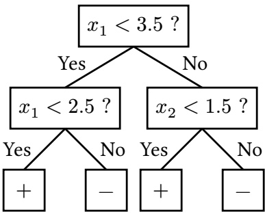

**Solution:** You can split up the points with 4 lines with each line being horizontal or vertical. For example, put one at $x _ { 1 } = 2 . 5$ and another at $x _ { 1 } = 1 . 5$ . Put one line at $x _ { 2 } = 2 . 5$ and another at $x _ { 2 } = 3 . 5 .$ . You will have perfectly split the data points.

<!-- page: 23 -->

(Question 6 continued…)

Q6.10 (2 points) In general (not necessarily using the data above), consider building two trees using the same training data set: **Tree A** is limited to a finite depth, and **Tree B** has no depth limit.

Select all true statements about the two trees.

A Tree A could have a strictly greater training accuracy than Tree B.

B Tree A could have a strictly greater validation accuracy than Tree B.

C Tree A could have a strictly greater test accuracy than Tree B.

D Both trees could have the same number of leaves.

E None of the above

**Solution:** Making the tree deeper can never decrease training accuracy.

Validation and test accuracy though have no guarantees. If Tree B overfits, then the validation and test accuracy for Tree B could be lower than Tree A.

If all data points in each leaf of Tree A have identical feature values, then increasing the depth would not result in any new leaf nodes.

## Q6.11 (1 point) True or false: In general, decision trees can learn nonlinear decision boundaries.

## A True

B False

**Solution:** Decision trees can learn piecewise-linear decision boundaries since each node can can split the feature space with a line.

<!-- page: 24 -->

Consider an MDP with unknown transition probabilities and rewards.

In this question, we will compare three methods for learning Q-values in this MDP:

1. Standard (tabular) Q-learning from lecture.

2. Approximate Q-learning from lecture.

3. Build a neural network that learns the 𝑄-function $Q ( s , a )$

In Q7.1 and Q7.2, assume the MDP has |𝑆| states and |𝐴| actions.

Q7.1 (1 point) How many parameters do we need to store when using standard Q-learning?

A |𝑆| ⋅ |𝐴|

B $| S | ^ { | A | }$

|𝑆| + |𝐴|

D None of the above

**Solution:** We need a table that stores one Q-value for every single $( s , a )$ pair. There are |𝑆| states and |𝐴| actions, so there are |𝑆| ⋅ |𝐴| total entries.

Q7.2 (1 point) How many parameters do we need to store when using approximate Q-learning? Given a state-action pair, we derive 𝑛 features from the state and 𝑚 features from the action.

A |𝑆| ⋅ |𝐴|

|𝑆| ⋅ |𝐴| ⋅ 𝑚 ⋅ 𝑛

C 𝑚 + 𝑛

D 𝑚 ⋅ 𝑛

**Solution:** For approximate Q-learning, we store a parameter for every feature. Because there are 𝑛 features derived from states and 𝑚 features derived from actions, we know that there are 𝑛 + 𝑚 parameters to store.

We design a neural network to approximate the $Q ( s , a )$ function. The network has this architecture: 5-dimensional input, hidden layer with 3 neurons, hidden layer with 2 neurons, 1-dimensional output.

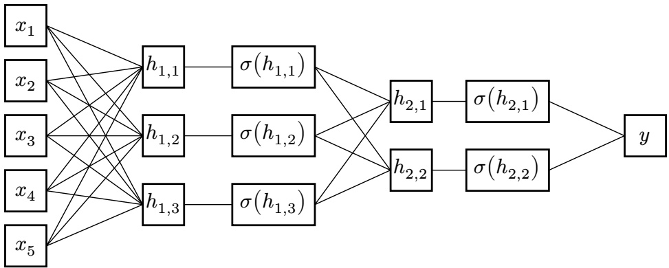

Q7.3 (1 point) How many total parameters do we need to store when using a neural network with these dimensions? (Ignore any bias terms.)

A 11

B 15

C 21

D 23

E 28

F None

**Solution:** Each edge represents a weight (parameter). Looking at the diagram, the first layer has 15 parameters, the second layer has 6 parameters, and the third layer has 2 parameters. Adding together, we get 23.

<!-- page: 25 -->

(Question 7 continued…)

Q7.4 (1 point) How should we generate the inputs to the neural network?

A Run a feature extraction function $f ( s , a )$ to get a vector $[ x _ { 1 } , x _ { 2 } , x _ { 3 } , x _ { 4 } , x _ { 5 } ]$

B Run a feature extraction function $f ( s , a )$ to get a scalar $x_{1} + x_{2} + x_{3} + x_{4} + x_{5}$

C Run a feature extraction function $f ( s , a )$ to get a scalar 𝑦.

D Set each $x _ { i }$ to a state-action pair $( s , a )$

E Set 𝑦 to the state-action pair $( s , a )$

**Solution:** In order to generate inputs to the neural network, we need to run a feature extraction function because neural networks require numeric vectors as inputs. We need utilize a feature extraction function to transform $( s , a )$ information into standardized numerical values. Scalar values are incorrect because they are too constrained and will lose information.

Q7.5 (1 point) Which value in the neural network represents the predicted Q-value?

$$
Ⓑ \sum_ {i = 1} ^ {5} x _ {i}
$$

$$
Ⓒ y + \sum_ {i = 1} ^ {5} x _ {i}
$$

$$
Ⓓ [ x _ {1}, x _ {2}, x _ {3}, x _ {4}, x _ {5} ]
$$

**Solution:** The question says that we are trying to approximate the Q-function, which is a function taking in $( s , a )$ as input and outputting $Q ( s , a )$ . In other words, the estimated Q-value is the output of the function.

𝑦 is the value outputted by the neural network.

Q7.6 (2 points) We are now training the neural network. $( s , a , s ^ { \prime } , r )$ represents a training data point, and $\hat { Q } ( s , a )$ represents the neural network’s predicted Q-values.

What happens when we train the neural network by minimizing the loss function below?

$$
\text {Loss} = \left[ \left(r + \gamma \max _ {a ^ {\prime}} \hat {Q} (s ^ {\prime}, a ^ {\prime})\right) - \hat {Q} (s, a) \right] ^ {2}
$$

A The neural network will minimize Q-values for all $( s , a )$ pairs.

B The neural network will maximize Q-values for all $( s , a )$ pairs.

C The predicted Q-values will approximate the immediate reward of the state-action pair.

D The predicted Q-values will satisfy the Bellman equation more closely.

**Solution:** Minimizing the loss function promotes making predicted Q-values satisfy the Bellman equation more closely because $\left( r + \gamma \operatorname * { m a x } _ { a ^ { \prime } } \hat { Q } ( s ^ { \prime } , a ^ { \prime } ) \right)$ represents the Bellman optimality condition and $\hat { Q } ( s , a )$ is the network’s current estimate. When we minimize their squared difference, then our network updates its parameters, and our predictions become more consistent with the Bellman equation.

<!-- page: 26 -->

(Question 7 continued…)

Q7.7 (2 points) We train the neural network to convergence, and we notice that the neural network produces bad predicted Q-values.

Which modifications could help the network perform better? Consider each choice independently.

A Increase the number of hidden neurons in each layer.

B Change the feature extraction function.

C Continue training the neural network on the existing training data.

D Provide additional training data that covers unseen $( s , a )$ pairs.

E None of the above

**Solution:** Increasing the number of hidden features in each layer allows us to represent more complex relationships. Changing the feature extraction function could allow us to find better features that would make our inputs more structured. Providing additional training data allows for us to improve generalization and reach convergence on previously unseen (𝑠, 𝑎) pairs.

If we train on the existing data with the same learning rate, then if our neural network has already converged, we are unable to generalize further and could overfit our data.

Q7.8 (2 points) We train the neural network to convergence. Given a state 𝑠, how do we use the neural network to choose an optimal action?

A Run the gradient descent algorithm.

B Use the network to predict a single $\hat { Q } ( s , a )$ value.

C Use the network to predict multiple $\hat { Q } ( s , a )$ values, then take an argmax.

D Use the network to predict multiple $\hat { Q } ( s , a )$ values, then take an average.

**Solution:** You would need to choose the action that gives you the highest predicted Q-value.

Q7.9 (3 points) Which algorithms can output predicted Q-values for unseen Q-states (i.e., Q-states that have never appeared in any sample)? Select all that apply.

A Neural networks

C Approximate Q-learning

B Standard tabular Q-learning

D None of the above

**Solution:** Neural nets utilize nonlinear functions to estimate Q-values for unseen states. Approximate Q-learning allows for us to estimate unseen states utilizing features to generalize.

Standard Q-learning uses an explicitly given table, so we cannot generalize to states that we have not seen yet.

<!-- page: 27 -->

Q7.10 (3 points) Which algorithms can learn Q-states in a continuous state space (i.e., an MDP with infinitely many states)? Select all that apply.

A Neural networks

C Approximate Q-learning

B Standard tabular Q-learning

D None of the above

**Solution:** Neural networks and approximate Q-learning can learn in continuous state space because they utilize function approximation and not a discrete look-up table. Because of this, they can both calculate any state through feature generalization.

In contrast, standard tabular Q-learning would require infinitely many entries, so our table would need to be infinitely large.

<!-- page: 28 -->

Q8.1 and Q8.2 are from Project 1 (Search).

In Project 1, you implemented the **ClosestDotSearchAgent**.

To solve the eat-all-dots problem, the **findPathToClosestDot** method in the **ClosestDotSearchAgent** class is called time(s), and the resulting solution is optimal. (i) (ii)

Q8.1 (1 point) Blank (i):

A Exactly 1

B Exactly 4

C 1 or more

Q8.2 (1 point) Blank (ii):

A Always

B Sometimes

C Never

**Solution:** For Q8.1 and Q8.2, see Question 8 from Project 1.

The agent calls the method once to find the closest dot, eats the dot, and then repeats for all the dots.

This might be the best path (ex: Pac-Man has one dot to eat), but it might also not be the optimal path.

Q8.3 (2 points) In Project 2 (Multi-Agent Search), when do we apply an evaluation function? Select all that apply.

A After we return the value at the root.

B When the current game state is a victory for Pac-Man.

C When we have reached the maximum depth of the game tree.

D None of the above. We never use an evaluation function in Project 2.

**Solution:** See Question 2 from Project 2.

We call **self.evaluationFunction** when **gameState.isWin()** or **gameState.isLose()** or **depth == maxDepth**.

<!-- page: 29 -->

(Question 8 continued…)

Q8.4 (1 point) In Project 5 (Machine Learning), you implemented the **DigitClassificationModel** to classify handwritten digits from the MNIST dataset. What loss function do we use? A ReLU C Mean Squared Error E Cross Entropy B Softmax D Mean Absolute Error F Sigmoid

**Solution:** See Question 3 from Project 5. ReLU, softmax, and sigmoid are not loss functions. Mean Squared Error and Mean Absolute Error are loss functions for regression problems. Cross entropy is the only option that is a loss function for a classification problem.

Q8.5 (1 point) In Project 5, you applied a causal mask to your attention layer. What was the primary purpose of using a causal mask in Project 5? A To prevent the neural network from looking ahead at future tokens in the sequence. B To prevent the neural network from looking back at past tokens in the sequence. C To ensure that our neural network only looks at the current token. D To ensure that our neural network does not overfit on the training data.

| Solution: See Question 6 from Project 5.Option (B) is incorrect because a transformer needs to look at past tokens in order to make a decision about the next token.Option (C) is incorrect because we want our neural network to look at other tokens.Option (D) is incorrect because overfitting has nothing to do with the future tokens in the sequence. |
| --- |
