<!-- page: 1 -->

Intro to Artificial Intelligence

Final Exam

Print Your Name:

Print Your Student ID:

Print Student name to your left:

Print Student name to your right:

You have 170 minutes. There are 9 questions of varying credit. (100 points total)

| Question: | 1 | 2 | 3 | 4 | 5 | 6 | 7 | 8 | 9 | Total |
| --- | --- | --- | --- | --- | --- | --- | --- | --- | --- | --- |
| Points: | 10 | 9 | 9 | 14 | 15 | 11 | 8 | 14 | 10 | 100 |

We reserve the right to deduct points for failing to follow the marking directions below:

For questions with **circular bubbles**, you may select only one choice.

For questions with **square checkboxes**, you may select one or more choices.

Unselected option (Completely unfilled)

You can select

Don’t do this (it will be graded as incorrect!)

multiple squares

Only one selected option (completely filled)

Don’t do this (it will be graded as incorrect!)

Anything you write outside the answer boxes or you ~~cross out~~ will not be graded. If you write multiple answers, your answer is ambiguous, or the bubble/checkbox is not entirely filled in, we will grade the worst interpretation.

Read the honor code below and sign your name.

By signing below, I affirm that all work on this exam is my own work. I have not referenced any disallowed materials, nor collaborated with anyone else on this exam. I understand that if I cheat on the exam, I may face the penalty of an “F” grade and a referral to the Center for Student Conduct.

Sign your name:

<!-- page: 2 -->

Consider a variant of Pacman where each food dot has a different calorie count. Each food dot’s calorie count is a strictly positive integer. Each food dot that Pacman eats adds to his total calorie count (𝐶).

When Pacman moves into a square with a dot, he automatically eats the dot as part of that action. All actions cost 1.

Pacman’s goal is to eat at least 10 calories in total, i.e. reach a state where 𝐶 ≥ 10.

Q1.1 (3 points) Select all admissible heuristics for this problem.

𝐶

Euclidean distance to the nearest dot.

10 − 𝐶

Sum of Euclidean distances to all dots.

Manhattan distance to the nearest dot.

None of the above

Sum of Manhattan distances to all dots.

For each of the next three subparts, consider the given maze and search algorithms. Select whether each search algorithm will find the optimal solution with **at most 10 states** expanded.

Hint: Recall that expanding a state means calling the successor function on that state.

For all subparts, when calling the successor function, enqueue the Left successor state first, then the Right successor state. This means that for DFS, the Right successor state gets popped off the stack first.

Q1.2 (2 points) A 1 × 11 grid with 10 dots, each worth 1 calorie. Pacman starts in the leftmost square.

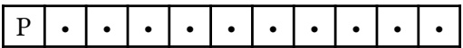

DFS tree search

BFS tree search

None of the above

Q1.3 (2 points) A 1 × 11 grid with 10 dots, each worth 1 calorie. Pacman starts in the middle square.

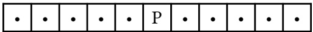

DFS tree search

BFS tree search

None of the above

Q1.4 (2 points) A 1 × 5 grid with a single 10-calorie dot. The dot is at the right, and Pacman is at the left.

DFS tree search

BFS tree search

None of the above

Q1.5 (1 point) UCS where all actions cost 1 is always equivalent to which search algorithm? BFS DFS A\* None

<!-- page: 3 -->

Four CS 188 TAs want to line up to take staff photos, and Pacman wants to assign each TA to one position. There are 6 possible positions for TAs to stand, numbered 1 through 6 from left to right. The TAs are the variables, and the positions are the values.

No two TAs can stand in the same position. Not all positions need to be assigned to a TA.

The TAs have special requests:

• Advika (𝐴) does not want anyone to stand directly to her left or right.

• Josh (𝐽) does not want to stand in the leftmost or rightmost position.

• Michael (𝑀) wants to stand directly next to Josh.

• Saathvik (𝑆) does not want to stand directly next to Josh.

Two example assignments are shown below. The invalid assignment violates Advika’s, Josh’s, and Michael’s requests, though Saathvik’s request is satisfied.

Valid:

| A |  | M | J |  | S |
| --- | --- | --- | --- | --- | --- |
| 1 | 2 | 3 | 4 | 5 | 6 |

Invalid:

| J |  |  | S | M | A |
| --- | --- | --- | --- | --- | --- |
| 1 | 2 | 3 | 4 | 5 | 6 |

Q2.1 (1 point) Which type of constraint can be used to represent Advika’s request in a single constraint? Unary Binary Higher-order

Q2.2 (1 point) Which type of constraint can be used to represent Josh’s request in a single constraint? Unary Binary Higher-order

Q2.3 (2 points) For this subpart, no variables are assigned, and every variable’s domain is {1, 2, 3, 4, 5, 6}. Pacman uses LCV (least constraining value) with forward checking to assign Advika first. Select all value(s) that LCV could assign to 𝐴.

1

2

3

□ 4

5

6

For the next two subparts, consider the partial assignment and domains below:

|  |  |  |  |  | A |
| --- | --- | --- | --- | --- | --- |
| 1 | 2 | 3 | 4 | 5 | 6 |

𝐽 : {2, 3, 4}

𝑀 : {1, 3, 4}

𝑆 : {1, 3, 4}

Q2.4 (2 points) Pacman runs arc consistency to check the arc (𝑆 → 𝐽).

Select all values that **remain** in the domain of 𝑆.

1

3

□ 4

None of the above

Q2.5 (3 points) Suppose Pacman runs the arc consistency algorithm covered in lecture (AC-3). Select all arcs that are enqueued after processing the (𝑆 → 𝐽) arc.

(𝐽 → 𝑆)

(𝐽 → 𝑀)

(𝑀 → 𝑆)

(𝑆 → 𝐽)

(𝑀 → 𝐽)

(𝑆 → 𝑀)

None of the above

<!-- page: 4 -->

Pranav and Catherine are playing a game. Pranav acts as a standard maximizer (represented by triangles), and Catherine is represented by hexagonal nodes. Catherine chooses an action that **minimizes** some function 𝑓 applied to each of the child nodes.

For example:

• If 𝑓(𝑥) = 𝑥, then Catherine acts as a standard minimizer.

• If 𝑓(𝑥) = −𝑥, then Catherine acts as a standard maximizer.

• If 𝑓(𝑥) = 0, then Catherine randomly selects an action, since she will see each of her children as having an equal value of 0.

Assumptions:

• Pranav always knows Catherine’s strategy and acts optimally.

• Terminal nodes are labeled with Pranav’s utility, not Catherine’s utility.

• Unless otherwise stated, terminal nodes are unbounded (can take any real value).

Q3.1 (1 point) For this subpart only, consider the tree to the right:

If Catherine chooses an action that minimizes the function

$$
f (x) = \left\{ \begin{array}{l} 1 \text {if} x \geq 0 \\ 0 \text {if} x <   0 \end{array} \right.
$$

what utility does Pranav receive in this game tree, assuming he acts optimally? 4 −5 −9 3.6

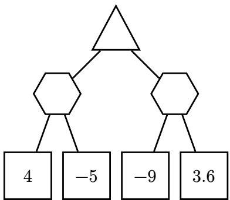

Q3.2 (2 points) For this subpart only, consider the tree below:

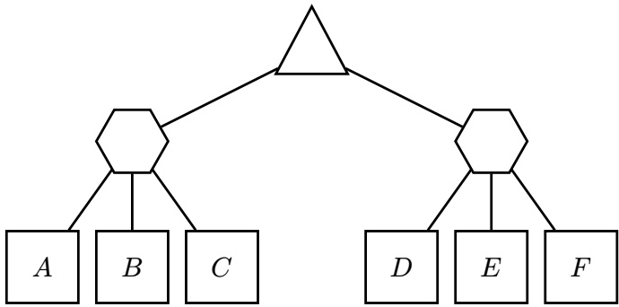

If Catherine chooses an action that minimizes the function

$$
f (x) = (x - 1 8 8) ^ {2}
$$

what values of 𝐴 make it possible to prune 𝐵? If no values of 𝐴 cause 𝐵 to be pruned, leave both boxes blank and bubble None.

Assume that nodes are evaluated from left to right, and we prune on equality.

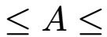

None

<!-- page: 5 -->

(Question 3 continued…)

For the remaining subparts, consider any game tree with alternating maximizer and hexagonal nodes, not necessarily the tree above.

Assumptions for the remaining subparts:

• Both Pranav and Catherine evaluate the entire game tree (no depth-limiting).

• No alpha-beta pruning takes place.

Q3.3 (2 points) Catherine minimizes the same function 𝑓 as above:

$$
f (x) = (x - 1 8 8) ^ {2}
$$

For some given game tree, Pranav’s utility when Catherine minimizes $f ( x ) = ( x - 1 8 8 ) ^ { 2 }$ is strictly less than Pranav’s utility when Catherine is a standard minimizer. always sometimes never

Q3.4 (1 point) Which type of game can model this scenario for **all** functions 𝑓? Minimax Multi-Agent Utilities Expectimax None of the above

Q3.5 (3 points) For this subpart only, assume the values at all leaf nodes are strictly positive. Which of the following functions will cause Catherine to always act like a standard minimizer? Select all that apply. 1𝑥 ReLU(𝑥) 𝑥 + 5 log(𝑥) 𝑒𝑥 𝑥 − 5

None of the above

<!-- page: 6 -->

Consider a 1 × 2 grid where Blinky can be in the left or right square. At each time step, Blinky will move left with probability 0.5 or move right with probability 0.5. If the move would result in Blinky moving off the grid, Blinky stays in the same position.

State **Left** represents Blinky in the left square, and state **Right** represents Blinky in the right square.

An example is shown below that starts in state **Left**.

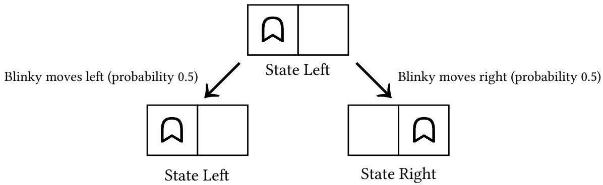

Pacman is trying to defeat Blinky and has 3 possible actions: **Bust Left**, **Bust Right**, and **Don't Bust**. Note that Pacman does not have control over Blinky.

**Bust Left** and **Bust Right** give a reward of +1 for busting correctly (the same square as Blinky), and −1 for busting incorrectly. The **Bust Left** and **Bust Right** actions transition into a terminal state X where no further actions or rewards are available, regardless of whether the bust was correct.

The **Don't Bust** action gives a reward of 0. Then, Blinky moves left or right, and Pacman can take another action.

Q4.1 (4 points) Fill in the table for the transition and reward functions (some rows have been omitted). If a transition $( s , a , s ^ { \prime } )$ occurs with probability 0, write $`` \mathrm{NA}  ''$ in the box for $R ( s , a , s ^ { \prime } )$

| 𝑠 | 𝑎 | 𝑠' | 𝑇(𝑠,𝑎,𝑠') | 𝑅(𝑠,𝑎,𝑠') |
| --- | --- | --- | --- | --- |
| Left | Bust Left | Left |  |  |
| Left | Bust Left | Right |  |  |
| Left | Bust Left | X |  |  |
| Left | Bust Right | X |  |  |
| Right | Bust Left | X |  |  |
| Right | Bust Right | X |  |  |
| Right | Don't Bust | Left |  |  |
| Right | Don't Bust | X |  |  |

<!-- page: 7 -->

(Question 4 continued…)

Q4.2 (2 points) If we were to also include the omitted rows, how many rows are in the full table? Note: Include rows where $T ( s , a , s ^ { \prime } ) = 0$ 8 12 18 24 30

Q4.3 (3 points) Suppose that at time step $t = 0 ,$ , Pacman believes Blinky is in the **Left** square with probability 𝑝 and is in the **Right** square with probability $1 - p .$ Recall that Blinky moves left or right, each with probability 0.5, at each time step. After one time step, with what probability does Pacman believe Blinky is in the **Left** square? 0 0.5𝑝 𝑝 0.5 1 − 𝑝 1

For the remaining subparts, suppose Pacman observes an imperfect sensor to gain information about Blinky’s location.

At any given time step 𝑡, the sensor’s observation $( o _ { t } )$ matches Blinky’s location $( s _ { t } )$ with probability 0.7 and does not match Blinky’s location with probability 0.3.

Q4.4 (2 points) Fill in the table for $P ( O _ { t } \mid S _ { t } )$

| 𝑜𝑡 | 𝑠𝑡 | 𝑃(𝑜𝑡 \| 𝑠𝑡) |
| --- | --- | --- |
| Left | Left |  |
| Left | Right |  |
| Right | Left |  |
| Right | Right |  |

Q4.5 (1 point) Suppose the sensor reports that Blinky is in the **Left** square and the discount factor is $\gamma < 1$ . What is the optimal action given this observation? **Bust Left Bust Right Don't Bust**

Q4.6 (2 points) Suppose the sensor reports that Blinky is in the **Left** square. Assuming $\gamma < 1$ , what is the expected return when acting optimally given this observation? 0 0.3 0.4 0.5 0.7 1

<!-- page: 8 -->

Consider the Bayes net below. Each random variable is binary (has two possible values).

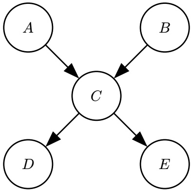

Suppose we want to compute $P ( B \mid + e )$ , using variable elimination.

Q5.1 (1 point) We join and eliminate on 𝐴 first.

What is the size of the factor generated when we join on 𝐴 (but before we eliminate on 𝐴)? Note: The size of a factor denotes the number of rows in its CPT. O $2 ^ { 0 }$ O $2 ^ { 1 }$ O $2 ^ { 2 }$ O $2 ^ { 3 }$ O $2 ^ { 4 }$ O $2 ^ { 5 }$

Q5.2 (1 point) We join and eliminate on 𝐷 next. What is the size of the factor generated when we join on 𝐷 (but before we eliminate on 𝐷)? O $2 ^ { 0 }$ O $2 ^ { 1 }$ O $2 ^ { 2 }$ O $2 ^ { 3 }$ O $2 ^ { 4 }$ O $2 ^ { 5 }$

Q5.3 (1 point) We join and eliminate on 𝐶 first next (was clarified on the exam). What is the size of the factor generated when we join on $C$ (but before we eliminate on 𝐶)? O $2 ^ { 0 }$ O $2 ^ { 1 }$ O $2 ^ { 2 }$ O $2 ^ { 3 }$ O $2 ^ { 4 }$ O $2 ^ { 5 }$

Regardless of your previous answers, suppose that the remaining factors after eliminating 𝐴, 𝐷, and 𝐶 are $f ( B , + e )$ and $P ( B )$ . Fill in the expression below to derive the desired probability $P ( B \mid + e )$

$$
\frac {(\mathrm{i})}{\sum_ {(\mathrm{ii})} (\mathrm{iii})}
$$

Q5.4 (1 point) Fill in blank (i). O $f ( B , + e ) P ( B )$ O $f ( B , + e )$ O $f ( b , + e ) ~ P ( b )$ O $f ( b , + e )$

Q5.5 (1 point) Fill in blank (ii). 𝑏 O $b , e$ 𝑒

Q5.6 (2 points) Fill in blank (iii). O $f ( B , + e ) \; P ( B )$ O $f ( B , + e )$ O $f ( b , + e ) \; P ( b )$ O $f ( b , + e )$

<!-- page: 9 -->

(Question 5 continued…)

Now, suppose we want to estimate 𝑃(𝐵 | +𝑒) using sampling.

Q5.7 (2 points) If we use **rejection** sampling, which of these variable orders can be used to produce a valid sample? Select all that apply. 𝐴, 𝐵, 𝐶, 𝐷, 𝐸 𝐵, 𝐴, 𝐶, 𝐸, 𝐷 𝐶, 𝐵, 𝐴, 𝐸, 𝐷 𝐷, 𝐸, 𝐴, 𝐵, 𝐶 𝐸, 𝐷, 𝐶, 𝐵, 𝐴 None of the above

Q5.8 (2 points) Suppose $P(+e \mid +c)=P(+e \mid -c)=0.001$ , and $P(-e \mid +c) = P(-e \mid -c) = 0.999.$

If we use **likelihood weighting**, what are the weights of the samples produced?

All samples have weight 0.001.

All samples have weight 0.999.

~~Some~~ Most (was clarified on the exam) samples have weight 0.001, and the remaining samples all have weight 0.999.

~~Some~~ Most (was clarified on the exam) samples have weight 0.999, and the remaining samples all have weight 0.001.

Q5.9 (2 points) Regardless of your previous answers, consider a scenario where likelihood weighting outputs samples that all have the same weight. You are given many samples generated from likelihood weighting. Select all strategies that compute a consistent estimate for 𝑃(+𝑏 | +𝑒).

Number of samples with +𝑏, divided by total number of samples.

Number of samples with +𝑒, divided by total number of samples.

Sum of weights of all samples with +𝑏, divided by sum of weights of all samples.

Sum of weights of all samples with +𝑒, divided by sum of weights of all samples.

None of the above

Q5.10 (2 points) For this subpart only, suppose we want to estimate $P(+e \mid +a)$ using **rejection** sampling. We generate samples by sampling each variable, one at a time. Which of the following variables, when sampled first, results in samples being rejected as early as possible? 𝐴 𝐵 𝐶 𝐷 𝐸

<!-- page: 10 -->

Blinky is taking an exam and considers the utility of cheating. We model his thought process as follows:

1. Blinky chooses his level of cheating 𝐿, which is a real number from 0 to 1.

For example, 𝐿 = 0 represents no cheating, 𝐿 = 1 represents the most cheating, and 𝐿 = 0.7 represents a lot of cheating.

2. After the exam, Blinky is either caught (+𝑐) or not caught (−𝑐). The value of 𝐶 is sampled from a probability distribution $P ( C \mid L )$ The probability that Blinky is caught is $P ( + c \mid L ) = L$ , and $P ( - c \mid L ) = 1 - L .$

3. If Blinky is caught, he receives utility −50. If Blinky is not caught, he receives utility $1 0 + 1 0 0 L$

Q6.1 (1 point) What is Blinky’s expected utility if 𝐿 = 0? −50 −40 5 10 60 100 110

Q6.2 (1 point) What is Blinky’s expected utility if 𝐿 = 1? −50 −40 5 10 60 100 110

Q6.3 (2 points) What is Blinky’s expected utility if $L = 0 . 5 ?$ −50 −40 5 10 60 100 110

Q6.4 (3 points) What 𝐿 maximizes Blinky’s utility?

Hint: A quadratic $a x ^ { 2 } + b x + c$ achieves its maximum (assuming one exists) at $\begin{array} { r } { x = - \frac { b } { 2 a } } \end{array}$

Q6.5 (2 points) Blinky’s MEU (maximum expected utility) is 14. What does this number represent?

If Blinky takes the exam many times, all with the optimal 𝐿, he receives utility 14 on average.

If Blinky takes the exam many times, all with the optimal 𝐿, he always receives utility 14.

When Blinky takes the exam with optimal $L ,$ the highest utility he can ever receive is 14.

When Blinky takes the exam with optimal 𝐿, the lowest utility he can ever receive is 14.

Q6.6 (2 points) Which decision network best models this scenario?

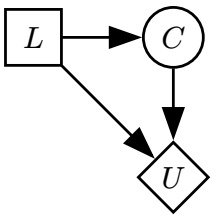

Network (i)

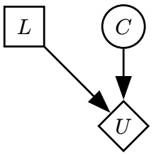

Network (ii)

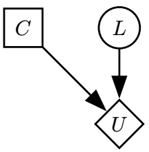

Network (iii)

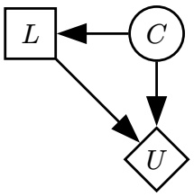

Network (iv)

<!-- page: 11 -->

Oh no! Blinky was caught cheating on his exam and is now trying to escape! At any given time, Blinky’s location (𝐿) is either Dwinelle, VLSB, or Stanford.

We want to compute a belief distribution over Blinky’s location using particle filtering.

Q7.1 (2 points) Suppose we use 10 particles. We pause the particle filtering algorithm immediately after an observation update.

Which statement implies that 𝐿 = Stanford with probability 0.9 at this time step?

There are exactly 9 particles at Stanford.

We add up the un-normalized weights of all the particles at Stanford, and the sum is 9.0.

We add up the un-normalized weights of all the particles at Stanford, and the sum is 0.9.

We add up the normalized weights of all the particles at Stanford, and the sum is 0.9.

Suppose there are two cameras $( C _ { 1 } , C _ { 2 } )$ that are conditionally independent given 𝐿. We are only able to observe Blinky’s location using these cameras.

Q7.2 (2 points) Which graph always represents the scenario where $C _ { 1 }$ and $C _ { 2 }$ are conditionally independent given 𝐿?

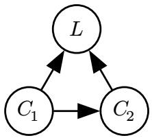

Graph (i)

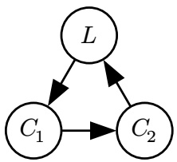

Graph (ii)

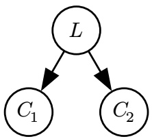

Graph (iii)

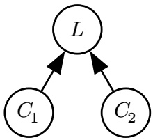

Graph (iv)

Q7.3 (2 points) In the observation update, how do we calculate the weight 𝑤 of a particle? $w \gets P ( \ell \mid c _ { 1 } ) \cdot P ( \ell \mid c _ { 2 } )$ $w \gets P ( c _ { 1 } \mid \ell ) \cdot P ( c _ { 2 } \mid \ell )$ O $w \gets P ( c _ { 1 } , c _ { 2 } | \ell ) \cdot P ( \ell )$ O $w \gets P ( c _ { 1 } \mid \ell ) \cdot P ( c _ { 2 } \mid c _ { 1 } )$

Q7.4 (2 points) At some time during the particle filtering algorithm, we have the four weighted particles shown on the right.

During the re-sampling step, what is the probability that a newly re-sampled particle is at Stanford?

1/8

1/4

1/2

|  | Location (𝐿) | Weight |
| --- | --- | --- |
| Particle 1: | Dwinelle | 0.4 |
| Particle 2: | Stanford | 0.2 |
| Particle 3: | Dwinelle | 0.9 |
| Particle 4: | VLSB | 0.1 |

<!-- page: 12 -->

Q8.1 (2 points) Select all true statements about the Sigmoid function (shown below).

$$
\text {Sigmoid} (x) = \frac {1}{1 + e ^ {- x}}
$$

Sigmoid outputs values between 0 and 1. Sigmoid is monotonically increasing.

Sigmoid is linear. None of the above

Sigmoid is non-negative.

For the next two subparts, a perceptron classifier has the following weight vectors for three classes (“Sports”, “Music”, “Books”):

$$
w _ {\mathrm{Sports}} = [ 5, 4, 5 ]
$$

$$
w _ {\mathrm{Music}} = [ 3, 8, 2 ]
$$

$$
w _ {\mathrm{Books}} = [ 2, 3, 4 ]
$$

Now, the classifier is updated a single time, using a new data point with feature vector [1, −1, 2] and class “Books”.

Q8.2 (2 points) What are the new weights for $w _ { \mathrm { M u s i c } }$ after the update? [6, 3, 7] [4, 5, 3] [3, 8, 2] [3, 2, 6] [5, 4, 5] [4, 7, 4] [2, 9, 0] [2, 3, 4]

Q8.3 (2 points) What are the new weights for $w _ { \mathrm { B o o k s } }$ after the update? [6, 3, 7] [4, 5, 3] [3, 8, 2] [3, 2, 6] [5, 4, 5] [4, 7, 4] [2, 9, 0] [2, 3, 4]

In the next two subparts, consider a naive Bayes classifier for emails, just like the one from lecture. The classes are “Ham” and “Spam”.

Each email is featurized into a 3-element feature vector using the binary bag-of-words model with words “Free”, “Money”, and “Now”. For example, the email “hello money” is featurized into [0, 1, 0], and the email “now now money” is featurized into [0, 1, 1].

Q8.4 (2 points) We want to add a new feature word “Ring” to the classifier. Select all information about the training dataset needed to compute 𝑃(Ring = 1 | class = Spam).

The choices are not independent, e.g. selecting all choices means you need all 4 values. Assume you don’t know the total number of Ham and Spam emails.

Number of “Spam” emails containing the word “Ring”.

Number of “Ham” emails containing the word “Ring”.

Number of “Spam” emails **not** containing the word “Ring”.

Number of “Ham” emails **not** containing the word “Ring”.

None of the above

<!-- page: 13 -->

The table below shows the results of running the classifier on a given test dataset:

| Predicted Class | True Class | 𝑃(Predicted Class \| True Class) |
| --- | --- | --- |
| Spam | Spam | 0.6 |
| Spam | Ham | 0.2 |
| Ham | Spam | 0.4 |
| Ham | Ham | 0.8 |

In the test dataset, 10% of the data points are “Spam”.

Q8.5 (1 point) What is the **precision** of the classifier, treating “Spam” as the positive class? Hint from lecture slides: Precision $\begin{array} { r } { = \frac { \mathrm { T P } } { \mathrm { T P } + \mathrm { F P } } } \end{array}$ 0.2 0.25 0.4 0.6 0.75 0.8

Q8.6 (1 point) What is the **recall** of the classifier, treating “Spam” as the positive class? Hint from lecture slides: Recall $\begin{array} { r } { = \frac { \mathrm { T P } } { \mathrm { T P } + \mathrm { F N } } } \end{array}$ 0.2 0.25 0.4 0.6 0.75 0.8

The next two subparts are from the Transformers lecture.

Q8.7 (1 point) True or False: In multi-head attention, each attention head can specialize on extracting different information from the input sequence. True False

Q8.8 (1 point) True or False: Beam search decoding allows LLMs to investigate multiple potential sequences in parallel and select the best one based on a heuristic. True False

The next two subparts are from the guest lectures.

Q8.9 (1 point) Which of these are areas where we see bias in AI? Select all that apply. Racial Language None of the above

Q8.10 (1 point) Which of the following is **not** a feature of a good model editing technique? Reliability Incoherence Generalization Locality

<!-- page: 14 -->

Q9.1 (1 point) For unit vectors

$$
a = \left[ \begin{array}{c} a _ {1} \\ \vdots \\ a _ {n} \end{array} \right] \text {and} b = \left[ \begin{array}{c} b _ {1} \\ \vdots \\ b _ {n} \end{array} \right],
$$

what does the dot product $a \cdot b$ represent?

The difference in magnitude between 𝑎 and 𝑏.

The similarity between 𝑎 and 𝑏.

The sum of 𝑎 and 𝑏.

Q9.2 (2 points) Which of the following is true about Softmax (shown below)?

Note: $\exp ( z ) = e ^ { z }$

$$
\text {Softmax} \left(\left[ \begin{array}{c} x _ {1} \\ \vdots \\ x _ {n} \end{array} \right]\right) = \left[ \begin{array}{c} \frac {\exp (x _ {1})}{\sum_ {i = 1} ^ {n} \exp (x _ {i})} \\ \vdots \\ \frac {\exp (x _ {n})}{\sum_ {i = 1} ^ {n} \exp (x _ {i})} \end{array} \right]
$$

The values in the output of Softmax form a valid probability distribution.

If $x _ { i } < x _ { j }$ , then after applying Softmax, the 𝑖th element is less than the 𝑗th element.

Softmax linearly scales all inputs to between 0 and 1.

Softmax can be used to introduce a non-linearity in a neural network.

None of the above

This question continues on the next page.

<!-- page: 15 -->

(Question 9 continued…)

Blinky has a word bank containing {“Angry”, “Anxious”, “Excited”, “Sad”}. He uses a feature extraction function 𝑓 to convert the words into feature vectors, shown below.

Blinky builds a model that takes in a new word “Tired”, featurizes it into 𝑓(Tired), and wants to find the most similar word in the word bank.

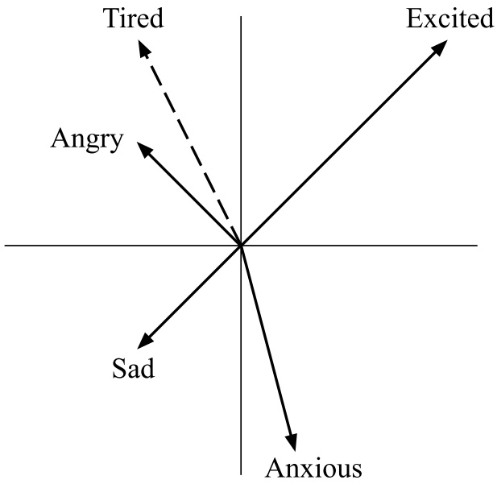

Words in the bank:

$$
f (\text {Angry}) = \left[ \begin{array}{c} - 1 \\ 1 \end{array} \right]
$$

$$
f (\text {Anxious}) = \left[ \begin{array}{c} 0. 5 \\ - 2 \end{array} \right]
$$

$$
f (\text {Excited}) = \left[ \begin{array}{c} 2 \\ 2 \end{array} \right]
$$

$$
f (\mathrm{Sad}) = \left[ \begin{array}{c} - 1 \\ - 1 \end{array} \right]
$$

Blinky’s new word:

$$
f (\text {Tired}) = \left[ \begin{array}{c} - 1 \\ 2 \end{array} \right]
$$

Q9.3 (2 points) Blinky’s model uses the following equation, where 𝑤 is a word in the word bank.

$$
\text {SimilarityScore(Tired,} w) = \frac {\exp (f (\text {Tired}) \cdot f (w))}{\sum_ {w ^ {\prime} \in \text {bank}} \exp (f (\text {Tired}) \cdot f (w ^ {\prime}))}
$$

Which 𝑤 has the highest SimilarityScore with “Tired”? Angry Anxious Excited Sad

Q9.4 (2 points) For this subpart only, Xavier creates a XavierSimilarityScore model

$$
\text {XavierSimilarityScore(Tired,} w) = \frac {\exp (A f (\text {Tired}) \cdot f (w))}{\sum_ {w ^ {\prime} \in \text {bank}} \exp (A f (\text {Tired}) \cdot f (w ^ {\prime}))}
$$

where 𝐴 is a $2 \times 2$ matrix that transforms Tired’s feature vector from 𝑓(Tired) to $A   f ( { \mathrm { T i r e d } } )$

What choice of 𝐴 causes “Anxious” to have the highest XavierSimilarityScore to “Tired”?

$\bigcirc \binom{1 \ 0}{0 \ 1}$ , which leaves 𝑓(Tired) unchanged.

$\bigcirc \begin{pmatrix} 0 & 1 \\ -1 & 0 \end{pmatrix}$ , which rotates 𝑓(Tired) 90 degrees clockwise.

O $\begin{pmatrix}-1 & 0 \\0 & -1\end{pmatrix}$ , which rotates 𝑓(Tired) 180 degrees.

O $\begin{pmatrix} 2 & 0 \\ 0 & 2 \end{pmatrix}$ , which scales 𝑓(Tired) by 2.

<!-- page: 16 -->

(Question 9 continued…)

The diagram is reprinted for your convenience.

Words in the bank:

$$
f (\text {Angry}) = \left[ \begin{array}{c} - 1 \\ 1 \end{array} \right]
$$

$$
f (\text {Anxious}) = \left[ \begin{array}{c} 0. 5 \\ - 2 \end{array} \right]
$$

$$
f (\text {Excited}) = \left[ \begin{array}{c} 2 \\ 2 \end{array} \right]
$$

$$
f (\mathrm{Sad}) = \left[ \begin{array}{c} - 1 \\ - 1 \end{array} \right]
$$

Blinky’s new word:

$$
f (\text {Tired}) = \left[ \begin{array}{c} - 1 \\ 2 \end{array} \right]
$$

Q9.5 (2 points) For this subpart only, Noah creates a NoahSimilarityScore model:

$$
\text {NoahSimilarityScore(Tired,} w\text {)} = \frac {\exp (f (\text {Tired}) \cdot B f (w))}{\sum_ {w ^ {\prime} \in \text {bank}} \exp (f (\text {Tired}) \cdot B f (w ^ {\prime}))}
$$

where 𝐵 is a $2 \times 2$ matrix that transforms each bank word’s feature vector from $f ( w )$ to $B   f ( w )$

What choice of 𝐵 causes “Sad” to have the highest NoahSimilarityScore to “Tired”?

$\bigcirc \binom{1 \ 0}{0 \ 1}$ , which leaves 𝑓(𝑤) unchanged.

O $\begin{pmatrix} 0 & 1 \\ -1 & 0 \end{pmatrix}$ , which rotates 𝑓(𝑤) 90 degrees clockwise.

O $\begin{pmatrix}-1 & 0 \\0 & -1\end{pmatrix}$ , which rotates 𝑓(𝑤) 180 degrees.

O $\begin{pmatrix} 2 & 0 \\ 0 & 2 \end{pmatrix}$ , which scales 𝑓(𝑤) by 2.

Q9.6 (1 point) For this subpart only, consider an AttentionScore model:

$$
\text {AttentionScore} (\text {Tired}, w) = \frac {\exp (f (\text {Tired}) \cdot f (w))}{\sum_ {w ^ {\prime} \in \text {bank}} \exp (f (\text {Tired}) \cdot f (w ^ {\prime}))} C f (w)
$$

where 𝐶 is a $1 \times 2$ matrix.

True or False: There exists a choice of 𝐶 such that “Anxious” has the highest AttentionScore with “Tired” out of all the words in the word bank.

True False
