<!-- page: 1 -->

Intro to Artificial Intelligence

## Spring 2025

Final Exam

**Solutions last updated: Sunday, May 18, 2025**

Print Your Name:

Print Your Student ID:

Print Student name to your left:

Print Student name to your right:

You have 170 minutes. There are 9 questions of varying credit. (100 points total)

| Question: | 1 | 2 | 3 | 4 | 5 | 6 | 7 | 8 | 9 | Total |
| --- | --- | --- | --- | --- | --- | --- | --- | --- | --- | --- |
| Points: | 10 | 9 | 9 | 14 | 15 | 11 | 8 | 14 | 10 | 100 |

We reserve the right to deduct points for failing to follow the marking directions below:

For questions with **circular bubbles**, you may select only one choice.

For questions with **square checkboxes**, you may select one or more choices.

Unselected option (Completely unfilled)

You can select

Don’t do this (it will be graded as incorrect!)

multiple squares

Only one selected option (completely filled)

Don’t do this (it will be graded as incorrect!)

Anything you write outside the answer boxes or you ~~cross out~~ will not be graded. If you write multiple answers, your answer is ambiguous, or the bubble/checkbox is not entirely filled in, we will grade the worst interpretation.

Read the honor code below and sign your name.

By signing below, I affirm that all work on this exam is my own work. I have not referenced any disallowed materials, nor collaborated with anyone else on this exam. I understand that if I cheat on the exam, I may face the penalty of an “F” grade and a referral to the Center for Student Conduct.

Sign your name:

<!-- page: 2 -->

## Q1 Counting Calories

**(10 points)**

Consider a variant of Pacman where each food dot has a different calorie count. Each food dot’s calorie count is a strictly positive integer. Each food dot that Pacman eats adds to his total calorie count (𝐶).

When Pacman moves into a square with a dot, he automatically eats the dot as part of that action. All actions cost 1.

Pacman’s goal is to eat at least 10 calories in total, i.e. reach a state where $C \geq 1 0 .$

Q1.1 (3 points) Select all admissible heuristics for this problem.

𝐶

Euclidean distance to the nearest dot.

10 − 𝐶

Sum of Euclidean distances to all dots.

Manhattan distance to the nearest dot.

None of the above

Sum of Manhattan distances to all dots.

**Solution:** The correct answer is “None of the above”.

None of these heuristics are admissible. The first two result from the fact that they do not connect with the calories on the board (they only consider Pacman’s current calories), while you may have encountered the last four during the project.

Consider the goal state, for which all options are non-zero (except the second option). The second is incorrect; consider the counterexample of Pacman being right next to a food dot worth 100 calories. The cost of the true solution is 1, and clearly 100 − 0 = 100 overestimates that.

For each of the next three subparts, consider the given maze and search algorithms. Select whether each search algorithm will find the optimal solution with **at most 10 states** expanded.

Hint: Recall that expanding a state means calling the successor function on that state.

For all subparts, when calling the successor function, enqueue the Left successor state first, then the Right successor state. This means that for DFS, the Right successor state gets popped off the stack first.

Q1.2 (2 points) A 1 × 11 grid with 10 dots, each worth 1 calorie. Pacman starts in the leftmost square.

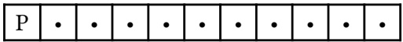

DFS tree search

BFS tree search

None of the above

**Solution:** Recall that DFS uses a stack, BFS uses a Queue, and UCS is equivalent to BFS when all costs are equal.

DFS will keep popping a “Right” at the top of the stack. Thus, DFS will go directly right and find the answer in exactly 10 expansions.

BFS (and UCS by extension) will pop from the beginning, and thus “backtrack” to go left after exploring the first “right” action. It will expand more than 100 states.

<!-- page: 3 -->

## (Question 1 continued…)

Q1.3 (2 points) A 1 × 11 grid with 10 dots, each worth 1 calorie. Pacman starts in the middle square.

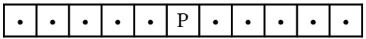

DFS tree search

BFS tree search

None of the above

**Solution:** The solution for this problem costs more than 10, therefore every algorithm will expand more than 10 states.

Q1.4 (2 points) A 1 × 5 grid with a single 10-calorie dot. The dot is at the right, and Pacman is at the left.

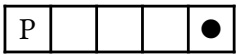

DFS tree search

BFS tree search

None of the above

## Solution:

DFS tree search will expand the states from left to right, finding the solution with 4 states expanded.

BFS tree search will expand (R=Right, L=Left):

• All cost-1 paths: R

• All cost-2 paths: RL and RR

• All cost-3 paths RLR, RRL, RRR

• All cost-4 paths: RLRL, RLRR, RRLL, RRLR, RRRL, RRRR

RRRR (the solution state) is the 12th state to be dequeued, so by the time you find the goal, 11 states have been expanded.

## Q1.5 (1 point) UCS where all actions cost 1 is always equivalent to which search algorithm?

O BFS

DFS

A\*

None

## Solution:

UCS explores all cost-1 paths, then all cost-2 paths, etc.

BFS explores all 1-action paths, then all 2-action paths, etc.

If all actions cost 1, these behave exactly the same.

<!-- page: 4 -->

Four CS 188 TAs want to line up to take staff photos, and Pacman wants to assign each TA to one position. There are 6 possible positions for TAs to stand, numbered 1 through 6 from left to right. The TAs are the variables, and the positions are the values.

No two TAs can stand in the same position. Not all positions need to be assigned to a TA.

The TAs have special requests:

• Advika (𝐴) does not want anyone to stand directly to her left or right.

• Josh (𝐽) does not want to stand in the leftmost or rightmost position.

• Michael (𝑀) wants to stand directly next to Josh.

• Saathvik (𝑆) does not want to stand directly next to Josh.

Two example assignments are shown below. The invalid assignment violates Advika’s, Josh’s, and Michael’s requests, though Saathvik’s request is satisfied.

Valid:

| A |  | M | J |  | S |
| --- | --- | --- | --- | --- | --- |
| 1 | 2 | 3 | 4 | 5 | 6 |

Invalid:

| J |  |  | S | M | A |
| --- | --- | --- | --- | --- | --- |
| 1 | 2 | 3 | 4 | 5 | 6 |

Q2.1 (1 point) Which type of constraint can be used to represent Advika’s request in a single constraint?

Unary

Binary

Higher-order

## Solution:

To check that nobody is to Advika’s left/right, we need to check every TA to make sure that none of them are directly left/right of Advika.

The TAs are variables. Since we have to check more than 2 variables for this constraint, it is a higher-order constraint.

Q2.2 (1 point) Which type of constraint can be used to represent Josh’s request in a single constraint?

Unary

Binary

Higher-order

## Solution:

This is unary because this constaint only involves 1 variable, Josh. Josh’s constraint does not involve checking any other TA’s value.

<!-- page: 5 -->

Q2.3 (2 points) For this subpart, no variables are assigned, and every variable’s domain is {1, 2, 3, 4, 5, 6}. Pacman uses LCV (least constraining value) with forward checking to assign Advika first. Select all value(s) that LCV could assign to 𝐴.

1

□ 2

□ 3

□ 4

5

6

## Solution:

For each possible value, try assigning that value, run forward checking and see how many values get eliminated from other variables’ domains. The LCV(s) are the possible value(s) that eliminate the fewest values from other variables’ domains.

If Advika picks Position 1, then every TA loses 2 positions from their domain (1 and 2). Likewise, if Advika picks Position 6, then every TA loses 2 positions from their domain (5 and 6).

If she picks any other value, then every TA loses 3 spots. For example, if Advika picks Position 2, then every TA loses 1, 2, and 3 from their domains.

Therefore, the least-constraining values are 1 and 6, since they remove the fewest values from other variables’ domains.

For the next two subparts, consider the partial assignment and domains below:

|  |  |  |  |  | A |
| --- | --- | --- | --- | --- | --- |
| 1 | 2 | 3 | 4 | 5 | 6 |

𝐽 : {2, 3, 4}

𝑀 : {1, 3, 4}

𝑆 : {1, 3, 4}

Q2.4 (2 points) Pacman runs arc consistency to check the arc (𝑆 → 𝐽).

Select all values that **remain** in the domain of 𝑆.

1

3

□ 4

None of the above

**Solution:** When we process an arc, we remove all values in the tail’s domain that would result in the head having no valid values.

• For 𝑆 = 1, 𝐽 can take the value of 4.

• For 𝑆 = 3, 𝐽 has no valid values— 2 and 4 would be removed from applying S’s request, and 3 would be removed because they cannot stand in the same position.

• For 𝑆 = 4, 𝐽 can take the value of 2.

We would therefore prune 3 from S’s domain, leaving 1 and 4.

<!-- page: 6 -->

Q2.5 (3 points) Suppose Pacman runs the arc consistency algorithm covered in lecture (AC-3). Select all arcs that are enqueued after processing the (𝑆 → 𝐽) arc.

$$
\boxed {\quad} (J \to S)
$$

$$
\square (J \to M)
$$

$$
\square (M \to S)
$$

$$
\square (S \to J)
$$

$$
\square (M \to J)
$$

$$
\square (S \to M)
$$

None of the above

**Solution:** With AC-3, you enqueue all neighbors of the tail variable, if any values are pruned from its domain. So we would add all arcs that end with 𝑆. Here, that would be $J \rightarrow S$ and $M \to S .$

Partial credit is given if you do not prune any domains in 2.4, in which case no arcs would be enqueued, and you should select “None of the above”.

As long as you prune any variable in 2.4, the solution to 2.5 is as given.

<!-- page: 7 -->

Pranav and Catherine are playing a game. Pranav acts as a standard maximizer (represented by triangles), and Catherine is represented by hexagonal nodes. Catherine chooses an action that **minimizes** some function 𝑓 applied to each of the child nodes.

## For example:

$\operatorname { I f } f ( x ) = x$ , then Catherine acts as a standard minimizer.

$\operatorname { I f } f ( x ) = - x ,$ , then Catherine acts as a standard maximizer.

• If 𝑓(𝑥) = 0, then Catherine randomly selects an action, since she will see each of her children as having an equal value of 0.

## Assumptions:

• Pranav always knows Catherine’s strategy and acts optimally.

• Terminal nodes are labeled with Pranav’s utility, not Catherine’s utility.

• Unless otherwise stated, terminal nodes are unbounded (can take any real value).

Q3.1 (1 point) For this subpart only, consider the tree to the right:

If Catherine chooses an action that minimizes the function

$$
f (x) = \left\{ \begin{array}{l} 1 \text {if} x \geq 0 \\ 0 \text {if} x <   0 \end{array} \right.
$$

what utility does Pranav receive in this game tree, assuming he acts optimally?

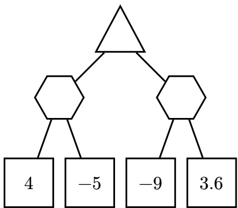

4

−5

−9

3.6

## Solution: 𝑓(4) = 1, 𝑓(−5) = 0, 𝑓(−9) = 0, 𝑓(3.6) = 1

Since Catherine minimizes 𝑓, she will choose −5 for the left hexagonal node and −9 for the right hexagonal node. Pranav will then choose the maximum of −5 and −9 which is −5.

<!-- page: 8 -->

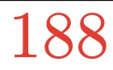

(Question 3 continued…)

Q3.2 (2 points) For this subpart only, consider the tree below:

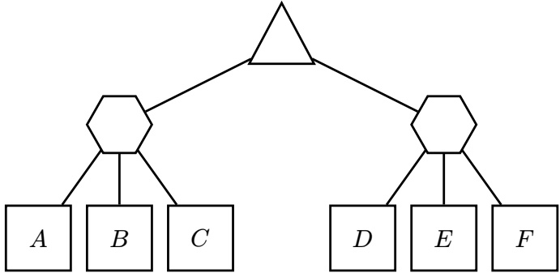

If Catherine chooses an action that minimizes the function

$$
f (x) = (x - 1 8 8) ^ {2}
$$

what values of 𝐴 make it possible to prune 𝐵? If no values of 𝐴 cause 𝐵 to be pruned, leave both boxes blank and bubble None.

Assume that nodes are evaluated from left to right, and we prune on equality.

None

**Solution:** The minimum value of 𝑓 is attained at $x = 1 8 8 ,$ so if 𝐴 = 188, the hexagonal node already has minimized 𝑓. Since we prune on equality, 𝐵 (and also 𝐶) can be pruned if $1 8 8 \leq$ $A \leq 1 8 8 .$

For the remaining subparts, consider any game tree with alternating maximizer and hexagonal nodes, not necessarily the tree above.

Assumptions for the remaining subparts:

• Both Pranav and Catherine evaluate the entire game tree (no depth-limiting).

• No alpha-beta pruning takes place.

Q3.3 (2 points) Catherine minimizes the same function 𝑓 as above:

$$
f (x) = (x - 1 8 8) ^ {2}
$$

For some given game tree, Pranav’s utility when Catherine minimizes $f ( x ) = ( x - 1 8 8 ) ^ { 2 }$ is strictly less than Pranav’s utility when Catherine is a standard minimizer.

always

sometimes

never

**Solution:** Proof by contradiction: Assume Catherine can achieve a lower utility by minimizing 𝑓(𝑥) compared to acting as a standard minimizer. Then, that means Catherine’s optimal policy as a minimizer isn’t truly an optimal policy. Since we have a contradiction, Catherine cannot achieve a strictly lower utility by using 𝑓(𝑥).

<!-- page: 9 -->

(Question 3 continued…)

Q3.4 (1 point) Which type of game can model this scenario for **all** functions 𝑓?

Minimax

Multi-Agent Utilities

Expectimax

None of the above

**Solution:** We can give both agents their own utility to maximize. Pacman can try to maximize his original utility, 𝑥. And Catherine can try to maximize a separate utility that we define as $- f ( x )$

Q3.5 (3 points) For this subpart only, assume the values at all leaf nodes are strictly positive.

Which of the following functions will cause Catherine to always act like a standard minimizer? Select all that apply.

□ 1𝑥

ReLU(𝑥)

𝑥 + 5

log(𝑥)

□ 𝑒𝑥

□ 𝑥 − 5

None of the above

**Solution:** Any monotonically increasing function will order the utility of Catherine’s children in the same fashion as the identity function 𝑓(𝑥) = 𝑥 which results in her acting like a standard minimizer. $\frac { 1 } { x }$ is the only function given which is not monotonically increasing on the positive real numbers.

Counterexample: Suppose a hexagon node has two children, 5 and 6. The minimizer chooses 5. If we apply $\begin{array} { r } { f ( x ) = \frac { 1 } { x } , } \end{array}$ , then the minimizer chooses 6 because $\textstyle { \frac { 1 } { 6 } } < { \frac { 1 } { 5 } }$

Note: 𝑥 − 5 could cause Catherine to see some negative numbers, but the relative ordering of the numbers is the same, so Catherine still chooses the action that a minimizer would.

<!-- page: 10 -->

Consider a 1 × 2 grid where Blinky can be in the left or right square. At each time step, Blinky will move left with probability 0.5 or move right with probability 0.5. If the move would result in Blinky moving off the grid, Blinky stays in the same position.

State **Left** represents Blinky in the left square, and state **Right** represents Blinky in the right square.

An example is shown below that starts in state **Left**.

Pacman is trying to defeat Blinky and has 3 possible actions: **Bust Left**, **Bust Right**, and **Don't Bust**. Note that Pacman does not have control over Blinky.

**Bust Left** and **Bust Right** give a reward of +1 for busting correctly (the same square as Blinky), and −1 for busting incorrectly. The **Bust Left** and **Bust Right** actions transition into a terminal state X where no further actions or rewards are available, regardless of whether the bust was correct.

The **Don't Bust** action gives a reward of 0. Then, Blinky moves left or right, and Pacman can take another action.

<!-- page: 11 -->

Q4.1 (4 points) Fill in the table for the transition and reward functions (some rows have been omitted). If a transition $( s , a , s ^ { \prime } )$ occurs with probability 0, write $`` \mathrm{NA}  ''$ in the box for $R ( s , a , s ^ { \prime } )$

Solution: The full table is shown below, with rows asked in the question highlighted in yellow.

| s | a | s' | T(s,a,s') | R(s,a,s') |
| --- | --- | --- | --- | --- |
| Left | Bust Left | Left | 0 | N/A |
| Left | Bust Left | Right | 0 | N/A |
| Left | Bust Left | X | 1 | +1 |
| Left | Bust Right | Left | 0 | N/A |
| Left | Bust Right | Right | 0 | N/A |
| Left | Bust Right | X | 1 | -1 |
| Left | Don't Bust | Left | 0.5 | 0 |
| Left | Don't Bust | Right | 0.5 | 0 |
| Left | Don't Bust | X | 0 | N/A |
| Right | Bust Left | Left | 0 | N/A |
| Right | Bust Left | Right | 0 | N/A |
| Right | Bust Left | X | 1 | -1 |
| Right | Bust Right | Left | 0 | N/A |
| Right | Bust Right | Right | 0 | N/A |
| Right | Bust Right | X | 1 | +1 |
| Right | Don't Bust | Left | 0.5 | 0 |
| Right | Don't Bust | Right | 0.5 | 0 |
| Right | Don't Bust | X | 0 | N/A |

Q4.2 (2 points) If we were to also include the omitted rows, how many rows are in the full table? Note: Include rows where $T ( s , a , s ^ { \prime } ) = 0$ 8 12 18 24 30

**Solution:** 18. There are 2 states with possible actions, 3 actions from those states, and 3 possible successor states, which yields $2 \times 3 \times 3 = 1 8 .$ . Note that there are no rows where the first column 𝑠 is X because there are no actions available from X. (Even if you did do this, you would get $3 \times 3 \times 3 = 2 7$ which is not an answer choice.)

<!-- page: 12 -->

Q4.3 (3 points) Suppose that at time step 𝑡 = 0, Pacman believes Blinky is in the **Left** square with probability 𝑝 and is in the **Right** square with probability 1 − 𝑝. Recall that Blinky moves left or right, each with probability 0.5, at each time step. After one time step, with what probability does Pacman believe Blinky is in the **Left** square? 0 0.5𝑝 𝑝 0.5 1 − 𝑝 1

Solution: Note that if Blinky is in the Left square, then he moves left with probability 0.5, ending in Left, and moves right with probability 0.5, ending in Right. The same logic applies if Blinky started in Right.
Assume the current time step is $t$ and the state is $s_t$.
$B(s_t = \text{Left}) = p$
$B(s_t = \text{Right}) = 1 - p$
$P(s_{t+1} = \text{Left} \mid s_t = \text{Left}) = 0.5$
$P(s_{t+1} = \text{Right} \mid s_t = \text{Left}) = 0.5$
$P(s_{t+1} = \text{Left} \mid s_t = \text{Right}) = 0.5$
$P(s_{t+1} = \text{Right} \mid s_t = \text{Right}) = 0.5$
The time update step is
$B'(s_{t+1} = \text{Left}) = P(s_{t+1} = \text{Left} \mid s_t = \text{Left})B(s_t = \text{Left})$
$+P(s_{t+1} = \text{Left} \mid s_t = \text{Right})B(s_t = \text{Right})$
$= 0.5p + 0.5(1 - p)$
$= 0.5$
and similarly for $B'(s_{t+1} = \text{Right}) = 0.5$.
Since there is no evidence, the observation update is not required, and the probabilities are already normalized, so $B(s_{t+1} = \text{Left}) = 0.5$.

For the remaining subparts, suppose Pacman observes an imperfect sensor to gain information about Blinky’s location.

At any given time step 𝑡, the sensor’s observation $( o _ { t } )$ matches Blinky’s location $( s _ { t } )$ with probability 0.7 and does not match Blinky’s location with probability 0.3.

<!-- page: 13 -->

Q4.4 (2 points) Fill in the table for $P ( O _ { t } \mid S _ { t } )$

<table><tbody><tr><td>𝑜𝑡</td><td>𝑠𝑡</td><td>𝑃(𝑜𝑡 | 𝑠𝑡)</td></tr><tr><td rowspan="3">Left</td><td rowspan="3">Left</td><td></td></tr><tr><td>Solution: 0.7</td></tr><tr><td></td></tr><tr><td rowspan="3">Left</td><td rowspan="3">Right</td><td></td></tr><tr><td>Solution: 0.3</td></tr><tr><td></td></tr><tr><td rowspan="3">Right</td><td rowspan="3">Left</td><td></td></tr><tr><td>Solution: 0.3</td></tr><tr><td></td></tr><tr><td rowspan="3">Right</td><td rowspan="3">Right</td><td></td></tr><tr><td>Solution: 0.7</td></tr><tr><td></td></tr></tbody></table>

Q4.5 (1 point) Suppose the sensor reports that Blinky is in the **Left** square and the discount factor is $\gamma < 1$ . What is the optimal action given this observation? **Bust Left Bust Right Don't Bust**

**Solution:** Since the sensor is correct a majority of the time, the best thing to do given this observation is to **Bust Left**, which gives reward +1 more often than it gives −1. **Bust Right** will more often give −1 than +1, and **Don't Bust** will always give a reward of 0.

If you **Don't Bust**, the transition model means that the current sensor report gives you no additional information about the next state, since Blinky’s next state does not depend on his current state. This means its better fo Pacman to act now, instead of allowing 𝛾 to decay his future reward.

Q4.6 (2 points) Suppose the sensor reports that Blinky is in the **Left** square. Assuming $\gamma < 1 ,$ , what is the expected return when acting optimally given this observation? 0 0.3 0.4 0.5 0.7 1

**Solution:** As explained in the previous subpart, the optimal action is to **Bust Left**. The expected return is then (+1) ⋅ 0.7 + (−1) ⋅ 0.3 = 0.4. Note that $\gamma < 1$ doesn’t affect the return here, as we will terminate immediately following this action.

<!-- page: 14 -->

Consider the Bayes net below. Each random variable is binary (has two possible values).

Suppose we want to compute $P ( B \mid + e )$ , using variable elimination.

Q5.1 (1 point) We join and eliminate on 𝐴 first.

What is the size of the factor generated when we join on 𝐴 (but before we eliminate on $A ) ?$

Note: The size of a factor denotes the number of rows in its CPT.

$2 ^ { 0 }$

$2 ^ { 1 }$

22

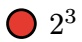

$2 ^ { 4 }$

$2 ^ { 5 }$

## Solution:

The factors before we start are the CPTs:

$P ( A )$

$P ( B )$

$P ( C \mid A , B )$

$P ( D \mid C )$

$P ( + e \mid C )$

Joining on 𝐴 gives the factor $f(A,B,C)$ , which has table size $2 ^ { 3 }$ (since there are 3 variables, and each variable is binary).

<!-- page: 15 -->

Solution:
The factors before joining on C are:
• $P(B)$
• $P(+e \mid C)$
• $f(B, C)$
• $f(C)$
Joining on C gives the factor $f(B, C, +e)$, which has table size $2^2$.

(Question 5 continued…)

## Q5.2 (1 point) We join and eliminate on 𝐷 next.

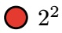

What is the size of the factor generated when we join on 𝐷 (but before we eliminate on 𝐷)? O $2 ^ { 0 }$ O $2 ^ { 1 }$ 22 O $2 ^ { 3 }$ O $2 ^ { 4 }$ O $2 ^ { 5 }$

| Solution: |
| --- |
| The factors before joining on D are: |
| P(B) |
| P(D \| C) |
| P(+e \| C) |
| f(B,C) |
| Joining on D gives the factor f(D,C), which has table size 22. |

## Q5.3 (1 point) We join and eliminate on 𝐶 first next (was clarified on the exam)

What is the size of the factor generated when we join on 𝐶 (but before we eliminate on 𝐶)? O $2 ^ { 0 }$ 21 22 O $2 ^ { 3 }$ O $2 ^ { 4 }$ O $2 ^ { 5 }$

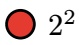

Regardless of your previous answers, suppose that the remaining factors after eliminating 𝐴, 𝐷, and 𝐶 are $f ( B , + e )$ and 𝑃(𝐵). Fill in the expression below to derive the desired probability $P ( B \mid + e )$

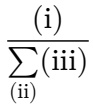

Q5.4 (1 point) Fill in blank (i). O $f ( B , + e ) P ( B )$ O $f ( B , + e )$ O $f ( b , + e ) ~ P ( b )$ O $f ( b , + e )$

Q5.5 (1 point) Fill in blank (ii). 𝑏 𝑏, 𝑒 𝑒

<!-- page: 16 -->

(Question 5 continued…)

Q5.6 (2 points) Fill in blank (iii).

$$
\bigcirc f (B, + e) P (B) \quad \bigcirc f (B, + e)
$$

$$
ⓞ f (b, + e) P (b)
$$

$$
\bigcirc f (b, + e)
$$

## Solution:

By Bayes’ rule:

$$
P (B \mid + e) = \frac {P (B , + e)}{P (+ e)}
$$

Expanding the denominator into a sum gives:

$$
P (B \mid + e) = \frac {P (B , + e)}{\sum_ {b} P (b , + e)}
$$

This expression requires knowing the joint distribution. Multiplying the two remaining factors gives the joint distribution over the remaining variables: $P ( B , + e ) = f ( B , + e ) \quad P ( B )$

Substituting in this joint distribution expression into the formula gives:

$$
P (B \mid + e) = \frac {f (B , + e) P (B)}{\sum_ {b} f (b , + e) P (b)}
$$

Now, suppose we want to estimate $P ( B \mid + e )$ using sampling.

Q5.7 (2 points) If we use **rejection** sampling, which of these variable orders can be used to produce a valid sample? Select all that apply.

$$
\boxed {A, B, C, D, E}
$$

$$
\boxed {B, A, C, E, D}
$$

𝐶, 𝐵, 𝐴, 𝐸, 𝐷

𝐷, 𝐸, 𝐴, 𝐵, 𝐶

$$
\square E, D, C, B, A
$$

None of the above

## Solution:

The variables must be sampled in a valid topological order. In other words, when there is an arrow from 𝑋 to 𝑌 , then 𝑋 must be sampled before 𝑌 .

<!-- page: 17 -->

(Question 5 continued…)

Q5.8 (2 points) Suppose $P(+e \mid +c)=P(+e \mid -c)=0.001$ , and $P(-e \mid +c) = P(-e \mid -c) = 0.999.$

If we use **likelihood weighting**, what are the weights of the samples produced?

All samples have weight 0.001.

All samples have weight 0.999.

~~Some~~ Most (was clarified on the exam) samples have weight 0.001, and the remaining samples all have weight 0.999.

~~Some~~ Most (was clarified on the exam) samples have weight 0.999, and the remaining samples all have weight 0.001.

## Solution:

Likelihood weighting only accepts samples consistent with the evidence, and weights each sample by the probability of the evidence variable given its parents.

The probability of the evidence +𝑒 (given its parent 𝐶) is always 0.001, so all samples have weight 0.001.

Q5.9 (2 points) Regardless of your previous answers, consider a scenario where likelihood weighting outputs samples that all have the same weight.

You are given many samples generated from likelihood weighting. Select all strategies that compute a consistent estimate for $P ( + b \mid + e )$

Number of samples with +𝑏, divided by total number of samples.

Number of samples with +𝑒, divided by total number of samples.

Sum of weights of all samples with +𝑏, divided by sum of weights of all samples.

Sum of weights of all samples with +𝑒, divided by sum of weights of all samples.

None of the above

## Solution:

The third option is always correct, because it’s a weighted count of the samples with +𝑏.

Because all samples have the same weight, a count-based estimate gives the same value as a weighted count.

The second and fourth option are incorrect, since all samples generated with likelihood weighting are consistent with the evidence. Therefore, these two options always compute 1.0.

<!-- page: 18 -->

Q5.10 (2 points) For this subpart only, suppose we want to estimate $P(+e \mid +a)$ using **rejection** sampling. We generate samples by sampling each variable, one at a time. Which of the following variables, when sampled first, results in samples being rejected as early as possible?

**Solution:** Sampling 𝐴 first makes it so that samples are rejected as early as possible, since our evidence $\mathbf { i } \mathbf { s } + a .$

<!-- page: 19 -->

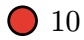

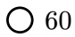

Blinky is taking an exam and considers the utility of cheating. We model his thought process as follows:

1. Blinky chooses his level of cheating 𝐿, which is a real number from 0 to 1.

For example, 𝐿 = 0 represents no cheating, $L = 1$ represents the most cheating, and $L = 0 . 7$ represents a lot of cheating.

2. After the exam, Blinky is either caught (+𝑐) or not caught (−𝑐). The value of 𝐶 is sampled from a probability distribution $P ( C \mid L )$ The probability that Blinky is caught is $P ( + c \mid L ) = L$ , and $P ( - c \mid L ) = 1 - L .$

3. If Blinky is caught, he receives utility −50. If Blinky is not caught, he receives utility $1 0 + 1 0 0 L$

Q6.1 (1 point) What is Blinky’s expected utility if $L = 0 ?$ −50 −40 5 10

Q6.2 (1 point) What is Blinky’s expected utility if $L = 1 ?$ −50 $\bigcirc - 4 0$ 5 10 60 100 110

Q6.3 (2 points) What is Blinky’s expected utility if $L = 0 . 5 ?$

$$
\bigcirc - 50
$$

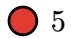

**Solution:** For parts 6.1 - 6.3, we plug in the given value of 𝐿 into the expected utility expression: $L \times ( - 5 0 ) + ( 1 - L ) \times ( 1 0 + 1 0 0 L )$ $6.1 \because \left( 0 \times - 50 \right) + \left( 1 - 0 \right) \times \left( 10 + 100 \times 0 \right) = 0 + 10 = 10$ $6.2 \because \left( 1 \times - 50 \right) + \left( 1 - 1 \right) \times \left( 10 + 100 \times 0 \right) = - 50 + 0 = - 50$ $6.3 \colon (0.5 \times -50) + (1 - 0.5) \times (10 + 100 \times 0.5) = -25 + 0.5(60) = -25 + 30 = 5$

<!-- page: 20 -->

(Question 6 continued…)

Q6.4 (3 points) What 𝐿 maximizes Blinky’s utility?

Hint: A quadratic $a x ^ { 2 } + b x + c$ achieves its maximum (assuming one exists) at $\begin{array} { r } { x = - \frac { b } { 2 a } } \end{array}$

0.2

## Solution:

In real life, the penalty for getting caught is much more severe than −50, so even though the optimal cheating level is 0.2 in this question, you shouldn’t cheat!

The expected utility, given some cheating level $L ,$ is represented by:

$$
L (- 5 0) + (1 - L) (1 0 + 1 0 0 L)
$$

$$
= - 5 0 L + 1 0 + 1 0 0 L - 1 0 L - 1 0 0 L ^ {2}
$$

$$
= - 1 0 0 L ^ {2} + 4 0 L + 1 0
$$

To find the 𝐿 that maximizes the utility, we just need to find the value of 𝐿 that maximizes this expression.

Following the hint, this quadratic achieves its maximum at:

$$
\frac {- b}{2 a} = \frac {- 4 0}{- 2 0 0} = 0. 2
$$

Substituting $L = 0 . 2$ back into the quadratic yields an MEU of 14 as in the next subpart.

Q6.5 (2 points) Blinky’s MEU (maximum expected utility) is 14. What does this number represent?

If Blinky takes the exam many times, all with the optimal 𝐿, he receives utility 14 on average.

If Blinky takes the exam many times, all with the optimal $L ,$ he always receives utility 14.

When Blinky takes the exam with optimal $L ,$ the highest utility he can ever receive is 14.

When Blinky takes the exam with optimal $L ,$ the lowest utility he can ever receive is 14.

<!-- page: 21 -->

Q6.6 (2 points) Which decision network best models this scenario?

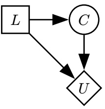

Network (i)

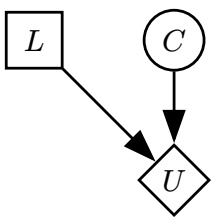

Network (ii)

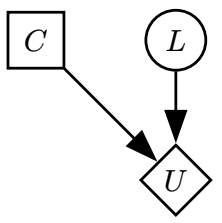

Network (iii)

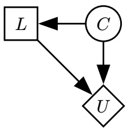

Network (iv)

## Solution:

Recall square nodes are action nodes; circle nodes are chance nodes; and diamond nodes are utility nodes.

In our scenario:

• 𝐿 represents an action that Blinky takes (choosing a level of cheating 𝐿).

• 𝐶 represents the probability that Blinky is caught, and it is dependent on his cheating (𝐿).

• 𝑈 is the utility, which is dependent on whether or not Blinky is caught, and how much cheating he did (𝑈 is dependent on 𝐿 and 𝐶.)

Network (i) correctly shows these relationships.

Network (ii) does not show that Blinky’s cheating level affects his probability of being caught.

Network (iii) incorrectly labels 𝐶, the chance of being caught, as an action node, and also mislabels 𝐿, the choice of cheating level, as a chance node.

Network (iv) incorrectly shows 𝐿 as being dependent of 𝐶. Blinky’s choice of cheating level 𝐿 is not probabilistically dependent on his chance of being caught 𝐶. Recall that edges represent conditional relationships, just like Bayes Nets.

<!-- page: 22 -->

Oh no! Blinky was caught cheating on his exam and is now trying to escape! At any given time, Blinky’s location (𝐿) is either Dwinelle, VLSB, or Stanford.

We want to compute a belief distribution over Blinky’s location using particle filtering.

Q7.1 (2 points) Suppose we use 10 particles. We pause the particle filtering algorithm immediately after an observation update.

Which statement implies that 𝐿 = Stanford with probability 0.9 at this time step?

There are exactly 9 particles at Stanford.

We add up the un-normalized weights of all the particles at Stanford, and the sum is 9.0.

We add up the un-normalized weights of all the particles at Stanford, and the sum is 0.9.

We add up the normalized weights of all the particles at Stanford, and the sum is 0.9.

**Solution:** Since the weights of the particles are normalized at the end of the observation update step, the number of particles represents the likelihood of each location, which means option 1 is correct. The middle two options do not normalize, which is problematic since they could add up to a number greater than 1. Normalizing gives a valid probability distribution, which leads us to the last option also being correct. Credit was given for selecting either option 1 or option 4.

Suppose there are two cameras $( C _ { 1 } , C _ { 2 } )$ that are conditionally independent given 𝐿. We are only able to observe Blinky’s location using these cameras.

Q7.2 (2 points) Which graph always represents the scenario where $C _ { 1 }$ and $C _ { 2 }$ are conditionally independent given 𝐿?

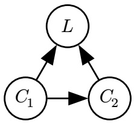

Graph (i)

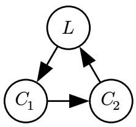

Graph (ii)

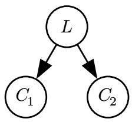

Graph (iii)

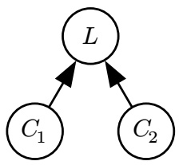

Graph (iv)

**Solution:** In Graph $( \mathrm { i } ) ,   C _ { 2 }$ is directly dependent on $C _ { 1 }$

Graph (ii) is not a valid Bayes Net (it is cyclical); also, $C _ { 2 }$ is directly dependent on $C _ { 1 }$

Graph (iv) is incorrect, because $C _ { 1 }$ and $C _ { 2 }$ would be dependent given 𝐿 (observing a common effect of two variables makes them dependent).

<!-- page: 23 -->

Q7.3 (2 points) In the observation update, how do we calculate the weight 𝑤 of a particle?

$$
ⓞ w \leftarrow P (c _ {1} \mid \ell) \cdot P (c _ {2} \mid \ell)
$$

$$
\bigcirc w \leftarrow P (c _ {1}, c _ {2} \mid \ell) \cdot P (\ell)
$$

$$
\bigcirc w \leftarrow P (c _ {1} \mid \ell) \cdot P (c _ {2} \mid c _ {1})
$$

**Solution:** The observation update sets the weight of the particle, which represents a specific location, to “the chance of seeing those observations given the particle’s state”— in other words, how likely would we see these observations if this particle were correct?

Since we know the cameras are conditionally independent given 𝐿, we can write the answer as $w \gets P ( C _ { 1 } | L ) \cdot P ( C _ { 2 } | L )$

Q7.4 (2 points) At some time during the particle filtering algorithm, we have the four weighted particles shown on the right.

During the re-sampling step, what is the probability that a newly re-sampled particle is at Stanford?

## Solution:

Sum of weights is $0.4 + 0.2 + 0.9 + 0.1 = 1.6.$

Sum of weights on Stanford, 𝑠, is 0.2.

Thus, the probability that a resampled particle is in state 𝑠 is $0 . 2 / 1 . 6 = 1 / 8 .$

|  | Location (𝐿) | Weight |
| --- | --- | --- |
| Particle 1: | Dwinelle | 0.4 |
| Particle 2: | Stanford | 0.2 |
| Particle 3: | Dwinelle | 0.9 |
| Particle 4: | VLSB | 0.1 |

<!-- page: 24 -->

Q8.1 (2 points) Select all true statements about the Sigmoid function (shown below).

$$
\operatorname{Sigmoid} (x) = \frac {1}{1 + e ^ {- x}}
$$

Sigmoid outputs values between 0 and 1.

Sigmoid is monotonically increasing.

Sigmoid is linear.

None of the above

Sigmoid is non-negative.

**Solution:** The first option is correct, as the denominator will always be strictly greater than 1.

Sigmoid is nonlinear, so the second option is incorrect.

Sigmoid can never be negative, so the third option is correct.

As 𝑥 increases, −𝑥 decreases, so $\exp ( - x )$ decreases, and the denominator $1 + \exp ( - x )$ decreases. Since we are dividing by a smaller number as 𝑥 increases, Sigmoid’s value will increase as 𝑥 increases. This is monotonically increasing, so the fourth option is correct.

For the next two subparts, a perceptron classifier has the following weight vectors for three classes (“Sports”, “Music”, “Books”):

$$
w _ {\mathrm{Sports}} = [ 5, 4, 5 ]
$$

$$
w _ {\mathrm{Music}} = [ 3, 8, 2 ]
$$

$$
w _ {\mathrm{Books}} = [ 2, 3, 4 ]
$$

Now, the classifier is updated a single time, using a new data point with feature vector $[ 1 , - 1 , 2 ]$ and class “Books”.

<!-- page: 25 -->

## (Question 8 continued…)

| ○ [6, 3, 7] | ○ [4, 5, 3] | ● [3, 8, 2] | ○ [3, 2, 6] |
| --- | --- | --- | --- |
| ○ [5, 4, 5] | ○ [4, 7, 4] | ○ [2, 9, 0] | ○ [2, 3, 4] |

| Solution: |
| --- |
| First, attempt to classify the new data point: |
| Sports score: [5, 4, 5] · [1, -1, 2] = 11Music score: [3, 8, 2] · [1, -1, 2] = -1Books score: [2, 3, 4] · [1, -1, 2] = 7 |
| Therefore, we classify the data point as Sports. However, the true classification is Books, so we need to subtract [1, -1, 2] from Sports, and add [1, -1, 2] to Books. |
| The Music data point is left unchanged. |
| New weight vectors: |
| $w_{\text{sports}} = [5, 4, 5] - [1, -1, 2] = [4, 5, 3]$$w_{\text{music}} = [3, 8, 2]$$w_{\text{books}} = [2, 3, 4] + [1, -1, 2] = [3, 2, 6]$ |

Q8.3 (2 points) What are the new weights for $w _ { \mathrm { B o o k s } }$ after the update?

| ○ [6, 3, 7] | ○ [4, 5, 3] | ○ [3, 8, 2] | ● [3, 2, 6] |
| --- | --- | --- | --- |
| ○ [5, 4, 5] | ○ [4, 7, 4] | ○ [2, 9, 0] | ○ [2, 3, 4] |

| Solution: |
| --- |
| See solution to previous subpart. |

In the next two subparts, consider a naive Bayes classifier for emails, just like the one from lecture. The classes are “Ham” and “Spam”.

Each email is featurized into a 3-element feature vector using the binary bag-of-words model with words “Free”, “Money”, and “Now”. For example, the email “hello money” is featurized into [0, 1, 0], and the email “now now money” is featurized into [0, 1, 1].

<!-- page: 26 -->

(Question 8 continued…)

Q8.4 (2 points) We want to add a new feature word “Ring” to the classifier. Select all information about the training dataset needed to compute 𝑃(Ring = 1 | class = Spam).

The choices are not independent, e.g. selecting all choices means you need all 4 values. Assume you don’t know the total number of Ham and Spam emails.

Number of “Spam” emails containing the word “Ring”.

Number of “Ham” emails containing the word “Ring”.

Number of “Spam” emails **not** containing the word “Ring”.

Number of “Ham” emails **not** containing the word “Ring”.

None of the above

## Solution:

Naive Bayes classifies by a count estimate, the simple ratio of # Spam emails containing Ring. # Spam emails in total

Since we do not have the total number of Spam emails, we need the number of “Spam” emails not containing “Ring”, in order to derive the number of “Spam” emails in total.

<!-- page: 27 -->

The table below shows the results of running the classifier on a given test dataset:

| Predicted Class | True Class | 𝑃(Predicted Class \| True Class) |
| --- | --- | --- |
| Spam | Spam | 0.6 |
| Spam | Ham | 0.2 |
| Ham | Spam | 0.4 |
| Ham | Ham | 0.8 |

In the test dataset, 10% of the data points are “Spam”.

Q8.5 (1 point) What is the **precision** of the classifier, treating “Spam” as the positive class? Hint from lecture slides: Precision $\begin{array} { r } { = \frac { \mathrm { T P } } { \mathrm { T P } + \mathrm { F P } } } \end{array}$ 0.2 0.25 0.4 0.6 0.75 0.8

Q8.6 (1 point) What is the **recall** of the classifier, treating “Spam” as the positive class? Hint from lecture slides: $\begin{array} { r } { \mathrm { R e c a l l } = \frac { \mathrm { T P } } { \mathrm { T P } + \mathrm { F N } } } \end{array}$ 0.2 0.25 0.4 0.6 0.75 0.8

**Solution:**

• TP = True Positive (predicted “Spam”, true class is “Spam”)

• FP = False Positive (predicted “Spam”, true class is Ham)

• FN = False Negative (predicted Ham, true class is “Spam”)

Note: A previous version of this solution did not properly account for the proportion of “Spam” in the test dataset, and incorrectly noted 0.75 as the answer to 8.5. This solution has been updated.

Weighting by the proportion of the classes in the test dataset (0.1 “Spam”, 0.9 “Ham”) in order to get the number of TP, FP, FN, we get:

Precision: $\begin{array} { r } { \frac { 0 . 1 \times 0 . 6 } { 0 . 1 \times 0 . 6 + 0 . 9 \times 0 . 2 } = \frac { 0 . 0 6 } { 0 . 2 4 } = 0 . 2 5 . } \end{array}$

Recall: $\begin{array} { r } { \left[ \frac { 0 . 1 \times 0 . 6 } { 0 . 1 \times 0 . 6 + 0 . 1 \times 0 . 4 } = \frac { 0 . 0 6 } { 0 . 1 } = 0 . 6 \right] } \end{array}$

The next two subparts are from the Transformers lecture.

Q8.7 (1 point) True or False: In multi-head attention, each attention head can specialize on extracting different information from the input sequence.

O True

False

**Solution:** This is true, based on empirical research.

If each attention head was extracting the same information from the input sequence, there wouldn’t be a benefit to using more attention heads!

<!-- page: 28 -->

(Question 8 continued…)

Q8.8 (1 point) True or False: Beam search decoding allows LLMs to investigate multiple potential sequences in parallel and select the best one based on a heuristic.

O True

False

**Solution:** True. Beam search decoding allows LLMs to choose a high likelihood sequence of tokens, while using a heuristic to reduce the amount of searching needed.

The next two subparts are from the guest lectures.

Q8.9 (1 point) Which of these are areas where we see bias in AI? Select all that apply.

Racial

Language

None of the above

**Solution:** AI has a large amount of bias, often a result of the training data used being inherently biased. It is an active field of research to mitigate these problems.

Bias shows up in all outputs, especially image generation and text outputs.

## Q8.10 (1 point) Which of the following is not a feature of a good model editing technique?

Reliability

Incoherence

Generalization

Locality

| Solution: Model editing is a technique to update a model’s knowledge or behavior. |
| --- |
| Incoherence is what we try to avoid with model editing; we want coherent outputs and avoid catastrophic forgetting or reduced reasoning capabilities. |
| Reliability measures a model’s ability to recall a fact accurately. |
| Generalization measures if a model can recall a fact under a variety of circumstances and contexts. |
| Locality ensures that other facts and capabilities remain consistent after editing; i.e. the editing is “local” and does not affect unintended, other parts of the model. |

<!-- page: 29 -->

Q9.1 (1 point) For unit vectors

$$
a = \left[ \begin{array}{c} a _ {1} \\ \vdots \\ a _ {n} \end{array} \right] \text {and} b = \left[ \begin{array}{c} b _ {1} \\ \vdots \\ b _ {n} \end{array} \right],
$$

what does the dot product $a \cdot b$ represent?

The difference in magnitude between 𝑎 and 𝑏.

The similarity between 𝑎 and 𝑏.

The sum of 𝑎 and 𝑏.

**Solution:** $\boldsymbol{a} \cdot \boldsymbol{b} = \| \boldsymbol{a} \| \| \boldsymbol{b} \|$ cos $\theta ,$ where 𝜃 is the angle between 𝑎 and 𝑏. Since 𝑎 and 𝑏 are unit vectors, this reduces to cos 𝜃, which is higher as the vectors point closer to the same direction, meaning the vectors are more similar.

Q9.2 (2 points) Which of the following is true about Softmax (shown below)?

Note: $\exp ( z ) = e ^ { z }$

$$
\text {Softmax} \left(\left[ \begin{array}{c} x _ {1} \\ \vdots \\ x _ {n} \end{array} \right]\right) = \left[ \begin{array}{c} \frac {\exp (x _ {1})}{\sum_ {i = 1} ^ {n} \exp (x _ {i})} \\ \vdots \\ \frac {\exp (x _ {n})}{\sum_ {i = 1} ^ {n} \exp (x _ {i})} \end{array} \right]
$$

The values in the output of Softmax form a valid probability distribution.

If $x _ { i } < x _ { j }$ , then after applying Softmax, the 𝑖th element is less than the 𝑗th element.

Softmax linearly scales all inputs to between 0 and 1.

Softmax can be used to introduce a non-linearity in a neural network.

None of the above

## Solution:

Option 1: Any softmaxed vector will sum to 1 with each entry being between 0 and 1, so that is a valid probability distribution.

Option 2: Softmax maintains the relative ordering of its elements since the exponential function does and so does scaling by a constant factor (the sum of each of the exponentiated individual inputs).

Option 3: Though Softmax does transform its inputs between 0 and 1, it does so nonlinearly.

Option 4: Softmax is nonlinear, so it can serve this purpose.

<!-- page: 30 -->

(Question 9 continued…)

This question continues on the next page.

<!-- page: 31 -->

(Question 9 continued…)

Blinky has a word bank containing {“Angry”, “Anxious”, “Excited”, “Sad”}. He uses a feature extraction function 𝑓 to convert the words into feature vectors, shown below.

Blinky builds a model that takes in a new word “Tired”, featurizes it into 𝑓(Tired), and wants to find the most similar word in the word bank.

Words in the bank:

$$
f (\text {Angry}) = \left[ \begin{array}{c} - 1 \\ 1 \end{array} \right]
$$

$$
f (\text {Anxious}) = \left[ \begin{array}{c} 0. 5 \\ - 2 \end{array} \right]
$$

$$
f (\text {Excited}) = \left[ \begin{array}{c} 2 \\ 2 \end{array} \right]
$$

$$
f (\mathrm{Sad}) = \left[ \begin{array}{c} - 1 \\ - 1 \end{array} \right]
$$

Blinky’s new word:

$$
f (\text {Tired}) = \left[ \begin{array}{c} - 1 \\ 2 \end{array} \right]
$$

Q9.3 (2 points) Blinky’s model uses the following equation, where 𝑤 is a word in the word bank.

$$
\text {SimilarityScore(Tired,} w) = \frac {\exp (f (\text {Tired}) \cdot f (w))}{\sum_ {w ^ {\prime} \in \text {bank}} \exp (f (\text {Tired}) \cdot f (w ^ {\prime}))}
$$

Which 𝑤 has the highest SimilarityScore with “Tired”?

Angry

Anxious

Excited

Sad

**Solution:** Though it is possible to calculate this directly, notice that the SimilarityScore is a softmax of the dot product of the feature vectors of the two words. This means that it will be highest with the most similar vector to 𝑓(Tired), which is “Angry”.

<!-- page: 32 -->

Q9.4 (2 points) For this subpart only, Xavier creates a XavierSimilarityScore model

$$
\text {XavierSimilarityScore(Tired,} w) = \frac {\exp (A f (\text {Tired}) \cdot f (w))}{\sum_ {w ^ {\prime} \in \text {bank}} \exp (A f (\text {Tired}) \cdot f (w ^ {\prime}))}
$$

where 𝐴 is a $2 \times 2$ matrix that transforms Tired’s feature vector from 𝑓(Tired) to $A   f ( { \mathrm { T i r e d } } )$

What choice of 𝐴 causes “Anxious” to have the highest XavierSimilarityScore to “Tired”?

$\bigcirc \begin{pmatrix} 1 & 0 \\ 0 & 1 \end{pmatrix}$ , which leaves 𝑓(Tired) unchanged.

$\bigcirc \begin{pmatrix} 0 & 1 \\ -1 & 0 \end{pmatrix}$ , which rotates 𝑓(Tired) 90 degrees clockwise.

$\begin{pmatrix}-1 & 0 \\0 & -1\end{pmatrix}$ , which rotates 𝑓(Tired) 180 degrees.

O $\begin{pmatrix} 2 & 0 \\ 0 & 2 \end{pmatrix}$ , which scales 𝑓(Tired) by 2.

**Solution:** Flipping 𝑓(Tired) will cause it to end up most similar to $f ( \mathrm { A n x i o u s } )$

<!-- page: 33 -->

(Question 9 continued…)

The diagram is reprinted for your convenience.

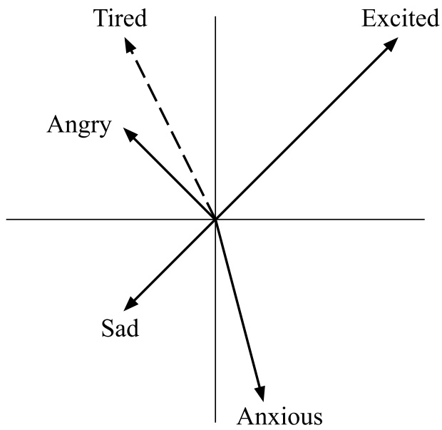

Words in the bank:

$$
f (\text {Angry}) = \left[ \begin{array}{c} - 1 \\ 1 \end{array} \right]
$$

$$
f (\text {Anxious}) = \left[ \begin{array}{c} 0. 5 \\ - 2 \end{array} \right]
$$

$$
f (\text {Excited}) = \left[ \begin{array}{c} 2 \\ 2 \end{array} \right]
$$

$$
f (\mathrm{Sad}) = \left[ \begin{array}{c} - 1 \\ - 1 \end{array} \right]
$$

Blinky’s new word:

$$
f (\text {Tired}) = \left[ \begin{array}{c} - 1 \\ 2 \end{array} \right]
$$

Q9.5 (2 points) For this subpart only, Noah creates a NoahSimilarityScore model:

NoahSimilarityScore $( \mathrm { T i r e d } , w ) = { \frac { \exp ( f ( { \mathrm { T i r e d } } ) \cdot B   f ( w ) ) } { \displaystyle \sum _ { w ^ { \prime } \in { \mathrm { \tiny ~ b a n k } } } \exp ( f ( { \mathrm { T i r e d } } ) \cdot B   f ( w ^ { \prime } ) ) } } .$

where 𝐵 is a $2 \times 2$ matrix that transforms each bank word’s feature vector from $f ( w )$ to $B   f ( w )$

What choice of 𝐵 causes $`` \mathrm{Sad}  ''$ to have the highest NoahSimilarityScore to “Tired”?

$\bigcirc \binom{1 \ 0}{0 \ 1}$ , which leaves $f ( w )$ unchanged.

O $\begin{pmatrix} 0 & 1 \\ -1 & 0 \end{pmatrix}$ , which rotates $f ( w )$ 90 degrees clockwise.

O $\begin{pmatrix}-1 & 0 \\0 & -1\end{pmatrix}$ , which rotates $f ( w )$ 180 degrees.

O $\begin{pmatrix} 2 & 0 \\ 0 & 2 \end{pmatrix}$ , which scales $f ( w )$ by 2.

**Solution:** Rotating each of the word bank feature vectors 90 degrees clockwise will cause $`` \mathrm{Sad''}$ to be most similar to $\text{" }  Tited  \text{" }.$

<!-- page: 34 -->

Q9.6 (1 point) For this subpart only, consider an AttentionScore model:

$$
\text {AttentionScore} (\text {Tired}, w) = \frac {\exp (f (\text {Tired}) \cdot f (w))}{\sum_ {w ^ {\prime} \in \text {bank}} \exp (f (\text {Tired}) \cdot f (w ^ {\prime}))} C f (w)
$$

where 𝐶 is a $1 \times 2$ matrix.

True or False: There exists a choice of 𝐶 such that “Anxious” has the highest AttentionScore with “Tired” out of all the words in the word bank.

## O True

## False

**Solution:** “Anxious” is the only vector with positive 𝑥-coordinate and negative 𝑦-coordinate. The SimilarityScore is a positive number between 0 and 1.

Note that $C f ( w )$ is essentially a dot product, since it multiplies a $1 \times 2$ matrix with a $2 \times 1$ matrix, the same as a row vector by a column vector.

If we positively weight the 𝑥-coordinate and negatively weight the 𝑦-coordinate by a large amount, every vector except for $f ( \mathrm { A n x i o u s } )$ will have at least one of its components weighted negatively, and 𝑓(Anxious) will have both components weighted positively, making Anxious’s AttentionScore significantly higher than every other word’s.

For example, $C = [ \substack { 1 8 8 - 1 8 8 } ]$ satisfies the requirements.
